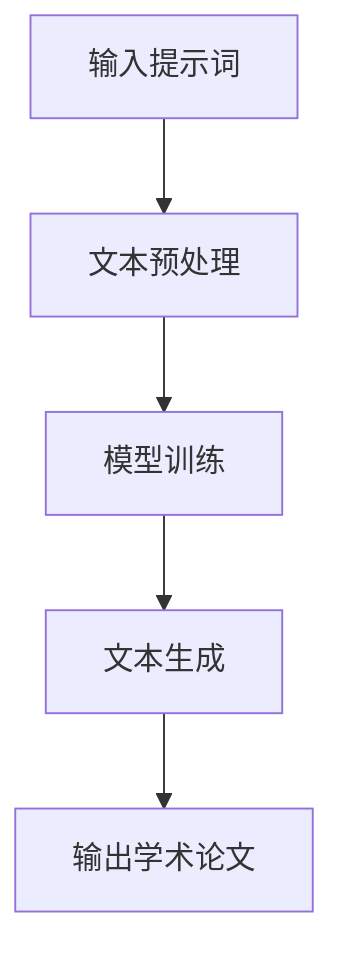

                 

## 《提示词编程在自动化学术论文生成中的角色》

### 关键词：提示词编程、自动化学术论文生成、文本生成模型、算法原理、实际应用

#### 摘要：

本文将探讨提示词编程在自动化学术论文生成中的角色，首先介绍提示词编程和自动化学术论文生成的背景，然后详细解析相关的核心概念和技术。接着，我们将深入讨论自动化学术论文生成的算法原理，并通过具体案例来展示其实际应用。最后，我们将对未来的发展趋势和潜在问题进行展望。

### 第一部分：背景介绍

#### 第1章：引言

在当今的信息时代，学术研究的速度和质量越来越受到重视。然而，学术论文的撰写过程往往繁琐且耗时。为此，自动化学术论文生成技术逐渐成为研究的热点。本文将探讨提示词编程在这一领域的角色。

**1.1 问题背景**

学术研究需要大量的文献阅读、整理和归纳，这是一个复杂且耗时的过程。传统的学术论文撰写方式依赖于人工处理，效率较低且容易出现错误。因此，自动化学术论文生成技术应运而生。

**1.2 提示词编程的概念**

提示词编程是一种利用机器学习和自然语言处理技术来生成文本的方法。它通过输入一组关键词或提示词，让计算机自动生成相关的文本内容。

**1.3 自动化学术论文生成的挑战**

自动化学术论文生成面临着多个挑战，包括如何准确提取和利用学术领域的专业知识，如何保证生成文本的准确性和可读性，以及如何处理大量的学术文献数据。

### 第二部分：核心概念与技术

#### 第2章：提示词编程基础

**2.1 提示词编程的定义**

提示词编程是一种利用机器学习和自然语言处理技术来生成文本的方法。它通过输入一组关键词或提示词，让计算机自动生成相关的文本内容。

**2.2 提示词编程的关键技术**

提示词编程的关键技术包括文本生成模型、语言模型和上下文理解等。其中，文本生成模型是核心，它决定了生成文本的质量和多样性。

**2.3 提示词编程的优势与局限性**

提示词编程具有高效、灵活和可扩展性等优势，但同时也存在生成文本的准确性和可读性等问题。这些问题需要通过不断的技术改进和优化来解决。

#### 第3章：自动化学术论文生成技术

**3.1 自动化学术论文生成的流程**

自动化学术论文生成的流程包括数据收集、文本预处理、模型训练和文本生成等步骤。每个步骤都需要精细处理，以确保生成文本的准确性和可读性。

**3.2 文本生成模型**

文本生成模型是自动化学术论文生成的核心。常见的文本生成模型包括序列到序列模型、递归神经网络和生成对抗网络等。

**3.3 提示词在自动化学术论文生成中的应用**

提示词在自动化学术论文生成中起到了关键作用。通过合理的提示词设计，可以显著提高生成文本的质量和准确性。

### 第三部分：算法原理

#### 第4章：自动化学术论文生成的算法原理

**4.1 算法概述**

自动化学术论文生成的算法主要包括文本生成模型、语言模型和上下文理解等。这些算法共同作用，实现了高质量的自动学术论文生成。

**4.2 算法数学模型**

自动化学术论文生成的算法数学模型主要包括概率模型和生成模型。概率模型用于描述文本生成的概率分布，生成模型则用于生成具体的文本内容。

**4.3 算法流程图**

以下是自动化学术论文生成的算法流程图：



### 第四部分：实际应用

#### 第6章：自动化学术论文生成项目实战

**6.1 项目环境搭建**

在本项目中，我们使用Python和TensorFlow作为开发工具。首先，我们需要安装相关的依赖库，如TensorFlow和Gensim。

```python
!pip install tensorflow gensim
```

**6.2 系统核心实现**

系统核心实现主要包括文本预处理、模型训练和文本生成三个部分。以下是一个简单的示例：

```python
# 文本预处理
def preprocess_text(text):
    # 去除标点符号和特殊字符
    text = re.sub(r"[^\w\s]", "", text)
    # 小写化
    text = text.lower()
    # 分词
    words = text.split()
    return words

# 模型训练
def train_model(words):
    # 创建词袋模型
    dictionary = corpora.Dictionary(words)
    # 创建语料库
    corpus = [dictionary.doc2bow(word) for word in words]
    # 训练LDA模型
    lda_model = gensim.models.LdaMulticore(corpus, num_topics=10, id2word=dictionary, passes=10, workers=2)
    return lda_model

# 文本生成
def generate_text(model, dictionary, num_words=50):
    # 生成文本
    topics = model.show_topics(num_topics=5, num_words=num_words)
    text = ""
    for topic in topics:
        text += " ".join(topic[1])
    return text
```

**6.3 项目应用与优化**

在实际应用中，我们可以根据需求对系统进行优化。例如，通过增加训练数据、调整模型参数等方式来提高生成文本的质量。

### 第五部分：拓展讨论

#### 第8章：未来发展趋势与潜在问题

**8.1 提示词编程在学术领域的发展趋势**

随着人工智能技术的不断发展，提示词编程在学术领域的应用前景广阔。未来，提示词编程有望实现更高效的学术论文生成，从而提高学术研究的效率。

**8.2 自动化学术论文生成的潜在问题**

尽管自动化学术论文生成技术取得了显著进展，但仍面临一些潜在问题，如生成文本的准确性、可读性和版权问题等。这些问题需要通过技术改进和法规完善来解决。

**8.3 未来发展方向**

未来，自动化学术论文生成技术的发展方向将包括提高生成文本的质量和准确性、探索更多应用场景以及完善相关法规。

### 结束语

提示词编程在自动化学术论文生成中发挥着重要作用。通过本文的探讨，我们对其有了更深入的了解。随着技术的不断进步，自动化学术论文生成有望在未来实现更广泛的应用。

#### 作者：AI天才研究院/AI Genius Institute & 禅与计算机程序设计艺术 /Zen And The Art of Computer Programming

