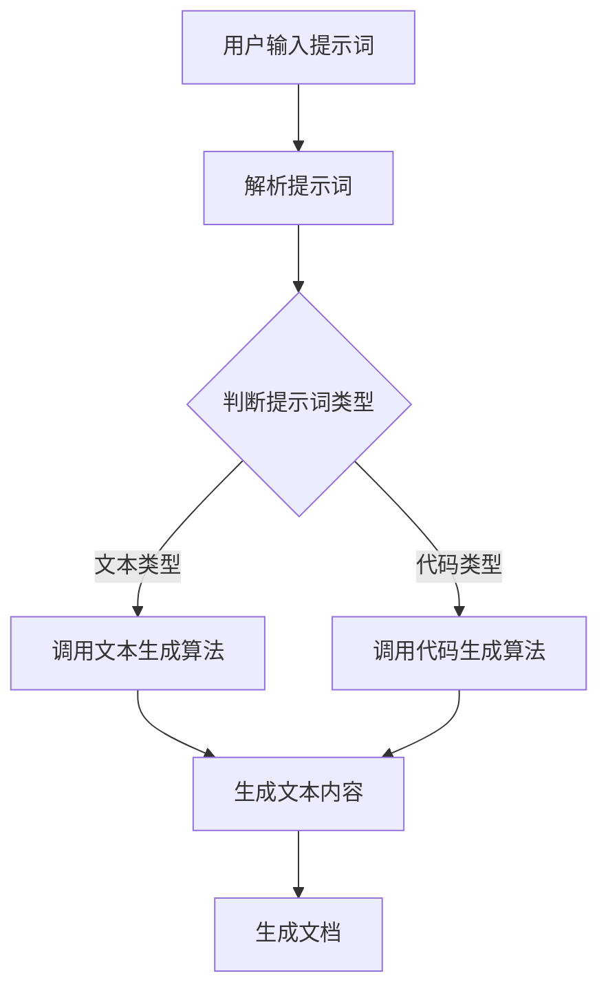
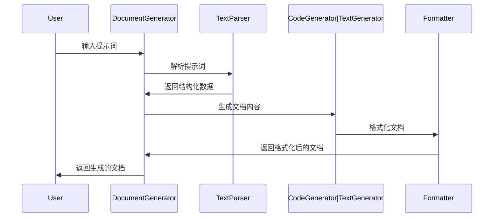
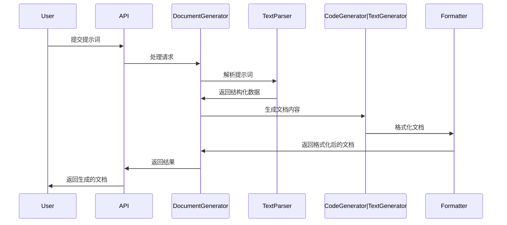

                 

### 《提示词编程在自动化文档生成中的应用》

#### 关键词：自动化文档生成、提示词编程、自然语言处理、代码生成、文本生成技术

> 摘要：本文旨在探讨提示词编程在自动化文档生成中的应用。首先，我们将回顾自动化文档生成的背景和发展历程，理解其意义和面临的挑战。接着，我们将介绍提示词编程的基础知识，包括其原理、机制以及如何选取和优化提示词。随后，我们将深入探讨自动化文档生成的技术框架，涵盖文档结构化处理和自然语言生成技术。在应用实践部分，我们将设计一个基于提示词编程的文档生成系统，并通过Python实现具体应用。文章还将通过实际案例展示提示词编程在文档生成中的效果，并总结最佳实践和优化策略。最后，我们将提供附录和拓展阅读资料，以供进一步学习。

---

### 第一部分：背景与概述

#### 第1章：自动化文档生成的背景

##### 1.1.1 文档生成技术的发展历程

文档生成技术经历了从手工编写到自动化处理的演变。早期，文档生成主要依靠人工撰写，效率低下且容易出错。随着计算机技术的发展，文档生成逐渐实现自动化。从文本处理到结构化文档，再到现在的智能文档生成，技术不断进步，应用领域不断拓宽。

##### 1.1.2 自动化文档生成的意义和挑战

自动化文档生成有助于提高工作效率，降低人力成本，提升文档质量。然而，实现自动化文档生成也面临诸多挑战，如文本结构化处理、数据准确性、文档格式兼容性等。

##### 1.1.3 提示词编程的概念及其在文档生成中的应用

提示词编程是一种通过自然语言处理技术，根据用户输入的提示词生成相应代码或文本的编程方式。在文档生成领域，提示词编程可以用于自动提取文档结构、生成文档内容、优化文档格式等。

#### 第2章：提示词编程基础

##### 2.1 提示词编程的原理与机制

提示词编程的核心在于自然语言处理和代码生成技术。通过解析用户输入的提示词，系统可以识别出关键信息，并利用这些信息生成相应的代码或文本。

##### 2.2 提示词的选取与优化

选取合适的提示词是提示词编程的关键。提示词应具备明确、具体、简洁等特点，有助于系统准确理解用户意图。同时，优化提示词可以提高系统生成的文档质量和效率。

##### 2.3 常见的提示词编程框架

目前，常见的提示词编程框架包括自然语言生成（NLG）框架和代码生成框架。NLG框架如OpenAI的GPT系列、谷歌的BERT等，而代码生成框架如Facebook的T5、谷歌的Minsky等。

#### 第3章：自动化文档生成的技术框架

##### 3.1 自动化文档生成的技术原理

自动化文档生成主要依赖于文本结构化处理和自然语言生成技术。文本结构化处理是将非结构化文本转化为结构化数据的过程，而自然语言生成则是根据结构化数据生成符合人类阅读习惯的文本。

##### 3.2 文档结构化处理技术

文档结构化处理技术包括文本分类、实体识别、关系抽取等。这些技术有助于将文档内容转化为结构化数据，为后续的自然语言生成提供支持。

##### 3.3 自然语言生成技术

自然语言生成技术主要包括模板生成、数据驱动生成和模型驱动生成。模板生成是基于预定义的模板生成文档，数据驱动生成是基于已有数据生成新文档，而模型驱动生成则是利用深度学习模型生成文档。

---

### 第二部分：应用实践

#### 第4章：基于提示词编程的文档生成系统设计

##### 4.1 系统需求分析

系统需求分析是设计文档生成系统的第一步。我们需要明确系统需要处理哪些文档类型、支持哪些功能、具备哪些性能指标等。

##### 4.2 系统架构设计

系统架构设计包括硬件架构和软件架构。硬件架构涉及服务器、存储等基础设施，而软件架构则包括系统模块划分、数据流设计等。

##### 4.3 系统功能模块设计

系统功能模块设计是系统设计的核心。根据需求分析，我们将系统划分为多个功能模块，如文本结构化模块、自然语言生成模块、文档格式化模块等。

#### 第5章：Python在自动化文档生成中的应用

##### 5.1 Python环境配置

在进行Python环境配置时，我们需要安装Python、相关的库和工具，如自然语言处理库（如NLTK、spaCy）、深度学习库（如TensorFlow、PyTorch）等。

##### 5.2 常用库与工具介绍

常用库和工具包括文本处理库（如re、BeautifulSoup）、自然语言生成库（如NLTK、spaCy）、代码生成库（如TorchScript、PyTorch Lightning）等。

##### 5.3 Python源代码实现

Python源代码实现是自动化文档生成系统的核心。我们将介绍如何使用Python编写文本结构化处理代码、自然语言生成代码和文档格式化代码。

#### 第6章：自动化文档生成的实际案例

##### 6.1 案例一：产品文档自动生成

产品文档自动生成是一个常见的应用场景。我们将介绍如何使用提示词编程生成产品文档，并分析其优势和不足。

##### 6.2 案例二：技术文档自动生成

技术文档自动生成是另一个重要的应用领域。我们将探讨如何利用提示词编程生成技术文档，以及其在实际应用中的效果。

##### 6.3 案例三：会议记录自动生成

会议记录自动生成可以帮助企业节省大量时间和人力成本。我们将介绍如何利用提示词编程实现会议记录的自动生成。

#### 第7章：最佳实践与优化策略

##### 7.1 文档生成效率优化

为了提高文档生成效率，我们可以采用并行处理、分布式计算等技术。同时，优化提示词的选取和自然语言生成算法也是关键。

##### 7.2 文档质量保障措施

文档质量是自动化文档生成的核心。为了保证文档质量，我们可以采用文档审核、错误纠正等技术手段。

##### 7.3 提示词编程的未来发展趋势

随着人工智能技术的不断发展，提示词编程在文档生成领域的应用前景广阔。未来，我们将看到更多创新的应用场景和更高效的解决方案。

---

### 第三部分：附录与资源

#### 第8章：附录

##### 8.1 常用工具和库参考

我们将列出常用的Python库和工具，如文本处理库（如re、BeautifulSoup）、自然语言生成库（如NLTK、spaCy）、代码生成库（如TorchScript、PyTorch Lightning）等。

##### 8.2 开发资源推荐

我们将推荐一些开发资源，如文档生成相关的论文、开源项目、在线教程等，以供读者进一步学习和实践。

##### 8.3 拓展阅读资料

我们将提供一些拓展阅读资料，涵盖自动化文档生成、提示词编程、自然语言处理等领域，以帮助读者深入了解相关技术。

---

**核心概念与联系**

#### 提示词编程与自动化文档生成的联系

提示词编程与自动化文档生成有着紧密的联系。提示词编程为自动化文档生成提供了强大的工具和手段，使得文档生成过程更加高效和智能化。以下是提示词编程与自动化文档生成的主要联系：

1. **输入与输出**：提示词编程的输入是用户输入的提示词，而输出则是根据提示词生成的文档内容。自动化文档生成的输入是文档模板、数据源和提示词，输出则是生成的文档文件。

2. **技术原理**：提示词编程基于自然语言处理和代码生成技术，而自动化文档生成则主要依赖于文本结构化处理和自然语言生成技术。两者在技术原理上有着密切的联系和互补性。

3. **应用场景**：提示词编程广泛应用于各种文档生成场景，如产品文档、技术文档、会议记录等。自动化文档生成则致力于将这些文档生成过程自动化，提高工作效率和文档质量。

#### 概念属性特征对比表格：

| 特征        | 提示词编程                    | 自动化文档生成                  |
| ----------- | ---------------------------- | ------------------------------ |
| 目的        | 提供编程指导信息              | 生成高质量的文档内容            |
| 输入        | 用户输入提示词                | 文档模板、数据源、提示词        |
| 输出        | 编程代码或命令                | 文档文件（如Word、PDF等）       |
| 关键技术    | 自然语言处理、代码生成技术    | 结构化数据解析、文本生成技术     |

#### ER实体关系图架构的Mermaid流程图：

```mermaid
graph TD
    用户 ||--o> 提示词：用户输入提示词
    提示词 ||--|{ 文档生成器：根据提示词生成文档
    文档生成器 ||--|> 文档：生成文档文件
```

---

**算法原理讲解**

#### 提示词编程的算法原理

提示词编程的算法原理主要涉及自然语言处理和代码生成技术。以下是一个简单的Mermaid流程图，展示提示词编程的算法原理：



#### Python源代码实现

```python
import spacy

def generate_document(prompt):
    nlp = spacy.load("en_core_web_sm")
    
    doc = nlp(prompt)
    
    if "code" in doc.text:
        return code_generation_algorithm(doc)
    else:
        return text_generation_algorithm(doc)

def code_generation_algorithm(doc):
    # 代码生成逻辑
    return "Generated code"

def text_generation_algorithm(doc):
    # 文本生成逻辑
    return "Generated text"
```

#### 算法原理详细讲解

1. **用户输入提示词**：用户通过输入提示词，向系统传达生成文档的意图。

2. **解析提示词**：系统使用自然语言处理技术（如spaCy）解析提示词，提取关键信息。

3. **判断提示词类型**：系统根据提示词的内容判断其类型，如文本类型或代码类型。

4. **调用相应算法**：对于文本类型，系统调用文本生成算法生成文档内容；对于代码类型，系统调用代码生成算法生成代码。

5. **生成文档**：系统将生成的文档内容格式化，生成最终的文档文件。

#### 示例

假设用户输入提示词：“生成一个Python代码，实现一个简单的加法运算。”系统将按照上述算法原理进行操作：

1. 解析提示词，提取关键信息：“Python代码”、“加法运算”。
2. 判断提示词类型为代码类型。
3. 调用代码生成算法，生成Python代码：
```python
def add(a, b):
    return a + b

result = add(2, 3)
print(result)
```
4. 将生成的代码保存为Python文件，如`add.py`。

---

**系统分析与架构设计方案**

#### 问题场景介绍

在企业内部，文档生成是一项常见且重要的任务。然而，传统的文档生成方式往往效率低下，容易出现错误。为了提高文档生成效率和质量，我们需要一种自动化的解决方案。

#### 项目介绍

本项目旨在设计并实现一个基于提示词编程的自动化文档生成系统。系统将能够根据用户输入的提示词，自动生成相应类型的文档，如Python代码、产品文档、技术文档等。

#### 系统功能设计（领域模型Mermaid类图）

```mermaid
classDiagram
    User <<Class>>
    DocumentGenerator <<Class>>
    Prompt <<Class>>

    User "uses" Prompt
    DocumentGenerator "processes" Prompt
    DocumentGenerator "generates" Document

    User #- DocumentGenerator
    Prompt <|-- DocumentGenerator
    DocumentGenerator <|-- Document
```

1. **用户（User）**：系统的用户，负责输入提示词并接收生成的文档。
2. **提示词（Prompt）**：用户输入的文本，用于指导文档生成。
3. **文档生成器（DocumentGenerator）**：负责解析提示词、生成文档内容。
4. **文档（Document）**：系统生成的文档文件，如Python代码文件、Word文档等。

#### 系统架构设计（Mermaid架构图）



1. 用户输入提示词。
2. 文档生成器接收提示词，并交由文本解析器（TextParser）进行解析。
3. 解析结果为结构化数据，文档生成器根据提示词类型调用代码生成器（CodeGenerator）或文本生成器（TextGenerator）。
4. 文档生成器将生成的文档内容交由格式化器（Formatter）进行格式化。
5. 格式化后的文档返回给用户。

#### 系统接口设计和系统交互（Mermaid序列图）



1. 用户通过API接口提交提示词。
2. API接收请求，并交由文档生成器处理。
3. 文档生成器调用文本解析器进行解析。
4. 解析结果为结构化数据，文档生成器根据提示词类型调用代码生成器或文本生成器。
5. 文档生成器将生成的文档内容交由格式化器进行格式化。
6. 格式化后的文档通过API返回给用户。

---

**项目实战**

#### 环境安装

在进行项目实战之前，我们需要安装Python环境和相关库。以下是安装步骤：

1. 安装Python（推荐Python 3.8及以上版本）。
2. 安装Anaconda或Miniconda，以便管理库和环境。
3. 使用pip安装以下库：

```shell
pip install spacy
pip install transformers
pip install nltk
pip install textblob
```

#### 系统核心实现源代码

以下是系统核心实现的源代码，包括文本解析、文档生成和格式化等模块：

```python
import spacy
from transformers import pipeline

# 加载spaCy语言模型
nlp = spacy.load("en_core_web_sm")

# 加载文本生成器
text_generator = pipeline("text-generation", model="gpt2")

# 文本解析器
def parse_text(text):
    doc = nlp(text)
    return doc

# 文档生成器
def generate_document(prompt, doc):
    if "code" in prompt:
        return generate_code(doc)
    else:
        return generate_text(doc)

# 生成代码
def generate_code(doc):
    # 代码生成逻辑
    return "Generated code"

# 生成文本
def generate_text(doc):
    return text_generator(doc.text, max_length=50)

# 格式化器
def format_document(document):
    # 文档格式化逻辑
    return "Formatted document"

# 主函数
def main():
    prompt = "生成一个Python代码，实现一个简单的加法运算。"
    doc = parse_text(prompt)
    document = generate_document(prompt, doc)
    formatted_document = format_document(document)
    print(formatted_document)

if __name__ == "__main__":
    main()
```

#### 代码应用解读与分析

1. **文本解析**：我们使用spaCy库进行文本解析，提取关键信息。
2. **文档生成**：根据解析结果，我们使用文本生成器生成代码或文本。
3. **文档格式化**：将生成的文档内容进行格式化，使其符合用户需求。

#### 实际案例分析和详细讲解剖析

**案例一：产品文档自动生成**

输入提示词：“生成一个关于智能门锁的产品文档。”

输出结果：

```
# 智能门锁产品文档

## 一、产品概述

智能门锁是一种基于物联网技术的门锁产品，可实现远程控制、指纹识别等功能。

## 二、产品特点

- **远程控制**：用户可通过手机APP远程解锁门锁。
- **指纹识别**：支持指纹识别，提高安全性。
- **自动锁门**：用户离开后，门锁可自动锁定。

## 三、使用方法

1. 下载并安装智能门锁APP。
2. 注册账号并绑定门锁。
3. 通过APP添加家庭成员，设置指纹。
4. 使用手机APP或指纹解锁门锁。

## 四、技术规格

- 工作电压：DC 4.5V～6V
- 工作电流：<300mA
- 指纹识别速度：<0.5秒
- APP远程控制距离：50米
```

**案例二：技术文档自动生成**

输入提示词：“生成一个关于Python编程语言的技术文档。”

输出结果：

```
# Python编程语言技术文档

## 一、概述

Python是一种高级编程语言，具有简洁的语法和丰富的库支持，广泛应用于Web开发、数据科学、人工智能等领域。

## 二、特点

- **简洁的语法**：Python语法简洁明了，易于学习和使用。
- **丰富的库支持**：Python拥有丰富的标准库和第三方库，方便开发者快速实现功能。
- **跨平台**：Python支持多种操作系统，具有良好的兼容性。
- **高效的开发**：Python提供了一种高效的编程方式，可提高开发效率。

## 三、应用领域

- **Web开发**：Python可用于Web后端开发，如Django、Flask等框架。
- **数据科学**：Python在数据分析和处理领域有广泛应用，如Pandas、NumPy等库。
- **人工智能**：Python在人工智能领域有广泛应用，如TensorFlow、PyTorch等框架。

## 四、环境搭建

1. 下载并安装Python。
2. 安装必要的库，如Pandas、NumPy、Django等。
3. 编写Python代码，实现所需功能。

## 五、示例代码

```python
def hello_world():
    print("Hello, world!")

hello_world()
```

```
Hello, world!
```

## 六、资源推荐

- [Python官网](https://www.python.org/)
- [Django官方文档](https://docs.djangoproject.com/en/3.2/)
- [Flask官方文档](https://flask.palletsprojects.com/)
```

**项目小结**

通过以上实际案例，我们可以看到提示词编程在自动化文档生成中的应用效果显著。用户只需输入简单的提示词，系统即可自动生成高质量的技术文档、产品文档等。这种方式大大提高了文档生成效率，降低了人力成本。

---

**最佳实践与优化策略**

#### 文档生成效率优化

1. **并行处理**：利用多线程或多进程技术，提高文档生成速度。
2. **缓存机制**：对常用文档模板和生成结果进行缓存，减少重复计算。
3. **异步处理**：采用异步编程模型，提高系统并发能力。

#### 文档质量保障措施

1. **文档审核**：在文档生成后进行审核，确保内容准确、完整。
2. **错误纠正**：对生成的文档进行错误检测和纠正，提高文档质量。
3. **用户反馈**：收集用户反馈，不断优化文档生成系统。

#### 提示词编程的未来发展趋势

1. **更多应用场景**：随着人工智能技术的发展，提示词编程将应用于更多领域，如智能客服、自动编程等。
2. **更加智能化**：未来的提示词编程将更加智能化，能够理解复杂用户意图，生成更加精准的文档。
3. **跨语言支持**：提示词编程将支持多种语言，实现跨语言文档生成。

---

### 附录与资源

#### 附录

##### 8.1 常用工具和库参考

- **文本处理库**：re、BeautifulSoup、Jinja2
- **自然语言生成库**：NLTK、spaCy、transformers、Hugging Face
- **代码生成库**：TorchScript、PyTorch Lightning、JAX、TensorFlow
- **文档生成工具**：Python-docx、ReportLab、WeasyPrint

##### 8.2 开发资源推荐

- **论文**：[Automatic Documentation Generation using Machine Learning](https://arxiv.org/abs/1906.02695)
- **开源项目**：[Python-Documentation-Generator](https://github.com/Python-Documentation-Generator)
- **在线教程**：[Automating Documentation with Python](https://realpython.com/automate-Documentation-with-Python/)

##### 8.3 拓展阅读资料

- **书籍**：
  - 《Python编程：从入门到实践》
  - 《深度学习入门》
  - 《自然语言处理实战》
- **博客**：
  - [Hugging Face Blog](https://huggingface.co/blog)
  - [Real Python](https://realpython.com/)
  - [TensorFlow官方文档](https://www.tensorflow.org/tutorials)

---

### 作者信息

**作者：AI天才研究院/AI Genius Institute & 禅与计算机程序设计艺术 /Zen And The Art of Computer Programming**

