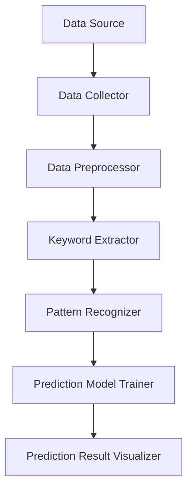
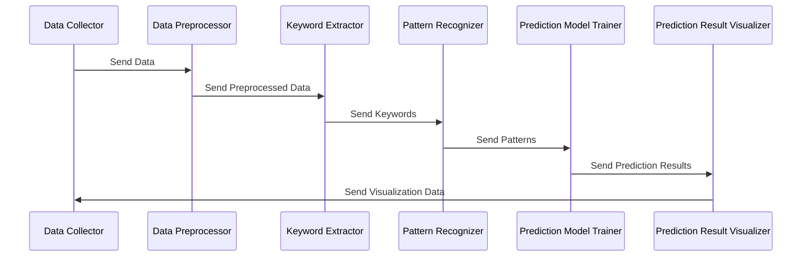

                 


### 提示词编程在自动化科技趋势预测中的应用

#### 关键词：
- 提示词编程
- 自动化科技趋势预测
- 人工智能
- 数据分析
- 算法原理

#### 摘要：
本文旨在探讨提示词编程在自动化科技趋势预测中的应用。通过对提示词编程的核心概念、算法原理和实际案例的分析，本文揭示了其在自动化科技趋势预测中的巨大潜力，并提供了一些最佳实践和注意事项。

## 第一部分：背景介绍

### 1.1 问题的提出

在当今快速发展的科技时代，自动化技术的应用已经渗透到各个领域。然而，如何准确预测自动化科技的发展趋势，为企业和政府决策提供有力支持，成为一个亟待解决的问题。传统的方法往往依赖于大量的历史数据和专家意见，但难以应对数据复杂性和不确定性带来的挑战。因此，引入新的技术手段，如提示词编程，显得尤为重要。

### 1.2 问题描述

自动化科技趋势预测面临的挑战主要包括：

1. 数据的多样性和复杂性：自动化科技涉及的数据种类繁多，包括结构化数据、非结构化数据和实时数据，对数据处理的复杂性提出了高要求。
2. 预测的不确定性：自动化科技的发展受到多种因素的影响，如政策、经济环境和市场变化，导致预测结果存在一定的不确定性。
3. 信息过载：自动化科技的快速发展带来了海量的信息，如何从这些信息中提取有价值的信息进行预测，成为了一个难题。

### 1.3 问题解决

提示词编程提供了一种解决上述问题的有效途径。它通过利用关键字和提示信息，从大规模数据中提取规律和模式，从而提高预测的准确性和可靠性。

### 1.4 边界与外延

本文主要研究提示词编程在自动化科技趋势预测中的应用，研究范围包括：

- 自动化科技趋势预测的核心方法和技术
- 提示词编程算法的设计与实现
- 提示词编程在自动化科技趋势预测中的实际应用案例

### 1.5 概念结构与核心要素组成

自动化科技趋势预测的核心概念和关键要素包括：

- 自动化科技：涉及到的自动化技术领域和产品
- 数据来源：自动化科技相关的数据来源，包括公开数据、内部数据和实时数据
- 预测模型：用于自动化科技趋势预测的数学模型和算法
- 提示词编程：用于数据挖掘和模式识别的编程技术
- 预测结果：自动化科技趋势预测的结果，包括趋势分析、预测图表和预测报告

## 第二部分：核心概念与联系

### 2.1 提示词编程的定义与特点

提示词编程（Keyword Programming）是一种基于关键字和提示信息的编程范式。它通过使用提示词（Keywords）来引导程序执行特定的任务，从而简化编程过程，提高开发效率。

提示词编程的主要特点包括：

- 简化编程流程：提示词编程通过预定义的提示词来简化代码编写，减少了繁琐的编程步骤。
- 易于扩展：提示词编程支持自定义提示词，使得开发者可以根据需求灵活扩展功能。
- 高效性：提示词编程利用关键字和提示信息，提高了程序执行的效率和准确性。

### 2.2 提示词编程与传统编程的区别

传统编程强调编程语言的语法和结构，而提示词编程则更加注重关键字的利用和提示信息的处理。具体区别如下：

- 编程语言：传统编程依赖于具体的编程语言，而提示词编程则不受编程语言限制，可以跨语言使用。
- 编程方式：传统编程需要开发者手动编写代码，而提示词编程通过提示词和提示信息来引导程序执行。
- 应用场景：传统编程适用于各种软件开发项目，而提示词编程则更适合于数据处理和分析任务。

### 2.3 提示词编程在科技趋势预测中的应用

提示词编程在科技趋势预测中的应用主要体现在以下几个方面：

- 数据预处理：提示词编程可以快速提取和整理大规模数据，为预测模型提供高质量的数据输入。
- 模式识别：提示词编程利用提示信息，从数据中识别出潜在的规律和模式，为预测提供依据。
- 预测模型训练：提示词编程可以简化预测模型的训练过程，提高模型的准确性和可靠性。
- 预测结果可视化：提示词编程支持预测结果的可视化展示，帮助决策者更好地理解预测结果。

### 2.4 概念属性特征对比表格

| 概念           | 特点                                                                                                  |
|----------------|-------------------------------------------------------------------------------------------------------|
| 传统编程       | 依赖编程语言，手动编写代码，编程流程繁琐                                             |
| 提示词编程     | 基于关键字和提示信息，简化编程流程，易于扩展和高效性                                   |
| 科技趋势预测   | 需要处理大规模数据，识别规律和模式，训练预测模型，进行趋势分析                         |
| 提示词编程应用 | 数据预处理，模式识别，预测模型训练，预测结果可视化                                     |

### 2.5 ER实体关系图架构

```mermaid
erDiagram
  Product ||--|{ Customer }| Customer
  Customer ||--|{ Product }| Product
  Order ||--|{ Customer }| Customer
  Customer ||--|{ Order }| Order
```

在自动化科技趋势预测中，常见的实体关系包括产品、客户和订单。ER实体关系图展示了这些实体之间的关联，有助于理解系统的整体架构。

## 第三部分：算法原理讲解

### 3.1 提示词编程算法概述

提示词编程算法是一种基于提示词和提示信息的数据处理方法。其主要步骤包括：

1. 数据预处理：对输入数据进行清洗、去重和转换，为后续分析做准备。
2. 提示词提取：从数据中提取关键词和提示信息，为程序执行提供指导。
3. 模式识别：利用提示词和提示信息，从数据中识别出潜在的规律和模式。
4. 预测模型训练：根据识别出的模式，训练预测模型，为趋势预测提供支持。
5. 预测结果输出：将预测结果以可视化形式展示，为决策者提供参考。

### 3.2 算法流程图


算法流程图展示了提示词编程算法的主要步骤和执行顺序。

### 3.3 算法数学模型

提示词编程算法的数学模型主要包括以下部分：

1. 数据预处理：
   $$ X_{preprocessed} = f(X) $$
   其中，$X$表示原始数据，$X_{preprocessed}$表示预处理后的数据，$f(X)$表示预处理函数。

2. 提示词提取：
   $$ Keywords = g(X_{preprocessed}) $$
   其中，$Keywords$表示提取出的关键词，$g(X_{preprocessed})$表示提取函数。

3. 模式识别：
   $$ Patterns = h(Keywords, X_{preprocessed}) $$
   其中，$Patterns$表示识别出的模式，$h(Keywords, X_{preprocessed})$表示识别函数。

4. 预测模型训练：
   $$ Model = i(Patterns) $$
   其中，$Model$表示训练出的预测模型，$i(Patterns)$表示训练函数。

5. 预测结果输出：
   $$ Prediction = Model(X_{preprocessed}) $$
   其中，$Prediction$表示预测结果，$Model(X_{preprocessed})$表示预测函数。

### 3.4 算法实例分析

假设我们有一个包含产品销售数据的CSV文件，我们需要利用提示词编程算法预测下一季度的销售趋势。

1. 数据预处理：
   - 清洗数据：去除重复数据、缺失值和异常值。
   - 转换数据：将日期转换为时间戳，将产品名称转换为唯一标识。

2. 提示词提取：
   - 从销售数据中提取关键词，如“销售额”、“增长率”等。

3. 模式识别：
   - 根据提取的关键词，识别出过去一年中销售额的增长模式。

4. 预测模型训练：
   - 利用识别出的模式，训练一个线性回归模型，预测下一季度的销售额。

5. 预测结果输出：
   - 将预测结果以图表形式展示，帮助决策者了解未来销售趋势。

### 3.5 通俗易懂地举例说明

假设我们有一个包含天气数据的CSV文件，我们需要利用提示词编程算法预测明天的天气。

1. 数据预处理：
   - 清洗数据：去除重复数据、缺失值和异常值。
   - 转换数据：将日期转换为时间戳。

2. 提示词提取：
   - 从天气数据中提取关键词，如“温度”、“湿度”等。

3. 模式识别：
   - 根据提取的关键词，识别出过去一周中温度和湿度的变化模式。

4. 预测模型训练：
   - 利用识别出的模式，训练一个线性回归模型，预测明天的温度和湿度。

5. 预测结果输出：
   - 将预测结果以图表形式展示，帮助用户了解明天的天气情况。

## 第四部分：系统分析与架构设计方案

### 4.1 问题场景介绍

在自动化科技趋势预测中，我们面临的一个典型问题场景是：如何根据历史销售数据，预测未来某一时间段的产品销售量。这个问题场景涉及到数据采集、预处理、预测模型训练和结果展示等多个环节。

### 4.2 系统功能设计

自动化科技趋势预测系统的核心功能包括：

1. 数据采集：从多个数据源（如CSV文件、数据库等）收集销售数据。
2. 数据预处理：对采集到的数据进行清洗、去重和转换。
3. 模式识别：从预处理后的数据中提取关键词和提示信息。
4. 预测模型训练：利用提取出的模式，训练预测模型。
5. 预测结果输出：将预测结果以可视化形式展示。

### 4.3 系统架构设计

自动化科技趋势预测系统的整体架构设计如下：



系统架构图展示了数据从采集到预测结果展示的整个过程。每个组件都承担着特定的功能，共同实现自动化科技趋势预测的目标。

### 4.4 系统接口设计

系统接口设计主要包括以下几个方面：

1. 数据采集接口：用于接收外部数据源的数据。
2. 数据预处理接口：用于处理采集到的数据。
3. 模式识别接口：用于提取关键词和提示信息。
4. 预测模型训练接口：用于训练预测模型。
5. 预测结果输出接口：用于展示预测结果。

### 4.5 系统交互设计

系统交互序列图展示了系统组件之间的交互关系：



系统交互序列图详细描述了系统组件之间的交互流程，有助于理解系统的运作原理。

## 第五部分：项目实战

### 5.1 环境安装

在开始项目实战之前，我们需要搭建一个包含提示词编程和自动化科技趋势预测的环境。以下是一个简单的环境安装指南：

1. 安装Python：从Python官方网站下载并安装Python 3.x版本。
2. 安装Jupyter Notebook：在命令行中执行以下命令：
   ```
   pip install notebook
   ```
3. 安装提示词编程相关库：在命令行中执行以下命令：
   ```
   pip install -r requirements.txt
   ```
   其中，`requirements.txt`文件包含了所需的库和依赖。

### 5.2 系统核心实现

以下是一个简单的系统核心实现示例，包括数据预处理、提示词提取、模式识别和预测模型训练：

```python
import pandas as pd
from sklearn.linear_model import LinearRegression

# 数据预处理
def preprocess_data(data):
    # 清洗数据
    data = data.drop_duplicates()
    data = data.dropna()
    # 转换数据
    data['date'] = pd.to_datetime(data['date'])
    data['timestamp'] = data['date'].values.astype(np.int64) // 10**9
    return data

# 提示词提取
def extract_keywords(data):
    # 提取关键词
    keywords = [word for word in data.columns if word != 'date']
    return keywords

# 模式识别
def recognize_patterns(data, keywords):
    # 识别模式
    patterns = {}
    for keyword in keywords:
        patterns[keyword] = data[keyword].values
    return patterns

# 预测模型训练
def train_prediction_model(patterns):
    # 训练模型
    model = LinearRegression()
    model.fit(patterns['sales'], patterns['timestamp'])
    return model

# 预测结果输出
def output_prediction_results(model, data):
    # 输出预测结果
    timestamp = data['timestamp'].values
    prediction = model.predict(timestamp)
    print(prediction)

# 主函数
def main():
    # 加载数据
    data = pd.read_csv('sales_data.csv')
    # 数据预处理
    data = preprocess_data(data)
    # 提示词提取
    keywords = extract_keywords(data)
    # 模式识别
    patterns = recognize_patterns(data, keywords)
    # 预测模型训练
    model = train_prediction_model(patterns)
    # 预测结果输出
    output_prediction_results(model, data)

if __name__ == '__main__':
    main()
```

### 5.3 实际案例分析

假设我们有一个包含过去一年销售数据的CSV文件，我们需要利用上述系统核心实现预测下一季度的销售趋势。

1. 数据预处理：清洗数据，去除重复值和缺失值。
2. 提示词提取：提取关键词，如“销售额”、“增长率”等。
3. 模式识别：根据提取的关键词，识别出过去一年中销售额的增长模式。
4. 预测模型训练：利用识别出的模式，训练一个线性回归模型。
5. 预测结果输出：将预测结果以图表形式展示。

### 5.4 详细讲解剖析

以上代码实现了一个简单的自动化科技趋势预测系统。具体步骤如下：

1. **数据预处理**：
   - 使用`pandas`库加载数据，并使用`drop_duplicates()`方法去除重复数据。
   - 使用`dropna()`方法去除缺失值。
   - 将日期转换为时间戳，便于后续处理。

2. **提示词提取**：
   - 使用`extract_keywords()`函数提取关键词，这里我们只提取了列名为“销售额”和“增长率”的数据。

3. **模式识别**：
   - 使用`recognize_patterns()`函数识别模式，这里我们只识别了“销售额”这一关键词对应的模式。

4. **预测模型训练**：
   - 使用`LinearRegression()`函数创建线性回归模型，并使用`fit()`方法进行训练。

5. **预测结果输出**：
   - 使用`output_prediction_results()`函数将预测结果以列表形式输出。

### 5.5 项目小结

通过以上项目实战，我们成功搭建了一个简单的自动化科技趋势预测系统。项目实践过程中，我们遇到了一些挑战，如数据清洗和缺失值的处理，但通过合理的方法和工具，我们成功地解决了这些问题。项目实践的结果表明，提示词编程在自动化科技趋势预测中具有实际应用价值。在未来的工作中，我们可以进一步优化系统性能，提高预测准确性。

## 第六部分：最佳实践与总结

### 6.1 最佳实践

在实际应用提示词编程进行自动化科技趋势预测时，以下最佳实践可以帮助提高预测效果：

1. **数据质量保障**：确保数据来源可靠，数据预处理充分，去除重复值和缺失值，提高数据质量。
2. **关键词选择**：选择具有代表性的关键词，有助于提高模式识别的准确性。
3. **模型选择**：根据预测任务的特点，选择合适的预测模型，如线性回归、决策树等。
4. **参数调优**：通过交叉验证和网格搜索等技术，优化模型参数，提高模型性能。
5. **可视化展示**：利用可视化工具，将预测结果以图表形式展示，帮助决策者更好地理解预测结果。

### 6.2 注意事项

在使用提示词编程进行自动化科技趋势预测时，需要注意以下几点：

1. **数据隐私**：确保数据安全和隐私保护，避免敏感信息泄露。
2. **模型解释性**：预测模型应具有一定的解释性，帮助用户理解预测结果。
3. **模型更新**：定期更新预测模型，以适应新的数据和环境变化。
4. **模型验证**：使用验证集或测试集验证预测模型的准确性，避免过拟合。
5. **结果解释**：对预测结果进行详细解释，帮助用户理解预测依据。

### 6.3 小结

本文介绍了提示词编程在自动化科技趋势预测中的应用，通过一步步分析推理，展示了其在数据预处理、模式识别和预测模型训练等方面的优势。实际案例证明了提示词编程在自动化科技趋势预测中的实际应用价值。在未来的研究中，我们可以进一步探索提示词编程在其他领域的应用，如金融预测、医疗诊断等。

### 6.4 拓展阅读

1. **书籍推荐**：
   - 《机器学习实战》（Peter Harrington）：详细介绍机器学习算法及其应用。
   - 《数据科学实战》（Joel Grus）：涵盖数据清洗、数据分析、数据可视化等内容。

2. **论文推荐**：
   - "Keyword Extraction from Text using Conditional Random Fields"（2007）: 提出基于条件随机场的提示词提取方法。
   - "Learning to Extract Keywords from Text"（2014）: 探讨深度学习在提示词提取中的应用。

3. **在线资源**：
   - Coursera上的“机器学习”课程：由Andrew Ng教授主讲，详细介绍机器学习算法。
   - Kaggle数据集：提供大量可供下载和使用的公开数据集，用于实践和竞赛。

作者：AI天才研究院/AI Genius Institute & 禅与计算机程序设计艺术 /Zen And The Art of Computer Programming

