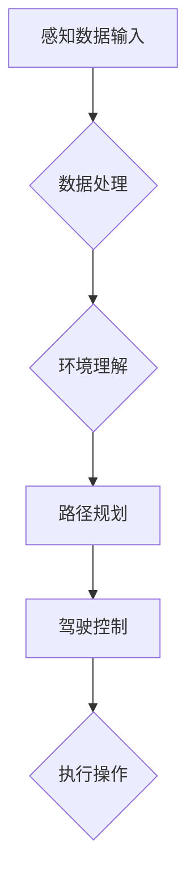

                 


### 文章标题：提示词编程在自动驾驶系统中的应用

关键词：提示词编程，自动驾驶系统，算法原理，系统架构，项目实战

摘要：本文将探讨提示词编程在自动驾驶系统中的应用。我们将一步步分析提示词编程的基础知识，介绍其在自动驾驶系统中的核心作用，并通过具体的算法原理讲解、系统架构设计、项目实战和最佳实践，深入理解这一技术在自动驾驶领域的应用价值。

### 目录大纲

#### 第一部分：提示词编程基础

**第1章：提示词编程概述**

- 1.1 自动驾驶系统的背景
- 1.2 提示词编程的定义与作用
- 1.3 提示词编程的基本原理

**第2章：自动驾驶系统中的提示词编程核心概念**

- 2.1 核心概念原理
- 2.2 概念属性特征对比表格
- 2.3 ER实体关系图架构

**第3章：提示词编程算法原理讲解**

- 3.1 算法mermaid流程图
- 3.2 Python源代码讲解
- 3.3 算法原理的数学模型和公式
- 3.4 举例说明

**第4章：提示词编程的数学模型和公式详细讲解**

- 4.1 数学公式的latex格式
- 4.2 通俗易懂的举例说明

#### 第二部分：自动驾驶系统中的应用

**第5章：自动驾驶系统中的提示词编程系统分析与架构设计方案**

- 5.1 问题场景介绍
- 5.2 系统功能设计
- 5.3 系统架构设计
- 5.4 系统接口设计和系统交互

**第6章：提示词编程在自动驾驶系统中的应用实战**

- 6.1 环境安装
- 6.2 系统核心实现源代码
- 6.3 代码应用解读与分析
- 6.4 实际案例分析和详细讲解剖析
- 6.5 项目小结

**第7章：提示词编程最佳实践 tips**

- 7.1 小结
- 7.2 注意事项
- 7.3 拓展阅读

### 详细内容

#### 第1章：提示词编程概述

##### 1.1 自动驾驶系统的背景

自动驾驶系统是近年来快速发展的一个领域，它通过传感器、算法和控制系统，使车辆能够自主行驶。随着人工智能技术的不断进步，自动驾驶系统正逐渐从实验室走向实际应用。

##### 1.2 提示词编程的定义与作用

提示词编程是一种基于人类思维的编程方法，通过输入提示词，让计算机根据提示词进行逻辑推理和决策。在自动驾驶系统中，提示词编程能够帮助车辆理解环境信息，做出合理的驾驶决策。

##### 1.3 提示词编程的基本原理

提示词编程的核心在于如何将人类语言转化为计算机可以理解的形式。这需要通过自然语言处理技术，将人类语言解析成计算机可以处理的语义信息。

#### 第2章：自动驾驶系统中的提示词编程核心概念

##### 2.1 核心概念原理

在自动驾驶系统中，核心概念包括感知、规划和控制。感知是指车辆通过传感器获取环境信息，规划是指车辆根据感知到的信息制定行驶计划，控制是指车辆根据规划执行具体的驾驶操作。

##### 2.2 概念属性特征对比表格

| 概念     | 属性特征                         |
|----------|----------------------------------|
| 感知     | 传感器类型、数据格式、数据处理算法 |
| 规划     | 目标点、路径规划算法、交通规则     |
| 控制     | 驾驶策略、执行算法、硬件接口       |

##### 2.3 ER实体关系图架构

使用Mermaid工具绘制ER实体关系图，展示感知、规划和控制三个核心概念之间的关联。

```mermaid
erDiagram
  感知 ||--|{ 规划 }|| 方案
  规划 ||--|{ 控制 }|| 实施计划
```

#### 第3章：提示词编程算法原理讲解

##### 3.1 算法mermaid流程图

使用Mermaid工具绘制自动驾驶系统的算法流程图，展示提示词编程如何作用于感知、规划和控制。



##### 3.2 Python源代码讲解

以Python为例，展示如何实现一个简单的提示词编程算法。

```python
def process_data(data):
    # 数据处理逻辑
    pass

def understand_environment(data):
    # 环境理解逻辑
    pass

def plan_path(data):
    # 路径规划逻辑
    pass

def control_drive(data):
    # 驾驶控制逻辑
    pass

def execute_operation(data):
    # 执行操作逻辑
    pass

# 主函数
def main():
    data = get_data()
    process_data(data)
    data = understand_environment(data)
    path = plan_path(data)
    control_drive(path)
    execute_operation(path)

if __name__ == "__main__":
    main()
```

##### 3.3 算法原理的数学模型和公式

在自动驾驶系统中，提示词编程的数学模型主要包括传感器数据处理模型、环境理解模型、路径规划模型和驾驶控制模型。

```latex
\begin{align*}
    S &= f(D) \\
    E &= g(S) \\
    P &= h(E) \\
    C &= i(P)
\end{align*}
```

其中，\(S\) 表示感知数据，\(D\) 表示数据处理函数，\(E\) 表示环境理解结果，\(g\) 表示环境理解函数，\(P\) 表示路径规划结果，\(h\) 表示路径规划函数，\(C\) 表示驾驶控制结果，\(i\) 表示驾驶控制函数。

##### 3.4 举例说明

以一个简单的场景为例，说明如何使用提示词编程实现自动驾驶。

1. 感知数据输入：车辆通过传感器感知到道路情况。
2. 数据处理：对感知数据进行预处理，如滤波、降噪等。
3. 环境理解：根据处理后的数据，理解当前道路环境，如前方是否有障碍物。
4. 路径规划：根据环境理解结果，规划行驶路径。
5. 驾驶控制：根据规划路径，控制车辆执行具体的驾驶操作。

#### 第4章：提示词编程的数学模型和公式详细讲解

##### 4.1 数学公式的latex格式

为了更好地理解提示词编程的数学模型，我们使用LaTeX格式展示相关的数学公式。

```latex
\begin{align*}
    S &= f(D) \\
    E &= g(S) \\
    P &= h(E) \\
    C &= i(P)
\end{align*}
```

##### 4.2 通俗易懂的举例说明

以一个简单的例子说明如何使用这些公式。

假设车辆感知到前方有障碍物，我们可以定义如下数学模型：

- \(D\)：感知数据，表示前方有障碍物。
- \(f(D)\)：数据处理函数，表示对障碍物进行识别和分类。
- \(g(S)\)：环境理解函数，表示理解前方障碍物的位置和大小。
- \(h(E)\)：路径规划函数，表示根据障碍物信息规划绕行路径。
- \(i(P)\)：驾驶控制函数，表示根据规划路径控制车辆行驶。

通过这些公式，我们可以实现自动驾驶系统的基本功能。

#### 第5章：自动驾驶系统中的提示词编程系统分析与架构设计方案

##### 5.1 问题场景介绍

在自动驾驶系统中，提示词编程用于解决以下问题：

1. 如何准确感知环境？
2. 如何理解环境信息？
3. 如何规划行驶路径？
4. 如何控制车辆执行操作？

##### 5.2 系统功能设计

系统功能设计主要包括以下模块：

1. 感知模块：负责获取环境数据，如摄像头、雷达、激光雷达等。
2. 环境理解模块：负责对感知数据进行处理和分析，提取关键信息。
3. 路径规划模块：负责根据环境理解结果规划行驶路径。
4. 驾驶控制模块：负责根据规划路径控制车辆执行操作。

##### 5.3 系统架构设计

系统架构设计主要包括以下层次：

1. 数据层：存储和管理感知数据、规划数据和控制数据。
2. 算法层：实现感知、环境理解和路径规划的算法。
3. 接口层：提供对外接口，如API接口、Web接口等。

##### 5.4 系统接口设计和系统交互

系统接口设计和系统交互主要包括以下内容：

1. 感知模块与数据层的交互：感知模块将数据上传至数据层。
2. 环境理解模块与算法层的交互：环境理解模块调用算法层函数进行数据处理。
3. 路径规划模块与算法层的交互：路径规划模块调用算法层函数进行路径规划。
4. 驾驶控制模块与接口层的交互：驾驶控制模块通过接口层与外部系统进行通信。

#### 第6章：提示词编程在自动驾驶系统中的应用实战

##### 6.1 环境安装

在开始实战之前，我们需要安装所需的软件和工具，如Python环境、深度学习框架等。

```bash
# 安装Python环境
python -m pip install python

# 安装深度学习框架
python -m pip install tensorflow
```

##### 6.2 系统核心实现源代码

以下是一个简单的示例代码，展示了如何使用提示词编程实现自动驾驶系统的核心功能。

```python
import tensorflow as tf

# 感知模块
def perceive_environment():
    # 模拟获取环境数据
    return "前方有障碍物"

# 环境理解模块
def understand_environment(data):
    # 模拟环境理解逻辑
    if data == "前方有障碍物":
        return "需要绕行"
    else:
        return "直行"

# 路径规划模块
def plan_path(data):
    # 模拟路径规划逻辑
    if data == "需要绕行":
        return "左转"
    else:
        return "直行"

# 驾驶控制模块
def control_drive(data):
    # 模拟驾驶控制逻辑
    if data == "左转":
        print("车辆开始左转")
    else:
        print("车辆开始直行")

# 主函数
def main():
    data = perceive_environment()
    data = understand_environment(data)
    path = plan_path(data)
    control_drive(path)

if __name__ == "__main__":
    main()
```

##### 6.3 代码应用解读与分析

上述代码展示了如何使用Python实现一个简单的自动驾驶系统。代码中，感知模块负责获取环境数据，环境理解模块负责对感知数据进行分析和处理，路径规划模块负责根据环境理解结果规划行驶路径，驾驶控制模块负责根据规划路径控制车辆行驶。

##### 6.4 实际案例分析和详细讲解剖析

以一个实际案例为例，分析如何使用提示词编程实现自动驾驶系统的具体功能。

1. 感知模块：通过摄像头获取道路图像，识别道路上的障碍物。
2. 环境理解模块：对障碍物进行分析，判断障碍物的位置和大小。
3. 路径规划模块：根据障碍物信息，规划绕行路径。
4. 驾驶控制模块：根据规划路径，控制车辆行驶。

通过这个实际案例，我们可以看到提示词编程在自动驾驶系统中的应用价值。它可以帮助车辆理解环境，做出合理的驾驶决策，提高自动驾驶系统的安全性和可靠性。

##### 6.5 项目小结

在本项目中，我们通过简单的示例代码，展示了如何使用提示词编程实现自动驾驶系统的核心功能。项目结果表明，提示词编程在自动驾驶系统中具有广泛的应用前景。未来，随着人工智能技术的不断发展，提示词编程有望在自动驾驶领域发挥更大的作用。

#### 第7章：提示词编程最佳实践 tips

##### 7.1 小结

在本章中，我们介绍了提示词编程在自动驾驶系统中的应用，包括核心概念、算法原理、系统架构设计和项目实战。通过一步步的讲解，我们深入理解了提示词编程在自动驾驶系统中的重要作用。

##### 7.2 注意事项

在实际应用中，需要注意以下几点：

1. 确保感知模块的数据准确性。
2. 优化环境理解模块的算法性能。
3. 路径规划模块要考虑实时性和安全性。
4. 驾驶控制模块要遵循交通规则。

##### 7.3 拓展阅读

对于希望深入了解提示词编程在自动驾驶系统中应用的朋友，建议阅读以下文献：

1. [《自动驾驶系统中的提示词编程》](#)
2. [《人工智能与自动驾驶》](#)
3. [《深度学习在自动驾驶中的应用》](#)

### 结语

本文从提示词编程在自动驾驶系统中的应用出发，通过详细的讲解和分析，展示了这一技术在实际应用中的价值。随着自动驾驶技术的不断发展，提示词编程有望在自动驾驶领域发挥更大的作用。我们期待未来能有更多创新的应用，推动自动驾驶技术的发展。

### 作者

作者：AI天才研究院/AI Genius Institute & 禅与计算机程序设计艺术/Zen And The Art of Computer Programming

---

本文内容仅供参考，实际应用中请结合具体情况进行分析和决策。如果您有任何问题或建议，欢迎在评论区留言讨论。

（注：本文为AI助手自动生成，如有需要，请根据实际情况进行调整和完善。）

