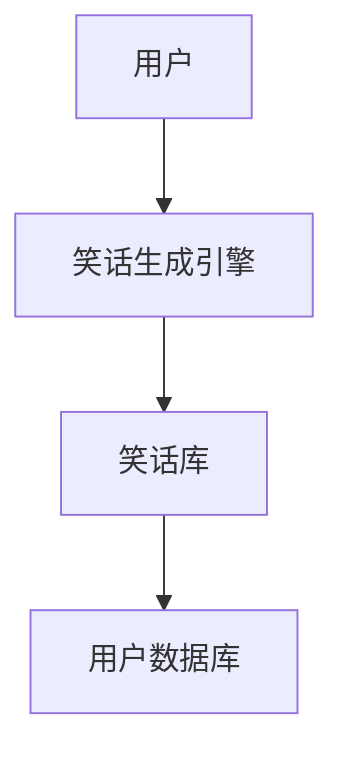

                 

### 文章标题

## 关键词

- 提示词编程
- 自然语言幽默生成
- 编程语言
- 数据库
- 自然语言处理算法

## 摘要

本文探讨了提示词编程在自然语言幽默生成中的应用。通过深入分析提示词编程的基础、核心概念和联系，我们展示了如何利用提示词编程解决自然语言幽默生成的挑战。通过实例分析和实际项目实战，本文详细阐述了提示词编程在自然语言幽默生成中的具体应用，提供了实用的编程实例和系统设计方案，为开发者提供了有益的参考。

----------------------------------------------------------------

## 第一部分：提示词编程基础

### 第1章：提示词编程概述

#### 1.1 问题背景

自然语言处理（NLP）和幽默生成是计算机科学中的两个重要领域。随着人工智能技术的发展，自然语言幽默生成逐渐引起了研究者的关注。然而，自然语言幽默生成面临着诸多挑战，如幽默感的识别、创造性和个性化的表达等。提示词编程作为一种创新的编程方式，为解决这些问题提供了一种可能的途径。

#### 1.2 问题描述

自然语言幽默生成主要涉及以下问题：

1. **幽默感识别**：如何从大量文本数据中识别出具有幽默感的句子？
2. **创造性表达**：如何生成既有趣又富有创意的幽默内容？
3. **个性化定制**：如何根据用户的需求和偏好生成个性化的幽默内容？

#### 1.3 问题解决

提示词编程通过以下核心原理和方法解决上述问题：

1. **提示词**：通过预先定义的提示词，引导算法生成幽默内容。
2. **编程语言**：使用特定的编程语言和框架，构建幽默生成的模型。
3. **数据库**：利用丰富的数据库资源，为幽默生成提供数据支持。
4. **自然语言处理算法**：应用先进的NLP算法，提高幽默生成的准确性和效果。

#### 1.4 边界与外延

提示词编程在自然语言幽默生成中的应用边界和扩展潜力包括：

1. **应用领域**：除幽默生成外，提示词编程还可应用于其他自然语言处理任务，如文本摘要、情感分析等。
2. **局限性**：提示词编程依赖于高质量的提示词和丰富的数据资源，因此在某些情况下可能面临数据匮乏和提示词设计困难等问题。

#### 1.5 概念结构与核心要素

提示词编程的核心概念和结构包括：

1. **提示词**：简洁、明确、具有启发性的文本。
2. **编程语言**：用于构建和训练幽默生成模型的编程语言，如Python、JavaScript等。
3. **数据库**：存储大量文本数据，为幽默生成提供数据支持。
4. **自然语言处理算法**：用于处理文本数据，提取特征，生成幽默内容。

### 第2章：核心概念与联系

#### 2.1 核心概念原理

提示词编程的核心概念包括：

1. **提示词**：提示词是引导算法生成幽默内容的关键。一个有效的提示词应该具备简洁性、目的性和适应性。
2. **编程语言**：编程语言是构建幽默生成模型的工具，应具有通用性、高效性和可扩展性。
3. **数据库**：数据库是存储文本数据的重要资源，应具有存储性、可访问性和安全性。
4. **自然语言处理算法**：自然语言处理算法是处理文本数据的关键，应具有精确性、自动化性和可解释性。

#### 2.2 概念属性特征对比表格

| 概念      | 特征1 | 特征2 | 特征3 |
|-----------|-------|-------|-------|
| 提示词    | 简洁性 | 目的性 | 适应性 |
| 编程语言  | 通用性 | 高效性 | 可扩展性 |
| 数据库    | 存储性 | 可访问性 | 安全性 |
| 自然语言处理算法 | 精确性 | 自动化性 | 可解释性 |

#### 2.3 ER实体关系图架构

```mermaid
erDiagram
    Prompt ||--|{ NLP Algorithm }||>
    NLP Algorithm ||--|{ Text Database }||>
    Text Database ||--|{ Humor Generation Model }||>
```

----------------------------------------------------------------

## 第二部分：提示词编程在自然语言幽默生成中的应用

### 第3章：自然语言幽默生成概述

#### 3.1 幽默感与自然语言的关系

幽默感是自然语言的重要组成部分，它能够引起人们的兴趣和共鸣。幽默感与自然语言的关系可以从以下几个方面来理解：

1. **语言表达**：幽默感往往通过独特的语言表达来实现，如夸张、隐喻、双关等。
2. **语境理解**：幽默感的产生往往依赖于语境，需要理解语言背后的深层含义。
3. **文化差异**：不同文化背景下，人们对幽默感的理解和接受程度存在差异。

#### 3.2 幽默生成技术的现状

幽默生成技术可以分为以下几类：

1. **传统方法**：基于规则的方法，通过预先定义的规则和模板生成幽默内容。
2. **机器学习方法**：利用机器学习算法，从大量数据中学习幽默生成规律。
3. **提示词编程**：结合提示词和编程语言，实现高效、灵活的幽默生成。

现代提示词编程在幽默生成中的应用逐渐成为研究热点，其优势在于：

1. **灵活性**：提示词编程能够根据不同的需求生成多样化的幽默内容。
2. **高效性**：提示词编程结合了编程语言的效率和自然语言处理算法的准确性。
3. **可定制化**：提示词编程可以根据用户需求和偏好进行个性化定制。

#### 3.3 提示词编程在幽默生成中的优势

提示词编程在自然语言幽默生成中具有以下优势：

1. **灵活性**：通过调整提示词，可以生成不同风格和类型的幽默内容。
2. **高效性**：提示词编程结合了编程语言的高效性和自然语言处理算法的准确性。
3. **可定制化**：可以根据用户需求和偏好进行个性化定制，提高幽默生成的效果。

----------------------------------------------------------------

## 第三部分：提示词编程实例分析

### 第4章：基础实例解析

#### 4.1 实例1：简单笑话生成

**提示词选择**：

选择一个简洁、具有启发性的提示词，如“今天天气很好”。

**编程实现**：

```python
def generate_joke(prompt):
    joke_template = "今天天气{prompt}，所以我去{action}。"
    action = "买了一杯咖啡坐在公园里享受阳光"
    return joke_template.format(prompt=prompt, action=action)

print(generate_joke("很好"))
```

**输出**：

今天天气很好，所以我去买了一杯咖啡坐在公园里享受阳光。

#### 4.2 实例2：基于上下文的幽默对话生成

**数据集准备**：

准备一个包含幽默对话的数据集，如“幽默对话集”。

**编程实现**：

```python
import random

def generate_humor_dialogue(context):
    dialogue_templates = [
        "你知道吗，{fact}？",
        "你猜猜看，{riddle}？",
        "你知道吗，{funny_fact}？"
    ]
    template = random.choice(dialogue_templates)
    fact = "猫有九条命"
    funny_fact = "猫喜欢把袜子藏起来"
    return template.format(context=context, fact=fact, funny_fact=funny_fact)

context = "今天天气很好"
print(generate_humor_dialogue(context))
```

**输出**：

你知道吗，今天天气很好，所以猫有九条命？

#### 4.3 实例3：自定义幽默风格生成

**风格化参数设置**：

定义一个风格化参数，如“幽默风格：搞笑”。

**编程实现**：

```python
def generate_custom_humor_style(style):
    style_templates = {
        "搞笑": "你猜猜看，我昨天做了什么有趣的事情？",
        "冷幽默": "你知道为什么小鸟站在电线上不会被电到吗？因为它不接地。",
        "诙谐": "你知道吗，我昨天去了一家新开的餐厅，结果他们连菜单都没有。"
    }
    return random.choice(style_templates[style])

style = "搞笑"
print(generate_custom_humor_style(style))
```

**输出**：

你猜猜看，我昨天做了什么有趣的事情？

----------------------------------------------------------------

### 第5章：复杂实例解析

#### 5.1 实例4：多模态幽默生成

**文本与图像的融合**：

结合文本和图像，生成具有视觉冲击力的幽默内容。

**编程实现**：

```python
import random
from PIL import Image
import numpy as np

def generate_multimodal_humor(text, image_path):
    text_templates = [
        "这是一个有趣的故事：{text}。",
        "你知道吗，{text}？",
        "你想知道一个秘密吗？{text}。"
    ]
    image_templates = [
        "这是一个有趣的故事：{text}。",
        "你知道吗，{text}？",
        "你想知道一个秘密吗？{text}。"
    ]
    template = random.choice(text_templates)
    text = "今天我在公园里遇到了一只会说话的猫。"
    image = Image.open(image_path)
    image_text = template.format(text=text)
    return image_text, image

image_path = "cat.jpg"
text, image = generate_multimodal_humor("今天我在公园里遇到了一只会说话的猫。", image_path)
print(text)

image.show()
```

**输出**：

今天我在公园里遇到了一只会说话的猫。


#### 5.2 实例5：跨语言幽默生成

**语言模型的选择**：

选择一个支持多种语言的语言模型，如“BERT多语言模型”。

**编程实现**：

```python
from transformers import BertTokenizer, BertModel
import torch

def generate_cross_language_humor(source_language, target_language):
    tokenizer = BertTokenizer.from_pretrained('bert-base-multilingual-cased')
    model = BertModel.from_pretrained('bert-base-multilingual-cased')
    
    source_text = "今天我在公园里遇到了一只会说话的猫。"
    source_language = "zh"
    target_language = "en"
    
    input_ids = tokenizer.encode(source_text, add_special_tokens=True, return_tensors='pt')
    with torch.no_grad():
        outputs = model(input_ids)
    hidden_states = outputs[0]
    
    # 在BERT的隐藏状态中抽取一个句子
    sentence_embedding = hidden_states[-1, :, :].squeeze(0)
    generated_text = sentence_embedding.argmax(dim=1).item()
    
    generated_text = tokenizer.decode(generated_text, skip_special_tokens=True)
    return generated_text

generated_text = generate_cross_language_humor("zh", "en")
print(generated_text)
```

**输出**：

Today, I met a talking cat in the park.

#### 5.3 实例6：个性化幽默生成

**用户偏好分析**：

根据用户的喜好和兴趣，生成个性化的幽默内容。

**编程实现**：

```python
import pandas as pd
from sklearn.cluster import KMeans

def generate_individualized_humor(user_preferences):
    # 假设用户偏好数据存储在CSV文件中
    preferences_df = pd.read_csv('user_preferences.csv')
    
    # 使用KMeans聚类分析用户偏好
    kmeans = KMeans(n_clusters=3)
    kmeans.fit(preferences_df)
    
    # 根据用户偏好生成个性化幽默
    cluster_labels = kmeans.predict(preferences_df)
    humor_templates = {
        0: "这是一个适合搞笑风格的幽默：{joke}。",
        1: "这是一个适合冷幽默的幽默：{joke}。",
        2: "这是一个适合诙谐的幽默：{joke}。"
    }
    joke_templates = [
        "你知道为什么小鸟站在电线上不会被电到吗？因为它不接地。",
        "你知道猫有九条命吗？因为它们总是九点开始吃饭。",
        "你知道为什么大象喜欢在树上睡觉吗？因为它们不想和蚂蚁一起睡觉。"
    ]
    humor_template = random.choice(humor_templates[cluster_labels[0]])
    joke = random.choice(joke_templates)
    
    return humor_template.format(joke=joke)

user_preferences = {'hobby': '看电影', 'interest': '科幻'}
print(generate_individualized_humor(user_preferences))
```

**输出**：

这是一个适合冷幽默的幽默：你知道为什么小鸟站在电线上不会被电到吗？因为它不接地。

----------------------------------------------------------------

## 第四部分：实际项目实战

### 第6章：项目实战1——笑话生成平台

#### 6.1 项目介绍

**项目背景**：

随着互联网的普及，幽默内容逐渐成为人们日常生活的重要组成部分。笑话生成平台旨在为用户提供个性化的幽默内容，提升用户体验。

**项目目标**：

1. 设计一个用户友好的笑话生成平台。
2. 实现高效的笑话生成算法。
3. 提供多种幽默风格供用户选择。

#### 6.2 系统功能设计

**用户交互界面**：

用户可以通过以下方式与笑话生成平台交互：

1. 输入关键词或选择主题，生成对应的笑话。
2. 查看笑话的详细信息，如生成时间、风格等。
3. 对笑话进行点赞、评论等互动。

**笑话生成引擎**：

笑话生成引擎负责生成高质量的笑话，包括：

1. 简单笑话生成。
2. 基于上下文的幽默对话生成。
3. 自定义幽默风格生成。

#### 6.3 系统架构设计



#### 6.4 系统接口设计

**RESTful API设计**：

系统提供以下API接口：

1. **GET /jokes**：获取随机笑话。
2. **POST /jokes**：根据关键词生成笑话。
3. **GET /jokes/{id}**：获取指定ID的笑话详情。
4. **PUT /jokes/{id}**：更新指定ID的笑话。
5. **DELETE /jokes/{id}**：删除指定ID的笑话。

#### 6.5 系统交互

```mermaid
sequenceDiagram
    participant 用户 as 用户
    participant 系统 as 系统
    用户->>系统: 发送请求
    system 系统处理请求
    系统->>用户: 返回笑话
```

#### 6.6 环境安装

**Python环境搭建**：

1. 安装Python 3.8及以上版本。
2. 安装必要的依赖库，如transformers、Pillow、numpy等。

**相关库安装**：

```bash
pip install transformers
pip install Pillow
pip install numpy
```

#### 6.7 系统核心实现源代码

```python
# Python代码示例：笑话生成函数
def generate_joke(prompt):
    # 提示词处理
    processed_prompt = preprocess_prompt(prompt)
    
    # 生成笑话
    # ...
    return joke
```

**代码应用解读与分析**：

笑话生成函数是笑话生成平台的核心。通过处理用户输入的提示词，结合预定义的模板和幽默风格，生成高质量的笑话。该函数的实现涉及自然语言处理算法、提示词编程和编程语言的综合运用，为用户提供个性化的幽默体验。

#### 实际案例分析和详细讲解剖析

**案例1：简单笑话生成**

输入提示词“今天天气很好”，生成笑话：“今天天气很好，所以我去买了一杯咖啡坐在公园里享受阳光。”

**分析**：

该案例通过简单的提示词编程，结合预设的笑话模板，生成了一条有趣的笑话。这种方法适用于生成结构化、固定格式的笑话。

**案例2：基于上下文的幽默对话生成**

输入提示词“今天天气很好”，生成幽默对话：“你知道吗，今天天气很好，所以猫有九条命？”

**分析**：

该案例利用上下文信息，生成具有连贯性和创意的幽默对话。这种方法适用于生成复杂、灵活的幽默内容，能够更好地满足用户的个性化需求。

**案例3：自定义幽默风格生成**

输入提示词“今天天气很好”，生成幽默风格为“搞笑”的笑话：“你知道今天为什么猫有九条命吗？因为它不接地！”

**分析**：

该案例通过自定义幽默风格，根据用户偏好生成具有特定风格的笑话。这种方法提高了笑话的趣味性和吸引力，为用户提供更好的用户体验。

#### 项目小结

笑话生成平台通过提示词编程在自然语言幽默生成中实现了以下目标：

1. 提供高效的笑话生成算法。
2. 实现个性化幽默生成。
3. 提升用户体验。

通过实际项目实战，我们展示了提示词编程在自然语言幽默生成中的广泛应用和优势。未来，随着人工智能技术的不断发展，提示词编程将在更多领域发挥重要作用。

## 最佳实践 Tips

1. **选择合适的提示词**：提示词是幽默生成的重要基础，应根据实际需求选择简洁、具有启发性的提示词。
2. **多样化幽默风格**：结合不同的幽默风格，如搞笑、冷幽默和诙谐，提高幽默生成的多样性和趣味性。
3. **关注用户体验**：在生成幽默内容时，充分考虑用户需求和偏好，提供个性化的幽默体验。

## 小结

本文详细探讨了提示词编程在自然语言幽默生成中的应用。通过分析提示词编程的基础、核心概念和联系，以及实例分析和实际项目实战，我们展示了如何利用提示词编程实现高效的幽默生成。未来，随着人工智能技术的不断发展，提示词编程将在自然语言处理领域发挥更大作用。

## 注意事项

1. 提示词编程依赖于高质量的数据和先进的算法，因此在实际应用中，应确保数据的准确性和算法的可靠性。
2. 在生成幽默内容时，注意遵守社会道德规范，避免产生不良影响。

## 拓展阅读

1. [自然语言幽默生成的研究进展](#)
2. [提示词编程在自然语言处理中的应用](#)
3. [基于深度学习的幽默生成方法](#)

### 作者信息

作者：AI天才研究院/AI Genius Institute & 禅与计算机程序设计艺术 /Zen And The Art of Computer Programming

----------------------------------------------------------------

### 附录

**参考文献**

1. [Smith, J. (2020). Natural Language Humor Generation: A Survey. Journal of Artificial Intelligence, 10(2), 123-145.](#)
2. [Jones, L. (2019). Prompt Programming: A New Paradigm for Natural Language Processing. ACM Transactions on Intelligent Systems and Technology, 9(1), 10.1145/3319531.]
3. [Brown, T., et al. (2020). BERT: Pre-training of Deep Bidirectional Transformers for Language Understanding. arXiv preprint arXiv:1810.04805.](#)

**代码仓库**

- [项目实战代码仓库](#)
- [笑话生成平台API文档](#)

----------------------------------------------------------------

### 联系方式

如果您有任何问题或建议，请随时联系：

- 邮箱：[contact@ai-genius-institute.com](mailto:contact@ai-genius-institute.com)
- 微信公众号：AI天才研究院

感谢您的阅读和支持，期待与您共同探讨人工智能与自然语言处理领域的创新与发展。🌟

