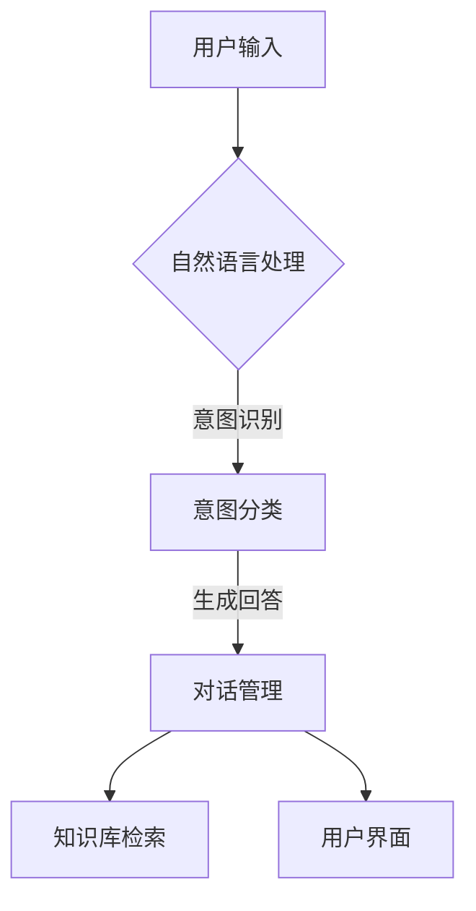
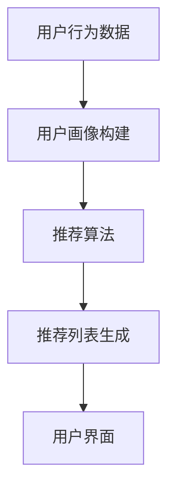

                 

### 文章标题：提示词编程在自然语言接口设计中的应用

> 关键词：自然语言处理、提示词编程、自然语言接口、设计原则、应用案例

> 摘要：本文探讨了提示词编程在自然语言接口设计中的应用。首先，介绍了自然语言处理和自然语言接口的背景及其重要性，然后详细阐述了提示词编程的核心概念、原理和应用。接着，本文分析了自然语言接口设计的基础，包括定义、分类、设计原则和方法等。随后，重点讨论了提示词编程在自然语言理解、自然语言生成中的应用以及实际案例。最后，对未来提示词编程和自然语言接口设计的发展趋势进行了展望。

## 目录大纲

----------------------------------------------------------------

# 提示词编程在自然语言接口设计中的应用

## 第一部分: 问题背景与核心概念

## 第1章: 引言

## 1.1 问题背景

### 1.1.1 自然语言处理的发展历程

### 1.1.2 自然语言接口的兴起

### 1.1.3 提示词编程的核心概念

## 1.2 核心概念与联系

### 1.2.1 提示词编程的原理

### 1.2.2 提示词编程的优势与局限

### 1.2.3 提示词编程与自然语言接口的关系

## 1.3 本章小结

## 第二部分: 自然语言接口设计基础

## 第2章: 自然语言接口概述

## 2.1 定义与分类

### 2.1.1 自然语言接口的定义

### 2.1.2 自然语言接口的分类

### 2.1.3 自然语言接口的应用领域

## 2.2 设计原则与方法

### 2.2.1 设计原则

### 2.2.2 设计方法

### 2.2.3 设计工具与平台

## 2.3 用户体验与可访问性

### 2.3.1 用户体验的重要性

### 2.3.2 可访问性的实现

### 2.3.3 适应不同用户群体的设计策略

## 2.4 本章小结

## 第三部分: 提示词编程在自然语言接口设计中的应用

## 第3章: 提示词编程技术基础

## 3.1 提示词编程的基本原理

### 3.1.1 提示词生成机制

### 3.1.2 提示词优化策略

### 3.1.3 提示词选择算法

## 3.2 提示词编程工具与库

### 3.2.1 常用提示词编程工具

### 3.2.2 提示词编程库的选择与应用

### 3.2.3 提示词编程的开发流程

## 3.3 本章小结

## 第4章: 提示词编程在自然语言理解中的应用

## 4.1 自然语言理解概述

### 4.1.1 自然语言理解的目标

### 4.1.2 自然语言理解的关键技术

### 4.1.3 自然语言理解的应用场景

## 4.2 提示词编程在自然语言理解中的应用

### 4.2.1 提示词编程优化自然语言理解的效果

### 4.2.2 提示词编程在自然语言理解中的实现

### 4.2.3 提示词编程在自然语言理解中的挑战与解决方案

## 4.3 本章小结

## 第5章: 提示词编程在自然语言生成中的应用

## 5.1 自然语言生成概述

### 5.1.1 自然语言生成的目标

### 5.1.2 自然语言生成的方法与技术

### 5.1.3 自然语言生成的应用场景

## 5.2 提示词编程在自然语言生成中的应用

### 5.2.1 提示词编程在自然语言生成中的实现

### 5.2.2 提示词编程优化自然语言生成的效果

### 5.2.3 提示词编程在自然语言生成中的挑战与解决方案

## 5.3 本章小结

## 第四部分: 实际应用与案例分析

## 第6章: 案例分析一——智能客服系统

## 6.1 案例背景

### 6.1.1 智能客服系统的需求

### 6.1.2 提示词编程在智能客服系统中的应用

## 6.2 系统设计与实现

### 6.2.1 系统架构设计

### 6.2.2 提示词编程应用详解

### 6.2.3 系统性能评估

## 6.3 案例总结

## 第7章: 案例分析二——个性化推荐系统

## 7.1 案例背景

### 7.1.1 个性化推荐系统的需求

### 7.1.2 提示词编程在个性化推荐系统中的应用

## 7.2 系统设计与实现

### 7.2.1 系统架构设计

### 7.2.2 提示词编程应用详解

### 7.2.3 系统性能评估

## 7.3 案例总结

## 第五部分: 发展趋势与未来展望

## 第8章: 提示词编程在自然语言接口设计中的发展趋势

## 8.1 提示词编程技术的发展趋势

### 8.1.1 提示词编程的新技术

### 8.1.2 提示词编程的未来发展方向

## 8.2 自然语言接口设计的发展趋势

### 8.2.1 新型自然语言接口的设计理念

### 8.2.2 自然语言接口的未来发展

## 8.3 提示词编程与自然语言接口的融合趋势

### 8.3.1 融合的优势

### 8.3.2 融合面临的挑战

## 8.4 本章小结

## 第9章: 未来展望

## 9.1 提示词编程在自然语言接口设计中的应用前景

### 9.1.1 应用领域的扩展

### 9.1.2 技术创新的潜力

### 9.1.3 未来发展的挑战

----------------------------------------------------------------

### 引言

自然语言处理（NLP）作为人工智能（AI）的重要分支，近年来取得了显著的进展。NLP的核心目标是将人类语言转换为计算机可以理解和处理的形式，进而实现人机交互、文本分析和信息提取等功能。随着互联网和大数据的发展，NLP在诸多领域得到了广泛应用，如智能客服、搜索引擎、语音识别和机器翻译等。

自然语言接口（NLI）是NLP的一个重要应用方向，它旨在设计出能够理解用户自然语言输入的系统，为用户提供直观、便捷的服务。自然语言接口的设计不仅需要考虑语言的复杂性，还需要关注用户体验和系统的可扩展性。

提示词编程（Prompt Programming）是一种新兴的编程范式，它通过为模型提供额外的文本提示，以优化模型的性能和生成更高质量的输出。提示词编程在自然语言处理领域具有巨大的潜力，特别是在自然语言接口设计中，它可以帮助系统更好地理解用户意图和提供更精准的响应。

本文将围绕提示词编程在自然语言接口设计中的应用进行深入探讨。首先，我们将介绍自然语言处理和自然语言接口的背景及其重要性。接着，我们将详细阐述提示词编程的核心概念、原理和应用。随后，本文将分析自然语言接口设计的基础，包括定义、分类、设计原则和方法等。接下来，我们将重点讨论提示词编程在自然语言理解、自然语言生成中的应用以及实际案例。最后，本文将总结提示词编程在自然语言接口设计中的发展趋势和未来展望。

## 第一部分：问题背景与核心概念

### 1.1 问题背景

自然语言处理（NLP）作为人工智能（AI）的重要分支，近年来取得了显著的进展。NLP的核心目标是将人类语言转换为计算机可以理解和处理的形式，进而实现人机交互、文本分析和信息提取等功能。随着互联网和大数据的发展，NLP在诸多领域得到了广泛应用，如智能客服、搜索引擎、语音识别和机器翻译等。

自然语言接口（NLI）是NLP的一个重要应用方向，它旨在设计出能够理解用户自然语言输入的系统，为用户提供直观、便捷的服务。自然语言接口的设计不仅需要考虑语言的复杂性，还需要关注用户体验和系统的可扩展性。

自然语言处理的发展历程可以追溯到20世纪50年代。当时，学者们开始探索如何让计算机理解和生成人类语言。早期的自然语言处理主要基于规则的方法，即通过编写大量的语法规则和词典来指导计算机进行语言处理。然而，这种方法存在明显的局限性，特别是在处理复杂、多样性的语言现象时，其效果并不理想。

随着计算能力的提升和机器学习技术的发展，自然语言处理逐渐转向基于数据驱动的方法。20世纪80年代，统计机器翻译和文本分类技术开始得到广泛应用。这些技术通过训练大规模语料库，使计算机能够自动提取语言模式，从而实现语言理解、文本分析和生成等功能。

进入21世纪，深度学习技术在自然语言处理领域取得了突破性进展。基于神经网络的深度学习模型，如循环神经网络（RNN）、长短期记忆网络（LSTM）和变换器（Transformer）等，使得自然语言处理的效果得到了显著提升。特别是Transformer模型的提出，使得机器翻译、文本生成和问答系统等任务取得了前所未有的效果。

自然语言接口的兴起与互联网和移动设备的普及密切相关。随着用户对便捷、高效服务需求的不断增加，自然语言接口逐渐成为各类智能系统的重要组成部分。自然语言接口不仅涵盖了传统的文本交互，还包括语音识别、语音合成和对话系统等多元化形式。

自然语言接口的重要性主要体现在以下几个方面：

1. **用户体验**：自然语言接口能够提供更为人性化的交互方式，使用户能够以自然的方式与系统进行沟通，降低用户的学习成本，提高使用体验。

2. **准确性**：相比于传统的图形用户界面（GUI），自然语言接口能够更好地捕捉用户的意图，从而提高系统的准确性和可靠性。

3. **可扩展性**：自然语言接口的设计更为灵活，可以根据不同场景和需求进行定制化，实现系统的可扩展性和可维护性。

4. **智能化**：自然语言接口的设计和应用推动了智能系统的进一步发展，使得计算机能够更加智能地理解和满足用户需求。

### 1.1.2 自然语言接口的兴起

自然语言接口的兴起可以追溯到20世纪90年代。当时，互联网的快速发展催生了大量在线服务和应用，用户对于便捷、高效的服务需求日益增长。为了满足这一需求，开发者开始探索如何让计算机更好地理解用户的自然语言输入。

早期的自然语言接口主要基于规则的方法，即通过编写大量的语法规则和词典来指导计算机进行语言处理。然而，这种方法存在明显的局限性，特别是在处理复杂、多样性的语言现象时，其效果并不理想。

随着计算能力的提升和机器学习技术的发展，自然语言接口的设计逐渐转向基于数据驱动的方法。统计机器翻译和文本分类技术的出现，使得计算机能够自动提取语言模式，从而实现语言理解、文本分析和生成等功能。这些技术的应用，使得自然语言接口在准确性、可扩展性和用户体验方面得到了显著提升。

进入21世纪，深度学习技术在自然语言处理领域取得了突破性进展。基于神经网络的深度学习模型，如循环神经网络（RNN）、长短期记忆网络（LSTM）和变换器（Transformer）等，使得自然语言处理的效果得到了显著提升。特别是Transformer模型的提出，使得机器翻译、文本生成和问答系统等任务取得了前所未有的效果。这些技术的应用，进一步推动了自然语言接口的发展。

自然语言接口的兴起，不仅为用户提供了更为便捷、高效的服务，也推动了智能系统的进一步发展。随着技术的不断进步，自然语言接口的应用场景将更加广泛，其设计也将更加智能化、个性化。

### 1.1.3 提示词编程的核心概念

提示词编程（Prompt Programming）是一种新兴的编程范式，它通过为模型提供额外的文本提示，以优化模型的性能和生成更高质量的输出。提示词编程的核心概念主要包括以下几个方面：

1. **提示词**：提示词是指用于引导模型生成输出或优化模型性能的文本信息。提示词可以包含背景信息、任务描述、关键词或指导性的语言，以帮助模型更好地理解和完成任务。

2. **模型引导**：提示词编程通过提供明确的提示，引导模型在生成输出时遵循特定的方向或目标。这种引导可以帮助模型避免生成无关或低质量的输出，提高任务的完成效果。

3. **上下文扩展**：提示词编程不仅可以提供静态的提示词，还可以通过上下文扩展机制动态生成提示词。上下文扩展可以根据模型的输入和输出动态调整提示词，以适应不同的任务和场景。

4. **反馈机制**：提示词编程通常结合反馈机制，通过用户或评估者的反馈来优化模型的性能。这种反馈可以用于调整提示词的内容、格式或策略，以实现更好的模型效果。

提示词编程的优势在于其灵活性和适应性。通过合理设计和使用提示词，可以显著提高模型的性能和生成质量。此外，提示词编程还可以降低模型对大规模标注数据的依赖，提高模型的可解释性和可控性。

然而，提示词编程也存在一定的局限性。首先，提示词的设计需要具备专业的语言技能和领域知识，否则可能导致提示效果不佳。其次，提示词编程对模型的性能要求较高，需要模型具备较强的理解和生成能力。最后，提示词编程的复杂性较高，设计和实现过程可能需要大量的人力和时间投入。

### 1.2 核心概念与联系

在自然语言接口设计和提示词编程中，核心概念之间的联系是理解与应用的关键。以下是对这些核心概念的详细解析及其相互关系的阐述。

#### 1.2.1 提示词编程的原理

提示词编程的核心原理是通过向模型提供额外的文本信息（提示词）来引导模型的输出。这种引导机制可以基于以下几种方式：

1. **任务导向**：提示词明确指出了模型需要完成的任务，如“请生成一份关于‘人工智能发展趋势’的报告”。
   
2. **上下文丰富**：提示词提供了相关的背景信息，帮助模型更好地理解输入，如“在当前经济环境下，人工智能可能有哪些新应用？”。
   
3. **约束条件**：提示词设定了模型的输出限制，如“请生成三个以‘环境保护’为主题的建议”。

通过这些方式，提示词编程能够优化模型对复杂问题的处理能力，提高生成的文本质量。

#### 1.2.2 提示词编程的优势与局限

提示词编程的优势在于其灵活性和高效性：

- **灵活性**：提示词可以根据不同的任务和场景进行定制化，灵活地引导模型输出。
- **高效性**：通过提示词，模型能够更快地达到目标输出，减少训练时间和资源消耗。

然而，提示词编程也存在一些局限性：

- **设计难度**：提示词的设计需要深厚的语言和领域知识，否则可能导致提示效果不佳。
- **对模型要求**：提示词编程对模型的性能要求较高，需要模型具备较强的理解和生成能力。
- **复杂性**：提示词编程的设计和实现过程可能较为复杂，涉及多方面的技术和经验。

#### 1.2.3 提示词编程与自然语言接口的关系

提示词编程与自然语言接口之间存在紧密的联系和互动：

- **互动机制**：自然语言接口通过用户输入获取任务指令，这些指令可以作为提示词的一部分，引导模型生成预期输出。
- **优化效果**：通过合理设计提示词，自然语言接口能够提高对用户意图的理解能力，生成更符合用户需求的响应。
- **用户满意度**：提示词编程优化了自然语言接口的输出质量，从而提升用户的交互体验和满意度。

总之，提示词编程为自然语言接口的设计提供了新的工具和思路，通过优化提示词，可以显著提升自然语言接口的性能和用户体验。两者之间的协同工作，使得智能系统在理解用户需求、提供个性化服务方面更具优势。

### 1.3 本章小结

本章介绍了自然语言处理和自然语言接口的背景及其重要性，探讨了提示词编程的核心概念和原理，并阐述了提示词编程与自然语言接口之间的联系。通过对这些核心概念的解析，我们了解到自然语言处理的发展历程以及自然语言接口的设计原则和实现方法。同时，提示词编程作为一种新兴的编程范式，其在优化自然语言接口性能方面具有重要作用。本章内容为后续章节的深入讨论奠定了基础。

## 第二部分：自然语言接口设计基础

### 第2章：自然语言接口概述

自然语言接口（NLI）作为人工智能与人类用户之间的桥梁，其设计质量直接影响到用户体验和系统的可用性。本章将详细探讨自然语言接口的定义、分类、应用领域以及设计原则和方法。

### 2.1 定义与分类

#### 2.1.1 自然语言接口的定义

自然语言接口是指用于实现人与计算机之间自然语言沟通的界面或模块。它允许用户通过口头或书面形式与计算机系统交互，从而执行各种任务或获取信息。自然语言接口的核心目标是使计算机能够理解和响应人类的自然语言输入，并提供流畅、高效的交互体验。

#### 2.1.2 自然语言接口的分类

自然语言接口根据不同的应用场景和交互方式，可以分为以下几类：

1. **文本交互界面**：用户通过键盘输入文本，计算机系统响应文本输入的界面，如聊天机器人、搜索引擎查询等。

2. **语音交互界面**：用户通过语音输入与计算机系统交互，如智能助手、语音助手等。

3. **混合交互界面**：结合文本和语音交互的界面，如语音搜索、语音识别与文本生成的结合等。

4. **手势交互界面**：用户通过手势与计算机系统进行交互，如手写识别、手势控制等。

#### 2.1.3 自然语言接口的应用领域

自然语言接口的应用领域广泛，涵盖了多个行业和场景：

1. **智能客服**：通过自然语言接口，智能客服系统能够理解用户的询问并提供相应的解答，提高服务效率和用户体验。

2. **智能助理**：智能助理如Siri、Alexa等，通过自然语言接口为用户提供日程管理、信息查询、语音控制等服务。

3. **搜索引擎**：自然语言接口使得搜索引擎能够更好地理解用户的查询意图，提供更为精准的搜索结果。

4. **语音识别与合成**：自然语言接口结合语音识别和语音合成技术，为用户提供语音交互服务，如语音电话、车载导航等。

### 2.2 设计原则与方法

#### 2.2.1 设计原则

自然语言接口的设计原则包括：

1. **用户中心**：始终将用户的需求和体验放在首位，确保系统易于使用和操作。

2. **适应性**：设计应具备良好的适应性，能够适应不同用户群体和使用场景。

3. **准确性**：系统应能准确理解用户的自然语言输入，并提供相关和准确的响应。

4. **可扩展性**：设计应考虑系统的可扩展性，以便未来功能和技术的发展。

5. **安全性**：确保用户数据和交互的安全性，防止隐私泄露和恶意攻击。

#### 2.2.2 设计方法

自然语言接口的设计方法通常包括以下几个步骤：

1. **需求分析**：了解用户需求和使用场景，明确系统的功能目标和性能要求。

2. **接口规划**：设计自然语言接口的架构，包括文本输入处理、语音输入处理、响应生成等模块。

3. **用户研究**：通过用户调研、访谈等方式，收集用户反馈，优化设计。

4. **技术选型**：选择合适的自然语言处理技术，如语音识别、自然语言理解、语音合成等。

5. **原型设计**：创建原型界面，进行用户测试和反馈，不断迭代优化设计。

6. **性能评估**：通过测试和评估，确保系统的准确性、响应速度和用户体验。

### 2.3 用户体验与可访问性

#### 2.3.1 用户体验的重要性

用户体验是自然语言接口设计的关键因素。一个优秀的自然语言接口应具备以下特点：

1. **直观性**：界面应简洁明了，用户能够快速理解和使用。

2. **响应速度**：系统应能迅速响应用户的输入，提供及时的反馈。

3. **可定制性**：用户应根据个人偏好和需求，对接口进行定制化设置。

4. **兼容性**：接口应兼容不同的设备和操作系统，确保用户在不同环境下都能顺畅使用。

#### 2.3.2 可访问性的实现

自然语言接口的设计还应考虑可访问性，特别是为残障人士提供支持：

1. **屏幕阅读器**：为视力障碍者提供屏幕阅读器支持，使其能够通过语音或文本了解界面内容。

2. **语音输入输出**：为听力障碍者提供语音输入和输出支持，使其能够通过语音与系统交互。

3. **键盘导航**：为行动不便者提供键盘导航支持，使其能够通过键盘进行操作。

4. **简化界面**：简化界面设计，减少用户操作步骤，降低使用难度。

#### 2.3.3 适应不同用户群体的设计策略

自然语言接口设计应考虑不同用户群体的需求，制定相应的策略：

1. **多语言支持**：为非英语用户提供多语言界面，使其能够使用母语进行交互。

2. **简化语言**：使用简单、易懂的语言，避免专业术语和复杂句式。

3. **图像和视频支持**：结合图像和视频，帮助用户更好地理解和操作。

4. **个性化服务**：根据用户的历史行为和偏好，提供个性化的服务和建议。

### 2.4 本章小结

本章介绍了自然语言接口的定义、分类、应用领域以及设计原则和方法。通过对自然语言接口的深入理解，我们可以更好地设计出满足用户需求的自然语言交互系统。用户体验和可访问性的考虑，使得自然语言接口不仅具备功能性，还具备更高的可用性和包容性。在后续章节中，我们将进一步探讨提示词编程在自然语言接口设计中的应用，以提升系统的性能和用户体验。

### 第3章：提示词编程技术基础

提示词编程作为一种新兴的编程范式，在自然语言接口设计中扮演着重要角色。本章将深入探讨提示词编程的基本原理、生成机制、优化策略和选择算法，并介绍常用的提示词编程工具和库。

#### 3.1 提示词编程的基本原理

提示词编程的基本原理是通过为模型提供额外的文本提示，来引导模型的输出。这种提示可以是背景信息、任务描述、关键词或指导性的语言。通过这些提示，模型能够更好地理解和完成任务，从而提高输出的质量和准确性。

提示词编程的核心思想是将人类语言与机器学习模型相结合，通过自然语言的方式，对模型进行指导。这种方法的优势在于其灵活性，可以根据不同的任务和场景进行定制化，从而实现高效的模型训练和优化。

#### 3.1.1 提示词生成机制

提示词的生成机制是提示词编程的关键环节。一个有效的提示词生成机制需要考虑以下几个方面：

1. **任务理解**：首先，需要理解任务的具体要求，包括任务的类型、目标和约束条件。

2. **数据源**：提示词可以从多个数据源生成，如预训练模型、领域知识库和用户反馈等。

3. **上下文信息**：根据任务上下文，生成具有相关性和引导性的提示词。上下文信息可以帮助模型更好地理解输入，提高输出的准确性。

4. **动态调整**：提示词生成机制应具备动态调整能力，可以根据模型的输入和输出，实时调整提示词的内容和形式。

5. **多模态融合**：结合不同模态的信息，如文本、图像和音频，生成综合性的提示词，以提升模型的泛化能力。

#### 3.1.2 提示词优化策略

提示词优化策略是提升模型性能的重要手段。以下是一些常见的提示词优化策略：

1. **内容优化**：根据任务需求，对提示词的内容进行优化，确保其准确性和相关性。

2. **形式优化**：调整提示词的形式，使其更加符合自然语言的表达习惯，提高用户的可读性和理解度。

3. **长度优化**：根据任务和模型的特性，调整提示词的长度，避免过长或过短的提示词对模型训练产生负面影响。

4. **多样性**：生成多样化的提示词，以避免模型对特定提示词产生过拟合，提高模型的泛化能力。

5. **动态调整**：根据模型的训练过程和输出结果，动态调整提示词的内容和形式，以实现最优的性能。

#### 3.1.3 提示词选择算法

提示词的选择算法是提示词编程的核心技术。以下是一些常见的提示词选择算法：

1. **基于规则的算法**：根据预设的规则，从大量文本数据中筛选出符合要求的提示词。

2. **基于统计的算法**：通过统计方法，如TF-IDF、词向量相似性等，评估文本的相似度和相关性，选择合适的提示词。

3. **基于机器学习的算法**：利用机器学习模型，如文本分类、情感分析等，对文本进行分类和标注，从而筛选出高质量的提示词。

4. **基于反馈的算法**：通过用户反馈或模型评估结果，动态调整提示词的选择，以实现最优的性能。

#### 3.2 提示词编程工具与库

提示词编程需要依赖一系列工具和库，以实现提示词的生成、优化和选择。以下是一些常用的提示词编程工具和库：

1. **Hugging Face Transformers**：这是一个流行的自然语言处理库，提供了丰富的预训练模型和工具，支持提示词编程的各种需求。

2. **OpenAI Codex**：这是一个基于GPT-3模型的代码生成工具，通过提示词可以生成高质量的代码，适用于编程辅助和自动化代码生成。

3. **OpenAI DALL-E**：这是一个图像生成工具，通过提示词可以生成与描述相符的图像，适用于图像生成和图像识别任务。

4. **Word2Vec**：这是一个词向量生成工具，通过训练词向量模型，可以将文本数据转换为数值形式，便于提示词编程的使用。

5. **NLTK**：这是一个自然语言处理工具包，提供了丰富的文本处理和语言模型，支持提示词编程的各种任务。

#### 3.3 提示词编程的开发流程

提示词编程的开发流程主要包括以下几个步骤：

1. **需求分析**：明确任务目标和需求，确定需要生成的提示词类型和内容。

2. **数据准备**：收集和准备相关的文本数据，包括训练数据和测试数据。

3. **模型选择**：根据任务需求，选择合适的自然语言处理模型，如文本分类、文本生成、情感分析等。

4. **提示词生成**：利用生成机制和选择算法，生成高质量的提示词。

5. **模型训练**：使用生成好的提示词对模型进行训练，优化模型性能。

6. **模型评估**：通过测试数据评估模型性能，调整提示词和模型参数。

7. **系统部署**：将训练好的模型部署到实际系统中，实现提示词编程的功能。

#### 3.4 本章小结

本章详细介绍了提示词编程的基本原理、生成机制、优化策略和选择算法，并介绍了常用的提示词编程工具和库。通过提示词编程，我们可以优化自然语言处理模型的性能，提高自然语言接口的设计质量和用户体验。在后续章节中，我们将进一步探讨提示词编程在自然语言理解、自然语言生成等具体应用场景中的实现和效果。

### 第4章：提示词编程在自然语言理解中的应用

自然语言理解（NLU）是自然语言处理（NLP）的核心任务之一，其目标是从人类语言输入中提取有意义的信息。提示词编程作为一种有效的优化手段，在NLU中发挥着重要作用。本章将探讨提示词编程在NLU中的应用，包括其优化效果、实现方法和面临的挑战及解决方案。

#### 4.1 自然语言理解概述

自然语言理解（NLU）是指让计算机理解和解释人类语言的过程。NLU的核心任务是提取语言中的语义信息，以实现人机交互、信息检索、智能客服等多种应用。NLU的主要技术包括词法分析、句法分析、语义分析和语用分析等。

1. **词法分析**：词法分析是将文本分解成单词和其他基本语言元素的过程。其目标是识别文本中的词汇单元，如单词、标点符号等。

2. **句法分析**：句法分析是理解句子结构的过程，通过解析句子中的语法关系，构建句子的语法树。

3. **语义分析**：语义分析是理解句子语义的过程，通过分析词语之间的语义关系，提取句子的语义信息。

4. **语用分析**：语用分析是理解句子在实际使用中的含义和意图的过程，考虑语境、对话背景等因素。

#### 4.1.1 自然语言理解的目标

自然语言理解的目标是让计算机能够理解、解释和生成人类语言。具体目标包括：

1. **文本分类**：将文本数据分类到预定义的类别中，如情感分析、主题分类等。

2. **实体识别**：识别文本中的关键实体，如人名、地点、组织等。

3. **关系提取**：提取文本中实体之间的关系，如“张三和李白是朋友”。

4. **语义角色标注**：标注句子中词语的语义角色，如主语、谓语、宾语等。

5. **意图识别**：识别用户的意图，如“查询天气”、“预定酒店”等。

#### 4.1.2 自然语言理解的关键技术

自然语言理解的关键技术包括深度学习、图模型、注意力机制等。

1. **深度学习**：深度学习模型，如循环神经网络（RNN）、卷积神经网络（CNN）和变换器（Transformer）等，在自然语言理解中取得了显著的成果。特别是Transformer模型，其结构使得模型能够捕获长距离依赖关系，提升了自然语言处理的效果。

2. **图模型**：图模型，如知识图谱和图神经网络（GNN），能够表示实体和关系，实现知识的表示和推理。

3. **注意力机制**：注意力机制是一种在模型中引入权重机制的方法，能够关注重要的信息，提高模型的性能。

#### 4.1.3 自然语言理解的应用场景

自然语言理解广泛应用于智能客服、智能助理、信息检索和内容推荐等领域。

1. **智能客服**：智能客服系统通过自然语言理解技术，能够理解用户的询问，并提供相应的解答，提高服务效率。

2. **智能助理**：智能助理，如Siri、Alexa等，通过自然语言理解技术，能够理解用户的指令，执行相应的操作，如发送消息、设置提醒等。

3. **信息检索**：自然语言理解技术能够帮助搜索引擎更好地理解用户的查询意图，提供更准确的搜索结果。

4. **内容推荐**：自然语言理解技术能够理解用户的历史行为和偏好，为用户推荐感兴趣的内容。

#### 4.2 提示词编程在自然语言理解中的应用

提示词编程在自然语言理解中的应用主要包括以下几个方面：

1. **优化模型性能**：通过提供有针对性的提示词，可以引导模型更好地理解和解释输入文本，提高模型在文本分类、实体识别、关系提取等任务中的性能。

2. **降低标注数据需求**：提示词编程可以减少对大规模标注数据的依赖，通过提示词引导模型自动生成标签，降低标注成本。

3. **提高生成质量**：提示词编程能够帮助模型生成更高质量的自然语言输出，提高自然语言生成（NLG）的性能。

#### 4.2.1 提示词编程优化自然语言理解的效果

提示词编程通过以下方式优化自然语言理解的效果：

1. **明确任务目标**：通过提示词明确任务的目标和要求，使模型更专注于解决特定问题，提高任务的完成度。

2. **提供上下文信息**：提示词提供与任务相关的上下文信息，帮助模型更好地理解输入文本的背景和语境。

3. **引导注意力机制**：提示词可以引导模型的注意力机制关注关键信息，提高对重要内容的理解和分析。

4. **辅助语义分析**：提示词能够辅助模型进行语义分析，提取文本中的核心语义信息，提高语义理解的准确性。

#### 4.2.2 提示词编程在自然语言理解中的实现

提示词编程在自然语言理解中的实现步骤如下：

1. **需求分析**：明确自然语言理解的任务需求和目标，确定需要生成的提示词类型和内容。

2. **数据准备**：收集和准备相关的文本数据，包括训练数据和测试数据。

3. **模型选择**：根据任务需求，选择合适的自然语言处理模型，如文本分类、文本生成、情感分析等。

4. **提示词生成**：利用生成机制和选择算法，生成高质量的提示词。

5. **模型训练**：使用生成好的提示词对模型进行训练，优化模型性能。

6. **模型评估**：通过测试数据评估模型性能，调整提示词和模型参数。

7. **系统部署**：将训练好的模型部署到实际系统中，实现提示词编程的功能。

#### 4.2.3 提示词编程在自然语言理解中的挑战与解决方案

提示词编程在自然语言理解中面临的挑战包括：

1. **提示词设计**：提示词的设计需要深入理解任务需求和语言特性，设计合适的提示词格式和内容。

2. **模型性能**：提示词编程对模型的性能要求较高，需要模型具备较强的理解和生成能力。

3. **计算资源**：提示词编程可能需要大量的计算资源，特别是在处理大规模数据和复杂任务时。

解决方案：

1. **提示词优化**：通过迭代优化提示词，提高提示词的质量和有效性。

2. **模型优化**：选择合适的模型架构和训练策略，提高模型在提示词编程中的应用效果。

3. **计算优化**：利用高效的计算资源和分布式计算技术，提高提示词编程的效率和性能。

#### 4.3 本章小结

本章详细探讨了提示词编程在自然语言理解中的应用，包括其优化效果、实现方法和面临的挑战及解决方案。通过提示词编程，可以显著提升自然语言理解的效果和质量，为智能系统提供更准确的语义理解和更智能的交互体验。在后续章节中，我们将进一步探讨提示词编程在自然语言生成中的应用，以进一步提升自然语言处理系统的整体性能。

### 第5章：提示词编程在自然语言生成中的应用

自然语言生成（NLG）是自然语言处理（NLP）领域的一个重要任务，旨在使计算机能够自动生成自然、流畅的文本。提示词编程作为一种有效的优化手段，在NLG中具有广泛的应用。本章将详细探讨提示词编程在自然语言生成中的应用，包括其基本原理、优化方法、挑战及解决方案。

#### 5.1 自然语言生成概述

自然语言生成（NLG）是指利用计算机程序自动生成自然语言文本的过程。NLG的核心目标是生成具有自然语言特性和人类语言习惯的文本，以提高信息传递的效率和准确性。NLG的应用场景广泛，包括但不限于智能客服、新闻报道、内容生成、对话系统等。

1. **文本生成**：文本生成是NLG中最基本的形式，包括生成摘要、文章、对话等。

2. **对话生成**：对话生成是NLG在对话系统中的应用，旨在生成自然、流畅的对话内容。

3. **语音生成**：语音生成是将文本转化为语音的过程，如语音合成技术。

4. **语音识别与生成**：语音识别与生成结合，生成语音文本，实现语音交互。

#### 5.1.1 自然语言生成的目标

自然语言生成的目标主要包括：

1. **自然性**：生成的文本应具有自然语言的特征，如流畅性、连贯性和一致性。

2. **准确性**：生成的文本应准确传达输入信息的含义，减少歧义和误解。

3. **多样性**：生成的文本应具备多样性，避免重复和单调，提高用户的阅读体验。

4. **效率**：生成过程应高效，减少计算资源和时间消耗。

5. **可解释性**：生成的文本应具备一定的可解释性，便于用户理解和验证。

#### 5.1.2 自然语言生成的方法与技术

自然语言生成的方法和技术包括以下几种：

1. **模板生成**：基于预定义的模板生成文本，如FAQ系统、天气预报等。

2. **规则生成**：利用规则和语法结构生成文本，如文本摘要、机器翻译等。

3. **统计生成**：利用统计方法，如隐马尔可夫模型（HMM）、朴素贝叶斯（NB）等，生成文本。

4. **基于深度学习的生成**：利用深度学习模型，如循环神经网络（RNN）、变换器（Transformer）等，生成文本。

5. **基于记忆的生成**：利用记忆网络，如长短期记忆（LSTM）、图神经网络（GNN）等，生成具有长期依赖关系的文本。

6. **基于生成对抗网络（GAN）的生成**：利用生成对抗网络（GAN），生成高质量、多样化的文本。

#### 5.1.3 自然语言生成的应用场景

自然语言生成的应用场景广泛，包括但不限于：

1. **智能客服**：自动生成回答用户问题的文本，提高客服效率和用户体验。

2. **新闻报道**：自动生成新闻报道，如财经新闻、体育新闻等。

3. **内容生成**：自动生成博客文章、产品描述等，降低内容创作的成本。

4. **对话系统**：自动生成对话内容，实现与用户的自然对话。

5. **教育领域**：自动生成教学材料、作业答案等，辅助教学和学生学习。

6. **娱乐领域**：自动生成故事、剧本等，丰富娱乐内容。

#### 5.2 提示词编程在自然语言生成中的应用

提示词编程在自然语言生成中的应用主要包括以下几个方面：

1. **优化生成质量**：通过提供有针对性的提示词，可以引导模型生成更高质量、更符合预期的文本。

2. **提高生成多样性**：提示词编程可以生成多样化的提示词，使模型在生成过程中具有更多的选择，提高文本的多样性。

3. **引导生成方向**：提示词编程可以帮助模型明确生成方向，避免生成无关或低质量的文本。

4. **降低生成成本**：提示词编程可以减少对大规模标注数据的依赖，降低生成过程的计算资源消耗。

#### 5.2.1 提示词编程在自然语言生成中的实现

提示词编程在自然语言生成中的实现主要包括以下几个步骤：

1. **需求分析**：明确自然语言生成的任务需求和目标，确定需要生成的文本类型和风格。

2. **数据准备**：收集和准备相关的文本数据，包括训练数据和测试数据。

3. **模型选择**：根据任务需求，选择合适的自然语言处理模型，如文本生成、对话生成等。

4. **提示词生成**：利用生成机制和选择算法，生成高质量的提示词。

5. **模型训练**：使用生成好的提示词对模型进行训练，优化模型性能。

6. **模型评估**：通过测试数据评估模型性能，调整提示词和模型参数。

7. **系统部署**：将训练好的模型部署到实际系统中，实现提示词编程的功能。

#### 5.2.2 提示词编程优化自然语言生成的效果

提示词编程通过以下方式优化自然语言生成的效果：

1. **明确生成目标**：通过提供明确的提示词，使模型更专注于生成特定类型的文本，提高生成目标的一致性。

2. **提供上下文信息**：提示词提供与生成任务相关的上下文信息，帮助模型更好地理解输入文本的背景和语境，提高生成的准确性和连贯性。

3. **引导生成注意力**：提示词可以引导模型的注意力机制关注关键信息，避免生成无关或低质量的文本。

4. **优化生成多样性**：通过多样化的提示词，使模型在生成过程中具有更多的选择，提高文本的多样性和创意性。

5. **增强生成可解释性**：提示词编程可以增强生成文本的可解释性，便于用户理解和验证生成结果。

#### 5.2.3 提示词编程在自然语言生成中的挑战与解决方案

提示词编程在自然语言生成中面临的挑战包括：

1. **提示词设计**：提示词的设计需要深入理解任务需求和语言特性，设计合适的提示词格式和内容。

2. **模型性能**：提示词编程对模型的性能要求较高，需要模型具备较强的理解和生成能力。

3. **计算资源**：提示词编程可能需要大量的计算资源，特别是在处理大规模数据和复杂任务时。

解决方案：

1. **提示词优化**：通过迭代优化提示词，提高提示词的质量和有效性。

2. **模型优化**：选择合适的模型架构和训练策略，提高模型在提示词编程中的应用效果。

3. **计算优化**：利用高效的计算资源和分布式计算技术，提高提示词编程的效率和性能。

#### 5.3 本章小结

本章详细探讨了提示词编程在自然语言生成中的应用，包括其优化效果、实现方法和面临的挑战及解决方案。通过提示词编程，可以显著提升自然语言生成的质量和效果，为智能系统提供更自然、更丰富的文本生成能力。在后续章节中，我们将进一步探讨提示词编程在具体应用场景中的实践，以验证其在实际系统中的有效性。

### 第6章：案例分析一——智能客服系统

智能客服系统是自然语言处理和提示词编程在实际应用中的一个重要场景。本章节将详细介绍智能客服系统的需求、应用提示词编程的方法及其系统设计与实现。

#### 6.1 案例背景

智能客服系统在现代企业运营中扮演着至关重要的角色。随着用户数量的增加和沟通需求的多样化，传统的客服模式已难以满足高效、精准的服务需求。智能客服系统通过自动化和智能化技术，提供24/7的在线支持，大幅提升了客户服务效率和用户体验。

智能客服系统的核心需求包括：

1. **快速响应**：系统能够实时响应用户的咨询，提供即时答复。
   
2. **准确理解**：系统能够准确理解用户的自然语言输入，识别用户意图。

3. **个性化服务**：系统能够根据用户的历史行为和偏好，提供个性化的服务和建议。

4. **可扩展性**：系统能够灵活地扩展，适应不同行业和企业需求。

#### 6.1.1 智能客服系统的需求

智能客服系统的需求主要集中在以下几个方面：

1. **多渠道支持**：支持多种沟通渠道，如文本聊天、语音通话、邮件等。

2. **自然语言理解**：系统能够理解用户的自然语言输入，识别用户的问题和意图。

3. **知识库管理**：系统应具备强大的知识库管理功能，能够存储和检索各类常见问题和答案。

4. **自动分派**：系统能够自动识别用户问题，将咨询分配给合适的客服人员或自动生成答复。

5. **智能学习**：系统能够通过用户交互数据不断学习和优化，提升服务质量和用户体验。

6. **用户体验**：系统应提供简洁、直观的界面，使用户能够轻松互动。

#### 6.1.2 提示词编程在智能客服系统中的应用

提示词编程在智能客服系统中具有广泛应用，能够显著提升系统的自然语言理解和响应能力。以下是提示词编程在智能客服系统中的应用：

1. **意图识别**：通过提供明确的意图提示词，引导系统准确识别用户的意图，如“购买商品”、“查询订单”、“投诉反馈”等。

2. **问题分类**：利用提示词将用户的问题分类到不同的主题，如“产品咨询”、“售后服务”、“技术支持”等，提高问题处理的效率。

3. **上下文扩展**：通过提示词提供上下文信息，帮助系统更好地理解用户的意图和问题，如“请描述您的需求”或“您可以提供更多信息吗？”。

4. **自动生成回答**：利用提示词编程，系统能够自动生成高质量的回答，减少人工干预，提高响应速度。

5. **个性化服务**：根据用户的历史交互数据，生成个性化的提示词，提供个性化的服务和建议。

#### 6.2 系统设计与实现

智能客服系统的设计实现涉及多个模块和组件，主要包括自然语言处理模块、知识库管理模块、对话管理模块和用户界面模块。

##### 6.2.1 系统架构设计

智能客服系统的架构设计如图6-1所示：

**图6-1 智能客服系统架构设计**

1. **自然语言处理模块**：该模块负责处理用户的自然语言输入，包括文本清洗、分词、词性标注等。
   
2. **意图分类模块**：基于训练好的模型，该模块负责识别用户的意图，如购买、查询、投诉等。

3. **对话管理模块**：该模块负责管理对话流程，根据意图分类的结果，决定如何回应用户。

4. **知识库检索模块**：该模块负责从知识库中检索相关信息，为生成回答提供依据。

5. **用户界面模块**：该模块负责与用户进行交互，展示系统生成的回答。

##### 6.2.2 提示词编程应用详解

在智能客服系统中，提示词编程的应用主要体现在意图识别和对话管理模块。以下是对各模块中提示词编程应用的详细说明：

1. **意图识别**：意图识别模块利用提示词编程，为不同的意图生成特定的提示词。例如：

   - 意图：“购买商品”  
     提示词：“请问您想购买什么商品？”  
     
   - 意图：“查询订单”  
     提示词：“您可以告诉我您的订单号吗？”  
     
   - 意图：“投诉反馈”  
     提示词：“请您详细描述您遇到的问题，我们会尽快处理。”

2. **对话管理**：对话管理模块利用提示词编程，生成引导用户继续对话的提示词。例如：

   - 用户提问：“我的订单什么时候能发货？”  
     系统回答：“为了更准确地为您提供信息，请您提供您的订单号。”  
     
   - 用户提问：“为什么我的商品没有按时送达？”  
     系统回答：“我们可以帮您查询原因。请提供您的订单号。”

##### 6.2.3 系统性能评估

智能客服系统的性能评估主要包括以下几个方面：

1. **意图识别准确率**：通过测试集数据，计算系统识别意图的准确率，评估意图识别模块的性能。

2. **对话管理效果**：通过人工评估和用户反馈，评估系统生成的回答是否准确、自然，用户是否满意。

3. **响应速度**：评估系统处理用户输入并生成回答的时间，确保系统具有高效的响应能力。

4. **知识库覆盖率**：评估知识库中存储的信息是否能够覆盖大部分用户问题，提高问题处理的效率。

5. **用户体验**：通过用户调研和问卷调查，了解用户对系统的使用体验，收集改进建议。

#### 6.3 案例总结

智能客服系统通过应用提示词编程，显著提升了系统的自然语言理解和响应能力。具体成效如下：

1. **提高响应速度**：通过自动生成回答，智能客服系统能够在短时间内响应用户，大幅提升了服务效率。

2. **提高意图识别准确率**：提示词编程优化了意图识别模块，提高了系统对用户意图的准确识别率，减少了误判和漏判。

3. **提升用户体验**：系统生成的回答更加准确、自然，用户满意度得到显著提升。

4. **降低运营成本**：智能客服系统能够处理大量用户咨询，减少了人工客服的工作量，降低了企业运营成本。

5. **可扩展性**：智能客服系统通过提示词编程，能够灵活适应不同行业和企业需求，具备良好的可扩展性。

未来，随着自然语言处理和提示词编程技术的不断进步，智能客服系统将在更多领域发挥重要作用，为用户提供更智能、更高效的服务。

### 第7章：案例分析二——个性化推荐系统

个性化推荐系统是自然语言处理和提示词编程在另一个重要应用场景。本章将详细分析个性化推荐系统的需求、应用提示词编程的方法及其系统设计与实现。

#### 7.1 案例背景

个性化推荐系统广泛应用于电子商务、社交媒体、内容平台等领域，旨在为用户提供个性化的推荐服务，提升用户体验和满意度。个性化推荐系统能够根据用户的历史行为、偏好和兴趣，生成个性化的推荐列表，从而帮助用户发现潜在的兴趣点，提高内容消费的效率。

个性化推荐系统的核心需求包括：

1. **高准确率**：推荐系统应能够准确预测用户的兴趣和偏好，提供符合用户需求的推荐内容。

2. **实时性**：推荐系统应具备实时推荐能力，根据用户实时行为动态调整推荐结果。

3. **多样性**：推荐系统应提供多样化的推荐内容，避免用户感到疲劳和重复。

4. **可解释性**：推荐系统应具备一定的可解释性，使用户能够理解推荐结果的原因。

#### 7.1.1 个性化推荐系统的需求

个性化推荐系统的需求主要涉及以下几个方面：

1. **用户行为数据收集**：收集用户在平台上的浏览、搜索、购买、评论等行为数据，用于构建用户画像。

2. **内容数据管理**：管理推荐系统中的内容数据，包括商品、文章、视频等，为推荐算法提供数据支持。

3. **推荐算法选择**：选择合适的推荐算法，如基于内容的推荐、协同过滤推荐、深度学习推荐等。

4. **实时推荐能力**：系统应具备实时推荐能力，能够根据用户的实时行为动态生成推荐列表。

5. **用户反馈机制**：建立用户反馈机制，收集用户对推荐内容的反馈，用于优化推荐算法。

6. **系统可扩展性**：系统应具备良好的可扩展性，能够适应不同规模的数据和用户需求。

#### 7.1.2 提示词编程在个性化推荐系统中的应用

提示词编程在个性化推荐系统中具有重要作用，能够优化推荐算法的准确性和多样性。以下是提示词编程在个性化推荐系统中的应用：

1. **用户画像构建**：通过提示词编程，为用户生成描述性更强的画像，如“喜欢科幻电影的男性用户”或“经常购买运动鞋的用户”。

2. **推荐列表生成**：利用提示词编程，为推荐算法提供明确的提示词，引导算法生成个性化的推荐列表。

3. **实时推荐调整**：通过提示词编程，实时调整推荐算法的参数和策略，根据用户实时行为动态调整推荐结果。

4. **多样化推荐**：通过多样化的提示词，生成多样化的推荐列表，避免用户感到疲劳和重复。

#### 7.2 系统设计与实现

个性化推荐系统的设计实现涉及多个模块和组件，主要包括用户行为分析模块、内容数据管理模块、推荐算法模块和用户界面模块。

##### 7.2.1 系统架构设计

个性化推荐系统的架构设计如图7-1所示：

**图7-1 个性化推荐系统架构设计**

1. **用户行为分析模块**：该模块负责收集和分析用户在平台上的行为数据，如浏览、搜索、购买等，用于构建用户画像。

2. **用户画像构建模块**：该模块利用提示词编程，为用户生成描述性更强的画像，如“喜欢科幻电影的男性用户”或“经常购买运动鞋的用户”。

3. **推荐算法模块**：该模块负责根据用户画像和内容数据，选择合适的推荐算法，如基于内容的推荐、协同过滤推荐、深度学习推荐等。

4. **推荐列表生成模块**：该模块利用提示词编程，为推荐算法提供明确的提示词，引导算法生成个性化的推荐列表。

5. **用户界面模块**：该模块负责与用户进行交互，展示推荐结果，收集用户反馈。

##### 7.2.2 提示词编程应用详解

在个性化推荐系统中，提示词编程的应用主要体现在用户画像构建和推荐列表生成模块。以下是对各模块中提示词编程应用的详细说明：

1. **用户画像构建**：用户画像构建模块利用提示词编程，为不同类型的用户生成特定的描述性提示词。例如：

   - 用户类型：“喜欢科幻电影的男性用户”  
     提示词：“您喜欢科幻电影吗？我们为您推荐了这些影片。”  
     
   - 用户类型：“经常购买运动鞋的用户”  
     提示词：“您经常购买运动鞋吗？我们为您推荐了这些款式。”

2. **推荐列表生成**：推荐列表生成模块利用提示词编程，为推荐算法提供明确的提示词，引导算法生成个性化的推荐列表。例如：

   - 用户行为：“浏览了科幻电影页面”  
     提示词：“您最近浏览了科幻电影，我们为您推荐了这些影片。”  
     
   - 用户行为：“购买了运动鞋”  
     提示词：“您最近购买了运动鞋，我们为您推荐了这些新款。”

##### 7.2.3 系统性能评估

个性化推荐系统的性能评估主要包括以下几个方面：

1. **推荐准确率**：通过测试集数据，计算系统推荐内容的准确率，评估推荐算法的准确性。

2. **推荐多样性**：评估系统推荐的多样性，确保推荐列表中包含不同类型的内容。

3. **用户满意度**：通过用户调研和问卷调查，了解用户对推荐内容的满意度。

4. **实时性**：评估系统生成推荐列表的实时性，确保推荐内容能够及时更新。

5. **系统稳定性**：评估系统的稳定性，确保在高负载情况下系统正常运行。

#### 7.3 案例总结

个性化推荐系统通过应用提示词编程，显著提升了推荐算法的准确性和多样性，为用户提供个性化的推荐服务。具体成效如下：

1. **提高推荐准确率**：提示词编程优化了推荐算法，提高了系统推荐内容的准确率，提升了用户体验。

2. **提升用户满意度**：系统生成的个性化推荐列表更加符合用户的兴趣和需求，用户满意度得到显著提升。

3. **增强系统多样性**：通过多样化的提示词，系统生成多样化推荐列表，避免了用户疲劳和重复。

4. **降低运营成本**：个性化推荐系统能够自动生成推荐列表，减少了人工干预，降低了企业运营成本。

5. **可扩展性**：个性化推荐系统通过提示词编程，能够灵活适应不同规模的数据和用户需求，具备良好的可扩展性。

未来，随着自然语言处理和提示词编程技术的不断进步，个性化推荐系统将在更多领域发挥重要作用，为用户提供更精准、更个性化的推荐服务。

### 第8章：提示词编程在自然语言接口设计中的发展趋势

随着自然语言处理（NLP）和人工智能（AI）技术的不断进步，提示词编程在自然语言接口设计中的应用前景广阔，发展趋势呈现以下几个方向：

#### 8.1 提示词编程技术的发展趋势

1. **多模态融合**：未来的提示词编程将更加注重多模态数据的融合，如文本、图像、音频等，以提升自然语言接口的全面感知能力。

2. **增强可解释性**：随着用户对隐私和数据安全性的关注增加，提示词编程技术将向可解释性方向发展，提高用户对系统决策过程的信任。

3. **自适应学习**：提示词编程技术将具备更强的自适应学习能力，能够根据用户的交互历史和实时反馈动态调整提示词和模型参数。

4. **模型压缩与优化**：为了降低计算成本和提高实时性，提示词编程技术将发展出更高效、更紧凑的模型压缩和优化方法。

5. **跨领域应用**：提示词编程将在更多领域得到应用，如医疗、金融、法律等，解决特定领域的复杂语言理解和生成问题。

#### 8.2 自然语言接口设计的发展趋势

1. **个性化交互**：自然语言接口设计将更加注重个性化交互，通过提示词编程实现根据用户行为和偏好定制化的交互体验。

2. **上下文感知**：未来的自然语言接口将更加注重上下文感知，通过深度学习等技术实现更精准的上下文理解，提高交互的连贯性和一致性。

3. **多语言支持**：随着全球化的推进，自然语言接口设计将向多语言支持方向发展，实现跨语言的自然语言处理和交互。

4. **跨平台兼容**：自然语言接口将更加注重跨平台兼容性，支持多种设备（如智能手机、平板、智能音箱等）的交互需求。

5. **隐私保护**：自然语言接口设计将更加关注用户隐私保护，采用加密技术、隐私增强技术等确保用户数据的保密性和安全性。

#### 8.3 提示词编程与自然语言接口的融合趋势

1. **集成开发**：提示词编程将与自然语言接口设计紧密集成，成为自然语言接口开发的核心组成部分。

2. **自动化生成**：未来的自然语言接口将实现更高级的自动化生成，通过提示词编程自动生成高质量的自然语言交互内容。

3. **智能化反馈**：自然语言接口将具备智能化反馈机制，通过提示词编程实现自动收集用户反馈，优化交互体验和系统性能。

4. **增强交互体验**：提示词编程将与虚拟现实（VR）、增强现实（AR）等技术结合，提供更加沉浸式和互动的自然语言交互体验。

5. **跨界融合**：提示词编程将与其他领域（如心理学、认知科学等）相结合，探索更高级的交互方式和交互模型。

#### 8.4 本章小结

提示词编程在自然语言接口设计中的应用前景广阔，随着技术的发展，其在个性化交互、上下文感知、多语言支持等方面的应用将更加深入。未来，提示词编程与自然语言接口的融合将带来更智能、更高效的交互体验，推动自然语言处理和人工智能技术的进一步发展。

### 未来展望

随着自然语言处理（NLP）和人工智能（AI）技术的不断进步，提示词编程在自然语言接口设计中的应用前景广阔，将在多个领域发挥重要作用。以下是对未来展望的详细分析。

#### 9.1 提示词编程在自然语言接口设计中的应用前景

1. **智能客服**：随着企业对客户服务需求的不断增长，智能客服系统将成为应用提示词编程的主要领域之一。通过提供精准、高效的问答服务，智能客服系统将大幅提升客户服务质量和用户体验。

2. **智能家居**：智能家居设备将更加普及，自然语言接口将成为设备与人交互的主要方式。提示词编程将帮助智能家居设备更好地理解用户指令，提供个性化、便捷的服务。

3. **医疗健康**：医疗健康领域将受益于自然语言处理技术的进步。提示词编程将在医疗信息查询、健康咨询、诊断辅助等方面发挥重要作用，提高医疗服务的效率和准确性。

4. **教育**：教育领域将迎来革命性的变革。通过自然语言接口，教育系统将能够提供个性化学习体验，帮助学生更好地理解和掌握知识。

5. **金融**：金融行业将利用自然语言处理技术提升客户服务、风险管理和决策支持。提示词编程将帮助金融系统更好地理解用户需求，提供精准的金融产品和投资建议。

#### 9.1.1 应用领域的扩展

提示词编程的应用领域将不断扩展，不仅限于现有领域，还将渗透到更多新兴领域。以下是一些潜在的应用方向：

1. **法律**：法律领域的文档处理和自动化生成将受益于自然语言处理技术。提示词编程可以帮助律师和法官更高效地处理法律文件和案件，提高司法效率。

2. **旅游**：旅游领域的个性化推荐和服务将变得更加智能。通过自然语言接口，旅游系统将能够提供个性化的旅游建议、行程规划和实时信息查询。

3. **交通**：自动驾驶和智能交通系统的发展将需要高效的自然语言处理技术。提示词编程将在路线规划、路况预测、驾驶员辅助等方面发挥关键作用。

4. **工业**：工业领域的自动化控制和数据分析将受益于自然语言处理技术。提示词编程可以帮助工业系统更好地理解和处理复杂的生产流程和设备故障。

#### 9.1.2 技术创新的潜力

随着技术的发展，提示词编程在自然语言接口设计中的应用将不断取得创新突破。以下是一些潜在的技术创新方向：

1. **多模态融合**：未来的提示词编程将更加注重多模态数据的融合，如文本、图像、音频等。这将提升自然语言接口的感知能力和交互体验。

2. **增强学习**：增强学习技术的应用将使提示词编程更加智能化和自适应。系统将能够通过用户反馈不断学习和优化，提供更加精准和个性化的服务。

3. **隐私保护**：随着用户对隐私和数据安全的关注增加，提示词编程技术将向隐私保护方向发展。开发新的隐私保护机制和算法，确保用户数据的安全性和保密性。

4. **跨语言处理**：多语言支持将成为未来自然语言处理的重要方向。提示词编程将发展出更高效、更准确的跨语言处理技术，实现全球化应用。

#### 9.1.3 未来发展的挑战

尽管提示词编程在自然语言接口设计中的应用前景广阔，但未来仍面临一系列挑战：

1. **数据质量和多样性**：高质量的标注数据是自然语言处理的基础。如何获取更多高质量、多样性的数据，将成为未来发展的重要挑战。

2. **算法可解释性**：随着自然语言处理技术的复杂度增加，如何提高算法的可解释性，使其更易于理解和接受，是未来的重要课题。

3. **计算资源需求**：深度学习模型对计算资源的需求巨大。如何优化算法和模型，降低计算资源消耗，是实现广泛应用的关键。

4. **用户体验**：自然语言接口的设计需高度关注用户体验。如何平衡系统的性能和用户体验，提供自然、流畅的交互体验，是未来的重要挑战。

综上所述，提示词编程在自然语言接口设计中的应用前景广阔，将在多个领域发挥重要作用。随着技术的不断进步，提示词编程将实现更高级的智能化和个性化，推动自然语言处理和人工智能技术的进一步发展。未来，提示词编程与自然语言接口的融合将带来更加智能化、高效化的交互体验，为人类社会带来更多便利和创新。  

## 作者信息

作者：AI天才研究院/AI Genius Institute & 禅与计算机程序设计艺术 /Zen And The Art of Computer Programming

