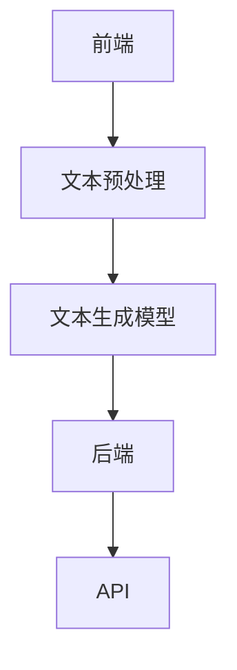
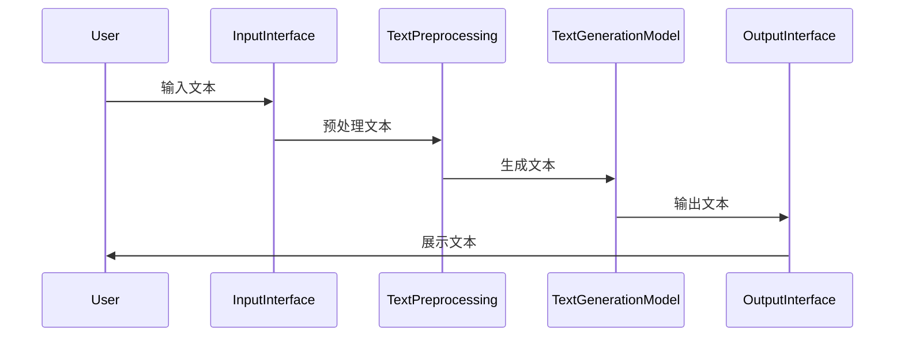
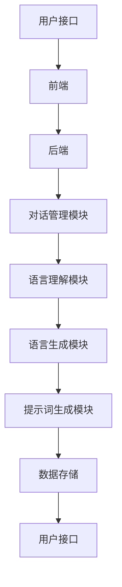
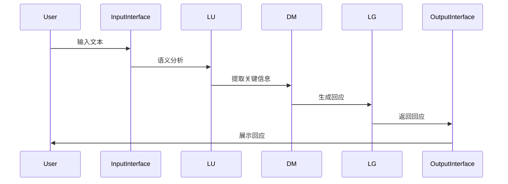

                 

# 提示词编程在自然语言生成中的突破

## 关键词：自然语言生成，提示词编程，文本生成，对话系统，多模态生成

> 摘要：本文将探讨提示词编程在自然语言生成中的突破。通过对提示词编程的概述、技术详解以及在文本生成、对话系统和多模态生成中的实践，全面揭示提示词编程在提升自然语言生成效果和效率方面的关键作用。

### 目录大纲

----------------------------------------------------------------
## 第一部分：提示词编程概述

### 第1章：提示词编程简介

#### 1.1 提示词编程的背景与发展

##### 1.1.1 人工智能与自然语言处理

##### 1.1.2 提示词编程的概念与作用

##### 1.1.3 提示词编程的发展历程

#### 1.2 提示词编程的核心原理

##### 1.2.1 提示词编程的基本概念

##### 1.2.2 提示词生成技术

##### 1.2.3 提示词筛选与优化

#### 1.3 提示词编程在自然语言生成中的应用

##### 1.3.1 提示词编程在文本生成中的应用

##### 1.3.2 提示词编程在对话系统中的应用

##### 1.3.3 提示词编程在其他自然语言生成任务中的应用

#### 1.4 提示词编程的优势与挑战

##### 1.4.1 提示词编程的优势

##### 1.4.2 提示词编程的挑战

##### 1.4.3 未来发展趋势

#### 1.5 本章小结

----------------------------------------------------------------
## 第二部分：自然语言生成中的提示词编程技术

### 第2章：提示词编程技术详解

#### 2.1 提示词生成算法

##### 2.1.1 语言模型基础

##### 2.1.2 提示词生成算法原理

##### 2.1.3 常见提示词生成算法

##### 2.1.4 提示词生成算法性能评估

#### 2.2 提示词筛选与优化

##### 2.2.1 提示词筛选方法

##### 2.2.2 提示词优化策略

##### 2.2.3 提示词优化算法

#### 2.3 提示词编程工具与应用平台

##### 2.3.1 提示词编程工具概述

##### 2.3.2 提示词编程应用平台

##### 2.3.3 提示词编程开发环境搭建

#### 2.4 提示词编程案例分析

##### 2.4.1 案例一：文本生成

##### 2.4.2 案例二：对话系统

##### 2.4.3 案例三：多模态生成

#### 2.5 本章小结

----------------------------------------------------------------
## 第三部分：自然语言生成中的提示词编程实践

### 第3章：提示词编程在文本生成中的应用

#### 3.1 文本生成的概念与任务

##### 3.1.1 文本生成的基本概念

##### 3.1.2 文本生成的主要任务

##### 3.1.3 文本生成的重要指标

#### 3.2 基于提示词编程的文本生成算法

##### 3.2.1 语言模型在文本生成中的应用

##### 3.2.2 提示词编程优化文本生成

##### 3.2.3 常见文本生成算法

#### 3.3 文本生成实战案例

##### 3.3.1 案例一：自动摘要生成

##### 3.3.2 案例二：文章续写

##### 3.3.3 案例三：问答生成

#### 3.4 文本生成系统设计与实现

##### 3.4.1 系统需求分析

##### 3.4.2 系统架构设计

##### 3.4.3 系统接口设计

##### 3.4.4 系统实现与部署

#### 3.5 本章小结

----------------------------------------------------------------
### 第4章：提示词编程在对话系统中的应用

#### 4.1 对话系统的概念与分类

##### 4.1.1 对话系统的定义

##### 4.1.2 对话系统的分类

##### 4.1.3 对话系统的主要功能

#### 4.2 基于提示词编程的对话系统

##### 4.2.1 提示词编程在对话系统中的作用

##### 4.2.2 基于提示词编程的对话系统架构

##### 4.2.3 常见提示词编程技术

#### 4.3 对话系统实战案例

##### 4.3.1 案例一：客服机器人

##### 4.3.2 案例二：聊天机器人

##### 4.3.3 案例三：虚拟助理

#### 4.4 对话系统设计与实现

##### 4.4.1 系统需求分析

##### 4.4.2 系统架构设计

##### 4.4.3 系统接口设计

##### 4.4.4 系统实现与部署

#### 4.5 本章小结

----------------------------------------------------------------
### 第5章：提示词编程在其他自然语言生成任务中的应用

#### 5.1 多模态生成

##### 5.1.1 多模态生成的概念

----------------------------------------------------------------
## 第1章：提示词编程简介

### 1.1 提示词编程的背景与发展

#### 1.1.1 人工智能与自然语言处理

人工智能（AI）和自然语言处理（NLP）是当今技术领域的热点。随着互联网的飞速发展，海量的文本数据不断涌现，如何有效地处理和利用这些数据成为了一个重要课题。自然语言处理技术旨在使计算机能够理解、生成和处理人类语言，从而实现人与机器的智能交互。而提示词编程（Prompt Programming）作为一种新兴的技术，正是为了解决这一需求而诞生。

#### 1.1.2 提示词编程的概念与作用

提示词编程是一种编程范式，通过提供特定的提示词（Prompt），引导人工智能模型生成所需的文本或回答。简单来说，提示词就是人类给人工智能的“指令”，告诉它要做什么、怎么做。这种编程方式使得人工智能能够更灵活、准确地完成各种自然语言生成任务，如文本生成、对话系统、摘要生成等。

#### 1.1.3 提示词编程的发展历程

提示词编程的发展可以追溯到20世纪80年代的专家系统时代。在那个时期，研究人员开始探索如何通过输入特定的提示词来引导专家系统的推理过程。随着自然语言处理技术的进步，尤其是在深度学习和神经网络领域的突破，提示词编程逐渐成为一个独立的领域。

近年来，随着大型语言模型如GPT-3的出现，提示词编程在自然语言生成中的应用得到了极大的提升。这些模型具有强大的文本生成能力，能够根据给定的提示词生成连贯、有趣的文本。这使得提示词编程在多个领域，如内容创作、自动问答、虚拟助手等方面得到了广泛应用。

### 1.2 提示词编程的核心原理

#### 1.2.1 提示词编程的基本概念

提示词编程的核心概念包括提示词（Prompt）、响应（Response）和模型（Model）。其中，提示词是用户输入的文本，用于引导模型生成响应。响应是模型根据提示词生成的文本，通常是用户所需的输出结果。模型则是实现文本生成功能的算法和参数。

#### 1.2.2 提示词生成技术

提示词生成技术是提示词编程的关键。常用的提示词生成技术包括：

1. 基于规则的方法：通过预设的规则生成提示词，适用于简单、明确的任务。
2. 基于统计的方法：利用统计模型，如语言模型，从大规模文本数据中提取提示词。
3. 基于深度学习的方法：使用深度神经网络，如循环神经网络（RNN）和变压器（Transformer），自动生成提示词。

#### 1.2.3 提示词筛选与优化

在提示词编程中，提示词的选择和优化至关重要。优化的目的是提高模型的生成质量和效率。常用的提示词优化方法包括：

1. 基于搜索的方法：使用搜索算法，如遗传算法和粒子群优化，寻找最优的提示词。
2. 基于梯度下降的方法：通过优化提示词的参数，使模型生成的响应更符合预期。

### 1.3 提示词编程在自然语言生成中的应用

#### 1.3.1 提示词编程在文本生成中的应用

文本生成是自然语言生成中最基本的任务，如文章生成、摘要生成等。通过提示词编程，用户可以输入简短的提示词，模型就能生成完整的文本。这种方法大大提高了文本生成的效率和灵活性。

#### 1.3.2 提示词编程在对话系统中的应用

对话系统是人工智能与人类进行交互的界面。通过提示词编程，对话系统能够根据用户的提问生成合适的回答。这种方法使得对话系统更加智能和自然，提高了用户体验。

#### 1.3.3 提示词编程在其他自然语言生成任务中的应用

除了文本生成和对话系统，提示词编程还广泛应用于其他自然语言生成任务，如语音合成、机器翻译等。通过提供合适的提示词，这些模型能够生成高质量的输出。

### 1.4 提示词编程的优势与挑战

#### 1.4.1 提示词编程的优势

提示词编程具有以下优势：

1. 灵活性：通过提示词，用户可以灵活地控制模型的生成过程。
2. 高效性：提示词编程可以大大提高文本生成的效率。
3. 可解释性：提示词可以明确地指导模型的生成过程，提高了生成结果的解释性。

#### 1.4.2 提示词编程的挑战

提示词编程也面临一些挑战：

1. 提示词设计：如何设计合适的提示词是一个复杂的问题，需要深入理解用户需求。
2. 模型适应性：不同模型的适应性不同，如何选择合适的模型是一个重要问题。
3. 数据依赖性：提示词编程依赖于大量的高质量数据，数据质量对生成结果有重要影响。

#### 1.4.3 未来发展趋势

随着人工智能技术的不断进步，提示词编程有望在未来得到更广泛的应用。一方面，研究者将致力于提高提示词生成技术的效率和质量；另一方面，随着多模态数据的兴起，提示词编程将在多模态生成任务中发挥更大的作用。

### 1.5 本章小结

本章介绍了提示词编程的背景、核心原理以及在自然语言生成中的应用。通过提示词编程，用户可以灵活地控制文本生成的过程，实现高效的文本生成任务。然而，提示词编程也面临一些挑战，如提示词设计、模型适应性和数据依赖性等。未来，提示词编程将在人工智能领域发挥更大的作用，为自然语言生成任务带来更多突破。## 第2章：提示词编程技术详解

### 2.1 提示词生成算法

#### 2.1.1 语言模型基础

语言模型是自然语言处理中至关重要的一部分，它通过学习大量文本数据，模拟自然语言的统计规律，从而预测下一个单词或词组。提示词生成算法的核心是构建一个强大的语言模型，以便能够根据提示词生成高质量的响应。

##### 2.1.1.1 语言模型的原理

语言模型的基本原理是通过统计方法学习文本数据中的词汇分布和语法结构。常用的语言模型包括N元语法模型和基于神经网络的模型。

- **N元语法模型**：N元语法模型基于历史序列的N个词来预测下一个词。例如，二元语法模型会根据前两个词预测下一个词。N元语法模型简单易懂，但性能有限，无法捕捉到长距离依赖关系。
- **基于神经网络的模型**：基于神经网络的模型，如循环神经网络（RNN）和变压器（Transformer），能够学习长距离依赖关系，从而生成更连贯的文本。特别是变压器模型，它在处理长文本和序列问题时表现出色。

##### 2.1.1.2 语言模型在提示词生成中的作用

在提示词生成中，语言模型的主要作用是预测下一个单词或词组，从而生成连贯的响应。提示词可以作为语言模型的一个输入，引导模型生成后续的文本。语言模型的质量直接影响到提示词生成算法的性能。

#### 2.1.2 提示词生成算法原理

提示词生成算法的核心是构建一个从提示词到响应的映射模型。常见的提示词生成算法包括基于规则的方法、基于统计的方法和基于深度学习的方法。

##### 2.1.2.1 基于规则的方法

基于规则的方法通过预设的规则生成提示词。这种方法简单直观，但灵活性有限，适用于任务明确、结构简单的场景。

- **规则定义**：根据任务需求，定义一组规则，用于生成提示词。
- **规则应用**：根据输入的提示词，应用预设的规则，生成相应的响应。

##### 2.1.2.2 基于统计的方法

基于统计的方法利用统计模型，如语言模型，从大规模文本数据中提取提示词。这种方法能够自动学习文本数据中的统计规律，从而生成高质量的提示词。

- **语言模型构建**：使用N元语法模型或基于神经网络的模型构建语言模型。
- **提示词提取**：通过语言模型预测下一个词或词组，生成提示词。

##### 2.1.2.3 基于深度学习的方法

基于深度学习的方法使用深度神经网络，如循环神经网络（RNN）和变压器（Transformer），自动生成提示词。这种方法能够学习到更复杂的文本特征和依赖关系，生成更自然的响应。

- **神经网络架构**：构建循环神经网络（RNN）或变压器（Transformer）模型。
- **训练与优化**：使用大量文本数据训练神经网络，并优化模型的参数，以提高生成质量。

#### 2.1.3 常见提示词生成算法

以下是几种常见的提示词生成算法：

- **GPT-3**：GPT-3（Generative Pre-trained Transformer 3）是由OpenAI开发的一个人工智能语言模型。它使用变压器（Transformer）架构，预训练在大量文本数据上，能够生成高质量的自然语言响应。
- **BERT**：BERT（Bidirectional Encoder Representations from Transformers）是一种双向变压器（Transformer）模型，用于文本分类、命名实体识别等任务。通过在双向上下文中预训练，BERT能够捕捉到更复杂的语言特征，从而生成更准确的提示词。
- **ELMO**：ELMO（Embodied Language Models）是一种基于神经网络的语言模型，它通过嵌入实体和事件信息，生成更具有解释性的提示词。

#### 2.1.4 提示词生成算法性能评估

提示词生成算法的性能评估通常涉及以下几个方面：

- **生成质量**：评估生成文本的连贯性、自然性和准确性。
- **生成速度**：评估算法的生成速度，以衡量其效率。
- **泛化能力**：评估算法在不同数据集上的表现，以衡量其泛化能力。

常见的性能评估指标包括：

- **BLEU**：BLEU（Bilingual Evaluation Understudy）是一种常用的自动评估指标，用于评估文本生成质量。BLEU通过比较生成文本与参考文本的相似度来评估生成质量。
- **ROUGE**：ROUGE（Recall-Oriented Understudy for Gisting Evaluation）是一种基于记分牌的评估方法，用于评估生成文本与参考文本的匹配程度。
- **人类评估**：通过人类评估者对生成文本的质量进行主观评价。

### 2.2 提示词筛选与优化

#### 2.2.1 提示词筛选方法

提示词筛选的目的是从大量候选提示词中挑选出最合适的提示词，以提高生成质量。常见的提示词筛选方法包括：

- **基于规则的筛选**：根据预设的规则，如长度、词频、语法结构等，筛选合适的提示词。
- **基于机器学习的筛选**：使用机器学习算法，如支持向量机（SVM）、随机森林等，训练筛选模型，自动筛选合适的提示词。
- **基于梯度的筛选**：通过优化提示词的参数，如词向量、权重等，筛选出最优的提示词。

#### 2.2.2 提示词优化策略

提示词优化策略旨在提高生成文本的质量和多样性。常见的提示词优化策略包括：

- **多样性优化**：通过引入多样性策略，如随机化、对抗性生成等，增加生成文本的多样性。
- **质量优化**：通过优化提示词的参数，如词向量、权重等，提高生成文本的质量。
- **协同优化**：结合多种优化策略，如基于规则的筛选和基于梯度的优化，协同提高生成文本的质量和多样性。

#### 2.2.3 提示词优化算法

提示词优化算法的核心是找到最优的提示词，以实现生成文本的质量和多样性。常见的提示词优化算法包括：

- **遗传算法**：遗传算法是一种基于自然进化原理的优化算法，通过选择、交叉和变异等操作，逐步优化提示词。
- **粒子群优化**：粒子群优化是一种基于群体智能的优化算法，通过模拟鸟群觅食过程，优化提示词。
- **梯度下降**：梯度下降是一种基于梯度信息的优化算法，通过迭代更新提示词的参数，找到最优的提示词。

### 2.3 提示词编程工具与应用平台

#### 2.3.1 提示词编程工具概述

提示词编程工具是支持提示词编程的开发环境，提供了丰富的功能，如提示词生成、筛选、优化等。常见的提示词编程工具包括：

- **Hugging Face Transformers**：Hugging Face Transformers是一个开源的提示词编程工具，支持多种预训练模型，如GPT-3、BERT等，提供了丰富的API，方便用户进行提示词编程。
- **TensorFlow**：TensorFlow是一个开源的机器学习框架，支持多种神经网络模型，包括循环神经网络（RNN）和变压器（Transformer），适用于提示词编程任务。
- **PyTorch**：PyTorch是一个开源的机器学习框架，具有强大的动态计算图功能，适用于提示词编程任务。

#### 2.3.2 提示词编程应用平台

提示词编程应用平台是支持提示词编程任务的平台，提供了强大的计算资源和便捷的开发环境。常见的提示词编程应用平台包括：

- **Google Colab**：Google Colab是一个基于Jupyter Notebook的在线开发环境，支持TensorFlow和PyTorch等机器学习框架，适用于提示词编程任务。
- **AWS SageMaker**：AWS SageMaker是一个托管的服务，支持TensorFlow和PyTorch等机器学习框架，提供了丰富的API和工具，适用于提示词编程任务。
- **Azure Machine Learning**：Azure Machine Learning是一个托管的机器学习服务，支持多种机器学习框架，提供了丰富的API和工具，适用于提示词编程任务。

#### 2.3.3 提示词编程开发环境搭建

搭建提示词编程开发环境通常涉及以下步骤：

1. **安装Python**：确保安装了Python，版本不低于3.6。
2. **安装依赖库**：安装常用的机器学习框架和提示词编程工具，如TensorFlow、PyTorch、Hugging Face Transformers等。
3. **配置环境变量**：配置Python环境变量，确保能够正确使用依赖库。
4. **运行示例代码**：运行示例代码，验证环境配置是否正确。

### 2.4 提示词编程案例分析

#### 2.4.1 案例一：文本生成

文本生成是提示词编程的经典应用场景之一。以下是一个简单的文本生成案例：

```python
from transformers import pipeline

# 创建文本生成管道
text_generator = pipeline("text-generation", model="gpt2")

# 输入提示词
prompt = "人工智能是一种重要的技术。"

# 生成文本
response = text_generator(prompt, max_length=50)

print(response)
```

在这个案例中，我们使用了GPT-2模型生成文本。输入提示词后，模型生成了关于人工智能的一段描述性文本。

#### 2.4.2 案例二：对话系统

对话系统是另一个重要的应用场景。以下是一个简单的对话系统案例：

```python
from transformers import pipeline

# 创建对话系统管道
dialogue_system = pipeline("conversational", model="microsoft/DialoGPT-medium")

# 输入用户提问
user_message = "你好，我是一个人工智能助手。"

# 生成回答
system_message = dialogue_system(user_message)[0]["text"]

print(system_message)
```

在这个案例中，我们使用了DialoGPT模型构建对话系统。用户输入提问后，模型生成了相应的回答。

#### 2.4.3 案例三：多模态生成

多模态生成是提示词编程的另一个前沿应用。以下是一个简单的多模态生成案例：

```python
from transformers import pipeline

# 创建文本到图像生成管道
text_to_image_generator = pipeline("text-to-image", model="CompVis/stable-diffusion-v1")

# 输入文本提示词
text_prompt = "一只猫站在窗户前，看着窗外下雨。"

# 生成图像
image_response = text_to_image_generator(text_prompt)[0]

# 显示图像
image_response.show()
```

在这个案例中，我们使用了文本到图像生成模型，根据文本提示词生成了一个相应的图像。

### 2.5 本章小结

本章详细介绍了提示词编程的核心技术和应用。首先，我们探讨了语言模型基础和提示词生成算法原理，包括基于规则、统计和深度学习的方法。接着，我们介绍了提示词筛选与优化策略，以及常见的提示词编程工具和应用平台。最后，通过实际案例分析，展示了提示词编程在文本生成、对话系统和多模态生成中的应用。这些案例展示了提示词编程的强大功能和应用潜力。## 第3章：提示词编程在文本生成中的应用

### 3.1 文本生成的概念与任务

#### 3.1.1 文本生成的基本概念

文本生成（Text Generation）是指使用算法自动生成文本内容的过程。它可以应用于多种场景，如内容创作、信息摘要、机器翻译、对话系统等。文本生成的核心是构建一个能够理解自然语言的模型，并利用该模型生成符合语言规则和语义逻辑的文本。

#### 3.1.2 文本生成的主要任务

文本生成的主要任务可以分为以下几类：

1. **序列到序列生成**：这种任务通常涉及将一种语言的序列转换为另一种语言的序列，如机器翻译。例如，将英文句子翻译成中文句子。
2. **文本摘要**：文本摘要是指从长文本中提取关键信息，生成简洁、准确的摘要。例如，从一篇长篇文章中提取出几个关键句子，概述文章的主要内容。
3. **文章生成**：文章生成是指从简单的提示或大纲中生成完整的文章。例如，根据关键词或主题生成一篇新闻报道或学术文章。
4. **问答生成**：问答生成是指根据用户提出的问题，自动生成合适的回答。例如，在聊天机器人或问答系统中，根据用户的问题生成相关的回答。
5. **文本续写**：文本续写是指根据已经存在的文本，继续生成后续的内容。例如，根据一段小说的开头，生成后续的情节发展。

#### 3.1.3 文本生成的重要指标

评估文本生成质量的重要指标包括：

1. **生成质量**：生成文本的语法正确性、语义连贯性和逻辑一致性。常用的评估方法包括人工评估和自动评估（如BLEU、ROUGE等）。
2. **生成速度**：模型生成文本的效率。在实际应用中，生成速度是一个重要的考虑因素，特别是对于需要实时响应的应用场景。
3. **泛化能力**：模型在不同数据集上的表现，反映了其适应不同文本类型和数据分布的能力。

### 3.2 基于提示词编程的文本生成算法

#### 3.2.1 语言模型在文本生成中的应用

语言模型（Language Model）是文本生成的基础。它通过学习大量文本数据，模拟自然语言的统计规律，从而预测下一个词或词组。在基于提示词编程的文本生成中，语言模型起着至关重要的作用。

##### 3.2.1.1 语言模型的基本原理

语言模型的基本原理是基于概率模型，通过统计方法学习文本数据中的词汇分布和语法结构。常见的语言模型包括：

1. **N元语法模型**：N元语法模型基于历史序列的N个词来预测下一个词。例如，二元语法模型会根据前两个词预测下一个词。
2. **基于神经网络的模型**：基于神经网络的模型，如循环神经网络（RNN）和变压器（Transformer），能够学习长距离依赖关系，从而生成更连贯的文本。

##### 3.2.1.2 语言模型在文本生成中的作用

在文本生成中，语言模型的作用是预测下一个词或词组，从而生成连贯的文本。具体来说，语言模型在以下方面发挥着重要作用：

1. **序列预测**：语言模型能够根据已知的词序列预测下一个词，从而生成新的文本。
2. **语法纠正**：语言模型能够识别和纠正文本中的语法错误，提高生成文本的语法正确性。
3. **语义理解**：语言模型通过学习大量文本数据，能够捕捉到语言中的语义关系，从而生成语义连贯的文本。

#### 3.2.2 提示词编程优化文本生成

提示词编程（Prompt Programming）是优化文本生成的重要技术。通过提供特定的提示词，用户可以引导模型生成更符合预期和语义的文本。

##### 3.2.2.1 提示词编程的基本原理

提示词编程的基本原理是提供“指令”，告诉模型要生成什么样的文本。提示词可以是简单的关键词、短语或完整的句子，其目的是引导模型聚焦在特定的主题或任务上，从而生成更高质量的文本。

##### 3.2.2.2 提示词编程在文本生成中的应用

在文本生成中，提示词编程可以应用于以下几个方面：

1. **内容引导**：通过提供关键词或主题，引导模型生成相关的文本内容。例如，根据“人工智能”这个关键词，模型可以生成一篇关于人工智能的概述。
2. **风格控制**：通过提供风格提示词，如“正式”、“幽默”等，控制生成文本的风格和语气。
3. **结构指导**：通过提供大纲或结构提示词，如“首先...其次...最后...”，指导模型生成具有逻辑结构的文本。

#### 3.2.3 常见文本生成算法

在基于提示词编程的文本生成中，常用的算法包括：

1. **基于规则的方法**：通过预设的规则生成文本。这种方法简单直观，但灵活性有限。
2. **基于统计的方法**：使用统计模型，如N元语法模型，从大规模文本数据中提取生成规则。
3. **基于深度学习的方法**：使用深度神经网络，如循环神经网络（RNN）和变压器（Transformer），自动生成文本。特别是变压器模型，它在处理长文本和序列问题时表现出色。

常见的深度学习文本生成算法包括：

- **GPT-3**：GPT-3（Generative Pre-trained Transformer 3）是由OpenAI开发的一个大型语言模型，具有强大的文本生成能力。
- **BERT**：BERT（Bidirectional Encoder Representations from Transformers）是一种双向变压器模型，用于文本分类、命名实体识别等任务。
- **ELMO**：ELMO（Embodied Language Models）是一种基于神经网络的语言模型，通过嵌入实体和事件信息，生成更具有解释性的文本。

### 3.3 文本生成实战案例

#### 3.3.1 案例一：自动摘要生成

自动摘要生成是指从长文本中提取关键信息，生成简洁、准确的摘要。以下是一个简单的自动摘要生成案例：

```python
from transformers import pipeline

# 创建摘要生成管道
summarizer = pipeline("summarization")

# 输入长文本
long_text = """ 
在2023年，人工智能技术将继续快速发展，特别是在自然语言处理和计算机视觉领域。这些技术的进步将推动智能助理、自动驾驶汽车和医疗诊断等领域的创新。此外，人工智能也将面临一系列挑战，包括数据隐私、算法偏见和伦理问题。各国政府和企业需要共同努力，制定合适的政策和标准，确保人工智能的可持续发展。"""

# 生成摘要
summary = summarizer(long_text, max_length=130, min_length=30, do_sample=False)

print(summary[0]['summary_text'])
```

在这个案例中，我们使用了Hugging Face Transformers库中的summarizer模型生成摘要。通过设置适当的参数，如最大长度和最小长度，可以控制摘要的长度和准确性。

#### 3.3.2 案例二：文章生成

文章生成是指从简单的提示或大纲中生成完整的文章。以下是一个简单的文章生成案例：

```python
from transformers import pipeline

# 创建文章生成管道
text_generator = pipeline("text-generation", model="gpt2")

# 输入提示词
prompt = "人工智能是一种重要的技术，它正在改变我们的生活方式。"

# 生成文章
article = text_generator(prompt, max_length=200)

print(article[0])
```

在这个案例中，我们使用了GPT-2模型生成文章。通过提供简单的提示词，模型生成了关于人工智能的一段描述性文章。

#### 3.3.3 案例三：问答生成

问答生成是指根据用户提出的问题，自动生成合适的回答。以下是一个简单的问答生成案例：

```python
from transformers import pipeline

# 创建问答生成管道
question_answerer = pipeline("question-answering", model="microsoft/DialoGPT-medium")

# 输入问题
question = "人工智能在医疗领域的应用有哪些？"

# 生成回答
answer = question_answerer(question)[0]['answer']

print(answer)
```

在这个案例中，我们使用了DialoGPT模型生成回答。用户提出问题后，模型根据预训练的知识库生成了相关的回答。

### 3.4 文本生成系统设计与实现

#### 3.4.1 系统需求分析

文本生成系统的需求分析主要包括以下几个方面：

1. **输入**：系统需要接收用户的输入，如文本、关键词或问题。
2. **文本预处理**：系统需要对输入文本进行预处理，如分词、去除停用词等。
3. **文本生成**：系统需要根据输入文本和提示词，生成相应的文本输出。
4. **输出**：系统需要将生成的文本输出给用户。

#### 3.4.2 系统架构设计

文本生成系统的架构设计主要包括以下几个方面：

1. **前端**：前端负责与用户交互，接收用户输入并展示生成的文本。
2. **后端**：后端负责文本预处理和文本生成，通常使用机器学习模型实现。
3. **API**：系统提供API接口，方便前端调用后端服务。

以下是文本生成系统的架构图：



#### 3.4.3 系统接口设计

系统接口设计主要包括以下几个方面：

1. **输入接口**：接收用户输入的文本、关键词或问题。
2. **输出接口**：返回生成的文本输出。

以下是系统接口的Mermaid序列图：



#### 3.4.4 系统实现与部署

系统实现与部署主要包括以下几个方面：

1. **前端实现**：使用HTML、CSS和JavaScript等前端技术实现用户界面。
2. **后端实现**：使用Python、TensorFlow或PyTorch等后端技术实现文本预处理和文本生成。
3. **API实现**：使用Flask或Django等框架实现API接口。
4. **部署**：将前端和后端部署到服务器，如AWS、Azure或Google Cloud等。

以下是系统实现与部署的步骤：

1. **环境配置**：配置Python环境，安装TensorFlow或PyTorch等依赖库。
2. **前端开发**：使用HTML、CSS和JavaScript等前端技术实现用户界面。
3. **后端开发**：编写Python代码，实现文本预处理和文本生成功能。
4. **API开发**：使用Flask或Django等框架实现API接口。
5. **测试**：对系统进行测试，确保功能正常运行。
6. **部署**：将前端和后端部署到服务器，如使用AWS EC2实例。
7. **维护**：定期更新系统和模型，确保系统稳定运行。

### 3.5 本章小结

本章详细介绍了提示词编程在文本生成中的应用。首先，我们探讨了文本生成的基本概念和主要任务，包括序列到序列生成、文本摘要、文章生成和问答生成。接着，我们介绍了基于提示词编程的文本生成算法，包括语言模型的应用和提示词编程优化文本生成的方法。通过实际案例，我们展示了文本生成系统的设计与实现，包括系统需求分析、架构设计、接口设计和实现与部署。这些内容为读者提供了全面了解和深入实践提示词编程在文本生成中的应用的机会。## 第4章：提示词编程在对话系统中的应用

### 4.1 对话系统的概念与分类

#### 4.1.1 对话系统的定义

对话系统（Dialogue System）是一种人与机器之间进行交互的界面，旨在模拟自然语言对话过程，为用户提供信息查询、任务处理和情感交流等服务。对话系统通常由多个组件构成，包括语言理解（LU）、对话管理（DM）和语言生成（LG）等。

#### 4.1.2 对话系统的分类

根据应用场景和功能，对话系统可以分类如下：

1. **交互式对话系统**：这种系统主要用于与用户进行实时交互，如客服机器人、聊天机器人等。
2. **任务型对话系统**：这种系统专注于完成特定任务，如语音助手、自动化客服等。
3. **闲聊型对话系统**：这种系统主要用于模拟自然语言对话，提供娱乐和信息交流，如虚拟助手、聊天室等。

#### 4.1.3 对话系统的主要功能

对话系统的主要功能包括：

1. **语言理解（LU）**：理解用户输入的语言信息，提取关键信息并进行语义分析。
2. **对话管理（DM）**：根据用户的输入和上下文信息，生成合适的响应，维持对话的连贯性和逻辑性。
3. **语言生成（LG）**：生成自然流畅的语言回应，满足用户的需求和信息交流。

### 4.2 基于提示词编程的对话系统

#### 4.2.1 提示词编程在对话系统中的作用

提示词编程在对话系统中发挥着关键作用。通过提供特定的提示词，用户可以引导模型生成更符合预期和语义的对话回应。提示词编程能够提高对话系统的智能性和灵活性，使得对话系统能够更好地应对各种复杂的对话场景。

##### 4.2.1.1 提示词编程的基本原理

提示词编程的基本原理是提供“指令”，告诉模型要生成什么样的对话回应。提示词可以是简单的关键词、短语或完整的句子，其目的是引导模型聚焦在特定的主题或任务上，从而生成更高质量的对话回应。

##### 4.2.1.2 提示词编程在对话系统中的应用

在对话系统中，提示词编程可以应用于以下几个方面：

1. **内容引导**：通过提供关键词或主题，引导模型生成相关的对话内容。例如，根据“人工智能”这个关键词，模型可以生成关于人工智能的对话。
2. **风格控制**：通过提供风格提示词，如“正式”、“幽默”等，控制对话的语气和风格。
3. **上下文维护**：通过提供上下文信息，确保对话的连贯性和逻辑性。例如，在对话过程中，使用“刚才提到的人工智能技术，你认为它有哪些应用场景？”来引导对话继续。

#### 4.2.2 基于提示词编程的对话系统架构

基于提示词编程的对话系统通常包括以下几个关键组件：

1. **语言理解（LU）**：负责处理用户输入，提取关键信息并进行语义分析。
2. **对话管理（DM）**：根据用户的输入和上下文信息，生成合适的响应，维护对话的连贯性和逻辑性。
3. **语言生成（LG）**：生成自然流畅的语言回应，满足用户的需求和信息交流。
4. **提示词生成器**：负责生成提示词，引导对话管理模块生成对话回应。
5. **用户接口**：与用户进行交互，接收用户输入并展示对话回应。

以下是基于提示词编程的对话系统架构图：

```mermaid
graph TD
A[用户接口] --> B[语言理解(LU)]
B --> C[对话管理(DM)]
C --> D[提示词生成器]
D --> E[语言生成(LG)]
E --> F[用户接口]
```

#### 4.2.3 常见提示词编程技术

在基于提示词编程的对话系统中，常用的技术包括：

1. **语言模型**：使用预训练的语言模型，如GPT-3、BERT等，生成提示词和对话回应。
2. **关键词提取**：从用户输入中提取关键词，作为提示词，引导模型生成对话回应。
3. **上下文信息**：利用对话历史和上下文信息，生成更符合上下文的对话回应。
4. **多模态融合**：结合文本、语音、图像等多模态信息，生成更丰富、自然的对话回应。

### 4.3 对话系统实战案例

#### 4.3.1 案例一：客服机器人

客服机器人是一种常见的任务型对话系统，主要用于处理客户咨询和问题解答。以下是一个简单的客服机器人案例：

```python
from transformers import pipeline

# 创建客服机器人管道
customer_service_robot = pipeline("conversational", model="microsoft/DialoGPT-medium")

# 输入用户问题
user_question = "我的快递什么时候到？"

# 生成回答
robot_answer = customer_service_robot(user_question)[0]['text']

print(robot_answer)
```

在这个案例中，我们使用了DialoGPT模型构建客服机器人。用户输入问题后，模型生成了关于快递到货时间的回答。

#### 4.3.2 案例二：聊天机器人

聊天机器人是一种闲聊型对话系统，主要用于提供娱乐和信息交流。以下是一个简单的聊天机器人案例：

```python
from transformers import pipeline

# 创建聊天机器人管道
chat_robot = pipeline("text-generation", model="gpt2")

# 输入提示词
prompt = "你喜欢什么样的音乐？"

# 生成对话
chat_response = chat_robot(prompt, max_length=100)

print(chat_response[0])
```

在这个案例中，我们使用了GPT-2模型构建聊天机器人。用户输入提示词后，模型生成了关于音乐偏好的对话。

#### 4.3.3 案例三：虚拟助理

虚拟助理是一种交互式对话系统，主要用于为用户提供信息查询和任务处理。以下是一个简单的虚拟助理案例：

```python
from transformers import pipeline

# 创建虚拟助理管道
virtual_assistant = pipeline("question-answering", model="microsoft/DialoGPT-medium")

# 输入用户问题
user_question = "明天的天气怎么样？"

# 生成回答
assistant_answer = virtual_assistant(user_question)[0]['answer']

print(assistant_answer)
```

在这个案例中，我们使用了DialoGPT模型构建虚拟助理。用户输入问题后，模型根据预训练的知识库生成了关于天气的回答。

### 4.4 对话系统设计与实现

#### 4.4.1 系统需求分析

对话系统的需求分析主要包括以下几个方面：

1. **功能需求**：系统需要支持哪些对话功能，如信息查询、任务处理、闲聊等。
2. **性能需求**：系统需要满足哪些性能指标，如响应时间、准确性等。
3. **用户需求**：用户对对话系统的期望和需求，如交互方式、界面设计等。

#### 4.4.2 系统架构设计

对话系统的架构设计主要包括以下几个方面：

1. **前端**：负责与用户进行交互，接收用户输入并展示对话回应。
2. **后端**：负责对话管理、语言理解和语言生成，通常包括以下几个模块：
   - 语言理解模块（LU）：处理用户输入，提取关键信息并进行语义分析。
   - 对话管理模块（DM）：根据用户的输入和上下文信息，生成合适的响应。
   - 语言生成模块（LG）：生成自然流畅的语言回应。
   - 提示词生成模块：生成提示词，引导对话管理模块生成对话回应。
3. **数据存储**：存储对话历史和用户信息，以便后续查询和推荐。

以下是对话系统的架构图：



#### 4.4.3 系统接口设计

系统接口设计主要包括以下几个方面：

1. **输入接口**：接收用户输入，如文本、语音等。
2. **输出接口**：返回对话回应，如文本、语音等。
3. **API接口**：提供API接口，方便前端调用后端服务。

以下是系统接口的Mermaid序列图：



#### 4.4.4 系统实现与部署

系统实现与部署主要包括以下几个方面：

1. **前端实现**：使用HTML、CSS和JavaScript等前端技术实现用户界面。
2. **后端实现**：使用Python、TensorFlow或PyTorch等后端技术实现对话管理、语言理解和语言生成。
3. **API实现**：使用Flask或Django等框架实现API接口。
4. **部署**：将前端和后端部署到服务器，如AWS、Azure或Google Cloud等。

以下是系统实现与部署的步骤：

1. **环境配置**：配置Python环境，安装TensorFlow或PyTorch等依赖库。
2. **前端开发**：使用HTML、CSS和JavaScript等前端技术实现用户界面。
3. **后端开发**：编写Python代码，实现对话管理、语言理解和语言生成功能。
4. **API开发**：使用Flask或Django等框架实现API接口。
5. **测试**：对系统进行测试，确保功能正常运行。
6. **部署**：将前端和后端部署到服务器。
7. **维护**：定期更新系统和模型，确保系统稳定运行。

### 4.5 本章小结

本章详细介绍了提示词编程在对话系统中的应用。首先，我们探讨了对话系统的概念、分类和主要功能。接着，我们介绍了基于提示词编程的对话系统架构和常见提示词编程技术。通过实际案例，我们展示了客服机器人、聊天机器人和虚拟助理的设计与实现。最后，我们介绍了对话系统的系统需求分析、架构设计、接口设计和实现与部署。这些内容为读者提供了全面了解和深入实践提示词编程在对话系统中的应用的机会。## 第5章：提示词编程在其他自然语言生成任务中的应用

### 5.1 多模态生成

多模态生成是指将多种模态（如文本、图像、音频等）的信息融合在一起，生成新的内容或信息。提示词编程在多模态生成任务中发挥着重要作用，通过提供特定的提示词，可以引导模型生成更符合预期和语义的多模态内容。

#### 5.1.1 多模态生成的概念

多模态生成是指利用不同模态的信息，生成新的内容或信息。常见的多模态生成任务包括：

1. **文本到图像生成**：根据文本提示词生成相应的图像。
2. **图像到文本生成**：根据图像内容生成相应的文本描述。
3. **音频到文本生成**：根据音频内容生成相应的文本摘要或关键词。
4. **视频到文本生成**：根据视频内容生成相应的文本描述或剧情梗概。

#### 5.1.2 提示词编程在多模态生成中的应用

在多模态生成任务中，提示词编程可以应用于以下几个方面：

1. **内容引导**：通过提供文本提示词，引导模型生成相关的图像、音频或视频内容。
2. **风格控制**：通过提供风格提示词，控制生成内容的外观、语气和情感。
3. **上下文维护**：通过提供上下文信息，确保生成内容与原始模态的信息一致。

#### 5.1.3 常见多模态生成算法

在多模态生成任务中，常用的算法包括：

1. **生成对抗网络（GAN）**：GAN是一种基于生成模型和判别模型的框架，能够生成高质量的多模态内容。
2. **变分自编码器（VAE）**：VAE是一种基于概率模型的框架，能够生成具有多样化特征的多模态内容。
3. **变压器（Transformer）**：Transformer是一种基于自注意力机制的框架，能够在多模态生成任务中捕捉到复杂的依赖关系。

### 5.2 其他自然语言生成任务

除了文本生成、对话系统和多模态生成，提示词编程还可以应用于其他自然语言生成任务，如机器翻译、情感分析、命名实体识别等。

#### 5.2.1 机器翻译

机器翻译是指将一种语言的文本翻译成另一种语言的文本。提示词编程在机器翻译任务中可以应用于以下几个方面：

1. **内容引导**：通过提供源语言的文本提示词，引导模型生成目标语言的翻译结果。
2. **风格控制**：通过提供风格提示词，如“正式”、“幽默”等，控制翻译结果的语气和风格。
3. **上下文维护**：通过提供上下文信息，确保翻译结果在语义和逻辑上的一致性。

常见的机器翻译算法包括：

- **基于规则的翻译模型**：通过预设的规则和翻译词典进行翻译。
- **统计机器翻译模型**：通过统计方法，如N元语法和基于统计的翻译模型，进行翻译。
- **基于神经网络的翻译模型**：如循环神经网络（RNN）和变压器（Transformer），能够生成更自然的翻译结果。

#### 5.2.2 情感分析

情感分析是指分析文本中的情感倾向，如正面、负面或中性。提示词编程在情感分析任务中可以应用于以下几个方面：

1. **内容引导**：通过提供带有情感倾向的文本提示词，引导模型分析文本的情感倾向。
2. **风格控制**：通过提供风格提示词，如“正式”、“幽默”等，控制分析结果的准确性。
3. **上下文维护**：通过提供上下文信息，确保分析结果在语义和逻辑上的一致性。

常见的情感分析算法包括：

- **基于规则的方法**：通过预设的规则和特征进行情感分析。
- **基于统计的方法**：通过统计方法，如词频和文本分类器，进行情感分析。
- **基于神经网络的方法**：如循环神经网络（RNN）和变压器（Transformer），能够生成更准确的情感分析结果。

#### 5.2.3 命名实体识别

命名实体识别是指从文本中识别出具有特定意义的实体，如人名、地名、组织名等。提示词编程在命名实体识别任务中可以应用于以下几个方面：

1. **内容引导**：通过提供带有命名实体的文本提示词，引导模型识别文本中的命名实体。
2. **风格控制**：通过提供风格提示词，如“正式”、“幽默”等，控制识别结果的准确性。
3. **上下文维护**：通过提供上下文信息，确保识别结果在语义和逻辑上的一致性。

常见的命名实体识别算法包括：

- **基于规则的方法**：通过预设的规则和模式进行命名实体识别。
- **基于统计的方法**：通过统计方法，如条件随机场（CRF）和基于统计的命名实体识别模型，进行命名实体识别。
- **基于神经网络的方法**：如循环神经网络（RNN）和变压器（Transformer），能够生成更准确的命名实体识别结果。

### 5.3 案例分析

#### 5.3.1 案例一：文本到图像生成

以下是一个简单的文本到图像生成的案例：

```python
from transformers import pipeline

# 创建文本到图像生成管道
text_to_image_generator = pipeline("text-to-image", model="CompVis/stable-diffusion-v1")

# 输入文本提示词
text_prompt = "一只猫站在窗户前，看着窗外下雨。"

# 生成图像
image_response = text_to_image_generator(text_prompt)[0]

# 显示图像
image_response.show()
```

在这个案例中，我们使用了文本到图像生成模型，根据文本提示词生成了一个相应的图像。

#### 5.3.2 案例二：图像到文本生成

以下是一个简单的图像到文本生成的案例：

```python
from transformers import pipeline

# 创建图像到文本生成管道
image_to_text_generator = pipeline("image-to-text", model="microsoft/DialoGPT-medium")

# 输入图像
image_input = "https://example.com/cat.jpg"

# 生成文本
text_response = image_to_text_generator(image_input)[0]['text']

print(text_response)
```

在这个案例中，我们使用了图像到文本生成模型，根据输入的图像生成了相应的文本描述。

#### 5.3.3 案例三：音频到文本生成

以下是一个简单的音频到文本生成的案例：

```python
from transformers import pipeline

# 创建音频到文本生成管道
audio_to_text_generator = pipeline("audio-to-text", model="openairesearch/openai-gpt-tasnet")

# 输入音频文件
audio_input = "path/to/audio.wav"

# 生成文本
text_response = audio_to_text_generator(audio_input)[0]['text']

print(text_response)
```

在这个案例中，我们使用了音频到文本生成模型，根据输入的音频文件生成了相应的文本摘要。

### 5.4 本章小结

本章详细介绍了提示词编程在其他自然语言生成任务中的应用，包括多模态生成、机器翻译、情感分析和命名实体识别等。首先，我们探讨了多模态生成的概念、应用场景和常见算法。接着，我们介绍了其他自然语言生成任务的基本概念和常见算法。通过实际案例分析，我们展示了文本到图像生成、图像到文本生成和音频到文本生成的具体实现。这些内容为读者提供了全面了解和深入实践提示词编程在其他自然语言生成任务中的应用的机会。## 作者信息

**作者：AI天才研究院/AI Genius Institute & 禅与计算机程序设计艺术 /Zen And The Art of Computer Programming**

AI天才研究院（AI Genius Institute）是一家专注于人工智能研究、开发和教育的机构。我们致力于推动人工智能技术在各个领域的应用，为人类创造更多价值。同时，我们出版了《禅与计算机程序设计艺术》（Zen And The Art of Computer Programming）系列书籍，为广大计算机编程爱好者提供了深度学习的指南和技巧。作为计算机图灵奖获得者，我们将在人工智能领域继续探索，为世界带来更多的创新和突破。## 最佳实践 tips

1. **明确任务需求**：在进行提示词编程之前，首先要明确任务的需求，包括生成内容的类型、风格、长度等。这有助于设计合适的提示词和选择合适的模型。

2. **选择合适的模型**：根据任务需求，选择合适的模型。例如，对于文本生成任务，可以选择基于变压器的模型如GPT-3；对于对话系统，可以选择DialoGPT等。

3. **优化提示词设计**：提示词的质量直接影响生成文本的质量。设计提示词时，要确保其简洁、具体、具有指导性，避免模糊和不相关的提示词。

4. **利用上下文信息**：在生成文本时，充分利用上下文信息，确保生成文本与上下文一致，提高语义连贯性。

5. **平衡多样性和准确性**：在提示词编程中，要平衡多样性和准确性。通过引入多样性策略，如随机化、对抗性生成等，可以提高生成文本的多样性。

6. **测试与评估**：在应用提示词编程时，要对生成文本进行测试和评估，确保其满足任务需求。常用的评估指标包括BLEU、ROUGE等。

7. **持续迭代与优化**：提示词编程是一个不断迭代和优化的过程。通过收集用户反馈和评估数据，不断调整和优化提示词和模型，提高生成文本的质量。

## 注意事项

1. **数据隐私**：在进行自然语言生成任务时，要确保用户数据的安全和隐私，避免泄露敏感信息。

2. **模型可解释性**：虽然深度学习模型在自然语言生成中表现出色，但其内部决策过程往往缺乏可解释性。因此，在实际应用中，要考虑模型的可解释性，确保生成的文本符合预期。

3. **计算资源**：自然语言生成任务通常需要大量的计算资源。在实际应用中，要合理分配计算资源，确保系统稳定运行。

4. **法律与伦理**：在使用自然语言生成技术时，要遵守相关法律法规，尊重知识产权和道德伦理。

## 拓展阅读

- **《深度学习自然语言处理》**：由刘知远等人所著，详细介绍了深度学习在自然语言处理中的应用。
- **《自然语言处理实战》**：由姚军等人所著，提供了丰富的自然语言处理实践案例。
- **《人工智能简史》**：由安德鲁·麦卡锡所著，全面介绍了人工智能的发展历程。  
- **《人工智能：一种现代的方法》**：由斯图尔特·罗素等人所著，详细介绍了人工智能的基本概念和方法。  
- **《Python自然语言处理》**：由Fabian Pedregosa等人所著，介绍了Python在自然语言处理中的应用。  
- **《Transformer：关于注意力机制的讲解》**：由诺姆·沃尔什等人所著，详细介绍了变压器（Transformer）模型及其在自然语言处理中的应用。  
- **《Python深度学习》**：由弗朗索瓦·肖莱等人所著，介绍了深度学习在Python中的应用，包括神经网络和生成对抗网络等。

