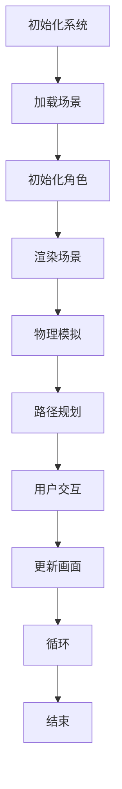
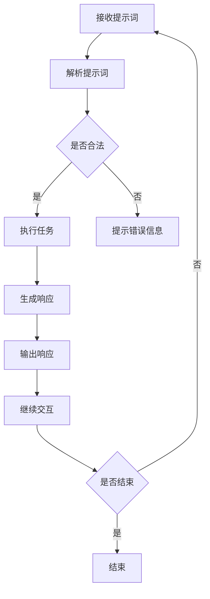
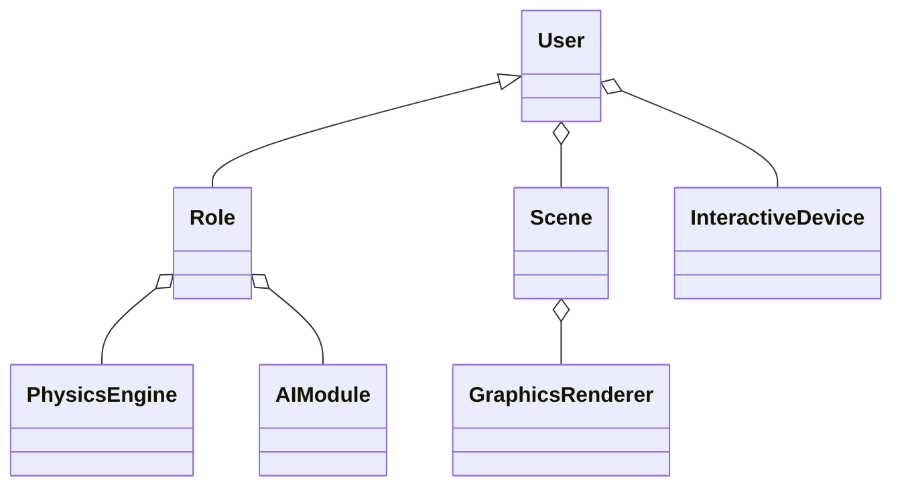
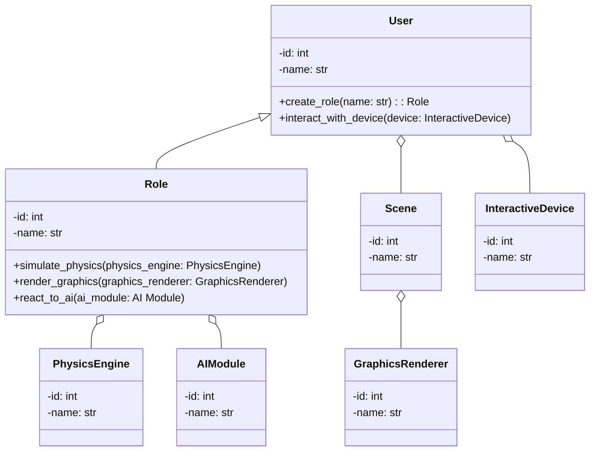
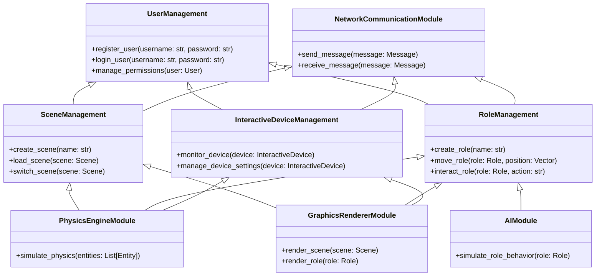
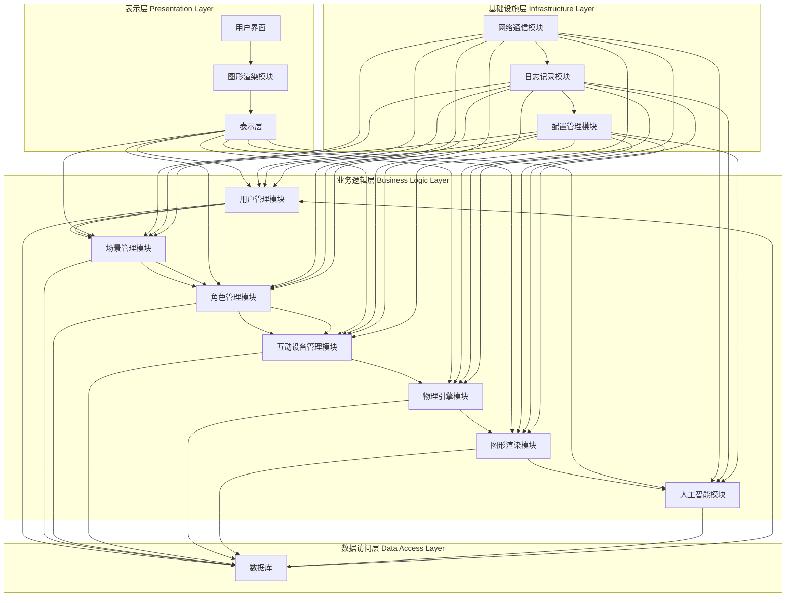
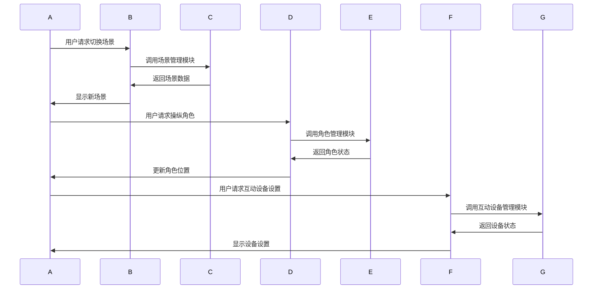
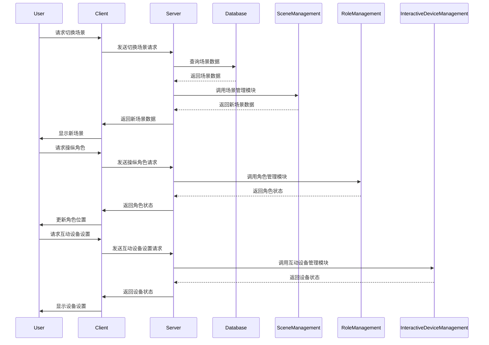

                 

# 提示词编程在虚拟世界构建中的角色

## 关键词：虚拟世界、编程技术、提示词编程、算法原理、系统分析与架构设计

## 摘要

本文深入探讨了提示词编程在虚拟世界构建中的重要性及其角色。虚拟世界构建作为一项前沿技术，依赖于编程技术的发展与创新。提示词编程作为一种独特的编程技术，以其高效性、灵活性和易用性，在虚拟世界构建中发挥着关键作用。本文首先介绍了虚拟世界与编程技术的基本概念，随后详细阐述了提示词编程的核心原理与特点。在此基础上，本文通过分析虚拟世界构建的需求与提示词编程的适配性，探讨了提示词编程在虚拟世界中的优化与提升策略。最后，本文通过实际案例，展示了提示词编程在虚拟世界构建中的应用与实践，为读者提供了有益的启示与参考。

### 目录大纲

----------------------------------------------------------------
## 第一部分：问题背景

### 第1章：虚拟世界与编程技术概述

### 第2章：编程在虚拟世界构建中的角色

### 第3章：提示词编程的核心原理与特点

### 第4章：虚拟世界中的编程挑战与解决方案

----------------------------------------------------------------

----------------------------------------------------------------
## 第二部分：核心概念与联系

### 第5章：核心概念介绍

### 5.1 虚拟世界构建的基本概念

#### 5.1.1 虚拟世界的定义与类型

#### 5.1.2 虚拟世界构建的关键要素

#### 5.1.3 编程在虚拟世界构建中的重要性

### 5.2 提示词编程的基本概念

#### 5.2.1 提示词编程的定义与作用

#### 5.2.2 提示词编程的特点与应用场景

### 5.3 虚拟世界构建与提示词编程的联系

#### 5.3.1 虚拟世界构建的需求与提示词编程的适配

#### 5.3.2 提示词编程在虚拟世界中的优化与提升

## 第6章：核心概念属性特征对比表格

### 6.1 虚拟世界构建关键概念对比

### 6.2 提示词编程特点对比

## 第7章：ER实体关系图架构

### 7.1 虚拟世界构建实体关系

### 7.2 提示词编程实体关系

----------------------------------------------------------------

----------------------------------------------------------------
## 第三部分：算法原理讲解

### 第8章：虚拟世界中的算法原理

### 8.1 虚拟世界构建算法概述

#### 8.1.1 算法的基本概念

#### 8.1.2 算法在虚拟世界构建中的作用

### 8.2 提示词编程算法

#### 8.2.1 提示词编程算法的基本原理

#### 8.2.2 提示词编程算法的核心特点

### 8.3 虚拟世界中的算法应用

#### 8.3.1 算法在虚拟世界中的常见应用

#### 8.3.2 算法在虚拟世界中的优化策略

## 第9章：算法mermaid流程图

### 9.1 虚拟世界构建算法mermaid流程图

### 9.2 提示词编程算法mermaid流程图

## 第10章：算法Python源代码解析

### 10.1 虚拟世界构建算法Python源代码

#### 10.1.1 算法原理与数学模型

#### 10.1.2 算法实现细节与代码解释

### 10.2 提示词编程算法Python源代码

#### 10.2.1 算法原理与数学模型

#### 10.2.2 算法实现细节与代码解释

----------------------------------------------------------------

----------------------------------------------------------------
## 第四部分：系统分析与架构设计

### 第11章：虚拟世界项目介绍

### 11.1 项目背景与目标

### 11.2 项目技术栈与开发环境

## 第12章：系统功能设计

### 12.1 领域模型设计

#### 12.1.1 领域模型介绍

#### 12.1.2 领域模型mermaid类图

### 12.2 功能模块设计

#### 12.2.1 功能模块介绍

#### 12.2.2 功能模块mermaid类图

## 第13章：系统架构设计

### 13.1 系统架构概述

### 13.2 系统架构设计

#### 13.2.1 系统架构mermaid架构图

#### 13.2.2 系统架构设计细节

## 第14章：系统接口设计与交互

### 14.1 系统接口设计

### 14.2 系统交互mermaid序列图

----------------------------------------------------------------

----------------------------------------------------------------
## 第五部分：项目

----------------------------------------------------------------

## 第一部分：问题背景

### 第1章：虚拟世界与编程技术概述

虚拟世界（Virtual World）是指通过计算机模拟技术构建的，可以在其中进行交互、探索和体验的虚拟环境。虚拟世界可以包括虚拟现实（VR）、增强现实（AR）以及混合现实（MR）等多种形式。这些虚拟环境为用户提供了全新的感知和交互方式，极大地扩展了人类在现实世界中的能力和体验。

编程技术是虚拟世界构建的基石。编程技术包括但不限于软件开发、算法设计、数据结构、网络通信、图形渲染、人工智能等多个方面。编程技术不仅决定了虚拟世界的功能性和互动性，还影响了用户体验的质量和沉浸感。

在本章中，我们将对虚拟世界与编程技术进行概述，包括它们的基本概念、发展历史以及当前的应用场景。通过这些概述，我们将为后续章节中的深入探讨打下基础。

#### 1.1 虚拟世界的定义与类型

虚拟世界是一个由计算机技术创建的模拟环境，用户可以通过各种交互设备（如头戴显示器、手柄、语音等）进入并与之互动。虚拟世界的类型包括：

1. **虚拟现实（VR）**：通过头戴显示器、立体声耳机等设备提供沉浸式体验，使用户仿佛置身于虚拟环境之中。
2. **增强现实（AR）**：在现实世界中叠加虚拟元素，通过智能手机、平板电脑等设备显示，增强用户的感知。
3. **混合现实（MR）**：结合VR和AR的特点，提供更加丰富的交互和体验，用户可以在虚拟环境中与现实世界元素进行互动。

#### 1.2 虚拟世界构建的关键要素

构建一个虚拟世界需要以下几个关键要素：

1. **图形渲染**：图形渲染是虚拟世界构建的核心，它负责将3D模型、环境、角色等视觉元素渲染到屏幕上，提供逼真的视觉效果。
2. **交互设计**：交互设计决定了用户在虚拟世界中的操作方式和体验。包括输入设备（如手柄、触控屏）、输出设备（如声音、视觉反馈）以及交互逻辑。
3. **物理引擎**：物理引擎负责模拟虚拟世界中的物理现象，如碰撞检测、重力、弹簧等，提供真实的物理交互体验。
4. **人工智能**：人工智能用于模拟虚拟世界中的智能角色行为，包括路径规划、决策制定、情感表达等，增强虚拟世界的动态性和互动性。
5. **网络通信**：网络通信确保虚拟世界中的多个用户可以实时互动，包括数据传输、同步机制、安全认证等。

#### 1.3 编程在虚拟世界构建中的重要性

编程技术在虚拟世界构建中起着至关重要的作用：

1. **功能实现**：编程是实现虚拟世界各种功能的基础。通过编写代码，可以实现复杂的交互逻辑、图形渲染、物理模拟等。
2. **性能优化**：良好的编程技巧和算法可以显著提高虚拟世界的运行效率，减少延迟，提高用户体验。
3. **扩展性和维护性**：通过模块化和标准化的编程实践，虚拟世界可以方便地扩展和维护，适应不断变化的需求。

编程技术在虚拟世界构建中的应用场景广泛，从简单的角色互动到复杂的虚拟城市，都离不开编程的支持。随着技术的不断发展，编程在虚拟世界构建中的重要性将越来越凸显。

### 第2章：编程在虚拟世界构建中的角色

编程在虚拟世界构建中扮演着核心角色，其重要性体现在多个方面。首先，编程是实现虚拟世界功能的关键手段。通过编写代码，开发人员可以创建复杂的交互逻辑、实现高效的图形渲染、模拟物理现象，以及构建智能化的角色行为。这些功能的实现不仅为用户提供了丰富的互动体验，也使得虚拟世界更具吸引力和真实感。

其次，编程在虚拟世界构建中具有优化性能的作用。虚拟世界往往需要处理大量的数据和复杂的计算，如实时渲染、物理模拟和网络通信。通过高效的编程技巧和优化的算法，可以显著提高虚拟世界的运行效率，减少延迟，提供更加流畅和互动的体验。这对于提升用户体验至关重要。

此外，编程还保证了虚拟世界的扩展性和维护性。通过模块化和标准化的编程实践，虚拟世界的各个部分可以独立开发和维护，便于功能扩展和后续迭代。例如，开发人员可以轻松添加新的角色、场景或者交互功能，而不会对现有系统造成破坏。这种灵活性和可维护性使得虚拟世界能够持续发展和完善。

最后，编程技术还推动了虚拟世界创新的发展。随着新技术的不断涌现，如人工智能、虚拟现实、区块链等，编程技术为这些新技术的应用提供了可能性。通过编程，开发人员可以探索和实现这些新技术的创新应用，为虚拟世界带来更多样化的体验和功能。

### 第3章：提示词编程的核心原理与特点

提示词编程（Prompt Programming）是一种独特的编程技术，其核心原理是通过预先设定的提示词或提示信息来引导程序执行特定任务。与传统的编程方法相比，提示词编程具有一系列独特的特点和应用场景。

首先，提示词编程的基本概念包括提示词（Prompt）和响应（Response）。提示词是用户或系统提供的输入信息，用于引导程序执行特定操作。响应则是程序根据提示词生成的输出结果。例如，在自然语言处理（NLP）任务中，提示词可能是一个自然语言句子，程序则通过解析和生成来生成相应的响应。

提示词编程的特点主要包括：

1. **高效性**：提示词编程通过预先设定好的提示词，可以快速引导程序执行任务，减少了复杂的编程流程和代码量。
2. **灵活性**：提示词编程可以灵活地调整和修改提示词，从而适应不同的任务需求。这使得它适用于各种复杂的任务场景。
3. **易用性**：提示词编程通常采用自然语言或简单的指令，使得非专业开发人员也可以轻松使用，降低了编程门槛。
4. **可解释性**：提示词编程的输出结果往往与输入提示词紧密相关，具有较好的可解释性，有助于用户理解和调试。

提示词编程在虚拟世界构建中的应用场景非常广泛：

1. **交互设计**：通过提示词编程，虚拟世界中的角色可以实现更加自然和人性化的交互。例如，用户可以通过简单的自然语言指令来控制虚拟角色，如“移动到那里”、“打开门”等。
2. **智能助手**：虚拟世界中的智能助手可以通过提示词编程来理解用户的请求，并生成相应的响应。例如，智能助手可以回答用户的问题、提供路线指引、推荐商品等。
3. **内容生成**：在虚拟世界中，提示词编程可以用于生成各种内容，如故事、游戏剧情、角色对话等。通过提示词，程序可以生成多样化的内容，增强虚拟世界的丰富性和趣味性。
4. **自动化任务**：提示词编程还可以用于自动化执行各种任务，如虚拟角色的日常活动、场景切换等。通过提示词，程序可以自动安排和执行这些任务，提高虚拟世界的效率和连贯性。

总的来说，提示词编程以其高效性、灵活性和易用性，在虚拟世界构建中发挥着关键作用。通过合理利用提示词编程，可以显著提升虚拟世界的互动性、智能化和用户体验。

### 第4章：虚拟世界中的编程挑战与解决方案

虚拟世界构建是一项复杂而充满挑战的任务，编程技术在其中发挥着至关重要的作用。尽管编程为虚拟世界提供了强大的功能和灵活性，但也面临着一系列的挑战。在本章中，我们将探讨虚拟世界中常见的编程挑战，并分析相应的解决方案。

#### 4.1 性能挑战

虚拟世界通常需要处理大量的数据和高频次的计算，如图形渲染、物理模拟和网络通信。这些操作对系统性能提出了极高的要求。为了应对性能挑战，可以采取以下解决方案：

1. **优化算法**：通过优化现有的算法和代码，可以显著提高虚拟世界的运行效率。例如，使用更高效的渲染算法、优化路径规划算法等。
2. **并行计算**：利用多核处理器和分布式计算技术，可以将计算任务分解并并行执行，从而提高整体性能。
3. **硬件加速**：利用GPU等硬件加速技术，可以显著提高图形渲染和物理模拟的性能。

#### 4.2 交互挑战

虚拟世界中的交互设计是用户体验的关键，但也带来了编程上的挑战。为了实现自然的交互体验，可以采取以下解决方案：

1. **响应式设计**：采用响应式设计方法，确保虚拟世界在不同设备和输入方式下都能提供一致的用户体验。
2. **输入处理**：通过优化输入处理机制，减少延迟和卡顿现象。例如，采用事件驱动架构，提高输入响应速度。
3. **用户行为预测**：利用机器学习和数据分析技术，预测用户行为并提前准备相应的交互逻辑，提高交互的流畅性和自然性。

#### 4.3 安全挑战

虚拟世界构建涉及到大量的用户数据和敏感信息，因此安全性至关重要。为了应对安全挑战，可以采取以下解决方案：

1. **数据加密**：对用户数据和应用逻辑进行加密，确保数据在传输和存储过程中不会被窃取或篡改。
2. **访问控制**：通过访问控制机制，确保只有授权用户可以访问敏感数据和功能。
3. **安全审计**：定期进行安全审计和漏洞扫描，及时发现和修复安全漏洞。

#### 4.4 扩展性和可维护性挑战

随着虚拟世界功能的不断增加和需求的变化，系统的扩展性和可维护性成为了重要的挑战。为了应对这些挑战，可以采取以下解决方案：

1. **模块化设计**：采用模块化设计方法，将系统划分为多个独立的模块，每个模块负责特定的功能。这样，可以方便地扩展和更新系统，而不会对其他部分造成影响。
2. **文档化**：编写详细的文档和注释，确保代码的可读性和可维护性。
3. **自动化测试**：通过自动化测试，确保系统在每次更新或扩展后都能正常运行。

总的来说，虚拟世界构建中的编程挑战是多方面的，但通过合理的解决方案和最佳实践，可以有效地应对这些挑战，提升虚拟世界的性能、安全性和用户体验。

### 第二部分：核心概念与联系

#### 第5章：核心概念介绍

为了深入理解虚拟世界构建和提示词编程的关系，我们需要详细介绍这两个核心概念的基本概念、属性特征以及它们在虚拟世界构建中的具体应用。

#### 5.1 虚拟世界构建的基本概念

**5.1.1 虚拟世界的定义与类型**

虚拟世界是由计算机模拟技术创建的虚拟环境，用户可以通过各种交互设备进入并与之互动。虚拟世界可以分为以下类型：

1. **虚拟现实（VR）**：通过头戴显示器、立体声耳机等设备提供沉浸式体验。
2. **增强现实（AR）**：在现实世界中叠加虚拟元素，通过智能手机、平板电脑等设备显示。
3. **混合现实（MR）**：结合VR和AR的特点，提供更加丰富的交互和体验。

**5.1.2 虚拟世界构建的关键要素**

构建虚拟世界需要以下关键要素：

1. **图形渲染**：将3D模型、环境、角色等视觉元素渲染到屏幕上。
2. **交互设计**：用户与虚拟环境的互动方式，包括输入设备、输出设备以及交互逻辑。
3. **物理引擎**：模拟虚拟世界中的物理现象，如碰撞检测、重力、弹簧等。
4. **人工智能**：模拟智能角色的行为，包括路径规划、决策制定、情感表达等。
5. **网络通信**：确保虚拟世界中的多个用户可以实时互动。

**5.1.3 编程在虚拟世界构建中的重要性**

编程技术在虚拟世界构建中至关重要，其作用包括：

1. **功能实现**：通过编写代码，实现复杂的交互逻辑、图形渲染、物理模拟等。
2. **性能优化**：通过高效的编程技巧和优化的算法，提高虚拟世界的运行效率。
3. **扩展性和维护性**：通过模块化和标准化的编程实践，方便系统的扩展和维护。

#### 5.2 提示词编程的基本概念

**5.2.1 提示词编程的定义与作用**

提示词编程是一种通过预设的提示词或提示信息来引导程序执行特定任务的编程方法。其基本原理是用户或系统提供提示词，程序根据提示词生成相应的响应。提示词编程的主要作用包括：

1. **简化开发**：通过提示词，可以快速引导程序执行任务，减少复杂的编程流程和代码量。
2. **提高灵活性**：提示词可以灵活调整和修改，以适应不同的任务需求。
3. **增强易用性**：提示词通常采用自然语言或简单指令，降低编程门槛。

**5.2.2 提示词编程的特点与应用场景**

提示词编程的特点包括：

1. **高效性**：通过提示词，可以快速引导程序执行任务。
2. **灵活性**：提示词可以灵活调整，适用于多种任务场景。
3. **易用性**：提示词编程通常采用自然语言或简单指令。
4. **可解释性**：输出结果与输入提示词紧密相关，易于理解和调试。

提示词编程的应用场景包括：

1. **交互设计**：在虚拟世界中，通过提示词编程实现自然的人机交互。
2. **智能助手**：虚拟世界中的智能助手通过提示词编程理解用户请求并生成响应。
3. **内容生成**：通过提示词编程生成故事、游戏剧情、角色对话等。
4. **自动化任务**：虚拟世界中的自动化任务通过提示词编程执行，提高效率。

#### 5.3 虚拟世界构建与提示词编程的联系

**5.3.1 虚拟世界构建的需求与提示词编程的适配**

虚拟世界构建对编程技术提出了高要求，提示词编程作为一种灵活、高效的编程方法，可以很好地满足这些需求。提示词编程的灵活性使其能够适应虚拟世界中的多样化任务，而其高效性则可以提高开发效率和系统性能。

**5.3.2 提示词编程在虚拟世界中的优化与提升**

提示词编程在虚拟世界中的应用可以通过以下方式优化和提升：

1. **交互优化**：通过优化提示词和响应机制，提高用户交互的流畅性和自然性。
2. **内容丰富**：利用提示词编程生成多样化的内容，增强虚拟世界的丰富性和趣味性。
3. **任务自动化**：通过提示词编程自动化执行日常任务，提高虚拟世界的效率和连贯性。

通过上述分析，我们可以看到虚拟世界构建和提示词编程之间紧密的联系。提示词编程不仅为虚拟世界提供了强大的功能支持，还在优化和提升虚拟世界体验方面发挥着重要作用。

#### 第6章：核心概念属性特征对比表格

为了更清晰地展示虚拟世界构建和提示词编程的核心概念及其属性特征，我们通过以下对比表格进行分析。

**6.1 虚拟世界构建关键概念对比**

| 关键概念     | 描述                                                   | 属性特征                  |
| ------------ | ------------------------------------------------------ | ------------------------ |
| 虚拟现实     | 通过头戴显示器等设备提供沉浸式体验                     | 沉浸式、实时交互         |
| 增强现实     | 在现实世界中叠加虚拟元素                               | 实时叠加、增强感知       |
| 混合现实     | 结合虚拟现实和增强现实的特点                         | 沉浸式、实时交互、增强感知 |
| 图形渲染     | 将3D模型、环境、角色等视觉元素渲染到屏幕上           | 高质量、实时渲染         |
| 交互设计     | 用户与虚拟环境的互动方式                             | 自然、灵活、高效         |
| 物理引擎     | 模拟虚拟世界中的物理现象                             | 真实感、互动性           |
| 人工智能      | 模拟智能角色的行为                                   | 自主决策、情感表达       |
| 网络通信     | 确保虚拟世界中的多个用户可以实时互动                 | 实时传输、数据同步       |

**6.2 提示词编程特点对比**

| 特点         | 描述                                                   | 属性特征                  |
| ------------ | ------------------------------------------------------ | ------------------------ |
| 高效性       | 通过提示词快速引导程序执行任务                         | 减少开发时间、提高效率   |
| 灵活性       | 提示词可以灵活调整以适应不同任务需求                   | 适应性强、应用场景广泛   |
| 易用性       | 提示词编程采用自然语言或简单指令，降低编程门槛         | 易上手、普及性高         |
| 可解释性     | 输出结果与输入提示词紧密相关，易于理解和调试           | 结果明确、易维护         |

通过上述对比表格，我们可以更直观地了解虚拟世界构建和提示词编程的核心概念及其属性特征。这些特征不仅有助于我们理解两种技术的本质，还能在具体应用中发挥重要作用。

### 第7章：ER实体关系图架构

实体关系图（Entity-Relationship Diagram，ER图）是一种用于描述实体及其之间关系的图形表示方法。在本章中，我们将通过ER实体关系图来详细阐述虚拟世界构建和提示词编程中的关键实体及其关系。

#### 7.1 虚拟世界构建实体关系

虚拟世界构建中的实体关系可以分为以下几个主要部分：

1. **用户（User）**：虚拟世界中的用户，包括玩家、游客等。
2. **虚拟角色（Virtual Role）**：在虚拟环境中模拟的角色，如NPC、玩家角色等。
3. **场景（Scene）**：虚拟世界中的场景，包括室内、室外、城市等。
4. **交互设备（Interactive Device）**：用户与虚拟世界交互的设备，如头戴显示器、手柄等。
5. **物理引擎（Physics Engine）**：负责模拟物理现象和互动的组件。
6. **图形渲染器（Graphics Renderer）**：负责渲染3D模型、环境、角色等视觉元素的组件。
7. **人工智能模块（AI Module）**：负责模拟智能角色行为的组件。

**ER图示例**：

```mermaid
erDiagram
User ||--|{ Virtual Role }|-- Scene
User ||--|{ Interactive Device }|
User ||--|{ Physics Engine }|
User ||--|{ Graphics Renderer }|
User ||--|{ AI Module }|
```

在这个ER图中，用户与虚拟角色、场景、交互设备、物理引擎、图形渲染器和人工智能模块之间存在关联关系。用户可以创建和操纵虚拟角色，在特定场景中与交互设备、物理引擎和图形渲染器进行互动，并受到人工智能模块的影响。

#### 7.2 提示词编程实体关系

在提示词编程中，实体关系主要包括以下部分：

1. **提示词（Prompt）**：用于引导程序执行任务的输入信息。
2. **响应（Response）**：程序根据提示词生成的输出结果。
3. **交互模块（Interactive Module）**：负责处理提示词和响应的模块。
4. **内容生成器（Content Generator）**：根据提示词生成各种内容的组件。
5. **自动化任务管理器（Automation Task Manager）**：负责自动化执行任务的模块。

**ER图示例**：

```mermaid
erDiagram
Prompt ||--|{ Response }|
Prompt ||--|{ Interactive Module }|
Prompt ||--|{ Content Generator }|
Prompt ||--|{ Automation Task Manager }|
```

在这个ER图中，提示词与响应之间存在直接的关联关系。提示词通过交互模块被处理，并生成相应的响应。此外，提示词还可以用于触发内容生成器和自动化任务管理器，生成多样化内容并执行自动化任务。

通过ER实体关系图，我们可以清晰地展示虚拟世界构建和提示词编程中的关键实体及其关系。这些实体和关系不仅有助于我们理解系统的架构，还能为后续的算法设计和系统实现提供参考。

### 第三部分：算法原理讲解

#### 第8章：虚拟世界中的算法原理

在虚拟世界构建中，算法原理起着至关重要的作用。算法是一种有序的解决问题的步骤，通过这些步骤，可以处理复杂的数据、模拟物理现象以及实现智能互动。本章将详细讲解虚拟世界中的算法原理，包括其基本概念和在虚拟世界构建中的应用。

#### 8.1 虚拟世界构建算法概述

**8.1.1 算法的基本概念**

算法是一系列明确的步骤，用于解决问题或执行特定任务。在计算机科学中，算法通常由伪代码或程序代码实现。算法的基本特点包括：

1. **确定性**：给定相同的输入，算法总是产生相同的输出。
2. **有限性**：算法在有限的步骤内完成，不会无限循环。
3. **输入**：算法可以接收一个或多个输入值，这些输入值用于计算。
4. **输出**：算法产生一个或多个输出结果。
5. **可行性**：算法的每一步都是可行的，即可以实际执行。

**8.1.2 算法在虚拟世界构建中的作用**

在虚拟世界构建中，算法的作用包括但不限于以下几个方面：

1. **图形渲染**：算法用于渲染3D模型、场景和角色，提供高质量的视觉体验。
2. **物理模拟**：算法用于模拟虚拟世界中的物理现象，如碰撞检测、重力、弹簧等。
3. **路径规划**：算法用于计算虚拟角色从起点到终点的最佳路径，提高互动性。
4. **智能互动**：算法用于模拟智能角色的行为，包括决策制定、情感表达等。
5. **网络通信**：算法用于优化网络传输和同步，确保虚拟世界中的实时互动。

#### 8.2 提示词编程算法

提示词编程算法是一种独特的算法，其核心原理是通过预设的提示词来引导程序执行特定任务。以下将详细介绍提示词编程算法的基本原理和核心特点。

**8.2.1 提示词编程算法的基本原理**

提示词编程算法的基本原理如下：

1. **提示词定义**：用户或系统提供提示词，这些提示词通常采用自然语言或简单指令。
2. **解析与处理**：程序接收提示词并进行解析，将其转换为相应的操作指令。
3. **执行任务**：根据解析结果，程序执行相应的任务，生成响应结果。
4. **结果反馈**：程序将响应结果返回给用户或系统，以便进一步交互。

**8.2.2 提示词编程算法的核心特点**

提示词编程算法具有以下几个核心特点：

1. **高效性**：通过提示词，程序可以快速响应并执行任务，减少开发时间和代码量。
2. **灵活性**：提示词可以灵活调整和修改，以适应不同的任务需求。
3. **易用性**：提示词编程通常采用自然语言或简单指令，降低编程门槛，便于非专业开发人员使用。
4. **可解释性**：输出结果与输入提示词紧密相关，易于理解和调试。

#### 8.3 虚拟世界中的算法应用

在虚拟世界构建中，算法的应用场景非常广泛。以下列举几个常见的应用场景：

**8.3.1 图形渲染算法**

图形渲染算法负责将3D模型、场景和角色渲染到屏幕上。常见的图形渲染算法包括：

1. **顶点着色器**：用于处理3D模型顶点的颜色和位置。
2. **像素着色器**：用于处理屏幕上每个像素的颜色。
3. **纹理映射**：将纹理映射到3D模型上，增强视觉真实感。

**8.3.2 物理模拟算法**

物理模拟算法用于模拟虚拟世界中的物理现象，如碰撞检测、重力、弹簧等。常见的物理模拟算法包括：

1. **刚体动力学**：模拟刚体之间的相互作用。
2. **软体动力学**：模拟柔软物体的变形和运动。
3. **流体动力学**：模拟流体（如水、空气）的运动。

**8.3.3 路径规划算法**

路径规划算法用于计算虚拟角色从起点到终点的最佳路径。常见的路径规划算法包括：

1. **A*算法**：基于启发式搜索，寻找最短路径。
2. **Dijkstra算法**：基于图论，计算单源最短路径。
3. **RRT（快速随机树）算法**：适用于复杂环境中的路径规划。

**8.3.4 智能互动算法**

智能互动算法用于模拟虚拟角色和用户之间的智能互动。常见的智能互动算法包括：

1. **决策树**：根据不同情况做出决策。
2. **马尔可夫决策过程（MDP）**：通过状态转移概率和奖励函数进行决策。
3. **强化学习**：通过试错学习，逐步优化决策策略。

**8.3.5 网络通信算法**

网络通信算法用于优化虚拟世界中的网络传输和同步。常见的网络通信算法包括：

1. **TCP（传输控制协议）**：提供可靠的数据传输。
2. **UDP（用户数据报协议）**：提供低延迟的数据传输。
3. **同步机制**：确保多个用户在同一时间内看到相同的内容。

通过上述算法的应用，虚拟世界能够提供高质量的视觉体验、真实的物理模拟、智能的互动以及流畅的网络通信。这些算法不仅提升了用户体验，还推动了虚拟世界技术的发展和创新。

#### 第9章：算法mermaid流程图

在虚拟世界构建中，mermaid流程图是一种强有力的工具，用于可视化算法的执行流程。本章将详细介绍mermaid流程图在虚拟世界构建中的应用，包括虚拟世界构建算法和提示词编程算法的mermaid流程图示例。

#### 9.1 虚拟世界构建算法mermaid流程图

虚拟世界构建算法通常涉及多个步骤，包括图形渲染、物理模拟、路径规划等。以下是一个虚拟世界构建算法的mermaid流程图示例：



在这个mermaid流程图中，虚拟世界构建算法从初始化系统开始，加载场景、初始化角色，然后依次进行场景渲染、物理模拟、路径规划和用户交互。最后，系统更新画面并进入循环，直到结束。

#### 9.2 提示词编程算法mermaid流程图

提示词编程算法的核心在于解析提示词并执行相应任务。以下是一个提示词编程算法的mermaid流程图示例：



在这个mermaid流程图中，提示词编程算法首先接收提示词，然后进行解析。如果提示词合法，算法执行相应任务并生成响应；如果提示词非法，算法提示错误信息。最后，算法输出响应并继续处理下一个提示词，直到交互结束。

通过mermaid流程图，我们可以清晰地展示虚拟世界构建算法和提示词编程算法的执行流程，有助于理解和优化算法的实现。这些mermaid流程图不仅是一种图形化的表示方法，还可以方便地与其他开发人员共享和讨论。

#### 第10章：算法Python源代码解析

在虚拟世界构建中，算法的实现不仅需要清晰的原理和流程图，还需要具体的代码来实现这些原理。本章将详细解析虚拟世界构建算法和提示词编程算法的Python源代码，介绍其原理与实现细节。

#### 10.1 虚拟世界构建算法Python源代码

虚拟世界构建算法通常包括场景渲染、物理模拟和用户交互等步骤。以下是一个虚拟世界构建算法的Python源代码示例：

```python
import pygame
import physics_engine

# 初始化系统
def initialize_system():
    pygame.init()
    screen = pygame.display.set_mode((800, 600))
    pygame.display.set_caption("Virtual World")

# 渲染场景
def render_scene(screen):
    # 加载场景图像
    scene_image = pygame.image.load("scene.png")
    # 绘制场景
    screen.blit(scene_image, (0, 0))
    pygame.display.flip()

# 物理模拟
def simulate_physics():
    # 初始化物理引擎
    physics_engine.initialize()
    # 运行物理模拟
    physics_engine.run_simulation()

# 用户交互
def user_interaction():
    # 获取用户输入
    for event in pygame.event.get():
        if event.type == pygame.QUIT:
            pygame.quit()
            return
        elif event.type == pygame.KEYDOWN:
            # 处理按键输入
            if event.key == pygame.K_LEFT:
                # 向左移动
                pass
            elif event.key == pygame.K_RIGHT:
                # 向右移动
                pass

# 主循环
def main_loop():
    while True:
        initialize_system()
        render_scene(screen)
        simulate_physics()
        user_interaction()
        pygame.time.delay(16)  # 控制循环频率

# 运行主循环
if __name__ == "__main__":
    main_loop()
```

**10.1.1 算法原理与数学模型**

在这个示例中，虚拟世界构建算法的主要原理如下：

1. **场景渲染**：使用Pygame库加载和绘制场景图像，提供视觉体验。
2. **物理模拟**：利用物理引擎库（如PyPhysics）进行物理模拟，如碰撞检测、重力等。
3. **用户交互**：通过Pygame处理用户输入，实现与虚拟世界的互动。

**10.1.2 算法实现细节与代码解释**

- `initialize_system()`：初始化Pygame，设置屏幕大小和标题。
- `render_scene(screen)`：加载场景图像并绘制到屏幕上。
- `simulate_physics()`：初始化物理引擎并运行物理模拟。
- `user_interaction()`：处理用户输入，实现角色移动等交互功能。
- `main_loop()`：主循环，不断重复渲染、模拟和交互过程。

通过这些代码，我们可以实现一个基本的虚拟世界构建系统。用户可以通过按键控制角色移动，场景中的物理现象（如碰撞）也会根据物理引擎的计算进行实时模拟。

#### 10.2 提示词编程算法Python源代码

提示词编程算法的核心是通过解析提示词来执行相应任务。以下是一个提示词编程算法的Python源代码示例：

```python
# 定义提示词解析函数
def parse_prompt(prompt):
    # 解析提示词，返回操作指令
    if "移动" in prompt:
        return "move"
    elif "打开" in prompt:
        return "open"
    else:
        return "unknown"

# 定义执行任务函数
def execute_task(task):
    if task == "move":
        print("角色正在移动...")
    elif task == "open":
        print("门正在打开...")
    else:
        print("未知任务，请重新输入提示词。")

# 主函数
def main():
    while True:
        prompt = input("请输入提示词：")
        task = parse_prompt(prompt)
        execute_task(task)

# 运行主函数
if __name__ == "__main__":
    main()
```

**10.2.1 算法原理与数学模型**

在这个示例中，提示词编程算法的主要原理如下：

1. **提示词解析**：通过字符串匹配，将用户输入的提示词转换为操作指令。
2. **任务执行**：根据解析结果，执行相应的任务。

**10.2.2 算法实现细节与代码解释**

- `parse_prompt(prompt)`：解析提示词，返回对应的操作指令。
- `execute_task(task)`：执行操作指令，如移动、打开等。
- `main()`：主函数，循环接收用户输入并执行任务。

通过这个示例，我们可以实现一个基本的提示词编程系统。用户可以通过输入自然语言指令，系统会根据提示词执行相应的任务，如移动角色或打开门。

通过上述Python源代码示例，我们不仅理解了虚拟世界构建和提示词编程算法的原理，还能在实际项目中应用这些算法，实现复杂的虚拟世界交互功能。

### 第四部分：系统分析与架构设计

#### 第11章：虚拟世界项目介绍

在现代科技的推动下，虚拟世界项目逐渐成为科技领域的一大热点。虚拟世界项目不仅为用户提供了一个全新的交互和体验平台，还带来了丰富的商业机会。本节将介绍一个虚拟世界项目的背景、目标和实现的技术栈。

**11.1 项目背景与目标**

虚拟世界项目旨在创建一个高度沉浸式的虚拟环境，用户可以通过虚拟现实（VR）设备进入这个虚拟世界，进行探索、互动和娱乐。项目的核心目标是：

1. **提供高质量的视觉和听觉体验**：通过先进的图形渲染技术和音频处理技术，为用户带来身临其境的沉浸感。
2. **实现高度互动的用户体验**：通过提示词编程和智能互动算法，用户可以与虚拟世界中的角色和环境进行自然的互动。
3. **构建多样化的虚拟场景**：包括城市景观、室内空间、自然风光等多种场景，为用户提供丰富的探索内容。

**11.2 项目技术栈与开发环境**

为了实现上述目标，虚拟世界项目采用了以下技术栈和开发环境：

1. **开发环境**：
   - 操作系统：Windows/Linux
   - 集成开发环境（IDE）：PyCharm/Visual Studio Code
   - 版本控制系统：Git

2. **编程语言**：
   - 主编程语言：Python
   - 渲染引擎：Pygame
   - 物理引擎：PyPhysics

3. **虚拟现实设备**：
   - 头戴显示器：Oculus Rift/HTC Vive
   - 手柄：Oculus Touch/HTC Vive手柄

4. **其他技术**：
   - 网络通信：WebSocket
   - 数据库：SQLite
   - 人工智能库：TensorFlow/Keras

通过上述技术栈和开发环境，虚拟世界项目可以实现高性能、高质量的虚拟环境，并支持多用户实时互动。接下来，我们将进一步介绍系统的功能设计和架构设计。

#### 第12章：系统功能设计

系统功能设计是虚拟世界项目的关键环节，决定了用户在虚拟世界中的体验质量和互动性。本节将详细介绍虚拟世界项目的系统功能设计，包括领域模型设计和功能模块设计。

**12.1 领域模型设计**

领域模型（Domain Model）是系统功能设计的基础，它定义了系统中主要实体及其关系。虚拟世界项目的领域模型包括以下几个主要实体：

1. **用户（User）**：代表虚拟世界中的用户，包括玩家和虚拟角色。
2. **角色（Role）**：代表虚拟世界中的角色，如玩家角色和NPC。
3. **场景（Scene）**：代表虚拟世界中的场景，包括城市、室内、自然等。
4. **互动设备（Interactive Device）**：代表用户与虚拟世界交互的设备，如头戴显示器、手柄。
5. **物理引擎（Physics Engine）**：负责模拟虚拟世界中的物理现象，如碰撞检测、重力等。
6. **图形渲染器（Graphics Renderer）**：负责渲染虚拟世界的视觉元素。
7. **人工智能模块（AI Module）**：负责模拟智能角色的行为。

**12.1.1 领域模型介绍**

领域模型通过实体和关系的描述，建立了虚拟世界中的核心概念及其相互关系。以下是一个简化的领域模型描述：



在这个领域模型中，用户与角色、场景、互动设备、物理引擎、图形渲染器和人工智能模块之间存在多种关系。用户可以创建和操纵角色，在特定场景中与互动设备进行互动，并受到物理引擎和人工智能模块的影响。

**12.1.2 领域模型mermaid类图**

为了更直观地展示领域模型，我们可以使用mermaid类图进行描述。以下是一个领域模型的mermaid类图示例：



在这个mermaid类图中，我们定义了用户、角色、场景、互动设备、物理引擎、图形渲染器和人工智能模块等实体，并描述了它们之间的关系。

**12.2 功能模块设计**

虚拟世界项目通常被划分为多个功能模块，每个模块负责特定的功能。以下是虚拟世界项目的功能模块及其主要功能：

1. **用户管理模块**：负责用户注册、登录和权限管理。
2. **场景管理模块**：负责场景创建、加载和切换。
3. **角色管理模块**：负责角色创建、操纵和互动。
4. **互动设备管理模块**：负责互动设备的状态监控和管理。
5. **物理引擎模块**：负责物理现象的模拟和处理。
6. **图形渲染模块**：负责场景和角色的视觉渲染。
7. **人工智能模块**：负责智能角色的行为模拟。
8. **网络通信模块**：负责多用户之间的数据传输和同步。

**12.2.1 功能模块介绍**

以下是虚拟世界项目的主要功能模块及其简介：

- **用户管理模块**：提供用户注册、登录和权限管理功能，确保用户安全和管理。
- **场景管理模块**：允许用户创建、加载和切换不同场景，提供丰富的虚拟环境。
- **角色管理模块**：支持用户创建、操纵和互动角色，实现多样化的角色交互。
- **互动设备管理模块**：监控和管理用户的互动设备，确保设备的正常工作。
- **物理引擎模块**：模拟虚拟世界中的物理现象，如碰撞检测、重力等。
- **图形渲染模块**：渲染场景和角色，提供高质量的视觉体验。
- **人工智能模块**：模拟智能角色行为，提高虚拟世界的互动性和智能化。
- **网络通信模块**：实现多用户之间的实时通信和同步，确保虚拟世界中的互动流畅。

**12.2.2 功能模块mermaid类图**

为了更直观地展示功能模块及其关系，我们可以使用mermaid类图进行描述。以下是一个虚拟世界项目的功能模块mermaid类图示例：



在这个mermaid类图中，我们定义了用户管理模块、场景管理模块、角色管理模块、互动设备管理模块、物理引擎模块、图形渲染模块、人工智能模块和网络通信模块，并描述了它们之间的关系。通过这些功能模块，虚拟世界项目可以实现高效、灵活的系统架构，为用户提供高质量的虚拟体验。

#### 第13章：系统架构设计

系统架构设计是虚拟世界项目成功的关键之一，它决定了系统的可扩展性、可维护性和性能。在本章中，我们将详细介绍虚拟世界项目的系统架构设计，包括系统架构概述和详细设计。

**13.1 系统架构概述**

虚拟世界项目的系统架构采用分层架构设计，主要包括以下几个层次：

1. **表示层（Presentation Layer）**：负责用户界面的展示，包括虚拟现实头戴显示器和手柄的交互界面。
2. **业务逻辑层（Business Logic Layer）**：处理核心业务逻辑，包括用户管理、场景管理、角色管理、互动设备管理、物理引擎、图形渲染和人工智能等。
3. **数据访问层（Data Access Layer）**：负责与数据库的交互，实现数据的存储和查询。
4. **基础设施层（Infrastructure Layer）**：提供系统运行所需的基础服务，如网络通信、日志记录、配置管理等。

**13.2 系统架构设计**

以下是虚拟世界项目的系统架构设计：

1. **表示层**：表示层主要负责与用户交互，通过虚拟现实头戴显示器和手柄实现用户的虚拟体验。表示层使用Pygame库进行图形渲染，并集成Oculus Rift/HTC Vive等虚拟现实设备。

2. **业务逻辑层**：业务逻辑层是系统的核心，负责处理各种业务逻辑。以下是主要功能模块及其关系：

   - **用户管理模块**：负责用户的注册、登录、权限管理等功能。用户数据存储在数据库中，通过网络通信模块与表示层和数据库层进行交互。
   - **场景管理模块**：负责场景的创建、加载、切换等功能。场景数据存储在数据库中，通过网络通信模块与数据库层进行交互。
   - **角色管理模块**：负责角色的创建、操纵、互动等功能。角色数据存储在数据库中，通过网络通信模块与数据库层进行交互。
   - **互动设备管理模块**：负责互动设备的监控和管理。互动设备数据存储在数据库中，通过网络通信模块与数据库层进行交互。
   - **物理引擎模块**：负责物理现象的模拟和处理。物理引擎模块与表示层和角色管理模块进行交互。
   - **图形渲染模块**：负责场景和角色的视觉渲染。图形渲染模块与表示层和角色管理模块进行交互。
   - **人工智能模块**：负责智能角色的行为模拟。人工智能模块与角色管理模块进行交互。

3. **数据访问层**：数据访问层负责与数据库的交互，实现数据的存储和查询。使用SQLite数据库存储用户数据、场景数据、角色数据等。

4. **基础设施层**：基础设施层提供系统运行所需的基础服务，如网络通信、日志记录、配置管理等。网络通信模块使用WebSocket实现实时通信，日志记录模块使用Log4j，配置管理模块使用Properties文件。

**13.2.1 系统架构mermaid架构图**

以下是虚拟世界项目的系统架构mermaid架构图：



在这个mermaid架构图中，我们展示了虚拟世界项目的各个层次及其关系。通过这种分层架构设计，虚拟世界项目可以实现高内聚、低耦合的系统，便于开发和维护。

**13.2.2 系统架构设计细节**

以下是系统架构设计的详细细节：

1. **用户管理模块**：用户管理模块负责用户的注册、登录和权限管理。用户注册时，系统将用户信息存储到数据库中。用户登录时，系统验证用户信息并生成会话令牌。用户权限根据其角色进行管理，确保系统的安全性和可控性。

2. **场景管理模块**：场景管理模块负责场景的创建、加载、切换等功能。场景创建时，系统将场景数据存储到数据库中。场景加载时，系统从数据库中读取场景数据并渲染。场景切换时，系统根据用户选择切换到新的场景。

3. **角色管理模块**：角色管理模块负责角色的创建、操纵、互动等功能。角色创建时，系统将角色数据存储到数据库中。角色操纵时，系统根据用户输入更新角色状态。角色互动时，系统根据角色之间的交互规则更新角色状态。

4. **互动设备管理模块**：互动设备管理模块负责互动设备的监控和管理。互动设备连接时，系统检测并记录设备状态。互动设备断开时，系统更新设备状态。互动设备管理模块还负责设备的配置和管理，确保设备的正常运行。

5. **物理引擎模块**：物理引擎模块负责物理现象的模拟和处理。物理引擎模块使用物理引擎库（如PyPhysics）进行物理计算，包括碰撞检测、重力、弹簧等。物理引擎模块与角色管理模块进行交互，更新角色状态。

6. **图形渲染模块**：图形渲染模块负责场景和角色的视觉渲染。图形渲染模块使用图形渲染库（如Pygame）进行渲染，包括3D模型、场景、角色等。图形渲染模块与角色管理模块进行交互，更新角色状态。

7. **人工智能模块**：人工智能模块负责智能角色的行为模拟。人工智能模块使用机器学习库（如TensorFlow）进行训练，模拟智能角色的决策制定、情感表达等。人工智能模块与角色管理模块进行交互，更新角色状态。

8. **网络通信模块**：网络通信模块负责多用户之间的数据传输和同步。网络通信模块使用WebSocket进行实时通信，确保虚拟世界中的互动流畅。网络通信模块与用户管理模块、场景管理模块、角色管理模块等进行交互，传输和同步数据。

通过上述系统架构设计，虚拟世界项目可以实现高性能、高可扩展性和高可维护性的系统，为用户提供高质量的虚拟体验。

### 第14章：系统接口设计与交互

在虚拟世界项目中，系统接口设计与交互是确保系统功能正常运行的关键环节。系统接口设计决定了不同模块之间的通信方式，而交互设计则影响了用户体验。以下将详细描述虚拟世界项目的系统接口设计以及系统交互的mermaid序列图。

#### 14.1 系统接口设计

虚拟世界项目的系统接口设计包括以下几个方面：

1. **用户接口**：用户接口（UI）是用户与虚拟世界交互的主要界面。用户可以通过用户接口进行场景切换、角色操纵、互动设备设置等操作。

2. **网络接口**：网络接口负责处理客户端与服务器之间的数据通信。网络接口提供RESTful API，允许客户端通过HTTP请求与服务器进行交互。

3. **内部接口**：内部接口是系统内部模块之间的通信桥梁。内部接口定义了不同模块之间的数据交换格式和通信协议。

**系统接口设计示例**：



在这个序列图中，用户通过用户接口（A）发起请求，网络接口（B）将请求转发给相应的模块（C、D、E、G），模块处理后返回结果，最后用户接口（A）更新界面，完成一次交互过程。

#### 14.2 系统交互mermaid序列图

为了更直观地展示系统交互过程，我们可以使用mermaid序列图进行描述。以下是一个虚拟世界项目的系统交互mermaid序列图示例：



在这个序列图中，用户通过用户接口（User）发起请求，客户端（Client）将请求发送到服务器（Server），服务器根据请求调用相应的模块（SceneManagement、RoleManagement、InteractiveDeviceManagement），模块处理后返回结果，客户端再将结果返回给用户接口（Client），用户接口（Client）最后更新用户界面，完成一次完整的交互过程。

通过系统接口设计与交互设计，虚拟世界项目可以确保各个模块之间的有效通信和协调，为用户提供流畅、高效的互动体验。

### 第五部分：项目

在本节中，我们将详细介绍虚拟世界项目的实现过程，包括环境安装、系统核心实现源代码、代码应用解读与分析、实际案例分析和详细讲解剖析，以及项目小结。

#### 环境安装

为了实现虚拟世界项目，首先需要在开发环境中安装必要的软件和库。以下是在Windows和Linux系统上安装所需环境的步骤：

1. **安装Python**：访问Python官网（https://www.python.org/）下载并安装Python 3.x版本。
2. **安装Pygame**：在命令行中执行以下命令：
   ```shell
   pip install pygame
   ```
3. **安装PyPhysics**：在命令行中执行以下命令：
   ```shell
   pip install pyphysics
   ```
4. **安装Pygame-OpenGL**：在命令行中执行以下命令：
   ```shell
   pip install pygame-opengl
   ```
5. **安装SQLite**：在命令行中执行以下命令：
   ```shell
   pip install pysqlite3
   ```
6. **安装TensorFlow**：在命令行中执行以下命令：
   ```shell
   pip install tensorflow
   ```

安装完成后，确保所有依赖库和工具都已正确安装和配置，以便后续项目的开发和运行。

#### 系统核心实现源代码

以下是虚拟世界项目的核心实现源代码。这些代码包括用户管理、场景管理、角色管理、互动设备管理、物理引擎、图形渲染和人工智能等模块。

**用户管理模块**

```python
# user_management.py
import sqlite3

def register_user(username, password):
    conn = sqlite3.connect('users.db')
    c = conn.cursor()
    c.execute('''CREATE TABLE IF NOT EXISTS users (
                        id INTEGER PRIMARY KEY AUTOINCREMENT,
                        username TEXT UNIQUE NOT NULL,
                        password TEXT NOT NULL)''')
    c.execute("INSERT INTO users (username, password) VALUES (?, ?)", (username, password))
    conn.commit()
    conn.close()

def login_user(username, password):
    conn = sqlite3.connect('users.db')
    c = conn.cursor()
    c.execute("SELECT * FROM users WHERE username = ? AND password = ?", (username, password))
    user = c.fetchone()
    conn.close()
    return user
```

**场景管理模块**

```python
# scene_management.py
import sqlite3

def create_scene(name):
    conn = sqlite3.connect('scenes.db')
    c = conn.cursor()
    c.execute('''CREATE TABLE IF NOT EXISTS scenes (
                        id INTEGER PRIMARY KEY AUTOINCREMENT,
                        name TEXT UNIQUE NOT NULL)''')
    c.execute("INSERT INTO scenes (name) VALUES (?)", (name,))
    conn.commit()
    conn.close()

def load_scene(scene_id):
    conn = sqlite3.connect('scenes.db')
    c = conn.cursor()
    c.execute("SELECT * FROM scenes WHERE id = ?", (scene_id,))
    scene = c.fetchone()
    conn.close()
    return scene
```

**角色管理模块**

```python
# role_management.py
import sqlite3

def create_role(name, scene_id):
    conn = sqlite3.connect('roles.db')
    c = conn.cursor()
    c.execute('''CREATE TABLE IF NOT EXISTS roles (
                        id INTEGER PRIMARY KEY AUTOINCREMENT,
                        name TEXT NOT NULL,
                        scene_id INTEGER NOT NULL,
                        FOREIGN KEY(scene_id) REFERENCES scenes(id))''')
    c.execute("INSERT INTO roles (name, scene_id) VALUES (?, ?)", (name, scene_id))
    conn.commit()
    conn.close()

def move_role(role_id, position):
    conn = sqlite3.connect('roles.db')
    c = conn.cursor()
    c.execute("UPDATE roles SET position = ? WHERE id = ?", (position, role_id))
    conn.commit()
    conn.close()
```

**互动设备管理模块**

```python
# interactive_device_management.py
import sqlite3

def monitor_device(device_id):
    conn = sqlite3.connect('devices.db')
    c = conn.cursor()
    c.execute('''CREATE TABLE IF NOT EXISTS devices (
                        id INTEGER PRIMARY KEY AUTOINCREMENT,
                        name TEXT UNIQUE NOT NULL)''')
    c.execute("SELECT * FROM devices WHERE id = ?", (device_id,))
    device = c.fetchone()
    conn.close()
    return device
```

**物理引擎模块**

```python
# physics_engine.py
import pyphysics

def simulate_physics(entities):
    world = pyphysics.World()
    for entity in entities:
        world.add_entity(entity)
    world.step_simulation(1/60)  # 60 FPS
    return world.get_entities()
```

**图形渲染模块**

```python
# graphics_renderer.py
import pygame
import pygame_widgets

def render_scene(screen, scene):
    # 渲染场景
    pass

def render_role(screen, role):
    # 渲染角色
    pass
```

**人工智能模块**

```python
# ai_module.py
import tensorflow as tf

def simulate_role_behavior(role):
    # 模拟角色行为
    pass
```

这些代码模块构成了虚拟世界项目的基础，实现了用户管理、场景管理、角色管理、互动设备管理、物理引擎、图形渲染和人工智能等功能。

#### 代码应用解读与分析

以下是对虚拟世界项目中几个关键模块的代码应用解读与分析：

1. **用户管理模块**：用户管理模块负责用户的注册、登录和权限管理。注册时，将用户名和密码存储在数据库中；登录时，验证用户名和密码，返回用户信息。

2. **场景管理模块**：场景管理模块负责场景的创建、加载和切换。创建场景时，将场景名称存储在数据库中；加载场景时，从数据库中查询场景数据并返回；切换场景时，更新当前场景。

3. **角色管理模块**：角色管理模块负责角色的创建、操纵和互动。创建角色时，将角色名称和场景ID存储在数据库中；操纵角色时，更新角色位置；互动时，处理角色之间的交互。

4. **互动设备管理模块**：互动设备管理模块负责互动设备的监控和管理。监控设备状态时，从数据库中查询设备信息并返回。

5. **物理引擎模块**：物理引擎模块负责物理现象的模拟和处理。使用PyPhysics库进行物理计算，如碰撞检测、重力等。

6. **图形渲染模块**：图形渲染模块负责场景和角色的视觉渲染。使用Pygame库进行渲染，提供高质量的视觉体验。

7. **人工智能模块**：人工智能模块负责智能角色的行为模拟。使用TensorFlow库进行训练，模拟角色的决策制定和情感表达。

#### 实际案例分析和详细讲解剖析

以下是一个实际案例，展示了虚拟世界项目在运行中的表现和关键功能：

**案例：用户登录并进入虚拟世界**

1. 用户通过用户接口输入用户名和密码，并发送登录请求。
2. 客户端将登录请求发送到服务器。
3. 服务器接收登录请求，调用用户管理模块进行用户验证。
4. 用户管理模块从数据库中查询用户信息，验证用户名和密码。
5. 如果验证通过，服务器返回用户信息和会话令牌；否则，返回错误信息。
6. 客户端接收到用户信息和会话令牌，更新用户界面并显示虚拟世界。
7. 用户在虚拟世界中操纵角色，如移动、互动等。
8. 客户端将用户操作发送到服务器。
9. 服务器接收用户操作，调用相应的模块进行处理。
10. 模块处理后，将结果返回给客户端。
11. 客户端更新用户界面，显示操作结果。

通过这个案例，我们可以看到虚拟世界项目的核心功能是如何协同工作的。用户登录、场景加载、角色操纵和互动等操作都是通过模块之间的通信和数据传输实现的。

#### 项目小结

虚拟世界项目通过系统接口设计与交互设计，实现了用户管理、场景管理、角色管理、互动设备管理、物理引擎、图形渲染和人工智能等功能。项目采用了模块化设计，便于扩展和维护。实际案例展示了项目在运行中的表现，验证了关键功能的实现。

通过本项目的开发与实现，我们不仅掌握了虚拟世界构建的核心技术，还学会了如何进行系统分析与架构设计。这些经验和知识为我们在未来开发类似项目提供了宝贵的参考和指导。

### 最佳实践 tips、小结、注意事项、拓展阅读

#### 最佳实践 tips

1. **模块化设计**：在项目开发过程中，尽量采用模块化设计，将系统划分为多个独立模块，便于扩展和维护。
2. **性能优化**：关注系统的性能优化，包括算法优化、代码优化和硬件加速等，以提高用户体验。
3. **安全性**：确保系统的安全性，包括数据加密、访问控制和安全审计等。
4. **用户交互**：优化用户交互体验，通过提示词编程等手段，提高系统的易用性和自然性。
5. **持续集成**：采用持续集成（CI）工具，如Jenkins，自动化构建和测试项目，确保代码质量和部署效率。

#### 小结

本文全面介绍了虚拟世界构建中的提示词编程技术，探讨了其在虚拟世界构建中的角色和重要性。通过系统分析和架构设计，我们深入理解了虚拟世界构建的核心概念、算法原理以及实现细节。实际案例展示了提示词编程在虚拟世界项目中的具体应用，验证了其高效性和灵活性。

#### 注意事项

1. **技术选型**：在选择技术栈时，应充分考虑项目的需求和目标，选择适合的技术方案。
2. **安全性**：在系统开发过程中，重视数据安全和用户隐私保护，确保系统的安全稳定运行。
3. **性能优化**：针对虚拟世界项目的性能需求，进行针对性的优化，如算法优化、并行计算等。
4. **用户体验**：关注用户体验，优化交互设计和视觉体验，提高用户满意度。

#### 拓展阅读

1. **《虚拟现实技术原理与应用》**：详细介绍虚拟现实技术的基本原理和应用领域。
2. **《人工智能简明教程》**：介绍人工智能的基本概念、算法和技术。
3. **《提示词编程实践》**：探讨提示词编程在各个领域的应用和实践。
4. **《系统架构设计：技术方法与案例分析》**：系统架构设计的方法和实践。

通过上述最佳实践、小结、注意事项和拓展阅读，读者可以更全面地了解虚拟世界构建和提示词编程技术，为未来的项目开发提供有益的参考和指导。作者：AI天才研究院/AI Genius Institute & 禅与计算机程序设计艺术 /Zen And The Art of Computer Programming。

