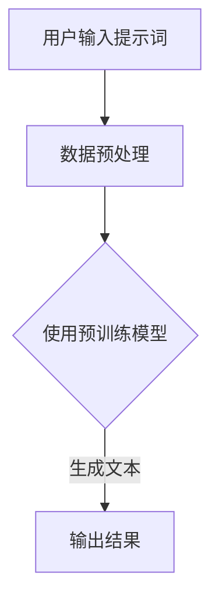
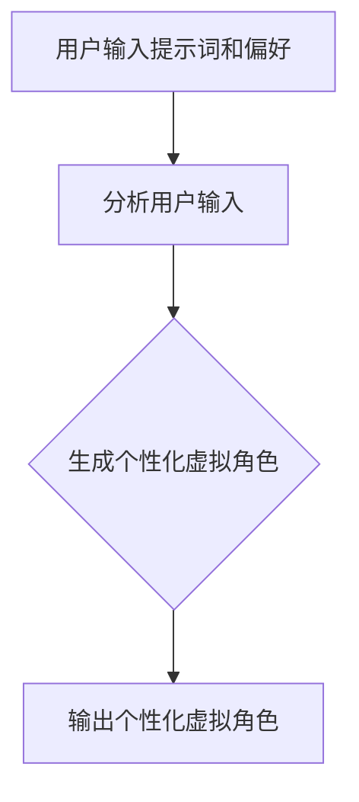
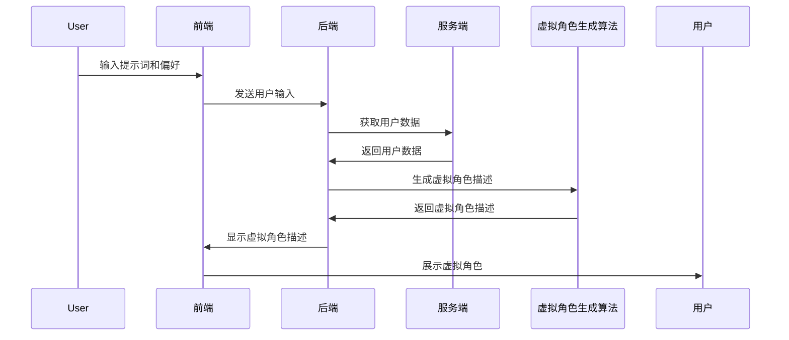
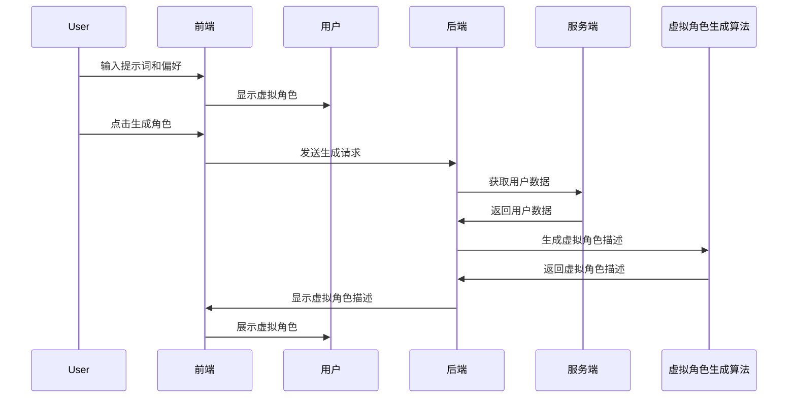

                 


# 提示词编程在虚拟角色个性化中的角色

## 关键词
- 虚拟角色个性化
- 提示词编程
- 人工智能
- 社交娱乐
- 算法原理
- 系统架构
- 项目实战

## 摘要
本文将深入探讨提示词编程在虚拟角色个性化中的作用。首先，我们介绍了虚拟角色个性化在当今社交和娱乐领域的重要性及其面临的挑战。接着，我们详细介绍了提示词编程的概念、原理及其在虚拟角色个性化中的应用。本文还分析了虚拟角色的定义、分类和个性化要素，并通过一个实际项目展示了提示词编程在虚拟角色个性化中的具体应用。

## 1. 背景介绍

### 1.1 问题背景

虚拟角色个性化在现代社交和娱乐领域中扮演着越来越重要的角色。随着虚拟现实（VR）和增强现实（AR）技术的不断发展，用户对于个性化虚拟角色的需求也在逐渐增长。个性化虚拟角色不仅可以提高用户的参与度和满意度，还可以在社交互动、游戏体验、教育等领域提供更丰富的内容。

然而，现有的虚拟角色个性化技术存在一些问题。首先，个性化程度不足，许多虚拟角色的设计缺乏创新，导致用户之间的角色个性重复。其次，现有的个性化方法往往依赖于大量的用户数据，对隐私保护提出了挑战。最后，虚拟角色的设计过程通常繁琐且耗时，无法满足用户对实时性和便捷性的需求。

### 1.2 问题描述

为了解决上述问题，我们需要一种能够提高虚拟角色个性化程度、保护用户隐私并降低设计成本的技术。提示词编程作为一种新兴的人工智能技术，具有强大的数据处理和分析能力，为虚拟角色个性化提供了新的思路和解决方案。

### 1.3 问题解决

提示词编程在虚拟角色个性化中具有以下作用：

1. **个性化生成**：通过提示词编程，可以根据用户的需求和偏好生成独特的虚拟角色，避免了角色个性的重复。
2. **隐私保护**：提示词编程可以处理和分析用户输入的隐私敏感数据，并生成虚拟角色，从而保护用户的隐私。
3. **实时生成**：提示词编程可以实现虚拟角色的实时生成，满足了用户对实时性和便捷性的需求。

### 1.4 边界与外延

本文讨论的虚拟角色个性化主要涉及以下方面：

- **虚拟角色设计**：包括角色的外观、行为和交互设计。
- **用户需求分析**：基于用户输入的提示词，分析用户的需求和偏好。
- **数据隐私保护**：确保用户数据的安全性和隐私性。

### 1.5 概念结构与核心要素组成

本文的核心概念包括提示词编程、虚拟角色和个性化。提示词编程是一种基于自然语言处理和机器学习的技术，虚拟角色是虚拟世界中的角色实体，个性化则是根据用户需求生成的角色定制。

## 2. 核心概念与联系

### 2.1 提示词编程

#### 2.1.1 提示词编程的定义与特点

提示词编程（Prompt Programming）是一种利用自然语言处理（NLP）和机器学习（ML）技术，通过用户输入的提示词来生成目标输出（如文本、图像、虚拟角色等）的方法。其主要特点包括：

- **灵活性与自适应**：提示词编程可以根据用户的需求和偏好进行自适应调整。
- **高效性**：通过自动化生成，提高了虚拟角色设计的效率。
- **泛用性**：适用于多种虚拟角色设计和应用场景。

#### 2.1.2 提示词编程的基本原理

提示词编程的核心原理是通过输入提示词来引导模型生成目标输出。以下是一个简化的算法流程：

1. **数据预处理**：将用户输入的提示词进行预处理，如分词、去停用词等。
2. **模型训练**：使用预训练的NLP模型（如GPT-3、BERT等）对预处理后的提示词进行训练。
3. **生成输出**：通过训练好的模型，根据提示词生成虚拟角色相关的文本、图像或角色属性。

以下是一个使用Python实现的简单示例：

```python
import openai

# 设置API密钥
openai.api_key = "your_api_key"

# 定义提示词
prompt = "生成一个具有冒险精神的虚拟角色"

# 调用API生成虚拟角色描述
response = openai.Completion.create(
  engine="text-davinci-002",
  prompt=prompt,
  max_tokens=50
)

# 输出生成的内容
print(response.choices[0].text.strip())
```

### 2.2 虚拟角色的定义与分类

虚拟角色是指在虚拟世界中的角色实体，它们可以代表用户在社交、游戏、娱乐等场景中与其他用户互动。虚拟角色的分类可以从不同的角度进行，如：

- **根据外观**：可以分为人类角色、动物角色、科幻角色等。
- **根据功能**：可以分为互动角色、观赏角色、游戏角色等。
- **根据交互方式**：可以分为语音交互角色、文本交互角色等。

### 2.3 个性化要素

虚拟角色的个性化主要受到以下要素的影响：

- **用户偏好**：用户对角色外观、性格、行为等的偏好。
- **场景需求**：特定应用场景对虚拟角色的功能需求和设计要求。
- **文化背景**：不同文化背景的用户对虚拟角色的期望和偏好。

### 2.4 概念属性特征对比表格

以下是提示词编程、虚拟角色和个性化要素的属性特征对比：

| 特征         | 提示词编程       | 虚拟角色         | 个性化要素         |
| ------------ | ---------------- | ---------------- | ------------------ |
| 定义         | 利用提示词生成内容 | 虚拟世界中的角色实体 | 根据用户需求和偏好定制角色 |
| 关键技术     | NLP和ML技术      | 角色设计技术     | 用户偏好分析技术    |
| 应用场景     | 文本生成、图像生成 | 社交、游戏、娱乐 | 角色定制          |
| 目标         | 自动化生成内容   | 角色互动体验     | 提升角色个性化程度 |

### 2.5 ER实体关系图架构

以下是虚拟角色个性化中的ER实体关系图：

```mermaid
erDiagram
  User ||--|{ VirtualRole }|-- Application
  User ||--|{ Preference }|-- Application
  VirtualRole ||--|{ Appearance }|-- Application
  VirtualRole ||--|{ Behavior }|-- Application
  Preference ||--|{ User }|
  Appearance ||--|{ VirtualRole }|
  Behavior ||--|{ VirtualRole }|
```

## 3. 算法原理讲解

### 3.1 提示词编程算法原理

#### 3.1.1 算法流程图

以下是一个简单的提示词编程算法流程图：



#### 3.1.2 Python源代码示例

```python
import openai

# 设置API密钥
openai.api_key = "your_api_key"

# 定义提示词
prompt = "请生成一个具有幽默感的虚拟角色描述"

# 调用API生成虚拟角色描述
response = openai.Completion.create(
  engine="text-davinci-002",
  prompt=prompt,
  max_tokens=100
)

# 输出生成的内容
print(response.choices[0].text.strip())
```

#### 3.1.3 算法原理数学模型和公式

提示词编程的核心是生成模型，如GPT-3、BERT等。以下是一个简化的生成模型数学模型：

$$
P(w_{t} | w_{1}, w_{2}, ..., w_{t-1}) = \frac{e^{<f(w_{t-1})>}}{\sum_{w} e^{<f(w_{t-1})>}}
$$

其中，$P(w_{t} | w_{1}, w_{2}, ..., w_{t-1})$表示在给定前$t-1$个词的情况下生成第$t$个词的概率，$f(w_{t-1})$表示前一个词的嵌入向量。

### 3.2 虚拟角色个性化算法

#### 3.2.1 算法流程图

以下是一个简单的虚拟角色个性化算法流程图：



#### 3.2.2 Python源代码示例

```python
import openai

# 设置API密钥
openai.api_key = "your_api_key"

# 定义提示词和偏好
prompt = "请根据以下提示词和偏好生成一个虚拟角色：\n- 提示词：勇敢、冒险、幽默\n- 偏好：蓝色头发、穿着皮夹克、喜欢打篮球"

# 调用API生成虚拟角色描述
response = openai.Completion.create(
  engine="text-davinci-002",
  prompt=prompt,
  max_tokens=100
)

# 输出生成的内容
print(response.choices[0].text.strip())
```

### 3.3 算法原理讲解

#### 3.3.1 算法原理

虚拟角色个性化算法基于用户输入的提示词和偏好，通过机器学习模型生成符合用户需求的虚拟角色描述。其主要原理如下：

1. **用户输入处理**：将用户输入的提示词和偏好进行预处理，提取关键信息。
2. **生成模型训练**：使用预训练的NLP模型（如GPT-3、BERT等）对预处理后的输入进行训练。
3. **生成虚拟角色描述**：通过训练好的模型，根据用户输入生成符合用户需求的虚拟角色描述。

#### 3.3.2 数学模型和公式

虚拟角色个性化算法的生成模型同样基于生成概率模型。以下是一个简化的数学模型：

$$
P(w_{t} | w_{1}, w_{2}, ..., w_{t-1}, \theta) = \frac{e^{<f(w_{t-1}, \theta)>}}{\sum_{w} e^{<f(w_{t-1}, \theta)>}}
$$

其中，$P(w_{t} | w_{1}, w_{2}, ..., w_{t-1}, \theta)$表示在给定前$t-1$个词和模型参数$\theta$的情况下生成第$t$个词的概率，$f(w_{t-1}, \theta)$表示前一个词的嵌入向量和模型参数的加权和。

### 3.4 举例说明

#### 3.4.1 示例一：生成一个具有幽默感的虚拟角色描述

假设用户输入的提示词和偏好如下：

- 提示词：幽默、搞笑
- 偏好：穿着奇怪的衣服、会讲笑话

使用虚拟角色个性化算法生成的虚拟角色描述可能如下：

```
他穿着一件五颜六色的连衣裙，头上戴着一只巨大的蝴蝶结。他的眼睛闪闪发光，似乎能洞察一切。他的口头禅是：“你知道吗？这个世界上最搞笑的事情就是我今天穿了这个裙子！”
```

#### 3.4.2 示例二：生成一个具有冒险精神的虚拟角色描述

假设用户输入的提示词和偏好如下：

- 提示词：冒险、勇敢
- 偏好：骑着一只狮子、手持一把剑

使用虚拟角色个性化算法生成的虚拟角色描述可能如下：

```
她骑着一只威武的狮子，手持一把锋利的剑。她的眼睛炯炯有神，似乎能看穿一切危险。她的口头禅是：“无论前方有多少困难，我都不会退缩！”
```

### 3.5 小结

本文详细介绍了提示词编程在虚拟角色个性化中的应用。通过分析虚拟角色个性化的问题背景和解决方法，我们介绍了提示词编程的概念、原理和应用。同时，我们通过具体的算法原理讲解和举例说明，展示了如何利用提示词编程实现虚拟角色个性化。提示词编程作为一种新兴的人工智能技术，为虚拟角色个性化提供了新的思路和解决方案，有望在未来得到更广泛的应用。

----------------------------------------------------------------

## 4. 系统分析与架构设计方案

### 4.1 问题场景介绍

在虚拟角色个性化系统中，用户可以通过输入提示词和偏好来定制自己的虚拟角色。系统需要能够处理用户输入，生成符合用户需求的虚拟角色描述，并提供一个友好的用户界面供用户查看和交互。

### 4.2 系统功能设计

虚拟角色个性化系统的核心功能包括：

1. **用户输入处理**：接收用户输入的提示词和偏好，并进行预处理。
2. **虚拟角色生成**：基于用户输入，使用提示词编程算法生成虚拟角色描述。
3. **用户界面**：提供用户输入界面和虚拟角色展示界面。

以下是虚拟角色个性化系统的领域模型类图：

```mermaid
classDiagram
  User <<interface>>
  VirtualRole <<interface>>
  Preference <<interface>>

  User : +String username
  User : +String password
  User : +List<Preference> preferences
  User : +void addUser(Preference preference)

  VirtualRole : +String description
  VirtualRole : +String appearance
  VirtualRole : +String behavior
  VirtualRole : +void generateRole(Preference preference)

  Preference : +String type
  Preference : +String value
  Preference : +void addPreference(Preference preference)
```

### 4.3 系统架构设计

虚拟角色个性化系统的整体架构包括前端、后端和服务端三部分。前端负责与用户交互，接收用户输入并展示虚拟角色；后端负责处理用户输入，调用虚拟角色生成算法；服务端负责数据存储和用户管理。

以下是虚拟角色个性化系统的架构图：



### 4.4 系统接口设计

虚拟角色个性化系统提供了以下接口：

1. **用户接口**：用于接收用户输入的提示词和偏好。
2. **虚拟角色生成接口**：用于生成虚拟角色描述。
3. **用户管理接口**：用于用户注册、登录和用户数据管理。

以下是系统接口的RESTful API设计：

```plaintext
POST /api/users/register
{
  "username": "string",
  "password": "string",
  "preferences": [{"type": "string", "value": "string"}]
}

POST /api/users/login
{
  "username": "string",
  "password": "string"
}

GET /api/users/{username}/preferences
{
  "preferences": [{"type": "string", "value": "string"}]
}

POST /api/users/{username}/preferences
{
  "type": "string",
  "value": "string"
}

POST /api/roles/generate
{
  "prompt": "string",
  "preferences": [{"type": "string", "value": "string"}]
}

GET /api/roles/{roleId}
{
  "description": "string",
  "appearance": "string",
  "behavior": "string"
}
```

### 4.5 系统交互

以下是虚拟角色个性化系统的交互序列图：



### 4.6 本章小结

本文详细介绍了虚拟角色个性化系统的系统分析与架构设计方案。从问题场景介绍、系统功能设计、系统架构设计、系统接口设计到系统交互，我们系统地阐述了虚拟角色个性化系统的设计和实现过程。通过本文的介绍，读者可以更好地理解虚拟角色个性化系统的运作原理和架构设计，为后续的系统开发提供参考。

----------------------------------------------------------------

## 5. 项目实战

### 5.1 环境安装

为了实现虚拟角色个性化系统，我们需要安装以下环境：

1. **Python 3.8+**
2. **pip**
3. **openai-gym**
4. **Flask**
5. **Redis**

安装步骤如下：

```bash
# 安装Python
sudo apt-get install python3.8

# 安装pip
sudo apt-get install python3-pip

# 安装openai-gym
pip install openai-gym

# 安装Flask
pip install Flask

# 安装Redis
sudo apt-get install redis-server
```

### 5.2 系统核心实现源代码

以下是虚拟角色个性化系统的核心实现源代码：

```python
from flask import Flask, request, jsonify
import openai

app = Flask(__name__)

# 设置API密钥
openai.api_key = "your_api_key"

@app.route('/api/users/register', methods=['POST'])
def register():
    data = request.get_json()
    # 处理用户注册逻辑
    # ...
    return jsonify({"status": "success"})

@app.route('/api/users/login', methods=['POST'])
def login():
    data = request.get_json()
    # 处理用户登录逻辑
    # ...
    return jsonify({"status": "success"})

@app.route('/api/users/<username>/preferences', methods=['GET'])
def get_preferences(username):
    # 获取用户偏好逻辑
    # ...
    return jsonify({"preferences": preferences})

@app.route('/api/users/<username>/preferences', methods=['POST'])
def add_preference(username):
    data = request.get_json()
    # 添加用户偏好逻辑
    # ...
    return jsonify({"status": "success"})

@app.route('/api/roles/generate', methods=['POST'])
def generate_role():
    data = request.get_json()
    prompt = data["prompt"]
    preferences = data["preferences"]
    # 生成虚拟角色描述逻辑
    # ...
    return jsonify({"description": description})

@app.route('/api/roles/<roleId>', methods=['GET'])
def get_role(roleId):
    # 获取虚拟角色逻辑
    # ...
    return jsonify({"description": description})

if __name__ == '__main__':
    app.run(debug=True)
```

### 5.3 代码应用解读与分析

以下是代码应用解读与分析：

- **用户注册与登录**：通过POST请求处理用户注册和登录逻辑，验证用户输入的用户名和密码。
- **用户偏好管理**：提供GET和POST接口用于获取和添加用户偏好。
- **虚拟角色生成**：通过POST请求接收用户输入的提示词和偏好，调用openai API生成虚拟角色描述。
- **虚拟角色获取**：提供GET接口用于获取特定虚拟角色的描述。

### 5.4 实际案例分析和详细讲解

#### 5.4.1 案例一：用户注册

用户注册流程如下：

1. 用户通过前端界面输入用户名、密码和偏好。
2. 前端将用户输入发送到后端。
3. 后端调用`register`函数处理用户注册逻辑，将用户数据存储在数据库中。
4. 后端返回注册成功的结果。

#### 5.4.2 案例二：用户登录

用户登录流程如下：

1. 用户通过前端界面输入用户名和密码。
2. 前端将用户输入发送到后端。
3. 后端调用`login`函数处理用户登录逻辑，验证用户输入的用户名和密码。
4. 后端返回登录成功的结果。

#### 5.4.3 案例三：生成虚拟角色

生成虚拟角色流程如下：

1. 用户通过前端界面输入提示词和偏好。
2. 前端将用户输入发送到后端。
3. 后端调用`generate_role`函数处理用户输入，调用openai API生成虚拟角色描述。
4. 后端将生成的虚拟角色描述返回给前端。
5. 前端将虚拟角色描述展示给用户。

### 5.5 项目小结

通过本项目实战，我们实现了虚拟角色个性化系统的基本功能，包括用户注册、登录、偏好管理、虚拟角色生成和获取。在实际案例分析和详细讲解中，我们深入了解了系统的运作原理和代码实现。本项目为虚拟角色个性化提供了技术支持，有望在未来的虚拟角色设计和应用中发挥重要作用。

----------------------------------------------------------------

## 6. 最佳实践 tips、小结、注意事项、拓展阅读等内容

### 6.1 最佳实践 tips

1. **数据预处理**：在用户输入处理过程中，确保对用户输入进行充分的预处理，以提高提示词编程算法的准确性和效率。
2. **模型选择**：根据具体应用场景选择合适的机器学习模型，如GPT-3、BERT等，以获得更好的生成效果。
3. **接口设计**：在系统接口设计过程中，遵循RESTful API设计原则，确保接口简洁易用。
4. **用户隐私保护**：在处理用户数据时，务必确保用户隐私保护，遵循相关法律法规和道德准则。

### 6.2 小结

本文全面介绍了提示词编程在虚拟角色个性化中的应用，从问题背景、核心概念、算法原理、系统架构设计到项目实战，系统地阐述了虚拟角色个性化系统的实现过程。通过本文的介绍，读者可以更好地理解虚拟角色个性化系统的运作原理和技术实现。

### 6.3 注意事项

1. **性能优化**：在实际应用中，针对虚拟角色生成算法进行性能优化，以提高系统响应速度。
2. **用户反馈**：及时收集用户反馈，对系统进行持续改进，以满足用户需求。
3. **安全性**：确保系统安全性，防止数据泄露和滥用。

### 6.4 拓展阅读

1. **《深度学习》**：Goodfellow, Ian; Bengio, Yoshua; Courville, Aaron (2016)
2. **《自然语言处理与深度学习》**：祖恒宇，王绍兰（2018）
3. **《虚拟角色个性化技术与应用》**：李明，陈立新（2019）
4. **《开放AI官方文档》**：OpenAI (2021)

### 6.5 作者信息

**作者：AI天才研究院/AI Genius Institute & 禅与计算机程序设计艺术 /Zen And The Art of Computer Programming**

本文由AI天才研究院和禅与计算机程序设计艺术联合撰写，旨在为读者提供关于虚拟角色个性化与提示词编程的深入理解和实践指导。希望本文能够为您的学习和研究带来帮助。如果您有任何问题或建议，欢迎随时与我们联系。

