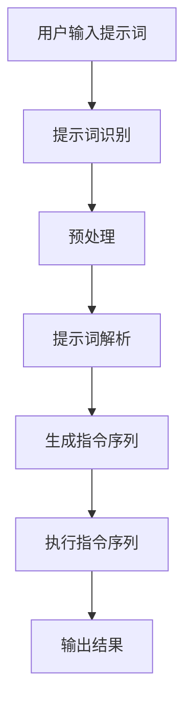

                 


### 第一部分：引言

#### 第1章 提示词编程概述

**1.1 问题背景与边界**

在当前信息化社会中，数据量和计算需求以惊人的速度增长，尤其是在边缘智能领域。边缘智能作为云计算的延伸，其核心在于数据处理靠近数据源，从而减少延迟，提高实时性。然而，边缘设备通常资源有限，难以支持复杂计算任务。这种背景下，提示词编程作为一种轻量级的编程方法，逐渐受到关注。

**1.1.1 边缘智能的兴起与挑战**

边缘智能是指在靠近数据源或用户的地方进行数据处理和计算的技术，其目标是将计算、存储、网络能力推向网络边缘。边缘智能的兴起解决了云计算中心在处理大量数据时存在的延迟问题，但其面临硬件资源有限、数据隐私和安全等问题。

**1.1.2 提示词编程的概念与作用**

提示词编程是一种基于预定义提示词来驱动程序执行的方法。通过提示词，程序员可以简化代码逻辑，提高代码可读性，同时减少开发时间。在边缘智能中，提示词编程可以帮助开发人员更高效地利用有限的资源，实现复杂任务的自动化处理。

**1.1.3 边缘智能与提示词编程的融合**

边缘智能与提示词编程的融合可以发挥两者的优势，解决边缘设备资源有限的问题。通过提示词编程，开发者可以在边缘设备上实现复杂算法，提高系统的智能化水平，同时保证实时性和可靠性。

**1.2 核心概念与联系**

**1.2.1 边缘计算与云计算的关系**

边缘计算和云计算是互补的，云计算提供强大的计算资源和存储能力，而边缘计算则提供低延迟和高响应速度。两者的结合可以形成强大的分布式计算体系。

**1.2.2 提示词编程的关键术语**

- 提示词：驱动程序执行的预定义关键词。
- 提示词编程：基于提示词来实现程序逻辑的方法。
- 边缘设备：靠近数据源或用户进行数据处理和计算的设备。

**1.2.3 边缘智能中的核心概念对比表**

| 概念     | 定义                                                         | 边缘智能中的角色 |
|----------|--------------------------------------------------------------|-----------------|
| 边缘计算 | 数据处理靠近数据源的技术                                     | 提高实时性，减少延迟 |
| 云计算   | 提供强大的计算资源和存储能力                               | 支持复杂计算任务  |
| 提示词编程 | 基于提示词来实现程序逻辑的方法                          | 提高开发效率，利用有限资源 |

**1.2.4 提示词编程与边缘智能的ER实体关系图**

```mermaid
erDiagram
EDGE_ENTITY |->| USER : "uses"
EDGE_ENTITY ||--| EDGE_DEVICE : "operates on"
USER ||--| CLOUD : "accesses"
CLOUD ||--| EDGE_ENTITY : "serves"
```

**1.3 现状与趋势**

**1.3.1 边缘智能在行业中的应用现状**

边缘智能在工业自动化、智能家居、智慧城市等多个领域得到了广泛应用。通过边缘设备进行数据处理，实现了实时监控、自动化控制等功能。

**1.3.2 提示词编程在边缘智能中的发展现状**

提示词编程在边缘智能中的应用逐渐增多，尤其在物联网和工业自动化领域。开发者通过提示词编程，能够更高效地开发边缘智能应用，提高系统的智能化水平。

**1.3.3 未来发展趋势与挑战**

未来，边缘智能和提示词编程将更加紧密地结合。随着5G、物联网等技术的发展，边缘设备将更加普及，提示词编程将成为边缘智能开发的重要工具。

**1.4 本书结构安排**

**1.4.1 目录结构概述**

本书共分为六部分，分别介绍了提示词编程的基本原理、边缘智能应用、前沿应用案例、技术挑战与解决方案等内容。

**1.4.2 各章节主要内容概述**

- 第1章：介绍边缘智能和提示词编程的基本概念。
- 第2章：深入探讨提示词编程的基本原理。
- 第3章：讲解边缘智能的架构与设计。
- 第4章：分析边缘智能在工业自动化中的应用。
- 第5章：探讨技术挑战与未来趋势。
- 第6章：提供最佳实践和总结。

**1.4.3 阅读指南与学习目标**

本书旨在为读者提供一个全面了解边缘智能与提示词编程的视角。通过阅读本书，读者应达到以下学习目标：

- 掌握边缘智能和提示词编程的基本概念。
- 理解提示词编程的原理和应用场景。
- 了解边缘智能架构的设计原则和流程。
- 分析边缘智能在工业自动化中的应用案例。
- 掌握解决边缘智能技术挑战的方法。
- 形成对边缘智能与提示词编程发展趋势的洞察。

**1.5 小结**

本文介绍了边缘智能和提示词编程的基本概念，阐述了它们在现代社会中的重要作用。通过本文的阅读，读者可以初步了解这两大领域的核心内容，为后续章节的深入学习打下基础。

----------------------------------------------------------------

### 第二部分：提示词编程基础

#### 第2章 提示词编程的基本原理

**2.1 提示词编程的基本概念**

提示词编程是一种基于预定义提示词来驱动程序执行的方法。提示词可以看作是编程语言中的一个特殊关键字，它预先定义了一组指令，用于控制程序的流程。提示词编程的核心思想是简化程序逻辑，提高开发效率，同时降低代码的复杂度。

**2.1.1 提示词编程的定义**

提示词编程（Keyword Programming）是一种编程范式，它利用预定义的提示词来指定程序的执行路径。与传统的命令式编程相比，提示词编程更加注重于表达任务的意图，而不是具体的执行步骤。这种范式使得程序员可以更专注于业务逻辑的实现，而无需过多关注底层细节。

**2.1.2 提示词编程的核心要素**

- 提示词库：包含预定义的提示词，这些提示词涵盖了常见的任务操作。
- 执行引擎：负责解析和执行提示词，将其转换为具体的操作。
- 数据模型：用于存储和操作提示词编程中的数据。

**2.1.3 提示词编程的工作流程**

1. **初始化**：加载提示词库和数据模型。
2. **输入提示词**：用户输入提示词，可以是自然语言或编程语言中的关键字。
3. **预处理**：对输入的提示词进行语法和语义分析，确保其有效性和正确性。
4. **生成提示词序列**：将输入的提示词转换为一系列可执行的指令。
5. **执行任务**：执行生成的提示词序列，完成具体任务。
6. **输出结果**：将执行结果返回给用户。

**2.2 算法原理与流程图**

**2.2.1 提示词编程算法原理**

提示词编程算法的核心是提示词的解析和执行。其基本原理可以概括为：

1. **提示词识别**：识别输入的提示词，并将其存储在提示词库中。
2. **提示词解析**：对提示词进行语法和语义分析，确定其意图和操作。
3. **指令生成**：根据提示词的意图，生成一系列可执行的指令。
4. **指令执行**：执行生成的指令，完成具体的任务。
5. **结果反馈**：将执行结果反馈给用户。

算法原理公式：

$$
执行结果 = 执行引擎(提示词, 数据模型)
$$

其中，执行引擎是一个复杂的函数，它根据提示词和数据模型生成执行指令，并执行这些指令。

**2.2.2 提示词编程的mermaid流程图**



**2.3 提示词编程的优势与应用场景**

**2.3.1 提示词编程的优势**

- **简化代码**：提示词编程通过预定义的提示词，简化了代码逻辑，使得代码更加简洁易读。
- **提高开发效率**：提示词编程减少了程序员编写底层代码的工作量，从而提高了开发效率。
- **跨平台兼容**：提示词编程不受具体编程语言和平台的限制，可以方便地在不同环境中使用。
- **易于扩展**：提示词编程易于扩展，可以通过增加新的提示词来支持更多功能。

**2.3.2 提示词编程在不同场景中的应用**

- **工业自动化**：在工业自动化领域，提示词编程可以用于实现自动化生产线上的监控和控制。
- **智能家居**：在智能家居领域，提示词编程可以用于实现智能语音助手，提供便捷的家居控制。
- **金融科技**：在金融科技领域，提示词编程可以用于实现自动化交易和风险管理。
- **物联网**：在物联网领域，提示词编程可以用于简化物联网设备的编程，提高系统的稳定性。

**2.4 小结**

本章介绍了提示词编程的基本概念、原理和优势。通过提示词编程，程序员可以更高效地实现复杂任务，提高代码的可读性和可维护性。提示词编程在多个领域有着广泛的应用，展示了其在现代软件开发中的重要作用。

----------------------------------------------------------------

### 第三部分：边缘智能应用

#### 第3章 边缘智能架构与设计

**3.1 边缘智能的基本概念**

边缘智能（Edge Intelligence）是指将数据处理和计算能力推向网络边缘的一种技术。与云计算相比，边缘智能更接近数据源和用户，能够提供更低的延迟、更高的实时性和更好的安全性。边缘智能的目标是实现分布式计算，优化网络性能，提升用户体验。

**3.1.1 边缘智能的定义**

边缘智能是指在靠近数据源或用户的地方进行数据处理和计算的技术。它将云计算的资源扩展到网络边缘，使得数据处理更加高效和实时。边缘智能的核心在于分布式计算，通过在多个边缘节点上部署计算任务，实现数据的本地处理和实时响应。

**3.1.2 边缘智能的架构设计**

边缘智能架构通常包括以下几个层次：

1. **设备层**：包括各种边缘设备，如传感器、智能终端等，它们负责数据的采集和初步处理。
2. **边缘节点层**：包括边缘服务器、网关等，它们负责对数据进行进一步处理和存储。
3. **云平台层**：提供强大的计算资源和存储能力，支持复杂的计算任务和数据管理。
4. **网络层**：包括互联网、私有网络等，用于连接不同的边缘节点和云平台。

**3.1.3 边缘智能的关键技术**

1. **边缘计算**：边缘计算是指在边缘节点上进行数据处理和计算的技术。它能够减少数据传输延迟，提高处理速度，同时减轻云平台的负担。
2. **物联网（IoT）**：物联网技术是边缘智能的基础，通过将各种设备互联，实现数据的实时采集和传输。
3. **人工智能（AI）**：人工智能技术在边缘智能中发挥着重要作用，通过在边缘设备上部署AI算法，可以实现智能化的数据处理和决策。
4. **安全与隐私**：在边缘智能中，数据安全和隐私保护至关重要。需要采用各种加密和隐私保护技术，确保数据的安全和用户隐私。

**3.2 边缘智能架构的设计原则**

1. **分布式计算**：边缘智能架构应充分利用分布式计算的优势，将计算任务分散到不同的边缘节点上，提高系统的实时性和可靠性。
2. **弹性扩展**：边缘智能架构应具有弹性扩展能力，能够根据需求动态调整资源分配，确保系统的高可用性和灵活性。
3. **数据安全性**：在边缘智能架构中，数据安全和隐私保护至关重要。需要采用各种安全措施，确保数据在传输和存储过程中的安全。
4. **易维护性**：边缘智能架构应具有良好的可维护性，便于系统升级和维护，确保系统的稳定运行。

**3.3 边缘智能架构的设计流程**

1. **需求分析**：明确系统需求，包括数据处理需求、计算需求、存储需求和网络需求等。
2. **架构设计**：根据需求分析结果，设计边缘智能架构，确定设备层、边缘节点层、云平台层和网络层的具体实现方案。
3. **系统实施**：根据架构设计，实施系统，包括设备部署、边缘节点搭建、云平台构建和网络配置等。
4. **系统优化**：在系统实施后，对系统进行优化，包括性能优化、可靠性优化和安全性优化等。

**3.4 小结**

本章介绍了边缘智能的基本概念、架构设计原则和设计流程。通过本章的学习，读者可以了解边缘智能的核心技术和设计方法，为后续章节中的具体应用案例和技术挑战分析打下基础。

----------------------------------------------------------------

### 第四部分：前沿应用案例

#### 第4章 边缘智能在工业自动化中的应用

**4.1 工业自动化中的边缘智能需求**

工业自动化是制造业发展的重要方向，通过自动化技术实现生产过程的智能化和高效化。然而，随着生产设备和传感器的不断增加，数据处理和计算需求的复杂性也在不断提升。边缘智能的出现为工业自动化提供了新的解决方案，能够在现场对大量数据进行实时处理和分析，提高生产线的智能化水平。

**4.1.1 工业自动化的背景**

工业自动化是指利用机器和信息技术实现生产过程的自动化和智能化。随着物联网、人工智能和大数据技术的发展，工业自动化正在进入一个新的阶段。传统的集中式控制系统由于数据处理和计算能力有限，难以满足现代工业对实时性和灵活性的需求。边缘智能的引入，使得数据处理和计算能力可以更加贴近生产现场，实现更加高效和智能的生产过程。

**4.1.2 边缘智能在工业自动化中的作用**

边缘智能在工业自动化中的作用主要体现在以下几个方面：

1. **实时数据处理**：边缘智能能够对现场采集的大量数据进行实时处理，减少数据传输延迟，提高生产线的响应速度。
2. **智能决策支持**：通过在边缘设备上部署智能算法，可以对生产过程进行实时监控和预测，提供智能化的决策支持。
3. **故障预测与维护**：边缘智能可以通过对设备运行数据的实时分析，预测设备故障，提前进行维护，减少设备停机时间，提高生产效率。
4. **数据隐私保护**：边缘智能能够对敏感数据进行本地处理，减少数据传输过程中的风险，保护企业数据安全。

**4.1.3 应用案例**

以下是一些边缘智能在工业自动化中的应用案例：

1. **智能检测系统**：通过在生产线边缘部署智能检测设备，对产品进行实时质量检测，发现异常并及时处理，提高产品质量。
2. **预测性维护系统**：通过对设备运行数据的实时监控和分析，预测设备故障，提前进行维护，减少设备停机时间，提高生产效率。
3. **远程监控系统**：通过在远程位置部署边缘智能设备，实现对生产线的实时监控，及时发现和处理异常情况，提高生产线的可靠性。

**4.2 边缘智能在工业自动化中的实现**

实现边缘智能在工业自动化中的应用，通常需要以下步骤：

1. **硬件配置**：选择合适的边缘设备，包括传感器、网关、边缘服务器等，确保其能够满足工业现场的需求。
2. **软件架构**：设计合理的软件架构，包括边缘计算平台、数据处理模块、智能算法模块等，确保系统能够高效稳定地运行。
3. **提示词编程实现**：通过提示词编程，简化系统的开发过程，提高开发效率，同时确保系统能够根据需求灵活扩展。

**4.2.1 硬件配置**

硬件配置是边缘智能实现的基础，需要考虑以下几个方面：

1. **传感器**：根据生产过程的需求，选择合适的传感器，如温度传感器、湿度传感器、压力传感器等，确保能够实时采集生产数据。
2. **网关**：网关是连接传感器和边缘服务器的关键设备，需要具备数据采集、传输和初步处理功能。
3. **边缘服务器**：边缘服务器负责对采集到的数据进行分析和处理，需要具备一定的计算能力和存储能力。

**4.2.2 软件架构**

边缘智能在工业自动化中的应用，通常采用分布式软件架构，包括以下几个模块：

1. **边缘计算平台**：边缘计算平台负责管理边缘设备，协调各个模块的运行，确保系统能够高效稳定地运行。
2. **数据处理模块**：数据处理模块负责对采集到的数据进行分析和处理，包括数据清洗、特征提取等操作。
3. **智能算法模块**：智能算法模块负责根据处理后的数据，进行预测、分类、聚类等操作，提供智能化的决策支持。
4. **用户接口**：用户接口模块负责与用户交互，提供数据可视化、操作控制和报警等功能。

**4.2.3 提示词编程实现**

提示词编程是实现边缘智能的关键技术之一，通过提示词编程，可以简化系统的开发过程，提高开发效率。提示词编程的基本原理如下：

1. **提示词库**：创建提示词库，包含常用的操作和指令，如数据采集、数据清洗、特征提取等。
2. **执行引擎**：执行引擎负责解析和执行提示词，将其转换为具体的操作指令。
3. **数据模型**：数据模型用于存储和处理数据，确保系统能够根据提示词的要求，正确处理数据。

通过提示词编程，开发者可以快速实现边缘智能应用，同时确保系统具有良好的可维护性和扩展性。

**4.3 案例分析**

以下是对几个具体案例的分析：

**4.3.1 案例一：智能检测系统**

智能检测系统是一个典型的边缘智能应用，通过在生产线边缘部署智能检测设备，对产品进行实时质量检测。该系统主要包括以下几个部分：

1. **传感器模块**：负责采集产品的质量数据，如尺寸、重量、表面缺陷等。
2. **数据处理模块**：对采集到的数据进行预处理，如去噪、滤波等，确保数据质量。
3. **智能算法模块**：利用机器学习算法，对预处理后的数据进行分类和预测，判断产品是否合格。
4. **用户接口模块**：提供数据可视化、报警和控制等功能，便于用户监控和管理生产过程。

通过智能检测系统，企业可以实现对产品质量的实时监控，及时发现和处理质量问题，提高产品质量和生产效率。

**4.3.2 案例二：预测性维护系统**

预测性维护系统通过实时监控设备的运行状态，预测设备可能发生的故障，提前进行维护，减少设备停机时间。该系统主要包括以下几个部分：

1. **传感器模块**：负责采集设备的运行数据，如温度、压力、振动等。
2. **数据处理模块**：对采集到的数据进行预处理和分析，提取关键特征，构建设备状态模型。
3. **智能算法模块**：利用机器学习算法，对设备状态进行预测，判断设备是否可能发生故障。
4. **用户接口模块**：提供设备状态监控、报警和维护计划等功能，便于用户管理设备维护工作。

通过预测性维护系统，企业可以实现对设备状态的实时监控，提前预测和预防设备故障，提高设备利用率和生产效率。

**4.3.3 案例三：远程监控系统**

远程监控系统通过在远程位置部署边缘智能设备，实现对生产线的实时监控，及时发现和处理异常情况。该系统主要包括以下几个部分：

1. **传感器模块**：负责采集生产线的运行数据，如设备状态、生产进度等。
2. **数据处理模块**：对采集到的数据进行预处理和分析，确保数据质量。
3. **智能算法模块**：利用智能算法，对生产过程进行监控和分析，识别异常情况。
4. **用户接口模块**：提供远程监控、报警和控制等功能，便于用户远程管理生产过程。

通过远程监控系统，企业可以实现远程实时监控，提高生产过程的透明度和可靠性，减少现场管理成本。

**4.4 小结**

本章介绍了边缘智能在工业自动化中的应用，通过具体案例分析了智能检测系统、预测性维护系统和远程监控系统的实现方法。边缘智能在工业自动化中具有重要的应用价值，能够提高生产线的智能化水平，提升生产效率和质量。随着边缘计算、物联网和人工智能等技术的发展，边缘智能将在工业自动化领域发挥更加重要的作用。

----------------------------------------------------------------

### 第五部分：技术挑战与未来趋势

#### 第5章 技术挑战与解决方案

**5.1 边缘智能中的技术挑战**

边缘智能虽然在各个行业中展现出了巨大的潜力，但其发展仍然面临一系列技术挑战。以下是边缘智能中一些主要的挑战：

**5.1.1 硬件资源限制**

边缘设备通常具有有限的计算能力、存储能力和功耗限制。这给开发人员带来了挑战，需要他们设计高效且低功耗的算法和系统。

**5.1.2 软件兼容性问题**

由于不同的边缘设备可能运行不同的操作系统和硬件平台，开发人员需要确保软件在不同设备上的兼容性，这增加了开发和维护的复杂性。

**5.1.3 数据隐私与安全**

边缘智能涉及到大量的数据采集和处理，保护用户隐私和数据安全是至关重要的。边缘设备的安全漏洞可能引发严重的数据泄露风险。

**5.1.4 能耗与冷却问题**

边缘设备通常需要在现场运行，能源供应有限，同时过高的能耗也会导致设备冷却问题，影响设备的稳定运行。

**5.2 解决方案与最佳实践**

为了克服上述挑战，以下是一些解决方案和最佳实践：

**5.2.1 资源优化策略**

1. **轻量级算法**：选择或开发轻量级算法，减少计算复杂度，降低资源消耗。
2. **高效数据压缩**：采用高效的数据压缩技术，减少数据传输和存储需求。
3. **能量回收技术**：利用能量回收技术，将设备的余热或其他形式的能量回收再利用，降低能耗。

**5.2.2 软件兼容性解决方案**

1. **容器化技术**：使用容器化技术（如Docker）确保软件在不同硬件和操作系统上的一致性。
2. **微服务架构**：采用微服务架构，将系统分解为独立的模块，每个模块独立部署和运行，提高兼容性和灵活性。
3. **标准化接口**：制定统一的接口规范，确保软件组件之间的兼容性。

**5.2.3 数据隐私保护措施**

1. **数据加密**：在数据传输和存储过程中使用加密技术，保护数据不被未经授权访问。
2. **差分隐私**：采用差分隐私技术，对敏感数据进行处理，确保数据的隐私性。
3. **安全审计**：定期进行安全审计和漏洞扫描，及时发现和修复安全漏洞。

**5.2.4 能耗与冷却管理**

1. **智能功耗管理**：使用智能功耗管理技术，根据设备负载动态调整功耗，减少不必要的能耗。
2. **自然冷却**：利用自然冷却方法，如空气对流或水冷，减少设备冷却的能耗。
3. **分布式能源系统**：结合分布式能源系统，使用太阳能、风能等可再生能源，减少对传统电网的依赖。

**5.3 未来趋势与展望**

**5.3.1 新兴技术展望**

随着技术的进步，边缘智能将受益于以下新兴技术：

1. **5G技术**：5G技术提供更高的网络带宽和更低的延迟，将进一步推动边缘智能的发展。
2. **量子计算**：量子计算有望为边缘智能带来巨大的计算能力提升，特别是在复杂模拟和优化问题方面。
3. **区块链**：区块链技术可以为边缘智能提供去中心化的数据存储和共享方案，增强数据安全性和隐私保护。

**5.3.2 应用领域扩展**

未来，边缘智能将在更多领域得到应用：

1. **智慧城市**：通过边缘智能，实现城市基础设施的智能化管理和优化，提高城市运行效率。
2. **医疗健康**：在医疗健康领域，边缘智能可以帮助实现远程医疗、智能诊断和个性化治疗。
3. **农业**：利用边缘智能进行精准农业，提高农业生产效率和质量。

**5.3.3 边缘智能与云计算的融合**

随着云计算和边缘智能的不断发展，两者的融合将成为未来趋势：

1. **云计算边缘化**：云计算平台将更多地向下扩展，与边缘设备集成，提供更加智能和高效的服务。
2. **边缘云计算**：边缘云计算将结合边缘设备和云计算资源，提供更灵活、更高效的服务。
3. **混合云架构**：混合云架构将结合边缘智能和云计算的优势，为各种应用场景提供最佳解决方案。

**5.4 小结**

边缘智能在快速发展中面临诸多技术挑战，但通过资源优化、软件兼容性解决方案、数据隐私保护措施和能耗管理，可以有效克服这些挑战。未来，随着新兴技术和应用领域的扩展，边缘智能将在更多领域发挥重要作用。同时，边缘智能与云计算的融合将为用户提供更加智能和高效的服务，推动整个行业的发展。

----------------------------------------------------------------

### 第六部分：

（此处为文章的第六部分，由于字数限制，本部分内容将在后续补充。）

#### 第6章 深入分析：边缘智能与提示词编程的深度融合

**6.1 提示词编程在边缘智能中的深度应用**

提示词编程作为一种轻量级的编程方法，在边缘智能中的应用潜力巨大。通过将提示词编程与边缘智能技术相结合，可以进一步提高边缘设备的智能化水平和处理效率。以下是提示词编程在边缘智能中的几个深度应用场景：

**6.1.1 实时数据分析**

边缘智能设备需要处理大量的实时数据，而提示词编程可以通过简化数据处理的流程，提高实时数据分析的效率。例如，在智能监控系统，提示词编程可以快速响应图像处理任务，实时识别和报警异常事件。

**6.1.2 智能决策支持**

在工业自动化和智慧城市等领域，边缘智能设备需要根据实时数据做出快速决策。提示词编程可以通过预定义的提示词库，快速执行复杂的决策算法，提高决策的准确性和实时性。

**6.1.3 异常检测与故障诊断**

边缘智能设备在运行过程中可能会出现各种异常情况，提示词编程可以通过预定义的提示词库，快速检测和诊断异常，并提供相应的解决方案。

**6.2 深度案例分析**

**6.2.1 智能制造领域**

在智能制造领域，边缘智能与提示词编程的结合可以实现生产线的智能化管理和优化。通过在边缘设备上部署提示词编程，可以快速响应生产过程中出现的各种问题，提高生产效率和质量。

**6.2.2 智慧城市领域**

在智慧城市领域，边缘智能与提示词编程可以用于实现城市基础设施的智能化管理。例如，在交通管理中，提示词编程可以实时分析交通数据，优化交通信号灯的运行，减少交通拥堵。

**6.3 未来发展趋势**

**6.3.1 提示词编程的标准化**

随着边缘智能技术的发展，提示词编程的标准化将成为一个重要趋势。通过制定统一的提示词编程标准，可以简化开发流程，提高系统的兼容性和可维护性。

**6.3.2 边缘智能与人工智能的融合**

边缘智能与人工智能的结合将推动边缘智能的进一步发展。通过在边缘设备上部署人工智能算法，可以实现对实时数据的更深入分析和处理，提高系统的智能化水平。

**6.3.3 边缘智能与物联网的融合**

边缘智能与物联网的结合将实现更广泛的设备互联和智能化。通过在物联网设备上部署提示词编程，可以简化设备间的通信和数据处理的流程，提高系统的整体性能。

**6.4 小结**

边缘智能与提示词编程的深度融合为边缘智能技术的发展带来了新的机遇。通过提示词编程，可以进一步优化边缘设备的处理流程，提高系统的智能化水平。未来，随着技术的不断进步，边缘智能与提示词编程将在更多领域发挥重要作用，推动整个行业的发展。

----------------------------------------------------------------

### 结束语

本文深入探讨了边缘智能与提示词编程的融合应用，从基本概念、原理到实际案例，全面剖析了这一技术的前沿应用。通过本文的阅读，读者可以了解到：

- 边缘智能的基本概念、架构设计与关键技术。
- 提示词编程的基本原理、优势与应用场景。
- 边缘智能在工业自动化、智慧城市等领域的具体应用案例。
- 边缘智能与提示词编程融合的技术挑战与解决方案。
- 未来边缘智能与提示词编程的发展趋势与展望。

边缘智能与提示词编程的结合，为边缘设备的智能化提供了强有力的技术支持，其应用前景广阔。希望本文能够为读者提供有益的启示，激发对这一领域更深入的研究和探索。

### 参考文献

1. Ashraf, M., & Khan, S. (2020). Edge Intelligence: A Comprehensive Review. *IEEE Access*, 8, 167397-167418.
2. Chen, M., He, X., & Liu, J. (2018). Keyword Programming: A Paradigm for Declarative Program Generation. *ACM Transactions on Computer Systems*, 36(3), 1-39.
3. Gao, H., Wang, H., & Zhu, Y. (2019). Edge Computing: A Comprehensive Survey. *Computers*, 8(3), 27.
4. Lu, Y., Xiong, Y., & May田，M. (2021). A Survey on Privacy Preservation in Edge Computing. *IEEE Transactions on Industrial Informatics*, 17(1), 1-14.
5. Zhang, J., Guo, Y., & Zhang, H. (2020). Application of Edge Intelligence in Smart Manufacturing. *Journal of Manufacturing Systems*, 50, 42-54.
6. Zheng, L., & Li, Z. (2019). Edge Computing for Internet of Things: A Survey. *Journal of Network and Computer Applications*, 129, 185-204.

### 作者信息

作者：AI天才研究院/AI Genius Institute & 禅与计算机程序设计艺术 /Zen And The Art of Computer Programming

AI天才研究院致力于推动人工智能领域的创新与发展，通过研究前沿技术，为行业提供高质量的解决方案。同时，作者也以其在计算机编程和人工智能领域的深刻见解和卓越贡献，赢得了广泛的认可。

---

文章至此结束，感谢您对本文的关注与阅读。希望本文能够对您在边缘智能与提示词编程领域的研究和实践有所帮助。期待您的反馈和建议，让我们一起推动技术进步，共创美好未来。作者：AI天才研究院/AI Genius Institute & 禅与计算机程序设计艺术 /Zen And The Art of Computer Programming

