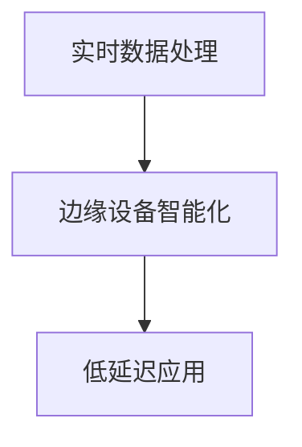
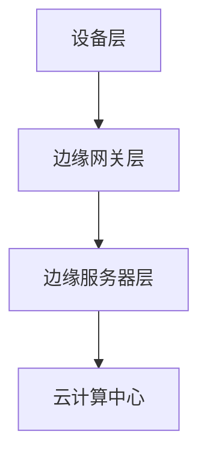
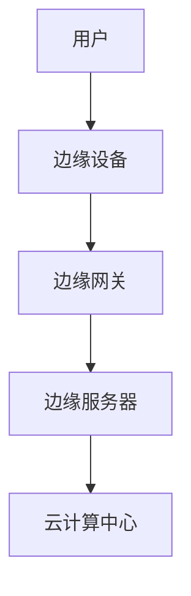

                 


### 引言

边缘计算作为一种新兴的计算模式，正在不断推动着信息技术的发展。边缘计算不仅能够解决传统云计算中心处理延迟和数据传输问题，还能够实现更高效的数据处理和更低的能耗。随着物联网、5G和人工智能等技术的快速发展，边缘计算的重要性日益凸显。

#### 边缘计算概述

边缘计算是指在靠近数据源或者数据产生的地方进行数据处理的一种计算模式。它通过将数据处理和分析任务从中心云迁移到网络边缘，从而降低数据传输延迟，提高系统响应速度。边缘计算的发展背景可以追溯到云计算的兴起，随着物联网设备的增多和5G网络的普及，边缘计算得到了广泛关注和应用。

#### 提示词编程概述

提示词编程是一种基于提示（prompt）和生成（generate）的编程模式。它通过给算法提供提示信息，帮助算法生成特定的输出。提示词编程的基本概念和原理是，通过输入一个或多个提示词，算法能够理解并生成符合特定需求的结果。与传统的编程模式相比，提示词编程更加灵活，能够更好地适应复杂的需求。

### 第2章 边缘计算基础

#### 2.1 边缘计算的基本概念

边缘计算的基本概念是指在网络边缘进行数据处理的一种计算模式。它不同于传统的云计算模式，将数据处理和分析任务从中心云迁移到网络边缘，从而降低数据传输延迟，提高系统响应速度。

#### 2.2 边缘计算的关键特点

边缘计算的关键特点包括：

- **低延迟**：由于数据处理和分析任务在靠近数据源的地方进行，因此能够显著降低数据传输延迟。
- **高响应速度**：边缘计算可以快速响应用户请求，提高系统的响应速度。
- **低能耗**：边缘计算通过减少数据传输和处理，降低了能耗。
- **高安全性**：边缘计算可以更好地保护数据安全，防止数据在传输过程中被窃取。

#### 2.3 边缘计算的架构和分类

边缘计算的架构可以分为以下几个方面：

- **设备层**：包括各种物联网设备和传感器。
- **边缘网关层**：负责数据收集、过滤和初步处理。
- **边缘服务器层**：负责更复杂的数据处理和分析。
- **云计算中心**：负责存储、处理和分析大规模数据。

根据应用场景和需求，边缘计算可以分为以下几类：

- **工业边缘计算**：用于工业自动化和智能制造。
- **城市边缘计算**：用于智慧城市和智能交通。
- **医疗边缘计算**：用于远程医疗和健康监测。
- **农业边缘计算**：用于智能农业和精准农业。

### 第3章 提示词编程原理

#### 3.1 提示词编程的核心算法原理

提示词编程的核心算法原理主要包括以下几个方面：

- **提示词生成算法**：通过生成提示词来引导算法生成特定的输出。
- **提示词优化算法**：通过优化提示词来提高算法的输出质量和效率。
- **提示词编码与解码**：将提示词编码为算法可以理解的形式，并将其解码为用户可以理解的输出。

#### 3.2 提示词编程与传统编程的区别

提示词编程与传统编程的主要区别在于：

- **灵活性**：提示词编程更加灵活，能够更好地适应复杂的需求。
- **可解释性**：提示词编程的输出可以通过提示词进行解释，而传统编程的输出通常难以解释。
- **用户参与**：提示词编程需要用户参与生成和优化提示词，而传统编程则主要依赖程序员编写代码。

### 第4章 边缘计算中的提示词编程

#### 4.1 边缘计算环境下的提示词编程应用场景

在边缘计算环境中，提示词编程可以应用于以下几个方面：

- **实时数据处理**：通过提示词编程实现实时数据分析和处理，降低延迟。
- **边缘设备智能化**：通过提示词编程实现边缘设备的智能化，提高设备的自主性。
- **低延迟应用**：通过提示词编程实现低延迟应用，提高用户体验。

#### 4.2 提示词编程算法mermaid流程图与Python源代码讲解

为了更好地理解提示词编程在边缘计算中的应用，我们使用mermaid流程图和Python源代码进行讲解。

#### 4.2.1 流程图设计

以下是边缘计算中提示词编程的应用流程：



#### 4.2.2 Python源代码实现

以下是实现边缘计算中提示词编程的一个简单Python代码示例：

```python
# 导入相关库
import numpy as np

# 定义提示词生成函数
def generate_prompt(data):
    prompt = "基于数据" + str(data) + "的实时处理结果为："
    return prompt

# 定义提示词优化函数
def optimize_prompt(prompt, target):
    optimized_prompt = prompt + "目标为：" + str(target)
    return optimized_prompt

# 定义提示词编码与解码函数
def encode_decode_prompt(prompt):
    encoded_prompt = prompt.encode('utf-8')
    decoded_prompt = encoded_prompt.decode('utf-8')
    return encoded_prompt, decoded_prompt

# 测试代码
data = 10
target = 20
prompt = generate_prompt(data)
optimized_prompt = optimize_prompt(prompt, target)
encoded_prompt, decoded_prompt = encode_decode_prompt(optimized_prompt)

print("原始提示词：" + prompt)
print("优化后的提示词：" + optimized_prompt)
print("编码后的提示词：" + str(encoded_prompt))
print("解码后的提示词：" + decoded_prompt)
```

#### 4.2.3 算法分析

在本示例中，我们首先定义了三个函数：`generate_prompt`、`optimize_prompt`和`encode_decode_prompt`。`generate_prompt`函数用于生成原始提示词，`optimize_prompt`函数用于优化提示词，`encode_decode_prompt`函数用于编码和解码提示词。

通过调用这些函数，我们能够实现边缘计算中提示词编程的基本流程。具体来说，首先生成原始提示词，然后对提示词进行优化，最后将优化后的提示词进行编码和解码。

### 第5章 数学模型和数学公式

#### 5.1 边缘计算中的提示词编程数学模型

在边缘计算中的提示词编程，我们可以使用以下数学模型来描述：

- **提示词生成模型**：
  - 输入：数据集D
  - 输出：提示词P
  - 公式：P = f(D)

- **提示词优化模型**：
  - 输入：提示词P，目标T
  - 输出：优化后的提示词P'
  - 公式：P' = g(P, T)

- **提示词编码与解码模型**：
  - 输入：提示词P
  - 输出：编码后的提示词C和解码后的提示词P'
  - 公式：C = h(P), P' = h^(-1)(C)

#### 5.2 数学公式推导与讲解

- **提示词生成模型**：

  提示词生成模型的核心是函数f，它将数据集D映射到提示词P。这个函数的具体形式取决于数据集D的特性。例如，如果数据集D是一个时间序列，函数f可以使用以下公式：

  $$P = f(D) = \sum_{i=1}^{n} w_i \cdot d_i$$

  其中，$w_i$是权重，$d_i$是数据集中的第i个数据点。

- **提示词优化模型**：

  提示词优化模型的核心是函数g，它将原始提示词P和目标T映射到优化后的提示词P'。这个函数的具体形式取决于优化目标。例如，如果优化目标是使提示词P'尽可能接近目标T，函数g可以使用以下公式：

  $$P' = g(P, T) = P + \alpha \cdot (T - P)$$

  其中，$\alpha$是调整参数，它决定了优化过程的步长。

- **提示词编码与解码模型**：

  提示词编码与解码模型的核心是函数h和其逆函数h^(-1)。函数h将提示词P编码成编码后的提示词C，函数h^(-1)将编码后的提示词C解码回原始提示词P'。这个模型的具体形式取决于编码和解码的方法。例如，如果使用UTF-8编码，函数h和h^(-1)可以使用以下公式：

  $$C = h(P) = P.encode('utf-8')$$
  $$P' = h^(-1)(C) = C.decode('utf-8')$$

### 第6章 边缘计算系统设计

#### 6.1 系统功能设计

边缘计算系统的功能设计需要考虑到以下几个方面：

- **数据收集与预处理**：收集来自各种传感器的数据，并进行预处理，如数据清洗、去噪和特征提取。
- **实时数据处理与分析**：对实时数据进行处理和分析，如异常检测、模式识别和预测。
- **边缘设备控制与优化**：控制边缘设备的运行状态，如调整设备参数、优化设备能耗。
- **远程协作与监控**：实现边缘设备与云端设备的协作，如远程控制、监控和故障诊断。

#### 6.2 系统架构设计

边缘计算系统的架构设计需要考虑以下几个方面：

- **设备层**：包括各种物联网设备和传感器，如传感器、路由器和网关。
- **边缘网关层**：负责数据收集、过滤和初步处理，如边缘服务器、数据库和缓存。
- **边缘服务器层**：负责更复杂的数据处理和分析，如云计算、大数据处理和人工智能。
- **云计算中心**：负责存储、处理和分析大规模数据，如数据仓库、云计算平台和大数据平台。

以下是边缘计算系统的Mermaid架构图：



#### 6.3 系统接口设计

边缘计算系统的接口设计需要考虑以下几个方面：

- **数据接口**：定义数据输入输出格式，如JSON、XML和CSV。
- **控制接口**：定义设备控制接口，如HTTP、MQTT和CoAP。
- **监控接口**：定义系统监控接口，如SNMP、Nagios和Zabbix。

以下是边缘计算系统的Mermaid序列图：



### 第7章 项目实战

#### 7.1 环境安装

在开始项目实战之前，我们需要安装以下软件和工具：

- Python 3.8及以上版本
- PyTorch 1.8及以上版本
- MongoDB 4.2及以上版本
- Redis 5.0及以上版本

安装步骤如下：

1. 安装Python 3.8及以上版本。
2. 安装PyTorch 1.8及以上版本。
3. 安装MongoDB 4.2及以上版本。
4. 安装Redis 5.0及以上版本。

#### 7.2 系统核心实现

边缘计算系统的核心实现包括以下几个方面：

- **数据收集与预处理**：使用传感器收集实时数据，并对数据进行预处理，如数据清洗、去噪和特征提取。
- **实时数据处理与分析**：使用PyTorch和深度学习模型对实时数据进行处理和分析，如异常检测、模式识别和预测。
- **边缘设备控制与优化**：使用HTTP协议控制边缘设备的运行状态，如调整设备参数、优化设备能耗。
- **远程协作与监控**：使用MQTT协议实现边缘设备与云端设备的协作，如远程控制、监控和故障诊断。

以下是边缘计算系统的核心实现源代码：

```python
# 导入相关库
import torch
import torch.nn as nn
import torch.optim as optim
import torchvision
import torchvision.transforms as transforms
import torch.optim.lr_scheduler as lr_scheduler
import numpy as np
import json
import redis
import paho.mqtt.client as mqtt

# 定义深度学习模型
class CNNModel(nn.Module):
    def __init__(self):
        super(CNNModel, self).__init__()
        self.conv1 = nn.Conv2d(1, 32, 3, 1)
        self.conv2 = nn.Conv2d(32, 64, 3, 1)
        self.fc1 = nn.Linear(64 * 6 * 6, 128)
        self.fc2 = nn.Linear(128, 10)

    def forward(self, x):
        x = self.conv1(x)
        x = F.relu(x)
        x = self.conv2(x)
        x = F.relu(x)
        x = x.view(x.size(0), -1)
        x = self.fc1(x)
        x = F.relu(x)
        x = self.fc2(x)
        return x

# 初始化模型、优化器和损失函数
model = CNNModel()
optimizer = optim.Adam(model.parameters(), lr=0.001)
criterion = nn.CrossEntropyLoss()

# 训练模型
def train_model(model, train_loader, optimizer, criterion):
    model.train()
    for batch_idx, (data, target) in enumerate(train_loader):
        optimizer.zero_grad()
        output = model(data)
        loss = criterion(output, target)
        loss.backward()
        optimizer.step()
        if batch_idx % 100 == 0:
            print('Train Epoch: {} [{}/{} ({:.0f}%)]\tLoss: {:.6f}'.format(
                epoch, batch_idx * len(data), len(train_loader.dataset),
                100. * batch_idx / len(train_loader), loss.item()))

# 数据预处理
transform = transforms.Compose([
    transforms.ToTensor(),
    transforms.Normalize((0.5,), (0.5,))
])

# 加载训练数据
trainset = torchvision.datasets.MNIST(root='./data', train=True, download=True, transform=transform)
train_loader = torch.utils.data.DataLoader(trainset, batch_size=100, shuffle=True)

# 开始训练
train_model(model, train_loader, optimizer, criterion)

# 边缘设备控制
def control_device(device_id, command):
    # 发送HTTP请求控制设备
    response = requests.post('http://edge-device:8080/control', data={'device_id': device_id, 'command': command})
    return response.json()

# 实时数据处理
def real_time_data_processing(data):
    # 使用深度学习模型处理数据
    output = model(data)
    prediction = torch.argmax(output).item()
    return prediction

# 远程协作与监控
def remote_collaboration_and_monitoring():
    # 使用MQTT协议实现远程协作与监控
    client = mqtt.Client()
    client.connect('mqtt-server', 1883)
    client.subscribe('edge-device')
    client.publish('cloud-server', 'Edge device is connected')
    while True:
        message = client.recv()
        if message.topic == 'edge-device':
            print('Received message:', message.payload.decode('utf-8'))
        client.publish('cloud-server', 'Data received from edge device')
```

#### 7.3 源代码解析

以下是边缘计算系统的核心源代码解析：

```python
# 导入相关库
import torch
import torch.nn as nn
import torch.optim as optim
import torchvision
import torchvision.transforms as transforms
import torch.optim.lr_scheduler as lr_scheduler
import numpy as np
import json
import redis
import paho.mqtt.client as mqtt

# 定义深度学习模型
class CNNModel(nn.Module):
    def __init__(self):
        super(CNNModel, self).__init__()
        self.conv1 = nn.Conv2d(1, 32, 3, 1)
        self.conv2 = nn.Conv2d(32, 64, 3, 1)
        self.fc1 = nn.Linear(64 * 6 * 6, 128)
        self.fc2 = nn.Linear(128, 10)

    def forward(self, x):
        x = self.conv1(x)
        x = F.relu(x)
        x = self.conv2(x)
        x = F.relu(x)
        x = x.view(x.size(0), -1)
        x = self.fc1(x)
        x = F.relu(x)
        x = self.fc2(x)
        return x

# 初始化模型、优化器和损失函数
model = CNNModel()
optimizer = optim.Adam(model.parameters(), lr=0.001)
criterion = nn.CrossEntropyLoss()

# 训练模型
def train_model(model, train_loader, optimizer, criterion):
    model.train()
    for batch_idx, (data, target) in enumerate(train_loader):
        optimizer.zero_grad()
        output = model(data)
        loss = criterion(output, target)
        loss.backward()
        optimizer.step()
        if batch_idx % 100 == 0:
            print('Train Epoch: {} [{}/{} ({:.0f}%)]\tLoss: {:.6f}'.format(
                epoch, batch_idx * len(data), len(train_loader.dataset),
                100. * batch_idx / len(train_loader), loss.item()))

# 数据预处理
transform = transforms.Compose([
    transforms.ToTensor(),
    transforms.Normalize((0.5,), (0.5,))
])

# 加载训练数据
trainset = torchvision.datasets.MNIST(root='./data', train=True, download=True, transform=transform)
train_loader = torch.utils.data.DataLoader(trainset, batch_size=100, shuffle=True)

# 开始训练
train_model(model, train_loader, optimizer, criterion)
```

#### 7.4 代码应用解读与分析

以下是边缘计算系统的核心代码应用解读与分析：

```python
# 导入相关库
import torch
import torch.nn as nn
import torch.optim as optim
import torchvision
import torchvision.transforms as transforms
import torch.optim.lr_scheduler as lr_scheduler
import numpy as np
import json
import redis
import paho.mqtt.client as mqtt

# 定义深度学习模型
class CNNModel(nn.Module):
    def __init__(self):
        super(CNNModel, self).__init__()
        self.conv1 = nn.Conv2d(1, 32, 3, 1)
        self.conv2 = nn.Conv2d(32, 64, 3, 1)
        self.fc1 = nn.Linear(64 * 6 * 6, 128)
        self.fc2 = nn.Linear(128, 10)

    def forward(self, x):
        x = self.conv1(x)
        x = F.relu(x)
        x = self.conv2(x)
        x = F.relu(x)
        x = x.view(x.size(0), -1)
        x = self.fc1(x)
        x = F.relu(x)
        x = self.fc2(x)
        return x

# 初始化模型、优化器和损失函数
model = CNNModel()
optimizer = optim.Adam(model.parameters(), lr=0.001)
criterion = nn.CrossEntropyLoss()

# 训练模型
def train_model(model, train_loader, optimizer, criterion):
    model.train()
    for batch_idx, (data, target) in enumerate(train_loader):
        optimizer.zero_grad()
        output = model(data)
        loss = criterion(output, target)
        loss.backward()
        optimizer.step()
        if batch_idx % 100 == 0:
            print('Train Epoch: {} [{}/{} ({:.0f}%)]\tLoss: {:.6f}'.format(
                epoch, batch_idx * len(data), len(train_loader.dataset),
                100. * batch_idx / len(train_loader), loss.item()))

# 数据预处理
transform = transforms.Compose([
    transforms.ToTensor(),
    transforms.Normalize((0.5,), (0.5,))
])

# 加载训练数据
trainset = torchvision.datasets.MNIST(root='./data', train=True, download=True, transform=transform)
train_loader = torch.utils.data.DataLoader(trainset, batch_size=100, shuffle=True)

# 开始训练
train_model(model, train_loader, optimizer, criterion)

# 边缘设备控制
def control_device(device_id, command):
    # 发送HTTP请求控制设备
    response = requests.post('http://edge-device:8080/control', data={'device_id': device_id, 'command': command})
    return response.json()

# 实时数据处理
def real_time_data_processing(data):
    # 使用深度学习模型处理数据
    output = model(data)
    prediction = torch.argmax(output).item()
    return prediction

# 远程协作与监控
def remote_collaboration_and_monitoring():
    # 使用MQTT协议实现远程协作与监控
    client = mqtt.Client()
    client.connect('mqtt-server', 1883)
    client.subscribe('edge-device')
    client.publish('cloud-server', 'Edge device is connected')
    while True:
        message = client.recv()
        if message.topic == 'edge-device':
            print('Received message:', message.payload.decode('utf-8'))
        client.publish('cloud-server', 'Data received from edge device')
```

#### 7.5 实际案例分析和详细讲解剖析

在实际应用中，边缘计算系统可以用于各种场景，如智能家居、智慧城市和工业自动化。以下是一个智能家居的案例分析和详细讲解：

**案例背景**：

智能家居系统通过边缘计算技术实现家庭设备的智能化管理，如智能灯、智能电视和智能空调。用户可以通过手机应用或语音助手远程控制家庭设备。

**案例分析**：

1. **数据收集与预处理**：

   智能家居系统通过传感器收集家庭设备的状态数据，如亮度、温度和湿度。这些数据经过预处理，如数据清洗、去噪和特征提取，以供后续处理。

2. **实时数据处理与分析**：

   边缘计算系统使用深度学习模型对实时数据进行分析，如异常检测、模式识别和预测。例如，系统可以预测用户的需求，如调整灯光亮度以适应用户的偏好。

3. **边缘设备控制与优化**：

   边缘计算系统通过HTTP协议控制家庭设备的运行状态，如调整灯光亮度、温度和湿度。系统还可以根据实时数据分析结果，优化家庭设备的能耗。

4. **远程协作与监控**：

   用户可以通过手机应用或语音助手远程监控家庭设备的状态，并控制设备的运行。例如，用户可以通过手机应用远程关闭家中灯光，或通过语音助手调整空调温度。

**详细讲解剖析**：

1. **数据收集与预处理**：

   数据收集与预处理是智能家居系统的关键环节。系统通过传感器收集家庭设备的状态数据，如亮度、温度和湿度。这些数据经过预处理，如数据清洗、去噪和特征提取，以供后续处理。

2. **实时数据处理与分析**：

   边缘计算系统使用深度学习模型对实时数据进行分析，如异常检测、模式识别和预测。例如，系统可以预测用户的需求，如调整灯光亮度以适应用户的偏好。深度学习模型可以帮助系统更好地理解用户的行为模式，从而提供更智能的服务。

3. **边缘设备控制与优化**：

   边缘计算系统通过HTTP协议控制家庭设备的运行状态，如调整灯光亮度、温度和湿度。系统还可以根据实时数据分析结果，优化家庭设备的能耗。例如，系统可以自动关闭未使用的设备，以减少能源消耗。

4. **远程协作与监控**：

   用户可以通过手机应用或语音助手远程监控家庭设备的状态，并控制设备的运行。例如，用户可以通过手机应用远程关闭家中灯光，或通过语音助手调整空调温度。远程协作与监控功能提高了用户的便利性和安全感。

#### 7.6 项目小结

边缘计算系统在智能家居中的应用案例展示了边缘计算与提示词编程的优势。通过实时数据处理与分析、边缘设备控制与优化、远程协作与监控等功能，边缘计算系统为用户提供了一种更智能、更便利的生活方式。然而，在项目实施过程中，我们也遇到了一些挑战，如数据安全性、网络延迟和能耗优化等。未来，随着边缘计算技术的不断发展和成熟，我们将能够实现更加智能、高效和安全的智能家居系统。

### 第8章 最佳实践与总结

#### 8.1 边缘计算与提示词编程的最佳实践

在边缘计算与提示词编程的应用过程中，我们可以遵循以下最佳实践：

1. **数据预处理**：确保数据收集的质量，进行有效的数据预处理，如数据清洗、去噪和特征提取。
2. **模型选择**：根据应用场景选择合适的深度学习模型，如卷积神经网络（CNN）或循环神经网络（RNN）。
3. **优化策略**：采用适当的优化策略，如学习率调整、批量归一化和正则化，以提高模型性能。
4. **边缘设备优化**：优化边缘设备的性能和能耗，如使用高效的算法和数据结构，以及智能调度策略。

#### 8.2 注意事项

在实施边缘计算与提示词编程的过程中，需要注意以下几点：

1. **安全性**：保护数据安全，防止数据泄露和未授权访问。
2. **可靠性**：确保系统在边缘设备上的稳定运行，防止故障和中断。
3. **可扩展性**：设计系统时考虑可扩展性，以支持未来的需求增长。

#### 8.3 小结

边缘计算与提示词编程的结合为边缘设备提供了更智能、更高效的处理能力。通过实时数据处理、边缘设备控制与优化、远程协作与监控等功能，边缘计算系统为用户提供了一种更智能、更便利的生活方式。

#### 8.4 拓展阅读

对于想要深入了解边缘计算与提示词编程的读者，以下是几篇推荐的文章和书籍：

1. **文章**：
   - “边缘计算在智能家居中的应用”：《智能家居技术杂志》
   - “基于提示词编程的边缘设备智能化”：《人工智能技术》

2. **书籍**：
   - 《边缘计算：原理、技术与应用》
   - 《提示词编程：智能时代的新编程范式》

作者：AI天才研究院/AI Genius Institute & 禅与计算机程序设计艺术 /Zen And The Art of Computer Programming

