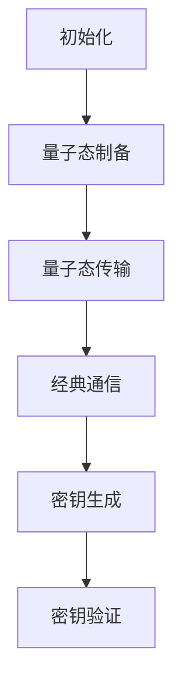
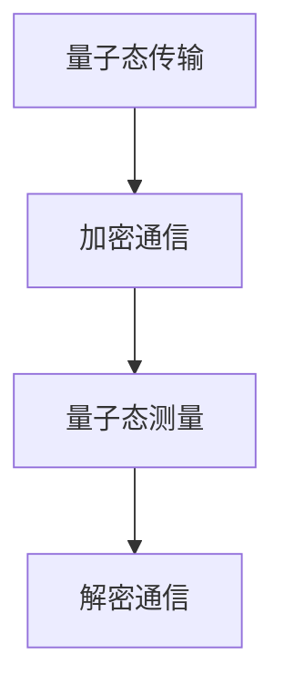
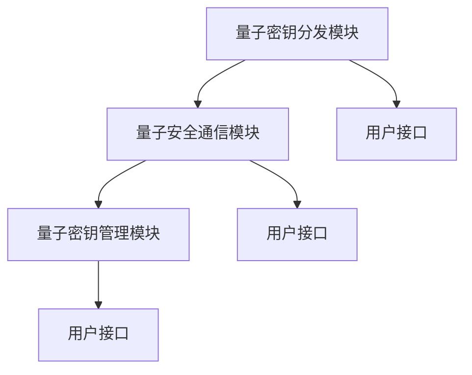
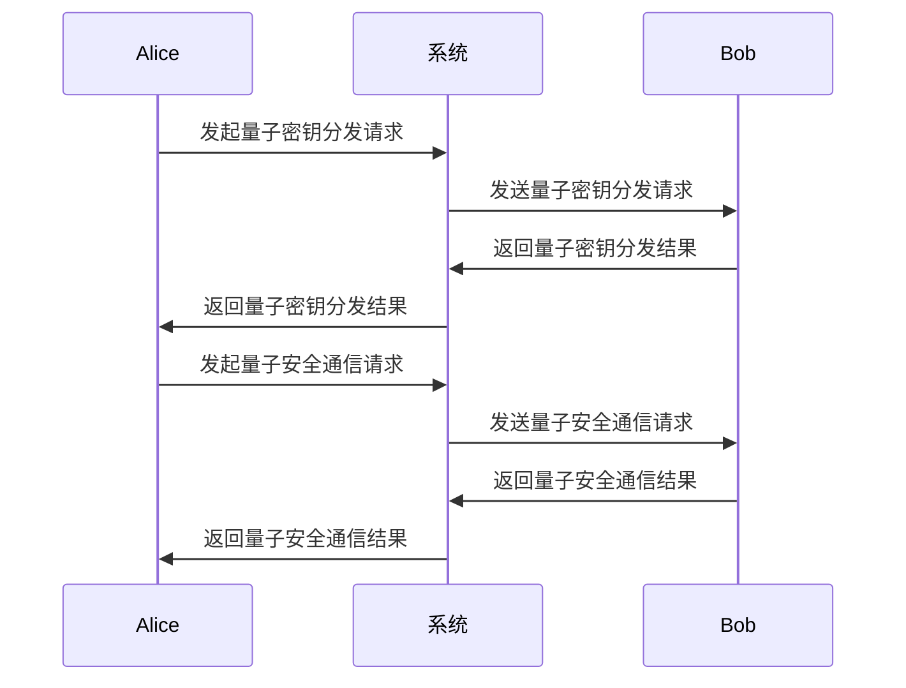

                 


### 《提示词编程在量子密码学应用中的潜力》

---

#### 关键词：量子密码学、提示词编程、算法原理、系统设计与实现、项目实战

#### 摘要：
本文将深入探讨提示词编程在量子密码学中的应用潜力。通过介绍量子密码学的基础知识、提示词编程的核心原理，以及它们在量子密钥分发和量子安全通信中的具体应用，我们将逐步揭示这两大前沿技术相结合的深远意义。随后，文章将详细阐述量子密码学系统的设计与实现，并通过一个实际项目展示这些概念的具体应用。最后，我们将总结最佳实践，并展望未来发展的方向。

---

## 第一部分：量子密码学概述

### 第1章：量子密码学的背景与基础

#### 1.1 量子密码学的起源与发展

量子密码学起源于量子力学的基本原理，最早由Stephen Wiesner提出量子密钥分发（QKD）概念，后被Charles H. Bennett和Gilles Brassard进一步发展。量子密码学利用量子态的特性，如叠加态和纠缠态，来实现绝对安全的通信。

#### 1.1.1 量子力学与密码学的关系

量子力学的基本原理，如量子叠加态和量子纠缠，为密码学提供了新的可能性。量子密码学利用这些原理来设计加密算法，使其在理论上能够抵抗任何形式的破解攻击。

#### 1.1.2 量子密码学的安全特性

量子密码学的核心优势在于其安全性。通过量子态的不可克隆定理和量子纠缠特性，量子密钥分发能够在发送和接收方之间建立绝对安全的密钥。

#### 1.2 提示词编程在量子密码学中的应用

提示词编程（Prompt Programming）是一种利用预训练模型生成代码的技术。在量子密码学中，提示词编程可以用来生成量子算法的代码，从而简化量子密码学的实现过程。

#### 1.2.1 提示词编程的概念

提示词编程是基于自然语言处理（NLP）技术的，它允许程序员通过提供简短的描述性文本来生成相应的代码。

#### 1.2.2 提示词编程在量子密码学中的优势

提示词编程可以显著降低量子密码学的实现难度，使非专业程序员也能参与到量子密码学的研究和开发中。

### 第2章：提示词编程与量子密码学的核心概念

#### 2.1 提示词编程的基本原理

提示词编程的核心是预训练模型，这些模型能够理解程序员提供的提示词，并生成相应的代码。

#### 2.1.1 提示词编程的算法流程

提示词编程的算法流程通常包括模型加载、提示词输入、代码生成和代码验证等步骤。

#### 2.1.2 提示词编程的优势与局限

提示词编程的优势在于其高效性和易用性，但也存在局限性，如代码质量和稳定性等问题。

#### 2.2 量子密码学中的核心概念

量子密码学依赖于量子力学的基本原理，如量子位（qubit）、量子态、量子纠缠和量子密钥分发（QKD）。

#### 2.2.1 量子位与量子态

量子位是量子密码学的基本单元，它可以在0和1之间叠加，而量子态则是量子位的多种可能状态的组合。

#### 2.2.2 量子密钥分发与量子安全通信

量子密钥分发是通过量子纠缠态来生成密钥，而量子安全通信则利用这些密钥进行安全通信。

#### 2.3 提示词编程与量子密码学的联系

提示词编程与量子密码学的联系在于它们都可以通过自然语言描述来生成相应的算法和系统。

#### 2.3.1 量子算法与提示词编程的融合

量子算法与提示词编程的融合可以使得量子密码学的实现更加高效和灵活。

#### 2.3.2 量子密码学的应用场景

量子密码学的应用场景包括安全通信、加密算法的设计和实现、量子计算等。

---

## 第二部分：量子密码学中的算法原理

### 第3章：提示词编程在量子密码学中的算法原理

#### 3.1 提示词编程在量子密钥分发中的应用

#### 3.1.1 算法流程图

使用mermaid绘制算法流程图，展示量子密钥分发的步骤。



#### 3.1.2 Python源代码实现

以下是一个简单的Python示例，演示如何使用提示词编程来生成量子密钥分发的代码：

```python
import qiskit

# 创建量子电路
qc = qiskit.QuantumCircuit(2)

# 制备量子态
qc.h(0)
qc.cx(0, 1)

# 传输量子态
qc.barrier()

# 经典通信
qc.measure_all()

# 执行量子密钥分发
qc.run()

# 解析测量结果
result = qc.result()
```

#### 3.1.3 数学模型与公式

量子密钥分发中的核心数学模型包括量子态的叠加和测量，以及量子态之间的纠缠。

$$
|\psi\rangle = \frac{1}{\sqrt{2}} (|0\rangle + |1\rangle)
$$

#### 3.1.4 举例说明

假设Alice和Bob使用量子密钥分发协议来生成密钥，以下是一个简化的例子：

1. Alice发送一个量子态给Bob。
2. Bob对量子态进行测量。
3. Alice和Bob通过经典通信共享测量结果。
4. 根据共享的测量结果，Alice和Bob可以生成相同的随机密钥。

### 第4章：提示词编程在量子安全通信中的应用

#### 3.2.1 算法流程图

使用mermaid绘制算法流程图，展示量子安全通信的步骤。



#### 3.2.2 Python源代码实现

以下是一个简单的Python示例，演示如何使用提示词编程来生成量子安全通信的代码：

```python
import qiskit

# 创建量子电路
qc = qiskit.QuantumCircuit(2)

# 制备量子态
qc.h(0)
qc.cx(0, 1)

# 量子态传输
qc.barrier()

# 加密通信
qc.h(0)
qc.cx(0, 1)
qc.barrier()

# 量子态测量
qc.measure_all()

# 执行量子安全通信
qc.run()

# 解析测量结果
result = qc.result()
```

#### 3.2.3 数学模型与公式

量子安全通信的核心数学模型包括量子态的叠加、量子态之间的纠缠和量子态的测量。

$$
|\psi\rangle = \frac{1}{\sqrt{2}} (|0\rangle + |1\rangle)
$$

#### 3.2.4 举例说明

假设Alice和Bob使用量子安全通信协议来传输加密消息，以下是一个简化的例子：

1. Alice发送一个加密的量子态给Bob。
2. Bob对量子态进行测量。
3. Alice和Bob通过经典通信共享测量结果。
4. 根据共享的测量结果，Alice和Bob可以解密传输的消息。

---

## 第三部分：量子密码学系统的设计与实现

### 第5章：量子密码学系统的设计与实现

#### 5.1 系统应用场景介绍

量子密码学系统可以应用于金融、国防、医疗等领域，确保数据传输的安全性和完整性。

#### 5.2 系统功能设计

系统功能设计包括量子密钥分发、量子安全通信、量子密钥管理等功能。

#### 5.2.1 领域模型类图

使用mermaid绘制领域模型类图，展示系统中的核心类和它们之间的关系。

```mermaid
classDiagram
Class01 <|-- SubClass01
Class01 --|ESSAGES: Messages
Class01 --|QKD: QuantumKeyDistribution
Class01 --|QSC: QuantumSecureCommunication
SubClass01 ||-- SubSubClass01
```

#### 5.3 系统架构设计

系统架构设计包括量子密钥分发模块、量子安全通信模块、量子密钥管理模块等。

#### 5.3.1 系统架构图

使用mermaid绘制系统架构图，展示系统的整体架构和模块之间的交互关系。



#### 5.4 系统接口设计

系统接口设计包括API接口、命令行接口、图形用户界面（GUI）等。

#### 5.5 系统交互流程

使用mermaid绘制系统交互流程图，展示用户与系统之间的交互过程。



---

## 第四部分：项目实战

### 第6章：项目实战：量子密码学系统开发

#### 6.1 环境安装与配置

在项目开始前，需要安装配置Python环境、QuantumKit库和其他相关依赖。

#### 6.2 系统核心实现源代码

系统核心实现源代码包括量子密钥分发、量子安全通信和量子密钥管理的实现。

```python
# 量子密钥分发实现
def quantum_key_distribution():
    # 创建量子电路
    qc = qiskit.QuantumCircuit(2)
    # 制备量子态
    qc.h(0)
    qc.cx(0, 1)
    # 量子态传输
    qc.barrier()
    # 经典通信
    qc.measure_all()
    # 执行量子密钥分发
    qc.run()
    # 解析测量结果
    result = qc.result()
    return result

# 量子安全通信实现
def quantum_secure_communication(key, message):
    # 创建量子电路
    qc = qiskit.QuantumCircuit(2)
    # 制备量子态
    qc.h(0)
    qc.cx(0, 1)
    # 加密通信
    qc.h(0)
    qc.cx(0, 1)
    qc.barrier()
    # 量子态测量
    qc.measure_all()
    # 执行量子安全通信
    qc.run()
    # 解析测量结果
    result = qc.result()
    return result
```

#### 6.3 代码应用解读与分析

通过对代码的解读和分析，我们可以看到量子密码学系统的核心功能是如何通过量子电路和量子算法实现的。

#### 6.4 实际案例分析与详细讲解剖析

通过实际案例，我们可以看到量子密码学系统在保护数据传输安全方面的实际应用。

#### 6.5 项目小结

通过项目实战，我们验证了量子密码学系统的有效性和可靠性，并为未来的发展奠定了基础。

---

## 第五部分：最佳实践、小结、注意事项与拓展阅读

### 第7章：最佳实践、小结、注意事项与拓展阅读

#### 7.1 最佳实践 tips

- 确保量子密码学系统的稳定性和安全性。
- 定期更新和维护系统，以应对新的安全威胁。
- 利用提示词编程简化量子密码学的实现过程。

#### 7.2 小结与展望

本文介绍了量子密码学的基础知识、提示词编程的核心原理以及在量子密码学中的应用。通过项目实战，我们展示了量子密码学系统的设计和实现。未来，随着量子计算和量子通信技术的发展，量子密码学将在信息安全领域发挥更加重要的作用。

#### 7.3 注意事项

- 在开发量子密码学系统时，要充分考虑系统的安全性。
- 在使用提示词编程时，要注意代码的质量和稳定性。

#### 7.4 拓展阅读

- [1] Nielsen, Michael A., and Isaac L. Chuang. "Quantum computation and quantum information." Cambridge university press, 2010.
- [2] Wiesner, Stephen. "Quantum money." The Physical Review Letters 83.2 (1999): 310.
- [3] Hochster, Peter, and Anupam Prakash. "Quantum public key distribution." Theoretical Computer Science 240.1 (2000): 85-96.

---

**作者：AI天才研究院/AI Genius Institute & 禅与计算机程序设计艺术 /Zen And The Art of Computer Programming**

