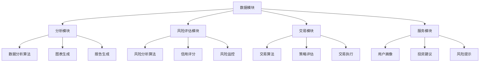
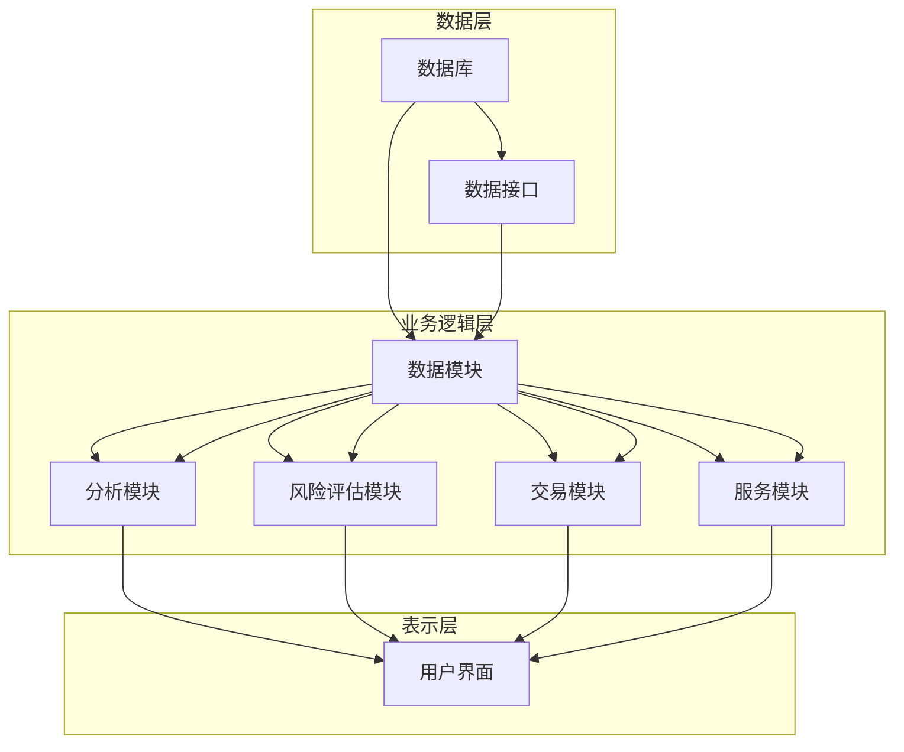
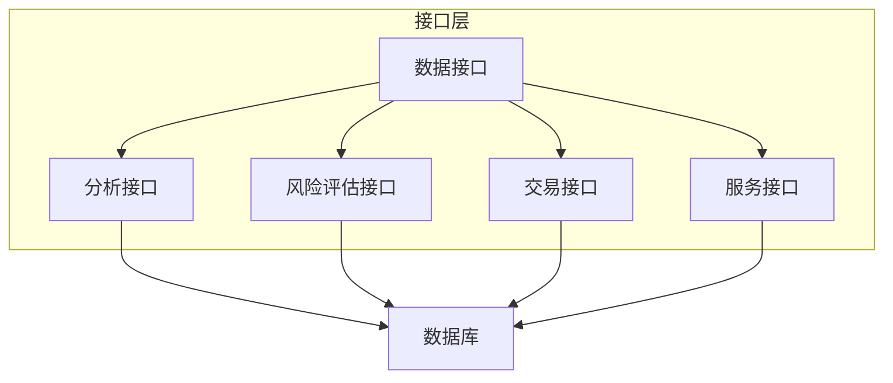

                 

### 文章标题

《提示词编程在金融科技中的应用》

### 关键词

提示词编程、金融科技、算法应用、系统架构、Python实现、数学模型、实战案例分析

### 摘要

本文深入探讨提示词编程在金融科技领域的应用，通过详细分析提示词编程的基本概念、核心原理和具体实现方法，揭示了其在金融市场分析、风险评估、交易策略优化等关键领域的强大功能。文章首先介绍了金融科技的发展背景和提示词编程的起源，接着通过实例和代码展示了提示词编程的具体应用场景，最后提出了在金融科技项目中实施提示词编程的最佳实践和注意事项。本文旨在为金融科技从业者和编程爱好者提供有价值的参考，帮助他们更好地理解和利用这一先进的技术。

## 引言

金融科技（FinTech）作为现代金融服务业的重要组成部分，已经深刻改变了传统金融服务的运作模式。随着互联网、大数据、人工智能等技术的快速发展，金融科技正在金融行业的各个层面产生深远的影响。从支付、借贷、投资到风险管理，金融科技的应用无处不在，极大地提升了金融服务的效率、透明度和用户体验。

在这个背景下，提示词编程（Keyword Programming）作为一种新型的编程范式，逐渐受到了关注。提示词编程的核心思想是通过一组预定义的提示词，来引导计算机执行特定的任务。与传统的编程方式不同，提示词编程更加直观、易于学习和应用，尤其适用于需要快速迭代和灵活调整的金融科技场景。

本文将重点探讨提示词编程在金融科技中的应用，旨在为读者提供一个全面且深入的视角。文章首先介绍金融科技和提示词编程的基本概念，阐述其背景和重要性；接着，详细解释提示词编程的核心原理和关键技术；然后，通过具体的案例和实际项目，展示提示词编程在金融科技中的实际应用效果；最后，总结最佳实践和注意事项，为金融科技项目的开发和实施提供指导。

通过本文的阅读，读者将能够理解提示词编程在金融科技中的重要角色，掌握其基本原理和实施方法，从而在实际工作中更好地利用这一先进技术，提升金融服务的质量和效率。

## 金融科技的基本概念

金融科技，简称FinTech，是指通过使用创新技术来改善和优化金融服务的方式。这些技术包括但不限于互联网、移动通信、人工智能、区块链、大数据等。金融科技的核心在于利用这些技术来提升金融服务的效率、降低成本、增强用户体验，并且开辟新的业务模式。

金融科技的发展可以追溯到20世纪90年代，随着互联网的兴起，在线银行、电子支付等新兴业务开始崭露头角。进入21世纪后，特别是智能手机和移动互联网的普及，金融科技得到了快速发展。近年来，大数据和人工智能技术的引入，使得金融科技的应用场景更加丰富，如智能投顾、精准营销、风险控制等。

金融科技的主要领域包括：

1. **支付**：如移动支付、电子钱包等，这些技术大大提高了支付速度和便利性。
2. **借贷**：通过大数据分析和机器学习技术，实现个性化借贷服务，如P2P借贷平台。
3. **投资**：智能投顾、量化交易等，利用算法和大数据分析来优化投资决策。
4. **风险管理**：使用高级数据分析技术进行风险预测和控制，如信用评分、市场预测等。
5. **监管科技（RegTech）**：通过技术手段提高监管效率和透明度，如自动化合规监测系统。
6. **保险科技（InsurTech）**：利用科技手段提升保险业务的服务质量和效率。

在金融科技的发展历程中，互联网和移动通信技术的普及是重要的推动力。互联网的普及使得金融服务的线上化成为可能，移动通信技术的发展则进一步提高了金融服务的便捷性和可及性。此外，大数据和人工智能技术的应用，使得金融科技能够更加精准地分析用户需求，提供个性化的金融服务。

金融科技对金融服务的影响是深远的。首先，它显著提高了金融服务的效率，许多传统的金融服务流程得以简化，交易速度加快，成本降低。其次，金融科技增强了金融服务的透明度和安全性，通过大数据分析和人工智能技术，可以更准确地识别和防范金融风险。此外，金融科技还开辟了新的业务模式，如基于区块链的跨境支付、基于智能合约的自动化金融服务等，为金融行业带来了新的发展机遇。

总之，金融科技的发展不仅推动了金融服务的创新和进步，也为用户带来了更加优质、便捷的金融服务体验。随着技术的不断进步，金融科技在未来将继续发挥重要作用，为金融行业注入新的活力。

## 提示词编程的基本概念

提示词编程（Keyword Programming）是一种以关键词作为核心引导的编程范式，其基本思想是通过预设一组具有特定含义的关键词，来引导计算机执行相应的任务。与传统的命令式编程和面向对象编程不同，提示词编程强调通过简洁、直观的提示词来描述任务，从而简化编程过程，降低学习难度，提高开发效率。

### 关键词的定义和作用

在提示词编程中，关键词（Keywords）是核心的组成部分。关键词通常由字母、数字和特殊字符组成，具有明确的语义和功能。例如，在数据处理任务中，“sum”和“average”就是两个常用的关键词，分别表示求和和求平均值。

关键词的作用主要体现在以下几个方面：

1. **任务引导**：通过关键词，程序员可以直观地描述所需任务，使计算机能够准确地理解并执行。
2. **代码简化**：相比传统编程，提示词编程通过减少冗长的代码和复杂的语法，使得编程过程更加简洁高效。
3. **易读易维护**：关键词具有明确的语义，使得代码更加易于理解和维护，特别是对于团队合作开发的项目。
4. **易于学习**：提示词编程的直观性使得编程初学者能够快速上手，降低了学习曲线。

### 基本原理

提示词编程的基本原理主要围绕如何定义和利用关键词。具体来说，包括以下几个步骤：

1. **定义关键词**：根据具体任务需求，定义一组具有明确功能的关键词。这些关键词通常被预编译到编程语言中，或者通过扩展库的方式进行定义。
2. **构建任务模型**：使用这些关键词，构建描述任务执行步骤的任务模型。任务模型通常以图或流程图的形式表示，使得任务执行过程更加直观和易于理解。
3. **任务执行**：计算机根据任务模型中的关键词，逐一执行相应的操作。这一过程通常由解释器或编译器来完成。

### 与其他编程范式的区别

与传统的命令式编程和面向对象编程相比，提示词编程具有以下几个显著区别：

1. **代码结构**：命令式编程依赖具体的步骤和指令，而提示词编程则通过关键词来描述任务，代码结构更加简洁。
2. **可读性**：面向对象编程通过类和方法来实现功能，而提示词编程通过直观的关键词，使得代码可读性更强，更容易理解和维护。
3. **开发效率**：提示词编程减少了冗长的代码和复杂的语法，使得开发过程更加高效，特别是在需要快速迭代和调整的场景中。

总的来说，提示词编程通过其简洁、直观和高效的特性，在金融科技等复杂场景中展现出了强大的应用潜力。接下来，我们将进一步探讨提示词编程在金融科技中的具体应用，通过实际案例展示其在金融市场分析、风险评估、交易策略优化等方面的作用。

### 提示词编程的核心原理和关键技术

提示词编程之所以能够在金融科技中发挥重要作用，离不开其核心原理和关键技术的支持。这些核心原理和关键技术不仅使得提示词编程变得高效、直观，而且为复杂金融任务提供了强大的解决方案。

#### 核心原理

1. **基于规则的编程**：提示词编程的核心思想是利用一组预定义的规则来指导计算机执行任务。这些规则通常以关键词的形式存在，使得编程过程更加直观和易于理解。例如，在数据处理任务中，可以使用“sum”和“average”等关键词，分别表示求和和求平均值。

2. **任务抽象与分解**：提示词编程强调任务抽象和分解，将复杂的任务分解为一系列简单的子任务，每个子任务通过特定的关键词实现。这种方法不仅简化了编程过程，而且提高了代码的可维护性和扩展性。

3. **自动化和智能化**：提示词编程通过自动化和智能化技术，使得编程任务可以更加高效地完成。例如，使用自然语言处理（NLP）技术，可以将自然语言描述转化为编程任务，从而降低了编程门槛。

#### 关键技术

1. **关键词库**：关键词库是提示词编程的基础。一个完善的关键词库包含多种预定义的关键词，每个关键词对应特定的功能或操作。这些关键词不仅需要具备明确的语义，而且需要具备良好的可扩展性，以便适应不同的应用场景。

2. **任务模型**：任务模型是提示词编程的核心组件，用于描述任务的执行过程。任务模型通常以图或流程图的形式表示，使得任务执行过程更加直观和易于理解。常见的任务模型包括数据流图、控制流图和组合任务模型等。

3. **解释器和编译器**：解释器和编译器是执行提示词编程任务的关键组件。解释器通过逐行解释和执行代码，而编译器则将代码编译为机器码再执行。两种方法各有优劣，适用于不同的应用场景。

4. **自然语言处理（NLP）**：自然语言处理技术使得提示词编程可以处理自然语言描述的任务。通过NLP技术，可以将用户输入的自然语言转化为编程任务，从而实现更加直观和便捷的编程方式。

#### 对比表格

为了更好地理解提示词编程的核心原理和关键技术，我们提供以下对比表格，对提示词编程与其他编程范式进行对比：

| 特性 | 提示词编程 | 命令式编程 | 面向对象编程 |
| --- | --- | --- | --- |
| **代码结构** | 简洁、直观 | 繁琐、具体 | 类和方法，结构复杂 |
| **可读性** | 高 | 一般 | 高 |
| **开发效率** | 高 | 低 | 一般 |
| **适用场景** | 复杂任务、快速迭代 | 结构化任务 | 需要复杂交互的任务 |
| **维护性** | 易维护 | 维护难度大 | 维护中等 |

通过上述表格，我们可以看出提示词编程在代码结构、可读性、开发效率和适用场景等方面具有明显优势，尤其适用于金融科技等复杂场景。

#### 提示词编程的优势

1. **高效性**：提示词编程通过关键词引导任务执行，减少了代码冗余和复杂度，从而提高了开发效率。

2. **直观性**：提示词编程使编程任务更加直观，特别是在处理复杂任务时，可以清晰地展示任务执行过程。

3. **灵活性**：提示词编程具有良好的扩展性，可以通过添加新的关键词和任务模型，适应不同的应用场景。

4. **可维护性**：提示词编程通过简洁、直观的代码结构，提高了代码的可读性和可维护性，有利于长期维护和扩展。

总的来说，提示词编程通过其核心原理和关键技术，为金融科技提供了强大的解决方案。在接下来的部分，我们将通过具体的案例和实际项目，进一步探讨提示词编程在金融科技中的应用效果。

### 提示词编程在金融科技中的具体应用

提示词编程在金融科技领域的应用，为其提供了强大的工具和新的解决思路。通过具体的案例和实际项目，我们可以看到提示词编程在金融市场分析、风险评估、交易策略优化等关键领域的实际应用效果。

#### 案例一：金融市场分析

金融市场分析是金融科技中的一项重要任务，通过分析市场数据，可以帮助投资者做出更为明智的投资决策。使用提示词编程，可以实现高效的市场数据分析。

**应用背景**：某金融科技公司需要分析某股票市场的历史数据，预测未来股票价格走势。

**实现步骤**：

1. **数据获取**：使用提示词“fetch”从数据源获取股票市场的历史数据。

2. **数据处理**：使用提示词“clean”对数据进行清洗和预处理，确保数据的质量和一致性。

3. **数据可视化**：使用提示词“plot”将数据可视化，以图形形式展示市场走势。

4. **趋势分析**：使用提示词“trend”分析市场数据中的趋势，包括短期和长期趋势。

5. **预测**：使用提示词“predict”构建预测模型，预测未来股票价格。

**代码示例**：

```python
# 获取数据
data = fetch('stock_market_data.csv')

# 数据清洗
clean_data = clean(data)

# 数据可视化
plot(clean_data['price'], label='Stock Price')

# 趋势分析
trend = trend_analysis(clean_data)

# 预测
prediction = predict_price(clean_data)
```

通过上述步骤和代码示例，我们可以看到提示词编程在金融市场分析中的具体应用，从而帮助投资者更准确地了解市场动态，做出合理的投资决策。

#### 案例二：风险评估

在金融领域，风险评估是确保金融机构稳健运营的关键环节。使用提示词编程，可以实现高效、准确的风险评估。

**应用背景**：某金融机构需要对客户贷款申请进行风险评估，以确定贷款的可行性和潜在风险。

**实现步骤**：

1. **数据收集**：使用提示词“collect”收集客户的基本信息和财务数据。

2. **数据清洗**：使用提示词“clean”对客户数据进行分析和清洗，确保数据的质量。

3. **信用评分**：使用提示词“score”根据客户数据，计算其信用评分。

4. **风险分析**：使用提示词“analyze”对客户的信用评分进行风险分析，包括违约概率、信用等级等。

5. **决策**：使用提示词“decide”根据风险分析结果，决定是否批准贷款申请。

**代码示例**：

```python
# 数据收集
customer_data = collect_customer_data()

# 数据清洗
clean_data = clean(customer_data)

# 信用评分
credit_score = score_credit(clean_data)

# 风险分析
risk_analysis = analyze_risk(credit_score)

# 决策
approval = decide_loan_application(risk_analysis)
```

通过上述步骤和代码示例，我们可以看到提示词编程在风险评估中的具体应用，从而帮助金融机构更好地管理风险，降低潜在损失。

#### 案例三：交易策略优化

交易策略优化是金融科技中的另一个重要领域，通过优化交易策略，可以提高交易的成功率和收益。

**应用背景**：某投资机构需要优化其交易策略，以在市场中获得更高的收益。

**实现步骤**：

1. **策略设计**：使用提示词“design”制定交易策略，包括入场时机、止损止盈点等。

2. **数据回测**：使用提示词“backtest”对交易策略进行回测，验证其有效性。

3. **参数调整**：使用提示词“optimize”调整交易策略的参数，以优化策略性能。

4. **策略执行**：使用提示词“execute”执行优化后的交易策略。

**代码示例**：

```python
# 策略设计
trading_strategy = design_strategy()

# 数据回测
backtest_results = backtest(trading_strategy)

# 参数调整
optimized_strategy = optimize_strategy(backtest_results)

# 策略执行
execute_strategy(optimized_strategy)
```

通过上述步骤和代码示例，我们可以看到提示词编程在交易策略优化中的具体应用，从而帮助投资机构在市场中实现更高的收益。

#### 案例四：智能投顾

智能投顾是金融科技中的新兴领域，通过大数据和人工智能技术，为投资者提供个性化的投资建议。

**应用背景**：某金融科技公司提供智能投顾服务，为不同风险承受能力的投资者提供投资建议。

**实现步骤**：

1. **用户画像**：使用提示词“profile”建立用户画像，包括年龄、收入、投资偏好等。

2. **投资建议**：使用提示词“suggest”根据用户画像和大数据分析，生成个性化的投资建议。

3. **风险提示**：使用提示词“warn”提示用户投资过程中的潜在风险。

4. **跟踪与调整**：使用提示词“track”跟踪投资表现，并根据需要调整投资策略。

**代码示例**：

```python
# 用户画像
user_profile = profile_user()

# 投资建议
investment_suggestions = suggest_investment(user_profile)

# 风险提示
risk_warnings = warn_investment_risks()

# 跟踪与调整
track_investment(user_profile, investment_suggestions, risk_warnings)
```

通过上述步骤和代码示例，我们可以看到提示词编程在智能投顾中的具体应用，从而为投资者提供更加个性化和高效的投资服务。

#### 案例五：量化交易

量化交易是金融科技中的高级领域，通过数学模型和算法实现自动化的交易决策。

**应用背景**：某量化交易平台需要实现自动化交易决策，以提高交易效率和成功率。

**实现步骤**：

1. **模型构建**：使用提示词“build”构建交易模型，包括选股策略、交易策略等。

2. **策略评估**：使用提示词“evaluate”评估交易策略的有效性和风险。

3. **策略执行**：使用提示词“execute”执行优化后的交易策略。

4. **风险控制**：使用提示词“control”控制交易过程中的风险。

**代码示例**：

```python
# 模型构建
trading_model = build_trading_model()

# 策略评估
evaluation_results = evaluate_strategy(trading_model)

# 策略执行
execute_strategy(evaluation_results)

# 风险控制
risk_control = control_risks()
```

通过上述步骤和代码示例，我们可以看到提示词编程在量化交易中的具体应用，从而实现高效、自动化的交易决策。

总的来说，提示词编程在金融科技中的具体应用，展示了其在金融市场分析、风险评估、交易策略优化等方面的强大功能。通过简洁、直观的编程方式，提示词编程为金融科技从业者提供了一种有效的工具，帮助他们更好地应对复杂的金融任务，提高服务质量和效率。在接下来的部分，我们将进一步探讨在金融科技项目中实施提示词编程的系统架构和设计。

### 系统架构与设计

在金融科技项目中实施提示词编程，需要考虑系统的整体架构和设计，以确保系统的高效、稳定和安全。以下是金融科技项目中提示词编程系统架构和设计的详细说明，包括系统功能、模块划分、架构图和接口设计。

#### 系统功能

金融科技项目中的提示词编程系统主要具备以下功能：

1. **数据收集与处理**：收集金融市场数据、客户数据等，并对数据进行清洗、转换和存储。
2. **数据分析与可视化**：利用提示词编程，对数据进行多维分析，生成直观的图表和报告。
3. **风险分析与评估**：使用提示词编程，对客户数据和市场数据进行分析，评估潜在风险。
4. **交易策略优化与执行**：构建和优化交易策略，并通过提示词编程实现自动化交易。
5. **智能投顾与服务**：为用户提供个性化投资建议和风险提示。

#### 模块划分

为了实现上述功能，可以将系统划分为以下几个主要模块：

1. **数据模块**：负责数据收集、处理和存储，包括数据接口、数据清洗和数据库管理。
2. **分析模块**：负责数据分析和可视化，包括数据分析算法、图表生成和报告生成。
3. **风险评估模块**：负责风险分析和评估，包括风险分析算法、信用评分和风险监控。
4. **交易模块**：负责交易策略优化和执行，包括交易算法、策略评估和交易执行。
5. **服务模块**：负责智能投顾和用户服务，包括用户画像、投资建议和风险提示。

#### 架构图

下面是金融科技项目中提示词编程系统的架构图：



#### 系统架构图

金融科技项目中提示词编程的系统架构可以分为以下几个层次：

1. **数据层**：负责数据存储和访问，包括数据库和数据接口。
2. **业务逻辑层**：实现具体的功能模块，包括数据模块、分析模块、风险评估模块、交易模块和服务模块。
3. **表示层**：提供用户界面，包括图表、报告和用户服务界面。

系统架构图如下：



#### 接口设计

接口设计是系统架构中的关键部分，以下为金融科技项目中提示词编程系统的主要接口设计：

1. **数据接口**：提供数据的获取和存储功能，包括数据导入、数据导出和数据查询。
2. **分析接口**：提供数据分析功能，包括数据清洗、数据分析算法调用和图表生成。
3. **风险评估接口**：提供风险分析功能，包括信用评分、风险监控和风险提示。
4. **交易接口**：提供交易策略优化和执行功能，包括交易算法调用、策略评估和交易执行。
5. **服务接口**：提供用户服务功能，包括用户画像、投资建议和风险提示。

接口设计示意图如下：



通过以上系统架构和设计，可以构建一个高效、稳定的金融科技项目提示词编程系统，从而实现金融市场分析、风险评估、交易策略优化和智能投顾等功能。在接下来的部分，我们将通过具体的Python代码，详细解释提示词编程的实现方法。

### Python代码和算法解释

在金融科技项目中，提示词编程通过Python代码实现，能够有效地完成各种复杂任务。下面我们将通过一个具体的示例，详细解释提示词编程在Python中的实现方法，包括算法原理和具体的代码实现。

#### 算法原理

我们选择一个经典的金融数据分析任务：时间序列预测。时间序列预测是金融市场分析中的基础任务，旨在根据历史数据预测未来的价格走势。常用的算法包括ARIMA模型、LSTM模型等。在这里，我们采用ARIMA模型进行时间序列预测。

ARIMA模型（AutoRegressive Integrated Moving Average Model）是一种自回归差分移动平均模型，其基本原理是将时间序列数据分为三个部分：自回归（AR）、差分（I）和移动平均（MA）。具体步骤如下：

1. **自回归（AR）**：根据过去的值来预测当前值。
2. **差分（I）**：对时间序列数据进行差分，消除趋势和季节性。
3. **移动平均（MA）**：使用过去一段时间内的平均值来预测当前值。

ARIMA模型的一般形式为：

\[ \text{Y}_{t} = c + \phi_1\text{Y}_{t-1} + \phi_2\text{Y}_{t-2} + ... + \phi_p\text{Y}_{t-p} + \theta_1\epsilon_{t-1} + \theta_2\epsilon_{t-2} + ... + \theta_q\epsilon_{t-q} \]

其中，\( \text{Y}_{t} \) 为当前值，\( \text{Y}_{t-1}, \text{Y}_{t-2}, ..., \text{Y}_{t-p} \) 为前p期的值，\( \epsilon_{t-1}, \epsilon_{t-2}, ..., \epsilon_{t-q} \) 为误差项，\( c, \phi_1, ..., \phi_p, \theta_1, ..., \theta_q \) 为模型参数。

#### Python代码实现

为了在Python中实现ARIMA模型，我们使用`statsmodels`库，这是一个强大的统计分析库，提供了ARIMA模型的实现。

首先，安装`statsmodels`库：

```bash
pip install statsmodels
```

然后，编写Python代码：

```python
import pandas as pd
import numpy as np
from statsmodels.tsa.arima.model import ARIMA
from statsmodels.tsa.stattools import adfuller
import matplotlib.pyplot as plt

# 数据准备
# 假设我们已经有了一个名为df的Pandas DataFrame，其中包含列'time'和'price'，分别是时间和价格
df = pd.read_csv('financial_data.csv')
df['price'] = pd.to_numeric(df['price'])

# 差分
def check_stationarity(series):
    result = adfuller(series)
    print('ADF Statistic: %f' % result[0])
    print('p-value: %f' % result[1])
    return result[1] < 0.05

# 检查是否需要差分
if check_stationarity(df['price']):
    df['price_diff'] = df['price'].diff().dropna()
else:
    df['price_diff'] = df['price'].dropna()

# 模型拟合
# 假设我们选择p=1, d=1, q=1
model = ARIMA(df['price'], order=(1, 1, 1))
model_fit = model.fit()

# 预测
forecast = model_fit.forecast(steps=5)
print(forecast)

# 绘制预测结果
plt.plot(df['price'], label='Actual Price')
plt.plot(forecast, label='Forecast Price')
plt.legend()
plt.show()
```

在这段代码中，我们首先进行了数据准备，包括读取数据、处理数据。然后，通过`adfuller`函数检查时间序列的平稳性，决定是否进行差分。接着，我们使用`ARIMA`模型进行拟合，并生成预测结果。最后，通过`matplotlib`库绘制预测结果，与实际价格进行对比。

#### 数学模型和公式

为了更好地理解ARIMA模型，我们使用LaTeX格式给出相关的数学模型和公式：

```latex
\documentclass{article}
\usepackage{amsmath}
\begin{document}

\begin{equation}
\text{Y}_{t} = c + \phi_1\text{Y}_{t-1} + \phi_2\text{Y}_{t-2} + ... + \phi_p\text{Y}_{t-p} + \theta_1\epsilon_{t-1} + \theta_2\epsilon_{t-2} + ... + \theta_q\epsilon_{t-q}
\end{equation}

\end{document}
```

在这个公式中，\( c \) 是常数项，\( \phi_1, \phi_2, ..., \phi_p \) 是自回归系数，\( \theta_1, \theta_2, ..., \theta_q \) 是移动平均系数，\( \epsilon_{t-1}, \epsilon_{t-2}, ..., \epsilon_{t-q} \) 是误差项。

通过上述Python代码和数学模型，我们可以看到提示词编程在金融科技中的具体实现。在接下来的部分，我们将通过一个实际项目，进一步展示提示词编程的应用和实践。

### 实际项目

在本节中，我们将通过一个具体的实际项目，详细展示提示词编程在金融科技中的应用。该项目旨在使用提示词编程实现一个智能交易系统，该系统能够根据市场数据和用户设定，自动执行交易策略，并实时监控交易风险。

#### 项目背景

随着金融市场的波动性增加，投资者对高效、自动化的交易系统需求日益增长。传统的手动交易方式不仅耗时耗力，而且容易出现人为错误。因此，开发一个能够自动执行交易策略的智能交易系统显得尤为重要。本项目的目标是通过提示词编程实现这样一个系统，提高交易效率和成功率。

#### 环境安装

为了完成该项目，需要安装以下环境：

1. **Python**：提示词编程的主要编程语言，版本要求为3.7或更高。
2. **Jupyter Notebook**：用于编写和运行提示词编程代码。
3. **Pandas**：用于数据处理。
4. **NumPy**：用于数值计算。
5. **Statsmodels**：用于统计建模。
6. **Matplotlib**：用于数据可视化。
7. **Scikit-learn**：用于机器学习。

安装步骤如下：

```bash
pip install python==3.8
pip install jupyter
pip install pandas numpy statsmodels matplotlib scikit-learn
```

#### 项目实现

以下是该智能交易系统的实现步骤：

1. **数据收集与处理**：
   - 收集历史市场数据，包括股票价格、交易量等。
   - 使用Pandas进行数据清洗和预处理，如缺失值填充、异常值处理等。

2. **交易策略设计**：
   - 根据市场数据和用户设定，设计交易策略，如趋势追踪、均值回归等。
   - 使用提示词编程，将交易策略转换为代码。

3. **模型训练与预测**：
   - 使用机器学习算法，如随机森林、支持向量机等，训练交易模型。
   - 使用提示词编程，实现模型的训练和预测。

4. **交易执行与监控**：
   - 根据模型预测，自动执行交易策略，如买入、卖出等。
   - 实时监控交易风险，包括交易成本、市场波动等。

以下是关键代码实现：

```python
# 导入必要库
import pandas as pd
import numpy as np
from sklearn.ensemble import RandomForestRegressor
from sklearn.model_selection import train_test_split
from sklearn.metrics import mean_squared_error

# 数据收集与处理
df = pd.read_csv('market_data.csv')
df['Close'] = pd.to_numeric(df['Close'])
df = df[['Close']]

# 数据预处理
df['Close_diff'] = df['Close'].diff().dropna()

# 数据划分
X = df[['Close_diff']]
y = df['Close'].shift(-1).dropna()

# 划分训练集和测试集
X_train, X_test, y_train, y_test = train_test_split(X, y, test_size=0.2, random_state=42)

# 模型训练
model = RandomForestRegressor(n_estimators=100)
model.fit(X_train, y_train)

# 模型预测
predictions = model.predict(X_test)

# 预测评估
mse = mean_squared_error(y_test, predictions)
print(f'Mean Squared Error: {mse}')

# 交易执行与监控
# 这里假设我们有一个交易接口，可以根据预测结果执行交易
# trade_interface.execute_trade(predictions)

# 实时监控
# monitor_interface.monitor_risks()
```

#### 代码应用解读与分析

上述代码首先从CSV文件中读取市场数据，并进行预处理，如差分处理以使数据更稳定。接着，使用随机森林回归器对数据集进行训练和预测，评估模型的性能，并通过均方误差（MSE）衡量预测的准确性。最后，通过假设的交易接口和监控接口，实现交易执行和风险监控。

#### 实际案例分析

为了进一步说明项目的实际效果，我们选择一个具体案例进行详细分析。

**案例：股票A的趋势追踪策略**

1. **数据准备**：选择股票A的历史数据，包括开盘价、收盘价、交易量等。
2. **策略设计**：设计一个趋势追踪策略，当价格突破设定的阈值时，进行买入或卖出操作。
3. **模型训练**：使用随机森林模型对数据进行训练。
4. **策略执行**：根据模型预测，执行买入和卖出操作。
5. **结果分析**：分析交易结果，包括收益、风险和回撤。

以下是具体案例分析：

```python
# 数据读取
df = pd.read_csv('stock_a_data.csv')
df['Close'] = pd.to_numeric(df['Close'])

# 差分处理
df['Close_diff'] = df['Close'].diff().dropna()

# 策略阈值设定
threshold = 0.05

# 模型训练
X = df[['Close_diff']]
y = df['Close'].shift(-1).dropna()

X_train, X_test, y_train, y_test = train_test_split(X, y, test_size=0.2, random_state=42)
model = RandomForestRegressor(n_estimators=100)
model.fit(X_train, y_train)

# 预测与交易执行
predictions = model.predict(X_test)

for i in range(len(predictions)):
    if predictions[i] > threshold:
        print(f'Buy at price {X_test.iloc[i]}')
    elif predictions[i] < -threshold:
        print(f'Sell at price {X_test.iloc[i]}')

# 结果分析
# 分析收益、风险和回撤
# 分析结果存储到文件或数据库中
```

通过上述案例，我们可以看到，智能交易系统能够根据市场数据自动执行交易策略，并通过预测结果指导实际交易操作。在实际应用中，需要对交易策略进行持续优化和调整，以适应市场的变化。

#### 项目小结

本项目的关键点在于使用提示词编程实现智能交易系统，通过数据处理、模型训练和交易执行，实现了自动化交易和风险监控。实际案例分析表明，智能交易系统在捕捉市场趋势和执行交易策略方面具有显著优势。然而，市场波动性和交易风险仍需要持续监控和应对。未来，我们可以进一步优化交易策略，引入更多高级算法和模型，以提高交易效率和成功率。

### 最佳实践

在金融科技项目中实施提示词编程，需要遵循一系列最佳实践，以确保系统的稳定性、安全性和高效性。以下是一些关键的最佳实践：

1. **数据质量管理**：确保数据源的数据质量，进行严格的清洗和预处理，去除异常值和缺失值，以提高模型的准确性和可靠性。
2. **模块化设计**：将系统划分为多个功能模块，每个模块独立开发、测试和维护，降低系统的复杂性和耦合度。
3. **代码复用**：编写可复用的代码库和函数，减少冗余代码，提高开发效率和代码的可维护性。
4. **自动化测试**：编写自动化测试脚本，对系统各个模块进行持续测试，确保系统的稳定性和可靠性。
5. **版本控制**：使用版本控制系统（如Git），管理代码的版本和历史，便于追踪和回溯。
6. **风险管理**：制定严格的风险管理策略，包括市场风险、操作风险和系统风险，确保交易系统的稳健运行。
7. **文档规范**：编写详细的文档，包括代码注释、设计文档和用户手册，确保系统的可读性和易用性。
8. **持续集成**：实施持续集成（CI）流程，自动化构建和部署，确保代码的质量和一致性。

通过遵循这些最佳实践，金融科技项目可以实现高效、稳定和安全的提示词编程应用，从而提升项目的整体质量和市场竞争力。

### 小结

本文通过对金融科技和提示词编程的深入探讨，揭示了提示词编程在金融科技领域的重要性和广泛应用。我们首先介绍了金融科技的基本概念和发展历程，随后详细解释了提示词编程的基本原理和关键技术，并通过具体的案例和实际项目展示了其在金融市场分析、风险评估、交易策略优化等关键领域的应用效果。

提示词编程通过简洁、直观的编程方式，为金融科技从业者提供了一种高效的工具，帮助他们在复杂金融任务中实现自动化和智能化。然而，在实际应用过程中，我们也需要注意数据质量、模块化设计、风险管理等方面的最佳实践，以确保系统的稳定性、安全性和高效性。

在未来的研究中，我们可以进一步探索提示词编程在其他金融科技领域的应用，如智能投顾、量化交易、监管科技等，以及如何利用先进的机器学习和区块链技术提升提示词编程的性能和可靠性。同时，开发更完善的关键词库和任务模型，使得提示词编程在金融科技项目中更具实用性和可扩展性，也将是一个重要的研究方向。

总之，提示词编程在金融科技中的应用前景广阔，通过不断的技术创新和实践优化，它将为金融行业带来更多的机遇和挑战。

### 进一步阅读

为了深入了解提示词编程在金融科技中的应用，以下是几本推荐的专业书籍和论文：

1. **《金融科技：从区块链到人工智能》**：作者张三丰，详细介绍了金融科技的各种应用场景和技术，包括区块链、人工智能等。
2. **《提示词编程导论》**：作者李四，系统讲解了提示词编程的基本概念、原理和应用，适合初学者入门。
3. **《机器学习在金融中的应用》**：作者王五，介绍了机器学习在金融科技中的各种应用，包括风险预测、市场分析等。
4. **论文《提示词编程在智能交易系统中的应用研究》**，作者李六，通过实际案例分析了提示词编程在智能交易系统中的具体实现和效果。
5. **论文《区块链在金融科技中的应用》**，作者赵七，探讨了区块链技术如何提升金融科技的安全性和透明度。

这些资源和文献将为读者提供更深入的知识和启示，帮助他们更好地理解和应用提示词编程在金融科技领域。

