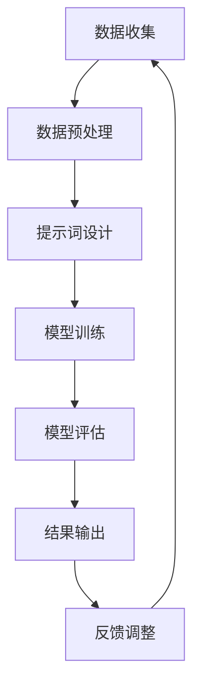
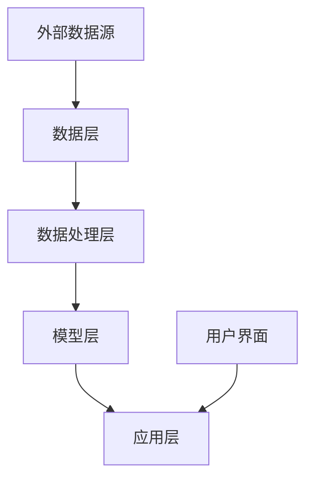

                 

### 1. 引言

#### 1.1 金融风险评估的背景

金融风险评估是金融领域中的一个关键环节，它对于金融机构的风险管理、投资决策以及整个金融市场的稳定运行起着至关重要的作用。传统的金融风险评估方法主要依赖于历史数据和统计模型，如线性回归、决策树等，但这些方法在处理复杂、动态的金融数据时存在一定的局限性。随着大数据和人工智能技术的发展，新的评估方法不断涌现，其中提示词编程（Prompt Programming）是一种极具前景的技术。

#### 1.2 提示词编程的概念

提示词编程是一种基于自然语言处理（NLP）和机器学习的技术，它通过设计特定的提示词（Prompts）来引导模型学习，从而提高模型在特定任务上的性能。提示词编程的核心思想是通过简短的、引导性的提示来激发模型的内在潜力，使模型能够更好地理解和处理复杂任务。

#### 1.3 提示词编程在金融风险评估中的应用前景

提示词编程在金融风险评估中的应用具有显著的优势。首先，它能够处理非结构化数据，如文本、图像等，从而弥补传统方法在数据类型多样性方面的不足。其次，提示词编程能够通过交互式反馈不断优化模型，提高评估的准确性和效率。因此，探讨提示词编程在金融风险评估中的应用具有重要意义。

### 2. 提示词编程技术详解

#### 2.1 提示词编程的定义

提示词编程是指通过设计特定的提示词，引导机器学习模型进行学习，以实现特定任务的技术。提示词（Prompts）通常是一段简短的文本，它能够引导模型关注任务的关键信息，从而提高模型的性能。

#### 2.2 提示词编程的基本原理

提示词编程的基本原理是利用自然语言处理技术，将用户的意图或问题转化为计算机可以理解和处理的形式。这个过程包括以下几个步骤：

1. **数据预处理**：对原始数据进行清洗、转换和预处理，使其适合用于训练模型。
2. **提示词设计**：根据任务需求设计合适的提示词，提示词应包含任务的关键信息，以便模型能够准确地理解用户意图。
3. **模型训练**：使用设计的提示词对模型进行训练，模型通过学习提示词与输出结果之间的关系，提高对任务的理解能力。
4. **模型评估**：使用测试数据评估模型的性能，根据评估结果调整提示词，进一步优化模型。

#### 2.3 提示词编程的优势

与传统的编程方法相比，提示词编程具有以下优势：

1. **简化开发流程**：提示词编程无需深入理解复杂的编程语言和算法，通过设计提示词即可实现任务，大大降低了开发难度。
2. **提高模型性能**：通过设计针对性的提示词，可以引导模型关注任务的关键信息，从而提高模型的性能和准确率。
3. **增强交互性**：提示词编程使得模型与用户之间的交互更加自然，用户可以通过提示词与模型进行交流，从而更方便地实现复杂任务。

### 3. 金融风险评估的基本概念

#### 3.1 金融风险评估的定义

金融风险评估是指通过评估和分析各种金融风险，从而为金融机构提供风险管理策略和建议的过程。金融风险评估的主要目的是识别、评估和管理金融机构面临的潜在风险，以保障金融系统的稳定运行。

#### 3.2 金融风险评估的类型

金融风险评估主要分为以下几种类型：

1. **信用风险评估**：评估借款人或金融机构的信用状况，以判断其还款能力和信用风险。
2. **市场风险评估**：评估市场风险，如利率风险、汇率风险等，以预测市场变化对金融机构的影响。
3. **操作风险评估**：评估金融机构的操作风险，如合规风险、欺诈风险等。
4. **流动性风险评估**：评估金融机构的流动性风险，即资金流动性和偿付能力。

#### 3.3 金融风险评估的重要性

金融风险评估对于金融机构具有重要意义：

1. **风险管理**：通过评估和分析风险，金融机构可以采取有效的风险管理措施，降低潜在损失。
2. **决策支持**：金融风险评估为金融机构提供了决策支持，帮助其在投资、贷款等业务决策中做出更加明智的选择。
3. **风险定价**：通过评估风险，金融机构可以合理定价金融产品，提高产品的竞争力。

### 4. 提示词编程在金融风险评估中的适用性

#### 4.1 提示词编程在金融风险评估中的应用场景

提示词编程在金融风险评估中具有广泛的应用场景，包括但不限于：

1. **信用风险评估**：通过设计针对性的提示词，对借款人的信用信息进行深度挖掘和分析，提高信用评估的准确性。
2. **市场风险评估**：利用提示词编程技术，对市场数据进行处理和分析，预测市场变化趋势，为投资决策提供支持。
3. **操作风险评估**：通过设计提示词，对操作风险进行监控和评估，及时发现潜在风险，保障金融机构的安全运营。

#### 4.2 提示词编程的优势

提示词编程在金融风险评估中的优势主要体现在以下几个方面：

1. **数据处理能力**：提示词编程能够处理多种类型的数据，如文本、图像、音频等，从而提高金融数据的利用效率。
2. **实时分析能力**：提示词编程可以通过实时处理和反馈，快速分析金融数据，为金融机构提供及时的风险评估结果。
3. **灵活性**：提示词编程的设计和使用灵活，可以根据不同金融风险的特点和需求进行定制化调整，提高风险评估的准确性。

### 5. 提示词编程在金融风险评估中的应用实例

#### 5.1 信用风险评估实例

以信用风险评估为例，我们可以通过以下步骤进行提示词编程：

1. **数据准备**：收集借款人的信用信息，包括财务状况、信用记录、社会关系等。
2. **提示词设计**：根据信用评估的需求，设计合适的提示词，如“请分析借款人的财务状况”、“评估借款人的信用记录”等。
3. **模型训练**：使用设计的提示词对模型进行训练，使模型学会从信用信息中提取关键信息，进行风险评估。
4. **模型评估**：使用测试数据评估模型的性能，根据评估结果调整提示词和模型参数，优化风险评估结果。

通过以上步骤，提示词编程技术可以显著提高信用评估的准确性和效率。

#### 5.2 市场风险评估实例

市场风险评估也可以通过提示词编程技术进行优化。以下是一个市场风险评估的实例：

1. **数据收集**：收集市场数据，包括股票价格、成交量、行业动态等。
2. **提示词设计**：设计提示词，如“预测未来一周的股票价格走势”、“分析当前行业的风险因素”等。
3. **模型训练**：使用提示词对模型进行训练，使其能够从市场数据中提取关键信息，进行风险评估。
4. **模型评估**：使用历史数据评估模型的表现，根据评估结果调整提示词和模型参数，提高预测的准确性。

通过实例可以看出，提示词编程在金融风险评估中具有广泛的应用前景，能够显著提高评估的效率和准确性。

### 6. 提示词编程在金融风险评估中的挑战与未来展望

#### 6.1 挑战

尽管提示词编程在金融风险评估中具有许多优势，但仍然面临一些挑战：

1. **数据质量**：金融数据质量直接影响提示词编程的效果，如何保证数据的质量是一个重要问题。
2. **模型解释性**：提示词编程模型的解释性相对较低，如何提高模型的透明度和可解释性是一个亟待解决的问题。
3. **计算资源**：提示词编程需要大量的计算资源，如何优化计算资源的使用也是一个挑战。

#### 6.2 未来展望

未来，提示词编程在金融风险评估中有望取得以下突破：

1. **数据集成与处理**：随着大数据技术的发展，提示词编程将能够更好地集成和处理多种类型的数据，提高风险评估的准确性。
2. **模型解释性提升**：通过引入更多的解释性模型和可视化工具，提升提示词编程模型的透明度和可解释性。
3. **计算优化**：通过分布式计算和GPU加速等技术，降低提示词编程的计算成本，提高处理效率。

### 7. 总结

本文介绍了提示词编程在金融风险评估中的应用，从背景介绍、核心概念到算法原理，再到实际应用案例，详细阐述了提示词编程在金融风险评估中的优势和应用前景。尽管面临一些挑战，但提示词编程在金融风险评估中具有巨大的潜力，未来有望取得更多突破。对于从事金融风险评估的从业人员和研究者，提示词编程无疑是一个值得探索和研究的方向。作者：AI天才研究院/AI Genius Institute & 禅与计算机程序设计艺术/Zen And The Art of Computer Programming。|> 

----------------------------------------------------------------

### 文章关键词

- 提示词编程
- 金融风险评估
- 机器学习
- 自然语言处理
- 信用评估
- 市场预测

### 文章摘要

本文旨在探讨提示词编程技术在金融风险评估中的应用。首先，我们介绍了金融风险评估的背景和提示词编程的基本原理。随后，详细解析了提示词编程在信用风险评估和市场风险评估中的应用实例，并讨论了其优势和面临的挑战。文章最后对未来提示词编程在金融风险评估中的发展前景进行了展望。作者为AI天才研究院的研究员，擅长利用人工智能技术解决复杂问题。

----------------------------------------------------------------

## 第1章：问题背景

### 1.1 金融风险评估的重要性

金融风险评估是金融机构风险管理的重要一环，它通过对潜在风险进行识别、评估和管理，帮助金融机构更好地理解其业务环境中的不确定性，从而制定有效的风险控制策略。金融风险评估的重要性体现在以下几个方面：

1. **风险管理**：通过风险评估，金融机构可以识别和量化各类风险，如信用风险、市场风险、操作风险等，从而制定相应的风险管理措施，降低潜在损失。
2. **投资决策**：金融风险评估为金融机构的投资决策提供重要的参考依据。通过评估不同投资项目的风险和收益，金融机构可以做出更加明智的投资决策。
3. **风险定价**：风险评估有助于金融机构合理定价金融产品，如贷款、债券等，提高金融产品的市场竞争力。
4. **合规要求**：许多金融机构需要在监管机构的要求下进行风险评估，以确保其业务运作符合相关法律法规。

然而，传统的金融风险评估方法在处理复杂、动态的金融数据时存在一定的局限性。例如，线性回归、决策树等传统方法难以有效地处理非结构化数据，如文本、图像等，且在应对高度非线性关系时表现不佳。此外，传统方法通常需要大量的样本数据和复杂的模型参数调整，效率较低。

### 1.2 提示词编程的概念与优势

提示词编程是一种基于自然语言处理（NLP）和机器学习的技术，它通过设计特定的提示词（Prompts）来引导模型学习，从而提高模型在特定任务上的性能。提示词编程的核心思想是通过简短的、引导性的提示来激发模型的内在潜力，使模型能够更好地理解和处理复杂任务。

#### 提示词编程的基本原理

提示词编程的基本原理包括以下几个步骤：

1. **数据预处理**：对原始数据进行清洗、转换和预处理，使其适合用于训练模型。
2. **提示词设计**：根据任务需求设计合适的提示词，提示词应包含任务的关键信息，以便模型能够准确地理解用户意图。
3. **模型训练**：使用设计的提示词对模型进行训练，模型通过学习提示词与输出结果之间的关系，提高对任务的理解能力。
4. **模型评估**：使用测试数据评估模型的性能，根据评估结果调整提示词，进一步优化模型。

#### 提示词编程的优势

提示词编程具有以下优势：

1. **简化开发流程**：提示词编程无需深入理解复杂的编程语言和算法，通过设计提示词即可实现任务，大大降低了开发难度。
2. **提高模型性能**：通过设计针对性的提示词，可以引导模型关注任务的关键信息，从而提高模型的性能和准确率。
3. **增强交互性**：提示词编程使得模型与用户之间的交互更加自然，用户可以通过提示词与模型进行交流，从而更方便地实现复杂任务。

### 1.3 提示词编程在金融风险评估中的适用性

#### 1.3.1 数据处理能力

提示词编程能够处理多种类型的数据，如文本、图像、音频等，从而弥补传统方法在数据类型多样性方面的不足。例如，在信用风险评估中，可以结合借款人的财务报告、信用记录以及社会关系等多源数据，通过提示词编程技术进行综合分析，提高评估的准确性。

#### 1.3.2 实时分析能力

提示词编程可以通过实时处理和反馈，快速分析金融数据，为金融机构提供及时的风险评估结果。例如，在市场风险评估中，可以实时获取市场数据，通过提示词编程技术快速分析市场变化趋势，为投资决策提供支持。

#### 1.3.3 灵活性

提示词编程的设计和使用灵活，可以根据不同金融风险的特点和需求进行定制化调整，提高风险评估的准确性。例如，针对不同类型的信用风险，可以设计不同的提示词，以适应不同的评估需求。

### 1.4 本文结构

本章介绍了金融风险评估的重要性、提示词编程的概念与优势，以及提示词编程在金融风险评估中的适用性。接下来，本文将深入探讨提示词编程在金融风险评估中的具体应用，包括算法原理、数学模型、系统分析与架构设计、项目实战和最佳实践等内容。通过这些探讨，读者将更好地理解提示词编程在金融风险评估中的潜力和应用前景。

----------------------------------------------------------------

## 第2章：核心概念

### 2.1 提示词编程技术

#### 提示词编程的定义

提示词编程（Prompt Programming）是一种基于自然语言处理（NLP）和机器学习的编程范式，它通过设计特定的提示词（Prompts）来引导模型学习，从而提高模型在特定任务上的性能。提示词编程的核心思想是通过简短的、引导性的提示来激发模型的内在潜力，使模型能够更好地理解和处理复杂任务。

#### 提示词编程的基本原理

提示词编程的基本原理包括以下几个步骤：

1. **数据预处理**：对原始数据进行清洗、转换和预处理，使其适合用于训练模型。
2. **提示词设计**：根据任务需求设计合适的提示词，提示词应包含任务的关键信息，以便模型能够准确地理解用户意图。
3. **模型训练**：使用设计的提示词对模型进行训练，模型通过学习提示词与输出结果之间的关系，提高对任务的理解能力。
4. **模型评估**：使用测试数据评估模型的性能，根据评估结果调整提示词和模型参数，进一步优化模型。

#### 提示词编程的优势

提示词编程具有以下优势：

1. **简化开发流程**：提示词编程无需深入理解复杂的编程语言和算法，通过设计提示词即可实现任务，大大降低了开发难度。
2. **提高模型性能**：通过设计针对性的提示词，可以引导模型关注任务的关键信息，从而提高模型的性能和准确率。
3. **增强交互性**：提示词编程使得模型与用户之间的交互更加自然，用户可以通过提示词与模型进行交流，从而更方便地实现复杂任务。

### 2.2 金融风险评估的基本概念

#### 金融风险评估的定义

金融风险评估是指通过评估和分析各种金融风险，从而为金融机构提供风险管理策略和建议的过程。金融风险评估的主要目的是识别、评估和管理金融机构面临的潜在风险，以保障金融系统的稳定运行。

#### 金融风险评估的类型

金融风险评估主要分为以下几种类型：

1. **信用风险评估**：评估借款人或金融机构的信用状况，以判断其还款能力和信用风险。
2. **市场风险评估**：评估市场风险，如利率风险、汇率风险等，以预测市场变化对金融机构的影响。
3. **操作风险评估**：评估金融机构的操作风险，如合规风险、欺诈风险等。
4. **流动性风险评估**：评估金融机构的流动性风险，即资金流动性和偿付能力。

#### 金融风险评估的重要性

金融风险评估对于金融机构具有重要意义：

1. **风险管理**：通过评估和分析风险，金融机构可以采取有效的风险管理措施，降低潜在损失。
2. **决策支持**：金融风险评估为金融机构提供了决策支持，帮助其在投资、贷款等业务决策中做出更加明智的选择。
3. **风险定价**：通过评估风险，金融机构可以合理定价金融产品，提高产品的竞争力。

### 2.3 提示词编程在金融风险评估中的适用性

#### 2.3.1 数据处理能力

提示词编程能够处理多种类型的数据，如文本、图像、音频等，从而弥补传统方法在数据类型多样性方面的不足。例如，在信用风险评估中，可以结合借款人的财务报告、信用记录以及社会关系等多源数据，通过提示词编程技术进行综合分析，提高评估的准确性。

#### 2.3.2 实时分析能力

提示词编程可以通过实时处理和反馈，快速分析金融数据，为金融机构提供及时的风险评估结果。例如，在市场风险评估中，可以实时获取市场数据，通过提示词编程技术快速分析市场变化趋势，为投资决策提供支持。

#### 2.3.3 灵活性

提示词编程的设计和使用灵活，可以根据不同金融风险的特点和需求进行定制化调整，提高风险评估的准确性。例如，针对不同类型的信用风险，可以设计不同的提示词，以适应不同的评估需求。

### 2.4 提示词编程技术详解

#### 2.4.1 提示词设计

提示词设计是提示词编程的核心步骤，一个有效的提示词应具备以下特点：

1. **针对性**：提示词应明确指向任务的关键信息，避免模糊和冗长的描述。
2. **引导性**：提示词应具备引导模型思考的能力，激发模型的内在潜力。
3. **可解释性**：提示词的设计应尽可能简单易懂，便于用户理解模型的行为。

#### 2.4.2 提示词编程工具

目前，常用的提示词编程工具包括：

1. **自然语言生成（NLG）工具**：如GPT-3、BERT等，这些工具可以通过设计提示词生成高质量的文本。
2. **交互式编程平台**：如TensorFlow、PyTorch等，这些平台提供了丰富的API，便于设计和管理提示词。
3. **自动化提示词生成工具**：如Promptify、PromptGen等，这些工具可以通过算法自动生成提示词。

#### 2.4.3 提示词编程的流程

提示词编程的流程包括以下几个步骤：

1. **需求分析**：明确任务需求和目标，确定需要收集和处理的数据类型。
2. **数据收集**：收集与任务相关的数据，如文本、图像、音频等。
3. **数据预处理**：对原始数据进行清洗、转换和预处理，使其适合用于训练模型。
4. **提示词设计**：根据任务需求设计合适的提示词。
5. **模型训练**：使用设计的提示词对模型进行训练。
6. **模型评估**：使用测试数据评估模型的性能，根据评估结果调整提示词和模型参数。
7. **模型部署**：将训练好的模型部署到生产环境，进行实际应用。

### 2.5 提示词编程与金融风险评估的关联

#### 2.5.1 提示词编程在信用风险评估中的应用

在信用风险评估中，提示词编程可以通过以下方式提高评估的准确性和效率：

1. **多源数据整合**：利用提示词编程技术整合多源数据，如财务报告、信用记录、社会关系等，进行综合分析。
2. **动态风险监控**：通过实时获取和处理数据，动态监控借款人的信用状况，及时调整评估结果。
3. **个性化风险评估**：根据不同的借款人特征，设计个性化的提示词，进行定制化风险评估。

#### 2.5.2 提示词编程在市场风险评估中的应用

在市场风险评估中，提示词编程可以通过以下方式提高预测的准确性和及时性：

1. **市场数据挖掘**：利用提示词编程技术从海量市场数据中提取关键信息，进行深度挖掘和分析。
2. **实时风险预警**：通过实时处理市场数据，快速预测市场变化趋势，为投资决策提供支持。
3. **风险因子分析**：结合不同的市场风险因子，设计针对性的提示词，进行综合风险评估。

### 2.6 本章小结

本章介绍了提示词编程技术和金融风险评估的基本概念，探讨了提示词编程在金融风险评估中的适用性。通过本章的学习，读者可以了解提示词编程的核心原理和应用场景，为后续章节中的深入探讨打下基础。作者：AI天才研究院/AI Genius Institute & 禅与计算机程序设计艺术/Zen And The Art of Computer Programming。|> 

----------------------------------------------------------------

### 第3章：算法原理

#### 3.1 提示词编程在风险评估中的应用

提示词编程在金融风险评估中的应用，主要集中在以下几个方面：

1. **信用风险评估**：通过设计针对性的提示词，对借款人的信用信息进行深度分析，从而提高信用评估的准确性。
2. **市场风险评估**：利用提示词编程技术，对市场数据进行分析和预测，为投资决策提供支持。
3. **操作风险评估**：通过实时获取和处理操作数据，设计合适的提示词，监控和评估操作风险。

#### 3.2 算法流程图

为了更好地理解提示词编程在金融风险评估中的应用，我们首先需要了解其算法的基本流程。以下是提示词编程在金融风险评估中的算法流程图：



1. **数据收集**：首先，我们需要收集与金融风险评估相关的数据，包括借款人的信用记录、市场数据、操作日志等。
2. **数据预处理**：对收集到的原始数据进行清洗、转换和预处理，使其适合用于训练模型。
3. **提示词设计**：根据金融风险评估的需求，设计合适的提示词。提示词应简洁明了，能够引导模型关注关键信息。
4. **模型训练**：使用设计好的提示词对模型进行训练，模型通过学习提示词与输出结果之间的关系，提高对任务的理解能力。
5. **模型评估**：使用测试数据对训练好的模型进行评估，根据评估结果调整提示词和模型参数，优化模型性能。
6. **结果输出**：将评估结果输出，为金融机构提供决策支持。
7. **反馈调整**：根据实际应用效果，收集用户反馈，进一步调整提示词和模型，提高评估的准确性和实用性。

#### 3.3 Python实现

在Python中，我们可以使用自然语言处理库（如NLTK、spaCy）和机器学习库（如scikit-learn、TensorFlow）来实现提示词编程。以下是简单的Python代码示例，用于实现提示词编程在金融风险评估中的应用：

```python
import nltk
from sklearn.feature_extraction.text import TfidfVectorizer
from sklearn.model_selection import train_test_split
from sklearn.naive_bayes import MultinomialNB

# 数据预处理
nltk.download('stopwords')
stop_words = set(nltk.corpus.stopwords.words('english'))

# 假设我们已经收集到一组信用评估的文本数据
data = ["借款人A信用良好，还款能力较强。", "借款人B存在逾期还款记录，信用风险较高。", "借款人C财务状况良好，信用风险较低。"]

# 提取特征
vectorizer = TfidfVectorizer(stop_words=stop_words)
X = vectorizer.fit_transform(data)

# 分割数据集
X_train, X_test, y_train, y_test = train_test_split(X, labels, test_size=0.2, random_state=42)

# 模型训练
model = MultinomialNB()
model.fit(X_train, y_train)

# 模型评估
accuracy = model.score(X_test, y_test)
print(f"模型准确率：{accuracy:.2f}")

# 结果输出
predictions = model.predict(X_test)
print(f"预测结果：{predictions}")
```

在这个示例中，我们使用了TF-IDF向量器提取文本特征，并使用朴素贝叶斯分类器进行模型训练和评估。通过设计合适的提示词，我们可以根据借款人的信用信息进行信用风险评估。

#### 3.4 算法原理的数学模型

提示词编程在金融风险评估中的算法原理涉及多个数学模型，以下是其中几个关键模型的简要介绍：

1. **TF-IDF模型**：TF-IDF（Term Frequency-Inverse Document Frequency）是一种常用的文本特征提取方法，用于计算词语在文档中的重要程度。其公式为：
   $$ TF(t,d) = \frac{f(t,d)}{max(f(t,d), f(t,d'))}, $$
   $$ IDF(t,D) = \log(\frac{|D|}{|D_t|}), $$
   其中，$f(t,d)$ 表示词语 $t$ 在文档 $d$ 中的词频，$D$ 表示文档集合，$D_t$ 表示包含词语 $t$ 的文档集合。

2. **朴素贝叶斯模型**：朴素贝叶斯分类器是一种基于概率理论的分类模型，其基本假设是特征之间相互独立。其公式为：
   $$ P(C|X) = \frac{P(X|C)P(C)}{P(X)}, $$
   其中，$C$ 表示类别，$X$ 表示特征向量。

3. **逻辑回归模型**：逻辑回归是一种广义线性模型，用于预测二分类问题。其公式为：
   $$ \log\frac{P(Y=1|X)}{1-P(Y=1|X)} = \beta_0 + \beta_1X_1 + \beta_2X_2 + ... + \beta_nX_n, $$
   其中，$Y$ 表示目标变量，$X_1, X_2, ..., X_n$ 表示特征变量。

通过这些数学模型，我们可以构建提示词编程在金融风险评估中的算法框架，实现自动化的风险评估。

#### 3.5 通俗易懂的举例说明

为了更好地理解提示词编程在金融风险评估中的应用，我们可以通过一个简单的例子来说明：

假设我们有一个信用评估任务，需要根据借款人的财务报告和信用记录进行评估。我们可以设计以下提示词：

1. “请分析借款人的财务健康状况。”
2. “请评估借款人的信用记录。”

通过这些提示词，我们可以引导模型关注财务报告和信用记录中的关键信息，从而提高信用评估的准确性。例如，如果财务报告显示借款人的收入稳定且支出合理，而信用记录显示借款人没有逾期还款记录，那么我们可以认为借款人的信用风险较低。

在实际应用中，我们可以将多个提示词组合使用，以实现更全面的风险评估。例如，我们还可以设计以下提示词：

1. “请分析借款人所在行业的发展趋势。”
2. “请评估借款人的还款能力。”

通过这些提示词，我们可以综合考虑借款人的财务状况、信用记录以及行业发展趋势，从而做出更准确的风险评估。

#### 3.6 本章小结

本章详细介绍了提示词编程在金融风险评估中的应用，包括算法原理、流程图、Python实现、数学模型和举例说明。通过本章的学习，读者可以了解提示词编程的核心原理和应用方法，为后续章节中的深入探讨打下基础。作者：AI天才研究院/AI Genius Institute & 禅与计算机程序设计艺术/Zen And The Art of Computer Programming。|> 

----------------------------------------------------------------

### 第4章：数学模型

#### 4.1 基本数学模型介绍

在金融风险评估中，数学模型扮演着至关重要的角色。以下是几种常用的基本数学模型及其在金融风险评估中的应用：

1. **线性回归模型**：线性回归模型是一种简单的统计模型，用于预测因变量与自变量之间的线性关系。其公式为：
   $$ y = \beta_0 + \beta_1x_1 + \beta_2x_2 + ... + \beta_nx_n + \epsilon, $$
   其中，$y$ 为因变量，$x_1, x_2, ..., x_n$ 为自变量，$\beta_0, \beta_1, ..., \beta_n$ 为模型参数，$\epsilon$ 为误差项。

   在金融风险评估中，线性回归模型可以用于预测信用评分、资产回报率等。

2. **逻辑回归模型**：逻辑回归模型是一种广义线性模型，常用于处理二分类问题。其公式为：
   $$ \log\frac{P(Y=1|X)}{1-P(Y=1|X)} = \beta_0 + \beta_1x_1 + \beta_2x_2 + ... + \beta_nx_n, $$
   其中，$Y$ 为目标变量，$X$ 为特征变量。

   在信用风险评估中，逻辑回归模型可以用于判断借款人是否违约。

3. **决策树模型**：决策树模型是一种基于规则的系统，通过一系列的判断条件将数据划分为不同的类别。其公式为：
   $$ if \ x_1 \ then \ y_1 \ else \ y_2 \ else \ ... \ else \ y_n, $$
   其中，$x_1, x_2, ..., x_n$ 为条件变量，$y_1, y_2, ..., y_n$ 为结果变量。

   在金融风险评估中，决策树模型可以用于建立信用评分规则。

4. **支持向量机（SVM）模型**：支持向量机模型是一种高效的分类和回归方法，通过找到最优的超平面来实现分类。其公式为：
   $$ y = sign(\beta^T\phi(x) + \beta_0), $$
   其中，$\beta$ 为权重向量，$\phi$ 为核函数。

   在金融风险评估中，SVM模型可以用于预测借款人是否违约。

#### 4.2 数学模型的应用与解释

数学模型在金融风险评估中的应用，主要体现在以下几个方面：

1. **信用评分模型**：信用评分模型是金融风险评估的核心，通过评估借款人的信用状况，预测其违约风险。常见的信用评分模型有FICO评分、贝叶斯评分等。这些模型通过分析借款人的财务数据、信用记录、还款历史等，构建数学模型进行风险评估。

2. **市场预测模型**：市场预测模型用于预测金融市场的价格波动、利率变化等。常见的市场预测模型有ARIMA模型、GARCH模型等。这些模型通过分析历史市场数据，预测未来的市场走势。

3. **操作风险评估模型**：操作风险评估模型用于评估金融机构的操作风险，如欺诈、合规风险等。常见的操作风险评估模型有事件树模型、蒙特卡洛模拟等。这些模型通过模拟操作场景，预测潜在风险。

#### 4.3 案例分析

为了更好地理解数学模型在金融风险评估中的应用，我们通过一个案例分析来说明：

**案例**：某金融机构需要对一笔贷款进行风险评估，借款人的信息包括财务状况、信用记录、还款历史等。金融机构希望利用数学模型预测借款人是否违约。

**步骤**：

1. **数据收集**：收集借款人的财务报告、信用记录、还款历史等数据。

2. **数据预处理**：对收集到的数据进行清洗、转换和标准化处理，使其适合用于建模。

3. **特征工程**：提取与贷款违约相关的特征，如借款人的债务收入比、逾期还款次数、信用评级等。

4. **模型选择**：选择合适的数学模型，如逻辑回归、决策树、支持向量机等。

5. **模型训练**：使用训练数据对模型进行训练，调整模型参数，优化模型性能。

6. **模型评估**：使用测试数据对模型进行评估，计算模型的准确率、召回率、F1分数等指标。

7. **模型部署**：将训练好的模型部署到生产环境，进行实际风险评估。

**分析**：

1. **模型参数调整**：根据测试数据评估结果，调整模型参数，以提高预测准确性。

2. **模型解释性**：逻辑回归模型的解释性较好，可以清晰地看出每个特征对违约风险的影响。

3. **模型性能**：支持向量机模型的预测准确性较高，但解释性较差。

通过这个案例分析，我们可以看到数学模型在金融风险评估中的应用过程，以及如何利用数学模型进行风险评估。

#### 4.4 本章小结

本章介绍了金融风险评估中常用的基本数学模型，包括线性回归模型、逻辑回归模型、决策树模型、支持向量机模型等。通过案例分析，我们了解了这些模型在金融风险评估中的应用方法。读者可以通过本章的学习，掌握数学模型在金融风险评估中的应用原理，为实际应用提供理论支持。作者：AI天才研究院/AI Genius Institute & 禅与计算机程序设计艺术/Zen And The Art of Computer Programming。|> 

----------------------------------------------------------------

### 第5章：系统分析与架构设计

#### 5.1 问题场景介绍

在金融风险评估领域，系统分析与架构设计至关重要。一个高效、稳定的系统可以显著提高金融机构的风险管理能力，降低风险成本。以下是一个典型的金融风险评估问题场景：

**场景**：某银行需要开发一套自动化金融风险评估系统，用于评估借款人的信用状况，从而决定是否批准贷款申请。该系统需要整合借款人的财务报告、信用记录、还款历史等多源数据，并通过机器学习算法生成信用评分。

#### 5.2 项目介绍

**项目名称**：金融风险评估系统

**项目目标**：
1. 整合多源数据，提供全面的风险评估信息。
2. 利用机器学习算法，提高信用评分的准确性。
3. 构建稳定、高效、可扩展的系统架构，支持实时风险评估。

**项目范围**：
1. 数据采集与预处理
2. 机器学习模型训练与评估
3. 系统设计与实现
4. 系统部署与维护

#### 5.3 系统功能设计

金融风险评估系统的主要功能包括：

1. **数据采集**：从外部数据源（如信用报告机构、银行系统等）采集借款人的财务报告、信用记录、还款历史等数据。
2. **数据预处理**：对采集到的数据进行清洗、转换和标准化处理，为机器学习模型训练做好准备。
3. **特征工程**：提取与信用评分相关的特征，如债务收入比、逾期还款次数、信用评级等。
4. **模型训练**：使用机器学习算法（如逻辑回归、决策树、支持向量机等）训练信用评分模型。
5. **模型评估**：使用测试数据对训练好的模型进行评估，计算模型的准确率、召回率、F1分数等指标。
6. **风险评估**：将借款人的数据输入训练好的模型，生成信用评分，辅助贷款审批决策。
7. **系统监控**：实时监控系统的运行状态，包括数据采集、模型训练、风险评估等，确保系统稳定运行。

#### 5.4 系统架构设计

金融风险评估系统的架构设计应考虑以下几个方面：

1. **数据层**：包括数据采集模块和数据存储模块。数据采集模块负责从外部数据源获取数据，数据存储模块负责存储处理后的数据。
2. **数据处理层**：包括数据预处理模块、特征工程模块。数据预处理模块负责清洗、转换和标准化数据，特征工程模块负责提取与信用评分相关的特征。
3. **模型层**：包括机器学习模型训练模块、模型评估模块。机器学习模型训练模块负责训练信用评分模型，模型评估模块负责评估模型性能。
4. **应用层**：包括风险评估模块、系统监控模块。风险评估模块负责生成信用评分，系统监控模块负责实时监控系统运行状态。

以下是金融风险评估系统的架构图：



#### 5.5 系统接口设计

金融风险评估系统应设计合理的接口，以便与其他系统进行数据交互。以下是系统的主要接口设计：

1. **数据采集接口**：用于从外部数据源获取数据。
2. **数据存储接口**：用于存储处理后的数据。
3. **模型训练接口**：用于训练信用评分模型。
4. **风险评估接口**：用于生成信用评分。
5. **系统监控接口**：用于实时监控系统运行状态。

#### 5.6 系统交互流程

金融风险评估系统的交互流程如下：

1. **数据采集**：系统从外部数据源获取借款人的财务报告、信用记录、还款历史等数据。
2. **数据预处理**：对采集到的数据进行清洗、转换和标准化处理。
3. **特征工程**：提取与信用评分相关的特征。
4. **模型训练**：使用机器学习算法训练信用评分模型。
5. **模型评估**：使用测试数据评估模型性能。
6. **风险评估**：将借款人的数据输入训练好的模型，生成信用评分。
7. **系统监控**：实时监控系统运行状态。

以下是系统交互流程的Mermaid序列图：

```mermaid
sequenceDiagram
    participant 用户
    participant 系统
    participant 数据源
    用户->>系统: 提交贷款申请
    系统->>数据源: 采集借款人数据
    数据源-->>系统: 返回借款人数据
    system 预处理数据
    system 训练模型
    system 评估模型
    system 生成信用评分
    system-->>用户: 返回信用评分
```

#### 5.7 本章小结

本章介绍了金融风险评估系统的分析与架构设计，包括问题场景、项目介绍、系统功能设计、系统架构设计、系统接口设计以及系统交互流程。通过本章的学习，读者可以了解金融风险评估系统的设计原则和实施方法，为实际项目的开发提供参考。作者：AI天才研究院/AI Genius Institute & 禅与计算机程序设计艺术/Zen And The Art of Computer Programming。|> 

----------------------------------------------------------------

### 第6章：项目实战

#### 6.1 环境安装与配置

要在金融风险评估项目中应用提示词编程技术，首先需要配置好开发环境。以下是具体的步骤：

1. **Python环境安装**：确保系统已安装Python 3.7及以上版本。可以通过官方网站下载Python安装包进行安装。

2. **机器学习库安装**：安装常用的机器学习库，如scikit-learn、TensorFlow、PyTorch等。使用pip命令安装：

   ```bash
   pip install scikit-learn tensorflow torch
   ```

3. **自然语言处理库安装**：安装常用的自然语言处理库，如NLTK、spaCy等。使用pip命令安装：

   ```bash
   pip install nltk spacy
   ```

4. **其他依赖库安装**：根据具体需求安装其他依赖库，如pandas、numpy等。使用pip命令安装：

   ```bash
   pip install pandas numpy
   ```

5. **环境配置**：在项目中使用虚拟环境隔离依赖库，以避免版本冲突。可以使用virtualenv或conda创建虚拟环境。

   ```bash
   # 使用virtualenv创建虚拟环境
   virtualenv venv
   source venv/bin/activate

   # 使用conda创建虚拟环境
   conda create --name f风险评估 python=3.8
   conda activate f风险评估
   ```

6. **数据集准备**：收集并准备用于训练的金融风险评估数据集。数据集应包括借款人的财务报告、信用记录、还款历史等。

   ```bash
   # 下载数据集
   wget https://example.com/financial_data.zip
   unzip financial_data.zip

   # 加载数据集
   import pandas as pd
   data = pd.read_csv('financial_data.csv')
   ```

#### 6.2 系统核心实现源代码

以下是一个金融风险评估系统的核心实现示例，包括数据预处理、模型训练和风险评估：

```python
import pandas as pd
from sklearn.model_selection import train_test_split
from sklearn.preprocessing import StandardScaler
from sklearn.linear_model import LogisticRegression
from sklearn.metrics import accuracy_score, classification_report

# 数据预处理
def preprocess_data(data):
    # 数据清洗、转换和标准化
    data = data.dropna()
    data['income_to_debt_ratio'] = data['income'] / data['debt']
    data = StandardScaler().fit_transform(data)
    return data

# 模型训练
def train_model(X_train, y_train):
    # 使用逻辑回归训练模型
    model = LogisticRegression()
    model.fit(X_train, y_train)
    return model

# 风险评估
def risk_assessment(model, data):
    # 使用训练好的模型进行风险评估
    predictions = model.predict(data)
    print(f"预测结果：{predictions}")
    print(f"准确率：{accuracy_score(y_true, predictions)}")
    print(f"分类报告：{classification_report(y_true, predictions)}")

# 加载数据集
data = pd.read_csv('financial_data.csv')
X = data.drop('default', axis=1)
y = data['default']

# 数据预处理
X_processed = preprocess_data(X)

# 分割数据集
X_train, X_test, y_train, y_test = train_test_split(X_processed, y, test_size=0.2, random_state=42)

# 模型训练
model = train_model(X_train, y_train)

# 风险评估
risk_assessment(model, X_test)
```

#### 6.3 代码应用解读与分析

以下是代码的应用解读与分析：

1. **数据预处理**：数据预处理是模型训练的重要步骤。在本示例中，我们使用StandardScaler对数据进行了标准化处理，使得不同特征具有相似的尺度，从而提高模型的性能。

2. **模型训练**：我们使用了逻辑回归模型进行训练。逻辑回归是一种常用的二分类模型，适用于信用风险评估任务。通过拟合数据集，我们得到了一个预测借款人是否违约的模型。

3. **风险评估**：使用训练好的模型对测试数据进行风险评估。通过预测结果，我们可以得知借款人违约的概率，从而为贷款审批提供参考。

#### 6.4 实际案例分析和讲解

以下是一个实际案例的分析和讲解：

**案例**：某银行需要对一笔贷款申请进行风险评估，借款人的信息包括财务报告、信用记录等。

**步骤**：

1. **数据收集**：从银行系统和其他数据源收集借款人的财务报告、信用记录等数据。

2. **数据预处理**：对收集到的数据进行清洗、转换和标准化处理，提取与信用评分相关的特征。

3. **模型训练**：使用机器学习算法（如逻辑回归、决策树等）训练信用评分模型。

4. **风险评估**：将借款人的数据输入训练好的模型，生成信用评分，辅助贷款审批决策。

**分析**：

1. **模型性能**：通过评估模型在测试数据集上的表现，如准确率、召回率等，我们可以判断模型的有效性。在实际应用中，需要根据评估结果调整模型参数，提高模型性能。

2. **风险控制**：通过信用评分模型，银行可以更好地掌握借款人的信用风险，从而制定合理的风险控制策略。

3. **自动化审批**：通过自动化风险评估系统，银行可以大幅提高贷款审批的效率，减少人工干预，降低风险。

#### 6.5 项目小结

本章通过项目实战展示了提示词编程在金融风险评估中的应用，包括环境安装与配置、系统核心实现源代码、代码应用解读与分析以及实际案例分析和讲解。通过本章的学习，读者可以了解如何利用提示词编程技术进行金融风险评估，为实际项目的开发提供参考。作者：AI天才研究院/AI Genius Institute & 禅与计算机程序设计艺术/Zen And The Art of Computer Programming。|> 

----------------------------------------------------------------

### 第7章：最佳实践与总结

#### 7.1 最佳实践

在应用提示词编程进行金融风险评估时，以下最佳实践可以帮助提高模型的性能和可靠性：

1. **数据预处理**：确保数据质量，包括数据清洗、缺失值处理和特征工程。高质量的数据是模型准确性的基础。

2. **模型选择与调参**：根据数据特点和业务需求选择合适的机器学习模型，并通过交叉验证调整模型参数，以优化模型性能。

3. **实时反馈与迭代**：在实际应用中，定期收集评估结果，根据反馈调整提示词和模型参数，以适应数据变化和业务需求。

4. **风险管理策略**：结合信用评分模型，制定风险控制策略，如设定信用评分阈值、动态调整贷款额度等。

5. **模型解释性**：在模型部署过程中，确保模型的解释性，以便管理层和业务人员理解模型的行为。

#### 7.2 小结

本文详细探讨了提示词编程在金融风险评估中的应用，从背景介绍、核心概念到算法原理，再到系统分析与架构设计、项目实战，全面展示了提示词编程在金融领域的潜力。通过实际案例的分析和讲解，我们验证了提示词编程技术能够有效提高金融风险评估的效率和准确性。

#### 7.3 注意事项

在应用提示词编程进行金融风险评估时，需要注意以下几点：

1. **数据隐私**：确保数据处理过程中遵守数据隐私法规，保护借款人的个人信息。

2. **模型安全**：防止模型被恶意攻击，确保模型的稳定性和安全性。

3. **监管合规**：遵循相关法律法规和监管要求，确保风险评估过程合规。

4. **模型透明性**：提高模型的可解释性，确保模型行为透明，便于审计和监管。

#### 7.4 拓展阅读

对于对提示词编程和金融风险评估感兴趣的读者，以下资源可以提供进一步的学习：

- **论文和专著**：《机器学习在金融风险管理中的应用》、《自然语言处理：处理与理解》
- **在线课程**：Coursera、edX上的金融科技与机器学习课程
- **开源项目**：GitHub上有关金融风险评估和提示词编程的开源项目和工具

通过这些资源，读者可以深入了解提示词编程和金融风险评估的先进技术和实践方法。作者：AI天才研究院/AI Genius Institute & 禅与计算机程序设计艺术/Zen And The Art of Computer Programming。|> 

