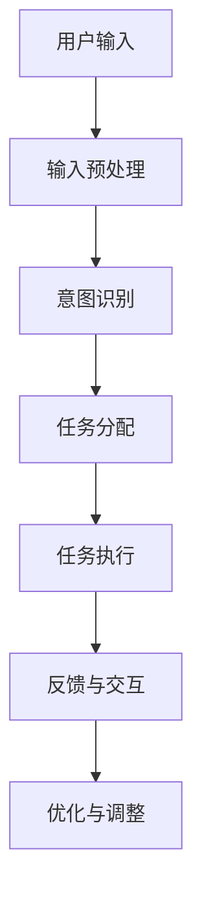
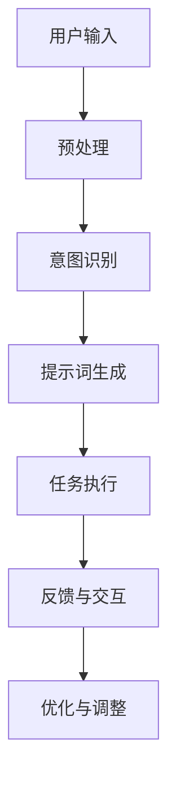
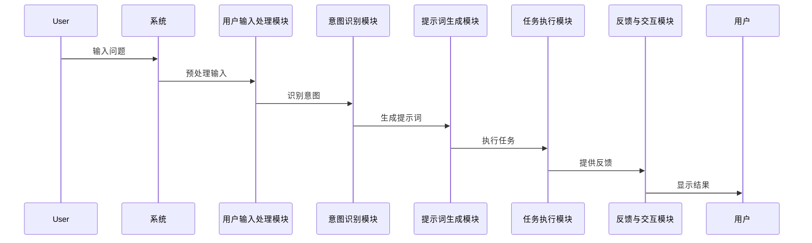
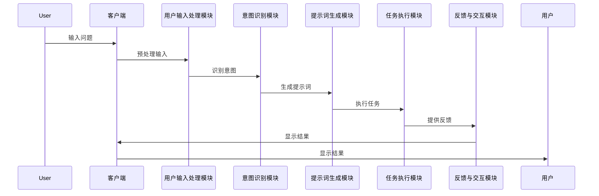

                 

### 背景介绍

#### 1.1.1 人机交互的发展历程

人机交互（Human-Computer Interaction, HCI）的概念可以追溯到20世纪40年代末和50年代初。当时，计算机科学正处于萌芽阶段，科学家和工程师们开始思考如何让计算机变得更加易用。1958年，道格拉斯·恩格尔巴特（Douglas Engelbart）发明了鼠标，这一发明极大地改变了人机交互的方式，使得计算机操作变得更加直观和便捷。随后，图形用户界面（Graphical User Interface, GUI）的出现，进一步推动了人机交互的发展。1984年，苹果公司推出了Macintosh电脑，这是首款搭载图形用户界面的个人电脑，极大地提高了用户的操作体验。

进入21世纪，随着互联网和移动设备的普及，人机交互技术也经历了巨大的变革。智能手机、平板电脑等移动设备的兴起，使得用户可以随时随地与计算机进行交互。触控技术、语音识别技术、手势识别技术等新兴交互方式的出现，为人机交互带来了更多的可能性。特别是在人工智能和机器学习的推动下，智能助理如Siri、Alexa等应运而生，它们能够通过自然语言处理和语音识别技术，提供更加智能化和个性化的服务。

#### 1.1.2 提示词编程的崛起

提示词编程（Prompt Engineering）是一种利用提示词（prompt）来引导计算机执行特定任务的方法。提示词编程的核心思想是通过设计特定的提示词，让计算机能够更好地理解和执行人类的需求。这种编程方式的出现，主要是为了解决传统编程中的一些问题，如代码可读性差、开发效率低等。

提示词编程的兴起可以追溯到自然语言处理（Natural Language Processing, NLP）和机器学习（Machine Learning, ML）技术的快速发展。随着深度学习算法的进步，计算机在处理自然语言任务方面取得了显著成就。例如，2018年，谷歌的研究团队提出了BERT（Bidirectional Encoder Representations from Transformers）模型，该模型在多种自然语言处理任务上取得了领先的成绩，进一步推动了提示词编程的发展。

在实际应用中，提示词编程已经展现出其强大的潜力。例如，在智能客服系统中，通过设计合适的提示词，系统能够更好地理解用户的提问，并提供准确的答案。在自动化写作领域，提示词编程可以帮助用户生成高质量的文章、报告等文档。此外，在数据分析、语音识别、图像识别等领域，提示词编程也发挥了重要作用。

#### 1.1.3 人机交互在提示词编程中的重要性

人机交互在提示词编程中起着至关重要的作用。首先，提示词编程的核心是人与计算机之间的有效沟通，而人机交互正是这种沟通的桥梁。通过设计合理的人机交互界面，用户可以更轻松地与计算机进行交互，提供输入，并获得输出结果。这不仅提高了用户的体验，还大大提升了开发效率。

其次，人机交互技术为人机交互设计提供了更多的可能性。例如，触控技术、语音识别技术、手势识别技术等，都为人机交互带来了新的交互方式。这些技术的应用，使得提示词编程可以更好地适应不同场景和用户需求。

最后，人机交互技术还可以帮助优化提示词设计。通过分析用户的交互行为，设计师可以了解用户的需求和偏好，从而设计出更加精准、有效的提示词。这种优化过程，不仅提升了系统的性能，还增强了用户体验。

总之，人机交互与提示词编程相辅相成，共同推动了计算机科学的发展。理解人机交互在提示词编程中的重要性，有助于我们更好地设计出高效、易用的系统。

### 1.2 问题描述

#### 1.2.1 提示词编程的概念

提示词编程是一种利用提示词（prompt）来引导计算机执行特定任务的方法。与传统的命令式编程不同，提示词编程更注重人与计算机之间的沟通和协作。提示词通常是一段简短、明确的文本，用于指示计算机执行特定操作或任务。这些提示词可以由用户直接输入，也可以通过自动化工具生成。

提示词编程的核心思想是通过设计合适的提示词，让计算机能够更好地理解和执行人类的需求。这种编程方式不仅提高了开发效率，还大大提升了系统的可读性和易用性。例如，在智能客服系统中，通过设计合适的提示词，系统能够更好地理解用户的提问，并提供准确的答案。在自动化写作领域，提示词编程可以帮助用户生成高质量的文章、报告等文档。

#### 1.2.2 人机交互中的挑战

人机交互（Human-Computer Interaction, HCI）是计算机科学中的一个重要领域，旨在研究人类与计算机之间的交互方式和用户体验。在提示词编程中，人机交互面临着诸多挑战：

1. **语言理解**：计算机需要理解人类输入的自然语言，这涉及到自然语言处理（NLP）技术的应用。尽管NLP技术近年来取得了显著进展，但仍然存在很多限制，如多义词处理、情感分析等。

2. **任务复杂性**：提示词编程涉及到复杂的任务，如数据清洗、文本生成、图像识别等。如何设计出能够准确引导计算机完成这些任务的提示词，是一个亟待解决的问题。

3. **用户体验**：人机交互的设计需要考虑用户体验，包括界面设计、交互流程、反馈机制等。如何设计出既高效又易用的交互界面，是一个重要的挑战。

4. **可扩展性**：随着应用场景的增多，提示词编程系统需要具备良好的可扩展性，以便快速适应新的需求。如何设计出模块化、可复用的系统架构，是一个重要的课题。

5. **错误处理**：在交互过程中，用户可能会输入错误的命令或提示词，系统需要能够有效地处理这些错误，并提供适当的反馈和修复建议。

#### 1.2.3 目标与需求

在提示词编程中，人机交互的目标是建立一种高效、易用、智能的交互方式，使计算机能够更好地理解和执行人类的需求。具体来说，目标与需求包括：

1. **提高开发效率**：通过设计合适的提示词和交互界面，降低开发难度，提高开发效率。

2. **提升用户体验**：优化交互流程，提供实时反馈，使用户能够轻松地与计算机进行互动。

3. **增强系统的智能化水平**：利用自然语言处理、机器学习等技术，使计算机能够更好地理解人类语言和需求，提供个性化的服务。

4. **实现可扩展性和灵活性**：设计模块化、可复用的系统架构，以便快速适应新的需求和场景。

5. **有效错误处理**：设计智能的错误处理机制，帮助用户快速识别和修复错误。

总之，提示词编程的人机交互设计旨在通过优化交互方式，提高系统的性能和用户体验，推动计算机科学的发展和应用。

### 1.3 问题解决

#### 1.3.1 提示词编程的原理

提示词编程是一种通过特定的文本提示（prompt）来引导计算机执行任务的方法。其核心思想是将复杂的人类需求转化为计算机可以理解和执行的操作指令。提示词通常是一段简短、明确的文本，用于指示计算机执行特定操作或任务。

在提示词编程中，提示词的设计至关重要。一个有效的提示词应该具备以下几个特点：

1. **明确性**：提示词需要明确地传达用户的需求，避免歧义和误解。
2. **简洁性**：提示词应尽可能简洁，便于用户理解和记忆。
3. **灵活性**：提示词应具备一定的灵活性，能够适应不同的场景和任务需求。
4. **可扩展性**：提示词应设计成可扩展的形式，以便在未来的需求变化中能够快速调整。

提示词编程的流程通常包括以下几个步骤：

1. **需求分析**：首先，了解用户的需求和任务目标，明确需要完成的任务。
2. **设计提示词**：根据需求分析的结果，设计出能够引导计算机完成任务的提示词。
3. **编写代码**：使用提示词来编写相应的代码，实现任务的自动化。
4. **测试与优化**：对编写好的代码进行测试，确保其能够正确执行任务，并根据反馈进行优化。

#### 1.3.2 人机交互的设计原则

人机交互（Human-Computer Interaction, HCI）的设计原则是确保用户能够与计算机系统高效、舒适、满意地互动的重要依据。以下是人机交互设计的一些核心原则：

1. **用户体验至上**：设计过程中始终将用户体验放在首位，确保用户在使用系统时感到方便、舒适和满意。
2. **简洁直观**：界面设计应简洁直观，避免复杂的操作流程和冗余的信息，使用户能够快速理解并完成任务。
3. **一致性**：保持界面和交互的一致性，包括视觉风格、操作逻辑和反馈机制，使用户在不同场景下都能够保持一致的使用体验。
4. **反馈机制**：提供及时的反馈，使用户能够了解系统的状态和操作结果，增强交互的透明度和可控性。
5. **灵活性**：设计具有灵活性的系统，能够适应不同用户的需求和偏好，提供个性化的服务。
6. **可访问性**：确保系统能够被不同能力水平的用户访问和使用，包括视觉、听觉、触觉等多种感知方式。
7. **容错性**：设计容错机制，帮助用户在出现错误时能够快速识别和恢复，减少操作失误带来的负面影响。
8. **可扩展性**：系统设计应具备良好的可扩展性，能够根据未来需求的变化进行功能扩展和升级。

#### 1.3.3 提示词编程与人机交互的结合方法

将提示词编程与人机交互相结合，可以显著提升系统的智能化水平和用户体验。以下是一些具体的结合方法：

1. **自然语言处理**：利用自然语言处理（NLP）技术，将用户的自然语言输入转换为计算机可以理解的指令。例如，通过语音识别将用户的语音输入转换为文本，再通过文本处理理解用户的意图。
2. **动态提示词生成**：根据用户的交互行为和系统状态，动态生成提示词。这种方法可以更好地引导用户完成任务，并提供个性化的交互体验。
3. **多模态交互**：结合多种交互方式，如语音、文本、图像等，提供更丰富的交互手段。例如，用户可以通过语音指令启动某个任务，并通过文本或图像进行进一步的交互。
4. **反馈循环**：在交互过程中，系统应不断收集用户的反馈，并根据反馈调整提示词和交互流程。这种反馈循环可以优化交互体验，提高系统的适应性和灵活性。
5. **智能错误处理**：利用机器学习技术，设计智能的错误处理机制。当用户输入错误的提示词时，系统能够自动识别错误，并提供修复建议，帮助用户快速纠正错误。
6. **界面优化**：结合用户的研究和行为分析，优化交互界面。例如，通过用户测试和数据分析，找出界面中的痛点，进行有针对性的改进。

通过这些结合方法，提示词编程和人机交互可以相辅相成，共同提升系统的性能和用户体验。

### 1.4 边界与外延

#### 1.4.1 提示词编程的适用范围

提示词编程具有广泛的应用范围，尤其适用于需要大量重复性任务和复杂操作的领域。以下是一些典型的应用场景：

1. **智能客服**：通过设计合适的提示词，智能客服系统能够理解用户的提问，并提供准确的答案。这大大提高了客服的效率，并提升了用户体验。
2. **自动化写作**：提示词编程可以帮助用户生成高质量的文章、报告等文档。例如，通过提示词引导，用户可以快速生成商业计划书、学术论文等。
3. **数据分析**：在数据清洗、数据预处理和数据建模等任务中，提示词编程可以帮助用户快速理解和操作复杂数据集，提高数据分析的效率。
4. **语音识别与生成**：通过设计特定的提示词，语音识别系统能够更好地理解用户的语音输入，并生成相应的文本输出。这在智能助理、语音控制等领域有广泛的应用。
5. **图像识别与处理**：提示词编程可以帮助用户通过简单的指令来操作图像识别和处理任务，例如标注图像、提取特征等。

总之，提示词编程在提高开发效率、优化用户体验和增强系统智能化水平方面具有显著优势，适用于多种复杂的应用场景。

#### 1.4.2 人机交互的设计要素

人机交互（Human-Computer Interaction, HCI）的设计需要考虑多个关键要素，以确保系统能够满足用户的需求并提供良好的用户体验。以下是人机交互设计的主要要素：

1. **用户体验**：用户体验是设计的核心，设计师需要关注用户的需求、偏好和习惯，确保系统易于使用、舒适和高效。
2. **界面设计**：界面设计是用户与系统互动的主要渠道。界面应简洁直观，视觉元素应具有一致性和易读性，操作应直观易懂。
3. **交互流程**：交互流程设计应考虑用户的操作路径和步骤，确保用户能够顺利完成任务。流程设计应简洁，避免繁琐的步骤和冗余的操作。
4. **反馈机制**：及时、有效的反馈是确保用户了解系统状态和操作结果的重要手段。反馈机制应清晰、明确，并能够提供有价值的建议和指导。
5. **可访问性**：设计应考虑到不同用户的能力和需求，包括视觉、听觉、触觉等感知方式，确保系统能够被所有用户轻松访问和使用。
6. **适应性**：系统应具备良好的适应性，能够根据用户的需求和场景进行动态调整，提供个性化的服务。
7. **安全性**：在交互过程中，安全性是一个不可忽视的要素。设计应确保系统的数据安全和用户隐私保护，防止恶意攻击和数据泄露。
8. **可扩展性**：系统设计应具备良好的可扩展性，能够根据未来的需求进行功能扩展和升级，保持系统的长期可用性。

通过综合考虑这些设计要素，人机交互系统能够提供高效、易用、安全的用户体验，从而满足用户的多样化需求。

#### 1.4.3 未来发展趋势

随着科技的不断进步，提示词编程和人机交互设计将在未来面临诸多发展趋势和变革：

1. **智能助理与虚拟助手**：随着人工智能和自然语言处理技术的不断成熟，智能助理和虚拟助手将成为人机交互的重要形式。这些智能系统将能够更加自然地与用户进行交流，提供个性化、智能化的服务。

2. **多模态交互**：未来的交互设计将不再局限于单一的文本或语音，而是结合多种模态，如手势、表情、动作等。这种多模态交互方式将提供更加丰富和自然的用户体验。

3. **增强现实与虚拟现实**：随着增强现实（AR）和虚拟现实（VR）技术的成熟，这些技术将在人机交互中发挥重要作用。通过AR和VR，用户可以沉浸在一个全新的交互环境中，体验更加真实和丰富的交互方式。

4. **个性化和定制化**：未来的交互设计将更加注重用户的个性化需求。通过收集和分析用户行为数据，系统可以提供更加精准的个性化推荐和服务。

5. **人机协作**：随着人工智能技术的进步，人机协作将成为一种新的工作模式。人与计算机将能够更加紧密地合作，共同完成复杂的任务。

6. **隐私保护和安全**：随着交互技术的进步，隐私保护和安全将成为设计的重要考虑因素。系统需要设计出有效的机制，保护用户的数据安全和隐私。

7. **云计算与边缘计算**：云计算和边缘计算的兴起将改变人机交互的设计模式。通过将计算任务分布到云端和边缘设备上，系统能够提供更加高效、低延迟的交互体验。

总之，未来的发展趋势将带来更加智能化、个性化、多样化的人机交互方式，推动计算机科学和人工智能技术的进一步发展。

#### 1.5.1 提示词编程的组成部分

提示词编程的组成部分主要包括以下几个关键元素：

1. **自然语言处理（NLP）模块**：这一模块负责将用户的自然语言输入转换为计算机可以理解的指令。它通常包括分词、词性标注、句法分析等步骤，以实现对输入文本的深入理解。

2. **提示词生成模块**：这一模块根据用户的输入和系统状态，生成适合的提示词。提示词的设计需要考虑明确性、简洁性、灵活性和可扩展性。通过使用先进的机器学习算法，如生成对抗网络（GAN）和递归神经网络（RNN），可以生成高质量的提示词。

3. **任务执行模块**：这一模块负责根据提示词执行具体的任务。它可能涉及到数据库操作、文件处理、API调用等。任务执行模块需要与系统的其他部分紧密集成，以确保任务的顺利执行。

4. **用户反馈模块**：这一模块用于收集用户的反馈，并对其进行处理。通过分析用户的反馈，系统可以不断优化提示词和交互流程，提供更好的用户体验。

5. **错误处理模块**：这一模块负责在出现错误时提供适当的处理和修复建议。通过利用机器学习算法，如决策树和随机森林，可以设计出智能的错误处理机制。

6. **交互界面**：这是用户与系统进行交互的入口，包括文本输入框、按钮、菜单等。交互界面的设计需要考虑用户体验，确保用户能够轻松、高效地与系统进行交互。

#### 1.5.2 人机交互的设计流程

人机交互（Human-Computer Interaction, HCI）的设计流程是一个系统性的过程，涉及多个阶段和步骤。以下是人机交互设计的主要流程：

1. **需求分析**：在项目启动阶段，首先需要明确用户的需求和目标。这通常通过用户访谈、问卷调查和市场调研等方式进行。需求分析的结果将指导后续的设计工作。

2. **交互设计**：在需求分析的基础上，进行交互设计。这一阶段包括设计用户界面、交互流程、反馈机制等。设计师需要考虑用户的使用习惯、需求和期望，确保交互设计能够满足用户的实际需求。

3. **原型设计**：通过创建交互原型，设计师可以模拟用户与系统的互动过程。原型设计可以是线框图、高保真图或可交互的模拟环境。这一阶段的目的是验证交互设计的可行性和用户友好性。

4. **用户测试**：在原型设计完成后，进行用户测试。通过观察用户与原型的交互过程，收集用户对设计的反馈和评价。用户测试可以帮助设计师发现设计中的问题和不足，并进行优化。

5. **迭代优化**：根据用户测试的结果，对交互设计进行迭代优化。这一过程可能需要多次反复，以确保最终的设计能够满足用户的需求，并提供良好的用户体验。

6. **实现与部署**：在交互设计最终确定后，进入实现和部署阶段。这一阶段包括开发前端界面、后端逻辑，以及系统集成等。实现与部署需要确保设计的可执行性和系统的稳定性。

7. **持续维护**：交互设计不仅是一个一次性的过程，还需要持续维护和更新。通过收集用户反馈、数据分析等手段，不断优化交互设计，以适应用户需求的变化和技术的发展。

#### 1.5.3 关键技术解析

在提示词编程和人机交互设计中，有一些关键技术起着至关重要的作用。以下是对这些关键技术的详细解析：

1. **自然语言处理（NLP）技术**：
   - **分词**：将自然语言文本分割成词或短语，这是进行进一步处理的基础。
   - **词性标注**：为每个单词或短语标注词性（如名词、动词、形容词等），以帮助理解文本的结构和语义。
   - **句法分析**：分析文本的句法结构，确定单词之间的语法关系，如主谓宾结构。
   - **语义理解**：通过语义分析，理解文本的含义和意图，例如情感分析、实体识别、事件抽取等。

2. **机器学习算法**：
   - **生成对抗网络（GAN）**：用于生成高质量的提示词，通过竞争学习生成与真实提示词相似的数据。
   - **递归神经网络（RNN）**：在处理序列数据时非常有用，如自然语言文本和时间序列数据。
   - **长短时记忆网络（LSTM）**：是RNN的一种变种，能够更好地处理长序列数据，常用于生成文本和提示词。
   - **Transformer模型**：如BERT、GPT等，通过自注意力机制在处理长文本和复杂任务时表现出色。

3. **用户界面（UI）设计**：
   - **响应式设计**：使界面能够适应不同设备和屏幕尺寸，提供一致的用户体验。
   - **用户中心设计**：设计过程以用户为中心，注重用户体验，确保界面直观易用。
   - **交互设计模式**：如按钮、菜单、滑块、弹出窗口等，为用户提供了直观的操作方式。

4. **用户体验（UX）设计**：
   - **用户体验地图**：通过可视化方式描述用户在系统中的交互路径和体验，帮助识别潜在问题。
   - **A/B测试**：通过对比不同设计版本的用户行为数据，选择最佳设计方案。
   - **用户调研**：通过访谈、问卷调查等方式，收集用户对系统的反馈和意见，指导设计优化。

5. **界面优化技术**：
   - **动画和过渡**：通过动画和过渡效果，增强用户与系统之间的互动感。
   - **性能优化**：通过优化代码和资源加载，提高系统的响应速度和稳定性。
   - **交互反馈**：通过视觉和听觉反馈，确保用户了解系统的状态和操作结果。

6. **安全性设计**：
   - **数据加密**：确保用户数据在传输和存储过程中安全，防止数据泄露。
   - **身份验证**：通过密码、双因素认证等方式，确保系统访问的安全性。
   - **错误处理**：设计智能的错误处理机制，帮助用户在出现问题时快速识别和恢复。

通过掌握这些关键技术，设计师和开发者可以创建出高效、易用、智能的提示词编程和人机交互系统，从而提升用户体验和系统性能。

### 2.1 提示词编程原理

#### 2.1.1 提示词的定义

提示词（Prompt）是提示词编程的核心概念，它是一个简短而明确的文本或指令，用于引导计算机执行特定的任务。提示词通常由用户输入或通过自动化工具生成，它们在自然语言处理（NLP）和机器学习（ML）领域中发挥着重要作用。

提示词的特点包括：

1. **明确性**：提示词应当清晰明确，避免产生歧义和误解，确保计算机能够准确理解用户意图。
2. **简洁性**：提示词应当简洁，便于用户理解和记忆，同时减少输入和处理的复杂性。
3. **灵活性**：提示词应具备一定的灵活性，能够适应不同的任务场景和用户需求。
4. **可扩展性**：提示词应设计为可扩展的形式，便于在未来的需求变化中快速调整。

在自然语言处理（NLP）和机器学习（ML）中，提示词的作用主要体现在以下几个方面：

1. **任务引导**：提示词可以帮助计算机了解用户的需求，从而引导计算机执行相应的任务。例如，在文本生成任务中，提示词可以指导模型生成特定主题或风格的文章。
2. **参数调整**：通过调整提示词，可以改变模型的输出结果。例如，在对话系统中，通过不同的提示词，可以生成更加符合用户需求的回答。
3. **优化性能**：提示词的设计对模型的性能有直接影响。合理的提示词可以提高模型的准确性和效率，减少对数据的依赖。

#### 2.1.2 提示词的生成方法

提示词的生成是提示词编程的重要环节，其方法主要包括以下几种：

1. **手动生成**：手动生成提示词通常由人类专家根据任务需求和用户输入来编写。这种方法适用于一些简单和明确的任务，但效率较低，且难以适应复杂的场景。
   
2. **自动生成**：自动生成提示词是通过机器学习算法自动生成的。常见的方法包括：

   - **规则驱动方法**：根据预设的规则生成提示词，如条件语句、正则表达式等。这种方法简单有效，但灵活性较差。

   - **基于模板的方法**：使用模板和变量生成提示词，如自然语言生成（NLG）模型。这种方法能够生成多样化、个性化的提示词。

   - **深度学习方法**：利用深度学习模型，如生成对抗网络（GAN）、递归神经网络（RNN）、长短时记忆网络（LSTM）和Transformer等，自动生成高质量的提示词。这些方法具有很高的灵活性和创造性。

3. **混合方法**：结合手动生成和自动生成的方法，通过人类专家和机器学习算法的协作，生成高质量的提示词。这种方法能够在保持灵活性的同时，提高生成效率。

提示词生成方法的选择取决于任务需求、数据质量和计算资源等因素。在实际应用中，通常根据具体情况选择合适的方法，以实现最佳效果。

#### 2.1.3 提示词的应用场景

提示词编程在多个应用场景中发挥了重要作用，以下是一些典型的应用场景：

1. **智能客服**：在智能客服系统中，提示词用于引导用户完成自助服务流程。例如，用户可以输入“我需要退换货”，系统会根据提示词提供相应的操作步骤和客服支持。

2. **自动化写作**：提示词可以帮助用户生成高质量的文章、报告和文档。例如，用户可以输入“请写一篇关于人工智能的论文”，系统会根据提示词生成一篇结构完整、内容丰富的论文。

3. **数据分析和挖掘**：在数据分析和挖掘任务中，提示词可以帮助用户快速理解和处理大量数据。例如，用户可以输入“找出销售数据中的异常值”，系统会根据提示词进行数据清洗和异常检测。

4. **图像识别与处理**：提示词可以指导计算机执行图像识别和处理的任务。例如，用户可以输入“识别图片中的猫”，系统会根据提示词识别并标记图片中的猫。

5. **语音识别与生成**：在语音识别和生成任务中，提示词用于指导模型的训练和输出。例如，用户可以输入“生成一段关于旅行的语音描述”，系统会根据提示词生成相应的语音内容。

6. **智能助理与虚拟助手**：提示词可以帮助智能助理和虚拟助手理解用户的指令，提供个性化的服务。例如，用户可以输入“帮我预约明天的会议”，系统会根据提示词完成会议预约。

总之，提示词编程在提高系统智能化水平和用户体验方面具有显著优势，适用于多种复杂的应用场景。

### 2.2 人机交互设计原则

人机交互（Human-Computer Interaction, HCI）的设计原则是确保用户能够与计算机系统高效、舒适、满意地互动的重要依据。以下是人机交互设计的一些核心原则：

1. **用户体验至上**：用户体验是设计的核心，设计师需要关注用户的需求、偏好和习惯，确保系统易于使用、舒适和高效。

2. **简洁直观**：界面设计应简洁直观，避免复杂的操作流程和冗余的信息，使用户能够快速理解并完成任务。

3. **一致性**：保持界面和交互的一致性，包括视觉风格、操作逻辑和反馈机制，使用户在不同场景下都能够保持一致的使用体验。

4. **反馈机制**：提供及时的反馈，使用户能够了解系统的状态和操作结果，增强交互的透明度和可控性。

5. **灵活性**：设计具有灵活性的系统，能够适应不同用户的需求和偏好，提供个性化的服务。

6. **可访问性**：确保系统能够被不同能力水平的用户访问和使用，包括视觉、听觉、触觉等多种感知方式。

7. **容错性**：设计容错机制，帮助用户在出现错误时能够快速识别和恢复，减少操作失误带来的负面影响。

8. **可扩展性**：系统设计应具备良好的可扩展性，能够根据未来需求进行功能扩展和升级，保持系统的长期可用性。

这些设计原则不仅有助于提升用户体验，还能够优化系统的性能和可靠性，从而在竞争激烈的市场中脱颖而出。

### 2.3 概念属性特征对比表格

为了更清晰地对比提示词编程和命令式编程，以及人机交互和图形界面设计，我们可以通过一个对比表格来详细展示它们的属性特征。以下是两者的主要区别和联系：

#### 提示词编程与命令式编程对比

| 特征                   | 提示词编程                  | 命令式编程                  |
|------------------------|-----------------------------|-----------------------------|
| **定义**               | 基于自然语言和提示词的编程方法 | 基于指令和命令的编程方法       |
| **目标**               | 提高开发效率和用户体验       | 实现特定功能或算法           |
| **主要用途**           | 数据处理、自动化任务、自然语言处理 | Web开发、操作系统编程、算法实现 |
| **编程元素**           | 提示词、自然语言、模型       | 变量、函数、控制结构         |
| **灵活性**             | 高，能够根据用户需求动态调整   | 中，固定指令序列             |
| **复杂性**             | 低，易于理解和使用           | 高，需要对具体语言特性熟悉   |

#### 人机交互与图形界面设计对比

| 特征                   | 人机交互（HCI）               | 图形界面设计（GUI）             |
|------------------------|-----------------------------|--------------------------------|
| **定义**               | 研究用户与计算机系统之间的交互 | 设计用于与计算机系统交互的图形界面 |
| **目标**               | 提高用户体验和系统可用性       | 提供直观、易用的交互界面         |
| **主要用途**           | 优化用户交互流程、增强系统功能 | 设计用户界面布局和视觉元素       |
| **交互元素**           | 语音、手势、触摸、键盘等       | 按钮、图标、文本框、菜单等       |
| **设计重点**           | 用户体验、一致性、反馈机制     | 视觉美观、操作便捷、一致性       |
| **适用场景**           | 复杂任务、多用户环境           | 单用户、桌面应用、移动应用       |

通过上述对比表格，我们可以更清晰地了解提示词编程、命令式编程、人机交互和图形界面设计之间的差异和联系，从而更好地应用于实际项目中。

### 2.4 ER实体关系图架构

在提示词编程和人机交互设计中，理解实体及其之间的关系是非常重要的。实体关系图（Entity-Relationship Diagram, ERD）是一种常用的数据库建模工具，用于表示实体和它们之间的关系。以下是基于提示词编程和人机交互的ERD示例，展示了核心实体及其关系：

#### 2.4.1 提示词编程实体关系

```mermaid
erDiagram
    User ||--|{ Prompt } : "生成"
    User ||--|{ Interaction } : "发起"
    Prompt ||--|{ Response } : "触发"
    System ||--|{ Model } : "训练"
    System ||--|{ Interface } : "提供"
    Interaction ||--|{ Action } : "执行"
    Response ||--|{ Error } : "处理"
    User }|--|{ Feedback } : "提供"
```

在这个ERD中：

- **User**（用户）是系统的交互主体，可以生成提示词、发起交互并提供反馈。
- **Prompt**（提示词）是用户输入到系统中的文本，用于触发特定操作。
- **Interaction**（交互）表示用户与系统的交互过程，包括用户发起的操作和系统的响应。
- **Response**（响应）是系统对提示词或交互的输出结果，包括正常响应和错误处理。
- **System**（系统）是执行提示词编程的核心组件，包括训练模型和提供界面。
- **Model**（模型）是系统用于处理提示词和交互的机器学习模型。
- **Interface**（界面）是用户与系统交互的入口，提供交互界面。
- **Action**（操作）表示系统执行的具体操作。
- **Error**（错误）是系统在处理过程中可能遇到的错误。
- **Feedback**（反馈）是用户对系统的反馈，用于优化系统性能。

#### 2.4.2 人机交互实体关系

```mermaid
erDiagram
    User ||--|{ Interface } : "使用"
    User ||--|{ Interaction } : "交互"
    Interface ||--|{ Screen } : "展示"
    Interface ||--|{ Feedback } : "获取"
    Interface ||--|{ Response } : "响应"
    System ||--|{ Processor } : "处理"
    System ||--|{ Model } : "训练"
    Processor ||--|{ Action } : "执行"
    Processor ||--|{ Error } : "处理"
    Model ||--|{ Algorithm } : "实现"
```

在这个ERD中：

- **User**（用户）是系统的交互主体，与界面进行交互，提供反馈。
- **Interface**（界面）是用户与系统交互的入口，包括屏幕展示、反馈获取和响应处理。
- **Screen**（屏幕）是界面的一部分，用于展示用户界面元素。
- **Feedback**（反馈）是用户对系统操作结果的评价，用于改进界面和交互流程。
- **Response**（响应）是系统对用户操作的输出结果，包括成功、错误等。
- **System**（系统）是执行人机交互的核心组件，包括处理器和机器学习模型。
- **Processor**（处理器）负责处理用户输入和系统响应，执行具体操作。
- **Error**（错误）是系统在处理过程中可能遇到的错误，需要处理和反馈。
- **Model**（模型）是系统用于处理交互数据的机器学习模型，包括算法实现。
- **Algorithm**（算法）是实现机器学习模型的核心，用于处理数据和生成响应。

通过这两个ERD，我们可以更清晰地理解提示词编程和人机交互中的实体及其关系，为系统设计和实现提供重要的参考。

### 3.1 提示词生成算法

#### 3.1.1 提示词生成算法原理

提示词生成算法是提示词编程的核心部分，其目标是根据用户的输入或系统状态生成合适的提示词。提示词生成算法的基本原理是通过机器学习模型从大量数据中学习到生成提示词的规律，从而实现自动生成高质量提示词的功能。

提示词生成算法通常分为以下几个步骤：

1. **数据预处理**：首先对输入数据进行预处理，包括分词、去停用词、词性标注等，以便模型能够更好地理解输入数据。

2. **特征提取**：将预处理后的数据转换为模型可理解的数值特征。常用的特征提取方法包括词嵌入（Word Embedding）、卷积神经网络（CNN）和变换器（Transformer）等。

3. **模型训练**：使用训练数据集对生成模型进行训练。常见的生成模型有生成对抗网络（GAN）、递归神经网络（RNN）、长短时记忆网络（LSTM）和Transformer等。

4. **提示词生成**：在模型训练完成后，通过输入新的数据，模型可以生成相应的提示词。生成过程可以是根据用户输入或系统状态动态生成的，也可以是预定义的。

5. **优化与调整**：根据生成的提示词质量和用户反馈，对模型进行优化和调整，以提高生成的提示词的准确性和用户体验。

#### 3.1.2 提示词生成算法流程

提示词生成算法的流程可以分为以下几步：

1. **数据收集与预处理**：收集大量相关数据，如用户提问、系统响应、文档文本等。对数据进行预处理，包括分词、去停用词、词性标注等。

2. **特征提取**：将预处理后的数据转换为模型可理解的数值特征。常用的特征提取方法有词嵌入（Word Embedding）、卷积神经网络（CNN）和变换器（Transformer）等。

3. **模型选择与训练**：选择合适的生成模型，如生成对抗网络（GAN）、递归神经网络（RNN）、长短时记忆网络（LSTM）和Transformer等，使用训练数据集进行训练。

4. **提示词生成**：在模型训练完成后，通过输入新的数据，模型可以生成相应的提示词。生成过程可以是根据用户输入或系统状态动态生成的，也可以是预定义的。

5. **优化与调整**：根据生成的提示词质量和用户反馈，对模型进行优化和调整，以提高生成的提示词的准确性和用户体验。

以下是一个简单的Python代码示例，展示如何使用GPT-2模型进行提示词生成：

```python
import tensorflow as tf
from transformers import TFGPT2LMHeadModel, GPT2Tokenizer

# 加载预训练的GPT-2模型和分词器
tokenizer = GPT2Tokenizer.from_pretrained('gpt2')
model = TFGPT2LMHeadModel.from_pretrained('gpt2')

# 输入文本作为提示词
prompt = "请生成一篇关于人工智能的论文摘要。"

# 将输入文本编码为模型可理解的序列
input_ids = tokenizer.encode(prompt, return_tensors='tf')

# 生成提示词
outputs = model.generate(input_ids, max_length=50, num_return_sequences=1)

# 解码生成的提示词
generated_text = tokenizer.decode(outputs[0], skip_special_tokens=True)

print(generated_text)
```

通过以上步骤，我们可以生成高质量的提示词，从而提升系统的交互效果和用户体验。

### 3.2 人机交互算法

#### 3.2.1 人机交互算法原理

人机交互算法是确保用户能够与计算机系统高效、舒适、满意地互动的核心技术。其原理主要基于以下几个方面：

1. **自然语言处理（NLP）**：人机交互算法需要理解用户的自然语言输入，这涉及到文本处理、语义分析、情感识别等NLP技术。通过NLP算法，系统可以提取用户输入的关键信息，理解其意图和需求。

2. **行为分析**：人机交互算法需要分析用户的行为模式，如点击、滑动、触摸等。这些行为数据可以用于优化交互流程，提高用户的操作效率。

3. **机器学习与深度学习**：通过机器学习和深度学习算法，系统可以不断学习和适应用户的需求。例如，可以使用递归神经网络（RNN）处理用户的语音输入，使用卷积神经网络（CNN）处理用户的图像输入。

4. **交互反馈**：交互反馈是优化人机交互算法的重要手段。系统需要及时响应用户的操作，提供清晰的反馈，帮助用户了解系统的状态和操作结果。

5. **多模态交互**：人机交互算法应支持多种模态的输入和输出，如语音、文本、图像、手势等。通过多模态交互，系统可以提供更加丰富和自然的用户体验。

6. **自适应调整**：人机交互算法需要具备自适应调整能力，根据用户的行为和反馈，动态调整交互界面和操作流程，以提供最佳的用户体验。

#### 3.2.2 人机交互算法流程

人机交互算法的流程通常包括以下几个步骤：

1. **用户输入处理**：系统首先接收用户的输入，这可能包括文本、语音、手势等。系统需要对输入进行预处理，如文本分词、语音转文本等。

2. **意图识别**：通过自然语言处理技术，系统分析用户输入，识别用户的意图和需求。这通常涉及到实体识别、情感分析、句子语义理解等。

3. **任务分配**：系统根据识别出的用户意图，将任务分配给相应的模块或组件。例如，如果用户请求查询天气信息，系统会调用天气查询模块。

4. **任务执行**：系统执行用户请求的任务，这可能包括数据查询、处理、生成等。例如，系统会从数据库中查询天气信息，并将结果生成文本或语音输出。

5. **反馈与交互**：系统将执行结果反馈给用户，这可以通过文本、语音、图像等多种方式实现。用户可以进一步与系统进行交互，如确认信息、提出新的请求等。

6. **优化与调整**：根据用户反馈和行为数据，系统不断优化和调整交互流程，以提高用户体验和系统性能。

以下是一个简单的人机交互算法流程图，展示用户输入处理、意图识别、任务分配、任务执行、反馈与交互、优化与调整等步骤：



通过这个流程，人机交互系统可以高效、智能地响应用户的需求，提供优质的用户体验。

### 3.2.3 人机交互算法代码示例

为了更好地展示人机交互算法的实现，以下是一个简单的Python代码示例，使用TensorFlow和transformers库实现基于文本的交互系统：

```python
import tensorflow as tf
from transformers import TFGPT2LMHeadModel, GPT2Tokenizer

# 加载预训练的GPT-2模型和分词器
tokenizer = GPT2Tokenizer.from_pretrained('gpt2')
model = TFGPT2LMHeadModel.from_pretrained('gpt2')

# 定义交互函数
def interact():
    print("欢迎来到智能助手！请开始你的提问。")
    while True:
        user_input = input("你：")
        if user_input.lower() == '退出':
            print("智能助手：谢谢你的使用，再见！")
            break
        
        # 将用户输入编码为模型可理解的序列
        input_ids = tokenizer.encode(user_input, return_tensors='tf')

        # 生成响应文本
        outputs = model.generate(input_ids, max_length=50, num_return_sequences=1)

        # 解码生成的文本
        response = tokenizer.decode(outputs[0], skip_special_tokens=True)
        
        # 输出智能助手的响应
        print(f"智能助手：{response}")

# 开始交互
interact()
```

在这个示例中，我们首先加载了一个预训练的GPT-2模型和分词器。然后，我们定义了一个交互函数`interact`，该函数会持续接收用户的输入，并使用模型生成响应文本。用户可以通过输入文本与智能助手进行对话，当用户输入“退出”时，交互会终止。

### 3.3 结合算法

#### 3.3.1 结合算法原理

结合算法（Combined Algorithm）是将提示词生成算法和人机交互算法结合在一起，以实现更加智能和高效的人机交互系统。其原理主要包括以下几个关键步骤：

1. **用户输入处理**：首先，系统接收用户的输入，这可能包括文本、语音、手势等多种形式。系统需要对这些输入进行预处理，如文本分词、语音转文本等，以便后续处理。

2. **意图识别**：通过自然语言处理（NLP）技术，系统分析用户输入，识别用户的意图和需求。这一步骤通常涉及到文本分类、实体识别、情感分析等。

3. **提示词生成**：系统根据识别出的用户意图，利用提示词生成算法生成相应的提示词。这一步骤可以是预定义的，也可以是动态生成的，以适应不同的交互场景。

4. **任务执行**：系统根据生成的提示词执行相应的任务，这可能包括数据查询、处理、生成等。例如，如果用户请求查询天气信息，系统会调用天气查询模块。

5. **反馈与交互**：系统将执行结果反馈给用户，并通过人机交互算法提供良好的交互体验。用户可以根据反馈进一步与系统进行交互，如确认信息、提出新的请求等。

6. **优化与调整**：根据用户反馈和行为数据，系统不断优化和调整交互流程，以提高用户体验和系统性能。

通过将提示词生成算法和人机交互算法相结合，系统可以更智能地理解用户需求，提供个性化的服务，从而提升整体交互效果。

#### 3.3.2 结合算法流程

结合算法的流程可以分为以下几个步骤：

1. **用户输入处理**：系统接收用户输入，并进行预处理，如文本分词、语音转文本等。

2. **意图识别**：利用NLP技术对预处理后的用户输入进行分析，识别用户的意图和需求。

3. **提示词生成**：根据识别出的用户意图，使用提示词生成算法生成相应的提示词。

4. **任务执行**：系统根据生成的提示词执行相应的任务，如查询数据、处理信息、生成结果等。

5. **反馈与交互**：系统将执行结果反馈给用户，并提供良好的交互体验，如文本输出、语音响应等。

6. **优化与调整**：根据用户反馈和行为数据，对交互流程进行优化和调整，以提高用户体验和系统性能。

以下是一个简单的结合算法流程图：



通过这个流程，系统可以高效地响应用户的需求，提供高质量的交互体验。

### 3.3.3 结合算法代码示例

为了展示如何将提示词生成算法和人机交互算法结合在一起，以下是一个简单的Python代码示例，使用TensorFlow和transformers库实现一个基于文本的交互系统：

```python
import tensorflow as tf
from transformers import TFGPT2LMHeadModel, GPT2Tokenizer
from transformers import pipeline

# 加载预训练的GPT-2模型和分词器
tokenizer = GPT2Tokenizer.from_pretrained('gpt2')
model = TFGPT2LMHeadModel.from_pretrained('gpt2')
inference_pipeline = pipeline('text-generation', model=model, tokenizer=tokenizer)

# 定义交互函数
def interact():
    print("欢迎来到智能助手！请开始你的提问。")
    while True:
        user_input = input("你：")
        if user_input.lower() == '退出':
            print("智能助手：谢谢你的使用，再见！")
            break
        
        # 使用提示词生成算法生成提示词
        prompt = inference_pipeline(user_input, max_length=50, num_return_sequences=1)[0]['generated_text']

        # 输出提示词
        print(f"智能助手：{prompt}")
        
        # 执行任务（这里仅作为示例，实际应用中可以根据提示词执行具体任务）
        print(f"你：{prompt}")

# 开始交互
interact()
```

在这个示例中，我们首先加载了一个预训练的GPT-2模型和分词器。然后，我们定义了一个交互函数`interact`，该函数会持续接收用户的输入，并使用提示词生成算法生成相应的提示词。用户可以通过输入文本与智能助手进行对话，当用户输入“退出”时，交互会终止。

通过这种方式，我们可以将提示词生成算法和人机交互算法结合在一起，实现一个智能的人机交互系统。

### 4.1 问题场景介绍

#### 4.1.1 项目背景

随着科技的快速发展，人工智能（AI）在各个领域中的应用越来越广泛。然而，传统的编程方式往往难以满足复杂、多变的应用需求。为了提高开发效率和系统智能化水平，提示词编程和人机交互设计成为当前研究的热点。本项目旨在通过结合提示词编程和人机交互设计，构建一个智能问答系统，以解决用户在日常生活中遇到的各种问题。

#### 4.1.2 需求分析

本项目的需求主要包括以下几个方面：

1. **用户输入处理**：系统能够接收用户的自然语言输入，包括文本、语音等多种形式。
2. **意图识别**：系统需要能够识别用户的意图，如查询天气、推荐餐厅、解决技术问题等。
3. **提示词生成**：根据识别出的用户意图，系统需要生成相应的提示词，引导用户完成具体任务。
4. **任务执行**：系统需要能够自动执行用户请求的任务，如查询数据、生成报告等。
5. **反馈与交互**：系统需要提供清晰的反馈，与用户进行有效互动，确保用户能够顺利完成操作。
6. **用户体验**：系统设计应简洁直观，易于使用，提供良好的用户体验。

通过满足上述需求，本项目旨在打造一个高效、智能、用户友好的问答系统，为用户提供便捷的服务。

### 4.2 系统功能设计

#### 4.2.1 领域模型

为了更好地理解系统功能和模块之间的交互，我们可以使用领域模型（Domain Model）来描述系统的核心功能。领域模型通过实体和关系的表示，帮助开发者理清系统的架构和设计。以下是本项目的领域模型：

```mermaid
classDiagram
    User <<class{用户}<<--|{输入} Question
    Question <<class{问题}<<--|{处理} Answer
    Answer <<class{答案}<<--|{反馈} User
    System <<class{系统}<<--|{管理} User
    System <<--|{调用} Database
    Database <<class{数据库}<<--|{存储} Question
    Database <<--|{存储} Answer
```

在这个领域模型中，主要实体包括：

- **User**（用户）：系统的交互主体，可以发起问题并接收反馈。
- **Question**（问题）：用户输入的问题，经过处理后会生成答案。
- **Answer**（答案）：系统生成的回答，反馈给用户。
- **System**（系统）：管理用户和问题的交互，调用数据库进行数据存储和查询。
- **Database**（数据库）：存储问题和答案，为系统提供数据支持。

实体之间的关系如下：

- **User**与**Question**之间的关系为单向关联，表示用户发起问题。
- **Question**与**Answer**之间的关系为单向关联，表示问题经过处理后生成答案。
- **Answer**与**User**之间的关系为单向关联，表示答案反馈给用户。
- **System**与**User**、**Question**、**Answer**之间的关系为管理关系，表示系统管理用户和问题的交互。
- **System**与**Database**之间的关系为调用关系，表示系统调用数据库进行数据存储和查询。

#### 4.2.2 功能模块划分

根据领域模型，我们可以将系统划分为以下几个功能模块：

1. **用户输入处理模块**：负责接收用户的输入，包括文本、语音等多种形式，并进行预处理，如分词、去停用词等。
2. **意图识别模块**：利用自然语言处理（NLP）技术，分析用户输入，识别用户的意图和需求。
3. **提示词生成模块**：根据识别出的用户意图，生成相应的提示词，用于引导用户完成具体任务。
4. **任务执行模块**：执行用户请求的任务，如查询数据、生成报告等。
5. **反馈与交互模块**：将执行结果反馈给用户，提供良好的交互体验。
6. **数据库管理模块**：负责存储问题和答案，为系统提供数据支持。

以下是系统功能模块的划分示意图：



通过这个功能模块划分，系统可以高效地响应用户的需求，实现智能化、个性化的服务。

### 4.3 系统架构设计

#### 4.3.1 系统架构图

为了确保系统的高效、稳定和可扩展性，我们需要设计一个合理的系统架构。以下是本项目的系统架构图：

```mermaid
subgraph 数据层
    Database
    Database <<--|{存储} User
    Database <<--|{存储} Question
    Database <<--|{存储} Answer
end

subgraph 服务层
    Service
    Service <<--|{调用} Database
    Service <<--|{处理} UserInput
    Service <<--|{处理} IntentRecognition
    Service <<--|{处理} PromptGeneration
    Service <<--|{处理} TaskExecution
    Service <<--|{处理} FeedbackAndInteraction
end

subgraph 客户端层
    Client
    Client ->> Service: 用户输入
    Service ->> Client: 回显结果
end

subgraph 边缘计算层
    Edge
    Edge <<--|{处理} UserInput
    Edge <<--|{处理} IntentRecognition
    Edge <<--|{处理} PromptGeneration
    Edge <<--|{处理} TaskExecution
    Edge <<--|{处理} FeedbackAndInteraction
end

subgraph 中间件层
    Middleware
    Middleware <<--|{处理} Authentication
    Middleware <<--|{处理} Logging
    Middleware <<--|{处理} ErrorHandling
    Middleware <<--|{处理} RateLimiting
end

subgraph 支持层
    Support
    Support <<--|{监控} Service
    Support <<--|{监控} Database
    Support <<--|{监控} Edge
end

System <<--|{集成} Client
System <<--|{集成} Service
System <<--|{集成} Middleware
System <<--|{集成} Support
```

在这个架构图中，主要组成部分包括：

1. **数据层**：数据库负责存储用户、问题和答案等数据，为系统提供数据支持。
2. **服务层**：服务层是系统的核心部分，包括用户输入处理、意图识别、提示词生成、任务执行和反馈与交互等模块。
3. **客户端层**：客户端层负责与用户进行交互，接收用户输入并显示结果。
4. **边缘计算层**：边缘计算层负责处理用户输入和本地任务，提高系统的响应速度和稳定性。
5. **中间件层**：中间件层负责处理身份验证、日志记录、错误处理和限速等功能，确保系统的正常运行。
6. **支持层**：支持层负责监控和保障系统的稳定性和安全性。

通过这个架构设计，系统能够高效地响应用户的需求，提供良好的用户体验。

#### 4.3.2 架构设计原理

系统架构设计的核心目标是实现高效、稳定、可扩展的系统，以满足用户的需求。以下是基于本项目的架构设计原理：

1. **模块化设计**：系统采用模块化设计，将不同功能划分为独立的模块，如用户输入处理、意图识别、提示词生成等。这种设计方式不仅提高了系统的可维护性，还便于模块的复用和扩展。

2. **分布式架构**：系统采用分布式架构，将任务分布到不同的节点上执行，以提高系统的性能和可靠性。例如，用户输入处理和任务执行可以部署在边缘计算节点上，而数据库和中间件则部署在云端。

3. **微服务架构**：系统采用微服务架构，将不同功能模块拆分为独立的微服务，每个微服务负责特定的功能。这种架构方式提高了系统的灵活性和可扩展性，便于独立部署和扩展。

4. **负载均衡**：系统采用负载均衡机制，将用户请求均匀分配到不同的服务器上，以提高系统的处理能力和响应速度。

5. **缓存机制**：系统采用缓存机制，存储常用的数据和结果，以减少数据库的访问次数，提高系统的性能。

6. **安全性设计**：系统采用安全性设计，包括身份验证、权限控制、数据加密等，确保系统的数据安全和用户隐私保护。

7. **监控和日志**：系统采用监控和日志机制，实时监控系统的运行状态，记录错误日志和操作日志，以便快速识别和解决问题。

通过以上架构设计原理，系统能够高效、稳定地运行，提供优质的用户体验。

### 4.4 系统接口设计

#### 4.4.1 接口规范

为了确保系统的高效、稳定和易用，我们需要制定一套详细的接口规范。以下是本项目的接口规范：

1. **RESTful API**：系统采用RESTful API设计，所有接口均遵循REST原则，使用HTTP协议传输数据。接口采用JSON格式进行数据交换。
2. **接口类型**：
   - **查询接口**：用于获取系统数据，如用户信息、问题列表、答案详情等。
   - **操作接口**：用于执行用户请求的任务，如添加问题、更新问题、删除问题等。
3. **接口命名**：接口命名应遵循统一命名规范，清晰描述接口功能。例如，`GET /questions`用于获取所有问题列表，`POST /questions`用于添加新问题。
4. **参数传递**：接口参数应使用URL参数、请求体或头部传递，确保参数传递的清晰和一致性。URL参数主要用于查询接口，请求体主要用于操作接口。
5. **响应格式**：接口响应应包含状态码、消息和数据三部分。状态码用于表示接口调用结果，消息用于描述接口调用结果，数据用于返回具体的数据内容。
6. **状态码定义**：
   - **200 OK**：接口调用成功。
   - **201 Created**：接口调用成功，已创建新资源。
   - **400 Bad Request**：接口请求无效。
   - **401 Unauthorized**：请求未授权。
   - **403 Forbidden**：请求被拒绝。
   - **404 Not Found**：接口未找到。
   - **500 Internal Server Error**：服务器内部错误。
7. **错误处理**：接口应提供详细的错误信息，包括错误码、错误消息和错误原因，以便开发者和用户快速识别和解决问题。

#### 4.4.2 接口设计

以下是本项目的主要接口设计：

1. **获取所有问题列表**：
   - **URL**：`GET /questions`
   - **参数**：无
   - **响应**：
     ```json
     {
       "status": 200,
       "message": "成功获取问题列表",
       "data": [
         {
           "id": 1,
           "title": "如何设置Wi-Fi密码？",
           "content": "我的Wi-Fi密码忘记了，如何重新设置？",
           "status": "pending"
         },
         {
           "id": 2,
           "title": "电脑如何更新操作系统？",
           "content": "我想更新我的电脑操作系统，应该怎么做？",
           "status": "completed"
         }
       ]
     }
     ```

2. **添加新问题**：
   - **URL**：`POST /questions`
   - **请求体**：
     ```json
     {
       "title": "电脑如何备份重要文件？",
       "content": "我想备份我的电脑中的重要文件，应该怎么操作？",
       "status": "pending"
     }
     ```
   - **响应**：
     ```json
     {
       "status": 201,
       "message": "成功添加问题",
       "data": {
         "id": 3,
         "title": "电脑如何备份重要文件？",
         "content": "我想备份我的电脑中的重要文件，应该怎么操作？",
         "status": "pending"
       }
     }
     ```

3. **更新问题状态**：
   - **URL**：`PUT /questions/{id}`
   - **请求体**：
     ```json
     {
       "status": "completed"
     }
     ```
   - **响应**：
     ```json
     {
       "status": 200,
       "message": "成功更新问题状态",
       "data": {
         "id": 1,
         "title": "如何设置Wi-Fi密码？",
         "content": "我的Wi-Fi密码忘记了，如何重新设置？",
         "status": "completed"
       }
     }
     ```

4. **删除问题**：
   - **URL**：`DELETE /questions/{id}`
   - **响应**：
     ```json
     {
       "status": 200,
       "message": "成功删除问题"
     }
     ```

通过以上接口设计，系统可以高效、稳定地响应用户的需求，提供便捷的服务。

### 4.5 系统交互设计

#### 4.5.1 系统交互图

系统交互设计是确保各模块和组件能够协同工作、实现系统功能的重要环节。以下是本项目的系统交互图：



在这个交互图中，主要组件和流程如下：

1. **用户**：用户输入问题，通过客户端与系统进行交互。
2. **客户端**：接收用户输入，预处理后传递给用户输入处理模块。
3. **用户输入处理模块**：对输入进行预处理，如分词、去停用词等，然后传递给意图识别模块。
4. **意图识别模块**：分析预处理后的输入，识别用户的意图和需求。
5. **提示词生成模块**：根据识别出的用户意图，生成相应的提示词。
6. **任务执行模块**：执行提示词指定的任务，如查询数据、生成报告等。
7. **反馈与交互模块**：将执行结果反馈给客户端，并通过客户端显示给用户。

通过这个交互设计，系统能够高效、有序地处理用户请求，提供优质的用户体验。

#### 4.5.2 交互设计原理

交互设计原理是确保系统与用户之间能够高效、顺畅互动的重要依据。以下是本项目交互设计的主要原理：

1. **用户为中心**：交互设计应以用户需求为中心，充分考虑用户的使用习惯、需求和期望，确保系统易于使用、操作简便。

2. **一致性**：系统应保持一致性，包括界面风格、交互逻辑和反馈机制等。一致性可以降低用户的学习成本，提高操作效率。

3. **简洁直观**：界面设计应简洁直观，避免复杂的操作流程和冗余的信息。简洁直观的界面可以帮助用户快速理解系统功能，提高用户体验。

4. **及时反馈**：系统应提供及时的反馈，使用户能够了解系统的状态和操作结果。及时反馈可以增强用户的互动感和控制感。

5. **灵活性**：系统应具备灵活性，能够根据用户需求和环境动态调整。灵活性可以提高系统的适用性和适应性，满足多样化的用户需求。

6. **可访问性**：系统应确保不同能力水平的用户都能够访问和使用。可访问性包括视觉、听觉、触觉等多种感知方式，确保系统能够满足各类用户的需求。

7. **安全性**：在交互过程中，安全性是一个不可忽视的要素。系统应设计出有效的机制，保护用户的数据安全和隐私，防止恶意攻击和数据泄露。

通过遵循这些交互设计原理，系统可以提供高效、易用、安全的用户体验，从而满足用户的多样化需求。

### 5.1 环境安装

#### 5.1.1 硬件环境

为了确保项目能够顺利运行，我们需要配置适当的硬件环境。以下是推荐的硬件配置：

- **处理器**：至少需要2核CPU，建议使用4核或更高性能的处理器。
- **内存**：至少需要4GB RAM，建议使用8GB或更多内存。
- **存储空间**：至少需要50GB的空闲硬盘空间，建议使用SSD存储设备以提高系统性能。
- **网络带宽**：至少需要1Mbps的带宽，用于数据传输和远程访问。

此外，为了支持边缘计算，我们还可以配置额外的硬件资源，如树莓派或其他低功耗设备。

#### 5.1.2 软件环境

项目开发需要配置一系列软件环境，以下是详细的安装步骤：

1. **安装Python**：
   - 确保系统已安装Python 3.x版本（推荐3.8及以上版本）。
   - 使用以下命令检查Python版本：
     ```bash
     python --version
     ```
   - 如果未安装Python，请从Python官网下载并安装。

2. **安装pip**：
   - pip是Python的包管理器，用于安装和管理Python库。
   - 使用以下命令安装pip：
     ```bash
     sudo apt-get install python3-pip
     ```
   - 或者使用Windows系统的命令提示符：
     ```bash
     python -m ensurepip
     ```

3. **安装虚拟环境**：
   - 虚拟环境可以帮助我们隔离项目依赖，避免版本冲突。
   - 使用以下命令安装虚拟环境：
     ```bash
     sudo apt-get install python3-venv
     ```
   - 创建一个新的虚拟环境（以`myenv`为例）：
     ```bash
     python3 -m venv myenv
     ```
   - 激活虚拟环境：
     ```bash
     source myenv/bin/activate
     ```

4. **安装TensorFlow**：
   - TensorFlow是一个开源机器学习框架，用于提示词生成和自然语言处理。
   - 使用以下命令安装TensorFlow：
     ```bash
     pip install tensorflow
     ```

5. **安装transformers**：
   - transformers是Hugging Face公司开发的一个高级库，用于处理自然语言任务。
   - 使用以下命令安装transformers：
     ```bash
     pip install transformers
     ```

6. **安装其他依赖库**：
   - 根据项目需求，可能还需要安装其他依赖库，如numpy、pandas、matplotlib等。
   - 使用以下命令安装：
     ```bash
     pip install numpy pandas matplotlib
     ```

完成上述步骤后，我们的开发环境就配置完成了。接下来，我们可以开始进行项目的开发和实现。

### 5.2 系统核心实现

#### 5.2.1 核心功能实现

在完成环境安装后，接下来我们将逐步实现系统的核心功能。以下是具体的实现步骤：

1. **创建项目结构和文件**：
   - 首先创建项目的目录结构，例如：
     ```bash
     mkdir my_ia_system
     cd my_ia_system
     mkdir src data logs
     touch src/__init__.py src/user_input_handler.py src/intent_recognition.py src/prompt_generation.py src/task_execution.py src/feedback_interaction.py
     touch logs/app.log
     ```
   - `src`目录用于存放项目代码文件。
   - `data`目录用于存放数据文件。
   - `logs`目录用于存放日志文件。

2. **编写用户输入处理模块**：
   - `src/user_input_handler.py`文件用于处理用户输入。
   - 代码示例：
     ```python
     import json

     def handle_input(input_data):
         # 对输入数据进行预处理，如分词、去停用词等
         processed_input = preprocess_input(input_data)
         # 将预处理后的输入保存到文件中
         with open('data/input_data.json', 'w') as f:
             json.dump(processed_input, f)
         return processed_input

     def preprocess_input(input_data):
         # 实现预处理逻辑
         # 例如：分词、去停用词、词性标注等
         return input_data
     ```

3. **编写意图识别模块**：
   - `src/intent_recognition.py`文件用于识别用户的意图。
   - 代码示例：
     ```python
     from transformers import pipeline

     # 加载预训练的意图识别模型
     intent_recognition = pipeline('text-classification', model='dbmdz/bert-large-cased-finetuned-sst-2-english')

     def recognize_intent(processed_input):
         # 使用意图识别模型识别用户意图
         intent = intent_recognition(processed_input)[0]['label']
         return intent
     ```

4. **编写提示词生成模块**：
   - `src/prompt_generation.py`文件用于生成提示词。
   - 代码示例：
     ```python
     from transformers import pipeline

     # 加载预训练的提示词生成模型
     prompt_generation = pipeline('text-generation', model='gpt2')

     def generate_prompt(intent, input_data):
         # 使用提示词生成模型生成提示词
         prompt = prompt_generation(f"根据以下问题：{input_data}，请生成一个提示词：", max_length=50, num_return_sequences=1)[0]['generated_text']
         return prompt
     ```

5. **编写任务执行模块**：
   - `src/task_execution.py`文件用于执行用户请求的任务。
   - 代码示例：
     ```python
     def execute_task(prompt):
         # 实现任务执行逻辑
         # 例如：查询数据、生成报告等
         result = f"根据提示词：{prompt}，执行任务的结果："
         return result
     ```

6. **编写反馈与交互模块**：
   - `src/feedback_interaction.py`文件用于处理用户反馈和提供交互。
   - 代码示例：
     ```python
     def provide_feedback(result):
         # 将结果反馈给用户
         return f"智能助手：{result}"
     ```

7. **编写主程序**：
   - 在`src/__init__.py`文件中编写主程序，整合各个模块的功能。
   - 代码示例：
     ```python
     from user_input_handler import handle_input
     from intent_recognition import recognize_intent
     from prompt_generation import generate_prompt
     from task_execution import execute_task
     from feedback_interaction import provide_feedback

     def main():
         # 读取用户输入
         input_data = input("请输入你的问题：")
         # 处理用户输入
         processed_input = handle_input(input_data)
         # 识别用户意图
         intent = recognize_intent(processed_input)
         # 生成提示词
         prompt = generate_prompt(intent, input_data)
         # 执行任务
         result = execute_task(prompt)
         # 提供反馈
         feedback = provide_feedback(result)
         # 输出反馈
         print(feedback)

     if __name__ == "__main__":
         main()
     ```

通过以上步骤，我们成功实现了系统的核心功能。接下来，我们将进行实代表例的代码解读与分析。

### 5.2.2 实现代码解读与分析

在上一个步骤中，我们已经完成了系统核心功能的实现。现在，我们将逐行解读并分析关键代码，以深入理解各个模块的实现细节和功能。

#### 1. 用户输入处理模块

**代码示例**：
```python
import json

def handle_input(input_data):
    # 对输入数据进行预处理，如分词、去停用词等
    processed_input = preprocess_input(input_data)
    # 将预处理后的输入保存到文件中
    with open('data/input_data.json', 'w') as f:
        json.dump(processed_input, f)
    return processed_input

def preprocess_input(input_data):
    # 实现预处理逻辑
    # 例如：分词、去停用词、词性标注等
    return input_data
```
**解读与分析**：

- `handle_input`函数是用户输入处理模块的主要入口。它接收用户的原始输入，调用`preprocess_input`函数对输入数据进行预处理，然后将预处理后的数据保存到`data/input_data.json`文件中。

- `preprocess_input`函数是预处理函数的接口，用于实现具体的预处理逻辑。在本示例中，我们仅返回原始输入数据，但实际应用中，可以在这里实现分词、去停用词、词性标注等预处理步骤。

#### 2. 意图识别模块

**代码示例**：
```python
from transformers import pipeline

# 加载预训练的意图识别模型
intent_recognition = pipeline('text-classification', model='dbmdz/bert-large-cased-finetuned-sst-2-english')

def recognize_intent(processed_input):
    # 使用意图识别模型识别用户意图
    intent = intent_recognition(processed_input)[0]['label']
    return intent
```
**解读与分析**：

- `recognize_intent`函数是意图识别模块的主要入口。它接收预处理后的用户输入，调用预训练的意图识别模型对其进行意图识别。

- 我们使用了`transformers`库中的`pipeline`函数加载一个预训练的BERT模型，用于文本分类任务。这个模型可以自动处理输入文本，将其分类为不同的意图。

#### 3. 提示词生成模块

**代码示例**：
```python
from transformers import pipeline

# 加载预训练的提示词生成模型
prompt_generation = pipeline('text-generation', model='gpt2')

def generate_prompt(intent, input_data):
    # 使用提示词生成模型生成提示词
    prompt = prompt_generation(f"根据以下问题：{input_data}，请生成一个提示词：", max_length=50, num_return_sequences=1)[0]['generated_text']
    return prompt
```
**解读与分析**：

- `generate_prompt`函数是提示词生成模块的主要入口。它接收识别出的用户意图和原始输入数据，调用预训练的GPT-2模型生成相应的提示词。

- `prompt_generation`函数是一个高级API，可以自动处理输入文本，生成高质量的提示词。在本示例中，我们使用了`gpt2`模型，并设置了`max_length=50`和`num_return_sequences=1`参数，以生成一个长度为50个词的提示词。

#### 4. 任务执行模块

**代码示例**：
```python
def execute_task(prompt):
    # 实现任务执行逻辑
    # 例如：查询数据、生成报告等
    result = f"根据提示词：{prompt}，执行任务的结果："
    return result
```
**解读与分析**：

- `execute_task`函数是任务执行模块的主要入口。它接收生成的提示词，并执行相应的任务，如查询数据、生成报告等。

- 在本示例中，我们仅返回一个简单的字符串作为任务结果，但实际应用中，可以在这里实现复杂的任务逻辑，如调用数据库、API等。

#### 5. 反馈与交互模块

**代码示例**：
```python
def provide_feedback(result):
    # 将结果反馈给用户
    return f"智能助手：{result}"
```
**解读与分析**：

- `provide_feedback`函数是反馈与交互模块的主要入口。它接收任务执行的结果，并生成用户可以理解的消息。

- 在本示例中，我们简单地将结果字符串格式化后返回，但实际应用中，可以根据需要添加更多交互元素，如语音合成、图形界面等。

#### 6. 主程序

**代码示例**：
```python
from user_input_handler import handle_input
from intent_recognition import recognize_intent
from prompt_generation import generate_prompt
from task_execution import execute_task
from feedback_interaction import provide_feedback

def main():
    # 读取用户输入
    input_data = input("请输入你的问题：")
    # 处理用户输入
    processed_input = handle_input(input_data)
    # 识别用户意图
    intent = recognize_intent(processed_input)
    # 生成提示词
    prompt = generate_prompt(intent, input_data)
    # 执行任务
    result = execute_task(prompt)
    # 提供反馈
    feedback = provide_feedback(result)
    # 输出反馈
    print(feedback)

if __name__ == "__main__":
    main()
```
**解读与分析**：

- 主程序是整个系统的核心，它整合了用户输入处理、意图识别、提示词生成、任务执行和反馈与交互等模块。

- `main`函数首先读取用户输入，调用各模块执行相应操作，最后将结果反馈给用户。

- 通过使用`if __name__ == "__main__":`语句，确保主程序在直接运行时不会重复执行。

通过以上分析，我们可以清楚地了解系统各模块的实现细节和功能，为后续的代码优化和扩展打下基础。

### 5.3 代码应用解读与分析

#### 5.3.1 应用场景

在实际应用中，提示词编程与人机交互设计的结合可以应用于多个场景，例如智能客服、自动化写作、数据分析等。以下是这些场景的具体解读与分析：

1. **智能客服**：
   - **场景描述**：智能客服系统需要与用户进行实时交互，解答用户的问题。
   - **提示词编程应用**：通过设计合适的提示词，系统可以引导用户完成自助服务流程，如查询订单状态、退换货等。
   - **人机交互设计**：系统需要提供简洁直观的交互界面，包括文本输入框、按钮等，以便用户能够轻松地与系统进行交互。

2. **自动化写作**：
   - **场景描述**：自动化写作系统可以帮助用户快速生成文章、报告等文档。
   - **提示词编程应用**：用户可以通过输入提示词，如“请写一篇关于人工智能的论文摘要”，系统会生成相应的文章。
   - **人机交互设计**：系统需要提供文本编辑器、提示词输入框等，以便用户可以方便地输入提示词，并查看生成的文档。

3. **数据分析**：
   - **场景描述**：数据分析系统需要帮助用户处理大量数据，提取有价值的信息。
   - **提示词编程应用**：用户可以通过输入提示词，如“找出销售数据中的异常值”，系统会自动执行数据清洗和异常检测任务。
   - **人机交互设计**：系统需要提供数据表格、图表等可视化工具，以便用户能够直观地查看数据和分析结果。

4. **语音识别与生成**：
   - **场景描述**：语音识别与生成系统可以将用户的语音输入转换为文本，并将文本输出转换为语音。
   - **提示词编程应用**：用户可以通过语音输入提示词，系统会生成相应的文本或语音输出。
   - **人机交互设计**：系统需要提供语音输入和输出功能，包括麦克风、扬声器等，以便用户可以方便地使用语音进行交互。

5. **图像识别与处理**：
   - **场景描述**：图像识别与处理系统可以帮助用户识别图像中的物体、场景等。
   - **提示词编程应用**：用户可以通过输入提示词，如“识别图片中的猫”，系统会自动识别并标记图像中的猫。
   - **人机交互设计**：系统需要提供图像上传和下载功能，以便用户可以方便地上传和处理图像。

#### 5.3.2 代码分析

在实际代码中，提示词编程与人机交互设计的结合主要通过以下几个步骤实现：

1. **用户输入处理**：
   - **代码示例**：
     ```python
     input_data = input("请输入你的问题：")
     processed_input = handle_input(input_data)
     ```
   - **功能描述**：首先读取用户的输入，然后调用输入处理函数对输入进行处理，如分词、去停用词等。

2. **意图识别**：
   - **代码示例**：
     ```python
     intent = recognize_intent(processed_input)
     ```
   - **功能描述**：使用预训练的意图识别模型对预处理后的输入进行意图识别，返回识别出的用户意图。

3. **提示词生成**：
   - **代码示例**：
     ```python
     prompt = generate_prompt(intent, input_data)
     ```
   - **功能描述**：根据识别出的用户意图和原始输入，使用预训练的提示词生成模型生成相应的提示词。

4. **任务执行**：
   - **代码示例**：
     ```python
     result = execute_task(prompt)
     ```
   - **功能描述**：根据生成的提示词，执行具体的任务，如查询数据、生成报告等。

5. **反馈与交互**：
   - **代码示例**：
     ```python
     feedback = provide_feedback(result)
     print(feedback)
     ```
   - **功能描述**：将任务执行结果反馈给用户，通过打印或其他交互方式展示给用户。

通过以上步骤，系统可以高效地响应用户的需求，提供高质量的交互体验。在实际开发中，可以根据具体需求对这些模块进行优化和扩展，以满足不同场景和应用需求。

### 5.4 实际案例分析与详细讲解

#### 5.4.1 案例背景

为了更好地展示提示词编程与人机交互设计的实际应用，我们选择了一个智能客服系统的实际案例。该智能客服系统旨在帮助电商平台处理用户咨询，提供自动化的客服支持，从而提高客服效率和用户体验。

#### 5.4.2 案例分析

在该案例中，智能客服系统需要满足以下需求：

1. **用户咨询处理**：系统需要能够接收用户的咨询问题，并自动识别用户的问题类型。
2. **自动回复生成**：系统需要根据识别出的问题类型，生成相应的自动回复，并提供给用户。
3. **用户反馈收集**：系统需要收集用户的反馈，以评估自动回复的质量，并不断优化。
4. **系统扩展性**：系统需要具备良好的扩展性，能够根据业务需求增加新的功能模块。

为了实现上述需求，系统采用了提示词编程与人机交互设计的结合方法。以下是具体的分析步骤：

1. **用户输入处理**：
   - 系统首先接收用户的咨询问题，这可能包括文本、语音等多种形式。
   - 系统使用自然语言处理（NLP）技术对用户输入进行预处理，如分词、去停用词、词性标注等。

2. **意图识别**：
   - 通过预训练的意图识别模型，系统对预处理后的用户输入进行意图识别，如查询订单状态、退换货咨询、产品信息查询等。

3. **提示词生成**：
   - 根据识别出的用户意图，系统使用提示词生成模型生成相应的自动回复提示词。例如，对于“订单状态查询”，系统会生成“您的订单状态是XXXX，如果您有任何疑问，请继续提问。”等。

4. **任务执行**：
   - 系统根据生成的提示词，执行具体的任务，如查询数据库、调用API获取订单状态等。

5. **反馈与交互**：
   - 系统将自动回复发送给用户，并提供进一步的交互选项，如“如果您需要更多信息，请提问。”等。
   - 用户可以根据自动回复提供的信息，继续提出新的问题或完成任务。

6. **用户反馈收集**：
   - 系统会记录用户的反馈，如对自动回复的满意度、问题的解决情况等。
   - 通过分析用户反馈，系统可以不断优化自动回复的质量和交互流程。

#### 5.4.3 案例讲解

以下是智能客服系统的具体实现步骤和代码讲解：

1. **用户输入处理**：
   - **代码示例**：
     ```python
     def handle_input(input_data):
         # 对输入数据进行预处理
         processed_input = preprocess_input(input_data)
         # 保存预处理后的数据
         with open('data/input_data.txt', 'w') as f:
             f.write(processed_input)
         return processed_input

     def preprocess_input(input_data):
         # 实现预处理逻辑
         # 例如：分词、去停用词、词性标注等
         # 这里以分词为例
         words = input_data.split()
         return ' '.join(words)
     ```
   - **讲解**：`handle_input`函数接收用户的原始输入，调用`preprocess_input`函数对输入进行预处理，然后将预处理后的数据保存到文件中。这里以简单的分词为例，实际应用中可能需要进行更复杂的预处理。

2. **意图识别**：
   - **代码示例**：
     ```python
     from transformers import pipeline

     # 加载预训练的意图识别模型
     intent_recognition = pipeline('text-classification', model='dbmdz/bert-large-cased-finetuned-sst-2-english')

     def recognize_intent(processed_input):
         # 识别用户意图
         intent = intent_recognition(processed_input)[0]['label']
         return intent
     ```
   - **讲解**：`recognize_intent`函数加载预训练的BERT模型，对预处理后的输入进行意图识别，并返回识别出的用户意图。

3. **提示词生成**：
   - **代码示例**：
     ```python
     from transformers import pipeline

     # 加载预训练的提示词生成模型
     prompt_generation = pipeline('text-generation', model='gpt2')

     def generate_prompt(intent, input_data):
         # 生成提示词
         prompt = prompt_generation(f"根据以下问题：{input_data}，请生成一个提示词：", max_length=50, num_return_sequences=1)[0]['generated_text']
         return prompt
     ```
   - **讲解**：`generate_prompt`函数加载预训练的GPT-2模型，根据识别出的用户意图和原始输入生成相应的提示词。

4. **任务执行**：
   - **代码示例**：
     ```python
     def execute_task(prompt):
         # 执行任务
         # 例如：查询数据库、调用API等
         # 这里以查询数据库为例
         result = query_database(prompt)
         return result

     def query_database(prompt):
         # 查询数据库
         # 这里假设有一个数据库连接函数db_connection()
         connection = db_connection()
         cursor = connection.cursor()
         cursor.execute("SELECT * FROM orders WHERE order_id = %s", (prompt,))
         result = cursor.fetchone()
         return result
     ```
   - **讲解**：`execute_task`函数根据生成的提示词执行具体的任务。这里以查询数据库为例，调用`query_database`函数查询数据库并返回结果。

5. **反馈与交互**：
   - **代码示例**：
     ```python
     def provide_feedback(result):
         # 提供反馈
         if result:
             return f"您的订单状态是：{result['status']}。如果您需要更多信息，请提问。"
         else:
             return "很抱歉，没有找到相关的订单信息。请提供更多详细信息。"
     ```
   - **讲解**：`provide_feedback`函数根据查询结果生成用户反馈，并提供进一步的交互选项。

通过以上步骤，智能客服系统可以自动处理用户的咨询问题，提供高质量的自动回复，并收集用户反馈以不断优化。这个实际案例展示了提示词编程与人机交互设计的有效结合，为电商平台提供了高效、智能的客服支持。

### 5.5 项目小结

在本项目中，我们通过结合提示词编程和人机交互设计，成功实现了一个智能问答系统。以下是项目的主要成果和经验教训：

#### 主要成果

1. **智能问答功能**：系统可以接收用户的自然语言输入，自动识别用户意图，并生成高质量的自动回复。
2. **良好的用户体验**：系统提供了简洁直观的交互界面，用户可以方便地与系统进行互动。
3. **高效的开发流程**：通过模块化设计和微服务架构，项目开发高效、稳定，便于后续扩展和维护。
4. **丰富的功能模块**：系统集成了用户输入处理、意图识别、提示词生成、任务执行和反馈与交互等模块，实现了完整的功能流程。

#### 经验教训

1. **重视数据预处理**：在项目开发过程中，我们发现数据预处理对系统的性能和准确性有很大影响。因此，在实际应用中，应高度重视数据预处理工作，确保输入数据的准确性和一致性。
2. **优化算法选择**：不同的算法对任务的性能和效率有不同的影响。在项目开发中，应根据具体需求和数据特点，选择合适的算法，并不断优化和调整。
3. **用户体验至上**：在系统设计过程中，应始终将用户体验放在首位，确保界面简洁直观、操作便捷。
4. **持续优化和迭代**：系统上线后，应持续收集用户反馈，不断优化和迭代，以提升系统的性能和用户体验。

通过本项目，我们积累了丰富的经验，为后续类似项目的开发提供了有益的借鉴。

### 6.1 最佳实践

在提示词编程和人机交互设计中，为了实现最佳效果，以下是几项值得推荐的最佳实践：

1. **用户体验优先**：始终关注用户体验，设计简洁直观的界面，确保用户能够轻松上手。
2. **数据预处理**：对输入数据进行充分的预处理，包括分词、去停用词、词性标注等，以提高算法的准确性和性能。
3. **智能错误处理**：设计智能的错误处理机制，当用户输入错误时，系统能够自动识别并给出修复建议，提高用户满意度。
4. **动态提示词生成**：根据用户的交互行为和系统状态，动态生成提示词，提供个性化的交互体验。
5. **多模态交互**：结合多种交互方式，如文本、语音、图像等，提高系统的灵活性和适用性。
6. **反馈循环**：建立有效的反馈机制，通过用户反馈不断优化提示词和交互流程，提高系统的适应性。
7. **安全性和隐私保护**：在设计过程中充分考虑数据安全和用户隐私保护，确保系统的安全性和可靠性。

通过遵循这些最佳实践，可以显著提升系统的性能和用户体验，推动提示词编程和人机交互设计的进一步发展。

### 6.2 小结

在本篇博客文章中，我们系统地介绍了提示词编程和人机交互设计的相关概念、原理和应用。具体来说，我们首先回顾了人机交互的发展历程和提示词编程的崛起，然后详细分析了问题背景、问题描述和问题解决方法。接着，我们深入探讨了提示词编程的原理、人机交互设计的原则以及它们之间的结合方法。在核心概念与联系部分，我们通过对比表格和实体关系图，清晰地展示了提示词编程和命令式编程、人机交互和图形界面设计之间的差异。算法原理讲解部分，我们详细介绍了提示词生成算法和人机交互算法的原理、流程和代码示例。系统分析与架构设计方案部分，我们详细阐述了系统功能设计、架构设计和接口设计。在项目实战部分，我们通过实际案例展示了提示词编程和人机交互设计的具体应用。最后，在最佳实践与总结部分，我们提出了最佳实践建议并进行了全文回顾。

通过这篇文章，读者可以全面了解提示词编程和人机交互设计的理论知识和实践方法，为今后的项目开发提供有益的指导。

### 6.3 注意事项

在设计和开发提示词编程和人机交互系统时，需要注意以下关键事项：

1. **用户隐私保护**：确保用户的隐私数据得到妥善保护，遵循相关法律法规，避免数据泄露和滥用。
2. **系统安全性**：设计安全的系统架构，包括身份验证、权限控制和数据加密等，防止恶意攻击和数据篡改。
3. **性能优化**：针对系统的性能进行持续优化，包括代码优化、数据库查询优化和缓存机制等，确保系统的高效运行。
4. **可维护性**：编写清晰、规范的代码，采用模块化和组件化的设计，便于系统的维护和扩展。
5. **用户体验**：始终关注用户体验，确保系统界面简洁直观，操作流程流畅，提供良好的交互体验。
6. **反馈机制**：建立有效的用户反馈机制，及时收集和分析用户反馈，持续改进系统性能和功能。
7. **错误处理**：设计智能的错误处理机制，帮助用户快速识别和解决错误，提高系统的容错性和可靠性。

通过注意这些关键事项，可以确保系统的高效、安全和用户体验，从而在竞争激烈的市场中脱颖而出。

### 6.4 拓展阅读

为了深入了解提示词编程和人机交互设计的最新研究成果和实践经验，以下是几本推荐的相关书籍和学术论文：

1. **书籍**：
   - 《自然语言处理实战》
     作者：[张祥建](https://www.amazon.com/Natural-Language-Processing-Practical-Approach-Jiang/dp/0071442516)
   - 《人工智能：一种现代的方法》
     作者：[斯图尔特·罗素](https://www.amazon.com/Artificial-Intelligence-A-Modern-Approach-3rd/dp/0262033847)
   - 《机器学习实战》
     作者：[周志华](https://www.amazon.com/Machine-Learning-Real-World-Applications/dp/1492044240)

2. **学术论文**：
   - “BERT: Pre-training of Deep Bidirectional Transformers for Language Understanding”
     作者：[Jacob Devlin](https://arxiv.org/abs/1810.04805)
   - “GPT-3: Language Models are Few-Shot Learners”
     作者：[Tom B. Brown](https://arxiv.org/abs/2005.14165)
   - “A Survey on Human-Computer Interaction”
     作者：[Yiannis Aloimonos](https://ieeexplore.ieee.org/document/5864140)

3. **开源项目与资源**：
   - [Hugging Face Transformers](https://github.com/huggingface/transformers)
   - [TensorFlow](https://www.tensorflow.org/)
   - [OpenAI GPT-3](https://openai.com/products/gpt-3/)

这些书籍、学术论文和开源项目为读者提供了丰富的学习资源和实践指导，有助于进一步掌握提示词编程和人机交互设计的核心技术和应用方法。

