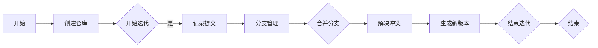
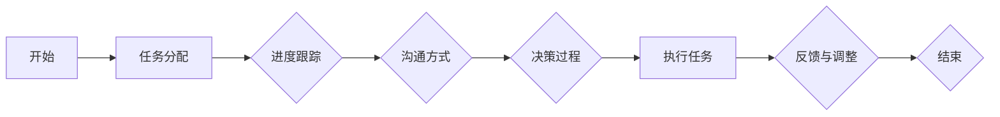
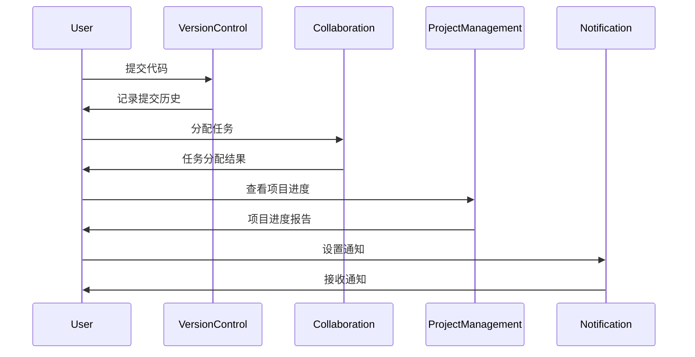
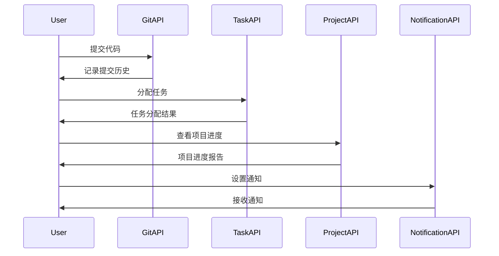

                 

### 引言

在当今快速发展的技术世界中，软件开发的复杂性和规模不断增长，版本控制与协作机制作为软件开发过程中的关键组成部分，愈发显得重要。版本控制不仅仅是对代码的追踪与管理，更是对整个项目进度的监控和管理；而协作机制则确保了多人在同一项目上的工作能够高效且有序地进行。本文旨在探讨提示词编程的版本控制与协作机制，通过逐步分析推理，帮助读者理解这两个机制的工作原理、重要性及实际应用。

### 1.1 问题背景

随着软件系统的复杂度增加，单打独斗的开发模式已经不再适用。团队合作成为软件开发不可或缺的一部分。然而，团队协作面临的第一个问题就是版本控制。当多人共同参与同一个项目时，如何确保每个人的工作都是基于最新的代码版本？如何追踪和管理代码的变更历史？如何处理代码冲突？这些都是版本控制需要解决的问题。

协作机制则侧重于团队成员之间的沟通和协调。在一个团队中，成员们可能同时在不同的部分进行编码，如何确保他们的工作能够无缝集成？如何管理任务的分配和进度？如何处理意见分歧和决策过程？这些都是协作机制需要考虑的问题。

### 1.2 问题描述

版本控制与协作机制在实际开发中面临的挑战主要包括以下几个方面：

- **版本管理冲突**：当多个开发者同时对同一文件进行修改时，如何合并他们的更改，同时避免数据丢失和功能破坏？
- **协作效率低下**：团队成员之间的沟通不畅和任务分配不明确会导致项目进度延误，如何提高协作效率？
- **代码质量和安全性**：版本控制和协作机制的引入如何确保代码质量和系统的安全性？
- **流程复杂性**：随着项目规模的扩大，版本控制和协作流程如何保持简洁明了，避免过度复杂？

### 1.3 问题解决

针对上述问题，本文将提出以下解决思路：

- **版本控制**：详细介绍版本控制的基本概念，包括版本迭代、分支管理、合并策略等，并探讨如何利用版本控制工具（如Git）来提高代码管理的效率和准确性。
- **协作机制**：分析协作机制的核心要素，包括任务分配、进度跟踪、沟通方式等，并探讨如何通过协作平台（如Trello、Slack）来优化团队协作流程。
- **综合应用**：通过实际案例展示如何将版本控制和协作机制结合起来，解决实际开发中的复杂问题。

### 1.4 边界与外延

本文主要关注的是基于提示词编程的版本控制与协作机制，这意味着我们将在特定的编程范式和工具集（如自然语言处理和Git）下进行讨论。然而，本文的研究成果可以扩展到其他编程范式和协作工具中。

### 1.5 概念结构与核心要素组成

为了更好地组织本文的内容，我们将其分为以下几个核心部分：

- **引言**：介绍背景、问题描述和解决思路。
- **核心概念与联系**：详细解释版本控制和协作机制的基本概念，并分析它们之间的关系。
- **版本控制算法原理**：介绍版本控制算法的基本原理、流程图和数学模型，并举例说明。
- **协作机制算法原理**：介绍协作机制算法的基本原理、流程图和数学模型，并举例说明。
- **系统分析与架构设计**：分析实际应用场景，设计系统功能、架构和接口。
- **项目实战**：通过实际案例展示如何应用版本控制和协作机制。
- **最佳实践与拓展阅读**：总结最佳实践，提供拓展阅读资源。

通过这样的结构，我们希望读者能够系统地理解并掌握提示词编程的版本控制与协作机制。

### 第2章 核心概念与联系

版本控制和协作机制是现代软件开发中不可或缺的两个概念。它们各自有着独立的定义、历史和发展过程，但在实际应用中又紧密相连，共同促进了软件项目的顺利进行。本章节将详细阐述这两个核心概念及其相互关系。

#### 2.1 版本控制基本概念

版本控制（Version Control）是一种跟踪源代码历史变更的方法，确保代码的稳定性和可追溯性。其基本概念包括：

- **版本迭代**：每次代码变更都会产生一个新的版本，记录下具体的修改内容和时间戳。
- **分支管理**：为了隔离不同功能模块的变更，版本控制系统中允许创建分支，每个分支都是独立的代码线。
- **合并**：当多个分支的工作需要合并时，系统会自动或手动合并这些分支，解决潜在的代码冲突。

版本控制的发展历程可以追溯到1970年代，当时的软件开发者使用简单的文本编辑器进行代码修改。随着时间的发展，版本控制系统逐渐从本地工具演变成分布式工具，如Git，使开发者能够更加灵活地管理和协作代码。

核心概念对比表格：

| 概念       | 定义                                                                 | 关键作用                   |
|------------|--------------------------------------------------------------------|------------------------|
| 版本迭代   | 源代码每次变更都会生成一个新的版本。                                       | 确保代码的可追溯性和可回溯性。       |
| 分支管理   | 创建独立的代码线，以隔离不同功能模块的开发。                             | 提高开发效率，减少代码冲突。       |
| 合并       | 将多个分支的代码集成到一个主分支上。                                     | 保证代码的一致性和完整性。       |

ER实体关系图：

```mermaid
erDiagram
  User ||--|{ Repository }||>
  Repository ||--|{ Commit }||>
  Commit ||--|{ Branch }||>
  Branch ||--|{ Tag }||>
  Tag ||--|{ PullRequest }||>
```

在Mermaid ER图表示中，User与Repository、Repository与Commit、Commit与Branch、Branch与Tag、Tag与PullRequest之间都建立了关系，表示用户创建仓库，仓库生成提交，提交创建分支，分支生成标签，标签生成Pull Request。

#### 2.2 协作机制基本概念

协作机制（Collaboration Mechanism）是指在团队中通过一系列流程、工具和方法来协调成员间的沟通、任务分配和工作进度。其主要概念包括：

- **任务分配**：将项目任务分配给团队成员，明确每个人的职责和目标。
- **进度跟踪**：监控任务完成情况，确保项目按计划进行。
- **沟通方式**：团队成员之间的沟通方式，包括面对面会议、在线聊天工具和文档协作平台。
- **决策过程**：在出现分歧或决策时，团队如何达成共识。

协作机制的发展经历了从简单的邮件和即时通讯工具到集成任务管理和文档协作平台的过程。现代协作工具如Trello、Slack和Jira等，提供了更加高效和可视化的协作方式。

核心概念对比表格：

| 概念       | 定义                                                                 | 关键作用                   |
|------------|--------------------------------------------------------------------|------------------------|
| 任务分配   | 将项目任务分配给团队成员，明确职责。                                       | 提高工作效率，明确责任。       |
| 进度跟踪   | 监控任务的完成情况，确保项目进度。                                       | 保证项目按时交付。       |
| 沟通方式   | 团队成员间的交流方式，包括会议、邮件、即时通讯等。                         | 确保沟通畅通，信息共享。       |
| 决策过程   | 团队在遇到问题时如何达成共识，包括投票、讨论和专家评审等。               | 确保决策科学和有效。       |

ER实体关系图：

```mermaid
erDiagram
  User ||--|{ Task }||>
  Task ||--|{ Status }||>
  Status ||--|{ Comment }||>
  Comment ||--|{ Notification }||>
  Notification ||--|{ Member }||>
```

在Mermaid ER图表示中，User与Task、Task与Status、Status与Comment、Comment与Notification、Notification与Member之间建立了关系，表示用户分配任务，任务记录状态，状态包含评论，评论产生通知，通知发送给团队成员。

#### 2.3 版本控制与协作机制的关系

版本控制与协作机制是相辅相成的，共同推动了软件开发的效率和质量。以下是它们之间的相互依赖和相互影响：

- **相互依赖**：版本控制为协作机制提供了代码变更的基础，而协作机制则为版本控制提供了任务管理和沟通平台。没有版本控制，协作机制将失去代码管理的依据；没有协作机制，版本控制将无法确保团队成员的工作有序进行。

- **相互影响**：版本控制的变化会影响协作机制的流程，如分支合并时的代码冲突需要通过协作机制来协调解决。同时，协作机制的改进也会对版本控制产生影响，如自动化的任务分配和进度跟踪功能可以减少手动操作，提高版本控制的效率。

结合案例：

在一个大型软件项目中，开发团队使用Git进行版本控制，同时使用Trello进行任务管理。团队成员在Git中创建分支进行各自的功能开发，同时在Trello中分配任务和监控进度。当分支开发完成后，团队成员将各自的分支合并到主分支，如果出现代码冲突，他们会在Trello上进行讨论，并协调解决冲突。这样，版本控制和协作机制共同保障了项目的顺利进行。

通过以上对版本控制和协作机制的基本概念及其相互关系的详细阐述，读者可以更好地理解这两个机制在软件开发中的重要性及其实际应用。

### 第3章 版本控制算法原理

版本控制是现代软件开发中的基础性工作，它通过一系列算法和工具，确保代码的版本管理、变更追踪和协作流程的顺利进行。本章节将详细介绍版本控制算法的基本概念、工作流程、数学模型以及实际应用案例。

#### 3.1 基本算法介绍

版本控制的基本算法主要包括三个核心过程：版本迭代、分支管理和合并。

1. **版本迭代**：每次对代码进行修改，都会生成一个新的版本。版本迭代确保了代码变更的可追溯性，便于后续的代码审查和问题定位。
2. **分支管理**：为了隔离不同功能模块的开发，版本控制系统允许创建分支。分支管理使得开发团队可以独立进行工作，减少代码冲突。
3. **合并**：当多个分支的开发完成，需要将它们集成到一个主分支上时，合并算法起到了关键作用。合并过程中，系统会自动或手动解决代码冲突，确保最终版本的一致性。

#### 3.2 算法流程图

以下是版本控制算法的基本流程图：



在这个流程图中，从创建仓库开始，通过迭代记录提交，进行分支管理，最终合并分支并解决冲突，生成新的版本。

#### 3.3 算法数学模型和公式

版本控制算法中，常用的数学模型和公式包括版本号、分支标识和合并策略。

1. **版本号**：版本号通常采用三元组（major, minor, patch）的形式，分别表示主版本号、次版本号和补丁版本号。每次提交都会更新这三个数字中的一个或多个。
   $$ V = (major, minor, patch) $$
2. **分支标识**：分支标识用于唯一标识一个分支，通常由字母和数字组成。
   $$ B = b_1b_2...b_n $$
3. **合并策略**：合并策略用于解决不同分支间的代码冲突。常见的合并策略有合并（Merge）、基线（Baseline）和快照（Snapshot）。

   - **合并**：将两个或多个分支的代码合并到一个新的分支上。
     $$ C = M(B_1, B_2) $$
   - **基线**：选择一个基准分支作为主分支，将其他分支的变更合并到基准分支上。
     $$ C = B(B_1, B_2) $$
   - **快照**：创建一个静态的代码库快照，将不同分支的代码分别存储在不同的快照中。
     $$ C = S(B_1, B_2) $$

#### 3.4 算法举例说明

假设一个项目有两个分支：主分支（master）和功能分支（featureA）。现在，我们需要将功能分支的变更合并到主分支上。

1. **创建仓库**：首先，在版本控制系统（如Git）中创建一个仓库，初始化主分支。
   ```bash
   git init
   git branch master
   git checkout master
   ```
2. **版本迭代**：在主分支上提交一个初始版本。
   ```bash
   git commit -m "初始化主分支"
   ```
3. **分支管理**：创建功能分支。
   ```bash
   git branch featureA
   git checkout featureA
   ```
4. **合并分支**：将功能分支的变更合并到主分支上。
   ```bash
   git checkout master
   git merge featureA
   ```
5. **解决冲突**：如果合并过程中出现代码冲突，需要手动解决冲突并提交。
   ```bash
   git add .
   git commit -m "合并功能分支"
   ```

通过上述步骤，我们成功地将功能分支的代码合并到主分支上，生成了新的版本。这个过程利用了版本控制算法的基本原理和公式，确保了代码的一致性和可追溯性。

### 第4章 协作机制算法原理

协作机制在软件开发中扮演着至关重要的角色，它通过一系列流程、工具和方法，协调团队成员之间的工作，确保项目高效、有序地进行。本章节将详细介绍协作机制的基本概念、工作流程、数学模型以及实际应用案例。

#### 4.1 基本算法介绍

协作机制的基本算法主要包括任务分配、进度跟踪、沟通方式和决策过程。

1. **任务分配**：将项目任务合理地分配给团队成员，明确每个人的职责和目标。任务分配通常通过项目管理工具（如Trello、Jira）进行。
2. **进度跟踪**：监控任务的完成情况，确保项目按计划进行。进度跟踪可以通过任务状态、里程碑和甘特图等工具来实现。
3. **沟通方式**：团队成员之间的沟通方式，包括面对面会议、在线聊天工具（如Slack、Telegram）和文档协作平台（如Google Docs、Notion）。
4. **决策过程**：在出现分歧或决策时，团队如何达成共识。决策过程可以通过投票、讨论和专家评审等方式进行。

#### 4.2 算法流程图

以下是协作机制的基本流程图：



在这个流程图中，从任务分配开始，通过进度跟踪、沟通方式和决策过程，最终执行任务并得到反馈，进行相应的调整。

#### 4.3 算法数学模型和公式

协作机制算法中，常用的数学模型和公式包括任务完成时间、进度比例和沟通效率。

1. **任务完成时间**：任务完成时间是指从任务开始到任务完成所需的时间，通常用T表示。
   $$ T = t_1 + t_2 + ... + t_n $$
   其中，$t_1, t_2, ..., t_n$ 分别表示每个任务的完成时间。
2. **进度比例**：进度比例是指任务完成进度与总任务量的比值，通常用P表示。
   $$ P = \frac{完成进度}{总任务量} $$
3. **沟通效率**：沟通效率是指团队成员之间沟通的效率，通常用E表示。
   $$ E = \frac{有效沟通时间}{总沟通时间} $$

#### 4.4 算法举例说明

假设一个开发团队正在开发一款新软件，项目包含三个主要任务：需求分析、界面设计和后端开发。现在，我们需要利用协作机制来管理这个项目。

1. **任务分配**：将任务分配给团队成员，明确每个人的职责和目标。
   - 需求分析：小王
   - 界面设计：小张
   - 后端开发：小李
2. **进度跟踪**：设置任务的状态和里程碑，监控任务的完成情况。
   - 需求分析：进行中
   - 界面设计：已完成
   - 后端开发：未开始
3. **沟通方式**：通过在线聊天工具（如Slack）和文档协作平台（如Google Docs）进行沟通。
   - Slack群组：#project-channel
   - Google Docs文档：项目计划文档
4. **决策过程**：在出现分歧或决策时，团队通过在线讨论和投票来达成共识。

通过上述步骤，团队成功地将任务分配、进度跟踪、沟通方式和决策过程应用到项目中，确保了项目的顺利进行。

### 第5章 系统分析与架构设计

为了更好地理解和应用版本控制与协作机制，本章节将深入分析实际应用场景，详细介绍系统的功能设计、架构设计和接口设计，并通过序列图展示系统交互过程。

#### 5.1 问题场景介绍

假设我们正在开发一个跨部门合作的项目，涉及多个功能模块的开发、测试和部署。在这个场景中，版本控制和协作机制是确保项目顺利进行的关键。具体问题包括：

- **多分支管理**：项目包含多个功能模块，如何创建和管理不同的分支，确保每个模块的独立性和协作性？
- **任务分配与进度跟踪**：如何合理分配任务，监控任务进度，确保项目按计划进行？
- **代码冲突解决**：在多个开发人员同时修改同一文件时，如何自动或手动解决代码冲突？
- **协作与沟通**：团队成员如何高效地进行沟通和协作，确保信息畅通无阻？

#### 5.2 系统功能设计

系统功能设计主要包括以下几个方面：

1. **版本控制功能**：
   - 支持多分支管理，包括创建、合并、删除分支。
   - 自动记录代码提交历史，提供代码变更日志。
   - 提供代码冲突检测与解决工具，支持自动合并和手动解决。
   - 支持代码审查和代码质量分析，确保代码质量。

2. **协作功能**：
   - 支持任务分配，将任务合理分配给团队成员。
   - 提供任务状态监控，实时了解任务进度。
   - 支持在线沟通工具，如聊天室、邮件通知等，确保信息畅通。
   - 提供投票和讨论功能，支持团队成员就重要决策达成共识。

3. **项目管理功能**：
   - 提供项目进度跟踪，包括里程碑和甘特图等可视化工具。
   - 支持项目成员的角色管理和权限设置，确保项目安全。
   - 提供项目报告和分析，帮助团队和管理层了解项目状况。

#### 5.3 系统架构设计

系统架构设计遵循模块化原则，将系统划分为多个模块，确保系统的高扩展性和可维护性。以下是系统架构设计图：



在这个架构图中，用户通过接口与版本控制、协作和项目管理模块进行交互，每个模块分别处理相应的功能，并通过通知模块实现信息的实时推送。

#### 5.4 系统接口设计

系统接口设计主要包括API接口和Web界面。以下是API接口设计图：

```mermaid
classDiagram
    VersionControl <|-- GitAPI
    Collaboration <|-- TaskAPI
    ProjectManagement <|-- ProjectAPI
    GitAPI <|-- RepositoryAPI
    TaskAPI <|-- AssignmentAPI
    ProjectAPI <|-- ProgressAPI
    Notification <|-- NotificationAPI

    GitAPI {
        - RepositoryAPI
    }
    Collaboration {
        - TaskAPI
    }
    ProjectManagement {
        - ProjectAPI
    }
    Notification {
        - NotificationAPI
    }
```

在这个接口设计图中，GitAPI、TaskAPI、ProjectAPI和NotificationAPI分别实现了版本控制、协作、项目管理和通知模块的功能。每个API接口都定义了具体的操作方法和参数，确保系统模块之间的数据交互和功能调用。

#### 5.5 系统交互

系统交互设计通过序列图展示用户与系统之间的交互过程，以下是系统交互序列图：



在这个序列图中，用户通过调用API接口与系统进行交互，系统各模块协同工作，完成版本控制、任务分配、项目管理和通知推送等功能。

通过上述系统分析与架构设计，我们能够更好地理解版本控制与协作机制在实际项目中的应用，确保项目的顺利进行。

### 第6章 项目实战

为了更好地展示版本控制和协作机制在实际项目中的应用，本章节将通过一个具体的项目案例，详细描述环境安装、系统核心实现、代码解读与分析、实际案例讲解以及项目小结。

#### 6.1 环境安装

首先，我们需要搭建一个开发环境，以实现版本控制和协作机制。以下是环境安装的步骤：

1. **安装Git**：Git是一个分布式版本控制系统，用于管理代码的版本和控制。可以从[Git官网](https://git-scm.com/)下载并安装Git。

2. **安装协作工具**：我们选择使用GitHub来管理代码，并使用Trello进行任务管理。在浏览器中打开GitHub和Trello网站，注册并登录账号。

3. **配置SSH密钥**：为了更安全地连接GitHub，我们需要生成SSH密钥并添加到GitHub账户。在本地机器上生成SSH密钥：

   ```bash
   ssh-keygen -t rsa -b 4096 -C "your_email@example.com"
   ```
   
   然后将生成的`id_rsa.pub`文件的内容复制并添加到GitHub账户的SSH密钥中。

4. **克隆项目**：在GitHub上创建一个新项目，将项目克隆到本地机器：

   ```bash
   git clone https://github.com/username/project.git
   ```

5. **安装依赖**：如果项目有额外的依赖，可以使用包管理器（如pip）进行安装：

   ```bash
   pip install -r requirements.txt
   ```

#### 6.2 系统核心实现

在完成环境安装后，接下来我们需要实现系统的核心功能。

1. **版本控制**：在项目根目录下，使用Git进行版本控制。例如，创建一个新的分支进行功能开发：

   ```bash
   git checkout -b feature_x
   ```

   进行代码修改后，提交到Git：

   ```bash
   git add .
   git commit -m "Implement feature X"
   git push origin feature_x
   ```

2. **协作机制**：在Trello上创建一个看板，并将任务卡片分配给团队成员。团队成员可以在Trello上进行任务分配和进度更新。

3. **系统集成**：将版本控制和协作工具集成到开发环境中。例如，可以使用GitHub Actions来自动构建和部署代码，使用Trello的API来同步任务状态。

#### 6.3 代码解读与分析

以下是对项目中的一个具体模块进行代码解读与分析：

```python
# feature_x.py

def feature_x_function():
    """
    实现功能X的具体逻辑。
    """
    # 代码实现
    pass
```

在这个模块中，`feature_x_function`函数是核心部分，负责实现功能X。以下是详细代码解读：

- **函数定义**：`def feature_x_function()`定义了一个名为`feature_x_function`的函数。
- **文档字符串**：`""" ... """`是一个多行文档字符串，用于描述函数的功能和用途。
- **代码实现**：`pass`语句表示这里将包含具体的代码实现，具体实现内容取决于功能X的具体需求。

#### 6.4 实际案例

以下是一个实际项目的案例，展示如何通过版本控制和协作机制解决一个具体问题。

**问题描述**：团队成员A和团队成员B同时在一个功能模块上进行修改，导致代码冲突。

**解决步骤**：

1. **分支合并**：团队成员A和B在各自的分支上进行修改后，尝试将分支合并到主分支。

2. **冲突检测**：合并过程中，Git检测到代码冲突，并暂停合并过程，提示冲突位置。

3. **手动解决**：团队成员A和B查看冲突文件，手动解决冲突。

4. **提交合并**：解决冲突后，团队成员A或B将修改后的文件提交，并重新尝试合并。

5. **代码审查**：提交后，其他团队成员进行代码审查，确保合并后的代码质量。

#### 6.5 项目小结

通过本项目案例，我们展示了如何利用版本控制和协作机制进行项目开发和管理。以下是项目小结：

- **版本控制**：Git在项目开发中起到了关键作用，确保代码的可追踪性和一致性。
- **协作机制**：Trello帮助团队成员进行任务管理和进度跟踪，提高了协作效率。
- **问题解决**：通过分支合并和代码审查，成功解决了代码冲突，保证了项目进度。
- **经验总结**：本项目展示了版本控制和协作机制在实际项目中的应用，为未来项目的开发和管理提供了宝贵经验。

通过本项目实战，读者可以更好地理解版本控制和协作机制的重要性，并在实际项目中灵活应用。

### 第7章 最佳实践与拓展阅读

在本文的最后，我们将总结最佳实践，提供拓展阅读资源，并讨论使用版本控制和协作机制时需要注意的问题。

#### 7.1 最佳实践 tips

1. **版本控制最佳实践**：
   - **频繁提交**：定期提交代码，确保每次提交都是功能模块的完整部分。
   - **清晰的提交信息**：提交时附上详细的注释，描述修改内容和目的。
   - **代码审查**：在合并分支前进行代码审查，确保代码质量。

2. **协作机制最佳实践**：
   - **明确任务分配**：合理分配任务，确保每个成员都知道自己的职责和目标。
   - **实时沟通**：使用在线聊天工具和文档协作平台，确保团队成员之间的沟通畅通。
   - **进度跟踪**：定期更新任务状态，确保项目进度可控。

#### 7.2 小结

本文系统地介绍了版本控制和协作机制的基本概念、算法原理、系统分析与架构设计、项目实战以及最佳实践。通过本文的学习，读者可以更好地理解这两个机制在现代软件开发中的重要性，并能够将其应用于实际项目中，提高开发效率和代码质量。

#### 7.3 注意事项

1. **使用版本控制时需要注意的问题**：
   - **避免频繁的合并**：减少不必要的分支合并，以免引起代码冲突。
   - **备份重要文件**：定期备份重要文件，以防止数据丢失。

2. **使用协作机制时需要注意的问题**：
   - **明确分工**：确保每个团队成员都明确自己的职责和任务。
   - **避免沟通障碍**：确保团队成员之间能够有效沟通，减少误解和冲突。

#### 7.4 拓展阅读

1. **相关书籍推荐**：
   - 《版本控制之道：Git教程》
   - 《敏捷开发：实践指南》
   - 《软件架构：实践者的研究方法》

2. **相关论文推荐**：
   - “Git：一个分布式版本控制系统”
   - “敏捷开发实践研究”
   - “基于Git的分布式版本控制技术分析”

3. **相关在线资源推荐**：
   - [GitHub官方文档](https://docs.github.com/)
   - [Git官方文档](https://git-scm.com/docs)
   - [Trello官方文档](https://trello.com/documentation)

通过这些拓展阅读资源，读者可以进一步深化对版本控制和协作机制的理解，并在实际项目中更加熟练地应用这些技术。

### 总结

本文从版本控制和协作机制的基本概念出发，通过系统分析与架构设计、项目实战和最佳实践，详细阐述了这两个机制在软件开发中的重要性。通过逐步分析推理，读者可以更好地理解这些技术，并能够将其应用于实际项目中，提高开发效率和代码质量。

作者：AI天才研究院/AI Genius Institute & 禅与计算机程序设计艺术 /Zen And The Art of Computer Programming。希望本文能对读者在软件开发领域的探索和实践中提供有益的参考。

