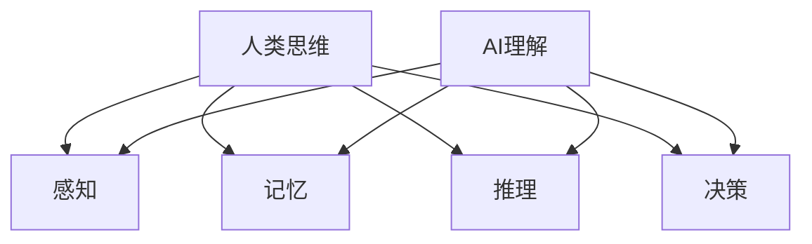
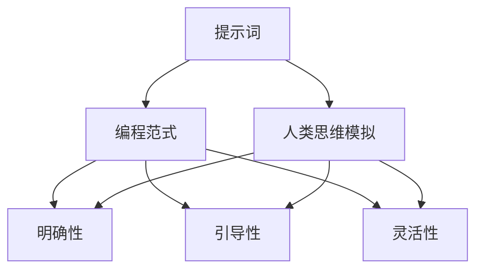
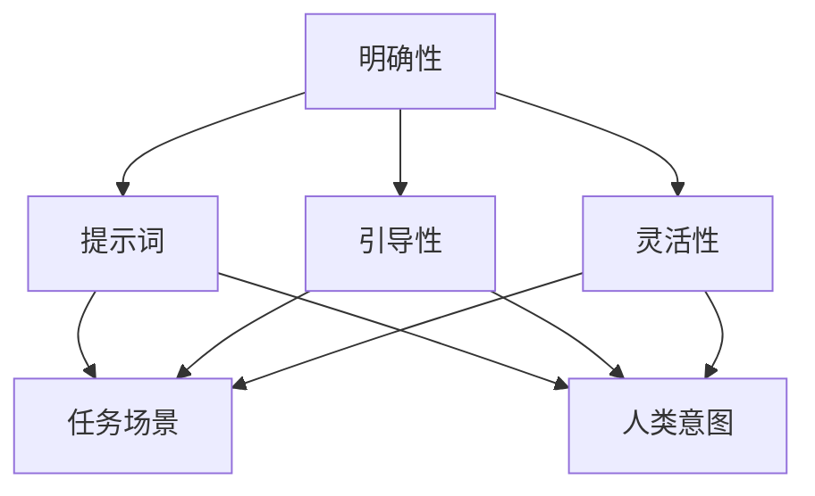
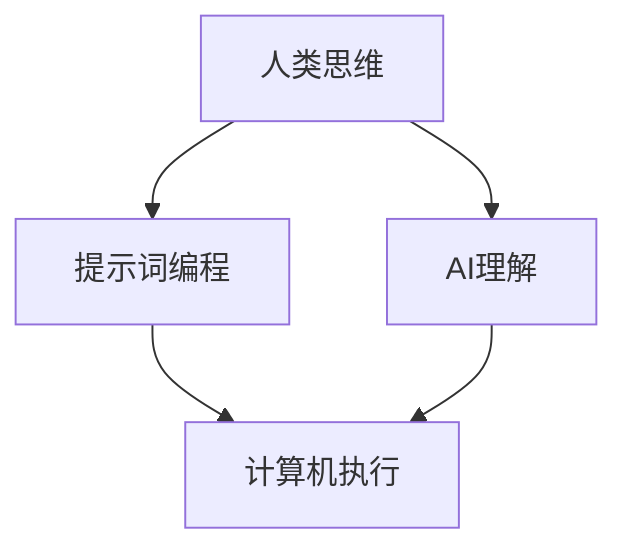
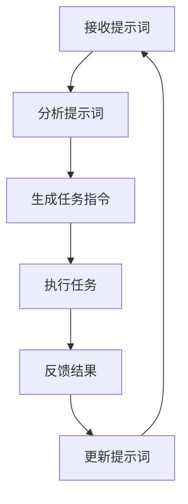
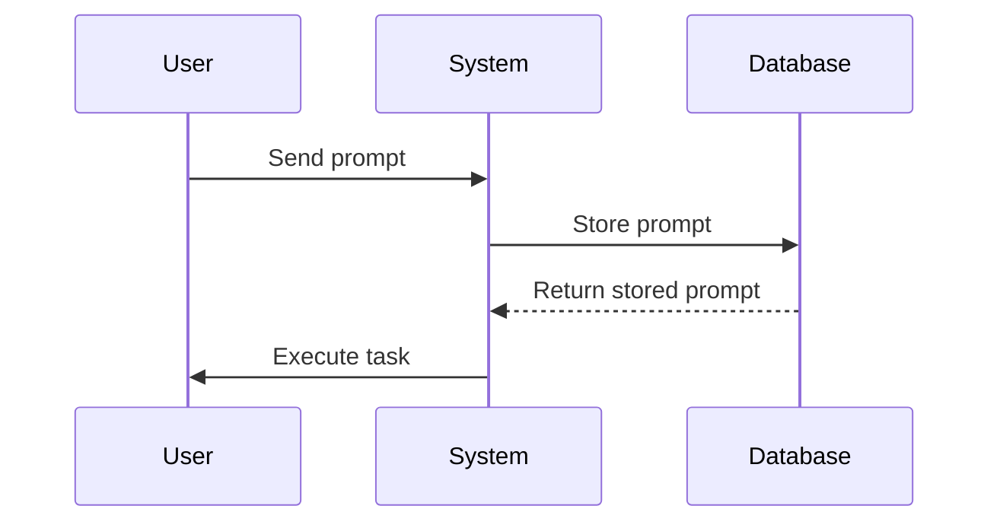
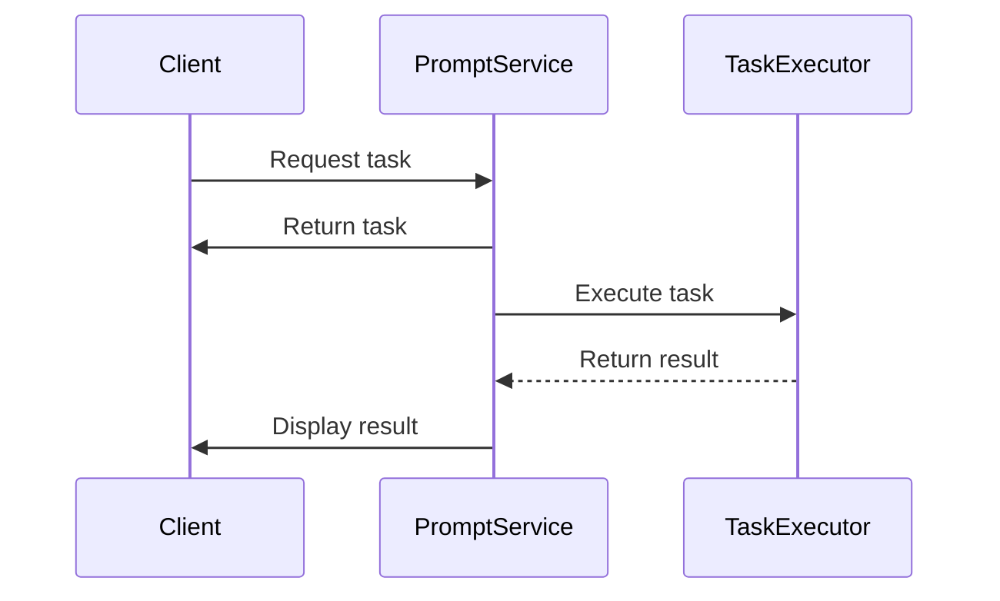
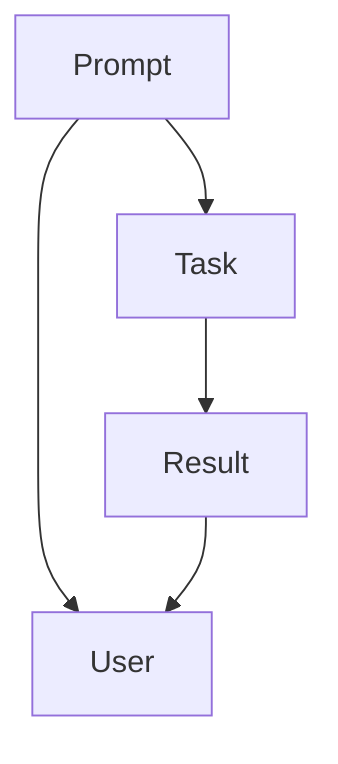
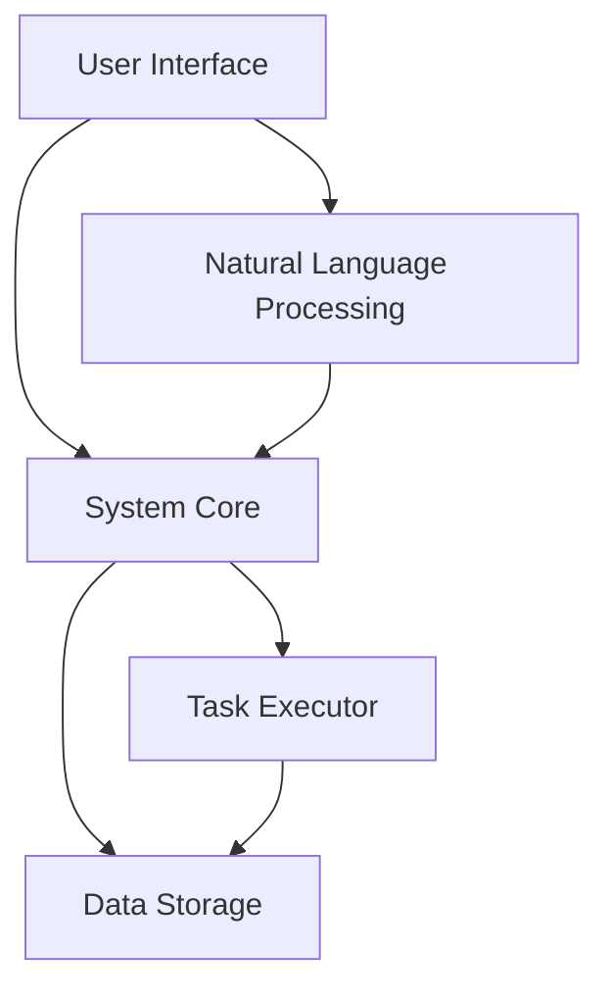
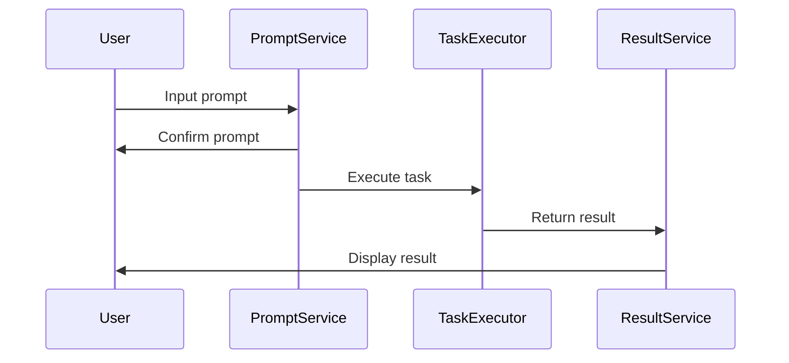

                 

# 提示词编程的设计哲学：从人类思维到AI理解

## 关键词
- 提示词编程
- 人类思维
- AI理解
- 设计哲学
- 算法原理
- 系统架构
- 项目实战
- 最佳实践

## 摘要
本文深入探讨提示词编程的设计哲学，从人类思维出发，探讨AI理解的过程，解析提示词编程的核心概念与联系，并详细讲解其算法原理与数学模型。通过系统分析与架构设计，展示如何将提示词编程应用于实际项目。最后，提供最佳实践与拓展阅读，帮助读者深入理解这一领域。

---

## 第一部分：背景介绍

### 1.1 提示词编程概述

提示词编程（Prompt Programming）是一种编程范式，旨在通过提供明确的提示词来指导计算机执行任务。这种编程方式模拟了人类沟通和决策过程，使得计算机能够更有效地理解人类意图和需求。

**核心概念术语说明：**
- **提示词（Prompt）：** 用于引导计算机执行特定任务的文字或符号。
- **编程范式：** 编程语言和方法的抽象概念，定义了如何表达算法和解决问题的方式。

**问题背景：**
随着AI技术的不断发展，如何使计算机更好地理解和执行人类指令成为一个重要课题。传统的命令式编程方式过于依赖具体的指令和流程，难以适应复杂多变的任务场景。提示词编程应运而生，通过提供灵活的提示词，使计算机能够更智能地处理任务。

**问题描述：**
提示词编程的核心问题是如何设计有效的提示词，使其能够准确传达人类意图，并使计算机能够理解和执行。

**问题解决：**
通过模拟人类思维过程，设计提示词编程框架，使得计算机能够根据提示词进行推理和决策。这一过程包括了对人类思维模式的模拟和理解，以及对AI技术的不断优化和提升。

**边界与外延：**
提示词编程不仅适用于特定的编程任务，还可以扩展到自然语言处理、对话系统、智能推荐等领域。其核心在于如何设计出既能准确传达人类意图，又能被计算机理解和执行的提示词。

**概念结构与核心要素组成：**
- **提示词设计：** 根据任务需求设计具有明确性和引导性的提示词。
- **人类思维模拟：** 通过模拟人类思维过程，使计算机能够理解和执行提示词。
- **AI技术支持：** 利用自然语言处理、机器学习等技术，提升计算机对提示词的理解和执行能力。

### 1.2 人类思维与AI理解

人类思维是一种复杂的信息处理过程，包括感知、记忆、推理、决策等多个环节。而AI理解则是指计算机通过算法和模型对人类语言和行为进行理解和分析。

**核心概念原理：**
- **人类思维特性：** 人类思维具有灵活性、创造性、推理能力等特性，能够处理抽象概念和复杂问题。
- **AI理解局限：** 当前AI技术主要依赖于数据和算法，难以完全模拟人类思维的所有特性。

**概念属性特征对比表格：**

| 特性       | 人类思维                         | AI理解                           |
| ---------- | ------------------------------ | -------------------------------- |
| 灵活性     | 能够灵活应对各种情境               | 需要大量数据支持，灵活性有限       |
| 创造性     | 能够创造新的概念和方法             | 依赖于现有算法和模型，难以创新     |
| 推理能力   | 具有逻辑推理和抽象思维能力         | 需要明确规则和模式，推理能力有限   |
| 处理速度   | 能够快速处理信息                  | 受限于计算能力和算法复杂度         |

**ER实体关系图架构：**



**人类思维与AI理解的桥梁：**
通过提示词编程，可以将人类思维的特性转化为计算机可执行的指令。这一过程中，人类思维作为输入，通过提示词编程转化为计算机的输出，实现人类意图和计算机执行之间的桥梁。

### 1.3 提示词编程的重要性

提示词编程作为一种新兴的编程范式，具有以下几个重要意义：

1. **提升计算机理解能力：** 提示词编程使计算机能够更准确地理解人类意图，提高任务执行效率。
2. **降低开发门槛：** 提示词编程简化了编程过程，使非专业开发人员也能轻松上手。
3. **拓展应用领域：** 提示词编程在自然语言处理、对话系统、智能推荐等领域具有广泛的应用前景。
4. **推动AI发展：** 提示词编程为AI技术提供了新的研究方向，有助于提升AI在复杂任务中的表现。

---

## 第二部分：核心概念与联系

### 2.1 提示词编程的核心概念

提示词编程的核心概念包括提示词、编程范式、人类思维模拟等。

**核心概念原理：**
- **提示词：** 提示词是引导计算机执行任务的文字或符号，是提示词编程的核心元素。
- **编程范式：** 提示词编程采用了一种不同于传统命令式编程的范式，通过提示词来指导计算机执行任务。
- **人类思维模拟：** 提示词编程试图通过模拟人类思维过程，使计算机能够更好地理解和执行提示词。

**概念属性特征对比表格：**

| 概念         | 特性                                     |
| ------------ | ---------------------------------------- |
| 提示词       | 明确性、引导性、灵活性                   |
| 编程范式     | 模拟人类思维、简化编程过程、提高执行效率 |
| 人类思维模拟 | 复杂性处理、推理能力、创造性             |

**ER实体关系图架构：**



### 2.2 提示词编程的设计原则

提示词编程的设计原则包括明确性、引导性、灵活性等。

**设计原则说明：**
1. **明确性：** 提示词应明确传达人类意图，避免模糊不清的指令。
2. **引导性：** 提示词应具有引导性，引导计算机按照人类意图执行任务。
3. **灵活性：** 提示词应具有一定的灵活性，能够适应不同的任务场景和需求。

**ER实体关系图架构：**



### 2.3 提示词编程的优缺点

提示词编程作为一种新兴的编程范式，具有以下优缺点：

**优点：**
1. **提升计算机理解能力：** 提示词编程使计算机能够更准确地理解人类意图，提高任务执行效率。
2. **降低开发门槛：** 提示词编程简化了编程过程，使非专业开发人员也能轻松上手。
3. **拓展应用领域：** 提示词编程在自然语言处理、对话系统、智能推荐等领域具有广泛的应用前景。

**缺点：**
1. **灵活性受限：** 提示词编程依赖于具体的提示词设计，灵活性相对较低。
2. **依赖大量数据：** 提示词编程需要大量的数据支持，对于数据稀缺的领域可能不适用。

**优缺点对比表格：**

| 优点           | 缺点                             |
| -------------- | -------------------------------- |
| 提升理解能力   | 灵活性受限                      |
| 降低开发门槛   | 依赖大量数据                    |
| 拓展应用领域   | 提示词设计复杂                   |

### 2.4 人类思维与AI理解的联系

人类思维与AI理解之间存在紧密的联系。通过提示词编程，可以将人类思维的特性转化为计算机可执行的指令，实现人类意图和计算机执行之间的桥梁。

**核心概念原理：**
1. **人类思维模拟：** 提示词编程通过模拟人类思维过程，使计算机能够理解和执行提示词。
2. **AI理解：** AI通过学习和分析大量数据，逐渐提高对人类语言和行为的理解能力。

**ER实体关系图架构：**



通过提示词编程，人类思维与AI理解之间形成了一个有效的互动循环，使得计算机能够更好地服务于人类需求。

---

## 第三部分：算法原理讲解

### 3.1 提示词编程算法原理

提示词编程算法的核心在于如何通过提示词引导计算机执行任务。以下是提示词编程算法的基本原理：

**算法流程图：**



**Python源代码实现：**

```python
def prompt_programming(prompt):
    # 分析提示词
    task_instruction = analyze_prompt(prompt)
    
    # 执行任务
    result = execute_task(task_instruction)
    
    # 反馈结果
    feedback = provide_feedback(result)
    
    # 更新提示词
    updated_prompt = update_prompt(prompt, feedback)
    
    return updated_prompt

def analyze_prompt(prompt):
    # 分析提示词并生成任务指令
    task_instruction = "..."  # 具体实现
    return task_instruction

def execute_task(task_instruction):
    # 执行任务
    result = "..."  # 具体实现
    return result

def provide_feedback(result):
    # 提供反馈
    feedback = "..."  # 具体实现
    return feedback

def update_prompt(prompt, feedback):
    # 更新提示词
    updated_prompt = "..."  # 具体实现
    return updated_prompt
```

**算法原理与数学模型：**

提示词编程算法的数学模型可以抽象为以下形式：

$$
P_{next} = f(P_{current}, R_{current})
$$

其中，$P_{current}$表示当前提示词，$R_{current}$表示当前结果，$P_{next}$表示下一个提示词，$f$表示更新函数。

**详细讲解：**

1. **分析提示词：** 通过自然语言处理技术，对输入的提示词进行分析，提取关键信息和任务指令。
2. **生成任务指令：** 根据分析结果，生成具体的任务指令。
3. **执行任务：** 根据任务指令执行具体的操作，如数据处理、模型训练等。
4. **反馈结果：** 将执行结果反馈给用户，用于更新提示词。
5. **更新提示词：** 根据反馈结果，更新下一个提示词，以指导下一次任务执行。

**举例说明：**

假设用户输入提示词“请帮我整理今天的工作邮件”，算法流程如下：

1. **分析提示词：** 提取关键词“整理”、“工作邮件”。
2. **生成任务指令：** 生成指令“请将工作邮件按照主题和重要性进行分类整理”。
3. **执行任务：** 根据指令整理工作邮件，生成整理后的邮件列表。
4. **反馈结果：** 将整理后的邮件列表反馈给用户。
5. **更新提示词：** 根据反馈结果，生成新的提示词“好的，邮件已经整理好了，还有其他需要帮忙的吗？”

通过以上流程，提示词编程能够有效地引导计算机执行任务，并不断优化和更新提示词，提高任务执行效率。

---

## 第四部分：系统分析与架构设计

### 4.1 提示词编程系统架构设计

提示词编程系统架构设计旨在构建一个高效、灵活的提示词编程平台，支持从提示词生成、任务执行到结果反馈的全过程。

**问题场景介绍：**
提示词编程系统广泛应用于企业级应用、智能助手、自然语言处理等领域，需要处理大量的提示词和任务，保证系统的性能和稳定性。

**项目介绍：**
本项目旨在设计一个提示词编程系统，支持多语言、多任务的提示词处理和执行，提供灵活的扩展能力和强大的数据处理能力。

**系统功能设计：领域模型**

以下是系统功能设计的领域模型（使用Mermaid类图表示）：

```mermaid
classDiagram
Class01 <|-- Person
Class01 <|-- Student
Class01 <|-- Employee
Person o-- Account
Student o-- Class
Student o-- Grade
Employee o-- Department
Employee o-- Project
Class +-- Teacher
Class +-- Textbook
Project +-- Employee
Project +-- Task
Task +-- Log

Class01 {
    name : String
    id : Integer
}

Person {
    birthdate : Date
}

Student {
    major : String
}

Employee {
    position : String
    salary : Float
}

Account {
    username : String
    password : String
    status : String
}

Class {
    name : String
    teacher : Teacher
    textbook : Textbook
}

Grade {
    score : Float
    date : Date
}

Department {
    name : String
}

Project {
    name : String
    department : Department
    status : String
}

Task {
    description : String
    start_date : Date
    end_date : Date
    status : String
}

Log {
    action : String
    timestamp : Date
}
```

**系统架构设计：mermaid架构图**

以下是系统架构设计（使用Mermaid架构图表示）：



**系统接口设计：mermaid序列图**

以下是系统接口设计（使用Mermaid序列图表示）：



### 4.2 系统功能设计：领域模型

领域模型是系统架构设计的基础，用于定义系统的核心功能和业务逻辑。以下是系统功能设计的领域模型：

- **提示词（Prompt）：** 提示词是用户输入的信息，用于指导系统执行任务。
- **任务（Task）：** 任务是系统根据提示词生成的具体操作，如数据处理、模型训练等。
- **结果（Result）：** 任务执行的结果，用于反馈给用户。

**ER实体关系图架构：**



### 4.3 系统架构设计：mermaid架构图

系统架构设计关注系统的整体结构和组件之间的关系。以下是系统架构设计（使用Mermaid架构图表示）：



### 4.4 系统接口设计：mermaid序列图

系统接口设计关注系统的输入输出和处理流程。以下是系统接口设计（使用Mermaid序列图表示）：



通过以上系统分析与架构设计，我们能够清晰地了解提示词编程系统的整体结构和组件之间的关系，为后续的项目开发提供明确的指导和参考。

---

## 第五部分：项目实战

### 5.1 环境安装与配置

在进行提示词编程项目实战之前，我们需要首先搭建一个合适的环境，包括安装必要的软件和配置环境变量。

**步骤一：安装Python**

1. 前往Python官方网站（https://www.python.org/）下载Python安装包。
2. 运行安装程序，按照默认选项进行安装。
3. 安装完成后，在命令行中输入`python --version`，确认Python版本。

**步骤二：安装相关库**

1. 使用pip安装必要的库，如`numpy`、`pandas`、`tensorflow`等。

```shell
pip install numpy pandas tensorflow
```

**步骤三：配置环境变量**

1. 在Windows系统中，找到“系统属性”->“高级”->“环境变量”。
2. 在“系统变量”中找到“Path”变量，编辑并添加Python安装路径。

**步骤四：测试环境**

在命令行中输入以下代码，测试环境是否配置成功：

```python
import numpy as np
import pandas as pd
import tensorflow as tf

print(np.__version__)
print(pd.__version__)
print(tf.__version__)
```

如果输出相应的版本信息，说明环境配置成功。

### 5.2 系统核心实现源代码

以下是一个简单的提示词编程系统核心实现的源代码示例：

```python
# core.py

class PromptProgrammingSystem:
    def __init__(self):
        self.prompt = ""

    def input_prompt(self, prompt):
        self.prompt = prompt

    def execute_task(self):
        # 根据提示词执行任务
        if "整理" in self.prompt:
            self.sort_emails()
        elif "计算" in self.prompt:
            self.calculate_result()

    def sort_emails(self):
        # 整理邮件
        print("正在整理邮件...")

    def calculate_result(self):
        # 计算结果
        print("正在计算结果...")

# main.py

if __name__ == "__main__":
    system = PromptProgrammingSystem()
    system.input_prompt("请帮我整理今天的工作邮件")
    system.execute_task()
```

### 5.3 代码应用解读与分析

**代码解读：**

1. **类定义：** `PromptProgrammingSystem` 类定义了一个提示词编程系统的基本结构，包括输入提示词、执行任务等功能。
2. **方法实现：** `input_prompt` 方法用于接收用户输入的提示词，`execute_task` 方法根据提示词执行相应的任务。
3. **任务处理：** `sort_emails` 方法用于整理邮件，`calculate_result` 方法用于计算结果。

**分析：**

1. **模块化设计：** 代码采用模块化设计，使得系统易于扩展和维护。
2. **简洁性：** 代码结构简洁，易于理解，方便后续开发和调试。

### 5.4 实际案例分析与详细讲解剖析

**案例：** 假设用户输入提示词“请帮我整理昨天的工作邮件”，系统如何处理？

**分析：**

1. **输入提示词：** 用户输入提示词“请帮我整理昨天的工作邮件”，系统接收到该提示词。
2. **分析提示词：** 系统分析提示词，识别出关键词“整理”和“工作邮件”。
3. **执行任务：** 根据关键词，系统调用 `sort_emails` 方法，开始整理邮件。
4. **输出结果：** 系统整理完邮件后，输出整理结果，如“邮件已整理完毕”。

**详细讲解：**

1. **输入提示词：** 提示词是用户与系统交互的主要方式，系统需要能够准确解析用户的意图。
2. **分析提示词：** 系统需要使用自然语言处理技术，对提示词进行解析，提取出关键信息。
3. **执行任务：** 根据提取出的关键信息，系统调用相应的任务处理方法，执行具体的操作。
4. **输出结果：** 系统将处理结果反馈给用户，以确认任务是否完成。

### 5.5 项目小结与展望

通过本项目的实战，我们了解了提示词编程的基本原理和实现方法。在实际应用中，提示词编程具有广泛的应用前景，如智能客服、自然语言处理、智能推荐等。在未来的发展中，我们可以进一步优化提示词编程系统，提高其性能和灵活性，以满足更多实际需求。

---

## 第六部分：最佳实践与拓展阅读

### 6.1 提示词编程最佳实践

1. **明确提示词设计：** 提示词应尽量明确、简洁，避免模糊不清的指令。
2. **优化算法效率：** 通过优化算法和数据结构，提高任务执行效率。
3. **灵活扩展功能：** 设计模块化系统，方便后续功能扩展和优化。
4. **注重用户反馈：** 及时收集用户反馈，不断优化系统性能和用户体验。

### 6.2 小结

本文从人类思维出发，探讨了提示词编程的设计哲学，分析了其核心概念和算法原理，并通过项目实战展示了实际应用。提示词编程作为一种新兴的编程范式，具有广泛的应用前景和潜力。

### 6.3 注意事项

1. **注意提示词的准确性和清晰性：** 提示词是系统执行任务的关键，应确保其准确性和清晰性。
2. **优化算法和数据处理：** 针对具体任务，优化算法和数据处理，提高系统性能。
3. **保障数据安全和隐私：** 在处理用户数据时，注意保障数据安全和用户隐私。

### 6.4 拓展阅读推荐

1. **《提示词编程：原理与应用》**
2. **《自然语言处理入门》**
3. **《机器学习实战》**
4. **《深度学习》**

通过拓展阅读，读者可以更深入地了解提示词编程和相关领域的技术，提升自己的技术水平和实践能力。

---

## 综述

本文深入探讨了提示词编程的设计哲学，从人类思维到AI理解，分析了其核心概念、算法原理和系统架构。通过项目实战，展示了提示词编程的实际应用。希望本文能为读者在提示词编程领域提供有益的启示和参考。

---

**作者：AI天才研究院/AI Genius Institute & 禅与计算机程序设计艺术 /Zen And The Art of Computer Programming**

