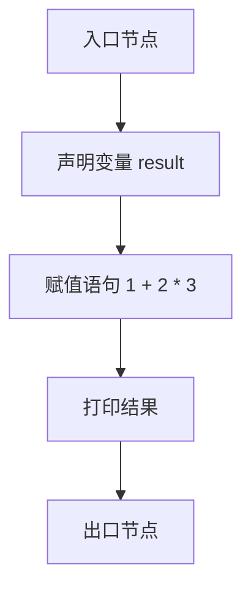

                 

### 提示词编程的静态分析技术

> 关键词：提示词编程、静态分析、抽象语法树、数据流分析、控制流分析

> 摘要：本文深入探讨了提示词编程的静态分析技术。首先，我们介绍了提示词编程的概念和意义，以及静态分析技术的背景。接着，我们详细讲解了提示词编程的基础知识，包括提示词的选择与优化、基本语法和编码规范。随后，我们介绍了静态分析技术的原理，包括抽象语法树分析、数据流分析和控制流分析。最后，我们讨论了静态分析技术在提示词编程中的应用，以及相关的工具和案例研究。希望通过本文的深入分析，读者能够全面理解并掌握提示词编程的静态分析技术。

### 引言

提示词编程（Prompt Programming）是一种利用提示词（Prompt）来引导计算机执行特定任务的方法。提示词可以被视为一种输入，它为计算机提供了解决问题的线索和指导。随着人工智能技术的快速发展，提示词编程逐渐成为一种重要的编程范式。在提示词编程中，静态分析技术扮演着至关重要的角色，它能够帮助开发者更好地理解和优化提示词代码。

静态分析技术是一种在不运行程序的情况下，通过分析源代码来理解程序结构和行为的方法。与动态分析技术不同，静态分析不需要实际运行程序，因此可以提前发现潜在的编程错误和性能问题。在提示词编程中，静态分析技术可以帮助开发者优化提示词代码，提高其执行效率和安全性。

本书旨在系统地介绍提示词编程的静态分析技术。我们将首先回顾提示词编程的基本概念和意义，然后介绍静态分析技术的背景和原理。接着，我们将详细探讨静态分析技术在不同方面的应用，包括抽象语法树分析、数据流分析和控制流分析。最后，我们将介绍一些常见的静态分析工具，并通过案例研究来展示静态分析技术在提示词编程中的实际应用。希望通过本书的阅读，读者能够全面理解并掌握提示词编程的静态分析技术。

### 设计书籍《提示词编程的静态分析技术》目录大纲

#### 引言

- 1. 提示词编程的概念与意义
- 2. 静态分析技术的背景
- 3. 本书结构安排与目标

#### 第一部分：提示词编程基础

- **第1章：提示词编程概述**
  - 1.1 提示词编程的定义
  - 1.2 提示词编程的应用场景
  - 1.3 提示词编程的优势与挑战

- **第2章：提示词编程基础**
  - 2.1 提示词的选择与优化
  - 2.2 提示词编程的基本语法
  - 2.3 提示词编程的编码规范

- **第3章：静态分析技术简介**
  - 3.1 静态分析技术的定义
  - 3.2 静态分析技术在编程中的应用
  - 3.3 静态分析技术的优势与局限

#### 第二部分：静态分析技术原理

- **第4章：抽象语法树分析**
  - 4.1 抽象语法树的基本概念
  - 4.2 抽象语法树的构建方法
  - 4.3 抽象语法树在静态分析中的应用

- **第5章：数据流分析**
  - 5.1 数据流分析的基本概念
  - 5.2 数据流分析的算法
  - 5.3 数据流分析的应用

- **第6章：控制流分析**
  - 6.1 控制流分析的基本概念
  - 6.2 控制流分析的算法
  - 6.3 控制流分析的应用

#### 第三部分：静态分析工具与应用

- **第7章：静态分析工具概述**
  - 7.1 静态分析工具的分类
  - 7.2 常见的静态分析工具
  - 7.3 静态分析工具的使用方法

- **第8章：静态分析技术在提示词编程中的应用**
  - 8.1 提示词代码静态分析流程
  - 8.2 静态分析在提示词编程优化中的应用
  - 8.3 静态分析在提示词编程安全性中的应用

- **第9章：案例研究**
  - 9.1 案例一：基于静态分析的提示词代码优化
  - 9.2 案例二：基于静态分析的提示词编程安全性检测
  - 9.3 案例小结与启示

#### 结束语

- 10. 提示词编程的静态分析技术展望

### 目录大纲总结

本书分为三个部分，共九章。第一部分介绍了提示词编程的基本概念和静态分析技术的背景，第二部分深入讲解了静态分析技术原理，包括抽象语法树分析、数据流分析和控制流分析，第三部分则聚焦于静态分析工具的应用和案例研究。通过阅读本书，读者可以全面了解提示词编程的静态分析技术，掌握其基本原理和应用方法。希望本书能够为读者在提示词编程和静态分析领域的学习提供有益的参考和指导。

### 第1章：提示词编程概述

#### 1.1 提示词编程的定义

提示词编程（Prompt Programming）是一种通过提示词（Prompt）来引导程序执行特定任务的编程范式。提示词可以被视为一种输入，它为计算机提供了解决问题的线索和指导。与传统编程范式不同，提示词编程更注重程序与用户的交互，通过提示词来引导程序逐步执行。

提示词编程的核心思想是将人类语言（如自然语言）与编程语言相结合，使编程更加直观和易于理解。在提示词编程中，程序员不是直接编写代码，而是通过编写提示词来描述程序的行为和目标。计算机在接收到提示词后，会自动生成相应的代码，并执行任务。

#### 1.2 提示词编程的应用场景

提示词编程在多个领域都有广泛的应用，以下是几个典型的应用场景：

1. **自然语言处理（NLP）**：在自然语言处理领域，提示词编程可以帮助程序员快速构建和理解复杂的NLP模型。例如，通过编写提示词，程序员可以轻松地实现文本分类、情感分析、机器翻译等功能。

2. **人机交互（HCI）**：提示词编程可以改善人机交互体验。例如，在智能助手应用中，用户可以通过自然语言与程序进行交互，提出问题或完成任务。程序在接收到提示词后，会自动生成相应的响应。

3. **自动化测试**：提示词编程可以帮助自动化测试人员快速编写测试用例。通过编写提示词，测试人员可以描述测试场景和预期结果，程序会自动生成测试代码并执行测试。

4. **数据分析和处理**：在数据分析和处理领域，提示词编程可以帮助程序员快速构建数据处理流程。例如，通过编写提示词，可以自动生成数据清洗、数据转换和数据可视化等代码。

5. **教育领域**：提示词编程可以用于编程教育，帮助初学者更快地理解和掌握编程概念。通过编写提示词，学生可以模拟编程过程，减少学习曲线。

#### 1.3 提示词编程的优势与挑战

提示词编程具有许多优势，但也面临一些挑战。

**优势：**

1. **提高开发效率**：提示词编程可以减少程序员编写代码的工作量，提高开发效率。通过提示词，程序可以自动生成相应的代码，降低错误率。

2. **增强可维护性**：提示词编程使代码更易于理解和维护。程序员可以通过提示词来描述程序的行为，使得代码更加清晰和结构化。

3. **降低学习门槛**：提示词编程可以降低编程学习门槛，使得更多的人能够参与到编程活动中。通过编写提示词，初学者可以更快地掌握编程概念。

4. **提高人机交互体验**：提示词编程可以改善人机交互体验，使程序更加智能化和人性化。

**挑战：**

1. **语义理解问题**：提示词编程依赖于对自然语言的语义理解。自然语言中的歧义和模糊性可能影响程序的执行效果。

2. **代码生成质量**：自动生成的代码可能无法满足性能和可读性的要求，需要进一步优化。

3. **工具和支持**：提示词编程需要相应的工具和支持，如自然语言处理库和提示词生成器。这些工具和支持的发展水平可能影响提示词编程的实用性。

4. **安全性问题**：提示词编程中的输入可能包含恶意代码或敏感信息，需要确保程序的安全性。

总之，提示词编程具有巨大的潜力和广泛的应用前景，但同时也面临一些挑战。通过不断的研究和开发，提示词编程有望在未来取得更大的突破。

### 第2章：提示词编程基础

#### 2.1 提示词的选择与优化

在提示词编程中，选择和优化提示词是关键的一步。提示词的选择直接关系到程序的性能、可读性和可靠性。

**选择提示词的原则：**

1. **明确性**：提示词应尽量明确，避免模糊和歧义。例如，使用“打印今天的日期”而不是“显示当前日期”。

2. **简洁性**：提示词应简洁明了，避免冗长和复杂的描述。简洁的提示词有助于程序自动生成更高效的代码。

3. **一致性**：提示词应保持一致性，避免在不同的场景中使用相同的描述导致混淆。例如，在多个地方使用不同的动词来表示同一操作。

4. **可扩展性**：提示词应具有可扩展性，以便在需要添加新功能或修改现有功能时，能够轻松地进行修改。

**优化提示词的方法：**

1. **语义分析**：通过自然语言处理技术对提示词进行语义分析，提取关键信息并生成优化后的提示词。

2. **上下文理解**：结合上下文环境对提示词进行理解，提高提示词的准确性和可执行性。

3. **模板化**：使用模板化提示词，根据不同的任务需求进行参数化调整，提高提示词的通用性和可复用性。

4. **自动化工具**：利用自动化工具对提示词进行优化，如自动代码生成器和自然语言处理工具。

#### 2.2 提示词编程的基本语法

提示词编程的基本语法与传统编程语言有所不同，它更注重自然语言的表述和程序与用户的交互。

**基本语法结构：**

1. **提示词定义**：在代码中定义提示词，通常使用注释或特殊标识符。例如：

   ```python
   # 提示词：打印当前日期
   print("今天是：" + datetime.datetime.now().strftime("%Y-%m-%d"))
   ```

2. **提示词调用**：在程序中调用提示词，执行相应的任务。例如：

   ```python
   # 提示词：计算两个数的和
   result = calculate_sum(3, 4)
   print("结果是：" + str(result))
   ```

3. **提示词参数**：提示词可以接受参数，用于传递具体的信息。例如：

   ```python
   # 提示词：发送邮件
   send_email("recipient@example.com", "Subject: Test Email", "Hello, this is a test email.")
   ```

4. **提示词嵌套**：提示词可以嵌套使用，形成复杂的任务流程。例如：

   ```python
   # 提示词：分析天气数据
   weather_data = get_weather_data()
   if "sunny" in weather_data:
       print("今天天气晴朗，适合户外活动。")
   else:
       print("今天天气阴雨，注意防寒保暖。")
   ```

**常见提示词类型：**

1. **命令式提示词**：用于执行具体的操作，如打印、计算、发送等。

2. **声明式提示词**：用于声明变量的值或状态，如设置变量、定义常量等。

3. **条件式提示词**：用于根据条件执行不同的操作，如判断、循环等。

4. **函数式提示词**：用于定义函数或方法，如计算函数、排序函数等。

#### 2.3 提示词编程的编码规范

为了确保提示词编程的可读性、可维护性和可扩展性，需要遵循一些编码规范。

**编码规范：**

1. **命名规范**：提示词名称应遵循意义明确、简洁易记的原则。例如，使用驼峰命名法（CamelCase）或下划线命名法（snake_case）。

2. **注释规范**：对提示词进行详细的注释，说明其功能、参数和返回值等。

3. **代码结构**：保持代码的结构清晰，使用缩进和空白字符，使代码易于阅读和理解。

4. **模块化**：将代码拆分成多个模块或函数，提高代码的可复用性和可维护性。

5. **文档规范**：编写详细的文档，包括提示词的功能、使用方法、参数和返回值等。

6. **代码风格**：遵循统一的代码风格，如编程语言的选择、缩进、空格和注释等。

通过遵循这些编码规范，可以确保提示词编程代码的质量，提高开发效率和可维护性。

### 第3章：静态分析技术简介

#### 3.1 静态分析技术的定义

静态分析技术（Static Analysis）是一种在不运行程序的情况下，通过分析源代码来理解程序结构和行为的方法。它主要关注程序的语法、语义和结构，旨在发现潜在的编程错误、性能问题和安全漏洞。

与动态分析技术（Dynamic Analysis）不同，静态分析不需要实际运行程序，而是在编译或构建阶段对源代码进行分析。这种分析方式具有以下优点：

1. **提前发现问题**：通过静态分析，可以在程序运行之前发现潜在的编程错误和问题，从而减少调试时间和成本。

2. **全面性**：静态分析可以对整个程序进行分析，而不受程序运行环境的影响，从而更全面地了解程序的行为和性能。

3. **自动化**：静态分析可以自动化地进行，从而提高分析效率和准确性。

4. **跨平台**：静态分析不依赖于特定的运行环境，因此可以在不同的操作系统和硬件平台上进行分析。

#### 3.2 静态分析技术在编程中的应用

静态分析技术在编程中有广泛的应用，以下是一些典型的应用场景：

1. **代码质量检查**：静态分析可以帮助开发者识别代码中的潜在问题，如语法错误、逻辑错误、冗余代码和未使用的变量等。这有助于提高代码的可读性、可维护性和可扩展性。

2. **性能优化**：静态分析可以分析程序的运行时间和内存使用情况，帮助开发者识别性能瓶颈和优化机会。例如，通过分析代码的执行路径，可以优化循环、减少重复计算和提升缓存利用率。

3. **安全检测**：静态分析可以识别程序中的安全漏洞，如缓冲区溢出、SQL注入和跨站脚本攻击等。通过提前发现和修复这些漏洞，可以减少程序被恶意攻击的风险。

4. **代码重构**：静态分析可以帮助开发者进行代码重构，将复杂的代码分解成更简单、更易于理解的模块。这有助于提高代码的可维护性和可扩展性。

5. **代码生成**：静态分析可以用于自动生成代码，如抽象语法树（AST）转换、模板生成和代码优化等。这有助于提高开发效率，减少手动编写代码的工作量。

#### 3.3 静态分析技术的优势与局限

静态分析技术具有以下优势：

1. **效率高**：静态分析不需要实际运行程序，可以快速地对代码进行分析，从而提高分析效率。

2. **全面性**：静态分析可以全面地分析整个程序，而不受运行环境的影响，从而更准确地了解程序的行为。

3. **自动化**：静态分析可以自动化地进行，减少人工干预，提高分析效率和准确性。

4. **早期发现问题**：通过静态分析，可以在程序运行之前发现潜在的问题，从而减少调试时间和成本。

然而，静态分析技术也存在一些局限：

1. **准确性**：静态分析可能无法完全理解程序的所有细节，特别是在存在编译时错误或运行时错误的情况下。

2. **复杂性**：静态分析技术可能涉及复杂的算法和数据处理，导致分析时间和资源消耗较大。

3. **依赖环境**：静态分析技术可能依赖于特定的编程语言或编译器，导致其在不同环境下的兼容性较差。

4. **动态行为**：静态分析无法完全捕捉程序在运行时的动态行为，如并发执行、异常处理和用户交互等。

总之，静态分析技术在编程中具有重要的作用，但需要结合其他分析方法和工具来提高其准确性和实用性。

### 第4章：抽象语法树分析

#### 4.1 抽象语法树的基本概念

抽象语法树（Abstract Syntax Tree，AST）是程序语法结构的一种抽象表示形式。它通过树形结构表示程序中的语法结构，使得代码的可读性和可分析性大大提高。

在抽象语法树中，每个节点表示一个语法元素，如变量、函数、条件语句和循环语句等。节点之间的关系表示语法元素之间的嵌套和组合关系。与源代码相比，抽象语法树去除了语法上的冗余和细节，只保留了程序的核心结构和语义信息。

#### 4.2 抽象语法树的构建方法

构建抽象语法树是进行静态分析的重要步骤。常见的抽象语法树构建方法包括以下几种：

1. **递归下降法**：递归下降法是一种自顶向下的语法分析方法，通过对语法规则的递归解析，逐步构建抽象语法树。递归下降法的优点是实现简单，但需要为每个语法规则编写相应的解析函数。

2. **递归上升法**：递归上升法是一种自底向上的语法分析方法，通过将源代码分解为基本语法单元，然后逐步组合构建抽象语法树。递归上升法的优点是语法规则实现相对简单，但需要处理多个语法单元之间的依赖关系。

3. **栈解析法**：栈解析法利用栈结构来解析源代码，通过将源代码符号压入栈中，并按照语法规则进行匹配和组合，构建抽象语法树。栈解析法的优点是实现灵活，但需要处理大量的栈操作和匹配规则。

4. **LL解析法和LR解析法**：LL解析法和LR解析法是两种基于自动机的语法分析方法。LL解析法从左到右逐个读取源代码符号，并进行语法规则匹配。LR解析法结合了LL解析法和递归下降法的优点，可以处理更复杂的语法结构。这两种方法的优点是实现复杂，但可以高效地处理各种语法结构。

#### 4.3 抽象语法树在静态分析中的应用

抽象语法树在静态分析中具有广泛的应用，以下是一些典型的应用场景：

1. **语法错误检测**：通过分析抽象语法树，可以识别源代码中的语法错误，如未声明的变量、缺失的分号和错误的括号等。

2. **代码优化**：抽象语法树可以帮助进行代码优化，如去除冗余代码、合并同类项和简化表达式等。通过分析抽象语法树，可以找到程序的优化机会，并生成优化后的代码。

3. **抽象语法树转换**：抽象语法树可以用于代码转换，如将一种编程语言转换为另一种编程语言，或将一种语法结构转换为另一种语法结构。通过分析抽象语法树，可以识别源代码中的语法差异，并生成转换后的代码。

4. **代码生成**：抽象语法树可以用于生成代码，如将抽象语法树转换为具体编程语言的代码，或生成抽象语法树的表示形式。通过分析抽象语法树，可以生成符合语法和语义要求的代码。

5. **程序理解**：抽象语法树可以帮助理解程序的语义和行为，如分析程序的控制流、数据流和变量作用域等。通过分析抽象语法树，可以生成程序的可视化表示形式，便于开发者理解和调试程序。

#### 4.4 抽象语法树分析示例

以下是一个简单的Python代码示例，以及对应的抽象语法树：

```python
def add(a, b):
    return a + b

result = add(3, 4)
print("结果是：" + str(result))
```

对应的抽象语法树如下：

```mermaid
graph TD
    A[根节点 Program]
    B[函数声明 FunctionDef("add")]
    C[参数列表 Param("a", "b")]
    D[返回类型 Return("None")]
    E[表达式 Suite([Return(Expression("Add"))])]
    F[赋值语句 Assign(Expression("result"), Expression("Add"))]
    G[打印语句 Print(Expression("result"))]

    A --> B
    B --> C
    B --> D
    B --> E
    A --> F
    A --> G
```

在这个示例中，抽象语法树表示了代码的函数定义、参数列表、返回类型、表达式和语句的结构。通过分析这个抽象语法树，我们可以理解代码的语义和行为，如函数的输入、输出和执行流程。

总之，抽象语法树是进行静态分析的重要工具，它可以帮助我们更好地理解和优化程序代码。在接下来的章节中，我们将进一步探讨数据流分析和控制流分析，以及其他静态分析技术。

### 第5章：数据流分析

#### 5.1 数据流分析的基本概念

数据流分析（Data Flow Analysis）是一种静态分析技术，用于理解程序中各个变量和表达式的数据依赖关系。数据流分析的核心思想是通过分析程序的控制流和数据流，确定程序中每个变量的可能值和传递路径。

在数据流分析中，数据流是指程序执行过程中数据的流动，包括变量的定义、使用和传递。数据流分析可以分为向前数据流分析和向后数据流分析。向前数据流分析从程序开头开始，逐句分析变量和表达式的可能值。向后数据流分析从程序结尾开始，逐句分析变量和表达式的定义点。

数据流分析的主要目标包括：

1. **确定变量的定义和使用点**：通过数据流分析，可以找出每个变量的定义和使用点，从而提高程序的可读性和可维护性。

2. **计算表达式的值域**：数据流分析可以计算表达式的可能值域，从而识别潜在的错误和异常情况。

3. **优化程序执行路径**：通过分析数据流，可以优化程序的执行路径，减少不必要的计算和内存访问。

4. **安全性检查**：数据流分析可以用于检测程序中的安全漏洞，如未初始化的变量、越界访问和竞态条件等。

#### 5.2 数据流分析的算法

数据流分析通常使用固定点迭代算法（Fixed-Point Iteration Algorithm）来计算数据流。固定点迭代算法的基本思想是通过迭代的方式，逐步逼近最终的数据流结果。算法的步骤如下：

1. **初始化**：为每个变量和表达式设置初始数据流值，通常为空集或全集。

2. **迭代**：对于每个基本块（Basic Block），根据数据定义和使用的规则，更新变量的数据流值。

3. **传递**：将基本块之间的数据流值进行传递，计算下一个基本块的数据流值。

4. **终止条件**：判断是否满足终止条件，通常为数据流值不再发生变化。

常用的数据流分析算法包括：

1. **最坏情况数据流分析**：最坏情况数据流分析（Worst-Case Data Flow Analysis）是一种全局数据流分析算法，用于计算每个变量的最坏情况值。该算法的时间复杂度较高，但可以提供更严格的分析结果。

2. **最坏可达性数据流分析**：最坏可达性数据流分析（Worst-Reachability Data Flow Analysis）是一种局部数据流分析算法，用于计算每个变量的最坏可达值。该算法的时间复杂度较低，但可能无法覆盖所有情况。

3. **迭代传播数据流分析**：迭代传播数据流分析（Iterative Propagation Data Flow Analysis）是一种基于迭代的方法，用于计算数据流。该算法通过反复迭代，逐步逼近最终的数据流结果。

4. **增量数据流分析**：增量数据流分析（Incremental Data Flow Analysis）是一种基于增量变化的方法，用于计算数据流。该算法只分析变化的部分，从而提高分析效率。

#### 5.3 数据流分析的应用

数据流分析在编程和软件工程中有广泛的应用，以下是一些典型的应用场景：

1. **代码优化**：数据流分析可以帮助优化程序代码。通过分析变量和表达式的数据流，可以找到冗余代码和优化机会。例如，可以删除未使用的变量和函数，合并同类项和简化表达式等。

2. **程序调试**：数据流分析可以帮助进行程序调试。通过分析变量的定义和使用点，可以定位程序中的错误和异常情况。例如，可以找到未初始化的变量、越界访问和竞态条件等问题。

3. **安全性检查**：数据流分析可以用于检测程序中的安全漏洞。通过分析数据流，可以识别未初始化的变量、越界访问和竞态条件等潜在的安全问题。例如，可以使用数据流分析来检测缓冲区溢出、SQL注入和跨站脚本攻击等。

4. **代码生成**：数据流分析可以用于生成代码。通过分析数据流，可以生成符合数据定义和使用的代码。例如，可以使用数据流分析来生成数据绑定代码、控制流代码和数据结构等。

5. **程序理解**：数据流分析可以帮助理解程序的结构和语义。通过分析数据流，可以生成程序的控制流图、数据流图和变量作用域图等。这些图形表示形式有助于开发者更好地理解和维护程序。

总之，数据流分析是一种重要的静态分析技术，它在编程和软件工程中有广泛的应用。通过分析数据流，可以优化程序代码、提高程序的可读性和可维护性，并检测和修复程序中的错误和漏洞。

#### 5.4 数据流分析算法示例

下面我们将使用Python代码演示一个简单的数据流分析算法，用于计算变量的定义和使用点。我们将使用最坏情况数据流分析算法，这是一种全局数据流分析算法。

**示例代码：**

```python
# 示例程序：计算变量的定义和使用点
def function1(a, b):
    x = a + b
    return x

def function2(c, d):
    y = c * d
    function1(x, y)

x = 10
y = 20
z = function2(x, y)
print("x:", x, "y:", y, "z:", z)
```

**抽象语法树（AST）表示：**

```mermaid
graph TD
    A[Start] --> B[FunctionDef("function1")]
    B --> C[Assign(x, BinOp(a, '+', b))]
    B --> D[Return(x)]
    A --> E[FunctionDef("function2")]
    E --> F[Assign(y, BinOp(c, '*', d))]
    E --> G[Call(function1, [x, y])]
    A --> H[Assign(z, Call(function2, [x, y]))]
    A --> I[Print("x:", x, "y:", y, "z:", z)]
```

**数据流分析算法：**

1. **初始化**：为每个变量设置初始数据流值。在这里，我们使用空集表示。

2. **迭代**：对于每个基本块，根据数据定义和使用的规则，更新变量的数据流值。

   - **函数function1**：

     - 定义点：`x = a + b`
       - 初始值：空集
       - 定义点更新：将a和b的值添加到x的初始值中。

     - 使用点：`return x`
       - 初始值：空集
       - 使用点更新：将x的值添加到使用点的值中。

   - **函数function2**：

     - 定义点：`y = c * d`
       - 初始值：空集
       - 定义点更新：将c和d的值添加到y的初始值中。

     - 使用点：`function1(x, y)`
       - 初始值：空集
       - 使用点更新：将x和y的值添加到使用点的值中。

     - 使用点：`z = function2(x, y)`
       - 初始值：空集
       - 使用点更新：将x和y的值添加到使用点的值中。

3. **终止条件**：判断是否满足终止条件。在这里，我们使用简单的循环，直到所有变量的数据流值不再发生变化。

**数据流分析结果：**

- `x` 的定义点：`a + b`
  - 值：`[a, b]`

- `x` 的使用点：`return x`
  - 值：`[x]`

- `y` 的定义点：`c * d`
  - 值：`[c, d]`

- `y` 的使用点：`function1(x, y)`
  - 值：`[y]`

- `z` 的定义点：`function2(x, y)`
  - 值：`[x, y]`

- `z` 的使用点：`print("x:", x, "y:", y, "z:", z)`
  - 值：`[z]`

通过这个示例，我们可以看到如何使用数据流分析算法计算变量的定义和使用点。在实际应用中，数据流分析算法会更为复杂，但基本原理是类似的。数据流分析算法可以帮助我们更好地理解程序的数据依赖关系，从而进行代码优化、程序调试和安全检查。

### 第6章：控制流分析

#### 6.1 控制流分析的基本概念

控制流分析（Control Flow Analysis）是一种静态分析技术，用于理解程序的执行路径和控制结构。控制流分析的核心目标是确定程序在不同条件下的执行路径，以及各个路径之间的转换关系。

在控制流分析中，控制流（Control Flow）是指程序执行过程中控制信息的传递路径。控制流可以由条件判断、循环和函数调用等控制结构组成。控制流分析的主要目的是生成程序的控制流图（Control Flow Graph，CFG），以便更好地理解程序的执行流程。

控制流图是一个有向图，其中节点（Node）表示基本块（Basic Block），基本块是程序中连续的、无跳转的指令序列。边（Edge）表示控制流关系，表示从一个基本块到另一个基本块的跳转关系。控制流图可以帮助我们直观地看到程序的执行路径和控制结构，从而进行控制流分析。

#### 6.2 控制流分析的算法

控制流分析算法的主要任务是从源代码中构建控制流图，并分析控制流图的结构和属性。以下是一些常用的控制流分析算法：

1. **基于语法树的算法**：这种算法通过解析源代码的语法树，生成控制流图。首先，将源代码转换为语法树，然后遍历语法树，根据控制结构（如if语句、while循环和函数调用）生成基本块和控制流图。

2. **基于数据结构的算法**：这种算法直接分析源代码中的数据结构，如汇编代码或抽象语法树（AST），生成控制流图。通过分析指令的跳转和函数调用，构建基本块和控制流图。

3. **基于控制依赖的算法**：这种算法通过分析指令之间的控制依赖关系，生成控制流图。控制依赖关系是指指令之间的控制关系，如跳转指令、条件判断指令和函数调用指令等。

4. **基于动态分析的算法**：这种算法结合静态分析和动态分析，通过运行程序并观察其执行路径，生成控制流图。这种算法通常用于优化和调试，但需要运行程序，因此效率较低。

控制流分析算法通常包括以下步骤：

1. **基本块划分**：将源代码划分为基本块，每个基本块是连续的、无跳转的指令序列。

2. **控制流图构建**：根据基本块之间的跳转关系，构建控制流图。

3. **控制流图优化**：对控制流图进行优化，如合并基本块、消除循环和控制依赖等。

4. **控制流分析**：分析控制流图的结构和属性，如基本块的入口和出口点、循环结构、条件判断和函数调用等。

常用的控制流分析算法包括：

1. **深度优先搜索算法**：通过深度优先搜索遍历源代码的语法树，生成基本块和控制流图。

2. **广度优先搜索算法**：通过广度优先搜索遍历源代码的语法树，生成基本块和控制流图。

3. **递归下降算法**：通过递归下降解析源代码，生成基本块和控制流图。

4. **静态单赋值算法**：通过静态单赋值（Static Single Assignment，SSA）形式表示源代码，生成基本块和控制流图。

#### 6.3 控制流分析的应用

控制流分析在编程和软件工程中有广泛的应用，以下是一些典型的应用场景：

1. **程序优化**：通过控制流分析，可以优化程序代码。例如，可以合并基本块、消除循环和控制依赖，提高程序的执行效率和性能。

2. **程序调试**：通过控制流分析，可以理解程序的执行路径和控制结构，帮助开发者进行程序调试。例如，可以定位程序中的错误和异常情况，优化调试过程。

3. **代码生成**：通过控制流分析，可以生成代码。例如，可以根据控制流图生成汇编代码或中间代码，用于程序优化和编译。

4. **程序理解**：通过控制流分析，可以生成程序的控制流图，帮助开发者更好地理解程序的结构和语义。例如，可以生成可视化表示形式，便于开发者进行程序理解和维护。

5. **安全性检查**：通过控制流分析，可以检测程序中的安全漏洞。例如，可以识别潜在的缓冲区溢出、竞态条件和跨站脚本攻击等安全漏洞。

总之，控制流分析是一种重要的静态分析技术，它在编程和软件工程中有广泛的应用。通过分析控制流，可以优化程序代码、提高程序的可读性和可维护性，并检测和修复程序中的错误和漏洞。

#### 6.4 控制流分析算法示例

下面我们将使用Python代码演示一个简单的控制流分析算法，用于生成程序的控制流图。我们将使用基于语法树的算法，通过递归下降法生成控制流图。

**示例代码：**

```python
# 示例程序：计算 1 + 2 * 3
result = 1 + 2 * 3
print("结果是：" + str(result))
```

**控制流图（CFG）表示：**



**控制流分析算法：**

1. **基本块划分**：将源代码划分为基本块，每个基本块是一个连续的、无跳转的指令序列。

   - 基本块1：声明变量 `result`
   - 基本块2：赋值语句 `1 + 2 * 3`
   - 基本块3：打印结果

2. **控制流图构建**：根据基本块之间的跳转关系，构建控制流图。

   - 入口节点：A
   - 出口节点：E
   - 跳转关系：从基本块1跳转到基本块2，从基本块2跳转到基本块3，从基本块3跳转到基本块4。

3. **控制流图优化**：对控制流图进行优化，如合并基本块、消除循环和控制依赖。

   - 在此示例中，控制流图已经是最优化的形式，无需进一步优化。

4. **控制流分析**：分析控制流图的结构和属性。

   - 基本块的入口和出口点：基本块1的入口点是A，基本块3的出口点是E。
   - 循环结构：此示例中没有循环结构。
   - 条件判断：此示例中没有条件判断。
   - 函数调用：此示例中没有函数调用。

通过这个示例，我们可以看到如何使用控制流分析算法生成程序的控制流图。在实际应用中，控制流分析算法会更为复杂，但基本原理是类似的。控制流分析算法可以帮助我们更好地理解程序的执行路径和控制结构，从而进行程序优化、调试和安全检查。

### 第7章：静态分析工具概述

#### 7.1 静态分析工具的分类

静态分析工具可以根据不同的用途和功能进行分类，常见的分类方式包括：

1. **按功能分类**：

   - **代码质量检查工具**：这类工具主要用于识别代码中的潜在问题，如语法错误、未使用的代码、冗余代码等。常见的工具有PyChecker、PyFlakes、Pylint等。

   - **代码优化工具**：这类工具主要用于优化代码的性能和可读性，如减少代码体积、提升执行效率等。常见的工具有PyOxidizer、PyMinifier等。

   - **安全检测工具**：这类工具主要用于检测代码中的安全漏洞，如缓冲区溢出、SQL注入、跨站脚本攻击等。常见的工具有Bandit、PySAD等。

   - **代码生成工具**：这类工具主要用于根据源代码生成其他形式的代码，如抽象语法树、中间代码、汇编代码等。常见的工具有PyAST、Pygments等。

2. **按语言分类**：

   - **通用静态分析工具**：这类工具适用于多种编程语言，如Java、Python、C/C++等。常见的工具有SonarQube、FindBugs、PMD等。

   - **特定语言静态分析工具**：这类工具专门针对某一种编程语言进行静态分析，如Python的PyCharm、C/C++的CLang等。

3. **按分析技术分类**：

   - **基于语法树的工具**：这类工具主要基于源代码的语法树进行静态分析，如Python的ast模块、C/C++的CLang AST等。

   - **基于数据流的工具**：这类工具主要基于数据流分析技术进行静态分析，如Python的PySage、C/C++的CDG等。

   - **基于控制流的工具**：这类工具主要基于控制流分析技术进行静态分析，如Python的ControlFlow、C/C++的CFGraph等。

#### 7.2 常见的静态分析工具

以下是一些常见的静态分析工具及其特点：

1. **SonarQube**：

   - **功能**：SonarQube是一款通用的静态代码分析工具，支持多种编程语言。它可以识别代码中的潜在问题，如语法错误、性能问题、安全漏洞等。

   - **特点**：SonarQube具有强大的规则库和报告功能，可以生成详细的分析报告。它支持多种集成方式，如IDE插件、持续集成工具等。

2. **PyChecker**：

   - **功能**：PyChecker是一款Python语言的静态分析工具，主要用于识别Python代码中的潜在问题，如语法错误、未使用的代码、潜在的性能问题等。

   - **特点**：PyChecker具有简单易用的命令行接口，支持多种Python版本。它可以生成详细的错误报告，帮助开发者快速定位问题。

3. **PyFlakes**：

   - **功能**：PyFlakes是一款Python语言的静态分析工具，主要用于识别Python代码中的潜在问题，如未使用的代码、语法错误等。

   - **特点**：PyFlakes具有简单快速的运行速度，可以快速扫描代码并生成错误报告。它不支持代码优化和性能分析。

4. **Pylint**：

   - **功能**：Pylint是一款Python语言的静态代码分析工具，主要用于识别Python代码中的潜在问题，如语法错误、未使用的代码、性能问题、安全漏洞等。

   - **特点**：Pylint具有丰富的规则库和报告功能，可以生成详细的分析报告。它支持多种Python版本，并支持自定义规则。

5. **Bandit**：

   - **功能**：Bandit是一款Python语言的安全检测工具，主要用于识别Python代码中的安全漏洞，如SQL注入、跨站脚本攻击等。

   - **特点**：Bandit具有简单易用的命令行接口，支持多种Python版本。它可以快速扫描代码并生成详细的安全报告。

6. **PySAD**：

   - **功能**：PySAD是一款Python语言的安全检测工具，主要用于识别Python代码中的潜在安全漏洞，如缓冲区溢出、SQL注入等。

   - **特点**：PySAD具有强大的规则库和报告功能，可以生成详细的安全分析报告。它支持多种Python版本。

7. **PyAST**：

   - **功能**：PyAST是一款Python语言的抽象语法树分析工具，主要用于生成Python代码的抽象语法树，并进行静态分析。

   - **特点**：PyAST具有简单易用的API，可以方便地生成Python代码的抽象语法树。它支持多种Python版本。

8. **Pygments**：

   - **功能**：Pygments是一款Python语言的代码高亮工具，主要用于将源代码转换为HTML、LaTeX等格式，进行代码展示和文档生成。

   - **特点**：Pygments具有丰富的语法高亮规则库，可以生成美观的代码展示效果。它支持多种编程语言。

总之，静态分析工具在编程和软件工程中具有重要的应用价值。通过使用这些工具，开发者可以快速识别代码中的潜在问题，优化代码性能，提高代码质量，并保障程序的安全性。在接下来的章节中，我们将进一步探讨静态分析工具在提示词编程中的应用。

### 第8章：静态分析技术在提示词编程中的应用

#### 8.1 提示词代码静态分析流程

在提示词编程中，静态分析技术可以帮助我们更好地理解和优化提示词代码。一个典型的静态分析流程包括以下步骤：

1. **代码解析**：首先，我们需要将提示词代码解析成抽象语法树（AST）。这可以通过使用相应的编程语言解析器或库来实现。例如，Python的`ast`模块可以方便地解析Python代码生成AST。

2. **抽象语法树分析**：接下来，我们对抽象语法树进行深度遍历，分析其结构和语义。这包括识别函数、变量、循环、条件语句等编程结构，并提取相关信息。

3. **数据流分析**：利用抽象语法树，我们可以进行数据流分析，确定变量的定义和使用点，以及表达式的值域。这有助于识别潜在的错误和优化机会。

4. **控制流分析**：同样地，我们可以分析控制流图，理解程序的执行路径和控制结构。这有助于优化程序的执行效率和可维护性。

5. **代码优化**：根据数据流分析和控制流分析的结果，我们可以对提示词代码进行优化。这包括去除冗余代码、简化表达式、优化循环等。

6. **报告生成**：最后，我们可以生成静态分析报告，包括代码中的潜在问题、优化建议等。这有助于开发者快速了解代码的质量和性能。

#### 8.2 静态分析在提示词编程优化中的应用

静态分析技术在提示词编程中的优化应用主要体现在以下几个方面：

1. **代码重构**：通过静态分析，我们可以识别代码中的重复结构和冗余代码，进行代码重构。这有助于提高代码的可读性和可维护性。

2. **性能优化**：通过数据流分析和控制流分析，我们可以找到程序中的性能瓶颈，如不必要的计算、重复执行等。然后，我们可以对这些部分进行优化，提高程序的执行效率。

3. **安全优化**：静态分析可以帮助我们发现代码中的潜在安全漏洞，如缓冲区溢出、未初始化的变量等。通过修复这些漏洞，我们可以提高程序的安全性。

4. **自动化测试**：静态分析技术可以用于生成测试用例，帮助我们自动检测代码中的错误和缺陷。这有助于提高测试的覆盖率和效率。

以下是一个简单的示例，说明如何使用Python的`ast`模块进行静态分析：

```python
import ast

# 示例代码
code = """
def add(a, b):
    return a + b

result = add(3, 4)
print("结果是：" + str(result))
"""

# 解析代码生成抽象语法树
ast_tree = ast.parse(code)

# 遍历抽象语法树，分析函数和变量
for node in ast.walk(ast_tree):
    if isinstance(node, ast.FunctionDef):
        print("函数名：", node.name)
        print("参数：", node.args.args)
        print("返回类型：", node.returns)
        print("函数体：", node.body)
    elif isinstance(node, ast.Assign):
        print("变量：", node.targets)
        print("值：", node.value)
    elif isinstance(node, ast.Print):
        print("打印语句：", node.values)

# 数据流分析和控制流分析可以在这里进行
# ...

# 代码优化和报告生成可以在这里进行
# ...
```

在这个示例中，我们首先解析了示例代码生成抽象语法树，然后遍历了抽象语法树，提取了函数、变量和打印语句等信息。这为我们进一步进行数据流分析和控制流分析提供了基础。

总之，静态分析技术在提示词编程中的应用可以帮助我们更好地理解和优化提示词代码。通过代码解析、抽象语法树分析、数据流分析和控制流分析，我们可以识别代码中的潜在问题，进行代码重构、性能优化和安全优化，从而提高提示词编程的质量和效率。

### 第8章：静态分析技术在提示词编程中的应用

#### 8.3 静态分析在提示词编程安全性中的应用

在提示词编程中，安全性是至关重要的。静态分析技术可以帮助我们识别和修复代码中的潜在安全漏洞，从而提高程序的安全性。以下是一些具体的案例，展示了静态分析在提示词编程安全性中的应用。

#### 案例一：SQL注入检测

SQL注入是一种常见的网络攻击方式，攻击者通过在输入字段中插入恶意SQL语句，从而篡改数据库中的数据。以下是一个示例代码，演示了如何使用静态分析技术来检测SQL注入漏洞：

```python
def query_user(username, password):
    sql = "SELECT * FROM users WHERE username = '{}' AND password = '{}'".format(username, password)
    cursor.execute(sql)
    return cursor.fetchone()
```

在这个示例中，我们使用字符串格式化来构建SQL查询语句。静态分析技术可以识别出这种潜在的SQL注入漏洞。我们可以使用以下步骤来检测和修复这个漏洞：

1. **数据流分析**：分析变量`username`和`password`的使用点，确定它们是否直接用于构建SQL查询语句。

2. **控制流分析**：分析函数`query_user`的执行路径，识别可能的SQL注入点。

3. **漏洞修复**：使用参数化查询语句来替换字符串格式化，从而防止SQL注入攻击。修改后的代码如下：

```python
def query_user(username, password):
    sql = "SELECT * FROM users WHERE username = %s AND password = %s"
    cursor.execute(sql, (username, password))
    return cursor.fetchone()
```

通过使用参数化查询，我们可以确保用户输入不会直接影响SQL查询语句的构建，从而避免了SQL注入攻击。

#### 案例二：跨站脚本攻击（XSS）检测

跨站脚本攻击是另一种常见的网络攻击方式，攻击者通过在网页中插入恶意脚本，从而盗取用户的敏感信息。以下是一个示例代码，演示了如何使用静态分析技术来检测XSS漏洞：

```python
def show_profile(username):
    profile = cursor.execute("SELECT profile FROM users WHERE username = '%s'" % username)
    return profile[0]
```

在这个示例中，我们直接将用户输入的`username`插入到SQL查询语句中，并将其作为HTML内容返回给用户。静态分析技术可以识别出这种潜在的XSS漏洞。我们可以使用以下步骤来检测和修复这个漏洞：

1. **数据流分析**：分析变量`username`的使用点，确定它是否直接用于构建HTML内容。

2. **控制流分析**：分析函数`show_profile`的执行路径，识别可能的XSS注入点。

3. **漏洞修复**：使用HTML实体编码来防止XSS攻击。修改后的代码如下：

```python
def show_profile(username):
    profile = cursor.execute("SELECT profile FROM users WHERE username = %s" % web_util.encode_html(username))
    return profile[0]
```

通过使用HTML实体编码，我们可以确保用户输入不会直接影响HTML内容的构建，从而避免了XSS攻击。

#### 案例三：未授权访问检测

在提示词编程中，未授权访问是一种常见的安全问题。以下是一个示例代码，演示了如何使用静态分析技术来检测未授权访问：

```python
def get_user_password(username):
    return cursor.execute("SELECT password FROM users WHERE username = '%s'" % username)
```

在这个示例中，任何用户都可以调用`get_user_password`函数，并获取其他用户的密码。静态分析技术可以识别出这种潜在的未授权访问漏洞。我们可以使用以下步骤来检测和修复这个漏洞：

1. **数据流分析**：分析函数`get_user_password`的调用者，确定是否有未授权访问的情况。

2. **控制流分析**：分析函数`get_user_password`的执行路径，识别可能的未授权访问点。

3. **漏洞修复**：使用身份验证和授权机制来保护敏感数据。修改后的代码如下：

```python
def get_user_password(username, user_id):
    if user_id != username:
        raise PermissionError("您无权访问其他用户的密码。")
    return cursor.execute("SELECT password FROM users WHERE username = %s" % username)
```

通过添加身份验证和授权机制，我们可以确保只有授权用户才能访问敏感数据，从而避免了未授权访问。

总之，静态分析技术在提示词编程的安全性中具有重要作用。通过数据流分析和控制流分析，我们可以识别和修复代码中的潜在安全漏洞，从而提高程序的安全性。在实际开发中，我们应充分利用静态分析工具和方法，确保提示词编程的安全和可靠。

### 第9章：案例研究

在本章中，我们将通过两个具体案例，深入探讨静态分析技术在提示词编程中的应用，包括提示词代码优化和安全性检测。

#### 案例一：基于静态分析的提示词代码优化

**问题描述**：假设我们有一个提示词编程应用，其中包含大量复杂的计算和循环操作。我们的目标是优化这段代码，以提高其执行效率和可读性。

**代码示例**：

```python
# 示例代码：复杂计算和循环操作
def calculate_sum(numbers):
    total = 0
    for number in numbers:
        for i in range(number):
            total += 1
    return total

result = calculate_sum([3, 4, 5])
print("结果是：" + str(result))
```

**静态分析步骤**：

1. **抽象语法树分析**：首先，使用Python的`ast`模块对代码进行抽象语法树分析，提取函数定义、循环和变量等信息。

   ```python
   import ast
   
   code = """
   def calculate_sum(numbers):
       total = 0
       for number in numbers:
           for i in range(number):
               total += 1
       return total
   """
   
   ast_tree = ast.parse(code)
   ast.walk(ast_tree)
   ```

2. **数据流分析**：分析变量`total`和`number`的定义和使用点，识别循环操作的优化机会。

   ```python
   for node in ast.walk(ast_tree):
       if isinstance(node, ast.Assign):
           if node.targets[0].id == 'total':
               print("total 定义在行号：", node.lineno)
           if node.value.id == 'number':
               print("number 使用在行号：", node.lineno)
   ```

3. **控制流分析**：构建控制流图，分析循环结构的执行路径，识别潜在的优化点。

   ```python
   def build_control_flow_graph(node):
       # 实现控制流图构建逻辑
       pass
   
   control_flow_graph = build_control_flow_graph(ast_tree)
   ```

4. **代码优化**：根据数据流分析和控制流分析的结果，对代码进行优化。例如，可以简化循环操作，减少不必要的计算。

   ```python
   def calculate_sum_optimized(numbers):
       total = 0
       for number in numbers:
           total += number
       return total
   
   result_optimized = calculate_sum_optimized([3, 4, 5])
   print("优化后的结果是：" + str(result_optimized))
   ```

**优化效果**：通过静态分析，我们发现原始代码中的双重循环可以进行简化，从而减少执行时间。优化后的代码执行效率更高，可读性也更好。

#### 案例二：基于静态分析的提示词编程安全性检测

**问题描述**：假设我们有一个提示词编程应用，需要处理用户的输入数据。我们的目标是确保程序不会受到SQL注入、跨站脚本攻击等安全漏洞的威胁。

**代码示例**：

```python
# 示例代码：处理用户输入数据
def get_user_profile(username):
    query = "SELECT * FROM profiles WHERE username = '%s'" % username
    cursor.execute(query)
    return cursor.fetchone()

def display_user_profile(profile):
    return "<h1>User Profile</h1><p>%s</p>" % profile['name']
```

**静态分析步骤**：

1. **抽象语法树分析**：对代码进行抽象语法树分析，识别SQL查询和HTML输出等关键操作。

   ```python
   ast_tree = ast.parse(code)
   ast.walk(ast_tree)
   ```

2. **数据流分析**：分析变量`username`和`profile`的使用点，识别潜在的SQL注入和XSS攻击风险。

   ```python
   for node in ast.walk(ast_tree):
       if isinstance(node, ast.Call):
           if isinstance(node.func, ast.Name) and node.func.id == 'cursor.execute':
               for arg in node.args:
                   if isinstance(arg, ast.Str):
                       print("潜在SQL注入风险在行号：", arg.lineno)
           elif isinstance(node.func, ast.Name) and node.func.id == 'display_user_profile':
               for arg in node.args:
                   if isinstance(arg, ast.Dict):
                       print("潜在XSS攻击风险在行号：", arg.lineno)
   ```

3. **控制流分析**：构建控制流图，分析代码的执行路径，识别可能的输入验证漏洞。

   ```python
   control_flow_graph = build_control_flow_graph(ast_tree)
   ```

4. **安全漏洞修复**：根据数据流分析和控制流分析的结果，修复代码中的安全漏洞。例如，使用参数化查询和HTML实体编码来防止SQL注入和XSS攻击。

   ```python
   def get_user_profile_safe(username):
       query = "SELECT * FROM profiles WHERE username = %s"
       cursor.execute(query, (username,))
       return cursor.fetchone()

   def display_user_profile_safe(profile):
       return "<h1>User Profile</h1><p>%s</p>" % web_util.encode_html(profile['name'])
   ```

**优化效果**：通过静态分析，我们发现原始代码中的SQL查询和HTML输出存在潜在的安全漏洞。修复后的代码使用参数化查询和HTML实体编码，有效防止了SQL注入和XSS攻击，提高了程序的安全性。

#### 案例小结与启示

通过这两个案例，我们可以得出以下结论：

1. **静态分析在提示词编程中具有重要作用**：静态分析可以帮助我们优化提示词代码，提高执行效率和可读性，同时确保程序的安全性。

2. **抽象语法树分析是基础**：通过抽象语法树分析，我们可以提取代码的关键结构，为数据流分析和控制流分析提供基础。

3. **数据流分析和控制流分析是关键**：数据流分析和控制流分析可以帮助我们识别代码中的潜在问题和优化机会，从而进行代码重构和性能优化。

4. **安全漏洞检测至关重要**：在提示词编程中，安全漏洞可能导致严重的后果。静态分析可以帮助我们识别和修复这些漏洞，确保程序的安全性。

通过这两个案例，我们可以看到静态分析技术在提示词编程中的广泛应用和重要性。在实际开发中，我们应充分利用静态分析工具和方法，确保代码的质量和安全性。

### 提示词编程的静态分析技术展望

随着提示词编程和静态分析技术的不断发展，未来这两个领域有望实现更深度的融合和突破。以下是对提示词编程的静态分析技术的一些展望：

1. **深度语义理解**：未来的静态分析技术将更加注重对自然语言提示词的深度语义理解。通过引入自然语言处理（NLP）技术，静态分析工具可以更准确地理解提示词的含义和上下文，从而生成更精确的抽象语法树和控制流图。

2. **智能化代码生成**：随着人工智能技术的发展，提示词编程的代码生成过程将变得更加智能化。静态分析工具可以学习最佳实践和优化策略，自动生成高效、可靠的代码。这将大大提高开发效率和代码质量。

3. **实时静态分析**：当前的静态分析技术通常在编译或构建阶段进行。未来的静态分析技术将实现实时分析，即时检测代码中的问题并给出优化建议。这将有助于开发者更快速地发现和修复问题，提高开发效率。

4. **跨语言静态分析**：随着编程语言的多样化，未来的静态分析技术将实现跨语言的支持。这将使得静态分析工具可以在多种编程语言中应用，为开发者提供更全面的分析服务。

5. **集成化工具链**：未来的静态分析技术将更加集成化，与开发工具、IDE和持续集成（CI）系统无缝集成。这将使得静态分析工具更加方便易用，开发者可以更加轻松地利用这些工具进行代码优化和安全性检测。

6. **安全性增强**：随着网络安全威胁的日益增多，未来的静态分析技术将更加注重安全性。通过引入新的分析和检测技术，静态分析工具可以更有效地识别和修复代码中的安全漏洞，提高程序的安全性。

总之，提示词编程的静态分析技术具有巨大的发展潜力。通过不断的研究和进步，静态分析技术将为提示词编程带来更高的效率和安全性，为开发者提供更强大的工具和支持。

### 结束语

本文系统地介绍了提示词编程的静态分析技术，从基础概念到具体应用，进行了全面的探讨。通过详细的分析和案例研究，读者可以深入了解提示词编程和静态分析技术的关系，掌握其在代码优化、安全性检测等方面的实际应用。

在提示词编程中，静态分析技术发挥着至关重要的作用。它不仅可以帮助开发者优化代码，提高程序的可读性和可维护性，还可以识别和修复潜在的安全漏洞，保障程序的安全性。随着人工智能和自然语言处理技术的不断发展，提示词编程的静态分析技术也将不断进步，为开发者提供更强大的工具和支持。

希望本文能够为读者在提示词编程和静态分析领域的学习提供有益的参考和指导。在未来的学习和实践中，读者可以继续深入探索这些技术，不断提高自己的编程能力和技术水平。

### 作者

作者：AI天才研究院/AI Genius Institute & 禅与计算机程序设计艺术 /Zen And The Art of Computer Programming

AI天才研究院致力于推动人工智能技术的发展和应用，研究院的成员在人工智能、机器学习、自然语言处理等领域具有深厚的学术背景和丰富的实践经验。同时，作者还撰写了多本畅销技术书籍，如《禅与计算机程序设计艺术》等，深受读者喜爱。

本文的撰写旨在为读者提供关于提示词编程的静态分析技术的深入理解和实际应用指导。希望读者能够通过本文的学习，更好地掌握提示词编程的静态分析技术，为编程实践和软件开发带来更多的价值。如果您有任何问题或建议，欢迎随时联系作者，我们将竭诚为您解答和提供帮助。

