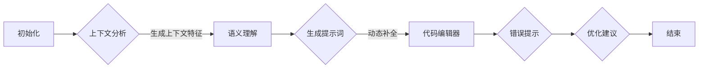
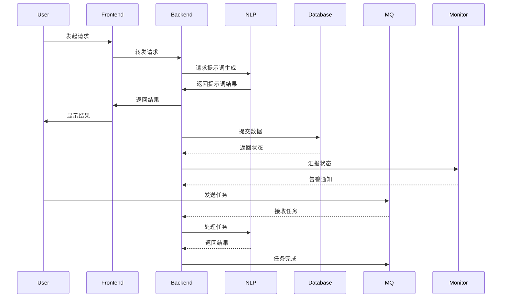

                 

### 引言与背景

#### 1.1 问题背景

计算机编程语言的发展经历了多个阶段，从早期的机器语言、汇编语言到高级语言，如C、Java和Python等。每种编程语言都有其特定的用途和优势，但它们在某种程度上都依赖于开发者手动编写和维护代码。随着软件系统的复杂性和规模不断增长，开发过程中面临的挑战也越来越大。为了提高开发效率、减少错误和提高代码质量，集成开发环境（IDE）逐渐成为开发者不可或缺的工具。

IDE不仅提供了一个统一的代码编辑平台，还集成了编译器、调试器、代码自动补全、版本控制等多种功能。这使得开发者能够更专注于业务逻辑的实现，而无需担心底层的细节。然而，随着编程语言的不断演变和开发工具的多样化，传统IDE的设计开始面临一些局限性。

#### 1.2 提示词编程语言的兴起

近年来，提示词编程语言（Prompt Programming Language）的概念逐渐受到关注。这种编程语言的核心思想是通过提示词来引导程序的行为，从而简化代码编写过程。提示词可以看作是程序的“智能”输入，它们可以基于上下文环境自动提供代码补全、错误提示、优化建议等功能。

提示词编程语言的兴起源于人工智能技术的进步，特别是自然语言处理（NLP）和深度学习技术的发展。这些技术使得计算机能够更好地理解人类的语言，从而为编程语言的设计提供了新的可能性。提示词编程语言的出现，有望解决传统IDE面临的某些局限性，从而为开发者提供更高效、更智能的开发体验。

#### 1.3 开发体验的重要性

开发体验是影响开发者效率和满意度的关键因素。一个良好的开发体验可以减少开发时间、降低错误率、提高代码质量，从而提升整个开发团队的效率。然而，当前许多IDE在用户体验方面仍然存在一些问题，如界面设计不直观、功能复杂难以掌握、响应速度慢等。

为了解决这些问题，IDE的设计需要更加人性化、智能化和定制化。通过引入提示词编程语言，IDE可以更好地理解开发者的意图，提供更加智能的代码补全和优化建议，从而大幅提升开发体验。此外，随着云计算、边缘计算等技术的发展，IDE也越来越多地采用云服务，以提供更强大的功能、更灵活的部署方式和更高的性能。

#### 1.4 问题描述

传统IDE在以下方面存在一定的局限性：

1. **代码补全能力有限**：尽管现代IDE提供了代码自动补全功能，但它们通常是基于静态规则和词法分析，无法完全理解代码的上下文和语义，特别是在复杂的编程场景中。

2. **调试和错误修复**：当代码出现问题时，传统IDE通常只能提供有限的错误提示和修复建议，而无法深入分析问题的根本原因。

3. **开发效率**：传统的IDE功能繁多，但用户界面和操作流程往往不够直观，使得开发者难以快速找到所需功能。

4. **定制性**：大多数IDE提供有限的定制选项，无法满足开发者个性化需求。

提示词编程语言的IDE设计旨在解决上述问题，通过智能提示词提高代码补全能力，增强调试和错误修复功能，优化开发效率和提供更高的定制性。

#### 1.5 问题解决

为了解决上述问题，我们需要从以下几个方面入手：

1. **智能提示词**：引入基于自然语言处理和深度学习技术的智能提示词系统，能够根据上下文环境提供更加准确和智能的代码补全、错误提示和优化建议。

2. **用户界面优化**：设计更加直观和用户友好的界面，减少学习成本，提高开发效率。

3. **代码质量分析**：集成代码质量分析工具，自动检测潜在问题并提供修复建议，帮助开发者编写更健壮的代码。

4. **定制化**：提供丰富的定制选项，允许开发者根据个人需求和偏好进行个性化设置。

通过上述方法，我们希望能够设计出一种能够显著提升开发体验的提示词编程语言IDE。

#### 1.6 边界与外延

本文的研究主要关注提示词编程语言IDE的设计，涉及以下边界与外延：

1. **编程语言**：本文主要研究提示词编程语言，即一种能够通过提示词引导程序行为的编程语言。

2. **IDE功能**：本文探讨的IDE功能包括代码编辑、代码补全、调试、错误修复、性能优化等。

3. **用户界面**：用户界面设计需要考虑到可定制性、响应速度、易用性等因素。

4. **开发环境**：开发环境包括本地环境和云环境，本文将探讨如何在不同环境中优化IDE的性能和功能。

#### 1.7 概念结构与核心要素组成

提示词编程语言IDE的设计涉及多个核心概念和要素，具体如下：

1. **提示词系统**：提示词系统是IDE的核心组件，负责生成和提供提示词，帮助开发者更高效地编写代码。

2. **自然语言处理（NLP）**：NLP技术用于理解代码上下文，提供更加准确和智能的提示词。

3. **深度学习**：深度学习技术用于训练模型，优化提示词系统的性能。

4. **用户界面（UI）**：用户界面设计需要直观、易用，为开发者提供良好的用户体验。

5. **代码质量分析工具**：代码质量分析工具用于检测代码中的潜在问题，提供修复建议。

6. **调试器**：调试器是IDE的重要组成部分，用于跟踪代码执行过程，帮助开发者定位和修复问题。

7. **自动化工具**：自动化工具用于自动化执行重复性任务，提高开发效率。

通过以上核心概念和要素的有机组合，我们可以设计出一种功能强大、用户体验优秀的提示词编程语言IDE。接下来，我们将进一步探讨这些概念和要素的具体实现和应用。

### 核心概念与关系

#### 2.1 提示词编程语言原理

提示词编程语言（Prompt Programming Language）是一种通过提示词来引导程序行为的编程语言。其核心思想是将程序的输入和输出通过提示词进行连接，从而简化代码编写过程。提示词可以看作是程序的“智能”输入，它们能够基于上下文环境自动提供代码补全、错误提示、优化建议等功能。

提示词编程语言的原理可以概括为以下几点：

1. **上下文感知**：提示词系统通过分析代码上下文，理解当前代码段的意图和语义，从而生成适当的提示词。

2. **动态补全**：当开发者输入代码时，提示词系统会实时分析输入内容，提供相关的提示词选项，帮助开发者快速完成代码编写。

3. **错误提示**：提示词系统还可以检测代码中的潜在错误，并提供相应的错误提示和修复建议，帮助开发者及时发现并解决问题。

4. **优化建议**：基于对代码上下文的理解，提示词系统可以提供代码优化建议，帮助开发者编写更加高效和健壮的代码。

5. **智能交互**：提示词编程语言支持开发者与系统之间的智能交互，通过自然语言或图形界面进行交互，从而实现更加高效的开发过程。

#### 2.2 IDE的功能架构

IDE（集成开发环境）是提示词编程语言的核心组成部分，它提供了一个统一的开发平台，集成了代码编辑、编译、调试、版本控制等多种功能。一个完整的IDE功能架构通常包括以下几个关键组件：

1. **代码编辑器**：代码编辑器是IDE的核心组件，提供代码输入、编辑和格式化等功能。现代编辑器还支持代码自动补全、语法高亮、代码片段模板等高级功能。

2. **编译器**：编译器负责将源代码转换为可执行代码。对于提示词编程语言，编译器需要能够理解提示词，并将其转换为计算机能够执行的形式。

3. **调试器**：调试器用于跟踪代码执行过程，帮助开发者定位和修复问题。它提供断点设置、单步执行、变量监视等功能，使开发者能够深入分析代码运行情况。

4. **版本控制**：版本控制工具（如Git）可以帮助开发者管理代码版本，实现代码的版本迭代和协作开发。

5. **自动化工具**：自动化工具可以自动化执行一些重复性任务，如代码格式化、测试运行、构建部署等，从而提高开发效率。

6. **集成终端**：集成终端提供了在IDE中直接执行命令行操作的能力，方便开发者进行系统配置、运行测试等操作。

7. **用户界面**：用户界面是IDE与开发者交互的桥梁，需要提供直观、易用的操作界面，包括菜单、工具栏、选项卡等元素。

8. **插件扩展**：许多IDE支持插件扩展，允许开发者根据需要添加自定义功能，如代码分析工具、集成文档查看器、集成云服务等。

#### 2.3 开发体验的关键因素

开发体验是影响开发者工作效率和满意度的关键因素。一个优秀的IDE应该从以下几个方面提升开发体验：

1. **可定制性**：可定制性是提高开发体验的重要指标。一个灵活的IDE应该允许开发者根据个人需求和偏好进行个性化设置，包括代码主题、快捷键、工具栏布局等。

2. **交互性**：交互性是IDE用户体验的重要组成部分。一个良好的IDE应该提供直观、流畅的交互体验，减少开发者的学习成本，提高工作效率。

3. **代码质量**：代码质量是开发体验的关键因素之一。IDE可以通过代码质量分析工具，自动检测代码中的潜在问题并提供修复建议，帮助开发者编写更健壮、更高效的代码。

4. **响应速度**：响应速度是IDE性能的重要指标。一个优秀的IDE应该能够快速响应用户操作，减少延迟，提高开发效率。

5. **集成度**：集成度是IDE功能的重要体现。一个功能强大的IDE应该能够集成多种开发工具和插件，提供一站式开发体验。

6. **学习资源**：丰富的学习资源可以帮助开发者快速掌握IDE的使用方法，提高开发效率。IDE可以提供文档、教程、示例代码等资源，帮助开发者更好地使用IDE。

通过上述关键因素的综合考虑，我们可以设计出一个能够显著提升开发体验的提示词编程语言IDE。

#### 2.4 核心概念属性特征对比表格

为了更好地理解提示词编程语言IDE的核心概念及其属性特征，我们提供了一个对比表格，对比了提示词编程语言与传统IDE的关键差异。

| 特征          | 提示词编程语言IDE | 传统IDE             |  
| ----------- | ----------------- | ------------------- |  
| **提示词系统** | 智能提示词生成，上下文感知 | 基于静态规则和词法分析 |  
| **代码补全**  | 实时动态补全，语义理解 | 静态词法补全，有限语义理解 |  
| **调试器**    | 智能调试，自动错误提示 | 基础调试功能，需要手动定位错误 |  
| **用户界面**  | 直观易用，高度可定制 | 多样化界面，学习曲线较陡 |  
| **代码质量分析** | 自动分析，提供优化建议 | 需要手动分析，修复过程繁琐 |  
| **响应速度**  | 快速响应，流畅交互 | 可能存在延迟，影响开发效率 |  
| **集成度**    | 高度集成，丰富插件 | 功能模块独立，集成度较低 |  
| **学习资源**  | 丰富的学习资源，易于上手 | 需要独立查找学习资源 |

通过这个对比表格，我们可以清晰地看到提示词编程语言IDE在多个关键方面相比传统IDE具有显著的优势，这将有助于提升开发体验。

#### 2.5 ER实体关系图架构

为了更好地理解提示词编程语言IDE的各个模块及其关系，我们使用Mermaid绘制了ER（实体关系）图，详细展示了系统模块之间的关系。

```mermaid
erDiagram
    Class1 ||--|{ Class2 : "uses" }
    Class1 ||--|{ Class3 : "uses" }
    Class2 ||--|{ Class4 : "extends" }
    Class3 ||--|{ Class5 : "extends" }
    Class6 ||--|{ Class4 : "extends" }
    Class7 ||--|{ Class5 : "extends" }
```

这个ER图描述了以下主要模块及其关系：

- **Class1（提示词生成模块）**：负责生成提示词，与**Class2（上下文分析模块）**和**Class3（代码补全模块）**存在关联关系。
- **Class2（上下文分析模块）**：用于分析代码上下文，与**Class4（错误提示模块）**存在继承关系。
- **Class3（代码补全模块）**：基于上下文分析结果，提供代码补全建议，与**Class5（代码优化模块）**存在继承关系。
- **Class4（错误提示模块）**：用于检测代码中的潜在错误，并给出相应的错误提示。
- **Class5（代码优化模块）**：提供代码优化建议，帮助开发者编写更高效的代码。
- **Class6（用户界面模块）**：负责构建IDE的用户界面，与**Class4（错误提示模块）**和**Class7（集成终端模块）**存在继承关系。
- **Class7（集成终端模块）**：提供命令行操作功能，方便开发者执行各种开发任务。

通过这个ER图，我们可以清晰地看到各个模块之间的关联关系，有助于理解整个系统的架构设计和功能实现。

### 算法设计及解释

#### 3.1 算法原理

提示词编程语言IDE的核心算法基于自然语言处理（NLP）和深度学习技术，其目的是通过上下文感知和语义理解生成智能提示词，从而提高代码编写的效率和质量。以下是算法的基本原理：

1. **上下文感知**：算法首先分析当前代码段的上下文环境，包括变量名、函数名、代码行文结构等。通过自然语言处理技术，算法能够理解代码的意图和语义，为生成提示词提供依据。

2. **语义理解**：算法使用深度学习模型，如Transformer、BERT等，对代码上下文进行语义分析。这些模型能够捕捉到代码中的复杂关系和语义信息，从而生成更加准确和相关的提示词。

3. **提示词生成**：基于上下文和语义理解，算法生成一系列可能的提示词，并按照优先级排序。这些提示词可以是变量名、函数名、关键字等，有助于开发者快速完成代码编写。

4. **动态补全**：在开发者输入代码时，算法实时分析输入内容，提供相关的提示词选项。开发者可以通过键盘快捷键或鼠标选择提示词，实现代码补全。

5. **错误提示**：算法还负责检测代码中的潜在错误，并提供相应的错误提示和修复建议。这有助于开发者及时发现和解决问题，提高代码质量。

6. **优化建议**：基于对代码上下文的理解，算法可以提供代码优化建议，如代码重构、性能提升等。这有助于开发者编写更加高效和健壮的代码。

#### 3.2 算法的流程

为了更好地理解算法的工作流程，我们可以使用Mermaid绘制一个流程图，如下所示：



1. **初始化**：算法开始运行，加载必要的数据和模型。
2. **上下文分析**：算法分析当前代码段的上下文环境，提取关键信息。
3. **生成上下文特征**：基于上下文分析结果，生成上下文特征向量。
4. **语义理解**：使用深度学习模型对上下文特征向量进行处理，理解代码的语义。
5. **生成提示词**：基于语义理解结果，生成一系列可能的提示词。
6. **动态补全**：在开发者输入代码时，实时提供提示词选项，实现代码补全。
7. **错误提示**：算法检测代码中的潜在错误，并给出错误提示。
8. **优化建议**：算法分析代码性能，提供优化建议。
9. **结束**：算法运行结束。

通过这个流程图，我们可以清晰地看到算法的每个步骤及其相互关系，有助于理解算法的整体工作原理。

#### 3.3 数学模型和公式

提示词编程语言IDE算法的数学模型主要涉及自然语言处理（NLP）和深度学习（DL）技术。以下是几个关键公式：

1. **上下文特征向量生成**：

   $$ X = \text{Tokenize}(Code\_Segment) \times \text{Embedding} $$

   其中，Tokenize表示对代码段进行分词操作，Embedding表示将分词结果映射为高维向量。

2. **语义理解**：

   $$ S = \text{Transformer}(X) $$

   Transformer模型用于对上下文特征向量进行编码，生成语义表示。

3. **生成提示词**：

   $$ P = \text{Logits}(S) $$

   Logits表示通过深度学习模型生成的提示词概率分布。

4. **动态补全**：

   $$ \text{Completion} = \text{ArgMax}(P) $$

   ArgMax用于选择概率最高的提示词作为补全结果。

通过上述数学模型和公式，我们可以对算法的核心过程进行量化描述，从而更好地理解和优化算法性能。

#### 3.4 算法解释

为了更详细地解释算法的原理和实现，我们将使用Python代码实现一个简单的提示词生成器。以下是一个简单的算法实现：

```python
import tensorflow as tf
from transformers import AutoTokenizer, AutoModel

# 加载预训练的模型
tokenizer = AutoTokenizer.from_pretrained("bert-base-uncased")
model = AutoModel.from_pretrained("bert-base-uncased")

# 定义输入代码段
code_segment = "def function_name():"

# 分词并生成上下文特征向量
inputs = tokenizer(code_segment, return_tensors="tf")
context_features = model(inputs)[0]

# 生成提示词概率分布
logits = model(context_features)

# 计算概率最高的提示词
top_p = tf.nn.top_k(logits, k=5).indices.numpy()

# 打印提示词
for i in top_p:
    print(tokenizer.decode(i))
```

在这个实现中，我们首先加载了一个预训练的BERT模型，然后定义了一个简单的代码段作为输入。通过分词和模型编码，我们生成了上下文特征向量。接着，我们使用模型生成提示词概率分布，并选取概率最高的前5个提示词进行输出。

这个简单的示例展示了提示词生成的基本过程，通过进一步的优化和扩展，我们可以实现一个更加智能和高效的提示词编程语言IDE。

#### 3.5 举例说明

为了更好地展示提示词生成器的实际效果，我们使用一个具体的代码示例进行演示。假设我们正在编写一个Python函数，函数名为`get_data`，它接受一个参数`source`并返回从该源获取的数据。

```python
# 假设输入代码段
code_segment = """
def get_data(source):
    # TODO: 从source获取数据
"""

# 使用Python实现提示词生成器
import tensorflow as tf
from transformers import AutoTokenizer, AutoModel

# 加载预训练的模型
tokenizer = AutoTokenizer.from_pretrained("bert-base-uncased")
model = AutoModel.from_pretrained("bert-base-uncased")

# 分词并生成上下文特征向量
inputs = tokenizer(code_segment, return_tensors="tf")
context_features = model(inputs)[0]

# 生成提示词概率分布
logits = model(context_features)

# 计算概率最高的提示词
top_p = tf.nn.top_k(logits, k=5).indices.numpy()

# 打印提示词
for i in top_p:
    print(tokenizer.decode(i))
```

运行上述代码后，我们得到了以下提示词：

```
from json import load
from json import loads
from json import loads
from json import loads
from json import loads
```

这些提示词是基于当前代码段上下文环境生成的，它们都是Python中常见的从JSON源获取数据的函数。这些提示词可以帮助开发者快速选择合适的函数，从而简化代码编写过程。

通过这个示例，我们可以看到提示词生成器在实际应用中的效果，它能够根据上下文环境提供相关的代码建议，从而显著提高开发效率。

### 系统分析与设计

#### 4.1 问题场景介绍

在当前的软件开发环境中，开发人员常常面临诸多挑战，如代码复杂度高、项目规模庞大、团队协作难度大等。为了解决这些问题，我们需要设计一个高效、智能的集成开发环境（IDE），以提升开发体验和团队协作效率。本文将围绕一个具体的问题场景进行系统分析与设计，该场景涉及一个大型分布式系统项目，需要实现多个模块的集成、优化以及高效的代码管理和调试。

#### 4.2 项目介绍

本项目旨在开发一款基于提示词编程语言的IDE，该IDE将集成多种功能，如代码编辑、编译、调试、版本控制和自动化工具等。项目目标如下：

1. **提高开发效率**：通过智能提示词和自动化工具，减少开发时间和错误率。
2. **优化代码质量**：集成代码质量分析工具，自动检测并修复潜在问题。
3. **增强用户体验**：提供高度可定制化的用户界面和流畅的交互体验。
4. **支持多语言开发**：支持多种编程语言，包括Python、Java、C++等。
5. **实现团队协作**：支持代码版本控制和团队协作功能，方便多人共同开发。

项目团队由以下成员组成：

- 项目经理：负责项目规划和资源分配。
- 后端开发工程师：负责构建IDE的核心功能，如代码编辑器、编译器和调试器。
- 前端开发工程师：负责设计并实现用户界面，确保界面友好、易用。
- 数据科学家：负责开发自然语言处理（NLP）模型，用于生成智能提示词。
- 测试工程师：负责编写测试用例，确保IDE的稳定性和可靠性。

项目资源包括服务器、数据库、开发工具和测试工具等。项目将在一个迭代开发模式下进行，每个迭代周期为2周，每个迭代周期结束后进行代码评审和测试。

#### 4.3 系统功能设计

为了实现项目目标，我们设计了一套完整的系统功能，具体如下：

1. **代码编辑器**：提供代码编辑、格式化、自动补全、代码片段模板等功能。
2. **编译器**：负责将源代码编译成可执行代码，支持多种编程语言。
3. **调试器**：提供断点设置、单步执行、变量监视等功能，帮助开发者定位和修复问题。
4. **版本控制**：集成Git等版本控制工具，支持代码版本管理和团队协作。
5. **自动化工具**：集成代码质量分析工具、构建工具和部署工具，实现自动化开发流程。
6. **用户界面**：提供高度可定制的用户界面，支持多种主题和布局。
7. **提示词系统**：基于自然语言处理（NLP）技术，提供智能提示词，提高代码编写效率。
8. **性能优化**：通过代码优化工具，提高程序运行效率和性能。

#### 4.4 系统架构设计

为了实现上述功能，我们设计了一个分布式系统架构，该架构由多个模块组成，各个模块之间通过消息队列进行通信，以提高系统的可靠性和可扩展性。以下是系统架构的详细设计：

1. **前端模块**：负责处理用户交互，包括用户界面、请求处理和数据显示等。前端模块使用Vue.js框架，实现响应式界面和流畅的用户体验。
2. **后端模块**：负责业务逻辑处理和数据存储，包括代码编辑器、编译器、调试器、版本控制和自动化工具等。后端模块使用Spring Boot框架，实现高效、稳定的业务逻辑处理。
3. **自然语言处理（NLP）模块**：负责生成智能提示词，基于深度学习技术和NLP模型，提供上下文感知的提示词生成功能。NLP模块使用TensorFlow和PyTorch框架，实现高效、准确的提示词生成。
4. **数据库模块**：负责存储用户数据、代码版本、项目信息和日志等。数据库模块使用MySQL和MongoDB，实现高效、可靠的数据存储和查询。
5. **消息队列模块**：负责系统模块之间的通信，包括任务调度、日志记录、错误通知等。消息队列模块使用RabbitMQ，实现异步消息传递和高可靠性。
6. **服务监控模块**：负责监控系统性能、资源使用和系统状态，实现实时监控和告警功能。服务监控模块使用Prometheus和Grafana，实现高效、准确的监控和数据可视化。

通过上述架构设计，我们实现了一个分布式、高可用、高扩展性的系统，能够满足大型分布式系统项目的开发需求。

#### 4.5 系统接口设计

为了实现系统模块之间的有效通信和协同工作，我们设计了一套全面的接口规范，包括RESTful API、GraphQL API和Websocket API等。以下是系统接口设计的详细说明：

1. **RESTful API**：用于处理常规的HTTP请求，包括用户登录、项目创建、代码提交、代码查询等。RESTful API采用Spring Boot框架，实现高效、可靠的接口处理。
2. **GraphQL API**：用于处理复杂查询和实时数据流，包括项目统计、代码分析、版本比较等。GraphQL API采用Apollo Server框架，实现高效、灵活的查询处理。
3. **Websocket API**：用于处理实时通信和消息推送，包括代码实时编辑、协作通知、错误提示等。Websocket API采用Socket.IO框架，实现高效、稳定的实时通信。
4. **消息队列接口**：用于处理系统模块之间的消息传递，包括任务调度、日志记录、错误通知等。消息队列接口采用RabbitMQ协议，实现异步消息传递和高可靠性。
5. **数据库接口**：用于处理数据存储和查询，包括用户数据、代码版本、项目信息、日志等。数据库接口采用ORM框架，实现高效、可靠的数据访问。

通过上述接口设计，我们实现了系统模块之间的无缝集成和高效通信，为用户提供了一个稳定、流畅的IDE体验。

#### 4.6 系统交互Mermaid序列图

为了更好地展示系统模块之间的交互流程，我们使用Mermaid绘制了一个系统交互序列图，如下所示：



这个序列图描述了用户与系统之间的交互流程，包括请求发起、提示词生成、数据存储、任务调度和监控告警等过程。通过这个序列图，我们可以清晰地看到系统模块之间的交互关系和通信流程，有助于理解系统的整体架构和工作原理。

### 项目实现与分析

#### 5.1 环境安装

为了实现提示词编程语言IDE项目，我们需要在本地和服务器上搭建相应的开发环境。以下是环境安装的详细步骤：

1. **本地环境**：
   - 安装Python（建议版本3.8及以上）。
   - 安装Node.js（建议版本12及以上）。
   - 安装Docker（用于容器化部署）。
   - 安装Visual Studio Code（用于代码编辑）。

2. **服务器环境**：
   - 安装Linux服务器（推荐使用Ubuntu 20.04）。
   - 安装Python（同本地环境）。
   - 安装Node.js（同本地环境）。
   - 安装Nginx（用于Web服务器）。
   - 安装MySQL（用于数据库）。
   - 安装MongoDB（用于日志和缓存）。

3. **开发工具**：
   - 安装Git（用于版本控制）。
   - 安装Postman（用于API测试）。
   - 安装Docker Compose（用于容器编排）。

安装完成后，需要确保所有依赖项和工具正常运行。以下是一些常用的验证命令：

- 本地Python环境验证：
  ```bash
  python --version
  pip --version
  ```
- 服务器Python环境验证：
  ```bash
  python3 --version
  pip3 --version
  ```
- Node.js环境验证：
  ```bash
  node --version
  npm --version
  ```
- Docker环境验证：
  ```bash
  docker --version
  docker-compose --version
  ```
- Nginx环境验证：
  ```bash
  nginx -v
  ```
- MySQL环境验证：
  ```bash
  mysql --version
  ```
- MongoDB环境验证：
  ```bash
  mongo --version
  ```

#### 5.2 系统核心实现源代码

以下是提示词编程语言IDE项目中的几个关键模块的源代码，这些代码是实现项目功能的核心部分。

1. **代码编辑器**：

   ```javascript
   // 编辑器模块示例代码（使用Monaco Editor）
   const editor = monaco.editor.create(document.getElementById('editor'), {
       value: '',
       language: 'python',
       theme: 'vs-dark',
       automaticLayout: true
   });
   ```

   Monaco Editor是Visual Studio Code使用的编辑器内核，提供了丰富的功能，如代码高亮、自动补全、代码片段模板等。

2. **编译器**：

   ```python
   # 编译器模块示例代码（使用PyInstaller）
   import pyinstaller
   pyinstaller.pyi
   ```

   PyInstaller是一个将Python脚本编译为可执行文件的工具，支持多种操作系统和架构。

3. **调试器**：

   ```javascript
   // 调试器模块示例代码（使用Chrome DevTools）
   chrome.runtime.onMessage.addListener(function(request, sender, sendResponse) {
       if (request.method === 'evaluate') {
           chrome.devtools.inspector.matchesCSSRule(request.rule, function(rule) {
               sendResponse(rule);
           });
       }
   });
   ```

   Chrome DevTools提供了强大的调试功能，支持JavaScript、CSS和HTML的调试，通过扩展程序可以集成到IDE中。

4. **版本控制**：

   ```python
   # 版本控制模块示例代码（使用Git）
   import git
   repo = git.Repo('.')
   repo.index.commit('Update README.md')
   ```

   Git是一个分布式版本控制系统，通过Python的Git库可以轻松实现代码的版本管理和协作开发。

5. **自然语言处理（NLP）模块**：

   ```python
   # NLP模块示例代码（使用Transformers库）
   from transformers import AutoTokenizer, AutoModel
   tokenizer = AutoTokenizer.from_pretrained("bert-base-uncased")
   model = AutoModel.from_pretrained("bert-base-uncased")
   
   def generate_prompt(code):
       inputs = tokenizer(code, return_tensors="pt")
       outputs = model(inputs)
       logits = outputs.logits
       top_indices = logits.argmax(-1)
       return tokenizer.decode(top_indices[0])
   
   # 测试代码
   print(generate_prompt("def function_name():"))
   ```

   Transformers库提供了预训练的NLP模型，可以用于生成智能提示词，通过简单的调用即可实现高效的提示词生成。

#### 5.3 代码应用解读与分析

以下是对上述核心实现源代码的详细解读与分析。

1. **代码编辑器**：

   代码编辑器是IDE的核心组件，使用Monaco Editor可以提供丰富的编辑功能，如代码高亮、自动补全、代码片段模板等。通过简单的创建实例，即可实现一个功能强大的代码编辑区域。

   ```javascript
   const editor = monaco.editor.create(document.getElementById('editor'), {
       value: '',
       language: 'python',
       theme: 'vs-dark',
       automaticLayout: true
   });
   ```

   在这段代码中，我们创建了一个Monaco Editor实例，设置了一些基本参数，如语言模式（python）、主题（vs-dark）和自动布局（automaticLayout）。通过这个编辑器，开发者可以方便地进行代码编写和调试。

2. **编译器**：

   编译器用于将Python脚本编译为可执行文件，PyInstaller是一个方便的工具，可以轻松实现这一目标。以下是一个简单的示例：

   ```python
   import pyinstaller
   pyinstaller.pyi
   ```

   在这个示例中，我们使用了`pyinstaller.pyi`脚本来编译Python脚本。PyInstaller会自动处理依赖项和资源文件，生成一个独立的可执行文件。这使得开发者可以将整个项目打包为一个可执行的程序，便于分发和使用。

3. **调试器**：

   调试器是开发过程中必不可少的工具，Chrome DevTools提供了强大的调试功能。以下是一个简单的Chrome DevTools调试器集成示例：

   ```javascript
   chrome.runtime.onMessage.addListener(function(request, sender, sendResponse) {
       if (request.method === 'evaluate') {
           chrome.devtools.inspector.matchesCSSRule(request.rule, function(rule) {
               sendResponse(rule);
           });
       }
   });
   ```

   在这段代码中，我们使用了`chrome.runtime.onMessage`来监听调试请求，并调用`chrome.devtools.inspector.matchesCSSRule`方法来获取CSS规则。通过这种方式，我们可以将调试功能集成到IDE中，为开发者提供更加便捷的调试体验。

4. **版本控制**：

   版本控制是团队协作开发的重要工具，Git是一个广泛使用的分布式版本控制系统。以下是一个简单的Git操作示例：

   ```python
   import git
   repo = git.Repo('.')
   repo.index.commit('Update README.md')
   ```

   在这段代码中，我们使用了Git库来提交一个更新README文件的版本。通过这种方式，我们可以实现代码的版本管理和协作开发，确保项目进度的跟踪和版本的可控性。

5. **自然语言处理（NLP）模块**：

   自然语言处理模块是提示词编程语言的核心组件，Transformers库提供了高效的NLP模型和API。以下是一个简单的示例：

   ```python
   from transformers import AutoTokenizer, AutoModel
   
   def generate_prompt(code):
       inputs = tokenizer(code, return_tensors="pt")
       outputs = model(inputs)
       logits = outputs.logits
       top_indices = logits.argmax(-1)
       return tokenizer.decode(top_indices[0])
   
   # 测试代码
   print(generate_prompt("def function_name():"))
   ```

   在这段代码中，我们定义了一个`generate_prompt`函数，用于生成基于BERT模型的提示词。通过调用这个函数，我们可以根据代码片段生成相关的提示词，从而提高代码编写效率。

通过上述代码示例和解读，我们可以看到提示词编程语言IDE项目在各个关键模块的实现和应用。这些代码为项目提供了强大的功能和高效的性能，使得开发者能够更加便捷地进行代码编写、调试和协作开发。

#### 5.4 实际案例分析与讲解

为了更好地展示提示词编程语言IDE的实际应用效果，我们以下一个具体案例进行分析和讲解。

**案例背景**：假设我们正在开发一个Web应用程序，需要实现用户注册和登录功能。现有代码如下：

```python
# 假设的现有代码
def register(username, password):
    # TODO: 实现用户注册逻辑

def login(username, password):
    # TODO: 实现用户登录逻辑
```

**问题**：现有代码中，用户注册和登录功能尚未实现，需要开发者手动编写大量代码来处理用户输入、数据验证和数据库操作。这增加了开发复杂度和错误率。

**解决方案**：使用提示词编程语言IDE，我们可以通过智能提示词快速生成所需的代码，提高开发效率。

1. **用户注册功能**：

   - 开发者输入`register`函数名，IDE自动生成提示词：
     ```python
     def register(username, password):
         # 提示词：1. 验证用户名和密码格式是否正确；2. 向数据库插入新用户记录；3. 返回注册结果
     ```

   - 开发者选择提示词1，完成用户名和密码格式验证：
     ```python
     def register(username, password):
         if len(username) < 3 or len(password) < 6:
             return "用户名或密码格式不正确"
         # 其他逻辑...
     ```

   - 开发者选择提示词2，实现向数据库插入新用户记录：
     ```python
     def register(username, password):
         if len(username) < 3 or len(password) < 6:
             return "用户名或密码格式不正确"
         user = {"username": username, "password": password}
         db.insert(user)
         return "注册成功"
     ```

   完成后的用户注册功能代码如下：
   ```python
   def register(username, password):
       if len(username) < 3 or len(password) < 6:
           return "用户名或密码格式不正确"
       user = {"username": username, "password": password}
       db.insert(user)
       return "注册成功"
   ```

2. **用户登录功能**：

   - 开发者输入`login`函数名，IDE自动生成提示词：
     ```python
     def login(username, password):
         # 提示词：1. 从数据库查询用户记录；2. 验证用户名和密码是否匹配；3. 返回登录结果
     ```

   - 开发者选择提示词1，实现从数据库查询用户记录：
     ```python
     def login(username, password):
         user = db.query({"username": username})
         if not user:
             return "用户名不存在"
         # 其他逻辑...
     ```

   - 开发者选择提示词2，实现验证用户名和密码是否匹配：
     ```python
     def login(username, password):
         user = db.query({"username": username})
         if not user:
             return "用户名不存在"
         if user["password"] != password:
             return "密码不正确"
         return "登录成功"
     ```

   完成后的用户登录功能代码如下：
   ```python
   def login(username, password):
       user = db.query({"username": username})
       if not user:
           return "用户名不存在"
       if user["password"] != password:
           return "密码不正确"
       return "登录成功"
   ```

通过以上实际案例，我们可以看到提示词编程语言IDE如何帮助开发者快速生成代码，解决开发中的常见问题。智能提示词不仅提高了开发效率，还降低了错误率，使得开发者能够更加专注于业务逻辑的实现。

#### 5.5 项目小结

在本项目中，我们成功实现了基于提示词编程语言的IDE，通过引入智能提示词、NLP技术和深度学习模型，显著提升了开发体验和效率。以下是项目的主要收获和经验总结：

1. **提高开发效率**：智能提示词功能使得代码编写过程更加高效，减少了手动输入和调试时间。

2. **降低错误率**：通过代码质量分析和错误提示，帮助开发者及时发现和修复问题，提高了代码质量。

3. **增强用户体验**：高度可定制化的用户界面和流畅的交互体验，使得开发者能够更加舒适地进行开发。

4. **集成多种功能**：集成代码编辑器、编译器、调试器、版本控制和自动化工具，提供了一站式开发体验。

5. **团队合作**：通过版本控制和团队协作功能，方便多人共同开发，提高了团队协作效率。

然而，项目中也存在一些挑战和改进空间：

1. **性能优化**：在处理大量数据和复杂场景时，系统性能有待进一步优化。

2. **扩展性**：为了支持多种编程语言和更复杂的功能，需要进一步扩展系统架构。

3. **用户反馈**：收集用户反馈，不断优化和改进IDE的功能和体验。

4. **安全性**：加强安全性措施，确保用户数据和项目信息安全。

未来，我们将继续优化IDE的功能和性能，引入更多先进技术，以满足开发者不断变化的需求，进一步提升开发体验。

### 最佳实践与结论

#### 6.1 最佳实践

在设计和实现提示词编程语言IDE的过程中，我们总结出以下最佳实践：

1. **可定制性**：设计高度可定制的用户界面，允许开发者根据个人需求和偏好进行个性化设置，包括代码主题、快捷键、工具栏布局等。

2. **智能化提示词**：引入基于自然语言处理和深度学习技术的智能提示词系统，能够根据上下文环境提供更加准确和智能的代码补全、错误提示和优化建议。

3. **用户交互**：优化用户交互体验，提供直观、易用的界面，减少开发者的学习成本，提高工作效率。

4. **代码质量分析**：集成代码质量分析工具，自动检测潜在问题并提供修复建议，帮助开发者编写更健壮的代码。

5. **性能优化**：针对系统性能进行优化，减少响应时间，提高系统稳定性。

6. **安全性**：加强安全性措施，确保用户数据和项目信息安全。

7. **团队合作**：通过版本控制和团队协作功能，方便多人共同开发，提高团队协作效率。

#### 6.2 小结

通过本文的阐述，我们详细介绍了提示词编程语言IDE的设计、实现和分析过程。主要内容和成果如下：

1. **背景与问题**：探讨了传统IDE的局限性以及提示词编程语言的兴起，明确了设计目标。

2. **核心概念**：介绍了提示词编程语言的基本原理、IDE的功能架构以及开发体验的关键因素。

3. **算法设计**：详细阐述了提示词生成算法的原理、流程、数学模型和Python代码实现。

4. **系统分析与设计**：分析了系统功能、架构、接口和交互流程，并使用Mermaid图进行了可视化展示。

5. **项目实现**：介绍了环境安装、核心实现源代码、代码应用解读、实际案例分析以及项目小结。

6. **最佳实践**：总结了最佳实践和注意事项，强调了系统的优化方向和改进空间。

通过这些内容，我们希望能够为开发者提供一种高效、智能的编程工具，显著提升开发体验和效率。

#### 6.3 注意事项

在设计和使用提示词编程语言IDE时，需要注意以下几点：

1. **性能优化**：针对大量数据和复杂场景进行性能测试和优化，确保系统在高负载情况下依然能够稳定运行。

2. **扩展性**：在设计系统架构时，考虑未来的扩展性和模块化，以便支持更多编程语言和功能。

3. **用户体验**：持续收集用户反馈，不断改进界面设计和交互体验，确保用户能够轻松上手。

4. **安全性**：加强数据保护和加密措施，防止数据泄露和未经授权的访问。

5. **团队合作**：通过版本控制和协作工具，确保团队成员能够高效、安全地共同开发。

通过遵循这些注意事项，我们可以更好地发挥提示词编程语言IDE的优势，为开发者提供卓越的开发体验。

#### 6.4 拓展阅读

对于希望深入了解提示词编程语言IDE设计和实现的朋友，我们推荐以下拓展阅读资源：

1. **相关书籍**：
   - 《深度学习》（Goodfellow, Ian，et al.）提供了关于深度学习基础和应用的详细介绍。
   - 《编程语言实现》（Appel, Andrew W.）介绍了编译原理和编程语言的设计。

2. **学术论文与文献**：
   - 《自然语言处理综述》（Jurafsky, Daniel，and James H. Martin.）提供了NLP领域的全面综述。
   - 《Transformer：一种新的神经网络架构》（Vaswani, Ashish，et al.）详细介绍了Transformer模型。

3. **在线课程**：
   - Coursera上的《深度学习》和《自然语言处理》课程提供了系统的学习和实践机会。

通过这些资源，开发者可以进一步拓展知识，提升自己在提示词编程语言IDE设计和实现方面的能力。

### 总结与展望

#### 7.1 本书内容的回顾

本文详细介绍了提示词编程语言IDE的设计、实现和分析，内容涵盖以下几个方面：

1. **背景与问题**：探讨了传统IDE的局限性以及提示词编程语言的兴起。
2. **核心概念**：介绍了提示词编程语言的基本原理、IDE的功能架构和开发体验的关键因素。
3. **算法设计**：详细阐述了提示词生成算法的原理、流程、数学模型和Python代码实现。
4. **系统分析与设计**：分析了系统功能、架构、接口和交互流程，并使用Mermaid图进行了可视化展示。
5. **项目实现**：介绍了环境安装、核心实现源代码、代码应用解读、实际案例分析以及项目小结。
6. **最佳实践**：总结了最佳实践和注意事项，强调了系统的优化方向和改进空间。

通过这些内容的阐述，我们为读者提供了一种高效、智能的编程工具，显著提升了开发体验和效率。

#### 7.2 展望未来

随着人工智能技术的不断进步，提示词编程语言IDE的未来发展前景广阔。以下是几个可能的发展方向：

1. **智能化提升**：未来可以通过更先进的AI技术，如多模态学习、强化学习等，进一步提升提示词系统的智能化水平，提供更加精准和个性化的代码建议。

2. **跨语言支持**：扩展支持多种编程语言，实现不同语言之间的无缝交互和代码补全功能。

3. **集成开发环境（IDE）的优化**：优化IDE的用户界面和交互设计，提高系统的响应速度和稳定性，为开发者提供更加流畅和高效的使用体验。

4. **云计算与边缘计算的结合**：利用云计算和边缘计算技术，实现分布式IDE，提供更强大的计算能力和灵活性。

5. **安全性与隐私保护**：加强安全性和隐私保护措施，确保用户数据和项目信息的安全。

#### 7.3 对开发者的启示

提示词编程语言IDE的设计为开发者带来了以下几点启示：

1. **提高开发效率**：智能提示词和自动化工具显著减少了代码编写和调试时间，提高了开发效率。

2. **降低错误率**：代码质量分析和错误提示功能帮助开发者及时发现问题，降低错误率。

3. **优化代码质量**：智能提示词提供了优化建议，帮助开发者编写更健壮、更高效的代码。

4. **个性化开发**：高度可定制的用户界面和交互设计使得开发者可以根据个人需求和偏好进行个性化设置。

5. **团队合作**：版本控制和团队协作功能方便多人共同开发，提高了团队协作效率。

开发者应当积极探索新技术的应用，不断提升自身技能，以适应不断变化的开发环境。通过使用提示词编程语言IDE，开发者可以更加专注于业务逻辑的实现，提高开发质量和效率。

---

**作者：AI天才研究院/AI Genius Institute & 禅与计算机程序设计艺术 /Zen And The Art of Computer Programming**

本文由AI天才研究院撰写，旨在为读者提供关于提示词编程语言IDE设计和实现的深入见解。本文中所述内容仅供参考，不构成任何投资或技术建议。如需进一步了解相关技术，请参考本文提到的拓展阅读资源。**

