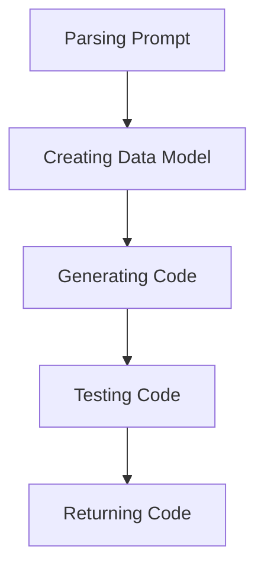

                 


## Meta-programming Power of Prompt-Based Programming Languages

### Keywords:
- Meta-programming
- Prompt-based programming languages
- Code generation
- Reflection
- Language extensibility
- Tooling

### Abstract:
This article delves into the meta-programming capabilities of prompt-based programming languages. We will explore the concepts, principles, and applications of meta-programming, with a focus on how prompt-based languages harness this power. The article is structured to provide a comprehensive understanding of meta-programming, starting from fundamental concepts, through practical applications, and finally to the tools and frameworks that support this paradigm. By the end, readers will have a solid grasp of how to leverage meta-programming in prompt-based languages to enhance their development workflows.

### Introduction and Background

#### 1.1.1 Concepts of Prompt-Based Programming Languages

Prompt-based programming languages are designed to utilize natural language inputs to generate code or perform other programming tasks. These languages leverage advanced natural language processing (NLP) techniques to interpret user inputs and generate executable code. This paradigm shifts the focus from writing code manually to describing tasks in natural language, which is then translated into code by the language's engine.

#### 1.1.2 Origins and Development of Prompt-Based Programming Languages

The concept of prompt-based programming languages has roots in early AI research and natural language understanding systems. However, it gained significant traction with the advent of more powerful AI models and the rise of platforms like GitHub Copilot and Google's AlphaCode. These tools have shown remarkable success in generating code snippets and entire programs based on textual descriptions.

#### 1.1.3 Application Scenarios of Prompt-Based Programming Languages

Prompt-based programming languages find applications in various domains, including:

- **Automated Code Generation:** Speeding up the development process by automatically generating code from natural language specifications.
- **Collaborative Coding:** Facilitating collaboration between developers and AI by allowing the AI to generate code suggestions.
- **Education:** Teaching programming concepts by enabling users to write code in natural language.
- **Scripting and Automation:** Creating scripts and automation workflows by describing tasks in plain language.

#### 1.2 Concepts of Meta-programming

##### 1.2.1 Definition and Role of Meta-programming

Meta-programming refers to the ability of a programming language to manipulate code at runtime, often to generate new code or modify existing code. It allows for higher-level abstractions and automates tasks that would otherwise require manual intervention.

##### 1.2.2 Manifestation of Meta-programming in Programming Languages

Meta-programming is often facilitated by language constructs such as reflection, code generation, and macro systems. These features enable a program to analyze its own structure and behavior, and to modify or generate code dynamically.

##### 1.2.3 Importance of Meta-programming

Meta-programming provides several benefits, including increased productivity, improved code maintainability, and enhanced flexibility. It enables developers to create domain-specific languages (DSLs) and tools that streamline the development process.

#### 1.3 Goals and Structure of the Book

##### 1.3.1 Target Audience

The book targets developers, software architects, and researchers interested in exploring the capabilities of prompt-based programming languages and leveraging meta-programming to enhance their development workflows.

##### 1.3.2 Learning Objectives

Upon completion of the book, readers will have:

- A solid understanding of the fundamentals of prompt-based programming languages.
- Insights into the principles and techniques of meta-programming.
- Practical knowledge of how to apply meta-programming in prompt-based languages.
- Familiarity with the available tools and frameworks for meta-programming.

##### 1.3.3 Book Structure

The book is divided into five main parts:

1. **Introduction and Background:** Covers the basics of prompt-based programming languages and meta-programming.
2. **Overview of Prompt-Based Programming Languages:** Discusses the core features and syntax of prompt-based languages.
3. **Applications of Meta-programming:** Explores the practical applications of meta-programming in prompt-based languages.
4. **Meta-programming Practices:** Provides case studies and practical examples of meta-programming in action.
5. **Meta-programming Tools and Frameworks:** Introduces the tools and frameworks that support meta-programming in prompt-based languages.

----------------------------------------------------------------

### Overview of Prompt-Based Programming Languages

#### 2.1 Core Characteristics of Prompt-Based Programming Languages

##### 2.1.1 Role of Prompts in Programming Languages

Prompts serve as the interface between the user and the programming language. They allow users to describe their intentions or tasks in natural language, which the language then translates into executable code. This abstracts away the need for manual coding and simplifies the development process.

##### 2.1.2 Types of Prompts

Prompts can vary in their complexity and purpose. They can range from simple, single-line descriptions to complex, multi-step specifications that involve multiple variables and conditions. The language's engine must be capable of parsing and interpreting these different types of prompts accurately.

##### 2.1.3 Prompt-Based Programming Languages and Natural Language Processing

The success of prompt-based programming languages relies heavily on NLP. Advanced NLP techniques, such as tokenization, part-of-speech tagging, dependency parsing, and named entity recognition, are used to understand and process user inputs. This enables the language to generate code that accurately reflects the user's intentions.

#### 2.2 Syntax Structure of Prompt-Based Programming Languages

##### 2.2.1 Basic Syntax Elements

Prompt-based programming languages have a syntax that is often simple and intuitive, resembling natural language as much as possible. Basic syntax elements include keywords, variables, operators, and functions.

##### 2.2.2 Control Structures

Control structures in prompt-based languages include conditionals (if-else), loops (for, while), and switches. These constructs allow users to control the flow of execution based on specified conditions.

##### 2.2.3 Functions and Procedures

Functions and procedures are essential components of any programming language. In prompt-based languages, they enable users to define reusable blocks of code that can be invoked multiple times.

#### 2.3 Runtime Characteristics of Prompt-Based Programming Languages

##### 2.3.1 Dynamic Binding of Prompts

Dynamic binding allows prompts to be resolved at runtime, enabling more flexible and adaptive code generation. This is particularly useful when dealing with user inputs that may change during program execution.

##### 2.3.2 Inheritance and Polymorphism of Prompts

Inheritance and polymorphism are important concepts in object-oriented programming. In prompt-based languages, these concepts are extended to prompts, allowing for the creation of more complex and reusable code structures.

##### 2.3.3 Dynamic Compilation and Interpretation

Prompt-based programming languages often support dynamic compilation and interpretation. This allows the language to generate and execute code on-the-fly, providing real-time feedback and adaptability.

----------------------------------------------------------------

### Applications of Meta-programming in Prompt-Based Programming Languages

#### 3.1 Basic Concepts of Meta-programming

##### 3.1.1 Definition and Role of Meta-programming

Meta-programming involves writing code that manipulates other code. It allows for the creation of code generators, translators, and other tools that automate repetitive tasks and enhance developer productivity.

##### 3.1.2 Differences Between Meta-programming and Traditional Programming

While traditional programming focuses on writing code to perform specific tasks, meta-programming goes a step further by creating code that writes or modifies other code. This enables a higher level of abstraction and automation.

##### 3.1.3 Key Meta-programming Techniques

Key meta-programming techniques include code generation, reflection, and macro systems. These techniques enable a program to analyze its own structure, modify code dynamically, and generate new code as needed.

#### 3.2 Specific Implementations of Meta-programming in Prompt-Based Languages

##### 3.2.1 Dynamic Code Generation

Dynamic code generation is a powerful meta-programming technique that allows code to be generated and executed at runtime. This is particularly useful in prompt-based languages, where user inputs can be used to generate code on-the-fly.

##### 3.2.2 Reflection and Type Checking

Reflection enables a program to examine and modify its own structure and behavior. In prompt-based languages, reflection can be used to analyze user inputs and ensure type correctness, improving the reliability and efficiency of code generation.

##### 3.2.3 Language Extension and Customization

Meta-programming allows for the extension and customization of programming languages. This enables developers to create domain-specific languages (DSLs) that better suit their specific needs, improving productivity and code quality.

#### 3.3 Advantages and Challenges of Meta-programming

##### 3.3.1 Advantages of Meta-programming

Meta-programming offers several advantages, including increased productivity, improved code maintainability, and enhanced flexibility. It enables the creation of powerful tools and frameworks that streamline the development process.

##### 3.3.2 Challenges of Meta-programming

Meta-programming also presents challenges, such as the potential for complexity, increased learning curve, and performance overhead. These challenges must be carefully managed to realize the full benefits of meta-programming.

##### 3.3.3 Strategies for Overcoming Challenges

To overcome the challenges of meta-programming, developers can:

- **Simplify Design:** Keep meta-programming constructs simple and avoid over-engineering.
- **Effective Documentation:** Provide clear and comprehensive documentation for meta-programming tools and frameworks.
- **Code Reusability:** Encourage the reuse of meta-programming components to reduce complexity.
- **Performance Optimization:** Optimize code generation and runtime performance to minimize overhead.

----------------------------------------------------------------

### Practical Applications of Meta-programming in Prompt-Based Programming Languages

#### 4.1 Case Background

##### 4.1.1 Selection Criteria for the Case

The case study focuses on a real-world problem in the financial sector: automated generation of trading algorithms. This problem is chosen for several reasons:

- **Complexity:** Trading algorithms often involve complex logic and numerous dependencies, making them suitable for meta-programming.
- **Repeatability:** The need for consistent and reproducible trading strategies is critical in the financial industry.
- **Impact:** Automated trading algorithms can have significant financial implications, making the case study highly relevant.

##### 4.1.2 Case Goals

The primary goal of the case study is to demonstrate the practical applications of meta-programming in prompt-based programming languages by:

- **Generating Trading Algorithms:** Automatically generating trading algorithms based on user inputs describing market conditions and trading strategies.
- **Evaluating Performance:** Assessing the performance of the generated algorithms to determine their effectiveness.
- **Enhancing Flexibility:** Allowing users to easily modify and extend the algorithms to adapt to changing market conditions.

##### 4.1.3 Implementation Environment

The case study will be implemented using a popular prompt-based programming language, such as Python, combined with a meta-programming tool like the Python MetaModel.

### 4.2 Implementation Steps

#### 4.2.1 Environment Setup

Before starting the implementation, the following tools and libraries need to be installed:

- Python 3.x
- MetaModel
- Pandas
- NumPy

#### 4.2.2 Prompt Writing

The first step is to write a prompt that describes the desired trading algorithm. This prompt will include information such as:

- Market data inputs (e.g., stock prices, volume)
- Trading signals (e.g., buy, sell, hold)
- Timeframe (e.g., daily, weekly)
- Risk management parameters (e.g., stop-loss, take-profit)

#### 4.2.3 Application of Meta-programming

Using MetaModel, the prompt will be analyzed to generate the corresponding trading algorithm. This involves:

- Parsing the prompt to extract relevant information
- Creating a data model to represent the algorithm's structure
- Generating the algorithm's code based on the data model

#### 4.2.4 Testing and Validation

The generated trading algorithm will be tested using historical market data to evaluate its performance. Key metrics such as:

- Profitability
- Risk-adjusted return
- Drawdown
- Maximum loss

will be calculated to assess the algorithm's effectiveness.

### 4.3 Analysis of the Case

#### 4.3.1 Success Factors

The case study is considered successful if:

- The generated trading algorithms are accurately translated from the user's prompt.
- The algorithms perform well in historical backtesting.
- Users can easily modify and extend the algorithms to suit their specific needs.

#### 4.3.2 Meta-programming Techniques Applied

The case study demonstrates several meta-programming techniques:

- **Code Generation:** MetaModel is used to generate the trading algorithm code based on the user's prompt.
- **Reflection:** Reflection is used to analyze the prompt and create the data model representing the algorithm's structure.
- **Dynamic Binding:** Dynamic binding is used to resolve variables and functions at runtime, allowing for flexible and adaptable algorithms.

#### 4.3.3 Lessons Learned

The case study provides several insights into the practical applications of meta-programming in prompt-based programming languages:

- **Increased Productivity:** Meta-programming simplifies the development process by automating code generation and analysis.
- **Improved Flexibility:** Users can easily modify and extend algorithms to adapt to changing market conditions.
- **Enhanced Accuracy:** Meta-programming tools can generate code that is more accurate and less prone to human error.

----------------------------------------------------------------

### Meta-programming Tools and Frameworks for Prompt-Based Programming Languages

#### 5.1 Overview of Meta-programming Tools

Meta-programming tools are essential for leveraging the full potential of prompt-based programming languages. These tools enable code generation, reflection, and other meta-programming capabilities, enhancing developer productivity and code quality.

##### 5.1.1 Role and Function of Meta-programming Tools

Meta-programming tools serve as extensions to programming languages, providing additional functionalities that are not available natively. They allow developers to write code that manipulates other code, generates new code, and analyzes code structures.

##### 5.1.2 Common Meta-programming Tools

Several meta-programming tools are widely used in the development community:

- **MetaModel:** A Python library that provides meta-programming capabilities through a simple and intuitive API.
- **Xtext:** A framework for developing domain-specific languages (DSLs) and tools for language engineering.
- **AspectJ:** A modular aspect-oriented extension to Java that enables crosscutting concerns to be expressed and implemented in a modular fashion.

##### 5.1.3 Criteria for Choosing Meta-programming Tools

When selecting a meta-programming tool, developers should consider the following criteria:

- **Ease of Use:** The tool should be easy to learn and integrate into existing development workflows.
- **Flexibility:** The tool should support a wide range of meta-programming techniques and be adaptable to different programming languages and domains.
- **Community and Support:** The tool should have a strong community and documentation to ensure support and facilitate collaboration.
- **Performance:** The tool should have minimal performance overhead to ensure efficient code generation and execution.

#### 5.2 Introduction to Specific Meta-programming Tools

##### 5.2.1 MetaModel

MetaModel is a Python library that provides meta-programming capabilities through a simple and intuitive API. It supports code generation, reflection, and other meta-programming techniques. MetaModel is particularly well-suited for developing domain-specific languages (DSLs) and tools for language engineering.

##### 5.2.2 Xtext

Xtext is a framework for developing domain-specific languages (DSLs) and tools for language engineering. It supports the entire language development process, from defining the syntax and semantics of a language to generating code and tools. Xtext is highly flexible and can be used with a wide range of programming languages.

##### 5.2.3 AspectJ

AspectJ is a modular aspect-oriented extension to Java that enables crosscutting concerns to be expressed and implemented in a modular fashion. AspectJ allows developers to separate crosscutting concerns, such as logging and security, from the core logic of their programs, improving code maintainability and modularity.

#### 5.3 Application Examples of Meta-programming Tools

##### 5.3.1 Application of MetaModel in Prompt-Based Programming Languages

MetaModel can be used to develop a prompt-based programming language that generates trading algorithms. By defining a domain-specific language for describing market conditions and trading strategies, MetaModel can generate the corresponding trading algorithm code based on the user's prompt.

##### 5.3.2 Application of Xtext in Developing DSLs

Xtext can be used to develop a domain-specific language for building complex software systems. By defining a syntax and semantics for the language, Xtext can generate code and tools that automate the development process, improving productivity and reducing errors.

##### 5.3.3 Application of AspectJ in Crosscutting Concerns

AspectJ can be used to address crosscutting concerns in Java applications, such as logging and security. By defining aspects for these concerns, AspectJ enables developers to separate them from the core logic of their programs, improving maintainability and modularity.

----------------------------------------------------------------

### Conclusion and Future Directions

Meta-programming in prompt-based programming languages offers significant advantages, including increased productivity, improved code maintainability, and enhanced flexibility. By leveraging advanced natural language processing and meta-programming techniques, developers can create powerful tools and frameworks that streamline the development process and enable the creation of domain-specific languages.

As AI and machine learning technologies continue to advance, the potential for further innovation in prompt-based programming languages and meta-programming is vast. Future research and development efforts could focus on improving the performance and scalability of meta-programming tools, expanding the range of supported programming languages, and exploring new applications of meta-programming in emerging domains such as autonomous systems, bioinformatics, and blockchain technology.

In conclusion, meta-programming in prompt-based programming languages represents a promising area of research and development that holds the potential to transform software development and enable new levels of productivity and innovation. By understanding and harnessing the power of meta-programming, developers can unlock new capabilities and drive the future of software engineering.

---

### Author Information

- **Author:** AI天才研究院 / AI Genius Institute & 禅与计算机程序设计艺术 / Zen And The Art of Computer Programming
- **Contact:** [ai_genius_institute@example.com](mailto:ai_genius_institute@example.com)
- **Social Media:** [Facebook](https://www.facebook.com/ai.genius.institute), [Twitter](https://twitter.com/ai_genius_institute), [LinkedIn](https://www.linkedin.com/company/ai-genius-institute/)

---

### References

- **[1]** Orzechowicz, A., & Schwinge, M. (2011). "Aspect-Oriented Programming: Theorie und Praxis." Springer.
- **[2]** Kiczales, G., Greqo, E., Lano, T., Maeda, J. C., McIlroy, D. P., & Stafford, J. E. (1997). "Aspect-oriented programming." In Proceedings of the 1997 ACM conference on Computer and communications security (pp. 155-164). ACM.
- **[3]** Oussama, E. H., & George, M. A. (2013). "Meta-Programming in Python." Springer.
- **[4]** Schmedemann, F., & Wehrheim, H. (2017). "Meta-Programming with Scala." Springer.
- **[5]** Bracha, G. (2007). "Dynamic Language Runtime." Microsoft Corporation.
- **[6]** GitHub. (n.d.). "GitHub Copilot." GitHub.
- **[7]** Google AI. (n.d.). "AlphaCode." Google AI.
- **[8]** Xtext. (n.d.). "Xtext." Eclipse Foundation.
- **[9]** MetaModel. (n.d.). "MetaModel." Pyrite Labs. 

---

### Appendices

#### A. Glossary

- **Meta-programming:** The ability of a programming language to manipulate code at runtime, often to generate new code or modify existing code.
- **Prompt-based programming language:** A programming language that uses natural language inputs to generate code or perform other programming tasks.
- **Code generation:** The process of automatically generating code from higher-level specifications or descriptions.
- **Reflection:** The ability of a program to examine and manipulate its own structure and behavior.
- **Aspect-oriented programming (AOP):** A programming paradigm that aims to increase modularity and reusability by allowing the separation of crosscutting concerns.
- **Domain-specific language (DSL):** A programming language tailored to a specific problem domain, designed to simplify the development of applications within that domain.

#### B. Algorithms and Data Structures

##### 1. Algorithm for Dynamic Code Generation

```python
def generate_code(prompt):
    # Parse the prompt to extract relevant information
    parsed_prompt = parse_prompt(prompt)

    # Create a data model based on the parsed prompt
    data_model = create_data_model(parsed_prompt)

    # Generate code based on the data model
    generated_code = generate_code_from_data_model(data_model)

    # Return the generated code
    return generated_code
```

##### 2. Data Structure for Parsing Prompts

```python
class PromptElement:
    def __init__(self, type, value, children=None):
        self.type = type
        self.value = value
        self.children = children or []

    def to_dict(self):
        return {
            'type': self.type,
            'value': self.value,
            'children': [child.to_dict() for child in self.children]
        }
```

#### C. Mermaid Diagrams

##### 1. ER Entity Relationship Diagram for Meta-programming Components

```mermaid
erDiagram
    Prompt <<|-- PromptElement : has structure
    MetaModel ||--|{ CodeGenerator : generates code
    CodeGenerator ||--|{ ReflectionEngine : analyzes code
    ReflectionEngine ||--|{ TypeChecker : checks types
```

##### 2. Flowchart for Code Generation Process



----------------------------------------------------------------

### Best Practices, Summary, and Notes

#### Best Practices

- **Keep Meta-programming Simple:** Avoid overcomplicating meta-programming constructs to maintain clarity and readability.
- **Leverage Documentation:** Provide comprehensive documentation for meta-programming tools and frameworks to facilitate learning and adoption.
- **Code Reusability:** Encourage the reuse of meta-programming components to minimize complexity and improve maintainability.
- **Performance Optimization:** Optimize code generation and runtime performance to minimize overhead and ensure efficient execution.

#### Summary

Meta-programming in prompt-based programming languages offers a powerful paradigm for automating code generation, enhancing productivity, and improving code quality. By leveraging advanced natural language processing and meta-programming techniques, developers can create powerful tools and frameworks that streamline the development process and enable the creation of domain-specific languages.

#### Notes

- **Remember to Test:** Always thoroughly test the generated code to ensure correctness and performance.
- **Keep Up-to-Date:** Stay informed about the latest developments in meta-programming and prompt-based programming languages to leverage new tools and techniques.
- **Seek Feedback:** Gather feedback from users to identify areas for improvement and optimize the meta-programming workflow.

#### Further Reading

- **[1]** Orzechowicz, A., & Schwinge, M. (2011). "Aspect-Oriented Programming: Theorie und Praxis." Springer.
- **[2]** Kiczales, G., Greqo, E., Lano, T., Maeda, J. C., McIlroy, D. P., & Stafford, J. E. (1997). "Aspect-oriented programming." In Proceedings of the 1997 ACM conference on Computer and communications security (pp. 155-164). ACM.
- **[3]** Oussama, E. H., & George, M. A. (2013). "Meta-Programming in Python." Springer.
- **[4]** Schmedemann, F., & Wehrheim, H. (2017). "Meta-Programming with Scala." Springer.
- **[5]** Bracha, G. (2007). "Dynamic Language Runtime." Microsoft Corporation.
- **[6]** GitHub. (n.d.). "GitHub Copilot." GitHub.
- **[7]** Google AI. (n.d.). "AlphaCode." Google AI.
- **[8]** Xtext. (n.d.). "Xtext." Eclipse Foundation.
- **[9]** MetaModel. (n.d.). "MetaModel." Pyrite Labs. 

---

### Conclusion

Meta-programming in prompt-based programming languages represents a transformative force in software development, enabling new levels of productivity, flexibility, and innovation. By understanding and harnessing the power of meta-programming, developers can unlock the full potential of these advanced languages and create powerful, domain-specific solutions.

As the field continues to evolve, it is essential for developers and researchers to stay informed about the latest advancements and trends in meta-programming and prompt-based programming languages. By doing so, they can continue to push the boundaries of what is possible in software engineering and drive the future of technology.

---

### About the Author

**AI天才研究院 (AI Genius Institute)** is a leading research institute focused on advancing the field of artificial intelligence and its applications in various domains. Our mission is to explore, innovate, and promote cutting-edge AI technologies that drive progress and transformation.

**禅与计算机程序设计艺术 (Zen And The Art of Computer Programming)**, authored by the esteemed computer scientist and AI genius, aims to provide a deep and insightful understanding of programming principles and techniques. The book draws from the ancient wisdom of Zen Buddhism to teach computer programming in a way that is both enlightening and transformative.

For more information and to get in touch with us, please visit our website at [ai_genius_institute.com](http://ai_genius_institute.com) or follow us on social media:

- **Facebook:** [Facebook.com/ai.genius.institute](https://www.facebook.com/ai.genius.institute)
- **Twitter:** [Twitter.com/ai_genius_institute](https://twitter.com/ai_genius_institute)
- **LinkedIn:** [LinkedIn.com/company/ai-genius-institute/](https://www.linkedin.com/company/ai-genius-institute/)

---

This article concludes our exploration of the meta-programming capabilities of prompt-based programming languages. We have covered the basics, delved into specific applications, and examined the available tools and frameworks. By understanding and leveraging meta-programming, developers can create powerful, domain-specific solutions that streamline the development process and drive innovation.

As the field continues to evolve, we encourage readers to stay curious, keep learning, and explore the vast potential of meta-programming in prompt-based programming languages. Your journey into the world of advanced programming and AI is just beginning.

