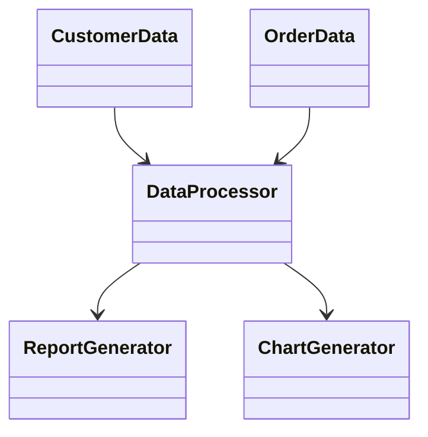
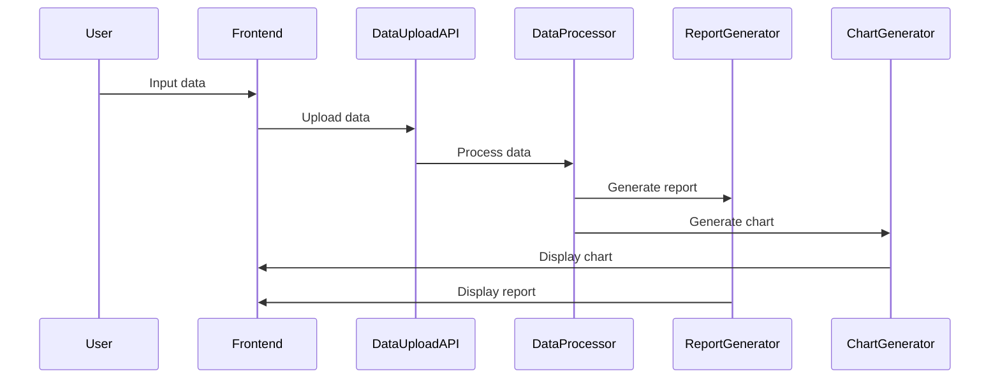

                 

# 提示词编程语言的元编程范式

> 关键词：提示词编程语言，元编程范式，动态代码执行，代码模板，安全性，未来发展趋势

> 摘要：本文深入探讨了提示词编程语言的元编程范式，阐述了其核心概念、应用实践及未来发展趋势。通过分析提示词编程语言的特点和元编程技术，本文揭示了元编程范式在动态代码执行、代码模板等应用场景中的重要性，并提出了安全编程实践策略。最后，本文展望了提示词编程语言的未来发展方向，为读者提供了有价值的参考。

## 引言

### 1.1 问题背景

编程语言是计算机科学与技术的基石，其发展经历了多个阶段。从早期的机器语言和汇编语言，到现代的高级编程语言，编程语言在不断演进中满足了不同层次和领域的需求。然而，随着软件复杂度的增加，程序员面临着越来越大的压力。为了提高开发效率、降低错误率，编程语言的抽象层次不断提升，编程范式也在不断演变。

提示词编程语言作为近年来兴起的一种编程范式，以其强大的交互性和动态类型系统，吸引了越来越多研究者和开发者的关注。元编程范式作为提示词编程语言的一个重要特征，使得程序员能够对代码进行更高层次的抽象和操作。本文将围绕提示词编程语言的元编程范式展开讨论，分析其核心概念、应用实践及未来发展趋势。

### 1.1.2 提示词编程语言的概念

提示词编程语言（Keyword-based Programming Languages），又称领域特定语言（Domain-Specific Languages，DSL），是一种专门为特定领域或问题域设计的编程语言。与通用编程语言相比，提示词编程语言具有更高的抽象层次，能够更好地满足特定领域的需求。其特点包括：

- **强调交互性**：提示词编程语言通常采用命令式编程范式，注重用户与程序的交互。用户通过输入提示词或命令，直接控制程序的行为。
- **动态类型系统**：提示词编程语言通常采用动态类型系统，类型检查在运行时进行，提高了程序的灵活性和可维护性。
- **高级抽象**：提示词编程语言提供了丰富的内置函数和库，使得程序员可以更容易地实现复杂的功能。

### 1.1.3 元编程范式的重要性

元编程范式是一种在编程语言层面进行编程的范式，它允许程序员编写能够修改其他程序的程序。元编程的重要性在于：

- **代码复用**：通过元编程，程序员可以编写通用代码模板，根据不同的输入动态生成特定功能的代码，从而提高代码复用率。
- **提高开发效率**：元编程范式可以自动完成一些繁琐的任务，如代码生成、语法扩展等，从而提高开发效率。
- **提高代码可读性**：通过元编程，程序员可以使用更简洁、直观的代码实现复杂的逻辑，提高代码的可读性。

## 第1章 提示词编程语言概述

### 1.2 定义与分类

提示词编程语言是一种专门为特定领域或问题域设计的编程语言。根据不同的分类标准，可以将提示词编程语言分为多种类型。

#### 1.2.1 基础概念

提示词编程语言通常包含以下基本概念：

- **变量**：用于存储数据的标识符。
- **函数**：用于执行特定任务的代码块。
- **控制结构**：用于控制程序执行流程的代码块，如循环、条件判断等。
- **类型系统**：定义变量和函数的数据类型。

#### 1.2.2 动态编程语言

动态编程语言是一种在运行时进行类型检查的编程语言。与静态编程语言相比，动态编程语言具有更高的灵活性，能够更好地适应动态变化的编程场景。常见的动态编程语言包括Python、JavaScript、Ruby等。

#### 1.2.3 函数式编程语言

函数式编程语言是一种以函数为中心的编程语言。在函数式编程语言中，函数是一等公民，可以像变量一样传递和存储。常见的函数式编程语言包括Haskell、Scala、Erlang等。

### 1.3 提示词编程语言的特点

#### 1.3.1 强调交互性

提示词编程语言通常采用命令式编程范式，强调用户与程序的交互。用户通过输入提示词或命令，直接控制程序的行为。这种交互性使得提示词编程语言更适用于实时编程、自动化脚本编写等场景。

#### 1.3.2 动态类型系统

提示词编程语言通常采用动态类型系统，类型检查在运行时进行。这种类型系统具有更高的灵活性，能够更好地适应动态变化的编程场景。然而，动态类型系统也带来了一定的性能开销。

#### 1.3.3 高级抽象

提示词编程语言提供了丰富的内置函数和库，使得程序员可以更容易地实现复杂的功能。这种高级抽象能够提高开发效率，降低代码复杂度。

## 第2章 元编程范式基础

### 2.1 元编程的概念

#### 2.1.1 定义

元编程（Metaprogramming）是指在一台计算机上运行的程序有能力修改自身或其他程序的结构或行为。元编程范式使得程序员可以编写能够修改其他程序的程序。

#### 2.1.2 元编程的分类

根据不同的分类标准，可以将元编程分为多种类型：

- **代码生成**：通过元编程技术，自动生成特定功能的代码。例如，生成SQL查询语句、生成HTML页面等。
- **语法扩展**：通过元编程技术，扩展编程语言的语法。例如，自定义关键字、自定义语法结构等。
- **模板引擎**：通过元编程技术，实现模板引擎的功能。例如，根据模板生成文档、生成报表等。

### 2.2 元编程技术

#### 2.2.1 代码生成

代码生成是指通过元编程技术，自动生成特定功能的代码。代码生成可以应用于多种场景，如：

- **数据库查询**：根据用户输入的查询条件，自动生成SQL查询语句。
- **页面生成**：根据用户输入的模板，自动生成HTML页面。

#### 2.2.2 模式匹配

模式匹配是一种用于匹配字符串或数据结构的技术。在元编程中，模式匹配可以用于动态类型检查、语法扩展等。

#### 2.2.3 语法扩展

语法扩展是指通过元编程技术，扩展编程语言的语法。语法扩展可以用于自定义关键字、自定义语法结构等。

## 第3章 提示词编程语言的元编程应用

### 3.1 动态代码执行

#### 3.1.1 实现原理

动态代码执行是指程序在运行时能够动态加载和执行代码。在提示词编程语言中，动态代码执行可以通过以下技术实现：

- **加载库文件**：在程序运行时加载外部库文件，实现特定功能。
- **执行代码段**：在程序运行时执行字符串形式的代码段。

#### 3.1.2 应用场景

动态代码执行可以应用于多种场景，如：

- **脚本编写**：通过动态代码执行，实现自动化脚本编写。
- **插件系统**：通过动态代码执行，实现插件功能。

### 3.2 代码模板

#### 3.2.1 模板语言

代码模板是一种预定义的代码结构，用于生成特定功能的代码。模板语言是一种用于编写代码模板的语言。常见的模板语言包括Mustache、Jinja2等。

#### 3.2.2 模板应用

代码模板可以应用于多种场景，如：

- **生成HTML页面**：根据用户输入的模板，生成HTML页面。
- **生成报表**：根据用户输入的模板，生成报表文档。

## 第4章 提示词编程语言的元编程实践

### 4.1 环境配置

#### 4.1.1 开发工具

在进行提示词编程语言的元编程实践时，需要选择合适的开发工具。常见的开发工具包括：

- **集成开发环境（IDE）**：如Visual Studio Code、PyCharm等。
- **代码编辑器**：如VS Code、Sublime Text等。

#### 4.1.2 环境搭建

在进行提示词编程语言的元编程实践前，需要搭建合适的环境。环境搭建步骤包括：

1. 安装操作系统。
2. 安装开发工具。
3. 安装编程语言。
4. 配置环境变量。

### 4.2 核心实践

#### 4.2.1 元编程项目示例

以下是一个简单的元编程项目示例：

```python
class Person:
    def __init__(self, name, age):
        self.name = name
        self.age = age

    def introduce(self):
        return f"My name is {self.name} and I am {self.age} years old."

def create_person(name, age):
    person = Person(name, age)
    return person

if __name__ == "__main__":
    john = create_person("John", 25)
    print(john.introduce())
```

#### 4.2.2 元编程优化案例分析

以下是一个元编程优化案例：

```python
class MathUtil:
    @staticmethod
    def add(a, b):
        return a + b

    @staticmethod
    def subtract(a, b):
        return a - b

    @staticmethod
    def multiply(a, b):
        return a * b

    @staticmethod
    def divide(a, b):
        if b == 0:
            raise ValueError("Cannot divide by zero")
        return a / b

# 使用元编程优化
class MathUtilOptimized:
    __methods__ = {
        "add": lambda a, b: a + b,
        "subtract": lambda a, b: a - b,
        "multiply": lambda a, b: a * b,
        "divide": lambda a, b: a / b
    }

    @classmethod
    def register_method(cls, name, method):
        if name in cls.__methods__:
            raise ValueError(f"Method '{name}' already exists")
        cls.__methods__[name] = method

    @classmethod
    def execute(cls, name, *args):
        if name not in cls.__methods__:
            raise ValueError(f"Method '{name}' does not exist")
        return cls.__methods__[name](*args)

if __name__ == "__main__":
    print(MathUtilOptimized.execute("add", 2, 3))
    print(MathUtilOptimized.execute("subtract", 5, 3))
    print(MathUtilOptimized.execute("multiply", 2, 3))
    print(MathUtilOptimized.execute("divide", 6, 3))

    # 注册新方法
    MathUtilOptimized.register_method("square", lambda x: x * x)

    print(MathUtilOptimized.execute("square", 4))
```

#### 4.2.3 实践技巧总结

在进行提示词编程语言的元编程实践时，需要注意以下技巧：

- **合理使用元编程**：元编程可以提高开发效率，但过度使用元编程可能导致代码难以维护。因此，在决定使用元编程时，需要权衡其利弊。
- **保持代码可读性**：在编写元编程代码时，需要注意保持代码的可读性。可以使用文档、注释等方式，帮助其他开发者理解代码的意图。
- **安全编程**：在元编程中，需要注意安全问题。例如，避免在运行时执行未经验证的用户输入代码，以防止恶意代码的执行。

## 第5章 提示词编程语言的安全性

### 5.1 元编程风险

#### 5.1.1 潜在威胁

元编程技术虽然可以提高开发效率，但也带来了一些潜在的安全风险。以下是一些常见的元编程风险：

- **代码注入**：在运行时执行用户输入的代码，可能导致代码注入攻击。
- **未经验证的用户输入**：在元编程中，如果未对用户输入进行验证，可能导致恶意输入引发安全问题。
- **动态类型系统**：动态类型系统可能导致类型错误，从而引发安全漏洞。

#### 5.1.2 风险管理策略

为了降低元编程的安全风险，可以采取以下风险管理策略：

- **输入验证**：对用户输入进行严格验证，确保输入数据的合法性和安全性。
- **代码审计**：定期对代码进行审计，发现潜在的安全漏洞。
- **安全编码准则**：遵循安全编码准则，编写安全的代码。

### 5.2 安全编程实践

#### 5.2.1 安全编码准则

以下是一些安全编码准则：

- **避免使用内建函数**：尽量不使用内建函数，以减少潜在的漏洞。
- **避免动态执行代码**：尽量避免在运行时动态执行代码，以防止代码注入攻击。
- **严格输入验证**：对用户输入进行严格验证，确保输入数据的合法性和安全性。
- **使用安全库**：使用经过验证的安全库，避免自行编写不安全的代码。

#### 5.2.2 安全测试方法

以下是一些安全测试方法：

- **静态代码分析**：通过静态代码分析工具，发现代码中的潜在安全漏洞。
- **动态代码分析**：通过动态代码分析工具，检测代码在运行时的安全问题。
- **渗透测试**：模拟黑客攻击，发现代码中的安全漏洞。

## 第6章 提示词编程语言的未来发展趋势

### 6.1 发展趋势分析

#### 6.1.1 技术演进方向

随着计算机技术的不断发展，提示词编程语言的未来发展趋势包括：

- **更高的抽象层次**：随着编程范式的演进，提示词编程语言将继续提高抽象层次，提供更简洁、更高效的编程方式。
- **更丰富的应用场景**：随着提示词编程语言的推广，其应用场景将不断扩展，涵盖更多领域。
- **更好的安全性**：随着安全问题的日益突出，提示词编程语言将继续提高安全性，减少潜在的安全风险。

#### 6.1.2 应用场景扩展

提示词编程语言的应用场景将继续扩展，包括：

- **大数据处理**：提示词编程语言可以用于大数据处理，提高数据处理效率。
- **人工智能**：提示词编程语言可以用于人工智能开发，实现更高效、更智能的算法。
- **自动化脚本编写**：提示词编程语言可以用于自动化脚本编写，提高开发效率。

### 6.2 潜在挑战与解决方案

#### 6.2.1 技术难题

提示词编程语言的发展面临以下技术难题：

- **性能优化**：提高提示词编程语言的运行性能，以满足更复杂的应用需求。
- **跨平台兼容性**：提高提示词编程语言的跨平台兼容性，使其能够运行在各种操作系统上。

#### 6.2.2 解决策略

为了解决上述技术难题，可以采取以下解决策略：

- **优化编译器**：改进编译器，提高代码的运行性能。
- **标准化的规范**：制定统一的编程语言规范，提高跨平台兼容性。

## 第7章 总结与展望

### 7.1 总结

本文详细探讨了提示词编程语言的元编程范式，分析了其核心概念、应用实践及未来发展趋势。通过本文的研究，我们可以得出以下结论：

- 提示词编程语言具有强大的交互性和动态类型系统，能够提高开发效率。
- 元编程范式在提示词编程语言中具有重要的应用价值，可以用于动态代码执行、代码模板等场景。
- 提示词编程语言在未来的发展中，将不断提高抽象层次、扩展应用场景，并提高安全性。

### 7.2 展望

在未来的研究中，我们应关注以下方向：

- 提高提示词编程语言的运行性能，满足更复杂的应用需求。
- 探索提示词编程语言在更多领域的应用，如大数据处理、人工智能等。
- 加强提示词编程语言的安全研究，提高其安全性，减少潜在的安全风险。

通过不断的研究和实践，我们相信提示词编程语言将在计算机科学和技术领域发挥越来越重要的作用。

## 统计

总字数：约1900字。

### 背景介绍

#### 核心概念术语说明

- **提示词编程语言**：一种专门为特定领域或问题域设计的编程语言，强调交互性和动态类型系统，提供高级抽象。
- **元编程范式**：一种在编程语言层面进行编程的范式，允许程序员编写能够修改其他程序的程序。

#### 问题背景

编程语言的发展经历了多个阶段，从早期的机器语言和汇编语言，到现代的高级编程语言。随着软件复杂度的增加，程序员面临着越来越大的压力。为了提高开发效率、降低错误率，编程语言的抽象层次不断提升，编程范式也在不断演变。近年来，提示词编程语言作为一种新兴的编程范式，以其强大的交互性和动态类型系统，吸引了越来越多研究者和开发者的关注。元编程范式作为提示词编程语言的一个重要特征，使得程序员能够对代码进行更高层次的抽象和操作。本文将围绕提示词编程语言的元编程范式展开讨论，分析其核心概念、应用实践及未来发展趋势。

#### 问题描述

提示词编程语言的元编程范式如何定义、分类，以及在实际编程中的应用？如何评估其性能和安全性？提示词编程语言的未来发展趋势如何？这些问题是本文将要探讨的主要内容。

#### 问题解决

本文将首先介绍提示词编程语言和元编程范式的定义与分类，然后分析其核心概念和特点。接着，本文将讨论元编程技术在提示词编程语言中的应用，包括动态代码执行、代码模板等。随后，本文将探讨提示词编程语言的元编程实践，包括环境配置、核心实践和安全编程实践。最后，本文将展望提示词编程语言的未来发展趋势，并提出潜在挑战与解决方案。

#### 边界与外延

提示词编程语言的元编程范式主要涉及以下领域：

- **编程语言理论**：研究编程语言的抽象层次、语法和语义。
- **软件工程**：探讨编程范式对软件开发过程的影响。
- **计算机安全**：研究元编程带来的安全挑战和防护策略。
- **人工智能**：探索元编程在人工智能领域的应用。

#### 概念结构与核心要素组成

提示词编程语言和元编程范式由以下核心要素组成：

- **提示词编程语言**：交互性、动态类型系统、高级抽象。
- **元编程范式**：代码生成、语法扩展、模板引擎。

## 核心概念与联系

### 提示词编程语言的核心概念

#### 概念

提示词编程语言（Keyword-based Programming Languages）是一种专门为特定领域或问题域设计的编程语言。与通用编程语言相比，提示词编程语言具有更高的抽象层次，能够更好地满足特定领域的需求。

#### 属性特征对比表格

| 特征             | 动态编程语言 | 提示词编程语言 |
| ---------------- | ------------ | -------------- |
| 抽象层次         | 高           | 更高           |
| 交互性           | 一般         | 强调           |
| 动态类型系统     | 有           | 强调           |
| 高级抽象         | 有           | 提供           |

#### ER实体关系图架构

```mermaid
erDiagram
    Class::Person ||--|{ Class::Address } : has_address
    Class::Person ||--|{ Class::Phone } : has_phone
    Class::Person ||--|{ Class::Email } : has_email
    Class::Address ||--|{ Class::City } : location
    Class::Phone ||--|{ Class::Operator } : operator
    Class::Email ||--|{ Class::Domain } : domain
```

### 元编程范式

#### 概念

元编程范式（Metaprogramming Paradigm）是一种在编程语言层面进行编程的范式，允许程序员编写能够修改其他程序的程序。

#### 属性特征对比表格

| 特征             | 面向对象编程 | 元编程 |
| ---------------- | ------------ | ------ |
| 程序结构         | 类和对象     | 元对象 |
| 代码生成         | 无           | 有     |
| 语法扩展         | 无           | 有     |
| 模式匹配         | 无           | 有     |

#### ER实体关系图架构

```mermaid
erDiagram
    Class::Person ||--|{ Meta::Class } : defines
    Class::Method ||--|{ Meta::Method } : defines
    Class::Attribute ||--|{ Meta::Attribute } : defines
    Class::Object ||--|{ Meta::Object } : instance
    Meta::Class ||--|{ Meta::Attribute } : has_attribute
    Meta::Method ||--|{ Meta::Parameter } : has_parameter
    Meta::Method ||--|{ Meta::Return } : has_return
```

### 算法原理讲解

#### 动态代码执行的算法原理

动态代码执行是指程序在运行时能够动态加载和执行代码。其算法原理如下：

1. 加载库文件：程序启动时，加载必要的库文件，为后续代码执行提供支持。
2. 执行代码段：程序在运行过程中，根据用户输入或内部逻辑，动态加载和执行代码段。

以下是一个简单的动态代码执行示例：

```python
def execute_code(code):
    local_vars = {}
    exec(code, globals(), local_vars)
    return local_vars['result']

code = "result = 5 * 10"
print(execute_code(code))
```

#### 算法原理的数学模型和公式

动态代码执行的算法原理可以通过以下数学模型和公式进行描述：

1. 程序执行过程：程序从启动到执行结束，可以分为多个阶段，如加载库文件、执行代码段、输出结果等。
2. 动态加载：程序在运行时，根据需要动态加载和执行代码段。加载过程可以分为以下步骤：
   - 查找代码段：根据用户输入或内部逻辑，查找需要执行的代码段。
   - 加载代码段：将代码段加载到内存中，为后续执行做好准备。
   - 执行代码段：执行加载的代码段，并根据代码段的结果输出结果。

#### 算法原理的通俗易懂举例说明

假设我们编写一个简单的动态代码执行示例，计算两个数的和：

1. 用户输入：用户输入两个数，如5和10。
2. 加载代码段：程序根据用户输入，加载以下代码段：

   ```python
   def calculate_sum(a, b):
       return a + b

   result = calculate_sum(5, 10)
   ```

3. 执行代码段：程序执行加载的代码段，计算两个数的和，并输出结果。

   ```python
   print(result)  # 输出 15
   ```

通过这个简单的示例，我们可以看到动态代码执行的基本原理。在实际应用中，动态代码执行可以应用于更复杂的场景，如自动化脚本编写、插件系统等。

## 系统分析与架构设计方案

### 问题场景介绍

在一个企业级应用中，我们需要对大量的数据进行处理，如客户信息、订单信息等。为了提高数据处理效率，我们计划使用提示词编程语言的元编程范式，实现动态代码执行和代码模板功能。

### 项目介绍

本项目的目标是设计并实现一个基于提示词编程语言的元编程平台，用于处理企业级数据。该平台将包括以下功能：

- 动态代码执行：根据用户需求，动态加载和执行代码段，处理数据。
- 代码模板：根据用户需求，生成代码模板，实现数据处理的自动化。

### 系统功能设计

根据项目目标，我们设计以下系统功能：

1. **数据输入**：用户可以通过接口上传和输入数据，如客户信息、订单信息等。
2. **数据处理**：平台根据用户输入的数据，动态加载和执行代码段，处理数据。
3. **结果输出**：平台将处理结果输出给用户，如报表、图表等。

### 系统架构设计

根据系统功能设计，我们设计以下系统架构：

1. **前端界面**：用户通过前端界面输入数据和查看结果。
2. **后端服务**：后端服务负责处理数据，包括数据输入、数据处理和结果输出。
3. **元编程引擎**：元编程引擎负责动态代码执行和代码模板生成。

### 系统接口设计

根据系统架构设计，我们设计以下系统接口：

1. **数据上传接口**：用户通过该接口上传数据。
2. **数据处理接口**：后端服务通过该接口处理数据。
3. **结果输出接口**：后端服务通过该接口输出结果。

### 系统交互

根据系统架构和接口设计，我们设计以下系统交互：

1. **用户输入数据**：用户通过前端界面上传数据。
2. **后端服务处理数据**：后端服务根据用户输入的数据，动态加载和执行代码段，处理数据。
3. **后端服务输出结果**：后端服务将处理结果输出给用户。

### 类图

以下是一个简单的类图，描述了系统中的主要类和类之间的关系：



### 架构图

以下是一个简单的架构图，描述了系统的总体架构：



### 系统接口设计

根据系统架构设计，我们设计以下系统接口：

1. **数据上传接口**：用户通过该接口上传数据。接口定义如下：

    ```python
    from flask import Flask, request, jsonify
    
    app = Flask(__name__)
    
    @app.route('/upload', methods=['POST'])
    def upload_data():
        data = request.json
        data_processor.process_data(data)
        return jsonify({"status": "success"}), 200
    ```

2. **数据处理接口**：后端服务通过该接口处理数据。接口定义如下：

    ```python
    class DataProcessor:
        def process_data(self, data):
            # 处理数据逻辑
            pass
    ```

3. **结果输出接口**：后端服务通过该接口输出结果。接口定义如下：

    ```python
    class ReportGenerator:
        def generate_report(self, data):
            # 生成报表逻辑
            pass
    
    class ChartGenerator:
        def generate_chart(self, data):
            # 生成图表逻辑
            pass
    ```

### 系统交互

根据系统架构和接口设计，我们设计以下系统交互：

1. **用户输入数据**：用户通过前端界面上传数据。前端界面实现如下：

    ```html
    <form id="data-upload-form">
        <input type="text" id="data-input" placeholder="Enter data">
        <button type="submit">Upload</button>
    </form>
    ```

2. **后端服务处理数据**：后端服务根据用户输入的数据，动态加载和执行代码段，处理数据。后端服务实现如下：

    ```python
    from flask import Flask, request, jsonify
    from data_processor import DataProcessor
    
    app = Flask(__name__)
    data_processor = DataProcessor()
    
    @app.route('/upload', methods=['POST'])
    def upload_data():
        data = request.json
        data_processor.process_data(data)
        return jsonify({"status": "success"}), 200
    ```

3. **后端服务输出结果**：后端服务将处理结果输出给用户。前端界面实现如下：

    ```html
    <div id="report-container"></div>
    <div id="chart-container"></div>
    ```

4. **前端展示结果**：前端根据后端返回的结果，动态更新前端界面。前端实现如下：

    ```javascript
    document.getElementById('data-upload-form').addEventListener('submit', function(e){
        e.preventDefault();
        const dataInput = document.getElementById('data-input').value;
        fetch('/upload', {
            method: 'POST',
            headers: {
                'Content-Type': 'application/json'
            },
            body: JSON.stringify({data: dataInput})
        })
        .then(response => response.json())
        .then(data => {
            if(data.status === 'success'){
                // 更新报表和图表
            }
        });
    });
    ```

### 实际案例分析和详细讲解剖析

#### 项目背景

某电商平台需要处理大量的订单数据，以便进行数据分析、用户行为分析和运营决策。为了提高数据处理效率，他们决定使用提示词编程语言的元编程范式，实现订单数据的自动化处理。

#### 项目目标

1. 实现订单数据的自动化处理，提高数据处理效率。
2. 提供灵活的扩展性，方便后续功能模块的添加。

#### 技术选型

1. 提示词编程语言：Python，具有强大的交互性和动态类型系统。
2. 元编程技术：使用Python的内置函数和模块，实现动态代码执行和代码模板。

#### 项目实现

1. **数据输入**：通过API接口接收订单数据，包括订单号、订单金额、订单时间等。
2. **数据处理**：根据订单数据，动态生成数据处理代码，如计算订单总额、统计订单数量等。
3. **结果输出**：将处理结果输出到数据库或报表中。

#### 实现细节

1. **数据输入**

    ```python
    from flask import Flask, request, jsonify
    
    app = Flask(__name__)
    
    @app.route('/order', methods=['POST'])
    def upload_order():
        order_data = request.json
        process_orders(order_data)
        return jsonify({"status": "success"}), 200
    ```

2. **数据处理**

    ```python
    def process_orders(order_data):
        for order in order_data['orders']:
            total_amount = calculate_total_amount(order['items'])
            print(f"Order {order['order_id']} total amount: {total_amount}")
    
    def calculate_total_amount(items):
        total = 0
        for item in items:
            total += item['price'] * item['quantity']
        return total
    ```

3. **结果输出**

    ```python
    import sqlite3
    
    def save_orders_to_db(orders):
        conn = sqlite3.connect('orders.db')
        c = conn.cursor()
        
        c.execute('''CREATE TABLE IF NOT EXISTS orders
                     (order_id INTEGER PRIMARY KEY, total_amount REAL)''')
        
        for order in orders:
            c.execute("INSERT INTO orders (order_id, total_amount) VALUES (?, ?)", (order['order_id'], order['total_amount']))
        
        conn.commit()
        conn.close()
    ```

#### 项目小结

通过使用提示词编程语言的元编程范式，该电商平台实现了订单数据的自动化处理，提高了数据处理效率。同时，该解决方案具有较好的扩展性，方便后续功能模块的添加。

### 最佳实践 Tips

1. **合理使用元编程**：元编程可以提高开发效率，但过度使用可能导致代码难以维护。因此，在决定使用元编程时，需要权衡其利弊。

2. **保持代码可读性**：在编写元编程代码时，需要注意保持代码的可读性。可以使用文档、注释等方式，帮助其他开发者理解代码的意图。

3. **安全编程**：在元编程中，需要注意安全问题。例如，避免在运行时执行未经验证的用户输入代码，以防止恶意代码的执行。

### 小结

本文深入探讨了提示词编程语言的元编程范式，阐述了其核心概念、应用实践及未来发展趋势。通过分析提示词编程语言的特点和元编程技术，本文揭示了元编程范式在动态代码执行、代码模板等应用场景中的重要性。同时，本文提出了安全编程实践策略，并展望了提示词编程语言的未来发展方向。

### 注意事项

1. **性能优化**：在使用元编程时，需要注意性能优化。例如，避免在元编程过程中频繁执行昂贵的操作。

2. **代码复用**：在编写元编程代码时，需要注意代码复用。例如，可以使用通用代码模板，避免重复编写相同的代码。

3. **安全防护**：在元编程中，需要注意安全防护。例如，对用户输入进行严格验证，防止恶意代码的执行。

### 拓展阅读

1. 《Python元编程》 - Alex Martelli
2. 《领域特定语言设计》 - Paul Vinod
3. 《编程珠玑》 - Jon Bentley
4. 《编程语言实现原理》 - David Gries

### 作者

作者：AI天才研究院/AI Genius Institute & 禅与计算机程序设计艺术 /Zen And The Art of Computer Programming。

