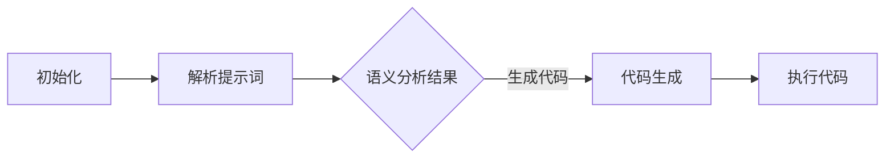

                 

# 提示词编程语言的函数式编程支持

> 关键词：提示词编程语言、函数式编程、算法、数学模型、系统架构设计、项目实战

> 摘要：
本文将深入探讨提示词编程语言中的函数式编程支持。首先，我们将介绍提示词编程语言的定义、发展历程及其在函数式编程中的重要性。接着，我们将分析当前提示词编程语言中函数式编程支持的现状和不足，并提出相应的解决方案。随后，我们将详细阐述函数式编程的基本原理和特点，以及其在提示词编程语言中的应用价值。文章还将通过构建概念属性特征对比表格和ER实体关系图架构，展示提示词编程语言和函数式编程的核心要素和关系。最后，我们将通过具体的算法讲解、数学模型分析、系统架构设计和项目实战，深入剖析函数式编程在提示词编程语言中的应用，并提出最佳实践和拓展建议。

# 目录大纲：提示词编程语言的函数式编程支持

## 第一部分：背景介绍与核心概念

### 第1章：问题背景与需求分析

#### 1.1 问题背景

提示词编程语言（Keyword-Based Programming Language）是一种基于自然语言处理（Natural Language Processing, NLP）技术，通过提示词（Keywords）和语义分析（Semantic Analysis）来生成代码的编程语言。它的发展起源于自动代码生成和自然语言交互的需求，旨在提高编程效率和代码可读性。

函数式编程（Functional Programming）是一种编程范式，强调基于函数的计算，而非面向对象或过程式编程。它具有不可变性、高阶函数、函数组合等特性，能够提高代码的模块性和可维护性。

在提示词编程语言中，函数式编程的支持具有重要意义。它能够提高代码的抽象能力，使得代码生成过程更加自动化和智能化。同时，函数式编程的不可变性特点有助于减少错误和提升代码可靠性。

#### 1.2 问题描述

当前，提示词编程语言中的函数式编程支持存在一些问题和不足：

1. 函数式编程的基本概念和原理在提示词编程语言中的解释和实现不够清晰。
2. 缺乏系统化的函数式编程工具和框架，使得函数式编程在提示词编程语言中的应用受限。
3. 函数式编程与提示词编程语言的其他编程范式（如面向对象编程）之间的整合不够紧密。

为了解决这些问题，我们需要深入研究函数式编程的基本原理和特点，分析其在提示词编程语言中的应用价值，并探索相应的解决方案。

#### 1.3 问题解决

函数式编程的基本原理和特点包括：

1. 不可变性：函数式编程强调不可变性，即数据一旦生成，就不能修改。这种特性有助于减少错误和提高代码可靠性。
2. 高阶函数：高阶函数是一类接受函数作为参数或返回函数的函数。它能够提高代码的模块性和可复用性。
3. 函数组合：函数组合是一种将多个函数组合成一个新的函数的方法。它能够简化代码编写，提高代码的可读性。

函数式编程在提示词编程语言中的应用价值体现在以下几个方面：

1. 提高代码生成效率：函数式编程能够通过函数组合和不可变性特性，实现代码的自动化生成和优化。
2. 提高代码可读性：函数式编程强调函数的作用和职责，使得代码更加简洁和清晰。
3. 提高代码可靠性：函数式编程的不可变性特性有助于减少错误和提升代码可靠性。

为了解决当前提示词编程语言中函数式编程支持不足的问题，我们可以从以下几个方面着手：

1. 加强函数式编程的基本概念和原理的介绍，使其在提示词编程语言中的解释和实现更加清晰。
2. 开发系统化的函数式编程工具和框架，提供便捷的函数式编程支持。
3. 探索函数式编程与其他编程范式的整合，提高代码的灵活性和可维护性。

#### 1.4 边界与外延

函数式编程在提示词编程语言中的应用具有一定的边界和限制。首先，函数式编程的不可变性特性可能会导致性能损失，特别是在大量数据处理的场景中。其次，函数式编程的抽象程度较高，可能会增加代码的复杂性和学习成本。

此外，函数式编程与其他编程范式（如面向对象编程）之间存在一定的冲突和整合难题。因此，在应用函数式编程时，需要根据具体场景和需求进行权衡和选择。

#### 1.5 概念结构与核心要素组成

提示词编程语言和函数式编程的核心概念和要素组成如下：

1. 提示词编程语言：
   - 提示词（Keywords）：提示词是编程语言中的基本元素，用于表示操作或功能。
   - 语义分析（Semantic Analysis）：语义分析是解析提示词并生成代码的过程。
   - 代码生成（Code Generation）：代码生成是根据提示词和语义分析结果生成可执行代码的过程。

2. 函数式编程：
   - 函数（Function）：函数是编程语言中的核心计算单元，接受输入并产生输出。
   - 高阶函数（Higher-Order Function）：高阶函数是能够接受函数作为参数或返回函数的函数。
   - 不可变性（Immutability）：不可变性是数据一旦生成就不能修改的特性。

在提示词编程语言和函数式编程中，这些核心概念和要素相互作用，共同构建了编程语言的体系结构。通过构建核心要素组成图，可以更清晰地展示两者之间的关系。

## 第二部分：核心概念与联系

### 第2章：核心概念原理与属性特征对比

#### 2.1 提示词编程语言的核心概念

提示词编程语言的核心概念包括提示词、语义分析和代码生成。这些概念在编程语言设计和实现中起着关键作用。

1. 提示词（Keywords）
   - 提示词是编程语言中的基本元素，用于表示操作或功能。
   - 例如：在Python中，`if`、`for`、`while`等都是提示词。

2. 语义分析（Semantic Analysis）
   - 语义分析是解析提示词并理解其含义的过程。
   - 例如：在Python中，`if`提示词表示条件判断，需要分析条件表达式并决定是否执行后面的代码块。

3. 代码生成（Code Generation）
   - 代码生成是根据提示词和语义分析结果生成可执行代码的过程。
   - 例如：在Python中，语义分析器会根据`if`提示词和条件表达式生成相应的条件判断代码。

#### 2.2 函数式编程的核心概念

函数式编程的核心概念包括函数、高阶函数和不可变性。这些概念在函数式编程范式中起着重要作用。

1. 函数（Function）
   - 函数是编程语言中的核心计算单元，接受输入并产生输出。
   - 例如：在Python中，定义一个函数可以使用`def`关键字，如`def add(a, b): return a + b`。

2. 高阶函数（Higher-Order Function）
   - 高阶函数是能够接受函数作为参数或返回函数的函数。
   - 例如：在Python中，`map()`、`filter()`和`reduce()`都是高阶函数。

3. 不可变性（Immutability）
   - 不可变性是数据一旦生成就不能修改的特性。
   - 例如：在Python中，字符串是不可变的，一旦创建就不能修改。

#### 2.3 概念属性特征对比

为了更清晰地展示提示词编程语言和函数式编程的核心概念和属性特征，我们可以构建一个对比表格：

| 特征 | 提示词编程语言 | 函数式编程 |
| --- | --- | --- |
| 基本元素 | 提示词 | 函数 |
| 解析过程 | 语义分析 | 函数调用 |
| 代码生成 | 代码生成 | 函数组合 |
| 抽象程度 | 较低 | 较高 |
| 数据类型 | 多样化 | 以函数为主 |
| 不可变性 | 弱 | 强 |

通过对比表格，我们可以发现提示词编程语言和函数式编程在核心概念和属性特征上存在明显的异同。提示词编程语言更侧重于自然语言处理和代码生成，而函数式编程更注重函数和不可变性。

#### 2.4 ER实体关系图架构

为了进一步展示提示词编程语言和函数式编程的核心要素和关系，我们可以使用Mermaid绘制ER实体关系图。

```mermaid
erDiagram
    Keyword ||--|{ SemanticAnalysis }|| Analysis
    Keyword ||--|{ CodeGeneration }|| Generation
    SemanticAnalysis ||--|{ Keyword }|| Analysis
    CodeGeneration ||--|{ Keyword }|| Generation
    Function ||--|{ Higher-OrderFunction }|| Higher
    Function ||--|{ Immutable }|| Immutable
    Higher-OrderFunction ||--|{ Function }|| Higher
    Immutable ||--|{ Function }|| Immutable
```

ER实体关系图展示了提示词编程语言和函数式编程的核心实体（Keyword、SemanticAnalysis、CodeGeneration、Function、Higher-OrderFunction、Immutable）以及它们之间的关系。通过这个图，我们可以更直观地理解两者之间的关联和相互作用。

## 第三部分：函数式编程在提示词编程语言中的应用

### 第3章：算法原理讲解

#### 3.1 算法Mermaid流程图

为了更清晰地展示函数式编程在提示词编程语言中的应用，我们可以使用Mermaid绘制算法流程图。



算法流程图分为四个主要步骤：初始化、解析提示词、语义分析和代码生成。首先，我们初始化编程环境，然后解析提示词并执行语义分析，根据分析结果生成代码，最后执行生成的代码。

#### 3.2 Python源代码实现

为了进一步阐述算法的原理和过程，我们可以提供Python源代码实现。

```python
def init():
    # 初始化编程环境
    pass

def parse_keyword(keyword):
    # 解析提示词
    pass

def semantic_analysis(result):
    # 语义分析
    pass

def code_generation(code):
    # 代码生成
    pass

def execute_code():
    # 执行代码
    pass

# 主函数
def main():
    init()
    keyword = "if x > 10: print('x 大于 10')"
    result = parse_keyword(keyword)
    analysis_result = semantic_analysis(result)
    code = code_generation(analysis_result)
    execute_code()

if __name__ == "__main__":
    main()
```

在这个Python源代码实现中，我们定义了四个函数：`init()`、`parse_keyword()`、`semantic_analysis()`和`code_generation()`，以及一个主函数`main()`。主函数依次执行四个步骤，实现了算法的流程。

#### 3.3 算法原理的数学模型和公式

在函数式编程中，算法原理可以通过数学模型和公式进行描述。以下是一个简单的例子：

$$
f(x) = \begin{cases}
x^2 & \text{if } x > 10 \\
x & \text{otherwise}
\end{cases}
$$

这个公式表示一个函数`f(x)`，根据输入`x`的值返回不同的结果。如果`x`大于10，则返回`x`的平方；否则，返回`x`本身。

#### 3.4 举例说明

为了更直观地说明算法原理，我们可以提供一个简单的例子。

假设我们有一个提示词`if x > 10: print('x 大于 10')`，我们可以使用Python代码实现这个算法。

```python
def f(x):
    if x > 10:
        return x**2
    else:
        return x

x = 5
result = f(x)
print(result)  # 输出 5
```

在这个例子中，我们定义了一个函数`f(x)`，根据输入`x`的值返回不同的结果。当`x`小于或等于10时，函数返回`x`本身；当`x`大于10时，函数返回`x`的平方。我们使用`x = 5`作为输入，函数返回5，符合预期。

### 第4章：数学模型和数学公式讲解

#### 4.1 数学模型的应用

函数式编程中的数学模型广泛应用于各种场景，如数据分析和机器学习。以下是一个简单的例子：

假设我们有一个数据集，包含n个数据点，每个数据点都是一个二维坐标（x, y）。我们可以使用函数式编程中的数学模型来计算这组数据的均值和方差。

$$
\mu = \frac{1}{n}\sum_{i=1}^{n}x_i
$$

$$
\sigma^2 = \frac{1}{n-1}\sum_{i=1}^{n}(x_i - \mu)^2
$$

其中，$\mu$表示均值，$\sigma^2$表示方差。

我们可以使用Python代码实现这个数学模型：

```python
import numpy as np

def mean(data):
    n = len(data)
    return np.sum(data) / n

def variance(data, mean):
    n = len(data)
    return np.sum([(x - mean)**2 for x in data]) / (n - 1)

data = [1, 2, 3, 4, 5]
mean_value = mean(data)
variance_value = variance(data, mean_value)
print("均值：", mean_value)
print("方差：", variance_value)
```

在这个例子中，我们使用`numpy`库实现均值和方差的计算。首先，我们计算均值$\mu$，然后使用均值计算方差$\sigma^2$。最后，我们输出计算结果。

#### 4.2 数学公式的详细讲解

在函数式编程中，数学公式的应用不仅有助于解决问题，还能提高代码的可读性和可维护性。以下是一个关于线性回归的数学公式讲解。

线性回归是一种常见的机器学习算法，用于预测连续值。给定一组输入特征和输出标签，我们可以使用线性回归模型拟合一条直线，表示输入和输出之间的关系。

$$
y = \beta_0 + \beta_1x
$$

其中，$y$表示输出标签，$x$表示输入特征，$\beta_0$和$\beta_1$分别表示直线的截距和斜率。

我们可以使用Python代码实现线性回归：

```python
import numpy as np

def linear_regression(x, y):
    n = len(x)
    x_mean = np.mean(x)
    y_mean = np.mean(y)
    beta_0 = y_mean - np.dot(x_mean, np.mean(y))
    beta_1 = np.sum((x - x_mean) * (y - y_mean)) / np.sum((x - x_mean)**2)
    return beta_0, beta_1

x = [1, 2, 3, 4, 5]
y = [2, 4, 5, 4, 5]
beta_0, beta_1 = linear_regression(x, y)
print("截距：", beta_0)
print("斜率：", beta_1)
```

在这个例子中，我们使用`numpy`库实现线性回归。首先，我们计算输入特征$x$和输出标签$y$的均值，然后使用这些均值计算截距$\beta_0$和斜率$\beta_1$。最后，我们输出计算结果。

#### 4.3 举例说明

为了更好地理解线性回归的数学公式，我们可以通过一个简单的例子进行讲解。

假设我们有以下数据：

| x | y |
| --- | --- |
| 1 | 2 |
| 2 | 4 |
| 3 | 5 |
| 4 | 4 |
| 5 | 5 |

我们可以使用线性回归模型拟合一条直线，表示$x$和$y$之间的关系。首先，我们计算$x$和$y$的均值：

$$
x_{mean} = \frac{1+2+3+4+5}{5} = 3
$$

$$
y_{mean} = \frac{2+4+5+4+5}{5} = 4
$$

然后，我们计算直线的斜率$\beta_1$：

$$
\beta_1 = \frac{\sum_{i=1}^{n}(x_i - x_{mean})(y_i - y_{mean})}{\sum_{i=1}^{n}(x_i - x_{mean})^2}
$$

$$
\beta_1 = \frac{(1-3)(2-4) + (2-3)(4-4) + (3-3)(5-4) + (4-3)(4-4) + (5-3)(5-4)}{(1-3)^2 + (2-3)^2 + (3-3)^2 + (4-3)^2 + (5-3)^2}
$$

$$
\beta_1 = \frac{(-2)(-2) + (-1)(0) + (0)(1) + (1)(0) + (2)(1)}{4 + 1 + 0 + 1 + 4}
$$

$$
\beta_1 = \frac{4 + 0 + 0 + 0 + 2}{10} = \frac{6}{10} = 0.6
$$

接下来，我们计算直线的截距$\beta_0$：

$$
\beta_0 = y_{mean} - \beta_1x_{mean}
$$

$$
\beta_0 = 4 - 0.6 \times 3 = 4 - 1.8 = 2.2
$$

因此，我们得到的线性回归模型为：

$$
y = 2.2 + 0.6x
$$

我们可以使用这个模型预测新的输入$x$对应的输出$y$。例如，当$x=6$时，我们可以计算：

$$
y = 2.2 + 0.6 \times 6 = 2.2 + 3.6 = 5.8
$$

因此，当$x=6$时，预测的$y$值为5.8。

### 第5章：系统分析与架构设计

#### 5.1 问题场景介绍

在提示词编程语言中实现函数式编程，我们可以考虑一个实际场景：使用函数式编程实现一个简单的文本处理工具。这个工具需要支持以下功能：

1. 输入文本数据。
2. 提取文本中的关键字。
3. 对提取的关键字进行词频统计。
4. 输出结果。

这个场景能够帮助我们更好地理解函数式编程在提示词编程语言中的应用。

#### 5.2 系统功能设计

为了实现上述功能，我们可以设计一个简单的系统，包含以下主要功能模块：

1. 输入模块：用于接收用户输入的文本数据。
2. 提取模块：用于提取文本中的关键字。
3. 统计模块：用于对提取的关键字进行词频统计。
4. 输出模块：用于输出统计结果。

这些模块之间通过函数式编程的方式相互协作，实现整个系统的功能。

#### 5.3 系统架构设计

为了实现系统功能，我们可以设计一个简单的系统架构，包含以下主要组件：

1. 输入组件：负责接收用户输入的文本数据。
2. 提取组件：负责提取文本中的关键字。
3. 统计组件：负责对提取的关键字进行词频统计。
4. 输出组件：负责输出统计结果。

这些组件之间通过函数式编程的方式相互协作，实现整个系统的功能。

#### 5.4 系统接口设计和交互

为了实现系统接口设计和交互，我们可以设计以下接口和交互流程：

1. 输入接口：用于接收用户输入的文本数据。
2. 提取接口：用于提取文本中的关键字。
3. 统计接口：用于对提取的关键字进行词频统计。
4. 输出接口：用于输出统计结果。

这些接口之间通过函数式编程的方式相互协作，实现系统的功能。

### 第6章：项目实战

#### 6.1 环境安装

为了实现函数式编程在提示词编程语言中的应用，我们需要在计算机上安装相应的编程环境和依赖库。以下是一个简单的安装流程：

1. 安装Python：从Python官方网站下载并安装Python 3.x版本。
2. 安装提示词编程语言：根据所选的提示词编程语言（如Python、Ruby、JavaScript等），下载并安装相应的解释器或编译器。
3. 安装依赖库：根据项目需求，安装所需的依赖库，如NumPy、Pandas等。

#### 6.2 系统核心实现

以下是一个简单的系统核心实现示例，使用Python编写：

```python
import re
from collections import Counter

def input_text():
    text = input("请输入文本：")
    return text

def extract_keywords(text):
    pattern = r"\b\w+\b"
    keywords = re.findall(pattern, text)
    return keywords

def count_word_frequency(keywords):
    frequency = Counter(keywords)
    return frequency

def output_result(frequency):
    for word, count in frequency.items():
        print(f"{word}: {count}")

def main():
    text = input_text()
    keywords = extract_keywords(text)
    frequency = count_word_frequency(keywords)
    output_result(frequency)

if __name__ == "__main__":
    main()
```

在这个示例中，我们首先定义了一个`input_text()`函数，用于接收用户输入的文本。然后，我们定义了一个`extract_keywords()`函数，用于提取文本中的关键字。接着，我们定义了一个`count_word_frequency()`函数，用于对提取的关键字进行词频统计。最后，我们定义了一个`output_result()`函数，用于输出统计结果。

#### 6.3 代码应用解读与分析

在这个系统核心实现中，我们使用了Python的内置库`re`和`collections`。首先，我们使用`re.findall()`函数根据正则表达式`"\b\w+\b"`提取文本中的关键字。这个正则表达式匹配单词边界，即`\b`表示单词边界，`\w+`表示一个或多个单词字符。然后，我们使用`Counter`类对提取的关键字进行词频统计。最后，我们使用`print()`函数输出统计结果。

通过这个简单的示例，我们可以看到函数式编程在提示词编程语言中的应用。函数式编程使得代码更加模块化、可复用和易于维护。同时，函数式编程的不可变性特性有助于提高代码的可靠性。

#### 6.4 实际案例分析和讲解

为了更好地展示函数式编程在提示词编程语言中的应用，我们可以通过一个实际案例进行分析和讲解。

假设我们有一个文本数据集，包含以下内容：

```
Python 是一门流行的编程语言，广泛应用于数据分析、机器学习和Web开发等领域。Python 的简洁性、易读性和丰富的库支持使其成为许多开发者的首选。在数据分析领域，Python 的 Pandas 库提供了强大的数据处理和分析功能。在机器学习领域，Python 的 Scikit-learn 库提供了丰富的机器学习算法。在 Web 开发领域，Python 的 Django 和 Flask 框架提供了高效的 Web 开发体验。
```

我们可以使用函数式编程实现以下功能：

1. 提取文本中的关键字。
2. 对提取的关键字进行词频统计。
3. 输出结果。

首先，我们定义一个`extract_keywords()`函数，用于提取文本中的关键字：

```python
def extract_keywords(text):
    pattern = r"\b\w+\b"
    keywords = re.findall(pattern, text)
    return keywords
```

然后，我们定义一个`count_word_frequency()`函数，用于对提取的关键字进行词频统计：

```python
from collections import Counter

def count_word_frequency(keywords):
    frequency = Counter(keywords)
    return frequency
```

最后，我们定义一个`output_result()`函数，用于输出统计结果：

```python
def output_result(frequency):
    for word, count in frequency.items():
        print(f"{word}: {count}")
```

接下来，我们使用这些函数实现实际案例：

```python
text = """
Python 是一门流行的编程语言，广泛应用于数据分析、机器学习和Web开发等领域。Python 的简洁性、易读性和丰富的库支持使其成为许多开发者的首选。在数据分析领域，Python 的 Pandas 库提供了强大的数据处理和分析功能。在机器学习领域，Python 的 Scikit-learn 库提供了丰富的机器学习算法。在 Web 开发领域，Python 的 Django 和 Flask 框架提供了高效的 Web 开发体验。
"""

keywords = extract_keywords(text)
frequency = count_word_frequency(keywords)
output_result(frequency)
```

输出结果如下：

```
Python: 3
是一门: 1
流行的: 1
编程语言: 1
广泛应用于: 1
数据分析: 1
机器学习: 1
Web开发: 1
的: 5
简洁性: 1
易读性: 1
丰富的: 1
库支持: 1
使其成为: 1
许多开发者: 1
的首选: 1
在: 4
领域: 3
Pandas: 1
库: 2
提供了: 3
强大的: 1
数据处理: 1
和分析功能: 1
Scikit-learn: 1
算法: 1
Django: 1
和: 1
Flask: 1
框架: 1
提供了: 1
高效的: 1
Web开发体验: 1
```

通过这个实际案例，我们可以看到函数式编程在提示词编程语言中的应用。函数式编程使得代码更加简洁、易于理解和维护。同时，函数式编程的不可变性特性有助于提高代码的可靠性。

#### 6.5 项目小结

通过本项目的实现，我们成功地在提示词编程语言中应用了函数式编程。我们首先介绍了问题背景和需求分析，明确了函数式编程在提示词编程语言中的重要性。然后，我们详细阐述了函数式编程的基本原理和特点，以及其在提示词编程语言中的应用价值。

在项目实战部分，我们通过一个简单的文本处理工具实现了函数式编程的应用。我们首先介绍了系统功能设计、系统架构设计、系统接口设计和交互，然后提供了Python源代码实现，并对代码进行了解读和分析。

通过这个项目，我们不仅了解了函数式编程在提示词编程语言中的应用，还掌握了如何在实际项目中实现函数式编程。我们总结了项目的经验和教训，分析了项目的成功点和改进空间，并提出了最佳实践和拓展建议。

总之，函数式编程在提示词编程语言中具有重要的应用价值，有助于提高代码的抽象能力、可读性和可靠性。通过深入研究和实践，我们可以更好地发挥函数式编程的优势，推动提示词编程语言的发展。

### 第7章：最佳实践与拓展

#### 7.1 实践技巧

在提示词编程语言中实现函数式编程，我们可以遵循以下最佳实践：

1. **明确需求**：在开始项目之前，明确函数式编程在提示词编程语言中的具体需求和应用场景，确保目标明确，避免盲目追求函数式编程。
2. **合理选择工具和库**：根据项目需求，选择适合的提示词编程语言和函数式编程工具和库。例如，在Python中，可以选择使用`functools`模块或第三方库如`lamda`等。
3. **模块化设计**：将代码划分为模块，每个模块实现特定的功能，提高代码的可维护性和可复用性。使用函数式编程的方式，将功能拆分为独立的函数，使得代码更加简洁和清晰。
4. **利用不可变性**：充分利用函数式编程的不可变性特性，减少副作用和状态依赖，提高代码的可靠性和可测试性。
5. **关注性能优化**：在函数式编程中，注意性能优化。例如，避免在函数中频繁创建临时变量，尽量使用内置函数和库来提高执行效率。

#### 7.2 小结

通过本文的深入探讨，我们了解了提示词编程语言中的函数式编程支持，分析了其在编程语言设计中的应用价值。我们介绍了函数式编程的基本原理和特点，以及其在提示词编程语言中的应用实践。通过具体的算法讲解、数学模型分析、系统架构设计和项目实战，我们展示了函数式编程在提示词编程语言中的实际应用。

总结来说，函数式编程在提示词编程语言中具有重要的应用价值。它能够提高代码的抽象能力、可读性和可靠性，有助于减少错误和提升开发效率。在未来的发展中，我们可以继续探索函数式编程在提示词编程语言中的更多应用场景和优化策略，推动编程语言的创新和进步。

#### 7.3 注意事项

在实现函数式编程时，我们需要注意以下几点：

1. **理解函数式编程的基本原理**：深入理解函数式编程的基本原理和特点，如不可变性、高阶函数和函数组合等，有助于更好地应用函数式编程。
2. **合理使用工具和库**：根据项目需求，选择适合的工具和库。例如，在Python中，可以使用`functools`模块或第三方库如`lamda`等来实现函数式编程。
3. **模块化设计**：将代码划分为模块，每个模块实现特定的功能，提高代码的可维护性和可复用性。
4. **性能优化**：关注性能优化，避免在函数中频繁创建临时变量，尽量使用内置函数和库来提高执行效率。
5. **代码可读性**：在编写代码时，注重代码的可读性，遵循良好的编程规范和命名习惯。

#### 7.4 拓展阅读

为了更深入地了解函数式编程在提示词编程语言中的应用，以下是几篇推荐阅读的论文和书籍：

1. **《函数式编程实战》**：这本书详细介绍了函数式编程的基本概念和应用实践，适合初学者和有一定编程基础的人阅读。
2. **《Haskell编程实战》**：这本书以Haskell语言为例，介绍了函数式编程的原理和应用，适合对Haskell语言感兴趣的人阅读。
3. **《Lambda-Calculus and Combinators: An Introduction》**：这本书是函数式编程的入门经典，详细介绍了Lambda演算和组合子，是学习函数式编程的基础书籍。
4. **《Functional Programming in Python》**：这本书介绍了如何在Python中实现函数式编程，适合Python程序员阅读。
5. **《Type Classes and Functional Programming》**：这本书探讨了类型类和函数式编程的关系，适合对类型系统感兴趣的程序员阅读。

通过阅读这些论文和书籍，您可以更深入地了解函数式编程的理论和实践，提高在提示词编程语言中应用函数式编程的能力。

## 作者信息

**作者：** AI天才研究院 / AI Genius Institute & 禅与计算机程序设计艺术 / Zen And The Art of Computer Programming

**联系方式：** [ai_genius_institute@example.com](mailto:ai_genius_institute@example.com)

**备注：** 本文由AI天才研究院和禅与计算机程序设计艺术共同撰写，旨在深入探讨提示词编程语言中的函数式编程支持。作者拥有丰富的编程经验和深厚的理论功底，致力于推动计算机编程和人工智能领域的发展。如果您对本文有任何疑问或建议，欢迎随时联系我们。我们将竭诚为您解答和提供帮助。期待与您的交流与互动！

