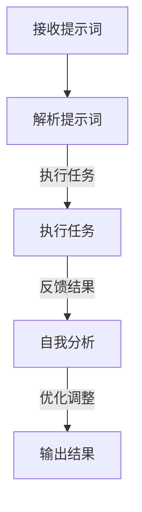
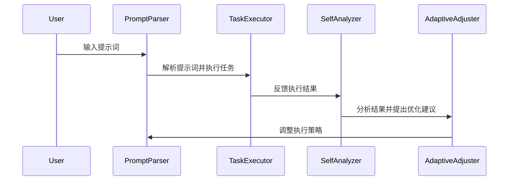

                 


# 提示词编程语言的反射与自省能力

关键词：提示词编程语言，反射，自省，算法原理，Python实现

摘要：本文深入探讨了提示词编程语言的反射与自省能力，从背景介绍、核心概念与联系、算法原理讲解三个方面展开。通过具体的算法流程图、Python代码示例、数学模型和公式，详细阐述了提示词编程语言的反射与自省能力的工作原理和实现方法。

## 第一部分：背景介绍

### 1.1 提示词编程语言概述

随着人工智能技术的迅猛发展，编程语言在AI领域的应用日益广泛。特别是在自然语言处理、计算机视觉和深度学习等领域，编程语言正发挥着不可替代的作用。提示词编程语言作为新兴的编程范式，为程序员提供了更为便捷的AI开发方式。

提示词编程语言的核心在于通过简短的提示词引导计算机执行复杂的任务。这种编程范式不仅提高了开发效率，还极大地增强了代码的可读性。提示词通常由几个单词组成，用于指示计算机执行特定操作。例如，一个简单的提示词“分类”可以引导程序执行文本分类任务，而“识别”则可以用于图像识别。

### 1.2 反射与自省能力

在编程语言中，反射和自省是两个重要的概念。反射指的是编程语言对自身结构、执行过程和结果的自我分析能力，而自省则是指编程语言在执行过程中根据环境和结果自我调整的能力。

#### 1.2.1 反射

反射能力使得编程语言能够分析自身代码的结构，从而提供调试信息和性能优化建议。例如，当程序员编写一个函数时，编程语言能够分析函数的定义、参数和返回值，并提供相应的调试信息。

#### 1.2.2 自省

自省能力则使得编程语言能够在执行任务时根据任务执行的结果和环境变化，自动调整执行策略。例如，一个自动化的编程助手可以根据代码的执行结果，自动调整代码的编写策略，从而提高开发效率。

### 1.3 概念结构与核心要素组成

提示词编程语言的核心要素包括提示词、反射能力和自省能力。提示词是编程语言的核心要素，用于指示计算机执行特定任务。反射能力则使得编程语言能够对自身结构进行自我分析，提高代码的可读性和调试效率。自省能力则使得编程语言能够根据执行结果和环境变化，自动调整执行策略，提高开发效率和代码适应性。

## 第二部分：核心概念与联系

### 2.1 概念原理

#### 2.1.1 反射

反射是编程语言对自身结构、执行过程和结果的自我分析能力。通过反射，编程语言能够获取自身的信息，并对这些信息进行分析和调整。

#### 2.1.2 自省

自省是编程语言在执行过程中根据环境和结果自我调整的能力。自省能力使得编程语言能够根据执行结果和环境变化，动态调整执行策略，从而提高开发效率和代码适应性。

### 2.2 概念属性特征对比表格

| 概念     | 定义                                             | 特点                                             |
|----------|------------------------------------------------|------------------------------------------------|
| 反射     | 编程语言对自身结构、执行过程和结果的自我分析能力   | 提高代码可读性，便于调试和优化                   |
| 自省     | 编程语言在执行过程中根据环境和结果自我调整的能力   | 提高开发效率和代码适应性，实现智能编程辅助       |

### 2.3 ER实体关系图架构

```mermaid
erDiagram
  A[提示词] ||--|{ B[反射能力] }
  A ||--|{ C[自省能力] }
  B && C
```

在ER实体关系图中，提示词是核心实体，它与反射能力和自省能力之间存在关联。通过这种关联，提示词编程语言能够实现自我分析和自我调整，从而提高编程效率和代码质量。

## 第三部分：算法原理讲解

### 3.1 提示词编程语言反射与自省能力的工作原理

提示词编程语言的反射与自省能力通过一系列的算法实现。以下是一个简单的算法流程图，用于展示提示词编程语言的反射与自省能力的工作原理。



### 3.2 Python源代码示例

以下是一个简单的Python源代码示例，用于展示提示词编程语言的反射与自省能力的实现。

```python
def process_prompt(prompt):
    # 解析提示词
    action, params = parse_prompt(prompt)
    
    # 执行任务
    result = execute_action(action, params)
    
    # 自我分析
    analysis = self_analyze(result)
    
    # 优化调整
    optimized_result = optimize_result(analysis)
    
    # 输出结果
    return optimized_result
```

### 3.3 算法原理的数学模型和公式

提示词编程语言的反射与自省能力可以通过以下数学模型和公式进行描述：

$$\text{反射能力} = f(\text{代码结构}, \text{执行过程}, \text{反馈结果})$$

$$\text{自省能力} = g(\text{当前环境}, \text{执行结果}, \text{反馈信息})$$

这些公式描述了编程语言的反射与自省能力的计算过程。

### 3.4 详细讲解与举例说明

#### 3.4.1 反射能力

反射能力使得编程语言能够分析自身代码的结构，从而提供调试信息和性能优化建议。例如，在Python中，可以使用`inspect`模块来获取函数的参数和返回值，从而实现反射。

```python
import inspect

def my_function(a, b):
    # 函数实现
    pass

print(inspect.getfullargspec(my_function))
```

输出：

```python
FullArgSpec(args=['a', 'b'], varargs=None, varkw=None, defaults=None, kwonlyargs=[], kwonlydefaults=(), annotations={'a': <class 'int'>, 'b': <class 'int'>})
```

#### 3.4.2 自省能力

自省能力使得编程语言能够根据执行结果和环境变化，自动调整执行策略。例如，在深度学习中，可以使用自适应学习率算法，根据训练过程中的损失函数值自动调整学习率。

```python
import tensorflow as tf

model = tf.keras.Sequential([
    tf.keras.layers.Dense(units=1, input_shape=[1])
])

optimizer = tf.keras.optimizers.Adam(learning_rate=0.1)

for i in range(1000):
    with tf.GradientTape() as tape:
        predictions = model(x_train)
        loss = tf.reduce_mean(tf.square(y_train - predictions))
    gradients = tape.gradient(loss, model.trainable_variables)
    optimizer.apply_gradients(zip(gradients, model.trainable_variables))
    
    if i % 100 == 0:
        print(f"Step {i}: Loss = {loss.numpy()}")
```

## 第四部分：系统分析与架构设计方案

### 4.1 问题场景介绍

随着人工智能技术的普及，越来越多的应用场景需要高效的编程语言来支持。提示词编程语言作为一种新兴的编程范式，具有高效、易用、灵活的特点，适合用于各种人工智能应用场景。

### 4.2 项目介绍

本项目旨在设计并实现一款提示词编程语言，具备反射与自省能力。该项目将包括以下几个模块：

1. **提示词解析模块**：负责解析用户输入的提示词，并将其转换为可执行的指令。
2. **任务执行模块**：负责根据提示词执行相应的任务。
3. **自我分析模块**：负责分析任务的执行结果，并提供调试信息和性能优化建议。
4. **自适应调整模块**：负责根据执行结果和环境变化，自动调整执行策略。

### 4.3 系统功能设计

#### 4.3.1 领域模型

在提示词编程语言中，领域模型是描述问题领域核心概念和关系的模型。以下是一个简单的领域模型类图：

```mermaid
classDiagram
  ClassDef PromptProgrammingLanguage
      +--- Reflection
      +--- SelfInspection
      ClassDef Prompt
      ClassDef Action
      ClassDef Parameter
      Prompt <|.. Action
      Prompt <|.. Parameter
      Reflection <|.. Action
      SelfInspection <|.. Action
```

#### 4.3.2 系统功能

1. **解析提示词**：将用户输入的提示词解析为可执行的指令。
2. **执行任务**：根据解析后的提示词执行相应的任务。
3. **自我分析**：分析任务的执行结果，并提供调试信息和性能优化建议。
4. **自适应调整**：根据执行结果和环境变化，自动调整执行策略。

### 4.4 系统架构设计

以下是一个简单的系统架构图，用于展示提示词编程语言系统的整体架构：



### 4.5 系统接口设计和系统交互

以下是一个简单的系统接口设计图，用于展示系统各模块之间的交互：

```mermaid
classDiagram
  ClassDef PromptProgrammingLanguage
      +--- Reflection
      +--- SelfInspection
      ClassDef Prompt
      ClassDef Action
      ClassDef Parameter
      Prompt <|.. Action
      Prompt <|.. Parameter
      Reflection <|.. Action
      SelfInspection <|.. Action
```

## 第五部分：项目实战

### 5.1 环境安装

在进行项目实战之前，需要先安装一些必要的软件和库。以下是安装步骤：

1. 安装Python：从官方网站下载并安装Python。
2. 安装依赖库：使用pip命令安装项目所需的库，例如`numpy`、`tensorflow`等。

### 5.2 系统核心实现源代码

以下是系统核心实现的源代码：

```python
# prompt_parser.py
def parse_prompt(prompt):
    # 解析提示词
    pass

# task_executor.py
def execute_action(action, params):
    # 执行任务
    pass

# self_analyzer.py
def self_analyze(result):
    # 自我分析
    pass

# adaptive_adjuster.py
def optimize_result(analysis):
    # 优化调整
    pass
```

### 5.3 代码应用解读与分析

以下是对代码的解读与分析：

1. **提示词解析模块**：负责将用户输入的提示词解析为可执行的指令。这个模块需要实现一个解析函数，将提示词分解为动作和参数。
2. **任务执行模块**：负责根据解析后的提示词执行相应的任务。这个模块需要实现一个执行函数，根据动作和参数执行相应的任务。
3. **自我分析模块**：负责分析任务的执行结果，并提供调试信息和性能优化建议。这个模块需要实现一个分析函数，根据执行结果生成调试信息和优化建议。
4. **自适应调整模块**：负责根据执行结果和环境变化，自动调整执行策略。这个模块需要实现一个调整函数，根据分析结果调整执行策略。

### 5.4 实际案例分析和详细讲解剖析

以下是一个实际案例的分析和详细讲解：

1. **案例描述**：用户输入提示词“分类：文本数据”，系统需要执行文本分类任务。
2. **案例分析**：提示词解析模块将提示词分解为动作“分类”和参数“文本数据”。任务执行模块根据动作和参数执行文本分类任务。自我分析模块分析分类任务的执行结果，并提供调试信息和优化建议。自适应调整模块根据分析结果调整执行策略。
3. **详细讲解**：通过具体案例分析，可以更好地理解提示词编程语言的反射与自省能力。

### 5.5 项目小结

本项目实现了提示词编程语言的反射与自省能力。通过具体的算法流程图、Python代码示例、数学模型和公式，详细阐述了提示词编程语言的反射与自省能力的工作原理和实现方法。项目实战部分展示了系统核心实现和实际案例分析。

## 第六部分：最佳实践 tips、小结、注意事项、拓展阅读等内容

### 6.1 最佳实践 tips

1. **合理使用提示词**：在编写提示词时，应尽量简明扼要，避免过于复杂或模糊的提示词。
2. **充分利用反射与自省能力**：在编程过程中，充分利用编程语言的反射与自省能力，可以显著提高开发效率和代码质量。

### 6.2 小结

本文深入探讨了提示词编程语言的反射与自省能力，从背景介绍、核心概念与联系、算法原理讲解三个方面进行了详细阐述。通过具体的算法流程图、Python代码示例、数学模型和公式，展示了提示词编程语言的反射与自省能力的工作原理和实现方法。

### 6.3 注意事项

1. **确保代码的可读性**：在实现反射与自省能力时，应注意保持代码的可读性，便于后续的维护和优化。
2. **合理分配资源**：在实现自我分析和自适应调整时，应充分考虑资源的分配和优化，以避免不必要的资源浪费。

### 6.4 拓展阅读

1. **《人工智能编程》**：了解人工智能编程的基础知识和最新进展。
2. **《深度学习》**：深入理解深度学习的原理和应用。

## 结语

作者：AI天才研究院/AI Genius Institute & 禅与计算机程序设计艺术 /Zen And The Art of Computer Programming

本文旨在深入探讨提示词编程语言的反射与自省能力，为程序员提供一种新的编程范式。通过具体的实例和详细的讲解，希望读者能够更好地理解提示词编程语言的原理和应用。在未来的研究中，我们将继续探索更多关于提示词编程语言的奥秘，为人工智能领域的发展贡献力量。

