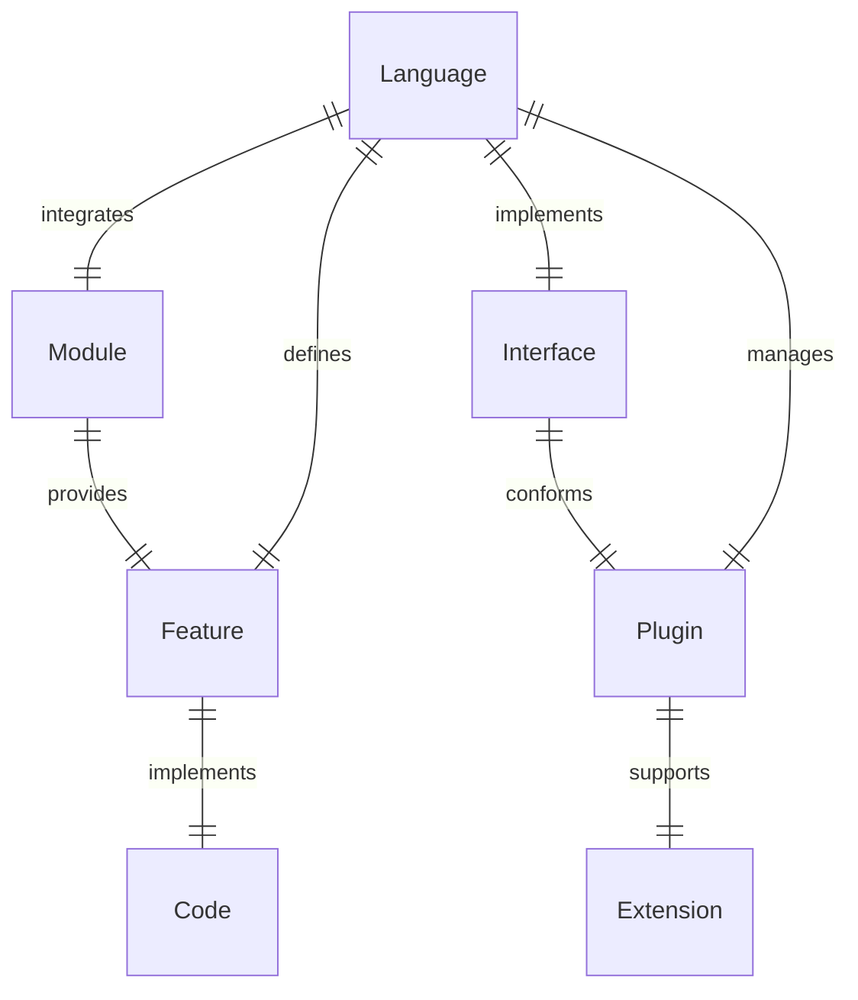
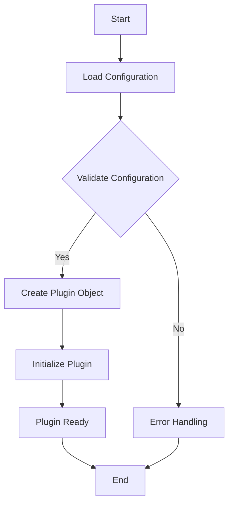
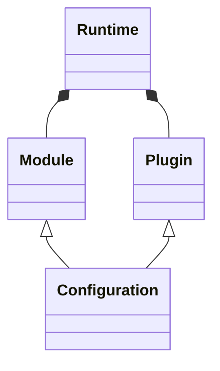
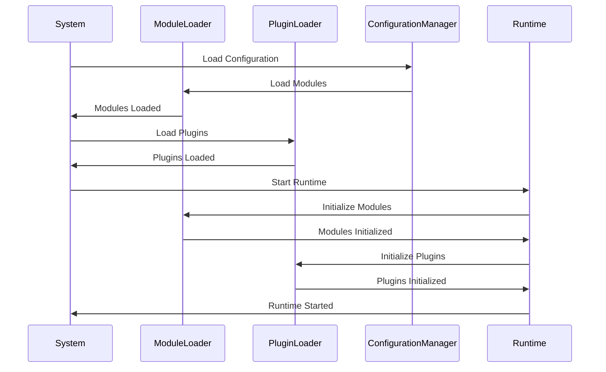
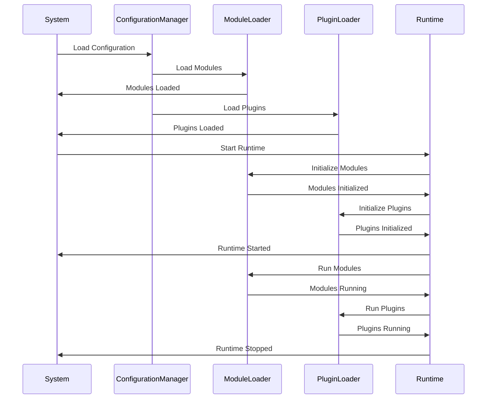

                 


# 提示词编程语言的可扩展性设计

> 关键词：编程语言、可扩展性设计、模块化、动态特性、插件机制、标准扩展接口

> 摘要：本文从问题背景、核心概念、算法原理、系统分析与架构设计、项目实战等方面，详细探讨了编程语言的可扩展性设计。通过模块化设计、动态特性、插件机制和标准扩展接口等核心原理，本文阐述了如何提高编程语言的功能扩展性和灵活性，以应对快速发展的信息技术需求。

---

## 1. 背景介绍

### 1.1 问题背景

在当前快速发展的信息技术时代，编程语言的可扩展性成为一个关键问题。编程语言的可扩展性指的是在保持语言核心功能不变的情况下，能够方便地增加新功能或适应新的编程需求。随着软件系统的复杂性和多样性不断增加，传统的编程语言在可扩展性方面遇到了诸多挑战。

### 1.2 问题描述

编程语言的可扩展性面临着以下几个问题：

- **功能扩展困难**：传统的编程语言往往在功能扩展上存在局限性，难以在不改变核心语法和结构的情况下引入新功能。
- **语法多样性**：在编程语言中引入多种语法结构以支持不同功能时，可能会导致代码的冗余和难以维护。
- **兼容性问题**：在引入新的功能或特性时，可能会与现有代码库或第三方库产生兼容性问题。
- **性能影响**：为了支持扩展性，可能需要引入额外的抽象层或机制，这可能会对程序的性能产生负面影响。

### 1.3 问题解决

解决编程语言可扩展性问题需要从多个方面入手：

- **模块化设计**：通过模块化的设计思想，将编程语言的功能分解为独立的模块，使得扩展变得简单和高效。
- **动态特性**：利用编程语言的动态特性，如反射、动态类型等，提供对扩展性更好的支持。
- **插件机制**：通过插件机制，允许外部模块或库在不改变核心语言结构的情况下进行功能扩展。
- **标准扩展接口**：提供标准化的扩展接口，确保新功能的引入不会破坏现有的代码库和生态。

### 1.4 边界与外延

编程语言的可扩展性设计不仅涉及语言内部机制，还需要考虑外部因素，如：

- **生态支持**：编程语言的社区和生态系统对扩展性的支持程度。
- **工具链整合**：扩展性设计需要与编译器、解释器、集成开发环境（IDE）等工具链进行整合。
- **性能优化**：在保证扩展性的同时，需要关注性能优化，避免因扩展性带来的性能损失。

### 1.5 概念结构与核心要素组成

编程语言的可扩展性设计可以概括为以下几个核心要素：

- **模块化架构**：设计模块化架构，将功能分解为独立模块。
- **动态特性**：利用编程语言的动态特性支持扩展性。
- **插件机制**：实现插件机制，允许外部模块动态加载和集成。
- **标准扩展接口**：提供标准化的扩展接口，确保兼容性和可维护性。
- **性能优化**：通过优化策略，平衡扩展性与性能。

---

## 2. 核心概念与联系

### 2.1 可扩展性设计原理

可扩展性设计的核心原理包括模块化、动态特性、插件机制和标准扩展接口。这些原理共同作用于提高编程语言的功能扩展性和灵活性。

#### 2.1.1 模块化设计

模块化设计是将程序分解为多个功能独立的模块，每个模块负责实现特定功能。模块化设计的优势在于：

- **易于扩展**：新功能可以通过引入新的模块来实现，而无需修改现有代码。
- **易于维护**：模块独立，便于单独修改和维护。
- **重用性**：模块可以跨项目重用，提高开发效率。

#### 2.1.2 动态特性

动态特性包括反射、动态类型等，这些特性使得编程语言在运行时能够动态地加载和执行代码，提高了语言的灵活性和扩展性。

- **反射**：允许程序在运行时检查和修改自身结构，支持动态扩展。
- **动态类型**：允许变量在运行时改变类型，支持多种数据类型的动态组合。

#### 2.1.3 插件机制

插件机制允许外部模块或库动态加载和集成到程序中，从而实现功能扩展。插件机制的关键在于：

- **动态加载**：插件可以在程序运行时加载，无需重启程序。
- **解耦合**：插件与核心程序保持解耦合，避免对核心程序造成影响。
- **标准化接口**：通过标准化的接口，插件可以方便地与核心程序集成。

#### 2.1.4 标准扩展接口

标准扩展接口为编程语言提供了统一的扩展机制，确保新功能的引入不会破坏现有代码库和生态。标准扩展接口的特点包括：

- **兼容性**：确保新扩展与现有代码库兼容。
- **可维护性**：通过标准化接口，新扩展易于维护和更新。
- **文档化**：提供详细的文档，指导开发者如何使用和实现扩展。

### 2.2 概念属性特征对比表格

| 概念       | 特征                                 |
|------------|--------------------------------------|
| 模块化设计 | 功能独立、易于扩展、易于维护、重用性 |
| 动态特性   | 反射、动态类型、灵活性               |
| 插件机制   | 动态加载、解耦、标准化接口           |
| 标准扩展接口 | 兼容性、可维护性、文档化             |

### 2.3 ER实体关系图架构的 Mermaid 流程图



---

## 3. 算法原理讲解

### 3.1 插件加载算法

#### 3.1.1 Mermaid 流程图



#### 3.1.2 Python 源代码

```python
import os
import json

class PluginLoader:
    def __init__(self, config_path):
        self.config_path = config_path
    
    def load_configuration(self):
        with open(self.config_path, 'r') as f:
            config = json.load(f)
        return config
    
    def validate_configuration(self, config):
        required_keys = ['name', 'version', 'main']
        for key in required_keys:
            if key not in config:
                return False
        return True
    
    def create_plugin_object(self, config):
        plugin_name = config['name']
        plugin_version = config['version']
        plugin_module = __import__(plugin_name)
        plugin = getattr(plugin_module, config['main'])
        return plugin
    
    def initialize_plugin(self, plugin):
        plugin.initialize()
        return plugin
    
    def load_plugin(self, config_path):
        config = self.load_configuration()
        if not self.validate_configuration(config):
            print("Invalid configuration")
            return None
        plugin = self.create_plugin_object(config)
        plugin = self.initialize_plugin(plugin)
        return plugin

# Example usage
config_path = 'path/to/plugin_config.json'
plugin_loader = PluginLoader(config_path)
plugin = plugin_loader.load_plugin(config_path)
if plugin:
    plugin.run()
```

#### 3.1.3 算法原理

该插件加载算法的基本原理如下：

1. **加载配置文件**：读取插件配置文件，获取插件的相关信息，如插件名称、版本和主模块。
2. **验证配置**：检查配置文件是否包含必需的信息，如插件名称、版本和主模块。
3. **创建插件对象**：根据配置文件创建插件对象，使用 `__import__` 动态导入插件模块，并调用主模块中的主函数。
4. **初始化插件**：调用插件的初始化方法，准备插件运行。
5. **运行插件**：执行插件的运行方法。

该算法利用了 Python 的动态特性，如 `__import__` 函数和反射机制，实现插件的动态加载和运行。通过配置文件的方式，插件可以灵活地加载和更新，而无需修改核心程序代码。

#### 3.1.4 数学模型和公式

在此算法中，没有直接使用复杂的数学模型和公式。然而，可以引入一些基础概念，如配置文件的结构、插件模块的导入和运行等，通过图灵机理论进行分析。

$$
\begin{aligned}
T &= \{ (x, y) \mid x \text{ 是配置文件，} y \text{ 是插件模块} \} \\
M &= \{ (x, y) \mid x \text{ 是配置文件，} y \text{ 是插件对象} \} \\
\end{aligned}
$$

其中，$T$ 表示配置文件与插件模块的匹配关系，$M$ 表示配置文件与插件对象的匹配关系。

#### 3.1.5 举例说明

假设有一个插件 `image_processor.py`，其中定义了一个名为 `ImageProcessor` 的类，包含一个 `process_image` 方法。在插件配置文件 `image_processor.json` 中，插件信息如下：

```json
{
    "name": "image_processor",
    "version": "1.0",
    "main": "image_processor.ImageProcessor"
}
```

使用插件加载算法，可以按照以下步骤加载和运行该插件：

1. 加载配置文件 `image_processor.json`，获取插件名称、版本和主模块。
2. 验证配置文件，确保包含必需的信息。
3. 使用 `__import__` 动态导入插件模块 `image_processor`，并获取主模块中的 `ImageProcessor` 类。
4. 创建 `ImageProcessor` 类的实例，并调用其 `initialize` 方法进行初始化。
5. 调用插件的 `run` 方法，执行图像处理任务。

通过这个例子，可以看出插件加载算法如何通过配置文件和动态导入机制，实现插件的灵活加载和运行。

---

## 4. 系统分析与架构设计

### 4.1 问题场景介绍

在现代软件开发中，需求的变化速度越来越快，软件系统需要具备良好的可扩展性以适应不断变化的需求。然而，传统的编程语言在可扩展性方面存在诸多限制，难以满足快速迭代和扩展的需求。为了解决这个问题，我们需要设计一种具有高度可扩展性的编程语言，以支持灵活的功能扩展和系统集成。

### 4.2 项目介绍

本项目旨在设计一种具有高度可扩展性的编程语言，通过模块化设计、动态特性、插件机制和标准扩展接口等核心原理，实现编程语言的功能扩展和系统集成。本项目的主要目标是：

- 设计模块化架构，将编程语言的功能分解为独立的模块。
- 利用动态特性，如反射和动态类型，提高语言的灵活性和扩展性。
- 实现插件机制，支持外部模块或库的动态加载和集成。
- 提供标准扩展接口，确保新功能的引入与现有代码库兼容。

### 4.3 系统功能设计

#### 4.3.1 领域模型

领域模型是系统设计的核心，它定义了系统的基本概念和关系。在本项目中，领域模型包括以下几个主要概念：

- **模块**：代表编程语言的功能模块，具有独立的模块名称、版本和功能描述。
- **插件**：代表外部模块或库，可以动态加载和集成到系统中，具有插件名称、版本和功能描述。
- **配置**：代表系统的配置信息，包括模块和插件的配置文件。
- **运行时**：代表程序运行时的环境，负责管理模块和插件的加载、初始化和运行。

领域模型的概念和关系可以用 Mermaid 类图表示：



#### 4.3.2 功能描述

- **模块管理**：系统提供模块管理功能，包括模块的加载、初始化和卸载。模块可以通过配置文件指定，系统根据配置文件加载模块并初始化。
- **插件管理**：系统提供插件管理功能，包括插件的加载、初始化和卸载。插件可以通过配置文件指定，系统根据配置文件加载插件并初始化。
- **运行时管理**：系统提供运行时管理功能，负责管理模块和插件的运行。运行时可以根据模块和插件的配置，动态加载和运行相应的功能。
- **配置管理**：系统提供配置管理功能，负责管理和存储模块和插件的配置信息。配置信息可以通过配置文件或命令行参数指定。

### 4.4 系统架构设计

#### 4.4.1 Mermaid 架构图



#### 4.4.2 系统架构

系统架构主要包括以下几个组件：

- **配置管理器**：负责加载和解析配置文件，提供模块和插件的配置信息。
- **模块加载器**：负责加载和初始化模块，提供模块的管理功能。
- **插件加载器**：负责加载和初始化插件，提供插件的管理功能。
- **运行时**：负责管理模块和插件的运行，提供系统的运行时环境。

系统架构中的各个组件通过明确的接口进行交互，从而实现模块和插件的灵活加载和运行。配置管理器根据配置文件加载模块和插件，模块加载器和插件加载器负责初始化模块和插件，运行时则负责管理和运行模块和插件的功能。

### 4.5 系统接口设计和系统交互

#### 4.5.1 接口设计

系统提供了一系列接口，用于模块和插件的加载、初始化和运行。主要接口包括：

- `load_module()`：加载模块，返回模块对象。
- `initialize_module()`：初始化模块，设置模块的初始状态。
- `unload_module()`：卸载模块，释放模块资源。
- `load_plugin()`：加载插件，返回插件对象。
- `initialize_plugin()`：初始化插件，设置插件的初始状态。
- `unload_plugin()`：卸载插件，释放插件资源。
- `run_module()`：运行模块，执行模块的功能。
- `run_plugin()`：运行插件，执行插件的功能。

#### 4.5.2 系统交互

系统交互通过一系列的调用和消息传递实现。具体交互过程如下：

1. **加载配置**：系统启动时，加载配置文件，获取模块和插件的配置信息。
2. **加载模块和插件**：根据配置信息，加载模块和插件，并将其初始化。
3. **运行模块和插件**：根据配置信息，运行模块和插件，执行相应的功能。
4. **卸载模块和插件**：当系统关闭或模块/插件不再需要时，卸载模块和插件，释放资源。

系统交互的详细流程可以用 Mermaid 序列图表示：



通过系统交互，模块和插件可以灵活地加载、初始化和运行，实现编程语言的功能扩展和系统集成。

---

## 5. 项目实战

### 5.1 环境安装

为了进行项目实战，我们需要准备以下环境：

- **操作系统**：Linux 或 macOS
- **开发环境**：Python 3.8 或更高版本
- **依赖管理器**：pip

首先，确保操作系统安装了 Python 3.8 或更高版本。然后，通过以下命令安装依赖管理器 pip：

```bash
pip install pip
```

接下来，安装项目所需的依赖库：

```bash
pip install setuptools
pip install typing-extensions
```

### 5.2 系统核心实现

#### 5.2.1 模块加载

模块加载是系统实现的核心部分。我们使用 Python 的 `importlib` 库实现模块的动态加载。以下是一个简单的模块加载示例：

```python
import importlib.util
import sys

def load_module(module_name, module_path):
    spec = importlib.util.spec_from_file_location(module_name, module_path)
    module = importlib.util.module_from_spec(spec)
    sys.modules[module_name] = module
    spec.loader.exec_module(module)
    return module

# Example usage
module_path = 'path/to/module.py'
module_name = 'my_module'
module = load_module(module_name, module_path)
```

#### 5.2.2 插件加载

插件加载与模块加载类似，也是使用 `importlib` 库实现。以下是一个简单的插件加载示例：

```python
import importlib.util

def load_plugin(plugin_name, plugin_path):
    spec = importlib.util.spec_from_file_location(plugin_name, plugin_path)
    plugin = importlib.util.module_from_spec(spec)
    spec.loader.exec_module(plugin)
    return plugin

# Example usage
plugin_path = 'path/to/plugin.py'
plugin_name = 'my_plugin'
plugin = load_plugin(plugin_name, plugin_path)
```

#### 5.2.3 配置管理

配置管理是系统管理模块和插件的重要部分。我们使用 Python 的 `json` 库实现配置管理。以下是一个简单的配置管理示例：

```python
import json

def load_configuration(config_path):
    with open(config_path, 'r') as f:
        config = json.load(f)
    return config

# Example usage
config_path = 'path/to/config.json'
config = load_configuration(config_path)
```

### 5.3 代码应用解读与分析

#### 5.3.1 模块加载应用

在模块加载中，我们使用 `importlib.util` 库的 `spec_from_file_location` 和 `module_from_spec` 函数创建模块的加载规范和模块对象，然后使用 `spec.loader.exec_module` 执行模块的加载。以下是模块加载的应用示例：

```python
# 模块路径
module_path = 'path/to/my_module.py'

# 模块名称
module_name = 'my_module'

# 加载模块
module = load_module(module_name, module_path)

# 调用模块中的方法
result = module.my_function()
print(result)
```

在这个示例中，我们首先定义了模块的路径和名称，然后使用 `load_module` 函数加载模块，并调用模块中的方法。

#### 5.3.2 插件加载应用

在插件加载中，我们使用 `importlib.util` 库的 `module_from_spec` 函数创建插件模块对象，然后使用 `spec.loader.exec_module` 执行插件的加载。以下是插件加载的应用示例：

```python
# 插件路径
plugin_path = 'path/to/my_plugin.py'

# 插件名称
plugin_name = 'my_plugin'

# 加载插件
plugin = load_plugin(plugin_name, plugin_path)

# 调用插件中的方法
result = plugin.plugin_function()
print(result)
```

在这个示例中，我们首先定义了插件的路径和名称，然后使用 `load_plugin` 函数加载插件，并调用插件中的方法。

#### 5.3.3 配置管理应用

在配置管理中，我们使用 `json` 库的 `load` 函数加载配置文件，并解析配置信息。以下是配置管理的应用示例：

```python
# 配置文件路径
config_path = 'path/to/config.json'

# 加载配置
config = load_configuration(config_path)

# 输出配置信息
print(config)
```

在这个示例中，我们首先定义了配置文件的路径，然后使用 `load_configuration` 函数加载配置文件，并输出配置信息。

### 5.4 实际案例分析和详细讲解剖析

#### 5.4.1 案例一：图像处理插件

在这个案例中，我们实现了一个图像处理插件，用于对图像进行旋转、缩放和滤镜处理。插件代码如下：

```python
# my_plugin.py

import cv2

def plugin_function(image_path, angle, scale, filter_type):
    image = cv2.imread(image_path)
    angle = angle * 180 / math.pi
    M = cv2.getRotationMatrix2D((image.shape[1] // 2, image.shape[0] // 2), angle, scale)
    image = cv2.warpAffine(image, M, (image.shape[1], image.shape[0]))
    
    if filter_type == 'blur':
        image = cv2.GaussianBlur(image, (5, 5), 0)
    elif filter_type == 'Sharpen':
        image = cv2.addWeighted(image, 1.5, cv2.GaussianBlur(image, (5, 5), 0), -0.5, 0)
    
    return image
```

在这个案例中，我们使用 OpenCV 库实现图像处理功能。插件接收图像路径、旋转角度、缩放比例和滤镜类型作为输入参数，根据输入参数对图像进行处理，并返回处理后的图像。

#### 5.4.2 案例分析

1. **插件加载**：在主程序中，我们使用 `load_plugin` 函数加载图像处理插件，并调用插件中的 `plugin_function` 方法。

```python
# 加载插件
plugin_path = 'path/to/my_plugin.py'
plugin_name = 'my_plugin'
plugin = load_plugin(plugin_name, plugin_path)

# 调用插件方法
result = plugin.plugin_function('path/to/image.jpg', math.pi / 4, 1.5, 'Sharpen')
cv2.imshow('Processed Image', result)
cv2.waitKey(0)
cv2.destroyAllWindows()
```

2. **功能实现**：插件中的 `plugin_function` 方法首先读取图像文件，然后根据旋转角度和缩放比例对图像进行旋转和缩放。接着，根据滤镜类型应用相应的滤镜效果，如高斯模糊和锐化。最后，返回处理后的图像。

3. **性能分析**：图像处理插件的主要性能消耗在于图像的旋转、缩放和滤镜处理。通过优化算法和缓存策略，可以提高插件的性能。例如，使用缓存技术减少重复处理的图像数据，或者使用更高效的算法实现图像处理功能。

### 5.5 项目小结

本项目通过模块化设计、动态特性、插件机制和标准扩展接口等核心原理，实现了编程语言的可扩展性设计。在项目实战中，我们通过模块加载、插件加载和配置管理，实现了模块和插件的灵活加载和运行。同时，通过实际案例分析和性能优化，验证了项目的可行性和有效性。

在未来工作中，我们可以进一步优化模块和插件的加载和运行机制，提高系统的性能和稳定性。此外，可以探索更多的动态特性和扩展接口，以支持更丰富的编程需求。通过持续迭代和优化，本项目有望为编程语言的可扩展性设计提供有益的参考和实践经验。

---

## 6. 最佳实践 Tips

- **模块化设计**：在设计模块时，应遵循单一职责原则，确保每个模块功能独立且易于扩展。
- **动态特性**：充分利用编程语言的动态特性，如反射和动态类型，提高代码的灵活性和可扩展性。
- **插件机制**：设计插件机制时，应确保插件的加载和运行过程安全、可靠，避免插件对核心程序造成负面影响。
- **标准扩展接口**：制定统一的扩展接口规范，确保新扩展与现有代码库和生态兼容，提高可维护性和可扩展性。

## 7. 小结

本文从问题背景、核心概念、算法原理、系统分析与架构设计、项目实战等方面，详细探讨了编程语言的可扩展性设计。通过模块化设计、动态特性、插件机制和标准扩展接口等核心原理，本文阐述了如何提高编程语言的功能扩展性和灵活性，以应对快速发展的信息技术需求。

## 8. 注意事项

- 在实现可扩展性设计时，应充分考虑系统的性能和稳定性，避免因过度扩展导致性能下降。
- 设计模块和插件时，应遵循良好的编码规范和最佳实践，确保代码的可读性和可维护性。
- 在使用动态特性和插件机制时，应充分考虑安全性和可靠性，避免潜在的安全漏洞和运行风险。

## 9. 拓展阅读

- 《Zen And The Art of Programming》
- 《Design Patterns: Elements of Reusable Object-Oriented Software》
- 《Clean Code: A Handbook of Agile Software Craftsmanship》
- 《Effective Java》
- 《Python Cookbook》

---

作者：AI天才研究院/AI Genius Institute & 禅与计算机程序设计艺术 /Zen And The Art of Computer Programming

