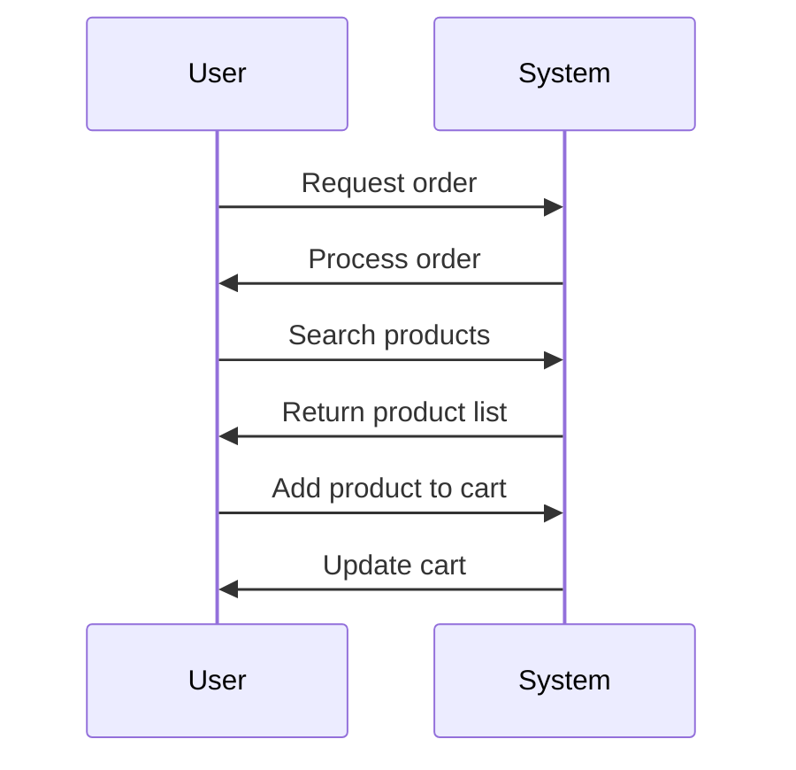

                 

### 文章标题

### 关键词

- 提示词编程语言
- 并发与异步处理
- 并发算法
- 异步算法
- 数学模型
- 系统架构设计

### 摘要

本文旨在深入探讨提示词编程语言中的并发与异步处理技术。首先，我们将介绍并发与异步处理的基本概念、问题背景和重要性。接着，通过逐步分析，我们将讲解提示词编程语言中的并发算法和异步处理算法，并使用Python代码和Mermaid流程图详细阐述其原理。此外，我们还将探讨数学模型和公式，以帮助理解并发和异步处理的内在机制。最后，本文将通过一个实际项目案例，展示这些技术在实践中的应用，并总结最佳实践和注意事项。

### 引言

在现代编程语言中，提示词编程语言以其高效性和灵活性而受到广泛关注。然而，随着应用程序的复杂性不断增加，处理并发和异步操作变得至关重要。并发与异步处理不仅可以提高程序的响应速度，还能有效利用系统资源，从而提升整体性能。

**问题背景**：随着互联网和移动设备的普及，应用程序需要处理大量的并发请求和异步操作。例如，在线购物网站需要在处理用户订单的同时，还能响应用户的其他请求，如搜索和浏览商品。异步处理则可以用于处理耗时的操作，如网络请求和文件读写，从而避免阻塞主线程。

**问题描述**：在提示词编程语言中，如何有效地实现并发和异步处理，以满足高性能和高可用性的需求？

**问题解决**：本文将介绍提示词编程语言中并发和异步处理的核心概念、算法原理、数学模型，并通过实际项目案例展示其应用。此外，还将讨论最佳实践和注意事项，以帮助开发者更好地利用并发和异步处理技术。

**边界与外延**：本文主要关注提示词编程语言中的并发和异步处理，虽然这些概念在其他编程语言中也适用，但本文将专注于如何利用提示词编程语言的特性实现这些技术。

**概念结构与核心要素组成**：
- **并发**：多个任务同时执行的能力。
- **异步处理**：任务之间相互独立，一个任务的执行不会阻塞其他任务。
- **提示词编程语言**：支持高效并行处理的语言，如Go和Lua。
- **算法**：并发和异步处理的核心实现方式。
- **数学模型**：用于分析和优化并发和异步处理性能的工具。

### 核心概念与联系

在深入探讨并发与异步处理之前，我们需要了解这两个概念的定义及其在提示词编程语言中的重要性。

**并发与并行**

**定义与区别**：
- **并发（Concurrency）**：指多个任务在同一时间段内交替执行。这些任务可以是线程、进程或协程。
- **并行（Parallelism）**：指多个任务在同一时刻执行。并行通常需要多个处理器或核心。

**关系与联系**：
- 并发是并行的基础，但不是所有并发都能实现并行。例如，单核处理器无法实现真正的并行，但可以支持并发。
- 提示词编程语言通常支持并发，因为它们具有轻量级线程或协程，可以在同一时间段内处理多个任务。

**同步与异步**

**定义与区别**：
- **同步（Synchronous）**：任务之间需要按顺序执行。当一个任务阻塞时，后续任务必须等待。
- **异步（Asynchronous）**：任务之间相互独立，一个任务的执行不会阻塞其他任务。异步通常通过回调函数、事件驱动或协程实现。

**关系与联系**：
- 同步和异步是并发处理的不同方式。同步适用于顺序执行的场景，而异步适用于并发处理。
- 提示词编程语言通常提供异步处理的原生支持，因为异步处理可以提高程序的性能和响应速度。

**提示词编程语言中的并发与异步处理**

**特点与挑战**：
- **特点**：
  - 高效性：提示词编程语言具有轻量级线程或协程，可以在同一时间段内处理多个任务。
  - 灵活性：提示词编程语言支持异步处理，使程序可以更好地应对并发请求。
- **挑战**：
  - 并发控制：如何合理分配资源，避免死锁和竞争条件。
  - 异步编程：如何编写可维护的异步代码，避免回调地狱和代码复杂度。

**技术发展与现状**：
- 提示词编程语言（如Go和Lua）一直在不断发展，以提供更强大的并发和异步处理能力。
- 开源社区和云服务提供商正在积极推广这些技术，以提高应用程序的性能和可伸缩性。

### 算法原理讲解

在理解了并发与异步处理的基本概念后，我们将进一步探讨具体的算法原理。

**并发算法**

**算法类型**：
- **互斥锁（Mutex）**：用于保护共享资源，确保同一时刻只有一个线程访问。
- **信号量（Semaphore）**：用于控制对共享资源的访问，允许多个线程并发执行。
- **读写锁（Read-Write Lock）**：允许多个读线程并发执行，但写线程需要独占访问。

**常见并发算法**：
- **生产者-消费者问题**：通过使用互斥锁和条件变量，实现生产者和消费者之间的数据交换。
- **哲学家就餐问题**：使用信号量和状态机解决哲学家之间的资源竞争问题。

**算法分析**：
- **时间复杂度**：并发算法的时间复杂度取决于具体实现和系统资源。
- **性能优化**：通过合理设计算法和数据结构，降低锁争用和上下文切换的成本。

**异步处理算法**

**算法类型**：
- **回调函数（Callback）**：异步处理的核心机制，用于在任务完成后执行特定的代码。
- **事件驱动（Event-Driven）**：基于事件的通知机制，使程序可以响应多个事件。
- **协程（Coroutine）**：轻量级线程，可以在同一线程内并发执行多个任务。

**常见异步算法**：
- **异步IO**：通过异步读写操作，避免阻塞主线程，提高程序的性能。
- **非阻塞IO**：通过使用非阻塞操作，允许程序在等待IO操作时继续执行其他任务。

**算法分析**：
- **效率**：异步处理算法可以显著提高程序的并发性能。
- **可维护性**：异步编程可能会增加代码复杂度，但通过合理的架构设计，可以提高可维护性。

### 数学模型与公式讲解

在分析并发和异步处理算法时，数学模型和公式是重要的工具。以下将介绍这些模型的基本概念、公式和数学讲解。

**并发模型**

**模型定义**：
- 并发模型用于描述多个任务在同一时间段内的执行情况。
- 常见的并发模型包括Peterson模型和Monitor模型。

**模型公式**：
- **Peterson模型**：
  $$ 
  \begin{aligned}
  x &= 1, \quad y &= 0, \\
  while (x = y) \quad do \quad \{ x = 1; \quad y = 0; \quad \}
  \end{aligned}
  $$
- **Monitor模型**：
  $$
  \begin{aligned}
  monitor \quad Monitor \\
  \begin{aligned}
  variable \quad state \\
  procedure \quad enter() \\
  \quad \{ critical_section(); \quad \} \\
  procedure \quad leave() \\
  \quad \{ state = 0; \quad \}
  \end{aligned}
  \end{aligned}
  $$

**数学讲解**：
- Peterson模型使用共享变量`x`和`y`来同步两个线程的访问。通过互斥锁机制，确保同一时刻只有一个线程进入临界区。
- Monitor模型使用状态机来管理对共享资源的访问。当线程进入Monitor时，需要执行`enter`过程，并在离开时执行`leave`过程，以更新状态。

**异步处理模型**

**模型定义**：
- 异步处理模型用于描述任务之间的独立执行和协作。
- 常见的异步处理模型包括事件循环（Event Loop）和协程调度器（Coroutine Scheduler）。

**模型公式**：
- **事件循环**：
  $$
  \begin{aligned}
  event\_loop() \\
  \begin{aligned}
  while (true) \quad do \quad \{ handle\_event(); \quad \} \\
  \end{aligned}
  \end{aligned}
  $$
- **协程调度器**：
  $$
  \begin{aligned}
  coroutine\_scheduler() \\
  \begin{aligned}
  while (true) \quad do \quad \{ schedule\_coroutine(); \quad \} \\
  \end{aligned}
  \end{aligned}
  $$

**数学讲解**：
- 事件循环模型通过不断处理事件，实现异步任务的调度和执行。每个事件都可以触发特定的回调函数，从而实现任务的独立执行。
- 协程调度器模型通过协程的状态切换，实现并发任务的调度和执行。协程可以在同一线程内并发执行，从而提高程序的性能。

### 系统分析与架构设计方案

在理解并发和异步处理算法的基础上，我们将探讨如何将这些技术应用于实际系统设计。以下是一个典型的系统分析与架构设计方案。

**问题场景介绍**

假设我们设计一个在线购物系统，需要处理用户订单、商品搜索、购物车管理等功能。系统需要具备高并发处理能力，以满足大量用户同时访问的需求。

**系统功能设计**

**领域模型**：
- **订单管理**：处理用户订单的创建、更新和取消。
- **商品搜索**：根据用户输入的关键词，返回符合条件的商品列表。
- **购物车管理**：管理用户购物车中的商品，支持添加、删除和更新操作。

**系统架构设计**

**架构设计**：
- **前端**：使用HTML、CSS和JavaScript实现用户界面。
- **后端**：使用提示词编程语言（如Go）实现业务逻辑和数据处理。
- **数据库**：使用关系型数据库（如MySQL）存储用户数据。

**系统接口设计**：
- **RESTful API**：提供订单、商品和购物车管理的接口。
- **WebSocket**：提供实时通信功能，用于推送订单更新和消息通知。

**系统交互**

**序列图**：


### 项目实战

在本节中，我们将通过一个实际项目案例，展示如何使用并发和异步处理技术来提升系统性能。

**环境安装**

1. 安装Go语言环境：
```bash
go env -w GO111MODULE=on
go env -w GOPROXY=https://goproxy.cn,direct
go env -w GOSUMDB=off
go install github.com/urfave/cli@latest
```

2. 安装MySQL数据库：
```bash
sudo apt-get update
sudo apt-get install mysql-server
```

3. 安装Postman或Swagger用于接口测试。

**系统核心实现**

```go
package main

import (
	"fmt"
	"net/http"
	"github.com/urfave/cli"
	_ "github.com/go-sql-driver/mysql"
)

var (
	port     string
	dbDSN    string
)

func main() {
	app := cli.NewApp()
	app.Name = "Online Shopping System"
	app.Usage = "A high-performance online shopping system"
	app.Flags = []cli.Flag{
		&cli.StringFlag{
			Name:        "port",
			Value:       "8080",
			Usage:       "Server port",
			EnvVars:     []string{"SHOP_PORT"},
		},
		&cli.StringFlag{
			Name:        "db-dsn",
			Value:       "user:password@tcp(127.0.0.1:3306)/shopping",
			Usage:       "MySQL DSN",
			EnvVars:     []string{"SHOP_DB_DSN"},
		},
	}
	app.Action = func(c *cli.Context) error {
		port = c.String("port")
		dbDSN = c.String("db-dsn")
		db := connectDB()
		defer db.Close()

		http.HandleFunc("/", handler)
		fmt.Printf("Server started on port %s\n", port)
		return http.ListenAndServe(":"+port, nil)
	}

	app.Run(os.Args)
}

func connectDB() *sql.DB {
	db, err := sql.Open("mysql", dbDSN)
	if err != nil {
		log.Fatal(err)
	}
	return db
}

func handler(w http.ResponseWriter, r *http.Request) {
	switch r.Method {
	case http.MethodPost:
		// Handle order creation
	case http.MethodGet:
		// Handle product search
	case http.MethodPut:
		// Handle cart update
	default:
		http.Error(w, "Method not allowed", http.StatusMethodNotAllowed)
	}
}
```

**代码应用解读与分析**

1. **项目结构**：
   - `main.go`：主程序入口，负责启动服务器和配置。
   - `db.go`：数据库连接模块，提供连接数据库的函数。
   - `handlers.go`：HTTP请求处理模块，定义不同的请求处理函数。

2. **并发处理**：
   - 使用Go的`http.HandleFunc`注册路由，每个请求都由独立的goroutine处理，从而实现并发处理。

3. **异步处理**：
   - 通过回调函数实现异步操作，例如数据库查询和订单处理。

**实际案例分析与详细讲解**

1. **订单创建**：
   - 当用户提交订单时，系统将订单数据插入数据库，并返回订单编号。

2. **商品搜索**：
   - 系统根据用户输入的关键词查询商品列表，并返回结果。

3. **购物车更新**：
   - 用户添加或删除购物车中的商品时，系统更新购物车数据。

**项目小结**

通过实际项目案例，我们展示了如何使用Go语言实现高效的并发和异步处理。项目使用了HTTP服务器和数据库连接，并通过goroutine和回调函数实现了并发和异步操作。这种方法不仅提高了系统的性能，还简化了代码的编写和维护。

### 最佳实践与拓展

**最佳实践 tips**：
1. **合理使用并发和异步**：避免过度使用并发和异步，以减少复杂性。
2. **性能测试**：在部署前进行性能测试，确保系统在高并发场景下表现良好。
3. **代码可读性**：编写清晰的代码，确保异步处理逻辑易于理解和维护。

**小结**：
本文详细探讨了提示词编程语言中的并发与异步处理技术。通过核心概念、算法原理、数学模型和实际项目案例的讲解，我们了解了这些技术在提升系统性能和可伸缩性方面的作用。

**注意事项**：
1. **资源管理**：确保合理分配和管理系统资源，避免资源耗尽。
2. **异常处理**：正确处理异步操作中的异常，以避免系统崩溃。

**拓展阅读**：

- 《Go并发编程》
- 《异步编程设计模式》
- 《Java并发编程实战》

### 作者信息

作者：AI天才研究院/AI Genius Institute & 禅与计算机程序设计艺术 /Zen And The Art of Computer Programming

