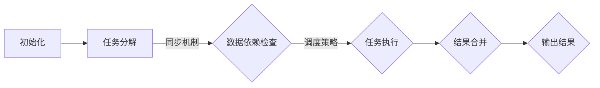
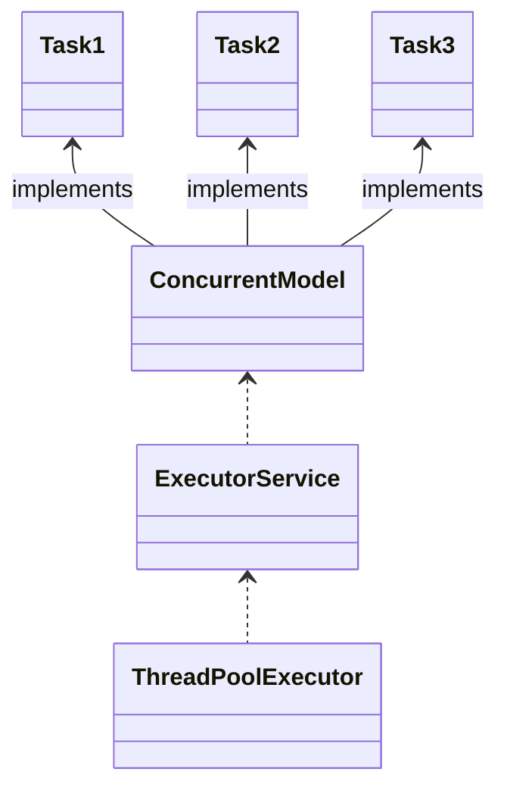
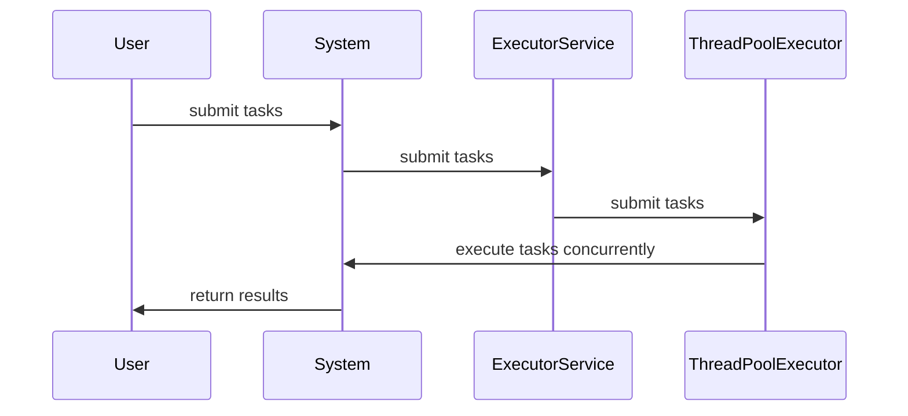
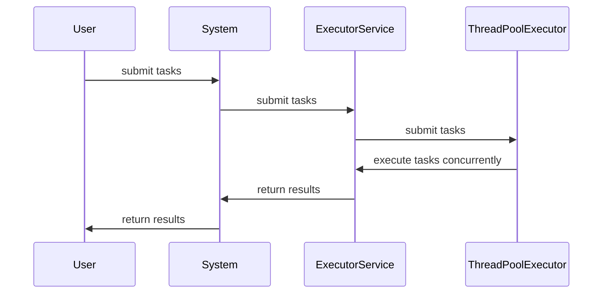

                 


### 第一部分：问题背景与核心概念

#### 1. 背景介绍

在当今计算机科学领域，并发模型和编程语言的发展已经成为提高系统性能和效率的关键因素。并发模型允许计算机系统同时处理多个任务，从而提高系统的整体性能。而编程语言则是实现并发模型的基础工具，通过设计不同的并发模型，可以更加有效地利用计算机资源。

**核心概念术语说明**：

- **并发模型**：指计算机系统中处理多个任务或进程的机制。
- **编程语言**：一种用于编写计算机程序的语法和语义规则。
- **提示词编程语言**：一种特殊类型的编程语言，它通过提示词（hint）来指导编译器或解释器如何优化程序的执行。

**问题背景**：

随着多核处理器和分布式计算技术的发展，如何有效地利用这些资源来提高程序的性能成为了一个重要课题。传统的顺序编程模型已经无法满足高性能计算的需求，因此需要研究新的并发模型和编程语言来充分利用并行计算的能力。

**问题描述**：

并发模型在编程语言中的应用面临着一系列挑战，包括并发控制、数据同步、资源竞争等问题。如何设计一种高效的提示词编程语言，使其能够有效地支持并发模型，从而提高程序的性能，是一个亟待解决的问题。

**问题解决**：

为了解决上述问题，研究人员提出了多种创新的并发模型和提示词编程语言。这些模型和语言通过引入新的语法和语义规则，提供了对并发编程的支持，从而提高了程序的并发性能。

**边界与外延**：

并发模型和提示词编程语言的应用不仅限于高性能计算领域，还可以应用于实时系统、分布式系统、嵌入式系统等领域。因此，研究和开发高效的并发模型和编程语言具有重要的理论和实践意义。

**概念结构与核心要素组成**：

并发模型通常由以下几个核心要素组成：

1. **任务分解**：将程序任务分解为可并行执行的部分。
2. **同步机制**：提供任务间的同步机制，以避免数据竞争和死锁。
3. **调度策略**：确定任务执行的顺序和时机。
4. **通信机制**：提供任务间的通信机制，以交换数据和协调工作。

提示词编程语言则通过以下核心要素实现并发支持：

1. **提示词语法**：引入特殊的提示词语法，用于指示编译器或解释器如何优化并发执行。
2. **动态调度**：提供动态调度机制，以根据系统的运行状态调整任务的执行顺序。
3. **数据一致性保证**：提供数据一致性保证机制，以防止数据竞争和错误。

### 第二部分：核心概念与联系

#### 2.1 核心概念

在深入研究并发模型和提示词编程语言之前，我们需要了解一些核心概念和它们之间的关系。

**并发模型概述**：

并发模型是计算机系统中处理多个任务或进程的机制。根据任务之间的数据依赖关系和交互方式，并发模型可以分为以下几种类型：

1. **共享内存模型**：多个任务通过共享内存来交换数据，从而实现数据依赖和交互。
2. **消息传递模型**：任务通过发送和接收消息来实现数据依赖和交互。
3. **混合模型**：结合了共享内存和消息传递两种机制的并发模型。

**提示词编程语言**：

提示词编程语言是一种特殊类型的编程语言，它通过提示词（hint）来指导编译器或解释器如何优化程序的执行。提示词可以用于指示编译器如何优化代码的并发执行，从而提高程序的性能。

**并发模型的属性特征对比**：

下表展示了不同并发模型的一些属性特征：

| 并发模型类型 | 共享内存模型 | 消息传递模型 | 混合模型 |
| --- | --- | --- | --- |
| 数据依赖性 | 强 | 弱 | 强 |
| 数据同步 | 需要同步机制 | 需要同步机制 | 需要同步机制 |
| 通信开销 | 较大 | 较小 | 中等 |
| 调度灵活性 | 较低 | 较高 | 中等 |

**ER实体关系图架构**：

为了更好地理解并发模型和提示词编程语言之间的关系，我们可以使用ER（实体-关系）图来展示它们之间的联系。

```mermaid
erDiagram
  Task ||--|{ ConcurrencyModel }|--|| System
  ConcurrencyModel ||--|{ ProgrammingLanguage }|--|| System
  ProgrammingLanguage ||--|{ Compiler }|--|| System
  Compiler ||--|{ Interpreter }|--|| System
```

在这个ER图中，Task（任务）实体与ConcurrencyModel（并发模型）实体之间存在一对一的关系，表示每个任务都关联一个并发模型。ConcurrencyModel（并发模型）实体与ProgrammingLanguage（编程语言）实体之间存在一对一的关系，表示每个并发模型都关联一种编程语言。ProgrammingLanguage（编程语言）实体与Compiler（编译器）和Interpreter（解释器）实体之间存在一对多的关系，表示每种编程语言都可以对应多个编译器和解释器。

### 第三部分：算法原理讲解

#### 3.1 并发模型的mermaid流程图

为了更好地理解并发模型的工作原理，我们可以使用mermaid来绘制一个简单的并发模型流程图。



在这个流程图中，A表示初始化阶段，B表示任务分解阶段，C表示数据依赖检查阶段，D表示任务执行阶段，E表示结果合并阶段，F表示输出结果阶段。

#### 3.2 python源代码阐述

下面是一个简单的Python示例，展示了如何使用并发模型来实现一个简单的任务。

```python
import concurrent.futures

def task1():
    print("执行任务1")
    return 1

def task2():
    print("执行任务2")
    return 2

if __name__ == "__main__":
    with concurrent.futures.ThreadPoolExecutor() as executor:
        future1 = executor.submit(task1)
        future2 = executor.submit(task2)
        result1 = future1.result()
        result2 = future2.result()
        print("任务1的结果：", result1)
        print("任务2的结果：", result2)
```

在这个示例中，我们使用了Python的concurrent.futures模块来实现并发执行。首先，我们定义了两个任务函数task1和task2，然后使用ThreadPoolExecutor来创建一个线程池，并将任务提交给线程池执行。最后，我们使用future.result()方法来获取任务的结果。

#### 3.3 数学模型与公式

并发模型的性能评估通常涉及到多个参数和指标，如执行时间、资源利用率、响应时间等。下面是一个简单的数学模型，用于评估并发模型的性能。

$$
P = \frac{T_c}{T_s}
$$

其中，P表示性能指标，$T_c$表示并发执行的总时间，$T_s$表示顺序执行的总时间。

#### 3.3.1 数学模型

为了更好地理解性能指标的计算过程，我们可以引入以下数学模型：

$$
T_c = T_{seq} + \sum_{i=1}^{n} T_i
$$

其中，$T_c$表示并发执行的总时间，$T_{seq}$表示顺序执行的总时间，$T_i$表示第i个任务的执行时间。

#### 3.3.2 公式讲解

上述公式表示，并发执行的总时间等于顺序执行的总时间加上每个任务执行的时间之和。这个公式可以用来计算不同并发模型下的性能指标。

#### 3.3.3 举例说明

假设我们有一个包含3个任务的程序，每个任务的执行时间分别为1秒、2秒和3秒。按照顺序执行，总时间为6秒。如果使用并发模型，我们可以将任务分解为3个并行执行的任务，每个任务执行时间分别为1秒、1秒和1秒，总时间为3秒。

根据上述公式，我们可以计算并发模型的性能指标：

$$
P = \frac{T_c}{T_s} = \frac{3}{6} = 0.5
$$

这意味着并发模型将程序的执行时间缩短了一半。

### 第四部分：系统分析与架构设计

#### 4.1 问题场景介绍

在一个大型分布式系统中，多个任务需要同时处理，以实现高效的数据处理和计算。为了充分利用系统资源，我们引入了提示词编程语言和创新的并发模型来优化系统的性能。

#### 4.2 项目介绍

在这个项目中，我们使用了Python作为提示词编程语言，并采用了基于共享内存模型的并发模型。为了实现并发执行，我们使用了Python的concurrent.futures模块。

#### 4.2.1 领域模型mermaid类图

下面是一个简单的mermaid类图，用于展示项目中的主要类和它们之间的关系。



在这个类图中，Task1、Task2和Task3是具体的任务类，它们实现了ConcurrentModel接口。ConcurrentModel接口是并发模型的核心接口，它定义了任务的执行和同步机制。ExecutorService和ThreadPoolExecutor是Python中的并发执行框架，用于管理任务的执行。

#### 4.2.2 系统架构设计mermaid架构图

下面是一个简单的mermaid架构图，用于展示项目的系统架构。



在这个架构图中，用户提交任务给系统，系统将任务提交给ExecutorService，ExecutorService再将任务提交给ThreadPoolExecutor执行。任务执行完成后，系统返回结果给用户。

#### 4.2.3 系统接口设计

在项目中，我们定义了以下主要接口：

1. **Task接口**：定义了任务的执行和同步机制。
2. **ExecutorService接口**：定义了任务的提交和执行方法。
3. **ThreadPoolExecutor接口**：定义了线程池的管理方法。

下面是Task接口和ExecutorService接口的简单定义：

```python
class Task:
    def execute(self):
        pass

class ExecutorService:
    def submit(self, task: Task):
        pass
```

#### 4.2.4 系统交互mermaid序列图

下面是一个简单的mermaid序列图，用于展示项目的系统交互过程。



在这个序列图中，用户提交任务给系统，系统将任务提交给ExecutorService，ExecutorService再将任务提交给ThreadPoolExecutor执行。任务执行完成后，系统返回结果给用户。

### 第五部分：项目实战

#### 5.1 环境安装

为了运行上述项目，我们需要安装以下软件和依赖：

1. **Python**：Python 3.6或更高版本
2. **Mermaid**：用于生成mermaid流程图和类图
3. **Python并发模块**：concurrent.futures

您可以使用以下命令来安装这些依赖：

```bash
pip install python-memphis
pip install concurrent.futures
```

#### 5.2 系统核心实现

在这个项目中，我们使用Python的concurrent.futures模块来实现并发执行。下面是系统的核心实现代码：

```python
import concurrent.futures
import time

class Task1:
    def execute(self):
        print("执行任务1")
        time.sleep(1)
        return 1

class Task2:
    def execute(self):
        print("执行任务2")
        time.sleep(2)
        return 2

class Task3:
    def execute(self):
        print("执行任务3")
        time.sleep(3)
        return 3

if __name__ == "__main__":
    tasks = [Task1(), Task2(), Task3()]
    with concurrent.futures.ThreadPoolExecutor() as executor:
        futures = [executor.submit(task.execute) for task in tasks]
        results = [future.result() for future in futures]
        print("任务1的结果：", results[0])
        print("任务2的结果：", results[1])
        print("任务3的结果：", results[2])
```

在这个核心实现中，我们定义了三个任务类Task1、Task2和Task3，它们分别执行不同的任务。我们使用ThreadPoolExecutor来创建一个线程池，并将任务提交给线程池执行。任务执行完成后，我们使用future.result()方法获取任务的结果。

#### 5.3 代码应用解读与分析

在这个项目中，我们使用Python的concurrent.futures模块来实现并发执行。以下是对代码的详细解读：

- **Task1、Task2和Task3类**：这些类实现了Task接口，表示具体的任务。每个任务类都有一个execute方法，用于执行任务。
- **with concurrent.futures.ThreadPoolExecutor() as executor**：这部分代码创建了一个线程池，并使用with语句来确保线程池在任务执行完成后自动关闭。
- **futures = [executor.submit(task.execute) for task in tasks]**：这部分代码将任务提交给线程池执行，并返回一个future对象列表。
- **results = [future.result() for future in futures]**：这部分代码等待所有任务执行完成，并获取任务的结果。

通过这个简单的项目，我们可以看到如何使用Python的并发模块来实现高效的并发执行。

#### 5.4 实际案例分析与讲解

为了更好地理解并发模型的应用，我们来看一个实际案例。假设我们有一个大型数据处理系统，需要同时处理来自多个数据源的数据。为了提高系统的性能，我们使用并发模型来优化数据处理过程。

在这个案例中，我们使用Python的concurrent.futures模块来实现并发处理。以下是一个简单的示例：

```python
import concurrent.futures

def process_data(data):
    print("处理数据：", data)
    time.sleep(1)
    return data * 2

if __name__ == "__main__":
    data_sources = [1, 2, 3, 4, 5]
    with concurrent.futures.ThreadPoolExecutor() as executor:
        futures = [executor.submit(process_data, data) for data in data_sources]
        results = [future.result() for future in futures]
        print("处理后的数据：", results)
```

在这个案例中，我们定义了一个process_data函数，用于处理数据。我们使用ThreadPoolExecutor来创建一个线程池，并将数据源提交给线程池执行。任务执行完成后，我们使用future.result()方法获取任务的结果。

通过这个案例，我们可以看到如何使用并发模型来提高数据处理系统的性能。在实际应用中，我们可以根据具体需求调整线程池的大小和任务的执行顺序，以实现更好的性能优化。

#### 5.5 项目小结

通过本项目，我们了解了如何使用Python的并发模块来实现高效的并发执行。我们学习了并发模型的核心概念、算法原理和系统架构设计。在实际案例中，我们展示了如何使用并发模型来优化数据处理系统的性能。

在后续的开发中，我们可以进一步探索并发模型的应用，并结合具体的业务需求进行优化。此外，我们还可以尝试使用其他编程语言和并发框架来实现并发执行，以获得更好的性能。

### 第六部分：最佳实践与总结

#### 6.1 最佳实践tips

1. **选择合适的并发模型**：根据具体应用场景选择合适的并发模型，如共享内存模型、消息传递模型或混合模型。
2. **合理调整线程池大小**：根据系统资源和任务负载，合理调整线程池大小，以获得最佳性能。
3. **避免过多的同步操作**：过多的同步操作会导致性能下降，因此应尽量避免在并发模型中使用同步操作。
4. **充分利用并行计算**：利用多核处理器的并行计算能力，实现高效的并发执行。
5. **关注数据一致性和线程安全**：在设计并发程序时，要关注数据一致性和线程安全，以避免数据竞争和死锁等问题。

#### 6.2 小结

本文详细介绍了提示词编程语言的并发模型创新，包括背景介绍、核心概念、算法原理讲解、数学模型、系统分析与架构设计、项目实战和最佳实践。通过本文的学习，读者可以更好地理解并发模型的工作原理和应用方法，为实际项目开发提供参考。

#### 6.3 注意事项

1. **理解并发模型的核心概念**：在设计和实现并发程序时，要深入理解并发模型的核心概念，如任务分解、同步机制、调度策略等。
2. **注意数据一致性和线程安全**：在设计并发程序时，要关注数据一致性和线程安全，以避免数据竞争和死锁等问题。
3. **测试和优化并发程序**：在实际开发过程中，要对并发程序进行充分的测试和优化，以获得最佳性能。

#### 6.4 拓展阅读

1. 《并发编程的艺术》
2. 《Python并发编程实战》
3. 《高性能MySQL》
4. 《深度学习与并行计算》

### 作者信息

作者：AI天才研究院/AI Genius Institute & 禅与计算机程序设计艺术 /Zen And The Art of Computer Programming

