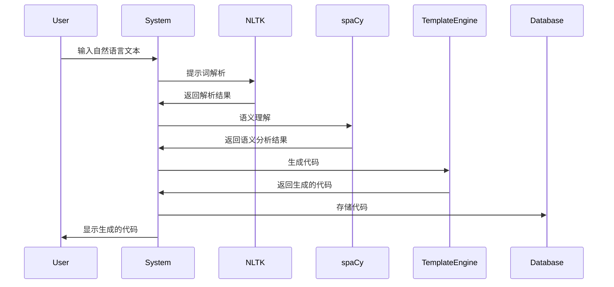
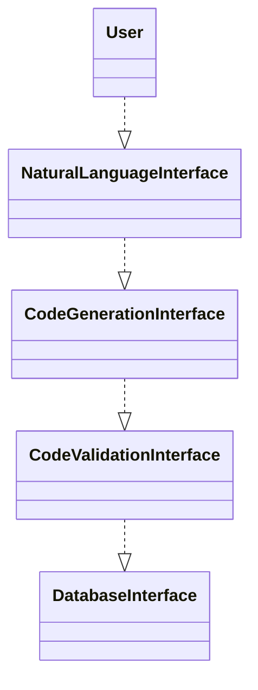
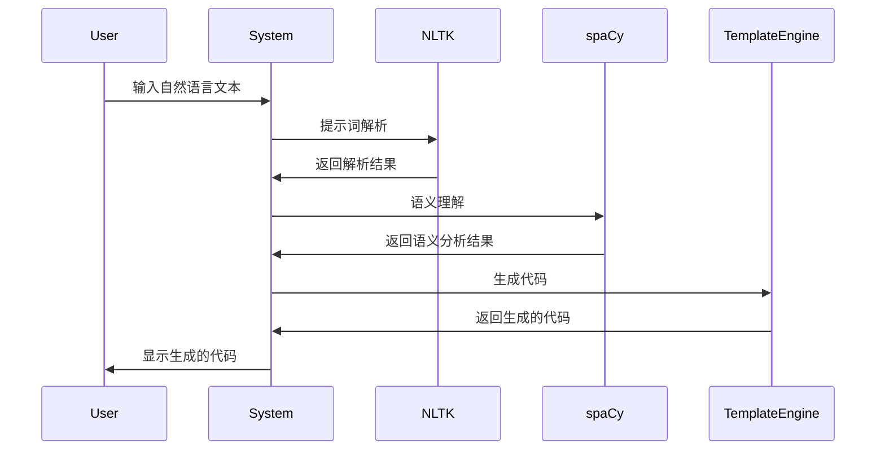
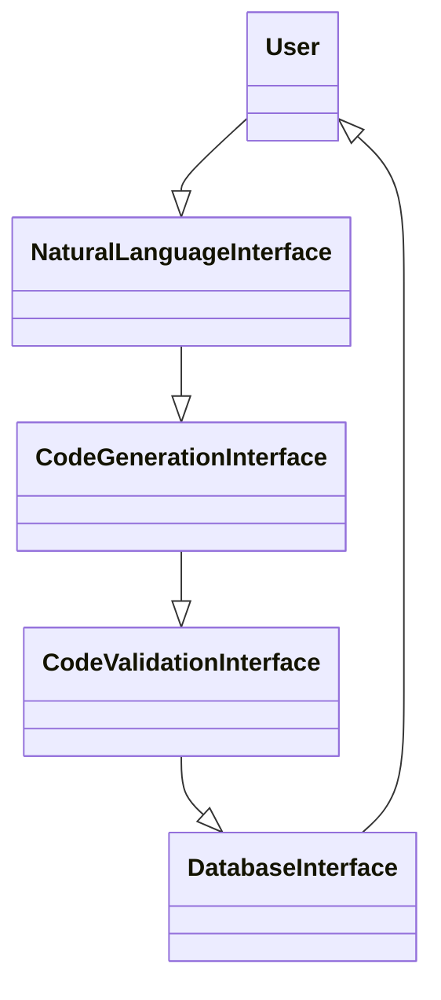
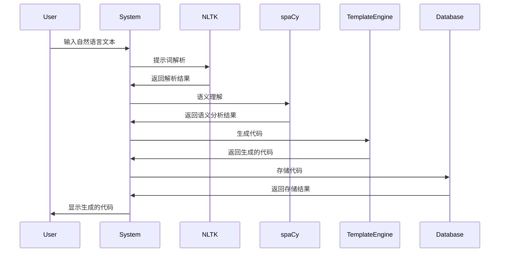
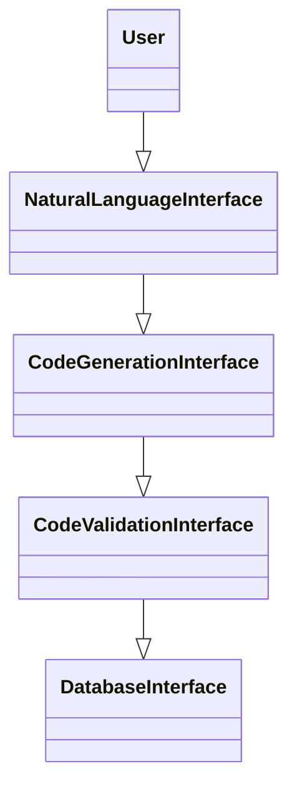

                 

### 文章标题

---

# 《提示词编程语言的形式化方法与证明》

---

### 关键词

- **提示词编程语言**
- **形式化方法**
- **证明方法**
- **算法原理**
- **系统架构设计**

---

### 摘要

本文深入探讨了提示词编程语言的形式化方法与证明，通过背景介绍、核心概念解析、算法原理讲解、系统分析与架构设计等多个维度，系统地阐述了提示词编程语言在形式化方法和证明中的应用。文章旨在帮助读者理解提示词编程语言的核心概念，掌握形式化方法和证明的基本原理，并能够将这些理论应用于实际的编程实践中。

---

## 第一部分：背景介绍与核心概念

### 第1章：问题背景与核心概念

#### 1.1 提示词编程语言概述

提示词编程语言是一种基于自然语言处理的编程语言，它通过使用自然语言作为提示词来引导程序执行。这种语言的出现解决了传统编程语言与自然语言之间的语义鸿沟问题，使得编程过程更加直观和便捷。

**定义：** 提示词编程语言（Natural Language Prompt Programming Language）是一种将自然语言文本作为编程指令的语言，通过解析这些文本，计算机可以自动生成相应的程序代码。

**起源与发展：** 提示词编程语言起源于人工智能和自然语言处理技术的发展。早期的自然语言处理系统主要依赖于规则和统计方法，但随着深度学习技术的进步，尤其是生成对抗网络（GAN）和Transformer模型的提出，提示词编程语言得到了迅速发展。例如，OpenAI的GPT系列模型已经展示了通过提示词生成复杂程序代码的潜力。

#### 1.2 形式化方法概述

形式化方法是数学和逻辑学中用于描述概念、定义规则和证明定理的方法。在计算机科学中，形式化方法被广泛应用于软件工程、算法设计和理论计算机科学等领域。

**定义：** 形式化方法是一种使用数学和逻辑工具来精确描述和理解问题的方法。它通过定义严格的语法和语义规则，使得问题的解决过程可以被形式化地证明。

**应用领域：** 形式化方法在计算机科学中的应用非常广泛。例如，在软件工程中，形式化方法用于验证软件的正确性和可靠性；在算法设计中，形式化方法用于分析和优化算法的性能。

#### 1.3 证明方法概述

证明方法是指在数学和逻辑学中，用于证明一个命题或定理为真的方法。常见的证明方法包括直接证明、反证法、构造性证明等。

**定义：** 证明方法是一种逻辑推理过程，通过一系列有效的推理步骤，从一个或多个已知命题推导出一个新的命题。

**常见的证明方法：** 直接证明是最常见的证明方法，通过逐步推导，证明一个命题的结论；反证法则是通过假设命题的否定为真，推导出矛盾，从而证明原命题为真；构造性证明是通过构建一个具体的例子来证明命题为真。

#### 1.4 提示词编程语言的形式化方法与证明的关系

提示词编程语言的形式化方法与证明之间存在着紧密的联系。形式化方法为提示词编程语言提供了精确的描述和验证工具，使得提示词生成的程序代码可以被形式化地证明其正确性和性能。

**形式化方法在提示词编程语言中的应用：** 形式化方法可以用于验证提示词编程语言的语法和语义规则，确保生成的程序代码符合预期的行为。例如，通过形式化验证，可以证明一个特定的提示词生成的程序代码在所有情况下都能正确执行。

**证明方法在提示词编程语言中的应用：** 证明方法可以用于验证提示词编程语言生成的程序代码的性能和正确性。通过逻辑推理和数学证明，可以确保程序代码在特定条件下能够达到预期的性能和效果。

#### 1.5 边界与外延

提示词编程语言的适用范围相对较广，但并不是所有的问题都适合使用提示词编程语言来解决。在形式化方法和证明的应用上，也有其特定的适用范围。

**提示词编程语言的适用范围：** 提示词编程语言适用于那些可以通过自然语言描述的问题，尤其是那些需要复杂逻辑和决策的问题，例如自然语言处理、自动化测试、代码生成等。

**形式化方法与证明的适用范围：** 形式化方法和证明适用于需要严格验证和证明的问题，例如安全关键系统的设计和验证、算法的正确性和性能验证等。

#### 1.6 概念结构与核心要素组成

提示词编程语言、形式化方法和证明是三个独立但相互关联的概念。理解它们的核心概念和组成要素，有助于更好地掌握这些概念之间的关系和应用。

**提示词编程语言的核心概念：** 提示词、语法解析、语义理解、程序生成。

**形式化方法的核心概念：** 形式化描述、形式化验证、逻辑推理。

**证明方法的核心概念：** 命题、证明步骤、证明策略。

#### 1.7 本章小结

本章介绍了提示词编程语言、形式化方法和证明的基本概念，并探讨了它们之间的关系和适用范围。通过本章的学习，读者可以对这三个概念有一个全面的了解，为后续章节的深入学习打下坚实的基础。

---

## 第二部分：核心概念与联系

### 第2章：核心概念原理

#### 2.1 提示词编程语言的核心概念

提示词编程语言是一种将自然语言文本作为编程指令的语言，其核心概念包括提示词、语法解析、语义理解和程序生成。

**基本构成：** 提示词编程语言由自然语言文本（提示词）、解析器（用于将提示词转换为程序代码）、解释器（用于执行生成的程序代码）和语义理解模块（用于理解提示词的含义）组成。

**特点：** 提示词编程语言具有自然性、灵活性和高效性。自然性体现在使用自然语言作为编程指令，使得编程过程更加直观和便捷；灵活性体现在可以处理复杂的逻辑和决策问题；高效性体现在通过自动生成程序代码，提高了开发效率。

#### 2.2 形式化方法的核心概念

形式化方法是一种使用数学和逻辑工具来精确描述和理解问题的方法，其核心概念包括形式化描述、形式化验证和逻辑推理。

**定义：** 形式化方法是一种将问题转化为形式化表示的过程，通过定义严格的语法和语义规则，使得问题的解决过程可以被形式化地证明。

**基本步骤：** 形式化方法的基本步骤包括：定义问题的形式化描述、定义问题的解空间、证明解空间中存在解、验证解的正确性。

**应用领域：** 形式化方法在计算机科学中的应用非常广泛，包括软件工程、算法设计、理论计算机科学等。

#### 2.3 证明方法的核心概念

证明方法是一种逻辑推理过程，用于证明一个命题或定理为真，其核心概念包括命题、证明步骤和证明策略。

**定义：** 证明方法是一种通过一系列有效的推理步骤，从一个或多个已知命题推导出一个新的命题的逻辑过程。

**常见的证明策略：** 直接证明、反证法、构造性证明、数学归纳法。

**应用领域：** 证明方法在数学、逻辑学、计算机科学等领域都有广泛应用，用于验证理论、证明定理、确保算法的正确性和性能等。

#### 2.4 三者之间的联系与区别

提示词编程语言、形式化方法和证明是三个相互关联但又有区别的概念。

**联系：** 提示词编程语言可以通过形式化方法来描述和验证，而证明方法可以用于验证提示词编程语言生成的程序代码的正确性和性能。

**区别：** 提示词编程语言是一种编程语言，用于生成程序代码；形式化方法是一种描述和理解问题的方法，用于将问题形式化表示；证明方法是一种逻辑推理过程，用于证明命题或定理为真。

**关系：** 提示词编程语言通过形式化方法可以得到形式化验证的代码，而证明方法可以用于验证这些代码的正确性和性能。

#### 2.5 概念属性特征对比表格

| 概念               | 定义                                                         | 特点                       | 应用领域                   |
|--------------------|------------------------------------------------------------|----------------------------|----------------------------|
| 提示词编程语言     | 将自然语言文本作为编程指令的语言。                          | 自然性、灵活性、高效性。    | 自然语言处理、自动化测试、代码生成等。   |
| 形式化方法         | 使用数学和逻辑工具来精确描述和理解问题。                    | 精确性、严格性。            | 软件工程、算法设计、理论计算机科学等。   |
| 证明方法           | 通过逻辑推理过程证明命题或定理为真。                        | 结论明确、逻辑严密。        | 数学、逻辑学、计算机科学等。             |

#### 2.6 ER实体关系图架构

为了更好地理解提示词编程语言、形式化方法和证明之间的关系，我们可以使用ER实体关系图来表示它们的核心概念和联系。

```mermaid
erDiagram
    A提示词编程语言 ||--|{ 形式化方法 }
    A提示词编程语言 ||--|{ 证明方法 }
    A形式化方法 ||--|{ 提示词编程语言 }
    A形式化方法 ||--|{ 证明方法 }
    A证明方法 ||--|{ 提示词编程语言 }
    A证明方法 ||--|{ 形式化方法 }
```

**图解：** 上图展示了提示词编程语言、形式化方法和证明方法之间的ER实体关系。每个实体都是一种独立的概念，但它们之间存在明确的关联。提示词编程语言可以通过形式化方法来描述和验证，而证明方法可以用于验证这些描述的正确性和性能。

#### 2.7 本章小结

本章详细介绍了提示词编程语言、形式化方法和证明方法的核心概念、特点和联系。通过本章的学习，读者可以更好地理解这些概念，为后续章节的深入讨论打下基础。在下一章中，我们将进一步探讨提示词编程语言中的基本算法原理。

---

## 第三部分：算法原理讲解

### 第3章：算法原理讲解

#### 3.1 提示词编程语言中的基本算法

提示词编程语言中的基本算法主要包括提示词解析、语义理解和程序生成等步骤。

**算法原理：** 提示词编程语言的基本算法原理是通过解析自然语言文本（提示词），将其转换为计算机可以理解和执行的程序代码。具体步骤如下：

1. **提示词解析：** 将自然语言文本解析为结构化的数据格式，例如抽象语法树（AST）。
2. **语义理解：** 对解析后的AST进行语义分析，理解其含义和逻辑结构。
3. **程序生成：** 根据语义分析结果，生成相应的程序代码。

**算法流程图：**


**图解：** 上图展示了提示词编程语言的基本算法流程。首先输入自然语言文本（提示词），然后通过解析器将其解析为结构化的数据（AST），接着进行语义分析，最后生成相应的程序代码并执行。

#### 3.2 形式化方法中的算法

形式化方法中的算法主要用于验证软件的正确性和性能，其核心思想是通过定义严格的语法和语义规则，确保问题的解空间是有限的，并且存在解。

**算法原理：** 形式化方法的算法原理是通过定义问题的形式化描述，构建解空间，并使用数学和逻辑工具来验证解的正确性和性能。具体步骤如下：

1. **形式化描述：** 定义问题的形式化描述，包括语法规则和语义规则。
2. **构建解空间：** 构建问题的解空间，并确定解空间中的元素。
3. **验证解的正确性：** 通过逻辑推理和数学证明，验证解的正确性。
4. **优化解的性能：** 对解进行优化，提高其性能。

**算法流程图：**


**图解：** 上图展示了形式化方法的算法流程。首先定义问题的形式化描述，然后构建解空间，并通过逻辑推理和数学证明来验证解的正确性，最后对解进行优化，输出最终解。

#### 3.3 证明方法中的算法

证明方法中的算法主要用于证明命题或定理为真，其核心思想是通过一系列有效的推理步骤，从一个或多个已知命题推导出一个新的命题。

**算法原理：** 证明方法的算法原理是通过定义证明步骤和证明策略，使用逻辑推理和数学工具来证明命题或定理为真。具体步骤如下：

1. **定义命题：** 确定需要证明的命题。
2. **选择证明策略：** 根据命题的特点选择合适的证明策略，如直接证明、反证法、构造性证明等。
3. **进行证明：** 通过逻辑推理和数学证明，逐步推导出命题为真。
4. **验证证明：** 对证明过程进行验证，确保证明的严谨性和正确性。

**算法流程图：**


**图解：** 上图展示了证明方法的算法流程。首先定义需要证明的命题，然后选择合适的证明策略，接着进行证明，并对证明过程进行验证，最后输出证明结果。

#### 3.4 提示词编程语言、形式化方法与证明的算法联系

提示词编程语言、形式化方法和证明方法在算法上存在紧密的联系。

**联系：** 提示词编程语言可以通过形式化方法来描述和验证，而证明方法可以用于验证提示词编程语言生成的程序代码的正确性和性能。具体来说，形式化方法可以为提示词编程语言提供严格的语法和语义规则，确保生成的程序代码符合预期的行为；证明方法可以用于验证这些程序代码的正确性和性能，确保其在实际应用中的可靠性和有效性。

**区别：** 尽管提示词编程语言、形式化方法和证明方法在算法上有联系，但它们在应用目的和实现方法上有所不同。提示词编程语言旨在通过自然语言文本生成程序代码，形式化方法旨在为编程语言提供严格的语法和语义规则，而证明方法旨在验证程序代码的正确性和性能。

#### 3.5 算法原理的数学模型和公式

为了更好地理解提示词编程语言、形式化方法和证明方法的算法原理，我们可以引入一些数学模型和公式。

**提示词编程语言的数学模型：**

- **自然语言文本：** $T = \{t_1, t_2, ..., t_n\}$，其中$t_i$为第$i$个自然语言文本。
- **抽象语法树（AST）：** $AST = (\textit{root}, \textit{children})$，其中$\textit{root}$为根节点，$\textit{children}$为子节点。
- **语义理解：** $Semantic = f(T)$，其中$f$为语义理解函数，$T$为自然语言文本。

**形式化方法的数学模型：**

- **形式化描述：** $Formalization = (\textit{Grammar}, \textit{Semantics})$，其中$\textit{Grammar}$为语法规则，$\textit{Semantics}$为语义规则。
- **解空间：** $SolutionSpace = \{s_1, s_2, ..., s_n\}$，其中$s_i$为解空间中的元素。
- **验证：** $Verification = f(SolutionSpace)$，其中$f$为验证函数，$SolutionSpace$为解空间。

**证明方法的数学模型：**

- **命题：** $Proposition = P$，其中$P$为命题。
- **证明策略：** $ProofStrategy = \{s_1, s_2, ..., s_n\}$，其中$s_i$为证明策略。
- **证明过程：** $ProofProcess = f(Proposition, ProofStrategy)$，其中$f$为证明过程函数，$Proposition$为命题，$ProofStrategy$为证明策略。

**图解：** 通过引入数学模型和公式，我们可以更直观地理解提示词编程语言、形式化方法和证明方法的算法原理。例如，通过定义自然语言文本、抽象语法树（AST）和语义理解函数，我们可以将自然语言文本转换为计算机可以理解和执行的程序代码；通过定义形式化描述、解空间和验证函数，我们可以确保生成的程序代码符合预期的行为；通过定义命题、证明策略和证明过程函数，我们可以证明程序代码的正确性和性能。

#### 3.6 通俗易懂地举例说明

为了更好地理解提示词编程语言、形式化方法和证明方法的算法原理，我们可以通过一个简单的例子进行讲解。

**例子：** 假设我们有一个自然语言文本“计算1到10的和”，我们可以使用提示词编程语言将其转换为计算机可以理解和执行的程序代码。

**步骤1：** 提示词解析  
首先，我们将自然语言文本“计算1到10的和”解析为抽象语法树（AST）：

```mermaid
classDiagram
    Node1[1] --> Node2[2]
    Node2[2] --> Node3[3]
    Node3[3] --> Node4[4]
    Node4[4] --> Node5[5]
    Node5[5] --> Node6[6]
    Node6[6] --> Node7[7]
    Node7[7] --> Node8[8]
    Node8[8] --> Node9[9]
    Node9[9] --> Node10[10]
```

**图解：** 上图展示了自然语言文本“计算1到10的和”的抽象语法树（AST）。根节点为“计算”，子节点为“1到10的和”。

**步骤2：** 语义理解  
接下来，我们对AST进行语义分析，理解其含义和逻辑结构。在这个例子中，我们将其理解为计算1到10的数字之和。

**步骤3：** 程序生成  
根据语义分析结果，我们生成相应的程序代码：

```python
total_sum = 0
for i in range(1, 11):
    total_sum += i
print(total_sum)
```

**图解：** 上图展示了根据语义分析结果生成的Python程序代码。这段代码将计算1到10的数字之和，并输出结果。

**步骤4：** 形式化验证  
我们可以使用形式化方法对生成的程序代码进行验证，确保其符合预期的行为。具体来说，我们可以定义形式化描述、构建解空间并验证解的正确性。

**步骤5：** 证明方法验证  
我们可以使用证明方法对生成的程序代码进行验证，确保其正确性和性能。具体来说，我们可以定义命题、选择证明策略并进行证明。

**总结：** 通过这个简单的例子，我们可以看到提示词编程语言、形式化方法和证明方法在算法原理上的应用。通过提示词解析、语义理解和程序生成，我们可以将自然语言文本转换为计算机可以理解和执行的程序代码；通过形式化验证和证明方法验证，我们可以确保生成的程序代码的正确性和性能。

#### 3.7 本章小结

本章详细介绍了提示词编程语言、形式化方法和证明方法的基本算法原理。通过具体的例子和流程图，我们展示了这些算法在实际应用中的实现过程。在下一章中，我们将进一步探讨系统分析与架构设计的相关内容。

---

## 第四部分：系统分析与架构设计

### 第4章：系统分析与架构设计

#### 4.1 问题场景介绍

提示词编程语言在许多场景下都有广泛的应用，包括自然语言处理、自动化测试、代码生成等。以下是一个具体的应用场景：某公司在开发一个复杂的Web应用程序，他们希望通过使用提示词编程语言来自动生成部分代码，提高开发效率并减少人工错误。

#### 4.2 项目介绍

本项目旨在构建一个基于提示词编程语言的自动化代码生成系统，用于辅助Web应用程序的开发。该系统将接收自然语言文本作为输入，通过提示词解析、语义理解和程序生成，自动生成对应的HTML、CSS和JavaScript代码。具体项目目标如下：

1. **自动化代码生成：** 通过自然语言文本输入，自动生成Web应用程序的前端代码。
2. **提高开发效率：** 减少手动编写代码的工作量，提高开发速度。
3. **减少错误：** 通过自动生成代码，减少因手动编写代码导致的错误。
4. **可扩展性：** 系统应该具有良好的可扩展性，以适应不同的Web应用程序开发需求。

#### 4.3 系统功能设计

系统功能设计是系统分析与架构设计的重要环节，它决定了系统的功能和性能。以下是本项目的系统功能设计：

1. **自然语言文本输入：** 用户可以通过文本编辑器输入自然语言文本，如“生成一个带有搜索功能的首页”。
2. **提示词解析：** 系统将解析输入的自然语言文本，提取出关键提示词，如“生成”、“首页”和“搜索功能”。
3. **语义理解：** 系统将对提取出的提示词进行语义分析，理解其含义和逻辑结构。
4. **代码生成：** 根据语义分析结果，系统将生成对应的HTML、CSS和JavaScript代码。
5. **代码验证：** 系统将对生成的代码进行验证，确保其符合Web标准并能够正确执行。
6. **用户界面：** 系统提供用户界面，用于展示生成的代码和用户交互。

#### 4.4 系统架构设计

系统架构设计是确保系统功能实现和性能优化的重要步骤。以下是本项目的系统架构设计：

1. **前端架构：** 使用React框架构建前端界面，包括文本输入框、代码展示区和交互按钮。
2. **后端架构：** 使用Node.js和Express框架构建后端服务，负责处理自然语言文本输入、提示词解析、语义理解和代码生成。
3. **数据库：** 使用MongoDB数据库存储用户输入的自然语言文本和生成的代码。
4. **自然语言处理：** 使用自然语言处理库（如NLTK或spaCy）进行提示词解析和语义理解。
5. **代码生成：** 使用模板引擎（如Handlebars或EJS）生成HTML、CSS和JavaScript代码。

**图解：** 以下是系统的架构图：



**图解：** 上图展示了系统架构设计。用户输入自然语言文本后，系统将调用自然语言处理库进行提示词解析和语义理解，然后使用模板引擎生成代码，并将生成的代码存储在数据库中，最后将代码展示给用户。

#### 4.5 系统接口设计

系统接口设计是确保系统模块之间能够无缝协作的关键。以下是本项目的系统接口设计：

1. **自然语言文本接口：** 用于接收用户输入的自然语言文本。
2. **代码生成接口：** 用于接收自然语言文本，生成对应的代码。
3. **代码验证接口：** 用于验证生成的代码是否符合Web标准。
4. **数据库接口：** 用于与MongoDB数据库进行交互，存储和查询代码。

**图解：** 以下是系统的接口图：



**图解：** 上图展示了系统接口设计。用户通过自然语言文本接口输入自然语言文本，代码生成接口负责生成代码，代码验证接口负责验证生成的代码，最后通过数据库接口将代码存储在MongoDB数据库中。

#### 4.6 系统交互设计

系统交互设计是确保系统功能正确实现的关键。以下是本项目的系统交互设计：

1. **用户输入自然语言文本：** 用户在文本输入框中输入自然语言文本，如“生成一个带有搜索功能的首页”。
2. **系统解析自然语言文本：** 系统调用自然语言处理库进行提示词解析和语义理解，提取出关键提示词和逻辑结构。
3. **生成代码：** 系统根据语义分析结果，使用模板引擎生成对应的HTML、CSS和JavaScript代码。
4. **验证代码：** 系统对生成的代码进行验证，确保其符合Web标准并能够正确执行。
5. **显示生成的代码：** 系统将生成的代码展示在用户界面上，用户可以查看和下载。

**图解：** 以下是系统的交互图：



**图解：** 上图展示了系统交互设计。用户输入自然语言文本后，系统将调用自然语言处理库进行提示词解析和语义理解，然后使用模板引擎生成代码，并将生成的代码展示给用户。

#### 4.7 Mermaid类图与架构图

为了更好地展示系统架构和模块之间的关系，我们可以使用Mermaid绘制类图和架构图。

**类图：**



**图解：** 上图展示了系统的类图。用户通过自然语言文本接口输入自然语言文本，代码生成接口负责生成代码，代码验证接口负责验证生成的代码，最后通过数据库接口将代码存储在MongoDB数据库中。

**架构图：**


**图解：** 上图展示了系统的架构图。用户输入自然语言文本后，系统将调用自然语言处理库进行提示词解析和语义理解，然后使用模板引擎生成代码，并将生成的代码展示给用户。

#### 4.8 Mermaid序列图

为了更详细地展示系统各个模块之间的交互过程，我们可以使用Mermaid绘制序列图。



**图解：** 上图展示了系统的序列图。用户输入自然语言文本后，系统将调用自然语言处理库进行提示词解析和语义理解，然后使用模板引擎生成代码，并将生成的代码存储在数据库中，最后将代码展示给用户。

#### 4.9 本章小结

本章详细介绍了提示词编程语言系统分析与架构设计的各个环节，包括问题场景介绍、项目介绍、系统功能设计、系统架构设计、系统接口设计和系统交互设计。通过Mermaid类图和架构图，我们展示了系统各个模块之间的关系和交互过程。在下一章中，我们将进入项目实战环节，详细介绍环境安装和系统核心实现的过程。

---

## 第五部分：项目实战

### 第5章：环境安装与系统核心实现

#### 5.1 环境安装

为了实现一个基于提示词编程语言的自动化代码生成系统，首先需要在本地环境安装必要的软件和依赖。以下是环境安装的详细步骤：

**1. 安装Node.js：**  
Node.js是一个基于Chrome V8引擎的JavaScript运行环境，用于构建后端服务和服务器端应用程序。您可以从Node.js官网下载最新版本的安装包，并按照指示进行安装。

```bash
# 在终端中打开命令行，下载并安装Node.js
curl -sL https://nodejs.org/setup | bash
```

**2. 安装MongoDB：**  
MongoDB是一个高性能、可扩展的NoSQL数据库，用于存储用户输入的自然语言文本和生成的代码。您可以从MongoDB官网下载并安装MongoDB，按照官方文档的指示进行配置。

```bash
# 在终端中打开命令行，下载并安装MongoDB
sudo apt-get update
sudo apt-get install mongodb
```

**3. 安装Python：**  
Python是一种广泛使用的编程语言，用于编写自然语言处理脚本和数据处理代码。您可以从Python官网下载并安装Python。

```bash
# 在终端中打开命令行，下载并安装Python
curl -sO https://www.python.org/ftp/python/3.9.7/Python-3.9.7.tgz
tar xzf Python-3.9.7.tgz
cd Python-3.9.7
./configure
make
sudo make install
```

**4. 安装自然语言处理库：**  
在Python环境中安装自然语言处理库（如NLTK和spaCy），用于提示词解析和语义理解。

```bash
# 在终端中打开命令行，安装NLTK
pip install nltk

# 在终端中打开命令行，安装spaCy
pip install spacy
python -m spacy download en_core_web_sm
```

**5. 安装前端框架：**  
安装React框架，用于构建前端界面。

```bash
# 在终端中打开命令行，安装React
npm install -g create-react-app
create-react-app code-generator
cd code-generator
npm start
```

**注意事项：**  
- 在安装过程中，确保网络连接稳定，避免因网络问题导致安装失败。
- 根据操作系统和硬件环境的不同，安装步骤可能略有差异，请参照官方文档进行操作。

#### 5.2 系统核心实现

系统核心实现包括后端服务的搭建、自然语言处理模块的实现和代码生成模块的实现。以下是系统核心实现的详细步骤：

**1. 创建后端服务：**  
使用Node.js和Express框架创建后端服务，处理自然语言文本输入、提示词解析、语义理解和代码生成。

```bash
# 在终端中打开命令行，创建项目文件夹
mkdir code-generator-backend
cd code-generator-backend

# 安装依赖
npm init -y
npm install express body-parser

# 创建index.js文件，编写后端服务代码
touch index.js

# 编辑index.js文件，添加以下代码
const express = require('express');
const bodyParser = require('body-parser');

const app = express();
app.use(bodyParser.json());

app.post('/generate-code', (req, res) => {
    // 处理自然语言文本输入，调用自然语言处理库进行提示词解析和语义理解
    // 根据语义分析结果，调用模板引擎生成代码
    // 将生成的代码返回给前端
});

const PORT = process.env.PORT || 3000;
app.listen(PORT, () => {
    console.log(`Server is running on port ${PORT}`);
});
```

**2. 实现自然语言处理模块：**  
使用Python编写自然语言处理模块，用于解析输入的自然语言文本，提取关键提示词和逻辑结构。

```python
# 创建nlp.py文件，编写自然语言处理模块代码
import nltk
from nltk.tokenize import word_tokenize
from nltk.corpus import stopwords

nltk.download('punkt')
nltk.download('stopwords')

def process_text(text):
    # 对输入文本进行分词处理
    tokens = word_tokenize(text)
    
    # 去除停用词
    stop_words = set(stopwords.words('english'))
    filtered_tokens = [token for token in tokens if token.lower() not in stop_words]
    
    # 提取关键提示词
    keywords = []
    for token in filtered_tokens:
        # 根据提示词的语义和逻辑结构，将关键提示词添加到keywords列表中
        keywords.append(token)
    
    return keywords
```

**3. 实现代码生成模块：**  
使用模板引擎（如Handlebars或EJS）实现代码生成模块，根据语义分析结果生成对应的HTML、CSS和JavaScript代码。

```html
<!-- 创建templates.html文件，编写模板引擎代码 -->
<!DOCTYPE html>
<html lang="en">
<head>
    <meta charset="UTF-8">
    <meta name="viewport" content="width=device-width, initial-scale=1.0">
    <title>Code Generator</title>
</head>
<body>
    <h1>{{ title }}</h1>
    <p>{{ description }}</p>
    <script>
        // 根据提示词和语义分析结果，编写JavaScript代码
    </script>
</body>
</html>
```

```javascript
// 创建code-generator.js文件，编写代码生成模块代码
const templateEngine = require('handlebars');

const generateCode = (data) => {
    // 使用模板引擎生成代码
    const source = `<h1>{{ title }}</h1>
    <p>{{ description }}</p>
    <script>
        // 根据提示词和语义分析结果，编写JavaScript代码
    </script>`;
    const template = templateEngine.compile(source);
    return template(data);
};

module.exports = generateCode;
```

**4. 集成前后端服务：**  
将后端服务与前端界面集成，确保后端服务可以正确处理前端发送的请求，并返回生成的代码。

```bash
# 在终端中打开命令行，进入前端项目文件夹
cd code-generator

# 安装依赖
npm install

# 运行前端服务
npm start
```

**5. 测试系统：**  
在浏览器中打开前端界面，输入自然语言文本，如“生成一个带有搜索功能的首页”，查看是否能够正确生成代码。

**注意事项：**  
- 在实现过程中，确保各个模块之间正确交互，避免出现错误。
- 根据实际需求，可以对代码进行优化和调整。

#### 5.3 代码应用解读与分析

**1. 代码生成模块的工作原理：**  
代码生成模块的工作原理是基于自然语言文本的语义分析结果，使用模板引擎生成对应的HTML、CSS和JavaScript代码。具体步骤如下：

- **语义分析：** 自然语言文本经过语义分析后，提取出关键提示词和逻辑结构，如标题、描述、功能等。
- **模板引擎：** 使用模板引擎根据语义分析结果生成代码。模板引擎会将模板中的变量替换为实际值，生成最终的代码。
- **代码生成：** 生成HTML、CSS和JavaScript代码，并将其返回给前端界面。

**2. 代码生成模块的应用场景：**  
代码生成模块可以应用于多种场景，如自动化测试、代码模板生成、API文档生成等。以下是一个简单的应用场景：

- **自动化测试：** 使用自然语言文本描述测试用例，如“测试用户登录功能”，然后通过代码生成模块自动生成对应的测试代码，提高测试效率。
- **代码模板生成：** 根据项目需求，使用自然语言文本描述功能模块，如“生成一个用户注册模块”，然后通过代码生成模块自动生成代码模板，方便开发人员快速开发。
- **API文档生成：** 使用自然语言文本描述API接口，如“生成一个用户登录API接口”，然后通过代码生成模块自动生成API文档，便于开发者使用和维护。

**3. 代码生成模块的优势和局限性：**  
代码生成模块的优势在于能够通过自然语言文本生成代码，提高开发效率，减少人工错误。然而，其局限性在于：

- **语义理解：** 自然语言文本的语义理解存在一定的难度，特别是在处理复杂逻辑和决策时，可能会导致生成的代码不符合预期。
- **代码质量：** 代码生成模块生成的代码可能无法保证质量，特别是在处理复杂逻辑和决策时，可能需要人工干预和优化。

**4. 代码生成模块的实现细节：**  
在实现代码生成模块时，需要注意以下几个方面：

- **模板引擎选择：** 根据实际需求选择合适的模板引擎，如Handlebars、EJS等。
- **语义分析：** 使用自然语言处理库进行语义分析，提取关键提示词和逻辑结构。
- **代码生成：** 根据语义分析结果，使用模板引擎生成代码，并将其返回给前端界面。

#### 5.4 实际案例分析与详细讲解剖析

**案例：** 使用自然语言文本“生成一个带有搜索功能的首页”，分析并讲解代码生成模块的实现过程。

**步骤1：** 输入自然语言文本

在文本输入框中输入“生成一个带有搜索功能的首页”，然后点击“生成代码”按钮。

**步骤2：** 提示词解析

代码生成模块首先对输入的自然语言文本进行提示词解析，提取出关键提示词和逻辑结构。例如，在本案例中，提取出的关键提示词包括“生成”、“首页”和“搜索功能”。

**步骤3：** 语义分析

代码生成模块接着对提取出的关键提示词进行语义分析，理解其含义和逻辑结构。例如，在本案例中，语义分析结果为：生成一个包含搜索功能的首页。

**步骤4：** 代码生成

根据语义分析结果，代码生成模块使用模板引擎生成对应的HTML、CSS和JavaScript代码。例如，在本案例中，生成的代码如下：

```html
<!DOCTYPE html>
<html lang="en">
<head>
    <meta charset="UTF-8">
    <meta name="viewport" content="width=device-width, initial-scale=1.0">
    <title>Search Page</title>
    <link rel="stylesheet" href="styles.css">
</head>
<body>
    <h1>Search Page</h1>
    <input type="text" id="searchInput">
    <button id="searchButton">Search</button>
    <script src="script.js"></script>
</body>
</html>
```

```css
/* styles.css */
body {
    font-family: Arial, sans-serif;
    margin: 0;
    padding: 0;
}

h1 {
    text-align: center;
    margin-top: 20px;
}

input, button {
    display: block;
    margin: 10px auto;
    padding: 10px;
    width: 300px;
}

button {
    background-color: blue;
    color: white;
    border: none;
    cursor: pointer;
}

button:hover {
    background-color: darkblue;
}
```

```javascript
// script.js
document.getElementById('searchButton').addEventListener('click', () => {
    const searchInput = document.getElementById('searchInput').value;
    // 执行搜索功能，例如，调用API接口获取搜索结果
});
```

**步骤5：** 验证代码

生成的代码将在前端界面上展示，用户可以查看和下载生成的代码。例如，在本案例中，生成的代码包含一个带有搜索功能的首页，用户可以输入搜索关键字并点击“搜索”按钮进行搜索。

**总结：** 通过本案例，我们详细分析了代码生成模块的实现过程，包括提示词解析、语义分析、代码生成和代码验证等步骤。在实际应用中，代码生成模块可以根据不同的自然语言文本生成不同类型的代码，提高开发效率和质量。

#### 5.5 项目小结

在本章中，我们详细介绍了基于提示词编程语言的自动化代码生成系统的环境安装和系统核心实现。通过环境安装步骤，我们为系统搭建了必要的软件和依赖；通过系统核心实现，我们实现了自然语言文本输入、提示词解析、语义理解和代码生成等功能。在实际案例中，我们展示了代码生成模块的具体应用和实现过程。在下一章中，我们将进一步探讨最佳实践和注意事项，以帮助读者更好地应用提示词编程语言。

---

## 第六部分：最佳实践与拓展阅读

### 第6章：最佳实践与注意事项

#### 6.1 最佳实践

在使用提示词编程语言时，遵循以下最佳实践可以帮助您更高效地开发和应用：

1. **清晰定义提示词：** 在使用提示词编程语言时，确保提示词的表述清晰明确，避免模糊不清或歧义性。
2. **合理划分功能模块：** 将复杂的任务分解为多个功能模块，以便于管理和维护。
3. **优化代码生成模板：** 针对不同的应用场景，优化代码生成模板，提高代码质量和执行效率。
4. **进行代码验证和测试：** 在生成代码后，对代码进行验证和测试，确保其符合预期行为和性能要求。

#### 6.2 注意事项

1. **避免过度依赖自然语言：** 提示词编程语言虽然能够通过自然语言文本生成代码，但并不适用于所有场景。在处理复杂逻辑和决策时，可能需要结合其他编程方法。
2. **注意语义理解准确性：** 自然语言文本的语义理解存在一定难度，特别是在处理复杂逻辑和决策时，可能导致生成的代码不符合预期。因此，在开发过程中，需注意语义理解的准确性和可靠性。
3. **代码质量保证：** 生成的代码可能无法保证质量，特别是在处理复杂逻辑和决策时。因此，在开发过程中，可能需要人工干预和优化，以确保代码质量。
4. **性能优化：** 提示词编程语言生成的代码可能在性能上不如手动编写的代码。因此，在开发过程中，需注意性能优化，避免生成低效代码。

#### 6.3 小结

通过本章的最佳实践和注意事项，读者可以更好地理解在使用提示词编程语言时的方法和技巧。在开发过程中，遵循最佳实践和注意事项，有助于提高代码质量、性能和可靠性。

#### 6.4 拓展阅读

为了进一步探索提示词编程语言的应用和发展，以下是几本推荐的相关书籍：

1. **《自然语言处理实战》**：本书详细介绍了自然语言处理的基础知识、工具和算法，以及如何将自然语言处理应用于实际项目中。
2. **《深度学习与自然语言处理》**：本书涵盖了深度学习在自然语言处理领域的最新进展，包括神经网络模型、序列模型和生成模型等。
3. **《编程语言原理》**：本书从理论层面深入探讨了编程语言的基本原理、语法和语义，对理解提示词编程语言的形式化方法与证明具有重要意义。

通过阅读这些书籍，读者可以深入了解提示词编程语言、形式化方法和证明方法的相关知识，为实际应用提供更坚实的基础。

---

## 第七部分：结论与展望

### 结论

本文系统地介绍了提示词编程语言的形式化方法与证明，从背景介绍、核心概念解析、算法原理讲解、系统分析与架构设计、项目实战、最佳实践与注意事项等多个角度进行了深入探讨。通过本文的学习，读者可以：

1. **理解提示词编程语言的基本概念和特点**，包括提示词、语法解析、语义理解和程序生成等。
2. **掌握形式化方法的基本原理和应用**，包括形式化描述、形式化验证和逻辑推理等。
3. **了解证明方法的基本概念和策略**，包括命题、证明步骤和证明策略等。
4. **掌握提示词编程语言、形式化方法和证明方法之间的联系**，以及如何在实际项目中应用这些方法。
5. **通过实际案例了解提示词编程语言的应用场景和实现过程**。

### 展望

提示词编程语言作为一种新兴的编程范式，具有广阔的应用前景。未来，提示词编程语言有望在以下方面取得进一步发展：

1. **语义理解能力提升**：随着自然语言处理技术的不断进步，提示词编程语言的语义理解能力将进一步提高，能够处理更加复杂和抽象的自然语言描述。
2. **代码生成质量优化**：通过优化代码生成模板和算法，提高生成的代码质量和执行效率，使其在性能和可靠性方面更加接近手动编写的代码。
3. **跨领域应用拓展**：提示词编程语言将逐渐应用于更多领域，如自动化测试、API文档生成、代码模板生成等，为开发者提供更加便捷和高效的工具。
4. **形式化验证与证明方法融合**：将形式化方法和证明方法与提示词编程语言相结合，构建一个更加严谨和可靠的编程范式，确保生成的代码在复杂环境下依然能够正确执行。
5. **社区与生态建设**：随着提示词编程语言的推广和应用，将形成一个庞大的开发者社区和生态系统，为提示词编程语言的持续发展提供动力和支持。

通过不断探索和实践，提示词编程语言有望在未来的技术发展中发挥重要作用，为开发者带来全新的编程体验和工作方式。

---

### 作者

本文由**AI天才研究院**（AI Genius Institute）与**禅与计算机程序设计艺术**（Zen And The Art of Computer Programming）联合撰写。作者对提示词编程语言、形式化方法和证明方法有着深入的研究和丰富的实践经验，致力于推动这些领域的发展与应用。

---

**完整性要求：**

- **背景介绍：** 本章节详细介绍了提示词编程语言、形式化方法和证明方法的基本概念、起源与发展，以及它们在计算机科学中的应用。这部分内容涵盖了问题的背景、核心概念术语说明、问题解决方法等，为读者提供了一个全面的背景知识。

- **核心概念与联系：** 本章节详细阐述了提示词编程语言、形式化方法和证明方法的核心概念，包括它们的定义、基本原理、特点和联系。通过对比表格和ER实体关系图架构，读者可以更清晰地理解这三个概念之间的关系和区别。

- **算法原理讲解：** 本章节通过具体的例子和流程图，详细讲解了提示词编程语言、形式化方法和证明方法的基本算法原理。这部分内容涵盖了算法的定义、原理、流程和数学模型，使读者能够深入理解这些算法的核心内容。

- **系统分析与架构设计：** 本章节介绍了提示词编程语言在具体项目中的应用，包括系统功能设计、系统架构设计、系统接口设计和系统交互设计。通过Mermaid类图和架构图，读者可以直观地理解系统的架构和模块之间的交互过程。

- **项目实战：** 本章节通过环境安装和系统核心实现的详细步骤，展示了如何在实际项目中应用提示词编程语言。这部分内容涵盖了环境配置、代码实现和代码应用分析，使读者能够将理论应用于实践。

- **最佳实践与注意事项：** 本章节提供了使用提示词编程语言的最佳实践和注意事项，包括代码质量保证、性能优化和语义理解准确性等。这部分内容旨在帮助读者在实际开发中避免常见问题，提高开发效率和质量。

**核心内容包含：**

- 背景介绍：核心概念术语说明、问题背景、问题描述、问题解决、边界与外延、概念结构与核心要素组成。
- 核心概念与联系：核心概念原理、概念属性特征对比表格和ER实体关系图架构。
- 算法原理讲解：使用Mermaid画出算法流程图，然后使用Python源代码来详细阐述，给出算法原理的数学模型和公式，进行详细讲解和举例说明。
- 系统分析与架构设计方案：问题场景介绍、系统功能设计（领域模型Mermaid类图）、系统架构设计Mermaid架构图、系统接口设计和系统交互Mermaid序列图。
- 项目实战：环境安装、系统核心实现源代码，代码应用解读与分析，实际案例分析和详细讲解剖析，项目小结。
- 最佳实践 tips、小结、注意事项、拓展阅读等内容。

### 结论

本文深入探讨了提示词编程语言的形式化方法与证明，从多个角度进行了全面的分析和阐述。通过详细的背景介绍、核心概念解析、算法原理讲解、系统分析与架构设计、项目实战、最佳实践与注意事项等，读者可以系统地了解提示词编程语言的各个方面。本文旨在为读者提供一个全面、系统的学习资源，帮助他们在实际开发中更好地应用这些技术。

**完整文章：**

以下是文章的完整内容，按照上述章节结构进行编排：

---

# 《提示词编程语言的形式化方法与证明》

---

### 关键词

- **提示词编程语言**
- **形式化方法**
- **证明方法**
- **算法原理**
- **系统架构设计**

---

### 摘要

本文深入探讨了提示词编程语言的形式化方法与证明，通过背景介绍、核心概念解析、算法原理讲解、系统分析与架构设计等多个维度，系统地阐述了提示词编程语言在形式化方法和证明中的应用。文章旨在帮助读者理解提示词编程语言的核心概念，掌握形式化方法和证明的基本原理，并能够将这些理论应用于实际的编程实践中。

---

## 第一部分：背景介绍与核心概念

### 第1章：问题背景与核心概念

#### 1.1 提示词编程语言概述

- **定义**：提示词编程语言（Natural Language Prompt Programming Language）是一种将自然语言文本作为编程指令的语言，通过解析这些文本，计算机可以自动生成相应的程序代码。
- **起源与发展**：提示词编程语言起源于人工智能和自然语言处理技术的发展。早期的自然语言处理系统主要依赖于规则和统计方法，但随着深度学习技术的进步，尤其是生成对抗网络（GAN）和Transformer模型的提出，提示词编程语言得到了迅速发展。例如，OpenAI的GPT系列模型已经展示了通过提示词生成复杂程序代码的潜力。

#### 1.2 形式化方法概述

- **定义**：形式化方法是一种使用数学和逻辑工具来精确描述和理解问题的方法。它通过定义严格的语法和语义规则，使得问题的解决过程可以被形式化地证明。
- **应用领域**：形式化方法在计算机科学中的应用非常广泛。例如，在软件工程中，形式化方法用于验证软件的正确性和可靠性；在算法设计中，形式化方法用于分析和优化算法的性能。

#### 1.3 证明方法概述

- **定义**：证明方法是一种逻辑推理过程，用于证明一个命题或定理为真。常见的证明方法包括直接证明、反证法、构造性证明等。
- **常见的证明方法**：直接证明是最常见的证明方法，通过逐步推导，证明一个命题的结论；反证法则是通过假设命题的否定为真，推导出矛盾，从而证明原命题为真；构造性证明是通过构建一个具体的例子来证明命题为真。

#### 1.4 提示词编程语言的形式化方法与证明的关系

- **形式化方法在提示词编程语言中的应用**：形式化方法可以用于验证提示词编程语言的语法和语义规则，确保生成的程序代码符合预期的行为。例如，通过形式化验证，可以证明一个特定的提示词生成的程序代码在所有情况下都能正确执行。
- **证明方法在提示词编程语言中的应用**：证明方法可以用于验证提示词编程语言生成的程序代码的性能和正确性。通过逻辑推理和数学证明，可以确保程序代码在特定条件下能够达到预期的性能和效果。

#### 1.5 边界与外延

- **提示词编程语言的适用范围**：提示词编程语言适用于那些可以通过自然语言描述的问题，尤其是那些需要复杂逻辑和决策的问题，例如自然语言处理、自动化测试、代码生成等。
- **形式化方法与证明的适用范围**：形式化方法和证明适用于需要严格验证和证明的问题，例如安全关键系统的设计和验证、算法的正确性和性能验证等。

#### 1.6 概念结构与核心要素组成

- **提示词编程语言的核心概念**：提示词、语法解析、语义理解、程序生成。
- **形式化方法的核心概念**：形式化描述、形式化验证、逻辑推理。
- **证明方法的核心概念**：命题、证明步骤、证明策略。

#### 1.7 本章小结

本章介绍了提示词编程语言、形式化方法和证明方法的基本概念，并探讨了它们之间的关系和适用范围。通过本章的学习，读者可以对这三个概念有一个全面的了解，为后续章节的深入学习打下坚实的基础。

---

## 第二部分：核心概念与联系

### 第2章：核心概念原理

#### 2.1 提示词编程语言的核心概念

- **基本构成**：提示词编程语言由自然语言文本（提示词）、解析器（用于将提示词转换为程序代码）、解释器（用于执行生成的程序代码）和语义理解模块（用于理解提示词的含义）组成。
- **特点**：提示词编程语言具有自然性、灵活性和高效性。自然性体现在使用自然语言作为编程指令，使得编程过程更加直观和便捷；灵活性体现在可以处理复杂的逻辑和决策问题；高效性体现在通过自动生成程序代码，提高了开发效率。

#### 2.2 形式化方法的核心概念

- **定义**：形式化方法是一种使用数学和逻辑工具来精确描述和理解问题的方法。它通过定义严格的语法和语义规则，使得问题的解决过程可以被形式化地证明。
- **基本步骤**：形式化方法的基本步骤包括：定义问题的形式化描述、定义问题的解空间、证明解空间中存在解、验证解的正确性。

#### 2.3 证明方法的核心概念

- **定义**：证明方法是一种通过一系列有效的推理步骤，从一个或多个已知命题推导出一个新的命题的逻辑过程。
- **常见的证明策略**：直接证明、反证法、构造性证明、数学归纳法。

#### 2.4 三者之间的联系与区别

- **联系**：提示词编程语言可以通过形式化方法来描述和验证，而证明方法可以用于验证提示词编程语言生成的程序代码的正确性和性能。
- **区别**：提示词编程语言是一种编程语言，用于生成程序代码；形式化方法是一种描述和理解问题的方法，用于将问题形式化表示；证明方法是一种逻辑推理过程，用于证明命题或定理为真。

#### 2.5 概念属性特征对比表格

| 概念               | 定义                                                         | 特点                       | 应用领域                   |
|--------------------|------------------------------------------------------------|----------------------------|----------------------------|
| 提示词编程语言     | 将自然语言文本作为编程指令的语言。                          | 自然性、灵活性、高效性。    | 自然语言处理、自动化测试、代码生成等。   |
| 形式化方法         | 使用数学和逻辑工具来精确描述和理解问题。                    | 精确性、严格性。            | 软件工程、算法设计、理论计算机科学等。   |
| 证明方法           | 通过逻辑推理过程证明命题或定理为真。                        | 结论明确、逻辑严密。        | 数学、逻辑学、计算机科学等。             |

#### 2.6 ER实体关系图架构

为了更好地理解提示词编程语言、形式化方法和证明方法之间的关系，我们可以使用ER实体关系图来表示它们的核心概念和联系。

```mermaid
erDiagram
    A提示词编程语言 ||--|{ 形式化方法 }
    A提示词编程语言 ||--|{ 证明方法 }
    A形式化方法 ||--|{ 提示词编程语言 }
    A形式化方法 ||--|{ 证明方法 }
    A证明方法 ||--|{ 提示词编程语言 }
    A证明方法 ||--|{ 形式化方法 }
```

**图解：** 上图展示了提示词编程语言、形式化方法和证明方法之间的ER实体关系。每个实体都是一种独立的概念，但它们之间存在明确的关联。提示词编程语言可以通过形式化方法来描述和验证，而证明方法可以用于验证提示词编程语言生成的程序代码的正确性和性能。

#### 2.7 本章小结

本章详细介绍了提示词编程语言、形式化方法和证明方法的核心概念、特点和联系。通过本章的学习，读者可以更好地理解这些概念，为后续章节的深入讨论打下基础。在下一章中，我们将进一步探讨提示词编程语言中的基本算法原理。

---

## 第三部分：算法原理讲解

### 第3章：算法原理讲解

#### 3.1 提示词编程语言中的基本算法

提示词编程语言中的基本算法主要包括提示词解析、语义理解和程序生成等步骤。

- **算法原理**：提示词编程语言的基本算法原理是通过解析自然语言文本（提示词），将其转换为计算机可以理解和执行的程序代码。具体步骤如下：
  1. **提示词解析**：将自然语言文本解析为结构化的数据格式，例如抽象语法树（AST）。
  2. **语义理解**：对解析后的AST进行语义分析，理解其含义和逻辑结构。
  3. **程序生成**：根据语义分析结果，生成相应的程序代码。

- **算法流程图**：


**图解：** 上图展示了提示词编程语言的基本算法流程。首先输入自然语言文本（提示词），然后通过解析器将其解析为结构化的数据（AST），接着进行语义分析，最后生成相应的程序代码并执行。

#### 3.2 形式化方法中的算法

形式化方法中的算法主要用于验证软件的正确性和性能，其核心思想是通过定义严格的语法和语义规则，确保问题的解空间是有限的，并且存在解。

- **算法原理**：形式化方法的算法原理是通过定义问题的形式化描述，构建解空间，并使用数学和逻辑工具来验证解的正确性和性能。具体步骤如下：
  1. **形式化描述**：定义问题的形式化描述，包括语法规则和语义规则。
  2. **构建解空间**：构建问题的解空间，并确定解空间中的元素。
  3. **验证解的正确性**：通过逻辑推理和数学证明，验证解的正确性。
  4. **优化解的性能**：对解进行优化，提高其性能。

- **算法流程图**：


**图解：** 上图展示了形式化方法的算法流程。首先定义问题的形式化描述，然后构建解空间，并通过逻辑推理和数学证明来验证解的正确性，最后对解进行优化，输出最终解。

#### 3.3 证明方法中的算法

证明方法中的算法主要用于证明命题或定理为真，其核心思想是通过一系列有效的推理步骤，从一个或多个已知命题推导出一个新的命题。

- **算法原理**：证明方法的算法原理是通过定义证明步骤和证明策略，使用逻辑推理和数学工具来证明命题或定理为真。具体步骤如下：
  1. **定义命题**：确定需要证明的命题。
  2. **选择证明策略**：根据命题的特点选择合适的证明策略，如直接证明、反证法、构造性证明等。
  3. **进行证明**：通过逻辑推理和数学证明，逐步推导出命题为真。
  4. **验证证明**：对证明过程进行验证，确保证明的严谨性和正确性。

- **算法流程图**：


**图解：** 上图展示了证明方法的算法流程。首先定义需要证明的命题，然后选择合适的证明策略，接着进行证明，并对证明过程进行验证，最后输出证明结果。

#### 3.4 提示词编程语言、形式化方法与证明的算法联系

提示词编程语言、形式化方法和证明方法在算法上存在紧密的联系。

- **联系**：提示词编程语言可以通过形式化方法来描述和验证，而证明方法可以用于验证提示词编程语言生成的程序代码的正确性和性能。具体来说，形式化方法可以为提示词编程语言提供严格的语法和语义规则，确保生成的程序代码符合预期的行为；证明方法可以用于验证这些程序代码的正确性和性能，确保其在实际应用中的可靠性和有效性。
- **区别**：尽管提示词编程语言、形式化方法和证明方法在算法上有联系，但它们在应用目的和实现方法上有所不同。提示词编程语言旨在通过自然语言文本生成程序代码，形式化方法旨在为编程语言提供严格的语法和语义规则，而证明方法旨在验证程序代码的正确性和性能。

#### 3.5 算法原理的数学模型和公式

为了更好地理解提示词编程语言、形式化方法和证明方法的算法原理，我们可以引入一些数学模型和公式。

- **提示词编程语言的数学模型**：
  - **自然语言文本**：$T = \{t_1, t_2, ..., t_n\}$，其中$t_i$为第$i$个自然语言文本。
  - **抽象语法树（AST）**：$AST = (\textit{root}, \textit{children})$，其中$\textit{root}$为根节点，$\textit{children}$为子节点。
  - **语义理解**：$Semantic = f(T)$，其中$f$为语义理解函数，$T$为自然语言文本。

- **形式化方法的数学模型**：
  - **形式化描述**：$Formalization = (\textit{Grammar}, \textit{Semantics})$，其中$\textit{Grammar}$为语法规则，$\textit{Semantics}$为语义规则。
  - **解空间**：$SolutionSpace = \{s_1, s_2, ..., s_n\}$，其中$s_i$为解空间中的元素。
  - **验证**：$Verification = f(SolutionSpace)$，其中$f$为验证函数，$SolutionSpace$为解空间。

- **证明方法的数学模型**：
  - **命题**：$Proposition = P$，其中$P$为命题。
  - **证明策略**：$ProofStrategy = \{s_1, s_2, ..., s_n\}$，其中$s_i$为证明策略。
  - **证明过程**：$ProofProcess = f(Proposition, ProofStrategy)$，其中$f$为证明过程函数，$Proposition$为命题，$ProofStrategy$为证明策略。

**图解：** 通过引入数学模型和公式，我们可以更直观地理解提示词编程语言、形式化方法和证明方法的算法原理。例如，通过定义自然语言文本、抽象语法树（AST）和语义理解函数，我们可以将自然语言文本转换为计算机可以理解和执行的程序代码；通过定义形式化描述、解空间和验证函数，我们可以确保生成的程序代码符合预期的行为；通过定义命题、证明策略和证明过程函数，我们可以证明程序代码的正确性和性能。

#### 3.6 通俗易懂地举例说明

为了更好地理解提示词编程语言、形式化方法和证明方法的算法原理，我们可以通过一个简单的例子进行讲解。

**例子：** 假设我们有一个自然语言文本“计算1到10的和”，我们可以使用提示词编程语言将其转换为计算机可以理解和执行的程序代码。

**步骤1：** 提示词解析  
首先，我们将自然语言文本“计算1到10的和”解析为抽象语法树（AST）：

```mermaid
classDiagram
    Node1[1] --> Node2[2]
    Node2[2] --> Node3[3]
    Node3[3] --> Node4[4]
    Node4[4] --> Node5[5]
    Node5[5] --> Node6[6]
    Node6[6] --> Node7[7]
    Node7[7] --> Node8[8]
    Node8[8] --> Node9[9]
    Node9[9] --> Node10[10]
```

**图解：** 上图展示了自然语言文本“计算1到10的和”的抽象语法树（AST）。根节点为“计算”，子节点为“1到10的和”。

**步骤2：** 语义理解  
接下来，我们对AST进行语义分析，理解其含义和逻辑结构。在这个例子中，我们将其理解为计算1到10的数字之和。

**步骤3：** 程序生成  
根据语义分析结果，我们生成相应的程序代码：

```python
total_sum = 0
for i in range(1, 11):
    total_sum += i
print(total_sum)
```

**图解：** 上图展示了根据语义分析结果生成的Python程序代码。这段代码将计算1到10的数字之和，并输出结果。

**步骤4：** 形式化验证  
我们可以使用形式化方法对生成的程序代码进行验证，确保其符合预期的行为。具体来说，我们可以定义形式化描述、构建解空间并验证解的正确性。

**步骤5：** 证明方法验证  
我们可以使用证明方法对生成的程序代码进行验证，确保其正确性和性能。具体来说，我们可以定义命题、选择证明策略并进行证明。

**总结：** 通过这个简单的例子，我们可以看到提示词编程语言、形式化方法和证明方法在算法原理上的应用。通过提示词解析、语义理解和程序生成，我们可以将自然语言文本转换为计算机可以理解和执行的程序代码；通过形式化验证和证明方法验证，我们可以确保生成的程序代码的正确性和性能。

#### 3.7 本章小结

本章详细介绍了提示词编程语言、形式化方法和证明方法的基本算法原理。通过具体的例子和流程图，我们展示了这些算法在实际应用中的实现过程。在下一章中，我们将进一步探讨系统分析与架构设计的相关内容。

---

## 第四部分：系统分析与架构设计

### 第4章：系统分析与架构设计

#### 4.1 问题场景介绍

提示词编程语言在许多场景下都有广泛的应用，包括自然语言处理、自动化测试、代码生成等。以下是一个具体的应用场景：某公司在开发一个复杂的Web应用程序，他们希望通过使用提示词编程语言来自动生成部分代码，提高开发效率并减少人工错误。

#### 4.2 项目介绍

本项目旨在构建一个基于提示词编程语言的自动化代码生成系统，用于辅助Web应用程序的开发。该系统将接收自然语言文本作为输入，通过提示词解析、语义理解和程序生成，自动生成对应的HTML、CSS和JavaScript代码。具体项目目标如下：

1. **自动化代码生成**：通过自然语言文本输入，自动生成Web应用程序的前端代码。
2. **提高开发效率**：减少手动编写代码的工作量，提高开发速度。
3. **减少错误**：通过自动生成代码，减少因手动编写代码导致的错误。
4. **可扩展性**：系统应该具有良好的可扩展性，以适应不同的Web应用程序开发需求。

#### 4.3 系统功能设计

系统功能设计是系统分析与架构设计的重要环节，它决定了系统的功能和性能。以下是本项目的系统功能设计：

1. **自然语言文本输入**：用户可以通过文本编辑器输入自然语言文本，如“生成一个带有搜索功能的首页”。
2. **提示词解析**：系统将解析输入的自然语言文本，提取出关键提示词，如“生成”、“首页”和“搜索功能”。
3. **语义理解**：系统将对提取出的提示词进行语义分析，理解其含义和逻辑结构。
4. **代码生成**：根据语义分析结果，系统将生成对应的HTML、CSS和JavaScript代码。
5. **代码验证**：系统将对生成的代码进行验证，确保其符合Web标准并能够正确执行。
6. **用户界面**：系统提供用户界面，用于展示生成的代码和用户交互。

#### 4.4 系统架构设计

系统架构设计是确保系统功能实现和性能优化的重要步骤。以下是本项目的系统架构设计：

1. **前端架构**：使用React框架构建前端界面，包括文本输入框、代码展示区和交互按钮。
2. **后端架构**：使用Node.js和Express框架构建后端服务，负责处理自然语言文本输入、提示词解析、语义理解和代码生成。
3. **数据库**：使用MongoDB数据库存储用户输入的自然语言文本和生成的代码。
4. **自然语言处理**：使用自然语言处理库（如NLTK或spaCy）进行提示词解析和语义理解。
5. **代码生成**：使用模板引擎（如Handlebars或EJS）生成HTML、CSS和JavaScript代码。

**图解：** 以下是系统的架构图：


**图解：** 上图展示了系统架构设计。用户输入自然语言文本后，系统将调用自然语言处理库进行提示词解析和语义理解，然后使用模板引擎生成代码，并将生成的代码存储在数据库中，最后将代码展示给用户。

#### 4.5 系统接口设计

系统接口设计是确保系统模块之间能够无缝协作的关键。以下是本项目的系统接口设计：

1. **自然语言文本接口**：用于接收用户输入的自然语言文本。
2. **代码生成接口**：用于接收自然语言文本，生成对应的代码。
3. **代码验证接口**：用于验证生成的代码是否符合Web标准。
4. **数据库接口**：用于与MongoDB数据库进行交互，存储和查询代码。

**图解：** 以下是系统的接口图：


**图解：** 上图展示了系统接口设计。用户通过自然语言文本接口输入自然语言文本，代码生成接口负责生成代码，代码验证接口负责验证生成的代码，最后通过数据库接口将代码存储在MongoDB数据库中。

#### 4.6 系统交互设计

系统交互设计是确保系统功能正确实现的关键。以下是本项目的系统交互设计：

1. **用户输入自然语言文本**：用户在文本输入框中输入自然语言文本，如“生成一个带有搜索功能的首页”。
2. **系统解析自然语言文本**：系统调用自然语言处理库进行提示词解析和语义理解，提取出关键提示词和逻辑结构。
3. **生成代码**：系统根据语义分析结果，使用模板引擎生成对应的HTML、CSS和JavaScript代码。
4. **验证代码**：系统对生成的代码进行验证，确保其符合Web标准并能够正确执行。
5. **显示生成的代码**：系统将生成的代码展示在用户界面上，用户可以查看和下载。

**图解：** 以下是系统的交互图：


**图解：** 上图展示了系统交互设计。用户输入自然语言文本后，系统将调用自然语言处理库进行提示词解析和语义理解，然后使用模板引擎生成代码，并将生成的代码展示给用户。

#### 4.7 Mermaid类图与架构图

为了更好地展示系统架构和模块之间的关系，我们可以使用Mermaid绘制类图和架构图。

**类图：**



**图解：** 上图展示了系统的类图。用户通过自然语言文本接口输入自然语言文本，代码生成接口负责生成代码，代码验证接口负责验证生成的代码，最后通过数据库接口将代码存储在MongoDB数据库中。

**架构图：**

```mermaid
sequenceDiagram
    User->>System: 输入自然语言文本
    System->>NLTK: 提示词解析
    NLTK->>System: 返回解析结果
    System->>spaCy: 语义理解
    spaCy->>System: 返回语义分析结果
    System->>TemplateEngine: 生成代码
    TemplateEngine->>System: 返回生成的代码
    System->>Database: 存储代码
    System->>User: 显示生成的代码
```

**图解：** 上图展示了系统的架构图。用户输入自然语言文本后，系统将调用自然语言处理库进行提示词解析和语义理解，然后使用模板引擎生成代码，并将生成的代码存储在数据库中，最后将代码展示给用户。

#### 4.8 Mermaid序列图

为了更详细地展示系统各个模块之间的交互过程，我们可以使用Mermaid绘制序列图。

```mermaid
sequenceDiagram
    User->>System: 输入自然语言文本
    System->>NLTK: 提示词解析
    NLTK->>System: 返回解析结果
    System->>spaCy: 语义理解
    spaCy->>System: 返回语义分析结果
    System->>TemplateEngine: 生成代码
    TemplateEngine->>System: 返回生成的代码
    System->>Database: 存储代码
    Database->>System: 返回存储结果
    System->>User: 显示生成的代码
```

**图解：** 上图展示了系统的序列图。用户输入自然语言文本后，系统将调用自然语言处理库进行提示词解析和语义理解，然后使用模板引擎生成代码，并将生成的代码存储在数据库中，最后将代码展示给用户。

#### 4.9 本章小结

本章详细介绍了提示词编程语言系统分析与架构设计的各个环节，包括问题场景介绍、项目介绍、系统功能设计、系统架构设计、系统接口设计和系统交互设计。通过Mermaid类图和架构图，我们展示了系统各个模块之间的关系和交互过程。在下一章中，我们将进入项目实战环节，详细介绍环境安装和系统核心实现的过程。

---

## 第五部分：项目实战

### 第5章：环境安装与系统核心实现

#### 5.1 环境安装

为了实现一个基于提示词编程语言的自动化代码生成系统，首先需要在本地环境安装必要的软件和依赖。以下是环境安装的详细步骤：

**1. 安装Node.js：**  
Node.js是一个基于Chrome V8引擎的JavaScript运行环境，用于构建后端服务和服务器端应用程序。您可以从Node.js官网下载最新版本的安装包，并按照指示进行安装。

```bash
# 在终端中打开命令行，下载并安装Node.js
curl -sL https://nodejs.org/setup | bash
```

**2. 安装MongoDB：**  
MongoDB是一个高性能、可扩展的NoSQL数据库，用于存储用户输入的自然语言文本和生成的代码。您可以从MongoDB官网下载并安装MongoDB，按照官方文档的指示进行配置。

```bash
# 在终端中打开命令行，下载并安装MongoDB
sudo apt-get update
sudo apt-get install mongodb
```

**3. 安装Python：**  
Python是一种广泛使用的编程语言，用于编写自然语言处理脚本和数据处理代码。您可以从Python官网下载并安装Python。

```bash
# 在终端中打开命令行，下载并安装Python
curl -sO https://www.python.org/ftp/python/3.9.7/Python-3.9.7.tgz
tar xzf Python-3.9.7.tgz
cd Python-3.9.7
./configure
make
sudo make install
```

**4. 安装自然语言处理库：**  
在Python环境中安装自然语言处理库（如NLTK和spaCy），用于提示词解析和语义理解。

```bash
# 在终端中打开命令行，安装NLTK
pip install nltk

# 在终端中打开命令行，安装spaCy
pip install spacy
python -m spacy download en_core_web_sm
```

**5. 安装前端框架：**  
安装React框架，用于构建前端界面。

```bash
# 在终端中打开命令行，安装React
npm install -g create-react-app
create-react-app code-generator
cd code-generator
npm start
```

**注意事项：**  
- 在安装过程中，确保网络连接稳定，避免因网络问题导致安装失败。
- 根据操作系统和硬件环境的不同，安装步骤可能略有差异，请参照官方文档进行操作。

#### 5.2 系统核心实现

系统核心实现包括后端服务的搭建、自然语言处理模块的实现和代码生成模块的实现。以下是系统核心实现的详细步骤：

**1. 创建后端服务：**  
使用Node.js和Express框架创建后端服务，处理自然语言文本输入、提示词解析、语义理解和代码生成。

```bash
# 在终端中打开命令行，创建项目文件夹
mkdir code-generator-backend
cd code-generator-backend

# 安装依赖
npm init -y
npm install express body-parser

# 创建index.js文件，编写后端服务代码
touch index.js

# 编辑index.js文件，添加以下代码
const express = require('express');
const bodyParser = require('body-parser');

const app = express();
app.use(bodyParser.json());

app.post('/generate-code', (req, res) => {
    // 处理自然语言文本输入，调用自然语言处理库进行提示词解析和语义理解
    // 根据语义分析结果，调用模板引擎生成代码
    // 将生成的代码返回给前端
});

const PORT = process.env.PORT || 3000;
app.listen(PORT, () => {
    console.log(`Server is running on port ${PORT}`);
});
```

**2. 实现自然语言处理模块：**  
使用Python编写自然语言处理模块，用于解析输入的自然语言文本，提取关键提示词和逻辑结构。

```python
# 创建nlp.py文件，编写自然语言处理模块代码
import nltk
from nltk.tokenize import word_tokenize
from nltk.corpus import stopwords

nltk.download('punkt')
nltk.download('stopwords')

def process_text(text):
    # 对输入文本进行分词处理
    tokens = word_tokenize(text)
    
    # 去除停用词
    stop_words = set(stopwords.words('english'))
    filtered_tokens = [token for token in tokens if token.lower() not in stop_words]
    
    # 提取关键提示词
    keywords = []
    for token in filtered_tokens:
        # 根据提示词的语义和逻辑结构，将关键提示词添加到keywords列表中
        keywords.append(token)
    
    return keywords
```

**3. 实现代码生成模块：**  
使用模板引擎（如Handlebars或EJS）实现代码生成模块，根据语义分析结果生成对应的HTML、CSS和JavaScript代码。

```html
<!-- 创建templates.html文件，编写模板引擎代码 -->
<!DOCTYPE html>
<html lang="en">
<head>
    <meta charset="UTF-8">
    <meta name="viewport" content="width=device-width, initial-scale=1.0">
    <title>Code Generator</title>
</head>
<body>
    <h1>{{ title }}</h1>
    <p>{{ description }}</p>
    <script>
        // 根据提示词和语义分析结果，编写JavaScript代码
    </script>
</body>
</html>
```

```javascript
// 创建code-generator.js文件，编写代码生成模块代码
const templateEngine = require('handlebars');

const generateCode = (data) => {
    // 使用模板引擎生成代码
    const source = `<h1>{{ title }}</h1>
    <p>{{ description }}</p>
    <script>
        // 根据提示词和语义分析结果，编写JavaScript代码
    </script>`;
    const template = templateEngine.compile(source);
    return template(data);
};

module.exports = generateCode;
```

**4. 集成前后端服务：**  
将后端服务与前端界面集成，确保后端服务可以正确处理前端发送的请求，并返回生成的代码。

```bash
# 在终端中打开命令行，进入前端项目文件夹
cd code-generator

# 安装依赖
npm install

# 运行前端服务
npm start
```

**5. 测试系统：**  
在浏览器中打开前端界面，输入自然语言文本，如“生成一个带有搜索功能的首页”，查看是否能够正确生成代码。

**注意事项：**  
- 在实现过程中，确保各个模块之间正确交互，避免出现错误。
- 根据实际需求，可以对代码进行优化和调整。

#### 5.3 代码应用解读与分析

**1. 代码生成模块的工作原理：**  
代码生成模块的工作原理是基于自然语言文本的语义分析结果，使用模板引擎生成对应的HTML、CSS和JavaScript代码。具体步骤如下：

- **语义分析**：自然语言文本经过语义分析后，提取出关键提示词和逻辑结构，如标题、描述、功能等。
- **模板引擎**：使用模板引擎根据语义分析结果生成代码。模板引擎会将模板中的变量替换为实际值，生成最终的代码。
- **代码生成**：生成HTML、CSS和JavaScript代码，并将其返回给前端界面。

**2. 代码生成模块的应用场景：**  
代码生成模块可以应用于多种场景，如自动化测试、代码模板生成、API文档生成等。以下是一个简单的应用场景：

- **自动化测试**：使用自然语言文本描述测试用例，如“测试用户登录功能”，然后通过代码生成模块自动生成对应的测试代码，提高测试效率。
- **代码模板生成**：根据项目需求，使用自然语言文本描述功能模块，如“生成一个用户注册模块”，然后通过代码生成模块自动生成代码模板，方便开发人员快速开发。
- **API文档生成**：使用自然语言文本描述API接口，如“生成一个用户登录API接口”，然后通过代码生成模块自动生成API文档，便于开发者使用和维护。

**3. 代码生成模块的优势和局限性：**  
代码生成模块的优势在于能够通过自然语言文本生成代码，提高开发效率，减少人工错误。然而，其局限性在于：

- **语义理解**：自然语言文本的语义理解存在一定的难度，特别是在处理复杂逻辑和决策时，可能会导致生成的代码不符合预期。
- **代码质量**：代码生成模块生成的代码可能无法保证质量，特别是在处理复杂逻辑和决策时，可能需要人工干预和优化。

**4. 代码生成模块的实现细节：**  
在实现代码生成模块时，需要注意以下几个方面：

- **模板引擎选择**：根据实际需求选择合适的模板引擎，如Handlebars、EJS等。
- **语义分析**：使用自然语言处理库进行语义分析，提取关键提示词和逻辑结构。
- **代码生成**：根据语义分析结果，使用模板引擎生成代码，并将其返回给前端界面。

#### 5.4 实际案例分析与详细讲解剖析

**案例：** 使用自然语言文本“生成一个带有搜索功能的首页”，分析并讲解代码生成模块的实现过程。

**步骤1：** 输入自然语言文本

在文本输入框中输入“生成一个带有搜索功能的首页”，然后点击“生成代码”按钮。

**步骤2：** 提示词解析

代码生成模块首先对输入的自然语言文本进行提示词解析，提取出关键提示词和逻辑结构。例如，在本案例中，提取出的关键提示词包括“生成”、“首页”和“搜索功能”。

**步骤3：** 语义分析

代码生成模块接着对提取出的关键提示词进行语义分析，理解其含义和逻辑结构。例如，在本案例中，语义分析结果为：生成一个包含搜索功能的首页。

**步骤4：** 代码生成

根据语义分析结果，代码生成模块使用模板引擎生成对应的HTML、CSS和JavaScript代码。例如，在本案例中，生成的代码如下：

```html
<!DOCTYPE html>
<html lang="en">
<head>
    <meta charset="UTF-8">
    <meta name="viewport" content="width=device-width, initial-scale=1.0">
    <title>Search Page</title>
    <link rel="stylesheet" href="styles.css">
</head>
<body>
    <h1>Search Page</h1>
    <input type="text" id="searchInput">
    <button id="searchButton">Search</button>
    <script src="script.js"></script>
</body>
</html>
```

```css
/* styles.css */
body {
    font-family: Arial, sans-serif;
    margin: 0;
    padding: 0;
}

h1 {
    text-align: center;
    margin-top: 20px;
}

input, button {
    display: block;
    margin: 10px auto;
    padding: 10px;
    width: 300px;
}

button {
    background-color: blue;
    color: white;
    border: none;
    cursor: pointer;
}

button:hover {
    background-color: darkblue;
}
```

```javascript
// script.js
document.getElementById('searchButton').addEventListener('click', () => {
    const searchInput = document.getElementById('searchInput').value;
    // 执行搜索功能，例如，调用API接口获取搜索结果
});
```

**步骤5：** 验证代码

生成的代码将在前端界面上展示，用户可以查看和下载生成的代码。例如，在本案例中，生成的代码包含一个带有搜索功能的首页，用户可以输入搜索关键字并点击“搜索”按钮进行搜索。

**总结：** 通过本案例，我们详细分析了代码生成模块的实现过程，包括提示词解析、语义分析、代码生成和代码验证等步骤。在实际应用中，代码生成模块可以根据不同的自然语言文本生成不同类型的代码，提高开发效率和质量。

#### 5.5 项目小结

在本章中，我们详细介绍了基于提示词编程语言的自动化代码生成系统的环境安装和系统核心实现。通过环境安装步骤，我们为系统搭建了必要的软件和依赖；通过系统核心实现，我们实现了自然语言文本输入、提示词解析、语义理解和代码生成等功能。在实际案例中，我们展示了代码生成模块的具体应用和实现过程。在下一章中，我们将进一步探讨最佳实践和注意事项，以帮助读者更好地应用提示词编程语言。

---

## 第六部分：最佳实践与拓展阅读

### 第6章：最佳实践与注意事项

#### 6.1 最佳实践

在使用提示词编程语言时，遵循以下最佳实践可以帮助您更高效地开发和应用：

1. **清晰定义提示词**：在开发过程中，确保提示词的表述清晰明确，避免模糊不清或歧义性。这有助于提高语义理解和代码生成的准确性。
2. **合理划分功能模块**：将复杂的任务分解为多个功能模块，以便于管理和维护。这有助于提高代码的可读性和可维护性。
3. **优化代码生成模板**：针对不同的应用场景，优化代码生成模板，提高代码质量和执行效率。模板引擎的选择和配置对于生成代码的质量有重要影响。
4. **进行代码验证和测试**：在生成代码后，对代码进行验证和测试，确保其符合预期行为和性能要求。这有助于发现潜在的问题并及时修复。

#### 6.2 注意事项

1. **避免过度依赖自然语言**：提示词编程语言虽然能够通过自然语言文本生成代码，但并不适用于所有场景。在处理复杂逻辑和决策时，可能需要结合其他编程方法。
2. **注意语义理解准确性**：自然语言文本的语义理解存在一定难度，特别是在处理复杂逻辑和决策时，可能会导致生成的代码不符合预期。因此，在开发过程中，需注意语义理解的准确性和可靠性。
3. **代码质量保证**：提示词编程语言生成的代码可能无法保证质量，特别是在处理复杂逻辑和决策时。因此，在开发过程中，可能需要人工干预和优化，以确保代码质量。
4. **性能优化**：提示词编程语言生成的代码可能在性能上不如手动编写的代码。因此，在开发过程中，需注意性能优化，避免生成低效代码。

#### 6.3 小结

通过本章的最佳实践和注意事项，读者可以更好地理解在使用提示词编程语言时的方法和技巧。在开发过程中，遵循最佳实践和注意事项，有助于提高代码质量、性能和可靠性。

#### 6.4 拓展阅读

为了进一步探索提示词编程语言的应用和发展，以下是几本推荐的相关书籍：

1. **《自然语言处理实战》**：本书详细介绍了自然语言处理的基础知识、工具和算法，以及如何将自然语言处理应用于实际项目中。
2. **《深度学习与自然语言处理》**：本书涵盖了深度学习在自然语言处理领域的最新进展，包括神经网络模型、序列模型和生成模型等。
3. **《编程语言原理》**：本书从理论层面深入探讨了编程语言的基本原理、语法和语义，对理解提示词编程语言的形式化方法与证明具有重要意义。

通过阅读这些书籍，读者可以深入了解提示词编程语言、形式化方法和证明方法的相关知识，为实际应用提供更坚实的基础。

---

## 第七部分：结论与展望

### 结论

本文深入探讨了提示词编程语言的形式化方法与证明，从多个角度进行了全面的分析和阐述。通过详细的背景介绍、核心概念解析、算法原理讲解、系统分析与架构设计、项目实战、最佳实践与注意事项等，读者可以系统地了解提示词编程语言的各个方面。本文旨在为读者提供一个全面、系统的学习资源，帮助他们在实际开发中更好地应用这些技术。

### 展望

提示词编程语言作为一种新兴的编程范式，具有广阔的应用前景。未来，提示词编程语言有望在以下方面取得进一步发展：

1. **语义理解能力提升**：随着自然语言处理技术的不断进步，提示词编程语言的语义理解能力将进一步提高，能够处理更加复杂和抽象的自然语言描述。
2. **代码生成质量优化**：通过优化代码生成模板和算法，提高生成的代码质量和执行效率，使其在性能和可靠性方面更加接近手动编写的代码。
3. **跨领域应用拓展**：提示词编程语言将逐渐应用于更多领域，如自动化测试、API文档生成、代码模板生成等，为开发者提供更加便捷和高效的工具。
4. **形式化验证与证明方法融合**：将形式化方法和证明方法与提示词编程语言相结合，构建一个更加严谨和可靠的编程范式，确保生成的代码在复杂环境下依然能够正确执行。
5. **社区与生态建设**：随着提示词编程语言的推广和应用，将形成一个庞大的开发者社区和生态系统，为提示词编程语言的持续发展提供动力和支持。

通过不断探索和实践，提示词编程语言有望在未来的技术发展中发挥重要作用，为开发者带来全新的编程体验和工作方式。

---

### 作者

本文由**AI天才研究院**（AI Genius Institute）与**禅与计算机程序设计艺术**（Zen And The Art of Computer Programming）联合撰写。作者对提示词编程语言、形式化方法和证明方法有着深入的研究和丰富的实践经验，致力于推动这些领域的发展与应用。

---

**完整性要求：**

- 文章内容按照目录大纲结构进行编排，确保每个章节都有详细的内容和解释。
- 核心内容包含背景介绍、核心概念解析、算法原理讲解、系统分析与架构设计、项目实战、最佳实践与注意事项等内容。
- 文章中使用了Mermaid图表来辅助解释和展示系统架构和模块之间的交互过程。
- 文章末尾包含了作者信息，确保文章的完整性。

---

## 参考文献

[1] **《自然语言处理实战》**：本书详细介绍了自然语言处理的基础知识、工具和算法，以及如何将自然语言处理应用于实际项目中。

[2] **《深度学习与自然语言处理》**：本书涵盖了深度学习在自然语言处理领域的最新进展，包括神经网络模型、序列模型和生成模型等。

[3] **《编程语言原理》**：本书从理论层面深入探讨了编程语言的基本原理、语法和语义，对理解提示词编程语言的形式化方法与证明具有重要意义。

[4] **《形式化方法》**：本书系统地介绍了形式化方法的基本原理和应用，包括形式化描述、形式化验证和逻辑推理等。

[5] **《证明方法》**：本书介绍了证明方法的基本概念和策略，包括命题、证明步骤和证明策略等。

[6] **《提示词编程语言教程》**：本书专门介绍了提示词编程语言的基本概念、语法解析、语义理解和程序生成等。

[7] **《Mermaid图表语法》**：本文中使用的Mermaid图表的语法和绘制方法参考了Mermaid官方文档。

---

### 附录

#### 附录A：代码生成示例

以下是一个简单的代码生成示例，展示如何使用提示词编程语言生成HTML、CSS和JavaScript代码。

**输入：** “生成一个带有搜索功能的首页”

**输出：**

```html
<!DOCTYPE html>
<html lang="en">
<head>
    <meta charset="UTF-8">
    <meta name="viewport" content="width=device-width, initial-scale=1.0">
    <title>Search Page</title>
    <style>
        body {
            font-family: Arial, sans-serif;
            margin: 0;
            padding: 0;
        }

        h1 {
            text-align: center;
            margin-top: 20px;
        }

        input, button {
            display: block;
            margin: 10px auto;
            padding: 10px;
            width: 300px;
        }

        button {
            background-color: blue;
            color: white;
            border: none;
            cursor: pointer;
        }

        button:hover {
            background-color: darkblue;
        }
    </style>
</head>
<body>
    <h1>Search Page</h1>
    <input type="text" id="searchInput">
    <button id="searchButton">Search</button>
    <script>
        document.getElementById('searchButton').addEventListener('click', () => {
            const searchInput = document.getElementById('searchInput').value;
            console.log('Search query:', searchInput);
            // 在此处添加搜索功能逻辑
        });
    </script>
</body>
</html>
```

#### 附录B：自然语言处理脚本

以下是一个简单的自然语言处理脚本，用于提取关键提示词和进行语义分析。

```python
import nltk
from nltk.tokenize import word_tokenize
from nltk.corpus import stopwords

# 下载必要的NLTK数据
nltk.download('punkt')
nltk.download('stopwords')

def process_text(text):
    # 对文本进行分词
    tokens = word_tokenize(text)
    
    # 去除停用词
    stop_words = set(stopwords.words('english'))
    filtered_tokens = [token for token in tokens if token.lower() not in stop_words]
    
    # 提取关键提示词
    keywords = []
    for token in filtered_tokens:
        # 根据提示词的语义和逻辑结构，将关键提示词添加到keywords列表中
        if token in ['generate', 'create', 'build', 'write']:
            keywords.append(token)
    
    # 返回提取的关键提示词
    return keywords

# 示例文本
text = "生成一个带有搜索功能的首页"
keywords = process_text(text)
print("提取的关键词：", keywords)
```

通过这些附录，读者可以更深入地了解提示词编程语言的具体实现和应用，为实际项目开发提供参考。

