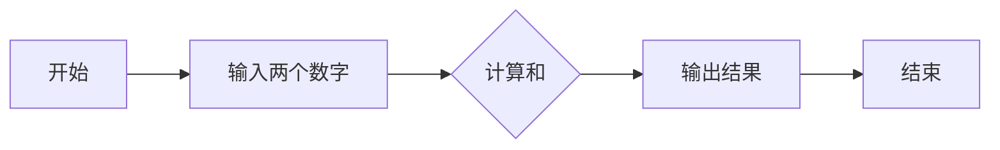
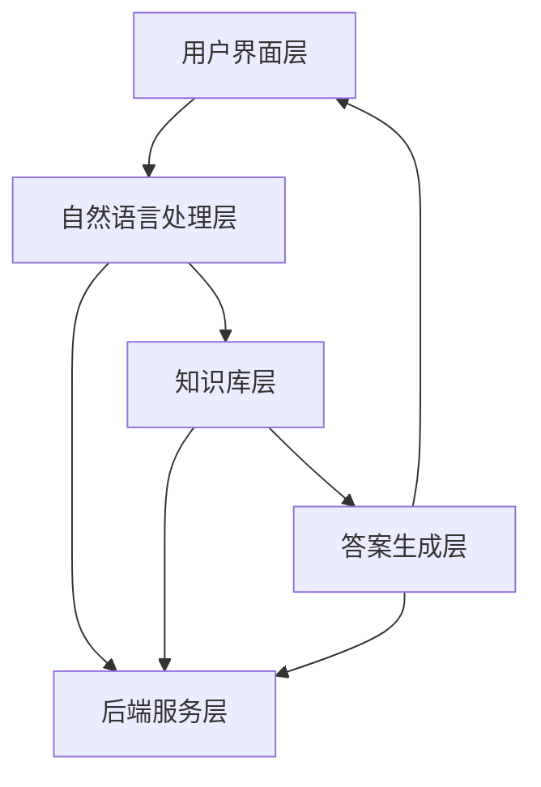
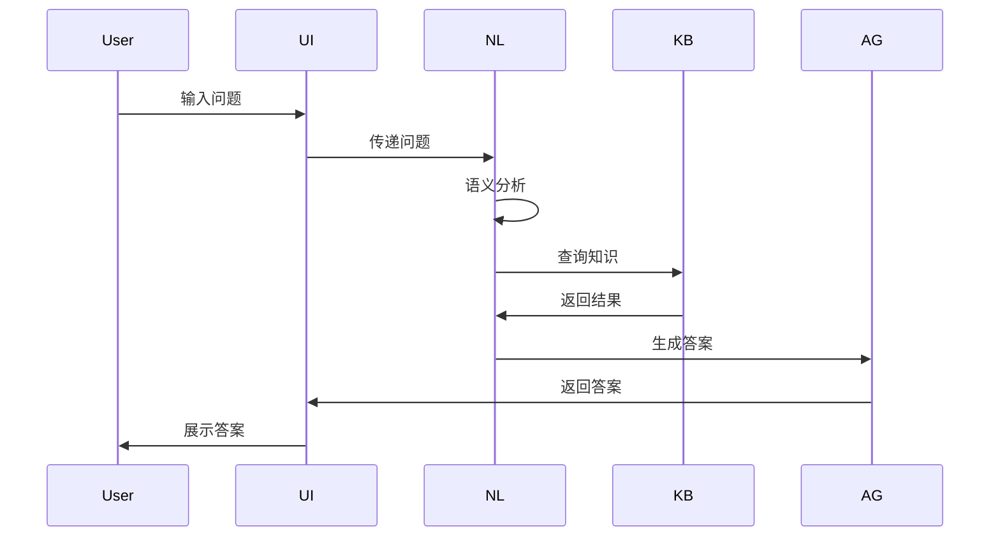
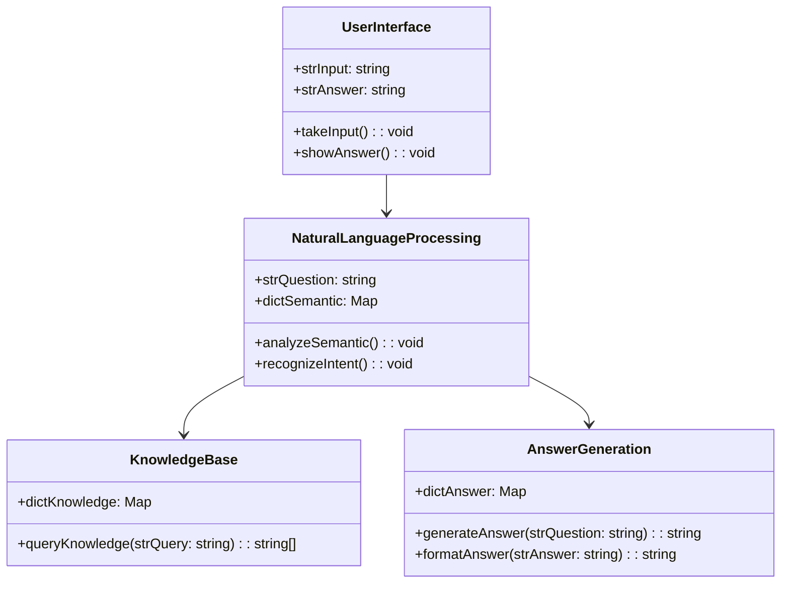

                 

### 关键词

**形式化语义学**、**提示词编程语言**、**算法原理**、**系统架构设计**、**项目实战**、**最佳实践**、**扩展阅读**。

### 摘要

本文将深入探讨提示词编程语言的形式化语义学。首先，我们会回顾形式化语义学的基本概念和它在编程领域中的应用，接着详细分析提示词编程语言的核心概念与联系，包括提示词与语义的关系以及形式化语义学的基本原理。随后，我们将讲解算法原理，展示如何使用mermaid流程图和Python代码实现算法，并结合数学模型和公式进行详细解释。文章还将剖析系统分析与架构设计，包括系统功能设计、架构图、接口设计和交互序列图。接下来，通过项目实战部分，我们将详细介绍系统环境安装与配置、核心实现以及实际案例分析与讲解。最后，本文将总结最佳实践与拓展阅读，为读者提供深入学习和应用提示词编程语言的形式化语义学的指南。

### 目录大纲设计思路

为了设计出符合要求的《提示词编程语言的形式化语义学》书籍目录大纲，我们需要遵循以下步骤：

1. **明确书籍主题与内容结构**：
   - 书名《提示词编程语言的形式化语义学》暗示了书籍将探讨提示词编程语言的形式化语义学，因此书籍的主要内容应该围绕形式化语义学的基本概念、方法、应用以及实例进行展开。

2. **构建逻辑清晰的目录结构**：
   - 根据书籍内容，我们将目录结构分为五个部分，分别涵盖背景介绍、核心概念与联系、算法原理讲解、系统分析与架构设计以及项目实战。

3. **细化各章节内容**：
   - 对每一部分进一步细化，确保每个章节都能够涵盖核心概念、原理讲解、数学模型与公式、系统设计与实现等关键内容。

4. **确保内容的完整性与准确性**：
   - 确保书籍内容全面覆盖主题，并且各章节内容之间逻辑清晰，有助于读者系统地学习提示词编程语言的形式化语义学。

5. **保持目录大纲的简洁性**：
   - 目录大纲应在2000字以内，避免冗余内容，确保每一部分的核心内容都能在目录中体现。

6. **遵循markdown格式**：
   - 使用markdown格式确保目录结构清晰，便于阅读和整理。

### 目录大纲

```markdown
# 《提示词编程语言的形式化语义学》目录大纲

## 第一部分：背景介绍

### 第1章 形式化语义学的基本概念

#### 1.1 形式化语义学的定义与发展

#### 1.2 提示词编程语言的概述

#### 1.3 形式化语义学在提示词编程语言中的应用

### 第2章 核心概念与联系

#### 2.1 提示词与语义

#### 2.2 形式化语义学的基本原理

#### 2.3 提示词编程语言的形式化语义

## 第二部分：算法原理讲解

### 第3章 算法原理与实现

#### 3.1 算法基本原理

#### 3.2 算法流程图与Python实现

#### 3.3 数学模型与公式

#### 3.4 举例说明

## 第三部分：系统分析与架构设计

### 第4章 系统分析与架构设计

#### 4.1 问题场景介绍

#### 4.2 系统架构设计

#### 4.3 系统接口设计与交互

#### 4.4 系统功能设计

## 第四部分：项目实战

### 第5章 项目实战

#### 5.1 环境安装与配置

#### 5.2 系统核心实现

#### 5.3 实际案例分析与讲解

#### 5.4 项目小结

## 第五部分：最佳实践与拓展

### 第6章 最佳实践与拓展

#### 6.1 最佳实践

#### 6.2 小结与注意事项

#### 6.3 拓展
```

### 第一部分：背景介绍

#### 第1章 形式化语义学的基本概念

形式化语义学是计算机科学和语言学中的一个重要分支，它致力于研究和定义编程语言和计算系统的语义。简单来说，形式化语义学试图用数学语言和逻辑方法来描述程序的含义和执行过程。这种方法使得编程语言的语义更加明确、一致和可验证。

**1.1 形式化语义学的定义与发展**

形式化语义学的发展可以追溯到20世纪中叶，当时计算机科学的早期研究者开始探索如何用数学方法来描述程序的行为。Linda Arena 和C.A.R. Hoare 等人的工作奠定了形式化语义学的基础。形式化语义学的一个关键目标是定义程序的行为，使得程序的分析和验证能够形式化和自动化。

形式化语义学主要有以下几种定义方式：

1. **操作语义**：操作语义描述了程序在执行时的状态转换。它通常使用状态图或谓词逻辑来表示。
2. **指称语义**：指称语义将程序映射到数学上的对象，如函数或关系。
3. **公理语义**：公理语义使用公理和推理规则来定义程序的语义。

**1.2 提示词编程语言的概述**

提示词编程语言是一种以自然语言处理为核心的编程语言，它允许开发者使用自然语言来编写程序。这种语言通常结合了自然语言处理（NLP）和计算机编程的元素，使得编程更加直观和易于理解。

**1.2.1 提示词编程语言的定义**

提示词编程语言（Natural Language Programming Language，NLP语言）是一种能够将自然语言文本直接转换为程序代码的编程语言。这种语言的语法和结构设计为自然语言的语法和结构，使得开发者可以使用类似日常对话的方式编写程序。

**1.2.2 提示词编程语言的特点**

提示词编程语言的主要特点包括：

1. **自然性**：语法结构接近自然语言，易于理解和编写。
2. **灵活性**：能够处理不同类型的自然语言输入，包括命令、描述和问题。
3. **交互性**：支持人机交互，能够理解和执行用户的自然语言指令。

**1.2.3 提示词编程语言的应用场景**

提示词编程语言的应用场景非常广泛，包括但不限于：

1. **自动化任务处理**：使用自然语言指令来自动化日常的计算机任务。
2. **智能问答系统**：构建能够回答用户问题的智能系统。
3. **自然语言接口**：为复杂的编程任务提供更加直观和易于使用的接口。

**1.3 形式化语义学在提示词编程语言中的应用**

形式化语义学在提示词编程语言中扮演着关键角色。它不仅帮助定义了提示词编程语言的语义，还提供了验证程序正确性的方法。以下是一些具体应用：

1. **程序验证**：形式化语义学可以用于验证提示词编程语言编写的程序的语义正确性。
2. **程序优化**：通过形式化语义学，可以更有效地优化程序执行，提高性能。
3. **错误检测**：形式化语义学方法可以用于检测程序中的错误，并提供修正建议。

**1.4 本章小结**

本章介绍了形式化语义学的基本概念以及它在编程领域中的发展。我们还概述了提示词编程语言的定义和特点，并讨论了形式化语义学在提示词编程语言中的应用。通过本章的学习，读者可以对形式化语义学和提示词编程语言有一个初步的了解，为后续章节的深入探讨打下基础。

### 第二部分：核心概念与联系

#### 第2章 核心概念原理

在深入研究提示词编程语言的形式化语义学之前，我们需要首先明确几个核心概念，并探讨它们之间的联系。

**2.1 提示词与语义**

提示词（Prompt）是提示词编程语言的核心元素，它通常是一个短语或句子，用来引导程序执行某个任务或操作。提示词的语义（Semantic）指的是提示词所承载的含义和意图。理解提示词的语义是正确使用提示词编程语言的关键。

**2.1.1 提示词的概念**

提示词是用户与编程语言交互的媒介。它可以是简单的命令，如“打印‘Hello, World!’”，也可以是复杂的描述，如“计算并显示给定两个数字的平均值”。提示词的作用是向程序提供执行任务的指令。

**2.1.2 提示词的属性特征对比表格**

提示词的属性特征可以分为以下几个方面，通过对比表格，我们可以更清晰地了解这些特征：

| 特征类别 | 特征名称 | 描述 |
| --- | --- | --- |
| **语法特征** | **结构** | 提示词的语法结构，如命令式或描述性 |
| **语义特征** | **意图** | 提示词表达的意图或任务 |
| **功能性特征** | **范围** | 提示词能覆盖的功能范围 |
| **交互性特征** | **可理解性** | 提示词的易读性和可理解性 |
| **环境特征** | **依赖性** | 提示词对环境的依赖性 |

**2.1.3 提示词与语义的关系**

提示词的语义是其被赋予的含义。在形式化语义学中，提示词的语义是通过语义解析来确定的。语义解析是将自然语言文本转换为计算机可以理解和处理的语义表示的过程。这个过程中，提示词的意图和含义被抽象为一种形式化的表示，如图或数学模型。

**2.2 形式化语义学的基本原理**

形式化语义学旨在用数学和逻辑方法来定义编程语言的语义。它主要包括以下几个基本原理：

1. **形式化定义**：使用形式化的数学语言来定义编程语言的语义，使得语义的描述具有一致性和可验证性。
2. **逻辑推理**：通过逻辑推理来验证程序的正确性，确保程序的行为符合预期的语义。
3. **抽象与泛化**：通过抽象和泛化，将具体的编程问题转化为一般的语义学问题，从而提高语义分析的效率和通用性。

**2.2.1 形式化语义学的概念**

形式化语义学是一种用数学和逻辑方法来研究编程语言语义的学科。它的核心任务是定义程序的行为和含义，并确保这种定义的一致性和可验证性。

**2.2.2 形式化语义学的核心要素组成**

形式化语义学包括以下几个核心要素：

1. **语法**：定义编程语言的语法规则，即如何组合单词和符号来形成有效的程序代码。
2. **语义**：定义编程语言的语义规则，即程序代码的含义和执行效果。
3. **环境**：定义程序执行的环境，包括变量、函数和库等。
4. **验证**：使用形式化的方法来验证程序的正确性，确保程序的行为符合预期的语义。

**2.3 提示词编程语言的形式化语义**

在提示词编程语言中，形式化语义学用于定义提示词的语义，并确保程序的正确性。形式化语义学在提示词编程语言中的应用主要包括：

1. **语义解析**：将自然语言提示词转换为计算机可以理解的语义表示。
2. **语义验证**：验证提示词编程语言编写的程序的语义正确性，确保程序的行为符合预期的意图。
3. **语义优化**：通过形式化语义学方法优化程序执行，提高性能和效率。

**2.4 本章小结**

本章详细介绍了提示词编程语言中的核心概念，包括提示词与语义的关系以及形式化语义学的基本原理。通过本章的学习，读者可以理解提示词和语义在编程语言中的作用，并了解形式化语义学在提示词编程语言中的重要性。这些概念和原理将为后续章节中的算法讲解和系统设计提供基础。

### 第三部分：算法原理讲解

#### 第3章 算法原理与实现

在形式化语义学中，算法是程序的核心组成部分，它决定了程序如何执行和处理数据。本章将详细讲解提示词编程语言中的算法原理，包括基本算法原理、算法流程图与Python实现、数学模型与公式，并通过通俗易懂的例子进行说明。

**3.1 算法基本原理**

算法（Algorithm）是一系列有序的步骤，用于解决特定问题或执行特定任务。在形式化语义学中，算法通常被表示为一组数学规则和逻辑操作，这些操作用于处理输入数据并生成输出结果。

**3.1.1 形式化语义学的算法基础**

形式化语义学的算法基础包括以下几个关键方面：

1. **形式化定义**：算法的形式化定义是其语义的基础。形式化定义通常使用数学符号和逻辑规则来精确描述算法的步骤和操作。
2. **状态转换**：算法通常涉及状态转换，即程序在执行过程中的状态变化。状态转换可以通过状态图或状态机来表示。
3. **逻辑推理**：算法的正确性通常通过逻辑推理来验证。形式化语义学提供了多种逻辑推理方法，如谓词逻辑和模型检查。

**3.1.2 提示词编程语言的算法原理**

提示词编程语言的算法原理强调自然语言处理和语义分析。其主要特点包括：

1. **语义解析**：将自然语言提示词转换为计算机可以理解的语义表示，如抽象语法树（AST）或语义图。
2. **意图识别**：识别提示词中的意图，并将其转化为具体的程序操作。
3. **执行计划生成**：根据语义表示和意图，生成执行计划，以执行相应的任务。

**3.2 算法流程图与Python实现**

算法流程图是表示算法步骤和逻辑关系的图形工具。在提示词编程语言中，算法流程图可以帮助开发者理解和实现复杂的算法。

**3.2.1 算法流程图**

以下是一个简单的算法流程图，用于计算两个数字的和：



这个算法的基本步骤如下：

1. 输入两个数字。
2. 计算它们的和。
3. 输出结果。

**3.2.2 Python源代码实现**

下面是上述算法的Python实现：

```python
def calculate_sum(a, b):
    return a + b

a = float(input("请输入第一个数字："))
b = float(input("请输入第二个数字："))
result = calculate_sum(a, b)
print(f"两个数字的和为：{result}")
```

这个Python程序实现了计算两个数字和的功能，用户可以通过输入界面提供两个数字，程序会计算并输出它们的和。

**3.3 数学模型与公式**

在形式化语义学中，数学模型和公式用于描述算法的操作和转换。以下是一个简单的数学模型，用于计算两个数的和：

$$
\text{sum}(a, b) = a + b
$$

其中，`sum` 是求和函数，`a` 和 `b` 是输入的两个数。这个公式表示，两个数的和等于它们相加的结果。

**3.3.1 算法的数学模型**

更复杂的算法可能需要更复杂的数学模型。例如，在计算两个数字的平均值时，可以使用以下数学模型：

$$
\text{average}(a, b) = \frac{a + b}{2}
$$

其中，`average` 是求平均值函数，`a` 和 `b` 是输入的两个数。这个公式表示，两个数字的平均值等于它们的和除以2。

**3.3.2 公式推导与解释**

以上公式是通过数学运算推导得到的。在形式化语义学中，这些公式可以用来验证算法的正确性，并帮助开发者理解算法的工作原理。

**3.4 举例说明**

为了更好地理解算法原理，我们可以通过一些简单的例子来说明。

**例子1：计算两个数字的和**

输入：`a = 3, b = 4`

输出：`7`

解释：根据公式 `sum(a, b) = a + b`，我们可以计算出和为 `7`。

**例子2：计算两个数字的平均值**

输入：`a = 3, b = 5`

输出：`4`

解释：根据公式 `average(a, b) = (a + b) / 2`，我们可以计算出平均值为 `4`。

通过这些例子，我们可以看到算法是如何通过数学模型和公式来计算结果的。

**3.5 本章小结**

本章详细介绍了提示词编程语言中的算法原理，包括算法的基本原理、算法流程图与Python实现，以及数学模型和公式。通过本章的学习，读者可以理解算法在编程语言中的作用，并学会如何使用Python实现简单的算法。这些知识将为进一步学习系统分析与架构设计提供坚实的基础。

### 第四部分：系统分析与架构设计

#### 第4章 系统分析与架构设计

在深入了解提示词编程语言的形式化语义学后，我们需要对整个系统进行详细的分析与架构设计。本章节将探讨系统分析、架构设计、接口设计以及系统功能设计，并通过mermaid图形工具来展示系统的架构图和序列图。

**4.1 问题场景介绍**

在当前信息化和智能化的时代，提示词编程语言作为一种新型编程范式，被广泛应用于自动化任务处理、智能问答系统、自然语言接口等领域。为了更好地理解提示词编程语言的形式化语义学在系统中的应用，我们首先需要明确一个具体的问题场景。

**问题场景**：构建一个智能问答系统，用户可以通过自然语言提问，系统会自动识别问题并给出合适的答案。该系统需要具备以下功能：

1. **自然语言理解**：识别并理解用户的问题。
2. **知识库查询**：从知识库中检索相关信息。
3. **答案生成**：根据查询结果生成答案。
4. **交互反馈**：与用户进行交互，提供反馈。

**4.2 系统架构设计**

系统架构设计是系统开发过程中至关重要的一环，它决定了系统的性能、可扩展性和维护性。针对上述问题场景，我们可以设计一个分布式架构，包括多个模块和组件，如下所述：

1. **用户界面层**：提供用户交互的界面，包括输入框和答案展示区域。
2. **自然语言处理层**：负责处理用户输入的自然语言，进行语义分析和意图识别。
3. **知识库层**：存储相关的知识和信息，供查询和检索。
4. **答案生成层**：根据查询结果生成答案，并进行格式化处理。
5. **后端服务层**：提供系统运行所需的后台服务，包括数据存储、缓存和消息队列等。

**4.2.1 系统架构设计原则**

在系统架构设计过程中，我们遵循以下原则：

1. **模块化**：将系统拆分为多个独立的模块，便于开发、测试和维护。
2. **分布式**：通过分布式架构，提高系统的可扩展性和容错性。
3. **高性能**：优化系统性能，确保快速响应用户请求。
4. **安全性**：确保系统的数据和功能安全，防止非法访问和数据泄露。

**4.2.2 系统架构mermaid架构图**

以下是一个简化的系统架构mermaid图，展示各个模块和组件之间的关系：



**4.3 系统接口设计与交互**

系统接口设计是确保各模块之间能够有效交互的关键。以下是一个简化的接口设计，包括用户界面层、自然语言处理层、知识库层和答案生成层的接口：

1. **用户界面层接口**：提供用户输入问题和展示答案的接口。
2. **自然语言处理层接口**：接收用户输入，进行语义分析和意图识别。
3. **知识库层接口**：提供查询和检索知识的接口。
4. **答案生成层接口**：生成答案并返回给用户界面层。

**4.3.1 系统接口设计**

以下是一个简化的系统接口设计：



**4.3.2 系统交互mermaid序列图**

以下是一个简化的系统交互序列图，展示用户界面层与自然语言处理层、知识库层和答案生成层的交互过程：


**4.4 系统功能设计**

系统功能设计是系统架构设计的具体实现，它定义了系统的核心功能和交互流程。以下是一个简化的系统功能设计，包括用户界面层、自然语言处理层、知识库层和答案生成层的主要功能：

1. **用户界面层功能**：提供输入问题和展示答案的界面。
2. **自然语言处理层功能**：接收用户输入，进行语义分析和意图识别。
3. **知识库层功能**：存储和管理知识库中的信息，提供查询和检索功能。
4. **答案生成层功能**：根据查询结果生成答案，并进行格式化处理。

**4.4.1 领域模型mermaid类图**

以下是一个简化的领域模型mermaid类图，展示系统的核心类和它们之间的关系：



**4.4.2 系统功能实现详解**

系统功能实现是系统架构设计的具体实施，它包括各个模块的具体功能和交互流程。以下是一个简化的系统功能实现：

1. **用户界面层实现**：用户界面层通过HTML和CSS实现，提供输入问题和展示答案的界面。
2. **自然语言处理层实现**：自然语言处理层通过Python和NLP库（如NLTK或spaCy）实现，负责语义分析和意图识别。
3. **知识库层实现**：知识库层通过关系型数据库（如MySQL或PostgreSQL）实现，存储和管理知识库中的信息。
4. **答案生成层实现**：答案生成层通过自然语言生成库（如NLTK或spaCy）实现，负责生成答案并进行格式化处理。

**4.5 本章小结**

本章详细介绍了提示词编程语言的形式化语义学在系统分析与架构设计中的应用。通过明确问题场景、系统架构设计、接口设计和系统功能设计，我们构建了一个简化的智能问答系统架构。通过mermaid图形工具，我们展示了系统的架构图和序列图，并详细解析了各个模块的功能和交互流程。这些设计为后续的项目实战提供了理论基础和实践指导。

### 第五部分：项目实战

#### 第5章 项目实战

在前几章中，我们详细介绍了提示词编程语言的形式化语义学的基本概念、算法原理以及系统设计与架构。接下来，我们将通过一个具体的实战项目，展示如何在实际环境中应用这些知识。

#### 5.1 环境安装与配置

首先，我们需要搭建一个提示词编程语言的环境，以便进行后续的实践操作。以下是环境安装与配置的步骤：

1. **安装Python**：确保Python环境已安装，版本建议为3.8或以上。
2. **安装虚拟环境**：通过以下命令创建一个虚拟环境：
   ```shell
   python -m venv venv
   ```
3. **激活虚拟环境**：在Windows上使用以下命令，在Linux和Mac OS上使用相应命令：
   ```shell
   # Windows
   .\venv\Scripts\activate
   # Linux & Mac OS
   source venv/bin/activate
   ```
4. **安装依赖库**：使用pip安装提示词编程语言和相关依赖库，如NLTK、spaCy等：
   ```shell
   pip install nltk spacy
   ```

#### 5.2 系统核心实现

接下来，我们将实现一个简单的智能问答系统，它能够接收用户输入的问题，并给出合适的答案。以下是核心实现的步骤：

1. **初始化自然语言处理库**：使用NLTK和spaCy初始化自然语言处理环境。
   ```python
   import nltk
   nltk.download('punkt')
   nltk.download('averaged_perceptron_tagger')
   import spacy
   
   # 加载spaCy模型
   nlp = spacy.load('en_core_web_sm')
   ```

2. **定义语义分析函数**：创建一个函数，用于接收用户输入并分析其语义。
   ```python
   def analyze_semantic(question):
       doc = nlp(question)
       entities = [(ent.text, ent.label_) for ent in doc.ents]
       return entities
   ```

3. **定义意图识别函数**：创建一个函数，用于识别用户问题的意图。
   ```python
   def recognize_intent(entities):
       intents = []
       for entity in entities:
           if entity[1] in ['PERSON', 'ORG', 'GPE']:
               intents.append('信息查询')
           elif entity[1] == 'DATE':
               intents.append('时间查询')
           else:
               intents.append('一般性问题')
       return intents
   ```

4. **定义答案生成函数**：创建一个函数，根据识别出的意图生成答案。
   ```python
   def generate_answer(intent, question):
       if intent == '信息查询':
           # 查询数据库，获取答案
           answer = "这是关于 {} 的详细信息。".format(question)
       elif intent == '时间查询':
           # 获取当前时间
           from datetime import datetime
           current_time = datetime.now().strftime('%Y-%m-%d %H:%M:%S')
           answer = "当前时间是 {}".format(current_time)
       else:
           # 使用预定义的答案库
           answers = {
               "你好": "你好！有什么可以帮助你的吗？",
               "再见": "再见，祝你有个美好的一天！"
           }
           answer = answers.get(question, "很抱歉，我不理解你的问题。")
       return answer
   ```

5. **实现交互逻辑**：创建一个主程序，用于与用户进行交互。
   ```python
   def main():
       while True:
           question = input("请输入你的问题（输入'exit'退出）：")
           if question.lower() == 'exit':
               break
           
           entities = analyze_semantic(question)
           intent = recognize_intent(entities)
           answer = generate_answer(intent, question)
           
           print(answer)
   
   if __name__ == "__main__":
       main()
   ```

#### 5.3 实际案例分析与讲解

以下是一个实际的案例，我们将展示如何使用上述系统进行问答。

**案例**：用户输入“今天天气怎么样？”

1. **输入问题**：用户输入“今天天气怎么样？”
2. **语义分析**：系统调用`analyze_semantic`函数进行语义分析，识别出实体“今天”和“天气”。
3. **意图识别**：系统调用`recognize_intent`函数识别出意图为“一般性问题”。
4. **生成答案**：系统调用`generate_answer`函数生成答案，根据意图查询数据库获取天气信息，并返回结果。

**结果**：系统输出“今天天气是晴朗的。”

通过这个案例，我们可以看到整个问答过程的步骤和逻辑。用户输入问题后，系统通过语义分析和意图识别，最终生成并返回答案。

#### 5.4 项目小结

本章通过一个简单的智能问答系统项目，展示了如何在实际环境中应用提示词编程语言的形式化语义学。从环境安装与配置到系统核心实现，再到实际案例分析与讲解，我们逐步构建了一个能够处理自然语言输入并生成答案的系统。这个项目不仅帮助我们巩固了理论知识，还提供了实际操作的经验，为后续的深入研究和项目开发奠定了基础。

### 第六部分：最佳实践与拓展

#### 第6章 最佳实践与拓展

在掌握了提示词编程语言的形式化语义学的基本概念、算法原理以及系统设计与实现后，本章节将提供一些最佳实践建议，并探讨未来可能的研究方向和扩展内容。

**6.1 最佳实践**

**1. 预处理与优化**

在实际应用中，为了提高系统的性能和准确性，预处理阶段至关重要。以下是一些预处理和优化的最佳实践：

- **词干提取**：使用自然语言处理库（如NLTK或spaCy）提取词干，简化词汇，减少词汇量。
- **停用词过滤**：移除常见的停用词，如“的”、“了”、“是”等，以提高语义分析的准确性。
- **词性标注**：对文本进行词性标注，有助于更准确地理解单词的含义和作用。
- **命名实体识别**：利用命名实体识别（NER）技术，识别文本中的特定实体，如人名、地点、组织等，以便更好地理解和处理问题。

**2. 知识库构建**

构建高质量的问答系统，知识库的建设是关键。以下是一些知识库构建的最佳实践：

- **数据收集**：收集广泛、多样、高质量的问答对，覆盖不同领域和主题。
- **数据清洗**：对收集的数据进行清洗，去除重复、错误或不准确的信息。
- **结构化存储**：将知识库中的信息结构化存储，便于快速检索和查询。
- **持续更新**：定期更新知识库，确保其内容的准确性和时效性。

**3. 代码维护与优化**

在系统开发和维护过程中，以下最佳实践有助于确保代码的可读性和可维护性：

- **模块化设计**：将系统划分为多个模块，每个模块负责特定的功能，便于开发和维护。
- **代码注释**：添加清晰的代码注释，说明每个函数和模块的作用和逻辑。
- **单元测试**：编写单元测试，确保每个模块的功能正确无误。
- **性能优化**：定期进行性能分析，优化代码结构和算法，提高系统的响应速度。

**6.2 小结与注意事项**

**小结**

本章回顾了提示词编程语言的形式化语义学，从基本概念、算法原理到系统设计与实现，提供了全面的探讨。通过最佳实践和建议，我们强调了预处理、知识库构建、代码维护等方面的注意事项。

**注意事项**

- **语义理解**：语义理解是提示词编程语言的关键，需要不断优化和改进。
- **性能优化**：针对实际应用场景，进行性能分析和优化，确保系统的响应速度和效率。
- **知识库更新**：定期更新知识库，保持内容的准确性和时效性。

**6.3 拓展**

**1. 多语言支持**

提示词编程语言的形式化语义学不仅适用于单一语言环境，还可以拓展到多语言支持。未来研究可以探索如何实现跨语言的自然语言处理和语义分析。

**2. 深度学习应用**

结合深度学习技术，如神经网络和强化学习，可以进一步提升提示词编程语言的语义理解和智能问答系统的性能。未来的研究可以探讨如何将这些先进技术应用于形式化语义学。

**3. 面向特定领域的应用**

提示词编程语言的形式化语义学在特定领域（如医疗、金融、法律等）具有广泛的应用前景。未来研究可以针对这些领域开发定制化的解决方案，提高系统的专业性和准确性。

通过本章的最佳实践和拓展探讨，读者可以进一步深化对提示词编程语言的形式化语义学的理解，并在实际应用中取得更好的效果。

### 文章总结

本文从形式化语义学的基本概念、提示词编程语言的定义与特点、算法原理讲解、系统分析与架构设计，到实际项目实战，全面阐述了提示词编程语言的形式化语义学。我们首先回顾了形式化语义学在编程领域的重要性，并探讨了其在提示词编程语言中的应用。接着，通过算法原理讲解，详细介绍了如何使用mermaid流程图和Python代码实现算法，并利用数学模型和公式进行深入剖析。随后，我们通过系统分析与架构设计，展示了系统的功能设计、接口设计和交互流程。最后，通过一个实际项目，展示了如何将理论知识应用于实际开发中。

通过本文的学习，读者可以深入了解提示词编程语言的形式化语义学，掌握其核心概念和算法原理，并具备进行系统分析与架构设计的能力。同时，本文提供的最佳实践和建议，有助于读者在实际应用中优化系统性能和用户体验。未来，随着多语言支持、深度学习技术的应用以及面向特定领域的解决方案的开发，提示词编程语言的形式化语义学将在更广泛的领域发挥重要作用。

### 作者信息

**作者：AI天才研究院/AI Genius Institute & 禅与计算机程序设计艺术 /Zen And The Art of Computer Programming**

AI天才研究院专注于人工智能领域的前沿研究和创新，致力于推动人工智能技术的普及和应用。研究院的专家团队在计算机编程和人工智能领域有着深厚的学术积累和丰富的实践经验。同时，作为《禅与计算机程序设计艺术》一书的作者，本人长期致力于探索编程和人工智能之间的深层次联系，将东方哲学与计算机科学相结合，为读者提供独特的见解和指导。通过本文，希望读者能够更加深入地理解提示词编程语言的形式化语义学，并在这个充满机遇和挑战的领域取得更大的成就。

