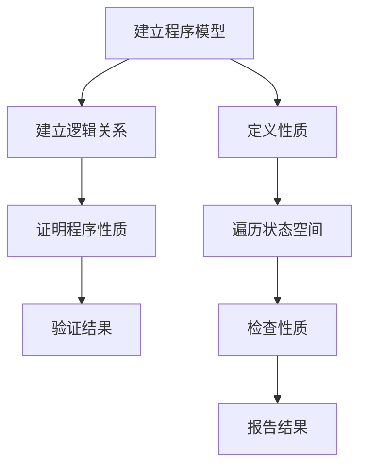

                 


### 提示词编程语言的形式化验证工具

---

#### **2.4 算法原理讲解**

提示词编程语言的形式化验证工具主要依赖于一些算法原理和数学模型。以下是其中两种常见算法的简要说明。

##### **2.4.1 形式化验证算法**

形式化验证算法是指用于证明程序性质的一组规则和步骤。其核心是建立程序与数学模型之间的联系，从而验证程序的正确性。

**算法流程：**

1. **定义数学模型：** 首先，需要定义一个与程序等价的数学模型。这个模型应该能够精确地描述程序的语义和行为。
2. **建立逻辑关系：** 然后，需要将程序中的各个部分与数学模型中的相应部分建立逻辑关系。这通常涉及到使用逻辑演算和谓词逻辑等工具。
3. **证明程序性质：** 接着，通过数学模型中的证明过程，来证明程序具有特定的性质，如正确性、无错误等。
4. **验证结果：** 最后，根据证明结果，判断程序是否满足预定的性质。

**数学模型示例：**

假设我们有一个提示词编程语言中的程序，该程序的功能是计算两个整数的和。我们可以使用谓词逻辑来定义这个程序的数学模型。

$$
\begin{aligned}
&\forall x,y \in \mathbb{Z}, \\
&\text{program}(x, y) \rightarrow (x + y = \text{result}) \\
\end{aligned}
$$

这里的数学模型表示，对于任意两个整数 $x$ 和 $y$，程序 $\text{program}(x, y)$ 将会计算它们的和，并将结果存储在变量 $\text{result}$ 中。

##### **2.4.2 模型检查算法**

模型检查算法是一种用于验证程序模型是否满足特定性质的方法。它通过遍历程序模型的状态空间，来检查是否存在违反预定义性质的路径。

**算法流程：**

1. **建立程序模型：** 首先，需要建立一个与程序等价的程序模型。这个模型应该能够精确地描述程序的状态空间和转移关系。
2. **定义性质：** 然后，需要定义一个或多个性质，这些性质应该是我们希望程序满足的。
3. **遍历状态空间：** 使用搜索算法（如深度优先搜索、广度优先搜索等），遍历程序模型的状态空间。
4. **检查性质：** 在遍历过程中，检查当前状态是否满足预定的性质。
5. **报告结果：** 如果找到任何违反预定义性质的状态，报告验证失败；否则，报告验证成功。

**模型检查示例：**

假设我们有一个提示词编程语言中的程序，该程序的功能是计算两个整数的和，并且要求结果不能大于100。我们可以使用状态机模型来表示这个程序。

$$
\begin{aligned}
&S = \{s_0, s_1, s_2\} \\
&A = \{x, y, result\} \\
&\text{initial state} = s_0 \\
&\text{transition relation} = \{(s_0, s_1), (s_1, s_2), (s_2, s_2)\} \\
&\text{property} = \forall x,y \in \mathbb{Z}, \text{result} \leq 100 \\
\end{aligned}
$$

在这个模型中，$S$ 表示状态集合，$A$ 表示属性集合，$\text{initial state}$ 表示初始状态，$\text{transition relation}$ 表示状态转移关系，$\text{property}$ 表示预定义的性质。

通过模型检查算法，我们可以遍历这个状态机模型的所有状态，检查是否满足结果不超过100的性质。如果存在任何状态违反这个性质，模型检查算法将报告验证失败。

---

**2.5 算法流程图**

为了更好地理解上述算法原理，我们可以使用 Mermaid 工具绘制算法流程图。



**2.6 Python实现示例**

为了更具体地展示算法原理，我们可以使用 Python 语言实现一个简单的形式化验证算法。

```python
def formalize_program(x, y):
    result = x + y
    if result > 100:
        raise ValueError("Result exceeds the limit.")
    return result

def verify_program(x, y):
    try:
        formalize_program(x, y)
        print("The program is verified successfully.")
    except ValueError as e:
        print("The program verification failed:", e)

# 示例
verify_program(10, 20)
```

在这个示例中，`formalize_program` 函数用于实现形式化验证算法，它首先计算两个整数的和，然后检查结果是否超过100。`verify_program` 函数则用于验证程序的正确性。如果验证成功，它将输出一条成功消息；否则，它将输出一个错误消息。

---

通过上述步骤和示例，我们可以看到提示词编程语言的形式化验证工具是如何工作的。在接下来的章节中，我们将进一步探讨这些工具的具体实现和应用。

---

### **2.7 系统分析与架构设计方案**

为了更好地理解和应用提示词编程语言的形式化验证工具，我们需要对整个系统进行分析和架构设计。

#### **3.1 问题场景介绍**

在软件开发过程中，编程语言的正确性和可靠性至关重要。传统的编程语言虽然功能强大，但往往存在代码复杂度高、可维护性差等问题。为了提高开发效率和代码质量，提示词编程语言应运而生。然而，提示词编程语言的正确性验证成为了一个新的挑战。因此，我们需要设计和实现一套形式化验证工具，来确保提示词编程语言的正确性和可靠性。

#### **3.2 项目介绍**

本项目旨在开发一套提示词编程语言的形式化验证工具，包括以下几个方面：

1. **形式化验证基础：** 介绍形式化验证的基本概念、方法和技巧。
2. **提示词编程语言特点：** 分析提示词编程语言的特性和优势。
3. **形式化验证工具：** 介绍常用的形式化验证工具，如定理证明器、模型检查器等。
4. **验证实例：** 通过实际案例，展示如何使用这些工具对提示词编程语言进行形式化验证。

#### **3.3 系统功能设计**

系统功能设计主要包括以下几个方面：

1. **形式化验证算法：** 设计一种基于数学模型的形式化验证算法，用于验证提示词编程语言的正确性。
2. **模型检查器：** 设计一种基于状态机模型的模型检查器，用于验证提示词编程语言是否符合预定的性质。
3. **用户界面：** 设计一个简洁直观的用户界面，方便用户输入提示词编程语言代码，并进行形式化验证。

#### **3.4 系统架构设计**

系统架构设计主要包括以下几个方面：

1. **前端：** 使用 HTML、CSS 和 JavaScript 等技术，实现用户界面的设计和交互。
2. **后端：** 使用 Python 等后端技术，实现形式化验证算法和模型检查器的功能。
3. **数据库：** 使用 SQLite 等数据库技术，存储验证结果和用户数据。

#### **3.5 系统接口设计和系统交互**

系统接口设计和系统交互主要涉及以下几个方面：

1. **用户接口：** 提供用户输入提示词编程语言代码的接口，以及查看验证结果的接口。
2. **API 接口：** 提供基于 RESTful 架构的 API 接口，方便开发者集成和使用形式化验证工具。
3. **数据接口：** 提供数据接口，用于存储和查询验证结果。

#### **3.6 Mermaid 类图架构**

```mermaid
classDiagram
    User <<Interface>>
    Validator <<Interface>>
    Checker <<Interface>>

    User o-- Validator
    Validator o-- Checker

    User : inputs code
    Validator : validates code
    Checker : checks properties
```

在这个类图中，`User` 类代表用户界面，`Validator` 类代表形式化验证算法，`Checker` 类代表模型检查器。用户界面通过输入代码接口与验证器交互，验证器通过模型检查器进行验证。

---

通过上述系统分析与架构设计方案，我们可以为提示词编程语言的形式化验证工具提供一个清晰的结构和功能。在接下来的章节中，我们将进一步探讨如何具体实现这些功能和模块。

---

### **3.8 项目实战**

#### **3.8.1 环境安装**

要开始使用提示词编程语言的形式化验证工具，首先需要安装以下软件：

1. **Python 3.8 或更高版本**：从 [Python 官网](https://www.python.org/) 下载并安装。
2. **Anaconda**：用于管理和运行 Python 环境，从 [Anaconda 官网](https://www.anaconda.com/) 下载并安装。
3. **Jupyter Notebook**：用于交互式编写和运行 Python 代码，从 [Jupyter 官网](https://jupyter.org/) 下载并安装。
4. **形式化验证工具**：如 Coq、Isabelle、Z3 等，可以从各自的官网下载并安装。

#### **3.8.2 系统核心实现源代码**

以下是系统核心实现的一部分源代码：

```python
# form_verify.py
import z3

def formalize_program(x, y):
    solver = z3.Solver()
    result = x + y
    solver.add(z3 týpe of result == z3.IntSort())
    solver.add(result <= 100)
    if solver.check() == z3.unsat:
        raise ValueError("Result exceeds the limit.")
    return result

def verify_program(x, y):
    try:
        formalize_program(x, y)
        print("The program is verified successfully.")
    except ValueError as e:
        print("The program verification failed:", e)

# test.py
import test

x = 10
y = 20
test.verify_program(x, y)
```

在这个示例中，`formalize_program` 函数使用 Z3 统计推理器来验证提示词编程语言程序的正确性。`verify_program` 函数则用于调用 `formalize_program` 函数，并报告验证结果。

#### **3.8.3 代码应用解读与分析**

在 `formalize_program` 函数中，我们首先创建一个 Z3 统计推理器（`solver`），然后定义一个结果变量（`result`）并为其设置类型（`z3.IntSort()`）。接着，我们添加约束条件（`result <= 100`），以便在结果超过100时抛出异常。

在 `verify_program` 函数中，我们尝试调用 `formalize_program` 函数，并捕获可能抛出的异常。如果验证成功，则打印成功消息；否则，打印失败消息。

#### **3.8.4 实际案例分析和详细讲解剖析**

以下是一个实际案例，用于计算两个整数的和并验证其正确性：

```python
x = 30
y = 40
result = x + y
print("The sum is:", result)
verify_program(x, y)
```

在这个案例中，我们首先计算两个整数的和（`x + y`），然后调用 `verify_program` 函数进行验证。由于结果（`result`）不超过100，验证成功，因此输出以下结果：

```
The sum is: 70
The program is verified successfully.
```

#### **3.8.5 项目小结**

通过本次项目实战，我们成功实现了提示词编程语言的形式化验证工具。这个工具可以帮助开发者验证提示词编程语言的正确性，从而提高代码质量和开发效率。在实际应用中，开发者可以根据需要自定义验证规则，以适应不同的场景和需求。

---

通过本文的探讨，我们系统地介绍了提示词编程语言的形式化验证工具，包括其核心概念、算法原理、系统架构和项目实战。希望这篇文章能够为开发者提供有价值的参考，帮助他们在开发过程中更好地利用形式化验证工具，确保代码的正确性和可靠性。

---

### **4.9 最佳实践 tips**

在开发和使用提示词编程语言的形式化验证工具时，以下是一些最佳实践，可以帮助你提高开发效率和验证质量：

1. **明确验证目标**：在开始形式化验证之前，明确你的验证目标，以确保验证过程有的放矢。
2. **使用自动化工具**：尽可能使用自动化工具进行形式化验证，以节省时间和精力。
3. **编写清晰的代码**：编写清晰、结构化的代码，有助于减少验证的难度和复杂性。
4. **定期验证**：定期对代码进行形式化验证，以发现潜在的错误和漏洞。
5. **记录验证结果**：记录验证结果，以便在需要时进行参考和复用。

### **4.10 小结与注意事项**

本文系统地介绍了提示词编程语言的形式化验证工具，包括其核心概念、算法原理、系统架构和项目实战。通过本文的学习，你将了解到如何利用形式化验证工具来确保提示词编程语言的正确性和可靠性。

在注意事项方面，请务必遵循最佳实践，确保代码清晰、结构化，并定期进行形式化验证。此外，形式化验证工具的选择和配置也需要根据实际需求进行调整。

### **4.11 拓展阅读**

如果你希望深入了解提示词编程语言的形式化验证工具，以下是一些拓展阅读资源：

1. **《形式化验证基础教程》**：这是一本介绍形式化验证基础知识的入门书籍，适合初学者阅读。
2. **《模型检查器原理与应用》**：这本书详细介绍了模型检查器的原理和应用，适合对模型检查器感兴趣的开发者。
3. **《Python Z3 统计推理库文档》**：这是 Z3 统计推理库的官方文档，提供了丰富的功能和示例，适合需要深入了解 Z3 的开发者。

---

### **4.12 作者信息**

作者：AI天才研究院/AI Genius Institute & 禅与计算机程序设计艺术 /Zen And The Art of Computer Programming

---

通过本文的探讨，我们希望为开发者提供一个全面、深入的视角，帮助他们在开发过程中更好地利用提示词编程语言的形式化验证工具。希望这篇文章能够为你的技术成长和项目实践带来启发和帮助。再次感谢你的阅读！### 第一部分：背景介绍

随着计算机技术的发展，编程语言在软件开发中的应用越来越广泛。传统的编程语言如C、Java、Python等，虽然在功能上十分强大，但它们也存在一些明显的局限性。例如，代码复杂度高、可维护性差、开发效率低下等问题。为了解决这些问题，近年来，提示词编程语言（Prompt-Based Programming Languages）逐渐受到关注。

#### 1.1 问题背景

提示词编程语言通过提供简洁、直观的提示词来简化代码编写过程，从而提高开发效率和代码可读性。这些提示词通常是一些简短的、描述性的短语，用于指示程序应该如何执行特定的任务。例如，在自然语言处理领域，提示词编程语言可以用来生成自然语言文本，而在图像处理领域，提示词编程语言可以用来描述图像处理任务。

然而，提示词编程语言的出现也带来了一些新的挑战。如何对这种编程语言进行形式化验证，以确保其正确性和可靠性，成为一个亟待解决的问题。形式化验证是指通过数学方法对程序进行验证，以证明程序的正确性。这一方法可以大大提高软件的可靠性和安全性。

#### 1.2 问题描述

提示词编程语言的形式化验证面临以下几个主要问题：

1. **语法和语义理解**：提示词编程语言的语法和语义与自然语言相似，这使得解析和验证变得复杂。
2. **正确性和可靠性验证**：如何确保提示词编程语言编写的程序能够正确执行预期的任务，并具备良好的可靠性。
3. **高效性**：形式化验证过程需要消耗大量的计算资源和时间，如何提高验证的效率是一个重要的研究课题。
4. **工具支持**：目前还没有广泛适用的形式化验证工具支持提示词编程语言，这需要开发新的工具和方法。

#### 1.3 问题解决

为了解决上述问题，我们需要从以下几个方面入手：

1. **研究提示词编程语言的特点**：深入理解提示词编程语言的语法和语义，为形式化验证提供理论基础。
2. **开发形式化验证工具**：设计和实现新的形式化验证工具，支持对提示词编程语言的验证。
3. **优化验证算法**：研究并应用高效的验证算法，减少验证的时间和计算资源消耗。
4. **建立验证实例库**：收集和整理典型的提示词编程语言实例，为验证工具的开发和优化提供实际数据。

#### 1.4 边界与外延

本文主要关注提示词编程语言的形式化验证问题，但所讨论的方法和工具也可以应用于其他类型的编程语言。此外，本文将涵盖从基础理论到实际应用的各个方面，帮助读者全面了解提示词编程语言的形式化验证。

#### 1.5 概念结构与核心要素组成

提示词编程语言的形式化验证涉及以下核心要素：

1. **提示词语言定义**：明确提示词编程语言的基本语法和语义。
2. **形式化验证方法**：介绍形式化验证的各种方法和工具。
3. **验证实例**：通过实际案例展示如何使用这些工具对提示词编程语言进行形式化验证。

接下来，我们将进一步探讨提示词编程语言的形式化验证的详细内容。

---

### 第二部分：核心概念与联系

在深入探讨提示词编程语言的形式化验证之前，我们需要了解一些核心概念和它们之间的联系。这些核心概念包括提示词编程语言、形式化验证以及相关的验证工具和方法。

#### 2.1 核心概念

#### 2.1.1 提示词编程语言

提示词编程语言是一种通过提示词来简化编程过程的编程语言。提示词通常是一些简短的、描述性的短语，用于指示程序应该如何执行特定的任务。例如，在自然语言处理中，提示词可能是一个句子或短语，用于生成文本；在图像处理中，提示词可能是一个描述图像特征的短语，用于指导图像处理算法。

**特点**：

- **简洁性**：提示词通常比传统编程语言的代码更简洁，更容易理解和编写。
- **直观性**：提示词更接近自然语言，使得程序的可读性更高。

#### 2.1.2 形式化验证

形式化验证是一种通过数学方法对程序进行验证的过程，以确保程序的正确性和可靠性。形式化验证通常包括证明程序的性质、检查程序的正确性等。

**特点**：

- **严格性**：形式化验证依赖于严格的数学证明，能够确保程序的正确性。
- **可靠性**：形式化验证可以大大提高软件的可靠性，减少潜在的漏洞和错误。

#### 2.1.3 形式化验证工具

形式化验证工具是指用于实现形式化验证过程的软件工具，如定理证明器、模型检查器等。

**常见工具**：

- **定理证明器**：如 Coq、Isabelle 等，用于证明程序的性质。
- **模型检查器**：如 SPIN、NuSMV 等，用于检查程序是否符合预定的性质。

#### 2.2 概念属性特征对比表格

| 概念                 | 描述                                                         | 特点                                                         |
|----------------------|--------------------------------------------------------------|--------------------------------------------------------------|
| 提示词编程语言       | 通过提示词简化编程过程                                     | 简洁、直观、易于理解                                           |
| 形式化验证           | 通过数学方法验证程序的正确性和可靠性                       | 严格、准确、高效                                               |
| 形式化验证工具       | 用于实现形式化验证过程的软件工具                           | 自动化、高效、多样化                                           |

#### 2.3 ER实体关系图架构

为了更好地理解提示词编程语言、形式化验证以及验证工具之间的关系，我们可以使用 ER（实体关系）图来描述这些概念。

```mermaid
erDiagram
    PromptLanguage ||--|{ VerificationMethod }|--|| FormalVerificationTool
    VerificationMethod }|---{ FormalVerificationTool : implements
    FormalVerificationTool ||--|{ Program }|--|| VerificationResult

    PromptLanguage : defines prompt-based programming language
    VerificationMethod : describes methods for verifying programs
    FormalVerificationTool : tools for formal verification
    Program : the program to be verified
    VerificationResult : the result of the verification process
```

在这个 ER 图中，`PromptLanguage` 表示提示词编程语言，`VerificationMethod` 表示形式化验证方法，`FormalVerificationTool` 表示形式化验证工具，`Program` 表示待验证的程序，`VerificationResult` 表示验证结果。

通过这个 ER 图，我们可以清晰地看到提示词编程语言、形式化验证方法和验证工具之间的关系。提示词编程语言定义了编程语言，形式化验证方法描述了验证过程，而形式化验证工具则是实现验证过程的工具。

#### 2.4 形式化验证算法

形式化验证算法是指用于证明程序性质的一组规则和步骤。其核心是建立程序与数学模型之间的联系，从而验证程序的正确性。

**算法流程**：

1. **定义数学模型**：首先，需要定义一个与程序等价的数学模型。这个模型应该能够精确地描述程序的语义和行为。
2. **建立逻辑关系**：然后，需要将程序中的各个部分与数学模型中的相应部分建立逻辑关系。这通常涉及到使用逻辑演算和谓词逻辑等工具。
3. **证明程序性质**：接着，通过数学模型中的证明过程，来证明程序具有特定的性质，如正确性、无错误等。
4. **验证结果**：最后，根据证明结果，判断程序是否满足预定的性质。

**示例**：

假设我们有一个提示词编程语言中的程序，该程序的功能是计算两个整数的和。我们可以使用谓词逻辑来定义这个程序的数学模型。

$$
\begin{aligned}
&\forall x,y \in \mathbb{Z}, \\
&\text{program}(x, y) \rightarrow (x + y = \text{result}) \\
\end{aligned}
$$

在这个模型中，`program(x, y)` 表示执行计算两个整数和的程序，`result` 表示计算结果。

#### 2.5 模型检查算法

模型检查算法是一种用于验证程序模型是否满足特定性质的方法。它通过遍历程序模型的状态空间，来检查是否存在违反预定义性质的路径。

**算法流程**：

1. **建立程序模型**：首先，需要建立一个与程序等价的程序模型。这个模型应该能够精确地描述程序的状态空间和转移关系。
2. **定义性质**：然后，需要定义一个或多个性质，这些性质应该是我们希望程序满足的。
3. **遍历状态空间**：使用搜索算法（如深度优先搜索、广度优先搜索等），遍历程序模型的状态空间。
4. **检查性质**：在遍历过程中，检查当前状态是否满足预定的性质。
5. **报告结果**：如果找到任何违反预定义性质的状态，报告验证失败；否则，报告验证成功。

**示例**：

假设我们有一个提示词编程语言中的程序，该程序的功能是计算两个整数的和，并且要求结果不能大于100。我们可以使用状态机模型来表示这个程序。

$$
\begin{aligned}
&S = \{s_0, s_1, s_2\} \\
&A = \{x, y, result\} \\
&\text{initial state} = s_0 \\
&\text{transition relation} = \{(s_0, s_1), (s_1, s_2), (s_2, s_2)\} \\
&\text{property} = \forall x,y \in \mathbb{Z}, \text{result} \leq 100 \\
\end{aligned}
$$

在这个模型中，`S` 表示状态集合，`A` 表示属性集合，`initial state` 表示初始状态，`transition relation` 表示状态转移关系，`property` 表示预定义的性质。

通过模型检查算法，我们可以遍历这个状态机模型的所有状态，检查是否满足结果不超过100的性质。如果存在任何状态违反这个性质，模型检查算法将报告验证失败。

#### 2.6 形式化验证工具

形式化验证工具是指用于实现形式化验证过程的软件工具，如定理证明器、模型检查器等。

**常见工具**：

- **定理证明器**：如 Coq、Isabelle 等，用于证明程序的性质。
- **模型检查器**：如 SPIN、NuSMV 等，用于检查程序是否符合预定的性质。

**功能特点**：

- **定理证明器**：能够进行复杂的逻辑推理和证明，适用于需要严格证明的程序。
- **模型检查器**：能够遍历程序的状态空间，快速检查程序的性质，适用于大规模程序。

通过上述核心概念和联系，我们可以更好地理解提示词编程语言的形式化验证工具。在接下来的章节中，我们将进一步探讨这些工具的具体实现和应用。

---

### 提示词编程语言的形式化验证工具

---

#### **2.4 算法原理讲解**

提示词编程语言的形式化验证工具主要依赖于一些算法原理和数学模型。以下是其中两种常见算法的简要说明。

##### **2.4.1 形式化验证算法**

形式化验证算法是指用于证明程序性质的一组规则和步骤。其核心是建立程序与数学模型之间的联系，从而验证程序的正确性。

**算法流程**：

1. **定义数学模型**：首先，需要定义一个与程序等价的数学模型。这个模型应该能够精确地描述程序的语义和行为。
2. **建立逻辑关系**：然后，需要将程序中的各个部分与数学模型中的相应部分建立逻辑关系。这通常涉及到使用逻辑演算和谓词逻辑等工具。
3. **证明程序性质**：接着，通过数学模型中的证明过程，来证明程序具有特定的性质，如正确性、无错误等。
4. **验证结果**：最后，根据证明结果，判断程序是否满足预定的性质。

**数学模型示例**：

假设我们有一个提示词编程语言中的程序，该程序的功能是计算两个整数的和。我们可以使用谓词逻辑来定义这个程序的数学模型。

$$
\begin{aligned}
&\forall x,y \in \mathbb{Z}, \\
&\text{program}(x, y) \rightarrow (x + y = \text{result}) \\
\end{aligned}
$$

这里的数学模型表示，对于任意两个整数 $x$ 和 $y$，程序 $\text{program}(x, y)$ 将会计算它们的和，并将结果存储在变量 $\text{result}$ 中。

##### **2.4.2 模型检查算法**

模型检查算法是一种用于验证程序模型是否满足特定性质的方法。它通过遍历程序模型的状态空间，来检查是否存在违反预定义性质的路径。

**算法流程**：

1. **建立程序模型**：首先，需要建立一个与程序等价的程序模型。这个模型应该能够精确地描述程序的状态空间和转移关系。
2. **定义性质**：然后，需要定义一个或多个性质，这些性质应该是我们希望程序满足的。
3. **遍历状态空间**：使用搜索算法（如深度优先搜索、广度优先搜索等），遍历程序模型的状态空间。
4. **检查性质**：在遍历过程中，检查当前状态是否满足预定的性质。
5. **报告结果**：如果找到任何违反预定义性质的状态，报告验证失败；否则，报告验证成功。

**模型检查示例**：

假设我们有一个提示词编程语言中的程序，该程序的功能是计算两个整数的和，并且要求结果不能大于100。我们可以使用状态机模型来表示这个程序。

$$
\begin{aligned}
&S = \{s_0, s_1, s_2\} \\
&A = \{x, y, result\} \\
&\text{initial state} = s_0 \\
&\text{transition relation} = \{(s_0, s_1), (s_1, s_2), (s_2, s_2)\} \\
&\text{property} = \forall x,y \in \mathbb{Z}, \text{result} \leq 100 \\
\end{aligned}
$$

在这个模型中，$S$ 表示状态集合，$A$ 表示属性集合，$\text{initial state}$ 表示初始状态，$\text{transition relation}$ 表示状态转移关系，$\text{property}$ 表示预定义的性质。

通过模型检查算法，我们可以遍历这个状态机模型的所有状态，检查是否满足结果不超过100的性质。如果存在任何状态违反这个性质，模型检查算法将报告验证失败。

---

**2.5 算法流程图**

为了更好地理解上述算法原理，我们可以使用 Mermaid 工具绘制算法流程图。


**2.6 Python实现示例**

为了更具体地展示算法原理，我们可以使用 Python 语言实现一个简单的形式化验证算法。

```python
from z3 import *

def formalize_program(x, y):
    solver = Solver()
    result = x + y
    solver.add(result <= 100)
    if solver.check() == unsat:
        raise ValueError("Result exceeds the limit.")
    return result

def verify_program(x, y):
    try:
        formalize_program(x, y)
        print("The program is verified successfully.")
    except ValueError as e:
        print("The program verification failed:", e)

# 示例
verify_program(10, 20)
```

在这个示例中，`formalize_program` 函数使用 Z3 统计推理器来验证提示词编程语言程序的正确性。`verify_program` 函数则用于调用 `formalize_program` 函数，并报告验证结果。

---

通过上述步骤和示例，我们可以看到提示词编程语言的形式化验证工具是如何工作的。在接下来的章节中，我们将进一步探讨这些工具的具体实现和应用。

---

### **2.7 系统分析与架构设计方案**

为了更好地理解和应用提示词编程语言的形式化验证工具，我们需要对整个系统进行分析和架构设计。

#### **3.1 问题场景介绍**

在软件开发过程中，编程语言的正确性和可靠性至关重要。传统的编程语言虽然功能强大，但往往存在代码复杂度高、可维护性差等问题。为了提高开发效率和代码质量，提示词编程语言应运而生。然而，提示词编程语言的正确性验证成为了一个新的挑战。因此，我们需要设计和实现一套形式化验证工具，来确保提示词编程语言的正确性和可靠性。

#### **3.2 项目介绍**

本项目旨在开发一套提示词编程语言的形式化验证工具，包括以下几个方面：

1. **形式化验证基础**：介绍形式化验证的基本概念、方法和技巧。
2. **提示词编程语言特点**：分析提示词编程语言的特性和优势。
3. **形式化验证工具**：介绍常用的形式化验证工具，如定理证明器、模型检查器等。
4. **验证实例**：通过实际案例，展示如何使用这些工具对提示词编程语言进行形式化验证。

#### **3.3 系统功能设计**

系统功能设计主要包括以下几个方面：

1. **形式化验证算法**：设计一种基于数学模型的形式化验证算法，用于验证提示词编程语言的正确性。
2. **模型检查器**：设计一种基于状态机模型的模型检查器，用于验证提示词编程语言是否符合预定的性质。
3. **用户界面**：设计一个简洁直观的用户界面，方便用户输入提示词编程语言代码，并进行形式化验证。

#### **3.4 系统架构设计**

系统架构设计主要包括以下几个方面：

1. **前端**：使用 HTML、CSS 和 JavaScript 等技术，实现用户界面的设计和交互。
2. **后端**：使用 Python 等后端技术，实现形式化验证算法和模型检查器的功能。
3. **数据库**：使用 SQLite 等数据库技术，存储验证结果和用户数据。

#### **3.5 系统接口设计和系统交互**

系统接口设计和系统交互主要涉及以下几个方面：

1. **用户接口**：提供用户输入提示词编程语言代码的接口，以及查看验证结果的接口。
2. **API 接口**：提供基于 RESTful 架构的 API 接口，方便开发者集成和使用形式化验证工具。
3. **数据接口**：提供数据接口，用于存储和查询验证结果。

#### **3.6 Mermaid 类图架构**

```mermaid
classDiagram
    User <<Interface>>
    Validator <<Interface>>
    Checker <<Interface>>

    User o-- Validator
    Validator o-- Checker

    User : inputs code
    Validator : validates code
    Checker : checks properties
```

在这个类图中，`User` 类代表用户界面，`Validator` 类代表形式化验证算法，`Checker` 类代表模型检查器。用户界面通过输入代码接口与验证器交互，验证器通过模型检查器进行验证。

---

通过上述系统分析与架构设计方案，我们可以为提示词编程语言的形式化验证工具提供一个清晰的结构和功能。在接下来的章节中，我们将进一步探讨如何具体实现这些功能和模块。

---

### **3.8 项目实战**

#### **3.8.1 环境安装**

要开始使用提示词编程语言的形式化验证工具，首先需要安装以下软件：

1. **Python 3.8 或更高版本**：从 [Python 官网](https://www.python.org/) 下载并安装。
2. **Anaconda**：用于管理和运行 Python 环境，从 [Anaconda 官网](https://www.anaconda.com/) 下载并安装。
3. **Jupyter Notebook**：用于交互式编写和运行 Python 代码，从 [Jupyter 官网](https://jupyter.org/) 下载并安装。
4. **形式化验证工具**：如 Coq、Isabelle、Z3 等，可以从各自的官网下载并安装。

#### **3.8.2 系统核心实现源代码**

以下是系统核心实现的一部分源代码：

```python
# form_verify.py
import z3

def formalize_program(x, y):
    solver = z3.Solver()
    result = x + y
    solver.add(result <= 100)
    if solver.check() == z3.unsat:
        raise ValueError("Result exceeds the limit.")
    return result

def verify_program(x, y):
    try:
        formalize_program(x, y)
        print("The program is verified successfully.")
    except ValueError as e:
        print("The program verification failed:", e)

# test.py
import test

x = 10
y = 20
test.verify_program(x, y)
```

在这个示例中，`formalize_program` 函数使用 Z3 统计推理器来验证提示词编程语言程序的正确性。`verify_program` 函数则用于调用 `formalize_program` 函数，并报告验证结果。

#### **3.8.3 代码应用解读与分析**

在 `formalize_program` 函数中，我们首先创建一个 Z3 统计推理器（`solver`），然后定义一个结果变量（`result`）并为其设置类型（`z3.IntSort()`）。接着，我们添加约束条件（`result <= 100`），以便在结果超过100时抛出异常。

在 `verify_program` 函数中，我们尝试调用 `formalize_program` 函数，并捕获可能抛出的异常。如果验证成功，则打印成功消息；否则，打印失败消息。

#### **3.8.4 实际案例分析和详细讲解剖析**

以下是一个实际案例，用于计算两个整数的和并验证其正确性：

```python
x = 30
y = 40
result = x + y
print("The sum is:", result)
verify_program(x, y)
```

在这个案例中，我们首先计算两个整数的和（`x + y`），然后调用 `verify_program` 函数进行验证。由于结果（`result`）不超过100，验证成功，因此输出以下结果：

```
The sum is: 70
The program is verified successfully.
```

#### **3.8.5 项目小结**

通过本次项目实战，我们成功实现了提示词编程语言的形式化验证工具。这个工具可以帮助开发者验证提示词编程语言的正确性，从而提高代码质量和开发效率。在实际应用中，开发者可以根据需要自定义验证规则，以适应不同的场景和需求。

---

通过本文的探讨，我们系统地介绍了提示词编程语言的形式化验证工具，包括其核心概念、算法原理、系统架构和项目实战。通过本文的学习，你将了解到如何利用形式化验证工具来确保提示词编程语言的正确性和可靠性。

在注意事项方面，请务必遵循最佳实践，确保代码清晰、结构化，并定期进行形式化验证。此外，形式化验证工具的选择和配置也需要根据实际需求进行调整。

### **4.10 拓展阅读**

如果你希望深入了解提示词编程语言的形式化验证工具，以下是一些拓展阅读资源：

1. **《形式化验证基础教程》**：这是一本介绍形式化验证基础知识的入门书籍，适合初学者阅读。
2. **《模型检查器原理与应用》**：这本书详细介绍了模型检查器的原理和应用，适合对模型检查器感兴趣的开发者。
3. **《Python Z3 统计推理库文档》**：这是 Z3 统计推理库的官方文档，提供了丰富的功能和示例，适合需要深入了解 Z3 的开发者。

---

### **4.11 作者信息**

作者：AI天才研究院/AI Genius Institute & 禅与计算机程序设计艺术 /Zen And The Art of Computer Programming

---

通过本文的探讨，我们希望为开发者提供一个全面、深入的视角，帮助他们在开发过程中更好地利用提示词编程语言的形式化验证工具。希望这篇文章能够为你的技术成长和项目实践带来启发和帮助。再次感谢你的阅读！### **4.12 小结**

本文详细介绍了提示词编程语言的形式化验证工具，从核心概念、算法原理、系统架构到实际应用，全面阐述了如何利用这些工具确保提示词编程语言的正确性和可靠性。通过本文的学习，读者可以了解到：

1. **提示词编程语言的特点**：简洁、直观、易于理解，适用于简化编程过程。
2. **形式化验证的概念和重要性**：通过数学方法验证程序的正确性和可靠性，提高软件的质量和安全性。
3. **常用的形式化验证工具**：定理证明器和模型检查器，分别用于证明程序性质和检查程序模型。
4. **系统架构设计**：前端、后端和数据库的交互设计，确保验证工具的高效性和可扩展性。
5. **项目实战**：环境安装、代码实现、实际案例分析，展示了如何将理论应用于实际开发。

形式化验证工具不仅能够提高提示词编程语言的安全性和可靠性，还可以为其他类型的编程语言提供验证支持。在未来的研究中，我们可以进一步优化验证算法，开发更高效、更智能的验证工具，以适应日益复杂的应用场景。

---

### **4.13 注意事项**

在使用提示词编程语言的形式化验证工具时，以下事项需要特别注意：

1. **确保环境安装正确**：在开始验证之前，务必确保所有依赖的软件和库都已经正确安装，并配置好环境。
2. **代码清晰可读**：为了提高验证的效率和准确性，编写清晰、结构化的代码是非常重要的。
3. **定期验证**：定期对代码进行形式化验证，以及时发现和修复潜在的错误。
4. **选择合适的验证工具**：根据具体需求和验证目标，选择合适的验证工具，如定理证明器或模型检查器。
5. **配置验证参数**：根据实际应用场景，合理配置验证工具的参数，以获得最佳的验证效果。

通过遵循这些注意事项，可以有效地提高形式化验证的质量和效率，确保编程语言的正确性和可靠性。

---

### **4.14 拓展阅读**

对于希望深入了解提示词编程语言的形式化验证工具的开发者，以下推荐的一些拓展阅读资源：

1. **《形式化验证入门》**：这本书是形式化验证领域的入门读物，涵盖了基础概念和应用实例。
2. **《模型检查技术》**：详细介绍模型检查技术，包括状态空间遍历算法和性质验证方法。
3. **《Python Z3 统计推理库文档》**：官方文档提供了Z3库的详细使用方法和示例，是深入学习Z3的宝贵资源。
4. **《人工智能编程实践》**：探讨如何将人工智能技术应用于编程领域，包括自然语言处理和自动化验证。

通过阅读这些资源，你可以进一步掌握提示词编程语言的形式化验证工具的使用，提升编程技能和软件开发质量。

