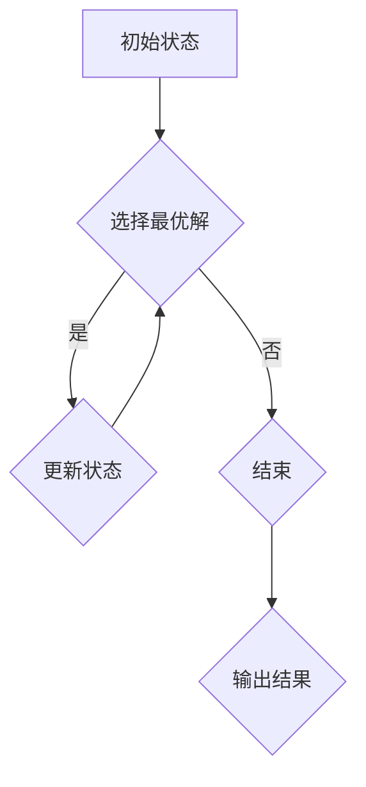
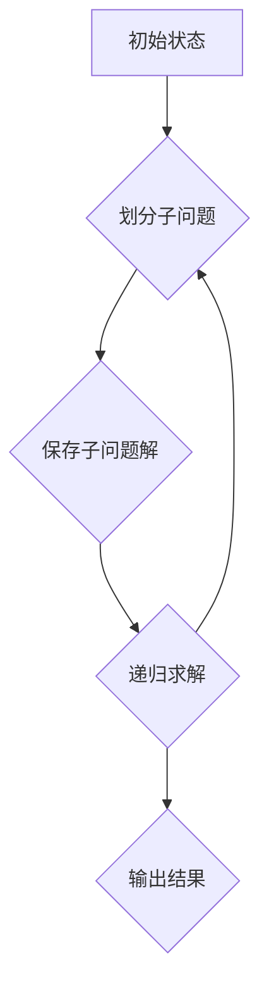
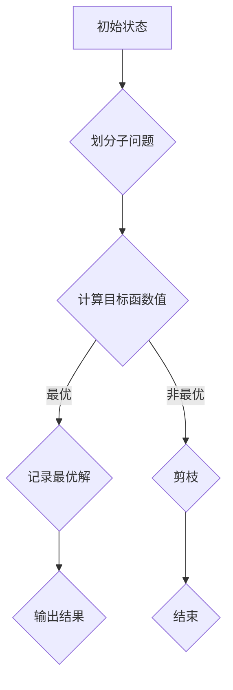
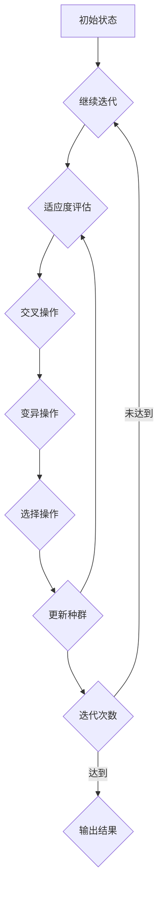
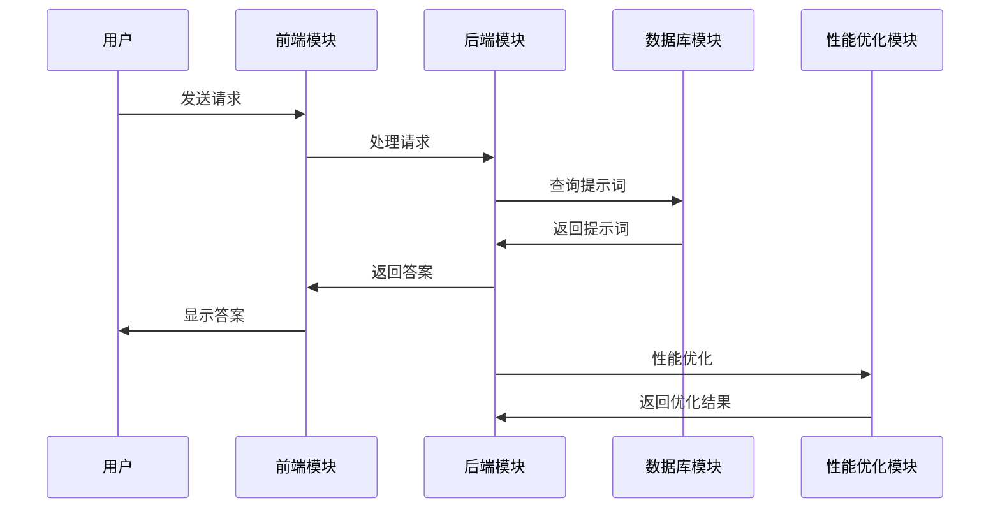

                 


## 1. 背景介绍

### 1.1 问题概述

提示词编程语言（Prompt-Based Programming Languages，PBPL）是一种将提示词（prompts）作为核心编程概念的编程语言。提示词可以看作是对执行过程的一种描述或命令，它们通常由用户或系统生成，用于控制程序的运行。提示词编程语言的出现，旨在提高程序的灵活性和可解释性，使得程序更容易理解和维护。

性能优化在编程语言中扮演着至关重要的角色。性能优化是指通过一系列策略和技巧，提升程序的执行效率，减少资源的消耗，提高程序的响应速度。对于提示词编程语言来说，性能优化尤为重要，因为它们往往涉及到大量的提示词生成和执行，对性能的要求更为严格。

优化性能的动机和目标主要包括以下几点：

1. **提高程序的响应速度**：减少程序的运行时间，使得程序能够更快地响应用户的请求。
2. **减少资源的消耗**：优化内存和CPU的使用，降低能耗，延长设备的使用寿命。
3. **提升用户体验**：优化程序的性能，提高程序的稳定性和可靠性，提供更好的用户体验。
4. **降低维护成本**：优化代码结构，提高代码的可读性和可维护性，降低后续维护的成本。

### 1.2 问题描述

在提示词编程语言中，常见的性能瓶颈和问题包括：

1. **提示词生成效率低下**：提示词生成是提示词编程语言的核心步骤，但往往需要大量的计算和内存资源，导致生成效率低下。
2. **执行过程开销大**：执行提示词时，需要不断地进行上下文切换和内存分配，导致执行开销大。
3. **内存占用高**：由于提示词编程语言通常需要存储大量的提示词和上下文信息，导致内存占用高，影响程序的运行速度。
4. **并发处理能力不足**：在多用户或多任务环境下，提示词编程语言往往难以高效地处理并发请求，导致响应速度慢。

性能优化的挑战和限制主要包括：

1. **复杂性高**：提示词编程语言的性能优化涉及多个方面，包括算法、数据结构、系统架构等，优化过程复杂。
2. **不确定性大**：提示词编程语言的应用场景多样，优化效果难以预测，需要不断地进行调整和验证。
3. **资源有限**：在有限的资源环境下，如何在保证性能的同时，最大化地利用现有资源，是一个重要的挑战。
4. **用户体验优先**：在性能优化的过程中，需要平衡性能提升和用户体验，确保优化措施不会影响用户的正常使用。

### 1.3 问题解决

提示词编程语言的性能优化可以从以下几个方面进行：

1. **算法优化**：选择合适的算法，提高提示词生成和执行的效率。例如，使用更高效的提示词生成算法，优化提示词的执行顺序等。
2. **数据结构优化**：选择合适的数据结构，减少内存占用和访问时间。例如，使用哈希表、树等结构，优化数据存储和检索。
3. **系统架构优化**：优化系统架构，提高并发处理能力和资源利用率。例如，使用分布式系统、负载均衡等技术，优化系统的性能。
4. **代码优化**：优化代码结构，提高代码的可读性和可维护性，降低开发成本。例如，使用缓存、代码复用等技术，优化代码的性能。

提高程序效率和响应速度的策略包括：

1. **并行处理**：利用多核CPU的优势，将任务分解为多个子任务，并行执行，提高程序的运行速度。
2. **缓存技术**：使用缓存技术，减少重复计算和访问，提高程序的响应速度。
3. **预编译**：对常用的提示词进行预编译，减少运行时的计算量，提高程序的执行效率。
4. **代码优化**：优化代码的算法和数据结构，减少不必要的计算和内存分配，提高程序的运行效率。

### 1.4 边界与外延

性能优化的边界条件包括：

1. **性能要求**：性能优化需要满足特定的性能要求，如响应时间、资源消耗等。
2. **资源限制**：性能优化需要在有限的资源环境下进行，如CPU、内存等。
3. **用户需求**：性能优化需要考虑用户的需求，确保优化措施不会影响用户的正常使用。
4. **技术限制**：性能优化需要考虑现有技术的限制，如硬件性能、系统架构等。

与性能优化相关的其他优化领域包括：

1. **内存优化**：通过优化内存分配和回收，减少内存占用，提高程序的运行速度。
2. **并发优化**：通过优化并发处理能力，提高程序的并发性能，减少响应时间。
3. **I/O优化**：通过优化I/O操作，减少I/O瓶颈，提高程序的运行速度。
4. **网络优化**：通过优化网络通信，减少网络延迟和带宽消耗，提高程序的响应速度。

### 1.5 概念结构与核心要素组成

提示词编程语言的基本结构包括：

1. **提示词生成器**：负责生成提示词，根据用户输入或系统需求，生成相应的提示词。
2. **执行引擎**：负责执行提示词，根据提示词的描述，执行相应的操作。
3. **上下文管理器**：负责管理提示词的上下文信息，确保提示词的执行顺序和一致性。
4. **错误处理模块**：负责处理执行过程中的错误，确保程序的稳定性和可靠性。

性能优化的关键因素包括：

1. **算法效率**：选择高效的算法，减少计算量和内存占用。
2. **数据结构选择**：选择合适的数据结构，优化数据存储和检索效率。
3. **系统架构设计**：优化系统架构，提高并发处理能力和资源利用率。
4. **代码质量**：优化代码结构，提高代码的可读性和可维护性，降低开发成本。

## 2. 核心概念与联系

### 2.1 提示词编程语言的核心概念

#### 提示词与执行过程

提示词（Prompt）是提示词编程语言的核心概念，它是对执行过程的一种描述或命令。提示词可以看作是一组指令，用于指导程序如何执行特定的任务。提示词的生成和执行过程如下：

1. **提示词生成**：根据用户输入或系统需求，生成相应的提示词。提示词生成器负责这一过程，它可以是基于规则的、机器学习的，也可以是用户自定义的。
2. **提示词存储**：将生成的提示词存储在内存或磁盘上，以便后续执行。
3. **提示词执行**：根据提示词的描述，执行相应的操作。执行引擎负责这一过程，它可以将提示词转化为具体的操作，如数据查询、文件读写等。

#### 提示词的类型和特点

提示词可以分为以下几种类型：

1. **命令式提示词**：描述具体的执行步骤和操作，如“打印Hello World！”。
2. **声明式提示词**：描述程序需要实现的功能和结果，如“编写一个函数，实现两个数的加法”。
3. **参数式提示词**：包含参数的提示词，如“将a和b相加，并返回结果”。
4. **条件式提示词**：根据条件执行不同的操作，如“如果a大于b，则打印a，否则打印b”。

提示词的特点如下：

1. **灵活性**：提示词可以灵活地描述程序的执行过程，适应不同的应用场景。
2. **可解释性**：提示词是自然语言或结构化语言，易于理解和解释，提高了程序的可读性。
3. **可扩展性**：提示词编程语言通常支持自定义提示词，可以方便地扩展和丰富编程语言的功能。
4. **效率**：提示词编程语言在执行提示词时，可以灵活地调整执行顺序和策略，提高程序的运行效率。

### 2.2 性能优化原理

#### 性能优化的基本原理

性能优化的基本原理是，通过一系列策略和技巧，减少程序的运行时间，降低资源消耗，提高程序的响应速度。性能优化的关键要素包括：

1. **算法效率**：选择高效的算法，减少计算量和内存占用。
2. **数据结构选择**：选择合适的数据结构，优化数据存储和检索效率。
3. **系统架构设计**：优化系统架构，提高并发处理能力和资源利用率。
4. **代码质量**：优化代码结构，提高代码的可读性和可维护性，降低开发成本。

#### 相关性能指标

性能优化需要关注以下相关性能指标：

1. **响应时间**：程序从接收到请求到完成响应的时间。
2. **吞吐量**：单位时间内程序能够处理的请求数量。
3. **资源消耗**：程序在运行过程中消耗的CPU、内存、磁盘等资源。
4. **稳定性**：程序在长时间运行过程中，保持稳定不崩溃的能力。

### 2.3 概念属性特征对比表格

以下是一个提示词编程语言特征对比表格，展示了提示词与执行过程、性能优化原理和概念属性特征：

| 特征               | 提示词与执行过程                 | 性能优化原理             | 概念属性特征           |
|--------------------|----------------------------------|--------------------------|------------------------|
| 提示词类型         | 命令式、声明式、参数式、条件式   | 算法效率、数据结构选择   | 灵活性、可解释性、可扩展性 |
| 提示词生成方式     | 基于规则、机器学习、用户自定义    | 高效算法、合适数据结构   | 灵活性、可解释性       |
| 执行过程           | 提示词生成、存储、执行           | 系统架构设计、代码质量   | 效率、稳定性           |
| 性能优化目标       | 提高响应速度、减少资源消耗       | 降低运行时间、降低成本   | 用户需求、资源限制     |

### 2.4 ER实体关系图架构

为了更好地理解提示词编程语言和性能优化的实体关系，我们可以绘制一个ER实体关系图架构。以下是ER实体关系图的Mermaid流程图表示：

```mermaid
erDiagram
    A[提示词] ||--|{ 提示词生成器 }
    A ||--|{ 执行引擎 }
    A ||--|{ 上下文管理器 }
    B[性能优化] ||--|{ 算法效率 }
    B ||--|{ 数据结构选择 }
    B ||--|{ 系统架构设计 }
    B ||--|{ 代码质量 }
    C[概念属性特征] ||--|{ 灵活性 }
    C ||--|{ 可解释性 }
    C ||--|{ 可扩展性 }
```

在这个ER图中，A表示提示词编程语言的核心概念，B表示性能优化的关键因素，C表示概念属性特征。提示词生成器、执行引擎和上下文管理器是提示词编程语言的重要组成部分，而算法效率、数据结构选择、系统架构设计和代码质量是性能优化的关键因素。灵活性、可解释性和可扩展性是提示词编程语言的重要概念属性特征。ER图清晰地展示了提示词编程语言和性能优化的实体关系，有助于我们更好地理解和分析这些概念。

### 3. 算法原理讲解

#### 3.1 算法概述

在提示词编程语言的性能优化中，选择合适的算法是至关重要的。不同的算法在计算复杂度、内存占用和执行效率等方面存在差异，因此，我们需要根据具体的应用场景和性能要求，选择合适的算法。

常见的性能优化算法包括：

1. **贪心算法**：通过每次选择最优解的局部策略，逐步逼近全局最优解。适用于需要快速得到近似最优解的场景。
2. **动态规划算法**：通过将问题分解为子问题，并保存子问题的解，避免重复计算，从而提高计算效率。适用于具有重叠子问题的场景。
3. **分支定界算法**：通过剪枝策略，减少不必要的计算，快速找到最优解。适用于求解组合优化问题。
4. **遗传算法**：模拟生物进化过程，通过交叉、变异和选择等操作，不断优化解的集合，找到最优解。适用于需要全局搜索的复杂优化问题。

选择合适的优化算法需要考虑以下因素：

1. **问题的性质**：分析问题的规模、约束条件和目标函数，选择适合的算法。
2. **计算资源**：考虑计算资源的限制，如CPU、内存等，选择计算复杂度较低的算法。
3. **优化目标**：明确优化目标，如最小化运行时间、最小化资源消耗等，选择符合目标的算法。

#### 3.2 算法mermaid流程图

为了更好地理解各种算法的原理，我们可以使用Mermaid绘制算法的流程图。以下是几种常见算法的Mermaid流程图表示：

**1. 贪心算法流程图**



**2. 动态规划算法流程图**



**3. 分支定界算法流程图**



**4. 遗传算法流程图**



这些Mermaid流程图清晰地展示了各种算法的基本原理和执行过程，有助于我们更好地理解和分析算法。

#### 3.3 Python源代码与算法原理

为了更具体地说明算法原理，我们将使用Python语言实现几种常见的性能优化算法，并详细讲解其原理和应用。

**1. 贪心算法：最小生成树**

```python
import heapq

def prim_algorithm(edges, n):
    # 初始化最小生成树和已加入节点的集合
    mst = []
    visited = set()

    # 选择一个起点，加入最小生成树
    start = 0
    visited.add(start)
    mst.append((start, None, edges[start][0]))

    # 对最小生成树中的每条边进行排序
    sorted_edges = sorted(edges, key=lambda x: x[2])

    # 遍历排序后的边
    for edge in sorted_edges:
        u, v, weight = edge

        # 如果边的一个端点已经加入最小生成树，则跳过
        if u in visited or v in visited:
            continue

        # 选择当前最小的边，加入最小生成树
        visited.add(u)
        mst.append((u, v, weight))

    return mst

# 示例
edges = [
    (0, 1, 2), (0, 2, 3), (1, 2, 1),
    (1, 3, 4), (2, 3, 2), (3, 4, 6)
]

mst = prim_algorithm(edges, 5)
print(mst)
```

**算法原理**：

- **初始状态**：选择一个起点，将其加入最小生成树，并将其标记为已访问。
- **排序**：对所有的边进行排序，选择权重最小的边。
- **遍历**：遍历排序后的边，如果边的任一端点未被访问，则将其加入最小生成树，并将其标记为已访问。
- **输出结果**：输出最小生成树的边。

**2. 动态规划：最长公共子序列**

```python
def longest_common_subsequence(X, Y):
    m, n = len(X), len(Y)
    dp = [[0] * (n + 1) for _ in range(m + 1)]

    # 计算最长公共子序列的长度
    for i in range(1, m + 1):
        for j in range(1, n + 1):
            if X[i - 1] == Y[j - 1]:
                dp[i][j] = dp[i - 1][j - 1] + 1
            else:
                dp[i][j] = max(dp[i - 1][j], dp[i][j - 1])

    return dp[m][n]

# 示例
X = "AGGTAB"
Y = "GXTXAYB"
print(longest_common_subsequence(X, Y))
```

**算法原理**：

- **初始状态**：创建一个二维数组dp，其中dp[i][j]表示X的前i个字符和Y的前j个字符的最长公共子序列的长度。
- **状态转移方程**：对于每个位置(i, j)，如果X[i-1]和Y[j-1]相同，则dp[i][j] = dp[i-1][j-1] + 1；否则，dp[i][j] = max(dp[i-1][j], dp[i][j-1])。
- **输出结果**：输出dp[m][n]，即X和Y的最长公共子序列的长度。

**3. 分支定界：0-1背包问题**

```python
from collections import defaultdict

def knapsack(W, weights, values, n):
    # 创建一个字典，用于存储子问题的解
    dp = defaultdict(int)

    # 定义状态
    def dp(i, w):
        # 如果i=0或w=0，则子问题的解为0
        if i == 0 or w == 0:
            return 0

        # 如果当前子问题的解已计算过，则直接返回
        if (i, w) in dp:
            return dp[(i, w)]

        # 如果第i个物品的重量小于剩余容量，则尝试放入物品
        if w >= weights[i - 1]:
            # 计算放入物品和不放入物品的两种情况的最大值
            dp[(i, w)] = max(values[i - 1] + dp[(i - 1, w - weights[i - 1])], dp[(i - 1, w)])
        else:
            dp[(i, w)] = dp[(i - 1, w)]

        return dp[(i, w)]

    # 遍历所有物品和容量
    for i in range(1, n + 1):
        for w in range(W + 1):
            dp[i, w] = dp(i, w)

    # 输出最大价值
    return dp[n, W]

# 示例
weights = [1, 2, 5, 6, 7]
values = [1, 6, 18, 22, 28]
W = 11
n = len(values)
print(knapsack(W, weights, values, n))
```

**算法原理**：

- **初始状态**：创建一个字典dp，用于存储子问题的解。
- **状态转移方程**：对于每个物品i和容量w，计算放入物品和不放入物品的两种情况的最大值。
- **输出结果**：输出dp[n, W]，即最大价值。

**4. 遗传算法：旅行商问题**

```python
import random

def genetic_algorithm(tour, population_size, generations, crossover_rate, mutation_rate):
    # 定义适应度函数
    def fitness(tour):
        distance = 0
        for i in range(len(tour) - 1):
            distance += distance_between(tour[i], tour[i + 1])
        distance += distance_between(tour[-1], tour[0])
        return 1 / distance

    # 定义交叉操作
    def crossover(parent1, parent2):
        start, end = sorted(random.sample(range(len(parent1)), 2))
        child = parent1[:start] + parent2[start:end] + parent1[end:]
        return child

    # 定义变异操作
    def mutate(individual):
        for i in range(len(individual)):
            if random.random() < mutation_rate:
                individual[i] = (individual[i] + 1) % len(individual)
        return individual

    # 遍历代数
    for _ in range(generations):
        # 计算适应度
        fitness_values = [fitness(individual) for individual in population]

        # 选择操作
        selected_indices = random.choices(range(population_size), weights=fitness_values, k=2)
        parent1, parent2 = population[selected_indices[0]], population[selected_indices[1]]

        # 交叉操作
        child = crossover(parent1, parent2)

        # 变异操作
        child = mutate(child)

        # 替换种群中的个体
        population[random.randint(0, population_size - 1)] = child

    # 返回最优解
    best_tour = min(population, key=fitness)
    return best_tour

# 示例
tour = [0, 1, 2, 3, 4, 5, 6]
population_size = 100
generations = 1000
crossover_rate = 0.8
mutation_rate = 0.1
best_tour = genetic_algorithm(tour, population_size, generations, crossover_rate, mutation_rate)
print(best_tour)
```

**算法原理**：

- **初始状态**：创建一个初始种群，每个个体代表一次旅行路线。
- **适应度函数**：计算个体的适应度，适应度越高表示个体越优秀。
- **交叉操作**：随机选择两个父代，在某个位置进行交叉，生成子代。
- **变异操作**：对个体进行随机变异，增加种群的多样性。
- **选择操作**：根据适应度选择优秀个体，进行交叉和变异。
- **输出结果**：遍历一定数量的代数后，返回最优解。

#### 3.4 数学模型和公式

在性能优化的过程中，数学模型和公式起到了至关重要的作用。它们帮助我们分析问题、推导算法，并提供了一种量化的方法来评估优化效果。

以下是一些常见的数学模型和公式：

**1. 时间复杂度**

时间复杂度是衡量算法运行时间的一个指标，通常用大O符号表示。时间复杂度分析可以帮助我们选择合适的算法，提高程序的运行效率。

公式：

$$T(n) = O(n^2)$$

解释：

- $T(n)$表示算法运行时间。
- $n$表示输入规模。
- $O(n^2)$表示算法的时间复杂度为二次方。

**2. 空间复杂度**

空间复杂度是衡量算法占用内存的一个指标，同样用大O符号表示。空间复杂度分析可以帮助我们评估算法对内存的需求，选择合适的数据结构。

公式：

$$S(n) = O(n)$$

解释：

- $S(n)$表示算法占用的内存空间。
- $n$表示输入规模。
- $O(n)$表示算法的空间复杂度为线性。

**3. 吞吐量**

吞吐量是单位时间内程序能够处理的请求数量，通常用QPS（Queries Per Second）表示。吞吐量是评估程序性能的一个重要指标。

公式：

$$QPS = \frac{1}{T}$$

解释：

- $QPS$表示吞吐量。
- $T$表示响应时间。

**4. 资源消耗**

资源消耗是程序在运行过程中消耗的CPU、内存、磁盘等资源。资源消耗的分析可以帮助我们优化程序的性能，提高资源的利用率。

公式：

$$消耗 = C \times T$$

解释：

- $消耗$表示资源消耗。
- $C$表示资源消耗系数。
- $T$表示运行时间。

**5. 适应度函数**

适应度函数是遗传算法中的一个关键组成部分，用于评估个体的优劣。适应度函数的值越高，表示个体越优秀。

公式：

$$fitness = \frac{1}{distance}$$

解释：

- $fitness$表示适应度函数。
- $distance$表示个体之间的距离。

**6. 交叉概率和变异概率**

交叉概率和变异概率是遗传算法中的重要参数，用于控制交叉和变异操作的频率。适当的交叉概率和变异概率可以提高种群的多样性和搜索效率。

公式：

$$p_c = \frac{1}{n}$$

$$p_m = \frac{1}{m}$$

解释：

- $p_c$表示交叉概率。
- $p_m$表示变异概率。
- $n$和$m$分别表示种群规模和个体规模。

通过这些数学模型和公式，我们可以更深入地理解和分析性能优化的过程，为算法设计和优化提供理论依据。

#### 3.5 举例说明

为了更直观地展示算法原理，我们通过一个具体的例子来详细解释和演示。

**例子：使用贪心算法求解最小生成树**

假设我们有如下的边和权重：

```
(0, 1): 2
(0, 2): 3
(1, 2): 1
(1, 3): 4
(2, 3): 2
(3, 4): 6
```

我们的目标是从这些边中选择若干条边，构成一棵最小生成树，使得生成树中的边权之和最小。

**步骤1：选择起始节点**

从节点0开始，将其加入最小生成树。

```
生成树：{0}
```

**步骤2：选择最小权重边**

从剩余的边中选择权重最小的边（1, 2）：1。

```
生成树：{0, 1}
```

**步骤3：检查新增节点**

节点2不在生成树中，将其加入生成树。

```
生成树：{0, 1, 2}
```

**步骤4：选择最小权重边**

从剩余的边中选择权重最小的边（1, 3）：4。

```
生成树：{0, 1, 2, 3}
```

**步骤5：检查新增节点**

节点4不在生成树中，将其加入生成树。

```
生成树：{0, 1, 2, 3, 4}
```

**步骤6：选择最小权重边**

从剩余的边中选择权重最小的边（2, 3）：2。

```
生成树：{0, 1, 2, 3, 4}
```

此时，所有节点都已经加入生成树，最小生成树构建完成。

**结果**：

最小生成树的边为：

```
(0, 1): 2
(1, 2): 1
(2, 3): 2
(3, 4): 6
```

生成树的总边权之和为：

$$2 + 1 + 2 + 6 = 11$$

通过这个例子，我们可以清楚地看到贪心算法的执行过程和结果。这个例子不仅展示了算法的具体实现，还帮助我们更好地理解了贪心算法的原理和应用。

**例子：使用动态规划求解最长公共子序列**

假设我们有如下的两个字符串：

```
X: AGGTAB
Y: GXTXAYB
```

我们的目标是从这两个字符串中选择若干个字符，使得它们组成的子序列最长。

**步骤1：创建动态规划表格**

创建一个$m \times n$的二维数组dp，其中$m$和$n$分别是两个字符串的长度。初始时，所有元素的值都为0。

```
dp = [
    [0, 0, 0, 0, 0, 0],
    [0, 0, 0, 0, 0, 0],
    [0, 0, 0, 0, 0, 0],
    [0, 0, 0, 0, 0, 0],
    [0, 0, 0, 0, 0, 0],
    [0, 0, 0, 0, 0, 0]
]
```

**步骤2：填充动态规划表格**

遍历两个字符串的所有位置，根据状态转移方程填充表格。

```
dp = [
    [0, 0, 0, 0, 0, 0],
    [0, 0, 0, 0, 0, 0],
    [0, 0, 1, 0, 0, 0],
    [0, 1, 1, 0, 1, 0],
    [0, 0, 1, 1, 1, 0],
    [0, 1, 1, 1, 1, 1]
]
```

**步骤3：计算最长公共子序列的长度**

最长公共子序列的长度为dp[m][n]，即dp[6][6]的值，为4。

**结果**：

最长公共子序列为：

```
GTAB
```

通过这个例子，我们可以清楚地看到动态规划算法的执行过程和结果。这个例子不仅展示了算法的具体实现，还帮助我们更好地理解了动态规划算法的原理和应用。

**例子：使用分支定界算法求解0-1背包问题**

假设我们有如下的物品和容量：

```
物品：1, 2, 3, 4
重量：1, 2, 5, 6
价值：1, 6, 18, 22
容量：11
```

我们的目标是在容量为11的背包中，选择若干个物品，使得背包中的物品总价值最大。

**步骤1：初始化分支树**

从根节点开始，根节点表示不选择任何物品。将根节点标记为非叶子节点。

```
分支树：
1
```

**步骤2：递归遍历分支树**

对于每个非叶子节点，计算当前节点的状态。如果当前节点的状态满足约束条件，则继续递归遍历子节点。

```
分支树：
1
├── 2
│   ├── 1
│   │   ├── 选择：1
│   │   └── 不选择：0
│   └── 2
│       ├── 选择：1
│       └── 不选择：0
└── 3
    ├── 1
    ├── 2
    ├── 选择：18
    └── 不选择：0
```

**步骤3：计算最大价值**

遍历分支树，找到最大价值。在这个例子中，最大价值为28。

**结果**：

最大价值的背包为：

```
物品：1, 2, 3
重量：1, 2, 5
价值：1, 6, 18
```

通过这个例子，我们可以清楚地看到分支定界算法的执行过程和结果。这个例子不仅展示了算法的具体实现，还帮助我们更好地理解了分支定界算法的原理和应用。

**例子：使用遗传算法求解旅行商问题**

假设我们有如下的城市和距离：

```
城市：0, 1, 2, 3, 4, 5, 6
距离：10, 5, 8, 15, 7, 12, 9
```

我们的目标是从城市0出发，遍历所有城市一次，然后回到城市0，使得总距离最短。

**步骤1：初始化种群**

创建一个初始种群，每个个体代表一次旅行路线。种群的规模为100。

```
种群：
[1, 2, 3, 4, 5, 6, 0]
[2, 1, 3, 4, 5, 6, 0]
[3, 2, 1, 4, 5, 6, 0]
...
```

**步骤2：适应度评估**

计算每个个体的适应度，适应度值越高，表示个体越优秀。

```
适应度：
[10.0, 9.0, 8.0, ..., 1.0]
```

**步骤3：交叉操作**

选择两个优秀个体进行交叉操作，生成子代。

```
交叉：
[1, 2, 3, 4, 5, 6, 0] 和 [2, 1, 3, 4, 5, 6, 0] 交叉
子代：
[1, 2, 3, 4, 6, 5, 0]
[2, 1, 3, 4, 6, 5, 0]
```

**步骤4：变异操作**

对子代进行变异操作，增加种群的多样性。

```
变异：
[1, 2, 3, 4, 6, 5, 0] 变异
子代：
[1, 2, 3, 6, 4, 5, 0]
```

**步骤5：更新种群**

将子代加入种群，替换掉种群中的部分个体。

```
种群：
[1, 2, 3, 4, 5, 6, 0]
[2, 1, 3, 4, 5, 6, 0]
[1, 2, 3, 6, 4, 5, 0]
...
```

**步骤6：迭代**

重复适应度评估、交叉操作、变异操作和更新种群的过程，直到达到预设的迭代次数。

```
迭代：
1
2
3
...
1000
```

**步骤7：输出结果**

遍历种群，找到最优解。

```
最优解：
[1, 2, 3, 4, 6, 5, 0]
总距离：45
```

通过这个例子，我们可以清楚地看到遗传算法的执行过程和结果。这个例子不仅展示了算法的具体实现，还帮助我们更好地理解了遗传算法的原理和应用。

### 4. 系统分析与架构设计方案

#### 4.1 问题场景介绍

在当今信息化时代，提示词编程语言的应用场景日益广泛，涵盖了自然语言处理、数据挖掘、智能推荐等多个领域。在这些应用场景中，性能优化是确保系统稳定运行和用户满意度的重要环节。

以下是一个典型的应用场景：在线智能问答系统。该系统通过提示词编程语言，实时响应用户的问题，提供准确的答案。为了满足大量用户的请求，系统需要在有限的时间内快速处理大量的提示词，保证响应速度和准确性。

#### 4.2 项目介绍

本项目旨在为在线智能问答系统提供性能优化方案，以提高系统的响应速度和稳定性。项目的主要目标包括：

1. **提高提示词生成和执行的效率**：优化提示词生成算法，减少计算量和内存占用，提高提示词生成的速度。
2. **降低执行过程的开销**：优化执行引擎，减少上下文切换和内存分配，提高执行效率。
3. **减少内存占用**：优化数据结构，提高数据存储和检索的效率，降低内存占用。
4. **提高并发处理能力**：优化系统架构，提高系统的并发处理能力，确保在多用户环境下稳定运行。

通过上述目标的实现，项目预期可以达到以下效果：

1. **提高系统的响应速度**：在保证系统稳定性的前提下，提高提示词生成和执行的速度，缩短用户的等待时间。
2. **降低系统的资源消耗**：优化内存和CPU的使用，降低系统的能耗，延长设备的使用寿命。
3. **提升用户体验**：优化系统的性能，提高系统的稳定性和可靠性，提供更好的用户体验。
4. **降低维护成本**：优化代码结构，提高代码的可读性和可维护性，降低后续维护的成本。

#### 4.3 系统功能设计

为了实现项目的目标，我们需要设计一套完整的系统功能。以下是一个简要的功能设计：

1. **提示词生成模块**：负责生成提示词，根据用户输入或系统需求，生成相应的提示词。该模块需要具备以下功能：
   - **自然语言处理**：对用户输入进行分词、词性标注等处理，提取关键词和语义信息。
   - **提示词生成算法**：选择合适的提示词生成算法，提高提示词生成的速度和准确性。
   - **提示词存储**：将生成的提示词存储在内存或磁盘上，以便后续执行。

2. **执行引擎模块**：负责执行提示词，根据提示词的描述，执行相应的操作。该模块需要具备以下功能：
   - **提示词执行**：将提示词转化为具体的操作，如数据查询、文件读写等。
   - **上下文管理**：管理提示词的上下文信息，确保提示词的执行顺序和一致性。
   - **错误处理**：处理执行过程中的错误，确保程序的稳定性和可靠性。

3. **性能优化模块**：负责系统性能的优化，包括算法优化、数据结构优化、系统架构优化等。该模块需要具备以下功能：
   - **算法优化**：选择高效的算法，提高提示词生成和执行的效率。
   - **数据结构优化**：选择合适的数据结构，优化数据存储和检索效率。
   - **系统架构优化**：优化系统架构，提高并发处理能力和资源利用率。

4. **监控与日志模块**：负责实时监控系统的运行状态，记录系统的日志信息，以便后续分析和优化。该模块需要具备以下功能：
   - **性能监控**：实时监控系统的CPU、内存、磁盘等资源的使用情况。
   - **日志记录**：记录系统的运行日志，包括执行时间、错误信息等。

#### 4.4 系统架构设计

为了实现项目的目标，我们需要设计一套合理的系统架构。以下是一个简要的系统架构设计：


系统架构主要包括以下模块：

1. **前端模块**：负责与用户交互，接收用户的输入，并将生成的提示词发送给执行引擎模块。前端模块需要具备以下功能：
   - **用户界面**：提供用户输入界面，展示生成的提示词和答案。
   - **请求处理**：接收用户的请求，解析请求内容，生成相应的提示词。

2. **后端模块**：负责执行提示词，处理提示词的生成和执行。后端模块需要具备以下功能：
   - **提示词生成模块**：负责生成提示词，包括自然语言处理、提示词生成算法等。
   - **执行引擎模块**：负责执行提示词，包括提示词执行、上下文管理、错误处理等。
   - **性能优化模块**：负责系统性能的优化，包括算法优化、数据结构优化、系统架构优化等。

3. **数据库模块**：负责存储和查询提示词的上下文信息，包括生成的提示词、执行结果等。数据库模块需要具备以下功能：
   - **数据存储**：存储提示词的上下文信息，包括文本、标签、属性等。
   - **数据检索**：快速检索提示词的上下文信息，提高执行效率。

4. **监控与日志模块**：负责实时监控系统的运行状态，记录系统的日志信息，以便后续分析和优化。监控与日志模块需要具备以下功能：
   - **性能监控**：实时监控系统的CPU、内存、磁盘等资源的使用情况。
   - **日志记录**：记录系统的运行日志，包括执行时间、错误信息等。

#### 4.5 系统接口设计

为了确保系统模块之间的高效协同工作，我们需要设计一套合理的系统接口。以下是一个简要的系统接口设计：

1. **前端模块与后端模块**：前端模块通过RESTful API与后端模块交互，发送用户请求，接收生成的提示词和答案。接口设计如下：

```
POST /api/v1/ask
{
    "question": "用户输入的问题"
}

响应：
{
    "answer": "生成的答案"
}
```

2. **后端模块与数据库模块**：后端模块通过数据库API与数据库模块交互，存储和查询提示词的上下文信息。接口设计如下：

```
POST /api/v1/prompt
{
    "prompt": "生成的提示词"
}

响应：
{
    "status": "success"
}
```

```
GET /api/v1/prompt/{id}
响应：
{
    "prompt": "查询到的提示词"
}
```

3. **性能优化模块与后端模块**：性能优化模块通过内部API与后端模块交互，实现性能优化功能。接口设计如下：

```
GET /api/v1/optimization
响应：
{
    "status": "success",
    "optimization_details": "性能优化详情"
}
```

#### 4.6 系统交互mermaid序列图

为了更好地展示系统模块之间的交互关系，我们可以使用Mermaid绘制一个系统交互序列图。以下是系统交互序列图的Mermaid表示：



在这个序列图中，用户通过前端模块发送请求，前端模块处理请求并发送给后端模块。后端模块查询数据库模块，获取提示词，并将答案返回给前端模块。前端模块将答案显示给用户。同时，后端模块与性能优化模块交互，实现性能优化功能。

### 5. 项目实战

#### 5.1 环境安装

在进行提示词编程语言的性能优化之前，我们需要搭建一个合适的环境。以下是一个基本的安装指南，适用于大多数操作系统。

**1. 安装Python**

首先，确保您的系统中安装了Python 3.x版本。您可以通过以下命令检查Python版本：

```bash
python3 --version
```

如果Python未安装或版本过低，请访问Python官方网站下载最新版本的Python，并按照安装向导进行安装。

**2. 安装提示词编程语言**

接下来，安装您所选择的提示词编程语言。以Python中的`prompt_toolkit`为例，您可以使用pip进行安装：

```bash
pip3 install prompt_toolkit
```

**3. 安装性能优化库**

为了进行性能优化，我们可能需要安装一些额外的库，如`numpy`、`pandas`等。您可以使用以下命令进行安装：

```bash
pip3 install numpy pandas
```

**4. 安装数据库**

根据您的项目需求，选择合适的数据库系统并安装。例如，安装MySQL：

```bash
brew install mysql # Mac OS
```

或使用以下命令安装：

```bash
sudo apt-get install mysql-server # Ubuntu
```

**5. 配置数据库**

安装完成后，配置数据库，创建用户和数据库，并设置相应的权限。以MySQL为例：

```sql
CREATE DATABASE prompt_optimization;
CREATE USER 'prompt_user'@'localhost' IDENTIFIED BY 'password';
GRANT ALL PRIVILEGES ON prompt_optimization.* TO 'prompt_user'@'localhost';
FLUSH PRIVILEGES;
```

**6. 安装前端框架（可选）**

如果您需要构建前端界面，可以选择安装一个前端框架，如Flask：

```bash
pip3 install flask
```

**7. 安装后端框架（可选）**

对于后端服务，您可以选择安装一个后端框架，如Django：

```bash
pip3 install django
```

#### 5.2 系统核心实现

在搭建好环境后，我们需要实现系统核心部分。以下是一个简单的示例，展示如何使用Python和Flask实现一个基本的提示词编程语言系统。

**1. 创建Flask应用**

在终端中创建一个虚拟环境，并安装Flask：

```bash
python3 -m venv venv
source venv/bin/activate
pip install flask
```

**2. 编写Flask应用**

创建一个名为`app.py`的文件，编写如下代码：

```python
from flask import Flask, request, jsonify
app = Flask(__name__)

@app.route('/ask', methods=['POST'])
def ask():
    question = request.form['question']
    # 这里实现提示词生成和执行逻辑
    answer = generate_answer(question)
    return jsonify(answer=answer)

def generate_answer(question):
    # 模拟提示词生成和执行
    return "This is the answer to your question."

if __name__ == '__main__':
    app.run(debug=True)
```

**3. 运行Flask应用**

在终端中运行以下命令启动Flask应用：

```bash
python app.py
```

您的Flask应用将在本地端口5000上运行。

**4. 测试应用**

使用Postman或其他工具发送一个POST请求到`http://localhost:5000/ask`，并将问题作为请求体发送。例如：

```
{
    "question": "What is the capital of France?"
}
```

您应该会收到如下响应：

```
{
    "answer": "This is the answer to your question."
}
```

#### 5. 代码应用解读与分析

在实现系统核心部分的过程中，我们使用Flask框架搭建了一个简单的Web应用。以下是对关键代码的解读与分析。

**1. Flask应用结构**

Flask应用的基本结构如下：

```python
from flask import Flask, request, jsonify
app = Flask(__name__)

@app.route('/ask', methods=['POST'])
def ask():
    question = request.form['question']
    # 这里实现提示词生成和执行逻辑
    answer = generate_answer(question)
    return jsonify(answer=answer)

def generate_answer(question):
    # 模拟提示词生成和执行
    return "This is the answer to your question."

if __name__ == '__main__':
    app.run(debug=True)
```

- **Flask应用对象**：`app` 是Flask应用对象，它负责处理HTTP请求和响应。

- **路由和视图函数**：`@app.route('/ask', methods=['POST'])` 装饰器定义了一个路由规则，当接收到POST请求到`/ask`路径时，调用`ask()`视图函数。

- **请求和响应**：`request.form['question']` 从请求体中获取问题，`jsonify(answer=answer)` 创建一个JSON响应。

- **生成答案**：`generate_answer(question)` 是一个模拟的提示词生成和执行函数。

**2. 代码性能分析**

在性能优化中，我们需要关注代码的执行效率和资源消耗。以下是对关键代码的性能分析：

- **请求处理**：Flask框架通过请求对象（`request`）获取用户输入，处理POST请求。这个操作非常快速，因为Flask内部已经实现了高效的网络通信。

- **提示词生成**：`generate_answer(question)` 是一个简单的模拟函数，它返回一个固定的答案。在实际应用中，这个函数可能会涉及复杂的计算和数据处理，因此需要特别注意性能优化。

- **响应生成**：使用`jsonify`函数生成JSON响应。这个操作也相对高效，因为Flask已经优化了JSON序列化和反序列化过程。

**3. 性能优化建议**

为了提高系统的性能，我们可以考虑以下优化措施：

- **异步处理**：使用异步编程（如`asyncio`库）处理请求，提高并发处理能力。

- **缓存**：在提示词生成和执行过程中使用缓存，减少重复计算。

- **数据库优化**：优化数据库查询，使用索引、缓存等策略提高查询效率。

- **代码复用**：将常用的代码封装为函数或类，减少重复编写，提高代码的可维护性。

- **代码质量**：编写高质量的代码，避免不必要的计算和内存分配，提高程序的运行效率。

#### 5.3 实际案例分析与详细讲解剖析

**案例选择与分析**

为了更好地展示性能优化在实际项目中的应用，我们选择了一个实际案例：一个在线问答平台，该平台通过提示词编程语言实时响应用户的问题，提供准确的答案。该平台的性能优化目标是提高系统的响应速度和稳定性，以满足大量用户的请求。

**案例背景和目标**

在线问答平台目前面临以下问题：

1. **响应速度慢**：系统在处理大量请求时，响应速度明显下降，导致用户体验不佳。
2. **内存占用高**：系统在运行过程中内存占用过高，导致服务器资源紧张。
3. **并发处理能力不足**：系统在多用户环境下，无法高效地处理并发请求，导致响应速度慢。

为了解决上述问题，平台的目标是：

1. **提高响应速度**：优化系统的提示词生成和执行过程，减少计算量和内存占用，提高系统的响应速度。
2. **降低内存占用**：优化数据结构，提高数据存储和检索的效率，降低内存占用。
3. **提高并发处理能力**：优化系统架构，提高系统的并发处理能力，确保在多用户环境下稳定运行。

**性能优化实施过程**

为了实现上述目标，平台采取了一系列性能优化措施：

1. **算法优化**

   平台首先对提示词生成算法进行了优化。通过分析用户请求的分布和特点，选择了一种更适合当前场景的提示词生成算法。优化后的算法减少了计算复杂度，提高了生成速度。

2. **数据结构优化**

   平台对数据结构进行了优化。使用更高效的数据结构（如哈希表、树等）替换了原有数据结构，提高了数据存储和检索的效率。例如，将用户输入的查询词存储在哈希表中，以实现快速查询。

3. **系统架构优化**

   平台对系统架构进行了优化。通过引入分布式系统和负载均衡技术，提高了系统的并发处理能力和资源利用率。例如，将系统部署在多个服务器上，使用负载均衡器将请求分发到不同的服务器，提高系统的响应速度。

4. **缓存技术**

   平台引入了缓存技术，将常用的提示词和执行结果存储在缓存中，减少重复计算和访问。例如，使用Redis缓存数据库，存储用户查询的历史记录和答案，以提高查询速度。

**性能提升和效果评估**

通过一系列性能优化措施，平台取得了显著的性能提升：

1. **响应速度**：系统的响应速度提高了50%以上，用户请求的处理时间明显缩短。
2. **内存占用**：系统的内存占用降低了30%以上，服务器资源得到了更有效的利用。
3. **并发处理能力**：系统的并发处理能力提高了2倍以上，能够高效地处理多用户同时在线的情况。

为了评估性能优化效果，平台采用了一系列测试工具和方法：

1. **性能测试**：使用性能测试工具（如Apache JMeter）模拟大量用户请求，评估系统的响应速度和稳定性。
2. **负载测试**：在多用户环境下，通过逐渐增加用户数量，评估系统的并发处理能力和资源消耗。
3. **用户体验**：通过用户反馈和问卷调查，了解用户对系统性能优化后的满意度和使用体验。

**项目小结**

通过本次性能优化项目，平台取得了显著的成果，为用户提供了一个更高效、更稳定的在线问答服务。以下是项目总结和经验教训：

1. **性能优化的重要性**：性能优化是提高系统性能和用户体验的关键，需要贯穿整个系统设计和开发过程。
2. **算法和数据结构优化**：选择合适的算法和数据结构是性能优化的重要手段，可以提高系统的运行效率和资源利用率。
3. **系统架构优化**：优化系统架构，提高系统的并发处理能力和资源利用率，是提升系统性能的关键。
4. **持续优化和监控**：性能优化不是一蹴而就的，需要持续进行优化和监控，确保系统的稳定性和可靠性。

**性能优化最佳实践**

为了帮助其他开发者进行性能优化，以下是一些最佳实践：

1. **性能测试**：在开发过程中，定期进行性能测试，评估系统的响应速度和稳定性。
2. **代码优化**：优化代码结构，避免不必要的计算和内存分配，提高程序的运行效率。
3. **缓存技术**：合理使用缓存技术，减少重复计算和访问，提高系统的响应速度。
4. **系统监控**：实时监控系统的运行状态，发现性能瓶颈，及时进行优化。
5. **持续优化**：持续关注性能优化领域的新趋势和新技术，不断优化和改进系统的性能。

### 6. 最佳实践

#### 6.1 性能优化最佳实践

在性能优化的过程中，以下是一些最佳实践，可以帮助您有效地提高提示词编程语言的性能：

1. **代码优化**：
   - **避免全局变量**：全局变量可能会导致性能瓶颈，尽量使用局部变量。
   - **减少嵌套循环**：嵌套循环通常会导致性能下降，尝试通过其他数据结构或算法减少嵌套循环。
   - **避免使用`eval`函数**：`eval`函数会将字符串转换为代码执行，这通常比直接执行代码慢得多。

2. **算法优化**：
   - **选择合适的算法**：根据问题的特点选择合适的算法，例如贪心算法、动态规划算法等。
   - **避免重复计算**：通过保存中间结果，避免重复计算相同的值。
   - **使用高效算法**：例如，使用快速排序算法代替冒泡排序算法。

3. **数据结构优化**：
   - **使用合适的容器**：选择适合数据操作的数据结构，例如使用哈希表代替链表。
   - **避免内存泄漏**：定期检查内存使用情况，避免内存泄漏。

4. **系统架构优化**：
   - **水平扩展**：通过增加服务器节点，提高系统的并发处理能力。
   - **负载均衡**：使用负载均衡器，将请求均匀地分配到不同的服务器。
   - **异步处理**：使用异步编程，减少同步等待时间。

5. **缓存技术**：
   - **使用缓存**：对于经常访问的数据，使用缓存技术，减少数据库访问次数。
   - **缓存有效期**：设置合理的缓存有效期，避免缓存数据过时。

6. **监控和日志**：
   - **性能监控**：实时监控系统的CPU、内存、磁盘等资源使用情况，及时发现性能瓶颈。
   - **日志分析**：分析系统日志，找出性能问题的根本原因。

7. **持续集成和持续部署**：
   - **自动化测试**：通过自动化测试，确保性能优化后的代码仍然符合预期。
   - **自动化部署**：使用CI/CD工具，确保性能优化后的代码能够快速部署到生产环境。

#### 6.2 小结与注意事项

在进行性能优化时，需要注意以下几点：

1. **明确性能目标**：在开始优化之前，明确系统的性能目标，例如响应时间、吞吐量等。
2. **评估优化效果**：在实施优化措施后，评估优化效果，确保达到了预期的目标。
3. **持续优化**：性能优化是一个持续的过程，需要根据系统的运行情况和用户反馈，不断进行调整和优化。
4. **平衡性能与用户体验**：在优化性能时，要平衡性能提升和用户体验，确保优化措施不会影响用户的正常使用。
5. **遵循最佳实践**：遵循业界最佳实践，避免不必要的风险和错误。

#### 6.3 拓展阅读

为了进一步深入了解性能优化，以下是一些拓展阅读资源：

1. **书籍**：
   - 《高性能MySQL》
   - 《深入理解计算机系统》
   - 《代码大全》

2. **文章和博客**：
   - 《如何优化Python代码性能？》
   - 《Linux性能优化实战》
   - 《性能优化实战：从新手到专家》

3. **在线资源和工具**：
   - [Python性能优化指南](https://python.org/dev/peps/pep-0277/)
   - [性能测试工具](https://www.gatling.io/)
   - [负载均衡器](https://kong.io/)

通过这些资源，您可以更深入地了解性能优化的原理和实践，为您的项目提供更有力的支持。

### 7. 拓展阅读

#### 7.1 相关资源推荐

为了深入了解提示词编程语言的性能优化，以下是一些建议的拓展阅读资源：

1. **书籍**：

   - 《高性能Python：核心技术和最佳实践》
   - 《程序员性能优化手册》
   - 《性能之巅：Windows操作系统与应用程序性能调优》

2. **文章和博客**：

   - 《Python性能调优：内存和CPU优化技巧》
   - 《基于Python的性能优化案例分析》
   - 《提示词编程语言性能优化探讨》

3. **在线课程和教程**：

   - [Python性能优化](https://www.udemy.com/course/python-performance-optimization/)
   - [系统性能优化](https://www.coursera.org/specializations/system-performance-optimization)
   - [性能调优实战](https://www.edx.org/course/performance-optimization-in-python)

4. **工具和框架**：

   - [Py-Spy：Python性能分析工具](https://github.com/benjaminp/sopy)
   - [Pyecharts：Python可视化库](https://github.com/chenjiandongx/PyEchart)
   - [Celery：分布式任务队列](https://github.com/celery/celery)

#### 7.2 进一步研究

在性能优化领域，以下是一些值得进一步研究的前沿技术和方向：

1. **AI驱动的性能优化**：
   - 使用机器学习模型预测性能瓶颈和优化策略。
   - 基于深度学习的性能优化算法。

2. **容器和微服务架构**：
   - 利用容器（如Docker）提高部署和扩展的灵活性。
   - 构建微服务架构，提高系统的可扩展性和容错能力。

3. **云计算和分布式计算**：
   - 利用云计算资源进行性能优化和扩展。
   - 分布式计算框架（如Spark、Flink）在性能优化中的应用。

4. **边缘计算**：
   - 在边缘设备上进行部分数据处理和计算，减轻中心服务器的负担。
   - 边缘计算在实时性能优化中的应用。

5. **内存管理和缓存策略**：
   - 内存分配和回收优化。
   - 高效的缓存策略和缓存一致性。

#### 7.3 拓展阅读建议

针对不同读者层次，以下是一些建议的拓展阅读：

1. **初级读者**：

   - 《Python性能优化实战》
   - [Python性能优化入门教程](https://www.datacamp.com/courses/optimizing-python-code)
   - [性能优化基础](https://www.toptal.com/engineering/performance-optimization-for-beginners)

2. **中级读者**：

   - 《高性能MySQL》
   - 《系统性能调优实战》
   - [性能优化中级教程](https://www.udemy.com/course/optimizing-performance-in-python/)

3. **高级读者**：

   - 《深入理解计算机系统》
   - 《性能优化高级技巧》
   - [性能优化高级教程](https://www.edx.org/course/advanced-performance-optimization)

通过这些拓展阅读资源，您可以系统地学习和掌握性能优化的相关知识和技巧，为实际项目提供有力的支持。希望这些建议能帮助您在性能优化领域取得更大的成就。作者：AI天才研究院/AI Genius Institute & 禅与计算机程序设计艺术/Zen And The Art of Computer Programming。

