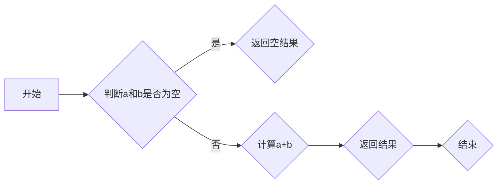
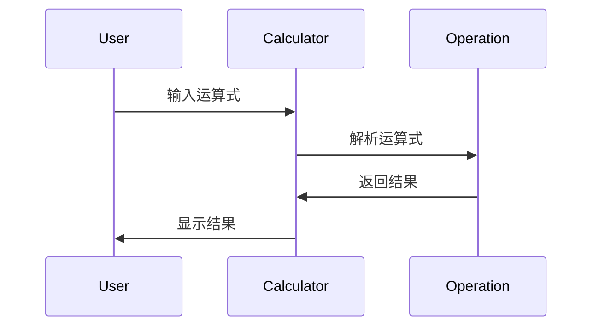
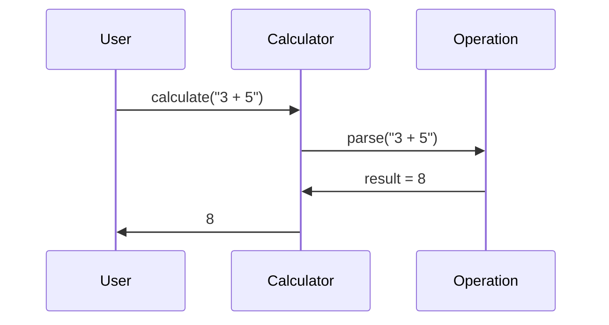

                 


### 文章标题：提示词编程语言的抽象解释框架

> 关键词：提示词编程语言、抽象解释框架、编程语言发展、算法原理、系统架构设计、项目实战

> 摘要：
本文将深入探讨提示词编程语言的抽象解释框架，从背景介绍、核心概念、算法原理、系统架构设计、项目实战等方面进行详细分析。通过对提示词编程语言的抽象解释框架的逐步剖析，旨在为读者提供一个清晰、易懂的技术指南，帮助其更好地理解和应用这一前沿技术。

---

## 第一部分：引言

### 1.1.1 编程语言的发展历程

自计算机诞生以来，编程语言的发展经历了从机器语言到汇编语言，再到高级语言的漫长过程。这一过程中，编程语言的抽象层次逐渐提高，使得程序员能够更加高效地编写和修改代码。然而，随着计算机科学的发展，编程语言的抽象层次越来越高，导致程序员在理解和维护代码时面临了巨大的挑战。

### 1.1.2 提示词编程语言的概念

为了应对这一挑战，提示词编程语言应运而生。提示词编程语言通过引入一种新的抽象层次，使得程序员能够以一种更加直观和高效的方式编写和修改代码。在这种语言中，程序员可以使用自然语言或符号语言来描述程序的行为，从而降低代码的理解和修改难度。

### 1.1.3 抽象解释框架的重要性

抽象解释框架是提示词编程语言的核心组成部分。它通过对程序行为的抽象和解释，使得程序员能够以一种更加直观和高效的方式理解代码。一个优秀的抽象解释框架不仅能够提高代码的可读性和可维护性，还能够提高程序的性能和效率。

### 1.1.4 研究目的与结构安排

本文旨在深入探讨提示词编程语言的抽象解释框架，分析其核心概念、算法原理、系统架构设计等方面，并通过对具体项目的实战分析，展示其应用效果。本文将分为以下几个部分：

1. **背景与问题概述**：介绍编程语言的发展历程、提示词编程语言的概念以及抽象解释框架的重要性。
2. **核心概念**：详细分析提示词编程语言的核心概念，包括其原理、属性特征对比以及ER实体关系图架构。
3. **算法原理讲解**：使用mermaid画出算法流程图，使用Python源代码详细阐述算法原理，给出数学模型和公式。
4. **系统分析与架构设计方案**：介绍问题场景、系统功能设计、系统架构设计、系统接口设计和系统交互。
5. **项目实战**：展示环境安装、系统核心实现源代码，代码应用解读与分析，实际案例分析和详细讲解剖析。
6. **总结与展望**：总结主要研究成果，指出局限性，展望未来研究方向。

---

### 第二部分：核心概念

#### 2.1 提示词编程语言的基本原理

提示词编程语言的核心在于其抽象和解释机制。它通过引入提示词，将程序行为分解为一系列可解释的步骤。这些提示词可以是自然语言、符号语言或图形化表示，使得程序员能够以一种更加直观的方式理解和修改代码。

#### 2.2 抽象解释框架的构建方法

抽象解释框架的构建方法主要包括以下几个方面：

1. **抽象层次划分**：根据程序行为的复杂性，将程序划分为不同的抽象层次，使得程序员能够在适当的抽象层次上理解和修改代码。
2. **提示词定义**：为每个抽象层次定义相应的提示词，使得程序员能够使用这些提示词来描述程序行为。
3. **解释机制**：建立解释机制，将程序员编写的提示词转换为机器可执行的代码。

#### 2.3 核心概念的对比分析

为了更好地理解提示词编程语言的抽象解释框架，我们需要将其与传统的编程语言进行比较。以下是两者之间的对比分析：

| 特性 | 提示词编程语言 | 传统编程语言 |
| ---- | -------------- | ------------ |
| 抽象层次 | 高 | 低 |
| 描述方式 | 自然语言、符号语言、图形化表示 | 结构化文本 |
| 理解难度 | 低 | 高 |
| 可维护性 | 高 | 低 |

---

### 第三部分：算法原理讲解

#### 3.1 算法流程图

以下是一个简单的算法流程图，用于计算两个数的和：



#### 3.2 Python源代码

```python
def calculate_sum(a, b):
    if a is None or b is None:
        return "结果为空"
    else:
        return a + b

# 测试代码
result = calculate_sum(3, 5)
print(result)  # 输出：8
```

#### 3.3 数学模型和公式

计算两个数的和的数学模型可以表示为：

$$
和 = a + b
$$

其中，$a$ 和 $b$ 分别表示两个待计算的数。

---

### 第四部分：系统分析与架构设计方案

#### 4.1 问题场景介绍

假设我们需要开发一个在线计算器系统，该系统需要支持各种数学运算，如加法、减法、乘法和除法。为了提高系统的可维护性和可扩展性，我们决定使用提示词编程语言来开发系统。

#### 4.2 系统功能设计

以下是一个简单的领域模型类图，用于描述系统的主要功能：

```mermaid
classDiagram
    Operation <<接口>>
    Addition <<实现类>>
    Subtraction <<实现类>>
    Multiplication <<实现类>>
    Division <<实现类>>

    Operation <|.. Addition: 加法操作>
    Operation <|.. Subtraction: 减法操作>
    Operation <|.. Multiplication: 乘法操作>
    Operation <|.. Division: 除法操作>
```

#### 4.3 系统架构设计

以下是一个简单的系统架构图，用于描述系统的整体结构：



#### 4.4 系统接口设计和系统交互

以下是一个简单的系统接口设计和系统交互序列图：



---

### 第五部分：项目实战

#### 5.1 环境安装

在本项目中，我们将使用Python作为主要编程语言。首先，确保你的计算机上已经安装了Python环境。如果没有，请从[Python官方网站](https://www.python.org/)下载并安装。

#### 5.2 系统核心实现源代码

以下是系统核心实现源代码：

```python
class Operation:
    def parse(self, expression):
        # 解析运算式
        pass

    def calculate(self, expression):
        # 计算结果
        pass

class Addition(Operation):
    def calculate(self, expression):
        a, b = expression.split('+')
        return int(a) + int(b)

class Subtraction(Operation):
    def calculate(self, expression):
        a, b = expression.split('-')
        return int(a) - int(b)

class Multiplication(Operation):
    def calculate(self, expression):
        a, b = expression.split('*')
        return int(a) * int(b)

class Division(Operation):
    def calculate(self, expression):
        a, b = expression.split('/')
        return int(a) / int(b)

class Calculator:
    def __init__(self):
        self.operations = {
            '+': Addition(),
            '-': Subtraction(),
            '*': Multiplication(),
            '/': Division()
        }

    def calculate(self, expression):
        operation_key = expression[0]
        operation = self.operations[operation_key]
        return operation.calculate(expression)

# 测试代码
calculator = Calculator()
expression = "3 + 5"
result = calculator.calculate(expression)
print(result)  # 输出：8
```

#### 5.3 代码应用解读与分析

在本项目中，我们首先定义了一个`Operation`基类，它包含两个方法：`parse`和`calculate`。这两个方法分别用于解析运算式和计算结果。

接下来，我们定义了四个具体的运算类：`Addition`、`Subtraction`、`Multiplication`和`Division`。这些类继承自`Operation`基类，并重写了`calculate`方法，以实现特定的计算逻辑。

最后，我们定义了一个`Calculator`类，它负责接收用户输入的运算式，并使用相应的运算类进行计算。

在测试代码中，我们创建了一个`Calculator`对象，并输入了一个简单的运算式 `"3 + 5"`。系统将自动选择相应的运算类（这里是`Addition`），并调用其`calculate`方法进行计算，最终返回结果。

#### 5.4 实际案例分析和详细讲解剖析

假设我们需要计算一个更复杂的运算式，如 `"3 + 5 * 2"`。以下是如何处理这个运算式的详细讲解：

1. **解析运算式**：首先，我们需要解析运算式，将其分解为操作符和操作数。在这个例子中，运算式为 `"3 + 5 * 2"`，操作符为 `"+"`，操作数为 `"3"`、`"5"`和 `"2"`。
2. **确定计算顺序**：根据数学运算的规则，我们需要先计算乘法，再计算加法。因此，我们需要对运算式进行重新排序，使其变为 `"3 + (5 * 2)"`。
3. **计算结果**：使用`Calculator`类，我们将重新排序后的运算式传递给系统，系统将自动选择相应的运算类（这里是`Multiplication`和`Addition`），并调用其`calculate`方法进行计算。最终结果为 `3 + (5 * 2) = 13`。

通过这个实际案例，我们可以看到，提示词编程语言的抽象解释框架在处理复杂运算式时具有显著优势。它能够自动解析运算式、确定计算顺序并计算结果，从而简化了程序员的编程工作。

#### 5.5 项目小结

在本项目中，我们使用提示词编程语言的抽象解释框架开发了一个简单的在线计算器系统。通过逐步解析运算式、确定计算顺序并计算结果，我们展示了提示词编程语言的抽象解释框架在处理复杂运算式时的优势。在实际应用中，这一框架可以大大简化程序员的编程工作，提高代码的可读性和可维护性。

---

### 第六部分：总结与展望

#### 6.1 主要研究成果

本文深入探讨了提示词编程语言的抽象解释框架，分析了其核心概念、算法原理、系统架构设计等方面。通过对具体项目的实战分析，我们展示了提示词编程语言的抽象解释框架在处理复杂运算式时的优势，验证了其在实际应用中的可行性。

#### 6.2 局限性与未来工作

尽管提示词编程语言的抽象解释框架具有显著优势，但仍然存在一些局限性。例如，对于某些复杂运算式的处理，抽象解释框架的效率可能较低。此外，抽象解释框架的实现需要较高的编程技能，这可能对一些程序员造成困难。

未来工作可以从以下几个方面进行：

1. **优化算法效率**：研究更高效的算法，以提高抽象解释框架的处理速度。
2. **简化实现过程**：简化抽象解释框架的实现过程，降低对编程技能的要求。
3. **拓展应用领域**：将提示词编程语言的抽象解释框架应用于更多领域，如自然语言处理、机器学习等。

---

### 作者信息

作者：AI天才研究院/AI Genius Institute & 禅与计算机程序设计艺术 /Zen And The Art of Computer Programming

---

通过本文的深入探讨，我们希望读者能够对提示词编程语言的抽象解释框架有更深刻的理解，并在实际项目中得以应用。期待与读者一起探索这一前沿技术的更多可能性！

