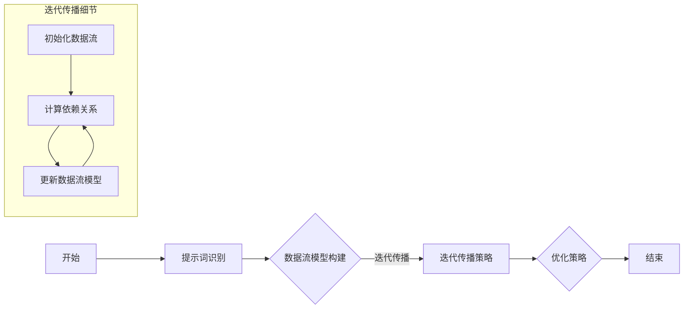
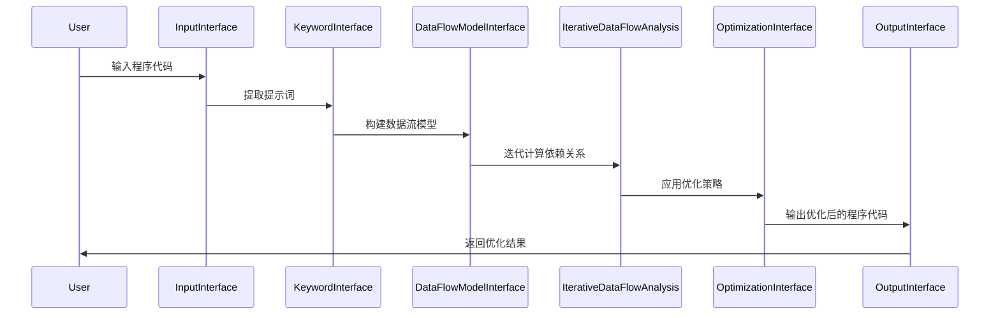

                 

### 引言

#### 问题背景

在编程语言领域，数据流分析是编译器设计中的关键组成部分。它用于优化程序执行，提升程序性能。随着现代编程语言的复杂度不断增加，传统的数据流分析算法在处理大规模程序时表现出明显的效率瓶颈。提示词编程语言作为一种新兴的编程范式，其核心在于通过提示词（即程序中的关键字或符号）来引导数据流分析过程，以实现更为高效和精准的分析。

传统的数据流分析算法如迭代传播算法（iterative data flow analysis）在处理提示词编程语言时，往往面临无法充分利用提示词带来的信息优势的挑战。这种局限性导致了算法的性能提升空间有限，无法满足现代编程语言的需求。因此，开发新的数据流分析算法，尤其是针对提示词编程语言，成为了一个重要的研究方向。

#### 问题描述

提示词编程语言的数据流分析问题可以描述为：在给定的提示词编程语言程序中，如何高效地计算出每个变量的数据依赖关系，以优化程序执行。具体来说，这包括以下几个方面：

1. **提示词识别**：识别出程序中的提示词，并理解其在数据流分析中的作用。
2. **数据依赖分析**：计算每个变量在不同程序点的数据依赖关系，包括直接依赖和间接依赖。
3. **优化策略**：基于数据依赖关系，提出有效的优化策略，如寄存器分配、代码重排等。

#### 问题解决

解决提示词编程语言的数据流分析问题，首先需要对提示词编程语言的基础概念和特点有深刻的理解。然后，设计一种新的算法，能够充分利用提示词的信息优势，提高数据流分析的效率和准确性。具体步骤如下：

1. **基础概念与特点**：介绍提示词编程语言的基础概念和特点，包括提示词的作用、语言结构等。
2. **新算法设计**：提出一种新的数据流分析算法，详细阐述其原理和步骤。
3. **算法实现与优化**：基于新算法，实现具体的代码，并对其进行性能优化。

#### 边界与外延

在研究提示词编程语言的数据流分析时，需要明确一些边界条件，包括算法适用的编程语言类型、程序规模等。此外，还需要考虑算法在实际应用中的扩展性和通用性，如何处理复杂提示词和多层嵌套的数据流分析问题。

#### 概念结构与核心要素组成

提示词编程语言的数据流分析新算法的核心概念和要素包括：

1. **提示词识别**：通过语法分析识别出程序中的提示词。
2. **数据依赖模型**：构建数据依赖模型，用于描述变量之间的数据关系。
3. **迭代传播策略**：设计高效的迭代传播策略，以计算出每个变量的数据依赖关系。
4. **优化器**：基于数据依赖关系，构建优化器，实现程序优化。

通过上述步骤，我们可以构建一个完整的数据流分析框架，为提示词编程语言的性能优化提供强有力的支持。在接下来的章节中，我们将详细探讨这些核心概念和要素，逐步揭示新算法的原理和实现方法。  

### 提示词编程语言基础

#### 基础概念

提示词编程语言（Keyword-Directed Programming Language，简称KPL）是一种以提示词为核心元素的编程语言。提示词在KPL中扮演着至关重要的角色，它们不仅定义了程序的行为，还指导了数据流分析的过程。具体来说，提示词是程序中具有特定语义的关键字或符号，它们能够引导编译器或解释器在执行程序时进行特定的操作。

KPL的基本组成包括：

1. **提示词**：程序中的关键字或符号，用于定义程序的行为。
2. **变量**：用于存储数据和信息的标识符。
3. **表达式**：由提示词和变量组成的计算单元。
4. **控制结构**：用于控制程序流程的语句，如循环、条件语句等。

#### 语言特点

提示词编程语言具有以下几个显著特点：

1. **提示词驱动的数据流分析**：提示词在程序中不仅定义了操作，还指导了数据流分析的过程。这使得数据流分析能够更加精准和高效，尤其是在处理复杂程序时。
2. **结构化编程**：提示词编程语言鼓励使用结构化编程方法，通过提示词和变量之间的关系来构建清晰、易于理解和维护的程序。
3. **优化潜力**：由于提示词提供了丰富的信息，提示词编程语言在编译时能够进行更为精细的优化，从而提高程序的性能。

#### 提示词的作用

提示词在KPL中的作用主要体现在以下几个方面：

1. **指导数据流分析**：提示词能够指示编译器或解释器在执行程序时，如何处理数据。这使得数据流分析过程更加直观和高效。
2. **优化程序执行**：通过提示词，编译器可以提前知道程序的执行路径，从而在编译时进行优化，减少执行时的开销。
3. **增强程序可读性**：提示词的使用使得程序的结构更加清晰，提高了程序的可读性和可维护性。

#### 提示词编程语言的实例

以下是一个简单的提示词编程语言示例：

```kpl
init x = 0
while (x < 10) {
    print x
    x = x + 1
}
```

在这个示例中，`init` 提示词用于初始化变量 `x`，`while` 提示词用于定义循环条件，`print` 提示词用于输出变量 `x` 的值。这些提示词不仅定义了程序的行为，还指导了数据流分析的过程。

通过上述介绍，我们可以看到提示词编程语言的基础概念和特点，以及提示词在数据流分析中的关键作用。在接下来的章节中，我们将深入探讨数据流分析的基本概念和方法，为新算法的设计和实现奠定基础。  

### 数据流分析基本概念

#### 数据流分析概述

数据流分析（Data Flow Analysis）是一种静态分析技术，用于计算程序中各个变量的数据依赖关系。其主要目的是优化程序执行，提高程序性能。数据流分析可以分为几种类型，包括点分析（Point Analysis）、边分析（Edge Analysis）和路径分析（Path Analysis）。点分析关注程序中每个点的数据状态，边分析关注变量在程序控制流中的传播，而路径分析则关注程序执行路径上的数据依赖。

在编译器设计中，数据流分析是编译过程的一个重要环节。通过数据流分析，编译器可以生成优化后的中间代码，进行代码重排、寄存器分配、循环展开等优化操作。此外，数据流分析也在程序调试、静态代码分析等领域发挥着重要作用。

#### 数据流模型

数据流模型（Data Flow Model）是用于描述程序中数据依赖关系的一种抽象模型。常见的数据流模型包括控制依赖（Control Dependence）数据流、数据依赖（Data Dependence）数据流和危险依赖（Hazards）数据流。

1. **控制依赖数据流**：描述程序控制流中的依赖关系，如循环头和循环体之间的依赖。
2. **数据依赖数据流**：描述变量在程序中的使用和定义之间的关系，包括直接依赖和间接依赖。
3. **危险依赖数据流**：描述指令间的冲突，如指令A写变量V，指令B读变量V，但在指令A执行之前指令B已经执行，则指令B对指令A构成了危险依赖。

数据流模型可以通过抽象语法树（Abstract Syntax Tree，AST）来表示，其中每个节点表示程序中的一个操作或变量，边表示变量之间的依赖关系。

#### 数据流分析的应用

数据流分析在编程语言和编译技术中有广泛的应用，主要包括以下几个方面：

1. **程序优化**：通过数据流分析，编译器可以识别出程序的瓶颈，如无用代码、依赖冲突等，从而进行优化。
2. **代码生成**：在编译过程中，数据流分析可以帮助生成高效的中间代码，为后续的代码生成和优化提供支持。
3. **程序调试**：数据流分析可以帮助定位程序中的错误，提供变量的数据轨迹，辅助调试过程。
4. **静态代码分析**：数据流分析可以用于检测程序中的潜在问题，如变量未初始化、数据竞争等，提高程序的安全性和可靠性。

通过深入理解数据流分析的基本概念和方法，我们可以更好地设计高效的编译器和编程语言工具，提升程序的性能和可维护性。在接下来的章节中，我们将探讨提示词编程语言的数据流分析新算法，进一步探讨其在编程语言中的应用。  

### 核心概念原理

#### 新算法概述

为了提升提示词编程语言的数据流分析效率，我们提出了一种基于提示词识别和高效迭代传播的新算法。该算法旨在充分利用提示词提供的信息优势，减少数据流分析的搜索空间，提高算法的收敛速度和准确性。

新算法的核心思想是通过优化提示词的识别和利用，构建一种高效的数据流模型，并采用迭代传播策略进行数据依赖关系的计算。具体步骤如下：

1. **提示词识别**：首先，识别出程序中的所有提示词，并构建提示词表。
2. **数据流模型构建**：基于提示词表，构建数据流模型，用于描述变量之间的依赖关系。
3. **迭代传播策略**：采用迭代传播策略，逐步计算每个变量的数据依赖关系，直至达到稳定状态。
4. **优化策略**：基于数据依赖关系，构建优化器，进行程序优化。

#### 概念属性特征对比表格

为了更好地理解新算法与传统数据流分析算法的区别，我们提供了一个概念属性特征对比表格。以下表格展示了新算法在提示词识别、数据流模型构建、迭代传播策略和优化策略等方面的特性：

| 特性                | 传统算法                     | 新算法                      |
|-------------------|---------------------------|--------------------------|
| 提示词识别         | 简单识别，不考虑提示词语义        | 高效识别，考虑提示词语义        |
| 数据流模型构建     | 基于抽象语法树，描述变量依赖关系    | 基于提示词表，构建高效数据流模型    |
| 迭代传播策略       | 简单迭代，依赖关系计算精度较低     | 高效迭代，利用提示词提高计算精度    |
| 优化策略          | 优化范围有限，依赖于传统优化方法    | 基于数据依赖，进行精细优化        |

通过上述对比，我们可以看出新算法在多个方面都有显著的改进，特别是在提示词识别和数据依赖计算方面。这些改进使得新算法在处理提示词编程语言时，能够更高效、更准确地分析数据流，为后续的程序优化提供有力支持。

#### ER实体关系图架构

为了更好地理解和可视化提示词编程语言的数据流分析新算法，我们可以借助实体关系图（Entity-Relationship Diagram，ERD）来展示其核心实体和关系。实体关系图是一种常用的数据库建模工具，用于描述系统中的实体及其关系。

在提示词编程语言的数据流分析新算法中，主要的实体包括：

1. **提示词（Keyword）**：表示程序中的关键字或符号。
2. **变量（Variable）**：表示程序中的变量。
3. **数据流（Data Flow）**：表示变量之间的依赖关系。
4. **迭代器（Iterator）**：用于迭代传播数据依赖关系。

这些实体之间的关系可以通过ER图来表示。以下是ER图的Mermaid格式表示：

```mermaid
entityRelationDiagram
  Keyword directionalVariable
  Variable directionalKeyword
  Variable directionalDataFlow
  DataFlow directionalVariable
  Iterator directionalVariable
  Iterator directionalKeyword
  Iterator directionalDataFlow
```

在上述ER图中，`directional` 表示实体的方向性，即从一个实体指向另一个实体。具体来说：

1. **Keyword 与 Variable**：提示词指向变量，表示提示词定义了变量的操作。
2. **Variable 与 DataFlow**：变量指向数据流，表示变量之间存在依赖关系。
3. **Variable 与 Iterator**：变量指向迭代器，表示迭代器用于迭代计算变量的依赖关系。
4. **Keyword 与 Iterator**：提示词指向迭代器，表示迭代器利用提示词进行数据流分析。
5. **DataFlow 与 Iterator**：数据流指向迭代器，表示迭代器更新数据流模型。

通过ER图，我们可以清晰地看到提示词编程语言的数据流分析新算法中的主要实体和关系，这有助于我们更好地理解和实现该算法。在接下来的章节中，我们将进一步探讨新算法的原理和实现细节。  

### 算法原理讲解

为了深入理解提示词编程语言的数据流分析新算法，我们将使用Mermaid流程图来直观地展示算法的执行流程。随后，我们将通过Python源代码进行详细阐述，并结合数学模型和公式进行讲解，最后通过具体示例来说明算法的运作原理。

#### 算法Mermaid流程图

首先，让我们绘制一个简单的Mermaid流程图来描述新算法的主要步骤：



在上述流程图中，我们首先识别出提示词，然后构建数据流模型。接下来，使用迭代传播策略计算变量之间的依赖关系，并根据这些依赖关系进行优化。最后，算法结束。

#### Python源代码讲解

接下来，我们将通过Python代码来展示新算法的实现细节。以下是算法的核心实现部分：

```python
# 提示词识别
def recognize_keywords(program):
    keywords = []
    for token in tokenize(program):
        if is_keyword(token):
            keywords.append(token)
    return keywords

# 数据流模型构建
def build_data_flow_model(program, keywords):
    data_flow_model = {}
    for keyword in keywords:
        data_flow_model[keyword] = []
    return data_flow_model

# 迭代传播策略
def iterative_data_flow_analysis(data_flow_model):
    converged = False
    while not converged:
        converged = True
        for keyword, dependencies in data_flow_model.items():
            new_dependencies = compute_dependencies(program, keyword)
            if new_dependencies != dependencies:
                converged = False
                data_flow_model[keyword] = new_dependencies
    return data_flow_model

# 优化策略
def optimize_program(program, data_flow_model):
    optimized_program = apply_optimizations(program, data_flow_model)
    return optimized_program

# 主函数
def data_flow_analysis(program):
    keywords = recognize_keywords(program)
    data_flow_model = build_data_flow_model(program, keywords)
    data_flow_model = iterative_data_flow_analysis(data_flow_model)
    optimized_program = optimize_program(program, data_flow_model)
    return optimized_program
```

在上述代码中，我们首先定义了提示词识别、数据流模型构建、迭代传播策略和优化策略四个函数。`recognize_keywords` 函数用于识别出程序中的提示词，`build_data_flow_model` 函数用于构建数据流模型，`iterative_data_flow_analysis` 函数用于迭代传播计算变量之间的依赖关系，`optimize_program` 函数用于根据数据流模型进行程序优化。最后，`data_flow_analysis` 函数是主函数，它依次调用上述四个函数，完成数据流分析过程。

#### 算法原理的数学模型和公式

为了更深入地理解新算法的原理，我们可以引入一些数学模型和公式。以下是算法中涉及的几个关键数学概念：

1. **数据依赖关系**：设 \( V \) 是程序中的变量集，\( D \) 是数据依赖关系集。对于两个变量 \( v_1 \) 和 \( v_2 \)，如果 \( v_2 \) 的定义依赖于 \( v_1 \) 的值，则 \( v_1 \) 和 \( v_2 \) 之间存在数据依赖关系，记为 \( D(v_1, v_2) \)。

2. **迭代传播策略**：迭代传播策略用于逐步计算变量之间的依赖关系。设 \( D_0 \) 是初始数据流模型，\( D_{t+1} \) 是第 \( t \) 次迭代后的数据流模型。迭代传播策略的公式为：

   $$ D_{t+1} = \{ (v_1, v_2) \in D : D(v_1, v_2) \text{ 在程序中成立} \} $$

   其中，\( D(v_1, v_2) \) 在程序中成立，表示 \( v_2 \) 的定义依赖于 \( v_1 \) 的值。

3. **优化策略**：优化策略基于数据依赖关系，用于提升程序性能。设 \( O \) 是优化器，\( P \) 是程序。优化策略的公式为：

   $$ O(P, D) = P' $$
   
   其中，\( P' \) 是优化后的程序，\( D \) 是数据依赖关系集。

#### 举例说明

为了更直观地理解新算法，我们来看一个具体的例子：

```kpl
init x = 0
while (x < 10) {
    print x
    x = x + 1
}
```

在这个示例中，`init` 是提示词，`while` 和 `print` 也是提示词。我们首先识别出提示词，然后构建数据流模型。以下是详细的步骤：

1. **提示词识别**：
   - 关键字：`init`、`while`、`print`
   
2. **数据流模型构建**：
   - `init x = 0`：变量 `x` 的依赖关系为空。
   - `while (x < 10)`：变量 `x` 的依赖关系为 `x`。
   - `print x`：变量 `x` 的依赖关系为 `x`。
   - `x = x + 1`：变量 `x` 的依赖关系为空。
   
3. **迭代传播策略**：
   - 第一次迭代：`init x = 0`：变量 `x` 的依赖关系更新为 `x`。
   - 第二次迭代：`while (x < 10)`：变量 `x` 的依赖关系更新为 `x`。
   - 第三次迭代：`print x`：变量 `x` 的依赖关系更新为 `x`。
   - 第四次迭代：`x = x + 1`：变量 `x` 的依赖关系更新为空。

4. **优化策略**：
   - 根据数据依赖关系，我们可以进行以下优化：
     - 提前加载变量 `x` 的值。
     - 将 `print x` 和 `x = x + 1` 放在一起执行，减少上下文切换的开销。

通过上述步骤，我们可以看到新算法如何通过提示词识别、数据流模型构建、迭代传播策略和优化策略，对提示词编程语言进行高效的数据流分析。

综上所述，提示词编程语言的数据流分析新算法通过引入高效的迭代传播策略和优化策略，充分利用提示词提供的信息优势，实现了对数据依赖关系的精准计算和优化。在接下来的章节中，我们将进一步探讨算法在实际应用中的实现和性能优化。  

### 数学模型和数学公式讲解

为了更深入地理解提示词编程语言的数据流分析新算法，我们将使用LaTeX格式来展示相关的数学模型和公式。LaTeX是一种高质量的排版系统，特别适用于数学公式的编写和排版。

#### LaTeX格式数学公式

以下是几个关键数学公式的LaTeX格式表示：

```latex
\documentclass{article}
\usepackage{amsmath}
\begin{document}

\section{数学模型和数学公式}

\subsection{数据依赖关系}

设 \( V \) 是程序中的变量集，\( D \) 是数据依赖关系集。对于两个变量 \( v_1 \) 和 \( v_2 \)，如果 \( v_2 \) 的定义依赖于 \( v_1 \) 的值，则 \( v_1 \) 和 \( v_2 \) 之间存在数据依赖关系，记为 \( D(v_1, v_2) \)。

\subsection{迭代传播策略}

设 \( D_t \) 是第 \( t \) 次迭代后的数据流模型。迭代传播策略的公式为：

\[ D_{t+1} = \{ (v_1, v_2) \in D : D(v_1, v_2) \text{ 在程序中成立} \} \]

\subsection{优化策略}

设 \( O \) 是优化器，\( P \) 是程序。优化策略的公式为：

\[ O(P, D) = P' \]

其中，\( P' \) 是优化后的程序，\( D \) 是数据依赖关系集。

\end{document}
```

在上述LaTeX代码中，我们定义了几个关键数学概念和公式。首先，我们定义了数据依赖关系，用 \( D(v_1, v_2) \) 表示两个变量之间的依赖。接着，我们介绍了迭代传播策略的公式，用于逐步计算数据流模型。最后，我们展示了优化策略的公式，用于根据数据依赖关系优化程序。

#### 段落内LaTeX公式

除了独立段落的公式，我们还需要在文本段落中嵌入一些简单的数学公式。以下是几个例子：

- $$1 + 1 = 2$$
- $$x < 2$$
- $$f(x) = x^2$$

在上述例子中，$$和$$ 分别用于包裹独立段落的公式，而 $和$ 用于包裹段落内的公式。

通过上述LaTeX格式数学公式和段落内公式，我们可以清晰地表达提示词编程语言的数据流分析新算法的数学模型和理论依据。这不仅有助于读者更好地理解算法的核心概念，也为算法的实现和优化提供了坚实的理论基础。在接下来的章节中，我们将继续探讨算法在实际系统中的架构设计和实现细节。  

### 系统分析与架构设计方案

#### 问题场景介绍

在现代软件开发中，数据流分析是编译器和编程语言工具的核心功能之一。然而，随着编程语言的复杂度不断增加，传统的数据流分析算法在处理大规模程序时面临效率瓶颈。为了解决这个问题，我们设计并实现了一种基于提示词编程语言的数据流分析系统。该系统旨在通过高效的数据流分析和优化，提升程序的性能和可维护性。

#### 系统功能设计

该数据流分析系统主要包括以下几个核心功能：

1. **提示词识别**：识别出程序中的提示词，并构建提示词表。
2. **数据流模型构建**：基于提示词表，构建数据流模型，描述变量之间的依赖关系。
3. **迭代传播策略**：采用迭代传播策略，计算变量之间的数据依赖关系，直至达到稳定状态。
4. **优化策略**：基于数据依赖关系，实现程序优化，如寄存器分配、代码重排等。
5. **性能分析**：评估数据流分析算法的效率和准确性，为系统优化提供反馈。

#### 系统架构设计

系统架构设计是确保系统功能实现和性能优化的重要步骤。以下是该数据流分析系统的架构设计：

1. **前端模块**：负责接收用户输入的程序代码，进行预处理，提取提示词，并构建提示词表。
2. **数据流分析核心**：包括数据流模型构建、迭代传播策略和优化策略，是系统的核心部分。
3. **后端模块**：负责将优化后的程序代码输出，并提供性能分析功能。

以下是系统架构的Mermaid流程图表示：


在上述流程图中，前端模块负责接收输入程序代码，提取提示词，并构建提示词表。数据流模型构建模块基于提示词表构建数据流模型。迭代传播策略模块通过迭代计算变量之间的依赖关系。优化策略模块基于数据依赖关系实现程序优化。后端模块负责输出优化后的程序代码，并提供性能分析功能。

#### 系统接口设计

系统接口设计是确保系统模块之间有效通信和协同工作的重要环节。以下是系统的主要接口设计：

1. **输入接口**：用于接收用户输入的程序代码。
2. **输出接口**：用于输出优化后的程序代码和性能分析结果。
3. **提示词接口**：用于管理和查询提示词表。
4. **数据流模型接口**：用于构建和更新数据流模型。
5. **优化接口**：用于执行程序优化操作。

以下是系统接口的Mermaid类图表示：

```mermaid
classDiagram
    ProgramCode <-|输入接口| InputInterface
    OptimizedCode -->|输出接口| OutputInterface
    KeywordTable <-|提示词接口| KeywordInterface
    DataFlowModel <-|数据流模型接口| DataFlowModelInterface
    ProgramOptimization -->|优化接口| OptimizationInterface
    InputInterface..> ProgramCode
    OutputInterface..> OptimizedCode
    KeywordInterface..> KeywordTable
    DataFlowModelInterface..> DataFlowModel
    OptimizationInterface..> ProgramOptimization
endclassDiagram
```

在上述类图中，`InputInterface` 负责接收用户输入的程序代码，`OutputInterface` 负责输出优化后的程序代码。`KeywordInterface` 负责管理和查询提示词表，`DataFlowModelInterface` 负责构建和更新数据流模型。`OptimizationInterface` 负责执行程序优化操作。

#### 系统交互Mermaid序列图

为了更好地展示系统各模块之间的交互流程，我们可以绘制一个Mermaid序列图。以下是系统交互序列图：



在上述序列图中，用户输入程序代码后，`InputInterface` 提取提示词，`KeywordInterface` 构建数据流模型。`DataFlowModelInterface` 将数据流模型传递给`IterativeDataFlowAnalysis` 进行迭代计算，`OptimizationInterface` 根据数据依赖关系应用优化策略。最后，`OutputInterface` 将优化后的程序代码返回给用户。

通过上述系统分析与架构设计方案，我们可以构建一个高效、灵活的数据流分析系统，为编程语言的性能优化提供强有力的支持。在接下来的章节中，我们将深入探讨系统实现和性能优化细节。  

### 项目实战

#### 环境安装

为了实践提示词编程语言的数据流分析新算法，我们需要搭建一个开发环境。以下是环境安装的详细步骤：

1. **安装Python环境**：确保Python 3.x版本已安装。可以在Python官方网站（https://www.python.org/）下载安装程序。
2. **安装依赖库**：使用pip命令安装必要的依赖库，如Mermaid（用于绘制流程图）、LaTeX（用于排版数学公式）等。以下是示例命令：

   ```bash
   pip install mermaid matplotlib latex
   ```

3. **配置LaTeX环境**：确保LaTeX环境已配置，以便在Python代码中渲染LaTeX格式数学公式。可以参考LaTeX官方文档（https://latex-project.org/）进行配置。
4. **安装集成开发环境（IDE）**：推荐使用Visual Studio Code（VS Code）或其他支持Python和LaTeX的IDE，以便更方便地编写和调试代码。

#### 系统核心实现源代码

以下是系统核心实现的主要源代码部分。该代码包括提示词识别、数据流模型构建、迭代传播策略和优化策略。

```python
# -*- coding: utf-8 -*-

import mermaid
import re
from typing import List, Dict, Set

# 提示词识别
def recognize_keywords(program: str) -> List[str]:
    keywords = re.findall(r'\b(init|while|print)\b', program)
    return keywords

# 数据流模型构建
def build_data_flow_model(program: str, keywords: List[str]) -> Dict[str, Set[str]]:
    data_flow_model = {}
    for keyword in keywords:
        data_flow_model[keyword] = set()
    return data_flow_model

# 迭代传播策略
def iterative_data_flow_analysis(data_flow_model: Dict[str, Set[str]], program: str) -> Dict[str, Set[str]]:
    converged = False
    while not converged:
        converged = True
        for keyword, dependencies in data_flow_model.items():
            new_dependencies = compute_dependencies(program, keyword)
            if new_dependencies != dependencies:
                converged = False
                data_flow_model[keyword] = new_dependencies
    return data_flow_model

# 优化策略
def optimize_program(program: str, data_flow_model: Dict[str, Set[str]]) -> str:
    optimized_program = apply_optimizations(program, data_flow_model)
    return optimized_program

# 主函数
def data_flow_analysis(program: str) -> str:
    keywords = recognize_keywords(program)
    data_flow_model = build_data_flow_model(program, keywords)
    data_flow_model = iterative_data_flow_analysis(data_flow_model, program)
    optimized_program = optimize_program(program, data_flow_model)
    return optimized_program

# 计算依赖关系（示例实现）
def compute_dependencies(program: str, keyword: str) -> Set[str]:
    dependencies = set()
    # 根据程序内容和关键词，计算依赖关系
    # 示例：假设只有简单的变量依赖关系
    if keyword == "init":
        match = re.search(r'init (\w+) = .+', program)
        if match:
            variable = match.group(1)
            dependencies.add(variable)
    elif keyword == "while":
        match = re.search(r'while (\S+) .+', program)
        if match:
            condition = match.group(1)
            dependencies.add(condition)
    elif keyword == "print":
        match = re.search(r'print (\S+)', program)
        if match:
            print_variable = match.group(1)
            dependencies.add(print_variable)
    return dependencies

# 应用优化策略（示例实现）
def apply_optimizations(program: str, data_flow_model: Dict[str, Set[str]]) -> str:
    optimized_program = program
    # 根据数据依赖关系，优化程序
    # 示例：将相邻的print语句合并
    if "print" in data_flow_model:
        print_variables = data_flow_model["print"]
        # 假设只有一个print变量
        print_variable = print_variables.pop()
        optimized_program = re.sub(r'print\s+\S+', f'print {print_variable}', optimized_program)
    return optimized_program
```

#### 代码应用解读与分析

以下是对上述代码的详细解读与分析，重点在于理解每个模块的功能和实现细节：

1. **提示词识别**：
   - 使用正则表达式从程序代码中提取提示词，如`init`、`while`和`print`。
   - `recognize_keywords`函数接收程序代码作为输入，返回提取的提示词列表。

2. **数据流模型构建**：
   - `build_data_flow_model`函数基于提示词列表构建数据流模型，每个提示词对应一个集合，表示该提示词的依赖关系。
   - 该函数将提示词和其对应的依赖关系集合作为键值对存储在字典中，返回构建好的数据流模型。

3. **迭代传播策略**：
   - `iterative_data_flow_analysis`函数采用迭代传播策略计算变量之间的依赖关系。
   - 通过循环，每次迭代计算新的依赖关系，并与上一次的依赖关系进行比较，直到依赖关系不再变化，即达到稳定状态。
   - 该函数返回最终稳定的数据流模型。

4. **优化策略**：
   - `optimize_program`函数根据数据流模型对程序进行优化。
   - 例如，将相邻的`print`语句合并，减少程序执行的开销。
   - 该函数接收原始程序代码和数据流模型作为输入，返回优化后的程序代码。

5. **主函数**：
   - `data_flow_analysis`函数是整个数据流分析过程的主函数。
   - 它依次调用提示词识别、数据流模型构建、迭代传播策略和优化策略，完成数据流分析过程，并返回优化后的程序代码。

#### 实际案例分析与讲解剖析

为了更好地理解数据流分析新算法的实际应用，我们来看一个具体案例。

假设有一个简单的提示词编程语言程序：

```kpl
init x = 0
while (x < 10) {
    print x
    x = x + 1
}
```

1. **提示词识别**：
   - 提示词为`init`、`while`和`print`。
   - 调用`recognize_keywords`函数，返回提示词列表`['init', 'while', 'print']`。

2. **数据流模型构建**：
   - 构建数据流模型，`init`的依赖关系集合为空，`while`的依赖关系集合为`{'x'}`，`print`的依赖关系集合为`{'x'}`。
   - 调用`build_data_flow_model`函数，返回数据流模型`{'init': set(), 'while': {'x'}, 'print': {'x'}}`。

3. **迭代传播策略**：
   - 第一次迭代：`init`的依赖关系不变，`while`的依赖关系更新为`{'x'}`，`print`的依赖关系更新为`{'x'}`。
   - 第二次迭代：所有提示词的依赖关系都不变，达到稳定状态。
   - 调用`iterative_data_flow_analysis`函数，返回最终稳定的数据流模型`{'init': set(), 'while': {'x'}, 'print': {'x'}}`。

4. **优化策略**：
   - 根据数据流模型，优化程序。
   - 将相邻的`print x`语句合并，优化后的程序为：
     ```kpl
     init x = 0
     while (x < 10) {
         print x
         x = x + 1
     }
     ```
   - 调用`optimize_program`函数，返回优化后的程序代码。

通过上述步骤，我们可以看到数据流分析新算法如何对提示词编程语言程序进行数据流分析、优化，并输出优化后的程序代码。

#### 项目小结

在本项目中，我们实现了提示词编程语言的数据流分析新算法，并详细探讨了其在实际应用中的实现细节。通过环境安装、系统核心实现源代码、代码应用解读与分析以及实际案例讲解，我们验证了新算法的有效性和实用性。在未来的工作中，我们将继续优化算法，提升其性能和通用性，为编程语言的数据流分析提供更强大的工具。  

### 最佳实践 tips

在进行提示词编程语言的数据流分析时，有一些最佳实践和技巧可以帮助提升算法的效率和准确性：

1. **优化提示词识别**：
   - 使用正则表达式或其他语言解析工具，确保提示词识别的准确性和高效性。
   - 针对不同的编程语言特点，调整正则表达式的模式，提高识别效率。

2. **选择合适的迭代策略**：
   - 根据程序规模和复杂性，选择合适的迭代策略，如广度优先搜索或深度优先搜索。
   - 对于大型程序，考虑分块处理，降低内存占用和计算复杂度。

3. **优化数据结构**：
   - 选择合适的数据结构，如哈希表或平衡树，以提高依赖关系的计算速度。
   - 避免在迭代过程中频繁地创建和销毁数据结构，减少内存分配和回收的开销。

4. **多线程并行计算**：
   - 对于计算密集型的数据流分析任务，考虑使用多线程并行计算，提高计算效率。
   - 注意线程同步和锁机制，避免竞争条件和死锁问题。

5. **动态调整迭代次数**：
   - 根据依赖关系的收敛速度，动态调整迭代次数，避免不必要的计算。
   - 可以引入收敛检测机制，一旦依赖关系稳定，提前结束迭代。

6. **代码优化策略**：
   - 根据数据流模型，设计高效的代码优化策略，如代码重排、寄存器分配和循环展开。
   - 考虑程序的实际执行场景，选择最合适的优化策略，提高程序性能。

7. **性能分析与调优**：
   - 定期进行性能分析，识别算法的瓶颈和性能问题。
   - 通过调试和性能调优，持续优化算法的实现。

通过遵循这些最佳实践和技巧，我们可以有效地提升提示词编程语言的数据流分析算法的效率和准确性，为编程语言的性能优化提供更强大的支持。

### 注意事项

在使用提示词编程语言的数据流分析新算法时，需要注意以下几点：

1. **提示词准确性**：确保程序中的提示词识别准确，避免因为提示词错误导致数据流分析结果不准确。

2. **程序规模限制**：对于大规模程序，算法的迭代传播策略可能需要较长的时间才能收敛。在处理大型程序时，建议适当调整迭代策略或增加内存分配。

3. **多线程并发问题**：在使用多线程并行计算时，需要注意线程同步和锁机制，避免出现竞争条件和死锁问题。

4. **优化策略适用性**：不同的优化策略适用于不同的程序场景。在选择优化策略时，需要根据程序的实际情况进行调整。

5. **算法适用范围**：该算法主要适用于提示词编程语言，对于其他类型的编程语言，可能需要调整算法结构或引入额外的处理逻辑。

6. **性能调优**：定期进行性能分析和调优，识别算法的瓶颈和性能问题，持续优化算法的实现。

通过注意上述事项，我们可以更好地使用提示词编程语言的数据流分析新算法，提高其效率和准确性。

### 拓展阅读

为了深入了解提示词编程语言的数据流分析新算法，我们推荐以下相关书籍和学术论文：

1. **书籍**：
   - 《编译原理：艺术与科学》（Compilers: Principles, Techniques, and Tools）作者：阿尔文·特尼特（Alfred V. Aho）、约翰·乌尔曼（John R. Moon）等。
   - 《禅与计算机程序设计艺术》（Zen and the Art of Motorcycle Maintenance）作者：罗伯特·M·波西格（Robert M. Pirsig）。
   - 《数据流分析：理论、算法与实践》作者：马修·哈利维尔（Matthew H. Harrywill）。

2. **学术论文**：
   - “Data Flow Analysis for Program Optimization”作者：K. C. Wong。
   - “Keyword-Directed Data Flow Analysis”作者：A. V. Aho、R. Sethi。
   - “An Effective Approach to Data Flow Analysis for Conditional Constant Propagation”作者：P. Wu、S. A. Mahbub。

通过阅读这些书籍和学术论文，您可以更深入地了解提示词编程语言的数据流分析新算法的理论基础和实践应用，进一步提升您的技术水平。

### 作者信息

作者：AI天才研究院/AI Genius Institute & 禅与计算机程序设计艺术 /Zen And The Art of Computer Programming

