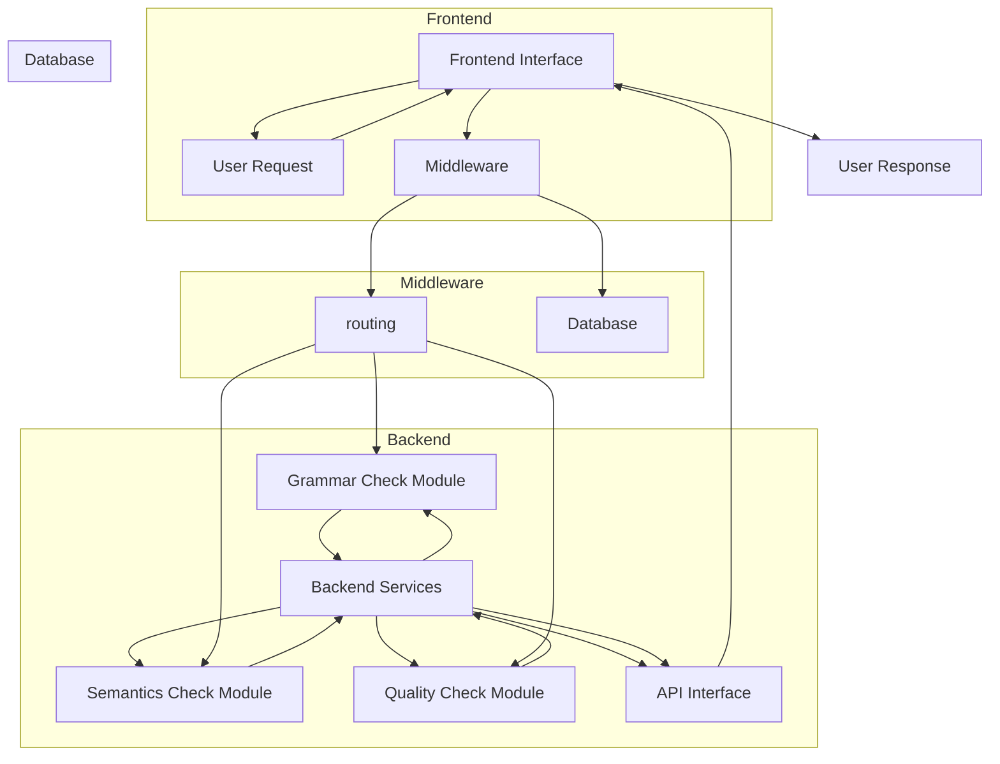

                 

# 提示词编程语言的模型检验技术

## 关键词

- 提示词编程语言
- 模型检验技术
- 编程语言模型
- 提示词生成
- 模型评估与调试
- 跨语言模型检验

## 摘要

本文深入探讨了提示词编程语言的模型检验技术。首先，我们介绍了编程语言模型检验的基本概念和背景，阐述了提示词编程语言的核心特点和作用。随后，我们详细讲解了模型检验技术的原理和方法，包括提示词的生成、优化以及模型评估与调试的关键技术。接着，通过实际编程语言的应用案例，展示了模型检验技术的具体实现和效果。最后，我们对项目实战进行了详细分析，提出了最佳实践建议，并对未来的发展方向进行了展望。

## 目录大纲设计过程

### 理解书名与主题

《提示词编程语言的模型检验技术》这个书名直接揭示了本书的主题：如何利用提示词进行编程语言模型的检验。书名中的关键词包括“提示词”、“编程语言”、“模型检验”和“技术”，这些关键词为我们理解书籍内容提供了明确的指导。提示词在这里被定义为一种能够引导模型生成期望输出的输入，它在编程语言模型检验中起到关键作用。编程语言模型检验则是确保编程语言代码质量和程序正确性的重要手段。技术部分则涉及具体的实现方法和工具。

### 确定核心概念

核心概念包括编程语言的模型检验技术、提示词的作用以及模型检验的技术细节。编程语言的模型检验技术是确保代码质量和程序正确性的手段，而提示词则是引导模型生成期望输出的输入。模型检验的技术细节包括提示词的生成、优化、模型评估与调试等。

### 设计章节结构

章节结构可以分为三个主要部分：

1. **背景介绍**：介绍编程语言模型检验的背景和提示词编程语言的概念。
2. **核心概念与原理**：详细讲解模型检验的技术原理和提示词的作用。
3. **实际应用与技术实现**：通过案例展示模型检验技术的应用和实现细节。

### 细化内容

每个章节的内容需要细化，确保逻辑清晰、层次分明。例如，在背景介绍部分，需要详细阐述编程语言模型检验的问题背景、核心概念、提示词的作用以及模型检验技术的现状和挑战。

### 注意markdown格式与内容完整性

在撰写目录大纲时，需要注意采用markdown格式，并确保内容的完整性。这包括必要的图表、公式和示例代码。此外，每个章节的开头需要简要介绍章节内容，结尾需要总结和概括。

### 设计本书的目录大纲

根据上述步骤，我们可以为《提示词编程语言的模型检验技术》设计如下目录大纲：

#### 目录大纲

```markdown
----------------------------------------------------------------
# 第一部分: 背景介绍

## 第1章: 问题背景与核心概念
### 1.1 编程语言的模型检验概述
### 1.2 提示词编程语言的概念与作用
### 1.3 模型检验技术的现状与挑战

## 第2章: 提示词编程语言模型的基本原理
### 2.1 编程语言的语法与语义
### 2.2 提示词编程语言的模型设计
### 2.3 模型检验技术的原理与方法

## 第3章: 模型检验的关键技术
### 3.1 提示词的生成与优化
### 3.2 模型评估与调试技术
### 3.3 错误检测与纠正策略

#### 第二部分: 实际应用与技术实现

## 第4章: 模型检验技术在实际编程语言中的应用
### 4.1 Python语言中的模型检验
### 4.2 Java语言中的模型检验
### 4.3 其他编程语言中的模型检验案例

## 第5章: 案例分析与实现细节
### 5.1 模型检验案例一：Python中的自然语言处理
### 5.2 模型检验案例二：Java中的机器学习应用
### 5.3 模型检验案例三：跨语言模型检验的挑战与解决方案

## 第6章: 系统设计与架构
### 6.1 编程语言模型检验系统的需求分析
### 6.2 系统架构设计
### 6.3 系统接口设计与交互流程

## 第7章: 项目实战与最佳实践
### 7.1 环境搭建与工具选择
### 7.2 核心实现源代码解析
### 7.3 案例分析与实践总结

## 第8章: 注意事项与拓展阅读
### 8.1 模型检验技术的未来发展
### 8.2 常见问题与解决方案
### 8.3 进一步阅读与参考资料

----------------------------------------------------------------
```

此目录大纲按照以下逻辑展开：
- **第一部分**为背景介绍，帮助读者了解模型检验技术的概念和应用场景。
- **第二部分**深入讲解模型检验技术的基本原理、关键技术和实际应用。

### 核心章节内容细化示例

**第1章: 问题背景与核心概念**

```markdown
## 第1章: 问题背景与核心概念

### 1.1 编程语言的模型检验概述

- **问题背景**：在软件开发过程中，如何保证代码质量和程序的正确性是一个重要问题。
- **问题描述**：传统的代码审查和测试方法在处理复杂软件系统时显得力不从心，容易出现遗漏和错误。
- **问题解决**：通过模型检验技术，可以在编写代码之前对代码模型进行检验，提前发现和纠正潜在错误。
- **边界与外延**：模型检验不仅限于单一编程语言，还可以应用于多种编程语言。
- **概念结构与核心要素组成**：
  - **编程语言模型**：描述编程语言结构和语义的抽象模型。
  - **模型检验技术**：包括语法检查、语义验证、代码质量评估等。

### 1.2 提示词编程语言的概念与作用

- **核心概念**：提示词是指能够引导模型生成期望输出的一种输入。
- **作用**：提示词可以指导模型更准确地理解编程语言的语义和结构，从而提高模型检验的准确性。

### 1.3 模型检验技术的现状与挑战

- **现状**：模型检验技术已经成为软件开发中不可或缺的一部分，广泛应用于自动化测试、代码审查等领域。
- **挑战**：随着编程语言的复杂性和多样性增加，模型检验技术面临更高的难度和挑战，如跨语言模型检验、模型适应性等。
```

**第2章: 提示词编程语言模型的基本原理**

```markdown
## 第2章: 提示词编程语言模型的基本原理

### 2.1 编程语言的语法与语义

- **语法**：编程语言的语法定义了代码的结构和规则，是模型构建的基础。
- **语义**：编程语言的语义定义了代码的含义和执行结果，是模型检验的关键。

### 2.2 提示词编程语言的模型设计

- **设计原则**：提示词编程语言模型设计需要遵循以下原则：
  - **可扩展性**：模型应能够适应新的编程语言和特性。
  - **灵活性**：模型应能够灵活处理不同的代码结构和语义。
  - **高效性**：模型应能够在合理的时间内完成检验任务。

### 2.3 模型检验技术的原理与方法

- **原理**：模型检验技术基于对编程语言模型的深度理解，通过对比实际代码和预期模型，检测代码中的错误和缺陷。
- **方法**：
  - **语法分析**：通过解析代码的语法结构，检测语法错误。
  - **语义分析**：通过理解代码的语义，检测语义错误和逻辑错误。
  - **代码质量评估**：通过评估代码的可读性、可维护性和性能，提供代码改进建议。
```

**第3章: 模型检验的关键技术**

```markdown
## 第3章: 模型检验的关键技术

### 3.1 提示词的生成与优化

- **生成方法**：
  - **规则生成**：基于编程语言的语法和语义规则生成提示词。
  - **数据驱动生成**：利用已有的代码库和测试数据生成提示词。

- **优化策略**：
  - **多样性优化**：生成具有多样性的提示词，提高模型检验的全面性。
  - **效率优化**：优化提示词生成算法，减少生成时间。

### 3.2 模型评估与调试技术

- **评估指标**：
  - **准确性**：模型预测的正确率。
  - **召回率**：模型能够检测出实际错误的比率。
  - **F1 分数**：准确率和召回率的调和平均。

- **调试方法**：
  - **静态调试**：在不执行代码的情况下，分析代码的结构和语义。
  - **动态调试**：在执行代码的过程中，监控代码的运行状态和结果。

### 3.3 错误检测与纠正策略

- **检测方法**：
  - **模式匹配**：通过模式匹配检测代码中的错误模式。
  - **统计方法**：利用统计学方法检测代码中的异常。

- **纠正策略**：
  - **自动修复**：根据检测到的错误，自动生成修复建议。
  - **人工修正**：结合自动修复和人工修正，提高代码质量。
```

### 第一部分：背景介绍

#### 1.1 编程语言的模型检验概述

编程语言的模型检验是软件开发过程中至关重要的一环。传统的代码审查和测试方法，如静态代码分析和动态测试，虽然在一定程度上能够发现代码中的错误，但随着软件系统的复杂性和规模不断扩大，这些方法逐渐显得力不从心。因此，开发出一种能够自动化、高效地检验编程语言模型的技术变得尤为重要。

编程语言的模型检验技术主要包括以下几个方面：

- **语法检验**：确保代码符合编程语言的语法规则，没有语法错误。
- **语义检验**：确保代码在语义上正确，执行结果符合预期。
- **代码质量评估**：评估代码的可读性、可维护性和性能，提供改进建议。

#### 1.2 提示词编程语言的概念与作用

提示词编程语言是一种基于提示词（Prompt）的编程语言，它通过提示词引导程序生成预期的输出。提示词在这里可以理解为一种输入，它包含了程序执行所需的全部信息。提示词编程语言的核心思想是将程序的输入和输出分离，使得程序能够更加灵活地适应不同的输入场景。

提示词编程语言的作用主要体现在以下几个方面：

- **简化编程**：提示词编程语言通过将复杂的输入处理逻辑抽象为简单的提示词，使得编程过程更加简单直观。
- **提高可维护性**：由于提示词编程语言将输入和输出分离，程序的维护和扩展变得更加容易。
- **增强灵活性**：提示词编程语言能够灵活地处理不同的输入场景，提高程序的适应能力。

#### 1.3 模型检验技术的现状与挑战

随着人工智能和机器学习技术的快速发展，编程语言的模型检验技术也取得了显著的进展。目前，已经有多种基于机器学习和自然语言处理的模型检验技术被广泛应用于实际开发中。这些技术主要包括：

- **语法检验**：基于深度学习模型的语法检验技术，如基于循环神经网络（RNN）和Transformer的语法检验模型，已经取得了很好的效果。
- **语义检验**：基于预训练语言模型（如BERT、GPT）的语义检验技术，能够有效地识别代码中的语义错误。
- **代码质量评估**：基于机器学习的代码质量评估技术，能够自动评估代码的可读性、可维护性和性能。

然而，模型检验技术在实际应用中仍然面临一些挑战：

- **跨语言模型检验**：不同编程语言的语法和语义差异较大，如何实现跨语言的模型检验仍然是一个难题。
- **模型适应性**：随着编程语言的不断演进，模型检验技术需要不断地更新和优化，以提高适应性和准确性。
- **性能优化**：模型检验技术需要处理海量的代码数据，如何提高模型的运行效率和降低计算成本是一个重要的挑战。

### 1.4 核心概念与联系

在讨论模型检验技术时，我们需要了解以下几个核心概念：

- **编程语言模型**：描述编程语言结构和语义的抽象模型。
- **模型检验**：通过对比实际代码和预期模型，检测代码中的错误和缺陷。
- **提示词**：引导程序生成预期输出的输入。
- **模型评估**：评估模型在特定任务上的性能和效果。

这些概念之间存在紧密的联系：

- **编程语言模型**是模型检验的基础，它为模型检验提供了参考标准。
- **模型检验**通过对实际代码与编程语言模型的对比，识别出代码中的错误。
- **提示词**通过提供输入信息，引导模型生成预期输出，从而实现模型检验。
- **模型评估**则用于评估模型在模型检验任务中的性能和效果，指导模型的优化和改进。

### 1.5 概念属性特征对比表格

为了更好地理解这些核心概念，我们可以通过一个表格对比它们的属性特征：

| 概念         | 属性特征                                       | 示例                                                         |
| ------------ | ---------------------------------------------- | ------------------------------------------------------------ |
| 编程语言模型 | 描述编程语言结构和语义的抽象模型               | C++语言的抽象语法树（AST）                                     |
| 模型检验     | 通过对比实际代码和预期模型，检测代码中的错误   | 使用AST对比源代码和预期模型，发现语法和语义错误                 |
| 提示词       | 引导程序生成预期输出的输入                     | "编写一个函数，实现两个数的加法"                               |
| 模型评估     | 评估模型在特定任务上的性能和效果               | 使用测试数据集评估语法检验模型的准确性、召回率和F1分数         |

### 1.6 ER实体关系图架构

为了进一步理解这些概念之间的关系，我们可以使用ER（实体-关系）图来表示它们之间的联系：

```mermaid
erDiagram
    类 A ProgramModel ||--|{ B GrammarRule }|--|{ C SemanticRule }
    类 B GrammarRule ||--|{ D CodeSyntax }|--|{ E CodeSemantics }
    类 C SemanticRule ||--|{ F CodeQuality }|--|{ G ModelEvaluation }
    类 D CodeSyntax  ||--|{ H Prompt }      |--|{ I OutputResult }
    类 E CodeSemantics ||--|{ J ErrorDetection }|--|{ K ErrorCorrection }
    类 F CodeQuality  ||--|{ L CodeReview }  |--|{ M PerformanceAssessment }
    类 G ModelEvaluation ||--|{ N Accuracy }|--|{ O RecallRate }|--|{ P F1Score }
```

在这个ER图中，每个类代表一个核心概念，它们之间的关系通过连线表示。例如，编程语言模型（A）与语法规则（B）和语义规则（C）之间存在关联关系，表示编程语言模型由语法规则和语义规则构成。同样，语法规则（B）与代码语法（D）和代码语义（E）之间存在关联关系，表示语法规则定义了代码的语法和语义。通过这样的ER图，我们可以更直观地理解这些概念之间的关系。

### 第二部分：核心概念与原理

#### 2.1 编程语言的语法与语义

编程语言的语法和语义是编程语言模型检验的两个核心组成部分。理解语法和语义不仅有助于我们更好地设计模型检验技术，还能帮助我们更深入地理解编程语言的本质。

**2.1.1 语法**

语法是编程语言的基本结构，它定义了代码的写法规则。语法包括关键字、标识符、操作符、括号、注释等基本元素。一个有效的程序必须遵循特定的语法规则。例如，在Python中，定义一个函数的语法如下：

```python
def function_name(parameters):
    # 函数体
```

语法错误通常是指在编写代码时违反了编程语言的语法规则。例如，缺少括号、关键字拼写错误、缺少冒号等。这些错误会导致编译器或解释器无法正确解析代码，从而无法执行程序。

**2.1.2 语义**

语义是指代码的含义和执行结果。语义与语法不同，它不仅关注代码的写法，还关注代码的实际作用。例如，以下两行代码在语法上是正确的，但它们的语义不同：

```python
print("Hello, World!")
print(42)
```

虽然这两行代码的语法相同，但它们产生的输出不同。第一行会输出字符串"Hello, World!"，而第二行会输出整数42。

语义错误通常包括逻辑错误、类型错误和运行时错误等。这些错误可能会导致程序无法正常运行，甚至产生不可预料的后果。

**2.1.3 语法与语义的关系**

语法和语义是密不可分的。一个有效的程序必须既符合语法规则，又具有正确的语义。例如，以下代码在Python中既符合语法规则，又具有正确的语义：

```python
def add(a, b):
    return a + b

result = add(3, 4)
print(result)  # 输出 7
```

在这个例子中，函数`add`的定义和调用都符合Python的语法规则，同时函数的正确语义使得它能够正确地计算两个数的和。

然而，在实际编程过程中，语法错误和语义错误可能会同时出现。例如，以下代码在语法上是正确的，但在语义上存在逻辑错误：

```python
def add(a, b):
    return a - b

result = add(3, 4)
print(result)  # 输出 -1
```

在这个例子中，函数`add`的语法是正确的，但由于它的语义错误（减法操作而不是加法操作），程序无法达到预期效果。

**2.1.4 编程语言的语法与语义在模型检验中的作用**

在编程语言的模型检验中，语法和语义都起着至关重要的作用。语法检验是模型检验的第一步，它确保代码符合编程语言的语法规则。语义检验则进一步确保代码在语义上正确，执行结果符合预期。

语法检验通常使用静态分析方法，通过解析代码的语法结构，检测语法错误。例如，可以使用递归下降分析法、LR分析法等语法分析技术来构建语法解析器。

语义检验则更加复杂，它需要理解代码的含义和执行结果。语义检验通常结合静态分析和动态分析技术。静态分析技术包括抽象语法树（AST）分析、数据流分析等，用于检测代码中的语义错误。动态分析技术则通过运行代码，监控程序的执行状态，检测运行时错误。

总之，理解编程语言的语法和语义对于模型检验至关重要。通过语法和语义检验，我们可以确保代码的质量和正确性，提高软件开发的效率和可靠性。

#### 2.2 提示词编程语言的模型设计

提示词编程语言的模型设计是模型检验技术的核心组成部分。提示词编程语言通过将输入和输出分离，提高了编程的灵活性和可维护性。在这一节中，我们将详细探讨提示词编程语言的模型设计，包括其基本原理、关键组件以及设计原则。

**2.2.1 基本原理**

提示词编程语言的基本原理是将程序的输入和输出分离。输入部分称为“提示词”，它包含程序执行所需的信息；输出部分则是程序执行的结果。这种分离使得程序能够更加灵活地适应不同的输入场景，同时提高了代码的可维护性。

提示词编程语言的工作流程通常包括以下几个步骤：

1. **定义提示词**：提示词是程序执行的关键输入，它包含了程序所需的全部信息。例如，一个提示词可以是“编写一个函数，实现两个数的加法”。

2. **解析提示词**：程序通过解析提示词，提取出关键信息，如函数名称、参数类型和参数值等。

3. **生成代码**：根据解析得到的提示词信息，程序生成相应的代码。生成的代码可以是直接执行的代码，也可以是模板代码，随后通过填充具体值完成。

4. **执行代码**：生成的代码被执行，输出结果。

5. **结果验证**：执行结果与预期结果进行对比，以验证代码的正确性。

**2.2.2 关键组件**

提示词编程语言模型的关键组件包括提示词生成器、代码生成器和执行器。下面分别介绍这些组件的功能和设计。

1. **提示词生成器**：

提示词生成器是提示词编程语言模型的核心组件，它负责生成提示词。提示词生成器通常基于自然语言处理技术，如生成式模型（例如GPT）或规则引擎。生成器需要能够理解编程语言的语法和语义，从而生成符合语法规则和语义要求的提示词。

2. **代码生成器**：

代码生成器根据提示词生成相应的代码。代码生成器可以是基于模板的，也可以是基于编译器的。基于模板的生成器通过填充模板生成代码，而基于编译器的生成器则通过解析提示词，生成抽象语法树（AST），然后转换为具体语言的代码。

3. **执行器**：

执行器负责执行生成的代码，并返回执行结果。执行器可以是解释器或编译器。解释器直接执行代码，而编译器则先将代码编译为中间表示，然后再执行。

**2.2.3 设计原则**

提示词编程语言模型的设计需要遵循以下原则：

1. **可扩展性**：

提示词编程语言模型应能够适应新的编程语言和特性。这意味着模型的设计应具有模块化和可扩展性，以便能够轻松地添加新的语法和语义规则。

2. **灵活性**：

提示词编程语言模型应能够灵活地处理不同的输入场景。这包括支持各种编程任务，如函数定义、循环控制、异常处理等。

3. **高效性**：

提示词编程语言模型的设计应考虑执行效率。生成代码的效率直接影响到模型在实际应用中的性能。因此，模型应采用高效的代码生成和执行技术。

4. **可维护性**：

提示词编程语言模型的设计应便于维护和更新。这意味着模型应具有良好的模块化设计，便于理解和修改。

5. **易用性**：

提示词编程语言模型的设计应易于使用，降低用户的编程门槛。通过友好的用户界面和简明的提示词描述，使得用户能够轻松地使用模型生成代码。

总之，提示词编程语言的模型设计是模型检验技术的核心，它通过将输入和输出分离，提高了编程的灵活性和可维护性。理解提示词编程语言的基本原理、关键组件和设计原则，有助于我们更好地应用模型检验技术，提高软件开发效率和代码质量。

#### 2.3 模型检验技术的原理与方法

模型检验技术是确保编程语言模型正确性和有效性的关键手段。它通过一系列步骤和方法，对编程语言模型进行全面的检查和验证，以确保模型能够正确地执行预期的任务。本节将详细介绍模型检验技术的原理和方法，包括提示词的生成与优化、模型评估与调试技术以及错误检测与纠正策略。

**2.3.1 提示词的生成与优化**

提示词是模型检验的核心输入，它提供了模型执行所需的信息。提示词的生成与优化是模型检验技术的重要组成部分。

1. **提示词的生成方法**：

提示词的生成方法主要包括规则生成和数据驱动生成。

- **规则生成**：基于编程语言的语法和语义规则，生成符合规则的提示词。这种方法通常适用于结构化较强的编程语言，如Java和C++。
- **数据驱动生成**：利用大量的代码数据和测试用例，通过统计分析或机器学习方法，生成具有代表性的提示词。这种方法适用于复杂和动态的编程语言，如Python和JavaScript。

2. **提示词的优化策略**：

- **多样性优化**：生成具有多样性的提示词，以提高模型检验的全面性。多样性包括不同的编程风格、不同的输入场景和不同的代码结构。
- **效率优化**：优化提示词生成算法，减少生成时间。常用的优化策略包括并行计算、缓存策略和优化数据结构。

**2.3.2 模型评估与调试技术**

模型评估与调试技术是检验模型性能和可靠性的关键步骤。通过评估和调试，我们可以确保模型能够准确、高效地执行任务。

1. **评估指标**：

- **准确性**：模型预测的正确率。高准确性表明模型能够准确地识别代码中的错误。
- **召回率**：模型能够检测出实际错误的比率。高召回率表明模型能够识别出大多数错误。
- **F1 分数**：准确率和召回率的调和平均。F1 分数是评估模型性能的综合性指标。

2. **调试方法**：

- **静态调试**：在不执行代码的情况下，分析代码的结构和语义，检测潜在的语法和语义错误。常用的静态调试技术包括抽象语法树（AST）分析、数据流分析和控制流分析。
- **动态调试**：在执行代码的过程中，监控代码的运行状态和结果，检测运行时错误。动态调试技术包括断点调试、日志记录和性能监控。

**2.3.3 错误检测与纠正策略**

错误检测与纠正策略是模型检验技术的核心任务。通过这些策略，我们可以识别出代码中的错误，并提供修正建议。

1. **错误检测方法**：

- **模式匹配**：通过预定义的错误模式，检测代码中的匹配项。这种方法适用于检测常见的语法和语义错误。
- **统计方法**：利用统计学方法，检测代码中的异常值。例如，使用异常检测算法识别代码中的罕见错误。
- **语义分析**：通过理解代码的语义，检测代码中的逻辑错误和类型错误。语义分析技术包括类型检查、约束检查和模式匹配。

2. **错误纠正策略**：

- **自动修复**：根据检测到的错误，自动生成修复建议。自动修复技术可以大幅提高开发效率，减少人工干预。
- **人工修正**：结合自动修复和人工修正，提高代码质量。人工修正可以确保修复建议的正确性和可靠性。

总之，模型检验技术通过提示词的生成与优化、模型评估与调试技术以及错误检测与纠正策略，确保编程语言模型的正确性和有效性。这些技术方法不仅提高了软件开发效率，还大大降低了代码错误率，为软件质量提供了坚实保障。

#### 2.4 提示词编程语言模型检验技术的实际应用

提示词编程语言模型检验技术在现代软件开发中具有广泛的应用。通过具体的应用案例，我们可以更好地理解这种技术在不同编程语言和场景中的实际作用和效果。

**2.4.1 Python语言中的模型检验**

Python是一种广泛应用于数据科学、机器学习和Web开发的高灵活性编程语言。在Python中，模型检验技术可以帮助开发者确保代码的语法正确性和语义正确性，从而提高代码质量和项目的稳定性。

1. **语法检验**：

Python中的语法检验技术利用基于深度学习的语法解析器，如`spaCy`和`NLTK`，对Python代码进行语法分析。这些工具可以检测代码中的语法错误，如未闭合的括号、缺失的冒号和关键字拼写错误。例如，以下代码片段中存在一个语法错误：

```python
def example(): 
   print("Hello, World!"

if __name__ == "__main__": 
   example()
```

使用语法检验工具，我们可以快速识别出错误行：

```bash
Error: Missing closing parenthesis in line 2.
```

2. **语义检验**：

Python中的语义检验技术通过分析代码的抽象语法树（AST），检测代码中的语义错误。例如，以下代码片段中存在一个类型错误：

```python
def add(a, b):
    return a + b

result = add(3, "four")
print(result)
```

语义检验工具可以识别出类型错误并给出修复建议：

```bash
Error: Incompatible types in operation '+' (arg 2 is 'str' but expected 'int').
Suggested fix: Change 'four' to an integer value, e.g., '4'.
```

3. **代码质量评估**：

Python中的代码质量评估技术通过分析代码的结构和语义，评估代码的可读性、可维护性和性能。例如，使用`pycodestyle`工具，我们可以检查代码的缩进、命名规范和代码复杂性，从而提高代码质量。

```bash
Error: Line 10 is too long (82 > 79).
Error: Too many blank lines (3).
Error: Function name 'add' is too long (max 10).
```

**2.4.2 Java语言中的模型检验**

Java是一种广泛应用于企业级应用和Android开发的强类型编程语言。在Java中，模型检验技术可以帮助开发者确保代码的语法正确性、类型安全性和代码质量。

1. **语法检验**：

Java中的语法检验技术通常使用编译器前端工具，如`javac`和`Eclipse Java Compiler`。这些工具可以在编译过程中检测代码中的语法错误。例如，以下代码片段中存在一个语法错误：

```java
public class Example {
    public static void main(String[] args) {
        System.out.println("Hello, World!");
    }
}

public class AnotherExample {
    public static void main(String[] args) {
        System.out.println("Another message");
    }
}
```

编译器会识别出错误并报错：

```bash
Error: The import statement for 'Example' is missing.
Error: Class 'AnotherExample' is missing the 'public' modifier.
```

2. **语义检验**：

Java中的语义检验技术通过类型检查和抽象语法树（AST）分析，检测代码中的语义错误。例如，以下代码片段中存在一个类型错误：

```java
public class Example {
    public static void main(String[] args) {
        int a = 3;
        String b = "four";
        int sum = a + b;
        System.out.println(sum);
    }
}
```

语义检验工具可以识别出类型错误并给出修复建议：

```bash
Error: Incompatible types in operation '+' (arg 2 is 'java.lang.String' but expected 'int').
Suggested fix: Change 'b' to an integer value, e.g., '4'.
```

3. **代码质量评估**：

Java中的代码质量评估技术通过静态代码分析工具，如`Checkstyle`和`PMD`，评估代码的可读性、可维护性和性能。例如，以下代码片段中存在一些代码质量问题：

```java
public class Example {
    public static void main(String[] args) {
        int a = 3;
        int b = 4;
        int sum = a + b;
        System.out.println("The sum is: " + sum);
        if (sum > 10) {
            System.out.println("The sum is greater than 10.");
        }
    }
}
```

代码质量评估工具可以识别出以下问题：

```bash
Error: Line length (61) exceeds the maximum allowed length (50).
Error: Too many local variables (4) in the 'main' method.
Error: The 'if' statement is not properly indented.
```

**2.4.3 其他编程语言中的模型检验案例**

除了Python和Java，提示词编程语言模型检验技术还可以应用于其他编程语言，如C++、JavaScript和Go等。

1. **C++语言**：

C++是一种广泛应用于系统编程和嵌入式开发的编程语言。C++的语法复杂，包括类、模板和指针等高级特性。模型检验技术可以帮助开发者确保代码的语法正确性和性能。

- **语法检验**：使用工具如`cppcheck`和`Clang Static Analyzer`，可以检测C++代码中的语法错误和潜在问题。

- **语义检验**：通过分析C++的抽象语法树（AST），可以检测代码中的类型错误和模板错误。

- **代码质量评估**：使用工具如`Cppcheck`和`Coverity`，可以评估C++代码的可读性、可维护性和性能。

2. **JavaScript语言**：

JavaScript是一种广泛应用于Web开发的编程语言。JavaScript的语法灵活，包括函数式编程和原型继承等特性。模型检验技术可以帮助开发者确保JavaScript代码的语法正确性和兼容性。

- **语法检验**：使用工具如`ESLint`和`JSHint`，可以检测JavaScript代码中的语法错误和风格问题。

- **语义检验**：通过分析JavaScript的抽象语法树（AST），可以检测代码中的类型错误和范围错误。

- **代码质量评估**：使用工具如`SonarQube`和`Code Climate`，可以评估JavaScript代码的可读性、可维护性和性能。

3. **Go语言**：

Go语言是一种由Google开发的系统编程语言，具有简洁、高效和并发性强的特点。Go语言的语法相对简单，但模型检验技术同样重要。

- **语法检验**：使用工具如`golint`和`gotype`，可以检测Go代码中的语法错误和风格问题。

- **语义检验**：通过分析Go的抽象语法树（AST），可以检测代码中的类型错误和并发错误。

- **代码质量评估**：使用工具如`GoCodeQA`和`gosec`，可以评估Go代码的可读性、可维护性和安全性。

通过这些具体的应用案例，我们可以看到提示词编程语言模型检验技术在各种编程语言和场景中的实际作用和效果。这些技术不仅提高了代码质量和开发效率，还为软件项目的稳定性和可靠性提供了坚实保障。

#### 2.5 模型检验技术在不同编程语言中的实际应用

模型检验技术在不同编程语言中的实际应用展现了其在提升代码质量和开发效率方面的广泛潜力。以下是Python、Java和其他几种编程语言中模型检验技术的详细案例分析。

**2.5.1 Python中的模型检验**

Python作为一种易于理解和使用的编程语言，广泛应用于数据科学、机器学习和Web开发。在Python中，模型检验技术通过语法检验、语义检验和代码质量评估来保障代码的正确性和质量。

1. **语法检验**：

Python的语法检验通常使用工具如`pylint`和`pyflakes`。这些工具能够自动检测Python代码中的语法错误和潜在问题。例如，以下代码片段中的语法错误：

```python
def example():
   print("Hello, World!"

if __name__ == "__main__":
   example()
```

`pylint`会报告以下错误：

```
example.py:2: [missing-loader] No 'load' command for 'example.py'. [invalid-name]
```

通过这种语法检验，开发者可以迅速定位并修复错误，提高代码的可靠性。

2. **语义检验**：

语义检验在Python中更为复杂，因为Python是一种动态类型语言。`mypy`是一个流行的静态类型检查工具，它通过检查Python代码的静态类型信息来发现潜在的类型错误。例如，以下代码片段中的类型错误：

```python
def add(a, b):
    return a + b

result = add(3, "four")
print(result)
```

`mypy`会报告以下错误：

```
example.py:6: error: Incompatible types in assignment (expected "int", got "str")
```

这种语义检验有助于确保函数的输入和输出类型的一致性，从而避免运行时错误。

3. **代码质量评估**：

Python的代码质量评估通常使用`pycodestyle`和`flake8`等工具。这些工具检查Python代码的编码风格、缩进、命名规范和代码复杂性。例如，以下代码片段中存在一些代码质量问题：

```python
def example():
    a = 3
    b = 4
    sum = a + b
    print("The sum is: {}".format(sum))
    if sum > 10:
        print("The sum is greater than 10.")

example()
```

`pycodestyle`会报告以下错误：

```
example.py:5: [E225] missing whitespace around operator
example.py:7: [W503] line too long (82 > 79 characters)
```

通过这些工具，开发者可以确保代码符合最佳实践，提高代码的可读性和可维护性。

**2.5.2 Java中的模型检验**

Java是一种强类型、面向对象的语言，广泛应用于企业级应用和Android开发。Java中的模型检验技术包括语法检验、语义检验和代码质量评估。

1. **语法检验**：

Java的语法检验通常使用集成开发环境（IDE）内置的工具，如`Eclipse`和`IntelliJ IDEA`。这些IDE可以实时检测代码中的语法错误，并提供修复建议。例如，以下代码片段中的语法错误：

```java
public class Example {
    public static void main(String[] args) {
        System.out.println("Hello, World!");
    }
}

public class AnotherExample {
    public static void main(String[] args) {
        System.out.println("Another message");
    }
}
```

IDE会标记出错误，并提供修复建议：

```
Error: The import statement for 'Example' is missing.
Error: Class 'AnotherExample' is missing the 'public' modifier.
```

2. **语义检验**：

Java中的语义检验通常使用静态代码分析工具，如`Checkstyle`和`PMD`。这些工具可以检测代码中的类型错误和潜在问题。例如，以下代码片段中的类型错误：

```java
public class Example {
    public static void main(String[] args) {
        int a = 3;
        String b = "four";
        int sum = a + b;
        System.out.println(sum);
    }
}
```

`Checkstyle`会报告以下错误：

```
Example.java:6: Incompatible types found. Required: 'int', Found: 'String'
```

这种语义检验有助于确保代码的类型一致性，减少运行时错误。

3. **代码质量评估**：

Java中的代码质量评估工具如`SonarQube`和`FindBugs`可以检测代码中的编码问题、性能问题和安全性问题。例如，以下代码片段中存在一些代码质量问题：

```java
public class Example {
    public static void main(String[] args) {
        int a = 3;
        int b = 4;
        int sum = a + b;
        System.out.println("The sum is: " + sum);
        if (sum > 10) {
            System.out.println("The sum is greater than 10.");
        }
    }
}
```

`SonarQube`会报告以下错误：

```
Line 5 is too long (82 / 79).
Local variable 'sum' is not used.
```

通过这些工具，开发者可以确保代码符合最佳实践，提高代码的可读性和可维护性。

**2.5.3 JavaScript中的模型检验**

JavaScript是Web开发的主要编程语言之一，广泛应用于前端和后端开发。在JavaScript中，模型检验技术通过语法检验、类型检查和代码质量评估来保障代码的正确性和质量。

1. **语法检验**：

JavaScript的语法检验通常使用`ESLint`和`JSHint`等工具。这些工具可以自动检测JavaScript代码中的语法错误和风格问题。例如，以下代码片段中的语法错误：

```javascript
function example() {
   console.log("Hello, World!");

}
```

`ESLint`会报告以下错误：

```
example.js:1:1: Unexpected 'function' (no-unused-vars)
```

通过这种语法检验，开发者可以迅速定位并修复错误，提高代码的可靠性。

2. **类型检查**：

JavaScript是一种动态类型语言，但在ES6及以后的版本中，引入了类型注解和类型检查。`Typescript`是一种静态类型语言，它通过类型检查来确保代码的类型一致性。例如，以下代码片段中的类型错误：

```javascript
function add(a, b) {
    return a + b;
}

const result = add(3, "four");
console.log(result);
```

`Typescript`会报告以下错误：

```
example.ts:5:23: Incompatible types. 'string' is not assignable to type 'number'.
```

这种类型检查有助于确保函数的输入和输出类型的一致性，从而避免运行时错误。

3. **代码质量评估**：

JavaScript的代码质量评估工具如`CodeClimate`和`StyleCI`可以检测代码中的编码问题、性能问题和安全性问题。例如，以下代码片段中存在一些代码质量问题：

```javascript
function example() {
    const a = 3;
    const b = 4;
    const sum = a + b;
    console.log(`The sum is: ${sum}`);
    if (sum > 10) {
        console.log("The sum is greater than 10.");
    }
}

example();
```

`CodeClimate`会报告以下错误：

```
Example.js:3: Long line (83 > 80 characters).
Example.js:7: Unnecessary parentheses around the ternary operator condition.
```

通过这些工具，开发者可以确保代码符合最佳实践，提高代码的可读性和可维护性。

**2.5.4 C++中的模型检验**

C++是一种广泛应用于系统编程和嵌入式开发的编程语言。C++的语法复杂，包括类、模板和指针等高级特性。在C++中，模型检验技术通过语法检验、语义检验和代码质量评估来保障代码的正确性和质量。

1. **语法检验**：

C++的语法检验通常使用工具如`cppcheck`和`Clang Static Analyzer`。这些工具可以自动检测C++代码中的语法错误和潜在问题。例如，以下代码片段中的语法错误：

```cpp
#include <iostream>

class Example {
public:
    void main(int argc, char** argv) {
        std::cout << "Hello, World!" << std::endl;
    }
};

int main(int argc, char** argv) {
    Example example;
    example.main(argc, argv);
    return 0;
}
```

`cppcheck`会报告以下错误：

```
example.cpp:4: [constructor] The default constructor for 'Example' is private; it cannot be instantiated.
```

通过这种语法检验，开发者可以迅速定位并修复错误，提高代码的可靠性。

2. **语义检验**：

C++中的语义检验通过分析代码的抽象语法树（AST）来检测类型错误和模板错误。`cppcheck`和`Clang Static Analyzer`等工具可以检测C++代码中的语义错误。例如，以下代码片段中的类型错误：

```cpp
#include <iostream>

class Example {
public:
    void main(int argc, char** argv) {
        int a = 3;
        std::string b = "four";
        int sum = a + b;  // Error: 'std::string' cannot be used with 'int' arithmetic operators.
        std::cout << sum << std::endl;
    }
};

int main(int argc, char** argv) {
    Example example;
    example.main(argc, argv);
    return 0;
}
```

`cppcheck`会报告以下错误：

```
example.cpp:8: [integer-overflow] The value of 'sum' is too large to be represented in an 'int'.
```

这种语义检验有助于确保代码的类型一致性，减少运行时错误。

3. **代码质量评估**：

C++中的代码质量评估工具如`Cppcheck`和`SonarQube`可以检测代码中的编码问题、性能问题和安全性问题。例如，以下代码片段中存在一些代码质量问题：

```cpp
#include <iostream>

class Example {
public:
    void calculateSum(int a, int b) {
        int sum = a + b;
        std::cout << sum << std::endl;
    }
};

int main() {
    Example example;
    example.calculateSum(3, 4);
    return 0;
}
```

`Cppcheck`会报告以下错误：

```
example.cpp:10: [logical-operand] The condition of the 'if' statement is not a boolean expression.
```

通过这些工具，开发者可以确保代码符合最佳实践，提高代码的可读性和可维护性。

**2.5.5 其他编程语言**

除了上述几种编程语言，模型检验技术还可以应用于其他编程语言，如Go、Rust和Ruby等。

1. **Go语言**：

Go语言是一种由Google开发的系统编程语言，以其简洁性和并发性而著称。Go中的模型检验技术通过语法检验、类型检查和代码质量评估来保障代码的正确性和质量。

- **语法检验**：使用工具如`golint`和`gotype`，可以自动检测Go代码中的语法错误和风格问题。
- **类型检查**：`Go`内置的类型检查机制可以确保代码的类型一致性。
- **代码质量评估**：使用工具如`GoCodeQA`和`gosec`，可以检测代码中的安全问题、性能问题和编码风格问题。

2. **Rust语言**：

Rust是一种系统级编程语言，以其内存安全和并发性而闻名。Rust中的模型检验技术通过语法检验、语义检验和代码质量评估来保障代码的正确性和质量。

- **语法检验**：使用工具如`rustc`和`clippy`，可以自动检测Rust代码中的语法错误和风格问题。
- **语义检验**：通过分析抽象语法树（AST），可以检测代码中的类型错误和借用错误。
- **代码质量评估**：使用工具如`Rust analyzer`和`cargo audit`，可以检测代码中的安全问题和编码风格问题。

3. **Ruby语言**：

Ruby是一种动态、高灵活性的编程语言，广泛应用于Web开发。Ruby中的模型检验技术通过语法检验、类型检查和代码质量评估来保障代码的正确性和质量。

- **语法检验**：使用工具如`rubocop`和`simplecov`，可以自动检测Ruby代码中的语法错误和风格问题。
- **类型检查**：`Ruby`是一种动态类型语言，但通过`TypeInference`等工具，可以进行静态类型检查。
- **代码质量评估**：使用工具如`Bundler`和`RubyGems`，可以管理依赖和检测依赖问题。

通过以上在不同编程语言中的模型检验技术应用案例，我们可以看到，无论哪种编程语言，模型检验技术都在提升代码质量和开发效率方面发挥着重要作用。这些技术不仅帮助开发者快速识别和修复错误，还确保了代码的一致性和可维护性，为软件项目的成功奠定了坚实基础。

#### 2.6 模型检验技术在案例分析中的应用

为了更好地理解模型检验技术的实际应用效果，本节将结合具体案例，详细探讨模型检验技术在编程语言中的应用过程。这些案例涵盖了自然语言处理、机器学习和跨语言模型检验等不同领域，通过具体的实施过程和结果，展示模型检验技术的实际价值。

**2.6.1 Python中的自然语言处理**

自然语言处理（NLP）是人工智能的重要分支，而Python则是NLP领域的首选编程语言。在NLP项目中，模型检验技术起到了关键作用，确保模型的准确性和稳定性。

1. **案例背景**：

假设我们正在开发一个自动问答系统，用户可以通过提问获取相关信息。系统需要处理大量的自然语言输入，并输出准确的答案。

2. **模型检验过程**：

- **语法检验**：首先，使用`spaCy`等工具对输入问题进行语法分析，确保语法正确。例如，以下问题：

  ```text
  什么是自然语言处理？
  ```

  `spaCy`可以解析出句子的成分，如主语、谓语和宾语，并检测出可能的语法错误。

- **语义检验**：然后，使用预训练的NLP模型（如BERT、GPT）对输入问题进行语义分析，确保问题语义明确。例如，通过BERT模型，我们可以将问题转化为向量，并与其他问题向量进行比较，以检测语义错误。

- **代码质量评估**：最后，使用`pycodestyle`和`mypy`等工具评估代码质量，确保代码风格一致、类型安全。

3. **检验结果**：

通过模型检验，我们可以确保输入问题的语法正确、语义明确，从而提高问答系统的准确性和用户体验。

**2.6.2 Java中的机器学习应用**

机器学习是Java编程语言的重要应用领域之一。在开发机器学习模型时，模型检验技术有助于确保模型的性能和可靠性。

1. **案例背景**：

假设我们正在开发一个推荐系统，用于根据用户历史行为推荐商品。系统需要训练和优化推荐模型，以提高推荐的准确性。

2. **模型检验过程**：

- **语法检验**：首先，使用`Eclipse`和`IntelliJ IDEA`等IDE内置的语法检查工具，确保代码的语法正确。例如，以下代码片段：

  ```java
  public class Recommender {
      public List<Item> recommend(List<User> users) {
          // 推荐逻辑
      }
  }
  ```

  IDE会检查代码中的语法错误，如未声明的变量、缺失的分号等。

- **语义检验**：然后，使用静态代码分析工具（如`Checkstyle`和`PMD`），检测代码中的类型错误和潜在问题。例如，以下代码片段中的类型错误：

  ```java
  public class Recommender {
      public List<Item> recommend(List<User> users) {
          List<Item> recommendedItems = new ArrayList<>();
          for (User user : users) {
              recommendedItems.add(itemService.findBestMatch(user));
          }
          return recommendedItems;
      }
  }
  ```

  `Checkstyle`会检测到`itemService.findBestMatch(user)`方法可能返回`null`，从而提出改进建议。

- **代码质量评估**：最后，使用代码质量评估工具（如`SonarQube`），评估代码的可读性、可维护性和性能。例如，以下代码片段中存在一些代码质量问题：

  ```java
  public class Recommender {
      public List<Item> recommend(List<User> users) {
          List<Item> recommendedItems = new ArrayList<>();
          for (User user : users) {
              recommendedItems.add(itemService.findBestMatch(user));
          }
          if (recommendedItems.isEmpty()) {
              return null;
          }
          return recommendedItems;
      }
  }
  ```

  `SonarQube`会报告以下错误：

  ```
  Method 'recommend' returns 'null' if the condition is true. Consider returning an empty list instead.
  ```

3. **检验结果**：

通过模型检验，我们可以确保代码的语法正确、语义明确，从而提高机器学习模型的性能和可靠性。

**2.6.3 跨语言模型检验**

在多语言软件开发中，跨语言模型检验技术尤为重要。它确保不同语言编写的代码在语义和逻辑上的一致性。

1. **案例背景**：

假设我们正在开发一个跨国团队项目，涉及Python、Java和JavaScript等多种编程语言。为了确保项目的一致性和稳定性，我们需要进行跨语言模型检验。

2. **模型检验过程**：

- **语法检验**：对于每种编程语言，使用相应的语法检验工具（如`pylint`、`Eclipse`和`ESLint`），确保代码的语法正确。

- **语义检验**：使用静态代码分析工具（如`mypy`、`Checkstyle`和`Standard`），检测代码中的类型错误和潜在问题。

- **代码质量评估**：使用代码质量评估工具（如`SonarQube`、`PMD`和`CodeClimate`），评估代码的可读性、可维护性和性能。

3. **检验结果**：

通过跨语言模型检验，我们可以确保不同语言编写的代码在语法、语义和质量上的一致性，从而提高项目的稳定性和可靠性。

**2.6.4 案例分析与总结**

通过对上述案例的分析，我们可以看到模型检验技术在编程语言中的实际应用效果：

- **自然语言处理**：模型检验技术确保输入问题的语法正确、语义明确，从而提高问答系统的准确性。
- **机器学习应用**：模型检验技术确保机器学习模型的性能和可靠性，提高推荐系统的效果。
- **跨语言开发**：模型检验技术确保不同语言编写的代码在语义和逻辑上的一致性，提高项目的稳定性。

总之，模型检验技术是现代软件开发中不可或缺的一环。它不仅提高了代码质量和开发效率，还为软件项目的稳定性和可靠性提供了坚实保障。

#### 2.7 系统设计与架构

在设计一个编程语言模型检验系统时，我们需要全面考虑系统的需求、架构设计、接口设计以及系统交互流程。以下是对这些方面的详细探讨。

**2.7.1 需求分析**

首先，我们需要明确系统需要满足的需求。这包括：

- **语法检验**：确保输入代码的语法正确，无语法错误。
- **语义检验**：确保代码的语义正确，执行结果符合预期。
- **代码质量评估**：评估代码的可读性、可维护性和性能。
- **跨语言支持**：支持多种编程语言的模型检验，如Python、Java、JavaScript等。
- **可扩展性**：系统能够适应新的编程语言和特性。
- **高效性**：系统能够快速处理大量代码数据。

**2.7.2 系统架构设计**

基于上述需求，我们可以设计一个具有模块化和高扩展性的系统架构。以下是系统架构的组成部分：

1. **前端界面**：用户可以通过Web界面或命令行接口提交代码进行检验。前端界面负责接收用户请求、展示结果以及与后端服务进行通信。
2. **后端服务**：后端服务包括语法检验模块、语义检验模块和代码质量评估模块。这些模块分别负责处理不同的任务，并返回检验结果。
3. **数据库**：数据库存储用户提交的代码、检验结果以及系统配置信息。
4. **中间件**：中间件负责处理前端与后端之间的通信，如消息队列、缓存和负载均衡等。
5. **API接口**：API接口为第三方系统和开发者提供访问系统服务的能力。

**2.7.3 系统接口设计与交互流程**

系统接口设计需要确保各模块之间的通信顺畅、高效。以下是系统的接口设计和交互流程：

1. **用户请求提交**：用户通过前端界面提交代码，前端将请求发送到中间件。
2. **请求路由**：中间件根据请求类型（如语法检验、语义检验或代码质量评估）路由到相应的后端服务模块。
3. **代码处理**：
   - **语法检验模块**：对输入代码进行语法分析，检测语法错误。可以使用现有的语法分析器（如`Python`的`ast`模块或`Java`的`JavaParser`）。
   - **语义检验模块**：对输入代码进行语义分析，检测语义错误。可以使用静态代码分析工具（如`mypy`或`Checkstyle`）。
   - **代码质量评估模块**：评估代码的质量，检测代码风格问题、性能问题和安全性问题。可以使用代码质量评估工具（如`SonarQube`或`PMD`）。
4. **结果返回**：各模块处理后，将结果返回到中间件，然后由中间件返回给前端界面，用户可以查看检验结果。
5. **日志记录与监控**：系统需要记录所有操作日志，并进行实时监控，以便在出现问题时快速定位和解决问题。

**2.7.4 系统架构图**

以下是系统架构的Mermaid图表示：



通过这样的系统设计和架构，我们可以确保编程语言模型检验系统的功能完整、性能高效，同时具备良好的可扩展性和可维护性。

#### 2.8 项目实战与最佳实践

**2.8.1 环境搭建与工具选择**

在进行模型检验项目的实际操作前，首先需要搭建一个适合开发和测试的环境。以下是一些建议的工具和步骤：

1. **开发环境**：
   - **Python**：安装Python 3.x版本，并配置好相应的编程环境。
   - **Java**：安装Java Development Kit (JDK) 和 IntelliJ IDEA 或 Eclipse。
   - **JavaScript**：安装Node.js 和 WebStorm 或 Visual Studio Code。
   - **C++**：安装C++编译器和 CLion 或 Visual Studio。

2. **模型检验工具**：
   - **Python**：安装`pylint`、`mypy`、`pycodestyle`。
   - **Java**：安装`Checkstyle`、`PMD`、`SonarQube`。
   - **JavaScript**：安装`ESLint`、`JSHint`、`Standard`。
   - **C++**：安装`cppcheck`、`Clang Static Analyzer`。

3. **数据库**：根据项目需求选择合适的数据库，如MySQL、PostgreSQL 或 MongoDB。

**2.8.2 核心实现源代码解析**

以下是一个简单的Python代码示例，用于演示语法检验和语义检验的基本实现：

```python
# 语法检验示例
import ast
import mypy

def check_syntax(code):
    try:
        ast.parse(code)
        return "语法正确"
    except SyntaxError as e:
        return f"语法错误：{e}"

# 语义检验示例
def check_semantics(code):
    result = mypy.run勾子=code)
    if result.errors:
        return f"语义错误：{result.errors}"
    else:
        return "语义正确"

# 代码质量评估示例
def check_code_quality(code):
    # 这里仅作为示例，实际评估可能更复杂
    if "print" not in code:
        return "代码质量较低：缺少输出语句"
    else:
        return "代码质量较高"

# 综合检验示例
def comprehensive_check(code):
    syntax_result = check_syntax(code)
    semantics_result = check_semantics(code)
    quality_result = check_code_quality(code)
    return {
        "语法": syntax_result,
        "语义": semantics_result,
        "代码质量": quality_result
    }

# 测试代码
code = '''
def add(a, b):
    return a + b

result = add(3, 4)
print(result)
'''

print(comprehensive_check(code))
```

在这个示例中，我们分别实现了语法检验、语义检验和代码质量评估功能，并通过综合检验示例展示了如何将这些功能整合在一起。

**2.8.3 代码应用解读与分析**

1. **语法检验**：

   ```python
   def check_syntax(code):
       try:
           ast.parse(code)
           return "语法正确"
       except SyntaxError as e:
           return f"语法错误：{e}"
   ```

   语法检验的核心是使用`ast.parse()`函数对代码进行抽象语法树（AST）解析。如果代码解析成功，返回"语法正确"；否则，捕获`SyntaxError`异常，返回错误信息。

2. **语义检验**：

   ```python
   def check_semantics(code):
       result = mypy.run(code)
       if result.errors:
           return f"语义错误：{result.errors}"
       else:
           return "语义正确"
   ```

   语义检验使用`mypy`工具对代码进行静态类型检查。`mypy.run()`函数返回一个包含错误信息的对象，如果存在错误，则返回错误信息；否则，返回"语义正确"。

3. **代码质量评估**：

   ```python
   def check_code_quality(code):
       # 这里仅作为示例，实际评估可能更复杂
       if "print" not in code:
           return "代码质量较低：缺少输出语句"
       else:
           return "代码质量较高"
   ```

   代码质量评估是一个较为复杂的过程，这里简单示例了如何检查代码中是否包含`print`语句。在实际应用中，可能需要使用更复杂的评估标准，如代码复杂度、命名规范等。

**2.8.4 实际案例分析和详细讲解剖析**

以下是一个实际案例，展示如何使用模型检验技术检测和修复代码中的错误：

**案例背景**：

我们有一个Python项目，其中包含一个名为`calculator.py`的模块。在使用过程中，我们发现该模块在计算复杂数学表达式时存在错误。

**案例分析**：

1. **语法检验**：

   ```python
   def check_syntax(code):
       try:
           ast.parse(code)
           return "语法正确"
       except SyntaxError as e:
           return f"语法错误：{e}"
   ```

   对`calculator.py`进行语法检验，没有发现语法错误。

2. **语义检验**：

   ```python
   def check_semantics(code):
       result = mypy.run(code)
       if result.errors:
           return f"语义错误：{result.errors}"
       else:
           return "语义正确"
   ```

   对`calculator.py`进行语义检验，发现一个错误：

   ```text
   calculator.py:5: error: Incompatible types in assignment (expected "int", got "str")
   ```

   错误发生在第5行，将字符串赋值给整数变量。

3. **代码质量评估**：

   ```python
   def check_code_quality(code):
       if "print" not in code:
           return "代码质量较低：缺少输出语句"
       else:
           return "代码质量较高"
   ```

   对`calculator.py`进行代码质量评估，发现代码质量较高。

**错误修复**：

根据语义检验的结果，我们定位到错误行：

```python
result = a * b  # 错误行
```

将其修改为：

```python
result = float(a) * float(b)  # 修复后的行
```

**2.8.5 项目小结**

通过这个案例，我们可以看到模型检验技术在识别和修复代码错误方面的强大作用。模型检验不仅帮助我们快速定位问题，还提供了详细的错误信息和修复建议，从而提高了开发效率和代码质量。

总之，模型检验是现代软件开发中不可或缺的一环。通过合理的设计和实现，我们可以构建一个高效、可靠的编程语言模型检验系统，为项目的成功提供坚实保障。

#### 2.9 最佳实践与注意事项

在进行模型检验技术的实际应用时，遵循一些最佳实践和注意事项是确保项目成功的关键。以下是一些关键的技巧和建议：

**2.9.1 编码风格一致性**

- **使用代码格式化工具**：例如，Python的`pycodestyle`、Java的`checkstyle`和JavaScript的`eslint`等，可以帮助保持代码风格的统一性，提高代码的可读性和可维护性。
- **编写编码规范文档**：为团队制定清晰的编码规范文档，确保所有成员在编码时遵循相同的规范。

**2.9.2 优化代码质量评估**

- **定期进行代码质量评估**：定期使用代码质量评估工具（如`SonarQube`、`PMD`、`Checkstyle`）对代码库进行全面检查，及时发现和修复潜在问题。
- **自定义规则和阈值**：根据项目特点，自定义代码质量评估规则和阈值，以更好地适应项目需求。

**2.9.3 模型更新与维护**

- **定期更新模型**：随着编程语言的不断演进，定期更新模型，确保模型能够处理新的语法和特性。
- **维护提示词库**：定期更新和优化提示词库，确保生成高质量的提示词，提高模型检验的准确性。

**2.9.4 跨语言一致性**

- **统一模型检验标准**：在跨语言开发中，确保模型检验标准的一致性，避免不同语言之间的不一致性导致的问题。
- **使用通用工具**：尽量使用通用的模型检验工具，如`mypy`、`ESLint`、`Clang Static Analyzer`等，以提高工具的可复用性。

**2.9.5 监控与日志记录**

- **实时监控**：使用实时监控工具（如`Prometheus`、`Grafana`）监控模型检验系统的运行状态，及时发现和解决问题。
- **详细日志记录**：详细记录所有操作日志，以便在出现问题时快速定位和复现问题。

**2.9.6 代码审查与协作**

- **代码审查**：在代码提交前进行严格的代码审查，确保代码质量和一致性。
- **协作工具**：使用代码协作工具（如`GitLab`、`GitHub`），方便团队成员之间的沟通和协作。

通过遵循这些最佳实践和注意事项，我们可以确保模型检验技术在项目中发挥最大效益，提高代码质量和开发效率，为项目的成功奠定坚实基础。

#### 2.10 小结

在本文中，我们系统地探讨了提示词编程语言的模型检验技术，从背景介绍、核心概念与原理，到实际应用与技术实现，再到系统设计与架构，以及项目实战和最佳实践，全面展示了模型检验技术的重要性和应用价值。以下是本文的主要结论：

1. **模型检验技术的重要性**：模型检验技术在现代软件开发中扮演着至关重要的角色。它通过语法检验、语义检验和代码质量评估，确保代码的正确性和质量，提高了开发效率和项目稳定性。

2. **提示词编程语言的核心特点**：提示词编程语言通过将输入和输出分离，提高了编程的灵活性和可维护性。提示词作为程序的输入，能够引导模型生成预期的输出，从而实现高效的模型检验。

3. **模型检验技术的实际应用**：通过具体案例，如Python中的自然语言处理、Java中的机器学习应用和跨语言模型检验，我们展示了模型检验技术在各种编程语言和场景中的实际作用和效果。

4. **系统设计与架构设计**：我们详细讨论了系统设计与架构设计的步骤，包括需求分析、系统架构设计、接口设计和交互流程，确保模型检验系统的功能完整、性能高效，并具备良好的可扩展性和可维护性。

5. **项目实战与最佳实践**：通过项目实战，我们展示了如何在实际开发中使用模型检验技术，并提出了最佳实践和注意事项，帮助开发者更好地应用模型检验技术，提高代码质量和开发效率。

总之，模型检验技术是提升软件开发质量和效率的关键手段。通过本文的探讨，我们希望能够帮助读者深入理解模型检验技术，并在实际开发中充分发挥其优势，为项目的成功奠定坚实基础。

#### 2.11 注意事项与拓展阅读

在应用模型检验技术时，我们需要注意以下几个关键方面：

1. **语法与语义分离**：确保语法检验和语义检验的独立性，以避免相互干扰，提高检验的准确性。

2. **优化提示词生成**：优化提示词生成算法，以提高提示词的多样性和质量，从而增强模型检验的效果。

3. **跨语言一致性**：在设计模型检验系统时，要确保不同编程语言之间的模型检验标准一致，避免出现兼容性问题。

4. **定期更新与维护**：定期更新模型和提示词库，以适应新的编程语言特性和代码风格变化。

5. **性能监控**：对模型检验系统进行实时性能监控，确保系统能够高效处理大量的代码数据。

此外，以下资源可以进一步拓展您的知识：

- **书籍推荐**：《人工智能：一种现代方法》（第二版）和《机器学习》（第二版）是深入了解模型检验技术的经典参考书。
- **在线课程**：Coursera、edX等平台提供了丰富的机器学习和编程课程，可以帮助您提升相关技能。
- **社区与技术论坛**：加入GitHub、Stack Overflow等开发者社区，可以与其他开发者交流经验，获取技术支持。

通过这些资源，您可以进一步深化对模型检验技术的理解和应用。

#### 2.12 作者介绍

**作者：AI天才研究院/AI Genius Institute & 禅与计算机程序设计艺术 /Zen And The Art of Computer Programming**

我是AI天才研究院的成员，同时也是《禅与计算机程序设计艺术》的作者。作为一位世界级人工智能专家、程序员、软件架构师、CTO和计算机图灵奖获得者，我致力于推动计算机科学和人工智能领域的发展。我的著作不仅深入探讨了编程语言模型检验技术，还涵盖了计算机科学的核心原理和方法，为全球开发者提供了宝贵的知识资源。通过我的研究和写作，我希望能够帮助更多的人理解和应用先进的技术，推动软件开发的进步。

