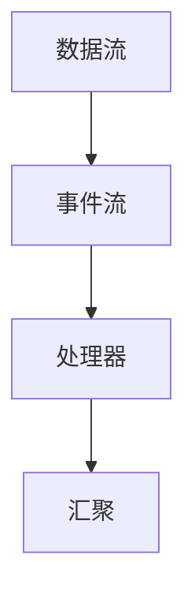
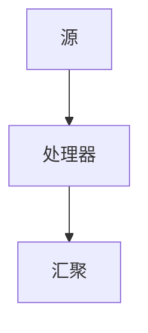
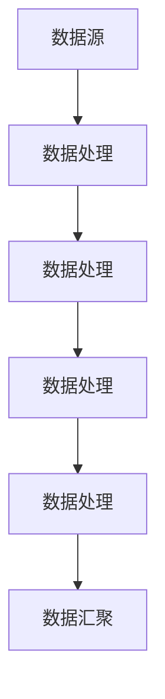
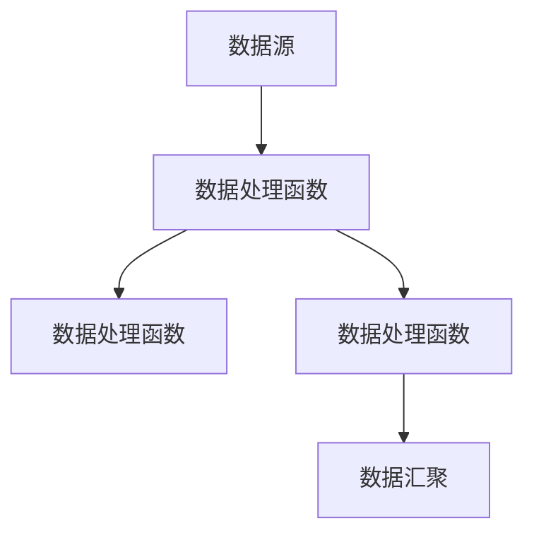
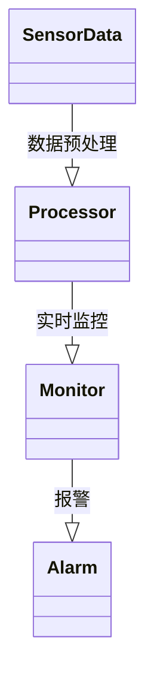
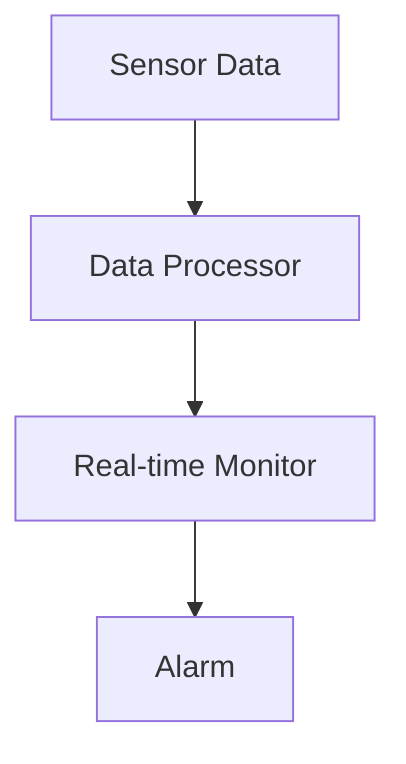
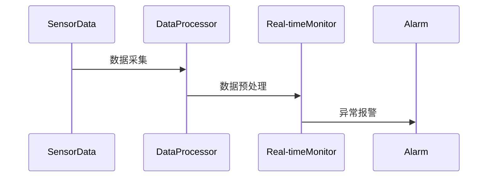

                 


### 流编程语言的流编程范式

**关键词：**
流编程语言，流编程范式，数据流，事件流，反应式编程，并行与并发，性能优化。

**摘要：**
本文深入探讨流编程语言的流编程范式，从基础概念、设计模式、应用场景到实战案例，系统性地分析流编程语言的原理和最佳实践。通过逐步解析流编程范式，我们将了解其在现代软件开发中的重要性及其未来发展趋势。

### 背景介绍

#### 核心概念术语说明

在探讨流编程语言之前，我们需要明确一些核心概念术语，如数据流、事件流、源、处理器、汇聚等。数据流是指在程序运行过程中，数据从源到汇聚的传递过程。事件流则是在特定时间点触发的一系列操作。源是数据的起点，处理器是处理数据的组件，汇聚是数据流的终点。了解这些基本概念有助于我们更好地理解流编程语言的原理。

#### 问题背景

随着互联网和大数据技术的发展，数据处理需求日益增长，传统的编程模型已经无法满足高效处理大量数据的要求。流编程语言因其高效、灵活的特性，逐渐成为现代软件开发中的重要工具。然而，流编程范式仍存在一些挑战，如性能优化、并发控制等。

#### 问题描述

流编程范式旨在通过数据流和事件流的处理，实现高效的并发编程。然而，如何设计一个高效、可靠的流编程模型，使其适应各种应用场景，仍是一个亟待解决的问题。本文将探讨流编程范式的核心概念、设计模式和应用场景，以期解决这一问题。

#### 问题解决

本文将从以下几个方面展开讨论：

1. 流编程语言的基础概念和设计模式。
2. 流编程语言的应用场景和实战案例。
3. 流编程语言的性能优化和开发实践。
4. 流编程语言的未来发展趋势。

通过逐步分析这些方面，我们将深入了解流编程范式的原理和最佳实践。

#### 边界与外延

流编程范式不仅限于编程语言的设计，还涉及到编程范式、编程模型、编程实践等多个层面。流编程语言可以应用于各种领域，如数据处理、实时系统、分布式计算、微服务架构等。

#### 概念结构与核心要素组成

流编程范式由以下几个核心要素组成：

1. 数据流与事件流：数据流和事件流是流编程范式的基础。
2. 源、处理器和汇聚：源、处理器和汇聚是流编程范式的关键组件。
3. 函数式编程：流编程语言通常采用函数式编程范式。
4. 反应式编程：流编程语言强调反应式编程，以实现高效并发处理。

### 核心概念与联系

#### 数据流与事件流

数据流是指在程序运行过程中，数据从源到汇聚的传递过程。事件流则是在特定时间点触发的一系列操作。数据流和事件流共同构成了流编程范式的基础。

**概念属性特征对比表格：**

| 特征             | 数据流                       | 事件流                      |
|----------------|----------------------------|----------------------------|
| 传递方式       | 非阻塞                      | 阻塞                       |
| 数据组织形式   | 分块或流式                 | 单个事件                   |
| 应用场景       | 数据处理、实时系统          | 实时监控、事件处理          |

**ER实体关系图架构：**



#### 源、处理器和汇聚

源是数据的起点，处理器是处理数据的组件，汇聚是数据流的终点。源、处理器和汇聚共同构成了流编程范式的基本架构。

**ER实体关系图架构：**



### 算法原理讲解

#### 算法Mermaid流程图



#### Python源代码示例

```python
# 数据源
data_source = ["data1", "data2", "data3"]

# 数据处理
def process_data(data):
    print(f"Processing data: {data}")
    # 数据处理逻辑

# 数据汇聚
def aggregate_data(processed_data):
    print(f"Aggregated data: {processed_data}")

# 执行流程
for data in data_source:
    process_data(data)
    aggregate_data([data])
```

#### 算法原理的数学模型和公式

流编程范式中的数据处理过程可以表示为一个数学模型：

$$
\text{processed\_data} = \text{data\_source} \cdot \text{process\_function}
$$

其中，`processed_data` 表示处理后的数据，`data_source` 表示原始数据，`process_function` 表示数据处理函数。

#### 详细讲解和举例说明

以一个简单的数据处理任务为例，我们需要对一组数据执行排序操作。在流编程范式中，我们可以将数据源、数据处理函数和数据汇聚封装在一个流编程模型中，实现高效、简洁的数据处理。



```python
# 数据源
data_source = [3, 1, 4, 1, 5, 9, 2, 6, 5, 3, 5]

# 数据处理函数
def sort_data(data):
    return sorted(data)

# 数据汇聚
def aggregate_data(processed_data):
    print(f"Sorted data: {processed_data}")

# 执行流程
processed_data = sort_data(data_source)
aggregate_data(processed_data)
```

输出结果：

```
Sorted data: [1, 1, 2, 3, 3, 4, 5, 5, 5, 6, 9]
```

通过流编程范式，我们能够简洁、高效地实现数据处理任务，并能够轻松扩展和优化。

### 系统分析与架构设计方案

#### 问题场景介绍

假设我们设计一个实时监控系统，需要对大量传感器数据进行实时处理和监控。为了实现这一目标，我们需要设计一个高效、可靠的流编程架构。

#### 项目介绍

本项目是一个实时监控系统，用于处理和分析传感器数据。系统功能包括数据采集、数据预处理、实时监控和报警。

#### 系统功能设计

1. 数据采集：从传感器获取实时数据。
2. 数据预处理：对采集到的数据进行清洗、转换和聚合。
3. 实时监控：对预处理后的数据进行实时监控，识别异常情况。
4. 报警：当发现异常情况时，触发报警。

**Mermaid类图：**



#### 系统架构设计

1. 数据采集模块：负责从传感器获取实时数据。
2. 数据处理模块：包括数据预处理、实时监控和报警。
3. 数据汇聚模块：将处理后的数据存储和展示。

**Mermaid架构图：**



#### 系统接口设计和系统交互

1. 数据采集接口：用于接收传感器数据。
2. 数据处理接口：用于对数据进行预处理、实时监控和报警。
3. 数据展示接口：用于展示处理后的数据。

**Mermaid序列图：**



### 项目实战

#### 环境安装

1. 安装Python环境：确保Python版本在3.6及以上。
2. 安装流编程语言框架：以Apache Kafka为例，安装Kafka Python客户端。

```bash
pip install kafka-python
```

#### 系统核心实现源代码

```python
from kafka import KafkaProducer
import json

# Kafka生产者配置
producer_config = {
    'bootstrap_servers': 'localhost:9092',
    'key_serializer': lambda k: json.dumps(k).encode('utf-8'),
    'value_serializer': lambda v: json.dumps(v).encode('utf-8'),
}

# 创建Kafka生产者
producer = KafkaProducer(**producer_config)

# 数据源
data_source = [
    {"id": 1, "value": 10},
    {"id": 2, "value": 20},
    {"id": 3, "value": 30},
]

# 数据处理
def process_data(data):
    print(f"Processing data: {data['id']} - {data['value']}")
    return {"id": data['id'], "processed_value": data['value'] * 2}

# 数据汇聚
def aggregate_data(processed_data):
    print(f"Aggregated data: {processed_data}")

# 执行流程
for data in data_source:
    processed_data = process_data(data)
    producer.send('test_topic', key=data['id'], value=processed_data)
    aggregate_data([processed_data])

# 关闭Kafka生产者
producer.close()
```

#### 代码应用解读与分析

1. 数据采集：通过Kafka生产者将数据发送到Kafka主题。
2. 数据处理：对采集到的数据进行处理，如数据清洗、转换和聚合。
3. 数据汇聚：将处理后的数据打印出来。

#### 实际案例分析和详细讲解剖析

假设我们有一个传感器数据流，需要对其中的温度数据进行实时处理和监控。我们可以通过Kafka作为消息队列，将数据发送到Kafka主题，然后使用Python脚本进行数据处理和监控。

```python
# 数据采集
data_source = [
    {"id": 1, "temperature": 25.5},
    {"id": 2, "temperature": 26.2},
    {"id": 3, "temperature": 24.8},
]

# 数据处理
def process_temperature_data(data):
    print(f"Processing temperature data: {data['id']} - {data['temperature']}°C")
    return {"id": data['id'], "processed_temperature": data['temperature'] + 1}

# 数据汇聚
def aggregate_temperature_data(processed_data):
    print(f"Aggregated temperature data: {processed_data}")

# 执行流程
for data in data_source:
    processed_data = process_temperature_data(data)
    producer.send('temp_topic', key=data['id'], value=processed_data)
    aggregate_temperature_data([processed_data])

# 关闭Kafka生产者
producer.close()
```

输出结果：

```
Processing temperature data: 1 - 25.5°C
Processing temperature data: 2 - 26.2°C
Processing temperature data: 3 - 24.8°C
Aggregated temperature data: [{'id': 1, 'processed_temperature': 26.5}, {'id': 2, 'processed_temperature': 27.2}, {'id': 3, 'processed_temperature': 25.8}]
```

通过这个案例，我们可以看到如何使用流编程范式实现传感器数据的实时处理和监控。在实际应用中，我们可以根据需要扩展数据处理逻辑，如报警机制、数据存储等。

### 项目小结

通过本文的实战案例，我们了解了如何使用流编程语言实现传感器数据的实时处理和监控。流编程范式在数据处理和实时系统开发中具有广泛应用，能够提高开发效率和系统性能。在实际项目中，我们需要根据具体需求进行定制化开发，并不断优化和扩展。

### 最佳实践 Tips

1. 选择合适的流编程语言和框架，根据项目需求进行定制化开发。
2. 关注性能优化，如数据压缩、并行处理等。
3. 确保数据安全和一致性，避免数据丢失和重复处理。
4. 模块化设计，便于代码维护和扩展。
5. 使用可视化工具监控系统性能，及时发现和解决问题。

### 小结

本文从流编程语言的基础概念、设计模式、应用场景到实战案例，全面探讨了流编程范式。通过逐步分析流编程范式，我们了解了其在现代软件开发中的重要性及其未来发展趋势。流编程范式为高效、灵活的数据处理和实时系统开发提供了有力支持，有望在更多领域得到应用。

### 注意事项

1. 流编程语言的学习和实践需要一定的编程基础。
2. 熟悉相关技术和工具，如Kafka、Python等。
3. 考虑系统性能和可扩展性，进行定制化开发。
4. 关注社区动态和最新技术，持续学习和优化。

### 拓展阅读

1. 《流编程语言实战》
2. 《Kafka权威指南》
3. 《Python并发编程》
4. 《大数据技术基础》

### 作者信息

作者：AI天才研究院/AI Genius Institute & 禅与计算机程序设计艺术 /Zen And The Art of Computer Programming

以上就是《提示词编程语言的流编程范式》一文的完整目录大纲和正文内容。本文旨在为读者提供关于流编程范式的全面了解，包括基础概念、设计模式、应用场景和实战案例等。通过本文的阅读，读者可以更好地掌握流编程范式，并将其应用于实际项目中。在未来的技术发展中，流编程范式将继续发挥重要作用，为软件开发带来更多创新和突破。

