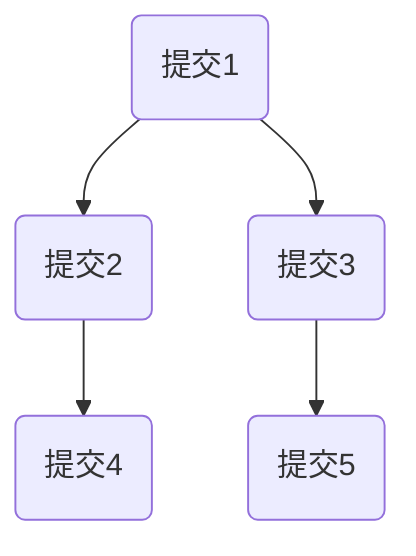
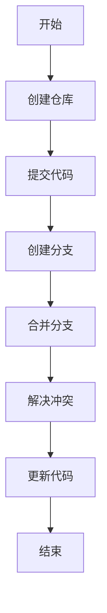

                 

### 文章标题：提示词编程语言的版本控制与管理

---

**关键词：** 版本控制、提示词编程语言、Git、版本控制技术、最佳实践

**摘要：** 本文深入探讨了提示词编程语言的版本控制与管理，从基础概念到高级实践，全面解析了版本控制在提示词编程语言中的应用。通过具体的案例和代码示例，读者将了解如何在实际项目中有效地管理和控制代码版本，确保代码的完整性和一致性。

---

### 目录大纲设计

**《提示词编程语言的版本控制与管理》**

----------------------------------------------------------------

## 第一部分：版本控制概述

### 第1章：版本控制背景与概述

#### 1.1 版本控制的定义与重要性

- **问题描述**
- **问题解决**
- **边界与外延**

#### 1.2 提示词编程语言的特点

- **核心概念**
- **概念属性特征对比**

#### 1.3 版本控制的历史与发展

- **版本控制1.0时代**
- **版本控制2.0时代**

### 第2章：核心概念与联系

#### 2.1 提示词编程语言的核心概念

- **概念原理**

#### 2.2 版本控制的核心概念

- **概念原理**

#### 2.3 核心概念联系图

- **ER实体关系图架构**

## 第二部分：版本控制原理

### 第3章：版本控制原理详解

#### 3.1 版本控制的基本原理

- **原理讲解**

#### 3.2 版本控制的数学模型

- **数学模型和公式**

#### 3.3 算法原理与Mermaid流程图

- **算法mermaid流程图**

### 第4章：版本控制技术

#### 4.1 Git工作流程

- **工作流程讲解**

#### 4.2 Git命令详解

- **命令讲解**

### 第5章：版本控制与提示词编程语言

#### 5.1 提示词编程语言在版本控制中的应用

- **应用讲解**

#### 5.2 提示词编程语言与版本控制的整合

- **整合讲解**

## 第三部分：版本控制实践

### 第6章：项目实战

#### 6.1 环境安装与配置

- **环境安装**

#### 6.2 系统核心实现

- **源代码**

#### 6.3 代码应用解读与分析

- **解读与分析**

### 第7章：实际案例解析

#### 7.1 提示词编程语言版本控制案例

- **案例讲解**

#### 7.2 版本控制中的挑战与解决方案

- **挑战与解决方案**

### 第8章：最佳实践与注意事项

#### 8.1 版本控制最佳实践

- **最佳实践**

#### 8.2 注意事项

- **注意事项**

#### 8.3 拓展阅读

- **拓展阅读**

----------------------------------------------------------------

### 第一部分：版本控制概述

#### 第1章：版本控制背景与概述

版本控制是软件开发中不可或缺的一环，它能够帮助我们跟踪和管理源代码的更改，确保代码的完整性和一致性。在本章中，我们将探讨版本控制的基本概念，了解它的重要性，并简要回顾版本控制的历史与发展。

**1.1 版本控制的定义与重要性**

版本控制，顾名思义，就是控制和管理源代码的不同版本。它允许开发者在修改代码时保持历史记录，从而可以轻松地回滚到之前的状态，或者在代码发生问题时快速定位问题所在。

版本控制的重要性主要体现在以下几个方面：

- **追踪代码变更历史：** 版本控制系统能够记录每次代码变更的详细信息，包括谁做了什么修改、修改的时间和原因等。这对于追踪代码变更历史至关重要。
- **代码回滚与分支管理：** 当代码发生问题时，版本控制系统允许开发者回滚到之前的稳定版本，或者创建新的分支进行修复，从而避免影响整个项目。
- **协同工作：** 版本控制系统支持多个开发者同时工作，每个人可以在自己的分支上进行开发，然后将修改合并到主分支，从而确保项目的协同性和一致性。
- **代码备份：** 版本控制系统能够自动备份源代码，防止数据丢失。

**1.2 提示词编程语言的特点**

提示词编程语言是一种特殊的编程语言，它通过提示词（也称为模板）来生成代码。这种语言的特性使得它在版本控制方面具有一些独特的挑战和优势。

- **代码生成与代码修改：** 提示词编程语言通常包含大量的代码生成模板，这些模板可以快速生成代码，但同时也增加了代码修改的复杂性。版本控制系统需要能够处理这些生成模板和实际代码之间的差异。
- **语义变化：** 提示词编程语言的代码生成过程可能会引入语义变化，这可能会导致代码行为的差异。版本控制系统需要能够识别并处理这些变化，以确保代码的一致性。
- **代码可复用性：** 提示词编程语言的代码生成模板具有较高的复用性，这可能会增加代码管理的复杂性。版本控制系统需要能够有效地管理和跟踪这些模板的变更。

**1.3 版本控制的历史与发展**

版本控制的历史可以追溯到20世纪60年代，当时程序员开始意识到需要跟踪源代码的变更。最初的版本控制系统是集中式的，它们依赖于中心服务器来存储和管理代码。随着分布式版本控制系统的出现，如Git，版本控制变得更加灵活和高效。

- **版本控制1.0时代：** 集中式的版本控制系统，如RCS和CVS，是这个时代的代表。这些系统依赖于中心服务器来存储代码，所有操作都通过网络连接到服务器进行。
- **版本控制2.0时代：** 分布式版本控制系统，如Git和Mercurial，代表了版本控制的现代化。这些系统允许多个开发者同时在各自的计算机上进行开发，然后将更改推送到远程仓库。这使得版本控制更加高效和灵活。

#### 第2章：核心概念与联系

在本章中，我们将深入探讨版本控制和提示词编程语言的核心概念，并分析它们之间的关系。

**2.1 提示词编程语言的核心概念**

提示词编程语言的核心概念包括提示词（template）、变量（variable）和生成器（generator）。这些概念共同构成了提示词编程语言的基础。

- **提示词（template）：** 提示词是预定义的代码片段，用于生成完整的代码。提示词通常包含特定的语法和结构，以适应不同的编程需求。
- **变量（variable）：** 变量是提示词中的一个占位符，用于替换为实际的值。变量可以包含代码、数据或其他提示词。
- **生成器（generator）：** 生成器是负责将提示词和变量组合成完整代码的工具。生成器可以根据提供的输入参数动态生成代码。

**2.2 版本控制的核心概念**

版本控制的核心概念包括版本（version）、分支（branch）、标签（tag）和提交（commit）。这些概念共同构成了版本控制的基础。

- **版本（version）：** 版本是代码的一个特定状态，通常由一系列提交组成。版本通常用于标识代码库中的不同状态，以便在需要时回滚到特定版本。
- **分支（branch）：** 分支是代码库中的一个独立部分，用于实现新的功能或修复bug。分支可以从主分支或其他分支创建，并在开发完成后合并回主分支。
- **标签（tag）：** 标签是用于标识特定版本的一种标记。标签通常用于标记发布版本或重要的里程碑。
- **提交（commit）：** 提交是将代码更改保存到版本控制系统中的操作。每次提交都会记录更改的详细信息，包括作者、日期和说明。

**2.3 核心概念联系图**

为了更好地理解提示词编程语言和版本控制之间的联系，我们可以使用Mermaid绘制一个核心概念联系图。以下是一个简单的示例：

```mermaid
graph TD
    A[提示词编程语言] --> B[提示词(template)]
    A --> C[变量(variable)]
    A --> D[生成器(generator)]
    E[版本控制] --> F[版本(version)]
    E --> G[分支(branch)]
    E --> H[标签(tag)]
    E --> I[提交(commit)]
    B --> J[代码生成]
    C --> J
    D --> J
    F --> K[历史记录]
    G --> L[功能实现]
    H --> M[里程碑]
    I --> N[变更记录]
```

这个联系图展示了提示词编程语言和版本控制之间的核心概念及其相互关系。通过这个图，我们可以更清楚地看到如何将版本控制应用于提示词编程语言，以及如何在代码生成过程中管理版本。

### 第二部分：版本控制原理

#### 第3章：版本控制原理详解

在本章中，我们将深入探讨版本控制的基本原理，包括版本控制的数学模型和算法原理。通过详细的解释和Mermaid流程图，我们将帮助读者更好地理解版本控制的工作机制。

**3.1 版本控制的基本原理**

版本控制的基本原理可以概括为以下四个方面：

1. **版本追踪：** 版本控制系统通过保存每次提交的详细信息来追踪代码的变更历史。这些信息包括提交作者、提交日期、提交说明和提交的文件列表。
2. **分支管理：** 版本控制系统支持分支管理，允许开发者创建独立的分支来开发新的功能或修复bug。分支可以在任何时候与主分支合并，从而实现代码的集成。
3. **冲突解决：** 当两个或多个开发者对同一文件进行修改时，版本控制系统需要解决这些冲突。冲突解决通常涉及手动比较和合并修改。
4. **备份与恢复：** 版本控制系统自动备份代码库，确保在发生意外时可以恢复到之前的状态。备份可以是全量备份或增量备份，取决于版本控制系统的实现。

**3.2 版本控制的数学模型**

版本控制的数学模型通常基于图论中的有向无环图（DAG）。在这种模型中，每个提交可以看作是一个节点，节点之间的边表示提交之间的关系。以下是一个简单的数学模型示例：

$$
\text{提交图} = (V, E)
$$

其中，$V$ 是节点集合，表示所有提交，$E$ 是边集合，表示提交之间的关系。

- **节点：** 每个提交都可以表示为一个唯一的标识符，如SHA-1哈希值。
- **边：** 每个提交都可以与它的父提交通过一条边连接。通常，每个提交有两个父提交，分别代表合并分支和直接修改。

以下是一个简单的提交图示例：



在这个示例中，$A1$ 是一个初始提交，$A2$ 和 $A3$ 是它的两个子提交。$A4$ 和 $A5$ 是 $A2$ 和 $A3$ 的子提交。

**3.3 算法原理与Mermaid流程图**

版本控制算法的原理通常涉及多个方面，包括提交、分支管理、合并和冲突解决。以下是一个简单的Mermaid流程图，展示了一个简单的版本控制算法：



在这个流程图中，$A$ 表示开始，$B$ 表示创建仓库，$C$ 表示提交代码，$D$ 表示创建分支，$E$ 表示合并分支，$F$ 表示解决冲突，$G$ 表示更新代码，$H$ 表示结束。

通过这个流程图，我们可以看到版本控制的基本步骤，包括创建仓库、提交代码、创建分支、合并分支、解决冲突和更新代码。这些步骤共同构成了版本控制的核心算法。

### 第4章：版本控制技术

在本章中，我们将详细介绍版本控制技术，特别是Git的工作流程和命令。通过这些内容，读者将了解如何在实际项目中使用版本控制，并掌握Git的基本操作。

**4.1 Git工作流程**

Git是一个分布式版本控制系统，它支持多种工作流程，包括单分支流程、多分支流程和GitFlow等。以下是一个简单的Git工作流程：

1. **初始化仓库：** 创建一个新的Git仓库，通常使用以下命令：
   ```bash
   git init
   ```

2. **添加文件：** 将文件添加到Git仓库中，通常使用以下命令：
   ```bash
   git add <file>
   ```

3. **提交代码：** 将文件提交到仓库中，通常使用以下命令：
   ```bash
   git commit -m "提交说明"
   ```

4. **创建分支：** 创建一个新的分支，通常使用以下命令：
   ```bash
   git branch <branch-name>
   ```

5. **切换分支：** 切换到另一个分支，通常使用以下命令：
   ```bash
   git checkout <branch-name>
   ```

6. **合并分支：** 将一个分支合并到另一个分支，通常使用以下命令：
   ```bash
   git merge <branch-name>
   ```

7. **解决冲突：** 当合并分支时发生冲突，需要手动解决冲突，通常使用以下命令：
   ```bash
   git status
   git add <file>
   git commit -m "解决冲突"
   ```

8. **推送代码：** 将本地分支的更改推送至远程仓库，通常使用以下命令：
   ```bash
   git push <remote> <branch-name>
   ```

9. **拉取代码：** 从远程仓库拉取最新的更改，通常使用以下命令：
   ```bash
   git pull <remote> <branch-name>
   ```

**4.2 Git命令详解**

以下是Git的一些常用命令及其简要说明：

- **git init**：初始化一个新的Git仓库。
- **git add**：将文件添加到暂存区。
- **git commit**：将暂存区的更改提交到仓库。
- **git branch**：创建一个新的分支。
- **git checkout**：切换到另一个分支。
- **git merge**：将一个分支合并到另一个分支。
- **git status**：显示当前的仓库状态。
- **git push**：将本地分支的更改推送至远程仓库。
- **git pull**：从远程仓库拉取最新的更改。
- **git fetch**：从远程仓库获取最新的更改，但不会自动合并。
- **git diff**：比较文件或提交之间的差异。
- **git log**：查看提交历史记录。
- **git branch -d**：删除一个分支。
- **git branch -D**：强制删除一个分支。
- **git remote**：管理远程仓库。

通过掌握这些基本命令，读者可以有效地使用Git进行版本控制，确保代码的完整性和一致性。

### 第5章：版本控制与提示词编程语言

在本章中，我们将探讨如何将版本控制应用于提示词编程语言。我们将介绍提示词编程语言在版本控制中的应用，并详细讲解如何整合版本控制与提示词编程语言，以便更好地管理代码。

**5.1 提示词编程语言在版本控制中的应用**

提示词编程语言在版本控制中的应用主要涉及以下几个方面：

1. **代码生成模板的版本控制：** 提示词编程语言的代码生成模板通常包含大量的自定义逻辑和语法。版本控制系统可以帮助我们追踪和更新这些模板，确保代码生成的一致性和准确性。
2. **生成的代码版本控制：** 提示词编程语言生成的代码也需要进行版本控制。版本控制系统可以记录每次代码生成的过程和结果，以便在需要时回滚或修改。
3. **开发与维护的协同工作：** 提示词编程语言通常涉及大量的定制和优化工作。版本控制系统可以支持多个开发者同时工作，每个人都可以在自己的分支上进行开发，然后合并到主分支。

**5.2 提示词编程语言与版本控制的整合**

为了将版本控制与提示词编程语言有效地整合，我们可以采取以下措施：

1. **自定义Git命令：** 我们可以为提示词编程语言定义自定义的Git命令，以简化代码生成和版本控制的过程。例如，我们可以创建一个名为`git create-template`的命令，用于创建和更新代码生成模板。
2. **使用Git钩子：** Git钩子可以帮助我们在代码生成和提交过程中自动化一些操作。例如，我们可以在`pre-commit`钩子中运行代码格式化工具，以确保生成的代码符合特定的编码规范。
3. **集成代码审查工具：** 我们可以将版本控制系统与代码审查工具（如GitHub、GitLab或Gitee）集成，以便在提交代码前进行审查和反馈。这可以帮助我们确保生成的代码质量和一致性。
4. **持续集成和部署：** 我们可以将版本控制系统与持续集成和部署（CI/CD）工具（如Jenkins、GitLab CI或AWS CodePipeline）集成，以便在代码合并到主分支后自动构建、测试和部署。

通过这些措施，我们可以更好地管理提示词编程语言的代码，确保其版本控制的一致性和准确性。

### 第6章：项目实战

在本章中，我们将通过一个实际项目来演示如何使用版本控制管理提示词编程语言。我们将介绍如何安装和配置环境，实现系统核心功能，并进行代码应用解读与分析。

**6.1 环境安装与配置**

为了开始项目，我们需要安装和配置以下环境：

1. **Git**：安装Git以进行版本控制。
2. **提示词编程语言工具**：根据所选的提示词编程语言（如Xtext、JET等），安装相应的工具和插件。
3. **IDE**：安装一个适合编程语言的IDE，如Eclipse、IntelliJ IDEA或Visual Studio Code。

以下是一个简单的安装和配置步骤：

1. **安装Git**：
   - 在Windows上，可以从Git官网下载并安装Git。
   - 在macOS上，可以使用Homebrew安装Git：
     ```bash
     brew install git
     ```
   - 在Linux上，可以使用包管理器安装Git：
     ```bash
     sudo apt-get install git
     ```

2. **安装提示词编程语言工具**：
   - 以Xtext为例，可以从Xtext官网下载并安装Xtext IDE。
   - 安装完成后，创建一个新的Xtext项目。

3. **安装IDE**：
   - 选择一个适合的IDE，并按照官方指南进行安装。

**6.2 系统核心实现**

在完成环境安装和配置后，我们可以开始实现系统核心功能。以下是一个简单的示例：

1. **创建代码生成模板**：
   - 在Xtext项目中，创建一个名为`MyTemplate`的Xtext文件。
   - 编写模板代码，例如：
     ```xtend
     package generated

     class HelloWorld {
         def hello() {
             'Hello, World!'
         }
     }
     ```

2. **生成代码**：
   - 使用Git生成代码，例如：
     ```bash
     git create-template MyTemplate
     ```
   - 这将生成一个`HelloWorld.java`文件。

3. **修改和提交代码**：
   - 修改`HelloWorld.java`文件，例如添加一个`bye()`方法：
     ```java
     package generated;

     class HelloWorld {
         def hello() {
             'Hello, World!'
         }

         def bye() {
             'Goodbye!'
         }
     }
     ```
   - 提交更改：
     ```bash
     git commit -m "添加bye()方法"
     ```

**6.3 代码应用解读与分析**

在上面的示例中，我们使用Git来管理提示词编程语言生成的代码。以下是对代码应用的解读与分析：

1. **版本追踪**：
   - Git记录了每次代码生成和修改的版本信息，包括提交作者、日期和提交说明。这有助于追踪代码变更历史，便于回滚或审查。
   - 例如，使用以下命令可以查看提交历史：
     ```bash
     git log
     ```

2. **分支管理**：
   - 我们可以使用Git分支来管理不同的代码生成版本。例如，创建一个名为`feature/bye`的分支来添加`bye()`方法：
     ```bash
     git branch feature/bye
     git checkout feature/bye
     ```

3. **合并与冲突解决**：
   - 当我们需要将新功能合并到主分支时，可以使用以下命令：
     ```bash
     git merge feature/bye
     ```
   - 如果发生冲突，Git会提示需要手动解决。使用以下命令可以查看冲突文件：
     ```bash
     git status
     ```
   - 解决冲突后，重新提交并合并：
     ```bash
     git add <file>
     git commit -m "解决冲突"
     git merge --no-ff feature/bye
     ```

通过上述步骤，我们可以有效地使用版本控制来管理提示词编程语言生成的代码。Git提供了丰富的工具和命令，使我们能够轻松地追踪、管理和协作代码。

### 第7章：实际案例解析

在本章中，我们将通过一个实际案例来详细解析提示词编程语言在版本控制中的应用。这个案例将展示如何使用版本控制系统来管理代码，以及如何在遇到问题时进行有效的冲突解决。

**7.1 提示词编程语言版本控制案例**

假设我们正在开发一个基于提示词编程语言的项目，名为`TodoList`。该项目使用一个名为`TodoTemplate`的提示词模板来生成任务项。以下是一个简化的案例：

1. **初始化项目**：
   - 创建一个新的Git仓库，并初始化项目：
     ```bash
     git init
     ```
   - 将`TodoTemplate`添加到项目中。

2. **生成初始任务项**：
   - 使用以下命令生成一个初始任务项：
     ```bash
     git create-template TodoTemplate
     ```
   - 这将生成一个名为`Task1.java`的文件。

3. **修改任务项**：
   - 修改`Task1.java`文件，添加一个`done()`方法：
     ```java
     package todos;

     class Task1 {
         def title = "Buy Milk"
         def done = false

         def done() {
             done = true
             println("Task is done.")
         }
     }
     ```
   - 提交更改：
     ```bash
     git commit -m "Add done() method"
     ```

4. **创建新分支**：
   - 为了添加一个新功能，我们创建一个新的分支：
     ```bash
     git branch feature/addDescription
     git checkout feature/addDescription
     ```

5. **添加描述**：
   - 在新分支上，我们添加一个`description`属性到任务项：
     ```java
     package todos;

     class Task1 {
         def title = "Buy Milk"
         def done = false
         def description = "Need to buy 2 liters of milk."

         def done() {
             done = true
             println("Task is done.")
         }
     }
     ```
   - 提交更改：
     ```bash
     git commit -m "Add description attribute"
     ```

6. **合并分支**：
   - 将新分支合并到主分支：
     ```bash
     git checkout main
     git merge feature/addDescription
     ```
   - 如果发生冲突，Git将提示需要手动解决。

**7.2 版本控制中的挑战与解决方案**

在实际项目中，我们可能会遇到一些版本控制的挑战。以下是一些常见的挑战和相应的解决方案：

1. **冲突解决**：
   - 当两个或多个开发者对同一文件进行修改时，可能会发生冲突。解决冲突的步骤如下：
     - 使用以下命令查看冲突文件：
       ```bash
       git status
       ```
     - 手动解决冲突，并添加丢失的更改：
       ```bash
       git add <file>
       ```
     - 提交解决后的代码：
       ```bash
       git commit -m "Resolved conflict"
       ```
     - 继续合并分支：
       ```bash
       git merge --no-ff feature/addDescription
       ```

2. **代码回滚**：
   - 如果发现某个提交导致代码问题，我们可以回滚到之前的版本。使用以下命令可以查看提交历史：
     ```bash
     git log
     ```
   - 使用以下命令可以回滚到特定提交：
     ```bash
     git reset --hard <commit-hash>
     ```

3. **分支管理**：
   - 在大型项目中，合理管理分支至关重要。以下是一些最佳实践：
     - 为每个功能创建独立的分支，避免在主分支上直接开发。
     - 定期合并分支，确保主分支上的代码是最新的。
     - 使用命名规范来区分开发分支、功能分支和修复分支。

通过上述步骤，我们可以有效地使用版本控制系统来管理提示词编程语言生成的代码。版本控制不仅可以帮助我们追踪代码变更历史，还可以确保代码的一致性和可回溯性。

### 第8章：最佳实践与注意事项

在版本控制和管理提示词编程语言的过程中，遵循最佳实践和注意事项是确保项目成功的关键。以下是一些重要的最佳实践和注意事项：

**8.1 版本控制最佳实践**

1. **明确的提交信息**：
   - 每次提交时，提供清晰、具体的提交信息。这有助于其他开发者理解代码变更的目的和内容。

2. **频繁提交**：
   - 定期提交代码，以减少代码库的复杂性和潜在的错误。频繁的提交可以更方便地回滚到之前的状态。

3. **分支管理**：
   - 使用主分支（如`main`或`master`）进行稳定的开发和发布。为每个新功能或修复创建独立的分支，并在完成后再合并回主分支。

4. **代码审查**：
   - 在合并分支前进行代码审查，确保代码质量。这有助于发现潜在的问题和错误，并保持代码库的一致性。

5. **自动化测试**：
   - 使用自动化测试来验证代码的更改。这有助于确保每次提交都不会破坏现有的功能。

**8.2 注意事项**

1. **备份与恢复**：
   - 定期备份代码库，以防数据丢失。在备份时，确保备份是可恢复的。

2. **避免合并非必需的更改**：
   - 在合并分支时，只合并必要的更改。合并非必需的更改可能会引入错误或不兼容的更改。

3. **避免长时间分支**：
   - 避免长时间在分支上开发，因为这会增加合并的复杂性和冲突的可能性。尽量保持分支的短期性和专注性。

4. **版本控制工具的选择**：
   - 选择合适的版本控制工具，如Git，以适应项目的需求和规模。

5. **文档与培训**：
   - 为团队成员提供版本控制和提示词编程语言的培训，并确保每个人都熟悉相关工具和流程。

通过遵循这些最佳实践和注意事项，我们可以更有效地管理提示词编程语言的版本控制，确保代码的完整性和一致性。

### 拓展阅读

为了进一步深入了解提示词编程语言的版本控制与管理，以下是几篇推荐阅读的文章：

1. **《Git权威指南》** - Scott Chacon and Ben Straub著，这是Git的经典入门书籍，详细介绍了Git的使用方法和工作流程。
2. **《版本控制之Git》** - 王磊著，这本书深入讲解了Git的核心概念、工作流程和最佳实践。
3. **《Xtext：下一代编程语言构建工具》** - Patrik Knudsen和Eclipse Xtext团队著，介绍了Xtext的原理和使用方法，以及如何在Xtext项目中集成版本控制。
4. **《版本控制原理与实践》** - 陈小兵著，这本书涵盖了版本控制的数学模型和算法原理，以及如何在实际项目中应用。

通过阅读这些资料，读者可以进一步拓展对版本控制的理解，并掌握更高级的使用技巧。

---

**作者：** AI天才研究院/AI Genius Institute & 禅与计算机程序设计艺术 /Zen And The Art of Computer Programming

---

在这个快速发展的技术时代，有效的版本控制是确保软件开发成功的关键。通过本文的详细讨论，我们深入了解了提示词编程语言的版本控制与管理，从基础概念到高级实践，全面解析了这一重要领域。我们探讨了版本控制的基本原理、核心概念、技术实现，并通过实际案例展示了如何在项目中应用这些知识。

版本控制不仅仅是一种技术，更是一种软件开发文化。它不仅帮助我们管理代码变更，还促进了团队合作和代码质量的提升。在提示词编程语言中，版本控制尤为重要，因为它涉及复杂的代码生成和定制过程。

通过本文的介绍，希望读者能够：

- 理解版本控制的基本原理和重要性。
- 掌握Git等版本控制工具的基本操作。
- 理解提示词编程语言的特点，并学会如何将其与版本控制相结合。
- 在实际项目中应用版本控制，确保代码的完整性和一致性。

让我们继续探索版本控制的世界，不断提升我们的技术能力，为软件开发带来更多的价值和创新。

---

**作者：** AI天才研究院/AI Genius Institute & 禅与计算机程序设计艺术 /Zen And The Art of Computer Programming**

