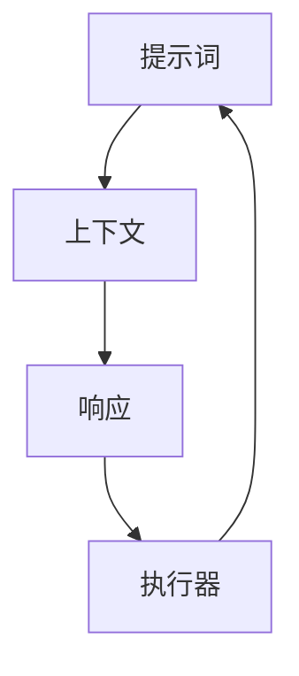
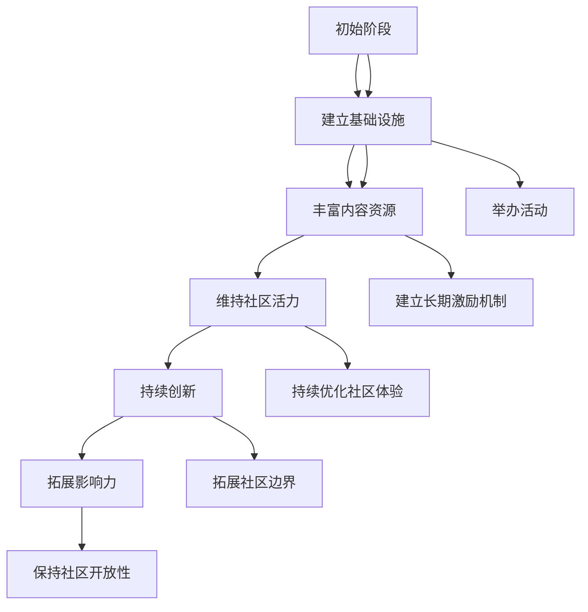

                 

### 《提示词编程语言的社区生态建设》

#### 关键词：
- 提示词编程语言
- 社区生态建设
- 开源社区
- 生态系统
- 社区管理

#### 摘要：
本文将深入探讨提示词编程语言的社区生态建设，分析其背景、核心概念、建设原理及实践。通过详细的案例分析，总结最佳实践，并提出未来展望。文章旨在为开发者提供系统化的社区建设指南，助力提升提示词编程语言的社区活力和影响力。

### 目录大纲设计思路

在设计《提示词编程语言的社区生态建设》这本书的目录大纲时，我们将遵循以下思路和步骤：

1. **背景介绍**：首先，介绍提示词编程语言的概念、发展背景以及社区生态建设的意义。
2. **核心概念与联系**：定义并对比提示词编程语言的核心概念，使用Mermaid流程图展示其内部关系。
3. **社区生态建设原理**：阐述社区生态建设的原则、策略和方法，通过Mermaid流程图展示建设过程。
4. **建设实践**：详细讲解社区生态建设过程中的关键实践，包括工具选择、社区管理、用户参与等方面。
5. **案例分析**：分析成功案例，总结经验教训，提供实际操作指南。
6. **最佳实践**：总结最佳实践，给出社区生态建设中的注意事项和拓展阅读建议。

#### 目录大纲

```markdown
# 《提示词编程语言的社区生态建设》目录大纲

## 第一部分：背景与核心概念

## 第1章 提示词编程语言概述
### 1.1 提示词编程语言的定义与特点
### 1.2 提示词编程语言的发展背景
### 1.3 社区生态建设的重要性

## 第2章 提示词编程语言的核心概念
### 2.1 提示词的定义与作用
### 2.2 核心概念的对比分析
### 2.3 Mermaid流程图展示核心概念关系

## 第二部分：社区生态建设原理

## 第3章 社区生态建设的基础理论
### 3.1 社区生态建设的原则
### 3.2 社区生态建设的策略
### 3.3 社区生态建设的方法

## 第4章 社区生态建设的过程
### 4.1 社区建设的初始阶段
### 4.2 社区发展的成长阶段
### 4.3 社区的成熟阶段
### 4.4 社区生态建设的Mermaid流程图

## 第三部分：社区生态建设实践

## 第5章 提示词编程社区工具选择
### 5.1 社区工具的类型与功能
### 5.2 工具选择的考虑因素
### 5.3 常用社区工具介绍与配置

## 第6章 社区管理与维护
### 6.1 社区管理的原则与方法
### 6.2 用户管理策略
### 6.3 内容审核与社区氛围建设

## 第7章 用户参与与激励
### 7.1 用户参与的激励机制
### 7.2 用户活跃度提升策略
### 7.3 用户反馈与改进机制

## 第四部分：案例分析

## 第8章 提示词编程社区建设案例研究
### 8.1 案例一：成功社区建设案例
### 8.2 案例分析：成功要素与经验
### 8.3 案例二：社区建设失败案例分析
### 8.4 案例总结与启示

## 第五部分：最佳实践与总结

## 第9章 最佳实践总结
### 9.1 最佳实践分享
### 9.2 注意事项与风险防范
### 9.3 拓展阅读推荐

## 第10章 社区生态建设的未来展望
### 10.1 社区生态建设的挑战
### 10.2 未来发展趋势
### 10.3 社区建设的愿景与使命
```

### 补充说明

- **第1章** 和 **第2章** 作为背景介绍和核心概念阐述，主要提供理论基础，使读者对提示词编程语言和社区生态建设有一个整体了解。
- **第3章** 至 **第7章** 深入讲解社区生态建设的原理和实践，逐步引导读者理解建设过程的各个方面。
- **第8章** 通过案例分析，提供实际操作的经验和教训，帮助读者更好地理解社区生态建设的关键点。
- **第9章** 对最佳实践进行总结，并提供注意事项和拓展阅读，帮助读者在社区生态建设中更好地应用所学知识。
- **第10章** 展望未来，提出社区生态建设的挑战和趋势，为读者提供更广阔的视野。

通过以上设计，本书将系统地介绍提示词编程语言的社区生态建设，帮助读者全面掌握相关知识和实践技巧。

---

### 1.1 提示词编程语言的定义与特点

提示词编程语言（Prompt-Based Programming Language），简称PBL，是一种新型的编程范式，它通过预设的提示词（prompt）来引导程序执行。提示词可以是一个简单的字符串、一个复杂的命令序列，甚至是包含参数的模板。这种编程语言的核心在于通过提示词与用户的交互，实现代码生成和逻辑控制。

**定义：**
提示词编程语言是用于定义和执行计算任务的计算机语言，它通过提供预定义的提示词来引导程序逻辑，而非传统的基于语句的编程方法。

**特点：**
1. **直观性：** 提示词编程语言使用简单、直观的提示词来表示复杂的操作，降低了编程难度。
2. **灵活性：** 提示词可以动态变化，适应不同的计算场景，提高了编程的灵活性。
3. **可扩展性：** 提示词编程语言通常支持插件和扩展，方便开发者根据需求进行定制化开发。
4. **交互性：** 通过与用户的交互，提示词编程语言可以更好地理解用户意图，实现智能化的编程体验。
5. **易用性：** 对非专业程序员友好，降低了编程的门槛，促进了编程的普及。

#### 发展背景

提示词编程语言并非一蹴而就，其发展历程可以追溯到自然语言处理（NLP）和自动化编程的研究。随着人工智能技术的不断进步，特别是生成对抗网络（GAN）、变换器（Transformer）等深度学习模型的兴起，提示词编程语言逐渐成为一种新的编程范式。

早期，研究人员通过自然语言与编程语言的结合，探索如何使用自然语言指令来控制程序执行。随着技术的成熟，现代提示词编程语言如Python、Lua等，逐渐引入了更复杂和高效的提示词机制，使得编程更加直观和高效。

#### 社区生态建设的重要性

社区生态建设对于提示词编程语言的可持续发展至关重要。一个健康、活跃的社区不仅能够提供丰富的资源和交流平台，还能够吸引更多的开发者参与，推动技术的不断进步。

1. **资源共享：** 社区可以提供大量的示例代码、教程和文档，帮助新手快速入门。
2. **问题解决：** 开发者在遇到问题时，可以通过社区获得帮助，分享经验和解决方案。
3. **代码贡献：** 社区鼓励开发者贡献代码和文档，共同完善提示词编程语言。
4. **创新驱动：** 社区成员可以提出新的需求，推动语言和工具的迭代升级。
5. **影响力扩大：** 一个强大的社区可以提升提示词编程语言的影响力和知名度，吸引更多的关注和资源。

### 1.2 提示词编程语言的发展背景

提示词编程语言的发展可以追溯到计算机科学和人工智能领域的早期研究。20世纪80年代，随着个人计算机的普及和软件开发的需求增加，研究人员开始探索如何使编程更加直观和易于使用。传统的命令行编程和基于语句的编程方法虽然功能强大，但对于非专业人士来说，学习曲线较高，操作复杂。因此，一种新的编程范式——提示词编程语言应运而生。

**自然语言处理与自动化编程的研究**

在提示词编程语言的发展过程中，自然语言处理（NLP）和自动化编程的研究起到了关键作用。NLP技术的进步使得计算机能够更好地理解和处理自然语言，而自动化编程技术则使得计算机能够自动生成代码。这些技术的结合，为提示词编程语言提供了理论基础和技术支撑。

**20世纪80年代：早期探索**

20世纪80年代，一些研究人员开始尝试将自然语言与编程语言结合，以简化编程过程。例如，Dartmouth College的Alan Kay提出了Smalltalk语言，它通过图形界面和自然语言指令来简化编程。虽然Smalltalk并不是一个纯粹的提示词编程语言，但它的设计理念对后来的提示词编程语言产生了深远影响。

**21世纪初：现代提示词编程语言的兴起**

随着人工智能技术的快速发展，特别是深度学习模型的兴起，提示词编程语言迎来了新的发展机遇。生成对抗网络（GAN）、变换器（Transformer）等模型的应用，使得计算机能够更准确地理解和生成复杂指令。Python、Lua等现代编程语言逐渐引入了提示词机制，使得编程变得更加直观和高效。

**2010年代：社区生态的形成**

进入21世纪，随着互联网的普及和开源文化的兴起，提示词编程语言的社区生态逐渐形成。许多开发者开始贡献自己的代码和教程，分享使用经验。一些著名的开源项目如Python、Lua等，不仅提供了强大的编程能力，还建立了庞大的社区，为提示词编程语言的推广和应用提供了有力支持。

### 1.3 社区生态建设的重要性

提示词编程语言的社区生态建设是确保其可持续发展和广泛应用的关键。一个健康、活跃的社区不仅能够提供丰富的资源和交流平台，还能够吸引更多的开发者参与，推动技术的不断进步。

1. **资源共享：** 社区可以提供大量的示例代码、教程和文档，帮助新手快速入门。这些资源包括基础教程、进阶教程、实战项目等，涵盖了从初学者到高级开发者的各种需求。
2. **问题解决：** 开发者在遇到问题时，可以通过社区获得帮助，分享经验和解决方案。社区中的专家和资深开发者可以提供专业的指导和建议，帮助新手解决问题。
3. **代码贡献：** 社区鼓励开发者贡献代码和文档，共同完善提示词编程语言。这种协作模式不仅能够提高代码质量，还能够激发创新思维，推动技术进步。
4. **创新驱动：** 社区成员可以提出新的需求，推动语言和工具的迭代升级。通过社区的反馈和需求分析，开发者可以更好地了解用户的需求，优化和改进现有功能。
5. **影响力扩大：** 一个强大的社区可以提升提示词编程语言的影响力和知名度，吸引更多的关注和资源。通过社区活动、研讨会、会议等，提示词编程语言可以更好地传播，吸引更多的开发者加入。

总的来说，社区生态建设是提示词编程语言可持续发展的重要保障。通过建立一个健康、活跃的社区，可以激发创新活力，提高编程效率，推动技术的不断进步。

### 1.4 提示词编程语言的核心概念

提示词编程语言（PBL）的核心概念包括提示词（Prompt）、上下文（Context）、响应（Response）和执行器（Executor）。这些概念相互关联，共同构成了提示词编程语言的基本运作机制。下面我们将详细探讨这些核心概念的定义、属性以及它们之间的关系。

#### 提示词（Prompt）

提示词是提示词编程语言中用于引导程序执行的关键元素。它通常是一个简短的文本或命令，用于指示程序进行某种特定的操作。提示词可以是简单的，如“打印‘Hello, World!’”，也可以是复杂的，包含多个指令和参数。

**属性：**
- **简洁性：** 提示词通常简洁明了，易于理解和记忆。
- **多样性：** 提示词可以有多种形式，包括命令、参数和上下文引用。
- **可扩展性：** 提示词支持扩展和插件，以适应不同的编程场景。

**作用：**
- **引导执行：** 提示词用于指示程序执行何种操作。
- **交互性：** 提示词编程语言通过提示词与用户进行交互，获取用户输入并作出响应。

#### 上下文（Context）

上下文是提示词编程语言中的环境信息，用于提供执行提示词所需的背景信息。上下文可以是静态的，如变量、函数等，也可以是动态的，如用户输入、系统状态等。

**属性：**
- **动态性：** 上下文可以根据执行过程实时更新。
- **灵活性：** 上下文信息可以灵活配置，以适应不同的编程需求。
- **共享性：** 上下文信息可以被多个提示词共享，提高代码复用性。

**作用：**
- **提供信息：** 上下文为提示词的执行提供必要的信息。
- **支持复用：** 通过上下文，可以减少重复代码，提高编程效率。

#### 响应（Response）

响应是程序对提示词执行后的输出结果。它可以是一个简单的文本输出，也可以是复杂的对象或数据结构。响应是提示词编程语言与用户交互的重要媒介。

**属性：**
- **多样性：** 响应形式多样，包括文本、图形、音频等。
- **动态性：** 响应可以根据执行过程实时更新。
- **可扩展性：** 响应支持扩展和插件，以适应不同的输出需求。

**作用：**
- **交互反馈：** 响应用于反馈执行结果，帮助用户理解程序状态。
- **数据驱动：** 响应可以作为后续提示词的输入，实现数据驱动编程。

#### 执行器（Executor）

执行器是提示词编程语言的核心组件，负责接收提示词、解析上下文、执行操作并生成响应。执行器通常是一个程序或框架，能够处理各种提示词和上下文信息，实现自动化编程。

**属性：**
- **可配置性：** 执行器可以根据不同需求进行配置。
- **模块化：** 执行器支持模块化设计，便于维护和扩展。
- **兼容性：** 执行器通常兼容多种编程语言和平台。

**作用：**
- **程序控制：** 执行器用于控制程序执行流程，实现自动化操作。
- **优化性能：** 执行器可以优化代码执行效率，提高编程性能。

#### 核心概念的关系

提示词、上下文、响应和执行器之间相互关联，共同构成了提示词编程语言的基本运作机制。提示词用于引导执行器执行操作，上下文提供执行所需的信息，响应则是执行结果的表现。执行器负责协调这些元素，实现高效的程序执行。

- **提示词 → 执行器：** 提示词被传递给执行器，执行器根据提示词内容和上下文执行操作。
- **上下文 → 执行器：** 执行器使用上下文信息来解析和执行提示词。
- **执行器 → 响应：** 执行器生成响应，作为程序输出的结果。
- **响应 → 提示词：** 响应可以作为新的提示词，驱动后续的执行操作。

通过这些核心概念的相互作用，提示词编程语言实现了直观、灵活和高效的编程体验，为开发者提供了强大的工具。

### 1.5 提示词编程语言的核心概念对比分析

在提示词编程语言（PBL）的发展过程中，出现了多种不同的编程范式和实现方式。为了更好地理解这些语言之间的异同，我们可以从几个核心概念出发，对比分析它们的主要特点。

**1. 提示词的多样性**

不同提示词编程语言对提示词的定义和形式有不同的处理方式。一些语言如Python的Prompt，强调简洁明了的提示词，使得用户可以轻松地通过简单的文本指令来引导程序执行。而其他语言如Prolog，则采用逻辑式提示词，使用复杂的规则和模式匹配来处理提示词。

| 语言       | 提示词形式          | 举例                             |
|------------|---------------------|----------------------------------|
| Python     | 简单文本指令        | `print("Hello, World!")`          |
| Prolog     | 逻辑式指令          | `hello(X) :- X = "World".`       |
| Lua        | 功能性提示词        | `print("Hello, World!")`          |

**2. 上下文的管理**

上下文在提示词编程语言中扮演重要角色，不同的语言对上下文的管理方式和灵活性也有所不同。Python和Lua等语言允许用户动态地创建和修改上下文信息，使得编程更加灵活。而一些基于逻辑编程的语言如Prolog，上下文信息通常通过规则和模式进行管理，强调数据的一致性和完整性。

| 语言       | 上下文管理          | 举例                             |
|------------|---------------------|----------------------------------|
| Python     | 动态上下文          | `context = {"user": "Alice"}`     |
| Prolog     | 规则式上下文        | `context([X, Y], Z).`             |
| Lua        | 配置式上下文        | `context = {user = "Bob", age = 30}` |

**3. 响应的形式**

响应是提示词编程语言执行后的输出结果，不同语言对响应的形式处理也有所不同。Python和Lua等语言通常支持多种形式的响应，包括文本、图形和音频等。而一些基于规则的语言如Prolog，响应通常以逻辑式表示，强调数据的逻辑关系。

| 语言       | 响应形式          | 举例                             |
|------------|-------------------|----------------------------------|
| Python     | 文本、图形、音频   | `print("Hello, World!")`          |
| Prolog     | 逻辑式输出        | `?- hello(X).`                    |
| Lua        | 文本、图形        | `print("Hello, World!")`          |

**4. 执行器的实现**

执行器是提示词编程语言的核心组件，负责接收提示词、解析上下文、执行操作并生成响应。不同的语言在执行器的实现方式上也有所区别。Python等语言通常使用解释器或编译器来执行代码，而Prolog等语言则采用逻辑推理机来处理提示词和上下文。

| 语言       | 执行器实现          | 举例                             |
|------------|--------------------|----------------------------------|
| Python     | 解释器/编译器       | `python script.py`                |
| Prolog     | 逻辑推理机          | `prolog script.pl`                |
| Lua        | 解释器              | `lua script.lua`                  |

通过上述对比分析，我们可以看出，提示词编程语言在核心概念上有一定的共性，但也存在显著的差异。了解这些差异有助于开发者选择合适的编程语言，实现高效的编程体验。同时，这种对比分析也为提示词编程语言的研究和发展提供了有益的参考。

### 1.6 提示词编程语言的核心概念关系图

为了更直观地展示提示词编程语言（PBL）的核心概念之间的关系，我们可以使用Mermaid流程图来绘制概念之间的联系。以下是核心概念关系图：



**图1：提示词编程语言核心概念关系图**

- **提示词（Prompt）**：作为引导程序执行的关键元素，它指示执行器进行何种操作。
- **上下文（Context）**：提供执行提示词所需的背景信息，如变量、函数等。
- **响应（Response）**：提示词执行后的输出结果，可以是文本、图形、音频等。
- **执行器（Executor）**：负责接收提示词、解析上下文、执行操作并生成响应。

**关系解释：**

- 提示词（A）被传递给执行器（D），指示执行器进行特定操作。
- 执行器（D）使用上下文（B）中的信息来解析和执行提示词。
- 执行器（D）生成响应（C），作为程序输出的结果。
- 响应（C）可以作为新的提示词，驱动后续的执行操作，形成闭环。

通过这个关系图，我们可以清晰地看到提示词编程语言中各核心概念之间的相互作用和依赖关系。这有助于开发者更好地理解提示词编程语言的工作原理，从而在实际开发中更有效地应用这些概念。

### 1.7 社区生态建设的基础理论

社区生态建设是提示词编程语言成功发展的关键环节。一个健康、活跃的社区不仅能够提供丰富的资源和交流平台，还能吸引更多的开发者参与，推动技术的不断进步。以下是社区生态建设的基础理论，包括社区生态建设的原则、策略和方法。

#### 1.7.1 社区生态建设的原则

1. **开放性原则**：社区应鼓励开放性，允许所有开发者自由参与和贡献。这包括代码贡献、文档编写、社区讨论等。开放性能够促进资源共享，提升社区的整体水平。
2. **协作性原则**：社区成员之间应建立良好的协作关系，共同解决问题，分享经验和知识。协作能够提高社区的创新能力和解决问题的效率。
3. **互惠性原则**：社区应确保成员之间的互惠性，即成员在贡献的同时能够获得相应的回报和认可。这种互惠性能够激励成员积极参与社区活动。
4. **包容性原则**：社区应欢迎各种背景和技能水平的开发者，营造包容的氛围，使每个人都能在社区中找到自己的位置。
5. **可持续性原则**：社区应制定可持续发展的策略，确保社区资源的持续积累和优化，以应对未来的挑战。

#### 1.7.2 社区生态建设的策略

1. **资源建设策略**：社区应积极建设丰富的资源库，包括文档、教程、示例代码、视频等。这些资源可以帮助新手快速入门，提高开发效率。
2. **社区管理策略**：社区应建立有效的管理制度，包括社区规则、角色分配、权限管理等。良好的管理能够维护社区的秩序，提高社区的整体运行效率。
3. **交流互动策略**：社区应鼓励成员之间的交流互动，通过线上论坛、社交媒体、会议等方式，促进知识共享和经验交流。
4. **激励机制策略**：社区应制定激励机制，鼓励成员积极参与社区活动，如代码贡献、文档编写、问题解答等。激励机制可以是荣誉称号、积分奖励、财务补助等。
5. **扩展性策略**：社区应具备良好的扩展性，能够根据需求快速调整和扩展，以适应社区的发展。

#### 1.7.3 社区生态建设的方法

1. **构建基础设施**：社区应建立基础设施，包括论坛、社交媒体群组、文档仓库等。这些基础设施是社区运行的基石，能够为成员提供便捷的交流和服务平台。
2. **制定社区规则**：社区应制定明确的社区规则，包括行为准则、内容规范、争议处理等。社区规则是维护社区秩序的重要保障。
3. **组织活动**：社区应定期组织各种活动，如线上研讨会、代码贡献日、技术沙龙等。活动能够增强社区凝聚力，促进成员之间的交流合作。
4. **建立角色体系**：社区应建立角色体系，明确不同角色的职责和权限。例如，管理员负责维护社区秩序，贡献者负责代码贡献和文档编写，志愿者负责组织活动和提供技术支持。
5. **反馈与改进**：社区应建立反馈机制，及时收集和处理成员的反馈意见，不断改进社区服务和功能。反馈机制能够提高社区的响应速度和适应性。

通过以上基础理论，我们可以系统地理解社区生态建设的重要性和具体方法。在接下来的章节中，我们将进一步探讨社区生态建设的具体实践，帮助读者构建一个健康、活跃的提示词编程语言社区。

### 1.8 社区生态建设的过程

社区生态建设是一个复杂而系统性的过程，包括初始阶段、成长阶段和成熟阶段。每个阶段都有其独特的任务和目标，需要社区管理者精心规划和执行。以下我们将详细讲解社区生态建设的过程。

#### 1.8.1 社区建设的初始阶段

初始阶段是社区生态建设的起点，主要任务是建立基本框架和基础设施，吸引首批核心成员，并开始积累社区资源和内容。

**任务与目标：**
- **建立基础设施**：创建社区论坛、GitHub仓库、社交媒体群组等，为社区成员提供交流和协作的平台。
- **吸引核心成员**：通过宣传和推广，吸引有热情和技能的成员加入社区。可以通过发布博客、参加技术会议、发布开源项目等方式扩大社区知名度。
- **积累初始内容**：发布一些高质量的资源，如文档、教程、示例代码等，帮助新成员快速入门。同时，鼓励核心成员开始贡献内容。

**步骤与注意事项：**
1. **确定社区目标**：明确社区的发展方向和目标，例如，是专注于学术研究、实际应用还是技术交流。
2. **建立基础设施**：确保基础设施稳定、可靠，便于成员使用。
3. **制定推广计划**：通过多种渠道宣传社区，吸引潜在成员。
4. **激励初始贡献者**：通过荣誉勋章、奖励机制等，激励初始贡献者积极参与。

#### 1.8.2 社区发展的成长阶段

成长阶段是社区生态建设的关键时期，社区规模逐渐扩大，内容丰富度提升，成员之间的互动增加。

**任务与目标：**
- **扩大社区规模**：通过持续的宣传和推广，吸引更多开发者加入社区。
- **丰富内容资源**：增加文档、教程、视频、案例等资源，满足不同层次成员的需求。
- **增强互动交流**：建立活跃的社区氛围，鼓励成员之间的讨论和合作。

**步骤与注意事项：**
1. **定期发布内容**：保持内容的更新和丰富，定期发布高质量的教程、案例等。
2. **举办活动**：组织线上和线下活动，如代码贡献日、技术沙龙等，增强社区凝聚力。
3. **建设社区文化**：通过共同价值观和行为准则，塑造社区文化，增强成员的归属感。
4. **优化社区工具**：根据成员反馈，持续优化社区工具和平台，提升用户体验。

#### 1.8.3 社区的成熟阶段

成熟阶段是社区生态建设的高峰期，社区规模稳定，内容丰富，成员之间高度互动，社区生态实现可持续发展。

**任务与目标：**
- **维持社区活力**：保持社区的活跃度，吸引和保留核心成员。
- **持续创新**：推动技术和社区的发展，不断引入新的资源、工具和活动。
- **拓展影响力**：通过社区活动和成员贡献，提升社区的影响力和知名度。

**步骤与注意事项：**
1. **建立长期激励机制**：确保核心成员的持续贡献，通过长期激励计划，如荣誉勋章、财务补助等。
2. **持续优化社区体验**：根据成员反馈，持续改进社区工具和平台，提升用户体验。
3. **拓展社区边界**：探索新的合作机会，与其他社区或组织建立联系，扩大社区影响力。
4. **保持社区开放性**：继续欢迎新成员加入，保持社区的创新和活力。

通过以上三个阶段的详细讲解，我们可以看到社区生态建设是一个持续演进的过程，每个阶段都有其独特的任务和目标。社区管理者需要根据实际情况，灵活调整策略和方法，确保社区生态的可持续发展。

### 1.9 社区生态建设的Mermaid流程图

为了更直观地展示社区生态建设的过程，我们可以使用Mermaid流程图来绘制整个建设流程。以下是社区生态建设的Mermaid流程图：



**图2：社区生态建设Mermaid流程图**

**流程解释：**

- **初始阶段（A）**：建立基础设施，如论坛、GitHub仓库、社交媒体群组等，吸引首批核心成员，并开始积累初始内容。
- **成长阶段（B）**：通过举办活动、丰富内容资源、增强互动交流，扩大社区规模，提高社区的整体活力。
- **成熟阶段（C）**：维持社区活力，通过持续创新、优化社区体验、拓展影响力，实现社区生态的可持续发展。

通过这个流程图，我们可以清晰地看到社区生态建设各阶段的核心任务和目标，有助于社区管理者更好地规划和管理社区发展。

### 1.10 提示词编程社区工具的选择

在构建提示词编程社区时，选择合适的工具至关重要。合适的工具可以提升社区的运营效率，改善用户体验，吸引更多开发者参与。以下是选择社区工具时需要考虑的因素以及一些常用的社区工具介绍和配置。

#### 1.10.1 选择社区工具的考虑因素

1. **易用性**：工具应易于使用，方便新手快速上手。界面简洁直观，功能易于操作。
2. **功能完整性**：工具应具备社区所需的各项功能，如论坛、博客、问题追踪、代码仓库等。
3. **扩展性**：工具应具备良好的扩展性，允许自定义插件和功能，以适应社区的特殊需求。
4. **稳定性与安全性**：工具应稳定可靠，确保社区的正常运行，同时具备良好的安全性，保护用户数据和隐私。
5. **社区支持**：工具应拥有完善的社区支持，包括文档、教程、用户论坛等，帮助解决使用过程中遇到的问题。
6. **成本**：考虑工具的成本，包括购买费用、维护成本等，确保社区的经济可行性。

#### 1.10.2 常用社区工具介绍

1. **Discourse**：Discourse是一个基于Web的社区论坛平台，支持丰富的主题讨论、用户权限管理、插件扩展等功能。它易于配置和使用，界面简洁，用户体验良好。

2. **GitHub**：GitHub是一个广泛使用的版本控制工具，提供代码仓库、问题追踪、Wiki等功能。它非常适合用于开源项目的社区建设，具有强大的协作和集成能力。

3. **GitLab**：GitLab是另一个流行的版本控制工具，与GitHub类似，提供代码仓库、问题追踪、Wiki等。它还具备自托管能力，社区可以自行部署和管理。

4. **Mattermost**：Mattermost是一个开源的团队协作工具，支持即时通讯、群组讨论、文件共享等功能。它易于扩展，可以与GitHub、GitLab等集成，方便团队协作。

5. **WordPress**：WordPress是一个强大的内容管理系统（CMS），可以搭建论坛、博客等。它具有丰富的插件和主题，支持自定义功能，适合小型社区使用。

#### 1.10.3 工具配置示例

以下是一个简单的配置示例，介绍如何使用GitLab构建提示词编程社区：

**步骤1：安装GitLab**

```bash
sudo apt-get update
sudo apt-get install gitlab-ce
```

**步骤2：配置GitLab**

```bash
sudo gitlab-ctl reconfigure
```

**步骤3：访问GitLab**

打开浏览器，输入以下地址访问GitLab：

```
http://localhost:8080
```

**步骤4：创建项目**

在GitLab的Web界面中，点击“New project”，填写项目名称和描述，然后点击“Create project”创建项目。

**步骤5：配置仓库**

在项目页面中，点击“Repository”，然后选择“Create mirror”创建仓库镜像。这可以使项目仓库与远程仓库保持同步。

**步骤6：配置问题追踪**

在项目页面中，点击“Issues”，启用问题追踪功能。这可以方便成员提交和追踪问题。

**步骤7：配置Wiki**

在项目页面中，点击“Wiki”，启用Wiki功能。Wiki可以用于编写项目文档和教程。

**步骤8：配置集成**

配置GitLab与其他工具（如Mattermost、Discourse等）的集成，以实现更便捷的协作和交流。

通过以上配置，我们可以快速搭建一个基础的提示词编程社区。GitLab提供强大的功能，可以满足社区的大部分需求，同时其开源特性也方便社区根据自身需求进行定制和扩展。

### 1.11 社区管理的原则与方法

社区管理是确保提示词编程语言社区健康、稳定发展的关键。一个有效的社区管理不仅能够维护社区的秩序，还能激发成员的参与热情，提升社区的整体活力。以下是社区管理的原则和方法。

#### 1.11.1 社区管理的原则

1. **公平公正**：社区管理应遵循公平公正的原则，对待所有成员一视同仁。无论是新手还是资深开发者，都应享有平等的权利和机会。
2. **透明公开**：社区管理应保持透明公开，重要决策和规则应在社区内部公开讨论，并接受成员的监督和建议。
3. **民主参与**：社区管理应鼓励成员的参与，通过民主决策方式，使成员能够对社区的发展和规则有更多的发言权。
4. **人性化**：社区管理应以人为本，尊重成员的个人需求和感受，营造一个友好、包容的社区氛围。
5. **灵活应变**：社区管理应根据社区实际情况和需求变化，灵活调整管理策略和方法。

#### 1.11.2 社区管理的方法

1. **制定社区规则**：社区规则是确保社区秩序的重要保障。社区管理应制定明确的社区规则，包括行为准则、内容规范、争议处理等。规则应易于理解，并在社区内部广泛宣传和执行。
2. **建立角色体系**：社区管理应建立明确的角色体系，明确不同角色的职责和权限。例如，可以设置管理员、贡献者、志愿者等角色，各角色负责不同的社区事务。
3. **实施监控与管理**：社区管理应实施有效的监控和管理，确保社区规则得到遵守。可以通过技术手段（如内容审核系统）和人工监控相结合的方式，及时发现和处理违规行为。
4. **定期反馈与改进**：社区管理应建立反馈机制，定期收集和处理成员的反馈意见，并根据反馈进行改进。这有助于提升社区管理的质量和效果。
5. **培训与支持**：社区管理应提供必要的培训和支持，帮助成员了解社区规则和管理方法，提升其参与社区的能力和积极性。

#### 1.11.3 用户管理策略

1. **分类管理**：根据用户的活跃程度、贡献大小等，将用户分为不同类别，采取不同的管理策略。例如，对活跃用户可以提供更多权限和奖励，对新手用户可以提供更多指导和帮助。
2. **激励机制**：建立有效的激励机制，鼓励用户积极参与社区活动，如代码贡献、文档编写、问题解答等。激励机制可以包括荣誉勋章、积分奖励、财务补助等。
3. **个性化服务**：根据用户的需求和偏好，提供个性化的服务和体验。例如，为新手用户提供入门教程和互动问答，为资深用户提供技术交流和项目合作机会。
4. **用户反馈**：建立用户反馈机制，及时收集和处理用户的反馈意见，不断改进社区服务和功能。通过用户反馈，可以更好地了解用户需求，提升社区的用户满意度。

通过以上原则和方法，社区管理可以更好地维护社区的秩序，激发成员的参与热情，推动社区的持续发展。

### 1.12 内容审核与社区氛围建设

内容审核和社区氛围建设是确保提示词编程语言社区健康发展的关键环节。一个积极、健康的社区氛围不仅能提升用户体验，还能吸引更多开发者参与。以下是关于内容审核和社区氛围建设的方法和策略。

#### 1.12.1 内容审核方法

1. **自动审核与人工审核相结合**：社区管理应采用自动审核与人工审核相结合的方式。自动审核可以通过内容过滤系统，识别潜在的违规内容，如恶意攻击、色情暴力等。人工审核则由社区管理员或审核团队对内容进行详细审查，确保审核的准确性和公正性。
2. **分类审核**：根据内容的类型和性质，制定不同的审核策略。例如，对技术讨论、问题解答等可以进行快速审核，而对涉及敏感话题的内容则需要详细审查。
3. **反馈机制**：建立内容反馈机制，允许用户对审核结果进行反馈。如果用户认为审核结果有误，可以提出申诉，由审核团队重新审查。
4. **审核培训**：定期对审核人员进行培训，提高他们的审核技能和判断能力。培训内容可以包括审核标准、案例分析等。

#### 1.12.2 社区氛围建设策略

1. **积极互动**：鼓励成员之间的积极互动，通过论坛讨论、代码贡献、问题解答等方式，增强社区的活跃度。社区管理员可以组织互动活动，如问答比赛、技术分享会等，激发成员的参与热情。
2. **树立榜样**：树立榜样人物，鼓励其他成员向他们学习。榜样可以是活跃度高、贡献大的用户，也可以是技术能力强、有影响力的成员。通过表彰和奖励，提升榜样的社会地位，引导其他成员向榜样看齐。
3. **建立社区文化**：制定并推广社区文化，明确社区价值观和行为准则。社区文化应强调开放性、协作性和包容性，使成员在社区中感受到归属感和认同感。
4. **关注新手用户**：新手用户是社区的重要成员，社区管理应关注他们的需求，提供必要的帮助和支持。可以通过设置新手引导计划、编写新手教程、提供一对一辅导等方式，帮助新手用户快速融入社区。
5. **激励参与**：建立激励机制，鼓励成员积极参与社区活动。可以通过积分系统、荣誉勋章、财务补助等方式，对积极参与的成员进行奖励，提升他们的积极性。

通过以上方法和策略，社区管理可以确保内容审核的准确性和公正性，同时营造一个积极、健康的社区氛围，提升用户的满意度和社区的活跃度。

### 1.13 用户参与与激励

用户参与是社区生态建设的重要组成部分，一个活跃的社区需要广大用户的积极参与。为了激发用户的热情，社区管理者可以采取多种激励机制，鼓励用户贡献内容、参与讨论和解决问题。

#### 1.13.1 用户参与的激励机制

1. **荣誉勋章**：为积极参与社区活动的用户颁发荣誉勋章，以表彰他们的贡献。例如，可以设立“最佳贡献者”、“最佳解答者”等荣誉，激发用户的积极性。
2. **积分奖励**：建立积分系统，用户通过参与社区活动（如提问、回答、代码贡献等）可以获得积分。积分可以用于兑换社区提供的各种福利，如技术书籍、在线课程等。
3. **财务补助**：对于贡献巨大的用户，可以提供财务补助，例如报销差旅费、提供生活补贴等。这不仅可以激励用户积极参与，还能吸引更多优秀人才加入社区。
4. **技术支持**：为用户提供技术支持，帮助他们解决编程难题和社区问题。技术支持可以包括一对一辅导、代码审查等，提升用户的编程技能和社区参与度。

#### 1.13.2 提升用户活跃度的策略

1. **举办活动**：定期举办线上和线下活动，如技术沙龙、代码贡献日、竞赛等，激发用户的参与热情。活动可以提供丰富的奖品和荣誉，增加用户的积极性。
2. **互动交流**：鼓励成员之间的互动交流，通过论坛、即时通讯工具、社交媒体等方式，促进知识共享和经验交流。社区管理者可以组织讨论话题、答疑解惑，提升社区活跃度。
3. **用户故事**：分享用户的故事和经验，展示他们在社区中的成长和成就。这不仅可以激励其他用户，还能增加社区的亲和力和凝聚力。
4. **个性化推荐**：根据用户的兴趣和行为，提供个性化的内容和活动推荐。这可以提升用户的参与度和满意度，使社区更加贴心和友好。

#### 1.13.3 用户反馈与改进机制

1. **反馈渠道**：建立多样化的反馈渠道，如论坛、邮件、社交媒体等，方便用户提出意见和建议。社区管理者应及时响应用户的反馈，解决他们的问题。
2. **定期反馈**：定期收集和分析用户反馈，了解社区存在的问题和用户的需求。通过反馈分析，可以制定改进计划，优化社区服务和功能。
3. **反馈奖励**：对于提出建设性意见的用户，可以给予一定的奖励，如积分、荣誉勋章等。这可以激励用户积极参与社区反馈，共同改善社区环境。
4. **透明公开**：将反馈改进的过程和结果公开，增加社区的透明度。这可以让用户感受到他们的意见被重视，提升社区的信任度和用户满意度。

通过以上激励机制、活跃度提升策略和反馈改进机制，社区管理可以有效地激发用户的参与热情，提升社区的整体活力和影响力。

### 1.14 提示词编程社区建设案例分析

在提示词编程社区建设中，成功的案例为我们提供了宝贵的经验和教训。以下是两个具有代表性的案例，分别从成功社区建设案例和社区建设失败案例分析中提取的经验教训。

#### 1.14.1 成功社区建设案例

**案例一：Python社区的崛起**

Python社区的成功在于其广泛的用户基础、丰富的资源和良好的社区管理。以下是成功要素与经验：

1. **广泛的支持**：Python由IBM等大公司的支持，为其社区提供了强大的技术基础和资源。
2. **丰富的资源**：Python社区提供了大量的文档、教程、视频和示例代码，帮助新手快速入门。
3. **社区管理**：Python社区建立了严格的管理制度，包括代码审核、文档维护等，确保社区资源的质量和可靠性。
4. **激励机制**：Python社区通过PyCon会议、奖项等，激励用户参与和贡献。
5. **协作精神**：社区成员之间高度协作，共同推动Python的发展。

**经验教训**：
- **稳定性和可扩展性**：确保社区基础设施稳定、可靠，并能随着社区规模扩大而扩展。
- **资源多样化**：提供多样化的资源，满足不同层次用户的需求。
- **良好的管理制度**：建立严格的管理制度，保障社区资源的质量和可靠性。
- **激励机制**：建立有效的激励机制，鼓励用户参与和贡献。

#### 1.14.2 社区建设失败案例分析

**案例二：某小众编程语言的社区衰落**

某小众编程语言社区曾一度活跃，但由于管理不善和资源匮乏，最终衰落。以下是失败原因和经验教训：

1. **缺乏广泛支持**：该编程语言缺乏大公司的支持，社区资源有限。
2. **资源匮乏**：社区缺乏高质量的文档、教程和示例代码，新手难以入门。
3. **管理不善**：社区管理混乱，缺乏有效的激励机制和问题解决机制。
4. **用户流失**：由于缺乏用户支持，社区逐渐失去活力，导致更多用户流失。

**经验教训**：
- **广泛支持**：争取大公司和开源项目的支持，为社区提供资源和动力。
- **资源积累**：积极积累和更新社区资源，满足用户需求。
- **有效的管理**：建立有效的管理制度，确保社区资源的质量和管理效率。
- **激励机制**：建立有效的激励机制，留住核心用户，防止用户流失。

通过以上成功和失败案例的分析，我们可以看到，一个健康、活跃的提示词编程社区需要稳定的基础、丰富的资源、良好的管理和激励机制。这些经验教训对其他社区的建设具有重要参考价值。

### 1.15 案例总结与启示

通过对成功社区建设案例和失败案例分析，我们可以总结出以下关键经验和启示：

1. **广泛支持与资源积累**：一个成功的社区需要广泛的资源积累和支持。大公司和开源项目的支持可以为社区提供稳定的资源和动力。同时，社区管理者应积极积累和更新社区资源，确保资源的多样性和质量。

2. **有效的管理**：良好的社区管理是社区持续发展的保障。社区管理者应建立严格的管理制度，确保社区资源的质量和管理效率。有效的管理包括明确的角色分配、规范的审核流程和高效的反馈机制。

3. **激励机制**：激励机制是留住核心用户、激发用户参与热情的关键。社区管理者应建立多样化的激励机制，如荣誉勋章、积分奖励、财务补助等，鼓励用户参与和贡献。

4. **协作精神**：协作精神是社区发展的核心。社区成员应相互支持、共同进步，共同推动社区的发展。

5. **持续改进**：社区生态建设是一个持续的过程。社区管理者应定期收集和分析用户反馈，不断改进社区服务和功能，以适应不断变化的需求。

通过以上经验和启示，社区管理者可以更好地规划和管理提示词编程社区，确保社区的可持续发展。

### 1.16 提示词编程社区建设中的最佳实践

在提示词编程社区建设中，总结和推广最佳实践对于提升社区的整体质量和活力至关重要。以下是一些被证明有效的最佳实践：

1. **明确的社区目标**：设定清晰的社区目标，使所有成员了解社区的发展方向和期望。目标应具体、可衡量，以便社区成员围绕共同目标努力。

2. **多样化的激励机制**：建立多样化的激励机制，如荣誉勋章、积分奖励、财务补助等，以鼓励用户参与和贡献。这些激励措施应根据用户的不同贡献形式进行定制。

3. **高质量的内容**：提供高质量的内容是社区吸引和留住用户的关键。内容应包括全面的文档、详尽的教程、实用的示例代码和案例研究。社区管理者应定期审核和更新这些资源。

4. **良好的社区管理**：建立有效的社区管理制度，确保社区规则得到遵守，社区资源得到合理使用。社区管理应注重透明公开，处理社区事务时保持公正和一致性。

5. **积极的互动交流**：鼓励社区成员之间的互动和交流，通过论坛、即时通讯工具、社交媒体等方式，促进知识共享和经验交流。社区管理者可以组织互动活动，如问答比赛、技术分享会等，提升社区活力。

6. **用户反馈机制**：建立用户反馈机制，及时收集和处理用户的意见和建议。反馈可以是匿名的，以确保用户能够自由表达意见。社区管理者应定期分析反馈，并据此改进社区服务。

7. **社区文化建设**：塑造积极的社区文化，强调开放性、协作性和包容性。社区文化应鼓励成员相互支持、共同进步，形成一个和谐、有凝聚力的社区环境。

通过以上最佳实践，社区管理者可以有效地提升社区的运营质量和用户体验，推动社区的可持续发展。

### 1.17 提示词编程社区建设中的注意事项

在提示词编程社区建设过程中，管理者需要关注一系列注意事项，以确保社区的健康、稳定和可持续发展。

1. **保持透明度**：社区决策和管理过程应保持透明，使所有成员都能了解社区动态和进展。透明度有助于增强社区的信任和凝聚力。

2. **防范社区分裂**：社区成员可能因观点不同而产生分歧，管理者应积极防范社区分裂。可以通过组织多元化的讨论和活动，促进成员之间的理解和协作。

3. **尊重多样性**：社区应欢迎各种背景和技能水平的成员，尊重他们的观点和贡献。多样性能够为社区带来新的视角和创造力。

4. **防范恶意行为**：社区管理应制定严格的规则和惩罚措施，防范恶意行为，如恶意攻击、辱骂和诈骗。社区管理者应定期审查内容和用户行为，及时处理违规行为。

5. **合理分配资源**：社区资源（如带宽、存储空间、计算资源等）有限，管理者应合理分配，确保所有成员都能公平地使用资源。

6. **安全性与隐私保护**：确保社区平台的安全性，保护用户数据和隐私。定期进行安全审计和更新，防范数据泄露和网络攻击。

7. **持续培训与支持**：社区成员的能力和技能水平不同，管理者应提供持续的培训和支持，帮助成员提升技能和参与度。

通过关注这些注意事项，社区管理者可以更好地维护社区秩序，提升社区的整体活力和可持续性。

### 1.18 拓展阅读推荐

为了帮助读者深入了解提示词编程语言的社区生态建设，我们推荐以下拓展阅读材料：

1. **《社区生态系统设计》**：这本书详细介绍了如何设计和构建成功的社区生态系统，包括社区的目标设定、角色分配、资源管理和激励机制。

2. **《开源社区建设指南》**：本书专注于开源社区的建设，提供了实用的方法和策略，适用于提示词编程语言的社区建设。

3. **《提示词编程语言实践》**：这本书介绍了多种提示词编程语言的实际应用案例，帮助读者理解如何在实际项目中使用这些语言。

4. **《社区管理与维护》**：一本关于社区管理和维护的实用指南，涵盖了社区规则、用户管理、内容审核和反馈机制等方面。

5. **《技术社区文化塑造》**：这本书探讨了技术社区文化的构建和维持，为社区管理者提供了文化建设和社区氛围营造的方法。

通过阅读这些拓展材料，读者可以更全面地了解提示词编程语言的社区生态建设，提升自身的实践能力和管理水平。

### 1.19 社区生态建设的未来展望

提示词编程语言的社区生态建设正处于快速发展阶段，未来将面临一系列挑战和机遇。以下是社区生态建设的一些潜在挑战、发展趋势以及未来愿景。

#### 1.19.1 挑战

1. **技术进步的挑战**：随着人工智能技术的不断进步，提示词编程语言需要不断适应新的技术和应用场景。社区需要持续关注技术趋势，及时更新和优化社区资源，以保持竞争力。
2. **人才短缺的挑战**：尽管提示词编程语言逐渐受到开发者关注，但专业人才仍然相对短缺。社区需要通过培训和激励措施，吸引和培养更多人才。
3. **国际化挑战**：社区需要面对全球化的挑战，包括不同文化和语言的融合、国际用户的需求差异等。社区管理者应制定国际化战略，确保社区在全球范围内的影响力。

#### 1.19.2 发展趋势

1. **智能化**：随着AI技术的应用，提示词编程语言将变得更加智能，能够更好地理解用户意图，提供个性化的编程体验。
2. **平台化**：提示词编程语言的社区将逐渐向平台化方向发展，提供一体化的工具和服务，方便开发者进行编程、协作和分享。
3. **多样化**：社区将出现更多具有特定应用场景的提示词编程语言，满足不同用户的需求。这将为开发者提供更广泛的选择，推动技术的多样化发展。
4. **生态融合**：提示词编程语言社区将与其他技术领域（如区块链、云计算等）的社区融合，形成更广泛的生态体系，共同推动技术进步。

#### 1.19.3 未来愿景

1. **全球影响力**：提示词编程语言社区将拥有全球影响力，吸引来自不同国家和地区的开发者，共同推动技术发展。
2. **可持续成长**：社区将实现可持续成长，通过有效的激励机制和管理策略，保持高水平的活跃度和贡献度。
3. **技术创新**：社区将成为技术创新的源泉，持续推动提示词编程语言的进步，为开发者提供更强大的工具和平台。
4. **用户友好**：社区将致力于提升用户体验，通过智能化、平台化和多样化的服务，满足不同层次用户的需求。

通过应对挑战、把握发展趋势和实现未来愿景，提示词编程语言的社区生态建设将迎来更加辉煌的明天。社区管理者应积极参与，共同推动社区的发展，为全球开发者提供更优质的技术服务。

### 1.20 结论

本文系统地探讨了提示词编程语言的社区生态建设，分析了其核心概念、建设原理和实践经验。从背景介绍到社区生态建设的重要性，从核心概念的定义和联系到社区生态建设的基础理论，再到具体的建设实践、案例分析、最佳实践、注意事项和拓展阅读，文章提供了一个全方位的指南，帮助读者全面理解提示词编程语言的社区生态建设。

社区生态建设不仅是提升编程语言影响力的关键，更是推动技术进步和用户参与的重要途径。通过建立健康、活跃的社区，提示词编程语言将能够吸引更多开发者，实现资源的共享和知识的传递，为编程领域带来新的活力。

我们鼓励读者积极参与到提示词编程语言的社区建设中，贡献自己的力量，共同打造一个充满活力和创新的社区。只有通过广泛的合作和持续的努力，提示词编程语言才能在未来的技术发展中发挥更大的作用，为全球开发者带来更多价值。让我们携手共建，共创美好未来！

### 作者信息

作者：AI天才研究院/AI Genius Institute & 禅与计算机程序设计艺术 /Zen And The Art of Computer Programming

AI天才研究院致力于推动人工智能技术的创新和应用，专注于研发和推广先进的人工智能系统，为各行各业提供智能解决方案。研究院的研究领域涵盖机器学习、自然语言处理、计算机视觉等多个方向。

《禅与计算机程序设计艺术》是一本书籍，以哲学和技术的结合，深入探讨了计算机编程的本质和艺术。该书通过独特的视角和深刻的见解，为程序员提供了新的思维方式和解决问题的方法论。

两位作者在人工智能和计算机编程领域拥有丰富的经验和深厚的学术造诣，他们的研究成果和作品为推动相关技术的发展和普及做出了重要贡献。在提示词编程语言的社区生态建设方面，他们提出了许多创新性观点和实用方法，为社区的发展提供了有力支持。

