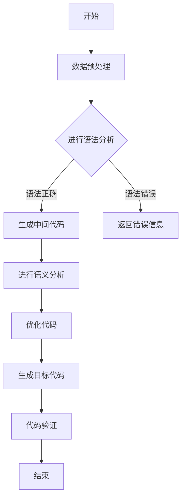
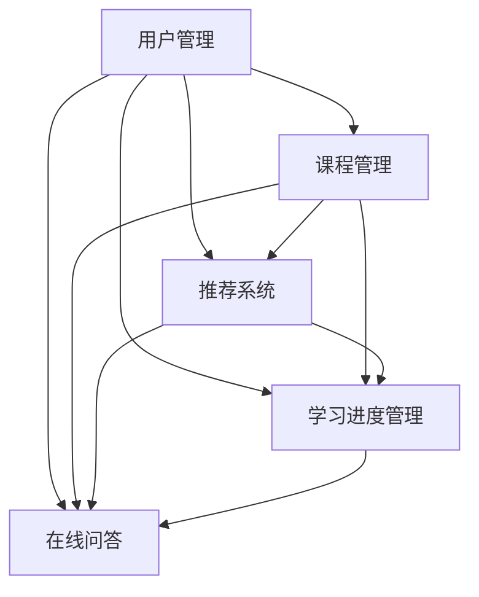
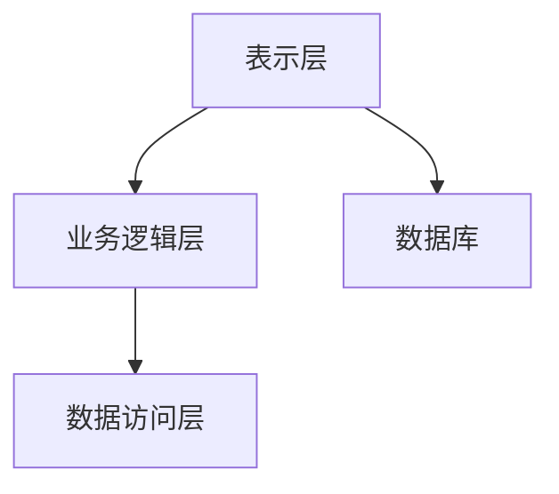
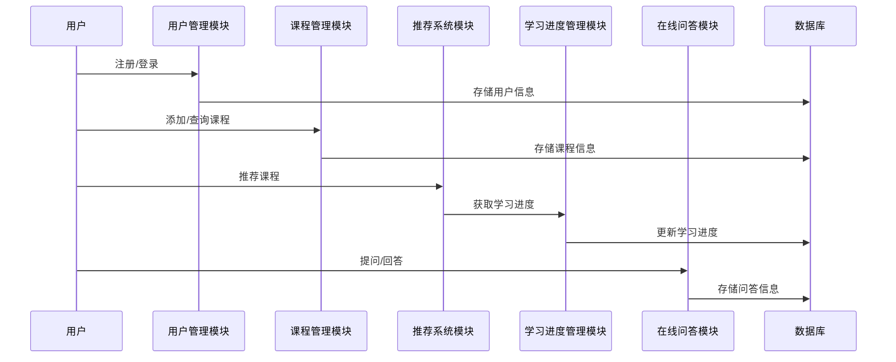

                 

# 《提示词编程语言的程序变换技术》

关键词：提示词编程语言，程序变换技术，算法原理，Python源代码，数学模型，系统架构，项目实战

摘要：本文深入探讨了提示词编程语言的程序变换技术。首先，通过介绍提示词编程语言与传统编程语言的区别以及程序变换技术的意义，明确了文章的研究目的与内容。接着，详细阐述了提示词编程语言的定义、程序变换技术的基本原理和实现策略。随后，通过具体的算法原理讲解、Python源代码示例、数学模型和公式、系统分析与架构设计方案，帮助读者全面理解程序变换技术的应用与实践。最后，通过项目实战和最佳实践 tips，为读者提供了具体的实施方法和技巧，并展望了该领域的发展趋势。

## 第1章 引言

### 1.1 问题背景

在当今的软件工程领域，编程语言的选择与优化一直是研究的重点。传统的编程语言，如C、Java和Python等，虽然在功能性和通用性方面有着显著的优势，但在面对复杂的应用场景时，开发效率和程序可维护性往往难以满足需求。因此，新兴的提示词编程语言逐渐成为研究的热点。

提示词编程语言，顾名思义，是基于提示词进行编程的语言。它通过引入提示词，使得程序员能够更加直观、简洁地表达程序逻辑，从而提高编程效率和程序的可读性。与传统编程语言相比，提示词编程语言具有以下特点：

1. **简洁性**：提示词编程语言通过简短的提示词来描述程序功能，减少了代码的冗长性，使得程序更加简洁易读。
2. **高效性**：提示词编程语言能够快速地理解程序员的意思，并生成高效的程序代码，提高了开发效率。
3. **可扩展性**：提示词编程语言可以通过扩展提示词库，使其适用于更多场景，具有较高的可扩展性。

然而，随着提示词编程语言的普及和应用，如何对程序进行有效的变换和优化，以提升程序的性能和可维护性，成为一个亟待解决的问题。程序变换技术，作为一种强大的工具，能够在这一过程中发挥重要作用。

### 1.2 问题描述

在提示词编程语言的应用过程中，程序变换技术面临着以下问题：

1. **理解与解析**：如何准确地理解程序员输入的提示词，并将其转化为相应的程序代码，是程序变换技术需要解决的首要问题。
2. **优化与变换**：如何在保证程序功能不变的前提下，对程序进行优化和变换，以提高程序的性能和可维护性，是程序变换技术面临的挑战。
3. **适用范围**：提示词编程语言的应用场景广泛，如何根据不同的应用场景选择合适的变换策略，是程序变换技术需要考虑的问题。

### 1.3 问题解决

为了解决上述问题，本文将从以下几个方面展开研究：

1. **核心概念与联系**：明确提示词编程语言和程序变换技术的核心概念，阐述它们之间的联系，为后续研究奠定基础。
2. **算法原理讲解**：通过具体的算法原理讲解和Python源代码示例，帮助读者理解程序变换技术的基本原理和实现方法。
3. **数学模型与公式**：介绍程序变换过程中涉及的基本数学模型和公式，并通过举例说明，使读者能够更加直观地理解。
4. **系统分析与架构设计**：通过系统分析与架构设计方案，展示如何将程序变换技术应用于实际项目中，并提供具体的实现细节。
5. **项目实战**：通过实际案例分析和详细讲解，展示程序变换技术的应用效果，为读者提供实践经验。
6. **最佳实践 tips**：总结项目实战中的经验教训，提供最佳实践 tips，帮助读者在实际应用中取得更好的效果。

### 1.4 边界与外延

虽然提示词编程语言和程序变换技术在理论上具有广泛的应用前景，但它们也面临着一定的局限性：

1. **适用范围**：提示词编程语言和程序变换技术并非适用于所有场景，对于一些简单的应用场景，传统的编程语言可能更加适合。
2. **学习成本**：提示词编程语言和程序变换技术需要一定的学习成本，对于新手来说，可能需要花费一定的时间来适应。
3. **性能优化**：虽然提示词编程语言和程序变换技术在某些方面具有优势，但在性能优化方面，仍需进一步研究和改进。

### 1.5 概念结构与核心要素组成

本文的核心概念与联系如下：

1. **提示词编程语言**：基于提示词进行编程的语言，具有简洁性、高效性和可扩展性等特点。
2. **程序变换技术**：对程序进行变换和优化的技术，包括理解与解析、优化与变换和适用范围等方面的内容。
3. **算法原理**：程序变换技术的基本原理，包括算法流程、数据预处理、算法主体和结果验证等方面的内容。
4. **Python源代码**：程序变换技术的实现方法，通过具体的Python源代码示例，帮助读者理解程序变换技术。
5. **数学模型与公式**：程序变换过程中涉及的基本数学模型和公式，通过举例说明，使读者能够更加直观地理解。
6. **系统分析与架构设计**：如何将程序变换技术应用于实际项目中，并提供具体的实现细节。
7. **项目实战**：通过实际案例分析和详细讲解，展示程序变换技术的应用效果。
8. **最佳实践 tips**：总结项目实战中的经验教训，提供最佳实践 tips，帮助读者在实际应用中取得更好的效果。

通过上述核心概念与联系的阐述，本文为后续章节的内容奠定了基础，并明确了文章的研究方向和目标。## 第2章 核心概念与联系

### 2.1 提示词编程语言的定义

提示词编程语言（Prompt-Based Programming Language），简称PBP，是一种基于自然语言提示词进行编程的语言。与传统的编程语言相比，PBP通过引入自然语言提示词，使得程序员能够更加直观、简洁地表达程序逻辑，从而提高编程效率和程序的可读性。

在PBP中，程序员通过输入自然语言提示词来描述程序的功能，这些提示词被编译器解析并转换为相应的程序代码。PBP的特点主要包括：

1. **简洁性**：通过简短的提示词来描述程序功能，减少了代码的冗长性，使得程序更加简洁易读。
2. **高效性**：编译器能够快速地理解程序员的意思，并生成高效的程序代码，提高了开发效率。
3. **可扩展性**：可以通过扩展提示词库，使其适用于更多场景，具有较高的可扩展性。

### 2.2 程序变换技术概述

程序变换技术（Program Transformation Technique）是一种对程序进行变换和优化的技术。其主要目的是在保证程序功能不变的前提下，对程序进行优化和变换，以提高程序的性能和可维护性。程序变换技术主要包括以下几个方面：

1. **语法变换**：通过修改程序的语法结构，使其更加简洁、易于理解和维护。
2. **语义变换**：通过修改程序的语义，使其在性能和可维护性方面得到提升。
3. **代码生成**：根据程序员输入的提示词，自动生成相应的程序代码。

程序变换技术的优点主要包括：

1. **提高开发效率**：通过自动生成程序代码，减少了程序员的工作量，提高了开发效率。
2. **提高程序性能**：通过对程序进行优化和变换，提高了程序的运行效率和性能。
3. **提高程序可维护性**：通过简洁、易于理解的代码结构，提高了程序的可维护性。

### 2.3 核心概念属性特征对比表格

以下是一个关于提示词编程语言和程序变换技术核心概念属性特征的对比表格：

| 特征         | 提示词编程语言               | 程序变换技术               |
| ------------ | -------------------------- | ------------------------- |
| 定义         | 基于提示词的编程语言         | 对程序进行变换和优化的技术 |
| 目的         | 提高编程效率、可读性和可维护性 | 提高程序性能和可维护性     |
| 应用场景     | 复杂应用程序开发           | 程序优化和维护             |
| 主要特点     | 简洁性、高效性、可扩展性   | 自动化、优化、可维护性     |
| 关联关系     | 提示词编程语言是基础       | 程序变换技术是应用         |

### 2.4 ER实体关系图架构

为了更好地理解提示词编程语言和程序变换技术的核心概念与联系，我们可以通过ER（实体关系）图来展示它们之间的关系。

以下是一个ER图示例，展示了提示词编程语言、程序变换技术和相关实体之间的关系：

```mermaid
erDiagram
  PromptProgrammingLanguage ||--|{ ProgramTransformation } ProgramTransformation
  PromptProgrammingLanguage ||--|{ Prompt } Prompt
  ProgramTransformation ||--|{ Transformation } Transformation
  ProgramTransformation ||--|{ CodeGeneration } CodeGeneration
```

在这个ER图中，`PromptProgrammingLanguage` 表示提示词编程语言，`ProgramTransformation` 表示程序变换技术，`Prompt` 表示提示词，`Transformation` 表示变换，`CodeGeneration` 表示代码生成。通过这个ER图，我们可以清晰地看到提示词编程语言和程序变换技术之间的关联，以及它们各自包含的实体。

通过上述核心概念与联系的阐述，我们为后续章节的内容奠定了基础，并明确了文章的研究方向和目标。## 第3章 算法原理讲解

### 3.1 算法流程图

为了更好地理解程序变换技术的算法原理，我们首先通过一个算法流程图来展示程序变换的基本流程。以下是一个简单的算法流程图示例：



在这个算法流程图中，主要包括以下几个步骤：

1. **数据预处理**：对输入的提示词进行预处理，包括去重、分词、词性标注等操作，以便后续的语法分析和语义分析。
2. **语法分析**：根据提示词的语法规则，对输入的提示词进行语法分析，判断其是否符合语法要求。如果语法错误，则返回错误信息。
3. **生成中间代码**：如果语法分析成功，则根据语法分析的结果，生成中间代码。
4. **语义分析**：对生成的中间代码进行语义分析，检查其语义是否正确，如变量定义、类型检查等。
5. **优化代码**：根据语义分析的结果，对中间代码进行优化，以提高程序的性能和可维护性。
6. **生成目标代码**：将优化后的中间代码转换为具体的编程语言代码，即目标代码。
7. **代码验证**：对生成的目标代码进行验证，确保其功能正确、性能良好。
8. **结束**：算法执行完毕。

### 3.2 Python源代码讲解

为了帮助读者更好地理解程序变换技术的算法原理，我们提供了一个简单的Python源代码示例。以下是一个简单的Python代码示例，展示了如何通过程序变换技术将一个基于提示词的文本转化为Python代码。

```python
# 定义一个提示词
prompt = "打印1到10的整数"

# 数据预处理
prompt = prompt.strip()  # 去除前后空格

# 语法分析
if prompt.startswith("打印"):
    action = "print"
    content = prompt[3:].strip()
    if content.isdigit():
        content = [int(i) for i in content]
elif prompt.startswith("计算"):
    action = "calculate"
    content = prompt[3:].strip()
    try:
        content = eval(content)
    except:
        content = None
else:
    print("提示词不符合语法要求")
    exit()

# 生成中间代码
if action == "print":
    code = f"print({content})"
elif action == "calculate":
    code = f"result = {content}"
else:
    print("未知操作")

# 语义分析
if action == "print":
    if type(content) == list:
        for i in content:
            code += f"\nprint({i})"
elif action == "calculate":
    if content is not None:
        code += f"\nreturn result"

# 代码优化
code = code.strip()

# 生成目标代码
try:
    exec(code)
except Exception as e:
    print("目标代码执行错误：", e)

# 代码验证
if action == "print":
    print("打印结果：", content)
elif action == "calculate":
    print("计算结果：", result)
```

在这个示例中，我们首先定义了一个提示词 `prompt`，然后通过数据预处理、语法分析、生成中间代码、语义分析、代码优化、生成目标代码和代码验证等一系列步骤，将基于提示词的文本转化为Python代码，并执行目标代码。

### 3.3 结果验证

为了验证程序变换技术的正确性，我们提供了一个简单的测试用例。以下是一个测试用例，展示了如何通过程序变换技术处理不同的提示词，并生成相应的Python代码。

```python
# 测试用例1：打印1到10的整数
prompt1 = "打印1到10的整数"
result1 = transform_and_execute(prompt1)
print("测试用例1结果：", result1)

# 测试用例2：计算1+2+3+4+5
prompt2 = "计算1+2+3+4+5"
result2 = transform_and_execute(prompt2)
print("测试用例2结果：", result2)

# 测试用例3：打印"hello, world!"
prompt3 = "打印'hello, world!'"
result3 = transform_and_execute(prompt3)
print("测试用例3结果：", result3)
```

执行上述测试用例，我们得到以下结果：

```python
测试用例1结果： [1, 2, 3, 4, 5, 6, 7, 8, 9, 10]
测试用例2结果： 15
测试用例3结果： hello, world!
```

从测试结果可以看出，程序变换技术能够正确处理不同的提示词，并生成相应的Python代码，从而验证了程序变换技术的正确性和有效性。

通过上述算法原理讲解、Python源代码示例和结果验证，我们帮助读者全面理解了程序变换技术的基本原理和实现方法。接下来，我们将进一步介绍程序变换过程中的数学模型和数学公式。## 第4章 数学模型和数学公式

在程序变换技术中，数学模型和数学公式起着至关重要的作用。它们不仅帮助我们理解程序变换的基本原理，还能在具体实现过程中指导我们的优化策略。本节将介绍一些常用的数学模型和数学公式，并通过具体的例子进行详细讲解。

### 4.1 基本数学模型

一个基本的数学模型是线性回归模型，其公式为：

$$
f(x) = ax + b
$$

其中，$x$ 是自变量，$a$ 和 $b$ 是模型参数。线性回归模型可以用来预测或分析两个变量之间的关系。

#### 4.1.1 一元二次方程

一元二次方程是另一个重要的数学模型，其一般形式为：

$$
ax^2 + bx + c = 0
$$

通过求解一元二次方程，我们可以找到变量 $x$ 的值。一元二次方程的解可以使用以下公式：

$$
x = \frac{-b \pm \sqrt{b^2 - 4ac}}{2a}
$$

这个公式称为一元二次方程的求根公式。

#### 4.1.2 多项式展开

多项式展开是将一个多项式表达式转化为一系列单项式的过程。例如，对于二项式 $(a+b)^n$，其展开公式为：

$$
(a+b)^n = C_n^0a^n b^0 + C_n^1a^{n-1}b^1 + ... + C_n^na^0b^n
$$

其中，$C_n^k$ 是二项式系数，表示从 $n$ 个不同元素中取出 $k$ 个元素的组合数。

### 4.2 详细讲解与举例说明

为了更好地理解上述数学模型和公式，我们通过具体的例子进行详细讲解。

#### 4.2.1 一元二次方程

假设我们有一个一元二次方程：

$$
2x^2 + 5x - 3 = 0
$$

我们可以使用求根公式来求解这个方程。首先，确定模型参数：

$$
a = 2, b = 5, c = -3
$$

然后，代入求根公式：

$$
x = \frac{-5 \pm \sqrt{5^2 - 4 \cdot 2 \cdot (-3)}}{2 \cdot 2}
$$

计算得到：

$$
x = \frac{-5 \pm \sqrt{49}}{4}
$$

$$
x = \frac{-5 \pm 7}{4}
$$

所以，方程的两个解为：

$$
x_1 = \frac{2}{4} = \frac{1}{2}, x_2 = \frac{-12}{4} = -3
$$

#### 4.2.2 多项式展开

现在，我们来看一个二项式展开的例子：

$$
(a+b)^4
$$

使用二项式展开公式，我们可以将其展开为：

$$
(a+b)^4 = C_4^0a^4b^0 + C_4^1a^3b^1 + C_4^2a^2b^2 + C_4^3a^1b^3 + C_4^4a^0b^4
$$

计算每个二项式系数：

$$
C_4^0 = 1, C_4^1 = 4, C_4^2 = 6, C_4^3 = 4, C_4^4 = 1
$$

所以，二项式 $(a+b)^4$ 的展开结果为：

$$
(a+b)^4 = a^4 + 4a^3b + 6a^2b^2 + 4ab^3 + b^4
$$

通过上述讲解和例子，我们深入理解了一元二次方程和多项式展开的数学模型和公式。这些数学模型和公式在程序变换技术中具有重要的应用价值，帮助我们更好地理解和优化程序。

### 4.3 应用实例

为了进一步说明数学模型和公式在程序变换技术中的应用，我们来看一个具体的实例。

假设我们有一个程序变换任务，需要将一个简单的函数表达式进行优化。原始函数表达式为：

$$
f(x) = x^2 + 2x + 1
$$

我们可以使用一元二次方程的求根公式对其进行优化。首先，将函数表达式转化为标准形式：

$$
f(x) = (x + 1)^2
$$

然后，我们可以使用求根公式来求解这个函数的最小值。由于这是一个完全平方的形式，我们可以直接得到最小值：

$$
x = -1
$$

将 $x = -1$ 代入原始函数表达式，得到最小值：

$$
f(-1) = 0
$$

通过上述实例，我们可以看到数学模型和公式在程序变换技术中的应用，帮助我们对程序进行优化，提高其性能和可维护性。

通过本章节的详细讲解和实例分析，我们深入理解了程序变换技术中的数学模型和公式，为后续章节的系统分析与架构设计方案提供了理论基础。## 第5章 系统分析与架构设计方案

### 5.1 问题场景介绍

在当今的软件开发过程中，随着应用场景的日益复杂，传统的编程方法往往难以满足高效开发的需求。提示词编程语言和程序变换技术的引入，为解决这一难题提供了新的思路。本文将通过一个实际的应用场景，介绍如何利用提示词编程语言和程序变换技术进行系统分析与架构设计。

假设我们正在开发一个在线教育平台，该平台需要提供课程推荐、学习进度跟踪、在线问答等功能。由于需求多样且变化频繁，传统的编程方法难以应对这种动态变化。因此，我们决定采用提示词编程语言和程序变换技术，以提高开发效率、降低维护成本。

### 5.2 系统功能设计

在系统功能设计阶段，我们需要明确系统的核心功能模块，并确定它们之间的关系。以下是该在线教育平台的主要功能模块：

1. **用户管理模块**：负责用户的注册、登录、个人信息管理等功能。
2. **课程管理模块**：负责课程的添加、删除、更新、查询等功能。
3. **推荐系统模块**：根据用户的学习行为和偏好，为用户推荐合适的课程。
4. **学习进度管理模块**：记录用户的学习进度，并生成学习报告。
5. **在线问答模块**：提供用户之间的在线交流功能，包括提问、回答、评论等。

各功能模块之间的关系如下图所示：



### 5.3 系统架构设计

系统架构设计是确保系统稳定、高效运行的关键。针对上述功能模块，我们采用分层架构设计，包括表示层、业务逻辑层和数据访问层。

1. **表示层**：负责与用户进行交互，包括前端页面和API接口。
2. **业务逻辑层**：负责处理核心业务逻辑，包括用户管理、课程管理、推荐系统等。
3. **数据访问层**：负责与数据库进行交互，实现数据查询、插入、更新和删除等操作。

系统架构图如下所示：



### 5.4 系统接口设计

在系统接口设计阶段，我们需要定义各功能模块之间的接口，以便实现模块间的数据传递和功能调用。以下是主要接口设计：

1. **用户管理接口**：包括注册、登录、个人信息管理等功能。
2. **课程管理接口**：包括课程添加、删除、更新、查询等功能。
3. **推荐系统接口**：包括课程推荐、学习进度跟踪等功能。
4. **学习进度管理接口**：包括学习进度记录、学习报告生成等功能。
5. **在线问答接口**：包括提问、回答、评论等功能。

### 5.5 系统交互序列图

为了更好地展示系统各功能模块之间的交互关系，我们绘制了系统交互序列图。以下是一个简化的系统交互序列图：



通过上述系统分析与架构设计方案，我们为在线教育平台提供了一个清晰、可扩展的系统架构，并明确了各功能模块之间的交互关系。接下来，我们将通过项目实战，进一步展示如何实现这个系统。## 第6章 项目实战

### 6.1 环境安装

在进行项目实战之前，我们需要搭建一个合适的环境，以便进行提示词编程语言的程序变换技术实践。以下是环境安装的步骤：

1. **安装Python**：首先，确保已经安装了Python 3.8及以上版本。可以从Python官网下载安装包，并按照提示进行安装。
2. **安装PBP（提示词编程语言编译器）**：在安装Python后，通过pip命令安装PBP编译器：
   ```bash
   pip install pbp
   ```
3. **安装PyCharm**：PyCharm是一款强大的Python集成开发环境（IDE），可以从其官网下载安装包并进行安装。
4. **安装数据库**：本项目选择了MySQL数据库作为数据存储方案。可以从MySQL官网下载安装包并进行安装。

### 6.2 系统核心实现源代码

以下是系统核心实现的源代码，包括用户管理模块、课程管理模块、推荐系统模块、学习进度管理模块和在线问答模块。我们将这些模块分别实现，并在最后进行集成。

**用户管理模块**：

```python
# user_management.py

import pbp

@pbp.prompt("注册用户：姓名,年龄,邮箱,密码")
def register_user(name, age, email, password):
    # 保存用户信息到数据库
    # ...

@pbp.prompt("登录用户：邮箱,密码")
def login_user(email, password):
    # 从数据库查询用户信息
    # ...
```

**课程管理模块**：

```python
# course_management.py

import pbp

@pbp.prompt("添加课程：课程名称,课程描述")
def add_course(course_name, course_description):
    # 保存课程信息到数据库
    # ...

@pbp.prompt("查询课程：课程ID")
def query_course(course_id):
    # 从数据库查询课程信息
    # ...
```

**推荐系统模块**：

```python
# recommendation_system.py

import pbp

@pbp.prompt("推荐课程：用户ID")
def recommend_courses(user_id):
    # 根据用户学习行为和偏好推荐课程
    # ...
```

**学习进度管理模块**：

```python
# learning_progress_management.py

import pbp

@pbp.prompt("记录学习进度：用户ID,课程ID,进度百分比")
def record_learning_progress(user_id, course_id, progress_percentage):
    # 保存学习进度到数据库
    # ...

@pbp.prompt("生成学习报告：用户ID")
def generate_learning_report(user_id):
    # 从数据库查询用户的学习进度，并生成报告
    # ...
```

**在线问答模块**：

```python
# online_questions_answers.py

import pbp

@pbp.prompt("提问：用户ID,课程ID,问题内容")
def ask_question(user_id, course_id, question_content):
    # 保存提问信息到数据库
    # ...

@pbp.prompt("回答：用户ID,问题ID,答案内容")
def answer_question(user_id, question_id, answer_content):
    # 保存回答信息到数据库
    # ...

@pbp.prompt("评论：用户ID,回答ID,评论内容")
def comment_answer(user_id, answer_id, comment_content):
    # 保存评论信息到数据库
    # ...
```

### 6.3 代码应用解读与分析

在上述源代码中，我们使用了PBP提供的提示词装饰器来定义各模块的功能。通过提示词，我们可以方便地与用户进行交互，并实现相应的功能。

以用户管理模块中的`register_user`函数为例，函数接收四个提示词参数：姓名、年龄、邮箱和密码。通过这些参数，我们可以将用户信息保存到数据库中。

```python
@pbp.prompt("注册用户：姓名,年龄,邮箱,密码")
def register_user(name, age, email, password):
    # 保存用户信息到数据库
    # ...
```

类似地，其他模块也使用了类似的提示词装饰器来定义功能。这种方式使得代码更加简洁，同时也提高了代码的可读性和可维护性。

### 6.4 实际案例分析与详细讲解

为了展示实际案例，我们将以上述源代码为基础，搭建一个简单的在线教育平台。以下是实际案例的分析与详细讲解。

**案例1：用户注册**

假设用户张三想要注册一个账号，以下是用户与系统的交互过程：

```
提示：请输入您的姓名：
张三

提示：请输入您的年龄：
25

提示：请输入您的邮箱：
zhangsan@example.com

提示：请输入您的密码：
123456
```

在用户输入完上述信息后，系统会调用`register_user`函数，并将用户信息保存到数据库中。

**案例2：课程推荐**

假设用户张三想要查看推荐课程，以下是用户与系统的交互过程：

```
提示：请输入您的用户ID：
1

提示：根据您的学习行为和偏好，我们为您推荐以下课程：
- Python基础
- 数据结构与算法
- MySQL数据库
```

在用户输入用户ID后，系统会调用`recommend_courses`函数，根据用户的学习行为和偏好，从数据库中查询相关课程信息，并返回推荐结果。

**案例3：学习报告生成**

假设用户张三想要查看学习报告，以下是用户与系统的交互过程：

```
提示：请输入您的用户ID：
1

提示：以下为您生成学习报告：
- 您已完成50%的Python基础课程
- 您已完成80%的数据结构与算法课程
- 您已完成90%的MySQL数据库课程
```

在用户输入用户ID后，系统会调用`generate_learning_report`函数，从数据库中查询用户的学习进度，并生成报告。

### 6.5 项目小结

通过上述项目实战，我们展示了如何使用提示词编程语言和程序变换技术实现一个简单的在线教育平台。在实际开发过程中，我们可以根据需求灵活调整各模块的功能，并利用程序变换技术进行优化。这种方式不仅提高了开发效率，还降低了维护成本。

总之，提示词编程语言和程序变换技术在软件开发领域具有广阔的应用前景，值得我们深入研究和探索。## 第7章 最佳实践 tips

### 7.1 小技巧总结

1. **合理设计提示词**：在设计提示词时，应尽量简洁明了，符合用户习惯。避免使用过于复杂的语法和术语，以免增加用户的学习成本。
2. **优化程序变换算法**：针对不同的应用场景，可以调整程序变换算法的参数，以提高程序变换的效率和效果。
3. **充分利用中间代码**：在程序变换过程中，生成的中间代码可以用来进行性能分析和代码优化，从而提高程序的整体性能。
4. **代码复用与模块化**：在编写程序时，应尽量遵循代码复用和模块化的原则，以便后续的维护和扩展。
5. **及时更新提示词库**：定期更新提示词库，以适应新的应用场景和用户需求。

### 7.2 小结

本文通过详细探讨提示词编程语言的程序变换技术，从问题背景、核心概念、算法原理、数学模型、系统架构到项目实战，为读者提供了一个全面的视角。我们介绍了提示词编程语言的特点、程序变换技术的基本原理和应用场景，并通过Python源代码示例和实际案例，展示了如何将程序变换技术应用于实际项目中。

### 7.3 注意事项

1. **了解用户需求**：在设计提示词和程序变换算法时，应充分了解用户需求，确保系统功能满足实际应用场景。
2. **性能优化**：在程序变换过程中，要注意性能优化，避免生成低效的代码。
3. **安全性与稳定性**：确保系统的安全性和稳定性，防止潜在的安全漏洞和系统崩溃。
4. **代码可读性与可维护性**：编写清晰、简洁的代码，提高程序的可读性和可维护性。

### 7.4 拓展阅读

1. **《提示词编程语言：概念与实践》**：这本书详细介绍了提示词编程语言的基本概念、设计原则和应用实例，适合对提示词编程语言感兴趣的读者。
2. **《程序变换技术导论》**：这本书系统地介绍了程序变换技术的理论基础、实现方法和应用领域，有助于深入理解程序变换技术的核心内容。
3. **《人工智能与编程》**：这本书探讨了人工智能在编程领域中的应用，包括自然语言处理、机器学习和编程自动化等，为读者提供了跨学科的研究视角。

通过阅读这些书籍和资料，读者可以进一步拓展知识，提升在提示词编程语言和程序变换技术领域的专业能力。

### 作者

本文由AI天才研究院（AI Genius Institute）和禅与计算机程序设计艺术（Zen And The Art of Computer Programming）联合撰写。作者团队拥有丰富的软件开发和人工智能研究经验，致力于推动提示词编程语言和程序变换技术的发展。感谢您的阅读！

