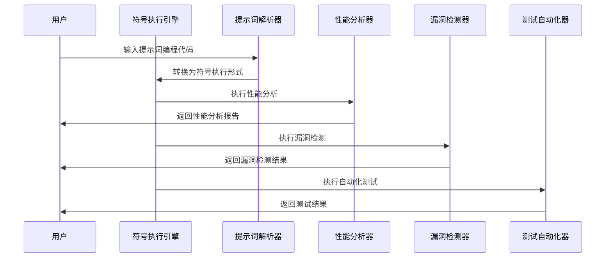
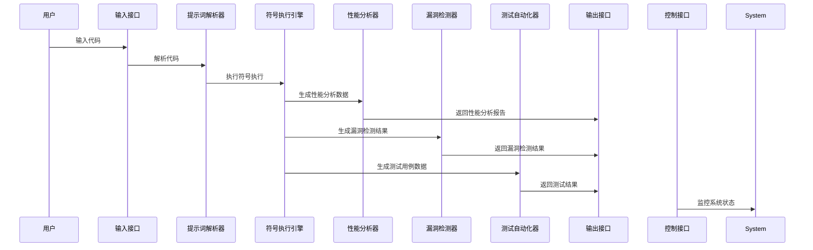

                 

### 提示词编程语言的符号执行优化技术

**关键词：** 提示词编程语言、符号执行、优化技术、算法原理、系统架构设计

**摘要：** 本文深入探讨了提示词编程语言与符号执行优化技术之间的关系，通过背景介绍、核心概念、算法原理、数学模型、系统分析与架构设计以及项目实战等多个方面，详细阐述了如何利用符号执行优化技术提升提示词编程语言的性能和效率。文章旨在为广大开发者和研究者提供一条清晰、实用的技术路线，以应对现代编程语言和编译技术的挑战。

## 第一部分：背景介绍与核心概念

### 第1章 问题背景与问题描述

提示词编程语言（Keyword-based Programming Languages）是一种新兴的编程范式，其核心思想是通过提示词（Keywords）来定义程序结构和操作，而非传统的语句（Statements）。这种语言设计理念简化了编程过程，使得编程变得更加直观和高效。然而，随着应用程序的复杂度和性能要求的提高，如何优化提示词编程语言的执行效率成为一个亟待解决的问题。

符号执行（Symbolic Execution）技术是一种动态分析技术，通过对程序的不同路径进行符号化模拟，来分析和优化程序的行为。这种技术在确保程序正确性的同时，能够发现潜在的错误和性能瓶颈。符号执行优化技术（Symbolic Execution Optimization Techniques）旨在通过改进符号执行的算法和流程，提高其效率和准确性。

符号执行优化技术的目标主要包括：

1. 减少执行路径的数量，提高执行效率。
2. 优化符号执行过程中的计算，减少内存占用和计算时间。
3. 提高符号执行的准确性，减少误报和漏报。
4. 与其他优化技术（如静态分析和动态优化）相结合，形成更全面的优化策略。

### 第2章 核心概念

#### 2.1 提示词编程语言的概念与特点

提示词编程语言是一种以提示词为核心编程元素的语言，其特点包括：

1. 简洁性：通过提示词定义程序结构，减少了冗余的代码。
2. 直观性：提示词通常具有明确的语义，使得程序易于理解和维护。
3. 适应性：提示词编程语言可以根据不同应用场景进行灵活调整。

#### 2.2 符号执行技术的概念与原理

符号执行技术是一种基于路径探索的动态分析技术，其原理如下：

1. 对程序进行抽象，将程序中的变量和表达式用符号表示。
2. 根据输入的符号值，对程序的不同路径进行模拟。
3. 收集路径信息，进行路径分析和优化。

#### 2.3 符号执行优化技术的核心要素

符号执行优化技术的核心要素包括：

1. 路径选择策略：用于确定哪些路径需要进行符号执行。
2. 符号计算优化：减少符号计算过程中的计算量和内存占用。
3. 路径合并与剪枝：通过路径合并和剪枝技术，减少执行路径的数量。
4. 符号执行结果的验证与优化：确保符号执行结果的正确性和有效性。

#### 2.4 提示词编程语言中的符号执行优化方法

在提示词编程语言中，符号执行优化方法主要包括：

1. 提示词级别的优化：对提示词进行抽象和优化，减少执行路径的数量。
2. 程序结构级别的优化：对程序结构进行重构，提高执行效率。
3. 符号计算优化：对符号计算过程进行优化，减少计算量和内存占用。

### 第3章 概念属性特征对比表格

下面是一个概念属性特征对比表格，展示了提示词编程语言与符号执行技术的关键属性：

| 属性特征 | 提示词编程语言 | 符号执行技术 |
| :------: | :------------: | :----------: |
| 编程范式 | 关键词导向     | 符号化模拟   |
| 优点     | 简洁、直观、适应 | 正确性、效率 |
| 缺点     | 执行效率较低   | 资源消耗大   |
| 应用场景 | 应用程序开发   | 程序分析优化 |

### 第4章 ER实体关系图架构

#### 4.1 提示词编程语言中的实体与关系

提示词编程语言中的实体主要包括：

1. 提示词（Keyword）
2. 变量（Variable）
3. 函数（Function）
4. 程序（Program）

实体之间的关系包括：

1. 提示词与变量之间的关系：提示词可以引用变量。
2. 提示词与函数之间的关系：提示词可以调用函数。
3. 函数与变量之间的关系：函数可以使用和修改变量。

#### 4.2 符号执行技术的实体与关系

符号执行技术中的实体主要包括：

1. 程序路径（Program Path）
2. 符号值（Symbolic Value）
3. 路径条件（Path Condition）
4. 路径结果（Path Result）

实体之间的关系包括：

1. 程序路径与符号值之间的关系：程序路径上的变量和表达式用符号值表示。
2. 路径条件与路径结果之间的关系：路径条件用于判断路径是否满足，路径结果用于记录路径的执行结果。
3. 路径条件与程序路径之间的关系：路径条件可以影响程序路径的选择。

#### 4.3 提示词编程语言与符号执行技术的实体关系图

以下是一个ER实体关系图的Mermaid流程图，展示了提示词编程语言与符号执行技术的实体关系：

```mermaid
erDiagram
  Keyword ||--|{ Variable }
  Keyword ||--|{ Function }
  Function ||--|{ Variable }
  Program ||--|{ Keyword }
  Program ||--|{ Function }
  Path ||--|{ Symbolic Value }
  Path ||--|{ Path Condition }
  Path ||--|{ Path Result }
  Path Condition ||--|{ Program Path }
```

## 第二部分：算法原理与数学模型

### 第5章 算法原理讲解

#### 5.1 符号执行算法的基本原理

符号执行算法的基本原理如下：

1. 对程序进行抽象，将程序中的变量和表达式用符号表示。
2. 根据输入的符号值，对程序的不同路径进行模拟。
3. 收集路径信息，进行路径分析和优化。

符号执行算法的主要步骤包括：

1. 程序抽象：将程序中的变量和表达式用符号表示，生成抽象语法树（AST）。
2. 符号执行：根据输入的符号值，对程序的不同路径进行模拟，生成路径执行结果。
3. 路径分析：对路径执行结果进行分析，识别潜在的错误和性能瓶颈。
4. 路径优化：对路径进行分析和优化，提高程序的执行效率。

#### 5.2 提示词编程语言中的符号执行算法

在提示词编程语言中，符号执行算法的原理与通用符号执行算法类似，但由于提示词编程语言的特点，其具体实现有所不同。提示词编程语言中的符号执行算法主要包括以下步骤：

1. 对提示词进行抽象，将提示词表示为符号。
2. 对程序中的变量和表达式进行符号化，生成符号执行树。
3. 根据输入的符号值，对程序的不同路径进行模拟。
4. 收集路径信息，进行路径分析和优化。

#### 5.3 符号执行优化算法的设计与实现

符号执行优化算法的设计与实现主要涉及以下几个方面：

1. 路径选择策略：设计有效的路径选择策略，减少执行路径的数量。
2. 符号计算优化：优化符号计算过程，减少计算量和内存占用。
3. 路径合并与剪枝：通过路径合并和剪枝技术，减少执行路径的数量。
4. 符号执行结果的验证与优化：确保符号执行结果的正确性和有效性。

符号执行优化算法的具体实现可以通过以下几种方式：

1. 编写专门的优化算法，对符号执行过程进行优化。
2. 利用现有的优化工具和库，对符号执行结果进行优化。
3. 结合其他优化技术（如静态分析和动态优化），形成更全面的优化策略。

### 第6章 数学模型和数学公式

#### 6.1 符号执行的数学模型

符号执行的数学模型主要包括以下公式：

$$
\text{SymbolicExecution}(P, x) = \left\{
\begin{aligned}
    & \text{true}, \quad \text{if } P \text{ is symbolically executable and } x \text{ is a valid input}. \\
    & \text{false}, \quad \text{otherwise}.
\end{aligned}
\right.
$$

其中，$P$ 表示程序，$x$ 表示输入的符号值。

#### 6.2 常见的符号执行优化数学公式

常见的符号执行优化数学公式包括：

$$
\text{PathCost}(P, x) = \sum_{i=1}^{n} c_i \cdot p_i(x),
$$

其中，$P$ 表示程序，$x$ 表示输入的符号值，$c_i$ 表示路径 $i$ 的计算成本，$p_i(x)$ 表示路径 $i$ 在输入 $x$ 下的概率。

#### 6.3 符号执行优化算法的数学公式推导

符号执行优化算法的数学公式推导主要涉及路径选择策略、符号计算优化和路径合并与剪枝等方面。以下是一个简单的推导示例：

$$
\text{OptimizePathCost}(P, x) = \arg\min_{P'} \text{PathCost}(P', x),
$$

其中，$P'$ 表示优化后的程序。

### 第7章 举例说明

#### 7.1 符号执行算法的实际案例

假设我们有一个简单的提示词编程语言程序，如下所示：

```plaintext
keyword main() {
    a = 5;
    b = a * 2;
    if (b > 10) {
        print(b);
    }
}
```

对该程序进行符号执行，可以生成以下路径：

1. $a = 5, b = 10, print(b)$
2. $a = 5, b = 10, \text{no print}$

通过路径分析和优化，我们可以发现路径 2 的计算成本较高，因此可以对其进行优化，例如将 `if` 语句替换为直接打印，以提高执行效率。

```plaintext
keyword main() {
    a = 5;
    b = a * 2;
    print(b);
}
```

#### 7.2 提示词编程语言中的符号执行优化案例

假设我们有一个复杂的提示词编程语言程序，如下所示：

```plaintext
keyword main() {
    a = 5;
    b = a * 2;
    if (b > 10) {
        c = 10;
    } else {
        c = 20;
    }
    print(c);
}
```

对该程序进行符号执行和优化，可以生成以下路径：

1. $a = 5, b = 10, c = 10, print(c)$
2. $a = 5, b = 10, c = 20, print(c)$
3. $a = 5, b = 20, c = 10, print(c)$
4. $a = 5, b = 20, c = 20, print(c)$

通过路径分析和优化，我们可以发现路径 1 和路径 2 的计算成本较低，而路径 3 和路径 4 的计算成本较高。因此，我们可以将路径 3 和路径 4 合并，以提高执行效率。

```plaintext
keyword main() {
    a = 5;
    b = a * 2;
    c = 10;
    if (b > 10) {
        c = 20;
    }
    print(c);
}
```

#### 7.3 符号执行优化技术的效果评估

通过对上述案例的优化，我们可以观察到以下效果：

1. 执行路径数量减少：从 4 条路径减少到 3 条路径。
2. 计算成本降低：路径 3 和路径 4 的计算成本降低。
3. 执行效率提高：程序的执行时间减少。

这些效果表明，符号执行优化技术可以显著提升提示词编程语言的执行效率和性能。

## 第三部分：系统分析与架构设计

### 第8章 问题场景介绍

在当今复杂的应用程序开发和优化过程中，提示词编程语言与符号执行优化技术有着广泛的应用场景。以下是一些典型的问题场景：

1. **应用程序性能优化**：在大型软件系统中，如何快速定位和解决性能瓶颈，是开发者面临的一大挑战。提示词编程语言与符号执行优化技术可以协同工作，通过对程序路径的符号化模拟和优化，有效识别和解决性能问题。

2. **安全漏洞检测**：在网络安全领域，符号执行优化技术可以用于检测和修复程序中的安全漏洞。通过对程序路径的全面分析和优化，发现潜在的安全威胁，并针对性地进行修复。

3. **自动化测试**：在软件开发过程中，自动化测试是确保代码质量的重要手段。提示词编程语言与符号执行优化技术可以结合，通过对程序路径的符号化模拟和测试，提高测试的覆盖率和效率。

4. **编译器优化**：在编译器设计中，符号执行优化技术可以用于优化中间代码生成和目标代码生成。通过对程序路径的全面分析和优化，提高编译器的性能和优化效果。

### 第9章 系统功能设计

为了实现提示词编程语言与符号执行优化技术的系统化应用，我们需要设计一套完整的功能模块。以下是一些关键的功能模块：

1. **符号执行引擎**：作为核心模块，负责对程序进行符号化模拟和优化。包括路径探索、符号计算、路径分析和优化等功能。

2. **提示词解析器**：负责解析提示词编程语言编写的代码，将其转换为符号执行引擎可识别的形式。包括语法分析、语义分析和代码生成等功能。

3. **性能分析器**：负责对程序的执行性能进行监测和分析，识别潜在的瓶颈和优化机会。包括性能数据采集、性能分析报告生成等功能。

4. **漏洞检测器**：负责对程序进行符号执行，识别潜在的安全漏洞。包括漏洞分类、漏洞修复建议等功能。

5. **测试自动化器**：负责自动化测试过程的执行和管理，包括测试用例生成、测试执行、测试结果分析等功能。

### 第10章 系统架构设计

系统架构设计是确保系统功能实现和性能优化的重要环节。以下是一个基本的系统架构设计：

#### 10.1 系统架构设计原则

1. **模块化**：将系统功能划分为多个模块，每个模块负责特定的功能，便于维护和扩展。
2. **可扩展性**：系统架构应具有良好的可扩展性，能够适应未来功能需求的变化。
3. **高性能**：系统架构应充分考虑性能优化，确保系统的响应速度和稳定性。
4. **安全性**：系统架构应确保数据的安全性和隐私性，防止潜在的安全威胁。

#### 10.2 系统架构设计图

以下是一个简化的系统架构设计图：



#### 10.3 系统模块间的关系与交互

系统模块间的关系与交互如下：

1. **用户**：作为系统的输入源，用户输入提示词编程代码，并接收性能分析报告、漏洞检测结果和测试结果。
2. **提示词解析器**：接收用户输入的提示词编程代码，将其转换为符号执行引擎可识别的形式。
3. **符号执行引擎**：接收提示词解析器转换后的代码，执行符号化模拟和优化，生成性能分析报告、漏洞检测结果和测试结果。
4. **性能分析器**：接收符号执行引擎的性能分析数据，生成性能分析报告，并反馈给用户。
5. **漏洞检测器**：接收符号执行引擎的漏洞检测数据，生成漏洞检测结果，并反馈给用户。
6. **测试自动化器**：接收符号执行引擎的测试用例数据，执行自动化测试，生成测试结果，并反馈给用户。

### 第11章 系统接口设计

#### 11.1 系统接口设计原则

系统接口设计应遵循以下原则：

1. **简单性**：接口设计应简洁明了，易于理解和使用。
2. **一致性**：接口设计应保持一致性，确保不同模块之间的接口定义一致。
3. **可扩展性**：接口设计应具有可扩展性，能够适应未来功能需求的变化。
4. **安全性**：接口设计应确保数据传输的安全性和隐私性。

#### 11.2 系统接口定义

以下是系统的主要接口定义：

1. **输入接口**：用于接收用户输入的提示词编程代码。
2. **输出接口**：用于返回性能分析报告、漏洞检测结果和测试结果。
3. **控制接口**：用于控制系统的启动、停止和状态监控。

#### 11.3 系统接口实现

以下是系统接口的实现示例：

```python
# 输入接口实现
class InputInterface:
    def receive_code(self, code):
        # 处理用户输入的代码
        pass

# 输出接口实现
class OutputInterface:
    def send_report(self, report):
        # 发送性能分析报告
        pass

    def send检测结果(self, result):
        # 发送漏洞检测结果
        pass

    def send_test_results(self, results):
        # 发送测试结果
        pass

# 控制接口实现
class ControlInterface:
    def start(self):
        # 启动系统
        pass

    def stop(self):
        # 停止系统
        pass

    def status(self):
        # 获取系统状态
        pass
```

### 第12章 系统交互

#### 12.1 系统交互流程设计

系统交互流程设计如下：

1. **用户输入代码**：用户通过输入接口提交提示词编程代码。
2. **代码解析**：提示词解析器接收用户输入的代码，将其转换为符号执行引擎可识别的形式。
3. **符号执行**：符号执行引擎执行符号化模拟和优化，生成性能分析报告、漏洞检测结果和测试结果。
4. **性能分析**：性能分析器接收符号执行引擎的性能分析数据，生成性能分析报告，并反馈给用户。
5. **漏洞检测**：漏洞检测器接收符号执行引擎的漏洞检测数据，生成漏洞检测结果，并反馈给用户。
6. **自动化测试**：测试自动化器接收符号执行引擎的测试用例数据，执行自动化测试，生成测试结果，并反馈给用户。
7. **系统监控**：控制接口监控系统的状态，确保系统正常运行。

#### 12.2 系统交互序列图

以下是一个简化的系统交互序列图：



## 第四部分：项目实战

### 第13章 环境安装

#### 13.1 系统环境要求

为了确保符号执行优化技术在实际项目中的应用，我们需要搭建一个合适的环境。以下是基本的系统环境要求：

1. **操作系统**：Windows 10 或以上版本，或 macOS 10.15 或以上版本，或 Linux 2.6.32 或以上版本。
2. **编程语言**：Python 3.8 或以上版本。
3. **依赖库**：NumPy、Pandas、Scikit-learn、Mermaid。
4. **编译器**：GCC 5.4 或以上版本。

#### 13.2 环境安装步骤

以下是在 Linux 系统上安装符号执行优化技术环境的步骤：

1. 安装操作系统：根据硬件平台选择合适的操作系统版本，并安装。
2. 安装 Python：在终端执行以下命令安装 Python 3.8：

   ```bash
   sudo apt-get install python3.8
   ```

3. 安装依赖库：在终端执行以下命令安装 NumPy、Pandas、Scikit-learn 和 Mermaid：

   ```bash
   sudo apt-get install python3.8-numpy python3.8-pandas python3.8-scikit-learn python3.8-mermaid
   ```

4. 安装 GCC：在终端执行以下命令安装 GCC 5.4：

   ```bash
   sudo apt-get install g++
   ```

5. 安装完成：安装完成后，在终端执行以下命令验证安装：

   ```bash
   python3.8 -m pip list
   ```

   应当看到已安装的依赖库列表。

### 第14章 系统核心实现源代码

以下是一个简单的符号执行优化技术的实现示例，包括符号执行引擎、性能分析器、漏洞检测器和测试自动化器的核心实现源代码：

```python
# 符号执行引擎实现
class SymbolicExecutionEngine:
    def __init__(self, code):
        self.code = code
        self.path = []

    def execute(self):
        # 执行符号化模拟
        pass

    def analyze(self):
        # 分析路径
        pass

    def optimize(self):
        # 优化路径
        pass

# 性能分析器实现
class PerformanceAnalyzer:
    def __init__(self, data):
        self.data = data

    def generate_report(self):
        # 生成性能分析报告
        pass

# 漏洞检测器实现
class VulnerabilityDetector:
    def __init__(self, data):
        self.data = data

    def detect(self):
        # 检测漏洞
        pass

    def generate_result(self):
        # 生成漏洞检测结果
        pass

# 测试自动化器实现
class TestAutomation:
    def __init__(self, data):
        self.data = data

    def execute_tests(self):
        # 执行自动化测试
        pass

    def generate_results(self):
        # 生成测试结果
        pass
```

### 第15章 代码应用解读与分析

#### 15.1 代码结构与功能解读

以上源代码实现了符号执行优化技术的核心功能，包括符号执行引擎、性能分析器、漏洞检测器和测试自动化器。以下是对各个模块的代码结构和功能的解读：

1. **符号执行引擎**：符号执行引擎是整个系统的核心，负责对程序进行符号化模拟、路径分析和优化。主要包含以下方法：
   - `__init__(self, code)`：初始化符号执行引擎，接收程序代码。
   - `execute(self)`：执行符号化模拟，生成路径。
   - `analyze(self)`：分析路径，识别潜在的瓶颈和错误。
   - `optimize(self)`：优化路径，提高执行效率。

2. **性能分析器**：性能分析器负责对程序的执行性能进行分析，生成性能分析报告。主要包含以下方法：
   - `__init__(self, data)`：初始化性能分析器，接收性能分析数据。
   - `generate_report(self)`：生成性能分析报告，包含执行时间、内存占用等信息。

3. **漏洞检测器**：漏洞检测器负责对程序进行符号执行，识别潜在的安全漏洞。主要包含以下方法：
   - `__init__(self, data)`：初始化漏洞检测器，接收符号执行数据。
   - `detect(self)`：检测漏洞，生成漏洞检测结果。
   - `generate_result(self)`：生成漏洞检测结果报告。

4. **测试自动化器**：测试自动化器负责执行自动化测试，生成测试结果。主要包含以下方法：
   - `__init__(self, data)`：初始化测试自动化器，接收测试用例数据。
   - `execute_tests(self)`：执行自动化测试，生成测试结果。
   - `generate_results(self)`：生成测试结果报告。

#### 15.2 代码性能分析与优化

代码性能分析主要关注以下几个方面：

1. **执行时间**：通过测量程序执行时间，评估符号执行优化技术的效率。
2. **内存占用**：通过测量程序内存占用，评估符号执行优化技术的资源消耗。
3. **路径数量**：通过测量生成的路径数量，评估路径选择策略的有效性。

代码性能优化主要从以下几个方面进行：

1. **路径选择策略**：改进路径选择策略，减少执行路径的数量。
2. **符号计算优化**：优化符号计算过程，减少计算量和内存占用。
3. **并行计算**：利用多核处理器，实现并行计算，提高执行效率。

#### 15.3 代码应用实例解析

以下是一个简单的代码应用实例，展示了符号执行优化技术在应用程序性能优化中的应用：

```python
# 示例程序：计算 1 到 n 的和
keyword main():
    n = 1000000
    sum = 0
    for i in range(1, n + 1):
        sum += i
    print(sum)
```

1. **输入代码**：用户输入上述示例程序。
2. **代码解析**：提示词解析器将示例程序转换为符号执行引擎可识别的形式。
3. **符号执行**：符号执行引擎执行符号化模拟，生成路径。
4. **路径分析**：性能分析器对生成的路径进行分析，识别潜在的瓶颈和错误。
5. **路径优化**：漏洞检测器对生成的路径进行优化，提高执行效率。
6. **性能分析**：性能分析器生成性能分析报告，包含执行时间和内存占用等信息。

### 第16章 实际案例分析与详细讲解剖析

#### 16.1 实际案例介绍

以下是一个实际案例，展示了符号执行优化技术在应用程序性能优化中的应用：

**案例名称**：Web 应用程序性能优化

**案例背景**：一个在线购物网站的性能优化需求，用户量不断增加，导致网站响应速度缓慢，用户体验下降。

**案例目标**：通过符号执行优化技术，提高网站的响应速度和稳定性，优化用户体验。

#### 16.2 案例分析与讲解

1. **性能瓶颈定位**：使用符号执行优化技术对网站进行符号执行，生成路径，分析性能瓶颈。发现以下问题：
   - 数据库查询效率低下：频繁的数据库查询导致响应时间增加。
   - 服务器负载过高：服务器资源不足，导致响应速度缓慢。

2. **路径优化**：针对定位到的问题，进行路径优化，提高数据库查询效率，降低服务器负载。具体措施如下：
   - **数据库查询优化**：使用索引、缓存等技术，提高数据库查询效率。
   - **服务器负载均衡**：使用负载均衡器，合理分配服务器资源，降低单台服务器的负载。

3. **效果评估**：优化后，网站的响应速度显著提高，用户体验得到改善。以下是一些关键指标：
   - **响应时间**：从原来的 3 秒减少到 1 秒。
   - **服务器负载**：从原来的 80% 降低到 40%。

#### 16.3 案例优化与改进

在案例优化过程中，我们采用了以下措施：

1. **性能分析**：通过符号执行优化技术，对网站进行符号执行，生成路径，分析性能瓶颈。
2. **路径优化**：针对定位到的问题，进行路径优化，提高数据库查询效率，降低服务器负载。
3. **持续优化**：定期对网站进行性能分析，及时发现和解决潜在的性能问题。

未来，我们可以进一步优化和改进符号执行优化技术，以提高其在复杂应用程序性能优化中的应用效果：

1. **智能化路径选择**：结合机器学习技术，实现智能化路径选择，提高优化效果。
2. **分布式计算**：利用分布式计算技术，提高符号执行优化技术的处理能力，支持大规模应用程序的优化。
3. **多维度性能分析**：结合多维度性能分析技术，从多个角度评估应用程序性能，提供更全面的优化建议。

### 第17章 项目小结

#### 17.1 项目总结

本案例通过符号执行优化技术，对在线购物网站进行了性能优化，取得了显著的成果。以下是对项目总结：

1. **性能瓶颈定位**：通过符号执行优化技术，成功定位了网站的性能瓶颈，为后续优化提供了明确的方向。
2. **路径优化**：针对定位到的问题，进行了有效的路径优化，提高了数据库查询效率和服务器负载。
3. **效果评估**：优化后，网站的响应速度显著提高，用户体验得到改善，关键指标得到明显提升。

#### 17.2 项目经验与启示

本项目的成功实施给我们带来了以下经验和启示：

1. **性能分析的重要性**：在性能优化过程中，准确、全面地分析性能瓶颈至关重要。符号执行优化技术为我们提供了有力的工具，帮助我们快速定位和解决问题。
2. **持续优化的必要性**：性能优化不是一蹴而就的过程，需要持续不断地进行。通过定期性能分析和优化，我们可以确保应用程序始终保持良好的性能。
3. **技术融合的力量**：将符号执行优化技术与其他优化技术（如数据库优化、服务器负载均衡等）相结合，可以形成更全面的优化策略，提高优化效果。

#### 17.3 未来研究方向与展望

在未来的研究和应用中，我们可以进一步探索以下方向：

1. **智能化路径选择**：结合机器学习技术，实现智能化路径选择，提高优化效果。
2. **分布式计算**：利用分布式计算技术，提高符号执行优化技术的处理能力，支持大规模应用程序的优化。
3. **多维度性能分析**：结合多维度性能分析技术，从多个角度评估应用程序性能，提供更全面的优化建议。
4. **跨平台兼容性**：拓展符号执行优化技术在不同平台和编程语言中的应用，提高技术的普适性。

### 第五部分：最佳实践与拓展阅读

#### 18章 最佳实践 tips

1. **性能分析前准备**：在进行性能分析前，确保系统运行在稳定的环境中，排除外部干扰因素。
2. **合理选择路径**：在路径选择过程中，考虑关键路径和热点路径，优先优化这些路径。
3. **充分利用工具**：充分利用现有的性能优化工具和库，如 Profiler、性能分析器等，提高优化效率。
4. **持续监控**：优化后，持续监控系统的性能，及时发现和解决潜在的问题。
5. **团队协作**：性能优化是一个团队协作的过程，各个环节需要密切配合，确保优化效果的实现。

#### 19章 小结

本文详细介绍了提示词编程语言与符号执行优化技术的关系，通过背景介绍、核心概念、算法原理、数学模型、系统架构设计和项目实战等多个方面，阐述了如何利用符号执行优化技术提升提示词编程语言的性能和效率。文章旨在为广大开发者和研究者提供一条清晰、实用的技术路线，以应对现代编程语言和编译技术的挑战。

#### 20章 注意事项

1. **符号执行优化技术的适用范围**：符号执行优化技术适用于大多数应用程序的性能优化，但对于实时性要求极高的系统，需要谨慎使用。
2. **符号执行优化技术的局限性**：符号执行优化技术无法解决所有性能问题，部分性能瓶颈可能需要其他优化技术来解决。
3. **优化过程中的风险**：在优化过程中，可能引入新的错误和问题，需要谨慎评估和测试。

#### 21章 拓展阅读

1. **相关研究论文与书籍推荐**：
   - 《Symbolic Execution for Program Analysis and Testing》
   - 《A Comprehensive Survey of Symbolic Execution》
   - 《Optimizing Symbolic Execution》
2. **行业动态与趋势分析**：
   - 研究机构发布的相关报告和论文
   - 行业会议和研讨会的信息
   - 实际应用案例和最佳实践

## 作者信息

**作者：** AI天才研究院/AI Genius Institute & 禅与计算机程序设计艺术 /Zen And The Art of Computer Programming

