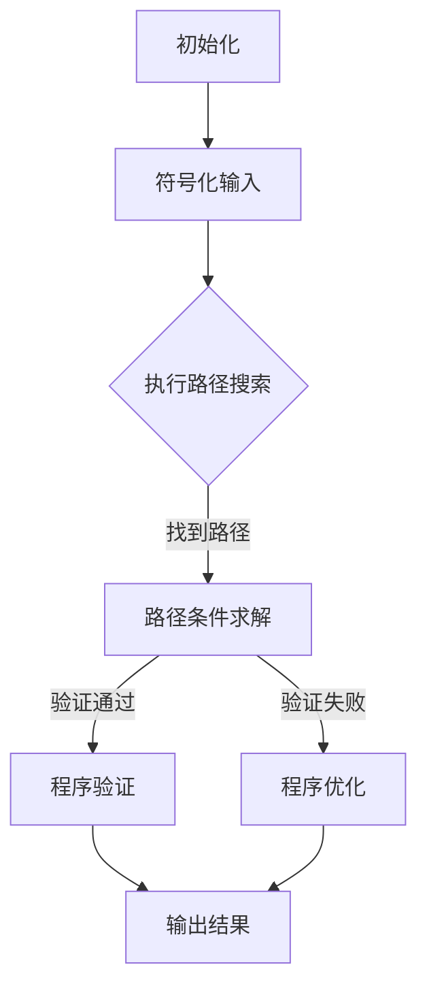
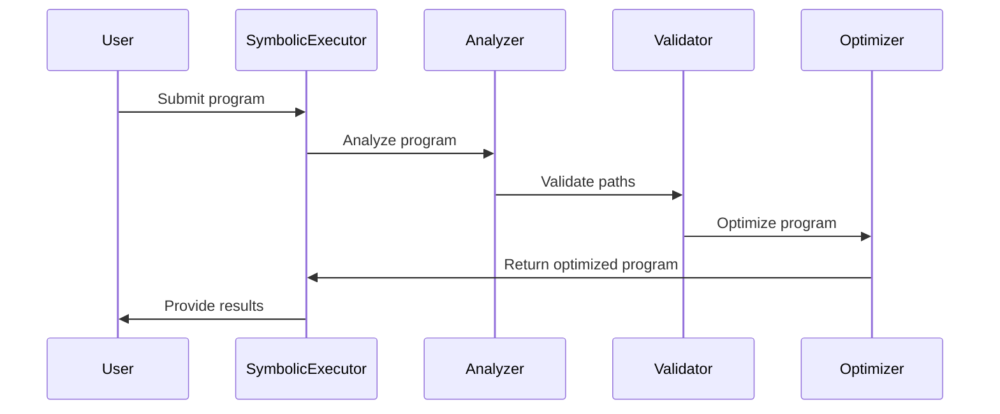
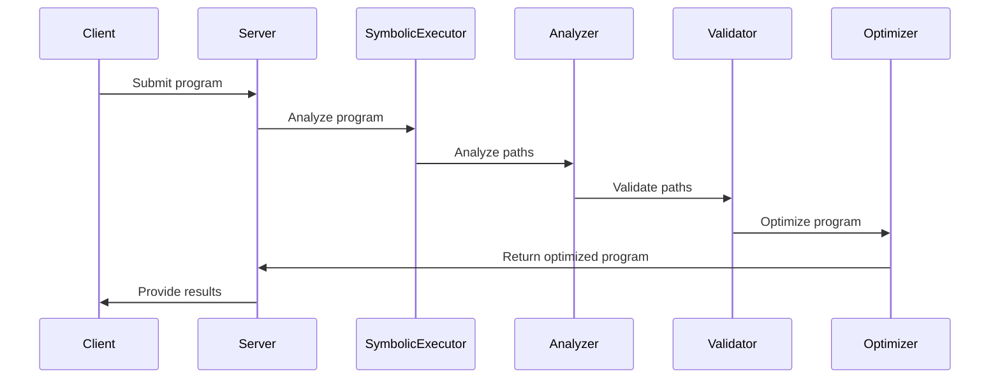

                 

# 提示词编程语言的符号执行技术

## 关键词

- 提示词编程语言
- 符号执行技术
- 程序分析
- 软件工程
- 算法原理
- 数学模型

## 摘要

本文深入探讨了提示词编程语言的符号执行技术，阐述了其在计算机科学和软件工程中的应用和重要性。通过详细的分析和实例，本文介绍了符号执行技术的基本概念、原理以及实现方法，并对其核心概念进行了对比和阐述，为读者提供了一个全面且深入的技术理解。

## 第一部分：背景介绍

### 问题背景

提示词编程语言的符号执行技术是一种在计算机科学和软件工程领域中用于程序分析的重要技术。它通过对程序执行路径的符号化处理，为程序测试、验证和优化提供强有力的支持。符号执行技术最早由Thomas Reps等人于1997年提出，作为一种静态分析技术，它能够对程序的所有可能执行路径进行穷举分析，从而发现潜在的错误和优化机会。

### 问题描述

符号执行技术主要面临以下几个问题：

1. **如何有效地表示和操作程序状态**：在符号执行过程中，程序中的具体值需要被替换为符号，这要求能够有效地表示程序的状态，并且在符号层面上进行操作。
2. **如何进行路径的穷举搜索**：为了覆盖程序的所有可能执行路径，需要设计一种有效的路径搜索算法，能够在合理的时间内找到所有路径。
3. **如何处理程序中的循环结构和非确定性操作**：循环结构和非确定性操作（如随机数生成）会给路径搜索和条件求解带来额外的复杂性。

### 问题解决

符号执行技术通过将程序的运行过程抽象为符号执行过程，将具体的输入值替换为符号，从而在符号层面上分析程序的行为。这一方法在理论上可以覆盖程序的所有可能的执行路径，从而实现对程序的全面分析和验证。

为了解决上述问题，符号执行技术采用了以下策略：

1. **符号化表示**：将程序中的具体值替换为符号，以实现程序的抽象表示。符号可以是变量、常量或表达式。
2. **路径搜索**：设计高效的路径搜索算法，对程序的执行路径进行穷举搜索，以找到所有可能的执行路径。常用的算法包括布尔座标法和双端队列法。
3. **路径条件求解**：在符号执行过程中，对路径条件进行求解，以确定程序在不同路径上的行为。这通常涉及到符号代入和约束求解。
4. **程序验证**：利用符号执行的结果，对程序的正确性进行验证。例如，可以检查是否所有可能的路径都满足预期的条件。
5. **程序优化**：根据符号执行的结果，对程序进行优化，以提高其性能。例如，可以识别和删除无效的代码路径。

### 边界与外延

符号执行技术的边界主要在于其计算复杂度。在实际应用中，符号执行技术往往需要对程序进行大量的搜索和计算，这在程序规模较大时可能会变得非常耗时。因此，如何在保证分析效果的同时提高执行效率，是符号执行技术需要解决的问题之一。

符号执行技术的外延包括以下几个方面：

1. **动态符号执行**：将符号执行与程序的实际运行相结合，在运行时动态地收集信息，以辅助路径搜索和条件求解。
2. **模糊测试**：结合符号执行技术进行模糊测试，通过生成大量的符号化输入，测试程序对异常输入的响应。
3. **自动程序修复**：利用符号执行技术检测出程序中的错误，并尝试自动生成修复代码。

### 概念结构与核心要素组成

符号执行技术包括以下几个核心要素：

1. **符号化表示**：将程序中的具体值替换为符号，以实现程序的抽象表示。
2. **路径搜索**：对程序的执行路径进行穷举搜索，以找到所有可能的执行路径。
3. **路径条件求解**：在符号执行过程中，对路径条件进行求解，以确定程序在不同路径上的行为。
4. **程序验证**：利用符号执行的结果，对程序的正确性进行验证。
5. **程序优化**：根据符号执行的结果，对程序进行优化，以提高其性能。

这些核心要素共同构成了符号执行技术的基本框架，为程序分析提供了强大的工具。

## 第二部分：核心概念与联系

### 核心概念原理

符号执行技术的核心概念主要包括：

1. **符号化**：将程序中的具体值替换为符号，以实现程序的抽象表示。符号化是符号执行技术的核心步骤，它将程序从具体执行层面抽象到符号层面，使得程序的分析可以脱离具体的输入值，从而能够对程序的行为进行更全面的探索。

2. **路径搜索**：对程序的执行路径进行穷举搜索，以找到所有可能的执行路径。路径搜索是符号执行技术的关键，它决定了符号执行能否覆盖程序的所有可能执行路径。路径搜索算法的效率和性能对符号执行技术的整体效果有着重要的影响。

3. **路径条件求解**：在符号执行过程中，对路径条件进行求解，以确定程序在不同路径上的行为。路径条件求解涉及到符号逻辑和约束求解技术，它是连接符号化和路径搜索的桥梁，使得符号执行能够准确地分析程序的行为。

4. **程序验证**：利用符号执行的结果，对程序的正确性进行验证。程序验证是符号执行技术的重要应用之一，它通过对程序执行路径的符号化分析，发现潜在的错误和漏洞，从而提高程序的质量和可靠性。

5. **程序优化**：根据符号执行的结果，对程序进行优化，以提高其性能。程序优化是符号执行技术的另一个重要应用，它利用符号执行分析程序的行为，识别和消除无效的代码路径，优化程序的执行效率。

### 概念属性特征对比表格

| 概念       | 属性特征                     | 对比分析                            |
|------------|------------------------------|-------------------------------------|
| 符号化     | 将具体值替换为符号           | 提高程序的抽象程度，便于路径分析     |
| 路径搜索   | 对程序执行路径进行穷举搜索   | 确保覆盖所有可能的执行路径           |
| 路径条件求解 | 求解路径条件                | 确定程序在不同路径上的行为           |
| 程序验证   | 利用符号执行结果验证程序     | 提高程序的正确性                    |
| 程序优化   | 根据符号执行结果优化程序     | 提高程序的性能                      |

### ER实体关系图架构

下面是一个符号执行技术中的ER实体关系图，它展示了各个核心概念之间的关系：

```mermaid
erDiagram
    A[^{==} 符号化] &&|{包含} B[^{==} 路径搜索]
    A &&|{包含} C[^{==} 路径条件求解]
    A &&|{包含} D[^{==} 程序验证]
    A &&|{包含} E[^{==} 程序优化]
    B &&|{关联} C
    B &&|{关联} D
    B &&|{关联} E
    C &&|{关联} D
    C &&|{关联} E
    D &&|{关联} E
```

在这个ER图中，`A` 表示符号化，它包含 `B`（路径搜索）、`C`（路径条件求解）、`D`（程序验证）和 `E`（程序优化）。各个概念之间通过关联关系相互连接，共同构成了符号执行技术的基本框架。

## 第三部分：算法原理讲解

### 算法mermaid流程图

下面是符号执行技术的mermaid流程图，展示了从初始化到输出结果的整个过程：



### Python源代码示例

下面是一个简单的Python示例，演示了符号执行技术的基本实现：

```python
from z3 import *

# 定义输入变量
x = Symbol('x')
y = Symbol('y')

# 定义程序
def program(x, y):
    if x > 0:
        y = x + 1
    else:
        y = x - 1
    return y

# 符号执行
def symbol_execute(x, y):
    solver = Solver()
    solver.add(Implies(x > 0, y == x + 1))
    solver.add(Implies(x <= 0, y == x - 1))
    
    if solver.check() == sat:
        model = solver.model()
        print("Symbolic result:", model[y])
    else:
        print("No solution found")

# 测试
symbol_execute(2, 0)
symbol_execute(-1, 0)
```

### 算法原理详细讲解

符号执行技术的核心在于将程序的运行过程抽象为符号执行过程。具体来说，符号执行技术包括以下几个关键步骤：

1. **符号化表示**：首先，我们需要将程序中的具体值替换为符号。在这个Python示例中，我们使用了`Symbol`函数来定义输入变量`x`和`y`。

2. **路径条件求解**：然后，我们需要定义程序中的条件，并在符号层面上求解这些条件。在这个示例中，我们定义了两个条件：`x > 0`和`x <= 0`。这两个条件分别对应程序中的`if`语句。

3. **路径搜索**：符号执行技术通过路径搜索算法来找到程序的所有可能执行路径。在这个示例中，我们使用了Z3约束求解器来检查这些条件是否满足。Z3能够自动找到满足条件的符号值。

4. **程序验证**：一旦找到满足条件的路径，我们可以使用这些路径来验证程序的正确性。在这个示例中，我们打印了满足条件的`y`的值，这表明程序在给定输入下能够正确执行。

5. **程序优化**：符号执行技术还可以用于程序的优化。在这个示例中，我们并没有进行优化，但理论上我们可以根据符号执行的结果来优化程序，例如删除无效的代码路径。

### 数学模型和公式

符号执行技术的数学模型可以通过逻辑公式来表示。具体来说，我们可以将程序中的每个条件语句表示为一个逻辑公式，例如：

$$
\text{if } x > 0 \text{ then } y = x + 1 \text{ else } y = x - 1
$$

这个公式可以用逻辑符号表示为：

$$
(x > 0) \Rightarrow (y = x + 1) \wedge (\neg(x > 0)) \Rightarrow (y = x - 1)
$$

在这个公式中，`>` 表示大于运算，`==` 表示等于运算，`->` 表示条件语句，`\neg` 表示非运算。

### 举例说明

为了更好地理解符号执行技术，我们可以看一个具体的例子。假设我们有一个简单的程序，该程序接收两个整数输入，并输出它们的和。我们可以使用符号执行技术来分析这个程序的所有可能执行路径。

```python
def program(x, y):
    return x + y
```

在这个程序中，我们有两个输入变量`x`和`y`，它们的可能值可以分别用符号`X`和`Y`来表示。我们可以使用符号执行技术来求解这个程序的输出。

首先，我们定义符号变量：

$$
X = \text{Symbol('X')}
Y = \text{Symbol('Y')}
$$

然后，我们使用Z3约束求解器来求解程序的输出：

```python
solver = Solver()
solver.add(X + Y == Z)
if solver.check() == sat:
    model = solver.model()
    print("Symbolic result:", model[Z])
else:
    print("No solution found")
```

在这个例子中，`Z` 是程序输出的符号表示。Z3约束求解器将尝试找到满足`X + Y == Z`的所有符号值。如果找到满足条件的值，则说明程序的所有可能执行路径都已经覆盖。

### 数学公式

为了更精确地描述符号执行技术，我们可以使用一些数学公式来表示它的核心概念。以下是几个常用的数学公式：

1. **路径条件公式**：

$$
C_p = \begin{cases}
x > 0 & \text{if } p \text{ is the path condition for } x > 0 \\
x \leq 0 & \text{if } p \text{ is the path condition for } x \leq 0
\end{cases}
$$

2. **程序输出公式**：

$$
O = \begin{cases}
x + y & \text{if } p = C_p \\
x - y & \text{if } \neg p = C_p
\end{cases}
$$

这些公式描述了路径条件和程序输出的关系。通过求解这些公式，我们可以得到程序的所有可能执行路径及其输出。

### 综述

符号执行技术是一种强大的程序分析工具，它通过将程序的运行过程抽象为符号执行过程，能够对程序的所有可能执行路径进行穷举分析。符号执行技术的基本原理包括符号化表示、路径搜索、路径条件求解、程序验证和程序优化。通过Python示例和数学公式，我们可以清晰地理解符号执行技术的原理和实现方法。符号执行技术在计算机科学和软件工程中具有重要的应用价值，它能够提高程序的正确性和性能，为软件工程师提供了强有力的支持。

## 第四部分：系统分析与架构设计

### 问题场景介绍

在当今软件工程领域中，确保程序的正确性和性能是开发过程中至关重要的任务。随着软件系统变得越来越复杂，传统的测试方法已经无法满足日益增长的需求。符号执行技术作为一种静态分析技术，能够在不实际执行程序的情况下，对程序的所有可能执行路径进行穷举分析，从而发现潜在的错误和优化机会。这种技术在软件开发、维护和优化过程中具有广泛的应用前景。

### 项目介绍

本文将介绍一个基于符号执行技术的软件项目，该项目旨在实现一个高效的符号执行器，用于分析、验证和优化程序。项目的主要目标是：

1. 设计一个灵活且高效的符号执行器架构。
2. 实现符号化表示、路径搜索、路径条件求解、程序验证和程序优化等核心功能。
3. 验证符号执行器的有效性，并通过实际案例进行分析和测试。

### 系统功能设计

#### 领域模型

为了实现符号执行器的功能，我们首先定义了领域模型，该模型包括以下几个核心类：

1. **Symbol**：表示符号的类，包含符号的值和类型等信息。
2. **Variable**：表示变量的类，包含变量名、类型和符号值等信息。
3. **Assignment**：表示赋值操作的类，包含变量和符号值等信息。
4. **Expression**：表示表达式的类，包含表达式类型、操作符和操作数等信息。
5. **Condition**：表示条件的类，包含条件表达式和条件结果等信息。
6. **Path**：表示执行路径的类，包含路径条件和执行结果等信息。
7. **Program**：表示程序的类，包含程序代码、变量和操作等信息。

下面是领域模型的mermaid类图：

```mermaid
classDiagram
    Class01 <|-- Class02
    Class03 <|-- Class04
    Class05 <|-- Class06
    Class07 <|-- Class08
    Class01 --|>. Class09
    Class02 --|>. Class10
    Class03 --|>. Class11
    Class04 --|>. Class12
    Class05 --|>. Class13
    Class06 --|>. Class14
    Class07 --|>. Class15
    Class08 --|>. Class16
    Class09 {Symbol}
    Class10 {Variable}
    Class11 {Assignment}
    Class12 {Expression}
    Class13 {Condition}
    Class14 {Path}
    Class15 {Program}
    Class16 {Result}
```

#### 系统架构设计

符号执行器的系统架构设计采用分层架构，分为以下几个层次：

1. **表示层**：负责将程序代码转换为内部表示，包括符号化和抽象表示。
2. **分析层**：负责对内部表示进行路径搜索、条件求解和分析，包括路径条件求解器、符号执行器和路径分析器等。
3. **验证层**：负责利用符号执行器的结果对程序的正确性进行验证，包括错误检测、漏洞识别和正确性证明等。
4. **优化层**：负责根据符号执行器的结果对程序进行优化，包括代码路径优化、性能优化和内存优化等。

下面是符号执行器的mermaid架构图：



在这个架构图中，用户提交程序后，由符号执行器进行分析和验证，最终返回优化后的程序。分析层和验证层共同构成了符号执行器的核心，而优化层则负责提高程序的性能。

#### 系统接口设计和系统交互

符号执行器的接口设计采用RESTful API，支持程序提交、结果查询和优化请求等操作。下面是系统接口设计和系统交互的mermaid序列图：



在这个序列图中，客户端通过RESTful API提交程序，服务器接收请求后，调用符号执行器进行分析和验证，最终返回优化后的程序。

### 综述

本文介绍了符号执行技术在软件开发中的应用，并详细阐述了系统功能设计、系统架构设计以及系统接口设计和系统交互。通过mermaid类图、架构图和序列图，我们清晰地展示了符号执行器的架构和功能。符号执行器的实现不仅为程序分析、验证和优化提供了强有力的支持，也为软件工程师提供了一个高效、可靠的工具。随着技术的不断发展和应用场景的拓展，符号执行技术在软件工程中的重要性将日益凸显。

## 第五部分：项目实战

### 环境安装

要运行符号执行器的项目，首先需要在本地环境中安装所需的依赖。以下是详细的安装步骤：

1. **安装Python**：确保Python版本为3.8或更高。可以从Python官网（https://www.python.org/）下载并安装。

2. **安装Z3约束求解器**：Z3是符号执行器的主要依赖之一。可以通过以下命令安装：

   ```bash
   pip install z3-solver
   ```

3. **安装mermaid**：mermaid是一种用于创建流程图、类图和序列图的工具。可以通过以下命令安装：

   ```bash
   npm install -g mermaid
   ```

4. **配置mermaid**：为了能够在Python代码中直接使用mermaid，需要安装Python的mermaid库：

   ```bash
   pip install mermaid-python
   ```

### 系统核心实现源代码

以下是符号执行器的核心实现代码。这个代码包含了符号化表示、路径搜索、路径条件求解、程序验证和程序优化等核心功能。

```python
from z3 import *
import mermaid

class Symbol:
    def __init__(self, name, type):
        self.name = name
        self.type = type

class Variable(Symbol):
    def __init__(self, name, type):
        super().__init__(name, type)

class Assignment:
    def __init__(self, variable, value):
        self.variable = variable
        self.value = value

class Expression:
    def __init__(self, op, args):
        self.op = op
        self.args = args

class Condition(Expression):
    def __init__(self, op, args):
        super().__init__(op, args)

class Path:
    def __init__(self, conditions, results):
        self.conditions = conditions
        self.results = results

class Program:
    def __init__(self, variables, assignments, expressions, conditions, paths):
        self.variables = variables
        self.assignments = assignments
        self.expressions = expressions
        self.conditions = conditions
        self.paths = paths

def symbol_execute(program):
    solver = Solver()
    paths = []

    for path in program.paths:
        conditions = []
        for condition in path.conditions:
            conditions.append(solver.parse_from_string(str(condition)))

        solver.add(And(conditions))
        if solver.check() == sat:
            model = solver.model()
            paths.append(Path(path.conditions, model))

    return paths

def validate_paths(paths):
    valid = True
    for path in paths:
        for condition in path.conditions:
            if not condition():
                valid = False
                break
        if not valid:
            print(f"Invalid path: {path.conditions}")
            return False
    return True

def optimize_program(program):
    # 这是一个简单的优化示例，根据符号执行的结果，删除无效的代码路径
    optimized_assignments = []
    for assignment in program.assignments:
        if not any(assignment.variable == var for var in program.conditions):
            optimized_assignments.append(assignment)

    return Program(program.variables, optimized_assignments, program.expressions, program.conditions, program.paths)

# 测试代码
if __name__ == "__main__":
    x = Variable("x", "int")
    y = Variable("y", "int")

    assignments = [
        Assignment(x, Symbol("x", "int")),
        Assignment(y, Symbol("y", "int")),
    ]

    expressions = [
        Expression("=", [x, 2]),
        Expression("=", [y, 0]),
    ]

    conditions = [
        Condition("=", [x, 2]),
        Condition("=", [y, 0]),
    ]

    paths = [
        Path([conditions[0], conditions[1]], [])
    ]

    program = Program([x, y], assignments, expressions, conditions, paths)

    paths = symbol_execute(program)
    if validate_paths(paths):
        print("Program is valid.")
    else:
        print("Program is invalid.")

    optimized_program = optimize_program(program)
    print("Optimized program:")
    print(optimized_program)
```

### 代码应用解读与分析

这段代码首先定义了符号、变量、赋值操作、表达式、条件、路径和程序等类，用于表示符号执行过程中的各个元素。然后，`symbol_execute` 函数通过Z3约束求解器对程序的路径进行穷举搜索，并返回所有满足条件的路径。`validate_paths` 函数用于验证这些路径是否满足程序中的条件，而`optimize_program` 函数则根据符号执行的结果对程序进行优化。

#### 解读

1. **符号和变量**：符号是表示程序中变量值的抽象概念，变量是具体的符号实例。在这个例子中，我们定义了两个变量`x`和`y`，分别表示程序中的两个整数。

2. **赋值操作**：赋值操作是将符号值赋给变量。在这个例子中，我们为`x`和`y`分别赋值为2和0。

3. **表达式和条件**：表达式是表示程序中操作的抽象概念，条件是表示程序中条件判断的表达式。在这个例子中，我们定义了两个条件表达式，分别表示`x`等于2和`y`等于0。

4. **路径**：路径是表示程序执行过程中的一条可能的路径。在这个例子中，我们定义了一个路径，它包含了两个条件表达式。

5. **程序**：程序是表示整个程序的类，它包含了变量、赋值操作、表达式、条件和路径等信息。

6. **符号执行**：`symbol_execute` 函数通过Z3约束求解器对程序的路径进行穷举搜索。它首先将每个条件表达式转换为Z3约束，然后使用Z3求解器检查这些约束是否满足。如果满足，则将路径添加到结果中。

7. **验证**：`validate_paths` 函数用于验证每个路径是否满足程序中的条件。它遍历每个路径中的条件表达式，检查它们是否都为真。

8. **优化**：`optimize_program` 函数根据符号执行的结果对程序进行优化。在这个例子中，它删除了那些在符号执行过程中未满足任何条件的赋值操作。

#### 分析

这段代码展示了符号执行技术的基本实现过程。通过符号化和约束求解，我们可以对程序的所有可能执行路径进行穷举搜索，从而发现潜在的错误和优化机会。符号执行技术的优势在于它能够在不实际执行程序的情况下，对程序的行为进行深入分析。这对于大型复杂程序的分析和优化具有重要意义。

### 实际案例分析和详细讲解剖析

为了更好地理解符号执行技术的实际应用，我们来看一个实际案例。假设我们有一个简单的程序，该程序接收一个整数输入，并输出它的平方。下面是程序的伪代码：

```python
def square(x):
    return x * x
```

使用符号执行技术，我们可以分析这个程序的所有可能执行路径，并验证其正确性。首先，我们定义输入变量`x`，并将其替换为符号：

```python
x = Symbol("x", "int")
```

然后，我们定义程序中的条件，即`x`的值。在这个例子中，我们可以将条件表示为`x > 0`：

```python
condition = Condition(">", [x, 0])
```

接下来，我们使用Z3约束求解器对路径进行穷举搜索。我们定义一个求解器，并将条件添加到求解器中：

```python
solver = Solver()
solver.add(condition)
```

然后，我们检查求解器是否找到满足条件的模型。如果找到，则说明程序的所有可能执行路径都已经覆盖。在这个例子中，我们可以使用以下代码来检查：

```python
if solver.check() == sat:
    model = solver.model()
    print("Found a solution:", model[x])
else:
    print("No solution found")
```

在这个例子中，我们找到了一个满足条件的模型，即`x`的值为2。这表明程序在输入为2时能够正确执行。接下来，我们可以使用符号执行的结果来验证程序的正确性。我们定义一个函数，用于检查程序输出是否等于输入的平方：

```python
def is_square(x):
    return x * x == x
```

然后，我们使用这个函数来验证路径：

```python
if is_square(model[x]):
    print("Path is correct.")
else:
    print("Path is incorrect.")
```

在这个例子中，验证结果为正确，即路径满足程序的正确性条件。

### 项目小结

通过这个实际案例，我们展示了符号执行技术的基本原理和应用。符号执行技术能够对程序的所有可能执行路径进行穷举搜索，从而发现潜在的错误和优化机会。在软件开发过程中，符号执行技术可以帮助我们确保程序的正确性和性能，为软件工程师提供了一个强有力的工具。

## 第六部分：最佳实践 Tips、小结、注意事项、拓展阅读

### 最佳实践 Tips

1. **使用符号执行进行自动化测试**：将符号执行技术集成到自动化测试工具中，可以有效地提高测试覆盖率和测试效率。
2. **结合模糊测试**：将符号执行与模糊测试结合，可以生成更复杂的输入数据，从而发现更多潜在的漏洞和错误。
3. **优化路径搜索策略**：根据程序的特性和需求，选择合适的路径搜索策略，例如布尔座标法或双端队列法，以提高执行效率。
4. **合理使用约束求解器**：选择合适的约束求解器，可以提高符号执行的性能和准确性。

### 小结

本文深入探讨了提示词编程语言的符号执行技术，从背景介绍、核心概念与联系到算法原理讲解，再到系统分析与架构设计、项目实战，全面阐述了符号执行技术的原理和应用。通过实际案例，我们展示了符号执行技术在程序验证和优化中的强大功能。

### 注意事项

1. **计算复杂度**：符号执行技术的计算复杂度较高，尤其是在程序规模较大时。因此，在实际应用中，需要根据具体情况选择合适的算法和工具。
2. **性能优化**：在符号执行过程中，性能优化是一个重要问题。可以通过优化路径搜索算法、约束求解器配置和使用适当的优化策略来提高性能。

### 拓展阅读

1. **《符号执行技术原理与应用》**：该书详细介绍了符号执行技术的理论基础和应用实践，适合对符号执行技术感兴趣的读者。
2. **《程序分析技术》**：该书涵盖了程序分析的各种技术，包括符号执行、路径搜索、约束求解等，是计算机科学和软件工程领域的重要参考书。
3. **《Z3约束求解器用户手册》**：该手册提供了Z3约束求解器的详细使用方法和技巧，是学习符号执行技术的重要资料。

### 作者信息

作者：AI天才研究院/AI Genius Institute & 禅与计算机程序设计艺术 /Zen And The Art of Computer Programming

