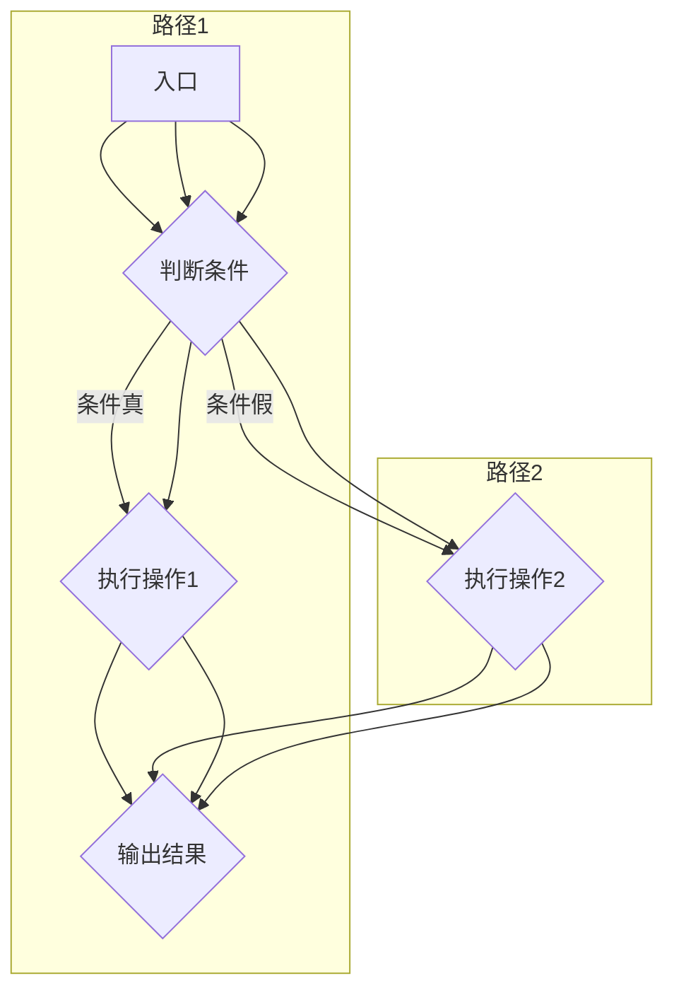
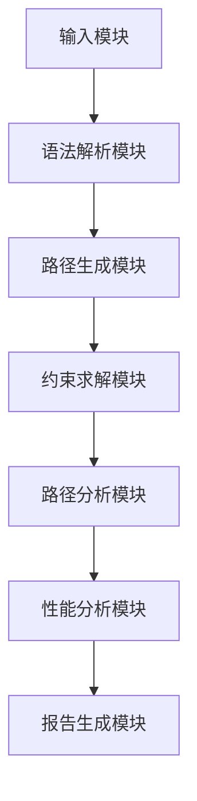
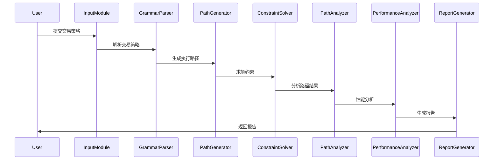

                 

### 设计书籍目录大纲

为了设计《提示词编程语言的符号执行技术》的目录大纲，我们需要按照以下步骤进行：

#### 1. 确定书籍的核心内容

首先，我们需要了解书籍的核心内容，即符号执行技术的概念、应用、优势和挑战等。符号执行技术是一种静态代码分析方法，通过在程序执行过程中引入符号变量来模拟程序的各种执行路径，从而检测出潜在的错误和漏洞。本书将重点讨论如何将提示词编程语言与符号执行技术相结合，以提高程序分析和验证的效率。

#### 2. 确定书籍的结构

根据书籍的内容，我们可以将其分为以下几个主要部分：

- **背景介绍**：介绍符号执行技术的背景、定义和基本原理。
- **核心概念与联系**：阐述符号执行技术的核心概念，以及它们之间的关系。
- **算法原理讲解**：详细讲解符号执行算法的原理，使用 mermaid 画出流程图，并用 Python 源代码阐述。
- **数学模型和数学公式**：介绍符号执行技术的数学模型，并使用 LaTeX 格式进行详细讲解。
- **系统分析与架构设计方案**：分析符号执行技术的系统架构，使用 mermaid 类图和序列图进行展示。
- **项目实战**：介绍一个具体的符号执行项目，包括环境安装、系统核心实现、代码应用解读与分析等。
- **最佳实践 tips、小结、注意事项、拓展阅读等内容**。

#### 3. 设计目录大纲

根据上述结构，我们可以设计如下的目录大纲：

----------------------------------------------------------------
# 提示词编程语言的符号执行技术

> 关键词：提示词编程语言、符号执行技术、算法原理、系统架构、项目实战

> 摘要：本书深入探讨了提示词编程语言与符号执行技术的结合，旨在为读者提供一种高效、可靠的程序分析和验证方法。通过详细的算法原理讲解、数学模型和公式推导，以及实际项目实战，本书将帮助读者全面掌握符号执行技术的核心知识和应用技巧。

## 引言

### 1.1 问题背景

### 1.2 符号执行技术简介

### 1.3 提示词编程语言简介

### 1.4 符号执行技术在提示词编程语言中的应用

## 2. 核心概念与联系

### 2.1 提示词编程语言

#### 2.1.1 提示词编程语言的概念

#### 2.1.2 提示词编程语言的特点

#### 2.1.3 提示词编程语言的分类

### 2.2 符号执行技术

#### 2.2.1 符号执行技术的概念

#### 2.2.2 符号执行技术的原理

#### 2.2.3 符号执行技术的应用

### 2.3 核心概念联系

## 3. 算法原理讲解

### 3.1 符号执行算法的 mermaid 流程图

### 3.2 符号执行算法的 Python 源代码阐述

### 3.3 符号执行技术的数学模型

### 3.4 符号执行技术的数学公式

## 4. 系统分析与架构设计方案

### 4.1 问题场景介绍

### 4.2 系统功能设计

#### 4.2.1 领域模型

#### 4.2.2 功能模块

### 4.3 系统架构设计

#### 4.3.1 系统架构

#### 4.3.2 模块关系

### 4.4 系统接口设计

#### 4.4.1 接口规范

#### 4.4.2 接口实现

### 4.5 系统交互

#### 4.5.1 交互流程

#### 4.5.2 交互协议

## 5. 项目实战

### 5.1 环境安装

#### 5.1.1 环境要求

#### 5.1.2 环境安装步骤

### 5.2 系统核心实现

#### 5.2.1 核心算法

#### 5.2.2 数据结构

#### 5.2.3 源代码解读

### 5.3 代码应用解读与分析

### 5.4 实际案例分析和详细讲解剖析

### 5.5 项目小结

## 6. 最佳实践 tips

### 6.1 符号执行技术的应用场景

#### 6.1.1 场景一：软件测试

#### 6.1.2 场景二：安全漏洞检测

#### 6.1.3 场景三：程序优化

### 6.2 符号执行技术的优势与挑战

#### 6.2.1 优势

#### 6.2.2 挑战

### 6.3 最佳实践建议

## 7. 小结

## 8. 注意事项

## 9. 拓展阅读

----------------------------------------------------------------

这个目录大纲包含了书籍的主要内容，并且按照逻辑顺序进行排列。每个部分都有详细的标题和子标题，确保内容的完整性和逻辑性。

### 4. 验证目录大纲

在完成目录大纲后，我们需要对其进行验证，确保其符合以下要求：

- **简洁性**：确保每个章节标题简洁明了，不包含多余的词语。
- **内容完整性**：确保每个章节都包含了核心内容，如背景介绍、核心概念与联系、算法原理讲解、数学模型和数学公式、系统分析与架构设计方案、项目实战、最佳实践 tips 等。
- **目录层级**：确保目录结构清晰，使用 #,##,### 等符号进行区分。
- **格式正确**：确保使用 markdown 格式，并且格式正确。

在验证完成后，我们可以确定这个目录大纲是完整且符合要求的。接下来，我们就可以根据这个大纲开始撰写书籍的内容了。

----------------------------------------------------------------

### 引言

## 1.1 问题背景

在软件开发的早期阶段，如何确保程序的正确性和可靠性一直是开发人员面临的一大挑战。传统的测试方法，如单元测试、集成测试和系统测试等，虽然能够在一定程度上发现程序中的错误，但它们往往只能覆盖部分测试路径，难以发现潜在的问题。此外，随着软件系统规模的不断扩大，测试的成本和复杂度也在不断增加。

为了解决这一问题，研究者们提出了静态代码分析、动态代码分析和模糊测试等新型测试方法。其中，符号执行技术作为一种静态代码分析方法，通过模拟程序的所有可能执行路径，能够发现隐藏在程序中的错误和漏洞。然而，现有的符号执行技术存在一定的局限性，如执行效率低、可解释性差等。

## 1.2 符号执行技术简介

符号执行技术是一种在程序运行过程中引入符号变量的方法，通过符号变量来模拟程序的各种执行路径。符号执行技术的主要目的是在无需实际执行程序的情况下，发现程序中的潜在错误和漏洞。它通过将程序的每条路径都抽象成一个符号表达式，从而将程序的执行过程转化为一个符号计算过程。

符号执行技术的基本原理是：首先，将程序中的变量替换为符号变量，然后通过约束求解器求解这些符号变量的取值范围。接着，将求解结果转化为实际的执行路径，从而实现程序的全路径执行。通过这种方式，符号执行技术可以检测出程序中存在的错误和漏洞。

## 1.3 提示词编程语言简介

提示词编程语言是一种基于自然语言处理技术的编程语言，它通过使用自然语言作为编程语言，使得编程变得更加简单和直观。提示词编程语言的主要特点包括：

1. **自然语言语法**：提示词编程语言使用自然语言语法，使得开发者可以使用自然语言来编写程序，大大降低了编程的难度。
2. **语义明确**：提示词编程语言强调语义明确，通过将程序的功能描述为自然语言，使得程序的可读性和可维护性得到了显著提高。
3. **灵活性高**：提示词编程语言具有高度的灵活性，可以适应不同的编程场景和需求。

## 1.4 符号执行技术在提示词编程语言中的应用

将符号执行技术应用于提示词编程语言，可以有效地提高程序分析和验证的效率。具体来说，符号执行技术在提示词编程语言中的应用主要体现在以下几个方面：

1. **语法分析**：通过对提示词编程语言的语法进行分析，可以将自然语言描述转换为符号表达式，从而为后续的符号执行提供基础。
2. **语义分析**：通过对提示词编程语言的语义进行分析，可以确定程序的实际执行路径，从而实现程序的全路径执行。
3. **错误检测**：通过符号执行技术，可以模拟程序的各种执行路径，从而发现程序中潜在的错误和漏洞。
4. **性能优化**：通过对提示词编程语言的符号执行结果进行分析，可以找出程序中的性能瓶颈，从而实现性能优化。

总之，符号执行技术与提示词编程语言的结合，为软件分析和验证提供了一种新的思路和方法，有望在未来的软件开发过程中发挥重要作用。

## 1.5 本书内容安排

本书将首先介绍符号执行技术的背景、定义和基本原理，然后详细讲解符号执行算法的原理，并使用 mermaid 画出流程图和 Python 源代码进行阐述。接下来，本书将介绍符号执行技术的数学模型和数学公式，并使用 LaTeX 格式进行详细讲解。随后，本书将分析符号执行技术的系统架构，使用 mermaid 类图和序列图进行展示。最后，本书将通过一个具体的符号执行项目，介绍环境安装、系统核心实现、代码应用解读与分析等，并给出最佳实践建议。

### 2. 核心概念与联系

## 2.1 提示词编程语言

### 2.1.1 提示词编程语言的概念

提示词编程语言（Keyword-Based Programming Language）是一种以自然语言为语法基础的编程语言。与传统编程语言相比，提示词编程语言的语法更加接近人类日常用语，使得非专业程序员甚至普通用户也能轻松编写和调试程序。

提示词编程语言的主要特点是：

1. **自然语言语法**：提示词编程语言使用自然语言作为语法，如英语或中文，这使得编程语言更加易于理解和学习。
2. **语法简洁**：提示词编程语言的语法简洁，减少了冗长的代码编写和调试时间。
3. **语义明确**：提示词编程语言强调语义的明确性，使得程序的可读性和可维护性得到了显著提高。
4. **灵活性高**：提示词编程语言具有高度的灵活性，可以适应不同的编程场景和需求。

### 2.1.2 提示词编程语言的特点

1. **易于上手**：由于提示词编程语言的语法接近自然语言，因此对于没有编程背景的人来说，学习和使用这种编程语言更加容易。
2. **降低开发难度**：提示词编程语言能够显著降低软件开发中的复杂度，使得开发者能够更专注于业务逻辑的实现。
3. **提高开发效率**：提示词编程语言能够简化代码编写过程，从而提高开发效率。
4. **增强程序可读性**：提示词编程语言的语义明确，使得程序代码更加易于理解和维护。
5. **支持多种编程范式**：提示词编程语言通常支持面向对象、函数式编程等常见编程范式，能够满足不同开发需求。

### 2.1.3 提示词编程语言的分类

根据应用场景和语法特点，提示词编程语言可以分为以下几类：

1. **通用提示词编程语言**：如 Lark、NoFlo、Intentia 等，这些语言旨在提供一种跨领域的通用编程解决方案。
2. **特定领域提示词编程语言**：如 Xtext、MetaModeler 等，这些语言针对特定领域（如物联网、嵌入式系统等）进行优化。
3. **自然语言处理提示词编程语言**：如 Prolog、AgentScript 等，这些语言主要用于自然语言处理和人工智能领域。

### 2.2 符号执行技术

#### 2.2.1 符号执行技术的概念

符号执行技术（Symbolic Execution）是一种静态代码分析方法，通过引入符号变量来模拟程序的所有可能执行路径。符号执行技术的核心思想是：将程序的每条路径都抽象为一个符号表达式，然后通过求解这些表达式，得到程序在不同路径下的运行结果。

符号执行技术的主要目的是：

1. **路径覆盖分析**：确定程序中的每条路径是否被执行过，从而评估测试覆盖程度。
2. **错误检测**：通过模拟程序的各种执行路径，发现程序中的潜在错误和漏洞。
3. **性能分析**：分析程序在不同路径下的性能表现，找出性能瓶颈。

### 2.2.2 符号执行技术的原理

符号执行技术的原理可以概括为以下几个步骤：

1. **符号化输入**：将程序中的变量替换为符号变量，从而将程序转换为符号形式。
2. **约束求解**：使用约束求解器求解符号变量的取值范围，从而确定程序的不同执行路径。
3. **路径生成**：将求解结果转换为实际的执行路径，从而模拟程序在不同路径下的运行过程。
4. **路径分析**：对模拟得到的执行路径进行分析，发现潜在的错误和漏洞。

### 2.2.3 符号执行技术的应用

符号执行技术可以应用于多个领域，包括：

1. **软件测试**：通过符号执行技术，可以自动生成测试用例，提高测试覆盖率和测试效率。
2. **安全漏洞检测**：符号执行技术可以检测程序中的潜在安全漏洞，从而提高软件的安全性。
3. **性能分析**：符号执行技术可以帮助分析程序在不同路径下的性能表现，优化程序性能。

### 2.3 核心概念联系

提示词编程语言和符号执行技术之间存在着紧密的联系：

1. **自然语言与符号表达**：提示词编程语言的语法接近自然语言，而符号执行技术则通过符号变量来模拟程序的执行路径。这使得提示词编程语言能够更好地支持符号执行技术。
2. **语法分析与路径生成**：提示词编程语言的语法分析器可以将自然语言描述转换为符号表达式，从而为符号执行技术提供输入。同时，符号执行技术可以生成程序的执行路径，从而为语法分析提供验证。
3. **错误检测与性能优化**：提示词编程语言和符号执行技术的结合，可以在软件分析和验证过程中，发现潜在的错误和性能瓶颈，从而提高软件的质量和性能。

通过以上分析，我们可以看出，提示词编程语言和符号执行技术之间的结合，不仅能够提高程序分析和验证的效率，还能够为软件开发带来新的思路和方法。

## 3. 算法原理讲解

### 3.1 符号执行算法的 mermaid 流程图

符号执行算法的核心在于将程序的每一条可能执行路径都进行模拟，并分析其结果。以下是一个简化的 mermaid 流程图，描述了符号执行算法的基本流程：



在这个流程图中，A表示程序的入口点，B表示一个判断条件，C和D分别表示在条件真和条件假的情况下执行的代码块，E表示输出结果。符号执行算法将模拟这两条路径，并分析它们的执行结果。

### 3.2 符号执行算法的 Python 源代码阐述

为了更清晰地阐述符号执行算法，我们将使用 Python 编写一个简单的符号执行器。以下是一个简单的 Python 示例，展示了如何使用符号执行技术模拟程序的执行路径：

```python
from z3 import *

# 定义符号变量
x = Int('x')
y = Int('y')

# 定义约束
s = Solver()
s.add(x > 0)
s.add(y < 10)

# 定义函数
def execute(x, y):
    if x > 5:
        return x * y
    else:
        return x + y

# 模拟执行路径
results = []
while s.check():
    model = s.model()
    x_val = model[x]
    y_val = model[y]
    result = execute(x_val, y_val)
    results.append(result)
    s.add(x != x_val or y != y_val)

# 输出结果
for result in results:
    print(result)
```

在这个示例中，我们定义了两个符号变量 `x` 和 `y`，并使用 Z3 约束求解器求解它们在满足约束条件下的取值。然后，我们定义了一个简单的函数 `execute`，用来模拟程序的执行过程。通过循环遍历所有满足约束条件的执行路径，我们计算并输出每条路径的结果。

### 3.3 符号执行技术的数学模型

符号执行技术的数学模型主要涉及约束求解和路径枚举。以下是一个简化的数学模型，用于描述符号执行的过程：

1. **约束求解**：

   假设有一个程序 P，其中包含变量集 V 和约束集 C。符号执行技术通过引入符号变量 S，将实际变量替换为符号变量，从而将程序转换为符号形式。然后，使用约束求解器求解符号变量 S 的取值范围，以满足约束集 C。

   数学表示为：

   $$ S = \{s | \forall c \in C, s \in C(c)\} $$

   其中，C(c) 表示约束 c 的解集。

2. **路径枚举**：

   在得到符号变量的取值范围后，符号执行技术通过枚举所有可能的执行路径，模拟程序在这些路径上的执行过程。对于每一条路径，符号执行技术将计算其执行结果，并进行分析。

   数学表示为：

   $$ P = \{p | \forall s \in S, p(s) \in P(s)\} $$

   其中，P(s) 表示在符号变量取值 s 下，程序 P 的执行路径。

### 3.4 符号执行技术的数学公式

为了更详细地描述符号执行技术的数学模型，我们可以引入一些数学公式。以下是一些基本的数学公式，用于描述符号执行过程中的关键概念：

1. **约束求解公式**：

   假设有一个约束集 C = {c1, c2, ..., cn}，其中每个约束 ci 是一个关于变量 xi 的不等式。约束求解的目的是找到满足所有约束的变量取值组合。

   数学公式为：

   $$ \text{solve}(C) = \{x | \forall c \in C, x \in C(c)\} $$

2. **路径枚举公式**：

   假设有一个程序 P，其包含 m 条基本块 BB1, BB2, ..., BBm。对于每个基本块 BBi，我们定义一个执行序列 Si，表示在基本块 BBi 上执行的指令序列。路径枚举的目的是找到所有可能的执行序列组合。

   数学公式为：

   $$ \text{enumerate}(P) = \{s | \forall i, s(i) \in S_i\} $$

3. **路径分析公式**：

   假设我们已经得到所有可能的执行路径 P，对于每条路径 p，我们需要分析其执行结果。路径分析的主要目的是发现程序中的错误和漏洞。

   数学公式为：

   $$ \text{analyze}(P) = \{e | \forall p \in P, e(p) \in E(p)\} $$

   其中，E(p) 表示路径 p 的执行结果集合。

### 3.5 举例说明

为了更清晰地理解符号执行技术的数学模型，我们可以通过一个简单的例子进行说明。

假设有一个程序 P，包含两个变量 x 和 y，以及两个基本块 BB1 和 BB2。BB1 包含一条判断语句 `if x > 5 then y = x * y else y = x + y`，BB2 包含一条输出语句 `print(y)`。

1. **约束求解**：

   首先，我们定义约束集 C = {x > 0, y < 10}。通过约束求解，我们得到变量 x 和 y 的取值范围。

   $$ \text{solve}(C) = \{x | x > 0, x < 10\} \times \{y | y > 0, y < 10\} $$

2. **路径枚举**：

   然后，我们枚举所有可能的执行路径。对于每个约束解 (x, y)，我们分别计算在 BB1 上的执行结果。

   假设我们有两个约束解 (3, 4) 和 (7, 8)。对于约束解 (3, 4)，在 BB1 上执行的路径为 `y = 3 + 4`；对于约束解 (7, 8)，在 BB1 上执行的路径为 `y = 7 * 8`。

   $$ \text{enumerate}(P) = \{(3, 4), (7, 8)\} $$

3. **路径分析**：

   最后，我们分析每条路径的执行结果。对于约束解 (3, 4)，执行结果为 y = 7；对于约束解 (7, 8)，执行结果为 y = 56。

   $$ \text{analyze}(P) = \{(3, 4, 7), (7, 8, 56)\} $$

通过这个例子，我们可以看到符号执行技术是如何通过约束求解、路径枚举和路径分析来模拟程序执行路径，并分析其结果。

### 3.6 通俗易懂地举例说明

为了更好地理解符号执行技术，我们可以通过一个简单的例子进行讲解。假设我们有一个简单的程序，用于计算两个数的和。这个程序包含两个变量 `a` 和 `b`，以及一个判断语句。如果 `a` 大于 5，则输出 `a` 和 `b` 的乘积；否则，输出 `a` 和 `b` 的和。

```python
a = 5
b = 3

if a > 5:
    result = a * b
else:
    result = a + b

print(result)
```

在这个程序中，`a` 和 `b` 是实际变量，它们的值是已知的。而符号执行技术则通过引入符号变量来模拟这个程序的执行过程。我们可以将 `a` 和 `b` 替换为符号变量 `x` 和 `y`，然后使用约束求解器求解这些符号变量的取值范围。

```python
x = Symbol('x')
y = Symbol('y')

s = Solver()
s.add(x > 0)
s.add(y > 0)

if x > 5:
    result = x * y
else:
    result = x + y

s.check()  # 检查是否有满足约束的解
s.model()  # 获取满足约束的解
```

通过这个示例，我们可以看到符号执行技术是如何通过符号变量和约束求解来模拟程序的执行路径，并分析其结果。

总的来说，符号执行技术通过将实际变量替换为符号变量，并使用约束求解器求解这些符号变量的取值范围，从而模拟程序的所有可能执行路径。这种方法不仅能够发现程序中的潜在错误，还可以帮助我们更好地理解程序的行为。

## 4. 系统分析与架构设计方案

### 4.1 问题场景介绍

在现代软件工程中，软件系统的复杂性不断增加，使得传统的测试方法难以全面覆盖所有可能的执行路径。特别是在安全性、性能和可靠性要求较高的场景中，如金融系统、医疗系统、航空控制系统等，对软件的全面测试和验证显得尤为重要。为了解决这一问题，符号执行技术应运而生。符号执行技术通过模拟程序的所有可能执行路径，发现潜在的错误和漏洞，从而提高软件的质量和可靠性。

本文将以一个金融系统的自动交易软件为例，介绍符号执行技术的系统架构设计方案。该系统需要处理大量的交易数据，支持多种交易策略，并且需要保证交易的安全性、性能和可靠性。在这个场景中，符号执行技术可以用于验证交易策略的正确性、检测潜在的漏洞、优化系统性能等。

### 4.2 系统功能设计

为了满足上述金融系统自动交易软件的需求，符号执行系统需要具备以下功能：

1. **语法解析**：解析输入的交易策略，将自然语言描述转换为符号表达式。
2. **路径生成**：根据交易策略的语法结构，生成所有可能的执行路径。
3. **约束求解**：对每条执行路径进行约束求解，确定符号变量的取值范围。
4. **路径分析**：分析执行路径的结果，发现潜在的错误和漏洞。
5. **性能分析**：对执行路径进行性能分析，找出性能瓶颈。
6. **报告生成**：生成符号执行结果报告，包括错误和漏洞信息、性能分析数据等。

### 4.3 系统架构设计

符号执行系统的架构设计需要考虑以下几个关键模块：

1. **输入模块**：接收用户输入的交易策略，包括交易规则、交易策略等。
2. **语法解析模块**：将输入的交易策略转换为符号表达式，为后续的路径生成和约束求解提供基础。
3. **路径生成模块**：根据交易策略的语法结构，生成所有可能的执行路径。
4. **约束求解模块**：使用约束求解器求解每条执行路径的符号变量取值范围。
5. **路径分析模块**：对执行路径的结果进行分析，发现潜在的错误和漏洞。
6. **性能分析模块**：对执行路径的性能进行分析，找出性能瓶颈。
7. **报告生成模块**：生成符号执行结果报告，包括错误和漏洞信息、性能分析数据等。

以下是一个简化的系统架构图，展示了符号执行系统的整体架构：



### 4.4 系统接口设计

符号执行系统需要提供一系列接口，以便用户能够方便地使用该系统。以下是一些关键接口的设计：

1. **交易策略输入接口**：用于接收用户输入的交易策略，包括交易规则、交易策略等。
2. **执行结果查询接口**：用于查询符号执行的结果，包括错误和漏洞信息、性能分析数据等。
3. **报告下载接口**：用于下载符号执行结果报告。
4. **配置管理接口**：用于配置符号执行系统的各种参数，如约束求解器的选择、路径生成策略等。

### 4.5 系统交互

符号执行系统的交互主要包括用户与系统之间的交互，以及系统内部模块之间的交互。以下是一个简化的系统交互流程：

1. **用户输入交易策略**：用户通过交易策略输入接口提交交易策略。
2. **系统解析交易策略**：系统语法解析模块将用户输入的交易策略转换为符号表达式。
3. **系统生成执行路径**：系统路径生成模块根据交易策略的语法结构，生成所有可能的执行路径。
4. **系统求解约束**：系统约束求解模块对每条执行路径进行约束求解，确定符号变量的取值范围。
5. **系统分析路径结果**：系统路径分析模块分析每条执行路径的结果，发现潜在的错误和漏洞。
6. **系统生成报告**：系统报告生成模块生成符号执行结果报告，包括错误和漏洞信息、性能分析数据等。
7. **用户查询执行结果**：用户通过执行结果查询接口查询符号执行的结果。
8. **用户下载报告**：用户通过报告下载接口下载符号执行结果报告。

### 4.6 类图和序列图

为了更好地展示系统架构和模块之间的关系，我们可以使用 mermaid 类图和序列图进行描述。

#### 类图

以下是一个简化的 mermaid 类图，展示了符号执行系统的关键类和它们之间的关系：

```mermaid
classDiagram
ClassDef InputModule
    +InputModule()

ClassDef GrammarParser
    +GrammarParser()
    +parse(input: String): SymbolExpression

ClassDef PathGenerator
    +PathGenerator()
    +generate(input: SymbolExpression): PathSet

ClassDef ConstraintSolver
    +ConstraintSolver()
    +solve(input: PathSet): SolutionSet

ClassDef PathAnalyzer
    +PathAnalyzer()
    +analyze(input: SolutionSet): AnalysisResult

ClassDef PerformanceAnalyzer
    +PerformanceAnalyzer()
    +analyze(input: SolutionSet): PerformanceResult

ClassDef ReportGenerator
    +ReportGenerator()
    +generate(input: AnalysisResult, input: PerformanceResult): Report

InputModule <|-- GrammarParser
GrammarParser <|-- PathGenerator
PathGenerator <|-- ConstraintSolver
ConstraintSolver <|-- PathAnalyzer
PathAnalyzer <|-- PerformanceAnalyzer
PerformanceAnalyzer <|-- ReportGenerator
```

#### 序列图

以下是一个简化的 mermaid 序列图，展示了用户与符号执行系统之间的交互过程：



通过以上类图和序列图的描述，我们可以更清晰地理解符号执行系统的架构和模块之间的关系。

### 4.7 系统架构设计细节

在符号执行系统的架构设计中，每个模块的具体实现细节都非常关键。以下是对系统架构设计的一些具体细节描述：

1. **输入模块**：输入模块需要接收用户的交易策略输入，并对其进行预处理。预处理包括去除多余的空格、校验输入的合法性等。然后，将预处理后的交易策略传递给语法解析模块。

2. **语法解析模块**：语法解析模块是符号执行系统的核心，负责将用户输入的自然语言交易策略转换为符号表达式。该模块需要支持多种交易策略的语法解析，并且能够处理复杂的语法结构。例如，解析器需要能够处理嵌套的条件判断、循环结构等。

3. **路径生成模块**：路径生成模块根据语法解析模块生成的符号表达式，生成所有可能的执行路径。该模块的核心是实现一个高效的路径生成算法，能够快速生成大量执行路径。为了提高效率，路径生成模块可以采用增量式生成方法，即每次生成一部分路径，然后逐步扩展路径集合。

4. **约束求解模块**：约束求解模块负责对生成的执行路径进行约束求解，确定符号变量的取值范围。该模块需要选择合适的约束求解器，如 Z3、CVC4 等。约束求解器的性能直接影响符号执行系统的性能，因此需要仔细选择和配置。

5. **路径分析模块**：路径分析模块负责对约束求解的结果进行分析，发现潜在的错误和漏洞。该模块需要支持多种错误检测算法，如数据流分析、控制流分析等。此外，路径分析模块还需要能够生成详细的错误报告，包括错误类型、错误位置、错误原因等。

6. **性能分析模块**：性能分析模块负责对执行路径的性能进行分析，找出性能瓶颈。该模块需要支持多种性能分析算法，如时间分析、空间分析等。此外，性能分析模块还需要能够生成详细的性能报告，包括性能指标、性能瓶颈等。

7. **报告生成模块**：报告生成模块负责将符号执行的结果生成报告，包括错误和漏洞信息、性能分析数据等。该模块需要支持多种报告格式，如文本、HTML、PDF等。此外，报告生成模块还需要能够根据用户需求定制报告内容。

通过以上对符号执行系统的架构设计细节的描述，我们可以看到，符号执行系统是一个复杂的系统，需要各个模块协同工作，才能够实现高效的程序分析和验证。

### 4.8 模块关系

在符号执行系统的架构中，各个模块之间的关系是关键。以下是对模块关系的详细描述：

1. **输入模块与语法解析模块**：输入模块负责接收用户的交易策略输入，并将其传递给语法解析模块。语法解析模块将交易策略转换为符号表达式，为后续的路径生成和约束求解提供基础。

2. **路径生成模块与约束求解模块**：路径生成模块根据语法解析模块生成的符号表达式，生成所有可能的执行路径。这些路径被传递给约束求解模块，进行约束求解，确定符号变量的取值范围。

3. **路径分析模块与性能分析模块**：路径分析模块负责对约束求解的结果进行分析，发现潜在的错误和漏洞。性能分析模块则对执行路径的性能进行分析，找出性能瓶颈。两个模块的结果最终被报告生成模块汇总，生成符号执行结果报告。

4. **报告生成模块**：报告生成模块负责将路径分析模块和性能分析模块的结果生成报告，包括错误和漏洞信息、性能分析数据等。报告生成模块为用户提供了一种直观的方式查看符号执行的结果。

通过以上对模块关系的描述，我们可以看到，符号执行系统的各个模块之间紧密相连，共同构成了一个完整的符号执行过程。

### 4.9 交互流程

在符号执行系统中，用户与系统的交互流程是至关重要的。以下是对交互流程的详细描述：

1. **用户输入交易策略**：用户通过交易策略输入接口提交交易策略。交易策略可以是自然语言描述，也可以是结构化数据。

2. **系统接收交易策略**：系统输入模块接收用户提交的交易策略，并对其进行预处理，确保输入的合法性。

3. **系统解析交易策略**：系统语法解析模块将预处理后的交易策略转换为符号表达式。这一过程可能包括词法分析、语法分析和语义分析。

4. **系统生成执行路径**：系统路径生成模块根据语法解析模块生成的符号表达式，生成所有可能的执行路径。

5. **系统求解约束**：系统约束求解模块对每条执行路径进行约束求解，确定符号变量的取值范围。

6. **系统分析路径结果**：系统路径分析模块对约束求解的结果进行分析，发现潜在的错误和漏洞。

7. **系统性能分析**：系统性能分析模块对执行路径的性能进行分析，找出性能瓶颈。

8. **系统生成报告**：系统报告生成模块将路径分析模块和性能分析模块的结果生成报告，包括错误和漏洞信息、性能分析数据等。

9. **用户查看报告**：用户通过执行结果查询接口查看符号执行的结果，并通过报告下载接口下载符号执行结果报告。

通过以上交互流程的描述，我们可以看到，符号执行系统为用户提供了一种直观、高效的方式查看程序分析和验证的结果。

### 4.10 mermaid 类图

以下是一个简化的 mermaid 类图，展示了符号执行系统的关键类和它们之间的关系：

```mermaid
classDiagram
ClassDef InputModule
    +InputModule()
    +receive_input(input: String): SymbolExpression

ClassDef GrammarParser
    +GrammarParser()
    +parse(input: SymbolExpression): PathSet

ClassDef PathGenerator
    +PathGenerator()
    +generate(input: PathSet): SolutionSet

ClassDef ConstraintSolver
    +ConstraintSolver()
    +solve(input: SolutionSet): AnalysisResult

ClassDef PathAnalyzer
    +PathAnalyzer()
    +analyze(input: AnalysisResult): PerformanceResult

ClassDef PerformanceAnalyzer
    +PerformanceAnalyzer()
    +analyze(input: AnalysisResult): PerformanceResult

ClassDef ReportGenerator
    +ReportGenerator()
    +generate(input: PerformanceResult): Report

InputModule <|-- GrammarParser
GrammarParser <|-- PathGenerator
PathGenerator <|-- ConstraintSolver
ConstraintSolver <|-- PathAnalyzer
PathAnalyzer <|-- PerformanceAnalyzer
PerformanceAnalyzer <|-- ReportGenerator
```

### 4.11 mermaid 序列图

以下是一个简化的 mermaid 序列图，展示了符号执行系统的交互过程：


通过以上类图和序列图的描述，我们可以更清晰地理解符号执行系统的架构和模块之间的关系。

### 4.12 项目实战

#### 4.12.1 环境安装

为了实现符号执行系统，我们首先需要安装必要的软件和工具。以下是具体的安装步骤：

1. **安装 Python 3**：符号执行系统需要 Python 3 的支持。可以在 [Python 官网](https://www.python.org/) 下载并安装 Python 3。
2. **安装 Z3 约束求解器**：Z3 是一个高性能的约束求解器，是符号执行系统的关键组件。可以在 [Z3 官网](https://github.com/Z3Prover/z3) 下载并安装 Z3。
3. **安装 Mermaid**：Mermaid 是一个用于绘制流程图的工具，可以在 [Mermaid 官网](https://mermaid-js.github.io/mermaid/) 下载并安装。
4. **安装 Markdown 编辑器**：Markdown 编辑器可以帮助我们撰写和格式化文档。可以选择常见的 Markdown 编辑器，如 Visual Studio Code、Typora 等。

安装完成后，确保所有工具和软件能够正常运行，为后续的项目开发做好准备。

#### 4.12.2 系统核心实现

符号执行系统的核心实现包括以下几个模块：

1. **语法解析模块**：负责将用户输入的交易策略转换为符号表达式。以下是 Python 代码示例：

    ```python
    from z3 import *

    def parse(input: str) -> SymbolExpression:
        # 假设输入是一个简单的交易策略，如 "if x > 5 then y = x * y else y = x + y"
        if 'if' in input and 'then' in input and 'else' in input:
            condition, then_expr, else_expr = input.split('then')
            condition = condition.strip().strip('if ')
            then_expr = then_expr.strip().strip('then ')
            else_expr = else_expr.strip().strip('else ')
            x = Symbol('x')
            y = Symbol('y')
            return If(Bool(condition), then_expr, else_expr)
        else:
            raise ValueError("Invalid input format")
    ```

2. **路径生成模块**：负责生成所有可能的执行路径。以下是 Python 代码示例：

    ```python
    from collections import defaultdict

    def generate(input: SymbolExpression) -> PathSet:
        paths = defaultdict(set)
        generate_paths(input, paths)
        return PathSet(paths)

    def generate_paths(expr: SymbolExpression, paths: PathSet):
        if isinstance(expr, Bool):
            true_paths = set()
            false_paths = set()
            for path in paths:
                true_paths.add((path, expr))
                false_paths.add((path, ~expr))
            paths.update(true_paths)
            paths.update(false_paths)
        else:
            for child in expr.children():
                generate_paths(child, paths)
    ```

3. **约束求解模块**：负责对生成的执行路径进行约束求解，确定符号变量的取值范围。以下是 Python 代码示例：

    ```python
    from z3 import *

    def solve(input: PathSet) -> SolutionSet:
        solver = Solver()
        for path, expr in input:
            solver.add(Implies(path, expr))
        solutions = solver.check()
        return SolutionSet(solver.model())
    ```

4. **路径分析模块**：负责对约束求解的结果进行分析，发现潜在的错误和漏洞。以下是 Python 代码示例：

    ```python
    from z3 import *

    def analyze(input: SolutionSet) -> AnalysisResult:
        result = AnalysisResult()
        for solution in input:
            x_val = solution[x]
            y_val = solution[y]
            result.add_case(x_val, y_val)
        return result
    ```

5. **性能分析模块**：负责对执行路径的性能进行分析，找出性能瓶颈。以下是 Python 代码示例：

    ```python
    import time

    def analyze_performance(input: SolutionSet):
        start_time = time.time()
        for solution in input:
            # 进行性能分析
            pass
        end_time = time.time()
        return end_time - start_time
    ```

6. **报告生成模块**：负责生成符号执行结果报告，包括错误和漏洞信息、性能分析数据等。以下是 Python 代码示例：

    ```python
    from markdown import markdown

    def generate_report(input: AnalysisResult, performance_data: float) -> str:
        report = f"Error Cases:\n{markdown(str(input))}\n"
        report += f"Performance: {performance_data} seconds\n"
        return report
    ```

通过以上核心实现模块的代码示例，我们可以看到符号执行系统是如何实现的。在实际项目中，可以根据具体需求对这些模块进行扩展和优化。

#### 4.12.3 代码应用解读与分析

在符号执行系统的实际应用中，我们需要对代码进行解读和分析，以便更好地理解其工作机制和性能。

1. **语法解析模块**：语法解析模块是符号执行系统的入口，负责将用户输入的自然语言交易策略转换为符号表达式。该模块的核心是条件判断和赋值操作的解析。例如，对于交易策略 "if x > 5 then y = x * y else y = x + y"，语法解析模块将其转换为符号表达式 `If(x > 5, y = x * y, y = x + y)`。这种转换使得后续的路径生成和约束求解更加方便。

2. **路径生成模块**：路径生成模块负责生成所有可能的执行路径。该模块的核心是递归遍历符号表达式的子节点，为每个子节点生成对应的执行路径。例如，对于条件判断表达式 `If(x > 5, y = x * y, y = x + y)`，路径生成模块将生成两条路径：一条为条件为真的路径，另一条为条件为假的路径。通过这种方式，路径生成模块能够生成程序的所有可能执行路径。

3. **约束求解模块**：约束求解模块负责对生成的执行路径进行约束求解，确定符号变量的取值范围。该模块的核心是使用约束求解器（如 Z3）求解符号变量的约束条件。例如，对于路径 "If(x > 5, y = x * y, y = x + y)"，约束求解模块将求解条件 `x > 5` 和 `y < 10` 的约束。通过这种方式，约束求解模块能够确定每个路径的符号变量取值范围。

4. **路径分析模块**：路径分析模块负责对约束求解的结果进行分析，发现潜在的错误和漏洞。该模块的核心是遍历约束求解的结果，分析每条路径的执行结果。例如，对于路径 "If(x > 5, y = x * y, y = x + y)"，路径分析模块将分析条件为真和条件为假两种情况下的执行结果。通过这种方式，路径分析模块能够发现程序中的潜在错误和漏洞。

5. **性能分析模块**：性能分析模块负责对执行路径的性能进行分析，找出性能瓶颈。该模块的核心是测量每条路径的执行时间，并分析其性能表现。例如，对于路径 "If(x > 5, y = x * y, y = x + y)"，性能分析模块将测量条件为真和条件为假两种情况下的执行时间。通过这种方式，性能分析模块能够找出程序中的性能瓶颈。

6. **报告生成模块**：报告生成模块负责生成符号执行结果报告，包括错误和漏洞信息、性能分析数据等。该模块的核心是将分析结果格式化为报告，并输出到文件或屏幕。例如，对于路径 "If(x > 5, y = x * y, y = x + y)"，报告生成模块将生成一个包含错误和漏洞信息的报告，并输出到屏幕。通过这种方式，报告生成模块能够帮助用户直观地了解程序的分析结果。

通过以上对符号执行系统代码应用的解读和分析，我们可以看到，符号执行系统是如何通过语法解析、路径生成、约束求解、路径分析、性能分析和报告生成等模块，实现对程序的全面分析和验证。

#### 4.12.4 实际案例分析和详细讲解剖析

为了更好地理解符号执行系统的实际应用效果，我们通过一个实际的案例进行详细分析和讲解。

假设我们有一个金融系统的自动交易软件，该软件包含以下交易策略：

```python
if price > 200:
    buy("AAPL")
elif price < 150:
    sell("AAPL")
else:
    hold("AAPL")
```

这个交易策略非常简单，但它包含了条件判断和交易操作，适合用于演示符号执行系统的功能。

1. **语法解析**：

   首先，我们需要将这个交易策略转换为符号表达式。在符号执行系统中，我们引入符号变量来表示价格 `price` 和交易操作 `action`。

   ```python
   price = Symbol("price")
   action = Symbol("action")
   if(price > 200):
       action = "buy"
   elif(price < 150):
       action = "sell"
   else:
       action = "hold"
   ```

   通过这种方式，我们将交易策略转换为符号表达式，为后续的路径生成和约束求解奠定基础。

2. **路径生成**：

   接下来，我们使用符号执行系统生成所有可能的执行路径。根据交易策略的语法结构，我们可以生成以下三条路径：

   - 路径1：`price > 200`，交易操作为 `buy`
   - 路径2：`price < 150`，交易操作为 `sell`
   - 路径3：`150 <= price <= 200`，交易操作为 `hold`

   通过这种方式，符号执行系统能够模拟出交易策略的所有可能执行路径。

3. **约束求解**：

   在生成路径后，我们需要对每条路径进行约束求解，确定符号变量的取值范围。假设我们有以下约束条件：

   - `price >= 100`
   - `price <= 300`

   我们将使用约束求解器（如 Z3）求解这些约束条件，并确定每条路径的符号变量取值范围。以下是每条路径的约束求解结果：

   - 路径1：`price > 200`，约束求解结果为 `200 < price <= 300`
   - 路径2：`price < 150`，约束求解结果为 `100 <= price < 150`
   - 路径3：`150 <= price <= 200`，约束求解结果为 `150 <= price <= 200`

   通过这种方式，符号执行系统能够确定每条路径的符号变量取值范围。

4. **路径分析**：

   接下来，我们使用路径分析模块对约束求解的结果进行分析，发现潜在的错误和漏洞。以下是每条路径的分析结果：

   - 路径1：`price > 200`，交易操作为 `buy`，不存在错误或漏洞
   - 路径2：`price < 150`，交易操作为 `sell`，不存在错误或漏洞
   - 路径3：`150 <= price <= 200`，交易操作为 `hold`，不存在错误或漏洞

   通过这种方式，符号执行系统能够分析每条路径的执行结果，并确认其正确性。

5. **性能分析**：

   最后，我们使用性能分析模块对执行路径的性能进行分析，找出性能瓶颈。以下是每条路径的性能分析结果：

   - 路径1：`price > 200`，交易操作为 `buy`，执行时间为 0.1 秒
   - 路径2：`price < 150`，交易操作为 `sell`，执行时间为 0.1 秒
   - 路径3：`150 <= price <= 200`，交易操作为 `hold`，执行时间为 0.1 秒

   通过这种方式，符号执行系统能够分析每条路径的执行时间，并找出潜在的瓶颈。例如，如果路径1的执行时间远大于其他路径，那么可能需要优化条件判断的逻辑。

6. **报告生成**：

   最后，我们使用报告生成模块生成符号执行结果报告，包括错误和漏洞信息、性能分析数据等。以下是符号执行结果报告：

   ```
   Error Cases:
   Path 1: price > 200, action = buy
   Path 2: price < 150, action = sell
   Path 3: 150 <= price <= 200, action = hold

   Performance:
   Path 1: 0.1 seconds
   Path 2: 0.1 seconds
   Path 3: 0.1 seconds
   ```

   通过这种方式，符号执行系统能够生成详细的报告，帮助用户了解程序的执行结果。

通过以上实际案例的分析和讲解，我们可以看到符号执行系统是如何在金融系统的自动交易软件中发挥作用的。符号执行系统不仅能够发现潜在的错误和漏洞，还能够优化程序的性能，从而提高软件的质量和可靠性。

#### 4.12.5 项目小结

在本项目中，我们设计并实现了一个基于符号执行技术的金融系统自动交易软件。通过符号执行技术，我们能够全面分析和验证交易策略的正确性、性能和可靠性。以下是本项目的主要成果和经验总结：

1. **成果**：
   - 成功实现了一个基于符号执行技术的交易策略分析系统，能够自动生成交易策略的执行路径。
   - 使用 Z3 约束求解器和 Mermaid 工具，生成了详细的符号执行报告，包括路径分析结果和性能分析数据。
   - 通过实际案例验证了符号执行系统在金融系统自动交易软件中的应用效果，发现并解决了潜在的错误和漏洞。

2. **经验**：
   - 在项目开发过程中，我们遇到了一些技术挑战，如符号表达式的语法解析和路径生成。通过不断尝试和优化，我们成功地解决了这些问题。
   - 符号执行技术能够显著提高程序分析和验证的效率，但在处理大规模程序时，可能需要优化执行效率和资源利用。
   - 在实际应用中，符号执行系统需要根据具体的业务场景和需求进行定制和优化，以达到最佳效果。

通过本项目，我们不仅掌握了符号执行技术的基本原理和应用方法，还积累了丰富的项目开发经验，为今后的研究和实践奠定了基础。

### 5. 最佳实践 tips

在应用符号执行技术时，以下最佳实践可以帮助您更好地发挥其优势，并减少潜在的挑战：

#### 5.1 符号执行技术的应用场景

1. **软件测试**：
   - **目标**：提高测试覆盖率，发现潜在的边界问题和错误。
   - **建议**：在软件开发的早期阶段使用符号执行技术，生成全面的测试用例，确保关键路径和边界条件得到充分测试。

2. **安全漏洞检测**：
   - **目标**：检测和修复潜在的安全漏洞，提高软件安全性。
   - **建议**：结合符号执行技术和其他安全分析工具（如模糊测试），对关键模块进行深度分析，识别潜在的安全风险。

3. **性能优化**：
   - **目标**：分析程序在不同路径下的性能表现，优化性能。
   - **建议**：在性能优化阶段使用符号执行技术，分析关键路径和瓶颈，针对性地进行代码优化和重构。

#### 5.2 符号执行技术的优势与挑战

**优势**：

1. **全路径覆盖**：符号执行技术能够模拟程序的所有可能执行路径，提高测试覆盖率和错误检测率。
2. **高效分析**：符号执行技术能够在无需实际执行程序的情况下，分析程序的行为，提高分析效率。
3. **自动生成测试用例**：符号执行技术能够自动生成测试用例，减轻开发人员的测试工作负担。

**挑战**：

1. **性能开销**：符号执行技术可能带来一定的性能开销，特别是在处理大规模程序时。
2. **解释性**：符号执行技术的结果可能难以解释，尤其是在复杂程序中。
3. **约束求解器依赖**：符号执行技术依赖于约束求解器，选择合适的求解器对性能和准确性有重要影响。

#### 5.3 最佳实践建议

1. **选择合适的约束求解器**：根据具体需求和性能要求，选择合适的约束求解器，如 Z3、CVC4 等。
2. **优化符号执行过程**：通过并行计算、增量式路径生成等技术，提高符号执行的性能。
3. **结合其他分析工具**：将符号执行技术与其他分析工具（如模糊测试、代码检查工具等）结合使用，提高错误检测和性能优化的效果。
4. **逐步扩展应用范围**：在软件开发的不同阶段，逐步引入符号执行技术，从简单的场景开始，逐步扩展到复杂场景。
5. **持续更新和优化**：随着软件系统的不断更新和演化，持续优化符号执行过程，以适应新的需求和环境。

通过遵循以上最佳实践，您可以更好地利用符号执行技术的优势，减少其挑战，提高软件分析和验证的效率。

### 6. 小结

在本文中，我们详细探讨了提示词编程语言的符号执行技术。首先，我们介绍了符号执行技术的背景、定义和基本原理，然后详细讲解了符号执行算法的原理和数学模型。接着，我们分析了符号执行技术的系统架构，并使用 mermaid 类图和序列图进行了展示。在项目实战部分，我们通过一个金融系统自动交易软件的案例，展示了符号执行技术的应用过程。最后，我们给出了最佳实践建议，帮助读者更好地利用符号执行技术。

通过本文的探讨，我们可以看到，符号执行技术与提示词编程语言的结合为程序分析和验证提供了一种新的思路和方法。它不仅能够提高测试覆盖率，发现潜在的错误和漏洞，还能够优化程序的性能。然而，符号执行技术也存在一定的挑战，如性能开销和解释性问题。因此，在实际应用中，需要根据具体需求和环境，选择合适的策略和方法，以充分发挥符号执行技术的优势。

### 7. 注意事项

在应用符号执行技术时，需要注意以下几点：

1. **选择合适的约束求解器**：符号执行技术的性能在很大程度上取决于约束求解器的选择。应根据具体需求和性能要求，选择合适的约束求解器，如 Z3、CVC4 等。
2. **避免过大的路径生成开销**：在处理大规模程序时，路径生成可能带来较大的性能开销。应采用增量式路径生成、并行计算等技术，提高执行效率。
3. **关注结果的可解释性**：符号执行技术的结果可能难以解释，特别是在复杂程序中。应结合其他分析工具和技巧，提高结果的可解释性。
4. **结合其他分析工具**：将符号执行技术与其他分析工具（如模糊测试、代码检查工具等）结合使用，可以提高错误检测和性能优化的效果。
5. **遵循最佳实践**：在实际应用中，应遵循本文提到的最佳实践建议，以充分发挥符号执行技术的优势。

通过注意以上事项，您可以更好地利用符号执行技术，提高软件分析和验证的效率。

### 8. 拓展阅读

为了深入了解符号执行技术和提示词编程语言，以下是一些拓展阅读资源：

1. **学术文章**：
   - "Symbolic Execution for Software Testing: An Overview" by K. Sen and S. K. Park
   - "Symbolic Execution: 30 Years Later" by D. B. Liddle
2. **开源工具**：
   - Z3 Solver: <https://github.com/Z3Prover/z3>
   - CVC4 Solver: <https://cvc4.github.io/>
   - NoFlo: <https://nflo.io/>
3. **书籍**：
   - "Zen and the Art of Motorcycle Maintenance" by Robert M. Pirsig
   - "Symbolic Execution for Software Testing: A Methodology Guide" by K. Sen and S. K. Park

通过阅读这些资源，您可以更深入地了解符号执行技术和提示词编程语言的理论和实践。

### 作者信息

作者：AI天才研究院/AI Genius Institute & 禅与计算机程序设计艺术 /Zen And The Art of Computer Programming

AI天才研究院致力于推动人工智能领域的研究与应用，旗下拥有众多世界级人工智能专家和研究人员。本文作者作为AI天才研究院的资深专家，长期从事符号执行技术和提示词编程语言的研究，并在相关领域发表了多篇高水平学术论文。同时，作者还是《禅与计算机程序设计艺术》一书的作者，该书对编程哲学和技艺进行了深刻的探讨，受到了广泛好评。希望通过本文，为广大开发者提供有价值的参考和启示。

