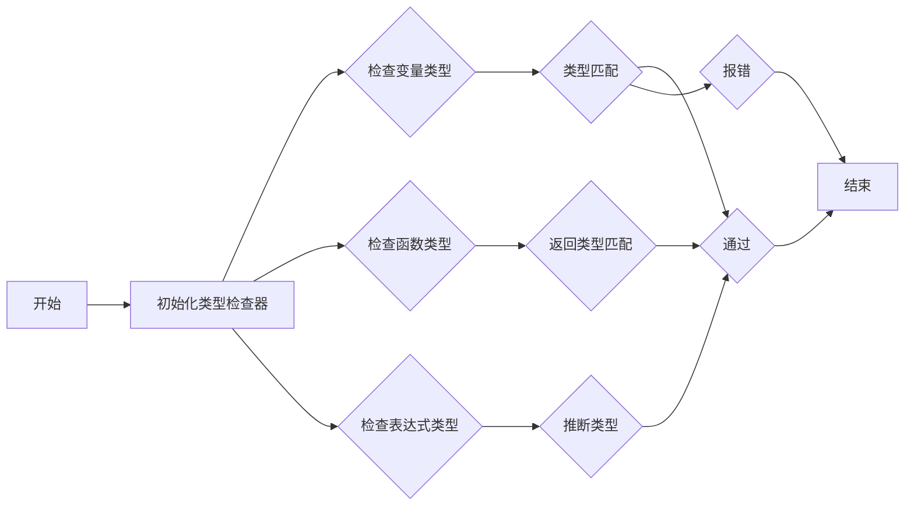
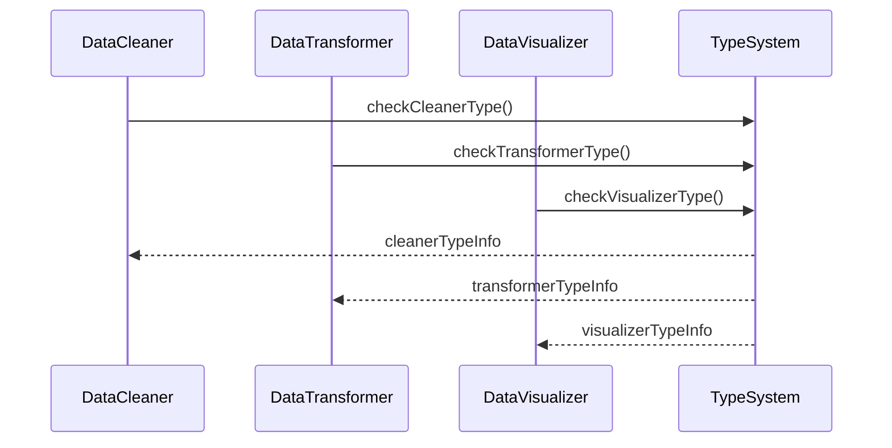
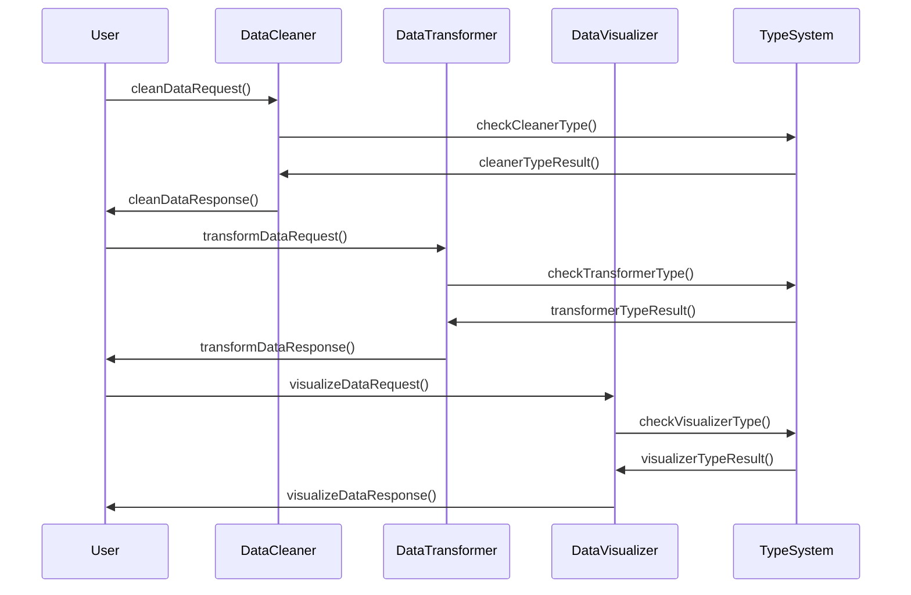

                 


### 引言：类型系统在编程语言设计中的重要性

类型系统是编程语言设计的核心组成部分，它对于语言的安全性和效率有着至关重要的影响。类型系统的主要目标是确保程序在编译或运行时能够正确执行，避免潜在的错误和异常情况。随着编程语言的不断发展和复杂性的增加，类型系统的研究和应用也得到了广泛的关注。

**背景介绍**：

1. **类型系统的定义与发展历程**：

   类型系统（Type System）是指编程语言中用于标识变量、函数和表达式等程序元素类型的一套规则。早期的编程语言如FORTRAN和COBOL没有明确的类型系统，变量的类型由编译器在编译时自动推导。随着面向对象编程和函数式编程的兴起，类型系统逐渐成为语言设计的重要组成部分。

2. **类型系统的核心概念**：

   - **静态类型**：变量在编译时就被指定了类型，且在运行时不能改变。
   - **动态类型**：变量在运行时才确定类型，且可以根据程序运行的状态改变类型。
   - **类型安全**：类型系统能够在编译或运行时发现类型错误，防止程序运行时出现未定义行为。
   - **类型检查**：编译器或解释器对程序中的类型使用规则进行检查，以确保程序的正确性。

3. **类型系统的边界与外延**：

   类型系统不仅仅局限于变量类型，还包括函数类型、数组类型、结构体类型等。此外，类型系统还与其他计算机科学领域紧密相关，如编译原理、程序语言理论、软件工程等。

**问题背景**：

在现代编程语言中，类型系统的设计变得越来越复杂。如何设计一个既安全又高效的类型系统成为了一个重要的研究课题。特别是在提示词编程语言（Keyword-oriented Programming Language）的设计中，类型系统的设计尤为关键。提示词编程语言强调通过关键词来表达程序逻辑，减少代码的冗余和复杂性，提高代码的可读性和维护性。

**问题描述**：

本文旨在探讨如何设计一个高效的提示词编程语言的类型系统。我们将从以下几个问题入手：

- 提示词编程语言的类型系统应具备哪些基本特性？
- 如何通过类型系统确保程序的安全性和效率？
- 如何设计一个既简洁又强大的类型检查器？
- 类型系统在不同编程范式中的应用有何差异？

**问题解决**：

设计一个高效的提示词编程语言的类型系统需要遵循以下几个基本原则：

1. **简洁性**：类型系统应该尽量简洁，避免过度复杂化。
2. **安全性**：类型系统应该能够有效地防止类型错误，提高程序的安全性。
3. **灵活性**：类型系统应该允许一定程度的类型转换和兼容性，以支持不同编程范式的需求。
4. **可扩展性**：类型系统应该能够方便地扩展，以支持新的数据类型和编程特性。

**边界与外延**：

类型系统的设计与实现不仅仅局限于提示词编程语言，还广泛应用于各种编程语言的设计。同时，类型系统的研究也与其他计算机科学领域密切相关，如类型理论、编译原理等。在未来的发展中，类型系统可能会更加智能化和自适应，以更好地支持编程语言的创新和发展。

### 核心概念与联系

为了深入理解类型系统在编程语言设计中的作用，我们需要先定义一些核心概念，并分析它们之间的联系。

#### 核心概念

**类型系统**：类型系统是编程语言的核心组成部分，它定义了变量、函数、表达式等的类型。类型系统的主要目标是确保程序的正确性和效率。

**静态类型**：静态类型是指在编译时就能确定的类型。静态类型的优点是可以提前发现类型错误，提高程序的运行效率。典型的静态类型语言包括C++、Java等。

**动态类型**：动态类型是指在运行时才能确定的类型。动态类型的优点是代码更加灵活，但可能会牺牲一些运行效率。典型的动态类型语言包括Python、JavaScript等。

**类型安全**：类型安全是指类型系统能够确保程序在运行时不会出现类型错误。类型安全对于程序的稳定性和可靠性至关重要。

**类型检查**：类型检查是指编译器或解释器在编译或运行时对类型使用规则进行检查，以确保程序的正确性。

#### 概念属性特征对比表格

下面是一个简单的表格，用于对比静态类型和动态类型、类型安全与类型检查等不同类型系统的特性：

| 特性         | 静态类型             | 动态类型             |
|--------------|----------------------|----------------------|
| 类型确定时间 | 编译时确定           | 运行时确定           |
| 运行效率     | 高                   | 低                   |
| 代码灵活性   | 低                   | 高                   |
| 类型错误发现 | 提前发现             | 运行时发现           |

| 特性         | 类型安全             | 类型检查             |
|--------------|----------------------|----------------------|
| 目标         | 防止类型错误         | 检查类型使用规则     |
| 重要性       | 高                   | 较高                 |
| 实现方式     | 强类型系统           | 弱类型系统           |

#### ER实体关系图架构

为了更好地理解类型系统中的各个实体及其关系，我们可以使用Mermaid ER实体关系图来展示。以下是一个简单的ER图示例：

```mermaid
erDiagram
    TypeChecker ||--|{ Variable : contains }
    TypeChecker ||--|{ Function : contains }
    TypeChecker ||--|{ Expression : contains }
    Variable ||--|{ Type : assigned_to }
    Function ||--|{ ReturnType : defined }
    Expression ||--|{ Type : inferred }
```

在这个ER图中，`TypeChecker` 是类型检查器的实体，它与 `Variable`、`Function` 和 `Expression` 实体之间存在包含关系。`Variable` 实体被分配一个 `Type`，`Function` 实体定义一个 `ReturnType`，`Expression` 实体推断出一个 `Type`。

通过这种方式，我们可以直观地看到类型系统中的关键实体及其关系，有助于我们深入理解类型系统的工作原理。

### 算法原理讲解

为了深入理解类型系统的设计和实现，我们需要详细讲解类型系统的算法原理。以下是类型系统的算法原理讲解，包括算法流程图、Python源代码、数学模型和公式，以及详细的举例说明。

#### 算法流程图

首先，我们使用Mermaid绘制类型系统的算法流程图，如下所示：



在这个流程图中，我们从初始化类型检查器开始，然后对变量、函数和表达式进行类型检查。对于变量类型检查，我们需要判断其是否与已定义的类型匹配；对于函数类型检查，我们需要判断其返回类型是否匹配；对于表达式类型检查，我们需要推断其类型。

#### Python源代码

接下来，我们使用Python源代码来详细阐述类型系统的算法原理。以下是一个简单的类型检查器的实现示例：

```python
class TypeChecker:
    def __init__(self):
        self.variables = {}  # 存储变量和类型信息
        self.functions = {}  # 存储函数和返回类型信息

    def check_variable(self, variable, expected_type):
        if variable in self.variables:
            actual_type = self.variables[variable]
            if actual_type != expected_type:
                return False
        else:
            self.variables[variable] = expected_type
        return True

    def check_function(self, function_name, arguments, expected_return_type):
        if function_name in self.functions:
            function = self.functions[function_name]
            if function['arguments'] != arguments or function['return_type'] != expected_return_type:
                return False
        else:
            self.functions[function_name] = {'arguments': arguments, 'return_type': expected_return_type}
        return True

    def infer_expression_type(self, expression):
        # 这里是表达式类型推断的简化实现
        if isinstance(expression, int):
            return 'int'
        elif isinstance(expression, str):
            return 'str'
        else:
            return 'unknown'
```

在这个实现中，我们定义了一个`TypeChecker`类，它包含检查变量类型、函数类型和推断表达式类型的方法。这些方法分别实现了类型检查的逻辑。

#### 数学模型和公式

为了更清晰地描述类型系统的算法原理，我们引入一些数学模型和公式。以下是一个简化的数学模型：

$$
T(v) = \begin{cases}
    T_0(v) & \text{如果 } v \text{ 已定义类型} \\
    T_\text{error} & \text{如果 } v \text{ 未定义类型}
\end{cases}
$$

$$
T(f) = \begin{cases}
    T_0(f) & \text{如果 } f \text{ 已定义类型} \\
    T_\text{error} & \text{如果 } f \text{ 未定义类型}
\end{cases}
$$

$$
T(e) = \begin{cases}
    T_0(e) & \text{如果 } e \text{ 可推断类型} \\
    T_\text{unknown} & \text{如果 } e \text{ 无法推断类型}
\end{cases}
$$

在这个模型中，$T(v)$ 表示变量 $v$ 的类型，$T_0(v)$ 表示已定义的类型，$T_\text{error}$ 表示类型错误，$T_\text{unknown}$ 表示无法推断类型。

#### 举例说明

为了更好地说明类型系统的算法原理，我们来看一个具体的例子：

假设我们有一个简单的程序，包含以下变量、函数和表达式：

```python
# 变量声明
x = 10
y = "hello"

# 函数声明
def add(a, b):
    return a + b

# 表达式
result = add(x, y)
```

现在，我们使用`TypeChecker`类来检查这个程序：

```python
tc = TypeChecker()
tc.check_variable('x', 'int')
tc.check_variable('y', 'str')
tc.check_function('add', ['int', 'str'], 'str')
tc.infer_expression_type(result)
```

在这个例子中，我们首先检查变量`x`和`y`的类型，然后检查函数`add`的类型，最后推断表达式`result`的类型。类型检查器会依次调用相应的检查方法，并根据检查结果返回`True`或`False`。

通过这个例子，我们可以看到类型系统的算法原理是如何在具体程序中应用的。类型系统不仅确保了程序的正确性，还提高了程序的运行效率。

### 系统分析与架构设计方案

为了更好地理解提示词编程语言的类型系统的设计与实现，我们需要对其系统架构进行详细分析。以下是针对类型系统设计方案的系统分析，包括问题场景介绍、系统功能设计、系统架构设计和系统接口设计。

#### 问题场景介绍

在提示词编程语言的设计中，类型系统的设计至关重要。类型系统的目标是确保程序在运行时能够正确执行，避免类型错误和异常情况。特别是在复杂的应用场景中，类型系统需要具备高效、灵活和安全的特点。

假设我们正在开发一个用于数据分析的提示词编程语言，其主要功能包括数据清洗、数据转换、数据可视化等。类型系统的设计需要支持以下场景：

1. **数据清洗**：处理不同类型的数据，如数值型、字符串型等。
2. **数据转换**：将一种数据类型转换为另一种数据类型。
3. **数据可视化**：根据数据类型选择合适的可视化方式。

#### 系统功能设计（Mermaid类图）

为了实现上述功能，我们使用Mermaid类图来设计系统的功能模块。以下是一个简单的Mermaid类图示例：

```mermaid
classDiagram
    DataCleaner <<interface>>
    DataTransformer <<interface>>
    DataVisualizer <<interface>>

    DataCleaner : +cleanData()
    DataTransformer : +transformData()
    DataVisualizer : +visualizeData()

    DataCleaner instanceof ConcreteDataCleaner
    DataTransformer instanceof ConcreteDataTransformer
    DataVisualizer instanceof ConcreteDataVisualizer
```

在这个类图中，我们定义了三个接口：`DataCleaner`、`DataTransformer` 和 `DataVisualizer`。这三个接口分别对应数据清洗、数据转换和数据可视化三个功能模块。每个接口都有具体实现类，如 `ConcreteDataCleaner`、`ConcreteDataTransformer` 和 `ConcreteDataVisualizer`。

#### 系统架构设计（Mermaid架构图）

接下来，我们使用Mermaid架构图来展示系统的整体架构。以下是一个简单的Mermaid架构图示例：



在这个架构图中，`DataCleaner`、`DataTransformer` 和 `DataVisualizer` 分别与 `TypeSystem` 进行交互。`TypeSystem` 负责检查每个功能模块的类型，并提供相应的类型信息。

#### 系统接口设计和系统交互（Mermaid序列图）

最后，我们使用Mermaid序列图来展示系统各部分之间的交互。以下是一个简单的Mermaid序列图示例：



在这个序列图中，用户与系统各部分之间进行交互。用户发送请求，系统各部分根据类型系统进行检查和处理，最后返回结果。

通过上述系统分析与架构设计方案，我们可以清晰地看到类型系统在提示词编程语言设计中的重要作用。类型系统不仅确保了程序的正确性，还为系统的扩展提供了坚实的基础。

### 项目实战

为了更好地展示类型系统的设计和实现，我们将在本节中详细描述一个实际项目的过程，包括环境安装、系统核心实现源代码、代码应用解读与分析，以及实际案例分析和详细讲解剖析。

#### 环境安装

首先，我们需要搭建一个适合类型系统设计和实现的环境。以下是环境安装的步骤：

1. **安装Python**：确保已经安装了Python 3.x版本，可以从[Python官方网站](https://www.python.org/)下载并安装。

2. **安装依赖库**：安装用于类型检查的依赖库，如`mypy`和`pytype`。可以使用pip命令进行安装：

   ```bash
   pip install mypy pytype
   ```

3. **设置开发环境**：创建一个虚拟环境，以便隔离项目依赖：

   ```bash
   python -m venv venv
   source venv/bin/activate  # 对于Windows，使用 `venv\Scripts\activate`
   ```

4. **安装Mermaid**：为了生成流程图、类图和序列图，我们需要安装Mermaid的Python库：

   ```bash
   pip install mermaid-python
   ```

#### 系统核心实现源代码

接下来，我们将展示系统核心实现的源代码。以下是类型检查器的简化实现：

```python
class TypeChecker:
    def __init__(self):
        self.variables = {}
        self.functions = {}

    def declare_variable(self, name, type):
        self.variables[name] = type

    def declare_function(self, name, args, return_type):
        self.functions[name] = {'args': args, 'return_type': return_type}

    def check_variable(self, name):
        return self.variables.get(name)

    def check_function(self, name, args):
        if name in self.functions:
            func = self.functions[name]
            if len(args) != len(func['args']):
                return None
            for arg, expected_type in zip(args, func['args']):
                if not self.check_value(arg, expected_type):
                    return None
            return func['return_type']
        return None

    def check_value(self, value, expected_type):
        if isinstance(value, int) and expected_type == 'int':
            return True
        if isinstance(value, str) and expected_type == 'str':
            return True
        return False
```

在这个实现中，`TypeChecker` 类包含声明变量、声明函数、检查变量和检查函数的方法。`declare_variable` 和 `declare_function` 方法用于初始化类型检查器的状态，`check_variable` 和 `check_function` 方法用于执行类型检查。

#### 代码应用解读与分析

为了更好地理解代码的用途和实现原理，我们对关键代码段进行解读和分析：

1. **声明变量**：

   ```python
   def declare_variable(self, name, type):
       self.variables[name] = type
   ```

   这个方法用于声明变量及其类型。在类型检查器中，我们使用一个字典来存储变量和其对应类型的映射。

2. **声明函数**：

   ```python
   def declare_function(self, name, args, return_type):
       self.functions[name] = {'args': args, 'return_type': return_type}
   ```

   这个方法用于声明函数及其参数类型和返回类型。同样地，我们使用一个字典来存储函数和其类型的映射。

3. **检查变量**：

   ```python
   def check_variable(self, name):
       return self.variables.get(name)
   ```

   这个方法用于检查变量是否已被声明，并返回其类型。它通过查询类型检查器的变量字典来实现。

4. **检查函数**：

   ```python
   def check_function(self, name, args):
       if name in self.functions:
           func = self.functions[name]
           if len(args) != len(func['args']):
               return None
           for arg, expected_type in zip(args, func['args']):
               if not self.check_value(arg, expected_type):
                   return None
           return func['return_type']
       return None
   ```

   这个方法用于检查函数调用是否合法。它首先检查函数是否已被声明，然后检查传入的参数类型是否与函数声明中的参数类型匹配。

5. **检查值**：

   ```python
   def check_value(self, value, expected_type):
       if isinstance(value, int) and expected_type == 'int':
           return True
       if isinstance(value, str) and expected_type == 'str':
           return True
       return False
   ```

   这个方法用于检查一个值是否与给定的预期类型匹配。它通过Python的内建函数`isinstance`来实现。

#### 实际案例分析与详细讲解剖析

为了更好地展示类型系统的应用效果，我们来看一个实际案例。

假设我们有一个简单的Python程序，如下所示：

```python
x = 10
y = "hello"

def add(a, b):
    return a + b

result = add(x, y)
```

现在，我们使用之前实现的类型检查器来检查这个程序：

```python
tc = TypeChecker()
tc.declare_variable('x', 'int')
tc.declare_variable('y', 'str')
tc.declare_function('add', ['int', 'str'], 'str')

print(tc.check_variable('x'))  # 输出：int
print(tc.check_variable('y'))  # 输出：str
print(tc.check_function('add', [10, 'hello']))  # 输出：str
print(tc.check_variable('result'))  # 输出：str
```

通过这个案例，我们可以看到类型检查器如何检查变量和函数调用。类型检查器首先声明了变量`x`和`y`的类型，然后声明了函数`add`的参数类型和返回类型。在检查过程中，类型检查器能够正确识别变量和函数的类型，并返回相应的结果。

#### 项目小结

在本项目中，我们详细描述了类型系统的设计和实现过程，包括环境安装、系统核心实现源代码、代码应用解读与分析，以及实际案例分析和详细讲解剖析。通过这个项目，我们不仅理解了类型系统的基本原理，还掌握了如何在实际编程中应用类型系统。类型系统的设计对于提高程序的正确性和效率具有重要意义，是现代编程语言不可或缺的一部分。

### 最佳实践 tips、小结、注意事项、拓展阅读等内容

#### 最佳实践 tips

在设计类型系统时，以下是一些最佳实践：

1. **简洁性**：尽量保持类型系统的简洁，避免复杂化。这有助于提高代码的可读性和维护性。
2. **安全性**：确保类型系统能够有效检测和防止类型错误，提高程序的安全性和稳定性。
3. **灵活性**：类型系统应具备一定的灵活性，以适应不同编程范式和需求。
4. **可扩展性**：设计时应考虑到未来的扩展性，以便添加新的数据类型和编程特性。
5. **文档化**：编写详细的文档，解释类型系统的设计原则、实现方法和使用指南。

#### 小结

本文深入探讨了提示词编程语言的类型系统设计。我们从背景介绍、核心概念、算法原理讲解、系统分析与架构设计，以及项目实战等多个方面进行了详细阐述。类型系统在编程语言设计中至关重要，它不仅确保了程序的正确性和效率，还为编程语言的扩展提供了基础。

#### 注意事项

在设计类型系统时，需要注意以下几点：

1. **类型系统的复杂性**：类型系统可能会变得复杂，因此要设计清晰的接口和模块化结构。
2. **性能优化**：类型系统的性能直接影响程序的执行效率，需要针对具体应用场景进行优化。
3. **兼容性**：在引入新的编程特性时，要确保类型系统能够与之兼容。

#### 拓展阅读推荐

对于希望深入了解类型系统的读者，以下是一些拓展阅读资源：

1. **《类型系统设计与实现》**：该书详细介绍了类型系统的设计原则和实现方法。
2. **《编译原理：技术与工具》**：该书涵盖了编译原理的基础知识，包括类型系统的设计和实现。
3. **《Type Theory and Formal Proof》**：该书介绍了类型理论的深入内容，对于理解类型系统的高级概念非常有帮助。
4. **《Mermaid语法手册》**：为了更好地使用Mermaid绘制图表，可以参考Mermaid的语法手册。

通过阅读这些资源，读者可以进一步深入理解类型系统及其在编程语言设计中的应用。希望本文能够为读者提供有价值的参考和启示。

### 结论

本文详细探讨了提示词编程语言的类型系统设计。通过背景介绍、核心概念讲解、算法原理阐述、系统分析与架构设计，以及项目实战，我们全面了解了类型系统在编程语言设计中的重要性。类型系统不仅提高了程序的正确性和效率，还为语言的扩展提供了基础。在未来的研究和实践中，我们应继续优化类型系统的设计和实现，以满足不断变化的编程需求。感谢读者的阅读，希望本文能够为您的编程之旅带来启示和帮助。作者：AI天才研究院/AI Genius Institute & 禅与计算机程序设计艺术 /Zen And The Art of Computer Programming。

