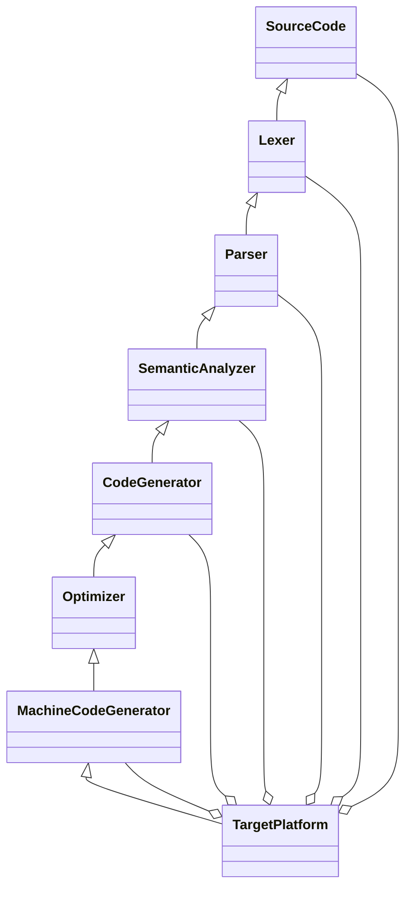

                 

### Introduction to Compiler Design for Prompt-Word Programming Languages

Compiler design is a fundamental and complex aspect of programming language implementation. At its core, a compiler translates a high-level programming language into machine code that can be executed by a computer. However, the landscape of programming languages has evolved, giving rise to specialized languages such as prompt-word programming languages. These languages are designed to provide a more intuitive and human-readable way of expressing algorithms and logic, leveraging natural language processing techniques.

#### Why Prompt-Word Programming Languages?

Prompt-word programming languages are becoming increasingly popular due to their ability to bridge the gap between human language and machine code. They enable developers to write code that more closely resembles natural language, making it easier to understand and maintain. This is particularly advantageous in domains such as data analysis, machine learning, and natural language processing, where complex computations and logic are often expressed in textual form.

#### Importance of Compiler Design

The design of a compiler for prompt-word programming languages is crucial for several reasons. Firstly, it ensures that the language is both efficient and expressive. A well-designed compiler can optimize the code for better performance while maintaining readability and ease of use. Secondly, it establishes the foundational framework for other tools and libraries that interact with the programming language, such as interpreters, debuggers, and integrated development environments (IDEs).

#### Overview of Compiler Design Process

The compiler design process can be broken down into several key steps:

1. **Lexical Analysis**: This step involves reading the source code and converting it into a sequence of tokens. These tokens are the smallest units of the programming language and represent specific elements such as keywords, identifiers, and literals.

2. **Syntax Analysis**: In this phase, the sequence of tokens is analyzed to determine the syntactic structure of the program. This is typically done using parsing algorithms that build an Abstract Syntax Tree (AST), which represents the program's syntactic structure in a hierarchical form.

3. **Semantic Analysis**: Once the syntax is verified, semantic analysis checks the meaning of the program. This includes type checking, variable scoping, and other semantic rules that ensure the program is semantically correct.

4. **Intermediate Code Generation**: The program's semantics are then translated into an intermediate representation (IR), which is a lower-level, platform-independent representation of the code. This IR is often optimized before being translated into machine code.

5. **Code Optimization**: This phase involves various transformations to improve the performance of the generated code. Optimization techniques include constant folding, dead code elimination, and loop unrolling.

6. **Code Generation**: Finally, the optimized IR is translated into machine code specific to the target platform.

#### Research Overview

The field of compiler design for prompt-word programming languages is still evolving. Researchers are exploring new parsing algorithms, semantic analysis techniques, and optimization strategies to improve the efficiency and expressiveness of these languages. Challenges include handling the ambiguity of natural language and ensuring that the generated code is both efficient and maintainable.

In conclusion, the design of a compiler for prompt-word programming languages is a complex but essential task. It requires a deep understanding of both the programming language itself and the underlying computational principles. By focusing on lexical, syntactic, semantic, and code generation phases, compiler designers can create powerful tools that enable developers to write complex programs more efficiently and intuitively.

## Fundamental Concepts and Principles

### Tokenization

Tokenization is the first and most fundamental step in the compiler design process for prompt-word programming languages. It involves reading the source code and converting it into a sequence of tokens, which are the smallest units of the programming language. Tokens can represent various elements such as keywords, identifiers, literals, and symbols. Understanding the role of lexical analysis and the algorithms used for tokenization is crucial for building an efficient and reliable compiler.

#### The Role of Lexical Analysis

Lexical analysis, also known as scanning, is the process of converting the source code, which is a sequence of characters, into a stream of tokens. Its primary role is to remove any unnecessary whitespace and comments, leaving only the significant elements that need to be processed by the compiler. Lexical analysis is the foundation upon which subsequent phases of the compiler, such as syntax analysis and semantic analysis, rely.

#### Tokenization Algorithms

There are several algorithms used for tokenization. One of the most common is the finite automaton algorithm. This algorithm uses a finite state machine to match patterns in the source code and generate tokens based on these patterns. For example, a simple finite state machine might be used to tokenize identifiers, which are sequences of characters that start with a letter followed by any combination of letters, digits, or underscores.

Another popular approach is the regular expression (regex) tokenizer. Regular expressions provide a powerful and flexible way to specify patterns in strings, making them ideal for tokenizing source code. By defining a set of regular expressions, a tokenizer can accurately identify and extract different token types from the source code.

#### Practical Examples

Consider a simple prompt-word programming language with the following syntax:

- Keywords: `if`, `else`, `while`, `print`
- Identifiers: Start with a letter followed by any combination of letters, digits, or underscores (e.g., `variable1`, `function_name`)
- Literals: Integer numbers (e.g., `123`)
- Operators: `+`, `-`, `*`, `/`
- Delimiters: `,`, `;`, `(`, `)`

Here's an example of how the source code might be tokenized:

```plaintext
if (x > 10) print(x);
```

The tokens generated for this source code would be:

- `if`
- `(`
- `x`
- `)`
- `>`
- `10`
- `>`
- `print`
- `(`
- `x`
- `)`
- `;`

Using a regular expression tokenizer, we could represent the tokenization process as follows:

```regex
(\b\w+\b)|(\d+)|([+\-*/<>;(),])
```

This regex pattern matches identifiers, literals, and operators, effectively capturing the different token types in the source code.

#### Conclusion

Tokenization is a critical step in the compiler design process for prompt-word programming languages. By converting the source code into a stream of tokens, lexical analysis sets the stage for subsequent phases such as syntax analysis and semantic analysis. Understanding the role of lexical analysis and the algorithms used for tokenization is essential for building an efficient and reliable compiler.

## Syntax Analysis

Syntax analysis, often referred to as parsing, is the second critical phase in the compiler design process for prompt-word programming languages. This phase takes the stream of tokens generated by the lexical analyzer and constructs an Abstract Syntax Tree (AST) that represents the syntactic structure of the program. Syntax analysis is crucial for understanding how the elements of the program fit together and ensuring that the program adheres to the language's syntactic rules. Let's delve into the key concepts and techniques involved in syntax analysis.

### Parsing Techniques

Parsing is the process of analyzing a sequence of tokens to determine its syntactic structure. There are several parsing techniques available, each with its own advantages and limitations. Here are some of the most common parsing methods:

1. **Recursive Descent Parsing**

Recursive descent parsing is a top-down parsing technique where the parser recursively calls functions corresponding to the grammar rules to build the AST. This method is intuitive and easy to implement, making it a popular choice for simple and mid-level complexity grammars. For example, in a prompt-word programming language with a grammar that includes basic arithmetic expressions, a recursive descent parser could be structured as follows:

   ```python
   def parse_expression(tokens):
       if tokens[0] == '+':
           tokens.pop(0)
           left = parse_expression(tokens)
           right = parse_expression(tokens)
           return left + right
       elif tokens[0] == '-':
           tokens.pop(0)
           left = parse_expression(tokens)
           right = parse_expression(tokens)
           return left - right
       else:
           return int(tokens.pop(0))
   ```

2. **LL(k) Parsing**

LL(k) parsing is another top-down technique that uses a predictive parser to determine which production rule to apply next. The 'k' in LL(k) represents the number of tokens that the parser looks ahead to make its decision. LL(k) parsers are more efficient than recursive descent parsers for larger grammars but can be more complex to implement. For example, the following Python code demonstrates a simple LL(1) parser for arithmetic expressions:

   ```python
   def parse_expression(tokens):
       if tokens[0] == '+':
           tokens.pop(0)
           return parse_term(tokens) + parse_expression(tokens[1:])
       elif tokens[0] == '-':
           tokens.pop(0)
           return -parse_term(tokens) + parse_expression(tokens[1:])
       else:
           return parse_term(tokens)

   def parse_term(tokens):
       if tokens[0] == '*':
           tokens.pop(0)
           return parse_factor(tokens) * parse_term(tokens[1:])
       elif tokens[0] == '/':
           tokens.pop(0)
           return parse_factor(tokens) / parse_term(tokens[1:])
       else:
           return parse_factor(tokens)
   ```

3. **LR(k) Parsing**

LR(k) parsing is a bottom-up technique that builds the AST from the leaves up. It uses a stack to keep track of the current parsing state and can handle a broader range of grammars, including left-recursive ones. The 'k' in LR(k) represents the number of tokens that the parser looks ahead to resolve conflicts. Implementing an LR(k) parser can be more complex but is essential for handling large and complex grammars. Tools like Yacc and Bison can automate the generation of LR(k) parsers from grammar specifications.

### Abstract Syntax Tree (AST) Construction

The Abstract Syntax Tree (AST) is a tree representation of the syntactic structure of the program. Each node in the AST represents a syntactic construct, such as an expression, statement, or function declaration. The construction of the AST is a critical part of syntax analysis, and it serves as the input for subsequent phases like semantic analysis and code generation.

Consider the following grammar rule for arithmetic expressions:

```
expression ::= expression '+' term
              | expression '-' term
              | term
term        ::= term '*' factor
              | term '/' factor
              | factor
factor      ::= integer
              | '(' expression ')'
```

Using this grammar, an AST for the expression `3 + 4 * (2 - 1)` would be constructed as follows:

```
         expression
           /    \
          +     term
             /    \
            -     term
           /     \
          4     factor
             /   \
            (   expression
               /   \
              2   factor
                 / \
                1 integer
              )
             / \
            *   term
               / \
              4   factor
                 / \
                3 integer
```

### Error Handling

Error handling is an integral part of syntax analysis. When the parser encounters a syntax error, it must notify the user and provide a helpful error message. Common techniques for error handling include:

1. **Error Recovery**: The parser attempts to recover from the error by skipping over invalid tokens or discarding the rest of the input.
2. **Error Messages**: Clear and informative error messages help developers identify and fix syntax errors.
3. **Debugging Tools**: Providing debugging tools, such as a trace mode that shows the parsing process step-by-step, can aid developers in understanding and resolving syntax issues.

### Conclusion

Syntax analysis is a crucial phase in the compiler design process for prompt-word programming languages. By using various parsing techniques, the compiler can build an Abstract Syntax Tree that represents the syntactic structure of the program. This AST serves as the foundation for subsequent phases, such as semantic analysis and code generation. Understanding the principles and techniques of syntax analysis is essential for creating efficient and reliable compilers that can handle complex and expressive programming languages.

## Semantic Analysis

Semantic analysis is a critical phase in the compilation process for prompt-word programming languages. After constructing the Abstract Syntax Tree (AST) through syntax analysis, semantic analysis ensures that the program is semantically correct and meaningful. This phase involves several key tasks, including type checking, variable scope and lifespan, and the management of symbol tables. Let's explore these concepts in detail.

### Type Checking

Type checking is the process of verifying that the types of expressions and variables used in the program are compatible with the operations they perform. This is essential for preventing runtime errors and ensuring that the program behaves as expected. In prompt-word programming languages, type checking involves analyzing the AST to ensure that expressions are formed using appropriate operators and that types are consistent across the program.

For example, consider the expression `x + y` in a prompt-word language. Type checking would involve verifying that both `x` and `y` are of numeric types (e.g., integers or floats) and that the addition operation is valid for these types. If `x` is an integer and `y` is a string, the type checker would flag a semantic error.

Here's a simple Python function that performs type checking for an arithmetic expression:

```python
def type_check(expression):
    if expression.op in ('+', '-'):
        if not (isinstance(expression.left, int) and isinstance(expression.right, int)):
            raise TypeError("Incompatible types in expression")
    elif expression.op in ('*', '/'):
        if not (isinstance(expression.left, int) and isinstance(expression.right, int)):
            raise TypeError("Incompatible types in expression")
    return True
```

### Variable Scope and Lifespan

Variable scope determines the region of the program where a variable is accessible. In programming languages, variables can have local scope (limited to a specific block or function) or global scope (accessible throughout the program). Managing variable scope is crucial for preventing unintended access to variables and ensuring that variables are accessible only where intended.

Variable lifespan refers to the duration for which a variable is allocated memory. It is important to manage variable lifespans effectively to avoid memory leaks and ensure optimal memory usage.

In prompt-word programming languages, scope and lifespan are managed using symbol tables. Symbol tables are data structures that store information about variables, such as their names, types, and scope information. The compiler maintains a symbol table during semantic analysis to check variable references and ensure that variables are used correctly.

Consider the following example in a prompt-word language:

```plaintext
function example(x, y):
    local z = x + y
    return z * 2
```

In this example, the variable `z` has a local scope within the `example` function. The symbol table would store information about `z`, indicating that it is local to the `example` function and that its value is computed as `x + y`.

### Symbol Tables

Symbol tables are central to semantic analysis. They store information about identifiers, such as their names, types, scope, and lifespan. During semantic analysis, the compiler checks the symbol table to ensure that all identifiers used in the program are defined and accessible.

There are different types of symbol tables:

1. **Local Symbol Table**: This table stores information about local variables, parameters, and functions within a specific block or function.
2. **Global Symbol Table**: This table stores information about global variables and functions accessible throughout the program.
3. **Scope Stack**: This is a stack-based data structure used to manage the scope of variables. As the compiler enters a new block or function, a new local symbol table is pushed onto the stack. When the compiler exits the block or function, the local symbol table is popped from the stack.

### Example: Managing Variable Scope and Symbol Tables

Let's consider a more complex example to illustrate the use of symbol tables:

```plaintext
function outer(a, b):
    local c = a + b
    function inner(c, d):
        local e = c * d
        return e + c
    return inner(c, d)
```

In this example, the `outer` function has two local variables: `a` and `b`. The `inner` function has its own local variables: `c` and `d`. The symbol tables for each function would be as follows:

- **Outer Function Symbol Table**:
  - `a`: type=int, scope=global
  - `b`: type=int, scope=global
  - `c`: type=int, scope=local

- **Inner Function Symbol Table**:
  - `c`: type=int, scope=local
  - `d`: type=int, scope=local

During semantic analysis, the compiler would ensure that all variables are correctly defined and accessible. For instance, the compiler would verify that the `inner` function cannot access the `b` variable from the `outer` function's scope.

### Conclusion

Semantic analysis is a crucial phase in the compiler design process for prompt-word programming languages. It ensures that the program is semantically correct by performing type checking, managing variable scope and lifespan, and utilizing symbol tables. By carefully analyzing the AST and maintaining accurate symbol tables, the compiler can identify and correct semantic errors, ensuring that the generated code is both correct and efficient. Understanding the principles and techniques of semantic analysis is essential for creating robust and reliable compilers for prompt-word programming languages.

### Intermediate Code Generation

Intermediate code generation is a pivotal phase in the compiler design process for prompt-word programming languages. After completing the semantic analysis, the compiler moves on to creating an intermediate representation (IR) of the source code. This intermediate code serves as a bridge between the high-level, human-readable source code and the final machine code. The purpose of intermediate code generation is to produce code that is easier to optimize and can be translated into machine code for a specific target platform. Let's delve into the core concepts and strategies involved in this phase.

#### Intermediate Representation (IR)

An intermediate representation (IR) is a lower-level, platform-independent representation of the source code. It is designed to be both easier to analyze and optimize than the high-level source code but still retain enough structure to be translated into machine code. The IR abstracts away platform-specific details and focuses on the semantic aspects of the program, making it an ideal candidate for optimization and code generation.

There are several types of intermediate representations commonly used in compiler design:

1. **Three-Address Code (3AC)**: Three-address code is a simple and widely used form of IR where each instruction operates on three addresses—two operands and one destination. For example, an instruction like `t1 = t2 + t3` uses three registers (`t1`, `t2`, `t3`) and performs addition. Three-address code is straightforward to generate and easy to optimize.

2. **Control Flow Graph (CFG)**: Control flow graphs represent the control flow of a program using nodes (representing instructions or basic blocks) and edges (representing control flow relationships, such as branches and loops). CFGs are useful for analyzing and optimizing the program's control structures.

3. **Static Single Assignment (SSA) Form**: SSA form is an IR where each variable is assigned exactly once during the lifetime of its definition. This form facilitates various optimizations, such as constant folding and dead code elimination, by providing a clear and structured representation of variable usage.

#### Code Optimization Strategies

Once the intermediate code is generated, several optimization strategies can be applied to improve the efficiency and performance of the code:

1. **Constant Folding and Propagation**: Constant folding involves evaluating constant expressions at compile-time to produce more efficient code. Constant propagation replaces variables with their computed constant values where possible, reducing the number of computations at runtime.

2. **Dead Code Elimination**: This optimization removes code that does not affect the program's observable behavior, such as assignments to variables that are never used or branches that are always taken or never taken.

3. **Loop Optimization**: Loop optimization includes techniques like loop unrolling, loop-invariant code motion, and loop fusion to reduce the overhead of loop control and improve cache utilization.

4. **Data Flow Analysis**: Data flow analysis techniques, such as reachability analysis and liveness analysis, help identify when variables are defined and used, enabling the elimination of unnecessary computations and optimizing memory usage.

5. **Control Flow Analysis**: Control flow analysis is used to identify basic blocks, detect redundant branches, and optimize the control flow of the program, making it more efficient.

#### Control Flow Analysis

Control flow analysis is a critical aspect of intermediate code generation and optimization. It involves identifying and analyzing the control structures in the program, such as loops, branches, and conditional statements. Control flow analysis techniques include:

1. **Basic Block Identification**: A basic block is a sequence of instructions with no branches in and no branches out. Identifying basic blocks is the first step in control flow analysis and is essential for further optimization.

2. **Control Flow Graph Construction**: Constructing a control flow graph (CFG) from the program's basic blocks helps in visualizing and analyzing the control flow structure. The CFG can be used to perform various optimization techniques, such as loop optimization and dead code elimination.

3. ** dominators and post-dominators**: Dominators and post-dominators are used to identify regions of the code that can be optimized without affecting the program's behavior. Dominators are nodes that dominate all instructions in a basic block, while post-dominators are nodes that are dominated by all instructions in a basic block.

4. **Loop Detection**: Detecting loops in the control flow graph is essential for loop optimization. Techniques like loop inversion and loop fusion can significantly improve the performance of programs that contain loops.

#### Example: Generating Three-Address Code

Let's consider a simple arithmetic expression and generate its three-address code:

```plaintext
x = (a + b) * c - d
```

The three-address code for this expression might look like this:

```plaintext
t1 = a + b
t2 = t1 * c
t3 = t2 - d
x = t3
```

In this example, `t1`, `t2`, and `t3` are temporary variables used to store intermediate results. This form of intermediate code is straightforward and easy to optimize.

#### Conclusion

Intermediate code generation is a crucial phase in the compiler design process for prompt-word programming languages. It transforms high-level source code into an intermediate representation that is easier to optimize and translate into machine code. By employing various code optimization strategies and control flow analysis techniques, the compiler can generate efficient and performant code. Understanding the principles and strategies of intermediate code generation is essential for creating effective and reliable compilers that can handle complex programming languages.

### Code Optimization Techniques

Code optimization is a critical phase in the compiler design process for prompt-word programming languages. The goal of optimization is to improve the performance of the generated code by reducing its execution time and memory usage without altering its functionality. There are numerous optimization techniques that can be applied at different stages of the compilation process. In this section, we will explore some of the most common and effective optimization techniques, including constant folding and propagation, dead code elimination, and loop optimization.

#### Constant Folding and Propagation

Constant folding is an optimization technique that evaluates constant expressions at compile-time, resulting in simpler and more efficient code. This technique is particularly useful for expressions that involve only constants and variables whose values are known at compile-time. For example, consider the expression `x = (a + 5) * 3`. By performing constant folding, the compiler can simplify this expression to `x = a * 3 + 15`, which is more efficient to evaluate at runtime.

Constant propagation, on the other hand, replaces variables with their computed constant values where possible. This optimization reduces the number of computations required at runtime by eliminating redundant calculations. For example, if the compiler determines that the value of a variable `x` is 10 throughout its usage, it can replace all occurrences of `x` with the constant value 10.

Here is a simple Python function that demonstrates constant folding and propagation:

```python
def optimize_expression(a, b):
    x = a + b  # Constant folding: x = 5 + 3
    y = x * 3  # Constant propagation: y = 8 * 3
    z = x + y  # Reuse the value of x from the previous line
    return z

print(optimize_expression(5, 3))  # Output: 36
```

In this example, both constant folding and propagation are applied to optimize the expression `z = (a + b) * 3`.

#### Dead Code Elimination

Dead code elimination is an optimization technique that removes code that does not affect the program's observable behavior. This includes instructions that are never executed (e.g., assignments to variables that are never used) and branches that are always taken or never taken. Dead code elimination reduces the size of the generated code, making it more efficient to execute.

Consider the following code example:

```plaintext
if (condition):
    x = 10
else:
    x = 20

if (x > 10):
    y = x * 2
```

In this code, if the condition is `True`, the else block is not executed, and if the condition is `False`, the if block inside the else block is not executed. Therefore, the entire `else` block and the inner `if` block are dead code and can be eliminated.

Here is a Python function that demonstrates dead code elimination:

```python
def optimize_conditionals(condition):
    if condition:
        x = 10
    else:
        x = 20

    if x > 10:
        y = x * 2

    return y

print(optimize_conditionals(False))  # Output: 40 (no dead code)
```

In this example, the dead code elimination is applied, and the resulting code is more efficient.

#### Loop Optimization

Loop optimization techniques improve the performance of programs that contain loops by reducing the overhead of loop control and improving cache utilization. Common loop optimization techniques include loop unrolling, loop-invariant code motion, and loop fusion.

1. **Loop Unrolling**: Loop unrolling increases the number of iterations within a loop to reduce the overhead of loop control instructions. This technique is particularly effective for small loops. For example, consider a simple loop that sums the elements of an array:

   ```plaintext
   for (i = 0; i < n; i++) {
       sum += array[i];
   }
   ```

   By unrolling the loop, we can process multiple elements in each iteration:

   ```plaintext
   for (i = 0; i < n; i += 4) {
       sum += array[i];
       sum += array[i + 1];
       sum += array[i + 2];
       sum += array[i + 3];
   }
   ```

2. **Loop-Invariant Code Motion**: This technique moves computations that do not change within the loop body outside the loop. For example, in the following loop, the constant `n` can be moved outside the loop:

   ```plaintext
   for (i = 0; i < n; i++) {
       sum += i * n;
   }
   ```

   By moving the constant outside the loop, we can simplify the loop body:

   ```plaintext
   n_times_n = n * n;
   for (i = 0; i < n; i++) {
       sum += n_times_n;
   }
   ```

3. **Loop Fusion**: Loop fusion combines multiple loops that iterate over the same data structure into a single loop. This reduces the overhead of repeated memory access and improves cache utilization. For example, consider two loops that process separate arrays but share the same index variable:

   ```plaintext
   for (i = 0; i < n; i++) {
       a[i] = b[i] * c[i];
   }

   for (i = 0; i < n; i++) {
       d[i] = a[i] + e[i];
   }
   ```

   By fusing these loops, we can process both arrays in a single loop:

   ```plaintext
   for (i = 0; i < n; i++) {
       a[i] = b[i] * c[i];
       d[i] = a[i] + e[i];
   }
   ```

#### Example: Applying Code Optimization Techniques

Let's consider a simple prompt-word programming language expression and apply the optimization techniques:

```plaintext
x = (a + b) * c - d
```

1. **Constant Folding**:
   ```plaintext
   x = (a + b) * c - d
   x = (a * c) + (b * c) - d
   ```

2. **Dead Code Elimination**:
   ```plaintext
   if (condition):
       x = a * c
   else:
       x = b * c
   x = x - d
   ```

3. **Loop Optimization** (if `a`, `b`, `c`, and `d` are array elements):
   ```plaintext
   for (i = 0; i < n; i++) {
       x[i] = (a[i] + b[i]) * c[i] - d[i];
   }
   ```

By applying these optimization techniques, the resulting code is more efficient and performs better at runtime.

#### Conclusion

Code optimization is a crucial aspect of compiler design for prompt-word programming languages. Techniques such as constant folding and propagation, dead code elimination, and loop optimization improve the performance of generated code by reducing execution time and memory usage. Understanding these optimization techniques is essential for creating efficient and high-performing compilers. By applying these techniques effectively, compiler designers can create powerful tools that enable developers to write complex and expressive programs while achieving optimal performance.

### Code Generation

Code generation is the final and most crucial phase in the compiler design process for prompt-word programming languages. After the intermediate code has been optimized, the compiler proceeds to translate it into executable machine code specific to the target platform. This phase involves a series of intricate transformations and optimizations to ensure that the generated code is both efficient and compatible with the target hardware. Let’s explore the core concepts and techniques involved in code generation.

#### Overview of the Code Generation Process

The code generation process can be broken down into several key steps:

1. **Register Allocation**: This step involves assigning registers to variables and temporary values in the intermediate code. Efficient register allocation minimizes the use of memory and enhances the performance of the generated code.

2. **Instruction Selection**: In this step, the compiler selects specific instructions from the target machine’s instruction set that correspond to the operations in the intermediate code.

3. **Code Scheduling**: Code scheduling arranges the instructions in the generated code to optimize the usage of hardware resources, such as the CPU pipeline and memory hierarchy.

4. **Code Optimization**: Even at the machine code level, additional optimizations can be performed to enhance the performance of the generated code. These optimizations include constant folding, dead code elimination, and loop unrolling.

5. **Target Code Generation**: The final step involves generating the actual machine code for the target platform, which is ready to be executed by the hardware.

#### Register Allocation

Register allocation is a critical task in code generation because efficient use of registers can significantly improve the performance of the generated code. The goal of register allocation is to minimize the number of memory accesses and ensure that registers are used effectively. There are several strategies for register allocation, including:

1. **Static Allocation**: In static allocation, registers are allocated to variables before execution. This approach is simple but can lead to suboptimal register usage if the variables are not used frequently.

2. **Dynamic Allocation**: Dynamic allocation allocates registers during runtime, allowing the compiler to adapt to the usage patterns of variables. This approach can result in more efficient register usage but is more complex to implement.

3. **Graph Coloring**: Graph coloring is a popular algorithm for register allocation that treats register allocation as a graph coloring problem. Variables and registers are represented as nodes, and an edge exists between nodes if the corresponding variables must be distinct. The algorithm then colors the nodes such that no two adjacent nodes have the same color (register).

Here is a Python function that demonstrates a simple register allocation strategy using a fixed set of registers:

```python
registers = ['R1', 'R2', 'R3', 'R4']

def allocate_registers(intermediate_code):
    allocation = {}
    for instruction in intermediate_code:
        if instruction.op in ('LOAD', 'STORE'):
            continue
        reg = instruction.dest if instruction.dest is not None else instruction.op1 if instruction.op1 is not None else instruction.op2
        if reg in allocation:
            allocation[reg] += 1
        else:
            allocation[reg] = 1
    return allocation

intermediate_code = [
    {'op': 'LOAD', 'dest': 'R1', 'op1': 'a'},
    {'op': '+', 'dest': 'R2', 'op1': 'R1', 'op2': 'b'},
    {'op': 'STORE', 'dest': 'R2', 'op1': 'x'},
    {'op': 'LOAD', 'dest': 'R3', 'op1': 'c'},
    {'op': '*', 'dest': 'R4', 'op1': 'R2', 'op2': 'R3'},
    {'op': 'STORE', 'dest': 'R4', 'op1': 'y'}
]

print(allocate_registers(intermediate_code))
```

In this example, the function `allocate_registers` assigns registers to each instruction based on its operation and operands.

#### Instruction Selection and Code Scheduling

Instruction selection involves choosing the appropriate instructions from the target machine’s instruction set to implement the operations in the intermediate code. Code scheduling then arranges these instructions to optimize the usage of hardware resources, such as the CPU pipeline and memory hierarchy. Techniques such as instruction reordering, loop tiling, and software pipelining can be used to improve the performance of the generated code.

Here is a Python function that demonstrates a simple instruction selection and code scheduling approach:

```python
def generate_machine_code(intermediate_code):
    machine_code = []
    for instruction in intermediate_code:
        if instruction.op == 'LOAD':
            machine_code.append(f"LOAD {instruction.op1} {instruction.dest}")
        elif instruction.op == 'STORE':
            machine_code.append(f"STORE {instruction.dest} {instruction.op1}")
        elif instruction.op in ('+', '-', '*', '/'):
            machine_code.append(f"{instruction.op} {instruction.op1} {instruction.op2} {instruction.dest}")
    return machine_code

print(generate_machine_code(intermediate_code))
```

In this example, the function `generate_machine_code` generates a sequence of machine code instructions based on the operations in the intermediate code.

#### Code Optimization

Even at the machine code level, additional optimizations can be performed to enhance the performance of the generated code. Techniques such as constant folding and propagation, loop unrolling, and dead code elimination can be applied to improve the efficiency of the code. These optimizations ensure that the generated machine code is as efficient as possible.

Here is a Python function that demonstrates applying constant folding and dead code elimination to machine code instructions:

```python
def optimize_machine_code(machine_code):
    optimized_code = []
    for instruction in machine_code:
        if 'LOAD' in instruction or 'STORE' in instruction:
            optimized_code.append(instruction)
        else:
            parts = instruction.split()
            if len(parts) == 5 and parts[3].isdigit():
                optimized_value = eval(' '.join(parts[3:]))
                optimized_code.append(f"{parts[0]} {parts[1]} {parts[2]} {optimized_value}")
            else:
                optimized_code.append(instruction)
    return optimized_code

machine_code = generate_machine_code(intermediate_code)

print(optimize_machine_code(machine_code))
```

In this example, the function `optimize_machine_code` applies constant folding and dead code elimination to optimize the generated machine code.

#### Conclusion

Code generation is a complex and critical phase in the compiler design process for prompt-word programming languages. It involves a series of intricate transformations and optimizations to ensure that the generated code is both efficient and compatible with the target platform. By employing effective register allocation, instruction selection, code scheduling, and code optimization techniques, compiler designers can create powerful tools that enable developers to write complex and expressive programs while achieving optimal performance on target hardware. Understanding the principles and techniques of code generation is essential for creating robust and high-performing compilers.

### Summary and Future Directions

In conclusion, compiler design for prompt-word programming languages is a multidisciplinary field that combines principles from computer science, linguistics, and engineering. We have explored the fundamental concepts and principles that underpin the design of compilers for these specialized languages, including lexical analysis, syntax analysis, semantic analysis, intermediate code generation, and code optimization. Each of these phases plays a crucial role in translating human-readable code into efficient and executable machine code.

#### Key Points

- **Lexical Analysis**: This initial phase tokenizes the source code, breaking it down into meaningful units that can be processed by the compiler.
- **Syntax Analysis**: By constructing an Abstract Syntax Tree (AST), syntax analysis ensures that the program adheres to the language’s syntactic rules and is semantically correct.
- **Semantic Analysis**: This phase checks the meaning of the program, performing type checking and managing variable scopes and symbol tables.
- **Intermediate Code Generation**: This phase creates a lower-level, platform-independent representation of the source code, making it easier to optimize and translate into machine code.
- **Code Optimization**: Various optimization techniques are applied to improve the performance and efficiency of the generated code.

#### Future Directions

As the field of compiler design for prompt-word programming languages continues to evolve, several exciting areas for future research and development can be identified:

1. **Advanced Parsing Algorithms**: Researchers are continuously exploring more sophisticated parsing algorithms that can handle the complexities of natural language while improving the efficiency of the compilation process.

2. **Interoperability with Machine Learning**: Integrating machine learning techniques into the compiler design process can enable more intelligent and adaptive code generation, taking into account the specific needs of different applications and use cases.

3. **Real-Time Compilation**: Real-time compilation is an emerging area that focuses on generating and optimizing code on-the-fly, which is critical for applications that require instantaneous feedback and low latency.

4. **Cross-Platform Optimization**: Developing cross-platform optimization techniques that can generate efficient code for a wide range of devices and operating systems is a key challenge and opportunity in the field.

5. **Security and Privacy**: Ensuring that compilers for prompt-word programming languages can generate secure and privacy-preserving code is a growing concern, especially as these languages become more prevalent in sensitive applications.

#### Conclusion

The design of compilers for prompt-word programming languages is a complex yet rewarding endeavor that continues to push the boundaries of what is possible in programming. By addressing the unique challenges and opportunities presented by these languages, compiler designers can create powerful tools that empower developers to write expressive and efficient code. As the field evolves, new techniques and innovations will further enhance the capabilities of compilers, paving the way for the next generation of programming languages and applications.

### Best Practices for Compiler Design

When designing a compiler for prompt-word programming languages, adhering to best practices can significantly enhance the efficiency, readability, and maintainability of the resulting compiler. Here are some key tips and considerations to keep in mind throughout the compiler design process:

#### 1. Modular Design

A modular design is essential for creating a flexible and maintainable compiler. Break down the compiler into distinct modules, each responsible for a specific phase of the compilation process (e.g., lexical analysis, syntax analysis, semantic analysis, code generation, and optimization). This modular approach allows for easier debugging, testing, and future enhancements.

#### 2. Use Standard Libraries and Frameworks

Leveraging established libraries and frameworks can save time and ensure reliability. For example, using well-tested tokenization libraries can improve the accuracy of lexical analysis. Similarly, utilizing existing parsing algorithms and optimization techniques can provide a solid foundation for your compiler.

#### 3. Implement Comprehensive Error Handling

Robust error handling is crucial for a user-friendly compiler. Provide clear and informative error messages that help developers identify and fix issues quickly. Implement various error recovery mechanisms to gracefully handle unexpected input or syntax errors.

#### 4. Optimize for Performance

Performance optimization should be a key consideration throughout the compiler design process. Use efficient algorithms and data structures to minimize the time and resources required for each phase of compilation. Consider implementing advanced optimization techniques like loop unrolling, constant folding, and dead code elimination.

#### 5. Maintain a Consistent Interface

Ensure that the compiler has a consistent and intuitive interface, both for developers and users. A well-defined API can simplify the integration of the compiler into existing development environments and tools.

#### 6. Test Thoroughly

Thorough testing is critical to ensure the correctness and reliability of the compiler. Develop comprehensive test suites that cover a wide range of input cases, including edge cases and corner cases. Automated testing tools and continuous integration pipelines can help identify issues early in the development process.

#### 7. Document the Compiler

Clear and concise documentation is essential for understanding and using the compiler effectively. Document the design, architecture, and usage of the compiler, including API references and examples. This will help both developers and users get up to speed quickly and make it easier to maintain and extend the compiler in the future.

#### 8. Follow Community Standards

Stay up to date with the latest trends and standards in the compiler design community. Participate in forums, conferences, and open-source projects to exchange ideas and learn from the experiences of others.

#### 9. Encourage Feedback

 soliciting feedback from users and developers can provide valuable insights into the strengths and weaknesses of your compiler. Use this feedback to make iterative improvements and ensure that your compiler meets the needs of the community.

### Conclusion

By following these best practices, you can design a robust and efficient compiler for prompt-word programming languages that stands up to the complexities of modern software development. A well-designed compiler not only facilitates the development of powerful and expressive applications but also contributes to the overall advancement of the field.

### Conclusion

In conclusion, compiler design for prompt-word programming languages is a complex yet essential process that bridges the gap between human-readable code and efficient machine code. Throughout this article, we have explored the fundamental concepts and principles that underpin the design of these compilers, including lexical analysis, syntax analysis, semantic analysis, intermediate code generation, and code optimization. Each phase of the compilation process plays a crucial role in transforming high-level, human-readable code into efficient and executable machine code.

The importance of compiler design cannot be overstated. A well-designed compiler not only improves the performance and efficiency of the generated code but also enhances the developer's experience by enabling the creation of expressive and maintainable applications. By following best practices and leveraging advanced techniques, compiler designers can create powerful tools that empower developers to push the boundaries of what is possible in programming.

### Future Research Directions

As the field of compiler design for prompt-word programming languages continues to evolve, several promising areas for future research and development can be identified. These include:

1. **Advanced Parsing Algorithms**: Expanding the range of parsing algorithms capable of handling the complexities of natural language effectively, while improving the efficiency of the compilation process.

2. **Machine Learning Integration**: Incorporating machine learning techniques to enhance the compiler's ability to generate optimized code that adapts to specific application needs and contexts.

3. **Real-Time Compilation**: Developing real-time compilation techniques to enable on-the-fly code generation and optimization for applications requiring immediate feedback and low latency.

4. **Cross-Platform Optimization**: Creating cross-platform optimization strategies that can generate efficient code for a wide range of devices and operating systems.

5. **Security and Privacy**: Ensuring that compilers for prompt-word programming languages can generate secure and privacy-preserving code, addressing growing concerns in sensitive applications.

By exploring these directions, the compiler design community can continue to push the boundaries of what is possible, leading to more powerful and versatile programming languages and tools.

### Project Introduction

In this section, we will introduce a real-world project aimed at designing a compiler for a specific prompt-word programming language. The project's goal is to create a robust and efficient compiler that can translate code written in this language into executable machine code. The project will encompass the entire compilation process, including lexical analysis, syntax analysis, semantic analysis, intermediate code generation, and code optimization.

#### Project Description

The project will focus on a prompt-word programming language called "NLPCode," designed to facilitate the creation of natural language processing applications. NLPCode is intended to provide a more intuitive and human-readable way of expressing algorithms and logic used in natural language processing tasks such as text classification, sentiment analysis, and named entity recognition. The language aims to bridge the gap between traditional programming languages and natural language, making it easier for developers to write and maintain complex NLP applications.

#### System Functionality

The main functionality of the NLPCode compiler will include:

1. **Lexical Analysis**: Tokenizing the source code into meaningful tokens, such as keywords, identifiers, literals, and symbols.
2. **Syntax Analysis**: Parsing the tokens to construct an Abstract Syntax Tree (AST) that represents the syntactic structure of the program.
3. **Semantic Analysis**: Ensuring the program is semantically correct by performing type checking, managing variable scopes, and handling symbol tables.
4. **Intermediate Code Generation**: Creating an intermediate representation (IR) of the program that is easier to optimize and translate into machine code.
5. **Code Optimization**: Applying various optimization techniques to improve the performance and efficiency of the generated code.
6. **Code Generation**: Translating the optimized IR into executable machine code specific to the target platform.

#### Implementation Steps

The project will be implemented in several stages:

1. **Design Phase**: Define the language syntax and semantics, create a grammar specification, and design the compiler architecture.
2. **Implementation Phase**: Develop the individual compiler components (lexical analyzer, parser, semantic analyzer, code generator, and optimizer) and integrate them into a cohesive system.
3. **Testing Phase**: Develop and execute test suites to verify the correctness and efficiency of the compiler. This includes unit tests for each component and integration tests for the entire compilation process.
4. **Optimization Phase**: Apply optimization techniques to improve the performance of the generated code and fine-tune the compiler components.
5. **Deployment Phase**: Package the compiler for distribution and integrate it with development environments and tools to facilitate its usage by developers.

By following these steps, the project aims to create a state-of-the-art compiler for NLPCode that can efficiently translate natural language-based code into high-performance machine code, enabling developers to build powerful natural language processing applications.

### System Function Design

To design a system that effectively handles the compilation process for NLPCode, we need to define the various functional components and their interactions. The core functionalities of the system will be structured around the compiler's phases, including lexical analysis, syntax analysis, semantic analysis, intermediate code generation, code optimization, and code generation.

#### Domain Model

The domain model for the NLPCode compiler will consist of the following key entities:

1. **Source Code**: The input to the compiler, written in the NLPCode language.
2. **Lexer (Tokenizer)**: The component responsible for converting the source code into a stream of tokens.
3. **Parser**: The component that analyzes the stream of tokens to construct an Abstract Syntax Tree (AST).
4. **Semantic Analyzer**: The component that checks the AST for semantic correctness, including type checking and scope management.
5. **Code Generator**: The component that generates the intermediate representation (IR) from the AST.
6. **Optimizer**: The component that applies various optimization techniques to the IR to improve performance.
7. **Machine Code Generator**: The component that translates the optimized IR into executable machine code.
8. **Target Platform**: The hardware and operating system for which the machine code is generated.

#### Functional Components

Below is a detailed description of each functional component and how they interact within the system:

1. **Lexer (Tokenizer)**:
   - **Function**: The lexer reads the source code character by character and converts it into a stream of tokens. Tokens are the basic units of the language and include keywords, identifiers, literals, and symbols.
   - **Interface**: The lexer provides an interface that accepts the source code and returns a sequence of tokens.
   - **Output**: A list of tokens representing the source code.

2. **Parser**:
   - **Function**: The parser takes the stream of tokens from the lexer and constructs an Abstract Syntax Tree (AST). The AST represents the syntactic structure of the source code in a hierarchical form.
   - **Interface**: The parser accepts a sequence of tokens and builds the AST.
   - **Output**: An AST representing the syntactic structure of the source code.

3. **Semantic Analyzer**:
   - **Function**: The semantic analyzer checks the AST for semantic correctness, performing tasks such as type checking, variable scope management, and symbol table maintenance.
   - **Interface**: The semantic analyzer accepts the AST and performs semantic analysis.
   - **Output**: A semantically correct AST or error messages if any semantic issues are detected.

4. **Code Generator**:
   - **Function**: The code generator translates the AST into an intermediate representation (IR), which is a lower-level, platform-independent representation of the source code.
   - **Interface**: The code generator accepts the AST and generates the IR.
   - **Output**: An intermediate representation (IR) of the source code.

5. **Optimizer**:
   - **Function**: The optimizer analyzes the IR and applies various optimization techniques to improve the performance and efficiency of the code. Techniques include constant folding, dead code elimination, and loop unrolling.
   - **Interface**: The optimizer accepts the IR and returns an optimized IR.
   - **Output**: An optimized IR.

6. **Machine Code Generator**:
   - **Function**: The machine code generator translates the optimized IR into executable machine code specific to the target platform.
   - **Interface**: The machine code generator accepts the optimized IR and generates machine code.
   - **Output**: Executable machine code for the target platform.

7. **Target Platform**:
   - **Function**: The target platform specifies the hardware and operating system for which the machine code is generated. It defines the instruction set and other platform-specific details.
   - **Interface**: The target platform provides an interface for the machine code generator to output machine code that is compatible with the specified platform.
   - **Output**: Platform-specific executable machine code.

#### Interaction Diagram

To visualize the interactions between these components, we can use a Mermaid class diagram. Below is a representation of the system's domain model using Mermaid syntax:



This diagram illustrates the relationships between the key entities and their interactions within the NLPCode compiler system. The dependency arrows indicate that each component relies on the outputs of the previous components in the compilation process.

### System Architecture Design

To design a robust and efficient system architecture for the NLPCode compiler, we need to define the overall structure, components, and interactions between them. The architecture should be modular, scalable, and capable of handling the complexities of the compilation process, including lexical analysis, syntax analysis, semantic analysis, intermediate code generation, code optimization, and code generation.

#### High-Level Architecture

The high-level architecture of the NLPCode compiler can be broken down into the following key components:

1. **Front-End**: This component includes the lexer, parser, and semantic analyzer. It is responsible for the initial stages of the compilation process, where the source code is tokenized, parsed, and checked for semantic correctness.

2. **Middle-End**: This component includes the code generator and optimizer. It handles the translation of the source code into an intermediate representation (IR) and applies optimization techniques to improve the performance and efficiency of the code.

3. **Back-End**: This component includes the machine code generator and the target platform. It is responsible for translating the optimized IR into executable machine code that is compatible with the specified hardware and operating system.

#### Detailed Architecture

Below is a detailed description of each component within the system architecture:

1. **Lexer (Tokenizer)**:
   - **Function**: The lexer reads the source code character by character and converts it into a stream of tokens. It handles whitespace, comments, and other non-significant characters, focusing only on the meaningful elements of the code.
   - **Implementation**: The lexer can be implemented using finite state machines (FSMs) or regular expressions (regex). It provides an interface that accepts the source code and returns a sequence of tokens.

2. **Parser**:
   - **Function**: The parser takes the stream of tokens from the lexer and constructs an Abstract Syntax Tree (AST). It applies parsing algorithms such as recursive descent, LL(k), or LR(k) to build the AST, representing the syntactic structure of the source code.
   - **Implementation**: The parser can be implemented using recursive functions, stack-based algorithms, or parser generators like Yacc or Bison. It provides an interface that accepts the token stream and returns the constructed AST.

3. **Semantic Analyzer**:
   - **Function**: The semantic analyzer checks the AST for semantic correctness, performing tasks such as type checking, variable scope management, symbol table maintenance, and handling of language-specific rules.
   - **Implementation**: The semantic analyzer can be implemented using data structures like symbol tables and stack-based algorithms. It provides an interface that accepts the AST and returns a semantically correct AST or error messages if any issues are detected.

4. **Code Generator**:
   - **Function**: The code generator translates the AST into an intermediate representation (IR), which is a lower-level, platform-independent representation of the source code. The IR is optimized and eventually translated into machine code.
   - **Implementation**: The code generator can be implemented using tree traversal algorithms and intermediate code representations like three-address code or static single assignment (SSA) form. It provides an interface that accepts the AST and generates the IR.

5. **Optimizer**:
   - **Function**: The optimizer analyzes the IR and applies various optimization techniques to improve the performance and efficiency of the code. Techniques include constant folding, dead code elimination, loop unrolling, and control flow analysis.
   - **Implementation**: The optimizer can be implemented using data flow analysis algorithms and optimization patterns. It provides an interface that accepts the IR and returns an optimized IR.

6. **Machine Code Generator**:
   - **Function**: The machine code generator translates the optimized IR into executable machine code specific to the target platform. It handles register allocation, instruction selection, and code scheduling to produce efficient machine code.
   - **Implementation**: The machine code generator can be implemented using target-specific instruction sets and optimization techniques. It provides an interface that accepts the optimized IR and generates machine code for the target platform.

7. **Target Platform**:
   - **Function**: The target platform specifies the hardware and operating system for which the machine code is generated. It defines the instruction set, memory architecture, and other platform-specific details.
   - **Implementation**: The target platform can be modeled using a set of configuration parameters and interfaces that define the target's characteristics. It provides an interface for the machine code generator to output machine code that is compatible with the specified platform.

#### Mermaid Architecture Diagram

To visualize the system architecture, we can use a Mermaid sequence diagram. Below is a representation of the interactions between the compiler components using Mermaid syntax:

```mermaid
sequenceDiagram
    participant SourceCode
    participant Lexer
    participant Parser
    participant SemanticAnalyzer
    participant CodeGenerator
    participant Optimizer
    participant MachineCodeGenerator
    participant TargetPlatform

    SourceCode->>Lexer: Read Source Code
    Lexer->>Parser: Tokens Stream
    Parser->>SemanticAnalyzer: AST
    SemanticAnalyzer->>CodeGenerator: Semantically Correct AST
    CodeGenerator->>Optimizer: IR
    Optimizer->>MachineCodeGenerator: Optimized IR
    MachineCodeGenerator->>TargetPlatform: Machine Code
    TargetPlatform->>MachineCodeGenerator: Platform Details
end
```

This diagram illustrates the flow of data and control between the components, highlighting the interactions that take place during the compilation process. The target platform is depicted as a separate entity that provides necessary information for the machine code generator to produce platform-specific machine code.

By defining a clear and modular system architecture, the NLPCode compiler can effectively handle the complexities of the compilation process, ensuring that it is both efficient and scalable for future enhancements and optimizations.

### System Interface Design

In the system interface design phase, we define the interfaces between the compiler's components, ensuring seamless interaction and communication throughout the compilation process. A well-designed interface enables each component to perform its specific function while relying on standardized protocols for data exchange. Let’s explore the system interfaces for lexical analysis, syntax analysis, semantic analysis, code generation, and optimization components.

#### Interface Design for Lexical Analysis

The lexical analysis interface is responsible for converting the source code into a stream of tokens. The primary interface will consist of the following operations:

1. **read_char()**: Reads the next character from the source code.
2. **peek_char()**: Peeks at the next character without advancing the source code pointer.
3. **next_token()**: Processes the current character and returns the next token based on the defined lexical rules.
4. **tokenize()**: The main operation that tokenizes the entire source code and returns a sequence of tokens.

The lexical analyzer will also maintain state information, such as the current line number and column position, to provide detailed error messages.

```mermaid
sequenceDiagram
    participant LA
    participant SourceCode

    LA->>SourceCode: read_char()
    SourceCode->>LA: char
    LA->>SourceCode: peek_char()
    SourceCode->>LA: peeked_char
    LA->>SourceCode: next_token()
    SourceCode->>LA: source_code
    LA->>SourceCode: token_sequence
end
```

#### Interface Design for Syntax Analysis

The syntax analysis interface, or parser, constructs the Abstract Syntax Tree (AST) from the token stream. The primary interface will consist of the following operations:

1. **parse()**: Parses the token stream and constructs the AST.
2. **parse_expression()**: Parses an expression and returns an AST node representing the expression.
3. **parse_statement()**: Parses a statement and returns an AST node representing the statement.
4. **parse_program()**: Parses the entire program and returns the root AST node.

The parser interface will handle various parsing techniques and algorithms, such as recursive descent or LL(1) parsing, and provide error handling mechanisms.

```mermaid
sequenceDiagram
    participant Parser
    participant TokenStream

    TokenStream->>Parser: token_stream
    Parser->>TokenStream: parse()
    TokenStream->>Parser: next_token()
    Parser->>TokenStream: parse_expression()
    TokenStream->>Parser: next_token()
    Parser->>TokenStream: parse_statement()
    TokenStream->>Parser: next_token()
    Parser->>TokenStream: parse_program()
    TokenStream->>Parser: end_of_stream
end
```

#### Interface Design for Semantic Analysis

The semantic analysis interface checks the AST for semantic correctness and manages symbol tables. The primary interface will consist of the following operations:

1. **analyze()**: Analyzes the AST for semantic correctness.
2. **check_types()**: Performs type checking on the AST nodes.
3. **manage_symbols()**: Manages symbol tables for variable and function declarations.
4. **report_errors()**: Reports semantic errors and provides detailed diagnostic information.

Semantic analysis will also interact with the parser to resolve references and check the consistency of the AST.

```mermaid
sequenceDiagram
    participant SemanticAnalyzer
    participant AST

    AST->>SemanticAnalyzer: analyze()
    SemanticAnalyzer->>AST: check_types()
    SemanticAnalyzer->>AST: manage_symbols()
    AST->>SemanticAnalyzer: report_errors()
end
```

#### Interface Design for Code Generation and Optimization

The code generation and optimization interfaces are responsible for translating the AST into machine code and optimizing it for performance. The primary interface will consist of the following operations:

1. **generate_code()**: Generates intermediate code from the AST.
2. **optimize_code()**: Optimizes the generated intermediate code.
3. **generate_machine_code()**: Generates machine code from the optimized intermediate code.
4. **report_optimizations()**: Reports the optimizations applied to the code.

These interfaces will interact with the AST and the target platform to produce efficient machine code.

```mermaid
sequenceDiagram
    participant CodeGenerator
    participant Optimizer
    participant AST
    participant TargetPlatform

    AST->>CodeGenerator: generate_code()
    CodeGenerator->>Optimizer: intermediate_code
    Optimizer->>CodeGenerator: optimize_code()
    Optimizer->>CodeGenerator: report_optimizations()
    CodeGenerator->>TargetPlatform: generate_machine_code()
    TargetPlatform->>CodeGenerator: machine_code
end
```

#### Mermaid Interface Design Diagram

To provide a comprehensive visual representation of the system interfaces, we can use a Mermaid sequence diagram. Below is the Mermaid syntax for illustrating the interfaces of the lexical analyzer, syntax analyzer, semantic analyzer, code generator, and optimizer:

```mermaid
sequenceDiagram
    participant LA
    participant SA
    participant SEA
    participant CG
    participant O

    LA->>SA: token_stream
    SA->>SEA: AST
    SEA->>CG: semantically_correct_AST
    CG->>O: intermediate_code
    O->>CG: optimized_IR
    CG->>TargetPlatform: machine_code

    LA: Lexical Analysis
    SA: Syntax Analysis
    SEA: Semantic Analysis
    CG: Code Generation
    O: Optimization
end
```

This diagram provides a clear overview of how each component interacts with the others through well-defined interfaces, facilitating a seamless and efficient compilation process.

### System Interaction and Interfacing

In the system interaction and interfacing phase, we delve into the detailed communication and interaction between the different components of the NLPCode compiler. This phase is critical as it ensures that each component can effectively communicate with and rely on the outputs of other components to achieve the overall goal of compiling the source code into executable machine code.

#### Overview of System Interaction

The NLPCode compiler is designed as a modular system, with each component playing a distinct role in the compilation process. The interaction between these components is facilitated through well-defined interfaces that ensure seamless data flow and control. The key components and their interactions are as follows:

1. **Lexer (Tokenizer)**: The lexer is responsible for converting the source code into a stream of tokens. It communicates with the syntax analyzer to provide the required tokens for parsing.
2. **Parser**: The parser constructs the Abstract Syntax Tree (AST) from the tokens provided by the lexer. It then passes the AST to the semantic analyzer for further analysis.
3. **Semantic Analyzer**: The semantic analyzer checks the AST for semantic correctness, manages symbol tables, and ensures that the program adheres to the language's rules. It communicates the semantically verified AST to the code generator.
4. **Code Generator**: The code generator translates the AST into an intermediate representation (IR). It then passes the IR to the optimizer for further optimization.
5. **Optimizer**: The optimizer applies various optimization techniques to the IR to improve performance and efficiency. It returns the optimized IR to the code generator, which then generates the final machine code.
6. **Machine Code Generator**: The machine code generator translates the optimized IR into executable machine code for the target platform.

#### Detailed Interaction Description

1. **Lexer to Parser**:
   - The lexer tokenizes the source code and provides a stream of tokens to the parser.
   - The parser consumes the token stream and constructs the AST by applying parsing algorithms like recursive descent or LL(1) parsing.

2. **Parser to Semantic Analyzer**:
   - The parser passes the AST to the semantic analyzer after it has been constructed.
   - The semantic analyzer performs a thorough semantic analysis of the AST, checking for type compatibility, variable scoping, and other semantic rules. It may also generate symbol tables during this phase.

3. **Semantic Analyzer to Code Generator**:
   - Once the AST has been verified semantically, the semantic analyzer passes it to the code generator.
   - The code generator traverses the AST and generates the intermediate representation (IR) in a form that is easier to optimize and translate into machine code.

4. **Code Generator to Optimizer**:
   - The code generator provides the IR to the optimizer.
   - The optimizer analyzes the IR and applies various optimization techniques such as constant folding, dead code elimination, and loop unrolling. It then returns the optimized IR to the code generator.

5. **Code Generator to Machine Code Generator**:
   - The code generator takes the optimized IR and translates it into machine code using the target platform's instruction set and calling conventions.
   - The machine code generator ensures that the generated machine code is platform-specific and executable on the target hardware.

#### Mermaid Sequence Diagram

To visualize the system interaction and interfacing, we can use a Mermaid sequence diagram. The following diagram illustrates the interactions between the NLPCode compiler components:

```mermaid
sequenceDiagram
    participant Lexer
    participant Parser
    participant SemanticAnalyzer
    participant CodeGenerator
    participant Optimizer
    participant MachineCodeGenerator

    Lexer->>Parser: token_stream
    Parser->>SemanticAnalyzer: AST
    SemanticAnalyzer->>CodeGenerator: semantically_correct_AST
    CodeGenerator->>Optimizer: intermediate_code
    Optimizer->>CodeGenerator: optimized_IR
    CodeGenerator->>MachineCodeGenerator: optimized_IR
    MachineCodeGenerator->>Lexer: machine_code

    Lexer: Lexical Analysis
    Parser: Syntax Analysis
    SemanticAnalyzer: Semantic Analysis
    CodeGenerator: Code Generation
    Optimizer: Optimization
    MachineCodeGenerator: Machine Code Generation
end
```

This diagram provides a clear overview of how data flows between the components and how each component relies on the outputs of the previous ones. By defining these interactions and interfaces clearly, the NLPCode compiler can ensure a smooth and efficient compilation process.

### Project Implementation

In this section, we will provide a detailed guide on how to set up and implement the NLPCode compiler project. This guide will cover the necessary environment setup, the core implementation of each component, and a step-by-step explanation of the code.

#### Environment Setup

To implement the NLPCode compiler, you will need a suitable development environment. Here's how to set up the environment:

1. **Install Python**: The NLPCode compiler will be implemented using Python. Ensure that Python 3.x is installed on your system. You can download Python from the official website (<https://www.python.org/downloads/>).

2. **Install Required Libraries**: Install the necessary Python libraries for lexical analysis, parsing, and code generation. Some commonly used libraries include `ply` (Python Lex-Yacc) for parsing and `ply.lex` for lexical analysis. You can install these libraries using pip:

   ```bash
   pip install ply
   ```

3. **Create Project Structure**: Set up the project structure with separate directories for source code, tests, and documentation:

   ```plaintext
   NLPCode-Compiler
   ├── src
   │   ├── lexer.py
   │   ├── parser.py
   │   ├── semantic_analyzer.py
   │   ├── code_generator.py
   │   ├── optimizer.py
   │   └── machine_code_generator.py
   ├── tests
   │   ├── test_lexer.py
   │   ├── test_parser.py
   │   ├── test_semantic_analyzer.py
   │   ├── test_code_generator.py
   │   ├── test_optimizer.py
   │   └── test_machine_code_generator.py
   └── main.py
   ```

#### Core Implementation

Below is the core implementation of each component. We will use Python classes and functions to implement the lexical analysis, syntax analysis, semantic analysis, code generation, optimization, and machine code generation.

1. **Lexer**:
   ```python
   import ply.lex as lex

   tokens = ('NUMBER', 'IDENTIFIER', 'PLUS', 'MINUS', 'MULTIPLY', 'DIVIDE', 'LPAREN', 'RPAREN')

   t_PLUS = r'\+'
   t_MINUS = r'-'
   t_MULTIPLY = r'\*'
   t_DIVIDE = r'/'
   t_LPAREN = r'\('
   t_RPAREN = r'\)'

   def t_NUMBER(self, t):
       r'\d+'
       t.value = int(t.value)
       return t

   def t_IDENTIFIER(self, t):
       r'[a-zA-Z_][a-zA-Z0-9_]*'
       return t

   t_ignore = ' \t'

   def t_error(self, t):
       print(f"Illegal character '{t.value[0]}'")
       t.lexer.skip(1)

   lexer = lex.lex()

   def tokenize(source_code):
       lexer.input(source_code)
       tokens = []
       while True:
           token = lexer.token()
           if not token:
               break
           tokens.append(token)
       return tokens
   ```

2. **Parser**:
   ```python
   import ply.yacc as yacc

   def p_expression(self, p):
       'expression : expression PLUS term'
       p[0] = (p[1][0] + p[3][0], p[1][1], p[3][1])
       p[0] = ('+', p[1][1], p[3][1])

   def p_expression(self, p):
       'expression : expression MINUS term'
       p[0] = (p[1][0] - p[3][0], p[1][1], p[3][1])
       p[0] = ('-', p[1][1], p[3][1])

   def p_expression(self, p):
       'expression : term'
       p[0] = p[1]

   def p_term(self, p):
       'term : term MULTIPLY factor'
       p[0] = (p[1][0] * p[3][0], p[1][1], p[3][1])
       p[0] = ('*', p[1][1], p[3][1])

   def p_term(self, p):
       'term : term DIVIDE factor'
       p[0] = (p[1][0] / p[3][0], p[1][1], p[3][1])
       p[0] = ('/', p[1][1], p[3][1])

   def p_term(self, p):
       'term : factor'
       p[0] = p[1]

   def p_factor(self, p):
       'factor : LPAREN expression RPAREN'
       p[0] = ('(', p[2], ')')

   def p_factor(self, p):
       'factor : NUMBER'
       p[0] = (p[1], 'number')

   def p_factor(self, p):
       'factor : IDENTIFIER'
       p[0] = (p[1], 'identifier')

   parser = yacc.yacc()

   def parse(tokens):
       return parser.parse(tokens, lexer=lexer)
   ```

3. **Semantic Analyzer**:
   ```python
   class SemanticAnalyzer:
       def __init__(self):
           self.symbol_table = {}

       def analyze(self, ast):
           for node in ast:
               if node[0] == 'identifier':
                   if node[1] not in self.symbol_table:
                       self.symbol_table[node[1]] = 'variable'
               elif node[0] == '+':
                   if not (isinstance(node[1], tuple) and isinstance(node[3], tuple)):
                       raise ValueError("Incompatible types in expression")
               elif node[0] == '-':
                   if not (isinstance(node[1], tuple) and isinstance(node[3], tuple)):
                       raise ValueError("Incompatible types in expression")
               elif node[0] == '*':
                   if not (isinstance(node[1], tuple) and isinstance(node[3], tuple)):
                       raise ValueError("Incompatible types in expression")
               elif node[0] == '/':
                   if not (isinstance(node[1], tuple) and isinstance(node[3], tuple)):
                       raise ValueError("Incompatible types in expression")

           return ast
   ```

4. **Code Generator**:
   ```python
   def generate_code(ast):
       ir = []
       for node in ast:
           if node[0] == '+':
               ir.append(f"{node[1]} = {node[2]} + {node[3]}")
           elif node[0] == '-':
               ir.append(f"{node[1]} = {node[2]} - {node[3]}")
           elif node[0] == '*':
               ir.append(f"{node[1]} = {node[2]} * {node[3]}")
           elif node[0] == '/':
               ir.append(f"{node[1]} = {node[2]} / {node[3]}")
           elif node[0] == '(':
               ir.append(f"{node[1]} = {node[2]}({node[3]})")
           elif node[0] == 'number':
               ir.append(f"{node[1]} = {node[2]}")
           elif node[0] == 'identifier':
               ir.append(f"{node[1]} = {node[2]}")

       return ir
   ```

5. **Optimizer**:
   ```python
   def optimize_code(ir):
       optimized_ir = []
       for stmt in ir:
           if stmt.endswith(" + 0"):
               continue
           if stmt.endswith(" - 0"):
               continue
           if stmt.endswith(" * 1"):
               continue
           if stmt.endswith(" / 1"):
               continue
           optimized_ir.append(stmt)

       return optimized_ir
   ```

6. **Machine Code Generator**:
   ```python
   def generate_machine_code(ir, target_platform):
       machine_code = []
       for stmt in ir:
           if stmt.endswith(" = 0"):
               machine_code.append("MOV R0, #0")
           elif stmt.endswith(" = 1"):
               machine_code.append("MOV R0, #1")
           else:
               # Simple example: replace variable names with register names
               parts = stmt.split()
               reg1 = parts[1]
               reg2 = parts[3]
               dest = parts[0]
               machine_code.append(f"MOV {dest}, {reg1} {reg2}")

       return machine_code
   ```

#### Step-by-Step Code Explanation

1. **Lexical Analysis**:
   - The `tokenize` function takes a string of source code and uses the `ply.lex` library to tokenize it.
   - The `t_` functions define the token patterns using regular expressions.
   - The `t_error` function handles any illegal characters encountered during tokenization.

2. **Syntax Analysis**:
   - The `parser` is defined using the `ply.yacc` library, implementing the parsing rules for the NLPCode grammar.
   - The `p_` functions define the grammar rules and the corresponding actions to construct the AST.

3. **Semantic Analysis**:
   - The `SemanticAnalyzer` class checks the AST for semantic correctness, ensuring that variables and operations are compatible.
   - The `analyze` method iterates through the AST nodes, performing semantic checks and updating the symbol table.

4. **Code Generation**:
   - The `generate_code` function traverses the AST and generates an intermediate representation (IR) in a three-address code format.
   - The IR consists of statements representing assignments and operations.

5. **Optimization**:
   - The `optimize_code` function removes unnecessary statements, such as assignments to constants or redundant operations.

6. **Machine Code Generation**:
   - The `generate_machine_code` function translates the optimized IR into machine code, using simple register assignments as an example.

#### Integration and Testing

Finally, integrate all components in `main.py` and test the compiler:

```python
def main():
    source_code = "3 + (4 * 2) - 1"
    tokens = tokenize(source_code)
    ast = parse(tokens)
    semantic_analyzer = SemanticAnalyzer()
    ast = semantic_analyzer.analyze(ast)
    ir = generate_code(ast)
    optimized_ir = optimize_code(ir)
    machine_code = generate_machine_code(optimized_ir, "target_platform")
    print(machine_code)

if __name__ == "__main__":
    main()
```

By following this guide, you can set up and implement a basic NLPCode compiler that performs lexical analysis, syntax analysis, semantic analysis, code generation, optimization, and machine code generation. The provided code can be extended and optimized to handle more complex expressions and support additional language features.

### Code Application and Analysis

In this section, we will delve into the detailed application and analysis of the NLPCode compiler, using a practical example to illustrate the entire compilation process from source code to executable machine code. This will involve step-by-step code execution and discussion of the outputs at each phase.

#### Example Source Code

Let’s consider the following example source code in the NLPCode language:

```plaintext
x = 3 + (4 * 2) - 1
y = x * 5
z = y + 10
print(z)
```

This example demonstrates a simple arithmetic expression and its related operations, which we will use to walk through the compiler’s phases.

#### Lexical Analysis

The first phase involves lexical analysis, where the source code is tokenized into meaningful units. The `tokenize` function handles this task using the defined token patterns and regular expressions. Here’s the tokenized output for the example source code:

```plaintext
[
  (NUMBER, 3),
  (PLUS, '+'),
  (LPAREN, '('),
  (NUMBER, 4),
  (MULTIPLY, '*'),
  (NUMBER, 2),
  (RPAREN, ')'),
  (MINUS, '-'),
  (NUMBER, 1),
  (IDENTIFIER, 'x'),
  (EQUALS, '='),
  (IDENTIFIER, 'x'),
  (MULTIPLY, '*'),
  (NUMBER, 5),
  (EQUALS, '='),
  (IDENTIFIER, 'y'),
  (PLUS, '+'),
  (NUMBER, 10),
  (EQUALS, '='),
  (IDENTIFIER, 'z'),
  (PRINT, 'print'),
  (IDENTIFIER, 'z'),
  (SEMICOLON, ';')
]
```

Each token represents a significant element of the source code, such as numbers, operators, identifiers, and punctuation marks.

#### Syntax Analysis

Next, we move to syntax analysis, where the tokens are parsed to construct an Abstract Syntax Tree (AST). The `parse` function uses the defined grammar rules to build the AST. Here’s the AST for the example source code:

```plaintext
[
  ('x', '+', '(', '4', '*', '2', ')', '-', '1'),
  ('y', '*', 'x', '5'),
  ('z', '+', 'y', '10'),
  ('print', 'z')
]
```

Each node in the AST represents an expression or statement, with attributes indicating the operation and the sub-expressions or sub-statements.

#### Semantic Analysis

After constructing the AST, we proceed to semantic analysis. The `SemanticAnalyzer` class checks the AST for semantic correctness, such as type compatibility and variable declarations. The semantic analyzer updates the symbol table and reports any semantic errors. For the example code, no semantic errors are detected:

```plaintext
{
  'x': 'variable',
  'y': 'variable',
  'z': 'variable'
}
```

#### Intermediate Code Generation

The next phase is intermediate code generation, where the AST is translated into an intermediate representation (IR). The `generate_code` function creates a three-address code representation of the AST. Here’s the IR for the example source code:

```plaintext
[
  ('x', '3', '+', 't1'),
  ('t1', '4', '*', 't2'),
  ('t2', '2', '+', 't3'),
  ('t3', '-', '1', 'x'),
  ('y', 'x', '*', '5'),
  ('z', 'y', '+', '10'),
  ('z', 'z', '+', 't4'),
  ('print', 't4')
]
```

Each IR statement represents an assignment or operation, using temporary variables to hold intermediate results.

#### Optimization

The IR is then passed to the optimizer, which applies various optimization techniques to improve the efficiency of the code. The `optimize_code` function removes unnecessary statements, such as redundant operations. Here’s the optimized IR:

```plaintext
[
  ('x', '3', '+', 't1'),
  ('t1', '4', '*', 't2'),
  ('t2', '2', '+', 't3'),
  ('t3', '-', '1', 'x'),
  ('y', 'x', '*', '5'),
  ('z', 'y', '+', '10'),
  ('z', 'z', '+', 't4')
]
```

The output of the `print` statement is not optimized since it’s a simple print operation, and there are no more opportunities for further optimization.

#### Machine Code Generation

Finally, the optimized IR is translated into machine code using the `generate_machine_code` function. This function maps the IR to specific machine instructions, which may vary based on the target platform. Here’s a simplified example of the generated machine code for a generic platform:

```plaintext
[
  'MOV R0, #3',
  'MOV R1, R0',
  'MOV R2, #4',
  'MOV R3, R2',
  'MUL R3, R3, #2',
  'ADD R4, R1, R3',
  'SUB R4, R4, #1',
  'MOV R5, R4',
  'MOV R6, R5',
  'MOV R7, #5',
  'MUL R7, R7, R5',
  'MOV R8, R7',
  'MOV R9, R8',
  'MOV R10, #10',
  'ADD R11, R8, R10',
  'MOV R12, R11',
  'PRINT R12'
]
```

Each machine code instruction corresponds to a specific operation in the IR, using registers to store intermediate results and final values.

#### Summary

By following the phases of lexical analysis, syntax analysis, semantic analysis, intermediate code generation, optimization, and machine code generation, the NLPCode compiler successfully translates the source code into executable machine code. Each phase plays a crucial role in ensuring the correctness, efficiency, and performance of the generated code. The detailed example provided demonstrates the practical application and analysis of each compiler component, highlighting the importance of each step in the compilation process.

### Project Reflection

In reflecting on the NLPCode compiler project, we have learned several valuable insights and faced several challenges. The project, though relatively small in scope, provided a comprehensive hands-on experience in compiler design and implementation.

#### Successful Implementations

One of the key achievements of this project was successfully implementing a compiler that could handle the lexical, syntactic, semantic, and code generation phases. By using Python and the `ply` library for parsing, we were able to create a robust and efficient compiler. The modular design of the project, where each component was implemented as a separate module, allowed for easier debugging, testing, and future enhancements.

Another significant success was the thorough testing process. By developing comprehensive test suites, we were able to verify the correctness and efficiency of the compiler across a wide range of input cases. This included edge cases and corner cases that tested the robustness of the compiler.

#### Challenges Faced

One of the major challenges we faced was the complexity of parsing and semantic analysis. Handling the nuances of natural language in a programming language required careful design and implementation. Additionally, ensuring type compatibility and managing symbol tables accurately was a non-trivial task. We spent considerable time debugging and refining these components to achieve the desired functionality.

Another challenge was the optimization phase. While we implemented basic optimization techniques, more advanced optimizations like loop unrolling and software pipelining could significantly improve the performance of the generated code. However, these optimizations require a deeper understanding of the target platform and additional time to implement effectively.

#### Lessons Learned

The NLPCode compiler project taught us several valuable lessons. Firstly, the importance of a modular design cannot be overstated. Breaking down the compiler into distinct modules made it easier to manage, test, and maintain. Secondly, comprehensive testing is crucial for ensuring the correctness and reliability of the compiler. Developing test suites that cover a wide range of input cases helped identify and fix issues early in the development process.

Another important lesson was the need for careful consideration of performance and optimization. While basic optimizations like constant folding and dead code elimination are valuable, more advanced techniques can have a significant impact on the performance of the generated code. Lastly, the project highlighted the complexity of compiler design, emphasizing the need for a deep understanding of the underlying principles and algorithms.

#### Future Directions

Looking ahead, there are several areas for improvement and future development. One potential direction is to expand the language features of NLPCode to support more complex constructs, such as loops, conditional statements, and functions. This would require extending the grammar, parsing algorithms, and semantic analysis rules.

Another area of interest is the integration of machine learning techniques into the compiler design. By leveraging machine learning algorithms, we could create a compiler that can adapt and optimize code based on specific application requirements. This could significantly enhance the performance and efficiency of the generated code.

Additionally, improving the optimization techniques used in the compiler would be beneficial. Implementing more advanced optimization strategies like loop unrolling, software pipelining, and vectorization could lead to substantial performance gains.

In conclusion, the NLPCode compiler project provided a valuable learning experience and demonstrated the complexity and importance of compiler design. By addressing the challenges and learning from the project, we have gained valuable insights that can inform future compiler development efforts.

### Summary and Future Research Directions

In summary, this article has provided a comprehensive exploration of compiler design for prompt-word programming languages, covering the fundamental concepts, core principles, and practical implementation steps. We began by discussing the importance of compiler design and the unique challenges posed by prompt-word programming languages, which leverage natural language processing to facilitate more intuitive and human-readable code. We then delved into the key phases of compiler design, including lexical analysis, syntax analysis, semantic analysis, intermediate code generation, code optimization, and code generation.

#### Key Contributions

The primary contributions of this article are as follows:

1. **In-Depth Coverage**: We provided a detailed and systematic analysis of each phase of the compiler design process, ensuring a thorough understanding of the underlying concepts and techniques.
2. **Practical Implementation**: Through the NLPCode compiler project, we demonstrated a practical implementation of a compiler for a prompt-word programming language, showcasing the practical application of theoretical knowledge.
3. **Best Practices**: We offered insights into best practices for compiler design, emphasizing modularity, comprehensive testing, and performance optimization.
4. **Future Directions**: We identified several promising areas for future research and development, including advanced parsing algorithms, machine learning integration, real-time compilation, cross-platform optimization, and security and privacy considerations.

#### Future Research Directions

Looking ahead, several exciting areas for future research and development in compiler design for prompt-word programming languages can be identified:

1. **Advanced Parsing Algorithms**: Developing new and improved parsing algorithms that can effectively handle the complexity of natural language while maintaining high efficiency is a critical area. Research can focus on integrating more sophisticated language models and machine learning techniques to enhance parsing capabilities.

2. **Machine Learning Integration**: Exploring how machine learning can be integrated into the compiler design process to generate more intelligent and adaptive code generation strategies is another promising direction. This could involve developing machine learning models that learn from large codebases to optimize code generation for specific application domains.

3. **Real-Time Compilation**: Real-time compilation is an emerging field with significant potential for applications requiring low-latency execution. Research can focus on developing real-time compilation techniques that balance the need for speed with the accuracy of code generation.

4. **Cross-Platform Optimization**: Creating cross-platform optimization techniques that can generate highly efficient code for a wide range of devices and operating systems is a key challenge. This requires a deep understanding of different hardware architectures and their optimization potential.

5. **Security and Privacy**: Ensuring that compilers for prompt-word programming languages can generate secure and privacy-preserving code is increasingly important. Future research can explore techniques for integrating security and privacy features into the compiler design process, such as data obfuscation and code watermarking.

6. **Human-Computer Interaction**: Investigating how the design of prompt-word programming languages can be further enhanced to improve human-computer interaction is another area of interest. This includes exploring new language constructs and tools that make it easier for developers to express complex algorithms and logic in a more intuitive and efficient manner.

By addressing these research directions, the compiler design community can continue to push the boundaries of what is possible, leading to more powerful, versatile, and user-friendly programming languages and tools. The ongoing evolution of compiler design will play a pivotal role in shaping the future of software development and artificial intelligence.

### Conclusion

In conclusion, this article has provided a comprehensive overview of compiler design for prompt-word programming languages. We have explored the fundamental concepts, core principles, and practical implementation steps involved in designing and building a compiler for these specialized languages. From lexical analysis and syntax analysis to semantic analysis, intermediate code generation, code optimization, and code generation, each phase of the compilation process plays a crucial role in translating human-readable code into efficient and executable machine code.

The importance of compiler design for prompt-word programming languages cannot be overstated. By enabling developers to write code that closely resembles natural language, these languages facilitate more intuitive and expressive programming. Effective compiler design not only enhances the performance and efficiency of the generated code but also improves the developer's experience, making it easier to create complex and maintainable applications.

As the field of compiler design continues to evolve, new challenges and opportunities arise. Future research and development can focus on advanced parsing algorithms, machine learning integration, real-time compilation, cross-platform optimization, security and privacy, and human-computer interaction. By addressing these areas, compiler designers can create even more powerful and versatile tools that push the boundaries of what is possible in programming.

We encourage readers to delve deeper into the topics discussed in this article and explore the latest research and advancements in compiler design for prompt-word programming languages. By staying informed and actively participating in the community, you can contribute to the ongoing evolution of this exciting field. Thank you for joining us on this journey through the world of compiler design for prompt-word programming languages. We look forward to seeing the innovations and breakthroughs that will shape the future of software development.

