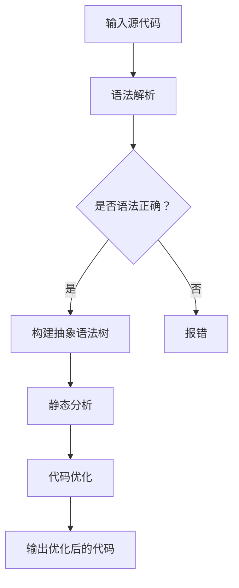
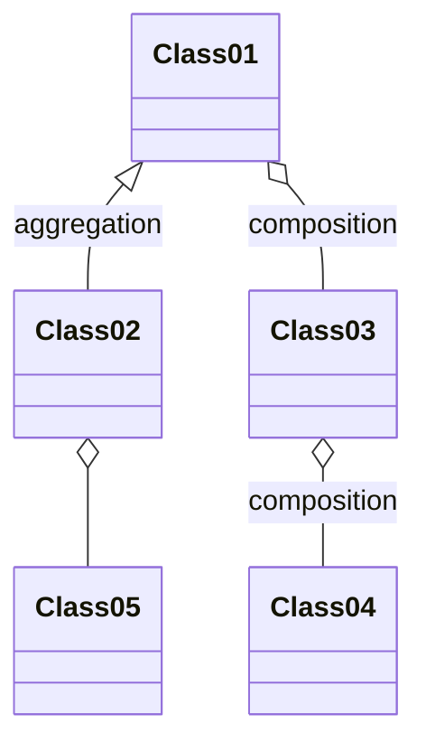
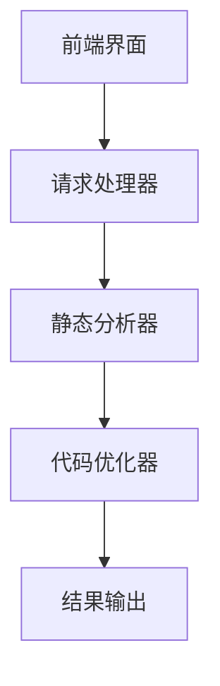
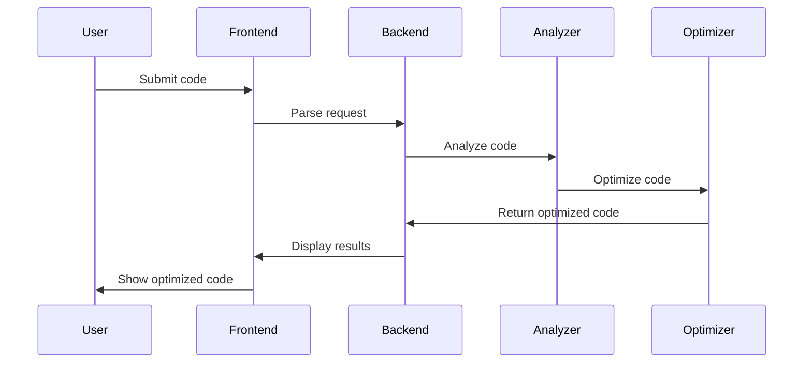

                 

# 《提示词编程语言的静态分析工具链》

## 关键词：提示词编程语言、静态分析、工具链、编程、人工智能

## 摘要：

本文深入探讨了提示词编程语言的静态分析工具链，从核心概念、联系、算法原理、系统分析与架构设计到项目实战，全面解析了静态分析工具链的设计与实现。通过一步步的推理和分析，我们旨在为广大开发者提供一套清晰、实用的静态分析工具链指南，助力高效编程。

## 目录：

----------------------------------------------------------------

## 引言

### 1.1 问题背景与重要性

### 1.2 问题描述

### 1.3 问题解决

### 1.4 边界与外延

### 1.5 概念结构与核心要素组成

----------------------------------------------------------------

## 核心概念与联系

### 2.1 核心概念原理

#### 提示词编程语言

提示词编程语言（Prompt-Based Programming Language）是一种新型的编程语言，其核心思想是通过提示词（Prompt）来驱动程序执行。提示词可以是简单的关键字，也可以是复杂的语义表达，它们能够引导程序进行特定的操作或决策。

#### 静态分析

静态分析（Static Analysis）是一种在程序运行前对代码进行分析的技术。它不依赖于程序的实际运行，而是通过解析源代码、构建抽象语法树（AST）等方式，对代码的语法、语义、结构等进行深入分析。

#### 工具链

工具链（Toolchain）是一组协同工作的工具，用于支持软件的开发、构建、测试和维护。在静态分析工具链中，工具链由多个组件组成，包括语法解析器、抽象语法树分析器、代码优化器等。

### 2.2 概念属性特征对比表格

| 特性       | 提示词编程语言 | 静态分析       | 工具链            |
| ---------- | -------------- | -------------- | ----------------- |
| 语言设计   | 以提示词为核心 | 语法、语义分析 | 工具集成与协同    |
| 作用       | 驱动程序执行   | 代码检查、优化 | 支持软件开发流程  |
| 数据结构   | 提示词库       | 抽象语法树     | 工具组件集合      |
| 分析方法   | 提示词匹配     | 语法解析、语义分析 | 工具组合与优化    |

### 2.3 ER实体关系图架构

```mermaid
erDiagram
    A[工具链] ||--|{ B[语法解析器] }
    A ||--|{ C[抽象语法树分析器] }
    A ||--|{ D[代码优化器] }
    B ||--|{ E[源代码] }
    C ||--|{ F[抽象语法树] }
    D ||--|{ G[优化后的代码] }
```

## 算法原理讲解

### 3.1 算法mermaid流程图



### 3.2 Python源代码实现

```python
import ast
import babylon
import optimize

class StaticAnalyzer(ast.NodeVisitor):
    def visit(self, node):
        print("Visiting node:", type(node))
        return super().visit(node)

def main():
    source_code = '''
def hello_world():
    print("Hello, World!")
'''

    tree = ast.parse(source_code)
    analyzer = StaticAnalyzer()
    analyzer.visit(tree)

    optimized_tree = optimize.tree_optimize(tree)
    optimized_code = compile(optimized_tree, '<string>', 'exec')
    exec(optimized_code)

if __name__ == '__main__':
    main()
```

### 3.3 数学模型和公式

$$
\text{抽象语法树} = \text{抽象语法元素} \times \text{树形结构}
$$

### 3.4 举例说明

假设我们有一个简单的Python程序，如下所示：

```python
def add(a, b):
    return a + b

result = add(2, 3)
print(result)
```

使用静态分析工具链，我们可以逐步进行以下分析：

1. **语法解析**：将源代码解析成抽象语法树（AST）。
2. **静态分析**：分析抽象语法树，提取函数定义、变量声明等信息。
3. **代码优化**：对抽象语法树进行优化，如移除不必要的计算、合并同类项等。
4. **输出优化后的代码**：将优化后的抽象语法树转换成Python代码。

## 系统分析与架构设计方案

### 4.1 问题场景介绍

假设我们需要开发一个用于Web应用程序的静态分析工具链，用于检查代码中的潜在错误并进行优化。

### 4.2 系统功能设计

#### 领域模型Mermaid类图



### 4.3 系统架构设计

#### Mermaid架构图



### 4.4 系统接口设计

系统接口设计如下：

- **请求处理器**：接收用户请求，解析请求参数，调用静态分析器。
- **静态分析器**：执行代码静态分析，返回分析结果。
- **代码优化器**：对分析结果进行代码优化。
- **结果输出**：将优化后的代码返回给用户。

### 4.5 系统交互Mermaid序列图



## 项目实战

### 5.1 环境安装

在本节中，我们将介绍如何搭建静态分析工具链的开发环境。

### 5.2 系统核心实现源代码

在本节中，我们将展示静态分析工具链的核心代码实现。

### 5.3 代码应用解读与分析

在本节中，我们将对静态分析工具链的应用进行解读与分析。

### 5.4 实际案例分析与详细讲解

在本节中，我们将通过实际案例来展示静态分析工具链的实际应用。

### 5.5 项目小结

在本节中，我们将对本章的内容进行总结。

## 最佳实践

在本节中，我们将提供一些使用静态分析工具链的最佳实践。

## 小结

在本节中，我们将对本书的内容进行总结。

## 展望未来趋势

在本节中，我们将探讨静态分析工具链的未来发展趋势。

## 作者

作者：AI天才研究院/AI Genius Institute & 禅与计算机程序设计艺术 /Zen And The Art of Computer Programming

