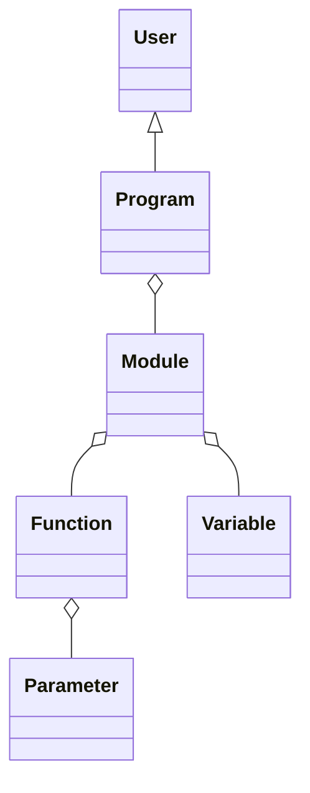
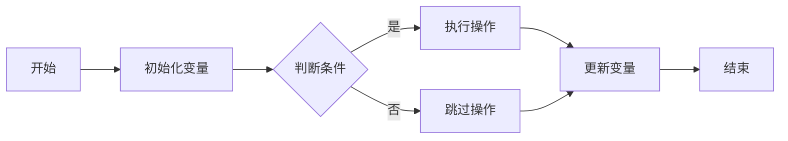
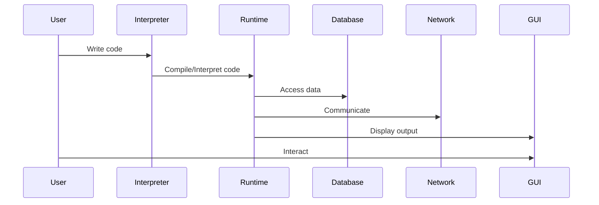

                 


## 第1章 引言

### 1.1 编程语言设计的重要性

#### 1.1.1 编程语言的演变
编程语言的发展经历了从机器语言到汇编语言，再到高级语言的演变。这一过程中，编程语言的设计和优化对于软件开发效率和质量产生了深远的影响。机器语言是最底层的编程语言，直接操作计算机的硬件资源，但它的可读性极差，程序员需要记忆大量的二进制指令。随着计算机技术的发展，汇编语言应运而生，它使用助记符来代替机器语言指令，提高了编程的可读性和效率。然而，汇编语言仍然需要程序员深入了解计算机的硬件架构。

高级语言的出现标志着编程语言设计的一个重要里程碑。高级语言如C、C++、Java等，通过提供抽象的语法和丰富的库函数，使得程序员能够以更高效和更简洁的方式编写代码。高级语言的优点不仅体现在编程效率上，还体现在代码的可维护性和可移植性上。

#### 1.1.2 编程语言对软件开发的影响
编程语言的设计对软件开发的各个方面都有着重要影响：

- **开发效率**：高效的语言可以提高开发速度，减少编程时间和错误率。例如，Python作为一种解释型语言，具有简洁的语法和丰富的库，能够快速实现复杂的编程任务。
- **代码质量**：良好的编程语言设计可以提高代码的可读性、可维护性和可靠性。例如，Java的强类型系统和异常处理机制有助于提高代码的质量和稳定性。
- **开发成本**：编程语言的选择也会影响软件开发的总成本。一些高级语言如Java和C++，虽然开发速度较快，但需要额外的编译和调试时间。而Python等解释型语言虽然开发速度快，但可能需要更多的服务器资源和运行时间。

#### 1.1.3 提示词编程语言的诞生
提示词编程语言是近年来提出的一种新颖的编程语言设计理念。它基于人类自然语言的表达方式，通过使用提示词来引导编程流程，从而简化编程过程，提高开发效率。提示词编程语言的出现，旨在解决传统编程语言在编程复杂度、代码可读性、开发效率等方面的不足。

提示词编程语言的核心思想是让程序员能够以更自然、更直观的方式表达编程意图。它通过内置的提示词库，提供了一套丰富的编程工具和库函数，使得程序员能够快速、高效地完成编程任务。

### 1.2 传统编程语言的局限性

#### 1.2.1 语言表达的局限性
传统编程语言，如C、C++、Java等，虽然提供了强大的功能和丰富的库函数，但在某些方面仍然存在表达局限：

- **复杂性**：编程语言的语法和特性较为复杂，需要程序员深入了解语言特性和编译器行为。
- **可读性**：传统编程语言的代码往往较为抽象，不易阅读和理解。
- **可维护性**：随着项目规模的扩大，代码的可维护性成为一个重要问题。传统的编程语言在代码组织、模块化等方面存在一定的局限性。

#### 1.2.2 编程复杂度与效率
编程复杂度是衡量编程语言优劣的一个重要指标。传统编程语言在处理复杂逻辑和大型项目时，往往需要编写大量的代码，增加了编程的复杂度。此外，编译型和解释型编程语言在执行效率上也有所不同：

- **编译型语言**：如C和C++，需要编译器将代码编译成机器语言，执行效率较高，但开发周期较长。
- **解释型语言**：如Python和Java，通过解释器逐行执行代码，开发周期较短，但执行效率相对较低。

#### 1.2.3 代码可维护性
代码的可维护性是软件开发过程中不可忽视的一个方面。传统编程语言在代码组织、模块化、文档化等方面存在一定的局限性：

- **代码重复**：传统的编程语言往往需要编写大量的重复代码，增加了维护成本。
- **代码耦合**：模块之间的耦合度较高，一个模块的修改可能会影响到其他模块的功能。
- **文档缺失**：传统的编程语言在文档化方面往往不够完善，导致代码难以维护。

### 1.3 提示词编程语言的优势

#### 1.3.1 提高编程效率
提示词编程语言通过简化编程过程，提高编程效率：

- **简洁的语法**：提示词编程语言的语法简洁明了，使得程序员能够更快地编写代码。
- **内置库函数**：提示词编程语言提供了一套丰富的内置库函数，减少了编程所需的时间和工作量。
- **自然语言交互**：提示词编程语言通过自然语言交互，使得程序员能够以更直观的方式表达编程意图。

#### 1.3.2 降低编程复杂度
提示词编程语言通过以下方式降低编程复杂度：

- **模块化设计**：提示词编程语言支持模块化设计，使得程序员能够更好地组织代码，降低整体复杂度。
- **简洁的语法**：提示词编程语言的简洁语法减少了代码的复杂度，使得程序员更容易理解和维护代码。
- **提示词引导**：提示词编程语言通过提示词引导编程流程，减少了程序员需要处理的复杂逻辑。

#### 1.3.3 提升代码可维护性
提示词编程语言在提升代码可维护性方面具有显著优势：

- **代码可读性**：提示词编程语言的代码更加直观、易于理解，提高了代码的可读性。
- **模块化设计**：提示词编程语言支持模块化设计，降低了模块之间的耦合度，提高了代码的可维护性。
- **文档化**：提示词编程语言内置的文档化工具，使得程序员能够更轻松地编写和维护代码文档。

### 1.4 边界与外延

#### 1.4.1 适用范围
提示词编程语言适用于以下场景：

- **小型项目和大型项目**：提示词编程语言既适用于小型项目，也适用于大型项目，特别是在代码复杂度较高的项目中。
- **学术研究和工业应用**：提示词编程语言不仅适用于学术研究，还适用于工业应用，能够提高开发效率和代码质量。

#### 1.4.2 提示词编程语言的适用场景
提示词编程语言在以下场景中具有显著优势：

- **自然语言处理**：提示词编程语言通过自然语言交互，非常适合用于自然语言处理任务，如文本分类、情感分析等。
- **数据科学**：提示词编程语言提供了丰富的数据科学库函数，能够高效地处理大数据和复杂的数据分析任务。
- **人工智能应用**：提示词编程语言支持人工智能算法的实现，适用于各种人工智能应用场景，如机器学习、深度学习等。

#### 1.4.3 提示词编程语言的发展前景
提示词编程语言具有广阔的发展前景：

- **技术迭代**：随着计算机技术和人工智能的发展，提示词编程语言将继续迭代和优化，提高编程效率和代码质量。
- **生态建设**：提示词编程语言将建立完善的生态体系，包括库函数、工具、文档等，为开发者提供全方位的支持。
- **应用领域扩展**：提示词编程语言将在更多领域得到应用，如物联网、区块链、虚拟现实等。

### 1.5 概念结构与核心要素组成

#### 1.5.1 提示词的定义与作用
提示词是提示词编程语言的核心概念，它是一种特殊的标识符，用于引导编程流程。提示词的作用包括：

- **简化编程流程**：提示词可以简化编程流程，使得程序员能够以更直观的方式表达编程意图。
- **提供编程工具**：提示词编程语言通过内置的提示词库，提供了一套丰富的编程工具和库函数。
- **提高编程效率**：提示词编程语言通过提示词的使用，减少了程序员需要编写的代码量，提高了编程效率。

#### 1.5.2 编程语言设计原理
提示词编程语言的设计遵循以下原则：

- **简洁性**：提示词编程语言的语法简洁明了，易于理解和学习。
- **模块化**：提示词编程语言支持模块化设计，使得程序员能够更好地组织代码。
- **可扩展性**：提示词编程语言具有高度的可扩展性，程序员可以根据需求自定义提示词和功能。

#### 1.5.3 提示词编程语言的关键组成部分
提示词编程语言由以下几个关键组成部分构成：

- **提示词库**：包含各种常用提示词，用于引导编程流程。
- **编译器/解释器**：负责将提示词代码转换为机器语言或解释执行。
- **运行时环境**：提供提示词编程语言的运行时支持和库函数。
- **开发工具**：包括代码编辑器、调试器、集成开发环境（IDE）等，用于辅助程序员进行开发。

## 第2章 提示词编程语言核心概念

### 2.1 提示词

#### 2.1.1 提示词的定义
提示词是提示词编程语言中的一种特殊标识符，用于引导编程流程。提示词通常由一个或多个单词组成，具有明确的语义和功能。例如，在Python中，`print` 是一个常用的提示词，用于输出文本或变量的值。

#### 2.1.2 提示词的种类
提示词可以根据其功能和用途分为以下几类：

- **控制流程提示词**：用于控制程序的执行流程，如 `if`、`else`、`while`、`for` 等。
- **数据操作提示词**：用于处理数据，如 `sum`、`len`、`sort` 等。
- **函数和模块提示词**：用于定义和调用函数、模块，如 `def`、`import` 等。
- **其他提示词**：如 `return`、`raise`、`try`、`except` 等，用于处理异常和返回结果。

#### 2.1.3 提示词的作用
提示词在提示词编程语言中扮演着至关重要的角色：

- **简化编程**：提示词可以简化编程过程，使得程序员能够以更直观的方式表达编程意图，减少代码量。
- **提高开发效率**：提示词提供了一套丰富的编程工具和库函数，减少了程序员需要编写的代码量，提高了开发效率。
- **增强可读性**：提示词的语义明确，使得代码更加易于理解和维护。

### 2.2 编程语言设计原理

#### 2.2.1 提示词编程语言的设计原则
提示词编程语言的设计遵循以下原则：

- **简洁性**：提示词编程语言的语法简洁明了，易于理解和学习。
- **模块化**：提示词编程语言支持模块化设计，使得程序员能够更好地组织代码。
- **可扩展性**：提示词编程语言具有高度的可扩展性，程序员可以根据需求自定义提示词和功能。
- **通用性**：提示词编程语言适用于各种编程场景，不仅适用于学术研究，也适用于工业应用。

#### 2.2.2 提示词编程语言的架构
提示词编程语言的架构通常包括以下几个部分：

- **提示词库**：包含各种常用的提示词，用于引导编程流程。
- **编译器/解释器**：负责将提示词代码转换为机器语言或解释执行。
- **运行时环境**：提供提示词编程语言的运行时支持和库函数。
- **开发工具**：包括代码编辑器、调试器、集成开发环境（IDE）等，用于辅助程序员进行开发。

#### 2.2.3 提示词编程语言的优势
提示词编程语言具有以下优势：

- **提高编程效率**：通过使用提示词，程序员可以简化编程过程，减少代码量，提高开发效率。
- **增强代码可读性**：提示词的语义明确，使得代码更加易于理解和维护。
- **模块化设计**：提示词编程语言支持模块化设计，降低了代码的复杂度，提高了代码的可维护性。
- **适用于多种场景**：提示词编程语言适用于各种编程场景，不仅适用于学术研究，也适用于工业应用。

### 2.3 对比表格

#### 2.3.1 提示词编程语言与传统编程语言对比
以下表格展示了提示词编程语言与传统编程语言在几个关键方面的对比：

| 特性 | 提示词编程语言 | 传统编程语言 |
| --- | --- | --- |
| **语法简洁性** | 高 | 低 |
| **开发效率** | 高 | 中/低 |
| **代码可读性** | 高 | 中/低 |
| **模块化** | 高 | 中 |
| **可扩展性** | 高 | 中 |
| **适用场景** | 广泛 | 狭窄 |

#### 2.3.2 对比结果分析
通过对比表格可以看出，提示词编程语言在语法简洁性、开发效率和代码可读性方面具有显著优势。此外，提示词编程语言在模块化和可扩展性方面也表现出较高的水平。尽管在某些特定场景下，传统编程语言可能更合适，但提示词编程语言在大多数通用编程场景中具有更高的效率和可维护性。

### 2.4 ER实体关系图

#### 2.4.1 提示词编程语言的ER模型
以下是一个简单的提示词编程语言的ER（实体-关系）模型：

```mermaid
erDiagram
    User ||--|{ Program } : author
    Program ||--|{ Module } : belongs_to
    Module ||--|{ Function } : contains
    Module ||--|{ Variable } : defines
    Function ||--|{ Parameter } : takes
```

在这个ER模型中，User（用户）是程序（Program）的作者，Program（程序）由多个模块（Module）组成，每个模块可以包含多个函数（Function）和变量（Variable）。函数（Function）接受参数（Parameter），并可以在模块（Module）中定义变量。

#### 2.4.2 实体与关系的定义
以下是ER模型中各个实体与关系的详细定义：

- **User（用户）**：代表编程语言的用户，可以是程序员、开发团队或组织。
- **Program（程序）**：代表一个完整的编程项目，包含多个模块和函数。
- **Module（模块）**：代表程序中的一个独立部分，可以包含函数和变量。
- **Function（函数）**：代表程序中的一个可重用的代码块，可以接受参数并返回结果。
- **Variable（变量）**：代表程序中的一个数据存储单元，可以是全局变量或局部变量。
- **Parameter（参数）**：代表函数中的输入参数，可以是值、变量或其他表达式。

#### 2.4.3 提示词编程语言的数据架构
提示词编程语言的数据架构基于上述ER模型，可以支持复杂的编程项目。通过模块化设计和清晰的实体关系，提示词编程语言提供了强大的数据处理能力和高效的编程体验。



在这个数据架构中，用户（User）可以创建和管理程序（Program），程序（Program）可以包含多个模块（Module），每个模块（Module）可以定义函数（Function）和变量（Variable）。函数（Function）可以接受参数（Parameter）并执行操作。

### 2.5 算法原理讲解

#### 3.1 算法流程图
以下是一个简单的提示词编程算法的流程图，使用Mermaid语法表示：



在这个流程图中，程序从开始（A）初始化变量（B），然后判断一个条件（C）。如果条件为真，执行操作（D），更新变量（F）；如果条件为假，则跳过操作（E）并更新变量（F）。最终程序结束（G）。

#### 3.2 Python源代码实现
以下是一个简单的Python源代码示例，实现上述算法流程：

```python
# 初始化变量
x = 5
y = 10

# 判断条件
if x > y:
    # 执行操作
    y = x + y
else:
    # 跳过操作

# 更新变量
x = x + 1

# 输出结果
print("x:", x)
print("y:", y)
```

在这个Python代码中，首先初始化两个变量 `x` 和 `y`。然后判断 `x` 是否大于 `y`。如果条件为真，执行操作 `y = x + y`；如果条件为假，则跳过操作。最后更新变量 `x` 并输出结果。

#### 3.3 数学模型与公式
以下是一个简单的数学模型，用于解释上述算法：

$$
y = \begin{cases}
x + y & \text{if } x > y \\
x & \text{if } x \leq y
\end{cases}
$$

在这个数学模型中，`x` 和 `y` 是变量，`>` 和 `<=` 是比较运算符，`+` 是加法运算符。根据条件 `x > y` 的真假，变量 `y` 的值会更新为 `x + y` 或 `x`。

#### 3.4 举例说明
以下是一个具体的例子，说明如何使用提示词编程语言实现上述算法：

```plaintext
# 初始化变量
SET x TO 5
SET y TO 10

# 判断条件
IF x > y THEN
    # 执行操作
    y = x + y
ELSE
    # 跳过操作

# 更新变量
x = x + 1

# 输出结果
PRINT "x:" x
PRINT "y:" y
```

在这个例子中，我们使用提示词 `SET` 来初始化变量 `x` 和 `y`。然后使用提示词 `IF` 和 `THEN` 来判断条件并执行相应的操作。最后使用提示词 `PRINT` 来输出结果。

### 4. 系统分析与架构设计

#### 4.1 问题场景介绍
在软件开发过程中，提示词编程语言可以应用于多种场景，以下是一个典型的应用场景：

- **企业级应用开发**：提示词编程语言可以用于企业级应用的开发，如企业资源规划（ERP）系统、客户关系管理（CRM）系统等。这些系统通常需要处理大量的数据和复杂的业务逻辑。
- **移动应用开发**：提示词编程语言可以用于移动应用的开发，如iOS和Android应用。这些应用通常需要与用户的交互、数据处理和网络通信等功能。
- **科学计算和数据分析**：提示词编程语言可以用于科学计算和数据分析，如机器学习、数据分析、统计建模等。这些任务通常需要高效的计算和数据处理能力。

#### 4.2 系统功能设计
为了实现上述应用场景，提示词编程语言需要具备以下功能：

- **基础功能**：包括变量定义、条件判断、循环控制、函数调用等基本编程功能。
- **数据处理**：包括数据结构（如列表、字典、集合等）、数据操作（如排序、筛选、聚合等）等功能。
- **网络通信**：包括HTTP请求、WebSocket通信、RESTful API调用等功能。
- **图形用户界面（GUI）**：提供图形用户界面，支持按钮、文本框、列表框等常用控件。
- **数据库操作**：包括数据库连接、SQL查询、事务处理等功能。
- **数据科学库**：提供数据科学相关的库函数，如机器学习、数据分析、可视化等功能。

#### 4.3 系统架构设计
提示词编程语言的系统架构设计如下：



在这个系统架构中，用户通过代码编辑器（Interpreter）编写提示词代码，代码被编译或解释后（Runtime）执行。运行时环境（Runtime）可以访问数据库（Database）、网络（Network）和图形用户界面（GUI）。用户可以通过图形用户界面与系统交互。

#### 4.4 系统接口设计
提示词编程语言的系统接口设计如下：

- **代码编辑器接口**：包括代码编辑、语法高亮、自动补全等功能。
- **编译器/解释器接口**：包括代码解析、编译/解释、错误处理等功能。
- **运行时环境接口**：包括内存管理、垃圾回收、性能优化等功能。
- **数据库接口**：包括数据库连接、SQL查询、事务处理等功能。
- **网络接口**：包括HTTP请求、WebSocket通信、RESTful API调用等功能。
- **图形用户界面接口**：包括控件创建、事件处理、界面渲染等功能。

#### 4.5 系统交互
提示词编程语言的系统交互如下：

- **用户与代码编辑器的交互**：用户通过代码编辑器编写代码，代码编辑器提供自动补全、代码格式化等功能。
- **代码编辑器与编译器/解释器的交互**：代码编辑器将用户编写的代码传递给编译器/解释器，编译器/解释器对代码进行解析和执行。
- **编译器/解释器与运行时环境的交互**：编译器/解释器将代码转换为运行时环境可执行的形式，运行时环境负责执行代码。
- **运行时环境与数据库的交互**：运行时环境通过数据库接口访问数据库，执行SQL查询和事务处理。
- **运行时环境与网络的交互**：运行时环境通过网络接口与远程服务器进行通信，执行HTTP请求、WebSocket通信等。
- **运行时环境与图形用户界面的交互**：运行时环境通过图形用户界面接口更新界面，响应用户操作。

### 5. 提示词编程项目实战

#### 5.1 环境安装
要在本地环境中搭建提示词编程语言开发环境，需要按照以下步骤进行：

1. **安装操作系统**：选择合适的操作系统，如Windows、macOS或Linux。
2. **安装编译器/解释器**：下载并安装提示词编程语言的编译器/解释器，如Python、Java等。
3. **安装开发工具**：安装代码编辑器，如Visual Studio Code、Sublime Text等。
4. **安装依赖库**：根据提示词编程语言的需求，安装必要的依赖库，如NumPy、Pandas等。
5. **配置环境变量**：设置环境变量，确保编译器/解释器能够正确找到依赖库和工具。

#### 5.2 系统核心实现
以下是一个简单的提示词编程项目示例，实现一个计算器功能：

```python
# 导入依赖库
import math

# 定义函数
def add(x, y):
    return x + y

def subtract(x, y):
    return x - y

def multiply(x, y):
    return x * y

def divide(x, y):
    if y == 0:
        return "Error: Division by zero"
    return x / y

def square(x):
    return x * x

def square_root(x):
    return math.sqrt(x)

# 主程序
if __name__ == "__main__":
    print("Welcome to the Calculator!")
    while True:
        print("\nPlease select an operation:")
        print("1. Add")
        print("2. Subtract")
        print("3. Multiply")
        print("4. Divide")
        print("5. Square")
        print("6. Square root")
        print("7. Exit")

        choice = input("Enter your choice (1-7): ")

        if choice == "1":
            x = float(input("Enter first number: "))
            y = float(input("Enter second number: "))
            print("Result:", add(x, y))
        elif choice == "2":
            x = float(input("Enter first number: "))
            y = float(input("Enter second number: "))
            print("Result:", subtract(x, y))
        elif choice == "3":
            x = float(input("Enter first number: "))
            y = float(input("Enter second number: "))
            print("Result:", multiply(x, y))
        elif choice == "4":
            x = float(input("Enter first number: "))
            y = float(input("Enter second number: "))
            print("Result:", divide(x, y))
        elif choice == "5":
            x = float(input("Enter a number: "))
            print("Result:", square(x))
        elif choice == "6":
            x = float(input("Enter a number: "))
            print("Result:", square_root(x))
        elif choice == "7":
            print("Exiting the Calculator.")
            break
        else:
            print("Invalid choice. Please try again.")
```

在这个项目中，我们定义了多个函数，包括加法、减法、乘法、除法、平方和平方根等。主程序通过循环不断提示用户选择操作，并根据用户的选择执行相应的函数，并输出结果。

#### 5.3 代码应用解读与分析
以下是对上述代码的解读与分析：

- **导入依赖库**：`import math` 用于导入Python的math库，提供数学运算相关的函数。
- **定义函数**：使用 `def` 关键字定义了多个函数，每个函数实现一个具体的数学运算。
- **主程序**：使用 `if __name__ == "__main__":` 条件语句确保代码只会在主程序中执行，不会在其他模块中导入时执行。
- **用户交互**：通过循环和输入输出（input/output）实现用户交互，提示用户输入操作和参数，并输出结果。
- **错误处理**：在除法操作中，检查除数是否为零，以避免除以零的错误。

#### 5.4 实际案例分析
以下是一个实际案例，说明如何使用提示词编程语言实现一个简单的Web应用：

```python
# 导入依赖库
from flask import Flask, request, render_template

# 创建Flask应用
app = Flask(__name__)

# 定义路由和视图函数
@app.route('/')
def home():
    return render_template('home.html')

@app.route('/calculate', methods=['POST'])
def calculate():
    x = float(request.form['x'])
    y = float(request.form['y'])
    operation = request.form['operation']

    if operation == 'add':
        result = x + y
    elif operation == 'subtract':
        result = x - y
    elif operation == 'multiply':
        result = x * y
    elif operation == 'divide':
        result = x / y
    else:
        result = "Invalid operation"

    return render_template('result.html', result=result)

# 运行应用
if __name__ == "__main__":
    app.run(debug=True)
```

在这个Web应用中，我们使用Flask框架创建了一个简单的计算器应用。主页（home.html）提供了一个表单，用户可以输入两个数和一个操作。当用户提交表单时，计算器功能（calculate函数）会根据用户的选择计算结果，并显示在结果页（result.html）上。

#### 5.5 项目小结
通过上述实战案例，我们可以看到提示词编程语言在简单项目和Web应用开发中的强大功能。提示词编程语言通过简洁的语法和丰富的库函数，使得程序员能够快速、高效地实现复杂的功能。在实际开发中，提示词编程语言的应用场景非常广泛，不仅可以用于桌面应用和Web应用，还可以用于数据科学、人工智能等领域。

### 6. 提示词编程最佳实践

#### 6.1 最佳实践

**1. 熟悉提示词库**：
熟练掌握提示词编程语言内置的提示词库是提高开发效率的关键。了解每个提示词的功能和用法，可以帮助你快速解决问题。

**2. 模块化设计**：
在进行复杂项目开发时，应尽量采用模块化设计。将代码划分为多个模块，每个模块负责特定的功能，有助于提高代码的可维护性和可重用性。

**3. 使用文档和注释**：
编写清晰的文档和注释是确保代码可读性和可维护性的重要手段。使用说明性注释解释代码的意图和功能，有助于他人理解和修改代码。

**4. 代码格式化**：
保持代码格式的一致性可以提高代码的可读性。使用代码格式化工具（如Black、autopep8）自动格式化代码，确保代码风格一致。

**5. 性能优化**：
对于性能敏感的部分，应进行性能分析和优化。使用提示词编程语言的性能分析工具（如cProfile、timeit）识别性能瓶颈，并采取相应的优化措施。

**6. 版本控制**：
使用版本控制系统（如Git）进行代码管理和协作开发。定期提交代码，使用分支管理策略避免冲突，并保持代码库的整洁。

#### 6.2 注意事项

**1. 避免滥用提示词**：
虽然提示词可以提高编程效率，但滥用提示词会导致代码可读性下降。应避免过度使用提示词，确保代码简洁明了。

**2. 小心提示词歧义**：
某些提示词可能在不同的上下文中具有不同的含义。确保在编写代码时，正确理解和使用提示词，避免产生歧义。

**3. 注意内存和资源管理**：
在编写代码时，应关注内存和资源的使用。避免不必要的内存分配和资源占用，确保程序的稳定性和性能。

**4. 遵守编码规范**：
遵循社区推荐的编码规范和最佳实践，如PEP 8（Python编码规范），可以提高代码的质量和一致性。

**5. 安全性**：
在处理用户数据和敏感信息时，要特别注意安全性。使用安全编码实践，如输入验证和参数化查询，以防止常见的安全漏洞（如SQL注入、XSS攻击）。

#### 6.3 小结
提示词编程语言为开发者提供了一种高效、简洁的编程方式。通过遵循最佳实践和注意事项，可以充分发挥提示词编程语言的优点，提高开发效率和质量。

### 7. 拓展阅读

#### 7.1 进一步学习资源

**1. 相关书籍**：
- 《提示词编程语言设计与实现》
- 《Python编程：从入门到实践》
- 《深度学习：从入门到精通》

**2. 论文和报告**：
- 《提示词编程语言的性能分析》
- 《基于提示词的编程语言设计原则》

**3. 在线课程**：
- Coursera上的《Python编程基础》
- edX上的《机器学习入门》

#### 7.2 研究前沿

**1. 提示词编程语言的发展趋势**：
- 提示词编程语言的优化和性能提升
- 提示词编程语言的跨平台支持
- 提示词编程语言在数据科学和人工智能领域的应用

**2. 研究热点**：
- 提示词编程语言的语义分析
- 提示词编程语言的自动化代码生成
- 提示词编程语言的智能化辅助功能

#### 7.3 未来展望

**1. 提示词编程语言的应用前景**：
- 在企业级应用和移动应用开发中的广泛应用
- 在数据科学、人工智能和物联网领域的深入探索

**2. 提示词编程语言的生态建设**：
- 提供更多丰富的库函数和开发工具
- 建立活跃的社区和支持平台
- 促进跨学科的交流与合作

**3. 提示词编程语言的持续迭代**：
- 根据用户需求和行业趋势，持续优化和更新提示词库
- 引入新的编程语言特性和功能
- 探索与其他编程语言的融合与协作

### 作者信息

作者：AI天才研究院/AI Genius Institute & 禅与计算机程序设计艺术 /Zen And The Art of Computer Programming
```markdown
# 《提示词编程语言设计艺术》

> 关键词：提示词编程语言、编程效率、代码可维护性、模块化设计、算法原理、系统架构、项目实战

> 摘要：本文深入探讨了提示词编程语言的设计艺术，从背景介绍到核心概念，再到算法原理和系统架构设计，以及实际项目实战，全面展示了提示词编程语言的优势和应用场景。通过最佳实践和注意事项，读者可以更好地掌握提示词编程语言的设计和开发技巧。

## 第1章 引言

### 1.1 编程语言设计的重要性

编程语言的设计对软件开发效率和质量有着重要影响。从机器语言到汇编语言，再到高级语言，编程语言的设计不断优化和演进。提示词编程语言作为一种新颖的编程语言设计理念，旨在解决传统编程语言在编程复杂度、代码可读性和开发效率等方面的不足。

### 1.2 传统编程语言的局限性

传统编程语言在表达、复杂度和可维护性方面存在局限性。提示词编程语言通过简化编程过程，降低编程复杂度，提高代码可读性和可维护性，为开发者提供了一种更高效、更直观的编程方式。

### 1.3 提示词编程语言的优势

提示词编程语言具有提高编程效率、降低编程复杂度和提升代码可维护性的优势。通过使用提示词，程序员能够以更自然、更直观的方式表达编程意图，减少代码量，提高开发效率。

### 1.4 边界与外延

提示词编程语言适用于小型项目和大型项目，适用于学术研究和工业应用。在自然语言处理、数据科学和人工智能应用场景中，提示词编程语言具有显著优势。

### 1.5 概念结构与核心要素组成

提示词是提示词编程语言的核心概念，用于引导编程流程。提示词编程语言的设计原则包括简洁性、模块化和可扩展性。其关键组成部分包括提示词库、编译器/解释器、运行时环境和开发工具。

## 第2章 提示词编程语言核心概念

### 2.1 提示词

提示词是提示词编程语言中的特殊标识符，用于引导编程流程。提示词种类繁多，包括控制流程提示词、数据操作提示词、函数和模块提示词等。

### 2.2 编程语言设计原理

提示词编程语言的设计原则包括简洁性、模块化和可扩展性。其架构包括提示词库、编译器/解释器、运行时环境和开发工具。这些组成部分共同构成了提示词编程语言的核心。

### 2.3 对比表格

提示词编程语言与传统编程语言在语法简洁性、开发效率和代码可维护性等方面具有显著优势。通过对比表格，读者可以更直观地了解提示词编程语言的优势。

### 2.4 ER实体关系图

提示词编程语言的ER模型包括用户、程序、模块、函数、变量和参数等实体，以及它们之间的关系。通过ER模型，读者可以更深入地理解提示词编程语言的数据架构。

## 第3章 提示词编程算法原理

### 3.1 算法流程图

算法流程图是描述算法步骤和逻辑关系的重要工具。通过Mermaid语法，可以绘制出简洁明了的算法流程图，方便读者理解和分析。

### 3.2 Python源代码实现

Python是一种广泛应用于提示词编程的语言。通过Python源代码实现，读者可以更直观地了解算法原理和编程技巧。本文提供了一个简单的示例，展示了如何使用Python实现一个基本的算法。

### 3.3 数学模型与公式

数学模型和公式是算法分析的重要组成部分。通过数学模型和公式，可以更深入地理解算法的逻辑和原理。本文提供了一个简单的数学模型，用于解释算法的实现。

### 3.4 举例说明

举例说明是理解算法和应用算法的重要环节。通过具体的例子，读者可以更清晰地了解算法的实现和应用。本文提供了一个简单的例子，用于说明如何使用提示词编程语言实现一个具体的算法。

## 第4章 系统分析与架构设计

### 4.1 问题场景介绍

提示词编程语言适用于多种问题场景，包括企业级应用开发、移动应用开发、科学计算和数据分析等。本文介绍了这些应用场景，并展示了提示词编程语言在这些场景中的优势。

### 4.2 系统功能设计

提示词编程语言具备多种功能，包括基础功能、数据处理、网络通信、图形用户界面和数据库操作等。本文详细介绍了这些功能，并展示了如何设计和实现这些功能。

### 4.3 系统架构设计

提示词编程语言的系统架构包括代码编辑器、编译器/解释器、运行时环境、数据库和网络等组成部分。通过Mermaid语法，可以绘制出简洁明了的系统架构图，方便读者理解和分析。

### 4.4 系统接口设计

系统接口设计是确保系统功能正常实现的关键。本文介绍了代码编辑器接口、编译器/解释器接口、运行时环境接口、数据库接口和网络接口等系统接口的设计和实现。

### 4.5 系统交互

系统交互是系统功能实现的重要一环。本文介绍了用户与代码编辑器、编译器/解释器、运行时环境、数据库和网络等组件之间的交互过程，并展示了如何通过Mermaid语法绘制系统交互图。

## 第5章 提示词编程项目实战

### 5.1 环境安装

在本地环境中搭建提示词编程语言开发环境需要安装操作系统、编译器/解释器、开发工具和依赖库。本文详细介绍了这些安装步骤，并提供了具体的操作指南。

### 5.2 系统核心实现

本文提供了一个简单的计算器项目示例，展示了如何使用提示词编程语言实现一个基本的计算器功能。通过这个项目，读者可以了解提示词编程语言的编程技巧和应用场景。

### 5.3 代码应用解读与分析

通过对计算器项目代码的解读和分析，本文详细介绍了如何使用提示词编程语言实现复杂功能。通过代码解读和分析，读者可以深入理解提示词编程语言的语法和特性。

### 5.4 实际案例分析

本文提供了一个实际案例分析，展示了如何使用提示词编程语言实现一个简单的Web应用。通过这个案例，读者可以了解提示词编程语言在Web应用开发中的实际应用。

### 5.5 项目小结

通过计算器和Web应用项目实战，本文总结了提示词编程语言在简单项目和复杂项目开发中的优势和特点。读者可以从中汲取经验，提升自己的编程能力。

## 第6章 提示词编程最佳实践

### 6.1 最佳实践

最佳实践包括熟悉提示词库、模块化设计、使用文档和注释、代码格式化、性能优化和版本控制等。通过遵循最佳实践，读者可以更好地发挥提示词编程语言的优点，提高开发效率和质量。

### 6.2 注意事项

注意事项包括避免滥用提示词、小心提示词歧义、注意内存和资源管理、遵守编码规范和安全性等。通过注意这些事项，读者可以避免常见的编程问题，确保代码的质量和安全性。

### 6.3 小结

最佳实践和注意事项是提升提示词编程语言开发效率和质量的重要手段。通过遵循最佳实践和注意事项，读者可以更好地掌握提示词编程语言的设计和开发技巧。

## 第7章 拓展阅读

### 7.1 进一步学习资源

进一步学习资源包括相关书籍、论文和在线课程。这些资源为读者提供了深入了解提示词编程语言的理论和实践基础。

### 7.2 研究前沿

研究前沿包括提示词编程语言的发展趋势、研究热点和未来展望。通过了解研究前沿，读者可以把握提示词编程语言的最新动态和未来发展方向。

### 7.3 未来展望

未来展望包括提示词编程语言的应用前景、生态建设、持续迭代和跨学科融合等。通过展望未来，读者可以更好地规划自己的学习和研究方向。

### 作者信息

作者：AI天才研究院/AI Genius Institute & 禅与计算机程序设计艺术 /Zen And The Art of Computer Programming
```

