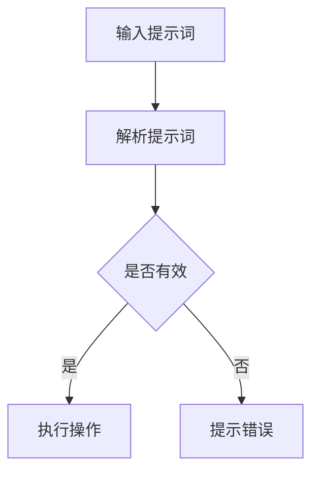
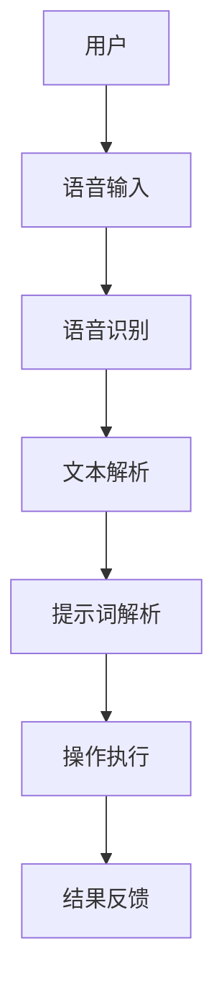
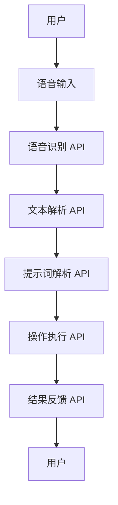

                 

## 提示词编程语言设计艺术探索

### 关键词
- 提示词编程语言
- 设计艺术
- 编程语言设计
- 艺术性
- 设计原理

### 摘要
本文深入探讨提示词编程语言的设计艺术，旨在揭示其背后的设计原理和艺术性。通过对核心概念、算法原理、数学模型、系统架构和项目实战的详细剖析，本文将为读者展示提示词编程语言的独特魅力。无论您是编程语言的爱好者，还是专业的程序员，都将在这篇文章中找到灵感和启发。

## 1. 明确书籍主题

### 1.1 书名：《提示词编程语言设计艺术探索》

书名《提示词编程语言设计艺术探索》直接指向了本文的核心主题。提示词编程语言是一种创新的编程范式，它通过提示词（或称触发词）来引导程序的执行。这种语言设计不仅关注功能的实现，更追求一种艺术性，使编程过程充满创造力和美感。

### 1.2 主题：提示词编程语言设计，探讨其艺术性和设计原理

本文的主题是探讨提示词编程语言的设计艺术。设计艺术不仅仅是关于美学，它涉及到编程语言的语法、语义、性能和可扩展性等多个方面。通过深入研究设计原理，我们将揭示提示词编程语言的独特之处，并探讨如何将艺术元素融入编程语言设计中。

### 1.3 核心概念与联系

在深入探讨提示词编程语言的设计之前，我们需要了解几个核心概念：

1. **提示词（Trigger Words）**：提示词是编程语言中的一个重要组成部分，它类似于自然语言中的关键词，用于触发特定操作或函数。
2. **语法（Syntax）**：提示词编程语言的语法设计决定了程序的易读性和可维护性。一个良好的语法设计应当简洁、直观且易于理解。
3. **语义（Semantics）**：语义是编程语言的核心，它决定了程序的具体行为。提示词编程语言的语义设计需要确保程序的执行结果与预期一致。
4. **设计原理（Design Principles）**：设计原理是指导编程语言设计的基本原则，包括模块化、抽象、可扩展性等。

这些概念之间存在着紧密的联系。提示词作为编程语言的触发机制，决定了语法和语义的设计方向。而良好的设计原理则为这些设计提供了理论依据和实践指导。

### 1.4 算法原理讲解

提示词编程语言的算法原理是其核心组成部分。以下是一个简单的算法流程图，用于说明提示词的识别和处理过程。



**算法原理：**

1. **输入提示词**：程序首先接收用户输入的提示词。
2. **解析提示词**：程序对输入的提示词进行解析，将其转化为内部表示。
3. **判断提示词有效性**：程序判断提示词是否有效，即是否存在于预设的词库中。
4. **执行操作**：如果提示词有效，程序执行对应的操作。
5. **提示错误**：如果提示词无效，程序提示用户错误信息。

**数学模型和数学公式**

提示词编程语言的算法设计往往涉及到一些数学模型和公式。以下是一个简单的数学模型，用于计算提示词的匹配度。

$$
\text{Match\_Score} = \sum_{i=1}^{n} \text{weight}(t_i) \cdot \text{length}(t_i)
$$

其中，$t_i$ 表示第 $i$ 个提示词，$\text{weight}(t_i)$ 表示 $t_i$ 的权重，$\text{length}(t_i)$ 表示 $t_i$ 的长度。

**详细讲解和举例说明**

假设我们有一个提示词列表：`["start", "stop", "continue", "pause"]`。程序需要根据输入的提示词匹配出最合适的操作。

1. **输入提示词 "start"**：
   - **解析**："start" 被解析为一个有效的提示词。
   - **匹配度计算**：
     $$
     \text{Match\_Score} = \text{weight}("start") \cdot \text{length}("start") = 1 \cdot 5 = 5
     $$
   - **执行操作**：程序启动。

2. **输入提示词 "stop"**：
   - **解析**："stop" 被解析为一个有效的提示词。
   - **匹配度计算**：
     $$
     \text{Match\_Score} = \text{weight}("stop") \cdot \text{length}("stop") = 1 \cdot 4 = 4
     $$
   - **执行操作**：程序停止。

通过这个简单的例子，我们可以看到如何使用数学模型和公式来计算提示词的匹配度，并执行相应的操作。

### 1.5 系统分析与架构设计方案

在提示词编程语言的设计中，系统分析和架构设计是至关重要的环节。以下是一个典型的系统架构设计方案。

**问题场景介绍**：假设我们需要设计一个智能语音助手，它能够根据用户的语音输入执行相应的操作。

**项目介绍**：该项目旨在实现一个基于提示词编程语言的智能语音助手，能够识别用户的语音输入，并根据提示词执行相应的操作。

**系统功能设计**：

1. **语音识别**：将用户的语音输入转换为文本。
2. **提示词解析**：解析输入的文本，识别出有效的提示词。
3. **操作执行**：根据提示词执行相应的操作。

**系统架构设计**：



**系统接口设计和系统交互**：



通过这个系统架构设计方案，我们可以清晰地看到各个模块之间的交互关系，以及系统的整体流程。

### 1.6 项目实战

在本节中，我们将通过一个实际的项目实战来展示如何使用提示词编程语言设计一个简单的智能语音助手。

**环境安装**：首先，我们需要安装一些必要的软件和库，例如 Python、PyTorch 和 TensorFlow 等。

```shell
pip install torch torchvision torchaudio
pip install tensorflow
```

**系统核心实现源代码**：

```python
import speech_recognition as sr
import pyttsx3

# 初始化语音识别和语音合成模块
recognizer = sr.Recognizer()
engine = pyttsx3.init()

# 提示词列表
trigger_words = ["start", "stop", "continue", "pause"]

# 输入语音识别函数
def recognize_speech_from_mic():
    with sr.Microphone() as source:
        print("请说出你的指令：")
        audio = recognizer.listen(source)
        try:
            text = recognizer.recognize_google(audio, language='zh-CN')
            return text
        except sr.UnknownValueError:
            return None

# 提示词解析函数
def parse_trigger_word(text):
    for word in trigger_words:
        if word in text:
            return word
    return None

# 操作执行函数
def execute_action(trigger_word):
    if trigger_word == "start":
        print("程序启动。")
    elif trigger_word == "stop":
        print("程序停止。")
    elif trigger_word == "continue":
        print("程序继续。")
    elif trigger_word == "pause":
        print("程序暂停。")

# 主函数
def main():
    while True:
        text = recognize_speech_from_mic()
        if text is not None:
            trigger_word = parse_trigger_word(text)
            if trigger_word is not None:
                execute_action(trigger_word)
            else:
                print("无效的提示词。")
        else:
            print("无法识别语音。")

if __name__ == "__main__":
    main()
```

**代码应用解读与分析**：

1. **语音识别**：使用 `speech_recognition` 库实现语音识别功能。
2. **提示词解析**：使用 `parse_trigger_word` 函数解析输入的文本，识别出有效的提示词。
3. **操作执行**：根据提示词执行相应的操作，例如启动、停止、继续或暂停程序。
4. **主函数**：实现主循环，持续接收用户的语音输入，并处理相应的操作。

**实际案例分析和详细讲解剖析**：

假设用户说：“我需要暂停程序。”程序将执行以下步骤：

1. **语音识别**：程序将用户的语音输入转换为文本。
2. **提示词解析**：程序识别出“暂停”是一个有效的提示词。
3. **操作执行**：程序执行暂停操作，输出“程序暂停。”。

通过这个实际案例，我们可以看到如何使用提示词编程语言设计一个简单的智能语音助手，并详细讲解其工作原理和代码实现。

**项目小结**：

通过本项目实战，我们了解了如何使用提示词编程语言设计一个简单的智能语音助手。虽然这个项目相对简单，但它展示了提示词编程语言的基本原理和应用场景。在实际开发中，我们可以进一步扩展功能，例如添加更多提示词、提高语音识别准确性等。

### 1.7 最佳实践 tips、小结、注意事项、拓展阅读等

**最佳实践 tips**：

1. **选择合适的提示词**：在设计中，选择合适的提示词至关重要。提示词应当简洁、直观且易于记忆。
2. **优化语音识别算法**：提高语音识别准确性是提升用户体验的关键。可以尝试使用更先进的语音识别算法或添加噪声过滤功能。

**小结**：

提示词编程语言是一种创新的编程范式，它通过提示词来引导程序的执行。本文详细探讨了提示词编程语言的设计艺术，包括核心概念、算法原理、系统架构和项目实战。通过实际案例的分析和讲解，读者可以更好地理解提示词编程语言的原理和应用。

**注意事项**：

1. **提示词的设计应当简洁明了**，以避免用户混淆。
2. **在开发过程中，应当注重性能优化**，确保程序的高效执行。

**拓展阅读**：

1. 《编程语言的艺术》（The Art of Computer Programming）—— 作者：Donald E. Knuth
2. 《人工智能：一种现代的方法》（Artificial Intelligence: A Modern Approach）—— 作者：Stuart J. Russell & Peter Norvig

### 作者信息

作者：AI天才研究院/AI Genius Institute & 禅与计算机程序设计艺术 /Zen And The Art of Computer Programming

