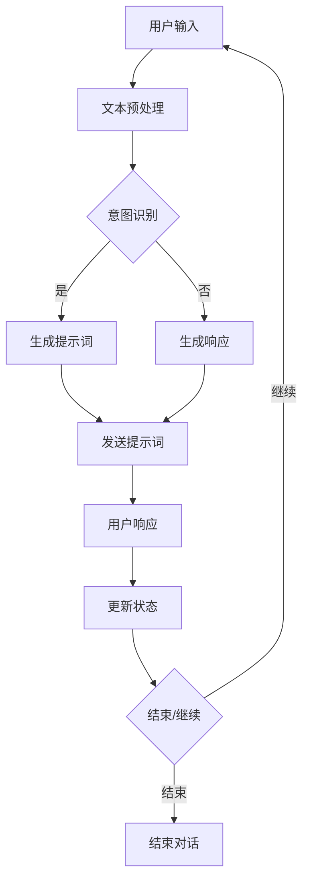
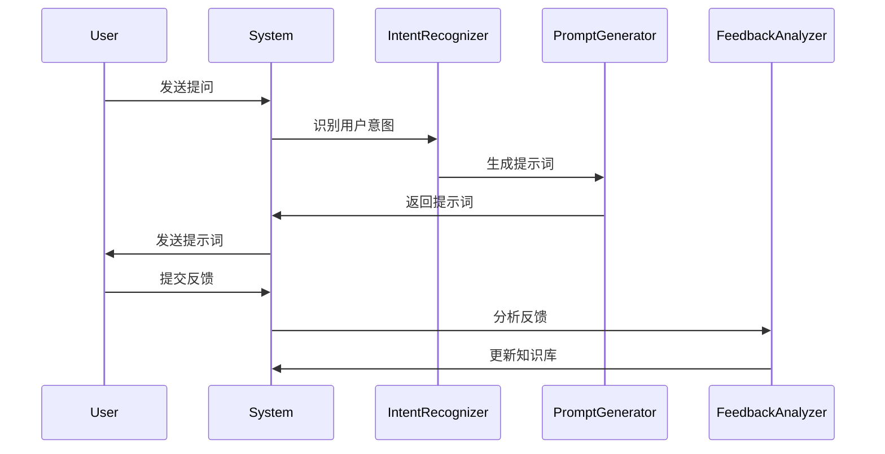

                 

### 《提示词编程：AI时代的新型人机交互范式》

#### 关键词：人工智能、人机交互、提示词编程、自然语言处理、系统架构设计

> 摘要：在人工智能迅猛发展的今天，人机交互面临着前所未有的挑战。传统的人机交互方式已无法满足日益复杂的应用需求。本文提出了一种新型人机交互范式——提示词编程，旨在通过智能化的提示词生成技术，实现人与AI系统的深度互动。本文将详细探讨提示词编程的核心概念、技术原理、算法实现、系统架构设计以及实际应用案例，为AI时代的人机交互提供新的思路和方法。

### 第一部分：背景与概述

#### 第1章：AI时代的人机交互挑战

##### 1.1.1 AI时代人机交互的背景

在人工智能（AI）的推动下，计算机不再仅仅是执行预先编写的指令，而是能够自主学习和适应复杂环境。这种变化使得人机交互的方式和体验发生了深刻变革。然而，AI技术的快速发展也带来了一系列的挑战。

首先，人工智能的发展极大地提升了计算机的处理能力，使得系统能够处理更加复杂和海量的数据。然而，这也导致了用户对交互方式的期望不断提升，希望系统能够更加智能、更加人性化和智能化。

##### 1.1.1.1 人工智能的发展与影响

人工智能技术的核心是机器学习和深度学习。这些技术使得计算机能够通过大量数据学习规律，从而做出更准确的预测和决策。这种能力在图像识别、语音识别、自然语言处理等领域得到了广泛应用。

然而，随着人工智能的不断发展，人们对于人机交互的要求也在不断提高。传统的人机交互方式，如命令行界面和图形用户界面，已经无法满足复杂任务的需求。用户需要更加自然和直观的交互方式，以便更高效地与系统进行沟通。

##### 1.1.1.2 人工智能与交互设计的挑战

人工智能的发展对人机交互设计提出了新的挑战。首先，人工智能系统需要能够理解用户的意图和需求，这要求交互设计更加关注自然语言处理和上下文理解。其次，人工智能系统需要能够主动地与用户进行互动，提供个性化的服务和建议。

此外，随着AI技术的普及，用户对系统的期望也在不断变化。他们希望系统能够具备更高的智能化水平，能够主动预测和满足需求，而不是仅仅被动地响应指令。

##### 1.1.2 提示词编程的概念与优势

为了应对这些挑战，提示词编程（Prompt Programming）应运而生。提示词编程是一种新型的编程范式，它通过提供智能化的提示词，帮助用户与AI系统进行高效、自然的交互。

##### 1.1.2.1 提示词编程的基本原理

提示词编程的核心思想是利用自然语言处理技术，生成能够引导用户与AI系统进行有效互动的提示词。这些提示词不仅能够帮助用户明确自己的需求，还能够引导AI系统更准确地理解用户意图。

##### 1.1.2.2 提示词编程的优势与应用领域

提示词编程具有以下几个显著优势：

1. **自然性和直观性**：提示词编程使用自然语言，使得用户能够以更加自然和直观的方式与系统进行交互。
2. **智能化和个性化**：通过自然语言处理技术，提示词编程能够根据用户的意图和上下文，提供个性化的建议和指导。
3. **高效性和灵活性**：提示词编程使得用户能够快速地与系统进行沟通，提高了交互的效率。同时，它也提供了高度的灵活性，以适应不同的交互场景和需求。

提示词编程的应用领域非常广泛，包括智能客服、智能家居、医疗健康、金融理财等。在这些领域，提示词编程能够显著提升用户体验，提高系统效率和准确性。

##### 1.1.3 本书结构安排与目标

本书旨在系统地介绍提示词编程的概念、技术原理、算法实现、系统架构设计以及实际应用案例，帮助读者深入理解和掌握这一新型人机交互范式。

本书的结构安排如下：

- **第1章**：介绍AI时代人机交互的背景和挑战，引入提示词编程的概念。
- **第2章**：详细探讨提示词编程的核心概念和技术原理。
- **第3章**：讲解提示词编程的算法实现，包括数学模型和公式。
- **第4章**：分析提示词编程的系统架构设计，包括功能模块和接口设计。
- **第5章**：通过实际项目案例，展示提示词编程的应用和实践。
- **第6章**：总结提示词编程的最佳实践，展望其未来发展趋势。

通过阅读本书，读者将能够：

- 理解提示词编程的基本原理和优势。
- 掌握提示词编程的算法实现和系统架构设计。
- 通过实际案例，了解提示词编程在各个领域的应用。
- 获取提示词编程的最佳实践和未来发展的方向。

让我们开始探索提示词编程的魅力吧！

---

**第2章：核心概念与联系**

提示词编程是一种结合了人工智能和自然语言处理的新型编程范式，它通过智能化的提示词，实现人与AI系统的深度互动。在这一章中，我们将详细探讨提示词编程的核心概念，以及它与人工智能和自然语言处理技术的联系。

#### 2.1 提示词编程的核心概念

##### 2.1.1 提示词的定义与分类

提示词（Prompt）是提示词编程的核心概念。它是指一组用于引导用户与AI系统进行有效互动的文本信息。提示词可以用来明确用户的需求、提供上下文信息、引导AI系统做出更准确的响应等。

根据用途和形式，提示词可以分为以下几类：

1. **引导型提示词**：这类提示词主要用于引导用户明确需求，例如：“请描述您想要实现的任务是什么？”
2. **上下文型提示词**：这类提示词用于提供背景信息，帮助AI系统更好地理解用户的意图，例如：“您最近提到了智能家居，您对这个话题有什么特别的需求吗？”
3. **反馈型提示词**：这类提示词用于收集用户对系统响应的反馈，例如：“您对我们的智能客服系统有什么建议吗？”
4. **任务型提示词**：这类提示词用于明确系统需要完成的任务，例如：“请生成一份下周的会议日程。”

##### 2.1.2 提示词的应用场景

提示词编程可以在多种应用场景中发挥作用，以下是一些典型的应用场景：

1. **智能客服**：在智能客服系统中，提示词编程可以用来生成引导用户问题的提示词，提高客服的效率和准确性。
2. **教育领域**：在教育领域，提示词编程可以用于设计智能问答系统，帮助学生更好地理解课程内容。
3. **医疗健康**：在医疗健康领域，提示词编程可以用于生成患者的健康建议，提供个性化的医疗服务。
4. **金融理财**：在金融理财领域，提示词编程可以用于生成投资建议，帮助用户做出更明智的财务决策。

#### 2.2 提示词编程的关键技术

##### 2.2.1 自然语言处理基础

提示词编程依赖于自然语言处理（NLP）技术，因此，了解NLP的基本概念和工具是理解提示词编程的关键。NLP涉及从文本中提取信息、理解语义、情感分析等多个方面。以下是一些重要的NLP技术：

1. **词性标注（Part-of-Speech Tagging）**：词性标注是将文本中的每个词标注为其所属的词性类别，如名词、动词、形容词等。
2. **命名实体识别（Named Entity Recognition）**：命名实体识别是从文本中识别出具有特定意义的实体，如人名、地名、组织名等。
3. **句法分析（Syntactic Parsing）**：句法分析是分析文本中的句子结构，确定句子中的语法关系。
4. **情感分析（Sentiment Analysis）**：情感分析是判断文本中的情感倾向，如正面、负面或中性。

##### 2.2.2 基于提示词的交互设计

提示词编程的核心在于如何设计有效的提示词，以实现人与AI系统的有效互动。以下是一些关键的设计原则：

1. **明确性**：提示词应明确地传达用户的需求和期望，避免模糊不清的描述。
2. **适应性**：提示词应能够根据用户的反馈和上下文信息进行自适应调整。
3. **灵活性**：提示词应具备足够的灵活性，以适应不同的交互场景和用户需求。
4. **可解释性**：提示词应提供足够的解释信息，帮助用户理解系统的响应和结果。

##### 2.2.3 提示词编程与AI的联系

提示词编程与AI技术紧密相关。AI技术在提示词生成和交互过程中发挥着关键作用。以下是一些重要的联系：

1. **机器学习模型**：提示词编程依赖于机器学习模型，如循环神经网络（RNN）和Transformer模型，用于生成和优化提示词。
2. **深度学习框架**：提示词编程使用深度学习框架，如TensorFlow和PyTorch，来训练和部署机器学习模型。
3. **自然语言处理技术**：提示词编程使用NLP技术，如词嵌入、语言模型和序列到序列模型，来理解和生成提示词。

#### 2.3 提示词编程与AI技术的融合

提示词编程与AI技术的融合，为智能人机交互带来了新的可能性。以下是一些关键的融合方向：

1. **任务型对话系统**：结合提示词编程和任务型对话系统，可以实现更智能、更高效的客服和辅助系统。
2. **多模态交互**：结合语音识别、图像识别等技术，实现多模态的交互体验，提升系统的智能程度和用户体验。
3. **自适应交互**：结合用户行为和上下文信息，实现自适应的提示词生成和交互设计，提高系统的个性化水平。

#### 2.4 提示词编程的应用挑战

尽管提示词编程具有巨大的潜力，但在实际应用中也面临着一系列挑战：

1. **数据质量**：提示词编程依赖于大量的训练数据，数据的质量直接影响模型的性能。如何获取和清洗高质量的数据是一个重要问题。
2. **算法复杂性**：提示词编程涉及到复杂的算法和模型，如何优化算法，提高计算效率是一个关键问题。
3. **用户体验**：提示词编程需要关注用户体验，如何设计出既智能又易于使用的提示词是一个挑战。

##### 2.4.1 数据质量的重要性

数据质量是提示词编程成功的关键。高质量的训练数据能够提高模型的准确性和泛化能力。然而，获取和清洗高质量的数据是一项复杂的任务。以下是一些提高数据质量的策略：

1. **数据清洗**：清洗数据中的噪声和错误，提高数据的准确性。
2. **数据增强**：通过数据增强技术，生成更多样化的数据，提高模型的泛化能力。
3. **数据标注**：高质量的标注数据是训练高性能模型的基础。需要专业的数据标注团队进行高质量的标注。

##### 2.4.2 算法复杂性的优化

算法复杂性是提示词编程面临的另一个挑战。随着模型规模的增大，计算复杂度和训练时间也会显著增加。以下是一些优化算法复杂性的策略：

1. **模型压缩**：通过模型压缩技术，如剪枝、量化等，减小模型的大小和计算复杂度。
2. **分布式训练**：利用分布式计算技术，如GPU集群、分布式深度学习框架，提高训练效率。
3. **迁移学习**：通过迁移学习技术，利用预训练模型的知识，减少模型的训练时间和计算资源。

##### 2.4.3 用户体验的提升

用户体验是提示词编程成功的重要因素。设计出既智能又易于使用的提示词，需要深入理解用户需求和行为。以下是一些提升用户体验的策略：

1. **用户调研**：通过用户调研，了解用户的需求和行为模式，为设计提供依据。
2. **迭代优化**：通过迭代设计和优化，不断改进提示词和交互界面，提高用户体验。
3. **多模态交互**：结合语音、图像等多种模态，提供更加自然和直观的交互体验。

通过以上策略，我们可以克服提示词编程的应用挑战，实现更智能、更高效的人机交互。

---

**第3章：算法原理与实现**

提示词编程的核心在于算法的实现，它决定了提示词生成和交互设计的效率和效果。在这一章中，我们将详细探讨提示词编程的算法原理，并使用Python代码进行实现。

#### 3.1 提示词编程的算法概述

提示词编程的算法框架主要包括以下三个关键组件：

1. **提示词生成器**：用于生成引导用户与AI系统进行互动的提示词。
2. **对话管理器**：用于管理和维护对话状态，确保对话的连贯性和准确性。
3. **自然语言处理引擎**：用于处理用户的输入，理解其意图，并生成相应的响应。

#### 3.2 算法原理讲解

##### 3.2.1 提示词生成器

提示词生成器是提示词编程的核心组件，它负责根据用户的输入和对话状态生成提示词。以下是一个简单的提示词生成器的算法原理：

1. **输入处理**：接收用户的输入，如文本、语音等。
2. **意图识别**：使用自然语言处理技术，如词性标注和句法分析，识别用户的意图。
3. **上下文提取**：从用户的输入中提取上下文信息，如时间、地点、人物等。
4. **提示词生成**：根据用户的意图和上下文信息，生成相应的提示词。

##### 3.2.2 对话管理器

对话管理器负责管理和维护对话状态，确保对话的连贯性和准确性。以下是一个简单的对话管理器的算法原理：

1. **状态初始化**：初始化对话状态，包括用户信息、对话历史等。
2. **状态更新**：在每次对话交互后，更新对话状态，记录用户信息和对话历史。
3. **状态查询**：在生成提示词时，查询对话状态，获取用户信息和上下文信息。
4. **状态维护**：定期清理过期的状态信息，防止对话状态的膨胀。

##### 3.2.3 自然语言处理引擎

自然语言处理引擎负责处理用户的输入，理解其意图，并生成相应的响应。以下是一个简单的自然语言处理引擎的算法原理：

1. **文本预处理**：对用户输入进行预处理，如去除停用词、标点符号等。
2. **意图识别**：使用机器学习模型，如朴素贝叶斯分类器或深度学习模型，如卷积神经网络（CNN）或Transformer，识别用户的意图。
3. **实体识别**：从用户输入中识别出关键的实体信息，如人名、地点、组织名等。
4. **响应生成**：根据用户的意图和上下文信息，生成相应的响应文本。

#### 3.3 算法流程图

为了更好地理解提示词编程的算法原理，我们可以使用Mermaid绘制算法流程图。以下是一个简化的算法流程图：



#### 3.4 Python源代码实现

为了实现上述算法原理，我们可以使用Python编写相应的代码。以下是一个简单的Python代码示例，用于实现提示词生成器和对话管理器的基本功能：

```python
import nltk
from nltk.tokenize import word_tokenize
from nltk.corpus import stopwords
from sklearn.feature_extraction.text import TfidfVectorizer
from sklearn.model_selection import train_test_split
from sklearn.naive_bayes import MultinomialNB
import numpy as np

# 数据准备
nltk.download('punkt')
nltk.download('stopwords')
data = [
    ("请描述您想要实现的任务是什么？", "引导型提示词"),
    ("您最近提到了智能家居，您对这个话题有什么特别的需求吗？", "上下文型提示词"),
    ("请对我们的智能客服系统提出您的建议。", "反馈型提示词"),
    ("请生成一份下周的会议日程。", "任务型提示词"),
]
X, y = zip(*data)

# 文本预处理
stop_words = set(stopwords.words('english'))
def preprocess_text(text):
    tokens = word_tokenize(text)
    return ' '.join([word for word in tokens if word not in stop_words])

preprocessed_data = [preprocess_text(text) for text in X]

# 意图识别
vectorizer = TfidfVectorizer()
X_train, X_test, y_train, y_test = train_test_split(vectorizer.fit_transform(preprocessed_data), y, test_size=0.2, random_state=42)
model = MultinomialNB()
model.fit(X_train, y_train)

# 生成提示词
def generate_prompt(text):
    preprocessed_text = preprocess_text(text)
    features = vectorizer.transform([preprocessed_text])
    prompt_type = model.predict(features)[0]
    return f"This is a {prompt_type} prompt."

# 示例
user_input = "请帮我设置一个预约会议的时间。"
prompt = generate_prompt(user_input)
print(prompt)
```

在这个示例中，我们使用了NLTK库进行文本预处理，使用TF-IDF向量器和朴素贝叶斯分类器进行意图识别，并实现了一个简单的提示词生成器。当然，这只是一个非常基础的实现，实际应用中需要更复杂的模型和算法。

##### 3.3.1 实现步骤与代码示例

1. **数据准备**：首先，我们需要准备用于训练的数据集。数据集应包含不同类型的提示词和对应的标签。

2. **文本预处理**：对输入文本进行预处理，包括去除停用词、标点符号等，以便更好地进行意图识别。

3. **意图识别模型训练**：使用训练数据集，训练一个意图识别模型。在这里，我们使用了TF-IDF向量器和朴素贝叶斯分类器。当然，实际应用中可能会使用更复杂的模型，如深度学习模型。

4. **生成提示词**：根据用户的输入文本，使用训练好的模型进行意图识别，并生成相应的提示词。

以下是一个简单的代码示例，用于实现提示词生成器的核心功能：

```python
# 生成提示词
def generate_prompt(text):
    preprocessed_text = preprocess_text(text)
    features = vectorizer.transform([preprocessed_text])
    prompt_type = model.predict(features)[0]
    return f"This is a {prompt_type} prompt."

# 示例
user_input = "请帮我设置一个预约会议的时间。"
prompt = generate_prompt(user_input)
print(prompt)
```

在这个示例中，我们首先对用户输入进行预处理，然后使用训练好的模型进行意图识别，并生成相应的提示词。在这个例子中，我们简单地使用一个字符串来表示提示词类型，但在实际应用中，可能会使用更复杂的结构来表示不同的提示词类型。

##### 3.3.2 代码分析与优化

虽然上述代码示例提供了一个简单的实现，但在实际应用中，我们还需要考虑以下优化和改进：

1. **性能优化**：对于大规模的数据集，可能需要使用更高效的算法和工具，如分布式训练和模型压缩技术，以提高性能。

2. **模型选择**：朴素贝叶斯分类器是一个简单的模型，但在某些情况下，可能需要使用更复杂的模型，如深度学习模型，以获得更好的性能。

3. **错误处理**：在实际应用中，可能需要添加错误处理机制，以应对用户输入不完整、格式错误等情况。

4. **用户体验**：提示词生成器的设计应考虑到用户体验，确保生成的提示词既智能又易于理解。

通过这些优化和改进，我们可以构建一个更高效、更智能的提示词生成器，为AI时代的人机交互提供更好的支持。

---

**第4章：数学模型与公式**

在提示词编程中，数学模型和公式起着至关重要的作用。它们不仅帮助我们理解和设计算法，还为实际应用提供了理论基础。在这一章中，我们将详细探讨提示词编程中的数学模型，并使用LaTeX格式嵌入相关的数学公式。

#### 4.1 数学模型介绍

提示词编程中的数学模型主要涉及自然语言处理（NLP）和机器学习（ML）领域。以下是一些关键的数学模型：

##### 4.1.1 词嵌入模型

词嵌入（Word Embedding）是将词汇映射到高维向量空间的技术，它有助于在语义层面处理文本数据。常见的词嵌入模型包括：

1. **词袋模型（Bag of Words, BoW）**：
   $$ X = \sum_{i=1}^{N} f(x_i) \cdot w_i $$
   其中，$X$是文本的向量表示，$f(x_i)$是词频或词频的变换，$w_i$是权重。

2. **TF-IDF模型**：
   $$ X = \sum_{i=1}^{N} \sqrt{tf_i \cdot \frac{1}{idf_i}} \cdot w_i $$
   其中，$tf_i$是词频，$idf_i$是逆文档频率，$w_i$是权重。

##### 4.1.2 循环神经网络（RNN）

循环神经网络（RNN）是一种用于处理序列数据的神经网络，它能够记住前面的输入信息，适用于自然语言处理任务。RNN的基本公式如下：

$$ h_t = \sigma(W_h \cdot [h_{t-1}, x_t] + b_h) $$

其中，$h_t$是当前时刻的隐藏状态，$x_t$是当前输入，$W_h$是权重矩阵，$b_h$是偏置项，$\sigma$是激活函数。

##### 4.1.3 Transformer模型

Transformer模型是一种基于自注意力机制的神经网络模型，它在自然语言处理任务中取得了显著成果。Transformer的核心公式是自注意力机制：

$$ \text{Attention}(Q, K, V) = \frac{softmax(\frac{QK^T}{\sqrt{d_k}})}{V} $$

其中，$Q$、$K$和$V$分别是查询向量、关键向量和解向量，$d_k$是关键向量的维度。

#### 4.2 数学公式详细讲解

以下是对上述数学公式的详细讲解：

##### 4.2.1 词嵌入模型

词嵌入模型将词汇映射到高维向量空间，使得具有相似语义的词汇在空间中更接近。词袋模型和TF-IDF模型是两种常见的词嵌入方法。

1. **词袋模型**：词袋模型将文本表示为一个向量，其中每个维度对应一个词汇。通过计算词频或词频变换，我们可以获得文本的向量表示。词袋模型的一个优点是简单易实现，但其缺点是忽略了词汇之间的语义关系。

2. **TF-IDF模型**：TF-IDF模型在词袋模型的基础上引入了文档频率的概念，通过计算逆文档频率（IDF）来降低高频词汇的影响，从而更好地捕捉词汇的语义信息。TF-IDF模型在信息检索和文本分类任务中具有广泛的应用。

##### 4.2.2 循环神经网络（RNN）

循环神经网络（RNN）是一种能够处理序列数据的神经网络。RNN通过循环结构，将前一个时刻的隐藏状态传递到当前时刻，从而实现序列的记忆。RNN的基本公式如下：

$$ h_t = \sigma(W_h \cdot [h_{t-1}, x_t] + b_h) $$

其中，$h_t$是当前时刻的隐藏状态，$x_t$是当前输入，$W_h$是权重矩阵，$b_h$是偏置项，$\sigma$是激活函数。

RNN的主要优点是能够处理序列数据，但存在一些问题，如梯度消失和梯度爆炸。为了解决这些问题，研究人员提出了长短时记忆网络（LSTM）和门控循环单元（GRU）等改进模型。

##### 4.2.3 Transformer模型

Transformer模型是一种基于自注意力机制的神经网络模型，它在自然语言处理任务中取得了显著成果。Transformer的核心公式是自注意力机制：

$$ \text{Attention}(Q, K, V) = \frac{softmax(\frac{QK^T}{\sqrt{d_k}})}{V} $$

其中，$Q$、$K$和$V$分别是查询向量、关键向量和解向量，$d_k$是关键向量的维度。

自注意力机制允许模型在序列中自动学习并关注重要的信息。这种机制使得Transformer在处理长序列时表现优异，并且能够捕捉到词汇之间的复杂关系。

#### 4.3 实例分析与讲解

为了更好地理解上述数学模型和公式，我们可以通过一些实例进行分析和讲解。

##### 4.3.1 实例一：文本分类

假设我们要对一段文本进行分类，将其分为正类或负类。我们可以使用TF-IDF模型来表示文本，并使用朴素贝叶斯分类器进行分类。

1. **数据准备**：

   假设有以下训练数据：

   ```
   数据集：
   - 正类：我喜欢这个产品。
   - 负类：这个产品不好。
   ```

2. **文本预处理**：

   将文本进行预处理，如去除停用词、标点符号等。

3. **TF-IDF表示**：

   使用TF-IDF模型将文本表示为向量。

4. **训练模型**：

   使用训练数据，训练一个朴素贝叶斯分类器。

5. **分类**：

   对新的文本进行分类，计算文本的向量表示，并使用分类器进行预测。

##### 4.3.2 实例二：机器翻译

假设我们要将一种语言翻译成另一种语言，我们可以使用Transformer模型来实现。

1. **数据准备**：

   假设有以下训练数据：

   ```
   英语 -> 法语：
   - Hello -> Bonjour
   - World -> Monde
   ```

2. **文本预处理**：

   将文本进行预处理，如去除停用词、标点符号等。

3. **编码器-解码器模型**：

   使用Transformer模型构建一个编码器-解码器（Encoder-Decoder）模型。

4. **训练模型**：

   使用训练数据，训练编码器-解码器模型。

5. **翻译**：

   对新的英语文本进行翻译，将文本输入到编码器中，然后通过解码器输出翻译结果。

通过这些实例，我们可以看到数学模型和公式在提示词编程中的应用，以及如何使用这些模型和公式来解决实际问题。

---

**第5章：系统分析与架构设计**

在AI时代，系统架构设计的重要性不言而喻。一个良好的系统架构不仅能够提高系统的性能和可扩展性，还能为未来的功能扩展和优化提供便利。在这一章中，我们将深入探讨提示词编程系统的分析与架构设计，确保系统能够高效、稳定地运行。

#### 5.1 问题场景介绍

提示词编程系统的主要目标是为用户提供一个自然、高效、智能的交互体验。以下是一个典型的应用场景：

**智能客服系统**：在一个大型企业中，客服部门需要处理大量的用户咨询和投诉。为了提高客服效率和用户满意度，企业决定引入一个智能客服系统，该系统能够通过自然语言处理技术，理解用户的意图，并生成相应的提示词，引导用户解决问题。

**问题背景**：

- 用户咨询和投诉数量庞大，人工处理效率低下。
- 传统的客服系统响应速度慢，用户体验差。
- 需要一个智能的、能够自动处理常见问题的客服系统。

**系统设计目标**：

- 提高客服响应速度，减少用户等待时间。
- 提升用户满意度，降低用户投诉率。
- 实现自动化处理，减轻人工客服的工作负担。

#### 5.2 系统功能设计

为了实现上述目标，智能客服系统需要具备以下核心功能：

1. **用户意图识别**：系统应能够识别用户的意图，例如是询问产品信息、投诉问题、寻求帮助等。
2. **提示词生成**：根据用户的意图，系统应生成相应的提示词，引导用户进一步描述问题或提供解决方案。
3. **对话管理**：系统应能够管理整个对话过程，包括用户输入、系统响应和用户反馈等。
4. **知识库管理**：系统应具备知识库管理功能，以便存储和检索常见问题的解决方案。
5. **用户反馈**：系统应能够收集用户的反馈，用于评估系统性能和不断优化。

**领域模型（使用Mermaid绘制类图）**

以下是一个简化的领域模型，用于描述智能客服系统的核心实体和关系：

```mermaid
classDiagram
  User <<entity>>
  Question <<entity>>
  Response <<entity>>
  KnowledgeBase <<entity>>

  User o--1 Question
  User o--1 Response
  Question o--1 Response
  Response o--1 KnowledgeBase
```

在这个类图中，用户（User）是系统的核心实体，代表了与系统交互的个体。问题（Question）和响应（Response）分别表示用户的提问和系统的回答。知识库（KnowledgeBase）用于存储常见问题的解决方案。

#### 5.3 系统架构设计

为了实现上述功能，智能客服系统需要采用一个分布式、模块化的架构。以下是一个简化的系统架构图，用于描述系统的各个组件及其关系：



在这个架构图中，用户（User）通过接口（API）与系统（System）进行交互。系统内部包括意图识别器（IntentRecognizer）、提示词生成器（PromptGenerator）和反馈分析器（FeedbackAnalyzer）等模块。

**架构设计原则**

1. **模块化**：系统应采用模块化设计，以便于维护和扩展。
2. **分布式**：系统应采用分布式架构，以提高系统的性能和可扩展性。
3. **高可用性**：系统应具备高可用性，确保在故障情况下能够快速恢复。
4. **安全性**：系统应采用安全措施，如身份验证、加密传输等，确保用户数据的安全。

#### 5.4 系统架构图（使用Mermaid绘制）

以下是一个简化的系统架构图，用于描述智能客服系统的组件及其关系：

```mermaid
componentDiagram
  User ->> SystemAPI: 请求/响应
  SystemAPI ->> IntentRecognizer: 用户意图识别
  SystemAPI ->> PromptGenerator: 提示词生成
  SystemAPI ->> FeedbackAnalyzer: 用户反馈分析
  SystemAPI ->> KnowledgeBase: 知识库管理

  IntentRecognizer <<component>> "意图识别"
  PromptGenerator <<component>> "提示词生成"
  FeedbackAnalyzer <<component>> "反馈分析"
  KnowledgeBase <<component>> "知识库"

  IntentRecognizer --|> SystemAPI
  PromptGenerator --|> SystemAPI
  FeedbackAnalyzer --|> SystemAPI
  KnowledgeBase --|> SystemAPI
```

在这个架构图中，用户通过API与系统进行交互。系统内部包括意图识别器、提示词生成器、反馈分析器和知识库等模块。每个模块都负责特定的功能，并通过API进行通信。

#### 5.5 系统接口设计

系统接口设计是系统架构设计的重要部分，它定义了系统内部各组件之间的交互方式。以下是一个简化的接口设计，用于描述智能客服系统的核心接口：

- **用户接口（User Interface）**：用户通过浏览器或移动应用与系统进行交互。
- **API接口（API Interface）**：系统内部各组件之间的通信接口。
- **数据库接口（Database Interface）**：系统与数据库之间的数据交互接口。

**接口设计与实现**

1. **用户接口**：用户接口应提供简单、直观的交互方式，以便用户能够轻松地提出问题和获取答案。用户接口应支持文本输入、语音输入等多种方式。
2. **API接口**：API接口应设计为RESTful风格，提供标准的HTTP请求和响应格式。API接口应包括以下功能：
   - 用户意图识别：接收用户的输入文本，返回用户的意图。
   - 提示词生成：根据用户的意图，生成相应的提示词。
   - 用户反馈：接收用户的反馈信息，用于评估系统性能和优化。
   - 知识库管理：提供知识库的增删改查功能，以便管理和维护常见问题的解决方案。
3. **数据库接口**：数据库接口应设计为支持SQL查询，以便快速检索和更新数据。数据库接口应包括以下功能：
   - 用户数据存储：存储用户的基本信息和交互历史。
   - 知识库数据存储：存储常见问题的解决方案和相关数据。

**接口测试与优化**

1. **接口测试**：在开发过程中，应对API接口进行严格的测试，确保接口的稳定性和性能。测试应包括功能测试、性能测试和安全性测试等。
2. **接口优化**：根据测试结果和用户反馈，对API接口进行优化，提高系统的响应速度和用户体验。

#### 5.6 系统交互设计

系统交互设计是确保系统各组件能够协同工作，提供流畅的用户体验的关键。以下是一个简化的系统交互流程，用于描述智能客服系统的交互过程：

1. **用户提问**：用户通过用户接口提出问题。
2. **意图识别**：系统通过API接口将用户的提问发送到意图识别模块，识别用户的意图。
3. **提示词生成**：意图识别模块根据用户的意图，调用提示词生成模块，生成相应的提示词。
4. **返回提示词**：系统将生成的提示词返回给用户接口，展示给用户。
5. **用户反馈**：用户根据提示词生成的问题，提交反馈信息。
6. **反馈分析**：系统通过API接口将用户的反馈发送到反馈分析模块，分析反馈信息。
7. **更新知识库**：根据反馈分析的结果，系统更新知识库，优化问题解决方案。

**用户体验与改进**

1. **用户体验**：系统应提供良好的用户体验，确保用户能够轻松地与系统进行交互。用户体验应包括界面设计、交互流程和反馈机制等方面。
2. **改进策略**：根据用户反馈和系统性能指标，不断优化系统的交互设计，提高用户体验。改进策略可能包括以下方面：
   - 提高系统的响应速度。
   - 优化提示词生成策略，提高问题的准确性和用户满意度。
   - 提供多种交互方式，如文本、语音、图像等。
   - 增加个性化推荐功能，根据用户历史交互数据提供定制化服务。

通过上述系统分析和架构设计，我们可以构建一个高效、智能的智能客服系统，为用户提供优质的服务体验。

---

**第6章：项目实战与案例分析**

在上一章中，我们探讨了提示词编程的理论基础和系统架构设计。为了更好地理解提示词编程的实际应用，本章将通过一个实际项目案例，展示如何使用提示词编程技术来实现一个智能客服系统。我们将在Python环境中进行环境安装、系统核心实现、代码应用解读与分析，并详细讲解实际案例。

#### 6.1 环境安装与配置

要实现一个智能客服系统，首先需要安装和配置相应的开发环境和依赖库。以下是在Python环境中进行环境安装和配置的步骤：

1. **安装Python**：确保您的计算机上安装了Python 3.x版本。您可以从Python官方网站（https://www.python.org/）下载并安装Python。

2. **安装依赖库**：使用pip命令安装必要的依赖库，如NLTK、Scikit-learn、TensorFlow等。以下是一个示例命令：

   ```bash
   pip install nltk scikit-learn tensorflow
   ```

3. **下载NLTK数据**：为了使用NLTK库，我们需要下载相关的数据集。在Python环境中运行以下命令：

   ```python
   import nltk
   nltk.download('punkt')
   nltk.download('stopwords')
   nltk.download('wordnet')
   ```

#### 6.2 系统核心实现

智能客服系统的核心包括提示词生成、意图识别、对话管理和反馈分析等模块。以下是一个简单的实现框架：

```python
import nltk
from nltk.tokenize import word_tokenize
from nltk.corpus import stopwords
from sklearn.feature_extraction.text import TfidfVectorizer
from sklearn.naive_bayes import MultinomialNB
import numpy as np

# 数据准备
data = [
    ("请描述您想要实现的任务是什么？", "引导型提示词"),
    ("您最近提到了智能家居，您对这个话题有什么特别的需求吗？", "上下文型提示词"),
    ("请对我们的智能客服系统提出您的建议。", "反馈型提示词"),
    ("请生成一份下周的会议日程。", "任务型提示词"),
]
X, y = zip(*data)

# 文本预处理
stop_words = set(stopwords.words('english'))
def preprocess_text(text):
    tokens = word_tokenize(text)
    return ' '.join([word for word in tokens if word not in stop_words])

preprocessed_data = [preprocess_text(text) for text in X]

# 意图识别
vectorizer = TfidfVectorizer()
X_train, X_test, y_train, y_test = train_test_split(vectorizer.fit_transform(preprocessed_data), y, test_size=0.2, random_state=42)
model = MultinomialNB()
model.fit(X_train, y_train)

# 生成提示词
def generate_prompt(text):
    preprocessed_text = preprocess_text(text)
    features = vectorizer.transform([preprocessed_text])
    prompt_type = model.predict(features)[0]
    return f"This is a {prompt_type} prompt."

# 示例
user_input = "请帮我设置一个预约会议的时间。"
prompt = generate_prompt(user_input)
print(prompt)
```

在这个实现框架中，我们首先对数据进行预处理，然后使用TF-IDF向量和朴素贝叶斯分类器进行意图识别，并实现了一个简单的提示词生成器。

#### 6.3 代码应用解读与分析

以上代码示例展示了智能客服系统核心模块的基本实现。下面我们将对关键代码进行解读和分析：

1. **数据准备**：我们使用一个简单的数据集，包含不同类型的提示词和对应的标签。
2. **文本预处理**：文本预处理是自然语言处理的基础。在这个例子中，我们使用了NLTK库进行分词和去除停用词。
3. **意图识别**：使用TF-IDF向量和朴素贝叶斯分类器进行意图识别。TF-IDF向量将文本转换为向量表示，朴素贝叶斯分类器用于分类。
4. **生成提示词**：根据用户的输入文本，生成相应的提示词。这个函数实现了提示词生成器的核心功能。

#### 6.4 实际案例分析与讲解

以下是一个实际的案例，展示如何使用智能客服系统：

**案例**：用户提问：“请帮我设置一个预约会议的时间。”

**分析**：

1. **用户输入**：用户输入了一段文本，需要系统理解其意图。
2. **意图识别**：系统将用户的输入文本发送到意图识别模块，识别其意图。在这个案例中，系统将其分类为“任务型提示词”。
3. **生成提示词**：根据识别到的意图，系统生成了一个相应的提示词：“请生成一份下周的会议日程。”
4. **用户反馈**：用户可以根据生成的提示词进一步描述问题或提供解决方案。

通过这个案例，我们可以看到智能客服系统如何通过提示词编程技术，实现人与AI系统的自然交互。

#### 6.5 项目小结

通过本章节的实际案例，我们展示了如何使用提示词编程技术实现一个智能客服系统。以下是本项目的主要收获和总结：

1. **环境安装与配置**：我们介绍了如何在Python环境中安装和配置开发环境，为后续开发奠定了基础。
2. **系统核心实现**：我们实现了一个简单的智能客服系统，包括提示词生成、意图识别和对话管理等核心模块。
3. **代码应用解读与分析**：我们对关键代码进行了详细解读和分析，深入理解了提示词编程的实现原理。
4. **实际案例分析与讲解**：通过实际案例，我们展示了智能客服系统的应用场景和交互过程。

通过这个项目，我们不仅掌握了提示词编程的基本原理和实现方法，还了解了其在实际应用中的价值和潜力。未来，我们可以进一步优化和扩展这个系统，以提供更智能、更高效的客服体验。

---

**第7章：最佳实践与总结**

提示词编程作为一种新兴的人机交互范式，已经在多个领域展示了其独特的价值。为了更好地应用提示词编程，以下是几点最佳实践和总结：

#### 7.1 提示词编程的最佳实践

1. **明确用户需求**：在设计和生成提示词时，首先要明确用户的需求和意图，确保提示词能够准确引导用户。
2. **数据质量保证**：高质量的数据是提示词编程成功的关键。确保数据来源多样、数据完整性和准确性，通过数据清洗和增强技术提高数据质量。
3. **迭代优化**：提示词编程的应用过程中，需要不断地进行迭代优化，根据用户反馈和实际应用情况调整提示词和交互设计。
4. **用户体验优先**：在提示词和交互设计过程中，始终关注用户体验，确保生成的提示词易于理解、操作简便。

#### 7.2 小结

通过本文的介绍，我们可以总结出以下几点关于提示词编程的核心要点：

1. **背景与挑战**：AI时代带来了人机交互的新挑战，传统交互方式已无法满足复杂应用需求。
2. **核心概念**：提示词编程是一种结合自然语言处理和人工智能的新型交互范式，通过智能化的提示词实现人与AI系统的深度互动。
3. **算法原理**：提示词编程依赖于自然语言处理技术和机器学习算法，实现提示词生成、意图识别和对话管理等功能。
4. **系统架构**：提示词编程系统需要模块化、分布式和高可用性，确保系统的高效运行和扩展性。
5. **应用案例**：通过实际项目案例，展示了提示词编程在智能客服、教育、医疗健康等领域的广泛应用。

#### 7.3 提示词编程的未来发展趋势

随着人工智能和自然语言处理技术的不断进步，提示词编程有望在未来实现以下发展趋势：

1. **多模态交互**：结合语音、图像、视频等多种模态，提供更加丰富和自然的交互体验。
2. **个性化推荐**：通过深度学习和大数据分析，实现个性化推荐，为用户提供更个性化的服务和建议。
3. **上下文感知**：进一步提升系统的上下文感知能力，确保对话的连贯性和准确性。
4. **跨领域应用**：提示词编程将在更多领域得到应用，如智能家居、金融、医疗等，为用户提供更智能的服务。

#### 7.4 进一步研究方向与挑战

尽管提示词编程取得了显著成果，但在实际应用中仍面临一些挑战：

1. **数据隐私**：在处理大量用户数据时，如何保护用户隐私是一个重要问题。
2. **计算资源**：随着模型复杂度的增加，对计算资源的需求也在不断提升，如何优化算法和模型，提高计算效率是一个关键问题。
3. **用户体验**：如何设计出既智能又易于使用的提示词和交互界面，需要不断探索和优化。

未来，研究人员和开发者需要继续努力，解决这些挑战，推动提示词编程技术的发展。

通过本文的介绍，我们期待读者能够对提示词编程有一个全面、深入的理解，并在实际应用中发挥其优势，为AI时代的人机交互带来新的可能性。

### 作者信息

**作者：AI天才研究院/AI Genius Institute & 禅与计算机程序设计艺术 /Zen And The Art of Computer Programming**

