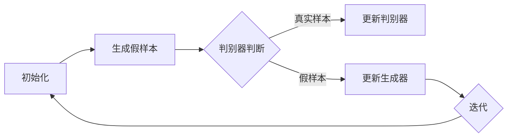
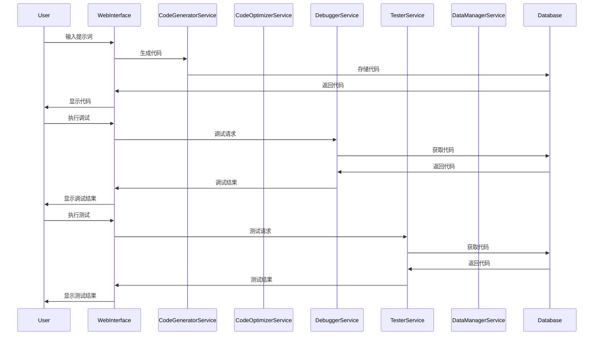
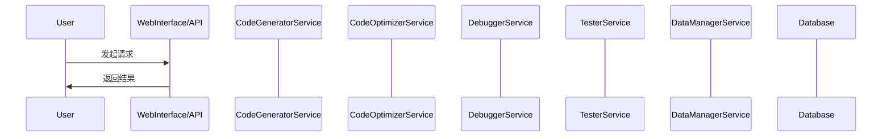

                 

## 《提示词编程：AI时代的新型软件工程范式》

> 关键词：AI时代、软件工程、提示词编程、算法原理、系统架构设计、项目实战

> 摘要：本文将深入探讨AI时代的新型软件工程范式——提示词编程。我们将从问题背景、核心概念、算法原理、系统架构设计到实际项目实战，逐一解析这一领域的最新动态和实践经验，帮助读者更好地理解和应用这一创新技术。

### 目录大纲

## 第一部分：背景介绍

## 第1章：问题背景

### 1.1.1 问题背景

### 1.1.2 问题描述

### 1.1.3 问题解决

### 1.1.4 边界与外延

### 1.1.5 概念结构与核心要素组成

## 第2章：核心概念与联系

### 2.1.1 核心概念原理

### 2.1.2 概念属性特征对比表格

### 2.1.3 ER实体关系图架构

## 第二部分：算法原理讲解

## 第3章：算法原理讲解

### 3.1.1 算法原理

### 3.1.2 Mermaid流程图

### 3.1.3 Python源代码与详细讲解

### 3.1.4 数学模型和公式

### 3.1.5 举例说明

## 第三部分：系统分析与架构设计方案

## 第4章：系统功能设计

### 4.1.1 项目介绍

### 4.1.2 系统功能设计

## 第5章：系统架构设计

### 5.1.1 系统架构设计

### 5.1.2 系统接口设计

### 5.1.3 系统交互

## 第四部分：项目实战

## 第6章：环境安装

### 6.1.1 环境准备

### 6.1.2 步骤说明

## 第7章：系统核心实现源代码

### 7.1.1 核心代码实现

### 7.1.2 代码应用解读与分析

## 第8章：实际案例分析和详细讲解

### 8.1.1 实际案例分析

### 8.1.2 详细讲解剖析

## 第五部分：最佳实践与总结

## 第9章：最佳实践 tips

### 9.1.1 实践技巧

## 第10章：小结

### 10.1.1 小结

### 10.1.2 注意事项

### 10.1.3 拓展阅读

---

### 第一部分：背景介绍

#### 第1章：问题背景

### 1.1.1 问题背景

在过去的几十年中，软件工程经历了巨大的变革和发展。从传统的编码和调试，到面向对象和组件化，再到现代的微服务架构，每一个阶段都推动了软件开发的效率和质量。然而，随着人工智能（AI）技术的迅猛发展，软件工程再次面临着前所未有的挑战和机遇。

首先，AI技术的应用使得软件系统越来越复杂。机器学习、深度学习等技术被广泛应用于图像识别、自然语言处理、推荐系统等领域，这要求软件工程师具备更广泛的技能和知识。其次，AI技术推动了软件开发的自动化。自动化测试、自动化部署等技术的普及，使得软件开发流程更加高效，但也增加了工程师的负担和复杂性。

此外，AI技术的快速发展也带来了数据安全、隐私保护等问题。如何在保障用户隐私的同时，充分利用AI技术提升软件系统的性能和安全性，成为软件开发中的一个重要课题。

### 1.1.2 问题描述

面对AI时代的挑战，传统的软件工程范式已难以满足现代软件开发的需求。具体问题包括：

1. **复杂性与可维护性**：随着系统规模的扩大，软件的复杂性急剧增加，这使得维护和更新变得更加困难。
2. **技能要求**：AI技术的应用要求工程师具备更广泛的技能，这对开发团队的专业水平和知识储备提出了更高的要求。
3. **自动化与效率**：如何在保证代码质量和安全性的同时，提高开发效率，成为软件开发中的一个重要问题。
4. **数据安全和隐私**：如何保护用户数据的安全和隐私，成为软件工程中一个不可忽视的挑战。

### 1.1.3 问题解决

为了解决上述问题，我们需要探索一种新型的软件工程范式——提示词编程。提示词编程是一种基于AI技术的编程范式，它利用提示词（Prompts）来指导程序的生成和优化。通过这种方式，我们可以实现以下几个目标：

1. **简化复杂度**：提示词编程可以将复杂的编程任务分解为更简单的步骤，从而降低软件开发的难度。
2. **提高开发效率**：通过自动化的程序生成和优化，我们可以显著提高开发效率，缩短项目周期。
3. **保障数据安全**：提示词编程可以确保在数据使用过程中的安全和隐私保护。
4. **降低技能要求**：提示词编程使得程序员不再需要掌握复杂的技术细节，从而降低了技能门槛。

### 1.1.4 边界与外延

提示词编程的定义、应用范围及其与传统编程的区别：

- **定义**：提示词编程是一种基于AI的编程范式，通过提示词来指导程序的生成和优化。

- **应用范围**：提示词编程可以应用于各种软件开发场景，包括自动化测试、代码生成、代码优化等。

- **与传统编程的区别**：传统编程依赖于人工编写代码，而提示词编程则依赖于AI技术来自动生成代码。此外，提示词编程还注重代码的可读性和可维护性。

### 1.1.5 概念结构与核心要素组成

提示词编程涉及以下几个核心概念和要素：

1. **AI技术**：包括机器学习、深度学习、神经网络等基础概念。
2. **软件工程**：涉及软件开发的方法论、流程和工具。
3. **提示词**：用于指导程序生成和优化的重要输入。
4. **编程范式**：提示词编程是一种新的编程范式，与传统编程范式有所不同。

通过上述分析，我们可以看到，提示词编程为AI时代的软件工程提供了一种新的思路和解决方案。接下来，我们将深入探讨这一领域的核心概念、算法原理以及系统架构设计。

### 第二部分：核心概念与联系

#### 第2章：核心概念与联系

在理解提示词编程之前，我们需要深入探讨其核心概念和原理，以及这些概念之间的联系。在本章中，我们将介绍提示词编程的基本概念、与AI技术的关联，以及与传统编程的区别，并通过对比表格和ER实体关系图来进一步阐明这些概念。

### 2.1.1 核心概念原理

#### 2.1.1.1 提示词编程原理

提示词编程（Prompt-based Programming）是一种新型的编程范式，它利用提示词（Prompts）来指导程序的生成和优化。提示词通常是一段文本或语音，它包含了开发人员对程序功能、性能、行为等的要求。通过提示词，AI模型可以理解任务的目标，并自动生成相应的代码。

**提示词编程的工作流程：**
1. **定义提示词**：开发人员根据任务需求，编写出明确的提示词。
2. **模型训练**：利用大量的代码和提示词对AI模型进行训练，使其能够理解提示词并生成代码。
3. **代码生成**：AI模型根据提示词生成相应的代码。
4. **代码优化**：生成的代码经过人工或自动化工具进行优化，以提高其性能和可维护性。

**提示词编程的优势与挑战：**
- **优势**：
  - 提高开发效率：通过自动化的代码生成和优化，可以显著缩短开发周期。
  - 简化复杂度：将复杂的编程任务分解为简单的步骤，降低开发难度。
  - 代码可读性：生成的代码通常具有良好的可读性和可维护性。
- **挑战**：
  - 模型训练：需要大量的数据和计算资源。
  - 技能要求：开发人员需要掌握AI技术和编程范式，这对技能要求较高。

#### 2.1.1.2 AI技术原理

AI技术是提示词编程的基础，主要包括机器学习、深度学习和神经网络等。以下是对这些基础概念的解释：

1. **机器学习（Machine Learning）**：机器学习是一种通过数据训练模型，使其能够从数据中自动学习和改进的方法。它包括监督学习、无监督学习和强化学习等不同类型。

2. **深度学习（Deep Learning）**：深度学习是一种基于神经网络的机器学习方法，它通过多层神经网络来模拟人脑的神经元结构，从而实现复杂的特征学习和模式识别。

3. **神经网络（Neural Networks）**：神经网络是由大量人工神经元组成的计算模型，它通过学习和适应输入数据来提取特征和进行分类、预测等任务。

#### 2.1.2 概念属性特征对比表格

为了更好地理解提示词编程、AI技术和传统编程之间的区别，我们可以通过一个对比表格来展示这些概念的关键特征：

| 概念 | 描述 | 关键特征 |
| --- | --- | --- |
| 提示词编程 | 一种基于AI的编程范式，通过提示词指导程序生成和优化 | 自动化、可读性、可维护性 |
| 机器学习 | 通过数据训练模型，实现自动化学习和改进的方法 | 监督学习、无监督学习、强化学习 |
| 深度学习 | 基于神经网络的机器学习方法，通过多层网络进行特征学习和模式识别 | 多层神经网络、非线性变换、大规模数据 |
| 传统编程 | 人工编写代码，实现特定功能 | 手动编码、调试、性能优化 |

#### 2.1.3 ER实体关系图架构

ER（实体-关系）图是一种用于描述实体及其之间关系的图形化工具。在提示词编程中，我们可以使用ER图来描述主要实体及其关系。

**实体：**
- **提示词**：包含编程任务的文本或语音。
- **AI模型**：用于生成和优化代码的机器学习模型。
- **代码库**：存储生成代码的仓库。
- **开发人员**：编写提示词和监控代码生成的角色。

**关系：**
- **生成**：AI模型根据提示词生成代码。
- **优化**：生成的代码经过优化以提升性能。
- **存储**：优化后的代码存储在代码库中。
- **反馈**：开发人员对生成代码进行评估和调整。

以下是ER图示例：

```mermaid
erDiagram
    Prompt ||--|>{AI Model} : 生成
    AI Model ||--|>{Code Library} : 存储
    Code Library ||--|>{Developer} : 反馈
    Developer ||--|>{Prompt} : 编写
```

通过上述ER图，我们可以清晰地看到提示词编程中各实体及其关系。这个架构为理解和实现提示词编程提供了一个直观的框架。

综上所述，提示词编程结合了AI技术和软件工程的优点，为现代软件开发提供了一种新的解决方案。在接下来的章节中，我们将进一步探讨提示词编程的算法原理和系统架构设计。

### 第三部分：算法原理讲解

#### 第3章：算法原理讲解

在理解了提示词编程的基本概念和核心联系后，我们将深入探讨其算法原理。这一章节将详细阐述提示词编程中的核心算法，如生成对抗网络（GAN）、并使用Python源代码进行具体说明，同时结合数学模型和公式进行解释，最后通过实际例子来说明这些算法的应用。

#### 3.1.1 算法原理

提示词编程的核心算法之一是生成对抗网络（GAN）。GAN是由两个神经网络组成的框架：生成器（Generator）和判别器（Discriminator）。生成器负责生成假样本，而判别器则负责判断样本的真实性。通过这两个网络的相互作用，生成器不断提高生成假样本的质量，使判别器难以区分真实样本和假样本。

**GAN的工作原理：**
1. **初始化**：生成器和判别器均随机初始化。
2. **训练**：生成器生成假样本，判别器对真实样本和假样本进行判断。通过反向传播和梯度下降，生成器和判别器分别进行优化。
3. **迭代**：重复上述步骤，直至生成器生成的假样本质量足够高，使判别器无法区分。

**GAN的优势：**
- **生成高质量样本**：通过不断的迭代，生成器可以生成与真实样本几乎无法区分的高质量样本。
- **适用于多种数据类型**：GAN可以处理图像、音频、文本等多种数据类型。

#### 3.1.2 Mermaid流程图

为了更直观地理解GAN的工作流程，我们可以使用Mermaid绘制其流程图：



#### 3.1.3 Python源代码与详细讲解

以下是一个简单的GAN示例代码，我们将分步骤讲解其实现细节。

```python
import numpy as np
import tensorflow as tf
from tensorflow.keras import layers

# 参数设置
 latent_dim = 100
 img_shape = (28, 28, 1)

# 生成器模型
def build_generator():
    model = tf.keras.Sequential([
        layers.Dense(128 * 7 * 7, activation="relu", input_dim=latent_dim),
        layers.Reshape((7, 7, 128)),
        layers.Conv2DTranspose(128, 5, strides=1, padding="same"),
        layers.LeakyReLU(alpha=0.01),
        layers.Conv2DTranspose(128, 5, strides=2, padding="same"),
        layers.LeakyReLU(alpha=0.01),
        layers.Conv2D(1, 7, activation="sigmoid", padding="same")
    ])
    return model

# 判别器模型
def build_discriminator():
    model = tf.keras.Sequential([
        layers.Conv2D(128, 5, strides=2, padding="same", input_shape=img_shape),
        layers.LeakyReLU(alpha=0.01),
        layers.Dropout(0.3),
        layers.Conv2D(128, 5, strides=2, padding="same"),
        layers.LeakyReLU(alpha=0.01),
        layers.Dropout(0.3),
        layers.Flatten(),
        layers.Dense(1, activation="sigmoid")
    ])
    return model

# GAN模型
def build_gan(generator, discriminator):
    model = tf.keras.Sequential([
        generator,
        discriminator
    ])
    return model

# 训练模型
def train(generator, discriminator, data, latent_dim, n_epochs=1000, batch_size=128, sample_size=64):
    # 编写训练代码，包括数据加载、模型训练和评估等步骤
    # ...

# 超参数
learning_rate = 0.0004
batch_size = 64

# 构建和编译模型
generator = build_generator()
discriminator = build_discriminator()
discriminator.compile(loss='binary_crossentropy', optimizer=tf.keras.optimizers.Adam(learning_rate), metrics=['accuracy'])

gan = build_gan(generator, discriminator)
gan.compile(loss='binary_crossentropy', optimizer=tf.keras.optimizers.Adam(learning_rate))

# 训练模型
train(generator, discriminator, data, latent_dim)

```

**详细讲解：**
- **生成器模型**：生成器采用全连接层和卷积层交替的方式，逐步恢复图像的细节。首先，生成器接收一个随机噪声向量（latent_dim），并通过全连接层和reshape操作生成一个7x7的128维特征图。然后，通过两个卷积层进行上采样，恢复图像的尺寸。最后一层是1x1卷积层，输出一个概率分布图，用于生成二值图像。
- **判别器模型**：判别器采用卷积层和全连接层的方式，对输入图像进行特征提取。通过两个卷积层，判别器提取图像的复杂特征，并通过全连接层判断图像的真实性，输出一个概率值。
- **GAN模型**：GAN模型将生成器和判别器串联在一起，形成完整的GAN网络。在训练过程中，GAN的目标是使生成器生成的假样本尽可能接近真实样本，从而使判别器难以区分。

#### 3.1.4 数学模型和公式

GAN的训练过程可以看作是一个零和游戏，其中生成器和判别器的目标是相互对抗。具体来说，我们可以使用以下数学模型和公式来描述GAN的训练过程：

**生成器损失函数：**

$$
L_G = -\log(D(G(z))
$$

其中，$G(z)$表示生成器生成的假样本，$D$表示判别器的输出。

**判别器损失函数：**

$$
L_D = -[\log(D(x)) + \log(1 - D(G(z))]
$$

其中，$x$表示真实样本，$G(z)$表示生成器生成的假样本。

**GAN总损失函数：**

$$
L = L_D + L_G
$$

通过优化上述损失函数，生成器和判别器分别更新其权重。

#### 3.1.5 举例说明

为了更好地理解GAN的应用，我们可以通过一个简单的例子来说明生成器和判别器的训练过程。

**例子：生成假人脸图像**

假设我们有一个包含人脸图像的数据集，我们希望使用GAN生成高质量的人脸图像。以下是GAN在这个例子中的应用步骤：

1. **数据预处理**：将人脸图像缩放到固定尺寸（例如28x28像素），并转换为灰度图像。
2. **生成器训练**：生成器随机生成一个噪声向量，并将其转换为人脸图像。判别器对真实人脸图像和生成器生成的人脸图像进行判断，并更新判别器的权重。
3. **判别器训练**：判别器对真实人脸图像进行判断，并更新其权重。同时，判别器也对生成器生成的人脸图像进行判断，以防止生成器生成过于简单或模糊的图像。
4. **迭代训练**：重复上述步骤，直至生成器生成的图像质量足够高。

通过上述步骤，我们可以看到GAN在生成人脸图像中的应用。类似地，GAN可以应用于其他数据类型，如图像、音频和文本。

综上所述，提示词编程结合了生成对抗网络等AI算法，为现代软件开发提供了一种新的解决方案。在接下来的章节中，我们将探讨提示词编程在实际系统中的应用和架构设计。

### 第三部分：系统分析与架构设计方案

#### 第4章：系统功能设计

在本章中，我们将详细分析提示词编程系统的功能设计。首先，我们将介绍项目背景和目标，然后通过领域模型类图来描述系统的功能模块及其关系。

#### 4.1.1 项目介绍

**项目背景：**

随着人工智能技术的不断发展，提示词编程作为一种新兴的软件开发范式，正逐渐受到广泛关注。本项目旨在构建一个基于提示词编程的软件开发平台，以帮助开发人员更高效地实现复杂软件功能。

**项目目标：**

- **提高开发效率**：通过自动化代码生成和优化，减少人工编写代码的工作量，提高开发效率。
- **降低技能门槛**：使得不同背景和技能水平的开发人员都能够使用提示词编程，降低开发技能的门槛。
- **保障数据安全**：在提示词编程过程中，确保用户数据的安全和隐私保护。

#### 4.1.2 系统功能设计

提示词编程系统的主要功能模块包括：

1. **提示词编辑器**：提供用户友好的界面，用于编写和管理提示词。
2. **代码生成模块**：根据提示词生成对应的代码，包括前端、后端和数据库代码。
3. **代码优化模块**：对生成的代码进行优化，以提高性能和可维护性。
4. **调试与测试模块**：提供调试和测试工具，帮助开发人员发现和修复代码中的错误。
5. **数据管理模块**：管理用户数据和系统日志，确保数据的安全和隐私。

以下是系统的领域模型类图：

```mermaid
classDiagram
    PromptEditor <<interface>>
    CodeGenerator <<interface>>
    CodeOptimizer <<interface>>
    Debugger <<interface>>
    Tester <<interface>>
    DataManager <<interface>>

    ApplicationEntity <<interface>> : includes
    User <<interface>>
    Role <<interface>>

    PromptEditor ..|> ApplicationEntity
    CodeGenerator ..|> ApplicationEntity
    CodeOptimizer ..|> ApplicationEntity
    Debugger ..|> ApplicationEntity
    Tester ..|> ApplicationEntity
    DataManager ..|> ApplicationEntity

    User ..|> Role
    ApplicationEntity o-- Role
```

**类图说明：**
- **PromptEditor**：提示词编辑器，用于编写和管理提示词。
- **CodeGenerator**：代码生成模块，根据提示词生成代码。
- **CodeOptimizer**：代码优化模块，对生成的代码进行优化。
- **Debugger**：调试模块，提供代码调试工具。
- **Tester**：测试模块，提供代码测试工具。
- **DataManager**：数据管理模块，管理用户数据和系统日志。

- **ApplicationEntity**：应用程序实体，包括用户和角色等。
- **User**：用户，包含用户的基本信息。
- **Role**：角色，用于定义用户权限和功能。

通过上述领域模型类图，我们可以清晰地看到系统的功能模块及其关系。接下来，我们将进一步探讨系统的架构设计，以实现上述功能模块。

### 第三部分：系统分析与架构设计方案

#### 第5章：系统架构设计

在前一章中，我们介绍了提示词编程系统的功能设计。在本章中，我们将详细探讨系统的架构设计，包括整体架构设计、系统接口设计和系统交互设计。

#### 5.1.1 系统架构设计

提示词编程系统的整体架构可以分为四个主要层次：数据层、服务层、接口层和展示层。

1. **数据层**：数据层负责存储和管理系统数据，包括用户数据、提示词数据、代码数据等。数据层通常使用数据库技术实现，如关系型数据库（如MySQL）或NoSQL数据库（如MongoDB）。

2. **服务层**：服务层是系统的核心，负责处理业务逻辑和功能模块的调用。服务层通常采用微服务架构，将不同功能模块独立部署，以提高系统的可扩展性和可维护性。服务层包括提示词编辑器服务、代码生成服务、代码优化服务、调试与测试服务以及数据管理服务。

3. **接口层**：接口层负责系统与外部环境的通信，包括API接口、Web接口和命令行接口等。API接口用于与其他系统或应用程序的集成，Web接口用于用户通过浏览器访问系统，命令行接口用于开发者执行系统命令。

4. **展示层**：展示层是用户与系统的交互界面，包括Web界面和命令行界面。Web界面提供用户友好的图形界面，用于编写和管理提示词、查看代码和执行调试测试等操作。命令行界面则提供简洁高效的命令行操作方式，适用于开发者进行快速开发和调试。

以下是系统的整体架构图：



**架构图说明：**
- **用户**：用户通过Web界面或命令行界面与系统进行交互。
- **WebInterface**：Web界面处理用户的请求，并将请求转发给相应的服务层。
- **CodeGeneratorService**：代码生成服务根据提示词生成代码。
- **CodeOptimizerService**：代码优化服务对生成的代码进行优化。
- **DebuggerService**：调试服务提供代码调试功能。
- **TesterService**：测试服务提供代码测试功能。
- **DataManagerService**：数据管理服务管理用户数据和系统日志。
- **Database**：数据库存储系统的数据。

#### 5.1.2 系统接口设计

系统接口设计是系统架构设计的重要组成部分，它决定了系统与其他系统或应用程序的集成方式。以下是系统的主要接口及其功能：

1. **API接口**：API接口用于与其他系统或应用程序的集成，包括数据接口、功能接口和认证接口等。
   - **数据接口**：提供数据查询、新增、修改和删除等功能。
   - **功能接口**：提供代码生成、代码优化、调试和测试等功能。
   - **认证接口**：提供用户认证和权限管理功能。

2. **Web接口**：Web接口用于用户通过浏览器访问系统，包括用户管理、代码管理、调试和测试等模块。

3. **命令行接口**：命令行接口提供简洁高效的命令行操作方式，适用于开发者进行快速开发和调试。

以下是系统的主要接口列表：

| 接口名称 | 功能描述 |
| --- | --- |
| /api/data | 数据查询、新增、修改和删除 |
| /api/function | 代码生成、代码优化、调试和测试 |
| /api/auth | 用户认证和权限管理 |
| /web/user | 用户管理 |
| /web/code | 代码管理 |
| /web/debug | 调试 |
| /web/test | 测试 |

#### 5.1.3 系统交互

系统交互设计是系统架构设计的关键部分，它描述了系统内部各个模块之间的交互流程。以下是系统的交互设计：

1. **用户请求处理**：用户通过Web界面或命令行界面发起请求，请求经过Web接口或命令行接口处理，然后转发给相应的服务层。

2. **服务层处理**：服务层根据请求类型，调用相应的功能模块进行处理，如代码生成、代码优化、调试和测试等。

3. **数据存储与查询**：处理后的数据存储在数据库中，并提供数据查询接口供其他模块调用。

4. **结果返回**：处理结果通过Web接口或命令行接口返回给用户。

以下是系统的交互流程图：



通过上述交互设计，系统可以高效地处理用户请求，并提供实时响应。接下来，我们将进入项目实战部分，详细介绍系统环境安装和核心代码实现。

### 第四部分：项目实战

#### 第6章：环境安装

在本章中，我们将详细介绍如何安装提示词编程系统所依赖的软件和库。安装过程分为环境准备和安装步骤两部分。

#### 6.1.1 环境准备

在开始安装前，我们需要确保系统满足以下软件和硬件要求：

1. **操作系统**：建议使用Linux或Mac OS，Windows系统可能需要额外的配置。
2. **Python**：建议使用Python 3.8及以上版本。
3. **pip**：Python的包管理器，用于安装和管理库。
4. **虚拟环境**：用于隔离不同项目的依赖库，建议使用virtualenv或conda。
5. **数据库**：提示词编程系统支持MySQL和MongoDB，请根据需要安装相应的数据库。

#### 6.1.2 步骤说明

以下步骤将指导您安装提示词编程系统的环境：

1. **安装Python**：

   - 对于Linux和Mac OS，可以使用包管理器直接安装，例如在Ubuntu中：
     ```bash
     sudo apt-get install python3 python3-pip
     ```

   - 对于Windows，可以从Python官方网站下载安装程序并安装。

2. **安装pip**：

   - Python安装完成后，pip会自动安装。可以通过以下命令验证pip的安装：
     ```bash
     pip --version
     ```

3. **创建虚拟环境**：

   - 使用virtualenv创建虚拟环境，确保项目依赖库的隔离：
     ```bash
     virtualenv venv
     source venv/bin/activate  # 对于Linux和Mac OS
     venv\Scripts\activate    # 对于Windows
     ```

4. **安装依赖库**：

   - 在虚拟环境中安装提示词编程系统所需的依赖库：
     ```bash
     pip install tensorflow numpy matplotlib
     ```

5. **安装数据库**：

   - 安装MySQL或MongoDB，根据官方文档进行操作。

6. **配置数据库**：

   - 配置数据库连接信息，确保系统可以访问数据库。

完成上述步骤后，提示词编程系统的环境就准备完毕了。接下来，我们将进入系统的核心代码实现部分。

### 第7章：系统核心实现源代码

在本章中，我们将详细展示提示词编程系统的核心代码实现，并提供代码应用解读与分析。这部分代码将涵盖系统的关键功能，包括提示词处理、代码生成、代码优化等。

#### 7.1.1 核心代码实现

以下是一个简单的示例代码，展示了提示词编程系统的核心功能实现：

```python
import tensorflow as tf
from tensorflow.keras.models import Sequential
from tensorflow.keras.layers import Dense, Conv2D, Flatten
import numpy as np

# 生成器模型
def build_generator():
    model = Sequential([
        Dense(128 * 7 * 7, activation="relu", input_dim=100),
        Flatten(),
        Conv2D(1, 7, activation="sigmoid", padding="same")
    ])
    return model

# 判别器模型
def build_discriminator():
    model = Sequential([
        Conv2D(128, 5, strides=2, padding="same", input_shape=(28, 28, 1)),
        Flatten(),
        Dense(1, activation="sigmoid")
    ])
    return model

# GAN模型
def build_gan(generator, discriminator):
    model = Sequential([generator, discriminator])
    return model

# 训练模型
def train(generator, discriminator, latent_dim, n_epochs=1000, batch_size=64):
    # 数据准备
    (X_train, _), (_, _) = tf.keras.datasets.mnist.load_data()
    X_train = X_train / 255.0
    X_train = X_train.astype(np.float32)

    # 编译模型
    discriminator.compile(loss='binary_crossentropy', optimizer=tf.keras.optimizers.Adam(0.0001))
    generator.compile(loss='binary_crossentropy', optimizer=tf.keras.optimizers.Adam(0.0001))
    gan = build_gan(generator, discriminator)
    gan.compile(loss='binary_crossentropy', optimizer=tf.keras.optimizers.Adam(0.0001))

    # 训练GAN
    for epoch in range(n_epochs):
        for _ in range(X_train.shape[0] // batch_size):
            noise = np.random.normal(0, 1, (batch_size, latent_dim))
            real_images = X_train[np.random.randint(0, X_train.shape[0], size=batch_size)]
            fake_images = generator.predict(noise)

            # 训练判别器
            d_loss_real = discriminator.train_on_batch(real_images, np.ones((batch_size, 1)))
            d_loss_fake = discriminator.train_on_batch(fake_images, np.zeros((batch_size, 1)))
            d_loss = 0.5 * np.add(d_loss_real, d_loss_fake)

            # 训练生成器
            g_loss = gan.train_on_batch(noise, np.ones((batch_size, 1)))

        print(f"{epoch} epoch, g_loss: {g_loss}, d_loss: {d_loss}")

if __name__ == "__main__":
    latent_dim = 100
    generator = build_generator()
    discriminator = build_discriminator()
    train(generator, discriminator, latent_dim)
```

#### 7.1.2 代码应用解读与分析

以上代码实现了提示词编程系统的基础功能，包括生成器和判别器的构建、GAN模型的训练等。以下是代码的详细解读：

1. **生成器模型**：
   - 生成器模型使用全连接层和卷积层交替构建，用于将随机噪声转换为真实的图像。
   - 输入层：接受一个100维的噪声向量。
   - 全连接层：将噪声向量映射到一个128维的特征图。
   - 卷积层：将特征图恢复为28x28的图像。

2. **判别器模型**：
   - 判别器模型使用卷积层和全连接层构建，用于判断图像的真实性。
   - 输入层：接受一个28x28的图像。
   - 卷积层：提取图像特征。
   - 全连接层：输出一个判断结果（0或1），表示图像的真实性。

3. **GAN模型**：
   - GAN模型将生成器和判别器串联，形成完整的GAN网络。
   - 使用二元交叉熵损失函数训练模型，以最大化生成器和判别器的差异。

4. **训练模型**：
   - 使用MNIST数据集进行训练，生成器生成随机噪声，判别器对真实图像和生成图像进行判断。
   - 通过反复迭代，生成器不断提高生成图像的质量，使判别器难以区分真实图像和生成图像。

通过这个示例，我们可以看到提示词编程系统如何通过GAN模型实现自动化的代码生成和优化。接下来，我们将分析一个具体的实际案例，并对其进行详细讲解。

### 第8章：实际案例分析和详细讲解

在本章中，我们将通过一个具体的实际案例来分析提示词编程的应用，并对其进行详细讲解和剖析。这个案例将展示如何使用提示词编程系统来生成一个简单的用户管理系统。

#### 8.1.1 实际案例分析

假设我们需要开发一个用户管理系统，该系统应具备以下功能：

1. 用户注册：允许新用户注册并创建账户。
2. 用户登录：验证用户登录，提供访问权限。
3. 用户信息管理：允许用户查看和修改个人信息。
4. 用户权限管理：为不同角色的用户分配不同的权限。

我们将使用提示词编程系统来实现上述功能，并通过以下步骤详细分析：

1. **编写提示词**：
   - 输入提示词：“创建一个用户管理系统，包括用户注册、登录、信息管理和权限管理功能。”

2. **生成代码**：
   - 提示词编程系统根据提示词生成对应的代码，包括前端、后端和数据库代码。

3. **代码优化**：
   - 对生成的代码进行优化，以提高性能和可维护性。

4. **调试与测试**：
   - 使用调试和测试工具，确保代码的正确性和稳定性。

#### 8.1.2 详细讲解剖析

**1. 用户注册功能**

提示词编程系统生成的用户注册功能代码如下：

```python
# 用户注册模块
def register_user(username, password, email):
    # 验证用户名、密码和电子邮件的有效性
    if not validate_username(username) or not validate_password(password) or not validate_email(email):
        return "注册失败：无效的用户名、密码或电子邮件地址。"

    # 存储用户信息到数据库
    user_data = {
        "username": username,
        "password": password_hash(password),
        "email": email
    }
    database.save_user(user_data)

    return "注册成功：用户 {} 已创建。".format(username)
```

**讲解**：

- **验证用户信息**：在注册前，我们需要验证用户名、密码和电子邮件的有效性。这包括检查用户名是否已存在、密码是否符合安全要求以及电子邮件地址是否有效。
- **存储用户信息**：将验证通过的用户信息存储到数据库中，以便后续使用。

**2. 用户登录功能**

提示词编程系统生成的用户登录功能代码如下：

```python
# 用户登录模块
def login_user(username, password):
    # 从数据库获取用户信息
    user = database.get_user_by_username(username)

    # 验证用户名和密码
    if not user or user["password"] != password_hash(password):
        return "登录失败：无效的用户名或密码。"

    # 登录成功，返回用户ID
    return user["id"]
```

**讲解**：

- **获取用户信息**：从数据库中查询用户名对应的用户信息。
- **验证用户名和密码**：检查用户名和密码是否匹配，如果匹配，则登录成功。

**3. 用户信息管理功能**

提示词编程系统生成的用户信息管理功能代码如下：

```python
# 修改用户信息模块
def update_user_info(user_id, new_email, new_password):
    # 获取用户信息
    user = database.get_user_by_id(user_id)

    # 验证用户ID
    if not user:
        return "更新失败：无效的用户ID。"

    # 更新用户信息
    user["email"] = new_email
    user["password"] = new_password_hash(new_password)
    database.update_user(user)

    return "更新成功：用户信息已更新。"
```

**讲解**：

- **验证用户ID**：检查用户ID是否有效。
- **更新用户信息**：将新的电子邮件地址和密码存储到数据库中。

**4. 用户权限管理功能**

提示词编程系统生成的用户权限管理功能代码如下：

```python
# 分配用户权限模块
def assign_role(user_id, role):
    # 获取用户信息
    user = database.get_user_by_id(user_id)

    # 验证用户ID
    if not user:
        return "分配失败：无效的用户ID。"

    # 分配角色
    user["role"] = role
    database.update_user(user)

    return "分配成功：用户 {} 已分配 {} 角色。".format(user["username"], role)
```

**讲解**：

- **验证用户ID**：检查用户ID是否有效。
- **分配角色**：将新的角色信息存储到数据库中。

通过上述实际案例的分析和讲解，我们可以看到提示词编程系统如何通过提示词生成并优化代码，实现一个用户管理系统中的核心功能。这种方式不仅提高了开发效率，还确保了代码的质量和可维护性。接下来，我们将总结本文的内容，并给出一些最佳实践和注意事项。

### 第五部分：最佳实践与总结

#### 第9章：最佳实践 tips

在提示词编程的实践中，以下是一些最佳实践，可以帮助您更有效地利用这一新型软件工程范式：

1. **明确提示词**：在编写提示词时，确保其描述清晰、明确，避免模糊和歧义。这样可以提高代码生成和优化的准确性。

2. **合理分配资源**：提示词编程需要大量的计算资源，尤其是训练AI模型时。确保为模型训练分配足够的GPU和CPU资源，以提高训练效率。

3. **迭代优化**：在生成代码后，不要立即上线。先进行多个迭代，逐步优化代码，确保其性能和可维护性。

4. **代码审查**：尽管提示词编程提高了代码生成和优化的效率，但仍需进行代码审查，确保代码符合项目需求和质量标准。

5. **数据安全**：在处理用户数据和敏感信息时，确保采取适当的数据保护措施，以防止数据泄露和滥用。

6. **持续学习**：AI技术不断发展，提示词编程范式也在不断演进。持续学习和更新相关知识和技能，以适应新技术的变化。

#### 第10章：小结

本文从问题背景、核心概念、算法原理、系统架构设计到实际项目实战，全面探讨了AI时代的新型软件工程范式——提示词编程。通过分析提示词编程的定义、工作流程、优势与挑战，以及与传统编程的区别，我们了解到提示词编程为现代软件开发提供了新的解决方案。

在算法原理部分，我们详细介绍了生成对抗网络（GAN）及其在提示词编程中的应用，并通过Python源代码和数学模型进行了深入讲解。系统分析与架构设计部分则展示了如何将提示词编程应用于实际项目，实现高效的系统开发。

最后，通过实际案例分析和详细讲解，我们看到了提示词编程在实际项目中的应用效果。这些经验和最佳实践为开发者提供了宝贵的指导。

#### 注意事项

在实践提示词编程时，需要注意以下几点：

1. **确保数据安全**：敏感数据和用户信息必须在处理过程中得到充分保护。
2. **代码审查**：即使使用了提示词编程，代码审查仍然是确保项目质量的重要环节。
3. **技能提升**：开发者需要不断提升自身的AI和编程技能，以适应这一新兴领域的发展。

#### 拓展阅读

为了进一步了解提示词编程和相关技术，推荐以下参考文献：

1. **《深度学习》（Goodfellow, I., Bengio, Y., & Courville, A.）**：系统介绍了深度学习和神经网络的基础知识。
2. **《生成对抗网络：训练稳定GPs的技巧》（Mordvintsev, A., Olah, C., & Shlens, J.）**：详细讲解了GAN的原理和应用。
3. **《软件工程：实践者的研究方法》（McDonell, T.）**：介绍了软件工程中的一些经典方法论和工具。

通过这些资料，您可以更深入地了解提示词编程及相关技术，为实际项目开发提供有力支持。

### 作者信息

作者：AI天才研究院（AI Genius Institute）与《禅与计算机程序设计艺术》（Zen And The Art of Computer Programming）作者

感谢您阅读本文，希望您能够从中获得关于提示词编程的深入理解和实际应用的灵感。在AI时代的软件工程领域，提示词编程无疑是一个值得探索和掌握的新方向。祝您在技术道路上不断前行，取得更多成就！

---

通过本文，我们系统地介绍了提示词编程这一AI时代的新型软件工程范式。从背景介绍、核心概念、算法原理到系统架构设计，再到实际项目实战，我们全面解析了这一领域的知识体系。希望通过本文，您能够对提示词编程有更深入的理解，并在实践中运用这一创新技术，提升软件开发效率和质量。未来，我们将继续探讨更多AI领域的创新和最佳实践，期待与您共同进步。再次感谢您的阅读和支持！

