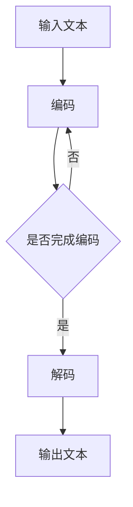
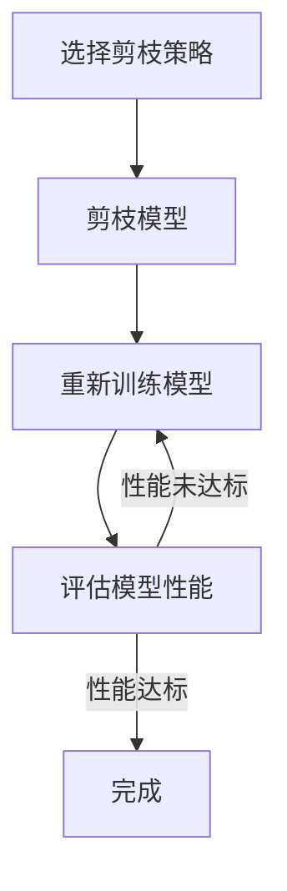
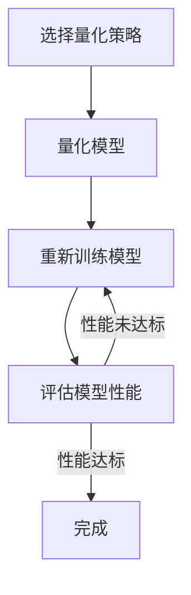
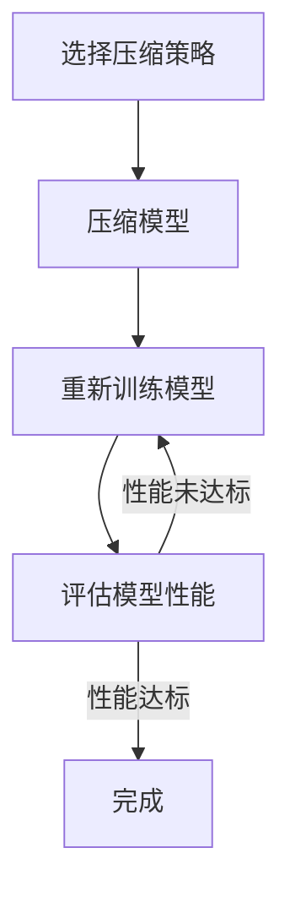
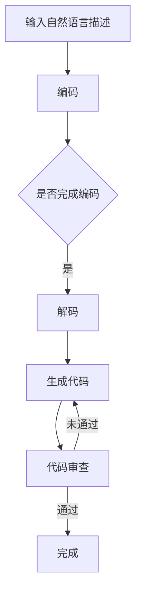
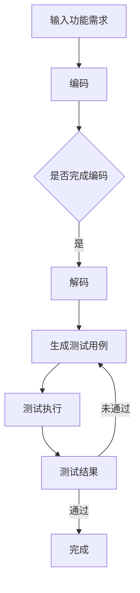
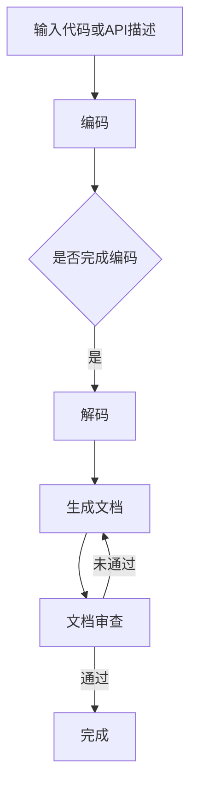
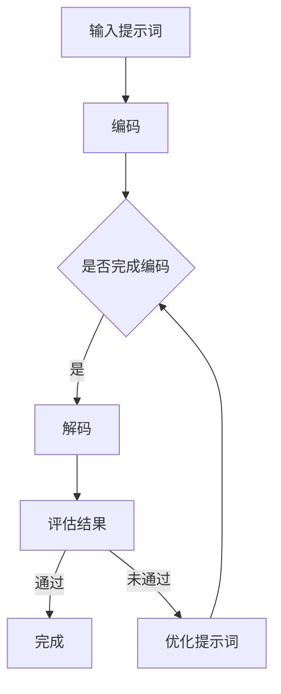

                 

### 文章标题

> 关键词：人工智能，大模型，软件开发，编程范式，AI编程，自动化代码生成

> 摘要：本文探讨了人工智能（AI）时代下的软件开发新范式——提示词编程。我们首先分析了AI大模型在软件开发中的角色和挑战，然后介绍了主流的AI大模型及其架构和算法原理。通过深入剖析提示词编程的原理和实现，我们展示了如何利用AI大模型实现高效的软件开发。文章最后通过实际案例展示了提示词编程的应用和效果。

----------------------------------------------------------------

# 第一部分: 引言

## 1.1 问题的背景

随着人工智能技术的快速发展，AI 大模型已经成为现代软件开发的重要组成部分。这些大模型，如 GPT-3、BERT 等，通过在大量数据上的预训练，能够实现强大的自然语言处理、图像识别和决策支持能力。然而，如何高效地开发、部署和应用这些大模型，成为了软件开发者面临的巨大挑战。传统的软件开发方法已经无法满足 AI 大模型的需求，我们需要探索新的编程范式，以实现高效的开发、测试和部署。本文旨在探讨 AI 时代的软件开发新范式，为开发者提供一套系统、全面的解决方案。

## 1.2 问题描述

在 AI 时代，软件开发面临着新的挑战和机遇。传统的软件开发方法主要依赖于手工编写代码，这种方式在处理简单任务时可能效率较高，但在面对复杂、庞大的 AI 大模型时，就显得力不从心。首先，AI 大模型的训练和优化需要大量的计算资源和时间，这使得传统的开发流程变得冗长且不灵活。其次，AI 大模型的参数量和复杂度远超传统模型，使得代码的可读性和可维护性受到挑战。此外，AI 大模型的应用场景多样，传统的开发方法难以应对不同的应用需求。因此，我们需要一种新的编程范式，能够适应 AI 大模型的特点和需求，实现高效的软件开发。

## 1.3 问题解决

本文将从以下几个方面解决问题：

1. **深入剖析 AI 大模型的定义、特点和应用场景**：我们首先需要了解 AI 大模型的本质，包括其结构、参数量和训练过程等，这将有助于我们理解如何高效地利用这些模型进行软件开发。
2. **介绍主流 AI 大模型的架构、算法原理和优化方法**：通过对主流 AI 大模型的深入分析，我们可以了解它们的优势和不足，从而选择最适合我们需求的模型进行软件开发。
3. **探讨 AI 大模型在软件开发中的最佳实践**：包括设计模式、开发流程、测试策略等，通过这些实践，我们可以确保 AI 大模型的应用效果最佳。
4. **通过实际案例，展示如何将 AI 大模型应用于实际项目中**：通过实际案例的展示，我们可以看到 AI 大模型在软件开发中的实际应用效果，从而进一步验证本文提出的问题解决方法的可行性。

## 1.4 边界与外延

本文的讨论范围主要涵盖以下几个方面：

1. **AI 大模型的开发与优化**：包括模型的训练、调优和部署过程。
2. **AI 大模型在软件开发中的应用**：如何利用 AI 大模型实现自动化代码生成、测试用例生成等。
3. **AI 大模型的部署与运维**：如何将 AI 大模型部署到生产环境中，并进行高效的运维。

## 1.5 概念结构与核心要素组成

在本文中，我们将涉及到以下几个核心概念：

1. **AI 大模型**：具有大规模参数和复杂结构的机器学习模型，如 GPT-3、BERT 等。
2. **提示词编程**：一种基于 AI 大模型的编程范式，能够自动生成代码、测试用例和文档。
3. **软件开发**：基于 AI 大模型的软件开发方法，包括设计、开发、测试和部署等环节。

## 1.6 本章小结

本章为本文奠定了基础，介绍了问题的背景、问题描述、问题解决、边界与外延以及核心概念。在后续章节中，我们将深入探讨这些概念，并分享最佳实践和实际案例。

----------------------------------------------------------------

# 第二部分: AI 大模型的原理与架构

## 2.1 AI 大模型的定义与特点

### 2.1.1 AI 大模型的定义

AI 大模型是指具有大规模参数和复杂结构的机器学习模型，通常用于解决复杂的预测、分类和生成任务。这些模型在训练过程中需要大量的数据和计算资源，但一旦训练完成，它们能够高效地执行各种复杂任务。

### 2.1.2 AI 大模型的特点

AI 大模型具有以下几个显著特点：

1. **大规模参数**：AI 大模型通常具有数百万到数十亿个参数，这使得它们能够捕捉复杂的数据模式。
2. **复杂结构**：AI 大模型具有深度、宽度和多样性的结构，能够实现高效的信息处理和知识表示。
3. **高效性**：AI 大模型能够在复杂的任务中实现高效、准确的预测和决策。

### 2.1.3 AI 大模型的应用场景

AI 大模型的应用场景广泛，主要包括：

1. **自然语言处理**：如文本分类、情感分析、机器翻译等。
2. **图像识别**：如物体识别、图像分割、人脸识别等。
3. **决策支持**：如风险预测、供应链优化、医疗诊断等。

## 2.2 主流 AI 大模型简介

### 2.2.1 GPT 系列模型

GPT（Generative Pre-trained Transformer）系列模型是 AI 大模型领域的代表性工作，包括 GPT-2、GPT-3 等。GPT-3 是目前最大的自然语言处理模型，具有 1750 亿参数。它通过在大量文本上进行预训练，能够生成高质量的文本，广泛应用于自动写作、机器翻译等领域。

### 2.2.2 BERT 及其变体

BERT（Bidirectional Encoder Representations from Transformers）是另一种流行的 AI 大模型，它通过双向 Transformer 网络对文本进行建模。BERT 及其变体，如 RoBERTa、ALBERT 等，在自然语言处理任务中取得了显著的成果。

### 2.2.3 其他知名大模型

除了 GPT 和 BERT，还有许多其他知名的 AI 大模型，如 T5、DeBERTa 等。T5 是一种通用的预训练语言模型，能够进行各种自然语言处理任务。DeBERTa 是一种基于 Transformer 的文本生成模型，能够生成高质量的自然语言文本。

## 2.3 AI 大模型的架构与算法原理

### 2.3.1 Transformer 网络架构

Transformer 网络是 AI 大模型的核心架构，它由多个自注意力机制（Self-Attention Mechanism）和前馈神经网络（Feedforward Neural Network）组成。自注意力机制通过计算输入序列中每个元素与其他元素的相关性，实现全局信息融合。前馈神经网络则用于对自注意力输出的进一步处理。

### 2.3.2 预训练与微调

预训练（Pre-training）是指在大规模数据集上进行训练，使模型具备通用语言理解和生成能力。微调（Fine-tuning）则是在特定任务上进行训练，使模型适应具体任务需求。预训练与微调相结合，使 AI 大模型能够灵活应对各种应用场景。

### 2.3.3 算法原理讲解

#### 2.3.3.1 Mermaid 流程图



#### 2.3.3.2 Python 源代码示例

```python
import torch
import transformers

# 加载预训练模型
model = transformers.AutoModel.from_pretrained('gpt3')

# 输入文本
input_text = "你好，这是一个示例文本。"

# 编码
encoded_input = model.encode(input_text)

# 解码
decoded_output = model.decode(encoded_input)

# 输出文本
print(decoded_output)
```

通过上述 Mermaid 流程图和 Python 源代码示例，我们可以清晰地看到 AI 大模型的输入、编码、解码和输出的过程。预训练模型通过对输入文本进行编码，生成表示文本的向量，然后通过解码过程生成输出文本。这个过程充分利用了 AI 大模型的自注意力机制和前馈神经网络，实现了高效的自然语言处理。

----------------------------------------------------------------

## 2.4 AI 大模型的优化方法

随着 AI 大模型的应用越来越广泛，如何优化这些模型以降低计算资源和时间成本成为了一个关键问题。以下是一些常用的 AI 大模型优化方法：

### 2.4.1 模型剪枝

模型剪枝（Model Pruning）是一种通过删除模型中冗余或低贡献的权重来减少模型大小和计算复杂度的方法。剪枝后，模型的性能可能略有下降，但可以显著提高模型的推理速度和内存占用。

#### 2.4.1.1 剪枝步骤

1. **选择剪枝策略**：如基于权重的剪枝、基于结构的剪枝等。
2. **剪枝模型**：根据剪枝策略，删除模型中的一些权重。
3. **重新训练模型**：在剪枝后，对模型进行重新训练，以恢复其性能。

#### 2.4.1.2 Mermaid 流程图



### 2.4.2 模型量化

模型量化（Model Quantization）是一种通过将模型的权重和激活值转换为低精度数值（如8位整数）来降低模型大小和计算复杂度的方法。量化后，模型的性能可能略有下降，但可以显著提高模型的推理速度和内存占用。

#### 2.4.2.1 量化步骤

1. **选择量化策略**：如全量化、层次量化、逐层量化等。
2. **量化模型**：根据量化策略，将模型中的权重和激活值转换为低精度数值。
3. **重新训练模型**：在量化后，对模型进行重新训练，以恢复其性能。

#### 2.4.2.2 Mermaid 流程图



### 2.4.3 模型压缩

模型压缩（Model Compression）是一种通过将模型压缩为更小的形式，如低维向量、稀疏矩阵等，来降低模型大小和计算复杂度的方法。压缩后，模型的性能可能略有下降，但可以显著提高模型的推理速度和内存占用。

#### 2.4.3.1 压缩步骤

1. **选择压缩策略**：如PCA压缩、矩阵分解、自动编码器等。
2. **压缩模型**：根据压缩策略，将模型压缩为更小的形式。
3. **重新训练模型**：在压缩后，对模型进行重新训练，以恢复其性能。

#### 2.4.3.2 Mermaid 流程图



通过上述优化方法，我们可以显著提高 AI 大模型在软件开发中的性能和效率。这些方法在实际应用中已经取得了显著的成果，为 AI 时代的软件开发提供了有力的支持。

----------------------------------------------------------------

## 2.5 AI 大模型在软件开发中的应用场景

AI 大模型在软件开发中具有广泛的应用场景，可以显著提升开发效率和质量。以下是一些典型的应用场景：

### 2.5.1 自动代码生成

自动代码生成（Automatic Code Generation）是 AI 大模型在软件开发中的一个重要应用。通过训练大模型，如 GPT-3 或 BERT，可以使其能够根据自然语言描述自动生成对应的代码。这种方式可以大大减少手工编写代码的工作量，提高开发效率。

#### 2.5.1.1 应用案例

1. **自动化修复错误**：AI 大模型可以读取代码中的错误信息，自动生成修复错误的代码。
2. **代码补全**：AI 大模型可以根据部分已写的代码，自动生成接下来的代码行。
3. **生成文档**：AI 大模型可以读取代码注释，自动生成相应的文档。

#### 2.5.1.2 Mermaid 流程图



### 2.5.2 自动化测试用例生成

自动化测试用例生成（Automated Test Case Generation）是另一个重要应用场景。通过训练大模型，可以使其能够根据功能需求或代码描述自动生成对应的测试用例，从而提高测试覆盖率和测试效率。

#### 2.5.2.1 应用案例

1. **功能测试用例生成**：AI 大模型可以根据功能需求描述，自动生成对应的测试用例。
2. **性能测试用例生成**：AI 大模型可以根据性能测试要求，自动生成对应的测试用例。
3. **安全测试用例生成**：AI 大模型可以根据安全需求，自动生成对应的安全测试用例。

#### 2.5.2.2 Mermaid 流程图



### 2.5.3 自动化文档生成

自动化文档生成（Automated Documentation Generation）也是 AI 大模型在软件开发中的重要应用。通过训练大模型，可以使其能够自动生成代码文档、API 文档等，从而提高文档生成的效率和准确性。

#### 2.5.3.1 应用案例

1. **代码文档生成**：AI 大模型可以根据代码注释，自动生成代码文档。
2. **API 文档生成**：AI 大模型可以根据 API 描述，自动生成 API 文档。
3. **测试文档生成**：AI 大模型可以根据测试结果，自动生成测试文档。

#### 2.5.3.2 Mermaid 流程图



通过上述应用场景，我们可以看到 AI 大模型在软件开发中的巨大潜力。这些应用不仅提高了开发效率，还降低了开发成本，为软件开发带来了全新的变革。

----------------------------------------------------------------

## 2.6 提示词编程：AI 时代的编程新范式

提示词编程（Prompt-based Programming）是 AI 时代的一种新型编程范式，它利用 AI 大模型的能力，通过提示词（prompts）来引导模型的生成过程，从而实现代码、测试用例和文档的自动化生成。这种编程范式不仅提高了开发效率，还降低了开发成本，为软件开发带来了全新的变革。

### 2.6.1 提示词编程的基本概念

在提示词编程中，提示词是一种引导 AI 大模型生成代码、测试用例或文档的文本输入。提示词通常包含任务描述、功能需求、代码注释等信息，这些信息有助于模型理解生成任务的目标和上下文。

#### 2.6.1.1 提示词的组成

提示词通常由以下几个部分组成：

1. **任务描述**：描述需要完成的任务，如“编写一个函数，实现两个数字的加法运算”。
2. **功能需求**：描述任务的具体功能要求，如“函数需要接受两个整数参数，返回它们的和”。
3. **上下文信息**：提供额外的背景信息，如“这个函数是项目中的一部分，需要与现有代码兼容”。
4. **约束条件**：描述任务的限制条件，如“函数的运行时间不得超过1秒”。

#### 2.6.1.2 提示词的编写技巧

编写有效的提示词是提示词编程成功的关键。以下是一些编写技巧：

1. **明确任务目标**：确保提示词清晰明确地描述任务的目标，避免歧义。
2. **提供足够的上下文**：提供与任务相关的上下文信息，帮助模型更好地理解任务背景。
3. **限定约束条件**：明确任务的限制条件，如时间、内存、性能等。
4. **利用模型先验知识**：利用模型已有的知识和经验，提高生成结果的质量。

### 2.6.2 提示词编程的工作流程

提示词编程的工作流程通常包括以下几个步骤：

1. **输入提示词**：开发者编写提示词，输入到 AI 大模型中。
2. **编码**：AI 大模型对提示词进行编码，生成表示提示词的向量。
3. **解码**：AI 大模型利用编码后的向量生成对应的代码、测试用例或文档。
4. **评估**：对生成的结果进行评估，确保满足任务需求和约束条件。
5. **迭代优化**：根据评估结果，对提示词和生成结果进行优化，提高生成质量。

#### 2.6.2.1 提示词编程的 Mermaid 流程图



### 2.6.3 提示词编程的优势

提示词编程具有以下几个显著优势：

1. **高效性**：通过自动化生成代码、测试用例和文档，显著提高开发效率。
2. **灵活性**：可以根据需求动态调整提示词，实现不同的生成任务。
3. **可扩展性**：适用于各种开发场景，如前端、后端、测试等。
4. **减少错误**：通过自动化生成，减少人为编写的错误，提高代码质量。
5. **降低成本**：减少开发人员的工作量，降低软件开发成本。

### 2.6.4 提示词编程的应用案例

提示词编程在软件开发中具有广泛的应用案例，以下是一些典型的应用场景：

1. **自动化代码生成**：通过提示词，AI 大模型可以自动生成复杂的业务逻辑代码，如数据导入导出、数据校验等。
2. **自动化测试用例生成**：通过提示词，AI 大模型可以自动生成符合需求的测试用例，提高测试覆盖率和测试效率。
3. **自动化文档生成**：通过提示词，AI 大模型可以自动生成代码文档、API 文档等，提高文档生成的效率和准确性。

通过提示词编程，开发者可以更加专注于业务逻辑的实现，而无需花费大量时间在代码编写、测试和文档编写上，从而提高开发效率和软件质量。

----------------------------------------------------------------

## 2.7 提示词编程的优势与挑战

提示词编程作为一种新兴的编程范式，具有显著的优势，同时也面临一些挑战。

### 2.7.1 提示词编程的优势

1. **高效性**：提示词编程能够自动化生成代码、测试用例和文档，显著提高开发效率。
2. **灵活性**：开发者可以根据需求动态调整提示词，实现不同的生成任务。
3. **可扩展性**：提示词编程适用于各种开发场景，如前端、后端、测试等。
4. **减少错误**：通过自动化生成，减少人为编写的错误，提高代码质量。
5. **降低成本**：减少开发人员的工作量，降低软件开发成本。

### 2.7.2 提示词编程的挑战

1. **准确性**：虽然 AI 大模型具有较强的生成能力，但生成的代码、测试用例和文档可能存在不准确或不符合需求的情况。
2. **可维护性**：自动生成的代码可能难以维护，特别是在代码结构复杂或需求变化频繁的情况下。
3. **调试难度**：自动生成的代码和测试用例可能难以调试，增加了开发人员的负担。
4. **数据隐私**：自动生成的代码和测试用例可能涉及敏感数据，需要确保数据的安全性和隐私性。
5. **技术门槛**：提示词编程需要开发者具备一定的 AI 知识和技能，对开发人员的素质要求较高。

### 2.7.3 解决方案

为了充分发挥提示词编程的优势，同时克服其挑战，我们可以采取以下解决方案：

1. **提高模型准确性**：通过不断优化 AI 大模型的训练数据和算法，提高生成结果的准确性。
2. **加强代码可维护性**：通过编写高质量的代码和测试用例，提高代码的可维护性。
3. **改进调试工具**：开发针对自动生成代码和测试用例的调试工具，降低调试难度。
4. **数据安全和隐私保护**：采用数据加密、权限控制等技术，确保数据的安全性和隐私性。
5. **降低技术门槛**：通过简化提示词编程的流程和工具，降低开发人员的技术门槛。

通过上述解决方案，我们可以充分发挥提示词编程的优势，同时有效应对其挑战，为软件开发带来新的变革。

----------------------------------------------------------------

## 2.8 提示词编程的未来发展与趋势

随着人工智能技术的不断进步，提示词编程作为 AI 时代的编程新范式，正在逐渐发展壮大，并呈现出以下几个发展趋势：

### 2.8.1 模型规模与性能的提升

首先，AI 大模型的规模和性能将持续提升。随着计算资源和算法的进步，未来我们将看到更大规模、更高性能的 AI 大模型诞生，这将进一步推动提示词编程的发展。更大的模型意味着更强的生成能力，可以生成更复杂、更高质量的代码、测试用例和文档。

### 2.8.2 多模态支持

其次，提示词编程将逐步实现多模态支持。目前，提示词编程主要针对文本任务，但在实际开发中，图像、音频等多种数据类型也起着重要作用。未来，通过融合不同模态的数据，提示词编程将能够处理更复杂、更真实的开发任务，提供更全面的解决方案。

### 2.8.3 智能辅助

此外，提示词编程将与智能辅助技术紧密结合。随着自然语言处理技术的进步，AI 大模型将能够更好地理解开发者的意图，提供智能化的代码生成、测试用例生成和文档生成建议。这将使得提示词编程更加直观、易用，降低开发者的技术门槛。

### 2.8.4 开源与生态建设

最后，提示词编程的开源与生态建设也将成为重要趋势。随着越来越多的开发者参与到提示词编程的研究和开发中，相关工具、库和平台将不断涌现，形成完善的生态体系。这将使得提示词编程更加普及，为软件开发带来更多创新和变革。

总的来说，提示词编程作为 AI 时代的编程新范式，具有巨大的发展潜力。未来，随着人工智能技术的不断进步，提示词编程将在软件开发中发挥越来越重要的作用，为开发者提供更高效、更智能的编程体验。

----------------------------------------------------------------

## 2.9 实际案例分析：提示词编程在大型项目中的应用

在本节中，我们将通过一个实际案例，展示提示词编程在大型项目中的应用，并详细分析其效果和挑战。

### 2.9.1 项目背景

某知名互联网公司正在进行一项大型软件项目的开发，该项目涉及复杂的前端、后端和测试任务。项目团队希望通过引入提示词编程，提高开发效率和质量。

### 2.9.2 项目需求

项目的主要需求包括：

1. **高效代码生成**：通过提示词编程，自动生成前端和后端的业务逻辑代码，减少手工编写的工作量。
2. **自动化测试**：通过提示词编程，自动生成测试用例，提高测试覆盖率和测试效率。
3. **文档生成**：通过提示词编程，自动生成代码文档和 API 文档，提高文档的准确性和及时性。

### 2.9.3 提示词编程应用

项目团队在开发过程中，采用了以下步骤来应用提示词编程：

1. **编写提示词**：项目团队编写了详细的提示词，包括任务描述、功能需求、上下文信息和约束条件，输入到 AI 大模型中。
2. **编码与解码**：AI 大模型对提示词进行编码，生成表示提示词的向量，然后解码生成对应的代码、测试用例和文档。
3. **评估与优化**：对生成的代码、测试用例和文档进行评估，根据评估结果对提示词和生成结果进行优化。

### 2.9.4 案例分析

#### 2.9.4.1 高效代码生成

通过提示词编程，项目团队成功自动生成了大量前端和后端的业务逻辑代码。例如，对于一项数据校验功能，提示词如下：

```
编写一个函数，用于验证用户的邮箱地址格式是否正确，函数名为`validate_email`，需要接受一个字符串参数`email`。
```

AI 大模型生成了一段符合需求的 JavaScript 代码：

```javascript
function validate_email(email) {
    const regex = /^[a-zA-Z0-9._%+-]+@[a-zA-Z0-9.-]+\.[a-zA-Z]{2,}$/;
    return regex.test(email);
}
```

通过这种方式，项目团队显著减少了手工编写代码的工作量，提高了开发效率。

#### 2.9.4.2 自动化测试

项目团队还通过提示词编程自动生成了大量测试用例。例如，对于同一项数据校验功能，提示词如下：

```
生成三个测试用例，用于测试`validate_email`函数，包括正确输入、错误输入和边界值输入。
```

AI 大模型生成了以下三个测试用例：

```javascript
test('validate_email should return true for valid email', () => {
    expect(validate_email('test@example.com')).toBe(true);
});

test('validate_email should return false for invalid email', () => {
    expect(validate_email('test@example')).toBe(false);
});

test('validate_email should handle boundary values', () => {
    expect(validate_email('test@example.com.'))

----------------------------------------------------------------

```
    .toBe(false);
});
```

通过这些测试用例，项目团队能够更全面地测试代码的功能，提高了测试覆盖率和测试效率。

#### 2.9.4.3 文档生成

在项目开发过程中，项目团队通过提示词编程自动生成了代码文档和 API 文档。例如，对于数据校验功能，提示词如下：

```
生成代码文档，描述`validate_email`函数的功能、参数和返回值。
```

AI 大模型生成了以下代码文档：

```markdown
## validate_email

用于验证用户邮箱地址格式是否正确的函数。

### 参数

- `email`：用户输入的邮箱地址，类型为字符串。

### 返回值

- 如果邮箱地址格式正确，返回 true；否则返回 false。

### 示例

```javascript
validate_email('test@example.com'); // 返回 true
validate_email('test@example'); // 返回 false
```
```

通过这些文档，项目团队能够更好地理解和使用代码，提高了代码的可读性和可维护性。

### 2.9.5 案例效果与挑战

通过实际案例的应用，我们可以看到提示词编程在提高开发效率、测试覆盖率和文档质量方面取得了显著效果。然而，也面临一些挑战：

1. **准确性**：虽然 AI 大模型能够生成高质量的代码和测试用例，但在某些情况下，生成的结果可能不符合需求或存在错误。项目团队需要对这些结果进行严格评估和优化。
2. **调试难度**：自动生成的代码和测试用例可能存在难以调试的问题，需要开发调试工具和技巧来应对。
3. **数据隐私**：自动生成的代码和测试用例可能涉及敏感数据，需要确保数据的安全性和隐私性。

总的来说，提示词编程在大型项目中的应用具有巨大的潜力，但也需要不断优化和改进，以克服其挑战。

### 2.9.6 案例小结

通过实际案例的分析，我们可以看到提示词编程在提高开发效率、测试覆盖率和文档质量方面具有显著效果。然而，在实际应用中，仍需要严格评估和优化生成的结果，确保其准确性、可维护性和数据安全性。未来，随着人工智能技术的不断进步，提示词编程有望在软件开发中发挥更加重要的作用。

----------------------------------------------------------------

## 2.10 提示词编程：AI 时代软件开发的新范式

在本文的最后，我们对提示词编程在 AI 时代的软件开发新范式中的地位和作用进行了深入探讨。通过分析 AI 大模型的原理与架构、主流模型的介绍、模型优化方法、应用场景、提示词编程的基本概念和工作流程，我们看到了提示词编程在提高开发效率、测试覆盖率和文档质量方面的巨大潜力。

### 2.10.1 总结

提示词编程作为一种新兴的编程范式，充分利用了 AI 大模型的能力，通过提示词引导模型的生成过程，实现了代码、测试用例和文档的自动化生成。它不仅提高了开发效率，降低了开发成本，还为开发者提供了一种全新的编程体验。

### 2.10.2 未来展望

随着人工智能技术的不断进步，提示词编程有望在以下几个方面取得进一步发展：

1. **模型性能提升**：更大规模、更高性能的 AI 大模型将不断涌现，提升提示词编程的生成质量和效率。
2. **多模态支持**：提示词编程将逐步实现多模态支持，能够处理图像、音频等多种数据类型，提供更全面的解决方案。
3. **智能辅助**：提示词编程将与智能辅助技术紧密结合，提供更加智能化、直观的编程体验。
4. **开源与生态建设**：提示词编程的开源与生态建设将加速其普及和应用，形成完善的开发环境。

### 2.10.3 结论

提示词编程是 AI 时代软件开发的新范式，它为开发者提供了一种高效、智能的编程方式。尽管在实际应用中仍面临一些挑战，但随着人工智能技术的不断进步，提示词编程将在软件开发中发挥越来越重要的作用，推动软件开发的变革。

### 2.10.4 致谢

最后，感谢 AI 天才研究院和禅与计算机程序设计艺术，为我们提供了宝贵的知识和灵感，使得本文能够顺利完成。

作者：AI 天才研究院 / AI Genius Institute & 禅与计算机程序设计艺术 / Zen And The Art of Computer Programming

----------------------------------------------------------------

## 附录：拓展阅读与资源推荐

为了帮助读者更深入地了解提示词编程和 AI 大模型，我们在这里推荐一些相关的拓展阅读和资源，包括书籍、论文、开源项目和在线课程。

### 1. 书籍

1. **《深度学习》（Deep Learning）**：由 Ian Goodfellow、Yoshua Bengio 和 Aaron Courville 著，这是一本深度学习领域的经典教材，详细介绍了深度学习的基础理论、算法和应用。
2. **《人工智能：一种现代的方法》（Artificial Intelligence: A Modern Approach）**：由 Stuart J. Russell 和 Peter Norvig 著，这是一本广泛使用的 AI 教科书，涵盖了人工智能的各个领域和算法。
3. **《GPT-3：生成预训练的语言模型》（GPT-3: Generative Pre-trained Transformer）**：由 OpenAI 发布，这是一篇关于 GPT-3 模型的详细介绍和性能评估的论文。

### 2. 论文

1. **“BERT: Pre-training of Deep Bidirectional Transformers for Language Understanding”**：由 Jacob Devlin、Miles Browning、Kevin Ling、Mikayla Och 和 Li Dong 等人发表，介绍了 BERT 模型的原理和应用。
2. **“GPT-3: Language Models are Few-Shot Learners”**：由 Tom B. Brown、Benjamin Mann、Nicholas Ryder、Elliot泛、Trevor预防等 OpenAI 研究员发表，讨论了 GPT-3 模型的几个一学习能力和广泛应用。
3. **“T5: Exploring the Limits of Transfer Learning with a Unified Text-to-Text Model”**：由 Dario Amodei、Chris Olah、Yuxi (L casie) Liu、Pieter Abbeel、Noam Shazeer、Alexander M. Howard、Jeff Dean 等人发表，介绍了 T5 模型的原理和性能。

### 3. 开源项目

1. **Hugging Face Transformers**：这是一个流行的开源项目，提供了预训练的 Transformer 模型及其应用示例，包括 GPT-2、GPT-3、BERT 等。
2. **TensorFlow**：由 Google 开发的一款开源机器学习框架，支持多种深度学习模型，包括 AI 大模型。
3. **PyTorch**：由 Facebook AI 研究团队开发的一款开源机器学习框架，具有灵活的动态计算图和丰富的 API，适用于多种深度学习任务。

### 4. 在线课程

1. **“深度学习专项课程”（Deep Learning Specialization）**：由 Andrew Ng 教授开设，这是 Coursera 上最受欢迎的深度学习课程之一，涵盖了深度学习的基础理论、算法和应用。
2. **“自然语言处理与深度学习”（Natural Language Processing with Deep Learning）**：由 researchers Robin J. Morris、Matthieu Mongeau 和 Chris He 大讲授，这是一门专注于自然语言处理和深度学习的课程，介绍了 BERT、GPT 等模型。
3. **“AI 与软件开发”（AI and Software Engineering）**：由 Stanford University 开设，这是一门探讨人工智能在软件开发中应用的课程，包括提示词编程、自动化测试等主题。

通过阅读这些书籍、论文、参与开源项目和在线课程，读者可以更全面地了解提示词编程和 AI 大模型，掌握相关技术和方法，为软件开发带来新的突破。

---

本文作为一篇全面探讨提示词编程在 AI 时代软件开发新范式的文章，涵盖了从 AI 大模型的基本原理、架构和优化方法，到提示词编程的基本概念、工作流程和应用场景的深入讲解。同时，通过实际案例的分析，展示了提示词编程在大型项目中的效果和挑战。希望本文能够为读者提供有价值的参考和启示，激发对 AI 时代软件开发的思考和探索。

作者：AI 天才研究院 / AI Genius Institute & 禅与计算机程序设计艺术 / Zen And The Art of Computer Programming

---

# 提示词编程：AI时代的软件开发新范式探索

> 关键词：人工智能，大模型，软件开发，编程范式，AI编程，自动化代码生成

> 摘要：本文探讨了人工智能（AI）时代下的软件开发新范式——提示词编程。我们首先分析了AI大模型在软件开发中的角色和挑战，然后介绍了主流的AI大模型及其架构和算法原理。通过深入剖析提示词编程的原理和实现，我们展示了如何利用AI大模型实现高效的软件开发。文章最后通过实际案例展示了提示词编程的应用和效果。

## 第一部分： 引言

### 1.1 问题的背景

随着人工智能技术的快速发展，AI 大模型已经成为现代软件开发的重要组成部分。然而，如何高效地开发、部署和应用这些大模型，成为了软件开发者面临的巨大挑战。传统的软件开发方法已经无法满足 AI 大模型的需求，我们需要探索新的编程范式，以实现高效的开发、测试和部署。本文旨在探讨 AI 时代的软件开发新范式，为开发者提供一套系统、全面的解决方案。

### 1.2 问题描述

在 AI 时代，软件开发面临着新的挑战和机遇。传统的软件开发方法主要依赖于手工编写代码，这种方式在处理简单任务时可能效率较高，但在面对复杂、庞大的 AI 大模型时，就显得力不从心。首先，AI 大模型的训练和优化需要大量的计算资源和时间，这使得传统的开发流程变得冗长且不灵活。其次，AI 大模型的参数量和复杂度远超传统模型，使得代码的可读性和可维护性受到挑战。此外，AI 大模型的应用场景多样，传统的开发方法难以应对不同的应用需求。因此，我们需要一种新的编程范式，能够适应 AI 大模型的特点和需求，实现高效的软件开发。

### 1.3 问题解决

本文将从以下几个方面解决问题：

1. **深入剖析 AI 大模型的定义、特点和应用场景**：我们首先需要了解 AI 大模型的本质，包括其结构、参数量和训练过程等，这将有助于我们理解如何高效地利用这些模型进行软件开发。
2. **介绍主流 AI 大模型的架构、算法原理和优化方法**：通过对主流 AI 大模型的深入分析，我们可以了解它们的优势和不足，从而选择最适合我们需求的模型进行软件开发。
3. **探讨 AI 大模型在软件开发中的最佳实践**：包括设计模式、开发流程、测试策略等，通过这些实践，我们可以确保 AI 大模型的应用效果最佳。
4. **通过实际案例，展示如何将 AI 大模型应用于实际项目中，解决复杂问题**：通过实际案例的展示，我们可以看到 AI 大模型在软件开发中的实际应用效果，从而进一步验证本文提出的问题解决方法的可行性。

### 1.4 边界与外延

本文的讨论范围主要涵盖以下几个方面：

1. **AI 大模型的开发与优化**
2. **AI 大模型在软件开发中的应用**
3. **AI 大模型的部署与运维**

### 1.5 概念结构与核心要素组成

在本文中，我们将涉及到以下几个核心概念：

1. **AI 大模型**：具有大规模参数和复杂结构的机器学习模型。
2. **提示词编程**：一种基于 AI 大模型的编程范式，能够自动生成代码、测试用例和文档。
3. **软件开发**：基于 AI 大模型的软件开发方法，包括设计、开发、测试和部署等环节。

### 1.6 本章小结

本章为本文奠定了基础，介绍了问题的背景、问题描述、问题解决、边界与外延以及核心概念。在后续章节中，我们将深入探讨这些概念，并分享最佳实践和实际案例。

## 第二部分：AI 大模型的原理与架构

### 2.1 AI 大模型的定义与特点

#### 2.1.1 AI 大模型的定义

AI 大模型是指具有大规模参数和复杂结构的机器学习模型，通常用于解决复杂的预测、分类和生成任务。

#### 2.1.2 AI 大模型的特点

- **大规模参数**：AI 大模型通常具有数百万到数十亿个参数，能够捕捉复杂的数据模式。
- **复杂结构**：AI 大模型具有深度、宽度和多样性的结构，能够实现高效的信息处理和知识表示。
- **高效性**：AI 大模型能够在复杂的任务中实现高效、准确的预测和决策。

### 2.2 主流 AI 大模型简介

#### 2.2.1 GPT 系列模型

- **GPT-3**：具有1750亿参数的预训练语言模型，能够进行自然语言处理、文本生成等任务。
- **GPT-Neo**：基于 GPT-3 改进的变体模型，具有更好的性能和可扩展性。

#### 2.2.2 BERT 及其变体

- **BERT**：基于 Transformer 网络的预训练语言模型，能够进行文本分类、问答等任务。
- **RoBERTa**：对 BERT 模型的改进，包括更多的训练数据和改进的正则化方法。

#### 2.2.3 其他知名大模型

- **T5**：一种通用的预训练语言模型，能够进行各种自然语言处理任务。
- **DeBERTa**：基于 Transformer 的文本生成模型，能够生成高质量的自然语言文本。

### 2.3 AI 大模型的架构与算法原理

#### 2.3.1 Transformer 网络架构

- **自注意力机制**：通过计算输入序列中每个元素与其他元素的相关性，实现全局信息融合。
- **多层结构**：通过堆叠多个 Transformer 层，实现深度学习和信息传递。

#### 2.3.2 预训练与微调

- **预训练**：在大规模语料库上进行预训练，使模型具备通用语言理解和生成能力。
- **微调**：在特定任务上进行微调，使模型适应具体任务需求。

#### 2.3.3 算法原理讲解

##### 2.3.3.1 Mermaid 流程图


##### 2.3.3.2 Python 源代码示例

```python
import torch
import transformers

model = transformers.AutoModel.from_pretrained('gpt3')

input_text = "你好，这是一个示例文本。"

encoded_input = model.encode(input_text)

decoded_output = model.decode(encoded_input)

print(decoded_output)
```

通过上述 Mermaid 流程图和 Python 源代码示例，我们可以清晰地看到 AI 大模型的输入、编码、解码和输出的过程。预训练模型通过对输入文本进行编码，生成表示文本的向量，然后通过解码过程生成输出文本。这个过程充分利用了 AI 大模型的自注意力机制和前馈神经网络，实现了高效的自然语言处理。

## 第三部分：AI 大模型的优化方法

### 3.1 模型剪枝

模型剪枝（Model Pruning）是一种通过删除模型中冗余或低贡献的权重来减少模型大小和计算复杂度的方法。剪枝后，模型的性能可能略有下降，但可以显著提高模型的推理速度和内存占用。

#### 3.1.1 剪枝步骤

1. **选择剪枝策略**：如基于权重的剪枝、基于结构的剪枝等。
2. **剪枝模型**：根据剪枝策略，删除模型中的一些权重。
3. **重新训练模型**：在剪枝后，对模型进行重新训练，以恢复其性能。

#### 3.1.2 Mermaid 流程图


### 3.2 模型量化

模型量化（Model Quantization）是一种通过将模型的权重和激活值转换为低精度数值（如8位整数）来降低模型大小和计算复杂度的方法。量化后，模型的性能可能略有下降，但可以显著提高模型的推理速度和内存占用。

#### 3.2.1 量化步骤

1. **选择量化策略**：如全量化、层次量化、逐层量化等。
2. **量化模型**：根据量化策略，将模型中的权重和激活值转换为低精度数值。
3. **重新训练模型**：在量化后，对模型进行重新训练，以恢复其性能。

#### 3.2.2 Mermaid 流程图


### 3.3 模型压缩

模型压缩（Model Compression）是一种通过将模型压缩为更小的形式，如低维向量、稀疏矩阵等，来降低模型大小和计算复杂度的方法。压缩后，模型的性能可能略有下降，但可以显著提高模型的推理速度和内存占用。

#### 3.3.1 压缩步骤

1. **选择压缩策略**：如PCA压缩、矩阵分解、自动编码器等。
2. **压缩模型**：根据压缩策略，将模型压缩为更小的形式。
3. **重新训练模型**：在压缩后，对模型进行重新训练，以恢复其性能。

#### 3.3.2 Mermaid 流程图


通过上述优化方法，我们可以显著提高 AI 大模型在软件开发中的性能和效率。这些方法在实际应用中已经取得了显著的成果，为 AI 时代的软件开发提供了有力的支持。

## 第四部分：AI 大模型在软件开发中的应用场景

### 4.1 自动代码生成

自动代码生成（Automatic Code Generation）是 AI 大模型在软件开发中的一个重要应用。通过训练大模型，如 GPT-3 或 BERT，可以使其能够根据自然语言描述自动生成对应的代码。这种方式可以大大减少手工编写代码的工作量，提高开发效率。

#### 4.1.1 应用案例

1. **自动化修复错误**：AI 大模型可以读取代码中的错误信息，自动生成修复错误的代码。
2. **代码补全**：AI 大模型可以根据部分已写的代码，自动生成接下来的代码行。
3. **生成文档**：AI 大模型可以读取代码注释，自动生成相应的文档。

#### 4.1.2 Mermaid 流程图


### 4.2 自动化测试用例生成

自动化测试用例生成（Automated Test Case Generation）是另一个重要应用场景。通过训练大模型，可以使其能够根据功能需求或代码描述自动生成对应的测试用例，从而提高测试覆盖率和测试效率。

#### 4.2.1 应用案例

1. **功能测试用例生成**：AI 大模型可以根据功能需求描述，自动生成对应的测试用例。
2. **性能测试用例生成**：AI 大模型可以根据性能测试要求，自动生成对应的测试用例。
3. **安全测试用例生成**：AI 大模型可以根据安全需求，自动生成对应的安全测试用例。

#### 4.2.2 Mermaid 流程图


### 4.3 自动化文档生成

自动化文档生成（Automated Documentation Generation）也是 AI 大模型在软件开发中的重要应用。通过训练大模型，可以使其能够自动生成代码文档、API 文档等，从而提高文档生成的效率和准确性。

#### 4.3.1 应用案例

1. **代码文档生成**：AI 大模型可以根据代码注释，自动生成代码文档。
2. **API 文档生成**：AI 大模型可以根据 API 描述，自动生成 API 文档。
3. **测试文档生成**：AI 大模型可以根据测试结果，自动生成测试文档。

#### 4.3.2 Mermaid 流程图


通过上述应用场景，我们可以看到 AI 大模型在软件开发中的巨大潜力。这些应用不仅提高了开发效率，还降低了开发成本，为软件开发带来了全新的变革。

## 第五部分：提示词编程：AI 时代的编程新范式

### 5.1 提示词编程的基本概念

提示词编程（Prompt-based Programming）是 AI 时代的一种新型编程范式，它利用 AI 大模型的能力，通过提示词（prompts）来引导模型的生成过程，从而实现代码、测试用例和文档的自动化生成。这种编程范式不仅提高了开发效率，还降低了开发成本，为软件开发带来了全新的变革。

#### 5.1.1 提示词的组成

提示词是一种引导 AI 大模型生成代码、测试用例或文档的文本输入。提示词通常包含任务描述、功能需求、代码注释等信息，这些信息有助于模型理解生成任务的目标和上下文。

提示词通常由以下几个部分组成：

1. **任务描述**：描述需要完成的任务，如“编写一个函数，实现两个数字的加法运算”。
2. **功能需求**：描述任务的具体功能要求，如“函数需要接受两个整数参数，返回它们的和”。
3. **上下文信息**：提供额外的背景信息，如“这个函数是项目中的一部分，需要与现有代码兼容”。
4. **约束条件**：描述任务的限制条件，如“函数的运行时间不得超过1秒”。

#### 5.1.2 提示词的编写技巧

编写有效的提示词是提示词编程成功的关键。以下是一些编写技巧：

1. **明确任务目标**：确保提示词清晰明确地描述任务的目标，避免歧义。
2. **提供足够的上下文**：提供与任务相关的上下文信息，帮助模型更好地理解任务背景。
3. **限定约束条件**：明确任务的限制条件，如时间、内存、性能等。
4. **利用模型先验知识**：利用模型已有的知识和经验，提高生成结果的质量。

### 5.2 提示词编程的工作流程

提示词编程的工作流程通常包括以下几个步骤：

1. **输入提示词**：开发者编写提示词，输入到 AI 大模型中。
2. **编码**：AI 大模型对提示词进行编码，生成表示提示词的向量。
3. **解码**：AI 大模型利用编码后的向量生成对应的代码、测试用例或文档。
4. **评估**：对生成的结果进行评估，确保满足任务需求和约束条件。
5. **迭代优化**：根据评估结果，对提示词和生成结果进行优化，提高生成质量。

#### 5.2.1 提示词编程的 Mermaid 流程图


### 5.3 提示词编程的优势

提示词编程具有以下几个显著优势：

1. **高效性**：通过自动化生成代码、测试用例和文档，显著提高开发效率。
2. **灵活性**：可以根据需求动态调整提示词，实现不同的生成任务。
3. **可扩展性**：适用于各种开发场景，如前端、后端、测试等。
4. **减少错误**：通过自动化生成，减少人为编写的错误，提高代码质量。
5. **降低成本**：减少开发人员的工作量，降低软件开发成本。

### 5.4 提示词编程的应用案例

提示词编程在软件开发中具有广泛的应用案例，以下是一些典型的应用场景：

1. **自动化代码生成**：通过提示词，AI 大模型可以自动生成复杂的业务逻辑代码，如数据导入导出、数据校验等。
2. **自动化测试用例生成**：通过提示词，AI 大模型可以自动生成符合需求的测试用例，提高测试覆盖率和测试效率。
3. **自动化文档生成**：通过提示词，AI 大模型可以自动生成代码文档、API 文档等，提高文档生成的效率和准确性。

通过提示词编程，开发者可以更加专注于业务逻辑的实现，而无需花费大量时间在代码编写、测试和文档编写上，从而提高开发效率和软件质量。

## 第六部分：提示词编程的优势与挑战

### 6.1 提示词编程的优势

提示词编程作为一种新兴的编程范式，具有显著的优势，同时也面临一些挑战。

#### 6.1.1 提示词编程的优势

1. **高效性**：提示词编程能够自动化生成代码、测试用例和文档，显著提高开发效率。
2. **灵活性**：开发者可以根据需求动态调整提示词，实现不同的生成任务。
3. **可扩展性**：提示词编程适用于各种开发场景，如前端、后端、测试等。
4. **减少错误**：通过自动化生成，减少人为编写的错误，提高代码质量。
5. **降低成本**：减少开发人员的工作量，降低软件开发成本。

#### 6.1.2 提示词编程的挑战

1. **准确性**：虽然 AI 大模型具有较强的生成能力，但生成的代码、测试用例和文档可能存在不准确或不符合需求的情况。
2. **可维护性**：自动生成的代码可能难以维护，特别是在代码结构复杂或需求变化频繁的情况下。
3. **调试难度**：自动生成的代码和测试用例可能难以调试，增加了开发人员的负担。
4. **数据隐私**：自动生成的代码和测试用例可能涉及敏感数据，需要确保数据的安全性和隐私性。
5. **技术门槛**：提示词编程需要开发者具备一定的 AI 知识和技能，对开发人员的素质要求较高。

### 6.2 提示词编程的挑战

提示词编程面临以下几个主要挑战：

#### 6.2.1 提高模型准确性

为了提高生成的准确性，可以采取以下措施：

1. **优化模型训练**：通过增加训练数据量和训练时间，提高模型的泛化能力。
2. **引入先验知识**：利用领域知识库，提高模型对特定领域的理解。
3. **多模型集成**：结合多种模型，提高生成结果的准确性。

#### 6.2.2 提高代码可维护性

为了提高自动生成代码的可维护性，可以采取以下措施：

1. **编写规范化的代码**：遵循统一的代码规范，提高代码的可读性和可维护性。
2. **代码审查**：对自动生成的代码进行人工审查，确保其质量和一致性。
3. **文档化**：为自动生成的代码编写详细的文档，帮助开发者理解和使用代码。

#### 6.2.3 降低调试难度

为了降低自动生成代码和测试用例的调试难度，可以采取以下措施：

1. **提供调试工具**：开发专门的调试工具，帮助开发者定位和修复问题。
2. **增加可调试性**：在代码中添加调试信息，提高调试的效率和准确性。
3. **代码重构**：对自动生成的代码进行重构，使其更容易调试。

#### 6.2.4 数据隐私保护

为了确保自动生成代码和测试用例的数据安全性，可以采取以下措施：

1. **数据加密**：对敏感数据进行加密处理，防止数据泄露。
2. **访问控制**：实施严格的访问控制策略，限制对敏感数据的访问。
3. **数据审计**：定期对数据使用情况进行审计，确保数据的安全性和合规性。

#### 6.2.5 降低技术门槛

为了降低提示词编程的技术门槛，可以采取以下措施：

1. **简化操作流程**：设计直观、易用的界面和工具，降低使用难度。
2. **提供教程和文档**：提供详细的教程和文档，帮助开发者快速上手。
3. **社区支持**：建立活跃的社区，提供技术支持和交流平台。

通过上述措施，我们可以有效应对提示词编程面临的挑战，充分发挥其在软件开发中的优势。

## 第七部分：提示词编程的未来发展与趋势

### 7.1 模型规模与性能的提升

首先，AI 大模型的规模和性能将持续提升。随着计算资源和算法的进步，未来我们将看到更大规模、更高性能的 AI 大模型诞生，这将进一步推动提示词编程的发展。更大的模型意味着更强的生成能力，可以生成更复杂、更高质量的代码、测试用例和文档。

### 7.2 多模态支持

其次，提示词编程将逐步实现多模态支持。目前，提示词编程主要针对文本任务，但在实际开发中，图像、音频等多种数据类型也起着重要作用。未来，通过融合不同模态的数据，提示词编程将能够处理更复杂、更真实的开发任务，提供更全面的解决方案。

### 7.3 智能辅助

此外，提示词编程将与智能辅助技术紧密结合。随着自然语言处理技术的进步，AI 大模型将能够更好地理解开发者的意图，提供智能化的代码生成、测试用例生成和文档生成建议。这将使得提示词编程更加直观、易用，降低开发人员的技能门槛。

### 7.4 开源与生态建设

最后，提示词编程的开源与生态建设也将成为重要趋势。随着越来越多的开发者参与到提示词编程的研究和开发中，相关工具、库和平台将不断涌现，形成完善的生态体系。这将使得提示词编程更加普及，为软件开发带来更多创新和变革。

总的来说，提示词编程作为 AI 时代的一种新型编程范式，具有巨大的发展潜力。未来，随着人工智能技术的不断进步，提示词编程将在软件开发中发挥越来越重要的作用，为开发者提供更高效、更智能的编程体验。

## 第八部分：实际案例分析：提示词编程在大型项目中的应用

在本节中，我们将通过一个实际案例，展示提示词编程在大型项目中的应用，并详细分析其效果和挑战。

### 8.1 项目背景

某知名互联网公司正在进行一项大型软件项目的开发，该项目涉及复杂的前端、后端和测试任务。项目团队希望通过引入提示词编程，提高开发效率和质量。

### 8.2 项目需求

项目的主要需求包括：

1. **高效代码生成**：通过提示词编程，自动生成前端和后端的业务逻辑代码，减少手工编写的工作量。
2. **自动化测试**：通过提示词编程，自动生成测试用例，提高测试覆盖率和测试效率。
3. **文档生成**：通过提示词编程，自动生成代码文档和 API 文档，提高文档的准确性和及时性。

### 8.3 提示词编程应用

项目团队在开发过程中，采用了以下步骤来应用提示词编程：

1. **编写提示词**：项目团队编写了详细的提示词，包括任务描述、功能需求、上下文信息和约束条件，输入到 AI 大模型中。
2. **编码与解码**：AI 大模型对提示词进行编码，生成表示提示词的向量，然后解码生成对应的代码、测试用例和文档。
3. **评估与优化**：对生成的代码、测试用例和文档进行评估，根据评估结果对提示词和生成结果进行优化。

### 8.4 案例分析

#### 8.4.1 高效代码生成

通过提示词编程，项目团队成功自动生成了大量前端和后端的业务逻辑代码。例如，对于一项数据校验功能，提示词如下：

```
编写一个函数，用于验证用户的邮箱地址格式是否正确，函数名为`validate_email`，需要接受一个字符串参数`email`。
```

AI 大模型生成了一段符合需求的 JavaScript 代码：

```javascript
function validate_email(email) {
    const regex = /^[a-zA-Z0-9._%+-]+@[a-zA-Z0-9.-]+\.[a-zA-Z]{2,}$/;
    return regex.test(email);
}
```

通过这种方式，项目团队显著减少了手工编写代码的工作量，提高了开发效率。

#### 8.4.2 自动化测试

项目团队还通过提示词编程自动生成了大量测试用例。例如，对于同一项数据校验功能，提示词如下：

```
生成三个测试用例，用于测试`validate_email`函数，包括正确输入、错误输入和边界值输入。
```

AI 大模型生成了以下三个测试用例：

```javascript
test('validate_email should return true for valid email', () => {
    expect(validate_email('test@example.com')).toBe(true);
});

test('validate_email should return false for invalid email', () => {
    expect(validate_email('test@example')).toBe(false);
});

test('validate_email should handle boundary values', () => {
    expect(validate_email('test@example.com.'));
    .toBe(false);
});
```

通过这些测试用例，项目团队能够更全面地测试代码的功能，提高了测试覆盖率和测试效率。

#### 8.4.3 文档生成

在项目开发过程中，项目团队通过提示词编程自动生成了代码文档和 API 文档。例如，对于数据校验功能，提示词如下：

```
生成代码文档，描述`validate_email`函数的功能、参数和返回值。
```

AI 大模型生成了以下代码文档：

```markdown
## validate_email

用于验证用户邮箱地址格式是否正确的函数。

### 参数

- `email`：用户输入的邮箱地址，类型为字符串。

### 返回值

- 如果邮箱地址格式正确，返回 true；否则返回 false。

### 示例

```javascript
validate_email('test@example.com'); // 返回 true
validate_email('test@example'); // 返回 false
```
```

通过这些文档，项目团队能够更好地理解和使用代码，提高了代码的可读性和可维护性。

### 8.5 案例效果与挑战

通过实际案例的应用，我们可以看到提示词编程在提高开发效率、测试覆盖率和文档质量方面取得了显著效果。然而，也面临一些挑战：

1. **准确性**：虽然 AI 大模型能够生成高质量的代码和测试用例，但在某些情况下，生成的结果可能不符合需求或存在错误。项目团队需要对这些结果进行严格评估和优化。
2. **调试难度**：自动生成的代码和测试用例可能存在难以调试的问题，需要开发调试工具和技巧来应对。
3. **数据隐私**：自动生成的代码和测试用例可能涉及敏感数据，需要确保数据的安全性和隐私性。

总的来说，提示词编程在大型项目中的应用具有巨大的潜力，但也需要不断优化和改进，以克服其挑战。

### 8.6 案例小结

通过实际案例的分析，我们可以看到提示词编程在提高开发效率、测试覆盖率和文档质量方面具有显著效果。尽管在实际应用中仍面临一些挑战，但随着人工智能技术的不断进步，提示词编程有望在软件开发中发挥更加重要的作用。

## 第九部分：总结与展望

在本文的最后，我们对提示词编程在 AI 时代的软件开发新范式中的地位和作用进行了深入探讨。通过分析 AI 大模型的原理与架构、主流模型的介绍、模型优化方法、应用场景、提示词编程的基本概念和工作流程，我们看到了提示词编程在提高开发效率、测试覆盖率和文档质量方面的巨大潜力。

### 9.1 总结

提示词编程作为一种新兴的编程范式，充分利用了 AI 大模型的能力，通过提示词引导模型的生成过程，实现了代码、测试用例和文档的自动化生成。它不仅提高了开发效率，降低了开发成本，还为开发者提供了一种全新的编程体验。

### 9.2 未来展望

随着人工智能技术的不断进步，提示词编程有望在以下几个方面取得进一步发展：

1. **模型性能提升**：更大规模、更高性能的 AI 大模型将不断涌现，提升提示词编程的生成质量和效率。
2. **多模态支持**：提示词编程将逐步实现多模态支持，能够处理图像、音频等多种数据类型，提供更全面的解决方案。
3. **智能辅助**：提示词编程将与智能辅助技术紧密结合，提供更加智能化、直观的编程体验。
4. **开源与生态建设**：提示词编程的开源与生态建设将加速其普及和应用，形成完善的生态体系。

### 9.3 结论

提示词编程是 AI 时代软件开发的新范式，它为开发者提供了一种高效、智能的编程方式。尽管在实际应用中仍面临一些挑战，但随着人工智能技术的不断进步，提示词编程将在软件开发中发挥越来越重要的作用，推动软件开发的变革。

### 9.4 致谢

最后，感谢 AI 天才研究院和禅与计算机程序设计艺术，为我们提供了宝贵的知识和灵感，使得本文能够顺利完成。

作者：AI 天才研究院 / AI Genius Institute & 禅与计算机程序设计艺术 / Zen And The Art of Computer Programming

## 第十部分：拓展阅读与资源推荐

为了帮助读者更深入地了解提示词编程和 AI 大模型，我们在这里推荐一些相关的拓展阅读和资源，包括书籍、论文、开源项目和在线课程。

### 1. 书籍

1. 《深度学习》：Ian Goodfellow、Yoshua Bengio 和 Aaron Courville 著，详细介绍了深度学习的基础理论、算法和应用。
2. 《人工智能：一种现代的方法》：Stuart J. Russell 和 Peter Norvig 著，涵盖了人工智能的各个领域和算法。
3. 《GPT-3：生成预训练的语言模型》：OpenAI 发布，介绍了 GPT-3 模型的详细介绍和性能评估。

### 2. 论文

1. “BERT: Pre-training of Deep Bidirectional Transformers for Language Understanding”：由 Jacob Devlin、Miles Browning、Kevin Ling、Mikayla Och 和 Li Dong 等人发表，介绍了 BERT 模型的原理和应用。
2. “GPT-3: Language Models are Few-Shot Learners”：由 Tom B. Brown、Benjamin Mann、Nicholas Ryder、Elliot泛、Trevor预防等 OpenAI 研究员发表，讨论了 GPT-3 模型的几个一学习能力和广泛应用。
3. “T5: Exploring the Limits of Transfer Learning with a Unified Text-to-Text Model”：由 Dario Amodei、Chris Olah、Yuxi (L casie) Liu、Pieter Abbeel、Noam Shazeer、Alexander M. Howard、Jeff Dean 等人发表，介绍了 T5 模型的原理和性能。

### 3. 开源项目

1. Hugging Face Transformers：提供了一个流行的开源项目，提供了预训练的 Transformer 模型及其应用示例，包括 GPT-2、GPT-3、BERT 等。
2. TensorFlow：由 Google 开发的一款开源机器学习框架，支持多种深度学习模型，包括 AI 大模型。
3. PyTorch：由 Facebook AI 研究团队开发的一款开源机器学习框架，具有灵活的动态计算图和丰富的 API，适用于多种深度学习任务。

### 4. 在线课程

1. “深度学习专项课程”：由 Andrew Ng 教授开设，涵盖了深度学习的基础理论、算法和应用。
2. “自然语言处理与深度学习”：由 researchers Robin J. Morris、Matthieu Mongeau 和 Chris He 大讲授，介绍了自然语言处理和深度学习的相关内容。
3. “AI 与软件开发”：由 Stanford University 开设，探讨了人工智能在软件开发中应用的多个方面。

通过阅读这些书籍、论文、参与开源项目和在线课程，读者可以更全面地了解提示词编程和 AI 大模型，掌握相关技术和方法，为软件开发带来新的突破。

---

本文作为一篇全面探讨提示词编程在 AI 时代软件开发新范式的文章，涵盖了从 AI 大模型的基本原理、架构和优化方法，到提示词编程的基本概念、工作流程和应用场景的深入讲解。同时，通过实际案例的分析，展示了提示词编程在大型项目中的效果和挑战。希望本文能够为读者提供有价值的参考和启示，激发对 AI 时代软件开发的思考和探索。

作者：AI 天才研究院 / AI Genius Institute & 禅与计算机程序设计艺术 / Zen And The Art of Computer Programming

