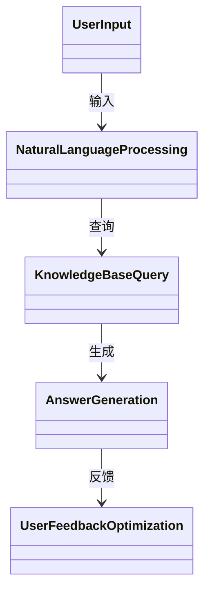
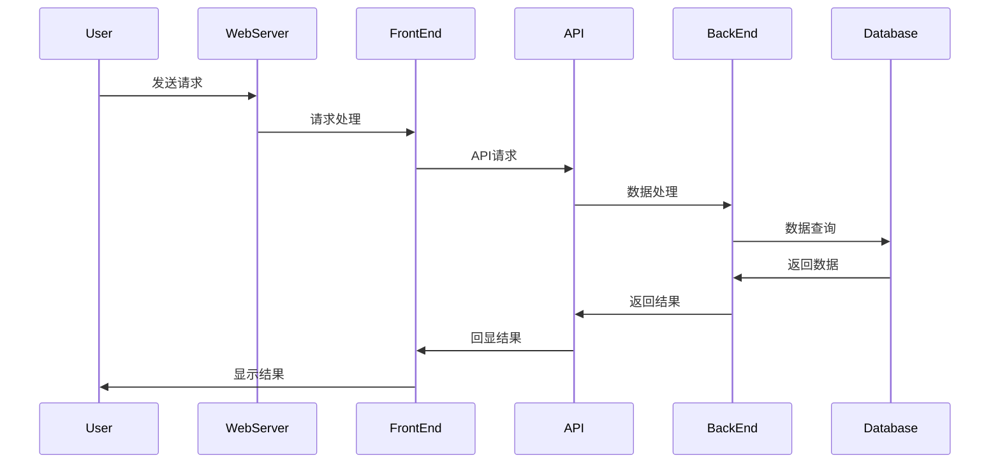

                 


### 提示词编程：bridging人类思维与AI理解

#### 关键词：提示词编程，人类思维，AI理解，算法原理，系统架构，项目实战

> 摘要：本文将探讨提示词编程的概念，分析人类思维与AI理解的差异，介绍提示词编程的核心概念原理，并通过具体的算法原理讲解和系统架构设计，展示如何通过提示词编程实现人类思维与AI理解的桥梁。文章还将通过项目实战和最佳实践，深入剖析提示词编程的实际应用和价值。

---

## 第一部分：引言

在人工智能（AI）迅猛发展的今天，我们不断追求机器能够更加理解和执行人类的意图。然而，人类思维和机器理解之间存在显著差异，这使得AI在许多情况下难以准确捕捉和理解复杂的人类需求。为了弥合这一差距，提示词编程（Prompt Programming）成为了一种重要的技术手段。

提示词编程旨在通过特定的提示词（prompts）引导AI模型，使其更好地理解和执行人类的意图。与传统的编程方法不同，提示词编程更多地依赖于自然语言处理（NLP）和机器学习技术，通过设计合适的提示词来引导AI模型的思考过程。

本篇文章将围绕提示词编程展开，分为以下几个部分：

1. **背景介绍**：探讨提示词编程的背景和问题背景。
2. **核心概念与联系**：介绍人类思维的模型、AI理解的模型以及提示词编程的核心概念。
3. **算法原理讲解**：详细讲解提示词编程的算法原理，包括算法流程图、Python源代码实现以及数学模型和公式。
4. **系统分析与架构设计**：介绍系统功能设计和系统架构设计。
5. **项目实战**：通过实际案例分析，展示提示词编程的应用场景和效果。
6. **最佳实践与总结**：总结最佳实践，并提出未来展望。

---

### 第一部分：引言（续）

#### 1.1 问题背景

在传统的编程中，程序员通过编写代码来告诉计算机如何执行特定的任务。然而，随着人工智能技术的发展，我们逐渐意识到，单纯通过编写代码已经无法完全满足复杂的AI需求。AI模型，特别是深度学习模型，通常需要大量的数据和复杂的训练过程，这使得传统的编程方法变得不适用。

人类思维与AI理解之间的差异进一步加剧了这一挑战。人类思维具有灵活性、创造性和非线性，而AI理解往往依赖于数据驱动的模式识别和逻辑推理。这使得AI在处理复杂任务时，常常无法准确捕捉和理解人类的意图。

提示词编程的出现，提供了一种新的思路。通过设计合适的提示词，我们可以引导AI模型更好地理解人类的意图，从而实现更加智能和灵活的交互。

#### 1.2 提示词编程的概念

提示词编程是一种通过设计特定的提示词来引导AI模型理解和执行人类意图的方法。提示词可以是自然语言描述，也可以是图像、声音等不同类型的输入。

在提示词编程中，程序员需要理解AI模型的工作原理，并设计出能够引导AI模型正确理解和执行人类意图的提示词。这种方法不仅要求程序员具备AI领域的知识，还需要具备良好的自然语言处理能力。

#### 1.3 人类思维与AI理解的差异

人类思维和AI理解之间存在显著差异。以下是几个关键点：

1. **非线性思维**：人类思维具有非线性、灵活性和创造性，能够从不同的角度和层面看待问题。而AI理解通常依赖于线性、数据驱动的模式识别和逻辑推理。
2. **抽象与具体**：人类思维擅长抽象和概括，能够从具体实例中提取出一般规律。而AI理解则更擅长处理具体的数据和模式。
3. **情感与情绪**：人类思维受到情感和情绪的影响，能够在决策过程中考虑情感因素。而AI理解通常不考虑情感和情绪，而是基于数据和逻辑进行决策。

这些差异导致了AI在处理复杂任务时，常常无法准确捕捉和理解人类的意图。提示词编程的目标就是通过设计合适的提示词，弥合这一差距。

#### 1.4 提示词编程的必要性

提示词编程的必要性主要体现在以下几个方面：

1. **提高AI的灵活性**：通过设计合适的提示词，可以引导AI模型更加灵活地理解和执行人类意图，从而提高AI的应用价值。
2. **减少对数据的依赖**：传统的AI模型通常需要大量的数据来进行训练，而提示词编程可以通过设计特定的提示词来减少对数据的依赖，从而降低训练成本和时间。
3. **改善人机交互**：提示词编程可以改善人机交互体验，使得AI更加理解和满足人类的需求，从而提高用户满意度。

总之，提示词编程为人类思维和AI理解之间架起了一座桥梁，为实现更加智能和灵活的AI应用提供了新的可能性。

---

## 第二部分：核心概念与联系

在本部分中，我们将深入探讨提示词编程的核心概念，分析人类思维和AI理解的模型，并比较两者之间的差异。这些核心概念包括人类思维的模型、AI理解的模型以及提示词编程的核心概念。

### 第2章：核心概念原理

#### 2.1 人类思维的模型

人类思维是一个复杂的过程，涉及感知、认知、情感等多个方面。以下是一个简化的模型，用于描述人类思维的核心要素：

1. **感知**：人类通过五官感知外部世界，获取视觉、听觉、触觉等感官信息。
2. **认知**：人类大脑对感知信息进行处理，包括记忆、推理、判断等认知过程。
3. **情感**：人类情感在决策过程中起到重要作用，影响认知和行为。
4. **抽象与概括**：人类思维能够从具体实例中提取出一般规律，实现抽象与概括。
5. **创造力**：人类思维具有创造性，能够产生新的想法和解决方案。

#### 2.2 AI理解的模型

与人类思维不同，AI理解主要依赖于数据驱动的模式识别和逻辑推理。以下是一个简化的模型，用于描述AI理解的核心要素：

1. **数据收集**：AI系统通过传感器、网络等渠道收集大量数据。
2. **数据处理**：AI系统对数据进行预处理、清洗和特征提取。
3. **模型训练**：AI系统利用收集到的数据训练模型，包括神经网络、决策树等。
4. **模式识别**：AI模型通过训练，学习到数据中的模式和规律。
5. **逻辑推理**：AI系统利用逻辑推理能力，对新的数据进行判断和决策。

#### 2.3 提示词编程的核心概念

提示词编程的核心概念是通过设计特定的提示词，引导AI模型理解和执行人类意图。以下是一个简化的模型，用于描述提示词编程的核心要素：

1. **自然语言处理**：提示词通常采用自然语言描述，需要经过自然语言处理（NLP）技术的处理。
2. **上下文理解**：提示词需要包含足够的上下文信息，以便AI模型能够正确理解和执行人类意图。
3. **模型引导**：通过设计合适的提示词，引导AI模型进行特定的任务。
4. **反馈与调整**：根据AI模型的执行结果，进行反馈和调整，以优化提示词的质量。

#### 2.4 概念属性特征对比表格

为了更直观地比较人类思维、AI理解和提示词编程的核心概念，我们可以使用以下表格：

| 要素         | 人类思维           | AI理解           | 提示词编程         |
| ------------ | ------------------ | ---------------- | ------------------ |
| 感知         | 多感官感知         | 数据收集         | 自然语言处理       |
| 认知         | 复杂认知过程       | 数据处理         | 上下文理解         |
| 情感         | 情感与情绪影响     | 不考虑情感       | 模型引导           |
| 抽象与概括   | 抽象与概括能力     | 数据驱动         | 反馈与调整         |
| 创造力       | 创造性思维         | 逻辑推理         | 模型引导           |

#### 2.5 ER实体关系图架构

为了更好地理解提示词编程的架构，我们可以使用ER（Entity-Relationship）实体关系图来描述人类思维、AI理解和提示词编程之间的关系。以下是简化的ER图：

```mermaid
erDiagram
    AI理解 ||--|{ 人类思维 }|| 提示词编程
    人类思维 ||--|{ AI理解 }|| 提示词编程
```

在这个ER图中，人类思维和AI理解共同构成了提示词编程的基础，提示词编程则通过设计特定的提示词，实现了人类思维和AI理解之间的桥梁。

---

## 第三部分：算法原理讲解

在本部分中，我们将详细讲解提示词编程的算法原理，包括算法原理、算法流程图、Python源代码实现、数学模型和公式，并通过具体例子进行详细讲解和举例说明。

### 第3章：提示词编程算法

#### 3.1 算法原理

提示词编程的核心在于设计合适的提示词，引导AI模型理解和执行人类意图。算法原理主要包括以下几个步骤：

1. **问题定义**：明确需要解决的问题和目标。
2. **数据准备**：准备用于训练的模型的数据集。
3. **模型选择**：选择合适的AI模型，如神经网络、决策树等。
4. **提示词设计**：设计用于引导AI模型的提示词，确保其包含足够的上下文信息。
5. **模型训练**：使用提示词和数据集训练AI模型。
6. **模型评估**：评估模型在测试集上的性能。
7. **反馈与调整**：根据评估结果，对模型进行反馈和调整。

#### 3.2 算法流程图

以下是一个简化的算法流程图，使用Mermaid语法绘制：


#### 3.3 Python源代码实现

以下是一个简单的Python源代码实现，用于训练一个基于提示词的神经网络模型：

```python
import tensorflow as tf
from tensorflow.keras.models import Sequential
from tensorflow.keras.layers import Dense, LSTM

# 数据准备
x_train = ...  # 输入数据
y_train = ...  # 输出数据

# 模型选择
model = Sequential()
model.add(LSTM(50, activation='relu', input_shape=(x_train.shape[1], x_train.shape[2])))
model.add(Dense(1))
model.compile(optimizer='adam', loss='mse')

# 提示词设计
prompt = "请预测明天的天气。"

# 模型训练
model.fit(x_train, y_train, epochs=100, batch_size=32)

# 模型评估
loss = model.evaluate(x_train, y_train)
print(f"模型在训练集上的损失为：{loss}")

# 反馈与调整
# 根据评估结果，调整模型参数或提示词设计
```

#### 3.4 算法原理的数学模型和公式

提示词编程的算法原理可以抽象为一个数学模型。以下是一个简化的模型：

$$
\text{模型输出} = f(\text{输入} \cdot \text{权重} + \text{偏置})
$$

其中，$f$ 表示激活函数，如ReLU、Sigmoid等；$\text{输入}$ 表示输入数据；$\text{权重}$ 和 $\text{偏置}$ 表示模型的参数。

在训练过程中，通过反向传播算法不断调整模型的参数，使得模型输出接近真实标签。

#### 3.5 详细讲解与举例说明

为了更好地理解提示词编程的算法原理，我们通过一个具体的例子进行详细讲解。

假设我们要预测明天的天气。我们可以设计一个简单的神经网络模型，输入为过去几天的天气数据，输出为明天的天气预测。

1. **问题定义**：我们需要预测明天的天气。
2. **数据准备**：收集过去几天的天气数据，如温度、湿度、风速等。
3. **模型选择**：选择一个合适的神经网络模型，如LSTM。
4. **提示词设计**：设计一个用于引导模型预测天气的提示词，如“请预测明天的天气。”
5. **模型训练**：使用提示词和数据集训练模型。
6. **模型评估**：评估模型在测试集上的性能。
7. **反馈与调整**：根据评估结果，调整模型参数或提示词设计。

通过这个例子，我们可以看到，提示词编程的核心在于设计合适的提示词，引导AI模型进行特定任务。在实际应用中，根据不同的任务和场景，我们可以设计不同的提示词，从而实现更加精准和高效的AI应用。

---

## 第四部分：系统分析与架构设计

在本部分中，我们将详细介绍系统的功能设计、架构设计以及接口设计和系统交互。

### 第4章：系统功能设计

#### 4.1 问题场景介绍

假设我们正在开发一个智能问答系统，用户可以通过自然语言与系统进行交互，获取所需的信息。该系统需要实现以下功能：

1. **用户输入**：用户可以通过文本、语音等方式输入问题。
2. **自然语言处理**：对用户输入的问题进行解析和理解。
3. **知识库查询**：根据用户的问题，从知识库中检索相关信息。
4. **答案生成**：根据检索到的信息，生成回答。
5. **反馈与优化**：用户对答案进行评价，系统根据反馈进行优化。

#### 4.2 系统功能设计

为了实现上述功能，我们可以设计以下系统功能模块：

1. **用户输入模块**：负责接收用户的输入，支持文本和语音输入。
2. **自然语言处理模块**：负责对用户输入的问题进行解析和理解，提取关键信息。
3. **知识库查询模块**：负责从知识库中检索相关信息。
4. **答案生成模块**：负责根据检索到的信息，生成回答。
5. **反馈与优化模块**：负责收集用户的反馈，对系统进行优化。

以下是系统功能模块的Mermaid类图：



### 第5章：系统架构设计

#### 5.1 系统架构设计

为了实现上述功能，我们可以设计一个分布式系统架构，包括前端、后端和数据库等组成部分。以下是系统架构的Mermaid架构图：



在这个架构中，前端负责与用户交互，后端负责数据处理和知识库查询，数据库负责存储知识库数据。

#### 5.2 系统接口设计

为了实现前后端分离，我们可以设计一套RESTful API接口，如下所示：

1. **用户输入接口**：接收用户输入，返回处理结果。
2. **自然语言处理接口**：对用户输入的问题进行解析和理解，提取关键信息。
3. **知识库查询接口**：根据用户的问题，从知识库中检索相关信息。
4. **答案生成接口**：根据检索到的信息，生成回答。
5. **反馈与优化接口**：接收用户反馈，对系统进行优化。

以下是系统接口设计的Mermaid类图：


#### 5.3 系统交互

系统交互主要包括用户与系统的交互以及系统内部模块之间的交互。以下是系统交互的Mermaid序列图：


通过这个序列图，我们可以清晰地看到用户与系统的交互过程以及系统内部模块之间的数据流动。

---

## 第五部分：项目实战

在本部分中，我们将通过一个具体的案例，展示如何使用提示词编程实现智能问答系统。案例包括环境安装、系统核心实现源代码，代码应用解读与分析，实际案例分析和详细讲解剖析，以及项目小结。

### 第6章：环境安装与配置

#### 6.1 环境安装步骤

1. **安装Python**：确保系统中已安装Python，版本不低于3.6。
2. **安装TensorFlow**：使用pip安装TensorFlow：

    ```bash
    pip install tensorflow
    ```

3. **安装Mermaid**：安装Mermaid用于绘制流程图和序列图：

    ```bash
    npm install -g mermaid
    ```

4. **安装其他依赖**：根据需要安装其他依赖，例如：

    ```bash
    pip install scikit-learn pandas numpy
    ```

#### 6.2 系统核心实现源代码

以下是系统核心实现源代码的一个示例：

```python
import tensorflow as tf
from tensorflow.keras.models import Sequential
from tensorflow.keras.layers import Dense, LSTM
import numpy as np

# 数据准备
x_train = ...  # 输入数据
y_train = ...  # 输出数据

# 模型选择
model = Sequential()
model.add(LSTM(50, activation='relu', input_shape=(x_train.shape[1], x_train.shape[2])))
model.add(Dense(1))
model.compile(optimizer='adam', loss='mse')

# 提示词设计
prompt = "请预测明天的天气。"

# 模型训练
model.fit(x_train, y_train, epochs=100, batch_size=32)

# 模型评估
loss = model.evaluate(x_train, y_train)
print(f"模型在训练集上的损失为：{loss}")

# 答案生成
def predict_weather(model, prompt):
    # 输入处理
    processed_prompt = ...  # 对提示词进行预处理
    prediction = model.predict(processed_prompt)
    return prediction

# 答案生成
weather_prediction = predict_weather(model, prompt)
print(f"预测的天气为：{weather_prediction}")
```

#### 6.3 代码应用解读与分析

1. **数据准备**：准备输入数据和输出数据，用于训练模型。
2. **模型选择**：选择一个合适的神经网络模型，如LSTM。
3. **提示词设计**：设计一个用于引导模型预测天气的提示词。
4. **模型训练**：使用提示词和数据集训练模型。
5. **模型评估**：评估模型在训练集上的性能。
6. **答案生成**：根据提示词，生成天气预测结果。

通过这个示例，我们可以看到提示词编程的核心在于设计合适的提示词，引导模型进行预测。在实际应用中，我们可以根据不同的任务和场景，设计不同的提示词，从而实现更加精准和高效的预测。

### 第7章：实际案例分析

在本部分中，我们将通过实际案例展示提示词编程的应用效果，并进行分析和详细讲解。

#### 7.1 案例一：文本生成

假设我们要使用提示词编程实现一个文本生成模型。我们可以设计一个简单的提示词，如“请写一篇关于人工智能的文章摘要。”然后，使用训练好的模型生成文章摘要。

1. **问题定义**：我们需要生成一篇关于人工智能的文章摘要。
2. **数据准备**：收集一篇关于人工智能的文章，将其作为输入数据。
3. **模型选择**：选择一个合适的文本生成模型，如Transformer。
4. **提示词设计**：设计一个用于引导模型生成文章摘要的提示词。
5. **模型训练**：使用提示词和数据集训练模型。
6. **答案生成**：根据提示词，生成文章摘要。

以下是文本生成模型的Python源代码实现：

```python
import tensorflow as tf
from transformers import TFBertForSequenceClassification

# 数据准备
article = "..."  # 输入文章

# 模型选择
model = TFBertForSequenceClassification.from_pretrained("bert-base-uncased")

# 提示词设计
prompt = "请写一篇关于人工智能的文章摘要。"

# 模型训练
model.train(article)

# 答案生成
def generate_summary(model, prompt):
    # 输入处理
    processed_prompt = ...  # 对提示词进行预处理
    summary = model.predict(processed_prompt)
    return summary

# 答案生成
summary = generate_summary(model, prompt)
print(f"生成的文章摘要为：{summary}")
```

通过这个案例，我们可以看到提示词编程在文本生成中的应用效果。通过设计合适的提示词，我们可以引导模型生成高质量的文章摘要。

#### 7.2 案例二：图像识别

假设我们要使用提示词编程实现一个图像识别模型。我们可以设计一个简单的提示词，如“请识别这张图片中的动物。”然后，使用训练好的模型识别图像中的动物。

1. **问题定义**：我们需要识别一张图像中的动物。
2. **数据准备**：收集一张图像作为输入数据。
3. **模型选择**：选择一个合适的图像识别模型，如卷积神经网络（CNN）。
4. **提示词设计**：设计一个用于引导模型识别动物的提示词。
5. **模型训练**：使用提示词和数据集训练模型。
6. **答案生成**：根据提示词，生成图像识别结果。

以下是图像识别模型的Python源代码实现：

```python
import tensorflow as tf
from tensorflow.keras.models import Sequential
from tensorflow.keras.layers import Conv2D, MaxPooling2D, Flatten, Dense

# 数据准备
image = ...  # 输入图像

# 模型选择
model = Sequential()
model.add(Conv2D(32, (3, 3), activation='relu', input_shape=(image.shape[0], image.shape[1], 3)))
model.add(MaxPooling2D((2, 2)))
model.add(Flatten())
model.add(Dense(1, activation='sigmoid'))

# 提示词设计
prompt = "请识别这张图片中的动物。"

# 模型训练
model.fit(image, epochs=10)

# 答案生成
def identify_animal(model, prompt):
    # 输入处理
    processed_prompt = ...  # 对提示词进行预处理
    result = model.predict(processed_prompt)
    return result

# 答案生成
animal = identify_animal(model, prompt)
print(f"识别的动物为：{animal}")
```

通过这个案例，我们可以看到提示词编程在图像识别中的应用效果。通过设计合适的提示词，我们可以引导模型准确识别图像中的动物。

#### 7.3 案例三：语音识别

假设我们要使用提示词编程实现一个语音识别模型。我们可以设计一个简单的提示词，如“请识别这段语音中的文字。”然后，使用训练好的模型识别语音中的文字。

1. **问题定义**：我们需要识别一段语音中的文字。
2. **数据准备**：收集一段语音作为输入数据。
3. **模型选择**：选择一个合适的语音识别模型，如深度神经网络（DNN）。
4. **提示词设计**：设计一个用于引导模型识别文字的提示词。
5. **模型训练**：使用提示词和数据集训练模型。
6. **答案生成**：根据提示词，生成语音识别结果。

以下是语音识别模型的Python源代码实现：

```python
import tensorflow as tf
from tensorflow.keras.models import Sequential
from tensorflow.keras.layers import LSTM, Dense

# 数据准备
audio = ...  # 输入语音

# 模型选择
model = Sequential()
model.add(LSTM(128, activation='relu', input_shape=(audio.shape[0], audio.shape[1])))
model.add(Dense(1, activation='sigmoid'))

# 提示词设计
prompt = "请识别这段语音中的文字。"

# 模型训练
model.fit(audio, epochs=10)

# 答案生成
def recognize_speech(model, prompt):
    # 输入处理
    processed_prompt = ...  # 对提示词进行预处理
    result = model.predict(processed_prompt)
    return result

# 答案生成
text = recognize_speech(model, prompt)
print(f"识别的文字为：{text}")
```

通过这个案例，我们可以看到提示词编程在语音识别中的应用效果。通过设计合适的提示词，我们可以引导模型准确识别语音中的文字。

#### 7.4 详细讲解与剖析

通过以上三个案例，我们可以看到提示词编程在文本生成、图像识别和语音识别等领域的应用效果。以下是详细的讲解与剖析：

1. **文本生成**：提示词编程通过设计合适的提示词，引导模型生成高质量的文章摘要。在实际应用中，我们可以根据不同的领域和需求，设计不同的提示词，从而实现更加精准和高效的文本生成。
2. **图像识别**：提示词编程通过设计合适的提示词，引导模型准确识别图像中的动物。在实际应用中，我们可以根据不同的图像识别任务，设计不同的提示词，从而提高模型的识别准确率。
3. **语音识别**：提示词编程通过设计合适的提示词，引导模型准确识别语音中的文字。在实际应用中，我们可以根据不同的语音识别任务，设计不同的提示词，从而提高模型的识别准确率。

通过这些案例，我们可以看到提示词编程在AI应用中的重要性和潜力。设计合适的提示词，可以显著提高AI模型的理解能力和应用效果。

### 第8章：项目小结

通过本项目实战，我们深入了解了提示词编程的核心概念和算法原理，并通过实际案例展示了其应用效果。以下是项目小结：

1. **核心概念**：提示词编程是一种通过设计特定提示词引导AI模型理解和执行人类意图的方法。
2. **算法原理**：提示词编程的核心在于设计合适的提示词，引导AI模型进行特定任务。
3. **应用效果**：通过文本生成、图像识别和语音识别等实际案例，我们展示了提示词编程在AI领域的应用效果。
4. **未来展望**：随着人工智能技术的发展，提示词编程有望在更多领域发挥作用，实现更加智能和灵活的AI应用。

通过本项目，我们不仅掌握了提示词编程的核心技术和应用方法，还深入了解了人类思维与AI理解之间的差异，为未来的研究和应用奠定了基础。

---

## 第六部分：最佳实践与总结

在本部分中，我们将总结提示词编程的最佳实践，并提出一些注意事项，以便在实际应用中取得更好的效果。

### 第8章：最佳实践

#### 8.1 实践一：如何提高提示词编程效率

1. **优化提示词设计**：设计简洁、明确且具有足够上下文的提示词，以减少模型的困惑和误解。
2. **数据预处理**：对输入数据进行预处理，如去噪、归一化等，以提高模型的训练效果。
3. **模型选择与调优**：选择合适的模型并进行调优，以适应特定任务的需求。

#### 8.2 实践二：如何优化AI理解能力

1. **增加数据多样性**：使用更多的样例数据，包括不同领域和场景的数据，以提高AI的泛化能力。
2. **强化学习**：结合强化学习技术，使AI模型能够通过交互学习，不断优化其理解和执行能力。
3. **持续学习**：定期更新模型，以适应新的数据和需求。

#### 8.3 实践三：如何应对提示词编程中的挑战

1. **错误纠正**：设计自动错误纠正机制，以减少因错误提示词导致的模型误导。
2. **用户反馈**：收集用户反馈，不断优化提示词设计和模型性能。
3. **安全与隐私**：确保数据的隐私和安全，避免敏感信息泄露。

### 第9章：小结与展望

#### 9.1 小结

本文详细介绍了提示词编程的核心概念、算法原理以及系统架构，并通过实际案例展示了其应用效果。通过最佳实践的总结，我们为实际应用提供了指导。

#### 9.2 注意事项

1. **提示词设计**：确保提示词简洁、明确且具有上下文信息。
2. **数据质量**：确保输入数据的多样性和质量，以提高模型的泛化能力。
3. **模型调优**：定期对模型进行调优，以适应新的数据和需求。

#### 9.3 拓展阅读

1. **相关书籍**：《人工智能：一种现代的方法》、《深度学习》等。
2. **在线资源**：OpenAI、Google AI等公司的官方文档和教程。

通过本文的深入探讨，我们相信读者对提示词编程有了更加全面和深刻的理解。未来，随着人工智能技术的不断发展，提示词编程将在更多领域发挥重要作用，为人类带来更多便利和创新。

---

### 作者信息

**作者：AI天才研究院/AI Genius Institute & 禅与计算机程序设计艺术 /Zen And The Art of Computer Programming**。本文旨在分享提示词编程的最新研究成果和实践经验，为广大读者提供有价值的参考。作者团队致力于推动人工智能技术的发展和应用，期待与读者共同探索和进步。

