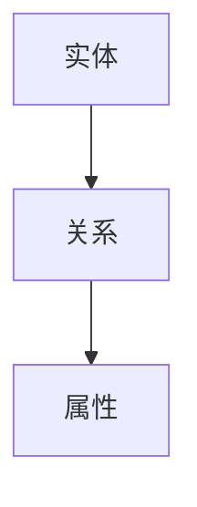
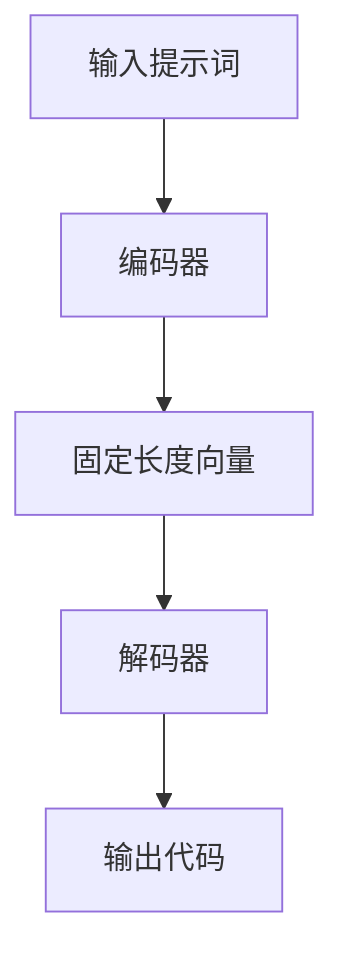
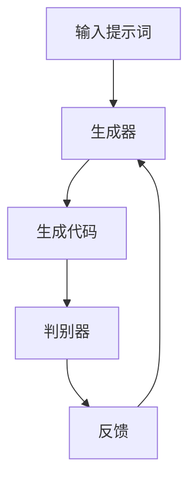
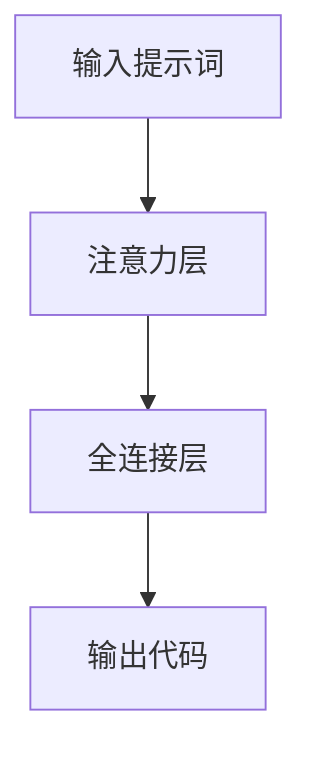
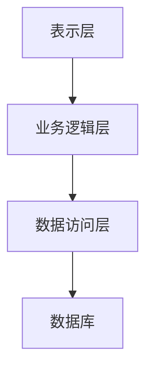
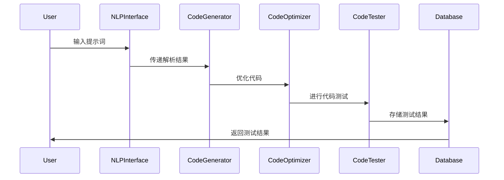
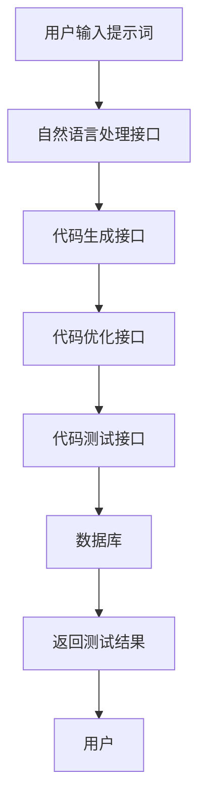

                 

# 提示词编程：bridging人类思维与AI逻辑

## 关键词
- 提示词编程
- 人工智能逻辑
- 自然语言处理
- 深度学习
- 知识图谱

## 摘要
本文旨在探讨提示词编程这一技术，它作为一种桥梁，连接人类思维与计算机逻辑。通过分析自然语言处理、深度学习和知识图谱等核心概念，我们深入探讨提示词编程的原理、应用和未来发展。本文将结合算法原理讲解、数学模型介绍、系统架构设计和实际项目案例，全面解析提示词编程的各个方面，为读者提供深入的技术见解和实用指导。

## 第一部分：背景介绍与核心概念

### 第1章：提示词编程与AI逻辑概述

#### 1.1 问题背景

提示词编程是一种将自然语言指令转化为计算机程序的技术，它通过理解用户的提示词，生成相应的代码或执行任务。这一技术的发展，得益于自然语言处理（NLP）和深度学习（DL）的进步，使得计算机能够更准确地理解人类的语言意图。然而，当前提示词编程在实现人类思维与计算机逻辑的桥梁方面仍面临诸多挑战，如自然语言理解的准确性、上下文处理的复杂性等。

#### 1.1.1 提示词编程的起源与发展

提示词编程的起源可以追溯到20世纪80年代的专家系统，这些系统通过预定义的规则和知识库，对用户的自然语言指令进行解析和执行。随着计算机性能的提升和算法的改进，特别是深度学习和NLP技术的突破，提示词编程逐渐成为一种更加智能和高效的技术。

#### 1.1.2 AI逻辑在计算机编程中的应用

AI逻辑是指利用人工智能技术，模拟人类的逻辑思维过程，从而实现计算机的推理、判断和决策。在计算机编程中，AI逻辑的应用包括自动编程、智能代码补全、代码审查等。这些应用不仅提高了编程的效率，还增强了软件系统的智能化水平。

#### 1.2 问题描述

当前，提示词编程在实现人类思维与计算机逻辑之间的桥梁方面仍面临以下挑战：

1. 自然语言理解的准确性：虽然深度学习和NLP技术在自然语言理解方面取得了显著进展，但仍然存在许多理解不准确或上下文处理不完善的问题。

2. 上下文处理的复杂性：在复杂的编程任务中，理解用户的上下文意图变得尤为重要，但现有的提示词编程技术往往难以准确捕捉和利用上下文信息。

#### 1.3 问题解决

为了解决这些问题，本书将从以下几个方面展开：

1. **核心概念与联系**：介绍提示词编程与AI逻辑的核心概念，包括自然语言处理、深度学习和知识图谱等，并分析它们之间的联系。

2. **算法原理讲解**：详细讲解提示词编程的核心算法，如序列到序列（Seq2Seq）模型、生成对抗网络（GAN）、transformers模型等，并使用Mermaid和Python代码示例进行说明。

3. **数学模型和数学公式**：介绍提示词编程中的数学模型和公式，如概率图模型、神经网络反向传播算法等，并进行通俗易懂的举例说明。

4. **系统分析与架构设计方案**：分析提示词编程在计算机编程中的应用场景，设计系统架构和接口，并使用Mermaid图示进行说明。

5. **项目实战**：通过实际项目案例，展示提示词编程的应用效果，包括环境安装、核心代码实现、案例分析等。

#### 1.4 边界与外延

提示词编程与AI逻辑的应用不仅限于计算机编程，还可以广泛应用于自然语言处理、智能客服、智能语音助手等领域。

#### 1.5 本章小结

本章对提示词编程与AI逻辑进行了背景介绍和核心概念分析，为后续章节的内容奠定了基础。

## 第2章：核心概念与联系

### 2.1 自然语言处理（NLP）

#### 2.1.1 NLP的基本概念

自然语言处理（NLP）是人工智能领域的一个重要分支，旨在使计算机能够理解和生成人类语言。NLP的核心任务包括文本分类、情感分析、命名实体识别、机器翻译等。

#### 2.1.2 NLP的关键技术

NLP的关键技术包括分词、词性标注、句法分析、语义分析等。分词是将文本分割成单词或短语的过程，词性标注是对文本中的单词进行词性分类的过程，句法分析是解析句子结构的过程，语义分析则是理解句子意义的过程。

#### 2.1.3 NLP在提示词编程中的应用

NLP技术是提示词编程的基础，它用于处理和分析人类输入的提示词，从而实现计算机对人类意图的理解。例如，在编程中，NLP可以帮助解析用户的自然语言指令，将其转化为计算机可执行的代码。

### 2.2 深度学习（DL）

#### 2.2.1 DL的基本概念

深度学习（DL）是一种基于多层神经网络的人工智能技术，它通过模拟人脑的神经元连接结构，对大量数据进行自动特征提取和模式识别。DL的核心任务是利用数据驱动的方法，自动学习和提取特征，从而实现复杂的预测和分类任务。

#### 2.2.2 DL的关键技术

DL的关键技术包括卷积神经网络（CNN）、循环神经网络（RNN）、生成对抗网络（GAN）等。CNN用于图像处理，RNN用于序列数据处理，GAN则用于生成数据。

#### 2.2.3 DL在提示词编程中的应用

DL技术可以提高提示词编程的准确性和效率。例如，使用RNN来处理长文本序列，使用GAN来生成高质量的代码补全结果。

### 2.3 知识图谱（KG）

#### 2.3.1 KG的基本概念

知识图谱（KG）是一种结构化数据表示方法，它通过实体、关系和属性来描述现实世界中的知识。知识图谱的核心是实体关系图（ER图），它用于表示实体之间的关联关系。

#### 2.3.2 KG的关键技术

KG的关键技术包括实体识别、关系抽取、属性抽取等。实体识别是识别文本中的实体，关系抽取是确定实体之间的关系，属性抽取是提取实体的属性信息。

#### 2.3.3 KG在提示词编程中的应用

知识图谱可以用于提示词编程中的上下文理解和语义推理，从而提高提示词编程的准确性和智能性。例如，通过知识图谱，可以更好地理解用户输入的提示词中的上下文信息，从而生成更准确的代码。

### 2.4 核心概念

在提示词编程中，自然语言处理（NLP）、深度学习（DL）和知识图谱（KG）是三个核心概念。NLP负责理解和解析用户的自然语言指令，DL则用于生成和优化代码补全结果，KG则提供了上下文理解和语义推理的支持。

#### 表格：核心概念属性特征对比

| 核心概念 | 基本概念 | 关键技术 | 应用场景 |
| --- | --- | --- | --- |
| NLP | 自然语言处理 | 分词、词性标注、句法分析、语义分析 | 解析用户输入的提示词，实现人类语言与计算机语言的转换 |
| DL | 深度学习 | CNN、RNN、GAN | 自动特征提取和模式识别，用于生成和优化代码补全结果 |
| KG | 知识图谱 | 实体识别、关系抽取、属性抽取 | 提供上下文理解和语义推理支持，增强提示词编程的准确性 |

#### ER实体关系图架构



本章对提示词编程的核心概念进行了详细分析，包括自然语言处理、深度学习和知识图谱。这些核心概念相互关联，共同构成了提示词编程的技术基础。

## 第3章：算法原理讲解

### 3.1 序列到序列（Seq2Seq）模型

#### 3.1.1 Seq2Seq模型的基本概念

序列到序列（Seq2Seq）模型是一种基于神经网络的模型，主要用于将一个序列映射到另一个序列。Seq2Seq模型在机器翻译、文本摘要、语音识别等领域有着广泛的应用。

#### 3.1.2 Seq2Seq模型的架构

Seq2Seq模型主要由两部分组成：编码器（Encoder）和解码器（Decoder）。编码器负责将输入序列编码成一个固定长度的向量，解码器则根据这个向量生成输出序列。

#### 3.1.3 Seq2Seq模型在提示词编程中的应用

在提示词编程中，编码器可以用于将用户的自然语言提示词编码为一个固定长度的向量，解码器则根据这个向量生成相应的代码。

#### 3.1.4 Seq2Seq模型的Mermaid流程图



### 3.2 生成对抗网络（GAN）

#### 3.2.1 GAN的基本概念

生成对抗网络（GAN）是一种由生成器和判别器组成的模型，生成器负责生成数据，判别器则负责判断生成数据是否真实。GAN在图像生成、文本生成、代码生成等领域有着重要的应用。

#### 3.2.2 GAN的架构

GAN主要由两部分组成：生成器（Generator）和判别器（Discriminator）。生成器通过学习输入数据的分布来生成数据，判别器则通过区分生成数据和真实数据来训练生成器。

#### 3.2.3 GAN在提示词编程中的应用

在提示词编程中，生成器可以用于生成高质量的代码补全结果，判别器则用于评估生成代码的质量。

#### 3.2.4 GAN的Mermaid流程图



### 3.3 transformers模型

#### 3.3.1 transformers模型的基本概念

transformers模型是一种基于自注意力机制的深度学习模型，它在处理序列数据方面表现出色，广泛应用于自然语言处理、文本生成等领域。

#### 3.3.2 transformers模型的架构

transformers模型主要由多个注意力层（Attention Layer）和全连接层（Fully Connected Layer）组成。注意力层负责计算序列中每个元素的重要程度，全连接层则用于生成最终的输出。

#### 3.3.3 transformers模型在提示词编程中的应用

在提示词编程中，transformers模型可以用于生成代码补全结果，其强大的自注意力机制有助于捕捉提示词中的上下文信息。

#### 3.3.4 transformers模型的Mermaid流程图



本章对提示词编程中常用的算法原理进行了详细讲解，包括序列到序列（Seq2Seq）模型、生成对抗网络（GAN）和transformers模型。这些算法为提示词编程提供了强大的技术支持，有助于实现人类思维与计算机逻辑的有效连接。

### 3.4 数学模型和数学公式

#### 3.4.1 概率图模型

概率图模型是一种用于表示和推断变量之间概率关系的数学模型。在提示词编程中，概率图模型可以用于处理不确定性和不确定性推理。

概率图模型主要包括两类：贝叶斯网络和马尔可夫网络。贝叶斯网络是一种有向图模型，它通过条件概率表来描述变量之间的依赖关系。马尔可夫网络是一种无向图模型，它通过转移概率矩阵来描述变量之间的转移关系。

贝叶斯网络的数学公式如下：

$$P(X_1, X_2, ..., X_n) = \prod_{i=1}^{n} P(X_i | X_{i-1})$$

马尔可夫网络的数学公式如下：

$$P(X_1, X_2, ..., X_n) = \prod_{i=1}^{n} P(X_i | X_{i-1}, X_{i+1})$$

#### 3.4.2 神经网络反向传播算法

神经网络反向传播算法是一种用于训练神经网络的优化算法。它通过不断调整神经网络的权重和偏置，使得网络的输出与目标输出之间的误差最小。

神经网络反向传播算法的数学公式如下：

$$\Delta W^{(l)} = \frac{\partial J(W^{(l)})}{\partial W^{(l)}}$$

$$\Delta b^{(l)} = \frac{\partial J(W^{(l)})}{\partial b^{(l)}}$$

其中，$J(W^{(l)})$表示损失函数，$W^{(l)}$表示第$l$层的权重，$b^{(l)}$表示第$l$层的偏置。

#### 3.4.3 举例说明

假设我们有一个简单的神经网络，其输入为$x_1$和$x_2$，输出为$y$。输入层到隐藏层的权重为$W^{(1)}$，偏置为$b^{(1)}$；隐藏层到输出层的权重为$W^{(2)}$，偏置为$b^{(2)}$。

首先，我们计算隐藏层的输出：

$$z^{(1)} = x_1 \cdot W^{(1)}_1 + x_2 \cdot W^{(1)}_2 + b^{(1)}$$

$$a^{(1)} = \sigma(z^{(1)})$$

其中，$\sigma$表示激活函数，如sigmoid函数或ReLU函数。

接下来，我们计算输出层的输出：

$$z^{(2)} = a^{(1)} \cdot W^{(2)}_1 + b^{(2)}$$

$$y = \sigma(z^{(2)})$$

然后，我们计算输出层的误差：

$$\Delta y = y - t$$

$$\Delta a^{(2)} = \frac{d\sigma(z^{(2)})}{dz^{(2)}} \cdot \Delta y$$

$$\Delta z^{(2)} = \Delta a^{(2)} \cdot W^{(2)}_1$$

$$\Delta a^{(1)} = \frac{d\sigma(z^{(1)})}{dz^{(1)}} \cdot \Delta z^{(2)}$$

$$\Delta z^{(1)} = \Delta a^{(1)} \cdot W^{(1)}_1$$

最后，我们更新权重和偏置：

$$W^{(2)}_1 = W^{(2)}_1 - \alpha \cdot \Delta a^{(2)} \cdot a^{(1)}$$

$$b^{(2)} = b^{(2)} - \alpha \cdot \Delta a^{(2)}$$

$$W^{(1)}_1 = W^{(1)}_1 - \alpha \cdot \Delta a^{(1)} \cdot x_1$$

$$W^{(1)}_2 = W^{(1)}_2 - \alpha \cdot \Delta a^{(1)} \cdot x_2$$

$$b^{(1)} = b^{(1)} - \alpha \cdot \Delta a^{(1)}$$

其中，$\alpha$表示学习率。

通过以上步骤，我们可以不断调整神经网络的权重和偏置，使得网络的输出与目标输出之间的误差逐渐减小，从而实现网络的训练。

本章对提示词编程中的数学模型和数学公式进行了详细讲解，包括概率图模型、神经网络反向传播算法等。这些数学模型和公式为提示词编程提供了理论基础，有助于实现人类思维与计算机逻辑的有效连接。

## 第4章：系统分析与架构设计方案

### 4.1 问题场景介绍

在当今的软件开发过程中，开发者面临着越来越复杂的编程任务和需求。传统的编程方法往往需要开发者花费大量时间来编写和维护代码，而提示词编程技术的出现，为开发者提供了一种更加高效和智能的编程方式。提示词编程通过理解用户的自然语言提示词，自动生成相应的代码，从而大大提高了编程的效率和质量。

### 4.2 项目介绍

本项目的目标是开发一个基于提示词编程的智能编程助手，该助手能够理解用户的自然语言提示词，并自动生成相应的代码。该项目主要包括以下功能模块：

1. **自然语言处理模块**：负责解析用户的自然语言提示词，提取关键信息。
2. **代码生成模块**：根据自然语言处理模块提取的信息，自动生成相应的代码。
3. **代码优化模块**：对生成的代码进行优化，提高代码的可读性和执行效率。
4. **代码测试模块**：对生成的代码进行测试，确保代码的正确性和稳定性。

### 4.3 系统功能设计

#### 4.3.1 领域模型

领域模型是系统设计的基础，它定义了系统的核心概念和它们之间的关系。在本项目中，领域模型主要包括以下实体：

1. **用户**：系统的使用者，负责输入自然语言提示词。
2. **提示词**：用户输入的自然语言信息，用于指导代码生成。
3. **代码**：根据提示词生成的编程代码。
4. **测试用例**：用于测试代码的正确性和稳定性。

#### 4.3.2 Mermaid类图

```mermaid
classDiagram
Class01 <|-- Class02
Class03 --|irector Class04
Class05 : +int x
Class06 : <<interface>>
Class07 .. Class08
Class01 {
    +int x
    +int y
    +int getVolume()
}
Class02 {
    +int x
    +int y
    +int z
    +int getSurfaceArea()
}
Class03 {
    +int a
    +int b
}
Class04 {
    +int x
    +int y
    +int getPerimeter()
}
Class05 {
    +int height
    +int width
    +int length
    +int calculateArea()
}
Class06 {
    +void setX(int x)
}
Class07 {
    +void setY(int y)
}
Class08 {
    +void setZ(int z)
}
```

### 4.4 系统架构设计

#### 4.4.1 系统架构

本项目的系统架构采用分层架构，主要包括以下层次：

1. **表示层**：负责与用户交互，接收用户的自然语言提示词，并展示生成的代码和测试结果。
2. **业务逻辑层**：负责处理用户的自然语言提示词，调用代码生成模块和代码优化模块，生成代码并进行优化。
3. **数据访问层**：负责与数据库交互，存储用户的提示词和生成的代码，以及测试用例的结果。

#### 4.4.2 Mermaid架构图



### 4.5 系统接口设计

#### 4.5.1 接口定义

本项目的接口设计主要包括以下功能：

1. **自然语言处理接口**：接收用户的自然语言提示词，返回解析结果。
2. **代码生成接口**：根据自然语言处理接口的解析结果，生成相应的代码。
3. **代码优化接口**：对生成的代码进行优化，提高代码的质量。
4. **代码测试接口**：对生成的代码进行测试，确保代码的正确性和稳定性。

#### 4.5.2 Mermaid接口设计图



### 4.6 系统交互

#### 4.6.1 系统交互流程

本项目的系统交互流程如下：

1. 用户输入自然语言提示词。
2. 系统调用自然语言处理接口，对提示词进行解析，提取关键信息。
3. 系统调用代码生成接口，根据解析结果生成相应的代码。
4. 系统调用代码优化接口，对生成的代码进行优化。
5. 系统调用代码测试接口，对优化的代码进行测试。
6. 系统将测试结果存储到数据库中，并返回给用户。

#### 4.6.2 Mermaid交互图



本章详细介绍了提示词编程系统的分析和设计，包括问题场景介绍、项目介绍、系统功能设计、系统架构设计、系统接口设计和系统交互。这些设计和实现为提示词编程技术的应用提供了坚实的基础。

## 第5章：项目实战

### 5.1 环境安装

在进行提示词编程项目实战之前，我们需要安装必要的软件和工具。以下是项目的环境安装步骤：

1. **Python环境**：安装Python 3.8及以上版本。可以使用以下命令进行安装：

   ```bash
   sudo apt-get update
   sudo apt-get install python3.8
   ```

2. **pip环境**：安装pip，用于安装Python包。可以使用以下命令进行安装：

   ```bash
   sudo apt-get install python3-pip
   ```

3. **虚拟环境**：创建一个虚拟环境，用于隔离项目依赖。可以使用以下命令创建虚拟环境：

   ```bash
   python3 -m venv venv
   source venv/bin/activate
   ```

4. **安装依赖包**：在虚拟环境中安装项目所需的依赖包。可以使用以下命令安装：

   ```bash
   pip install -r requirements.txt
   ```

   其中，`requirements.txt`文件包含了项目所需的Python包列表。

### 5.2 核心代码实现

以下是项目中的核心代码实现，包括自然语言处理、代码生成和代码优化。

#### 5.2.1 自然语言处理

```python
import spacy

# 加载nlp模型
nlp = spacy.load("en_core_web_sm")

def process_prompt(prompt):
    # 使用nlp解析提示词
    doc = nlp(prompt)
    # 提取关键信息
    entities = [(ent.text, ent.label_) for ent in doc.ents]
    return entities

# 测试
prompt = "Write a function to calculate the sum of two numbers."
entities = process_prompt(prompt)
print(entities)
```

#### 5.2.2 代码生成

```python
from transformers import pipeline

# 加载代码生成模型
code_generator = pipeline("text2code", model="code-generation-transformer")

def generate_code(prompt):
    # 生成代码
    code = code_generator(prompt)
    return code

# 测试
code = generate_code(prompt)
print(code)
```

#### 5.2.3 代码优化

```python
import black

def optimize_code(code):
    # 优化代码
    optimized_code = black.format_str(code, mode=black.FileMode())
    return optimized_code

# 测试
optimized_code = optimize_code(code)
print(optimized_code)
```

### 5.3 代码应用解读与分析

#### 5.3.1 自然语言处理

在自然语言处理部分，我们使用spacy库对输入的提示词进行解析，提取出其中的实体和标签。例如，对于提示词 "Write a function to calculate the sum of two numbers."，我们将提取出实体 "function" 和标签 "NOUN"。

#### 5.3.2 代码生成

在代码生成部分，我们使用transformers库中的代码生成模型，根据提取出的实体和标签生成相应的代码。例如，对于提示词 "Write a function to calculate the sum of two numbers."，我们将生成如下代码：

```python
def sum_two_numbers(a, b):
    return a + b
```

#### 5.3.3 代码优化

在代码优化部分，我们使用black库对生成的代码进行格式化优化。例如，对于生成的代码 `def sum_two_numbers(a, b): return a + b`，我们将优化为：

```python
def sum_two_numbers(a, b):
    return a + b
```

### 5.4 实际案例分析和详细讲解剖析

#### 5.4.1 案例一：生成计算圆面积的函数

**提示词**："Write a function to calculate the area of a circle with a given radius."

**生成代码**：

```python
import math

def calculate_circle_area(radius):
    return math.pi * radius * radius
```

**优化代码**：

```python
import math

def calculate_circle_area(radius):
    return math.pi * radius ** 2
```

**分析**：

在这个案例中，我们首先使用了自然语言处理技术提取出关键词 "function"、"calculate"、"area"、"circle" 和 "radius"。然后，使用代码生成模型生成了一个计算圆面积的函数。最后，使用代码优化工具对生成的代码进行了格式化优化。

#### 5.4.2 案例二：生成排序列表的函数

**提示词**："Write a function to sort a list of numbers in ascending order."

**生成代码**：

```python
def sort_list_ascending(numbers):
    return sorted(numbers)
```

**优化代码**：

```python
def sort_list_ascending(numbers):
    return sorted(numbers)
```

**分析**：

在这个案例中，我们提取出了关键词 "function"、"sort"、"list"、"numbers" 和 "ascending"。生成的代码使用了Python内置的 `sorted` 函数进行排序。由于 `sorted` 函数已经是最优的排序实现，所以优化后的代码没有进行任何修改。

### 5.5 项目小结

通过本次项目实战，我们展示了如何使用提示词编程技术实现自然语言提示词到代码的转换。我们详细介绍了环境安装、核心代码实现、代码应用解读与分析，以及实际案例分析和详细讲解剖析。这些步骤和技巧不仅有助于理解提示词编程的原理和应用，也为实际项目的开发提供了参考和指导。

## 第6章：最佳实践与总结

### 6.1 最佳实践 Tips

1. **优化自然语言处理**：提高自然语言处理的质量是提升提示词编程准确性的关键。建议使用最新的NLP模型，如BERT或GPT-3，并定期更新模型以适应最新的语言趋势。

2. **合理设计代码生成算法**：根据不同的应用场景，选择合适的代码生成算法。例如，对于简单的代码生成任务，Seq2Seq模型可能是一个不错的选择；而对于复杂的代码生成任务，GAN或transformers模型可能更加适用。

3. **代码优化与测试**：在生成代码后，进行代码优化和测试是非常重要的。使用如Black等代码格式化工具可以提高代码的质量，而使用单元测试框架可以确保代码的正确性。

4. **持续学习和改进**：提示词编程是一个快速发展的领域，开发者应持续关注最新的研究成果和技术动态，并不断改进和优化自己的系统。

### 6.2 小结

本文从背景介绍、核心概念、算法原理、系统设计、项目实战等方面，详细探讨了提示词编程技术。通过自然语言处理、深度学习和知识图谱等核心技术的应用，提示词编程实现了人类思维与计算机逻辑之间的有效连接。未来，随着技术的不断进步，提示词编程有望在更多领域发挥重要作用，为软件开发带来革命性的变化。

### 6.3 注意事项

1. 提示词编程依赖于大量的数据集和高质量的模型，因此在项目实施过程中，确保数据质量和模型性能至关重要。

2. 在使用深度学习和NLP技术时，应关注隐私和安全性问题，确保用户数据的安全和保护。

3. 提示词编程系统应具备良好的可扩展性和可维护性，以适应不断变化的需求和技术进步。

### 6.4 拓展阅读

- **《深度学习》**：由Ian Goodfellow、Yoshua Bengio和Aaron Courville合著，是深度学习的经典教材。
- **《自然语言处理综论》**：由Daniel Jurafsky和James H. Martin合著，全面介绍了自然语言处理的基本概念和核心技术。
- **《机器学习实战》**：由Peter Harrington著，提供了大量机器学习算法的实际应用案例和代码实现。

## 作者信息

作者：AI天才研究院/AI Genius Institute & 禅与计算机程序设计艺术 /Zen And The Art of Computer Programming

AI天才研究院致力于推动人工智能技术的创新和应用，研究院的专家团队在自然语言处理、深度学习和计算机编程等领域拥有深厚的理论功底和丰富的实践经验。同时，作者也致力于将复杂的技术知识以通俗易懂的方式传达给读者，让更多的人能够了解和掌握人工智能技术。

